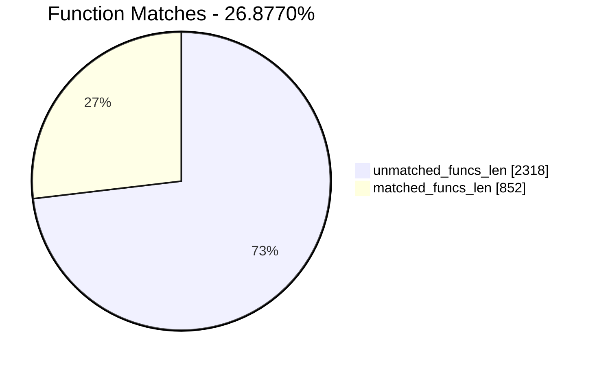
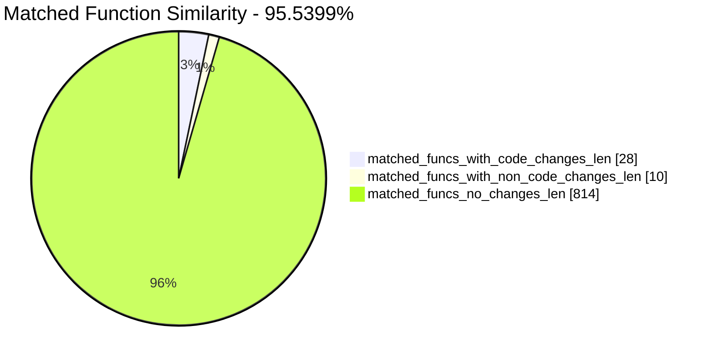
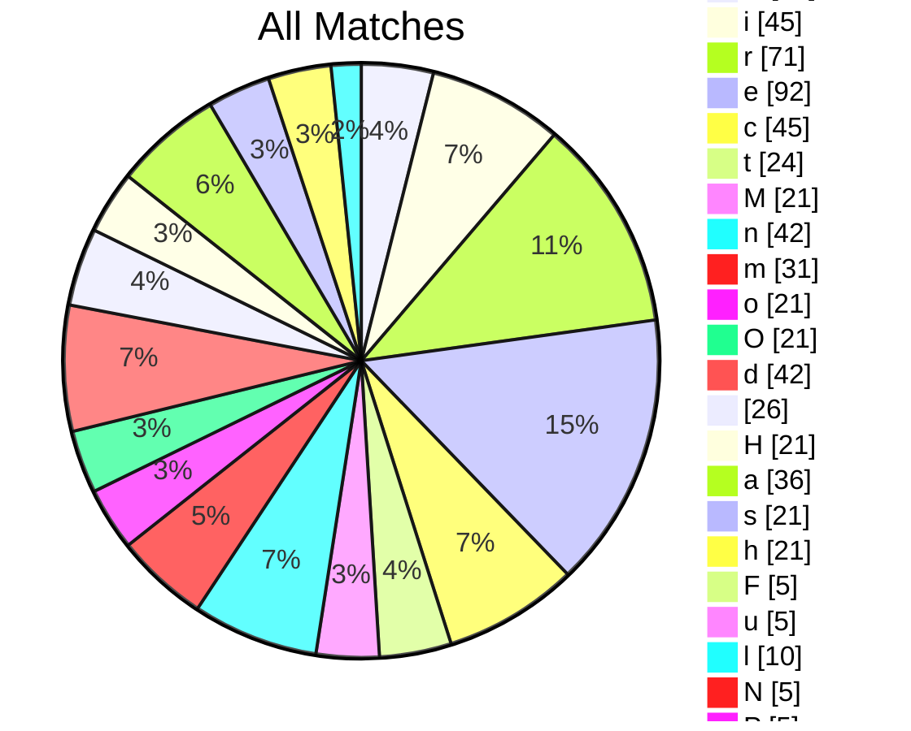
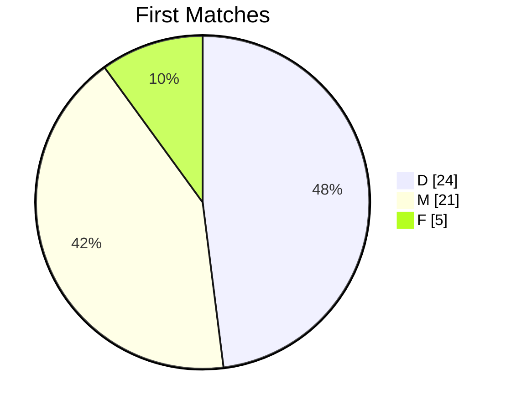
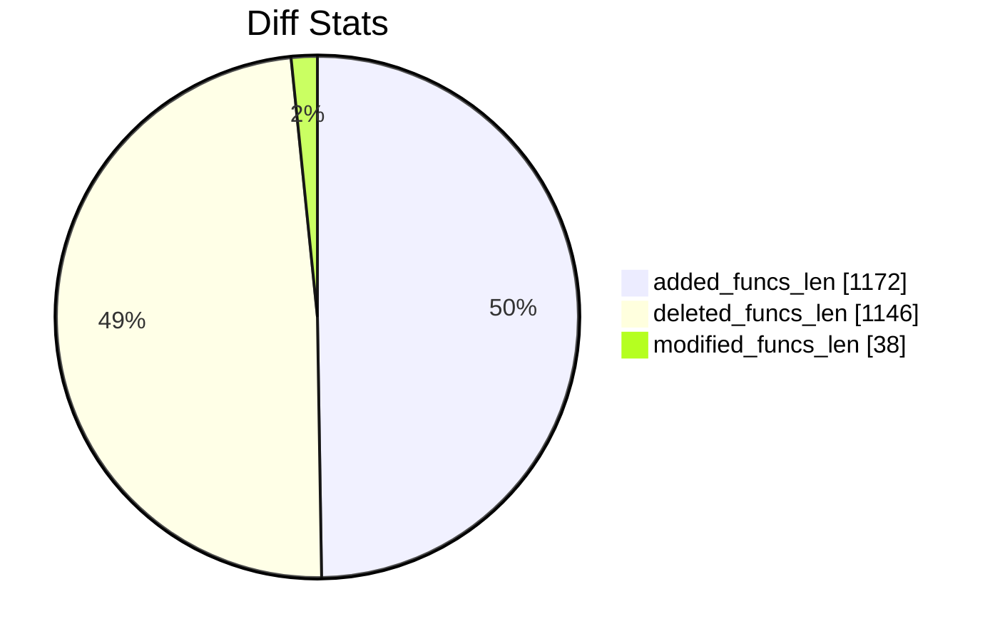
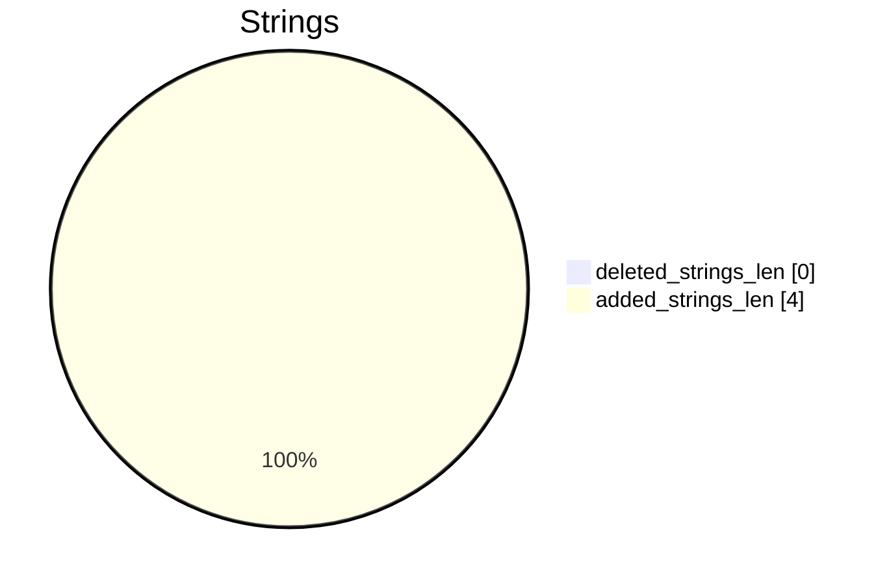

# UnRAR-7.12.exe-UnRAR-7.13.exe Diff

# TOC

* [Visual Chart Diff](#visual-chart-diff)
* [Metadata](#metadata)
	* [Ghidra Diff Engine](#ghidra-diff-engine)
		* [Command Line](#command-line)
	* [Binary Metadata Diff](#binary-metadata-diff)
	* [Program Options](#program-options)
	* [Diff Stats](#diff-stats)
	* [Strings](#strings)
* [Deleted](#deleted)
	* [FUN_14001a2f0](#fun_14001a2f0)
	* [FUN_14001a6e0](#fun_14001a6e0)
	* [FUN_14001ae00](#fun_14001ae00)
	* [FUN_14002b2a0](#fun_14002b2a0)
	* [FUN_14002b3a0](#fun_14002b3a0)
	* [FUN_14002b3e0](#fun_14002b3e0)
	* [FUN_14002b4a0](#fun_14002b4a0)
	* [FUN_14002b500](#fun_14002b500)
	* [FUN_14002b540](#fun_14002b540)
	* [FUN_140037f50](#fun_140037f50)
	* [__scrt_unhandled_exception_filter](#__scrt_unhandled_exception_filter)
	* [__DestructExceptionObject](#__destructexceptionobject)
	* [__FrameHandler3::CxxCallCatchBlock](#__framehandler3cxxcallcatchblock)
	* [FUN_1400484a0](#fun_1400484a0)
	* [__acrt_initialize_stdio](#__acrt_initialize_stdio)
	* [__acrt_initialize_clock](#__acrt_initialize_clock)
	* [__acrt_initialize_ptd](#__acrt_initialize_ptd)
	* [FUN_140053e50](#fun_140053e50)
	* [FUN_14005aeb0](#fun_14005aeb0)
	* [__acrt_initialize_fma3](#__acrt_initialize_fma3)
	* [FUN_14005f5b0](#fun_14005f5b0)
	* [FUN_140037a54](#fun_140037a54)
	* [FUN_14004f704](#fun_14004f704)
	* [FUN_14005564c](#fun_14005564c)
	* [FUN_14005a3f4](#fun_14005a3f4)
	* [FUN_14005c120](#fun_14005c120)
	* [FUN_140049b54](#fun_140049b54)
	* [FUN_1400033a0](#fun_1400033a0)
	* [FUN_140031114](#fun_140031114)
	* [FUN_140011764](#fun_140011764)
	* [FUN_140033f58](#fun_140033f58)
	* [FUN_14001b738](#fun_14001b738)
	* [FUN_14002ad58](#fun_14002ad58)
	* [FUN_14002ae20](#fun_14002ae20)
	* [FUN_1400280ec](#fun_1400280ec)
	* [FUN_14001ef68](#fun_14001ef68)
	* [FUN_140037b48](#fun_140037b48)
	* [FUN_14002c388](#fun_14002c388)
	* [FUN_14005730c](#fun_14005730c)
	* [FUN_1400573a0](#fun_1400573a0)
	* [_handle_nan](#_handle_nan)
	* [FUN_14002b0d0](#fun_14002b0d0)
	* [std::_Allocate_manually_vector_aligned<struct_std::_Default_allocate_traits>](#std_allocate_manually_vector_alignedstruct_std_default_allocate_traits)
	* [FUN_140001248](#fun_140001248)
	* [FUN_140001360](#fun_140001360)
	* [FUN_14000150c](#fun_14000150c)
	* [FUN_1400015f8](#fun_1400015f8)
	* [FUN_14000168c](#fun_14000168c)
	* [FUN_140001748](#fun_140001748)
	* [FUN_140001a84](#fun_140001a84)
	* [FUN_140001b94](#fun_140001b94)
	* [FUN_140001d20](#fun_140001d20)
	* [FUN_140002088](#fun_140002088)
	* [FUN_1400023d4](#fun_1400023d4)
	* [FUN_140002a88](#fun_140002a88)
	* [FUN_140003034](#fun_140003034)
	* [FUN_140003284](#fun_140003284)
	* [FUN_140003708](#fun_140003708)
	* [FUN_140003864](#fun_140003864)
	* [FUN_1400039ec](#fun_1400039ec)
	* [FUN_140003b50](#fun_140003b50)
	* [FUN_140003d40](#fun_140003d40)
	* [FUN_140003dcc](#fun_140003dcc)
	* [FUN_140003e48](#fun_140003e48)
	* [FUN_1400041e0](#fun_1400041e0)
	* [FUN_140004bf0](#fun_140004bf0)
	* [FUN_140005020](#fun_140005020)
	* [FUN_140005f0c](#fun_140005f0c)
	* [FUN_140006d14](#fun_140006d14)
	* [FUN_14000701c](#fun_14000701c)
	* [FUN_140007120](#fun_140007120)
	* [FUN_140007668](#fun_140007668)
	* [FUN_140007b9c](#fun_140007b9c)
	* [FUN_140008ed0](#fun_140008ed0)
	* [FUN_140009094](#fun_140009094)
	* [FUN_1400091e4](#fun_1400091e4)
	* [FUN_14000934c](#fun_14000934c)
	* [FUN_1400097b4](#fun_1400097b4)
	* [FUN_140009d68](#fun_140009d68)
	* [FUN_14000a158](#fun_14000a158)
	* [FUN_14000a400](#fun_14000a400)
	* [FUN_14000a73c](#fun_14000a73c)
	* [FUN_14000ad1c](#fun_14000ad1c)
	* [FUN_14000aec0](#fun_14000aec0)
	* [FUN_14000af6c](#fun_14000af6c)
	* [FUN_14000b094](#fun_14000b094)
	* [FUN_14000b19c](#fun_14000b19c)
	* [FUN_14000b64c](#fun_14000b64c)
	* [FUN_14000cce0](#fun_14000cce0)
	* [FUN_14000cdb4](#fun_14000cdb4)
	* [FUN_14000cee4](#fun_14000cee4)
	* [FUN_14000d31c](#fun_14000d31c)
	* [FUN_14000d648](#fun_14000d648)
	* [FID_conflict:_sprintf_p](#fid_conflict_sprintf_p)
	* [FUN_14000d724](#fun_14000d724)
	* [FUN_14000d7bc](#fun_14000d7bc)
	* [FUN_14000d820](#fun_14000d820)
	* [FUN_14000db60](#fun_14000db60)
	* [FUN_14000df0c](#fun_14000df0c)
	* [FUN_14000e1f0](#fun_14000e1f0)
	* [FUN_14000e3dc](#fun_14000e3dc)
	* [FUN_14000e624](#fun_14000e624)
	* [FUN_14000eab0](#fun_14000eab0)
	* [FUN_14000ec54](#fun_14000ec54)
	* [FUN_14000ecd0](#fun_14000ecd0)
	* [FUN_14000eee8](#fun_14000eee8)
	* [FUN_14000efe8](#fun_14000efe8)
	* [FUN_14000f640](#fun_14000f640)
	* [FUN_14000f694](#fun_14000f694)
	* [FUN_14000f744](#fun_14000f744)
	* [FUN_14000f92c](#fun_14000f92c)
	* [FUN_14000fc4c](#fun_14000fc4c)
	* [FUN_14000ffa8](#fun_14000ffa8)
	* [FUN_1400103b8](#fun_1400103b8)
	* [FUN_140010620](#fun_140010620)
	* [FUN_140010778](#fun_140010778)
	* [FUN_1400108b8](#fun_1400108b8)
	* [snprintf](#snprintf)
	* [FUN_140010a14](#fun_140010a14)
	* [FUN_140010fb0](#fun_140010fb0)
	* [FUN_140011174](#fun_140011174)
	* [FUN_140011264](#fun_140011264)
	* [FUN_1400112c8](#fun_1400112c8)
	* [FUN_140011414](#fun_140011414)
	* [FUN_1400114fc](#fun_1400114fc)
	* [FUN_140011674](#fun_140011674)
	* [FUN_1400117d4](#fun_1400117d4)
	* [FUN_140011a38](#fun_140011a38)
	* [FUN_140011aec](#fun_140011aec)
	* [FUN_140011b58](#fun_140011b58)
	* [FUN_140011c38](#fun_140011c38)
	* [FUN_140011d44](#fun_140011d44)
	* [FUN_140011de0](#fun_140011de0)
	* [FUN_140011e70](#fun_140011e70)
	* [FUN_140011fc4](#fun_140011fc4)
	* [FUN_140012188](#fun_140012188)
	* [FUN_140012e28](#fun_140012e28)
	* [FUN_1400130d4](#fun_1400130d4)
	* [FUN_140013954](#fun_140013954)
	* [FUN_140013e88](#fun_140013e88)
	* [FUN_140013f2c](#fun_140013f2c)
	* [FUN_1400140c8](#fun_1400140c8)
	* [FUN_140014300](#fun_140014300)
	* [FUN_1400144f0](#fun_1400144f0)
	* [FUN_1400145b8](#fun_1400145b8)
	* [FUN_140014748](#fun_140014748)
	* [FUN_140014838](#fun_140014838)
	* [FUN_1400149dc](#fun_1400149dc)
	* [FUN_140014d1c](#fun_140014d1c)
	* [FUN_140014f40](#fun_140014f40)
	* [FUN_1400151e8](#fun_1400151e8)
	* [FUN_140015988](#fun_140015988)
	* [FUN_140015c04](#fun_140015c04)
	* [FUN_140015fd8](#fun_140015fd8)
	* [FUN_140016224](#fun_140016224)
	* [FUN_140016338](#fun_140016338)
	* [FUN_140016a54](#fun_140016a54)
	* [FUN_140017208](#fun_140017208)
	* [FUN_140017324](#fun_140017324)
	* [FUN_1400190b0](#fun_1400190b0)
	* [FUN_1400193e0](#fun_1400193e0)
	* [FUN_14001959c](#fun_14001959c)
	* [FUN_140019874](#fun_140019874)
	* [FUN_140019954](#fun_140019954)
	* [FUN_140019a34](#fun_140019a34)
	* [FUN_140019c80](#fun_140019c80)
	* [FUN_14001a214](#fun_14001a214)
	* [FUN_14001a354](#fun_14001a354)
	* [FUN_14001a530](#fun_14001a530)
	* [FUN_14001af30](#fun_14001af30)
	* [FUN_14001b180](#fun_14001b180)
	* [FUN_14001b478](#fun_14001b478)
	* [FUN_14001b648](#fun_14001b648)
	* [FUN_14001b83c](#fun_14001b83c)
	* [FUN_14001b924](#fun_14001b924)
	* [FUN_14001ba14](#fun_14001ba14)
	* [FUN_14001bb4c](#fun_14001bb4c)
	* [FUN_14001bc10](#fun_14001bc10)
	* [FUN_14001bebc](#fun_14001bebc)
	* [FUN_14001c010](#fun_14001c010)
	* [FUN_14001c34c](#fun_14001c34c)
	* [FUN_14001c4e4](#fun_14001c4e4)
	* [FUN_14001c530](#fun_14001c530)
	* [FUN_14001c77c](#fun_14001c77c)
	* [FUN_14001c86c](#fun_14001c86c)
	* [FUN_14001ca54](#fun_14001ca54)
	* [FUN_14001cbe4](#fun_14001cbe4)
	* [FUN_14001ccd8](#fun_14001ccd8)
	* [FUN_14001cd88](#fun_14001cd88)
	* [FUN_14001d344](#fun_14001d344)
	* [FUN_14001d45c](#fun_14001d45c)
	* [FUN_14001d4c4](#fun_14001d4c4)
	* [FUN_14001d62c](#fun_14001d62c)
	* [FUN_14001d894](#fun_14001d894)
	* [FUN_14001d974](#fun_14001d974)
	* [FUN_14001dae4](#fun_14001dae4)
	* [FUN_14001ddf4](#fun_14001ddf4)
	* [FUN_14001e32c](#fun_14001e32c)
	* [FUN_14001e3f0](#fun_14001e3f0)
	* [FUN_14001e460](#fun_14001e460)
	* [FUN_14001e880](#fun_14001e880)
	* [Max Deleted Section Functions Reached Error](#max-deleted-section-functions-reached-error)
* [Added](#added)
	* [FUN_140003e70](#fun_140003e70)
	* [FUN_14001a210](#fun_14001a210)
	* [FUN_14001a620](#fun_14001a620)
	* [FUN_14001ad50](#fun_14001ad50)
	* [FUN_14002b130](#fun_14002b130)
	* [FUN_14002b210](#fun_14002b210)
	* [FUN_14002b240](#fun_14002b240)
	* [FUN_14002b340](#fun_14002b340)
	* [FUN_14002b370](#fun_14002b370)
	* [FUN_1400377f0](#fun_1400377f0)
	* [FUN_140045ac0](#fun_140045ac0)
	* [FUN_140045cb0](#fun_140045cb0)
	* [FUN_1400495a0](#fun_1400495a0)
	* [FUN_140049790](#fun_140049790)
	* [FUN_140050790](#fun_140050790)
	* [FUN_140050fd0](#fun_140050fd0)
	* [FUN_1400530e0](#fun_1400530e0)
	* [FUN_1400557d0](#fun_1400557d0)
	* [FUN_140056cb0](#fun_140056cb0)
	* [FUN_14005deb0](#fun_14005deb0)
	* [FUN_140060f00](#fun_140060f00)
	* [FUN_1400372b8](#fun_1400372b8)
	* [FUN_140051030](#fun_140051030)
	* [FUN_140043250](#fun_140043250)
	* [FUN_140043600](#fun_140043600)
	* [FUN_140043b10](#fun_140043b10)
	* [FUN_140043c70](#fun_140043c70)
	* [thunk_FUN_140043c70](#thunk_fun_140043c70)
	* [thunk_FUN_140043d70](#thunk_fun_140043d70)
	* [FUN_140043e70](#fun_140043e70)
	* [FUN_140044060](#fun_140044060)
	* [common_getenv<>](#common_getenv)
	* [FUN_140055658](#fun_140055658)
	* [KERNEL32.DLL::InitializeCriticalSectionEx](#kernel32dllinitializecriticalsectionex)
	* [FUN_1400570c0](#fun_1400570c0)
	* [FUN_14005bdc8](#fun_14005bdc8)
	* [FUN_14005d990](#fun_14005d990)
	* [FUN_140002f78](#fun_140002f78)
	* [FUN_14000320c](#fun_14000320c)
	* [FUN_140030ec8](#fun_140030ec8)
	* [FUN_14003384c](#fun_14003384c)
	* [FUN_140033734](#fun_140033734)
	* [FUN_14001b74c](#fun_14001b74c)
	* [FUN_140003030](#fun_140003030)
	* [FUN_14002ade8](#fun_14002ade8)
	* [FUN_140028074](#fun_140028074)
	* [FUN_1400030a4](#fun_1400030a4)
	* [strcmp](#strcmp)
	* [FUN_14001ef58](#fun_14001ef58)
	* [FUN_14000311c](#fun_14000311c)
	* [FUN_1400373c0](#fun_1400373c0)
	* [FUN_14002cab0](#fun_14002cab0)
	* [FUN_14002c1c0](#fun_14002c1c0)
	* [FUN_140058de8](#fun_140058de8)
	* [FUN_140058e68](#fun_140058e68)
	* [FUN_14002b058](#fun_14002b058)
	* [FUN_14000124c](#fun_14000124c)
	* [FUN_140001358](#fun_140001358)
	* [FUN_140001514](#fun_140001514)
	* [FUN_1400015e8](#fun_1400015e8)
	* [FUN_14000167c](#fun_14000167c)
	* [FUN_140001734](#fun_140001734)
	* [FUN_140001ae4](#fun_140001ae4)
	* [FUN_140001c00](#fun_140001c00)
	* [FUN_140001f94](#fun_140001f94)
	* [FUN_140002678](#fun_140002678)
	* [FUN_140002ba4](#fun_140002ba4)
	* [FUN_140002e24](#fun_140002e24)
	* [FUN_140003198](#fun_140003198)
	* [FUN_1400032c4](#fun_1400032c4)
	* [FUN_1400035ac](#fun_1400035ac)
	* [FUN_14000371c](#fun_14000371c)
	* [FUN_1400038b4](#fun_1400038b4)
	* [FUN_140003a2c](#fun_140003a2c)
	* [FUN_140003c30](#fun_140003c30)
	* [FUN_140003cac](#fun_140003cac)
	* [FUN_140004050](#fun_140004050)
	* [FUN_140004968](#fun_140004968)
	* [FUN_140004d78](#fun_140004d78)
	* [FUN_140005be4](#fun_140005be4)
	* [FUN_140006840](#fun_140006840)
	* [FUN_140006b44](#fun_140006b44)
	* [FUN_140006c44](#fun_140006c44)
	* [FUN_1400070ec](#fun_1400070ec)
	* [FUN_140007298](#fun_140007298)
	* [FUN_1400076b0](#fun_1400076b0)
	* [FUN_140008a50](#fun_140008a50)
	* [FUN_140008c38](#fun_140008c38)
	* [FUN_140008da0](#fun_140008da0)
	* [FUN_140008f14](#fun_140008f14)
	* [FUN_140009008](#fun_140009008)
	* [FUN_1400093c4](#fun_1400093c4)
	* [FUN_1400099b4](#fun_1400099b4)
	* [FUN_140009a5c](#fun_140009a5c)
	* [FUN_140009d04](#fun_140009d04)
	* [FUN_140009fa8](#fun_140009fa8)
	* [FUN_14000a30c](#fun_14000a30c)
	* [FUN_14000a904](#fun_14000a904)
	* [FUN_14000aafc](#fun_14000aafc)
	* [FUN_14000aba4](#fun_14000aba4)
	* [FUN_14000ad04](#fun_14000ad04)
	* [FUN_14000ae10](#fun_14000ae10)
	* [FUN_14000b294](#fun_14000b294)
	* [FUN_14000c8ec](#fun_14000c8ec)
	* [FUN_14000c9d0](#fun_14000c9d0)
	* [FUN_14000cb10](#fun_14000cb10)
	* [FUN_14000cf24](#fun_14000cf24)
	* [FUN_14000d248](#fun_14000d248)
	* [FUN_14000d2d4](#fun_14000d2d4)
	* [FUN_14000d32c](#fun_14000d32c)
	* [FUN_14000d444](#fun_14000d444)
	* [FUN_14000d4c8](#fun_14000d4c8)
	* [FUN_14000d81c](#fun_14000d81c)
	* [FUN_14000dbf0](#fun_14000dbf0)
	* [FUN_14000def8](#fun_14000def8)
	* [FUN_14000e0f4](#fun_14000e0f4)
	* [FUN_14000e358](#fun_14000e358)
	* [FUN_14000e824](#fun_14000e824)
	* [FUN_14000e9cc](#fun_14000e9cc)
	* [FUN_14000ea34](#fun_14000ea34)
	* [FUN_14000ec38](#fun_14000ec38)
	* [FUN_14000ed50](#fun_14000ed50)
	* [FUN_14000f39c](#fun_14000f39c)
	* [FUN_14000f49c](#fun_14000f49c)
	* [FUN_14000f680](#fun_14000f680)
	* [FUN_14000f994](#fun_14000f994)
	* [FUN_14000fd00](#fun_14000fd00)
	* [FUN_14001011c](#fun_14001011c)
	* [FUN_140010390](#fun_140010390)
	* [FUN_140010500](#fun_140010500)
	* [FUN_1400106cc](#fun_1400106cc)
	* [FUN_140010728](#fun_140010728)
	* [FUN_140010cd4](#fun_140010cd4)
	* [FUN_140010d70](#fun_140010d70)
	* [FUN_140010eb8](#fun_140010eb8)
	* [FUN_140011018](#fun_140011018)
	* [FUN_14001110c](#fun_14001110c)
	* [FUN_1400112a4](#fun_1400112a4)
	* [FUN_14001141c](#fun_14001141c)
	* [FUN_14001168c](#fun_14001168c)
	* [FUN_140011738](#fun_140011738)
	* [FUN_1400117b8](#fun_1400117b8)
	* [FUN_14001189c](#fun_14001189c)
	* [FUN_1400119b8](#fun_1400119b8)
	* [FUN_140011b24](#fun_140011b24)
	* [FUN_140011ce4](#fun_140011ce4)
	* [FUN_1400129c4](#fun_1400129c4)
	* [FUN_140012c84](#fun_140012c84)
	* [FUN_1400135c4](#fun_1400135c4)
	* [FUN_140013b10](#fun_140013b10)
	* [FUN_140013b9c](#fun_140013b9c)
	* [FUN_140013d58](#fun_140013d58)
	* [FUN_140013f94](#fun_140013f94)
	* [FUN_14001419c](#fun_14001419c)
	* [FUN_14001424c](#fun_14001424c)
	* [FUN_140014330](#fun_140014330)
	* [FUN_1400143bc](#fun_1400143bc)
	* [FUN_1400144e8](#fun_1400144e8)
	* [FUN_140014598](#fun_140014598)
	* [FUN_14001474c](#fun_14001474c)
	* [FUN_140014a8c](#fun_140014a8c)
	* [FUN_140014cc0](#fun_140014cc0)
	* [FUN_140014e60](#fun_140014e60)
	* [FUN_140015010](#fun_140015010)
	* [FUN_140015818](#fun_140015818)
	* [FUN_140015aa0](#fun_140015aa0)
	* [FUN_140015e84](#fun_140015e84)
	* [FUN_1400160e4](#fun_1400160e4)
	* [FUN_1400161f8](#fun_1400161f8)
	* [FUN_140016958](#fun_140016958)
	* [FUN_140017180](#fun_140017180)
	* [FUN_1400172a4](#fun_1400172a4)
	* [FUN_140018ff0](#fun_140018ff0)
	* [FUN_140019358](#fun_140019358)
	* [FUN_140019524](#fun_140019524)
	* [FUN_14001981c](#fun_14001981c)
	* [FUN_140019920](#fun_140019920)
	* [FUN_140019a14](#fun_140019a14)
	* [FUN_140019c4c](#fun_140019c4c)
	* [FUN_14001a130](#fun_14001a130)
	* [FUN_14001a27c](#fun_14001a27c)
	* [FUN_14001a468](#fun_14001a468)
	* [FUN_14001ae84](#fun_14001ae84)
	* [FUN_14001b0e4](#fun_14001b0e4)
	* [FUN_14001b15c](#fun_14001b15c)
	* [FUN_14001b46c](#fun_14001b46c)
	* [FUN_14001b64c](#fun_14001b64c)
	* [FUN_14001b860](#fun_14001b860)
	* [FUN_14001b958](#fun_14001b958)
	* [FUN_14001ba68](#fun_14001ba68)
	* [FUN_14001bbbc](#fun_14001bbbc)
	* [FUN_14001bc9c](#fun_14001bc9c)
	* [FUN_14001bf44](#fun_14001bf44)
	* [FUN_14001c0a8](#fun_14001c0a8)
	* [FUN_14001c304](#fun_14001c304)
	* [FUN_14001c4bc](#fun_14001c4bc)
	* [FUN_14001c508](#fun_14001c508)
	* [FUN_14001c75c](#fun_14001c75c)
	* [FUN_14001c85c](#fun_14001c85c)
	* [FUN_14001ca5c](#fun_14001ca5c)
	* [FUN_14001cb88](#fun_14001cb88)
	* [Max Added Section Functions Reached Error](#max-added-section-functions-reached-error)
* [Modified](#modified)
	* [FUN_1400010a0](#fun_1400010a0)
	* [FUN_140003444](#fun_140003444)
	* [FUN_140003524](#fun_140003524)
	* [FUN_140004000](#fun_140004000)
	* [FUN_140009e14](#fun_140009e14)
	* [FUN_1400110dc](#fun_1400110dc)
	* [FUN_1400113a8](#fun_1400113a8)
	* [FUN_14001d93c](#fun_14001d93c)
	* [FUN_14001dd70](#fun_14001dd70)
	* [FUN_140022044](#fun_140022044)
	* [FUN_140024864](#fun_140024864)
	* [FUN_140027134](#fun_140027134)
	* [FUN_140027550](#fun_140027550)
	* [FUN_14002c6b0](#fun_14002c6b0)
	* [FUN_14002d8dc](#fun_14002d8dc)
	* [FUN_140033e64](#fun_140033e64)
	* [FUN_140036d28](#fun_140036d28)
	* [FUN_1400388f0](#fun_1400388f0)
	* [FUN_140043d70](#fun_140043d70)
	* [FUN_140045a50](#fun_140045a50)
	* [FUN_140048938](#fun_140048938)
	* [FUN_14004aa28](#fun_14004aa28)
	* [FUN_1400510d0](#fun_1400510d0)
	* [FUN_140051110](#fun_140051110)
	* [FUN_140051150](#fun_140051150)
	* [FUN_140051258](#fun_140051258)
	* [FUN_140057480](#fun_140057480)
	* [wcsncmp](#wcsncmp)
* [Modified (No Code Changes)](#modified-no-code-changes)
	* [Section Skipped](#section-skipped)

# Visual Chart Diff

```mermaid

flowchart LR

FUN_1400010a0-1-old<--Match 8%-->FUN_1400010a0-1-new
FUN_140003444-1-old<--Match 35%-->FUN_140003444-1-new
FUN_140003524-2-old<--Match 46%-->FUN_140003524-2-new
FUN_140004000-2-old<--Match 12%-->FUN_140004000-2-new
FUN_140009e14-3-old<--Match 8%-->FUN_140009e14-3-new
FUN_1400110dc-4-old<--Match 27%-->FUN_1400110dc-4-new
FUN_1400113a8-2-old<--Match 8%-->FUN_1400113a8-2-new
FUN_14001d93c-2-old<--Match 10%-->FUN_14001d93c-2-new
FUN_14001dd70-3-old<--Match 95%-->FUN_14001dd70-3-new
FUN_140022044-2-old<--Match 12%-->FUN_140022044-2-new
FUN_140024864-3-old<--Match 11%-->FUN_140024864-3-new
FUN_140027134-2-old<--Match 11%-->FUN_140027134-2-new
FUN_140027550-3-old<--Match 22%-->FUN_140027550-3-new
FUN_14002c6b0-3-old<--Match 34%-->FUN_14002c6b0-3-new
FUN_14002d8dc-2-old<--Match 12%-->FUN_14002d8dc-2-new
FUN_140033e64-1-old<--Match 11%-->FUN_140033e64-1-new
FUN_140036d28-3-old<--Match 62%-->FUN_140036d28-3-new
FUN_1400388f0-2-old<--Match 5%-->FUN_1400388f0-2-new
FUN_140043d70-3-old<--Match 11%-->FUN_140043d70-3-new
FUN_140045a50-2-old<--Match 14%-->FUN_140045a50-2-new
FUN_140048938-4-old<--Match 38%-->FUN_140048938-4-new
FUN_14004aa28-1-old<--Match 43%-->FUN_14004aa28-1-new
FUN_1400510d0-2-old<--Match 57%-->FUN_1400510d0-2-new
FUN_140051110-2-old<--Match 27%-->FUN_140051110-2-new
FUN_140051150-2-old<--Match 7%-->FUN_140051150-2-new
FUN_140051258-5-old<--Match 11%-->FUN_140051258-5-new
UnRAR-7.12.exe<--3ommited-->UnRAR-7.13.exe

subgraph UnRAR-7.13.exe
    FUN_1400010a0-1-new
FUN_140003444-1-new
FUN_140003524-2-new
FUN_140004000-2-new
FUN_140009e14-3-new
FUN_1400110dc-4-new
FUN_1400113a8-2-new
FUN_14001d93c-2-new
FUN_14001dd70-3-new
FUN_140022044-2-new
FUN_140024864-3-new
FUN_140027134-2-new
FUN_140027550-3-new
FUN_14002c6b0-3-new
FUN_14002d8dc-2-new
FUN_140033e64-1-new
FUN_140036d28-3-new
FUN_1400388f0-2-new
FUN_140043d70-3-new
FUN_140045a50-2-new
FUN_140048938-4-new
FUN_14004aa28-1-new
FUN_1400510d0-2-new
FUN_140051110-2-new
FUN_140051150-2-new
FUN_140051258-5-new
    subgraph Added
direction LR
FUN_140003e70
    FUN_14001a210
    FUN_14001a620
    FUN_14001ad50
    FUN_14002b130
    FUN_14002b210
    FUN_14002b240
    FUN_14002b340
    FUN_14002b370
    FUN_1400377f0
    FUN_140045ac0
    FUN_140045cb0
    FUN_1400495a0
    FUN_140049790
    FUN_140050790
    FUN_140050fd0
    FUN_1400530e0
    FUN_1400557d0
    FUN_140056cb0
    FUN_14005deb0
    FUN_140060f00
    FUN_1400372b8
    FUN_140051030
    FUN_140043250
    FUN_140043600
    FUN_140043b10
    FUN_140043c70
    1147_more_added_funcs_omitted
end
end

subgraph UnRAR-7.12.exe
    FUN_1400010a0-1-old
FUN_140003444-1-old
FUN_140003524-2-old
FUN_140004000-2-old
FUN_140009e14-3-old
FUN_1400110dc-4-old
FUN_1400113a8-2-old
FUN_14001d93c-2-old
FUN_14001dd70-3-old
FUN_140022044-2-old
FUN_140024864-3-old
FUN_140027134-2-old
FUN_140027550-3-old
FUN_14002c6b0-3-old
FUN_14002d8dc-2-old
FUN_140033e64-1-old
FUN_140036d28-3-old
FUN_1400388f0-2-old
FUN_140043d70-3-old
FUN_140045a50-2-old
FUN_140048938-4-old
FUN_14004aa28-1-old
FUN_1400510d0-2-old
FUN_140051110-2-old
FUN_140051150-2-old
FUN_140051258-5-old
    subgraph Deleted
direction LR
FUN_14001a2f0
    FUN_14001a6e0
    FUN_14001ae00
    FUN_14002b2a0
    FUN_14002b3a0
    FUN_14002b3e0
    FUN_14002b4a0
    FUN_14002b500
    FUN_14002b540
    FUN_140037f50
    __scrt_unhandled_exception_filter
    __DestructExceptionObject
    __FrameHandler3-CxxCallCatchBlock
    FUN_1400484a0
    __acrt_initialize_stdio
    __acrt_initialize_clock
    __acrt_initialize_ptd
    FUN_140053e50
    FUN_14005aeb0
    __acrt_initialize_fma3
    FUN_14005f5b0
    FUN_140037a54
    FUN_14004f704
    FUN_14005564c
    FUN_14005a3f4
    FUN_14005c120
    FUN_140049b54
    1121_more_deleted_funcs_omitted
end
end

```










# Metadata

## Ghidra Diff Engine

### Command Line

#### Captured Command Line


```
ghidriff --project-location ghidra_projects --project-name ghidriff --symbols-path symbols --gzfs-path gzfs --threaded --log-level INFO --file-log-level INFO --log-path ghidriff.log --min-func-len 10 --gdt [] --bsim --max-ram-percent 60.0 --max-section-funcs 200 UnRAR-7.12.exe UnRAR-7.13.exe
```


#### Verbose Args


<details>

```
--old ['UnRAR-7.12.exe'] --new [['UnRAR-7.13.exe']] --engine StructualGraphDiff --output-path UnRARStruct/ --summary False --project-location ghidra_projects --project-name ghidriff --symbols-path symbols --gzfs-path gzfs --base-address None --program-options None --threaded True --force-analysis False --force-diff False --no-symbols False --log-level INFO --file-log-level INFO --log-path ghidriff.log --va False --min-func-len 10 --use-calling-counts False --gdt [] --bsim True --bsim-full False --max-ram-percent 60.0 --print-flags False --jvm-args None --side-by-side False --max-section-funcs 200 --md-title None
```


</details>

## Binary Metadata Diff


```diff
--- UnRAR-7.12.exe Meta
+++ UnRAR-7.13.exe Meta
@@ -1,42 +1,42 @@
-Program Name: UnRAR-7.12.exe
+Program Name: UnRAR-7.13.exe
 Language ID: x86:LE:64:default (4.6)
 Compiler ID: windows
 Processor: x86
 Endian: Little
 Address Size: 64
 Minimum Address: 140000000
 Maximum Address: ff0000184f
-# of Bytes: 591060
-# of Memory Blocks: 8
-# of Instructions: 100497
-# of Defined Data: 5190
-# of Functions: 1568
-# of Symbols: 11141
-# of Data Types: 561
-# of Data Type Categories: 41
+# of Bytes: 608172
+# of Memory Blocks: 9
+# of Instructions: 101804
+# of Defined Data: 5214
+# of Functions: 1602
+# of Symbols: 11362
+# of Data Types: 536
+# of Data Type Categories: 39
 Analyzed: true
 Compiler: visualstudio:unknown
 Created With Ghidra Version: 11.4
-Date Created: Fri Sep 19 21:38:14 MDT 2025
+Date Created: Fri Sep 19 21:38:28 MDT 2025
 Executable Format: Portable Executable (PE)
-Executable Location: /media/conntrack/Seagate1/git/horizon3ai/UnRAR-7.12.exe
-Executable MD5: 8146ea26c2180d9470abd491732eb501
-Executable SHA256: da6bba72f6eb4e7731a4d333283066d67e69bb9f8f65cca292e62e0ebc0aefe6
-FSRL: file:///media/conntrack/Seagate1/git/horizon3ai/UnRAR-7.12.exe?MD5=8146ea26c2180d9470abd491732eb501
+Executable Location: /media/conntrack/Seagate1/git/horizon3ai/UnRAR-7.13.exe
+Executable MD5: a2a9c5bd002410b68795f5be7bedb50a
+Executable SHA256: 0d6b63ab2cf10c9b55eabc046580fcbf36c85f9459d3c2316493315674aadc72
+FSRL: file:///media/conntrack/Seagate1/git/horizon3ai/UnRAR-7.13.exe?MD5=a2a9c5bd002410b68795f5be7bedb50a
 PDB Age: 1
 PDB File: UnRAR.pdb
-PDB GUID: 7931355d-c5b1-420b-bef1-d8e1b714ffea
+PDB GUID: e23d0139-3588-4936-96e0-c048b9f5176f
 PDB Version: RSDS
 PE Property[CompanyName]: Alexander Roshal
 PE Property[FileDescription]: Command line RAR
-PE Property[FileVersion]: 7.12.0
+PE Property[FileVersion]: 7.13.0
 PE Property[InternalName]: Command line RAR
 PE Property[LegalCopyright]: Copyright © Alexander Roshal 1993-2025
 PE Property[ProductName]: WinRAR
-PE Property[ProductVersion]: 7.12.0
+PE Property[ProductVersion]: 7.13.0
 PE Property[Translation]: 4e40409
 Preferred Root Namespace Category: 
 RTTI Found: true
 Relocatable: true
 SectionAlignment: 4096
 Should Ask To Analyze: false

```


## Program Options


<details>
<summary>Ghidra UnRAR-7.12.exe Decompiler Options</summary>


|Decompiler Option|Value|
| :---: | :---: |
|Prototype Evaluation|__fastcall|

</details>


<details>
<summary>Ghidra UnRAR-7.12.exe Specification extensions Options</summary>


|Specification extensions Option|Value|
| :---: | :---: |
|FormatVersion|0|
|VersionCounter|0|

</details>


<details>
<summary>Ghidra UnRAR-7.12.exe Analyzers Options</summary>


|Analyzers Option|Value|
| :---: | :---: |
|ASCII Strings|true|
|ASCII Strings.Create Strings Containing Existing Strings|true|
|ASCII Strings.Create Strings Containing References|true|
|ASCII Strings.Force Model Reload|false|
|ASCII Strings.Minimum String Length|LEN_5|
|ASCII Strings.Model File|StringModel.sng|
|ASCII Strings.Require Null Termination for String|true|
|ASCII Strings.Search Only in Accessible Memory Blocks|true|
|ASCII Strings.String Start Alignment|ALIGN_1|
|ASCII Strings.String end alignment|4|
|Aggressive Instruction Finder|false|
|Aggressive Instruction Finder.Create Analysis Bookmarks|true|
|Apply Data Archives|true|
|Apply Data Archives.Archive Chooser|[Auto-Detect]|
|Apply Data Archives.Create Analysis Bookmarks|true|
|Apply Data Archives.GDT User File Archive Path|None|
|Apply Data Archives.User Project Archive Path|None|
|Call Convention ID|true|
|Call Convention ID.Analysis Decompiler Timeout (sec)|60|
|Call-Fixup Installer|true|
|Condense Filler Bytes|false|
|Condense Filler Bytes.Filler Value|Auto|
|Condense Filler Bytes.Minimum number of sequential bytes|1|
|Create Address Tables|true|
|Create Address Tables.Allow Offcut References|false|
|Create Address Tables.Auto Label Table|false|
|Create Address Tables.Create Analysis Bookmarks|true|
|Create Address Tables.Maxmimum Pointer Distance|16777215|
|Create Address Tables.Minimum Pointer Address|4132|
|Create Address Tables.Minimum Table Size|2|
|Create Address Tables.Pointer Alignment|1|
|Create Address Tables.Relocation Table Guide|true|
|Create Address Tables.Table Alignment|4|
|Data Reference|true|
|Data Reference.Address Table Alignment|1|
|Data Reference.Address Table Minimum Size|2|
|Data Reference.Align End of Strings|false|
|Data Reference.Ascii String References|true|
|Data Reference.Create Address Tables|true|
|Data Reference.Minimum String Length|5|
|Data Reference.References to Pointers|true|
|Data Reference.Relocation Table Guide|true|
|Data Reference.Respect Execute Flag|true|
|Data Reference.Subroutine References|true|
|Data Reference.Switch Table References|false|
|Data Reference.Unicode String References|true|
|Decompiler Parameter ID|true|
|Decompiler Parameter ID.Analysis Clear Level|ANALYSIS|
|Decompiler Parameter ID.Analysis Decompiler Timeout (sec)|60|
|Decompiler Parameter ID.Commit Data Types|true|
|Decompiler Parameter ID.Commit Void Return Values|false|
|Decompiler Parameter ID.Prototype Evaluation|__fastcall|
|Decompiler Switch Analysis|true|
|Decompiler Switch Analysis.Analysis Decompiler Timeout (sec)|60|
|Demangler Microsoft|true|
|Demangler Microsoft.Apply Function Calling Conventions|true|
|Demangler Microsoft.Apply Function Signatures|true|
|Demangler Microsoft.C-Style Symbol Interpretation|FUNCTION_IF_EXISTS|
|Demangler Microsoft.Demangle Only Known Mangled Symbols|false|
|Disassemble Entry Points|true|
|Disassemble Entry Points.Respect Execute Flag|true|
|Embedded Media|true|
|Embedded Media.Create Analysis Bookmarks|true|
|External Entry References|true|
|Function ID|true|
|Function ID.Always Apply FID Labels|false|
|Function ID.Create Analysis Bookmarks|true|
|Function ID.Instruction Count Threshold|14.6|
|Function ID.Multiple Match Threshold|30.0|
|Function Start Search|true|
|Function Start Search.Bookmark Functions|false|
|Function Start Search.Search Data Blocks|false|
|Non-Returning Functions - Discovered|true|
|Non-Returning Functions - Discovered.Create Analysis Bookmarks|true|
|Non-Returning Functions - Discovered.Function Non-return Threshold|3|
|Non-Returning Functions - Discovered.Repair Flow Damage|true|
|Non-Returning Functions - Known|true|
|Non-Returning Functions - Known.Create Analysis Bookmarks|true|
|PDB MSDIA|false|
|PDB MSDIA.Search untrusted symbol servers|false|
|PDB Universal|true|
|PDB Universal.Import Source Line Info|true|
|PDB Universal.Search untrusted symbol servers|false|
|Reference|true|
|Reference.Address Table Alignment|1|
|Reference.Address Table Minimum Size|2|
|Reference.Align End of Strings|false|
|Reference.Ascii String References|true|
|Reference.Create Address Tables|true|
|Reference.Minimum String Length|5|
|Reference.References to Pointers|true|
|Reference.Relocation Table Guide|true|
|Reference.Respect Execute Flag|true|
|Reference.Subroutine References|true|
|Reference.Switch Table References|false|
|Reference.Unicode String References|true|
|Scalar Operand References|true|
|Scalar Operand References.Relocation Table Guide|true|
|Shared Return Calls|true|
|Shared Return Calls.Allow Conditional Jumps|false|
|Shared Return Calls.Assume Contiguous Functions Only|true|
|Stack|true|
|Stack.Create Local Variables|true|
|Stack.Create Param Variables|false|
|Stack.Max Threads|2|
|Stack.useNewFunctionStackAnalysis|true|
|Subroutine References|true|
|Subroutine References.Create Thunks Early|true|
|Variadic Function Signature Override|false|
|Variadic Function Signature Override.Create Analysis Bookmarks|false|
|Windows x86 PE Exception Handling|true|
|Windows x86 PE RTTI Analyzer|true|
|Windows x86 Thread Environment Block (TEB) Analyzer|true|
|Windows x86 Thread Environment Block (TEB) Analyzer.Starting Address of the TEB||
|Windows x86 Thread Environment Block (TEB) Analyzer.Windows OS Version|Windows 7|
|WindowsPE x86 Propagate External Parameters|false|
|WindowsResourceReference|true|
|WindowsResourceReference.Create Analysis Bookmarks|true|
|x86 Constant Reference Analyzer|true|
|x86 Constant Reference Analyzer.Create Data from pointer|false|
|x86 Constant Reference Analyzer.Function parameter/return Pointer analysis|true|
|x86 Constant Reference Analyzer.Max Threads|2|
|x86 Constant Reference Analyzer.Min absolute reference|4|
|x86 Constant Reference Analyzer.Require pointer param data type|false|
|x86 Constant Reference Analyzer.Speculative reference max|256|
|x86 Constant Reference Analyzer.Speculative reference min|1024|
|x86 Constant Reference Analyzer.Stored Value Pointer analysis|true|
|x86 Constant Reference Analyzer.Trust values read from writable memory|true|

</details>


<details>
<summary>Ghidra UnRAR-7.13.exe Decompiler Options</summary>


|Decompiler Option|Value|
| :---: | :---: |
|Prototype Evaluation|__fastcall|

</details>


<details>
<summary>Ghidra UnRAR-7.13.exe Specification extensions Options</summary>


|Specification extensions Option|Value|
| :---: | :---: |
|FormatVersion|0|
|VersionCounter|0|

</details>


<details>
<summary>Ghidra UnRAR-7.13.exe Analyzers Options</summary>


|Analyzers Option|Value|
| :---: | :---: |
|ASCII Strings|true|
|ASCII Strings.Create Strings Containing Existing Strings|true|
|ASCII Strings.Create Strings Containing References|true|
|ASCII Strings.Force Model Reload|false|
|ASCII Strings.Minimum String Length|LEN_5|
|ASCII Strings.Model File|StringModel.sng|
|ASCII Strings.Require Null Termination for String|true|
|ASCII Strings.Search Only in Accessible Memory Blocks|true|
|ASCII Strings.String Start Alignment|ALIGN_1|
|ASCII Strings.String end alignment|4|
|Aggressive Instruction Finder|false|
|Aggressive Instruction Finder.Create Analysis Bookmarks|true|
|Apply Data Archives|true|
|Apply Data Archives.Archive Chooser|[Auto-Detect]|
|Apply Data Archives.Create Analysis Bookmarks|true|
|Apply Data Archives.GDT User File Archive Path|None|
|Apply Data Archives.User Project Archive Path|None|
|Call Convention ID|true|
|Call Convention ID.Analysis Decompiler Timeout (sec)|60|
|Call-Fixup Installer|true|
|Condense Filler Bytes|false|
|Condense Filler Bytes.Filler Value|Auto|
|Condense Filler Bytes.Minimum number of sequential bytes|1|
|Create Address Tables|true|
|Create Address Tables.Allow Offcut References|false|
|Create Address Tables.Auto Label Table|false|
|Create Address Tables.Create Analysis Bookmarks|true|
|Create Address Tables.Maxmimum Pointer Distance|16777215|
|Create Address Tables.Minimum Pointer Address|4132|
|Create Address Tables.Minimum Table Size|2|
|Create Address Tables.Pointer Alignment|1|
|Create Address Tables.Relocation Table Guide|true|
|Create Address Tables.Table Alignment|4|
|Data Reference|true|
|Data Reference.Address Table Alignment|1|
|Data Reference.Address Table Minimum Size|2|
|Data Reference.Align End of Strings|false|
|Data Reference.Ascii String References|true|
|Data Reference.Create Address Tables|true|
|Data Reference.Minimum String Length|5|
|Data Reference.References to Pointers|true|
|Data Reference.Relocation Table Guide|true|
|Data Reference.Respect Execute Flag|true|
|Data Reference.Subroutine References|true|
|Data Reference.Switch Table References|false|
|Data Reference.Unicode String References|true|
|Decompiler Parameter ID|true|
|Decompiler Parameter ID.Analysis Clear Level|ANALYSIS|
|Decompiler Parameter ID.Analysis Decompiler Timeout (sec)|60|
|Decompiler Parameter ID.Commit Data Types|true|
|Decompiler Parameter ID.Commit Void Return Values|false|
|Decompiler Parameter ID.Prototype Evaluation|__fastcall|
|Decompiler Switch Analysis|true|
|Decompiler Switch Analysis.Analysis Decompiler Timeout (sec)|60|
|Demangler Microsoft|true|
|Demangler Microsoft.Apply Function Calling Conventions|true|
|Demangler Microsoft.Apply Function Signatures|true|
|Demangler Microsoft.C-Style Symbol Interpretation|FUNCTION_IF_EXISTS|
|Demangler Microsoft.Demangle Only Known Mangled Symbols|false|
|Disassemble Entry Points|true|
|Disassemble Entry Points.Respect Execute Flag|true|
|Embedded Media|true|
|Embedded Media.Create Analysis Bookmarks|true|
|External Entry References|true|
|Function ID|true|
|Function ID.Always Apply FID Labels|false|
|Function ID.Create Analysis Bookmarks|true|
|Function ID.Instruction Count Threshold|14.6|
|Function ID.Multiple Match Threshold|30.0|
|Function Start Search|true|
|Function Start Search.Bookmark Functions|false|
|Function Start Search.Search Data Blocks|false|
|Non-Returning Functions - Discovered|true|
|Non-Returning Functions - Discovered.Create Analysis Bookmarks|true|
|Non-Returning Functions - Discovered.Function Non-return Threshold|3|
|Non-Returning Functions - Discovered.Repair Flow Damage|true|
|Non-Returning Functions - Known|true|
|Non-Returning Functions - Known.Create Analysis Bookmarks|true|
|PDB MSDIA|false|
|PDB MSDIA.Search untrusted symbol servers|false|
|PDB Universal|true|
|PDB Universal.Import Source Line Info|true|
|PDB Universal.Search untrusted symbol servers|false|
|Reference|true|
|Reference.Address Table Alignment|1|
|Reference.Address Table Minimum Size|2|
|Reference.Align End of Strings|false|
|Reference.Ascii String References|true|
|Reference.Create Address Tables|true|
|Reference.Minimum String Length|5|
|Reference.References to Pointers|true|
|Reference.Relocation Table Guide|true|
|Reference.Respect Execute Flag|true|
|Reference.Subroutine References|true|
|Reference.Switch Table References|false|
|Reference.Unicode String References|true|
|Scalar Operand References|true|
|Scalar Operand References.Relocation Table Guide|true|
|Shared Return Calls|true|
|Shared Return Calls.Allow Conditional Jumps|false|
|Shared Return Calls.Assume Contiguous Functions Only|true|
|Stack|true|
|Stack.Create Local Variables|true|
|Stack.Create Param Variables|false|
|Stack.Max Threads|2|
|Stack.useNewFunctionStackAnalysis|true|
|Subroutine References|true|
|Subroutine References.Create Thunks Early|true|
|Variadic Function Signature Override|false|
|Variadic Function Signature Override.Create Analysis Bookmarks|false|
|Windows x86 PE Exception Handling|true|
|Windows x86 PE RTTI Analyzer|true|
|Windows x86 Thread Environment Block (TEB) Analyzer|true|
|Windows x86 Thread Environment Block (TEB) Analyzer.Starting Address of the TEB||
|Windows x86 Thread Environment Block (TEB) Analyzer.Windows OS Version|Windows 7|
|WindowsPE x86 Propagate External Parameters|false|
|WindowsResourceReference|true|
|WindowsResourceReference.Create Analysis Bookmarks|true|
|x86 Constant Reference Analyzer|true|
|x86 Constant Reference Analyzer.Create Data from pointer|false|
|x86 Constant Reference Analyzer.Function parameter/return Pointer analysis|true|
|x86 Constant Reference Analyzer.Max Threads|2|
|x86 Constant Reference Analyzer.Min absolute reference|4|
|x86 Constant Reference Analyzer.Require pointer param data type|false|
|x86 Constant Reference Analyzer.Speculative reference max|256|
|x86 Constant Reference Analyzer.Speculative reference min|1024|
|x86 Constant Reference Analyzer.Stored Value Pointer analysis|true|
|x86 Constant Reference Analyzer.Trust values read from writable memory|true|

</details>

## Diff Stats


|Stat|Value|
| :---: | :---: |
|added_funcs_len|1172|
|deleted_funcs_len|1146|
|modified_funcs_len|38|
|added_symbols_len|0|
|deleted_symbols_len|0|
|diff_time|288.127831697464|
|deleted_strings_len|0|
|added_strings_len|4|
|match_types|Counter({'e': 92, 'r': 71, 'i': 45, 'c': 45, 'n': 42, 'd': 42, 'a': 36, 'm': 31, ':': 26, 'D': 24, 't': 24, 'M': 21, 'o': 21, 'O': 21, 'H': 21, 's': 21, 'h': 21, 'l': 10, 'F': 5, 'u': 5, 'N': 5, 'P': 5})|
|items_to_process|2356|
|diff_types|Counter({'calling': 38, 'length': 37, 'sig': 35, 'called': 34, 'code': 28, 'refcount': 24, 'address': 10, 'name': 9, 'fullname': 9})|
|unmatched_funcs_len|2318|
|total_funcs_len|3170|
|matched_funcs_len|852|
|matched_funcs_with_code_changes_len|28|
|matched_funcs_with_non_code_changes_len|10|
|matched_funcs_no_changes_len|814|
|match_func_similarity_percent|95.5399%|
|func_match_overall_percent|26.8770%|
|first_matches|Counter({'D': 24, 'M': 21, 'F': 5})|











```mermaid
pie showData
    title Symbols
"added_symbols_len" : 0
"deleted_symbols_len" : 0
```

## Strings




### Strings Diff


```diff
--- deleted strings
+++ added strings
@@ -0,0 +1,4 @@
+s_*<-?->
+s_FlsGetValue2
+u_api-ms-win-core-fibers-l1-1-2
+u_api-ms-win-core-file-l2-1-4

```


### String References

#### Old


|String|Ref Count|Ref Func|
| :---: | :---: | :---: |

#### New


|String|Ref Count|Ref Func|
| :---: | :---: | :---: |
|s_FlsGetValue2_14006a650|2|FUN_140055800|
|u_api-ms-win-core-fibers-l1-1-2_14006a130|1||
|u_api-ms-win-core-file-l2-1-4_14006a1e0|1||
|s_*<-?->_140062948|1|FUN_14001fd08|

# Deleted

## FUN_14001a2f0

### Function Meta


|Key|UnRAR-7.12.exe|
| :---: | :---: |
|name|FUN_14001a2f0|
|fullname|FUN_14001a2f0|
|refcount|15|
|length|100|
|called|FUN_140011264<br>KERNEL32.DLL::CloseHandle|
|calling|<details><summary>Expand for full list:<br>FUN_140012188<br>FUN_140013394<br>FUN_140013954<br>FUN_1400151e8<br>FUN_140017324<br>FUN_140019c80<br>FUN_14001a26c<br>FUN_1400214cc<br>FUN_14002850c<br>FUN_140028694<br>FUN_140028b38</summary></details>|
|paramcount|4|
|address|14001a2f0|
|sig|bool __fastcall FUN_14001a2f0(longlong param_1, undefined8 param_2, longlong param_3, longlong param_4)|
|sym_type|Function|
|sym_source|DEFAULT|
|external|False|

## FUN_14001a6e0

### Function Meta


|Key|UnRAR-7.12.exe|
| :---: | :---: |
|name|FUN_14001a6e0|
|fullname|FUN_14001a6e0|
|refcount|14|
|length|620|
|called|FUN_140002290<br>FUN_140023f58<br>FUN_1400439d0<br>FUN_140049b54<br>KERNEL32.DLL::CreateFileW<br>KERNEL32.DLL::GetLastError<br>KERNEL32.DLL::SetFileTime<br>thunk_FUN_14004f778|
|calling|FUN_140002fd0<br>FUN_140013394<br>FUN_140013954<br>FUN_1400190b0<br>FUN_14001cd88<br>FUN_140021a84<br>FUN_140028694<br>FUN_14002a8f4<br>FUN_14002ab48<br>FUN_14002b88c|
|paramcount|3|
|address|14001a6e0|
|sig|undefined __fastcall FUN_14001a6e0(longlong param_1, LPCWSTR param_2, ulonglong param_3)|
|sym_type|Function|
|sym_source|DEFAULT|
|external|False|

## FUN_14001ae00

### Function Meta


|Key|UnRAR-7.12.exe|
| :---: | :---: |
|name|FUN_14001ae00|
|fullname|FUN_14001ae00|
|refcount|8|
|length|174|
|called|FUN_140011728<br>KERNEL32.DLL::GetLastError<br>KERNEL32.DLL::SetFilePointer|
|calling|FUN_140003250<br>FUN_1400263e0<br>FUN_140028b38<br>FUN_14002a8f4<br>FUN_14002b88c|
|paramcount|4|
|address|14001ae00|
|sig|undefined8 __fastcall FUN_14001ae00(longlong param_1, undefined8 param_2, longlong param_3, longlong param_4)|
|sym_type|Function|
|sym_source|DEFAULT|
|external|False|

## FUN_14002b2a0

### Function Meta


|Key|UnRAR-7.12.exe|
| :---: | :---: |
|name|FUN_14002b2a0|
|fullname|FUN_14002b2a0|
|refcount|3|
|length|241|
|called|FUN_140034104<br>FUN_1400439d0<br>FUN_140045c60|
|calling||
|paramcount|2|
|address|14002b2a0|
|sig|undefined __fastcall FUN_14002b2a0(longlong * param_1, longlong * param_2)|
|sym_type|Function|
|sym_source|DEFAULT|
|external|False|

## FUN_14002b3a0

### Function Meta


|Key|UnRAR-7.12.exe|
| :---: | :---: |
|name|FUN_14002b3a0|
|fullname|FUN_14002b3a0|
|refcount|2|
|length|55|
|called||
|calling||
|paramcount|2|
|address|14002b3a0|
|sig|uint __fastcall FUN_14002b3a0(longlong * param_1, longlong * param_2)|
|sym_type|Function|
|sym_source|DEFAULT|
|external|False|

## FUN_14002b3e0

### Function Meta


|Key|UnRAR-7.12.exe|
| :---: | :---: |
|name|FUN_14002b3e0|
|fullname|FUN_14002b3e0|
|refcount|4|
|length|186|
|called|FUN_140034104<br>FUN_1400439d0<br>FUN_140045c60|
|calling||
|paramcount|2|
|address|14002b3e0|
|sig|undefined __fastcall FUN_14002b3e0(longlong param_1, longlong * param_2)|
|sym_type|Function|
|sym_source|DEFAULT|
|external|False|

## FUN_14002b4a0

### Function Meta


|Key|UnRAR-7.12.exe|
| :---: | :---: |
|name|FUN_14002b4a0|
|fullname|FUN_14002b4a0|
|refcount|3|
|length|43|
|called||
|calling||
|paramcount|2|
|address|14002b4a0|
|sig|uint __fastcall FUN_14002b4a0(byte * param_1, longlong * param_2)|
|sym_type|Function|
|sym_source|DEFAULT|
|external|False|

## FUN_14002b500

### Function Meta


|Key|UnRAR-7.12.exe|
| :---: | :---: |
|name|FUN_14002b500|
|fullname|FUN_14002b500|
|refcount|2|
|length|59|
|called||
|calling||
|paramcount|2|
|address|14002b500|
|sig|uint __fastcall FUN_14002b500(longlong * param_1, longlong * param_2)|
|sym_type|Function|
|sym_source|DEFAULT|
|external|False|

## FUN_14002b540

### Function Meta


|Key|UnRAR-7.12.exe|
| :---: | :---: |
|name|FUN_14002b540|
|fullname|FUN_14002b540|
|refcount|3|
|length|46|
|called||
|calling||
|paramcount|2|
|address|14002b540|
|sig|uint __fastcall FUN_14002b540(byte * param_1, longlong * param_2)|
|sym_type|Function|
|sym_source|DEFAULT|
|external|False|

## FUN_140037f50

### Function Meta


|Key|UnRAR-7.12.exe|
| :---: | :---: |
|name|FUN_140037f50|
|fullname|FUN_140037f50|
|refcount|3|
|length|37|
|called|FUN_14001d894|
|calling||
|paramcount|1|
|address|140037f50|
|sig|longlong __fastcall FUN_140037f50(longlong param_1)|
|sym_type|Function|
|sym_source|DEFAULT|
|external|False|

## __scrt_unhandled_exception_filter

### Function Meta


|Key|UnRAR-7.12.exe|
| :---: | :---: |
|name|__scrt_unhandled_exception_filter|
|fullname|__scrt_unhandled_exception_filter|
|refcount|3|
|length|91|
|called|FUN_140050304<br>__current_exception<br>__current_exception_context|
|calling||
|paramcount|1|
|address|140044870|
|sig|undefined8 __fastcall __scrt_unhandled_exception_filter(undefined8 * param_1)|
|sym_type|Function|
|sym_source|ANALYSIS|
|external|False|

## __DestructExceptionObject

### Function Meta


|Key|UnRAR-7.12.exe|
| :---: | :---: |
|name|__DestructExceptionObject|
|fullname|__DestructExceptionObject|
|refcount|10|
|length|107|
|called|FUN_140044ac0<br>_guard_dispatch_icall|
|calling|FUN_140045cdc<br>FUN_1400469fc<br>FUN_140046ecc<br>FUN_1400484a0<br>__FrameHandler3::CxxCallCatchBlock|
|paramcount|1|
|address|140044a50|
|sig|undefined __fastcall __DestructExceptionObject(int * param_1)|
|sym_type|Function|
|sym_source|ANALYSIS|
|external|False|

## __FrameHandler3::CxxCallCatchBlock

### Function Meta


|Key|UnRAR-7.12.exe|
| :---: | :---: |
|name|CxxCallCatchBlock|
|fullname|__FrameHandler3::CxxCallCatchBlock|
|refcount|4|
|length|370|
|called|_CallSettingFrame<br>_CreateFrameInfo<br>_FindAndUnlinkFrame<br>_IsExceptionObjectToBeDestroyed<br>__DestructExceptionObject<br>__except_validate_context_record<br>__vcrt_getptd|
|calling||
|paramcount|1|
|address|1400482b0|
|sig|void * __cdecl CxxCallCatchBlock(_EXCEPTION_RECORD * param_1)|
|sym_type|Function|
|sym_source|ANALYSIS|
|external|False|

## FUN_1400484a0

### Function Meta


|Key|UnRAR-7.12.exe|
| :---: | :---: |
|name|FUN_1400484a0|
|fullname|FUN_1400484a0|
|refcount|4|
|length|463|
|called|FUN_1400496a0<br>FUN_1400496d0<br>_CreateFrameInfo<br>_FindAndUnlinkFrame<br>_IsExceptionObjectToBeDestroyed<br>__DestructExceptionObject<br>__except_validate_context_record<br>__vcrt_getptd<br>abort|
|calling||
|paramcount|1|
|address|1400484a0|
|sig|longlong __fastcall FUN_1400484a0(longlong param_1)|
|sym_type|Function|
|sym_source|DEFAULT|
|external|False|

## __acrt_initialize_stdio

### Function Meta


|Key|UnRAR-7.12.exe|
| :---: | :---: |
|name|__acrt_initialize_stdio|
|fullname|__acrt_initialize_stdio|
|refcount|3|
|length|287|
|called|FUN_140052458<br>FUN_140053c8c<br>_calloc_base|
|calling||
|paramcount|0|
|address|14004ee70|
|sig|undefined8 __fastcall __acrt_initialize_stdio(void)|
|sym_type|Function|
|sym_source|ANALYSIS|
|external|False|

## __acrt_initialize_clock

### Function Meta


|Key|UnRAR-7.12.exe|
| :---: | :---: |
|name|__acrt_initialize_clock|
|fullname|__acrt_initialize_clock|
|refcount|3|
|length|83|
|called|KERNEL32.DLL::QueryPerformanceCounter<br>KERNEL32.DLL::QueryPerformanceFrequency|
|calling||
|paramcount|0|
|address|14004f6b0|
|sig|undefined8 __fastcall __acrt_initialize_clock(void)|
|sym_type|Function|
|sym_source|ANALYSIS|
|external|False|

## __acrt_initialize_ptd

### Function Meta


|Key|UnRAR-7.12.exe|
| :---: | :---: |
|name|__acrt_initialize_ptd|
|fullname|__acrt_initialize_ptd|
|refcount|3|
|length|57|
|called|FUN_140051bb8<br>KERNEL32.DLL::FlsAlloc<br>__acrt_uninitialize_ptd|
|calling||
|paramcount|0|
|address|140051d40|
|sig|undefined8 __fastcall __acrt_initialize_ptd(void)|
|sym_type|Function|
|sym_source|ANALYSIS|
|external|False|

## FUN_140053e50

### Function Meta


|Key|UnRAR-7.12.exe|
| :---: | :---: |
|name|FUN_140053e50|
|fullname|FUN_140053e50|
|refcount|3|
|length|35|
|called||
|calling||
|paramcount|0|
|address|140053e50|
|sig|undefined8 __fastcall FUN_140053e50(void)|
|sym_type|Function|
|sym_source|DEFAULT|
|external|False|

## FUN_14005aeb0

### Function Meta


|Key|UnRAR-7.12.exe|
| :---: | :---: |
|name|FUN_14005aeb0|
|fullname|FUN_14005aeb0|
|refcount|3|
|length|23|
|called|__acrt_initialize_multibyte|
|calling||
|paramcount|0|
|address|14005aeb0|
|sig|bool __fastcall FUN_14005aeb0(void)|
|sym_type|Function|
|sym_source|DEFAULT|
|external|False|

## __acrt_initialize_fma3

### Function Meta


|Key|UnRAR-7.12.exe|
| :---: | :---: |
|name|__acrt_initialize_fma3|
|fullname|__acrt_initialize_fma3|
|refcount|3|
|length|112|
|called||
|calling||
|paramcount|0|
|address|14005c630|
|sig|undefined8 __fastcall __acrt_initialize_fma3(void)|
|sym_type|Function|
|sym_source|ANALYSIS|
|external|False|

## FUN_14005f5b0

### Function Meta


|Key|UnRAR-7.12.exe|
| :---: | :---: |
|name|FUN_14005f5b0|
|fullname|FUN_14005f5b0|
|refcount|3|
|length|51|
|called|KERNEL32.DLL::FreeLibrary|
|calling||
|paramcount|0|
|address|14005f5b0|
|sig|undefined __fastcall FUN_14005f5b0(void)|
|sym_type|Function|
|sym_source|DEFAULT|
|external|False|

## FUN_140037a54

### Function Meta


|Key|UnRAR-7.12.exe|
| :---: | :---: |
|name|FUN_140037a54|
|fullname|FUN_140037a54|
|refcount|19|
|length|224|
|called|KERNEL32.DLL::CompareStringW|
|calling|FUN_14000b094<br>FUN_14000b64c<br>FUN_140016a54<br>FUN_140019c80<br>FUN_1400214cc<br>FUN_140021730<br>FUN_1400220a4<br>FUN_1400342fc<br>FUN_140034500|
|paramcount|2|
|address|140037a54|
|sig|int __fastcall FUN_140037a54(PCNZWCH param_1, PCNZWCH param_2)|
|sym_type|Function|
|sym_source|DEFAULT|
|external|False|

## FUN_14004f704

### Function Meta


|Key|UnRAR-7.12.exe|
| :---: | :---: |
|name|FUN_14004f704|
|fullname|FUN_14004f704|
|refcount|6|
|length|113|
|called|KERNEL32.DLL::QueryPerformanceCounter|
|calling|FUN_140034ce4|
|paramcount|0|
|address|14004f704|
|sig|ulonglong __fastcall FUN_14004f704(void)|
|sym_type|Function|
|sym_source|DEFAULT|
|external|False|

## FUN_14005564c

### Function Meta


|Key|UnRAR-7.12.exe|
| :---: | :---: |
|name|FUN_14005564c|
|fullname|FUN_14005564c|
|refcount|3|
|length|576|
|called|FUN_140049b34<br>FUN_1400520b8<br>FUN_140052458<br>FUN_140055890<br>FUN_140055a14<br>FUN_14005a4e4<br>FUN_14005a680<br>__acrt_allocate_buffer_for_argv<br>_invoke_watson|
|calling||
|paramcount|2|
|address|14005564c|
|sig|ulonglong __fastcall FUN_14005564c(undefined8 * param_1, undefined8 * param_2)|
|sym_type|Function|
|sym_source|DEFAULT|
|external|False|

## FUN_14005a3f4

### Function Meta


|Key|UnRAR-7.12.exe|
| :---: | :---: |
|name|FUN_14005a3f4|
|fullname|FUN_14005a3f4|
|refcount|3|
|length|169|
|called|FUN_140052074<br>FUN_140055218<br>KERNEL32.DLL::GetLastError<br>KERNEL32.DLL::SetFilePointerEx|
|calling||
|paramcount|4|
|address|14005a3f4|
|sig|longlong __fastcall FUN_14005a3f4(uint param_1, LARGE_INTEGER param_2, DWORD param_3, longlong param_4)|
|sym_type|Function|
|sym_source|DEFAULT|
|external|False|

## FUN_14005c120

### Function Meta


|Key|UnRAR-7.12.exe|
| :---: | :---: |
|name|FUN_14005c120|
|fullname|FUN_14005c120|
|refcount|3|
|length|626|
|called|FUN_14005c780<br>_get_fpsr|
|calling||
|paramcount|2|
|address|14005c120|
|sig|uint __fastcall FUN_14005c120(uint param_1, uint param_2)|
|sym_type|Function|
|sym_source|DEFAULT|
|external|False|

## FUN_140049b54

### Function Meta


|Key|UnRAR-7.12.exe|
| :---: | :---: |
|name|FUN_140049b54|
|fullname|FUN_140049b54|
|refcount|315|
|length|46|
|called|FUN_1400499cc<br>_invoke_watson|
|calling|<details><summary>Expand for full list:<br>FUN_140001360<br>FUN_140001ad8<br>FUN_140001b3c<br>FUN_140001b94<br>FUN_140001d20<br>FUN_140002088<br>FUN_1400021bc<br>FUN_14000221c<br>FUN_1400023d4<br>FUN_140002a88<br>FUN_140003034</summary>FUN_140003284<br>FUN_1400033a0<br>FUN_140003444<br>FUN_140003708<br>FUN_140003864<br>FUN_1400039ec<br>FUN_140003b50<br>FUN_1400041e0<br>FUN_140004bf0<br>FUN_140005020<br>FUN_140005f0c<br>FUN_1400091e4<br>FUN_1400096c4<br>FUN_140009720<br>FUN_1400097b4<br>FUN_140009e14<br>FUN_14000a400<br>FUN_14000a73c<br>FUN_14000ad1c<br>FUN_14000af6c<br>FUN_14000b19c<br>FUN_14000b64c<br>FUN_14000cce0<br>FUN_14000cdb4<br>FUN_14000cee4<br>FUN_14000d7bc<br>FUN_14000d820<br>FUN_14000db60<br>FUN_14000df0c<br>FUN_14000e1f0<br>FUN_14000e3dc<br>FUN_14000e624<br>FUN_14000ffa8<br>FUN_140010620<br>FUN_140010778<br>FUN_1400108b8<br>FUN_140010a14<br>FUN_1400112c8<br>FUN_1400114fc<br>FUN_140011674<br>FUN_1400117d4<br>FUN_140011c38<br>FUN_140011e70<br>FUN_140012188<br>FUN_140012e28<br>FUN_1400130d4<br>FUN_140013394<br>FUN_140013954<br>FUN_140013f2c<br>FUN_140014300<br>FUN_140014d1c<br>FUN_1400151e8<br>FUN_140015988<br>FUN_140015c04<br>FUN_140015fd8<br>FUN_140016338<br>FUN_140016a54<br>FUN_140017324<br>FUN_1400190b0<br>FUN_1400193e0<br>FUN_14001959c<br>FUN_140019874<br>FUN_140019954<br>FUN_140019a34<br>FUN_140019a78<br>FUN_140019b30<br>FUN_140019c80<br>FUN_14001a354<br>FUN_14001a6e0<br>FUN_14001af30<br>FUN_14001b180<br>FUN_14001b478<br>FUN_14001b648<br>FUN_14001b738<br>FUN_14001b83c<br>FUN_14001b924<br>FUN_14001ba14<br>FUN_14001bb4c<br>FUN_14001bc10<br>FUN_14001bebc<br>FUN_14001c010<br>FUN_14001c34c<br>FUN_14001c530<br>FUN_14001c77c<br>FUN_14001c86c<br>FUN_14001ca54<br>FUN_14001cd88<br>FUN_14001d344<br>FUN_14001d62c<br>FUN_14001e32c<br>FUN_14001eae8<br>FUN_14001ef68<br>FUN_14001eff0<br>FUN_14001f1e0<br>FUN_14001fd34<br>FUN_140020ccc<br>FUN_1400211a4<br>FUN_1400214cc<br>FUN_140021730<br>FUN_140021824<br>FUN_140021d6c<br>FUN_1400220fc<br>FUN_14002248c<br>FUN_140022740<br>FUN_1400228d4<br>FUN_1400231f8<br>FUN_140023438<br>FUN_14002359c<br>FUN_140023748<br>FUN_1400238a0<br>FUN_140023c7c<br>FUN_140023f58<br>FUN_1400248f0<br>FUN_140024a30<br>FUN_140024e68<br>FUN_140025190<br>FUN_140025448<br>FUN_14002568c<br>FUN_140025bf0<br>FUN_140026190<br>FUN_1400264cc<br>FUN_140027dcc<br>FUN_140028308<br>FUN_140028694<br>FUN_140028b38<br>FUN_140029d8c<br>FUN_14002a8f4<br>FUN_14002ab48<br>FUN_14002ad58<br>FUN_14002ae20<br>FUN_14002aec0<br>FUN_14002b0d0<br>FUN_14002b7e0<br>FUN_14002b88c<br>FUN_14002c388<br>FUN_14002c438<br>FUN_14002c4b4<br>FUN_14002c888<br>FUN_14002cae4<br>FUN_14002cc58<br>FUN_14002f224<br>FUN_14002f398<br>FUN_14002f77c<br>FUN_140030480<br>FUN_140030a50<br>FUN_140030db0<br>FUN_140030fec<br>FUN_140031074<br>FUN_140031114<br>FUN_1400335b0<br>FUN_14003387c<br>FUN_140033b08<br>FUN_140034128<br>FUN_140034500<br>FUN_1400347fc<br>FUN_140035930<br>FUN_14003676c<br>FUN_1400369e0<br>FUN_140036db4<br>FUN_14003740c<br>FUN_140037fd0<br>FUN_140038450<br>FUN_14003c430<br>FUN_14003c5e8<br>FUN_140042c78<br>deallocate<br>std::_Allocate_manually_vector_aligned<struct_std::_Default_allocate_traits><br>std::allocator<char>::deallocate</details>|
|paramcount|0|
|address|140049b54|
|sig|noreturn undefined __fastcall FUN_140049b54(void)|
|sym_type|Function|
|sym_source|DEFAULT|
|external|False|

## FUN_1400033a0

### Function Meta


|Key|UnRAR-7.12.exe|
| :---: | :---: |
|name|FUN_1400033a0|
|fullname|FUN_1400033a0|
|refcount|3|
|length|130|
|called|FUN_140049b54<br>thunk_FUN_14004f778|
|calling|FUN_140001248<br>FUN_14000150c|
|paramcount|4|
|address|1400033a0|
|sig|undefined __fastcall FUN_1400033a0(longlong * param_1, longlong param_2, longlong param_3, longlong param_4)|
|sym_type|Function|
|sym_source|DEFAULT|
|external|False|

## FUN_140031114

### Function Meta


|Key|UnRAR-7.12.exe|
| :---: | :---: |
|name|FUN_140031114|
|fullname|FUN_140031114|
|refcount|6|
|length|98|
|called|FUN_140031220<br>FUN_140049b54<br>thunk_FUN_14004f778|
|calling|FUN_140001d20<br>FUN_140002100<br>FUN_140002150<br>FUN_140017324|
|paramcount|1|
|address|140031114|
|sig|undefined __fastcall FUN_140031114(longlong * param_1)|
|sym_type|Function|
|sym_source|DEFAULT|
|external|False|

## FUN_140011764

### Function Meta


|Key|UnRAR-7.12.exe|
| :---: | :---: |
|name|FUN_140011764|
|fullname|FUN_140011764|
|refcount|37|
|length|67|
|called||
|calling|<details><summary>Expand for full list:<br>FUN_140003fc8<br>FUN_140005020<br>FUN_140005f0c<br>FUN_140006d14<br>FUN_140007274<br>FUN_1400072f4<br>FUN_1400119c0<br>FUN_140012188<br>FUN_140012e28<br>FUN_1400130d4<br>FUN_1400132cc</summary>FUN_140013394<br>FUN_140013954<br>FUN_14001582c<br>FUN_140015988<br>FUN_140015c04<br>FUN_140016a54<br>FUN_140017324<br>FUN_14002a8f4<br>FUN_14002ab48<br>FUN_14002f77c</details>|
|paramcount|2|
|address|140011764|
|sig|undefined __fastcall FUN_140011764(uint * param_1, uint param_2)|
|sym_type|Function|
|sym_source|DEFAULT|
|external|False|

## FUN_140033f58

### Function Meta


|Key|UnRAR-7.12.exe|
| :---: | :---: |
|name|FUN_140033f58|
|fullname|FUN_140033f58|
|refcount|3|
|length|107|
|called|FUN_140007324|
|calling|FUN_140004090<br>FUN_1400335b0|
|paramcount|1|
|address|140033f58|
|sig|undefined __fastcall FUN_140033f58(short * param_1)|
|sym_type|Function|
|sym_source|DEFAULT|
|external|False|

## FUN_14001b738

### Function Meta


|Key|UnRAR-7.12.exe|
| :---: | :---: |
|name|FUN_14001b738|
|fullname|FUN_14001b738|
|refcount|6|
|length|237|
|called|FUN_140023f58<br>FUN_1400439d0<br>FUN_140049b54<br>KERNEL32.DLL::DeleteFileW<br>thunk_FUN_14004f778|
|calling|FUN_140012188<br>FUN_1400193e0<br>FUN_140019b74<br>FUN_14001a4f0<br>FUN_1400369e0|
|paramcount|1|
|address|14001b738|
|sig|undefined __fastcall FUN_14001b738(LPCWSTR param_1)|
|sym_type|Function|
|sym_source|DEFAULT|
|external|False|

## FUN_14002ad58

### Function Meta


|Key|UnRAR-7.12.exe|
| :---: | :---: |
|name|FUN_14002ad58|
|fullname|FUN_14002ad58|
|refcount|2|
|length|196|
|called|FUN_140003444<br>FUN_140049b54<br>thunk_FUN_14004f778|
|calling|FUN_140027a2c|
|paramcount|4|
|address|14002ad58|
|sig|undefined __fastcall FUN_14002ad58(longlong * param_1, longlong param_2, longlong param_3, longlong param_4)|
|sym_type|Function|
|sym_source|DEFAULT|
|external|False|

## FUN_14002ae20

### Function Meta


|Key|UnRAR-7.12.exe|
| :---: | :---: |
|name|FUN_14002ae20|
|fullname|FUN_14002ae20|
|refcount|2|
|length|157|
|called|FUN_140003444<br>FUN_140049b54<br>thunk_FUN_14004f778|
|calling|FUN_140027e88|
|paramcount|1|
|address|14002ae20|
|sig|undefined __fastcall FUN_14002ae20(longlong * param_1)|
|sym_type|Function|
|sym_source|DEFAULT|
|external|False|

## FUN_1400280ec

### Function Meta


|Key|UnRAR-7.12.exe|
| :---: | :---: |
|name|FUN_1400280ec|
|fullname|FUN_1400280ec|
|refcount|3|
|length|142|
|called|FUN_14002ebe0|
|calling|FUN_14002817c<br>FUN_140028500|
|paramcount|2|
|address|1400280ec|
|sig|undefined __fastcall FUN_1400280ec(longlong param_1, longlong param_2)|
|sym_type|Function|
|sym_source|DEFAULT|
|external|False|

## FUN_14001ef68

### Function Meta


|Key|UnRAR-7.12.exe|
| :---: | :---: |
|name|FUN_14001ef68|
|fullname|FUN_14001ef68|
|refcount|3|
|length|134|
|called|FUN_140049b54<br>thunk_FUN_14004f778|
|calling|FUN_14001e8e4<br>FUN_14002ef8c|
|paramcount|4|
|address|14001ef68|
|sig|undefined __fastcall FUN_14001ef68(longlong * param_1, longlong param_2, longlong param_3, longlong param_4)|
|sym_type|Function|
|sym_source|DEFAULT|
|external|False|

## FUN_140037b48

### Function Meta


|Key|UnRAR-7.12.exe|
| :---: | :---: |
|name|FUN_140037b48|
|fullname|FUN_140037b48|
|refcount|14|
|length|107|
|called|KERNEL32.DLL::CompareStringW|
|calling|FUN_14000b094<br>FUN_14000b19c<br>FUN_14000b64c<br>FUN_14000cee4<br>FUN_140020ccc<br>FUN_140034374|
|paramcount|3|
|address|140037b48|
|sig|int __fastcall FUN_140037b48(PCNZWCH param_1, PCNZWCH param_2, ulonglong param_3)|
|sym_type|Function|
|sym_source|DEFAULT|
|external|False|

## FUN_14002c388

### Function Meta


|Key|UnRAR-7.12.exe|
| :---: | :---: |
|name|FUN_14002c388|
|fullname|FUN_14002c388|
|refcount|3|
|length|175|
|called|FUN_140049b54<br>thunk_FUN_14004f778|
|calling|FUN_14002af04<br>FUN_140037c80|
|paramcount|4|
|address|14002c388|
|sig|undefined __fastcall FUN_14002c388(longlong * param_1, longlong param_2, longlong param_3, longlong param_4)|
|sym_type|Function|
|sym_source|DEFAULT|
|external|False|

## FUN_14005730c

### Function Meta


|Key|UnRAR-7.12.exe|
| :---: | :---: |
|name|FUN_14005730c|
|fullname|FUN_14005730c|
|refcount|2|
|length|148|
|called|_guard_dispatch_icall|
|calling|FUN_1400511fc|
|paramcount|2|
|address|14005730c|
|sig|undefined8 __fastcall FUN_14005730c(undefined8 * param_1, undefined8 * param_2)|
|sym_type|Function|
|sym_source|DEFAULT|
|external|False|

## FUN_1400573a0

### Function Meta


|Key|UnRAR-7.12.exe|
| :---: | :---: |
|name|FUN_1400573a0|
|fullname|FUN_1400573a0|
|refcount|2|
|length|70|
|called|_guard_dispatch_icall|
|calling|__acrt_uninitialize|
|paramcount|2|
|address|1400573a0|
|sig|undefined8 __fastcall FUN_1400573a0(longlong param_1, longlong param_2)|
|sym_type|Function|
|sym_source|DEFAULT|
|external|False|

## _handle_nan

### Function Meta


|Key|UnRAR-7.12.exe|
| :---: | :---: |
|name|_handle_nan|
|fullname|_handle_nan|
|refcount|1|
|length|25|
|called||
|calling|ceil|
|paramcount|1|
|address|14005c608|
|sig|ulonglong __fastcall _handle_nan(ulonglong param_1)|
|sym_type|Function|
|sym_source|ANALYSIS|
|external|False|

## FUN_14002b0d0

### Function Meta


|Key|UnRAR-7.12.exe|
| :---: | :---: |
|name|FUN_14002b0d0|
|fullname|FUN_14002b0d0|
|refcount|2|
|length|460|
|called|FUN_14002c438<br>FUN_140049b54<br>FUN_14004f778<br>thunk_FUN_14004f778|
|calling|FUN_14005f560|
|paramcount|1|
|address|14002b0d0|
|sig|undefined __fastcall FUN_14002b0d0(longlong * param_1)|
|sym_type|Function|
|sym_source|DEFAULT|
|external|False|

## std::_Allocate_manually_vector_aligned<struct_std::_Default_allocate_traits>

### Function Meta


|Key|UnRAR-7.12.exe|
| :---: | :---: |
|name|_Allocate_manually_vector_aligned<struct_std::_Default_allocate_traits>|
|fullname|std::_Allocate_manually_vector_aligned<struct_std::_Default_allocate_traits>|
|refcount|45|
|length|57|
|called|FUN_140003424<br>FUN_140049b54<br>operator_new|
|calling|<details><summary>Expand for full list:<br>FUN_1400010ec<br>FUN_1400011cc<br>FUN_140001248<br>FUN_140001360<br>FUN_14000150c<br>FUN_140002a88<br>FUN_140003524<br>FUN_140003628<br>FUN_140003708<br>FUN_140003864<br>FUN_1400039ec</summary>FUN_140003b50<br>FUN_140009100<br>FUN_1400091e4<br>FUN_1400093d4<br>FUN_14000d724<br>FUN_14000e624<br>FUN_14000ffa8<br>FUN_140010620<br>FUN_140010778<br>FUN_140010a14<br>FUN_140011b58<br>FUN_140011c38<br>FUN_140014748<br>FUN_140014838<br>FUN_140014b30<br>FUN_1400190b0<br>FUN_14001959c<br>FUN_140019874<br>FUN_14001b180<br>FUN_14001cbe4<br>FUN_14001cd88<br>FUN_14001e8e4<br>FUN_1400211a4<br>FUN_140021d6c<br>FUN_140027a2c<br>FUN_140028b38<br>FUN_14002af04<br>FUN_14002c6b0<br>FUN_14002edd8<br>FUN_14002ef8c<br>FUN_14002f77c<br>FUN_14003343c<br>FUN_140037c80</details>|
|paramcount|1|
|address|1400010b0|
|sig|void * __cdecl _Allocate_manually_vector_aligned<struct_std::_Default_allocate_traits>(__uint64 param_1)|
|sym_type|Function|
|sym_source|ANALYSIS|
|external|False|

## FUN_140001248

### Function Meta


|Key|UnRAR-7.12.exe|
| :---: | :---: |
|name|FUN_140001248|
|fullname|FUN_140001248|
|refcount|5|
|length|278|
|called|FUN_1400033a0<br>FUN_1400034bc<br>FUN_14005cf30<br>operator_new<br>std::_Allocate_manually_vector_aligned<struct_std::_Default_allocate_traits>|
|calling|FUN_1400023d4<br>FUN_140003034<br>FUN_14001cd88|
|paramcount|3|
|address|140001248|
|sig|undefined1 * __fastcall FUN_140001248(longlong * param_1, undefined8 * param_2, undefined1 * param_3)|
|sym_type|Function|
|sym_source|DEFAULT|
|external|False|

## FUN_140001360

### Function Meta


|Key|UnRAR-7.12.exe|
| :---: | :---: |
|name|FUN_140001360|
|fullname|FUN_140001360|
|refcount|3|
|length|315|
|called|FUN_140003424<br>FUN_1400034a8<br>FUN_140049b54<br>FUN_14005cf30<br>operator_new<br>std::_Allocate_manually_vector_aligned<struct_std::_Default_allocate_traits><br>thunk_FUN_14004f778|
|calling|FUN_140002290<br>FUN_14000d648|
|paramcount|4|
|address|140001360|
|sig|longlong * __fastcall FUN_140001360(longlong * param_1, ulonglong param_2, undefined8 param_3, undefined8 * param_4)|
|sym_type|Function|
|sym_source|DEFAULT|
|external|False|

## FUN_14000150c

### Function Meta


|Key|UnRAR-7.12.exe|
| :---: | :---: |
|name|FUN_14000150c|
|fullname|FUN_14000150c|
|refcount|3|
|length|236|
|called|FUN_1400033a0<br>FUN_1400034bc<br>FUN_14005cf30<br>FUN_14005d5d0<br>operator_new<br>std::_Allocate_manually_vector_aligned<struct_std::_Default_allocate_traits>|
|calling|FUN_14000149c<br>FUN_140027c00|
|paramcount|2|
|address|14000150c|
|sig|undefined __fastcall FUN_14000150c(longlong * param_1, ulonglong param_2)|
|sym_type|Function|
|sym_source|DEFAULT|
|external|False|

## FUN_1400015f8

### Function Meta


|Key|UnRAR-7.12.exe|
| :---: | :---: |
|name|FUN_1400015f8|
|fullname|FUN_1400015f8|
|refcount|44|
|length|145|
|called|FUN_140035cb0<br>FUN_1400439d0|
|calling|<details><summary>Expand for full list:<br>FUN_140002394<br>FUN_1400023d4<br>FUN_140002a88<br>FUN_140003354<br>FUN_140003fc8<br>FUN_140005f0c<br>FUN_140006d14<br>FUN_140007274<br>FUN_140011264<br>FUN_1400113a8<br>FUN_140011728</summary>FUN_1400117d4<br>FUN_140011a84<br>FUN_1400132cc<br>FUN_1400157a4<br>FUN_140015988<br>FUN_140015c04<br>FUN_140015fd8<br>FUN_140016a54<br>FUN_1400190b0<br>FUN_140028b38<br>FUN_140029d8c<br>FUN_140030db0<br>FUN_140042c78</details>|
|paramcount|4|
|address|1400015f8|
|sig|undefined __fastcall FUN_1400015f8(undefined4 param_1, undefined8 * param_2, longlong param_3, longlong param_4)|
|sym_type|Function|
|sym_source|DEFAULT|
|external|False|

## FUN_14000168c

### Function Meta


|Key|UnRAR-7.12.exe|
| :---: | :---: |
|name|FUN_14000168c|
|fullname|FUN_14000168c|
|refcount|40|
|length|134|
|called|FUN_140001714<br>FUN_140035cb0<br>FUN_1400439d0|
|calling|<details><summary>Expand for full list:<br>FUN_140002a88<br>FUN_140005020<br>FUN_140005f0c<br>FUN_140006d14<br>FUN_140007274<br>FUN_14001129c<br>FUN_1400114cc<br>FUN_140011648<br>FUN_140011a38<br>FUN_140011ac0<br>FUN_140012188</summary>FUN_140012e28<br>FUN_1400130d4<br>FUN_140013394<br>FUN_140013954<br>FUN_140015c04<br>FUN_140017324<br>FUN_140028b38<br>FUN_140029d8c<br>FUN_14002a8f4<br>FUN_14002ab48<br>FUN_140042c78</details>|
|paramcount|4|
|address|14000168c|
|sig|undefined __fastcall FUN_14000168c(undefined4 param_1, undefined8 * param_2, undefined8 * param_3, longlong param_4)|
|sym_type|Function|
|sym_source|DEFAULT|
|external|False|

## FUN_140001748

### Function Meta


|Key|UnRAR-7.12.exe|
| :---: | :---: |
|name|FUN_140001748|
|fullname|FUN_140001748|
|refcount|12|
|length|708|
|called|FUN_1400094e8<br>FUN_14000ed80<br>FUN_14001a214<br>FUN_14001e32c<br>FUN_140021494<br>FUN_140025ba4<br>FUN_1400272b0<br>operator_new|
|calling|FUN_1400151e8<br>FUN_140016a54<br>FUN_14001f1e0<br>FUN_14002568c<br>FUN_14002850c<br>FUN_140028b38<br>FUN_140029d8c|
|paramcount|2|
|address|140001748|
|sig|undefined8 * __fastcall FUN_140001748(undefined8 * param_1, undefined1[32] * param_2)|
|sym_type|Function|
|sym_source|DEFAULT|
|external|False|

## FUN_140001a84

### Function Meta


|Key|UnRAR-7.12.exe|
| :---: | :---: |
|name|FUN_140001a84|
|fullname|FUN_140001a84|
|refcount|1|
|length|30|
|called||
|calling|FUN_140003424|
|paramcount|1|
|address|140001a84|
|sig|undefined8 * __fastcall FUN_140001a84(undefined8 * param_1)|
|sym_type|Function|
|sym_source|DEFAULT|
|external|False|

## FUN_140001b94

### Function Meta


|Key|UnRAR-7.12.exe|
| :---: | :---: |
|name|FUN_140001b94|
|fullname|FUN_140001b94|
|refcount|13|
|length|394|
|called|FUN_140001d20<br>FUN_140002088<br>FUN_140003444<br>FUN_14001a26c<br>FUN_140025bf0<br>FUN_140027350<br>FUN_140049b54<br>`eh_vector_destructor_iterator'<br>thunk_FUN_14004f778|
|calling|FUN_140002310<br>FUN_1400151e8<br>FUN_140016a54<br>FUN_14001f1e0<br>FUN_14002568c<br>FUN_14002850c<br>FUN_140028b38|
|paramcount|1|
|address|140001b94|
|sig|undefined __fastcall FUN_140001b94(longlong * param_1)|
|sym_type|Function|
|sym_source|DEFAULT|
|external|False|

## FUN_140001d20

### Function Meta


|Key|UnRAR-7.12.exe|
| :---: | :---: |
|name|FUN_140001d20|
|fullname|FUN_140001d20|
|refcount|4|
|length|796|
|called|FUN_140003444<br>FUN_140031114<br>FUN_140049b54<br>thunk_FUN_14004f778|
|calling|FUN_140001b94<br>FUN_1400264a0<br>FUN_1400264cc|
|paramcount|1|
|address|140001d20|
|sig|undefined __fastcall FUN_140001d20(longlong param_1)|
|sym_type|Function|
|sym_source|DEFAULT|
|external|False|

## FUN_140002088

### Function Meta


|Key|UnRAR-7.12.exe|
| :---: | :---: |
|name|FUN_140002088|
|fullname|FUN_140002088|
|refcount|3|
|length|109|
|called|FUN_140003444<br>FUN_140049b54<br>thunk_FUN_14004f778|
|calling|FUN_140001b94|
|paramcount|1|
|address|140002088|
|sig|undefined __fastcall FUN_140002088(longlong param_1)|
|sym_type|Function|
|sym_source|DEFAULT|
|external|False|

## FUN_1400023d4

### Function Meta


|Key|UnRAR-7.12.exe|
| :---: | :---: |
|name|FUN_1400023d4|
|fullname|FUN_1400023d4|
|refcount|2|
|length|1441|
|called|<details><summary>Expand for full list:<br>FUN_1400010ec<br>FUN_1400011cc<br>FUN_140001248<br>FUN_14000149c<br>FUN_1400015f8<br>FUN_140003034<br>FUN_140004194<br>FUN_140006c80<br>FUN_140007120<br>FUN_14000eab0<br>FUN_14001a684</summary>FUN_14001dd60<br>FUN_14001dd70<br>FUN_1400272b0<br>FUN_140027350<br>FUN_1400274ac<br>FUN_14002753c<br>FUN_1400275cc<br>FUN_140036db4<br>FUN_140037db4<br>FUN_140037fd0<br>FUN_140039a14<br>FUN_14003a0bc<br>FUN_1400439d0<br>FUN_140049b54<br>USER32.DLL::OemToCharA<br>USER32.DLL::OemToCharBuffA<br>__chkstk<br>_guard_dispatch_icall<br>thunk_FUN_14004f778</details>|
|calling|FUN_1400029a4|
|paramcount|4|
|address|1400023d4|
|sig|undefined __fastcall FUN_1400023d4(longlong * param_1, ulonglong * param_2, undefined8 param_3, ulonglong * param_4)|
|sym_type|Function|
|sym_source|DEFAULT|
|external|False|

## FUN_140002a88

### Function Meta


|Key|UnRAR-7.12.exe|
| :---: | :---: |
|name|FUN_140002a88|
|fullname|FUN_140002a88|
|refcount|13|
|length|1218|
|called|<details><summary>Expand for full list:<br>FUN_1400015f8<br>FUN_14000168c<br>FUN_140002290<br>FUN_140002f5c<br>FUN_140006c80<br>FUN_14001a6b0<br>FUN_140049b54<br>FUN_14005d5d0<br>_guard_dispatch_icall<br>std::_Allocate_manually_vector_aligned<struct_std::_Default_allocate_traits><br>thunk_FUN_14004f778</summary></details>|
|calling|FUN_140002394<br>FUN_140003354<br>FUN_1400151e8<br>FUN_140016a54<br>FUN_14001f1e0<br>FUN_14002568c<br>FUN_14002850c<br>FUN_140028b38<br>FUN_140029d8c|
|paramcount|4|
|address|140002a88|
|sig|undefined8 __fastcall FUN_140002a88(longlong * param_1, char param_2, undefined8 param_3, undefined * param_4)|
|sym_type|Function|
|sym_source|DEFAULT|
|external|False|

## FUN_140003034

### Function Meta


|Key|UnRAR-7.12.exe|
| :---: | :---: |
|name|FUN_140003034|
|fullname|FUN_140003034|
|refcount|2|
|length|440|
|called|FUN_1400010ec<br>FUN_140001248<br>FUN_140003444<br>FUN_140006d14<br>FUN_140036db4<br>FUN_140036f88<br>FUN_140037060<br>FUN_1400439d0<br>FUN_140049b54<br>thunk_FUN_14004f778|
|calling|FUN_1400023d4|
|paramcount|2|
|address|140003034|
|sig|undefined __fastcall FUN_140003034(longlong param_1, ulonglong * param_2)|
|sym_type|Function|
|sym_source|DEFAULT|
|external|False|

## FUN_140003284

### Function Meta


|Key|UnRAR-7.12.exe|
| :---: | :---: |
|name|FUN_140003284|
|fullname|FUN_140003284|
|refcount|3|
|length|207|
|called|FUN_1400029a4<br>FUN_14000e1f0<br>FUN_14000e9d8<br>FUN_14002cc58<br>FUN_1400439d0<br>FUN_140049b54<br>thunk_FUN_14004f778|
|calling|FUN_140016a54<br>FUN_14001f1e0|
|paramcount|4|
|address|140003284|
|sig|undefined __fastcall FUN_140003284(longlong * param_1, undefined8 param_2, ulonglong param_3, ulonglong * param_4)|
|sym_type|Function|
|sym_source|DEFAULT|
|external|False|

## FUN_140003708

### Function Meta


|Key|UnRAR-7.12.exe|
| :---: | :---: |
|name|FUN_140003708|
|fullname|FUN_140003708|
|refcount|2|
|length|345|
|called|FUN_1400034a8<br>FUN_140049b54<br>FUN_14005cf30<br>FUN_14005d5d0<br>operator_new<br>std::_Allocate_manually_vector_aligned<struct_std::_Default_allocate_traits><br>thunk_FUN_14004f778|
|calling|FUN_140007338|
|paramcount|5|
|address|140003708|
|sig|undefined8 * __fastcall FUN_140003708(undefined8 * param_1, ulonglong param_2, undefined8 param_3, ulonglong param_4, byte param_5)|
|sym_type|Function|
|sym_source|DEFAULT|
|external|False|

## FUN_140003864

### Function Meta


|Key|UnRAR-7.12.exe|
| :---: | :---: |
|name|FUN_140003864|
|fullname|FUN_140003864|
|refcount|2|
|length|389|
|called|FUN_140003424<br>FUN_1400034a8<br>FUN_140049b54<br>FUN_14005cf30<br>operator_new<br>std::_Allocate_manually_vector_aligned<struct_std::_Default_allocate_traits><br>thunk_FUN_14004f778|
|calling|FUN_1400073b4|
|paramcount|5|
|address|140003864|
|sig|undefined8 * __fastcall FUN_140003864(undefined8 * param_1, ulonglong param_2, undefined8 param_3, undefined8 * param_4, longlong param_5)|
|sym_type|Function|
|sym_source|DEFAULT|
|external|False|

## FUN_1400039ec

### Function Meta


|Key|UnRAR-7.12.exe|
| :---: | :---: |
|name|FUN_1400039ec|
|fullname|FUN_1400039ec|
|refcount|2|
|length|353|
|called|FUN_140003424<br>FUN_1400034a8<br>FUN_140003f40<br>FUN_140049b54<br>operator_new<br>std::_Allocate_manually_vector_aligned<struct_std::_Default_allocate_traits><br>thunk_FUN_14004f778|
|calling|FUN_140007430|
|paramcount|6|
|address|1400039ec|
|sig|undefined8 * __fastcall FUN_1400039ec(undefined8 * param_1, ulonglong param_2, undefined8 param_3, longlong param_4, longlong param_5, undefined2 param_6)|
|sym_type|Function|
|sym_source|DEFAULT|
|external|False|

## FUN_140003b50

### Function Meta


|Key|UnRAR-7.12.exe|
| :---: | :---: |
|name|FUN_140003b50|
|fullname|FUN_140003b50|
|refcount|2|
|length|432|
|called|FUN_140003424<br>FUN_1400034a8<br>FUN_140049b54<br>FUN_14005cf30<br>operator_new<br>std::_Allocate_manually_vector_aligned<struct_std::_Default_allocate_traits><br>thunk_FUN_14004f778|
|calling|FUN_1400074e4|
|paramcount|6|
|address|140003b50|
|sig|undefined8 * __fastcall FUN_140003b50(undefined8 * param_1, ulonglong param_2, undefined8 param_3, longlong param_4, undefined8 * param_5, longlong param_6)|
|sym_type|Function|
|sym_source|DEFAULT|
|external|False|

## FUN_140003d40

### Function Meta


|Key|UnRAR-7.12.exe|
| :---: | :---: |
|name|FUN_140003d40|
|fullname|FUN_140003d40|
|refcount|9|
|length|138|
|called|FUN_140003524<br>FUN_140003d04<br>FUN_1400439d0|
|calling|FUN_1400041e0<br>FUN_140005f0c<br>FUN_140019c80<br>FUN_14001c010|
|paramcount|2|
|address|140003d40|
|sig|undefined __fastcall FUN_140003d40(undefined8 * param_1, uint param_2)|
|sym_type|Function|
|sym_source|DEFAULT|
|external|False|

## FUN_140003dcc

### Function Meta


|Key|UnRAR-7.12.exe|
| :---: | :---: |
|name|FUN_140003dcc|
|fullname|FUN_140003dcc|
|refcount|20|
|length|124|
|called|FUN_140035cb0<br>FUN_1400439d0|
|calling|<details><summary>Expand for full list:<br>FUN_14000701c<br>FUN_1400114a8<br>FUN_140012188<br>FUN_140012e28<br>FUN_1400130d4<br>FUN_1400132cc<br>FUN_140015fd8<br>FUN_140016224<br>FUN_140017324<br>FUN_14001b180<br>FUN_140028b38</summary>FUN_140029d8c</details>|
|paramcount|4|
|address|140003dcc|
|sig|undefined __fastcall FUN_140003dcc(undefined4 param_1, undefined8 param_2, longlong param_3, longlong param_4)|
|sym_type|Function|
|sym_source|DEFAULT|
|external|False|

## FUN_140003e48

### Function Meta


|Key|UnRAR-7.12.exe|
| :---: | :---: |
|name|FUN_140003e48|
|fullname|FUN_140003e48|
|refcount|5|
|length|146|
|called|FUN_140001714<br>FUN_140035cb0<br>FUN_1400439d0|
|calling|FUN_1400072f4<br>FUN_140015c04<br>FUN_140015fd8<br>FUN_1400190b0|
|paramcount|4|
|address|140003e48|
|sig|undefined __fastcall FUN_140003e48(undefined4 param_1, undefined8 * param_2, undefined8 * param_3, undefined8 * param_4)|
|sym_type|Function|
|sym_source|DEFAULT|
|external|False|

## FUN_1400041e0

### Function Meta


|Key|UnRAR-7.12.exe|
| :---: | :---: |
|name|FUN_1400041e0|
|fullname|FUN_1400041e0|
|refcount|3|
|length|2571|
|called|<details><summary>Expand for full list:<br>FUN_14000149c<br>FUN_140003444<br>FUN_140003628<br>FUN_140003d40<br>FUN_1400072f4<br>FUN_1400073b4<br>FUN_140007430<br>FUN_1400074e4<br>FUN_1400255dc<br>FUN_140026f48<br>FUN_140026f9c</summary>FUN_140026fbc<br>FUN_140027008<br>FUN_1400270ec<br>FUN_140033078<br>FUN_140035240<br>FUN_1400358e4<br>FUN_1400358fc<br>FUN_140035910<br>FUN_140037060<br>FUN_1400439d0<br>FUN_140049b54<br>thunk_FUN_14004f778</details>|
|calling|FUN_140005f0c|
|paramcount|4|
|address|1400041e0|
|sig|undefined __fastcall FUN_1400041e0(longlong param_1, longlong * param_2, ulonglong param_3, longlong param_4)|
|sym_type|Function|
|sym_source|DEFAULT|
|external|False|

## FUN_140004bf0

### Function Meta


|Key|UnRAR-7.12.exe|
| :---: | :---: |
|name|FUN_140004bf0|
|fullname|FUN_140004bf0|
|refcount|2|
|length|1067|
|called|<details><summary>Expand for full list:<br>FUN_140003628<br>FUN_140004090<br>FUN_14000413c<br>FUN_14001e29c<br>FUN_14001e32c<br>FUN_140026f00<br>FUN_140026f48<br>FUN_140026f64<br>FUN_140026f9c<br>FUN_140027008<br>FUN_1400271b4</summary>FUN_140033c08<br>FUN_14003566c<br>FUN_140036db4<br>FUN_1400439d0<br>FUN_140049b54<br>thunk_FUN_14004f778</details>|
|calling|FUN_140006c80|
|paramcount|1|
|address|140004bf0|
|sig|undefined __fastcall FUN_140004bf0(longlong param_1)|
|sym_type|Function|
|sym_source|DEFAULT|
|external|False|

## FUN_140005020

### Function Meta


|Key|UnRAR-7.12.exe|
| :---: | :---: |
|name|FUN_140005020|
|fullname|FUN_140005020|
|refcount|2|
|length|3816|
|called|<details><summary>Expand for full list:<br>FUN_1400010ec<br>FUN_14000149c<br>FUN_14000168c<br>FUN_140002978<br>FUN_140003628<br>FUN_140003fc8<br>FUN_140004090<br>FUN_14000413c<br>FUN_14000701c<br>FUN_140007274<br>FUN_140007338</summary>FUN_14000f488<br>FUN_140010b9c<br>FUN_140010bb0<br>FUN_140011764<br>FUN_14001a684<br>FUN_14001e29c<br>FUN_14001e32c<br>FUN_140026f00<br>FUN_140026f48<br>FUN_140026f64<br>FUN_140026f9c<br>FUN_140027008<br>FUN_140027084<br>FUN_1400271b4<br>FUN_1400335b0<br>FUN_140035244<br>FUN_14003566c<br>FUN_1400357c0<br>FUN_140036db4<br>FUN_1400439d0<br>FUN_140049b54<br>_guard_dispatch_icall<br>thunk_FUN_14004f778</details>|
|calling|FUN_140006c80|
|paramcount|4|
|address|140005020|
|sig|undefined __fastcall FUN_140005020(longlong * param_1, undefined8 param_2, longlong param_3, undefined * param_4)|
|sym_type|Function|
|sym_source|DEFAULT|
|external|False|

## FUN_140005f0c

### Function Meta


|Key|UnRAR-7.12.exe|
| :---: | :---: |
|name|FUN_140005f0c|
|fullname|FUN_140005f0c|
|refcount|2|
|length|3439|
|called|<details><summary>Expand for full list:<br>FUN_1400015f8<br>FUN_14000168c<br>FUN_140002978<br>FUN_140003444<br>FUN_140003628<br>FUN_140003d40<br>FUN_140003fc8<br>FUN_140004090<br>FUN_14000413c<br>FUN_1400041e0<br>FUN_14000701c</summary>FUN_1400071f4<br>FUN_140007274<br>FUN_1400072f4<br>FUN_1400074e4<br>FUN_14000f488<br>FUN_140011764<br>FUN_14001e29c<br>FUN_14001e32c<br>FUN_140025ce0<br>FUN_140025d44<br>FUN_140026f00<br>FUN_140026f24<br>FUN_140026f48<br>FUN_140026f9c<br>FUN_140027008<br>FUN_1400270bc<br>FUN_1400270ec<br>FUN_140027134<br>FUN_14002715c<br>FUN_1400271b4<br>FUN_140031220<br>FUN_140033078<br>FUN_1400358e4<br>FUN_140036d54<br>FUN_140037060<br>FUN_1400439d0<br>FUN_140049b54<br>_guard_dispatch_icall<br>`eh_vector_destructor_iterator'<br>thunk_FUN_14004f778</details>|
|calling|FUN_140006c80|
|paramcount|4|
|address|140005f0c|
|sig|undefined __fastcall FUN_140005f0c(longlong * param_1, undefined8 param_2, longlong param_3, undefined * param_4)|
|sym_type|Function|
|sym_source|DEFAULT|
|external|False|

## FUN_140006d14

### Function Meta


|Key|UnRAR-7.12.exe|
| :---: | :---: |
|name|FUN_140006d14|
|fullname|FUN_140006d14|
|refcount|6|
|length|775|
|called|<details><summary>Expand for full list:<br>FUN_14000149c<br>FUN_1400015f8<br>FUN_14000168c<br>FUN_140011764<br>FUN_140019874<br>FUN_14001dd00<br>FUN_14001dd70<br>FUN_1400274bc<br>FUN_140027550<br>FUN_1400275cc<br>FUN_1400275e8</summary>FUN_140037db4<br>FUN_140037fd0<br>FUN_140039a14<br>FUN_14003a0bc<br>FUN_1400439d0<br>__chkstk</details>|
|calling|FUN_140003034<br>FUN_1400130d4<br>FUN_140013954|
|paramcount|4|
|address|140006d14|
|sig|undefined __fastcall FUN_140006d14(longlong param_1, longlong * param_2, longlong param_3, ulonglong * param_4)|
|sym_type|Function|
|sym_source|DEFAULT|
|external|False|

## FUN_14000701c

### Function Meta


|Key|UnRAR-7.12.exe|
| :---: | :---: |
|name|FUN_14000701c|
|fullname|FUN_14000701c|
|refcount|4|
|length|114|
|called|FUN_140003dcc<br>FUN_14001137c<br>FUN_140036d28<br>_guard_dispatch_icall|
|calling|FUN_140005020<br>FUN_140005f0c|
|paramcount|2|
|address|14000701c|
|sig|undefined __fastcall FUN_14000701c(longlong * param_1, uint * param_2)|
|sym_type|Function|
|sym_source|DEFAULT|
|external|False|

## FUN_140007120

### Function Meta


|Key|UnRAR-7.12.exe|
| :---: | :---: |
|name|FUN_140007120|
|fullname|FUN_140007120|
|refcount|2|
|length|210|
|called|FUN_140003238<br>FUN_140006c80<br>FUN_140034ce4|
|calling|FUN_1400023d4|
|paramcount|4|
|address|140007120|
|sig|longlong __fastcall FUN_140007120(longlong * param_1, longlong * param_2, longlong * param_3, undefined * param_4)|
|sym_type|Function|
|sym_source|DEFAULT|
|external|False|

## FUN_140007668

### Function Meta


|Key|UnRAR-7.12.exe|
| :---: | :---: |
|name|FUN_140007668|
|fullname|FUN_140007668|
|refcount|4|
|length|1330|
|called|FUN_1400439d0<br>FUN_14005cf30|
|calling|FUN_140008ab0<br>FUN_140008c78|
|paramcount|2|
|address|140007668|
|sig|undefined __fastcall FUN_140007668(longlong param_1, undefined8 * param_2)|
|sym_type|Function|
|sym_source|DEFAULT|
|external|False|

## FUN_140007b9c

### Function Meta


|Key|UnRAR-7.12.exe|
| :---: | :---: |
|name|FUN_140007b9c|
|fullname|FUN_140007b9c|
|refcount|2|
|length|3857|
|called||
|calling|FUN_140008c78|
|paramcount|2|
|address|140007b9c|
|sig|undefined8 __fastcall FUN_140007b9c(longlong param_1, int * param_2)|
|sym_type|Function|
|sym_source|DEFAULT|
|external|False|

## FUN_140008ed0

### Function Meta


|Key|UnRAR-7.12.exe|
| :---: | :---: |
|name|FUN_140008ed0|
|fullname|FUN_140008ed0|
|refcount|2|
|length|449|
|called|FUN_1400075f8<br>FUN_140008c78<br>FUN_140034efc<br>FUN_1400351f8<br>FUN_1400439d0<br>FUN_14005cf30|
|calling|FUN_14001de94|
|paramcount|3|
|address|140008ed0|
|sig|undefined __fastcall FUN_140008ed0(longlong param_1, undefined8 * param_2, ulonglong param_3)|
|sym_type|Function|
|sym_source|DEFAULT|
|external|False|

## FUN_140009094

### Function Meta


|Key|UnRAR-7.12.exe|
| :---: | :---: |
|name|FUN_140009094|
|fullname|FUN_140009094|
|refcount|5|
|length|108|
|called|FUN_1400034a8<br>FUN_1400093d4|
|calling|FUN_14000b19c<br>FUN_1400214cc<br>FUN_140021a84<br>FUN_140029d8c|
|paramcount|3|
|address|140009094|
|sig|undefined8 * __fastcall FUN_140009094(undefined8 * param_1, undefined8 * param_2, undefined8 * param_3)|
|sym_type|Function|
|sym_source|DEFAULT|
|external|False|

## FUN_1400091e4

### Function Meta


|Key|UnRAR-7.12.exe|
| :---: | :---: |
|name|FUN_1400091e4|
|fullname|FUN_1400091e4|
|refcount|19|
|length|356|
|called|FUN_140003424<br>FUN_1400034a8<br>FUN_140049b54<br>FUN_14005cf30<br>operator_new<br>std::_Allocate_manually_vector_aligned<struct_std::_Default_allocate_traits><br>thunk_FUN_14004f778|
|calling|<details><summary>Expand for full list:<br>FUN_1400097b4<br>FUN_1400146b0<br>FUN_140022044<br>FUN_14002331c<br>FUN_140023f58<br>FUN_1400248f0<br>FUN_140030a50<br>FUN_140033758<br>FUN_14003395c<br>FUN_140033cac<br>FUN_140036f88</summary>FUN_140037060</details>|
|paramcount|4|
|address|1400091e4|
|sig|undefined8 * __fastcall FUN_1400091e4(undefined8 * param_1, ulonglong param_2, undefined8 param_3, undefined2 param_4)|
|sym_type|Function|
|sym_source|DEFAULT|
|external|False|

## FUN_14000934c

### Function Meta


|Key|UnRAR-7.12.exe|
| :---: | :---: |
|name|FUN_14000934c|
|fullname|FUN_14000934c|
|refcount|12|
|length|133|
|called|FUN_140035cb0<br>FUN_1400439d0|
|calling|FUN_14000b64c<br>FUN_14000db60<br>FUN_14001b180<br>FUN_140028b38<br>FUN_140029d8c|
|paramcount|4|
|address|14000934c|
|sig|undefined __fastcall FUN_14000934c(undefined4 param_1, uint * param_2, longlong param_3, longlong param_4)|
|sym_type|Function|
|sym_source|DEFAULT|
|external|False|

## FUN_1400097b4

### Function Meta


|Key|UnRAR-7.12.exe|
| :---: | :---: |
|name|FUN_1400097b4|
|fullname|FUN_1400097b4|
|refcount|4|
|length|1453|
|called|<details><summary>Expand for full list:<br>FUN_140003444<br>FUN_140003524<br>FUN_140007324<br>FUN_1400073b4<br>FUN_140009100<br>FUN_1400091e4<br>FUN_140020ccc<br>FUN_1400220fc<br>FUN_14002248c<br>FUN_14002372c<br>FUN_140024700</summary>FUN_140024864<br>FUN_140024874<br>FUN_1400252f4<br>FUN_14003445c<br>FUN_1400344f8<br>FUN_1400439d0<br>FUN_140049b54<br>thunk_FUN_14004f778</details>|
|calling|FUN_140009d68<br>FUN_140030968|
|paramcount|5|
|address|1400097b4|
|sig|undefined __fastcall FUN_1400097b4(longlong * param_1, char param_2, LPCWSTR param_3, char param_4, uint param_5)|
|sym_type|Function|
|sym_source|DEFAULT|
|external|False|

## FUN_140009d68

### Function Meta


|Key|UnRAR-7.12.exe|
| :---: | :---: |
|name|FUN_140009d68|
|fullname|FUN_140009d68|
|refcount|5|
|length|138|
|called|FUN_1400097b4|
|calling|FUN_14000a400<br>FUN_14002f77c<br>FUN_140030db0|
|paramcount|5|
|address|140009d68|
|sig|undefined8 __fastcall FUN_140009d68(longlong param_1, LPCWSTR param_2, char param_3, char param_4, char param_5)|
|sym_type|Function|
|sym_source|DEFAULT|
|external|False|

## FUN_14000a158

### Function Meta


|Key|UnRAR-7.12.exe|
| :---: | :---: |
|name|FUN_14000a158|
|fullname|FUN_14000a158|
|refcount|3|
|length|275|
|called|FUN_140033bec<br>FUN_1400459d0|
|calling|FUN_14000b64c|
|paramcount|3|
|address|14000a158|
|sig|ulonglong __fastcall FUN_14000a158(undefined8 param_1, ushort * param_2, uint param_3)|
|sym_type|Function|
|sym_source|DEFAULT|
|external|False|

## FUN_14000a400

### Function Meta


|Key|UnRAR-7.12.exe|
| :---: | :---: |
|name|FUN_14000a400|
|fullname|FUN_14000a400|
|refcount|5|
|length|465|
|called|<details><summary>Expand for full list:<br>FUN_140002290<br>FUN_140009d68<br>FUN_14000d4ec<br>FUN_14000d528<br>FUN_140020ccc<br>FUN_1400342fc<br>FUN_14003445c<br>FUN_1400344f8<br>FUN_1400439d0<br>FUN_140049b54<br>thunk_FUN_14004f778</summary></details>|
|calling|FUN_1400151e8<br>FUN_140017324<br>FUN_14001f1e0|
|paramcount|6|
|address|14000a400|
|sig|undefined __fastcall FUN_14000a400(uint * param_1, longlong param_2, longlong param_3, uint param_4, undefined8 param_5, longlong * param_6)|
|sym_type|Function|
|sym_source|DEFAULT|
|external|False|

## FUN_14000a73c

### Function Meta


|Key|UnRAR-7.12.exe|
| :---: | :---: |
|name|FUN_14000a73c|
|fullname|FUN_14000a73c|
|refcount|2|
|length|1500|
|called|<details><summary>Expand for full list:<br>FUN_140003444<br>FUN_140003524<br>FUN_14000b64c<br>FUN_14000d648<br>FUN_14000e3cc<br>FUN_14001cd88<br>FUN_14001d45c<br>FUN_140022044<br>FUN_1400246ac<br>FUN_1400246b4<br>FUN_140024864</summary>FUN_140024874<br>FUN_1400343c0<br>FUN_140037a48<br>FUN_140037bb4<br>FUN_1400439d0<br>FUN_1400459d0<br>FUN_140049b54<br>thunk_FUN_14004f778</details>|
|calling|FUN_14000ad1c|
|paramcount|4|
|address|14000a73c|
|sig|undefined __fastcall FUN_14000a73c(uint * param_1, short * param_2, ushort * param_3, char * param_4)|
|sym_type|Function|
|sym_source|DEFAULT|
|external|False|

## FUN_14000ad1c

### Function Meta


|Key|UnRAR-7.12.exe|
| :---: | :---: |
|name|FUN_14000ad1c|
|fullname|FUN_14000ad1c|
|refcount|3|
|length|418|
|called|FUN_140003524<br>FUN_14000a73c<br>FUN_14000aec0<br>FUN_14000b094<br>FUN_14003395c<br>FUN_1400439d0<br>FUN_140049b54<br>KERNEL32.DLL::GetCommandLineW<br>thunk_FUN_14004f778|
|calling|FUN_1400264cc|
|paramcount|4|
|address|14000ad1c|
|sig|undefined __fastcall FUN_14000ad1c(uint * param_1, char param_2, undefined8 param_3, char * param_4)|
|sym_type|Function|
|sym_source|DEFAULT|
|external|False|

## FUN_14000aec0

### Function Meta


|Key|UnRAR-7.12.exe|
| :---: | :---: |
|name|FUN_14000aec0|
|fullname|FUN_14000aec0|
|refcount|2|
|length|171|
|called|FUN_1400343c0<br>FUN_140037a48|
|calling|FUN_14000ad1c|
|paramcount|1|
|address|14000aec0|
|sig|undefined __fastcall FUN_14000aec0(longlong param_1)|
|sym_type|Function|
|sym_source|DEFAULT|
|external|False|

## FUN_14000af6c

### Function Meta


|Key|UnRAR-7.12.exe|
| :---: | :---: |
|name|FUN_14000af6c|
|fullname|FUN_14000af6c|
|refcount|2|
|length|293|
|called|FUN_1400010ec<br>FUN_14000cdb4<br>FUN_140036db4<br>FUN_1400439d0<br>FUN_140049b54<br>common_getenv<char><br>thunk_FUN_14004f778|
|calling|FUN_1400264cc|
|paramcount|4|
|address|14000af6c|
|sig|undefined __fastcall FUN_14000af6c(uint * param_1, undefined8 param_2, undefined8 param_3, char * param_4)|
|sym_type|Function|
|sym_source|DEFAULT|
|external|False|

## FUN_14000b094

### Function Meta


|Key|UnRAR-7.12.exe|
| :---: | :---: |
|name|FUN_14000b094|
|fullname|FUN_14000b094|
|refcount|2|
|length|264|
|called|FUN_14000b64c<br>FUN_14000d648<br>FUN_14000db5c<br>FUN_140037a54<br>FUN_140037b48|
|calling|FUN_14000ad1c|
|paramcount|4|
|address|14000b094|
|sig|undefined __fastcall FUN_14000b094(uint * param_1, short * param_2, ushort * param_3, char * param_4)|
|sym_type|Function|
|sym_source|DEFAULT|
|external|False|

## FUN_14000b19c

### Function Meta


|Key|UnRAR-7.12.exe|
| :---: | :---: |
|name|FUN_14000b19c|
|fullname|FUN_14000b19c|
|refcount|2|
|length|1196|
|called|<details><summary>Expand for full list:<br>FUN_140002290<br>FUN_140003444<br>FUN_140003524<br>FUN_1400073b4<br>FUN_140009094<br>FUN_14000a5d4<br>FUN_14000e10c<br>FUN_14000e5cc<br>FUN_14000e9d8<br>FUN_140014d1c<br>FUN_14001502c</summary>FUN_140015988<br>FUN_14001b828<br>FUN_14001f1e0<br>FUN_1400231f8<br>FUN_1400236c8<br>FUN_14002f11c<br>FUN_14002f224<br>FUN_140030968<br>FUN_140033bec<br>FUN_140034390<br>FUN_1400343b0<br>FUN_140037b48<br>FUN_1400439d0<br>FUN_1400459d0<br>FUN_140049b54<br>thunk_FUN_14004f778</details>|
|calling|FUN_1400264cc|
|paramcount|4|
|address|14000b19c|
|sig|undefined __fastcall FUN_14000b19c(undefined1[32] * param_1, undefined8 param_2, undefined8 param_3, undefined8 param_4)|
|sym_type|Function|
|sym_source|DEFAULT|
|external|False|

## FUN_14000b64c

### Function Meta


|Key|UnRAR-7.12.exe|
| :---: | :---: |
|name|FUN_14000b64c|
|fullname|FUN_14000b64c|
|refcount|6|
|length|5772|
|called|<details><summary>Expand for full list:<br>FUN_140002a10<br>FUN_140003444<br>FUN_140003524<br>FUN_14000934c<br>FUN_140009780<br>FUN_140009e14<br>FUN_14000a0c0<br>FUN_14000a158<br>FUN_14000a5d4<br>FUN_14000cce0<br>FUN_14000d234</summary>FUN_14000d31c<br>FUN_14000d648<br>FUN_14000e3c4<br>FUN_14000e3cc<br>FUN_14000e3d4<br>FUN_14000e5cc<br>FUN_14001cd88<br>FUN_14001eab4<br>FUN_14001eae8<br>FUN_14001ef5c<br>FUN_140022044<br>FUN_140024874<br>FUN_1400255dc<br>FUN_14003143c<br>FUN_14003149c<br>FUN_140033bec<br>FUN_140034348<br>FUN_1400343c0<br>FUN_1400344d8<br>FUN_140034744<br>FUN_140034abc<br>FUN_140036d28<br>FUN_140037a48<br>FUN_140037a54<br>FUN_140037b48<br>FUN_1400439d0<br>FUN_1400459d0<br>FUN_140049b54<br>thunk_FUN_1400379b0<br>thunk_FUN_14004f778</details>|
|calling|FUN_14000a73c<br>FUN_14000b094<br>FUN_14000cdb4|
|paramcount|4|
|address|14000b64c|
|sig|undefined __fastcall FUN_14000b64c(uint * param_1, wchar_t * param_2, ushort * param_3, char * param_4)|
|sym_type|Function|
|sym_source|DEFAULT|
|external|False|

## FUN_14000cce0

### Function Meta


|Key|UnRAR-7.12.exe|
| :---: | :---: |
|name|FUN_14000cce0|
|fullname|FUN_14000cce0|
|refcount|2|
|length|210|
|called|FUN_140003524<br>FUN_14001ee88<br>FUN_1400439d0<br>FUN_140049b54<br>thunk_FUN_14004f778<br>wcsncmp|
|calling|FUN_14000b64c|
|paramcount|2|
|address|14000cce0|
|sig|undefined __fastcall FUN_14000cce0(undefined8 param_1, wchar_t * param_2)|
|sym_type|Function|
|sym_source|DEFAULT|
|external|False|

## FUN_14000cdb4

### Function Meta


|Key|UnRAR-7.12.exe|
| :---: | :---: |
|name|FUN_14000cdb4|
|fullname|FUN_14000cdb4|
|refcount|4|
|length|300|
|called|FUN_14000b64c<br>FUN_14000e9d8<br>FUN_14001137c<br>FUN_14002cc58<br>FUN_14003395c<br>FUN_1400439d0<br>FUN_140049b54<br>thunk_FUN_14004f778|
|calling|FUN_14000af6c<br>FUN_14000cee4|
|paramcount|4|
|address|14000cdb4|
|sig|undefined __fastcall FUN_14000cdb4(uint * param_1, undefined8 * param_2, undefined8 param_3, char * param_4)|
|sym_type|Function|
|sym_source|DEFAULT|
|external|False|

## FUN_14000cee4

### Function Meta


|Key|UnRAR-7.12.exe|
| :---: | :---: |
|name|FUN_14000cee4|
|fullname|FUN_14000cee4|
|refcount|2|
|length|844|
|called|<details><summary>Expand for full list:<br>FID_conflict:_sprintf_p<br>FUN_140003524<br>FUN_14000cdb4<br>FUN_14001cd88<br>FUN_140033bf8<br>FUN_140034348<br>FUN_140034390<br>FUN_140034444<br>FUN_140037a48<br>FUN_140037b48<br>FUN_1400439d0</summary>FUN_140049b54<br>thunk_FUN_14004f778</details>|
|calling|FUN_1400264cc|
|paramcount|1|
|address|14000cee4|
|sig|undefined __fastcall FUN_14000cee4(uint * param_1)|
|sym_type|Function|
|sym_source|DEFAULT|
|external|False|

## FUN_14000d31c

### Function Meta


|Key|UnRAR-7.12.exe|
| :---: | :---: |
|name|FUN_14000d31c|
|fullname|FUN_14000d31c|
|refcount|2|
|length|461|
|called|FUN_140035550<br>FUN_1400356cc<br>FUN_140037a48<br>FUN_1400459d0|
|calling|FUN_14000b64c|
|paramcount|4|
|address|14000d31c|
|sig|undefined __fastcall FUN_14000d31c(longlong param_1, ushort * param_2, char param_3, char param_4)|
|sym_type|Function|
|sym_source|DEFAULT|
|external|False|

## FUN_14000d648

### Function Meta


|Key|UnRAR-7.12.exe|
| :---: | :---: |
|name|FUN_14000d648|
|fullname|FUN_14000d648|
|refcount|21|
|length|126|
|called|FUN_140001360<br>FUN_14005cf30|
|calling|<details><summary>Expand for full list:<br>FUN_14000a73c<br>FUN_14000b094<br>FUN_14000b64c<br>FUN_14000df0c<br>FUN_14000e624<br>FUN_140011414<br>FUN_14001fd34<br>FUN_1400220fc<br>FUN_140022740<br>FUN_1400228d4<br>FUN_14002359c</summary>FUN_140023c7c<br>FUN_140025448<br>FUN_14003387c<br>FUN_14003445c<br>FUN_140036db4</details>|
|paramcount|3|
|address|14000d648|
|sig|longlong * __fastcall FUN_14000d648(longlong * param_1, undefined8 * param_2, undefined8 param_3)|
|sym_type|Function|
|sym_source|DEFAULT|
|external|False|

## FID_conflict:_sprintf_p

### Function Meta


|Key|UnRAR-7.12.exe|
| :---: | :---: |
|name|FID_conflict:_sprintf_p|
|fullname|FID_conflict:_sprintf_p|
|refcount|11|
|length|82|
|called|FUN_14000d6c8<br>FUN_14004ebe8|
|calling|FUN_14000a640<br>FUN_14000cee4<br>FUN_14001f1e0<br>FUN_14001fad8<br>FUN_14001fd34<br>FUN_140035404<br>FUN_140035cb0|
|paramcount|3|
|address|14000d6d0|
|sig|int __cdecl FID_conflict:_sprintf_p(wchar_t * _Dst, size_t _SizeInWords, wchar_t * _Format, ...)|
|sym_type|Function|
|sym_source|ANALYSIS|
|external|False|

## FUN_14000d724

### Function Meta


|Key|UnRAR-7.12.exe|
| :---: | :---: |
|name|FUN_14000d724|
|fullname|FUN_14000d724|
|refcount|18|
|length|152|
|called|FUN_1400034bc<br>FUN_14000d7bc<br>FUN_14005d5d0<br>operator_new<br>std::_Allocate_manually_vector_aligned<struct_std::_Default_allocate_traits>|
|calling|<details><summary>Expand for full list:<br>FUN_14000df0c<br>FUN_14000e624<br>FUN_140019c80<br>FUN_14001cd88<br>FUN_1400220fc<br>FUN_140022740<br>FUN_14002359c<br>FUN_140023748<br>FUN_140023c7c<br>FUN_140025448<br>FUN_14002c888</summary>FUN_1400310b8<br>FUN_14003387c<br>FUN_1400347fc<br>FUN_140036db4</details>|
|paramcount|2|
|address|14000d724|
|sig|undefined __fastcall FUN_14000d724(undefined8 * param_1, ulonglong param_2)|
|sym_type|Function|
|sym_source|DEFAULT|
|external|False|

## FUN_14000d7bc

### Function Meta


|Key|UnRAR-7.12.exe|
| :---: | :---: |
|name|FUN_14000d7bc|
|fullname|FUN_14000d7bc|
|refcount|3|
|length|98|
|called|FUN_140049b54<br>thunk_FUN_14004f778|
|calling|FUN_14000d724<br>FUN_140014748|
|paramcount|1|
|address|14000d7bc|
|sig|undefined __fastcall FUN_14000d7bc(undefined8 * param_1)|
|sym_type|Function|
|sym_source|DEFAULT|
|external|False|

## FUN_14000d820

### Function Meta


|Key|UnRAR-7.12.exe|
| :---: | :---: |
|name|FUN_14000d820|
|fullname|FUN_14000d820|
|refcount|8|
|length|827|
|called|FUN_14000e5cc<br>FUN_14000e624<br>FUN_140034348<br>FUN_1400365fc<br>FUN_140037a48<br>FUN_1400439d0<br>FUN_1400459d0<br>FUN_140049b54<br>thunk_FUN_14004f778|
|calling|FUN_140016224<br>FUN_14001eab4<br>FUN_14001ee88<br>FUN_140036634<br>FUN_14003667c<br>FUN_140036700<br>FUN_14003676c|
|paramcount|4|
|address|14000d820|
|sig|undefined __fastcall FUN_14000d820(ushort * param_1, ulonglong param_2, ushort * param_3, char * param_4)|
|sym_type|Function|
|sym_source|DEFAULT|
|external|False|

## FUN_14000db60

### Function Meta


|Key|UnRAR-7.12.exe|
| :---: | :---: |
|name|FUN_14000db60|
|fullname|FUN_14000db60|
|refcount|2|
|length|934|
|called|<details><summary>Expand for full list:<br>FUN_140007324<br>FUN_14000934c<br>FUN_14000df0c<br>FUN_14000e5cc<br>FUN_14002cc58<br>FUN_14003143c<br>FUN_14003149c<br>FUN_1400365fc<br>FUN_1400439d0<br>FUN_140049b54<br>thunk_FUN_14004f778</summary></details>|
|calling|FUN_140036d28|
|paramcount|4|
|address|14000db60|
|sig|undefined __fastcall FUN_14000db60(int param_1, uint * param_2, longlong * * * * param_3, uint * param_4)|
|sym_type|Function|
|sym_source|DEFAULT|
|external|False|

## FUN_14000df0c

### Function Meta


|Key|UnRAR-7.12.exe|
| :---: | :---: |
|name|FUN_14000df0c|
|fullname|FUN_14000df0c|
|refcount|3|
|length|333|
|called|<details><summary>Expand for full list:<br>FUN_14000d648<br>FUN_14000d724<br>FUN_14000e624<br>FUN_14000e9d8<br>FUN_14001137c<br>FUN_14002cc58<br>FUN_14003149c<br>FUN_140033e64<br>FUN_140049b54<br>KERNEL32.DLL::GetConsoleMode<br>KERNEL32.DLL::GetStdHandle</summary>KERNEL32.DLL::ReadConsoleW<br>KERNEL32.DLL::SetConsoleMode<br>thunk_FUN_14004f778</details>|
|calling|FUN_14000db60|
|paramcount|4|
|address|14000df0c|
|sig|undefined __fastcall FUN_14000df0c(longlong * param_1, undefined8 param_2, undefined8 param_3, char * param_4)|
|sym_type|Function|
|sym_source|DEFAULT|
|external|False|

## FUN_14000e1f0

### Function Meta


|Key|UnRAR-7.12.exe|
| :---: | :---: |
|name|FUN_14000e1f0|
|fullname|FUN_14000e1f0|
|refcount|2|
|length|467|
|called|FUN_140003524<br>FUN_140007324<br>FUN_14000e9d8<br>FUN_140033bec<br>FUN_1400439d0<br>FUN_140049b54<br>thunk_FUN_14004f778|
|calling|FUN_140003284|
|paramcount|4|
|address|14000e1f0|
|sig|undefined __fastcall FUN_14000e1f0(ulonglong * param_1, ulonglong * param_2, ulonglong param_3, undefined8 param_4)|
|sym_type|Function|
|sym_source|DEFAULT|
|external|False|

## FUN_14000e3dc

### Function Meta


|Key|UnRAR-7.12.exe|
| :---: | :---: |
|name|FUN_14000e3dc|
|fullname|FUN_14000e3dc|
|refcount|3|
|length|494|
|called|<details><summary>Expand for full list:<br>FUN_140003444<br>FUN_140033ecc<br>FUN_140034128<br>FUN_14003740c<br>FUN_140037560<br>FUN_1400439d0<br>FUN_140049b54<br>FUN_14004ef90<br>KERNEL32.DLL::GetStdHandle<br>KERNEL32.DLL::WriteConsoleW<br>KERNEL32.DLL::WriteFile</summary>USER32.DLL::CharToOemA<br>thunk_FUN_14004f778</details>|
|calling|FUN_14000e5cc<br>FUN_14000e9d8|
|paramcount|3|
|address|14000e3dc|
|sig|undefined __fastcall FUN_14000e3dc(undefined * param_1, short * param_2, undefined8 param_3)|
|sym_type|Function|
|sym_source|DEFAULT|
|external|False|

## FUN_14000e624

### Function Meta


|Key|UnRAR-7.12.exe|
| :---: | :---: |
|name|FUN_14000e624|
|fullname|FUN_14000e624|
|refcount|4|
|length|943|
|called|<details><summary>Expand for full list:<br>FUN_1400010ec<br>FUN_140003524<br>FUN_14000d648<br>FUN_14000d724<br>FUN_14000e9d8<br>FUN_14001137c<br>FUN_140011628<br>FUN_14001a214<br>FUN_14001a26c<br>FUN_14001aaf0<br>FUN_14001e7f4</summary>FUN_14002cc58<br>FUN_14003149c<br>FUN_140033e64<br>FUN_140036db4<br>FUN_1400439d0<br>FUN_140049b54<br>FUN_14004ef90<br>FUN_14005d5d0<br>KERNEL32.DLL::GetStdHandle<br>KERNEL32.DLL::ReadConsoleW<br>fflush<br>std::_Allocate_manually_vector_aligned<struct_std::_Default_allocate_traits><br>thunk_FUN_14004f778</details>|
|calling|FUN_14000d820<br>FUN_14000df0c<br>FUN_14003676c|
|paramcount|4|
|address|14000e624|
|sig|undefined __fastcall FUN_14000e624(longlong * param_1, undefined8 param_2, undefined8 param_3, char * param_4)|
|sym_type|Function|
|sym_source|DEFAULT|
|external|False|

## FUN_14000eab0

### Function Meta


|Key|UnRAR-7.12.exe|
| :---: | :---: |
|name|FUN_14000eab0|
|fullname|FUN_14000eab0|
|refcount|10|
|length|418|
|called||
|calling|FUN_1400023d4<br>FUN_14000f694<br>FUN_14001dce0<br>FUN_14001df54<br>FUN_140026d80<br>FUN_140027084<br>FUN_1400270bc<br>FUN_140028308|
|paramcount|3|
|address|14000eab0|
|sig|ulonglong __fastcall FUN_14000eab0(uint param_1, uint * param_2, ulonglong param_3)|
|sym_type|Function|
|sym_source|DEFAULT|
|external|False|

## FUN_14000ec54

### Function Meta


|Key|UnRAR-7.12.exe|
| :---: | :---: |
|name|FUN_14000ec54|
|fullname|FUN_14000ec54|
|refcount|1|
|length|50|
|called||
|calling|FUN_14001de94|
|paramcount|3|
|address|14000ec54|
|sig|ushort __fastcall FUN_14000ec54(ushort param_1, longlong param_2, ulonglong param_3)|
|sym_type|Function|
|sym_source|DEFAULT|
|external|False|

## FUN_14000ecd0

### Function Meta


|Key|UnRAR-7.12.exe|
| :---: | :---: |
|name|FUN_14000ecd0|
|fullname|FUN_14000ecd0|
|refcount|3|
|length|174|
|called|FUN_14000ffa8<br>FUN_14005cf30|
|calling|FUN_14000f92c<br>FUN_14000fc4c|
|paramcount|3|
|address|14000ecd0|
|sig|undefined __fastcall FUN_14000ecd0(longlong * param_1, undefined8 * param_2, ulonglong param_3)|
|sym_type|Function|
|sym_source|DEFAULT|
|external|False|

## FUN_14000eee8

### Function Meta


|Key|UnRAR-7.12.exe|
| :---: | :---: |
|name|FUN_14000eee8|
|fullname|FUN_14000eee8|
|refcount|2|
|length|253|
|called|FUN_14001009c<br>FUN_1400439d0|
|calling|FUN_14001dd00|
|paramcount|2|
|address|14000eee8|
|sig|undefined __fastcall FUN_14000eee8(int * param_1, uint * param_2)|
|sym_type|Function|
|sym_source|DEFAULT|
|external|False|

## FUN_14000efe8

### Function Meta


|Key|UnRAR-7.12.exe|
| :---: | :---: |
|name|FUN_14000efe8|
|fullname|FUN_14000efe8|
|refcount|1|
|length|161|
|called||
|calling|FUN_14000f250|
|paramcount|3|
|address|14000efe8|
|sig|undefined __fastcall FUN_14000efe8(longlong param_1, byte * param_2, longlong param_3)|
|sym_type|Function|
|sym_source|DEFAULT|
|external|False|

## FUN_14000f640

### Function Meta


|Key|UnRAR-7.12.exe|
| :---: | :---: |
|name|FUN_14000f640|
|fullname|FUN_14000f640|
|refcount|1|
|length|84|
|called||
|calling|FUN_14000f488|
|paramcount|2|
|address|14000f640|
|sig|undefined __fastcall FUN_14000f640(longlong param_1, byte * param_2)|
|sym_type|Function|
|sym_source|DEFAULT|
|external|False|

## FUN_14000f694

### Function Meta


|Key|UnRAR-7.12.exe|
| :---: | :---: |
|name|FUN_14000f694|
|fullname|FUN_14000f694|
|refcount|2|
|length|176|
|called|FUN_14000eab0<br>FUN_14000ec88|
|calling|FUN_14000f488|
|paramcount|2|
|address|14000f694|
|sig|undefined __fastcall FUN_14000f694(longlong param_1, uint * param_2)|
|sym_type|Function|
|sym_source|DEFAULT|
|external|False|

## FUN_14000f744

### Function Meta


|Key|UnRAR-7.12.exe|
| :---: | :---: |
|name|FUN_14000f744|
|fullname|FUN_14000f744|
|refcount|2|
|length|487|
|called|FUN_14000ec88<br>FUN_14000f2e4<br>FUN_140034104<br>FUN_1400439d0<br>FUN_140043b94|
|calling|FUN_14000f488|
|paramcount|2|
|address|14000f744|
|sig|undefined __fastcall FUN_14000f744(longlong param_1, longlong param_2)|
|sym_type|Function|
|sym_source|DEFAULT|
|external|False|

## FUN_14000f92c

### Function Meta


|Key|UnRAR-7.12.exe|
| :---: | :---: |
|name|FUN_14000f92c|
|fullname|FUN_14000f92c|
|refcount|2|
|length|798|
|called|<details><summary>Expand for full list:<br>FUN_14000ecd0<br>FUN_14002d3c4<br>FUN_140031178<br>FUN_1400312f4<br>FUN_14003149c<br>FUN_140032c28<br>FUN_140032d40<br>FUN_140032d68<br>FUN_140032e38<br>FUN_14003751c<br>FUN_1400439d0</summary></details>|
|calling|FUN_14000f488|
|paramcount|5|
|address|14000f92c|
|sig|undefined __fastcall FUN_14000f92c(longlong param_1, char param_2, longlong * param_3, short * param_4, longlong * param_5)|
|sym_type|Function|
|sym_source|DEFAULT|
|external|False|

## FUN_14000fc4c

### Function Meta


|Key|UnRAR-7.12.exe|
| :---: | :---: |
|name|FUN_14000fc4c|
|fullname|FUN_14000fc4c|
|refcount|2|
|length|723|
|called|FUN_14000ecd0<br>FUN_1400103b8<br>FUN_14002d3c4<br>FUN_140031178<br>FUN_1400312f4<br>FUN_14003149c<br>FUN_1400378c0<br>FUN_1400439d0|
|calling|FUN_14000f488|
|paramcount|9|
|address|14000fc4c|
|sig|undefined __fastcall FUN_14000fc4c(longlong param_1, char param_2, longlong * param_3, ushort * param_4, longlong * param_5, undefined1 * param_6, uint param_7, undefined4 * param_8, undefined8 * param_9)|
|sym_type|Function|
|sym_source|DEFAULT|
|external|False|

## FUN_14000ffa8

### Function Meta


|Key|UnRAR-7.12.exe|
| :---: | :---: |
|name|FUN_14000ffa8|
|fullname|FUN_14000ffa8|
|refcount|2|
|length|240|
|called|FUN_140003424<br>FUN_1400034bc<br>FUN_140049b54<br>operator_new<br>std::_Allocate_manually_vector_aligned<struct_std::_Default_allocate_traits><br>thunk_FUN_14004f778|
|calling|FUN_14000ecd0|
|paramcount|2|
|address|14000ffa8|
|sig|undefined __fastcall FUN_14000ffa8(longlong * param_1, ulonglong param_2)|
|sym_type|Function|
|sym_source|DEFAULT|
|external|False|

## FUN_1400103b8

### Function Meta


|Key|UnRAR-7.12.exe|
| :---: | :---: |
|name|FUN_1400103b8|
|fullname|FUN_1400103b8|
|refcount|2|
|length|613|
|called|FUN_14001009c<br>FUN_14003149c<br>FUN_1400439d0<br>FUN_140043b94<br>FUN_14005cf30|
|calling|FUN_14000fc4c|
|paramcount|8|
|address|1400103b8|
|sig|undefined __fastcall FUN_1400103b8(uint * param_1, ulonglong param_2, undefined8 * param_3, ulonglong param_4, longlong param_5, undefined8 param_6, undefined8 param_7, int param_8)|
|sym_type|Function|
|sym_source|DEFAULT|
|external|False|

## FUN_140010620

### Function Meta


|Key|UnRAR-7.12.exe|
| :---: | :---: |
|name|FUN_140010620|
|fullname|FUN_140010620|
|refcount|2|
|length|342|
|called|FUN_1400034a8<br>FUN_140049b54<br>FUN_14005cf30<br>operator_new<br>std::_Allocate_manually_vector_aligned<struct_std::_Default_allocate_traits><br>thunk_FUN_14004f778|
|calling|FUN_140010944|
|paramcount|5|
|address|140010620|
|sig|undefined8 * __fastcall FUN_140010620(undefined8 * param_1, ulonglong param_2, undefined8 param_3, undefined8 * param_4, ulonglong param_5)|
|sym_type|Function|
|sym_source|DEFAULT|
|external|False|

## FUN_140010778

### Function Meta


|Key|UnRAR-7.12.exe|
| :---: | :---: |
|name|FUN_140010778|
|fullname|FUN_140010778|
|refcount|8|
|length|318|
|called|FUN_1400034a8<br>FUN_140049b54<br>FUN_14005cf30<br>operator_new<br>std::_Allocate_manually_vector_aligned<struct_std::_Default_allocate_traits><br>thunk_FUN_14004f778|
|calling|FUN_140037560|
|paramcount|4|
|address|140010778|
|sig|undefined8 * __fastcall FUN_140010778(undefined8 * param_1, ulonglong param_2, undefined8 param_3, undefined1 param_4)|
|sym_type|Function|
|sym_source|DEFAULT|
|external|False|

## FUN_1400108b8

### Function Meta


|Key|UnRAR-7.12.exe|
| :---: | :---: |
|name|FUN_1400108b8|
|fullname|FUN_1400108b8|
|refcount|2|
|length|138|
|called|FUN_140049b54<br>thunk_FUN_14004f778|
|calling|FUN_140021824|
|paramcount|2|
|address|1400108b8|
|sig|longlong * __fastcall FUN_1400108b8(longlong * param_1, longlong * param_2)|
|sym_type|Function|
|sym_source|DEFAULT|
|external|False|

## snprintf

### Function Meta


|Key|UnRAR-7.12.exe|
| :---: | :---: |
|name|snprintf|
|fullname|snprintf|
|refcount|13|
|length|86|
|called|FUN_14000d6c8<br>FUN_14004e994|
|calling|FUN_1400228d4<br>FUN_14002b570<br>FUN_14002b88c|
|paramcount|4|
|address|1400109bc|
|sig|int __fastcall snprintf(undefined1 * param_1, ulonglong param_2, longlong param_3, undefined8 param_4)|
|sym_type|Function|
|sym_source|ANALYSIS|
|external|False|

## FUN_140010a14

### Function Meta


|Key|UnRAR-7.12.exe|
| :---: | :---: |
|name|FUN_140010a14|
|fullname|FUN_140010a14|
|refcount|2|
|length|390|
|called|FUN_140003424<br>FUN_1400034a8<br>FUN_140049b54<br>FUN_14005cf30<br>operator_new<br>std::_Allocate_manually_vector_aligned<struct_std::_Default_allocate_traits><br>thunk_FUN_14004f778|
|calling|FUN_140010f38|
|paramcount|5|
|address|140010a14|
|sig|undefined8 * __fastcall FUN_140010a14(undefined8 * param_1, ulonglong param_2, undefined8 param_3, longlong param_4, undefined2 param_5)|
|sym_type|Function|
|sym_source|DEFAULT|
|external|False|

## FUN_140010fb0

### Function Meta


|Key|UnRAR-7.12.exe|
| :---: | :---: |
|name|FUN_140010fb0|
|fullname|FUN_140010fb0|
|refcount|4|
|length|300|
|called|FUN_1400439d0<br>FUN_14005d5d0|
|calling|FUN_1400117d4<br>FUN_1400247ac<br>FUN_140024874|
|paramcount|5|
|address|140010fb0|
|sig|undefined __fastcall FUN_140010fb0(longlong param_1, ulonglong param_2, ulonglong param_3, ushort * param_4, longlong param_5)|
|sym_type|Function|
|sym_source|DEFAULT|
|external|False|

## FUN_140011174

### Function Meta


|Key|UnRAR-7.12.exe|
| :---: | :---: |
|name|FUN_140011174|
|fullname|FUN_140011174|
|refcount|2|
|length|162|
|called|FUN_1400110dc<br>FUN_1400117d4<br>FUN_14003667c|
|calling|FUN_14001aaf0|
|paramcount|5|
|address|140011174|
|sig|undefined __fastcall FUN_140011174(undefined4 * param_1, undefined8 * param_2, char * param_3, undefined1 * param_4, char * param_5)|
|sym_type|Function|
|sym_source|DEFAULT|
|external|False|

## FUN_140011264

### Function Meta


|Key|UnRAR-7.12.exe|
| :---: | :---: |
|name|FUN_140011264|
|fullname|FUN_140011264|
|refcount|2|
|length|53|
|called|FUN_1400015f8<br>FUN_1400117d4|
|calling|FUN_14001a2f0|
|paramcount|4|
|address|140011264|
|sig|undefined __fastcall FUN_140011264(uint * param_1, undefined8 * param_2, longlong param_3, longlong param_4)|
|sym_type|Function|
|sym_source|DEFAULT|
|external|False|

## FUN_1400112c8

### Function Meta


|Key|UnRAR-7.12.exe|
| :---: | :---: |
|name|FUN_1400112c8|
|fullname|FUN_1400112c8|
|refcount|7|
|length|177|
|called|FUN_140003524<br>FUN_14001129c<br>FUN_1400439d0<br>FUN_140049b54<br>thunk_FUN_14004f778|
|calling|FUN_140012188<br>FUN_14001aec8<br>FUN_14001bc10<br>FUN_140028b38<br>FUN_140029d8c|
|paramcount|4|
|address|1400112c8|
|sig|undefined __fastcall FUN_1400112c8(undefined4 * param_1, undefined8 * param_2, undefined8 param_3, longlong param_4)|
|sym_type|Function|
|sym_source|DEFAULT|
|external|False|

## FUN_140011414

### Function Meta


|Key|UnRAR-7.12.exe|
| :---: | :---: |
|name|FUN_140011414|
|fullname|FUN_140011414|
|refcount|2|
|length|108|
|called|FUN_14000d648<br>KERNEL32.DLL::FormatMessageW<br>KERNEL32.DLL::GetLastError<br>KERNEL32.DLL::LocalFree|
|calling|FUN_1400117d4|
|paramcount|2|
|address|140011414|
|sig|undefined8 __fastcall FUN_140011414(undefined8 param_1, longlong * param_2)|
|sym_type|Function|
|sym_source|DEFAULT|
|external|False|

## FUN_1400114fc

### Function Meta


|Key|UnRAR-7.12.exe|
| :---: | :---: |
|name|FUN_1400114fc|
|fullname|FUN_1400114fc|
|refcount|7|
|length|177|
|called|FUN_140003524<br>FUN_1400114cc<br>FUN_1400439d0<br>FUN_140049b54<br>thunk_FUN_14004f778|
|calling|FUN_1400190b0<br>FUN_14001aef8<br>FUN_14002850c<br>FUN_140028694<br>FUN_14002a8f4<br>FUN_14002ab48|
|paramcount|4|
|address|1400114fc|
|sig|undefined __fastcall FUN_1400114fc(undefined4 * param_1, undefined8 * param_2, undefined8 param_3, longlong param_4)|
|sym_type|Function|
|sym_source|DEFAULT|
|external|False|

## FUN_140011674

### Function Meta


|Key|UnRAR-7.12.exe|
| :---: | :---: |
|name|FUN_140011674|
|fullname|FUN_140011674|
|refcount|2|
|length|177|
|called|FUN_140003524<br>FUN_140011648<br>FUN_1400439d0<br>FUN_140049b54<br>thunk_FUN_14004f778|
|calling|FUN_140011628|
|paramcount|4|
|address|140011674|
|sig|undefined __fastcall FUN_140011674(undefined4 * param_1, undefined8 * param_2, undefined8 param_3, longlong param_4)|
|sym_type|Function|
|sym_source|DEFAULT|
|external|False|

## FUN_1400117d4

### Function Meta


|Key|UnRAR-7.12.exe|
| :---: | :---: |
|name|FUN_1400117d4|
|fullname|FUN_1400117d4|
|refcount|20|
|length|487|
|called|FUN_1400015f8<br>FUN_140003524<br>FUN_140007324<br>FUN_140010fb0<br>FUN_140011414<br>FUN_1400439d0<br>FUN_140049b54<br>thunk_FUN_14004f778|
|calling|<details><summary>Expand for full list:<br>FUN_140011174<br>FUN_140011218<br>FUN_140011264<br>FUN_14001129c<br>FUN_1400113a8<br>FUN_1400114cc<br>FUN_140011648<br>FUN_140011728<br>FUN_140011a84<br>FUN_140011ac0<br>FUN_140012188</summary>FUN_140012e28<br>FUN_1400130d4<br>FUN_1400132cc<br>FUN_140015c04<br>FUN_140017324<br>FUN_140030db0<br>FUN_1400312f4<br>FUN_140034fc4</details>|
|paramcount|1|
|address|1400117d4|
|sig|undefined __fastcall FUN_1400117d4(undefined8 param_1)|
|sym_type|Function|
|sym_source|DEFAULT|
|external|False|

## FUN_140011a38

### Function Meta


|Key|UnRAR-7.12.exe|
| :---: | :---: |
|name|FUN_140011a38|
|fullname|FUN_140011a38|
|refcount|3|
|length|44|
|called|FUN_14000168c|
|calling|FUN_1400157a4<br>FUN_14002a8f4|
|paramcount|4|
|address|140011a38|
|sig|undefined __fastcall FUN_140011a38(undefined8 param_1, undefined8 * param_2, undefined8 * param_3, longlong param_4)|
|sym_type|Function|
|sym_source|DEFAULT|
|external|False|

## FUN_140011aec

### Function Meta


|Key|UnRAR-7.12.exe|
| :---: | :---: |
|name|FUN_140011aec|
|fullname|FUN_140011aec|
|refcount|4|
|length|105|
|called|FUN_1400034a8<br>FUN_1400093d4|
|calling|FUN_140013394<br>FUN_140013954<br>FUN_1400254e8|
|paramcount|3|
|address|140011aec|
|sig|undefined8 * __fastcall FUN_140011aec(undefined8 * param_1, undefined8 * param_2, undefined8 * param_3)|
|sym_type|Function|
|sym_source|DEFAULT|
|external|False|

## FUN_140011b58

### Function Meta


|Key|UnRAR-7.12.exe|
| :---: | :---: |
|name|FUN_140011b58|
|fullname|FUN_140011b58|
|refcount|3|
|length|222|
|called|FUN_1400034a8<br>FUN_14005cf30<br>operator_new<br>std::_Allocate_manually_vector_aligned<struct_std::_Default_allocate_traits>|
|calling|FUN_140011e70<br>FUN_140013f2c|
|paramcount|4|
|address|140011b58|
|sig|undefined __fastcall FUN_140011b58(undefined8 * param_1, undefined8 * param_2, undefined8 param_3, ulonglong param_4)|
|sym_type|Function|
|sym_source|DEFAULT|
|external|False|

## FUN_140011c38

### Function Meta


|Key|UnRAR-7.12.exe|
| :---: | :---: |
|name|FUN_140011c38|
|fullname|FUN_140011c38|
|refcount|4|
|length|264|
|called|FUN_1400034a8<br>FUN_140049b54<br>FUN_14005cf30<br>operator_new<br>std::_Allocate_manually_vector_aligned<struct_std::_Default_allocate_traits><br>thunk_FUN_14004f778|
|calling|FUN_140011e70<br>FUN_140020c5c<br>FUN_140033540|
|paramcount|4|
|address|140011c38|
|sig|longlong * __fastcall FUN_140011c38(longlong * param_1, ulonglong param_2, undefined8 param_3, undefined8 * param_4)|
|sym_type|Function|
|sym_source|DEFAULT|
|external|False|

## FUN_140011d44

### Function Meta


|Key|UnRAR-7.12.exe|
| :---: | :---: |
|name|FUN_140011d44|
|fullname|FUN_140011d44|
|refcount|3|
|length|156|
|called||
|calling|FUN_140013e88<br>FUN_140030db0|
|paramcount|5|
|address|140011d44|
|sig|ulonglong __fastcall FUN_140011d44(longlong param_1, ulonglong param_2, ulonglong param_3, short * param_4, ulonglong param_5)|
|sym_type|Function|
|sym_source|DEFAULT|
|external|False|

## FUN_140011de0

### Function Meta


|Key|UnRAR-7.12.exe|
| :---: | :---: |
|name|FUN_140011de0|
|fullname|FUN_140011de0|
|refcount|6|
|length|144|
|called||
|calling|FUN_140012188<br>FUN_14001bc10<br>FUN_140024874<br>FUN_140030480|
|paramcount|5|
|address|140011de0|
|sig|ulonglong __fastcall FUN_140011de0(short * param_1, ulonglong param_2, ulonglong param_3, short * param_4, ulonglong param_5)|
|sym_type|Function|
|sym_source|DEFAULT|
|external|False|

## FUN_140011e70

### Function Meta


|Key|UnRAR-7.12.exe|
| :---: | :---: |
|name|FUN_140011e70|
|fullname|FUN_140011e70|
|refcount|2|
|length|338|
|called|FUN_140011b58<br>FUN_140011c38<br>FUN_1400439d0<br>FUN_140049b54<br>FUN_14005cf30<br>thunk_FUN_14004f778|
|calling|FUN_140013954|
|paramcount|3|
|address|140011e70|
|sig|undefined __fastcall FUN_140011e70(longlong * param_1, undefined8 * param_2, undefined8 * param_3)|
|sym_type|Function|
|sym_source|DEFAULT|
|external|False|

## FUN_140011fc4

### Function Meta


|Key|UnRAR-7.12.exe|
| :---: | :---: |
|name|FUN_140011fc4|
|fullname|FUN_140011fc4|
|refcount|3|
|length|125|
|called|FUN_140035cb0<br>FUN_1400439d0|
|calling|FUN_140012188|
|paramcount|4|
|address|140011fc4|
|sig|undefined __fastcall FUN_140011fc4(undefined4 param_1, longlong param_2, undefined8 * param_3, longlong param_4)|
|sym_type|Function|
|sym_source|DEFAULT|
|external|False|

## FUN_140012188

### Function Meta


|Key|UnRAR-7.12.exe|
| :---: | :---: |
|name|FUN_140012188|
|fullname|FUN_140012188|
|refcount|2|
|length|3218|
|called|<details><summary>Expand for full list:<br>FUN_1400011cc<br>FUN_14000168c<br>FUN_140003444<br>FUN_140003524<br>FUN_140003dcc<br>FUN_140007324<br>FUN_1400074e4<br>FUN_140009100<br>FUN_1400112c8<br>FUN_140011764<br>FUN_1400117d4</summary>FUN_140011de0<br>FUN_140011fc4<br>FUN_140014110<br>FUN_14001a214<br>FUN_14001a26c<br>FUN_14001a2f0<br>FUN_14001acf0<br>FUN_14001b460<br>FUN_14001b478<br>FUN_14001b648<br>FUN_14001b738<br>FUN_14001b828<br>FUN_14001b83c<br>FUN_14001ba04<br>FUN_14001c77c<br>FUN_140024700<br>FUN_14003474c<br>FUN_140034b4c<br>FUN_1400439d0<br>FUN_140049b54<br>KERNEL32.DLL::CloseHandle<br>KERNEL32.DLL::CreateFileW<br>KERNEL32.DLL::DeleteFileW<br>KERNEL32.DLL::DeviceIoControl<br>KERNEL32.DLL::GetLastError<br>KERNEL32.DLL::RemoveDirectoryW<br>_guard_dispatch_icall<br>thunk_FUN_14004f778</details>|
|calling|FUN_140013e88|
|paramcount|3|
|address|140012188|
|sig|undefined __fastcall FUN_140012188(longlong param_1, LPCWSTR param_2, longlong param_3)|
|sym_type|Function|
|sym_source|DEFAULT|
|external|False|

## FUN_140012e28

### Function Meta


|Key|UnRAR-7.12.exe|
| :---: | :---: |
|name|FUN_140012e28|
|fullname|FUN_140012e28|
|refcount|2|
|length|681|
|called|<details><summary>Expand for full list:<br>ADVAPI32.DLL::SetFileSecurityW<br>FUN_1400011cc<br>FUN_14000168c<br>FUN_140003dcc<br>FUN_140011764<br>FUN_1400117d4<br>FUN_14001dd60<br>FUN_14001dd70<br>FUN_1400272b0<br>FUN_140027350<br>FUN_1400275cc</summary>FUN_1400275e8<br>FUN_14003474c<br>FUN_140034b4c<br>FUN_140037db4<br>FUN_140037fd0<br>FUN_140039a14<br>FUN_14003a0bc<br>FUN_1400439d0<br>FUN_140049b54<br>KERNEL32.DLL::GetLastError<br>__chkstk<br>thunk_FUN_14004f778</details>|
|calling|FUN_1400144a0|
|paramcount|4|
|address|140012e28|
|sig|undefined __fastcall FUN_140012e28(longlong param_1, LPCWSTR param_2, undefined8 param_3, ulonglong * param_4)|
|sym_type|Function|
|sym_source|DEFAULT|
|external|False|

## FUN_1400130d4

### Function Meta


|Key|UnRAR-7.12.exe|
| :---: | :---: |
|name|FUN_1400130d4|
|fullname|FUN_1400130d4|
|refcount|2|
|length|502|
|called|<details><summary>Expand for full list:<br>ADVAPI32.DLL::SetFileSecurityW<br>FUN_14000168c<br>FUN_140003dcc<br>FUN_140006d14<br>FUN_140011764<br>FUN_1400117d4<br>FUN_140023f58<br>FUN_14003474c<br>FUN_140034b4c<br>FUN_1400439d0<br>FUN_140049b54</summary>KERNEL32.DLL::GetLastError<br>thunk_FUN_14004f778</details>|
|calling|FUN_1400144f0|
|paramcount|2|
|address|1400130d4|
|sig|undefined __fastcall FUN_1400130d4(longlong param_1, LPCWSTR param_2)|
|sym_type|Function|
|sym_source|DEFAULT|
|external|False|

## FUN_140013954

### Function Meta


|Key|UnRAR-7.12.exe|
| :---: | :---: |
|name|FUN_140013954|
|fullname|FUN_140013954|
|refcount|2|
|length|1325|
|called|<details><summary>Expand for full list:<br>FUN_14000168c<br>FUN_140003444<br>FUN_140006d14<br>FUN_1400073b4<br>FUN_140009100<br>FUN_140011764<br>FUN_140011aec<br>FUN_140011e70<br>FUN_140013f2c<br>FUN_1400140c8<br>FUN_14001a214</summary>FUN_14001a26c<br>FUN_14001a2f0<br>FUN_14001a6e0<br>FUN_14001aec8<br>FUN_14001af30<br>FUN_14001c77c<br>FUN_14001d45c<br>FUN_140021714<br>FUN_140021730<br>FUN_1400439d0<br>FUN_140049b54<br>KERNEL32.DLL::SetFileTime<br>thunk_FUN_14004f778</details>|
|calling|FUN_1400144f0|
|paramcount|4|
|address|140013954|
|sig|undefined __fastcall FUN_140013954(longlong param_1, LPCWSTR param_2, undefined8 param_3, FILETIME * param_4)|
|sym_type|Function|
|sym_source|DEFAULT|
|external|False|

## FUN_140013e88

### Function Meta


|Key|UnRAR-7.12.exe|
| :---: | :---: |
|name|FUN_140013e88|
|fullname|FUN_140013e88|
|refcount|2|
|length|163|
|called|FUN_140011d44<br>FUN_140012188|
|calling|FUN_140017324|
|paramcount|5|
|address|140013e88|
|sig|ulonglong __fastcall FUN_140013e88(longlong param_1, undefined8 param_2, longlong param_3, LPCWSTR param_4, undefined1 * param_5)|
|sym_type|Function|
|sym_source|DEFAULT|
|external|False|

## FUN_140013f2c

### Function Meta


|Key|UnRAR-7.12.exe|
| :---: | :---: |
|name|FUN_140013f2c|
|fullname|FUN_140013f2c|
|refcount|3|
|length|410|
|called|FUN_140003444<br>FUN_140011b58<br>FUN_140036f88<br>FUN_140037060<br>FUN_1400439d0<br>FUN_140049b54<br>thunk_FUN_14004f778|
|calling|FUN_140013954<br>FUN_14001fd34|
|paramcount|3|
|address|140013f2c|
|sig|undefined __fastcall FUN_140013f2c(ulonglong * param_1, longlong param_2, undefined8 param_3)|
|sym_type|Function|
|sym_source|DEFAULT|
|external|False|

## FUN_1400140c8

### Function Meta


|Key|UnRAR-7.12.exe|
| :---: | :---: |
|name|FUN_1400140c8|
|fullname|FUN_1400140c8|
|refcount|1|
|length|70|
|called||
|calling|FUN_140013954|
|paramcount|1|
|address|1400140c8|
|sig|longlong __fastcall FUN_1400140c8(short * param_1)|
|sym_type|Function|
|sym_source|DEFAULT|
|external|False|

## FUN_140014300

### Function Meta


|Key|UnRAR-7.12.exe|
| :---: | :---: |
|name|FUN_140014300|
|fullname|FUN_140014300|
|refcount|2|
|length|414|
|called|FUN_140003444<br>FUN_140007324<br>FUN_14001d45c<br>FUN_140024864<br>FUN_1400439d0<br>FUN_140049b54<br>thunk_FUN_14004f778|
|calling|FUN_140014110|
|paramcount|1|
|address|140014300|
|sig|undefined __fastcall FUN_140014300(LPCWSTR param_1)|
|sym_type|Function|
|sym_source|DEFAULT|
|external|False|

## FUN_1400144f0

### Function Meta


|Key|UnRAR-7.12.exe|
| :---: | :---: |
|name|FUN_1400144f0|
|fullname|FUN_1400144f0|
|refcount|2|
|length|199|
|called|FUN_1400130d4<br>FUN_140013954|
|calling|FUN_140017324|
|paramcount|4|
|address|1400144f0|
|sig|undefined __fastcall FUN_1400144f0(longlong param_1, longlong param_2, LPCWSTR param_3, FILETIME * param_4)|
|sym_type|Function|
|sym_source|DEFAULT|
|external|False|

## FUN_1400145b8

### Function Meta


|Key|UnRAR-7.12.exe|
| :---: | :---: |
|name|FUN_1400145b8|
|fullname|FUN_1400145b8|
|refcount|2|
|length|138|
|called|FUN_140007324|
|calling|FUN_140014110|
|paramcount|4|
|address|1400145b8|
|sig|ulonglong __fastcall FUN_1400145b8(undefined8 * param_1, ulonglong param_2, ulonglong param_3, ushort * param_4)|
|sym_type|Function|
|sym_source|DEFAULT|
|external|False|

## FUN_140014748

### Function Meta


|Key|UnRAR-7.12.exe|
| :---: | :---: |
|name|FUN_140014748|
|fullname|FUN_140014748|
|refcount|2|
|length|180|
|called|FUN_1400034bc<br>FUN_14000d7bc<br>FUN_14005cf30<br>operator_new<br>std::_Allocate_manually_vector_aligned<struct_std::_Default_allocate_traits>|
|calling|FUN_140014fbc|
|paramcount|4|
|address|140014748|
|sig|undefined __fastcall FUN_140014748(undefined8 * param_1, ulonglong param_2, longlong * param_3, longlong * param_4)|
|sym_type|Function|
|sym_source|DEFAULT|
|external|False|

## FUN_140014838

### Function Meta


|Key|UnRAR-7.12.exe|
| :---: | :---: |
|name|FUN_140014838|
|fullname|FUN_140014838|
|refcount|2|
|length|418|
|called|FUN_140003424<br>FUN_1400034bc<br>FUN_1400149dc<br>FUN_140014f40<br>FUN_140019954<br>operator_new<br>std::_Allocate_manually_vector_aligned<struct_std::_Default_allocate_traits>|
|calling|FUN_1400151e8|
|paramcount|3|
|address|140014838|
|sig|undefined8 * __fastcall FUN_140014838(longlong * param_1, undefined8 * param_2, undefined8 * param_3)|
|sym_type|Function|
|sym_source|DEFAULT|
|external|False|

## FUN_1400149dc

### Function Meta


|Key|UnRAR-7.12.exe|
| :---: | :---: |
|name|FUN_1400149dc|
|fullname|FUN_1400149dc|
|refcount|2|
|length|152|
|called||
|calling|FUN_140014838|
|paramcount|3|
|address|1400149dc|
|sig|undefined __fastcall FUN_1400149dc(undefined8 * param_1, undefined8 * param_2, undefined8 * param_3)|
|sym_type|Function|
|sym_source|DEFAULT|
|external|False|

## FUN_140014d1c

### Function Meta


|Key|UnRAR-7.12.exe|
| :---: | :---: |
|name|FUN_140014d1c|
|fullname|FUN_140014d1c|
|refcount|2|
|length|545|
|called|FUN_1400150d4<br>FUN_14001ea34<br>FUN_1400272b0<br>FUN_140037db4<br>FUN_14003c9c4<br>FUN_1400439d0<br>FUN_140049b54<br>operator_new<br>thunk_FUN_14004f778|
|calling|FUN_14000b19c|
|paramcount|2|
|address|140014d1c|
|sig|undefined __fastcall FUN_140014d1c(undefined8 * param_1, longlong param_2)|
|sym_type|Function|
|sym_source|DEFAULT|
|external|False|

## FUN_140014f40

### Function Meta


|Key|UnRAR-7.12.exe|
| :---: | :---: |
|name|FUN_140014f40|
|fullname|FUN_140014f40|
|refcount|3|
|length|122|
|called|FUN_140009100|
|calling|FUN_140014838<br>FUN_1400151e8|
|paramcount|2|
|address|140014f40|
|sig|undefined8 * __fastcall FUN_140014f40(undefined8 * param_1, undefined8 * param_2)|
|sym_type|Function|
|sym_source|DEFAULT|
|external|False|

## FUN_1400151e8

### Function Meta


|Key|UnRAR-7.12.exe|
| :---: | :---: |
|name|FUN_1400151e8|
|fullname|FUN_1400151e8|
|refcount|2|
|length|1463|
|called|<details><summary>Expand for full list:<br>FUN_140001748<br>FUN_140001b94<br>FUN_140002290<br>FUN_140002a88<br>FUN_140002fd0<br>FUN_140003238<br>FUN_140003444<br>FUN_140006c80<br>FUN_14000a400<br>FUN_140014838<br>FUN_140014f40</summary>FUN_1400150d4<br>FUN_1400193e0<br>FUN_14001959c<br>FUN_14001a2f0<br>FUN_140024e68<br>FUN_140034444<br>FUN_1400344f8<br>FUN_140034ce4<br>FUN_1400439d0<br>FUN_140049b54<br>__chkstk<br>thunk_FUN_14004f778<br>wcscmp</details>|
|calling|FUN_140016a54|
|paramcount|4|
|address|1400151e8|
|sig|undefined __fastcall FUN_1400151e8(longlong * param_1, longlong * param_2, undefined8 param_3, WCHAR * param_4)|
|sym_type|Function|
|sym_source|DEFAULT|
|external|False|

## FUN_140015988

### Function Meta


|Key|UnRAR-7.12.exe|
| :---: | :---: |
|name|FUN_140015988|
|fullname|FUN_140015988|
|refcount|2|
|length|633|
|called|<details><summary>Expand for full list:<br>FUN_1400015f8<br>FUN_140009e08<br>FUN_14000e9d8<br>FUN_140011764<br>FUN_140016a54<br>FUN_14001d45c<br>FUN_14002cc58<br>FUN_140031220<br>FUN_1400344f8<br>FUN_1400439d0<br>FUN_140049b54</summary>thunk_FUN_14004f778</details>|
|calling|FUN_14000b19c|
|paramcount|4|
|address|140015988|
|sig|undefined __fastcall FUN_140015988(longlong * param_1, undefined8 param_2, ulonglong param_3, FILETIME * param_4)|
|sym_type|Function|
|sym_source|DEFAULT|
|external|False|

## FUN_140015c04

### Function Meta


|Key|UnRAR-7.12.exe|
| :---: | :---: |
|name|FUN_140015c04|
|fullname|FUN_140015c04|
|refcount|2|
|length|979|
|called|<details><summary>Expand for full list:<br>FUN_1400015f8<br>FUN_14000168c<br>FUN_140003e48<br>FUN_140009100<br>FUN_14000db5c<br>FUN_14000e9d8<br>FUN_140011764<br>FUN_1400117d4<br>FUN_140019b74<br>FUN_14001b478<br>FUN_14001b828</summary>FUN_14001b83c<br>FUN_14001ba04<br>FUN_14001bc10<br>FUN_14001bebc<br>FUN_14001c530<br>FUN_14001c77c<br>FUN_14001c86c<br>FUN_14001e7f4<br>FUN_1400247ac<br>FUN_140024d8c<br>FUN_14002cc58<br>FUN_1400439d0<br>FUN_140049b54<br>thunk_FUN_14004f778</details>|
|calling|FUN_140017324|
|paramcount|4|
|address|140015c04|
|sig|undefined __fastcall FUN_140015c04(longlong param_1, longlong param_2, undefined8 * param_3, LPCWSTR param_4)|
|sym_type|Function|
|sym_source|DEFAULT|
|external|False|

## FUN_140015fd8

### Function Meta


|Key|UnRAR-7.12.exe|
| :---: | :---: |
|name|FUN_140015fd8|
|fullname|FUN_140015fd8|
|refcount|2|
|length|587|
|called|<details><summary>Expand for full list:<br>FUN_1400015f8<br>FUN_140003dcc<br>FUN_140003e48<br>FUN_140009100<br>FUN_14001129c<br>FUN_140019b74<br>FUN_14001b478<br>FUN_14001b828<br>FUN_14001b83c<br>FUN_14001ba04<br>FUN_14001bc10</summary>FUN_1400247ac<br>FUN_140024d8c<br>FUN_1400439d0<br>FUN_140049b54<br>thunk_FUN_14004f778</details>|
|calling|FUN_140017324|
|paramcount|4|
|address|140015fd8|
|sig|undefined __fastcall FUN_140015fd8(longlong param_1, longlong param_2, LPCWSTR param_3, byte param_4)|
|sym_type|Function|
|sym_source|DEFAULT|
|external|False|

## FUN_140016224

### Function Meta


|Key|UnRAR-7.12.exe|
| :---: | :---: |
|name|FUN_140016224|
|fullname|FUN_140016224|
|refcount|3|
|length|276|
|called|FUN_140003dcc<br>FUN_14000d820<br>FUN_14000e5cc<br>FUN_14001137c<br>FUN_14002cc58<br>FUN_140036d28|
|calling|FUN_140017324|
|paramcount|4|
|address|140016224|
|sig|bool __fastcall FUN_140016224(longlong param_1, longlong param_2, ulonglong * param_3, uint * param_4)|
|sym_type|Function|
|sym_source|DEFAULT|
|external|False|

## FUN_140016338

### Function Meta


|Key|UnRAR-7.12.exe|
| :---: | :---: |
|name|FUN_140016338|
|fullname|FUN_140016338|
|refcount|3|
|length|1815|
|called|<details><summary>Expand for full list:<br>FUN_140002290<br>FUN_140003444<br>FUN_140003524<br>FUN_140007324<br>FUN_1400073b4<br>FUN_140009100<br>FUN_1400146b0<br>FUN_140014b30<br>FUN_140022044<br>FUN_14002372c<br>FUN_1400246ac</summary>FUN_140024864<br>FUN_140024a30<br>FUN_1400252f4<br>FUN_1400253b4<br>FUN_1400253f0<br>FUN_140034374<br>FUN_140037a48<br>FUN_1400439d0<br>FUN_140049b54<br>FUN_14005cf30<br>thunk_FUN_14004f778</details>|
|calling|FUN_140017324|
|paramcount|4|
|address|140016338|
|sig|undefined __fastcall FUN_140016338(longlong param_1, longlong param_2, longlong * param_3, ushort * param_4)|
|sym_type|Function|
|sym_source|DEFAULT|
|external|False|

## FUN_140016a54

### Function Meta


|Key|UnRAR-7.12.exe|
| :---: | :---: |
|name|FUN_140016a54|
|fullname|FUN_140016a54|
|refcount|2|
|length|1965|
|called|<details><summary>Expand for full list:<br>FUN_1400015f8<br>FUN_140001748<br>FUN_140001b94<br>FUN_140002290<br>FUN_140002a88<br>FUN_1400031f0<br>FUN_140003284<br>FUN_140003524<br>FUN_140006c80<br>FUN_140009100<br>FUN_14000e9d8</summary>FUN_140011764<br>FUN_1400151e8<br>FUN_140017208<br>FUN_140017324<br>FUN_14001aef8<br>FUN_14001b828<br>FUN_14001c4e4<br>FUN_14001d45c<br>FUN_1400220a4<br>FUN_140024e68<br>FUN_14002568c<br>FUN_140028694<br>FUN_14002cc58<br>FUN_140034500<br>FUN_140036d7c<br>FUN_140037a54<br>FUN_1400439d0<br>FUN_140049b54<br>__chkstk<br>thunk_FUN_14004f778</details>|
|calling|FUN_140015988|
|paramcount|4|
|address|140016a54|
|sig|undefined __fastcall FUN_140016a54(longlong * param_1, undefined8 param_2, ulonglong param_3, FILETIME * param_4)|
|sym_type|Function|
|sym_source|DEFAULT|
|external|False|

## FUN_140017208

### Function Meta


|Key|UnRAR-7.12.exe|
| :---: | :---: |
|name|FUN_140017208|
|fullname|FUN_140017208|
|refcount|2|
|length|281|
|called|FUN_140021a84<br>FUN_140027430<br>FUN_14003561c<br>FUN_140036d54|
|calling|FUN_140016a54|
|paramcount|4|
|address|140017208|
|sig|undefined __fastcall FUN_140017208(longlong param_1, longlong * param_2, undefined8 param_3, ulonglong * param_4)|
|sym_type|Function|
|sym_source|DEFAULT|
|external|False|

## FUN_140017324

### Function Meta


|Key|UnRAR-7.12.exe|
| :---: | :---: |
|name|FUN_140017324|
|fullname|FUN_140017324|
|refcount|2|
|length|7555|
|called|<details><summary>Expand for full list:<br>FUN_14000168c<br>FUN_140002290<br>FUN_140003238<br>FUN_140003444<br>FUN_140003dcc<br>FUN_140004070<br>FUN_1400041d8<br>FUN_1400071f4<br>FUN_1400073b4<br>FUN_14000a400<br>FUN_14000db5c</summary>FUN_14000e9d8<br>FUN_140011764<br>FUN_1400117d4<br>FUN_140011a64<br>FUN_1400132cc<br>FUN_140013e88<br>FUN_1400144a0<br>FUN_1400144f0<br>FUN_140014fbc<br>FUN_140015180<br>FUN_1400157a4<br>FUN_14001582c<br>FUN_1400158a8<br>FUN_140015c04<br>FUN_140015fd8<br>FUN_140016224<br>FUN_140016338<br>FUN_1400190b0<br>FUN_14001959c<br>FUN_140019874<br>FUN_140019a34<br>FUN_140019b74<br>FUN_14001a214<br>FUN_14001a26c<br>FUN_14001a2f0<br>FUN_14001a6b0<br>FUN_14001a950<br>FUN_14001acf0<br>FUN_14001aeb0<br>FUN_14001b828<br>FUN_14001ba14<br>FUN_14001bc10<br>FUN_14001c010<br>FUN_14001c77c<br>FUN_14001ca0c<br>FUN_14001d45c<br>FUN_14001dd00<br>FUN_14001dd70<br>FUN_1400214cc<br>FUN_140022044<br>FUN_14002248c<br>FUN_140023be4<br>FUN_140024874<br>FUN_140025190<br>FUN_1400255dc<br>FUN_140027550<br>FUN_1400275cc<br>FUN_14002850c<br>FUN_14002cc58<br>FUN_140031114<br>FUN_140031220<br>FUN_140036cbc<br>FUN_140036db0<br>FUN_140039a14<br>FUN_14003a0bc<br>FUN_140042c78<br>FUN_1400439d0<br>FUN_140049b54<br>_guard_dispatch_icall<br>thunk_FUN_14004f778</details>|
|calling|FUN_140016a54|
|paramcount|4|
|address|140017324|
|sig|undefined __fastcall FUN_140017324(longlong * param_1, undefined1[32] * param_2, longlong param_3, FILETIME * param_4)|
|sym_type|Function|
|sym_source|DEFAULT|
|external|False|

## FUN_1400190b0

### Function Meta


|Key|UnRAR-7.12.exe|
| :---: | :---: |
|name|FUN_1400190b0|
|fullname|FUN_1400190b0|
|refcount|2|
|length|813|
|called|<details><summary>Expand for full list:<br>FUN_1400015f8<br>FUN_140002290<br>FUN_140003444<br>FUN_140003e48<br>FUN_140009100<br>FUN_1400114fc<br>FUN_14001a214<br>FUN_14001a26c<br>FUN_14001a4f0<br>FUN_14001a6e0<br>FUN_14001aaf0</summary>FUN_14001aec8<br>FUN_14001af30<br>FUN_14001c34c<br>FUN_140034ce4<br>FUN_140036ce4<br>FUN_1400439d0<br>FUN_140049b54<br>FUN_14005d5d0<br>_guard_dispatch_icall<br>std::_Allocate_manually_vector_aligned<struct_std::_Default_allocate_traits><br>thunk_FUN_14004f778</details>|
|calling|FUN_140017324|
|paramcount|7|
|address|1400190b0|
|sig|undefined __fastcall FUN_1400190b0(longlong * param_1, longlong * param_2, undefined1[32] * param_3, undefined1[32] * param_4, undefined1[32] * param_5, LPCWSTR param_6, longlong param_7)|
|sym_type|Function|
|sym_source|DEFAULT|
|external|False|

## FUN_1400193e0

### Function Meta


|Key|UnRAR-7.12.exe|
| :---: | :---: |
|name|FUN_1400193e0|
|fullname|FUN_1400193e0|
|refcount|3|
|length|443|
|called|FUN_140003444<br>FUN_1400150d4<br>FUN_14001b738<br>FUN_1400439d0<br>FUN_140049b54<br>thunk_FUN_14004f778|
|calling|FUN_14001502c<br>FUN_1400151e8|
|paramcount|1|
|address|1400193e0|
|sig|undefined __fastcall FUN_1400193e0(longlong * param_1)|
|sym_type|Function|
|sym_source|DEFAULT|
|external|False|

## FUN_14001959c

### Function Meta


|Key|UnRAR-7.12.exe|
| :---: | :---: |
|name|FUN_14001959c|
|fullname|FUN_14001959c|
|refcount|3|
|length|722|
|called|<details><summary>Expand for full list:<br>FUN_140002290<br>FUN_140003424<br>FUN_1400034a8<br>FUN_140009100<br>FUN_14001b828<br>FUN_140024e68<br>FUN_14002568c<br>FUN_1400439d0<br>FUN_140049b54<br>FUN_14005cf30<br>operator_new</summary>std::_Allocate_manually_vector_aligned<struct_std::_Default_allocate_traits><br>thunk_FUN_14004f778</details>|
|calling|FUN_1400151e8<br>FUN_140017324|
|paramcount|4|
|address|14001959c|
|sig|undefined __fastcall FUN_14001959c(undefined8 param_1, undefined8 * param_2, byte param_3, longlong * param_4)|
|sym_type|Function|
|sym_source|DEFAULT|
|external|False|

## FUN_140019874

### Function Meta


|Key|UnRAR-7.12.exe|
| :---: | :---: |
|name|FUN_140019874|
|fullname|FUN_140019874|
|refcount|3|
|length|220|
|called|FUN_14002768c<br>FUN_140027890<br>FUN_140049b54<br>FUN_14005d5d0<br>std::_Allocate_manually_vector_aligned<struct_std::_Default_allocate_traits><br>thunk_FUN_14004f778|
|calling|FUN_140006d14<br>FUN_140017324|
|paramcount|4|
|address|140019874|
|sig|undefined __fastcall FUN_140019874(longlong * param_1, longlong param_2, undefined8 param_3, LPDWORD param_4)|
|sym_type|Function|
|sym_source|DEFAULT|
|external|False|

## FUN_140019954

### Function Meta


|Key|UnRAR-7.12.exe|
| :---: | :---: |
|name|FUN_140019954|
|fullname|FUN_140019954|
|refcount|2|
|length|221|
|called|FUN_140003444<br>FUN_140049b54<br>thunk_FUN_14004f778|
|calling|FUN_140014838|
|paramcount|4|
|address|140019954|
|sig|undefined __fastcall FUN_140019954(longlong * param_1, longlong param_2, longlong param_3, longlong param_4)|
|sym_type|Function|
|sym_source|DEFAULT|
|external|False|

## FUN_140019a34

### Function Meta


|Key|UnRAR-7.12.exe|
| :---: | :---: |
|name|FUN_140019a34|
|fullname|FUN_140019a34|
|refcount|4|
|length|65|
|called|FUN_140049b54<br>thunk_FUN_14004f778|
|calling|FUN_140017324|
|paramcount|3|
|address|140019a34|
|sig|undefined __fastcall FUN_140019a34(undefined8 param_1, LPVOID param_2, longlong param_3)|
|sym_type|Function|
|sym_source|DEFAULT|
|external|False|

## FUN_140019c80

### Function Meta


|Key|UnRAR-7.12.exe|
| :---: | :---: |
|name|FUN_140019c80|
|fullname|FUN_140019c80|
|refcount|2|
|length|1422|
|called|<details><summary>Expand for full list:<br>FUN_140002290<br>FUN_140003444<br>FUN_140003524<br>FUN_140003d40<br>FUN_140009100<br>FUN_14000d724<br>FUN_140014b30<br>FUN_14001a214<br>FUN_14001a26c<br>FUN_14001a2f0<br>FUN_14001a354</summary>FUN_14001a4f0<br>FUN_14001b828<br>FUN_1400252f4<br>FUN_140025594<br>FUN_140037a54<br>FUN_1400439d0<br>FUN_140049b54<br>KERNEL32.DLL::GetLongPathNameW<br>KERNEL32.DLL::GetShortPathNameW<br>KERNEL32.DLL::MoveFileW<br>thunk_FUN_14004f778</details>|
|calling|FUN_140019b74|
|paramcount|4|
|address|140019c80|
|sig|undefined __fastcall FUN_140019c80(LPCWSTR param_1, undefined8 param_2, undefined8 param_3, longlong * param_4)|
|sym_type|Function|
|sym_source|DEFAULT|
|external|False|

## FUN_14001a214

### Function Meta


|Key|UnRAR-7.12.exe|
| :---: | :---: |
|name|FUN_14001a214|
|fullname|FUN_14001a214|
|refcount|21|
|length|88|
|called||
|calling|<details><summary>Expand for full list:<br>FUN_140001748<br>FUN_14000e624<br>FUN_140012188<br>FUN_140013394<br>FUN_140013954<br>FUN_140017324<br>FUN_1400190b0<br>FUN_140019c80<br>FUN_14001cd88<br>FUN_1400214cc<br>FUN_140021a84</summary>FUN_140028694<br>FUN_140028b38<br>FUN_140029d8c<br>FUN_14002a8f4<br>FUN_14002ab48<br>FUN_14002b88c</details>|
|paramcount|1|
|address|14001a214|
|sig|undefined8 * __fastcall FUN_14001a214(undefined8 * param_1)|
|sym_type|Function|
|sym_source|DEFAULT|
|external|False|

## FUN_14001a354

### Function Meta


|Key|UnRAR-7.12.exe|
| :---: | :---: |
|name|FUN_14001a354|
|fullname|FUN_14001a354|
|refcount|7|
|length|409|
|called|FUN_140002290<br>FUN_14002372c<br>FUN_140023f58<br>FUN_1400439d0<br>FUN_140049b54<br>KERNEL32.DLL::CreateFileW<br>thunk_FUN_14004f778|
|calling|FUN_140019b74<br>FUN_140019c80<br>FUN_14001aec8<br>FUN_1400214cc<br>FUN_140028b38|
|paramcount|3|
|address|14001a354|
|sig|undefined __fastcall FUN_14001a354(longlong param_1, LPCWSTR param_2, ulonglong param_3)|
|sym_type|Function|
|sym_source|DEFAULT|
|external|False|

## FUN_14001a530

### Function Meta


|Key|UnRAR-7.12.exe|
| :---: | :---: |
|name|FUN_14001a530|
|fullname|FUN_14001a530|
|refcount|4|
|length|219|
|called|FUN_14001a530<br>FUN_14001a6b0<br>KERNEL32.DLL::GetLastError<br>KERNEL32.DLL::GetStdHandle<br>KERNEL32.DLL::ReadFile|
|calling|FUN_14001a530<br>FUN_14001aaf0|
|paramcount|3|
|address|14001a530|
|sig|ulonglong __fastcall FUN_14001a530(longlong param_1, LPVOID param_2, ulonglong param_3)|
|sym_type|Function|
|sym_source|DEFAULT|
|external|False|

## FUN_14001af30

### Function Meta


|Key|UnRAR-7.12.exe|
| :---: | :---: |
|name|FUN_14001af30|
|fullname|FUN_14001af30|
|refcount|8|
|length|588|
|called|<details><summary>Expand for full list:<br>FUN_140003524<br>FUN_140011218<br>FUN_140011a64<br>FUN_140011a84<br>FUN_14001b924<br>FUN_1400439d0<br>FUN_140049b54<br>KERNEL32.DLL::GetLastError<br>KERNEL32.DLL::GetStdHandle<br>KERNEL32.DLL::SetLastError<br>KERNEL32.DLL::WriteFile</summary>_guard_dispatch_icall<br>thunk_FUN_14004f778</details>|
|calling|FUN_140013954<br>FUN_1400190b0<br>FUN_14001a98c<br>FUN_1400214cc<br>FUN_140027890<br>FUN_140028b38<br>FUN_140029d8c|
|paramcount|4|
|address|14001af30|
|sig|undefined __fastcall FUN_14001af30(longlong * param_1, ushort * param_2, ulonglong param_3, LPDWORD param_4)|
|sym_type|Function|
|sym_source|DEFAULT|
|external|False|

## FUN_14001b180

### Function Meta


|Key|UnRAR-7.12.exe|
| :---: | :---: |
|name|FUN_14001b180|
|fullname|FUN_14001b180|
|refcount|6|
|length|733|
|called|<details><summary>Expand for full list:<br>FUN_140003dcc<br>FUN_14000934c<br>FUN_14001d960<br>FUN_14001db78<br>FUN_14001dd60<br>FUN_14001dd70<br>FUN_14001de20<br>FUN_14001de94<br>FUN_140033404<br>FUN_140034ce4<br>FUN_140036ce4</summary>FUN_1400439d0<br>FUN_140049b54<br>FUN_14005d5d0<br>_guard_dispatch_icall<br>std::_Allocate_manually_vector_aligned<struct_std::_Default_allocate_traits><br>thunk_FUN_14004f778</details>|
|calling|FUN_140028b38<br>FUN_140029d8c<br>FUN_14002a8f4<br>FUN_14002ab48|
|paramcount|6|
|address|14001b180|
|sig|undefined __fastcall FUN_14001b180(longlong * param_1, uint * param_2, undefined8 * param_3, longlong param_4, undefined1[32] * param_5, byte param_6)|
|sym_type|Function|
|sym_source|DEFAULT|
|external|False|

## FUN_14001b478

### Function Meta


|Key|UnRAR-7.12.exe|
| :---: | :---: |
|name|FUN_14001b478|
|fullname|FUN_14001b478|
|refcount|7|
|length|460|
|called|FUN_140003524<br>FUN_14000e9d8<br>FUN_14001bebc<br>FUN_14002372c<br>FUN_140024864<br>FUN_14002cc58<br>FUN_1400439d0<br>FUN_140049b54<br>thunk_FUN_14004f778|
|calling|FUN_140012188<br>FUN_1400132cc<br>FUN_140015c04<br>FUN_140015fd8<br>FUN_140019b74|
|paramcount|4|
|address|14001b478|
|sig|undefined __fastcall FUN_14001b478(LPCWSTR param_1, char param_2, char param_3, undefined8 param_4)|
|sym_type|Function|
|sym_source|DEFAULT|
|external|False|

## FUN_14001b648

### Function Meta


|Key|UnRAR-7.12.exe|
| :---: | :---: |
|name|FUN_14001b648|
|fullname|FUN_14001b648|
|refcount|3|
|length|237|
|called|FUN_140023f58<br>FUN_1400439d0<br>FUN_140049b54<br>KERNEL32.DLL::RemoveDirectoryW<br>thunk_FUN_14004f778|
|calling|FUN_140012188<br>FUN_14001bc10|
|paramcount|1|
|address|14001b648|
|sig|undefined __fastcall FUN_14001b648(LPCWSTR param_1)|
|sym_type|Function|
|sym_source|DEFAULT|
|external|False|

## FUN_14001b83c

### Function Meta


|Key|UnRAR-7.12.exe|
| :---: | :---: |
|name|FUN_14001b83c|
|fullname|FUN_14001b83c|
|refcount|11|
|length|229|
|called|FUN_140023f58<br>FUN_1400439d0<br>FUN_140049b54<br>KERNEL32.DLL::GetFileAttributesW<br>thunk_FUN_14004f778|
|calling|FUN_140012188<br>FUN_140015c04<br>FUN_140015fd8<br>FUN_14001b828<br>FUN_14001bebc<br>FUN_14001c010<br>FUN_14001c530<br>FUN_14001ca54<br>FUN_140030db0|
|paramcount|1|
|address|14001b83c|
|sig|undefined __fastcall FUN_14001b83c(LPCWSTR param_1)|
|sym_type|Function|
|sym_source|DEFAULT|
|external|False|

## FUN_14001b924

### Function Meta


|Key|UnRAR-7.12.exe|
| :---: | :---: |
|name|FUN_14001b924|
|fullname|FUN_14001b924|
|refcount|2|
|length|222|
|called|FUN_140023be4<br>FUN_1400439d0<br>FUN_140049b54<br>KERNEL32.DLL::GetDiskFreeSpaceExW<br>thunk_FUN_14004f778|
|calling|FUN_14001af30|
|paramcount|3|
|address|14001b924|
|sig|undefined __fastcall FUN_14001b924(ushort * param_1, undefined8 param_2, undefined8 param_3)|
|sym_type|Function|
|sym_source|DEFAULT|
|external|False|

## FUN_14001ba14

### Function Meta


|Key|UnRAR-7.12.exe|
| :---: | :---: |
|name|FUN_14001ba14|
|fullname|FUN_14001ba14|
|refcount|2|
|length|296|
|called|FUN_1400238a0<br>FUN_1400439d0<br>FUN_140049b54<br>KERNEL32.DLL::GetVolumeInformationW<br>thunk_FUN_14004f778<br>wcscmp|
|calling|FUN_140017324|
|paramcount|1|
|address|14001ba14|
|sig|undefined __fastcall FUN_14001ba14(ushort * param_1)|
|sym_type|Function|
|sym_source|DEFAULT|
|external|False|

## FUN_14001bb4c

### Function Meta


|Key|UnRAR-7.12.exe|
| :---: | :---: |
|name|FUN_14001bb4c|
|fullname|FUN_14001bb4c|
|refcount|2|
|length|194|
|called|FUN_1400238a0<br>FUN_1400439d0<br>FUN_140049b54<br>KERNEL32.DLL::GetDriveTypeW<br>thunk_FUN_14004f778|
|calling|FUN_140042c78|
|paramcount|1|
|address|14001bb4c|
|sig|undefined __fastcall FUN_14001bb4c(ushort * param_1)|
|sym_type|Function|
|sym_source|DEFAULT|
|external|False|

## FUN_14001bc10

### Function Meta


|Key|UnRAR-7.12.exe|
| :---: | :---: |
|name|FUN_14001bc10|
|fullname|FUN_14001bc10|
|refcount|4|
|length|682|
|called|<details><summary>Expand for full list:<br>FUN_140002290<br>FUN_140003444<br>FUN_140007324<br>FUN_140009100<br>FUN_1400112c8<br>FUN_140011de0<br>FUN_14001b648<br>FUN_14001d45c<br>FUN_140024864<br>FUN_1400439d0<br>FUN_140049b54</summary>thunk_FUN_14004f778</details>|
|calling|FUN_140015c04<br>FUN_140015fd8<br>FUN_140017324|
|paramcount|4|
|address|14001bc10|
|sig|undefined __fastcall FUN_14001bc10(longlong * param_1, short * param_2, longlong * param_3, short * param_4)|
|sym_type|Function|
|sym_source|DEFAULT|
|external|False|

## FUN_14001bebc

### Function Meta


|Key|UnRAR-7.12.exe|
| :---: | :---: |
|name|FUN_14001bebc|
|fullname|FUN_14001bebc|
|refcount|7|
|length|338|
|called|FUN_14001b83c<br>FUN_14001c77c<br>FUN_14002372c<br>FUN_140023f58<br>FUN_1400439d0<br>FUN_140049b54<br>KERNEL32.DLL::CreateDirectoryW<br>KERNEL32.DLL::GetLastError<br>thunk_FUN_14004f778|
|calling|FUN_140015c04<br>FUN_14001b460<br>FUN_14001b478|
|paramcount|3|
|address|14001bebc|
|sig|undefined __fastcall FUN_14001bebc(LPCWSTR param_1, char param_2, DWORD param_3)|
|sym_type|Function|
|sym_source|DEFAULT|
|external|False|

## FUN_14001c010

### Function Meta


|Key|UnRAR-7.12.exe|
| :---: | :---: |
|name|FUN_14001c010|
|fullname|FUN_14001c010|
|refcount|2|
|length|815|
|called|<details><summary>Expand for full list:<br>FUN_140002290<br>FUN_140003444<br>FUN_140003d40<br>FUN_1400073b4<br>FUN_1400074e4<br>FUN_140014b30<br>FUN_14001b83c<br>FUN_1400354d0<br>FUN_14003561c<br>FUN_1400439d0<br>FUN_140049b54</summary>KERNEL32.DLL::GetCurrentProcessId<br>thunk_FUN_14004f778</details>|
|calling|FUN_140017324|
|paramcount|2|
|address|14001c010|
|sig|undefined __fastcall FUN_14001c010(longlong * param_1, wchar_t * param_2)|
|sym_type|Function|
|sym_source|DEFAULT|
|external|False|

## FUN_14001c34c

### Function Meta


|Key|UnRAR-7.12.exe|
| :---: | :---: |
|name|FUN_14001c34c|
|fullname|FUN_14001c34c|
|refcount|4|
|length|404|
|called|FUN_140023f58<br>FUN_1400439d0<br>FUN_140049b54<br>KERNEL32.DLL::MoveFileW<br>thunk_FUN_14004f778|
|calling|FUN_1400190b0<br>FUN_140028b38<br>FUN_140029d8c|
|paramcount|2|
|address|14001c34c|
|sig|undefined __fastcall FUN_14001c34c(LPCWSTR param_1, LPCWSTR param_2)|
|sym_type|Function|
|sym_source|DEFAULT|
|external|False|

## FUN_14001c4e4

### Function Meta


|Key|UnRAR-7.12.exe|
| :---: | :---: |
|name|FUN_14001c4e4|
|fullname|FUN_14001c4e4|
|refcount|2|
|length|73|
|called|KERNEL32.DLL::CloseHandle<br>KERNEL32.DLL::CreateFileW|
|calling|FUN_140016a54|
|paramcount|1|
|address|14001c4e4|
|sig|undefined __fastcall FUN_14001c4e4(LPCWSTR param_1)|
|sym_type|Function|
|sym_source|DEFAULT|
|external|False|

## FUN_14001c530

### Function Meta


|Key|UnRAR-7.12.exe|
| :---: | :---: |
|name|FUN_14001c530|
|fullname|FUN_14001c530|
|refcount|2|
|length|585|
|called|FUN_14001b83c<br>FUN_14001c77c<br>FUN_140023f58<br>FUN_1400354f0<br>FUN_1400439d0<br>FUN_140049b54<br>KERNEL32.DLL::CloseHandle<br>KERNEL32.DLL::CreateFileW<br>KERNEL32.DLL::SetFileTime<br>thunk_FUN_14004f778|
|calling|FUN_140015c04|
|paramcount|4|
|address|14001c530|
|sig|undefined __fastcall FUN_14001c530(LPCWSTR param_1, ulonglong * param_2, ulonglong * param_3, ulonglong * param_4)|
|sym_type|Function|
|sym_source|DEFAULT|
|external|False|

## FUN_14001c77c

### Function Meta


|Key|UnRAR-7.12.exe|
| :---: | :---: |
|name|FUN_14001c77c|
|fullname|FUN_14001c77c|
|refcount|12|
|length|238|
|called|FUN_140023f58<br>FUN_1400439d0<br>FUN_140049b54<br>KERNEL32.DLL::SetFileAttributesW<br>thunk_FUN_14004f778|
|calling|FUN_140012188<br>FUN_140013394<br>FUN_140013954<br>FUN_140015c04<br>FUN_140017324<br>FUN_14001bebc<br>FUN_14001c344<br>FUN_14001c530|
|paramcount|2|
|address|14001c77c|
|sig|undefined __fastcall FUN_14001c77c(LPCWSTR param_1, DWORD param_2)|
|sym_type|Function|
|sym_source|DEFAULT|
|external|False|

## FUN_14001c86c

### Function Meta


|Key|UnRAR-7.12.exe|
| :---: | :---: |
|name|FUN_14001c86c|
|fullname|FUN_14001c86c|
|refcount|2|
|length|414|
|called|FUN_14001ca0c<br>FUN_140023f58<br>FUN_1400439d0<br>FUN_140049b54<br>KERNEL32.DLL::CloseHandle<br>KERNEL32.DLL::CreateFileW<br>thunk_FUN_14004f778|
|calling|FUN_140015c04|
|paramcount|2|
|address|14001c86c|
|sig|undefined __fastcall FUN_14001c86c(LPCWSTR param_1, byte param_2)|
|sym_type|Function|
|sym_source|DEFAULT|
|external|False|

## FUN_14001ca54

### Function Meta


|Key|UnRAR-7.12.exe|
| :---: | :---: |
|name|FUN_14001ca54|
|fullname|FUN_14001ca54|
|refcount|2|
|length|282|
|called|FUN_14001b83c<br>FUN_14001d410<br>FUN_14001d434<br>FUN_14001d4c4<br>FUN_14001d614<br>FUN_140024874<br>FUN_1400439d0<br>FUN_140049b54<br>thunk_FUN_14004f778|
|calling|FUN_140023438|
|paramcount|3|
|address|14001ca54|
|sig|undefined __fastcall FUN_14001ca54(LPCWSTR param_1, undefined8 param_2, undefined8 param_3)|
|sym_type|Function|
|sym_source|DEFAULT|
|external|False|

## FUN_14001cbe4

### Function Meta


|Key|UnRAR-7.12.exe|
| :---: | :---: |
|name|FUN_14001cbe4|
|fullname|FUN_14001cbe4|
|refcount|2|
|length|243|
|called|FUN_140003424<br>FUN_1400034bc<br>FUN_14001d344<br>FUN_14005cf30<br>FUN_14005d5d0<br>operator_new<br>std::_Allocate_manually_vector_aligned<struct_std::_Default_allocate_traits>|
|calling|FUN_14001cb70|
|paramcount|2|
|address|14001cbe4|
|sig|undefined __fastcall FUN_14001cbe4(longlong * param_1, ulonglong param_2)|
|sym_type|Function|
|sym_source|DEFAULT|
|external|False|

## FUN_14001ccd8

### Function Meta


|Key|UnRAR-7.12.exe|
| :---: | :---: |
|name|FUN_14001ccd8|
|fullname|FUN_14001ccd8|
|refcount|2|
|length|175|
|called|FUN_140036f34|
|calling|FUN_14001cd88|
|paramcount|2|
|address|14001ccd8|
|sig|undefined8 __fastcall FUN_14001ccd8(char * param_1, ulonglong param_2)|
|sym_type|Function|
|sym_source|DEFAULT|
|external|False|

## FUN_14001cd88

### Function Meta


|Key|UnRAR-7.12.exe|
| :---: | :---: |
|name|FUN_14001cd88|
|fullname|FUN_14001cd88|
|refcount|4|
|length|1466|
|called|<details><summary>Expand for full list:<br>FUN_140001248<br>FUN_14000149c<br>FUN_140002290<br>FUN_140003444<br>FUN_140003524<br>FUN_14000d724<br>FUN_14001137c<br>FUN_14001a214<br>FUN_14001a26c<br>FUN_14001a6e0<br>FUN_14001aaf0</summary>FUN_14001aef8<br>FUN_14001cb70<br>FUN_14001ccd8<br>FUN_140023438<br>FUN_14003387c<br>FUN_1400343b0<br>FUN_1400343c0<br>FUN_140036e70<br>FUN_14003727c<br>FUN_1400439d0<br>FUN_140049b54<br>FUN_14005d5d0<br>USER32.DLL::OemToCharA<br>std::_Allocate_manually_vector_aligned<struct_std::_Default_allocate_traits><br>thunk_FUN_14004f778</details>|
|calling|FUN_14000a73c<br>FUN_14000b64c<br>FUN_14000cee4|
|paramcount|8|
|address|14001cd88|
|sig|undefined __fastcall FUN_14001cd88(longlong * param_1, longlong * param_2, undefined1 * param_3, char * param_4, uint param_5, char param_6, char param_7, char param_8)|
|sym_type|Function|
|sym_source|DEFAULT|
|external|False|

## FUN_14001d344

### Function Meta


|Key|UnRAR-7.12.exe|
| :---: | :---: |
|name|FUN_14001d344|
|fullname|FUN_14001d344|
|refcount|3|
|length|136|
|called|FUN_140049b54<br>thunk_FUN_14004f778|
|calling|FUN_14001cbe4<br>FUN_14002c6b0|
|paramcount|4|
|address|14001d344|
|sig|undefined __fastcall FUN_14001d344(longlong * param_1, longlong param_2, longlong param_3, longlong param_4)|
|sym_type|Function|
|sym_source|DEFAULT|
|external|False|

## FUN_14001d45c

### Function Meta


|Key|UnRAR-7.12.exe|
| :---: | :---: |
|name|FUN_14001d45c|
|fullname|FUN_14001d45c|
|refcount|14|
|length|102|
|called|FUN_14001ba04<br>FUN_14001bb40<br>FUN_14001d62c<br>FUN_140024874<br>KERNEL32.DLL::FindClose|
|calling|<details><summary>Expand for full list:<br>FUN_14000a73c<br>FUN_140013394<br>FUN_140013954<br>FUN_140014300<br>FUN_140015988<br>FUN_140016a54<br>FUN_140017324<br>FUN_14001bc10<br>FUN_14002f77c<br>FUN_14003676c<br>FUN_1400369e0</summary></details>|
|paramcount|2|
|address|14001d45c|
|sig|undefined1 __fastcall FUN_14001d45c(LPCWSTR param_1, ushort * param_2)|
|sym_type|Function|
|sym_source|DEFAULT|
|external|False|

## FUN_14001d4c4

### Function Meta


|Key|UnRAR-7.12.exe|
| :---: | :---: |
|name|FUN_14001d4c4|
|fullname|FUN_14001d4c4|
|refcount|15|
|length|333|
|called|FUN_140003444<br>FUN_14001ba04<br>FUN_14001bb40<br>FUN_14001d4c4<br>FUN_14001d62c<br>FUN_1400252f4<br>FUN_1400439d0|
|calling|FUN_14001ca54<br>FUN_14001d4c4<br>FUN_14002568c<br>FUN_140028694<br>FUN_140028b38<br>FUN_140029d8c<br>FUN_14002f398<br>FUN_14002f77c|
|paramcount|2|
|address|14001d4c4|
|sig|undefined __fastcall FUN_14001d4c4(LPCWSTR param_1, ushort * param_2)|
|sym_type|Function|
|sym_source|DEFAULT|
|external|False|

## FUN_14001d62c

### Function Meta


|Key|UnRAR-7.12.exe|
| :---: | :---: |
|name|FUN_14001d62c|
|fullname|FUN_14001d62c|
|refcount|4|
|length|611|
|called|<details><summary>Expand for full list:<br>FUN_140002290<br>FUN_140003524<br>FUN_140023f58<br>FUN_140025594<br>FUN_140035918<br>FUN_1400439d0<br>FUN_140049b54<br>KERNEL32.DLL::FindFirstFileW<br>KERNEL32.DLL::FindNextFileW<br>KERNEL32.DLL::GetLastError<br>thunk_FUN_14004f778</summary></details>|
|calling|FUN_14001d45c<br>FUN_14001d4c4|
|paramcount|3|
|address|14001d62c|
|sig|undefined __fastcall FUN_14001d62c(HANDLE param_1, LPCWSTR param_2, ushort * param_3)|
|sym_type|Function|
|sym_source|DEFAULT|
|external|False|

## FUN_14001d894

### Function Meta


|Key|UnRAR-7.12.exe|
| :---: | :---: |
|name|FUN_14001d894|
|fullname|FUN_14001d894|
|refcount|4|
|length|63|
|called|FUN_14005d5d0<br>operator_new|
|calling|FUN_140037db4<br>FUN_140037f50|
|paramcount|2|
|address|14001d894|
|sig|longlong __fastcall FUN_14001d894(longlong param_1, char param_2)|
|sym_type|Function|
|sym_source|DEFAULT|
|external|False|

## FUN_14001d974

### Function Meta


|Key|UnRAR-7.12.exe|
| :---: | :---: |
|name|FUN_14001d974|
|fullname|FUN_14001d974|
|refcount|2|
|length|368|
|called|FUN_14001dbe0|
|calling|FUN_14001de20|
|paramcount|2|
|address|14001d974|
|sig|longlong __fastcall FUN_14001d974(longlong param_1, longlong param_2)|
|sym_type|Function|
|sym_source|DEFAULT|
|external|False|

## FUN_14001dae4

### Function Meta


|Key|UnRAR-7.12.exe|
| :---: | :---: |
|name|FUN_14001dae4|
|fullname|FUN_14001dae4|
|refcount|1|
|length|146|
|called||
|calling|FUN_14001dd70|
|paramcount|1|
|address|14001dae4|
|sig|longlong __fastcall FUN_14001dae4(longlong param_1)|
|sym_type|Function|
|sym_source|DEFAULT|
|external|False|

## FUN_14001ddf4

### Function Meta


|Key|UnRAR-7.12.exe|
| :---: | :---: |
|name|FUN_14001ddf4|
|fullname|FUN_14001ddf4|
|refcount|1|
|length|42|
|called||
|calling|FUN_14001e29c|
|paramcount|2|
|address|14001ddf4|
|sig|undefined __fastcall FUN_14001ddf4(int * param_1, int param_2)|
|sym_type|Function|
|sym_source|DEFAULT|
|external|False|

## FUN_14001e32c

### Function Meta


|Key|UnRAR-7.12.exe|
| :---: | :---: |
|name|FUN_14001e32c|
|fullname|FUN_14001e32c|
|refcount|5|
|length|194|
|called|FUN_14001e1d8<br>FUN_1400439d0<br>FUN_140049b54<br>FUN_14005d5d0<br>thunk_FUN_14004f778|
|calling|FUN_140001748<br>FUN_140004bf0<br>FUN_140005020<br>FUN_140005f0c|
|paramcount|1|
|address|14001e32c|
|sig|undefined __fastcall FUN_14001e32c(undefined8 * param_1)|
|sym_type|Function|
|sym_source|DEFAULT|
|external|False|

## FUN_14001e3f0

### Function Meta


|Key|UnRAR-7.12.exe|
| :---: | :---: |
|name|FUN_14001e3f0|
|fullname|FUN_14001e3f0|
|refcount|3|
|length|109|
|called|FUN_140043420<br>FUN_140043430<br>operator_new|
|calling|FUN_14001e574|
|paramcount|2|
|address|14001e3f0|
|sig|undefined8 * __fastcall FUN_14001e3f0(undefined8 * param_1, LPCSTR param_2)|
|sym_type|Function|
|sym_source|DEFAULT|
|external|False|

## FUN_14001e460

### Function Meta


|Key|UnRAR-7.12.exe|
| :---: | :---: |
|name|FUN_14001e460|
|fullname|FUN_14001e460|
|refcount|2|
|length|131|
|called|FUN_140043420<br>OLEAUT32.DLL::Ordinal_2<br>operator_new|
|calling|FUN_14001e574|
|paramcount|2|
|address|14001e460|
|sig|undefined8 * __fastcall FUN_14001e460(undefined8 * param_1, longlong param_2)|
|sym_type|Function|
|sym_source|DEFAULT|
|external|False|

## FUN_14001e880

### Function Meta


|Key|UnRAR-7.12.exe|
| :---: | :---: |
|name|FUN_14001e880|
|fullname|FUN_14001e880|
|refcount|4|
|length|99|
|called|OLEAUT32.DLL::Ordinal_6<br>thunk_FUN_14004f778|
|calling|FUN_14001e574|
|paramcount|1|
|address|14001e880|
|sig|undefined __fastcall FUN_14001e880(undefined8 * param_1)|
|sym_type|Function|
|sym_source|DEFAULT|
|external|False|

## Max Deleted Section Functions Reached Error
  
946 Deleted Functions Ommited...
# Added

## FUN_140003e70

### Function Meta


|Key|UnRAR-7.13.exe|
| :---: | :---: |
|name|FUN_140003e70|
|fullname|FUN_140003e70|
|refcount|3|
|length|114|
|called|FUN_14000f1e4<br>FUN_140044c40|
|calling||
|paramcount|2|
|address|140003e70|
|sig|undefined __fastcall FUN_140003e70(longlong param_1, longlong * param_2)|
|sym_type|Function|
|sym_source|DEFAULT|
|external|False|

## FUN_14001a210

### Function Meta


|Key|UnRAR-7.13.exe|
| :---: | :---: |
|name|FUN_14001a210|
|fullname|FUN_14001a210|
|refcount|15|
|length|106|
|called|FUN_140010e58<br>KERNEL32.DLL::CloseHandle|
|calling|<details><summary>Expand for full list:<br>FUN_140011ce4<br>FUN_140012f64<br>FUN_1400135c4<br>FUN_140015010<br>FUN_1400172a4<br>FUN_140019c4c<br>FUN_14001a18c<br>FUN_1400213b4<br>FUN_14002845c<br>FUN_1400285ec<br>FUN_140028afc</summary></details>|
|paramcount|4|
|address|14001a210|
|sig|bool __fastcall FUN_14001a210(longlong param_1, undefined8 param_2, longlong param_3, longlong param_4)|
|sym_type|Function|
|sym_source|DEFAULT|
|external|False|

## FUN_14001a620

### Function Meta


|Key|UnRAR-7.13.exe|
| :---: | :---: |
|name|FUN_14001a620|
|fullname|FUN_14001a620|
|refcount|14|
|length|634|
|called|FUN_140001e58<br>FUN_140023ed4<br>FUN_140044c40<br>KERNEL32.DLL::CreateFileW<br>KERNEL32.DLL::GetLastError<br>KERNEL32.DLL::SetFileTime<br>_invoke_watson<br>thunk_FUN_140053950|
|calling|FUN_140002b40<br>FUN_140012f64<br>FUN_1400135c4<br>FUN_140018ff0<br>FUN_14001ce24<br>FUN_14002189c<br>FUN_1400285ec<br>FUN_14002a89c<br>FUN_14002ab04<br>FUN_14002b6c0|
|paramcount|3|
|address|14001a620|
|sig|undefined __fastcall FUN_14001a620(longlong param_1, LPCWSTR param_2, uint param_3)|
|sym_type|Function|
|sym_source|DEFAULT|
|external|False|

## FUN_14001ad50

### Function Meta


|Key|UnRAR-7.13.exe|
| :---: | :---: |
|name|FUN_14001ad50|
|fullname|FUN_14001ad50|
|refcount|8|
|length|177|
|called|FUN_14001136c<br>KERNEL32.DLL::GetLastError<br>KERNEL32.DLL::SetFilePointer|
|calling|FUN_140002df0<br>FUN_140026360<br>FUN_140028afc<br>FUN_14002a89c<br>FUN_14002b6c0|
|paramcount|4|
|address|14001ad50|
|sig|undefined8 __fastcall FUN_14001ad50(longlong param_1, undefined8 param_2, longlong param_3, longlong param_4)|
|sym_type|Function|
|sym_source|DEFAULT|
|external|False|

## FUN_14002b130

### Function Meta


|Key|UnRAR-7.13.exe|
| :---: | :---: |
|name|FUN_14002b130|
|fullname|FUN_14002b130|
|refcount|3|
|length|220|
|called|FUN_140033a34<br>FUN_140044c40<br>FUN_140046f10<br>strcmp|
|calling||
|paramcount|2|
|address|14002b130|
|sig|undefined __fastcall FUN_14002b130(longlong * param_1, longlong * param_2)|
|sym_type|Function|
|sym_source|DEFAULT|
|external|False|

## FUN_14002b210

### Function Meta


|Key|UnRAR-7.13.exe|
| :---: | :---: |
|name|FUN_14002b210|
|fullname|FUN_14002b210|
|refcount|2|
|length|34|
|called|strcmp|
|calling||
|paramcount|2|
|address|14002b210|
|sig|undefined __fastcall FUN_14002b210(longlong * param_1, longlong * param_2)|
|sym_type|Function|
|sym_source|DEFAULT|
|external|False|

## FUN_14002b240

### Function Meta


|Key|UnRAR-7.13.exe|
| :---: | :---: |
|name|FUN_14002b240|
|fullname|FUN_14002b240|
|refcount|4|
|length|165|
|called|FUN_140033a34<br>FUN_140044c40<br>FUN_140046f10<br>strcmp|
|calling||
|paramcount|2|
|address|14002b240|
|sig|undefined __fastcall FUN_14002b240(longlong param_1, longlong * param_2)|
|sym_type|Function|
|sym_source|DEFAULT|
|external|False|

## FUN_14002b340

### Function Meta


|Key|UnRAR-7.13.exe|
| :---: | :---: |
|name|FUN_14002b340|
|fullname|FUN_14002b340|
|refcount|2|
|length|36|
|called|strcmp|
|calling||
|paramcount|2|
|address|14002b340|
|sig|undefined __fastcall FUN_14002b340(longlong * param_1, longlong * param_2)|
|sym_type|Function|
|sym_source|DEFAULT|
|external|False|

## FUN_14002b370

### Function Meta


|Key|UnRAR-7.13.exe|
| :---: | :---: |
|name|FUN_14002b370|
|fullname|FUN_14002b370|
|refcount|3|
|length|24|
|called|strcmp|
|calling||
|paramcount|2|
|address|14002b370|
|sig|undefined __fastcall FUN_14002b370(char * param_1, longlong * param_2)|
|sym_type|Function|
|sym_source|DEFAULT|
|external|False|

## FUN_1400377f0

### Function Meta


|Key|UnRAR-7.13.exe|
| :---: | :---: |
|name|FUN_1400377f0|
|fullname|FUN_1400377f0|
|refcount|3|
|length|40|
|called|FUN_14001d858|
|calling||
|paramcount|1|
|address|1400377f0|
|sig|longlong __fastcall FUN_1400377f0(longlong param_1)|
|sym_type|Function|
|sym_source|DEFAULT|
|external|False|

## FUN_140045ac0

### Function Meta


|Key|UnRAR-7.13.exe|
| :---: | :---: |
|name|FUN_140045ac0|
|fullname|FUN_140045ac0|
|refcount|3|
|length|99|
|called|FUN_140045de4<br>FUN_140045df8<br>FUN_1400516f8|
|calling||
|paramcount|1|
|address|140045ac0|
|sig|undefined8 __fastcall FUN_140045ac0(undefined8 * param_1)|
|sym_type|Function|
|sym_source|DEFAULT|
|external|False|

## FUN_140045cb0

### Function Meta


|Key|UnRAR-7.13.exe|
| :---: | :---: |
|name|FUN_140045cb0|
|fullname|FUN_140045cb0|
|refcount|10|
|length|114|
|called|FUN_140045d24<br>_guard_dispatch_icall|
|calling|FUN_140046f90<br>FUN_140047cac<br>FUN_14004819c<br>FUN_1400495a0<br>FUN_140049790|
|paramcount|1|
|address|140045cb0|
|sig|undefined __fastcall FUN_140045cb0(int * param_1)|
|sym_type|Function|
|sym_source|DEFAULT|
|external|False|

## FUN_1400495a0

### Function Meta


|Key|UnRAR-7.13.exe|
| :---: | :---: |
|name|FUN_1400495a0|
|fullname|FUN_1400495a0|
|refcount|4|
|length|382|
|called|FUN_140045cb0<br>_CallSettingFrame<br>_CreateFrameInfo<br>_FindAndUnlinkFrame<br>_IsExceptionObjectToBeDestroyed<br>__except_validate_context_record<br>__vcrt_getptd|
|calling||
|paramcount|1|
|address|1400495a0|
|sig|undefined8 __fastcall FUN_1400495a0(longlong param_1)|
|sym_type|Function|
|sym_source|DEFAULT|
|external|False|

## FUN_140049790

### Function Meta


|Key|UnRAR-7.13.exe|
| :---: | :---: |
|name|FUN_140049790|
|fullname|FUN_140049790|
|refcount|4|
|length|450|
|called|FUN_140045cb0<br>FUN_14004a980<br>FUN_14004a9b0<br>_CreateFrameInfo<br>_FindAndUnlinkFrame<br>_IsExceptionObjectToBeDestroyed<br>__except_validate_context_record<br>__vcrt_getptd<br>abort|
|calling||
|paramcount|1|
|address|140049790|
|sig|longlong __fastcall FUN_140049790(longlong param_1)|
|sym_type|Function|
|sym_source|DEFAULT|
|external|False|

## FUN_140050790

### Function Meta


|Key|UnRAR-7.13.exe|
| :---: | :---: |
|name|FUN_140050790|
|fullname|FUN_140050790|
|refcount|3|
|length|288|
|called|FUN_140053950<br>KERNEL32.DLL::InitializeCriticalSectionEx<br>_calloc_base|
|calling||
|paramcount|0|
|address|140050790|
|sig|undefined8 __fastcall FUN_140050790(void)|
|sym_type|Function|
|sym_source|DEFAULT|
|external|False|

## FUN_140050fd0

### Function Meta


|Key|UnRAR-7.13.exe|
| :---: | :---: |
|name|FUN_140050fd0|
|fullname|FUN_140050fd0|
|refcount|3|
|length|95|
|called|KERNEL32.DLL::QueryPerformanceCounter<br>KERNEL32.DLL::QueryPerformanceFrequency|
|calling||
|paramcount|0|
|address|140050fd0|
|sig|undefined8 __fastcall FUN_140050fd0(void)|
|sym_type|Function|
|sym_source|DEFAULT|
|external|False|

## FUN_1400530e0

### Function Meta


|Key|UnRAR-7.13.exe|
| :---: | :---: |
|name|FUN_1400530e0|
|fullname|FUN_1400530e0|
|refcount|3|
|length|68|
|called|FUN_140052fe8<br>FUN_140053130<br>FUN_140055800<br>KERNEL32.DLL::FlsAlloc|
|calling||
|paramcount|0|
|address|1400530e0|
|sig|undefined8 __fastcall FUN_1400530e0(void)|
|sym_type|Function|
|sym_source|DEFAULT|
|external|False|

## FUN_1400557d0

### Function Meta


|Key|UnRAR-7.13.exe|
| :---: | :---: |
|name|FUN_1400557d0|
|fullname|FUN_1400557d0|
|refcount|3|
|length|48|
|called|KERNEL32.DLL::VirtualProtect|
|calling||
|paramcount|0|
|address|1400557d0|
|sig|bool __fastcall FUN_1400557d0(void)|
|sym_type|Function|
|sym_source|DEFAULT|
|external|False|

## FUN_140056cb0

### Function Meta


|Key|UnRAR-7.13.exe|
| :---: | :---: |
|name|FUN_140056cb0|
|fullname|FUN_140056cb0|
|refcount|2|
|length|22|
|called||
|calling||
|paramcount|0|
|address|140056cb0|
|sig|undefined8 __fastcall FUN_140056cb0(void)|
|sym_type|Function|
|sym_source|DEFAULT|
|external|False|

## FUN_14005deb0

### Function Meta


|Key|UnRAR-7.13.exe|
| :---: | :---: |
|name|FUN_14005deb0|
|fullname|FUN_14005deb0|
|refcount|3|
|length|178|
|called||
|calling||
|paramcount|0|
|address|14005deb0|
|sig|undefined8 __fastcall FUN_14005deb0(void)|
|sym_type|Function|
|sym_source|DEFAULT|
|external|False|

## FUN_140060f00

### Function Meta


|Key|UnRAR-7.13.exe|
| :---: | :---: |
|name|FUN_140060f00|
|fullname|FUN_140060f00|
|refcount|3|
|length|60|
|called|KERNEL32.DLL::FreeLibrary|
|calling||
|paramcount|0|
|address|140060f00|
|sig|undefined __fastcall FUN_140060f00(void)|
|sym_type|Function|
|sym_source|DEFAULT|
|external|False|

## FUN_1400372b8

### Function Meta


|Key|UnRAR-7.13.exe|
| :---: | :---: |
|name|FUN_1400372b8|
|fullname|FUN_1400372b8|
|refcount|19|
|length|243|
|called|KERNEL32.DLL::CompareStringW|
|calling|FUN_14000ad04<br>FUN_14000b294<br>FUN_140016958<br>FUN_140019c4c<br>FUN_1400213b4<br>FUN_140021620<br>FUN_140021fec<br>FUN_140033c3c<br>FUN_140033e70|
|paramcount|2|
|address|1400372b8|
|sig|int __fastcall FUN_1400372b8(PCNZWCH param_1, PCNZWCH param_2)|
|sym_type|Function|
|sym_source|DEFAULT|
|external|False|

## FUN_140051030

### Function Meta


|Key|UnRAR-7.13.exe|
| :---: | :---: |
|name|FUN_140051030|
|fullname|FUN_140051030|
|refcount|6|
|length|126|
|called|KERNEL32.DLL::QueryPerformanceCounter|
|calling|FUN_140034690|
|paramcount|0|
|address|140051030|
|sig|ulonglong __fastcall FUN_140051030(void)|
|sym_type|Function|
|sym_source|DEFAULT|
|external|False|

## FUN_140043250

### Function Meta


|Key|UnRAR-7.13.exe|
| :---: | :---: |
|name|FUN_140043250|
|fullname|FUN_140043250|
|refcount|3|
|length|943|
|called|FUN_1400439c0<br>FUN_140044270<br>FUN_140044c40<br>FUN_14005e800<br>memcmp|
|calling||
|paramcount|4|
|address|140043250|
|sig|undefined __fastcall FUN_140043250(undefined1[32] * param_1, undefined1[32] * param_2, undefined1[16] * param_3, ulonglong param_4)|
|sym_type|Function|
|sym_source|DEFAULT|
|external|False|

## FUN_140043600

### Function Meta


|Key|UnRAR-7.13.exe|
| :---: | :---: |
|name|FUN_140043600|
|fullname|FUN_140043600|
|refcount|3|
|length|960|
|called|FUN_140043b10<br>FUN_140044300<br>FUN_140044c40<br>FUN_14005e800<br>memcmp|
|calling||
|paramcount|4|
|address|140043600|
|sig|undefined __fastcall FUN_140043600(undefined1[32] * param_1, undefined1[32] * param_2, undefined1[16] * param_3, longlong param_4)|
|sym_type|Function|
|sym_source|DEFAULT|
|external|False|

## FUN_140043b10

### Function Meta


|Key|UnRAR-7.13.exe|
| :---: | :---: |
|name|FUN_140043b10|
|fullname|FUN_140043b10|
|refcount|4|
|length|343|
|called||
|calling|FUN_140043600|
|paramcount|3|
|address|140043b10|
|sig|undefined1[32] * __fastcall FUN_140043b10(undefined1[32] * param_1, undefined1[32] * param_2, short param_3)|
|sym_type|Function|
|sym_source|DEFAULT|
|external|False|

## FUN_140043c70

### Function Meta


|Key|UnRAR-7.13.exe|
| :---: | :---: |
|name|FUN_140043c70|
|fullname|FUN_140043c70|
|refcount|3|
|length|242|
|called||
|calling|FUN_140043e70|
|paramcount|3|
|address|140043c70|
|sig|undefined1[32] * __fastcall FUN_140043c70(undefined1[32] * param_1, undefined1[32] * param_2, byte param_3)|
|sym_type|Function|
|sym_source|DEFAULT|
|external|False|

## thunk_FUN_140043c70

### Function Meta


|Key|UnRAR-7.13.exe|
| :---: | :---: |
|name|thunk_FUN_140043c70|
|fullname|thunk_FUN_140043c70|
|refcount|1|
|length|5|
|called||
|calling|FUN_1400334d4|
|paramcount|3|
|address|1400444d0|
|sig|undefined1[32] * __fastcall thunk_FUN_140043c70(undefined1[32] * param_1, undefined1[32] * param_2, byte param_3)|
|sym_type|Function|
|sym_source|DEFAULT|
|external|False|

## thunk_FUN_140043d70

### Function Meta


|Key|UnRAR-7.13.exe|
| :---: | :---: |
|name|thunk_FUN_140043d70|
|fullname|thunk_FUN_140043d70|
|refcount|12|
|length|5|
|called||
|calling|FUN_140002e24<br>FUN_140009a5c<br>FUN_140023844<br>FUN_140023db8<br>FUN_140024738<br>FUN_14002b6c0<br>FUN_140030850<br>FUN_1400337a8<br>FUN_14003384c<br>FUN_140033a58|
|paramcount|3|
|address|1400444e0|
|sig|undefined1[32] * __fastcall thunk_FUN_140043d70(undefined1[32] * param_1, undefined1[32] * param_2, short param_3)|
|sym_type|Function|
|sym_source|DEFAULT|
|external|False|

## FUN_140043e70

### Function Meta


|Key|UnRAR-7.13.exe|
| :---: | :---: |
|name|FUN_140043e70|
|fullname|FUN_140043e70|
|refcount|6|
|length|489|
|called|FUN_140043c70<br>FUN_140044c40<br>FUN_14005e800<br>memcmp|
|calling||
|paramcount|4|
|address|140043e70|
|sig|undefined __fastcall FUN_140043e70(undefined1[32] * param_1, undefined1[32] * param_2, undefined1[16] * param_3, ulonglong param_4)|
|sym_type|Function|
|sym_source|DEFAULT|
|external|False|

## FUN_140044060

### Function Meta


|Key|UnRAR-7.13.exe|
| :---: | :---: |
|name|FUN_140044060|
|fullname|FUN_140044060|
|refcount|6|
|length|525|
|called|FUN_140043d70<br>FUN_140044c40<br>FUN_14005e800<br>memcmp|
|calling||
|paramcount|4|
|address|140044060|
|sig|undefined __fastcall FUN_140044060(undefined1[32] * param_1, undefined1[32] * param_2, undefined1[16] * param_3, longlong param_4)|
|sym_type|Function|
|sym_source|DEFAULT|
|external|False|

## common_getenv<>

### Function Meta


|Key|UnRAR-7.13.exe|
| :---: | :---: |
|name|common_getenv<>|
|fullname|common_getenv<>|
|refcount|1|
|length|5|
|called||
|calling|FUN_14000aba4|
|paramcount|1|
|address|14004c35c|
|sig|longlong __fastcall common_getenv<>(undefined1[32] * param_1)|
|sym_type|Function|
|sym_source|DEFAULT|
|external|False|

## FUN_140055658

### Function Meta


|Key|UnRAR-7.13.exe|
| :---: | :---: |
|name|FUN_140055658|
|fullname|FUN_140055658|
|refcount|1|
|length|10|
|called||
|calling|FUN_140052fe8|
|paramcount|0|
|address|140055658|
|sig|undefined __fastcall FUN_140055658(void)|
|sym_type|Function|
|sym_source|DEFAULT|
|external|False|

## KERNEL32.DLL::InitializeCriticalSectionEx

### Function Meta


|Key|UnRAR-7.13.exe|
| :---: | :---: |
|name|InitializeCriticalSectionEx|
|fullname|KERNEL32.DLL::InitializeCriticalSectionEx|
|refcount|3|
|length|7|
|called||
|calling|FUN_140050790<br>__acrt_initialize_locks<br>__acrt_lowio_create_handle_array|
|paramcount|3|
|address|14005566c|
|sig|BOOL __stdcall InitializeCriticalSectionEx(LPCRITICAL_SECTION lpCriticalSection, DWORD dwSpinCount, DWORD Flags)|
|sym_type|Function|
|sym_source|DEFAULT|
|external|False|

## FUN_1400570c0

### Function Meta


|Key|UnRAR-7.13.exe|
| :---: | :---: |
|name|FUN_1400570c0|
|fullname|FUN_1400570c0|
|refcount|3|
|length|569|
|called|FUN_14004ae14<br>FUN_1400534e0<br>FUN_140053950<br>FUN_1400572fc<br>FUN_140057480<br>FUN_14005bec0<br>FUN_14005c090<br>__acrt_allocate_buffer_for_argv<br>_invoke_watson|
|calling||
|paramcount|2|
|address|1400570c0|
|sig|ulonglong __fastcall FUN_1400570c0(undefined8 * param_1, undefined8 * param_2)|
|sym_type|Function|
|sym_source|DEFAULT|
|external|False|

## FUN_14005bdc8

### Function Meta


|Key|UnRAR-7.13.exe|
| :---: | :---: |
|name|FUN_14005bdc8|
|fullname|FUN_14005bdc8|
|refcount|3|
|length|175|
|called|FUN_140053498<br>FUN_140056c34<br>KERNEL32.DLL::GetLastError<br>KERNEL32.DLL::SetFilePointerEx|
|calling||
|paramcount|4|
|address|14005bdc8|
|sig|longlong __fastcall FUN_14005bdc8(uint param_1, LARGE_INTEGER param_2, DWORD param_3, longlong param_4)|
|sym_type|Function|
|sym_source|DEFAULT|
|external|False|

## FUN_14005d990

### Function Meta


|Key|UnRAR-7.13.exe|
| :---: | :---: |
|name|FUN_14005d990|
|fullname|FUN_14005d990|
|refcount|3|
|length|634|
|called|FUN_14005e0d0<br>FUN_14005e0e0|
|calling||
|paramcount|2|
|address|14005d990|
|sig|uint __fastcall FUN_14005d990(uint param_1, uint param_2)|
|sym_type|Function|
|sym_source|DEFAULT|
|external|False|

## FUN_140002f78

### Function Meta


|Key|UnRAR-7.13.exe|
| :---: | :---: |
|name|FUN_140002f78|
|fullname|FUN_140002f78|
|refcount|3|
|length|149|
|called|_invoke_watson<br>thunk_FUN_140053950|
|calling|FUN_14000124c<br>FUN_140001514|
|paramcount|4|
|address|140002f78|
|sig|undefined __fastcall FUN_140002f78(longlong * param_1, longlong param_2, longlong param_3, longlong param_4)|
|sym_type|Function|
|sym_source|DEFAULT|
|external|False|

## FUN_14000320c

### Function Meta


|Key|UnRAR-7.13.exe|
| :---: | :---: |
|name|FUN_14000320c|
|fullname|FUN_14000320c|
|refcount|191|
|length|113|
|called|_invoke_watson<br>thunk_FUN_140053950|
|calling|<details><summary>Expand for full list:<br>FUN_140001ae4<br>FUN_140001c00<br>FUN_140001d3c<br>FUN_140002ba4<br>FUN_140004050<br>FUN_140005be4<br>FUN_1400093c4<br>FUN_14000a30c<br>FUN_14000ae10<br>FUN_14000b294<br>FUN_14000de58</summary>FUN_14000e0f4<br>FUN_140010fac<br>FUN_140011ce4<br>FUN_140012f64<br>FUN_1400135c4<br>FUN_140013b9c<br>FUN_140013da4<br>FUN_140013f94<br>FUN_140014d98<br>FUN_140014db8<br>FUN_140014e40<br>FUN_140014e60<br>FUN_140014efc<br>FUN_140015010<br>FUN_1400161f8<br>FUN_1400172a4<br>FUN_140018ff0<br>FUN_140019358<br>FUN_140019920<br>FUN_140019a6c<br>FUN_140019c4c<br>FUN_14001a18c<br>FUN_14001bc9c<br>FUN_14001c0a8<br>FUN_14001ce24<br>FUN_14001d404<br>FUN_14001d498<br>FUN_14001e1e4<br>FUN_14001eb20<br>FUN_14001fd08<br>FUN_1400213b4<br>FUN_14002189c<br>FUN_14002238c<br>FUN_140022760<br>FUN_140022808<br>FUN_140023844<br>FUN_140023be0<br>FUN_140023ed4<br>FUN_140024de4<br>FUN_1400254bc<br>FUN_140025660<br>FUN_1400278a0<br>FUN_140027e48<br>FUN_140028afc<br>FUN_140029cdc<br>FUN_14002ad24<br>FUN_14002ade8<br>FUN_14002b6c0<br>FUN_14002c3cc<br>FUN_14002c608<br>FUN_14002c6b0<br>FUN_14002c92c<br>FUN_14002f084<br>FUN_14002f114<br>FUN_14002f50c<br>FUN_14003027c<br>FUN_1400352e4</details>|
|paramcount|1|
|address|14000320c|
|sig|undefined __fastcall FUN_14000320c(longlong * param_1)|
|sym_type|Function|
|sym_source|DEFAULT|
|external|False|

## FUN_140030ec8

### Function Meta


|Key|UnRAR-7.13.exe|
| :---: | :---: |
|name|FUN_140030ec8|
|fullname|FUN_140030ec8|
|refcount|6|
|length|27|
|called|FUN_14000311c<br>FUN_140030f7c|
|calling|FUN_140001c00<br>FUN_140001d70<br>FUN_140001dc0<br>FUN_1400172a4|
|paramcount|1|
|address|140030ec8|
|sig|undefined __fastcall FUN_140030ec8(longlong * param_1)|
|sym_type|Function|
|sym_source|DEFAULT|
|external|False|

## FUN_14003384c

### Function Meta


|Key|UnRAR-7.13.exe|
| :---: | :---: |
|name|FUN_14003384c|
|fullname|FUN_14003384c|
|refcount|3|
|length|133|
|called|FUN_140006e28<br>thunk_FUN_140043d70|
|calling|FUN_140003f04<br>FUN_140032df0|
|paramcount|1|
|address|14003384c|
|sig|undefined __fastcall FUN_14003384c(undefined1[32] * param_1)|
|sym_type|Function|
|sym_source|DEFAULT|
|external|False|

## FUN_140033734

### Function Meta


|Key|UnRAR-7.13.exe|
| :---: | :---: |
|name|FUN_140033734|
|fullname|FUN_140033734|
|refcount|3|
|length|115|
|called|FUN_140006e28|
|calling|FUN_14000dbf0<br>FUN_14000e358|
|paramcount|1|
|address|140033734|
|sig|undefined __fastcall FUN_140033734(undefined8 * param_1)|
|sym_type|Function|
|sym_source|DEFAULT|
|external|False|

## FUN_14001b74c

### Function Meta


|Key|UnRAR-7.13.exe|
| :---: | :---: |
|name|FUN_14001b74c|
|fullname|FUN_14001b74c|
|refcount|6|
|length|254|
|called|FUN_140023ed4<br>FUN_140044c40<br>KERNEL32.DLL::DeleteFileW<br>_invoke_watson<br>thunk_FUN_140053950|
|calling|FUN_140011ce4<br>FUN_140019358<br>FUN_140019b40<br>FUN_14001a428<br>FUN_1400361dc|
|paramcount|1|
|address|14001b74c|
|sig|undefined __fastcall FUN_14001b74c(LPCWSTR param_1)|
|sym_type|Function|
|sym_source|DEFAULT|
|external|False|

## FUN_140003030

### Function Meta


|Key|UnRAR-7.13.exe|
| :---: | :---: |
|name|FUN_140003030|
|fullname|FUN_140003030|
|refcount|21|
|length|115|
|called|_invoke_watson<br>thunk_FUN_140053950|
|calling|<details><summary>Expand for full list:<br>FUN_140001ae4<br>FUN_140001d3c<br>FUN_140002678<br>FUN_140004968<br>FUN_140004d78<br>FUN_140005be4<br>FUN_14001ce24<br>FUN_14001fd08<br>FUN_140025bdc<br>FUN_14002613c<br>FUN_140027d14</summary>FUN_140028288<br>FUN_140037874<br>FUN_140037b54<br>FUN_14003bae8</details>|
|paramcount|1|
|address|140003030|
|sig|undefined __fastcall FUN_140003030(longlong * param_1)|
|sym_type|Function|
|sym_source|DEFAULT|
|external|False|

## FUN_14002ade8

### Function Meta


|Key|UnRAR-7.13.exe|
| :---: | :---: |
|name|FUN_14002ade8|
|fullname|FUN_14002ade8|
|refcount|2|
|length|165|
|called|FUN_14000320c<br>_invoke_watson<br>thunk_FUN_140053950|
|calling|FUN_140027d80|
|paramcount|1|
|address|14002ade8|
|sig|undefined __fastcall FUN_14002ade8(longlong * param_1)|
|sym_type|Function|
|sym_source|DEFAULT|
|external|False|

## FUN_140028074

### Function Meta


|Key|UnRAR-7.13.exe|
| :---: | :---: |
|name|FUN_140028074|
|fullname|FUN_140028074|
|refcount|3|
|length|128|
|called|FUN_14002ea3c|
|calling|FUN_1400280f4<br>FUN_140028450|
|paramcount|2|
|address|140028074|
|sig|char __fastcall FUN_140028074(longlong param_1, longlong param_2)|
|sym_type|Function|
|sym_source|DEFAULT|
|external|False|

## FUN_1400030a4

### Function Meta


|Key|UnRAR-7.13.exe|
| :---: | :---: |
|name|FUN_1400030a4|
|fullname|FUN_1400030a4|
|refcount|10|
|length|119|
|called|_invoke_watson<br>thunk_FUN_140053950|
|calling|FUN_140001c00<br>FUN_14002b058<br>FUN_14002f084<br>FUN_140037874|
|paramcount|1|
|address|1400030a4|
|sig|undefined __fastcall FUN_1400030a4(longlong * param_1)|
|sym_type|Function|
|sym_source|DEFAULT|
|external|False|

## strcmp

### Function Meta


|Key|UnRAR-7.13.exe|
| :---: | :---: |
|name|strcmp|
|fullname|strcmp|
|refcount|10|
|length|103|
|called||
|calling|FUN_14002b130<br>FUN_14002b210<br>FUN_14002b240<br>FUN_14002b2f0<br>FUN_14002b340<br>FUN_14002b370<br>FUN_1400471ec<br>FUN_140048c40<br>FUN_140048d60|
|paramcount|2|
|address|14005f600|
|sig|int __cdecl strcmp(char * _Str1, char * _Str2)|
|sym_type|Function|
|sym_source|ANALYSIS|
|external|False|

## FUN_14001ef58

### Function Meta


|Key|UnRAR-7.13.exe|
| :---: | :---: |
|name|FUN_14001ef58|
|fullname|FUN_14001ef58|
|refcount|3|
|length|153|
|called|_invoke_watson<br>thunk_FUN_140053950|
|calling|FUN_14001e920<br>FUN_14002ede4|
|paramcount|4|
|address|14001ef58|
|sig|undefined __fastcall FUN_14001ef58(longlong * param_1, longlong param_2, longlong param_3, longlong param_4)|
|sym_type|Function|
|sym_source|DEFAULT|
|external|False|

## FUN_14000311c

### Function Meta


|Key|UnRAR-7.13.exe|
| :---: | :---: |
|name|FUN_14000311c|
|fullname|FUN_14000311c|
|refcount|15|
|length|121|
|called|_invoke_watson<br>thunk_FUN_140053950|
|calling|FUN_140001c00<br>FUN_14000ae10<br>FUN_14000cb10<br>FUN_140019c4c<br>FUN_14001ce24<br>FUN_14002f084<br>FUN_140030ec8|
|paramcount|1|
|address|14000311c|
|sig|undefined __fastcall FUN_14000311c(longlong * param_1)|
|sym_type|Function|
|sym_source|DEFAULT|
|external|False|

## FUN_1400373c0

### Function Meta


|Key|UnRAR-7.13.exe|
| :---: | :---: |
|name|FUN_1400373c0|
|fullname|FUN_1400373c0|
|refcount|14|
|length|144|
|called|FUN_14004b010<br>KERNEL32.DLL::CompareStringW|
|calling|FUN_14000ad04<br>FUN_14000ae10<br>FUN_14000b294<br>FUN_14000cb10<br>FUN_140020c04<br>FUN_140033cd0|
|paramcount|3|
|address|1400373c0|
|sig|int __fastcall FUN_1400373c0(undefined1[32] * param_1, undefined1[32] * param_2, ulonglong param_3)|
|sym_type|Function|
|sym_source|DEFAULT|
|external|False|

## FUN_14002cab0

### Function Meta


|Key|UnRAR-7.13.exe|
| :---: | :---: |
|name|FUN_14002cab0|
|fullname|FUN_14002cab0|
|refcount|117|
|length|563|
|called|<details><summary>Expand for full list:<br>FUN_140003340<br>FUN_14002c3cc<br>FUN_14002cce4<br>FUN_140044c40<br>FUN_14004528c<br>FUN_14004b010<br>_Init_thread_footer<br>__chkstk<br>_invoke_watson<br>atexit<br>operator_new</summary>thunk_FUN_140053950</details>|
|calling|<details><summary>Expand for full list:<br>FUN_140002e24<br>FUN_140009390<br>FUN_14000a1a4<br>FUN_14000a210<br>FUN_14000c9d0<br>FUN_14000d81c<br>FUN_14000dbf0<br>FUN_14000e358<br>FUN_1400111e0<br>FUN_140011614<br>FUN_140015818</summary>FUN_140015aa0<br>FUN_1400160e4<br>FUN_140016958<br>FUN_1400172a4<br>FUN_14001b46c<br>FUN_14001eaec<br>FUN_14001ee78<br>FUN_14001f1a0<br>FUN_14001fd08<br>FUN_140028afc<br>FUN_140029cdc<br>FUN_14002a89c<br>FUN_14002ab04<br>FUN_140035558<br>FUN_140035e20<br>FUN_140035e68<br>FUN_140035eec<br>FUN_140035f58<br>FUN_14003645c<br>FUN_140036540<br>FUN_1400365a8<br>FUN_140042558</details>|
|paramcount|1|
|address|14002cab0|
|sig|undefined __fastcall FUN_14002cab0(UINT param_1)|
|sym_type|Function|
|sym_source|DEFAULT|
|external|False|

## FUN_14002c1c0

### Function Meta


|Key|UnRAR-7.13.exe|
| :---: | :---: |
|name|FUN_14002c1c0|
|fullname|FUN_14002c1c0|
|refcount|3|
|length|194|
|called|_invoke_watson<br>thunk_FUN_140053950|
|calling|FUN_14002ae90<br>FUN_140037520|
|paramcount|4|
|address|14002c1c0|
|sig|undefined __fastcall FUN_14002c1c0(longlong * param_1, longlong param_2, longlong param_3, longlong param_4)|
|sym_type|Function|
|sym_source|DEFAULT|
|external|False|

## FUN_140058de8

### Function Meta


|Key|UnRAR-7.13.exe|
| :---: | :---: |
|name|FUN_140058de8|
|fullname|FUN_140058de8|
|refcount|2|
|length|126|
|called|_guard_dispatch_icall|
|calling|FUN_14005263c|
|paramcount|2|
|address|140058de8|
|sig|undefined8 __fastcall FUN_140058de8(undefined8 * param_1, undefined8 * param_2)|
|sym_type|Function|
|sym_source|DEFAULT|
|external|False|

## FUN_140058e68

### Function Meta


|Key|UnRAR-7.13.exe|
| :---: | :---: |
|name|FUN_140058e68|
|fullname|FUN_140058e68|
|refcount|2|
|length|59|
|called|_guard_dispatch_icall|
|calling|__acrt_uninitialize|
|paramcount|2|
|address|140058e68|
|sig|undefined8 __fastcall FUN_140058e68(longlong param_1, longlong param_2)|
|sym_type|Function|
|sym_source|DEFAULT|
|external|False|

## FUN_14002b058

### Function Meta


|Key|UnRAR-7.13.exe|
| :---: | :---: |
|name|FUN_14002b058|
|fullname|FUN_14002b058|
|refcount|2|
|length|212|
|called|FUN_1400030a4<br>FUN_14002c284<br>thunk_FUN_140053950|
|calling|FUN_140060eb0|
|paramcount|1|
|address|14002b058|
|sig|undefined __fastcall FUN_14002b058(longlong * param_1)|
|sym_type|Function|
|sym_source|DEFAULT|
|external|False|

## FUN_14000124c

### Function Meta


|Key|UnRAR-7.13.exe|
| :---: | :---: |
|name|FUN_14000124c|
|fullname|FUN_14000124c|
|refcount|5|
|length|265|
|called|FUN_1400010a0<br>FUN_140002f78<br>FUN_140003294<br>FUN_14005e800<br>operator_new|
|calling|FUN_140001f94<br>FUN_140002ba4<br>FUN_14001ce24|
|paramcount|3|
|address|14000124c|
|sig|undefined1 * __fastcall FUN_14000124c(longlong * param_1, undefined8 * param_2, undefined1 * param_3)|
|sym_type|Function|
|sym_source|DEFAULT|
|external|False|

## FUN_140001358

### Function Meta


|Key|UnRAR-7.13.exe|
| :---: | :---: |
|name|FUN_140001358|
|fullname|FUN_140001358|
|refcount|3|
|length|330|
|called|FUN_1400010a0<br>FUN_140003010<br>FUN_140003280<br>FUN_14005e800<br>_invoke_watson<br>operator_new<br>thunk_FUN_140053950|
|calling|FUN_140001e58<br>FUN_14000d248|
|paramcount|4|
|address|140001358|
|sig|longlong * __fastcall FUN_140001358(longlong * param_1, ulonglong param_2, undefined8 param_3, undefined8 * param_4)|
|sym_type|Function|
|sym_source|DEFAULT|
|external|False|

## FUN_140001514

### Function Meta


|Key|UnRAR-7.13.exe|
| :---: | :---: |
|name|FUN_140001514|
|fullname|FUN_140001514|
|refcount|3|
|length|210|
|called|FUN_1400010a0<br>FUN_140002f78<br>FUN_140003294<br>FUN_14005e800<br>FUN_14005eea0<br>operator_new|
|calling|FUN_1400014a4<br>FUN_140027b44|
|paramcount|2|
|address|140001514|
|sig|undefined __fastcall FUN_140001514(longlong * param_1, ulonglong param_2)|
|sym_type|Function|
|sym_source|DEFAULT|
|external|False|

## FUN_1400015e8

### Function Meta


|Key|UnRAR-7.13.exe|
| :---: | :---: |
|name|FUN_1400015e8|
|fullname|FUN_1400015e8|
|refcount|44|
|length|148|
|called|FUN_140035558<br>FUN_140044c40|
|calling|<details><summary>Expand for full list:<br>FUN_140001f54<br>FUN_140001f94<br>FUN_140002678<br>FUN_140002f2c<br>FUN_140003e30<br>FUN_140005be4<br>FUN_140006840<br>FUN_140006d78<br>FUN_140010e58<br>FUN_140010fac<br>FUN_14001136c</summary>FUN_14001141c<br>FUN_1400116d0<br>FUN_140012e9c<br>FUN_140015634<br>FUN_140015818<br>FUN_140015aa0<br>FUN_140015e84<br>FUN_140016958<br>FUN_140018ff0<br>FUN_140028afc<br>FUN_140029cdc<br>FUN_140030b88<br>FUN_140042558</details>|
|paramcount|4|
|address|1400015e8|
|sig|undefined __fastcall FUN_1400015e8(undefined4 param_1, short * param_2, longlong param_3, longlong param_4)|
|sym_type|Function|
|sym_source|DEFAULT|
|external|False|

## FUN_14000167c

### Function Meta


|Key|UnRAR-7.13.exe|
| :---: | :---: |
|name|FUN_14000167c|
|fullname|FUN_14000167c|
|refcount|40|
|length|132|
|called|FUN_140001700<br>FUN_140035558<br>FUN_140044c40|
|calling|<details><summary>Expand for full list:<br>FUN_140002678<br>FUN_140004d78<br>FUN_140005be4<br>FUN_140006840<br>FUN_140006d78<br>FUN_140010e8c<br>FUN_1400110dc<br>FUN_140011278<br>FUN_14001168c<br>FUN_14001170c<br>FUN_140011ce4</summary>FUN_1400129c4<br>FUN_140012c84<br>FUN_140012f64<br>FUN_1400135c4<br>FUN_140015aa0<br>FUN_1400172a4<br>FUN_140028afc<br>FUN_140029cdc<br>FUN_14002a89c<br>FUN_14002ab04<br>FUN_140042558</details>|
|paramcount|4|
|address|14000167c|
|sig|undefined __fastcall FUN_14000167c(undefined4 param_1, short * param_2, undefined8 * param_3, longlong param_4)|
|sym_type|Function|
|sym_source|DEFAULT|
|external|False|

## FUN_140001734

### Function Meta


|Key|UnRAR-7.13.exe|
| :---: | :---: |
|name|FUN_140001734|
|fullname|FUN_140001734|
|refcount|12|
|length|711|
|called|FUN_1400091a4<br>FUN_14000eadc<br>FUN_14001a130<br>FUN_14001e33c<br>FUN_14002137c<br>FUN_140025b90<br>FUN_140027230<br>operator_new|
|calling|FUN_140015010<br>FUN_140016958<br>FUN_14001f1a0<br>FUN_140025660<br>FUN_14002845c<br>FUN_140028afc<br>FUN_140029cdc|
|paramcount|2|
|address|140001734|
|sig|undefined8 * __fastcall FUN_140001734(undefined8 * param_1, undefined1[32] * param_2)|
|sym_type|Function|
|sym_source|DEFAULT|
|external|False|

## FUN_140001ae4

### Function Meta


|Key|UnRAR-7.13.exe|
| :---: | :---: |
|name|FUN_140001ae4|
|fullname|FUN_140001ae4|
|refcount|13|
|length|284|
|called|FUN_140001c00<br>FUN_140003030<br>FUN_140003198<br>FUN_14000320c<br>FUN_14001a18c<br>FUN_140025bdc<br>FUN_1400272d0<br>`eh_vector_destructor_iterator'<br>thunk_FUN_140053950|
|calling|FUN_140001ed0<br>FUN_140015010<br>FUN_140016958<br>FUN_14001f1a0<br>FUN_140025660<br>FUN_14002845c<br>FUN_140028afc|
|paramcount|1|
|address|140001ae4|
|sig|undefined __fastcall FUN_140001ae4(longlong * param_1)|
|sym_type|Function|
|sym_source|DEFAULT|
|external|False|

## FUN_140001c00

### Function Meta


|Key|UnRAR-7.13.exe|
| :---: | :---: |
|name|FUN_140001c00|
|fullname|FUN_140001c00|
|refcount|4|
|length|242|
|called|FUN_1400030a4<br>FUN_14000311c<br>FUN_14000320c<br>FUN_140030ec8|
|calling|FUN_140001ae4<br>FUN_140026420<br>FUN_14002644c|
|paramcount|1|
|address|140001c00|
|sig|undefined __fastcall FUN_140001c00(longlong param_1)|
|sym_type|Function|
|sym_source|DEFAULT|
|external|False|

## FUN_140001f94

### Function Meta


|Key|UnRAR-7.13.exe|
| :---: | :---: |
|name|FUN_140001f94|
|fullname|FUN_140001f94|
|refcount|2|
|length|1489|
|called|<details><summary>Expand for full list:<br>FUN_1400010f0<br>FUN_1400011d0<br>FUN_14000124c<br>FUN_1400014a4<br>FUN_1400015e8<br>FUN_140002ba4<br>FUN_140004004<br>FUN_1400067ac<br>FUN_140006c44<br>FUN_14000e824<br>FUN_14001a5c4</summary>FUN_14001dd60<br>FUN_14001dd70<br>FUN_140027230<br>FUN_1400272d0<br>FUN_14002742c<br>FUN_1400274c0<br>FUN_140027550<br>FUN_1400365e4<br>FUN_140037654<br>FUN_140037874<br>FUN_1400390f4<br>FUN_140039790<br>FUN_140044c40<br>USER32.DLL::OemToCharA<br>USER32.DLL::OemToCharBuffA<br>__chkstk<br>_guard_dispatch_icall<br>_invoke_watson<br>strlen<br>thunk_FUN_140053950</details>|
|calling|FUN_140002594|
|paramcount|4|
|address|140001f94|
|sig|undefined __fastcall FUN_140001f94(longlong * param_1, ulonglong * param_2, undefined8 param_3, ulonglong * param_4)|
|sym_type|Function|
|sym_source|DEFAULT|
|external|False|

## FUN_140002678

### Function Meta


|Key|UnRAR-7.13.exe|
| :---: | :---: |
|name|FUN_140002678|
|fullname|FUN_140002678|
|refcount|13|
|length|1090|
|called|FUN_1400010a0<br>FUN_1400015e8<br>FUN_14000167c<br>FUN_140001e58<br>FUN_140002acc<br>FUN_140003030<br>FUN_1400067ac<br>FUN_14001a5f0<br>FUN_14005eea0<br>_guard_dispatch_icall|
|calling|FUN_140001f54<br>FUN_140002f2c<br>FUN_140015010<br>FUN_140016958<br>FUN_14001f1a0<br>FUN_140025660<br>FUN_14002845c<br>FUN_140028afc<br>FUN_140029cdc|
|paramcount|4|
|address|140002678|
|sig|undefined8 __fastcall FUN_140002678(longlong * param_1, char param_2, undefined8 param_3, byte * param_4)|
|sym_type|Function|
|sym_source|DEFAULT|
|external|False|

## FUN_140002ba4

### Function Meta


|Key|UnRAR-7.13.exe|
| :---: | :---: |
|name|FUN_140002ba4|
|fullname|FUN_140002ba4|
|refcount|2|
|length|475|
|called|<details><summary>Expand for full list:<br>FUN_1400010f0<br>FUN_14000124c<br>FUN_14000320c<br>FUN_140006840<br>FUN_1400365e4<br>FUN_1400367d4<br>FUN_1400368ac<br>FUN_140044c40<br>_invoke_watson<br>strlen<br>thunk_FUN_140053950</summary></details>|
|calling|FUN_140001f94|
|paramcount|2|
|address|140002ba4|
|sig|undefined __fastcall FUN_140002ba4(longlong param_1, ulonglong * param_2)|
|sym_type|Function|
|sym_source|DEFAULT|
|external|False|

## FUN_140002e24

### Function Meta


|Key|UnRAR-7.13.exe|
| :---: | :---: |
|name|FUN_140002e24|
|fullname|FUN_140002e24|
|refcount|3|
|length|260|
|called|FUN_140002594<br>FUN_14000def8<br>FUN_14000e74c<br>FUN_14002cab0<br>FUN_140044c40<br>_invoke_watson<br>thunk_FUN_140043d70<br>thunk_FUN_140053950|
|calling|FUN_140016958<br>FUN_14001f1a0|
|paramcount|4|
|address|140002e24|
|sig|undefined __fastcall FUN_140002e24(longlong * param_1, undefined8 param_2, ulonglong param_3, ulonglong * param_4)|
|sym_type|Function|
|sym_source|DEFAULT|
|external|False|

## FUN_140003198

### Function Meta


|Key|UnRAR-7.13.exe|
| :---: | :---: |
|name|FUN_140003198|
|fullname|FUN_140003198|
|refcount|10|
|length|112|
|called|_invoke_watson<br>thunk_FUN_140053950|
|calling|FUN_140001ae4<br>FUN_140004d78<br>FUN_140005be4<br>FUN_1400135c4<br>FUN_14002172c|
|paramcount|1|
|address|140003198|
|sig|undefined __fastcall FUN_140003198(longlong * param_1)|
|sym_type|Function|
|sym_source|DEFAULT|
|external|False|

## FUN_1400032c4

### Function Meta


|Key|UnRAR-7.13.exe|
| :---: | :---: |
|name|FUN_1400032c4|
|fullname|FUN_1400032c4|
|refcount|9|
|length|122|
|called|FUN_140006fe8<br>FUN_14004b010|
|calling|FUN_140004050<br>FUN_140005be4<br>FUN_140011ce4<br>FUN_14001fd08|
|paramcount|3|
|address|1400032c4|
|sig|undefined8 * __fastcall FUN_1400032c4(undefined8 * param_1, undefined1[32] * param_2, undefined8 * param_3)|
|sym_type|Function|
|sym_source|DEFAULT|
|external|False|

## FUN_1400035ac

### Function Meta


|Key|UnRAR-7.13.exe|
| :---: | :---: |
|name|FUN_1400035ac|
|fullname|FUN_1400035ac|
|refcount|2|
|length|365|
|called|FUN_1400010a0<br>FUN_140003280<br>FUN_14005e800<br>FUN_14005eea0<br>_invoke_watson<br>operator_new<br>thunk_FUN_140053950|
|calling|FUN_140006e3c|
|paramcount|5|
|address|1400035ac|
|sig|undefined8 * __fastcall FUN_1400035ac(undefined8 * param_1, ulonglong param_2, undefined8 param_3, ulonglong param_4, byte param_5)|
|sym_type|Function|
|sym_source|DEFAULT|
|external|False|

## FUN_14000371c

### Function Meta


|Key|UnRAR-7.13.exe|
| :---: | :---: |
|name|FUN_14000371c|
|fullname|FUN_14000371c|
|refcount|2|
|length|405|
|called|FUN_1400010a0<br>FUN_140003010<br>FUN_140003280<br>FUN_14005e800<br>_invoke_watson<br>operator_new<br>thunk_FUN_140053950|
|calling|FUN_140006eb8|
|paramcount|5|
|address|14000371c|
|sig|undefined8 * __fastcall FUN_14000371c(undefined8 * param_1, ulonglong param_2, undefined8 param_3, undefined8 * param_4, longlong param_5)|
|sym_type|Function|
|sym_source|DEFAULT|
|external|False|

## FUN_1400038b4

### Function Meta


|Key|UnRAR-7.13.exe|
| :---: | :---: |
|name|FUN_1400038b4|
|fullname|FUN_1400038b4|
|refcount|2|
|length|372|
|called|<lambda_1>::operator()<br>FUN_1400010a0<br>FUN_140003010<br>FUN_140003280<br>_invoke_watson<br>operator_new<br>thunk_FUN_140053950|
|calling|FUN_140006f34|
|paramcount|6|
|address|1400038b4|
|sig|undefined8 * __fastcall FUN_1400038b4(undefined8 * param_1, ulonglong param_2, undefined8 param_3, longlong param_4, longlong param_5, undefined2 param_6)|
|sym_type|Function|
|sym_source|DEFAULT|
|external|False|

## FUN_140003a2c

### Function Meta


|Key|UnRAR-7.13.exe|
| :---: | :---: |
|name|FUN_140003a2c|
|fullname|FUN_140003a2c|
|refcount|2|
|length|452|
|called|FUN_1400010a0<br>FUN_140003010<br>FUN_140003280<br>FUN_14005e800<br>_invoke_watson<br>operator_new<br>thunk_FUN_140053950|
|calling|FUN_140006fe8|
|paramcount|6|
|address|140003a2c|
|sig|undefined8 * __fastcall FUN_140003a2c(undefined8 * param_1, ulonglong param_2, undefined8 param_3, longlong param_4, undefined8 * param_5, longlong param_6)|
|sym_type|Function|
|sym_source|DEFAULT|
|external|False|

## FUN_140003c30

### Function Meta


|Key|UnRAR-7.13.exe|
| :---: | :---: |
|name|FUN_140003c30|
|fullname|FUN_140003c30|
|refcount|20|
|length|122|
|called|FUN_140035558<br>FUN_140044c40|
|calling|<details><summary>Expand for full list:<br>FUN_140006b44<br>FUN_1400110b8<br>FUN_140011ce4<br>FUN_1400129c4<br>FUN_140012c84<br>FUN_140012e9c<br>FUN_140015e84<br>FUN_1400160e4<br>FUN_1400172a4<br>FUN_14001b15c<br>FUN_140028afc</summary>FUN_140029cdc</details>|
|paramcount|4|
|address|140003c30|
|sig|undefined __fastcall FUN_140003c30(undefined4 param_1, short * param_2, longlong param_3, longlong param_4)|
|sym_type|Function|
|sym_source|DEFAULT|
|external|False|

## FUN_140003cac

### Function Meta


|Key|UnRAR-7.13.exe|
| :---: | :---: |
|name|FUN_140003cac|
|fullname|FUN_140003cac|
|refcount|5|
|length|149|
|called|FUN_140001700<br>FUN_140035558<br>FUN_140044c40|
|calling|FUN_140006df8<br>FUN_140015aa0<br>FUN_140015e84<br>FUN_140018ff0|
|paramcount|4|
|address|140003cac|
|sig|undefined __fastcall FUN_140003cac(undefined4 param_1, undefined8 * param_2, short * param_3, undefined8 * param_4)|
|sym_type|Function|
|sym_source|DEFAULT|
|external|False|

## FUN_140004050

### Function Meta


|Key|UnRAR-7.13.exe|
| :---: | :---: |
|name|FUN_140004050|
|fullname|FUN_140004050|
|refcount|3|
|length|2325|
|called|<details><summary>Expand for full list:<br>FUN_1400014a4<br>FUN_14000320c<br>FUN_1400032c4<br>FUN_140003444<br>FUN_140003524<br>FUN_140006df8<br>FUN_140006eb8<br>FUN_140006f34<br>FUN_1400255b0<br>FUN_140026ec8<br>FUN_140026f1c</summary>FUN_140026f3c<br>FUN_140026f88<br>FUN_14002706c<br>FUN_1400328cc<br>FUN_140034bf0<br>FUN_140035298<br>FUN_1400352b0<br>FUN_1400352c4<br>FUN_1400368ac<br>FUN_140044c40<br>_invoke_watson<br>memcmp<br>thunk_FUN_140053950</details>|
|calling|FUN_140005be4|
|paramcount|4|
|address|140004050|
|sig|undefined __fastcall FUN_140004050(longlong param_1, longlong * param_2, ulonglong param_3, longlong param_4)|
|sym_type|Function|
|sym_source|DEFAULT|
|external|False|

## FUN_140004968

### Function Meta


|Key|UnRAR-7.13.exe|
| :---: | :---: |
|name|FUN_140004968|
|fullname|FUN_140004968|
|refcount|2|
|length|1038|
|called|<details><summary>Expand for full list:<br>FUN_140003030<br>FUN_140003444<br>FUN_140003f04<br>FUN_140003fb0<br>FUN_14001e2ac<br>FUN_14001e33c<br>FUN_140026e80<br>FUN_140026ec8<br>FUN_140026ee4<br>FUN_140026f1c<br>FUN_140026f88</summary>FUN_140027134<br>FUN_1400334d4<br>FUN_140035020<br>FUN_1400365e4<br>FUN_140044c40<br>_invoke_watson<br>thunk_FUN_140053950</details>|
|calling|FUN_1400067ac|
|paramcount|1|
|address|140004968|
|sig|undefined __fastcall FUN_140004968(longlong param_1)|
|sym_type|Function|
|sym_source|DEFAULT|
|external|False|

## FUN_140004d78

### Function Meta


|Key|UnRAR-7.13.exe|
| :---: | :---: |
|name|FUN_140004d78|
|fullname|FUN_140004d78|
|refcount|2|
|length|3689|
|called|<details><summary>Expand for full list:<br>FUN_1400010f0<br>FUN_1400014a4<br>FUN_14000167c<br>FUN_140002568<br>FUN_140003030<br>FUN_140003198<br>FUN_140003444<br>FUN_140003e30<br>FUN_140003f04<br>FUN_140003fb0<br>FUN_140006b44</summary>FUN_140006d78<br>FUN_140006e3c<br>FUN_1400070ec<br>FUN_14000f1e4<br>FUN_1400108c0<br>FUN_1400108d4<br>FUN_1400113a8<br>FUN_14001a5c4<br>FUN_14001e2ac<br>FUN_14001e33c<br>FUN_140026e80<br>FUN_140026ec8<br>FUN_140026ee4<br>FUN_140026f1c<br>FUN_140026f88<br>FUN_140027004<br>FUN_140027134<br>FUN_140032df0<br>FUN_140034bf4<br>FUN_140035020<br>FUN_140035174<br>FUN_1400365e4<br>FUN_140044c40<br>_guard_dispatch_icall<br>_invoke_watson<br>strlen<br>thunk_FUN_140053950</details>|
|calling|FUN_1400067ac|
|paramcount|4|
|address|140004d78|
|sig|undefined __fastcall FUN_140004d78(longlong * param_1, undefined8 param_2, longlong param_3, byte * param_4)|
|sym_type|Function|
|sym_source|DEFAULT|
|external|False|

## FUN_140005be4

### Function Meta


|Key|UnRAR-7.13.exe|
| :---: | :---: |
|name|FUN_140005be4|
|fullname|FUN_140005be4|
|refcount|2|
|length|3014|
|called|<details><summary>Expand for full list:<br>FUN_1400015e8<br>FUN_14000167c<br>FUN_140002568<br>FUN_140003030<br>FUN_140003198<br>FUN_14000320c<br>FUN_1400032c4<br>FUN_140003444<br>FUN_140003524<br>FUN_140003e30<br>FUN_140003f04</summary>FUN_140003fb0<br>FUN_140004050<br>FUN_140006b44<br>FUN_140006cf8<br>FUN_140006d78<br>FUN_140006df8<br>FUN_1400070ec<br>FUN_14000f1e4<br>FUN_1400113a8<br>FUN_14001e2ac<br>FUN_14001e33c<br>FUN_140025c80<br>FUN_140025cf0<br>FUN_140026e80<br>FUN_140026ea4<br>FUN_140026ec8<br>FUN_140026f1c<br>FUN_140026f88<br>FUN_14002703c<br>FUN_14002706c<br>FUN_1400270b4<br>FUN_1400270dc<br>FUN_140027134<br>FUN_140030f7c<br>FUN_1400328cc<br>FUN_140035298<br>FUN_140036580<br>FUN_1400368ac<br>FUN_140044c40<br>_guard_dispatch_icall<br>`eh_vector_destructor_iterator'<br>memcmp<br>thunk_FUN_140053950</details>|
|calling|FUN_1400067ac|
|paramcount|4|
|address|140005be4|
|sig|undefined __fastcall FUN_140005be4(longlong * param_1, undefined8 param_2, longlong param_3, undefined * param_4)|
|sym_type|Function|
|sym_source|DEFAULT|
|external|False|

## FUN_140006840

### Function Meta


|Key|UnRAR-7.13.exe|
| :---: | :---: |
|name|FUN_140006840|
|fullname|FUN_140006840|
|refcount|6|
|length|772|
|called|<details><summary>Expand for full list:<br>FUN_1400014a4<br>FUN_1400015e8<br>FUN_14000167c<br>FUN_1400113a8<br>FUN_14001981c<br>FUN_14001dd00<br>FUN_14001dd70<br>FUN_14002743c<br>FUN_1400274d4<br>FUN_140027550<br>FUN_140027570</summary>FUN_140037654<br>FUN_140037874<br>FUN_1400390f4<br>FUN_140039790<br>FUN_140044c40<br>__chkstk</details>|
|calling|FUN_140002ba4<br>FUN_140012c84<br>FUN_1400135c4|
|paramcount|4|
|address|140006840|
|sig|undefined __fastcall FUN_140006840(longlong param_1, longlong * param_2, longlong param_3, ulonglong * param_4)|
|sym_type|Function|
|sym_source|DEFAULT|
|external|False|

## FUN_140006b44

### Function Meta


|Key|UnRAR-7.13.exe|
| :---: | :---: |
|name|FUN_140006b44|
|fullname|FUN_140006b44|
|refcount|4|
|length|111|
|called|FUN_140003c30<br>FUN_140010f80<br>FUN_140036554<br>_guard_dispatch_icall|
|calling|FUN_140004d78<br>FUN_140005be4|
|paramcount|2|
|address|140006b44|
|sig|undefined __fastcall FUN_140006b44(longlong * param_1, char * param_2)|
|sym_type|Function|
|sym_source|DEFAULT|
|external|False|

## FUN_140006c44

### Function Meta


|Key|UnRAR-7.13.exe|
| :---: | :---: |
|name|FUN_140006c44|
|fullname|FUN_140006c44|
|refcount|2|
|length|179|
|called|FUN_140002dd8<br>FUN_1400067ac<br>FUN_1400070ec<br>FUN_140034690<br>FUN_14004b010|
|calling|FUN_140001f94|
|paramcount|4|
|address|140006c44|
|sig|longlong __fastcall FUN_140006c44(longlong * param_1, undefined1[32] * param_2, ulonglong param_3, byte * param_4)|
|sym_type|Function|
|sym_source|DEFAULT|
|external|False|

## FUN_1400070ec

### Function Meta


|Key|UnRAR-7.13.exe|
| :---: | :---: |
|name|FUN_1400070ec|
|fullname|FUN_1400070ec|
|refcount|30|
|length|307|
|called||
|calling|<details><summary>Expand for full list:<br>FUN_140004d78<br>FUN_140005be4<br>FUN_140006c44<br>FUN_1400093c4<br>FUN_14000d81c<br>FUN_14001419c<br>FUN_14001424c<br>FUN_140015010<br>FUN_1400172a4<br>FUN_140018ff0<br>FUN_140019524</summary>FUN_14001d498<br>FUN_14001fd08<br>FUN_140022044<br>FUN_140025cf0<br>FUN_14002f114<br>FUN_14003027c<br>FUN_140030850<br>FUN_140033e70</details>|
|paramcount|3|
|address|1400070ec|
|sig|int __fastcall FUN_1400070ec(undefined1[32] * param_1, undefined1[32] * param_2, ulonglong param_3)|
|sym_type|Function|
|sym_source|DEFAULT|
|external|False|

## FUN_140007298

### Function Meta


|Key|UnRAR-7.13.exe|
| :---: | :---: |
|name|FUN_140007298|
|fullname|FUN_140007298|
|refcount|4|
|length|1046|
|called|FUN_140044c40|
|calling|FUN_140008630<br>FUN_1400087f8|
|paramcount|2|
|address|140007298|
|sig|undefined __fastcall FUN_140007298(longlong param_1, undefined8 * param_2)|
|sym_type|Function|
|sym_source|DEFAULT|
|external|False|

## FUN_1400076b0

### Function Meta


|Key|UnRAR-7.13.exe|
| :---: | :---: |
|name|FUN_1400076b0|
|fullname|FUN_1400076b0|
|refcount|2|
|length|3966|
|called||
|calling|FUN_1400087f8|
|paramcount|2|
|address|1400076b0|
|sig|undefined8 __fastcall FUN_1400076b0(longlong param_1, int * param_2)|
|sym_type|Function|
|sym_source|DEFAULT|
|external|False|

## FUN_140008a50

### Function Meta


|Key|UnRAR-7.13.exe|
| :---: | :---: |
|name|FUN_140008a50|
|fullname|FUN_140008a50|
|refcount|2|
|length|487|
|called|FUN_140007228<br>FUN_1400087f8<br>FUN_1400348ac<br>FUN_140034ba8<br>FUN_140044c40<br>FUN_14005e800|
|calling|FUN_14001dea0|
|paramcount|3|
|address|140008a50|
|sig|undefined __fastcall FUN_140008a50(longlong param_1, undefined8 * param_2, ulonglong param_3)|
|sym_type|Function|
|sym_source|DEFAULT|
|external|False|

## FUN_140008c38

### Function Meta


|Key|UnRAR-7.13.exe|
| :---: | :---: |
|name|FUN_140008c38|
|fullname|FUN_140008c38|
|refcount|8|
|length|132|
|called|FUN_140003280<br>FUN_140009090<br>FUN_14004b010|
|calling|FUN_14000ae10<br>FUN_1400213b4<br>FUN_14002189c<br>FUN_140023ed4<br>FUN_140028afc<br>FUN_140029cdc<br>FUN_1400352e4|
|paramcount|3|
|address|140008c38|
|sig|undefined8 * __fastcall FUN_140008c38(undefined8 * param_1, undefined8 * param_2, undefined1[32] * param_3)|
|sym_type|Function|
|sym_source|DEFAULT|
|external|False|

## FUN_140008da0

### Function Meta


|Key|UnRAR-7.13.exe|
| :---: | :---: |
|name|FUN_140008da0|
|fullname|FUN_140008da0|
|refcount|19|
|length|371|
|called|FUN_1400010a0<br>FUN_140003010<br>FUN_140003280<br>FUN_14005e800<br>_invoke_watson<br>operator_new<br>thunk_FUN_140053950|
|calling|<details><summary>Expand for full list:<br>FUN_1400093c4<br>FUN_140014450<br>FUN_140021f8c<br>FUN_140023240<br>FUN_140023ed4<br>FUN_140024864<br>FUN_140030850<br>FUN_140032fd4<br>FUN_140033200<br>FUN_14003357c<br>FUN_1400367d4</summary>FUN_1400368ac</details>|
|paramcount|4|
|address|140008da0|
|sig|undefined8 * __fastcall FUN_140008da0(undefined8 * param_1, ulonglong param_2, undefined8 param_3, undefined2 param_4)|
|sym_type|Function|
|sym_source|DEFAULT|
|external|False|

## FUN_140008f14

### Function Meta


|Key|UnRAR-7.13.exe|
| :---: | :---: |
|name|FUN_140008f14|
|fullname|FUN_140008f14|
|refcount|7|
|length|243|
|called|FUN_14000d32c<br>FUN_1400443b0<br>FUN_14005eea0|
|calling|FUN_140009a5c<br>FUN_14001141c<br>FUN_140012f64<br>FUN_1400135c4<br>FUN_140024738<br>FUN_14002480c|
|paramcount|5|
|address|140008f14|
|sig|longlong __fastcall FUN_140008f14(longlong param_1, ulonglong param_2, ulonglong param_3, undefined1[32] * param_4, ulonglong param_5)|
|sym_type|Function|
|sym_source|DEFAULT|
|external|False|

## FUN_140009008

### Function Meta


|Key|UnRAR-7.13.exe|
| :---: | :---: |
|name|FUN_140009008|
|fullname|FUN_140009008|
|refcount|11|
|length|136|
|called|FUN_140035558<br>FUN_140044c40|
|calling|FUN_14000b294<br>FUN_14000d81c<br>FUN_14001b15c<br>FUN_140028afc<br>FUN_140029cdc|
|paramcount|4|
|address|140009008|
|sig|undefined __fastcall FUN_140009008(undefined4 param_1, uint * param_2, longlong param_3, longlong param_4)|
|sym_type|Function|
|sym_source|DEFAULT|
|external|False|

## FUN_1400093c4

### Function Meta


|Key|UnRAR-7.13.exe|
| :---: | :---: |
|name|FUN_1400093c4|
|fullname|FUN_1400093c4|
|refcount|4|
|length|1513|
|called|<details><summary>Expand for full list:<br>FUN_14000320c<br>FUN_140003340<br>FUN_140006e28<br>FUN_140006eb8<br>FUN_1400070ec<br>FUN_140008cbc<br>FUN_140008da0<br>FUN_140020c04<br>FUN_140022044<br>FUN_14002238c<br>FUN_1400236b0</summary>FUN_14002468c<br>FUN_1400247fc<br>FUN_14002480c<br>FUN_1400252a4<br>FUN_140033da0<br>FUN_140033e64<br>FUN_140044c40<br>_invoke_watson<br>thunk_FUN_140053950</details>|
|calling|FUN_1400099b4<br>FUN_140030768|
|paramcount|5|
|address|1400093c4|
|sig|undefined __fastcall FUN_1400093c4(longlong * param_1, char param_2, undefined1[32] * param_3, char param_4, uint param_5)|
|sym_type|Function|
|sym_source|DEFAULT|
|external|False|

## FUN_1400099b4

### Function Meta


|Key|UnRAR-7.13.exe|
| :---: | :---: |
|name|FUN_1400099b4|
|fullname|FUN_1400099b4|
|refcount|5|
|length|135|
|called|FUN_1400093c4|
|calling|FUN_140009fa8<br>FUN_14002f50c<br>FUN_140030b88|
|paramcount|5|
|address|1400099b4|
|sig|undefined8 __fastcall FUN_1400099b4(longlong param_1, undefined1[32] * param_2, char param_3, char param_4, char param_5)|
|sym_type|Function|
|sym_source|DEFAULT|
|external|False|

## FUN_140009a5c

### Function Meta


|Key|UnRAR-7.13.exe|
| :---: | :---: |
|name|FUN_140009a5c|
|fullname|FUN_140009a5c|
|refcount|3|
|length|526|
|called|FUN_140003340<br>FUN_140006e28<br>FUN_140006fe8<br>FUN_140008f14<br>FUN_140033d0c<br>FUN_140044c40<br>_invoke_watson<br>thunk_FUN_140043d70<br>thunk_FUN_140053950|
|calling|FUN_14000b294|
|paramcount|3|
|address|140009a5c|
|sig|undefined __fastcall FUN_140009a5c(undefined8 param_1, undefined8 * param_2, longlong * param_3)|
|sym_type|Function|
|sym_source|DEFAULT|
|external|False|

## FUN_140009d04

### Function Meta


|Key|UnRAR-7.13.exe|
| :---: | :---: |
|name|FUN_140009d04|
|fullname|FUN_140009d04|
|refcount|3|
|length|271|
|called|FUN_1400334b8<br>FUN_140046c80<br>FUN_14004b010|
|calling|FUN_14000b294|
|paramcount|3|
|address|140009d04|
|sig|ulonglong __fastcall FUN_140009d04(undefined8 param_1, undefined1[32] * param_2, uint param_3)|
|sym_type|Function|
|sym_source|DEFAULT|
|external|False|

## FUN_140009fa8

### Function Meta


|Key|UnRAR-7.13.exe|
| :---: | :---: |
|name|FUN_140009fa8|
|fullname|FUN_140009fa8|
|refcount|5|
|length|504|
|called|<details><summary>Expand for full list:<br>FUN_140001e58<br>FUN_1400099b4<br>FUN_14000d0ec<br>FUN_14000d128<br>FUN_140020c04<br>FUN_140033c3c<br>FUN_140033da0<br>FUN_140033e64<br>FUN_140044c40<br>_invoke_watson<br>thunk_FUN_140053950</summary></details>|
|calling|FUN_140015010<br>FUN_1400172a4<br>FUN_14001f1a0|
|paramcount|6|
|address|140009fa8|
|sig|undefined __fastcall FUN_140009fa8(uint * param_1, longlong param_2, longlong param_3, uint param_4, undefined8 param_5, longlong * param_6)|
|sym_type|Function|
|sym_source|DEFAULT|
|external|False|

## FUN_14000a30c

### Function Meta


|Key|UnRAR-7.13.exe|
| :---: | :---: |
|name|FUN_14000a30c|
|fullname|FUN_14000a30c|
|refcount|2|
|length|1523|
|called|<details><summary>Expand for full list:<br>FUN_14000320c<br>FUN_140003340<br>FUN_14000b294<br>FUN_14000d248<br>FUN_14000e0e4<br>FUN_14001ce24<br>FUN_14001d42c<br>FUN_140021f8c<br>FUN_140024638<br>FUN_140024640<br>FUN_1400247fc</summary>FUN_14002480c<br>FUN_140033d1c<br>FUN_1400372ac<br>FUN_140037450<br>FUN_140044c40<br>FUN_140046c80<br>FUN_14004b010<br>_invoke_watson<br>thunk_FUN_140053950</details>|
|calling|FUN_14000a904|
|paramcount|4|
|address|14000a30c|
|sig|undefined __fastcall FUN_14000a30c(uint * param_1, undefined1[32] * param_2, ushort * param_3, char * param_4)|
|sym_type|Function|
|sym_source|DEFAULT|
|external|False|

## FUN_14000a904

### Function Meta


|Key|UnRAR-7.13.exe|
| :---: | :---: |
|name|FUN_14000a904|
|fullname|FUN_14000a904|
|refcount|3|
|length|499|
|called|FUN_140003340<br>FUN_14000a30c<br>FUN_14000aafc<br>FUN_14000ad04<br>FUN_140033200<br>FUN_140044c40<br>FUN_14004b010<br>KERNEL32.DLL::GetCommandLineW<br>_invoke_watson<br>thunk_FUN_140053950|
|calling|FUN_14002644c|
|paramcount|4|
|address|14000a904|
|sig|undefined __fastcall FUN_14000a904(uint * param_1, char param_2, undefined8 param_3, char * param_4)|
|sym_type|Function|
|sym_source|DEFAULT|
|external|False|

## FUN_14000aafc

### Function Meta


|Key|UnRAR-7.13.exe|
| :---: | :---: |
|name|FUN_14000aafc|
|fullname|FUN_14000aafc|
|refcount|2|
|length|167|
|called|FUN_140033d1c<br>FUN_1400372ac|
|calling|FUN_14000a904|
|paramcount|1|
|address|14000aafc|
|sig|undefined __fastcall FUN_14000aafc(longlong param_1)|
|sym_type|Function|
|sym_source|DEFAULT|
|external|False|

## FUN_14000aba4

### Function Meta


|Key|UnRAR-7.13.exe|
| :---: | :---: |
|name|FUN_14000aba4|
|fullname|FUN_14000aba4|
|refcount|2|
|length|349|
|called|FUN_1400010f0<br>FUN_14000c9d0<br>FUN_1400365e4<br>FUN_140044c40<br>_invoke_watson<br>common_getenv<><br>strlen<br>thunk_FUN_140053950|
|calling|FUN_14002644c|
|paramcount|4|
|address|14000aba4|
|sig|undefined __fastcall FUN_14000aba4(uint * param_1, undefined8 param_2, undefined8 param_3, char * param_4)|
|sym_type|Function|
|sym_source|DEFAULT|
|external|False|

## FUN_14000ad04

### Function Meta


|Key|UnRAR-7.13.exe|
| :---: | :---: |
|name|FUN_14000ad04|
|fullname|FUN_14000ad04|
|refcount|2|
|length|267|
|called|FUN_14000b294<br>FUN_14000d248<br>FUN_14000d818<br>FUN_1400372b8<br>FUN_1400373c0|
|calling|FUN_14000a904|
|paramcount|4|
|address|14000ad04|
|sig|undefined __fastcall FUN_14000ad04(uint * param_1, undefined1[32] * param_2, ushort * param_3, char * param_4)|
|sym_type|Function|
|sym_source|DEFAULT|
|external|False|

## FUN_14000ae10

### Function Meta


|Key|UnRAR-7.13.exe|
| :---: | :---: |
|name|FUN_14000ae10|
|fullname|FUN_14000ae10|
|refcount|2|
|length|1152|
|called|<details><summary>Expand for full list:<br>FUN_140001e58<br>FUN_14000311c<br>FUN_14000320c<br>FUN_140003340<br>FUN_140006eb8<br>FUN_140008c38<br>FUN_14000a1a4<br>FUN_14000de14<br>FUN_14000e300<br>FUN_14000e74c<br>FUN_140014a8c</summary>FUN_140014db8<br>FUN_140015818<br>FUN_14001b84c<br>FUN_14001f1a0<br>FUN_14002310c<br>FUN_140023628<br>FUN_14002ef7c<br>FUN_14002f084<br>FUN_140030768<br>FUN_1400334b8<br>FUN_140033cec<br>FUN_140033d0c<br>FUN_1400373c0<br>FUN_140044c40<br>FUN_140046c80<br>FUN_14004b010<br>_invoke_watson<br>thunk_FUN_140053950</details>|
|calling|FUN_14002644c|
|paramcount|4|
|address|14000ae10|
|sig|undefined __fastcall FUN_14000ae10(undefined1[32] * param_1, undefined8 param_2, undefined8 param_3, FILETIME * param_4)|
|sym_type|Function|
|sym_source|DEFAULT|
|external|False|

## FUN_14000b294

### Function Meta


|Key|UnRAR-7.13.exe|
| :---: | :---: |
|name|FUN_14000b294|
|fullname|FUN_14000b294|
|refcount|6|
|length|5713|
|called|<details><summary>Expand for full list:<br>FUN_140002600<br>FUN_14000320c<br>FUN_140003340<br>FUN_140009008<br>FUN_140009390<br>FUN_140009a5c<br>FUN_140009c6c<br>FUN_140009d04<br>FUN_14000a1a4<br>FUN_14000c8ec<br>FUN_14000ce3c</summary>FUN_14000cf24<br>FUN_14000d248<br>FUN_14000e0dc<br>FUN_14000e0e4<br>FUN_14000e0ec<br>FUN_14000e300<br>FUN_14001ce24<br>FUN_14001eaec<br>FUN_14001eb20<br>FUN_14001ef4c<br>FUN_140021f8c<br>FUN_14002480c<br>FUN_1400255b0<br>FUN_14003119c<br>FUN_1400311f4<br>FUN_1400334b8<br>FUN_140033ca4<br>FUN_140033d1c<br>FUN_140033e44<br>FUN_1400340b0<br>FUN_140034468<br>FUN_140036554<br>FUN_1400372ac<br>FUN_1400372b8<br>FUN_1400373c0<br>FUN_140044c40<br>FUN_140046c80<br>FUN_14004b010<br>_invoke_watson<br>thunk_FUN_140037214<br>thunk_FUN_140053950</details>|
|calling|FUN_14000a30c<br>FUN_14000ad04<br>FUN_14000c9d0|
|paramcount|4|
|address|14000b294|
|sig|undefined __fastcall FUN_14000b294(uint * param_1, undefined1[32] * param_2, ushort * param_3, char * param_4)|
|sym_type|Function|
|sym_source|DEFAULT|
|external|False|

## FUN_14000c8ec

### Function Meta


|Key|UnRAR-7.13.exe|
| :---: | :---: |
|name|FUN_14000c8ec|
|fullname|FUN_14000c8ec|
|refcount|2|
|length|225|
|called|FUN_140003340<br>FUN_14001ee78<br>FUN_140044c40<br>FUN_14004b010<br>_invoke_watson<br>thunk_FUN_140053950<br>wcsncmp|
|calling|FUN_14000b294|
|paramcount|2|
|address|14000c8ec|
|sig|undefined __fastcall FUN_14000c8ec(undefined8 param_1, wchar_t * param_2)|
|sym_type|Function|
|sym_source|DEFAULT|
|external|False|

## FUN_14000c9d0

### Function Meta


|Key|UnRAR-7.13.exe|
| :---: | :---: |
|name|FUN_14000c9d0|
|fullname|FUN_14000c9d0|
|refcount|4|
|length|316|
|called|FUN_14000b294<br>FUN_14000e74c<br>FUN_140010f80<br>FUN_14002cab0<br>FUN_140033200<br>FUN_140044c40<br>_invoke_watson<br>thunk_FUN_140053950|
|calling|FUN_14000aba4<br>FUN_14000cb10|
|paramcount|4|
|address|14000c9d0|
|sig|undefined __fastcall FUN_14000c9d0(uint * param_1, undefined8 * param_2, undefined8 param_3, char * param_4)|
|sym_type|Function|
|sym_source|DEFAULT|
|external|False|

## FUN_14000cb10

### Function Meta


|Key|UnRAR-7.13.exe|
| :---: | :---: |
|name|FUN_14000cb10|
|fullname|FUN_14000cb10|
|refcount|2|
|length|809|
|called|<details><summary>Expand for full list:<br>FUN_14000311c<br>FUN_140003340<br>FUN_14000c9d0<br>FUN_14000d2d4<br>FUN_14001ce24<br>FUN_1400334c4<br>FUN_140033ca4<br>FUN_140033cec<br>FUN_140033d88<br>FUN_1400372ac<br>FUN_1400373c0</summary>FUN_140044c40<br>FUN_14004b010<br>_invoke_watson<br>thunk_FUN_140053950</details>|
|calling|FUN_14002644c|
|paramcount|1|
|address|14000cb10|
|sig|undefined __fastcall FUN_14000cb10(uint * param_1)|
|sym_type|Function|
|sym_source|DEFAULT|
|external|False|

## FUN_14000cf24

### Function Meta


|Key|UnRAR-7.13.exe|
| :---: | :---: |
|name|FUN_14000cf24|
|fullname|FUN_14000cf24|
|refcount|2|
|length|456|
|called|FUN_140034f04<br>FUN_140035084<br>FUN_1400372ac<br>FUN_140046c80|
|calling|FUN_14000b294|
|paramcount|4|
|address|14000cf24|
|sig|undefined __fastcall FUN_14000cf24(longlong param_1, ushort * param_2, char param_3, char param_4)|
|sym_type|Function|
|sym_source|DEFAULT|
|external|False|

## FUN_14000d248

### Function Meta


|Key|UnRAR-7.13.exe|
| :---: | :---: |
|name|FUN_14000d248|
|fullname|FUN_14000d248|
|refcount|21|
|length|129|
|called|FUN_140001358<br>FUN_14004b010<br>FUN_14005e800|
|calling|<details><summary>Expand for full list:<br>FUN_14000a30c<br>FUN_14000ad04<br>FUN_14000b294<br>FUN_14000dbf0<br>FUN_14000e358<br>FUN_140011018<br>FUN_14001fd08<br>FUN_140022044<br>FUN_140022650<br>FUN_140022808<br>FUN_1400234d8</summary>FUN_140023be0<br>FUN_1400253fc<br>FUN_140033100<br>FUN_140033da0<br>FUN_1400365e4</details>|
|paramcount|3|
|address|14000d248|
|sig|longlong * __fastcall FUN_14000d248(longlong * param_1, undefined1[32] * param_2, undefined8 param_3)|
|sym_type|Function|
|sym_source|DEFAULT|
|external|False|

## FUN_14000d2d4

### Function Meta


|Key|UnRAR-7.13.exe|
| :---: | :---: |
|name|FUN_14000d2d4|
|fullname|FUN_14000d2d4|
|refcount|11|
|length|85|
|called|FUN_14000d2cc<br>FUN_14005052c|
|calling|FUN_14000a210<br>FUN_14000cb10<br>FUN_14001f1a0<br>FUN_14001faac<br>FUN_14001fd08<br>FUN_140034db8<br>FUN_140035558|
|paramcount|4|
|address|14000d2d4|
|sig|int __fastcall FUN_14000d2d4(undefined2 * param_1, ulonglong param_2, longlong param_3, undefined8 param_4)|
|sym_type|Function|
|sym_source|DEFAULT|
|external|False|

## FUN_14000d32c

### Function Meta


|Key|UnRAR-7.13.exe|
| :---: | :---: |
|name|FUN_14000d32c|
|fullname|FUN_14000d32c|
|refcount|2|
|length|280|
|called||
|calling|FUN_140008f14|
|paramcount|3|
|address|14000d32c|
|sig|short * __fastcall FUN_14000d32c(undefined1[32] * param_1, short param_2, ulonglong param_3)|
|sym_type|Function|
|sym_source|DEFAULT|
|external|False|

## FUN_14000d444

### Function Meta


|Key|UnRAR-7.13.exe|
| :---: | :---: |
|name|FUN_14000d444|
|fullname|FUN_14000d444|
|refcount|18|
|length|130|
|called|FUN_1400010a0<br>FUN_140003294<br>FUN_14005eea0<br>operator_new|
|calling|<details><summary>Expand for full list:<br>FUN_14000dbf0<br>FUN_14000e358<br>FUN_140019c4c<br>FUN_14001ce24<br>FUN_140022044<br>FUN_140022650<br>FUN_1400234d8<br>FUN_1400236cc<br>FUN_140023be0<br>FUN_1400253fc<br>FUN_14002c6b0</summary>FUN_140030e64<br>FUN_140033100<br>FUN_140034168<br>FUN_1400365e4</details>|
|paramcount|2|
|address|14000d444|
|sig|undefined __fastcall FUN_14000d444(undefined8 * param_1, ulonglong param_2)|
|sym_type|Function|
|sym_source|DEFAULT|
|external|False|

## FUN_14000d4c8

### Function Meta


|Key|UnRAR-7.13.exe|
| :---: | :---: |
|name|FUN_14000d4c8|
|fullname|FUN_14000d4c8|
|refcount|8|
|length|846|
|called|FUN_14000e300<br>FUN_14000e358<br>FUN_140033ca4<br>FUN_140035de8<br>FUN_1400372ac<br>FUN_140044c40<br>FUN_140046c80<br>_invoke_watson<br>thunk_FUN_140053950|
|calling|FUN_1400160e4<br>FUN_14001eaec<br>FUN_14001ee78<br>FUN_140035e20<br>FUN_140035e68<br>FUN_140035eec<br>FUN_140035f58|
|paramcount|4|
|address|14000d4c8|
|sig|undefined __fastcall FUN_14000d4c8(ushort * param_1, ulonglong param_2, ushort * param_3, char * param_4)|
|sym_type|Function|
|sym_source|DEFAULT|
|external|False|

## FUN_14000d81c

### Function Meta


|Key|UnRAR-7.13.exe|
| :---: | :---: |
|name|FUN_14000d81c|
|fullname|FUN_14000d81c|
|refcount|2|
|length|974|
|called|<details><summary>Expand for full list:<br>FUN_1400070ec<br>FUN_140009008<br>FUN_14000dbf0<br>FUN_14000e300<br>FUN_14002cab0<br>FUN_14003119c<br>FUN_1400311f4<br>FUN_140035de8<br>FUN_140044c40<br>_invoke_watson<br>thunk_FUN_140053950</summary></details>|
|calling|FUN_140036554|
|paramcount|4|
|address|14000d81c|
|sig|undefined __fastcall FUN_14000d81c(int param_1, uint * param_2, undefined1[32] * param_3, char * param_4)|
|sym_type|Function|
|sym_source|DEFAULT|
|external|False|

## FUN_14000dbf0

### Function Meta


|Key|UnRAR-7.13.exe|
| :---: | :---: |
|name|FUN_14000dbf0|
|fullname|FUN_14000dbf0|
|refcount|3|
|length|368|
|called|<details><summary>Expand for full list:<br>FUN_14000d248<br>FUN_14000d444<br>FUN_14000e358<br>FUN_14000e74c<br>FUN_140010f80<br>FUN_14002cab0<br>FUN_1400311f4<br>FUN_140033734<br>KERNEL32.DLL::GetConsoleMode<br>KERNEL32.DLL::GetStdHandle<br>KERNEL32.DLL::ReadConsoleW</summary>KERNEL32.DLL::SetConsoleMode<br>_invoke_watson<br>thunk_FUN_140053950</details>|
|calling|FUN_14000d81c|
|paramcount|4|
|address|14000dbf0|
|sig|undefined __fastcall FUN_14000dbf0(longlong * param_1, undefined8 param_2, undefined8 param_3, char * param_4)|
|sym_type|Function|
|sym_source|DEFAULT|
|external|False|

## FUN_14000def8

### Function Meta


|Key|UnRAR-7.13.exe|
| :---: | :---: |
|name|FUN_14000def8|
|fullname|FUN_14000def8|
|refcount|2|
|length|481|
|called|FUN_140003340<br>FUN_140006e28<br>FUN_14000e74c<br>FUN_1400334b8<br>FUN_140044c40<br>_invoke_watson<br>thunk_FUN_140053950|
|calling|FUN_140002e24|
|paramcount|4|
|address|14000def8|
|sig|undefined __fastcall FUN_14000def8(undefined8 * param_1, ulonglong param_2, ulonglong param_3, undefined8 param_4)|
|sym_type|Function|
|sym_source|DEFAULT|
|external|False|

## FUN_14000e0f4

### Function Meta


|Key|UnRAR-7.13.exe|
| :---: | :---: |
|name|FUN_14000e0f4|
|fullname|FUN_14000e0f4|
|refcount|3|
|length|522|
|called|<details><summary>Expand for full list:<br>FUN_14000320c<br>FUN_1400337a8<br>FUN_140033a58<br>FUN_140036c58<br>FUN_140036dc4<br>FUN_140044c40<br>FUN_1400508b0<br>KERNEL32.DLL::GetStdHandle<br>KERNEL32.DLL::WriteConsoleW<br>KERNEL32.DLL::WriteFile<br>USER32.DLL::CharToOemA</summary>_invoke_watson<br>thunk_FUN_140053950</details>|
|calling|FUN_14000e300<br>FUN_14000e74c|
|paramcount|3|
|address|14000e0f4|
|sig|undefined __fastcall FUN_14000e0f4(undefined * param_1, short * param_2, undefined8 param_3)|
|sym_type|Function|
|sym_source|DEFAULT|
|external|False|

## FUN_14000e358

### Function Meta


|Key|UnRAR-7.13.exe|
| :---: | :---: |
|name|FUN_14000e358|
|fullname|FUN_14000e358|
|refcount|4|
|length|1006|
|called|<details><summary>Expand for full list:<br>FUN_1400010a0<br>FUN_1400010f0<br>FUN_140003340<br>FUN_14000d248<br>FUN_14000d444<br>FUN_14000e74c<br>FUN_140010f80<br>FUN_140011258<br>FUN_14001a130<br>FUN_14001a18c<br>FUN_14001aa40</summary>FUN_14001e828<br>FUN_14002cab0<br>FUN_1400311f4<br>FUN_140033734<br>FUN_1400365e4<br>FUN_140044c40<br>FUN_1400508b0<br>FUN_14005eea0<br>KERNEL32.DLL::GetStdHandle<br>KERNEL32.DLL::ReadConsoleW<br>_invoke_watson<br>fflush<br>strlen<br>thunk_FUN_140053950</details>|
|calling|FUN_14000d4c8<br>FUN_14000dbf0<br>FUN_140035f58|
|paramcount|4|
|address|14000e358|
|sig|undefined __fastcall FUN_14000e358(longlong * param_1, undefined8 param_2, undefined8 param_3, char * param_4)|
|sym_type|Function|
|sym_source|DEFAULT|
|external|False|

## FUN_14000e824

### Function Meta


|Key|UnRAR-7.13.exe|
| :---: | :---: |
|name|FUN_14000e824|
|fullname|FUN_14000e824|
|refcount|10|
|length|422|
|called||
|calling|FUN_140001f94<br>FUN_14000f3f4<br>FUN_14001dce0<br>FUN_14001df60<br>FUN_140026cf4<br>FUN_140027004<br>FUN_14002703c<br>FUN_140028288|
|paramcount|3|
|address|14000e824|
|sig|ulonglong __fastcall FUN_14000e824(uint param_1, uint * param_2, ulonglong param_3)|
|sym_type|Function|
|sym_source|DEFAULT|
|external|False|

## FUN_14000e9cc

### Function Meta


|Key|UnRAR-7.13.exe|
| :---: | :---: |
|name|FUN_14000e9cc|
|fullname|FUN_14000e9cc|
|refcount|1|
|length|32|
|called||
|calling|FUN_14001dea0|
|paramcount|3|
|address|14000e9cc|
|sig|ushort __fastcall FUN_14000e9cc(ushort param_1, longlong param_2, ulonglong param_3)|
|sym_type|Function|
|sym_source|DEFAULT|
|external|False|

## FUN_14000ea34

### Function Meta


|Key|UnRAR-7.13.exe|
| :---: | :---: |
|name|FUN_14000ea34|
|fullname|FUN_14000ea34|
|refcount|3|
|length|166|
|called|FUN_14000fd00<br>FUN_14005e800|
|calling|FUN_14000f680<br>FUN_14000f994|
|paramcount|3|
|address|14000ea34|
|sig|undefined __fastcall FUN_14000ea34(longlong * param_1, undefined8 * param_2, ulonglong param_3)|
|sym_type|Function|
|sym_source|DEFAULT|
|external|False|

## FUN_14000ec38

### Function Meta


|Key|UnRAR-7.13.exe|
| :---: | :---: |
|name|FUN_14000ec38|
|fullname|FUN_14000ec38|
|refcount|2|
|length|277|
|called|FUN_14000fe00<br>FUN_140044c40|
|calling|FUN_14001dd00|
|paramcount|2|
|address|14000ec38|
|sig|undefined __fastcall FUN_14000ec38(int * param_1, uint * param_2)|
|sym_type|Function|
|sym_source|DEFAULT|
|external|False|

## FUN_14000ed50

### Function Meta


|Key|UnRAR-7.13.exe|
| :---: | :---: |
|name|FUN_14000ed50|
|fullname|FUN_14000ed50|
|refcount|1|
|length|151|
|called||
|calling|FUN_14000efac|
|paramcount|3|
|address|14000ed50|
|sig|undefined __fastcall FUN_14000ed50(longlong param_1, byte * param_2, longlong param_3)|
|sym_type|Function|
|sym_source|DEFAULT|
|external|False|

## FUN_14000f39c

### Function Meta


|Key|UnRAR-7.13.exe|
| :---: | :---: |
|name|FUN_14000f39c|
|fullname|FUN_14000f39c|
|refcount|1|
|length|87|
|called||
|calling|FUN_14000f1e4|
|paramcount|2|
|address|14000f39c|
|sig|undefined __fastcall FUN_14000f39c(longlong param_1, byte * param_2)|
|sym_type|Function|
|sym_source|DEFAULT|
|external|False|

## FUN_14000f49c

### Function Meta


|Key|UnRAR-7.13.exe|
| :---: | :---: |
|name|FUN_14000f49c|
|fullname|FUN_14000f49c|
|refcount|2|
|length|482|
|called|FUN_14000e9ec<br>FUN_14000f040<br>FUN_140033a34<br>FUN_140044c40<br>FUN_140044e04<br>strlen|
|calling|FUN_14000f1e4|
|paramcount|2|
|address|14000f49c|
|sig|undefined __fastcall FUN_14000f49c(longlong param_1, longlong param_2)|
|sym_type|Function|
|sym_source|DEFAULT|
|external|False|

## FUN_14000f680

### Function Meta


|Key|UnRAR-7.13.exe|
| :---: | :---: |
|name|FUN_14000f680|
|fullname|FUN_14000f680|
|refcount|2|
|length|787|
|called|<details><summary>Expand for full list:<br>FUN_14000ea34<br>FUN_14002d218<br>FUN_140030ee4<br>FUN_140031054<br>FUN_1400311f4<br>FUN_140032484<br>FUN_14003259c<br>FUN_1400325c8<br>FUN_140032698<br>FUN_140036d80<br>FUN_140044c40</summary>FUN_14004b010</details>|
|calling|FUN_14000f1e4|
|paramcount|5|
|address|14000f680|
|sig|undefined __fastcall FUN_14000f680(longlong param_1, char param_2, longlong * param_3, undefined1[32] * param_4, longlong * param_5)|
|sym_type|Function|
|sym_source|DEFAULT|
|external|False|

## FUN_14000f994

### Function Meta


|Key|UnRAR-7.13.exe|
| :---: | :---: |
|name|FUN_14000f994|
|fullname|FUN_14000f994|
|refcount|2|
|length|739|
|called|FUN_14000ea34<br>FUN_14001011c<br>FUN_14002d218<br>FUN_140030ee4<br>FUN_140031054<br>FUN_1400311f4<br>FUN_140037124<br>FUN_140044c40<br>strlen|
|calling|FUN_14000f1e4|
|paramcount|9|
|address|14000f994|
|sig|undefined __fastcall FUN_14000f994(longlong param_1, char param_2, longlong * param_3, ushort * param_4, longlong * param_5, undefined1 * param_6, uint param_7, undefined4 * param_8, undefined8 * param_9)|
|sym_type|Function|
|sym_source|DEFAULT|
|external|False|

## FUN_14000fd00

### Function Meta


|Key|UnRAR-7.13.exe|
| :---: | :---: |
|name|FUN_14000fd00|
|fullname|FUN_14000fd00|
|refcount|2|
|length|255|
|called|FUN_1400010a0<br>FUN_140003010<br>FUN_140003294<br>_invoke_watson<br>operator_new<br>thunk_FUN_140053950|
|calling|FUN_14000ea34|
|paramcount|2|
|address|14000fd00|
|sig|undefined __fastcall FUN_14000fd00(longlong * param_1, ulonglong param_2)|
|sym_type|Function|
|sym_source|DEFAULT|
|external|False|

## FUN_14001011c

### Function Meta


|Key|UnRAR-7.13.exe|
| :---: | :---: |
|name|FUN_14001011c|
|fullname|FUN_14001011c|
|refcount|2|
|length|625|
|called|FUN_14000fe00<br>FUN_1400311f4<br>FUN_140044c40<br>FUN_140044e04<br>FUN_14005e800|
|calling|FUN_14000f994|
|paramcount|8|
|address|14001011c|
|sig|undefined __fastcall FUN_14001011c(uint * param_1, ulonglong param_2, undefined8 * param_3, ulonglong param_4, longlong param_5, undefined8 param_6, undefined8 param_7, int param_8)|
|sym_type|Function|
|sym_source|DEFAULT|
|external|False|

## FUN_140010390

### Function Meta


|Key|UnRAR-7.13.exe|
| :---: | :---: |
|name|FUN_140010390|
|fullname|FUN_140010390|
|refcount|2|
|length|365|
|called|FUN_1400010a0<br>FUN_140003280<br>FUN_14005e800<br>_invoke_watson<br>operator_new<br>thunk_FUN_140053950|
|calling|FUN_140010654|
|paramcount|5|
|address|140010390|
|sig|undefined8 * __fastcall FUN_140010390(undefined8 * param_1, ulonglong param_2, undefined8 param_3, undefined8 * param_4, ulonglong param_5)|
|sym_type|Function|
|sym_source|DEFAULT|
|external|False|

## FUN_140010500

### Function Meta


|Key|UnRAR-7.13.exe|
| :---: | :---: |
|name|FUN_140010500|
|fullname|FUN_140010500|
|refcount|8|
|length|337|
|called|FUN_1400010a0<br>FUN_140003280<br>FUN_14005e800<br>_invoke_watson<br>operator_new<br>thunk_FUN_140053950|
|calling|FUN_140036dc4|
|paramcount|4|
|address|140010500|
|sig|undefined8 * __fastcall FUN_140010500(undefined8 * param_1, ulonglong param_2, undefined8 param_3, undefined1 param_4)|
|sym_type|Function|
|sym_source|DEFAULT|
|external|False|

## FUN_1400106cc

### Function Meta


|Key|UnRAR-7.13.exe|
| :---: | :---: |
|name|FUN_1400106cc|
|fullname|FUN_1400106cc|
|refcount|13|
|length|89|
|called|FUN_14000d2cc<br>FUN_1400502d8|
|calling|FUN_140022808<br>FUN_14002b388<br>FUN_14002b6c0|
|paramcount|4|
|address|1400106cc|
|sig|int __fastcall FUN_1400106cc(undefined1 * param_1, ulonglong param_2, longlong param_3, undefined8 param_4)|
|sym_type|Function|
|sym_source|DEFAULT|
|external|False|

## FUN_140010728

### Function Meta


|Key|UnRAR-7.13.exe|
| :---: | :---: |
|name|FUN_140010728|
|fullname|FUN_140010728|
|refcount|2|
|length|406|
|called|FUN_1400010a0<br>FUN_140003010<br>FUN_140003280<br>FUN_14005e800<br>_invoke_watson<br>operator_new<br>thunk_FUN_140053950|
|calling|FUN_140010c5c|
|paramcount|5|
|address|140010728|
|sig|undefined8 * __fastcall FUN_140010728(undefined8 * param_1, ulonglong param_2, undefined8 param_3, longlong param_4, undefined2 param_5)|
|sym_type|Function|
|sym_source|DEFAULT|
|external|False|

## FUN_140010cd4

### Function Meta


|Key|UnRAR-7.13.exe|
| :---: | :---: |
|name|FUN_140010cd4|
|fullname|FUN_140010cd4|
|refcount|2|
|length|135|
|called|FUN_140035558<br>FUN_140044c40|
|calling|FUN_140010d70|
|paramcount|4|
|address|140010cd4|
|sig|undefined __fastcall FUN_140010cd4(undefined4 param_1, short * param_2, undefined8 * param_3, longlong param_4)|
|sym_type|Function|
|sym_source|DEFAULT|
|external|False|

## FUN_140010d70

### Function Meta


|Key|UnRAR-7.13.exe|
| :---: | :---: |
|name|FUN_140010d70|
|fullname|FUN_140010d70|
|refcount|2|
|length|156|
|called|FUN_140010cd4<br>FUN_14001141c<br>FUN_140035e68|
|calling|FUN_14001aa40|
|paramcount|5|
|address|140010d70|
|sig|undefined __fastcall FUN_140010d70(undefined4 * param_1, undefined8 * param_2, char * param_3, undefined1 * param_4, char * param_5)|
|sym_type|Function|
|sym_source|DEFAULT|
|external|False|

## FUN_140010eb8

### Function Meta


|Key|UnRAR-7.13.exe|
| :---: | :---: |
|name|FUN_140010eb8|
|fullname|FUN_140010eb8|
|refcount|7|
|length|196|
|called|FUN_140003340<br>FUN_140010e8c<br>FUN_140044c40<br>_invoke_watson<br>thunk_FUN_140053950|
|calling|FUN_140011ce4<br>FUN_14001ae1c<br>FUN_14001bc9c<br>FUN_140028afc<br>FUN_140029cdc|
|paramcount|4|
|address|140010eb8|
|sig|undefined __fastcall FUN_140010eb8(undefined4 * param_1, undefined8 * param_2, undefined8 param_3, longlong param_4)|
|sym_type|Function|
|sym_source|DEFAULT|
|external|False|

## FUN_140011018

### Function Meta


|Key|UnRAR-7.13.exe|
| :---: | :---: |
|name|FUN_140011018|
|fullname|FUN_140011018|
|refcount|2|
|length|117|
|called|FUN_14000d248<br>KERNEL32.DLL::FormatMessageW<br>KERNEL32.DLL::GetLastError<br>KERNEL32.DLL::LocalFree|
|calling|FUN_14001141c|
|paramcount|2|
|address|140011018|
|sig|undefined8 __fastcall FUN_140011018(undefined8 param_1, longlong * param_2)|
|sym_type|Function|
|sym_source|DEFAULT|
|external|False|

## FUN_14001110c

### Function Meta


|Key|UnRAR-7.13.exe|
| :---: | :---: |
|name|FUN_14001110c|
|fullname|FUN_14001110c|
|refcount|7|
|length|196|
|called|FUN_140003340<br>FUN_1400110dc<br>FUN_140044c40<br>_invoke_watson<br>thunk_FUN_140053950|
|calling|FUN_140018ff0<br>FUN_14001ae4c<br>FUN_14002845c<br>FUN_1400285ec<br>FUN_14002a89c<br>FUN_14002ab04|
|paramcount|4|
|address|14001110c|
|sig|undefined __fastcall FUN_14001110c(undefined4 * param_1, undefined8 * param_2, undefined8 param_3, longlong param_4)|
|sym_type|Function|
|sym_source|DEFAULT|
|external|False|

## FUN_1400112a4

### Function Meta


|Key|UnRAR-7.13.exe|
| :---: | :---: |
|name|FUN_1400112a4|
|fullname|FUN_1400112a4|
|refcount|2|
|length|196|
|called|FUN_140003340<br>FUN_140011278<br>FUN_140044c40<br>_invoke_watson<br>thunk_FUN_140053950|
|calling|FUN_140011258|
|paramcount|4|
|address|1400112a4|
|sig|undefined __fastcall FUN_1400112a4(undefined4 * param_1, undefined8 * param_2, undefined8 param_3, longlong param_4)|
|sym_type|Function|
|sym_source|DEFAULT|
|external|False|

## FUN_14001141c

### Function Meta


|Key|UnRAR-7.13.exe|
| :---: | :---: |
|name|FUN_14001141c|
|fullname|FUN_14001141c|
|refcount|20|
|length|502|
|called|FUN_1400015e8<br>FUN_140003340<br>FUN_140006e28<br>FUN_140008f14<br>FUN_140011018<br>FUN_140044c40<br>_invoke_watson<br>thunk_FUN_140053950|
|calling|<details><summary>Expand for full list:<br>FUN_140010d70<br>FUN_140010e0c<br>FUN_140010e58<br>FUN_140010e8c<br>FUN_140010fac<br>FUN_1400110dc<br>FUN_140011278<br>FUN_14001136c<br>FUN_1400116d0<br>FUN_14001170c<br>FUN_140011ce4</summary>FUN_1400129c4<br>FUN_140012c84<br>FUN_140012e9c<br>FUN_140015aa0<br>FUN_1400172a4<br>FUN_140030b88<br>FUN_140031054<br>FUN_140034974</details>|
|paramcount|1|
|address|14001141c|
|sig|undefined __fastcall FUN_14001141c(undefined8 param_1)|
|sym_type|Function|
|sym_source|DEFAULT|
|external|False|

## FUN_14001168c

### Function Meta


|Key|UnRAR-7.13.exe|
| :---: | :---: |
|name|FUN_14001168c|
|fullname|FUN_14001168c|
|refcount|3|
|length|35|
|called|FUN_14000167c<br>FUN_1400113a8|
|calling|FUN_140015634<br>FUN_14002a89c|
|paramcount|4|
|address|14001168c|
|sig|undefined __fastcall FUN_14001168c(undefined8 param_1, short * param_2, undefined8 * param_3, longlong param_4)|
|sym_type|Function|
|sym_source|DEFAULT|
|external|False|

## FUN_140011738

### Function Meta


|Key|UnRAR-7.13.exe|
| :---: | :---: |
|name|FUN_140011738|
|fullname|FUN_140011738|
|refcount|4|
|length|128|
|called|FUN_140003280<br>FUN_140009090<br>FUN_14004b010|
|calling|FUN_140012f64<br>FUN_1400135c4<br>FUN_1400254bc|
|paramcount|3|
|address|140011738|
|sig|undefined8 * __fastcall FUN_140011738(undefined8 * param_1, undefined1[32] * param_2, undefined8 * param_3)|
|sym_type|Function|
|sym_source|DEFAULT|
|external|False|

## FUN_1400117b8

### Function Meta


|Key|UnRAR-7.13.exe|
| :---: | :---: |
|name|FUN_1400117b8|
|fullname|FUN_1400117b8|
|refcount|3|
|length|225|
|called|FUN_1400010a0<br>FUN_140003280<br>FUN_14005e800<br>operator_new|
|calling|FUN_1400119b8<br>FUN_140013b9c|
|paramcount|4|
|address|1400117b8|
|sig|undefined __fastcall FUN_1400117b8(undefined8 * param_1, undefined8 * param_2, undefined8 param_3, ulonglong param_4)|
|sym_type|Function|
|sym_source|DEFAULT|
|external|False|

## FUN_14001189c

### Function Meta


|Key|UnRAR-7.13.exe|
| :---: | :---: |
|name|FUN_14001189c|
|fullname|FUN_14001189c|
|refcount|4|
|length|283|
|called|FUN_1400010a0<br>FUN_140003280<br>FUN_14005e800<br>_invoke_watson<br>operator_new<br>thunk_FUN_140053950|
|calling|FUN_1400119b8<br>FUN_140020b84<br>FUN_140032d80|
|paramcount|4|
|address|14001189c|
|sig|longlong * __fastcall FUN_14001189c(longlong * param_1, ulonglong param_2, undefined8 param_3, undefined8 * param_4)|
|sym_type|Function|
|sym_source|DEFAULT|
|external|False|

## FUN_1400119b8

### Function Meta


|Key|UnRAR-7.13.exe|
| :---: | :---: |
|name|FUN_1400119b8|
|fullname|FUN_1400119b8|
|refcount|2|
|length|363|
|called|FUN_1400117b8<br>FUN_14001189c<br>FUN_140044c40<br>FUN_14005e800<br>_invoke_watson<br>thunk_FUN_140053950|
|calling|FUN_1400135c4|
|paramcount|3|
|address|1400119b8|
|sig|undefined __fastcall FUN_1400119b8(longlong * param_1, undefined8 * param_2, undefined8 * param_3)|
|sym_type|Function|
|sym_source|DEFAULT|
|external|False|

## FUN_140011b24

### Function Meta


|Key|UnRAR-7.13.exe|
| :---: | :---: |
|name|FUN_140011b24|
|fullname|FUN_140011b24|
|refcount|3|
|length|122|
|called|FUN_140035558<br>FUN_140044c40|
|calling|FUN_140011ce4|
|paramcount|4|
|address|140011b24|
|sig|undefined __fastcall FUN_140011b24(undefined4 param_1, short * param_2, undefined8 * param_3, longlong param_4)|
|sym_type|Function|
|sym_source|DEFAULT|
|external|False|

## FUN_140011ce4

### Function Meta


|Key|UnRAR-7.13.exe|
| :---: | :---: |
|name|FUN_140011ce4|
|fullname|FUN_140011ce4|
|refcount|2|
|length|3281|
|called|<details><summary>Expand for full list:<br>FUN_1400011d0<br>FUN_14000167c<br>FUN_14000320c<br>FUN_1400032c4<br>FUN_140003340<br>FUN_140003c30<br>FUN_140006e28<br>FUN_140008cbc<br>FUN_140010eb8<br>FUN_1400113a8<br>FUN_14001141c</summary>FUN_140011b24<br>FUN_140013da4<br>FUN_1400143bc<br>FUN_14001a130<br>FUN_14001a18c<br>FUN_14001a210<br>FUN_14001ac40<br>FUN_14001b454<br>FUN_14001b46c<br>FUN_14001b64c<br>FUN_14001b74c<br>FUN_14001b84c<br>FUN_14001b860<br>FUN_14001ba58<br>FUN_14001c75c<br>FUN_14002468c<br>FUN_1400340b8<br>FUN_1400344f8<br>FUN_140044c40<br>FUN_14004b010<br>FUN_1400510d0<br>KERNEL32.DLL::CloseHandle<br>KERNEL32.DLL::CreateFileW<br>KERNEL32.DLL::DeleteFileW<br>KERNEL32.DLL::DeviceIoControl<br>KERNEL32.DLL::GetLastError<br>KERNEL32.DLL::RemoveDirectoryW<br>_guard_dispatch_icall<br>_invoke_watson<br>thunk_FUN_140053950</details>|
|calling|FUN_140013b10|
|paramcount|4|
|address|140011ce4|
|sig|undefined __fastcall FUN_140011ce4(longlong param_1, undefined1[32] * param_2, longlong param_3, undefined1[32] * param_4)|
|sym_type|Function|
|sym_source|DEFAULT|
|external|False|

## FUN_1400129c4

### Function Meta


|Key|UnRAR-7.13.exe|
| :---: | :---: |
|name|FUN_1400129c4|
|fullname|FUN_1400129c4|
|refcount|2|
|length|703|
|called|<details><summary>Expand for full list:<br>ADVAPI32.DLL::SetFileSecurityW<br>FUN_1400011d0<br>FUN_14000167c<br>FUN_140003c30<br>FUN_1400113a8<br>FUN_14001141c<br>FUN_14001dd60<br>FUN_14001dd70<br>FUN_140027230<br>FUN_1400272d0<br>FUN_140027550</summary>FUN_140027570<br>FUN_1400340b8<br>FUN_1400344f8<br>FUN_140037654<br>FUN_140037874<br>FUN_1400390f4<br>FUN_140039790<br>FUN_140044c40<br>KERNEL32.DLL::GetLastError<br>__chkstk<br>_invoke_watson<br>thunk_FUN_140053950</details>|
|calling|FUN_14001414c|
|paramcount|4|
|address|1400129c4|
|sig|undefined __fastcall FUN_1400129c4(longlong param_1, LPCWSTR param_2, undefined8 param_3, ulonglong * param_4)|
|sym_type|Function|
|sym_source|DEFAULT|
|external|False|

## FUN_140012c84

### Function Meta


|Key|UnRAR-7.13.exe|
| :---: | :---: |
|name|FUN_140012c84|
|fullname|FUN_140012c84|
|refcount|2|
|length|532|
|called|<details><summary>Expand for full list:<br>ADVAPI32.DLL::SetFileSecurityW<br>FUN_14000167c<br>FUN_140003c30<br>FUN_140006840<br>FUN_1400113a8<br>FUN_14001141c<br>FUN_140023ed4<br>FUN_1400340b8<br>FUN_1400344f8<br>FUN_140044c40<br>KERNEL32.DLL::GetLastError</summary>_invoke_watson<br>thunk_FUN_140053950</details>|
|calling|FUN_14001419c|
|paramcount|2|
|address|140012c84|
|sig|undefined __fastcall FUN_140012c84(longlong param_1, LPCWSTR param_2)|
|sym_type|Function|
|sym_source|DEFAULT|
|external|False|

## FUN_1400135c4

### Function Meta


|Key|UnRAR-7.13.exe|
| :---: | :---: |
|name|FUN_1400135c4|
|fullname|FUN_1400135c4|
|refcount|2|
|length|1351|
|called|<details><summary>Expand for full list:<br>FUN_14000167c<br>FUN_140003198<br>FUN_14000320c<br>FUN_140006840<br>FUN_140006eb8<br>FUN_140008cbc<br>FUN_140008f14<br>FUN_1400113a8<br>FUN_140011738<br>FUN_1400119b8<br>FUN_140013b9c</summary>FUN_140013d58<br>FUN_14001a130<br>FUN_14001a18c<br>FUN_14001a210<br>FUN_14001a620<br>FUN_14001ae1c<br>FUN_14001ae84<br>FUN_14001c75c<br>FUN_14001d42c<br>FUN_140021604<br>FUN_140021620<br>FUN_140044c40<br>KERNEL32.DLL::SetFileTime<br>_invoke_watson<br>thunk_FUN_140053950</details>|
|calling|FUN_14001419c|
|paramcount|4|
|address|1400135c4|
|sig|undefined __fastcall FUN_1400135c4(longlong param_1, undefined1[32] * param_2, undefined8 param_3, FILETIME * param_4)|
|sym_type|Function|
|sym_source|DEFAULT|
|external|False|

## FUN_140013b10

### Function Meta


|Key|UnRAR-7.13.exe|
| :---: | :---: |
|name|FUN_140013b10|
|fullname|FUN_140013b10|
|refcount|2|
|length|140|
|called|FUN_140011ce4<br>FUN_140014330|
|calling|FUN_1400172a4|
|paramcount|5|
|address|140013b10|
|sig|ulonglong __fastcall FUN_140013b10(longlong param_1, undefined8 param_2, longlong param_3, undefined1[32] * param_4, undefined1 * param_5)|
|sym_type|Function|
|sym_source|DEFAULT|
|external|False|

## FUN_140013b9c

### Function Meta


|Key|UnRAR-7.13.exe|
| :---: | :---: |
|name|FUN_140013b9c|
|fullname|FUN_140013b9c|
|refcount|3|
|length|440|
|called|FUN_14000320c<br>FUN_1400117b8<br>FUN_1400367d4<br>FUN_1400368ac<br>FUN_140044c40<br>_invoke_watson<br>thunk_FUN_140053950|
|calling|FUN_1400135c4<br>FUN_14001fd08|
|paramcount|3|
|address|140013b9c|
|sig|undefined __fastcall FUN_140013b9c(ulonglong * param_1, longlong param_2, undefined8 param_3)|
|sym_type|Function|
|sym_source|DEFAULT|
|external|False|

## FUN_140013d58

### Function Meta


|Key|UnRAR-7.13.exe|
| :---: | :---: |
|name|FUN_140013d58|
|fullname|FUN_140013d58|
|refcount|1|
|length|73|
|called||
|calling|FUN_1400135c4|
|paramcount|1|
|address|140013d58|
|sig|longlong __fastcall FUN_140013d58(short * param_1)|
|sym_type|Function|
|sym_source|DEFAULT|
|external|False|

## FUN_140013f94

### Function Meta


|Key|UnRAR-7.13.exe|
| :---: | :---: |
|name|FUN_140013f94|
|fullname|FUN_140013f94|
|refcount|2|
|length|439|
|called|FUN_14000320c<br>FUN_140006e28<br>FUN_14001d42c<br>FUN_1400247fc<br>FUN_140044c40<br>_invoke_watson<br>thunk_FUN_140053950|
|calling|FUN_140013da4|
|paramcount|1|
|address|140013f94|
|sig|undefined __fastcall FUN_140013f94(undefined1[32] * param_1)|
|sym_type|Function|
|sym_source|DEFAULT|
|external|False|

## FUN_14001419c

### Function Meta


|Key|UnRAR-7.13.exe|
| :---: | :---: |
|name|FUN_14001419c|
|fullname|FUN_14001419c|
|refcount|2|
|length|173|
|called|FUN_1400070ec<br>FUN_140012c84<br>FUN_1400135c4|
|calling|FUN_1400172a4|
|paramcount|4|
|address|14001419c|
|sig|undefined __fastcall FUN_14001419c(longlong param_1, longlong param_2, undefined1[32] * param_3, FILETIME * param_4)|
|sym_type|Function|
|sym_source|DEFAULT|
|external|False|

## FUN_14001424c

### Function Meta


|Key|UnRAR-7.13.exe|
| :---: | :---: |
|name|FUN_14001424c|
|fullname|FUN_14001424c|
|refcount|2|
|length|117|
|called|FUN_140006e28<br>FUN_1400070ec|
|calling|FUN_140013da4|
|paramcount|4|
|address|14001424c|
|sig|uint __fastcall FUN_14001424c(undefined8 * param_1, ulonglong param_2, ulonglong param_3, undefined1[32] * param_4)|
|sym_type|Function|
|sym_source|DEFAULT|
|external|False|

## FUN_140014330

### Function Meta


|Key|UnRAR-7.13.exe|
| :---: | :---: |
|name|FUN_140014330|
|fullname|FUN_140014330|
|refcount|3|
|length|138|
|called|FUN_14004b010<br>thunk_FUN_140044060|
|calling|FUN_140013b10<br>FUN_140030b88|
|paramcount|3|
|address|140014330|
|sig|ulonglong __fastcall FUN_140014330(undefined8 * param_1, undefined1[32] * param_2, ulonglong param_3)|
|sym_type|Function|
|sym_source|DEFAULT|
|external|False|

## FUN_1400143bc

### Function Meta


|Key|UnRAR-7.13.exe|
| :---: | :---: |
|name|FUN_1400143bc|
|fullname|FUN_1400143bc|
|refcount|5|
|length|148|
|called|FUN_14004b010<br>thunk_FUN_140043600|
|calling|FUN_140011ce4<br>FUN_14002480c<br>FUN_14003027c|
|paramcount|3|
|address|1400143bc|
|sig|ulonglong __fastcall FUN_1400143bc(undefined1[32] * param_1, undefined1[32] * param_2, ulonglong param_3)|
|sym_type|Function|
|sym_source|DEFAULT|
|external|False|

## FUN_1400144e8

### Function Meta


|Key|UnRAR-7.13.exe|
| :---: | :---: |
|name|FUN_1400144e8|
|fullname|FUN_1400144e8|
|refcount|2|
|length|175|
|called|FUN_1400010a0<br>FUN_140003294<br>FUN_14005e800<br>operator_new|
|calling|FUN_140014d48|
|paramcount|4|
|address|1400144e8|
|sig|undefined __fastcall FUN_1400144e8(undefined8 * param_1, ulonglong param_2, longlong * param_3, longlong * param_4)|
|sym_type|Function|
|sym_source|DEFAULT|
|external|False|

## FUN_140014598

### Function Meta


|Key|UnRAR-7.13.exe|
| :---: | :---: |
|name|FUN_140014598|
|fullname|FUN_140014598|
|refcount|2|
|length|435|
|called|FUN_1400010a0<br>FUN_140003010<br>FUN_140003294<br>FUN_14001474c<br>FUN_140014cc0<br>FUN_140014e60<br>FUN_140019920<br>operator_new|
|calling|FUN_140015010|
|paramcount|3|
|address|140014598|
|sig|undefined8 * __fastcall FUN_140014598(longlong * param_1, undefined8 * param_2, undefined8 * param_3)|
|sym_type|Function|
|sym_source|DEFAULT|
|external|False|

## FUN_14001474c

### Function Meta


|Key|UnRAR-7.13.exe|
| :---: | :---: |
|name|FUN_14001474c|
|fullname|FUN_14001474c|
|refcount|2|
|length|154|
|called||
|calling|FUN_140014598|
|paramcount|3|
|address|14001474c|
|sig|undefined __fastcall FUN_14001474c(undefined8 * param_1, undefined8 * param_2, undefined8 * param_3)|
|sym_type|Function|
|sym_source|DEFAULT|
|external|False|

## FUN_140014a8c

### Function Meta


|Key|UnRAR-7.13.exe|
| :---: | :---: |
|name|FUN_140014a8c|
|fullname|FUN_140014a8c|
|refcount|2|
|length|560|
|called|FUN_140014efc<br>FUN_14001ea6c<br>FUN_140027230<br>FUN_140037654<br>FUN_14003c060<br>FUN_140044c40<br>_invoke_watson<br>operator_new<br>thunk_FUN_140053950|
|calling|FUN_14000ae10|
|paramcount|2|
|address|140014a8c|
|sig|undefined __fastcall FUN_140014a8c(undefined8 * param_1, longlong param_2)|
|sym_type|Function|
|sym_source|DEFAULT|
|external|False|

## FUN_140014cc0

### Function Meta


|Key|UnRAR-7.13.exe|
| :---: | :---: |
|name|FUN_140014cc0|
|fullname|FUN_140014cc0|
|refcount|3|
|length|134|
|called|FUN_140008cbc|
|calling|FUN_140014598<br>FUN_140015010|
|paramcount|2|
|address|140014cc0|
|sig|undefined8 * __fastcall FUN_140014cc0(undefined8 * param_1, undefined8 * param_2)|
|sym_type|Function|
|sym_source|DEFAULT|
|external|False|

## FUN_140014e60

### Function Meta


|Key|UnRAR-7.13.exe|
| :---: | :---: |
|name|FUN_140014e60|
|fullname|FUN_140014e60|
|refcount|2|
|length|155|
|called|FUN_14000320c<br>_invoke_watson<br>thunk_FUN_140053950|
|calling|FUN_140014598|
|paramcount|1|
|address|140014e60|
|sig|undefined __fastcall FUN_140014e60(longlong param_1)|
|sym_type|Function|
|sym_source|DEFAULT|
|external|False|

## FUN_140015010

### Function Meta


|Key|UnRAR-7.13.exe|
| :---: | :---: |
|name|FUN_140015010|
|fullname|FUN_140015010|
|refcount|2|
|length|1568|
|called|<details><summary>Expand for full list:<br>FUN_140001734<br>FUN_140001ae4<br>FUN_140001e58<br>FUN_140002678<br>FUN_140002b40<br>FUN_140002dd8<br>FUN_14000320c<br>FUN_1400067ac<br>FUN_1400070ec<br>FUN_140009fa8<br>FUN_140014598</summary>FUN_140014cc0<br>FUN_140014efc<br>FUN_140019358<br>FUN_140019524<br>FUN_14001a210<br>FUN_140024de4<br>FUN_140033d88<br>FUN_140033e64<br>FUN_140034690<br>FUN_140044c40<br>FUN_140051110<br>__chkstk<br>_invoke_watson<br>thunk_FUN_140053950</details>|
|calling|FUN_140016958|
|paramcount|4|
|address|140015010|
|sig|undefined __fastcall FUN_140015010(longlong * param_1, undefined1[32] * param_2, undefined8 param_3, WCHAR * param_4)|
|sym_type|Function|
|sym_source|DEFAULT|
|external|False|

## FUN_140015818

### Function Meta


|Key|UnRAR-7.13.exe|
| :---: | :---: |
|name|FUN_140015818|
|fullname|FUN_140015818|
|refcount|2|
|length|644|
|called|<details><summary>Expand for full list:<br>FUN_1400015e8<br>FUN_140009a50<br>FUN_14000e74c<br>FUN_1400113a8<br>FUN_140016958<br>FUN_14001d42c<br>FUN_14002cab0<br>FUN_140030f7c<br>FUN_140033e64<br>FUN_140044c40<br>_invoke_watson</summary>thunk_FUN_140053950</details>|
|calling|FUN_14000ae10|
|paramcount|4|
|address|140015818|
|sig|undefined __fastcall FUN_140015818(longlong * param_1, undefined8 param_2, ulonglong param_3, FILETIME * param_4)|
|sym_type|Function|
|sym_source|DEFAULT|
|external|False|

## FUN_140015aa0

### Function Meta


|Key|UnRAR-7.13.exe|
| :---: | :---: |
|name|FUN_140015aa0|
|fullname|FUN_140015aa0|
|refcount|2|
|length|994|
|called|<details><summary>Expand for full list:<br>FUN_1400015e8<br>FUN_14000167c<br>FUN_140003cac<br>FUN_140008cbc<br>FUN_14000d818<br>FUN_14000e74c<br>FUN_1400113a8<br>FUN_14001141c<br>FUN_140019b40<br>FUN_14001b46c<br>FUN_14001b84c</summary>FUN_14001b860<br>FUN_14001ba58<br>FUN_14001bc9c<br>FUN_14001bf44<br>FUN_14001c508<br>FUN_14001c75c<br>FUN_14001c85c<br>FUN_14001e828<br>FUN_140024738<br>FUN_140024d08<br>FUN_14002cab0<br>FUN_140044c40<br>_invoke_watson<br>thunk_FUN_140053950</details>|
|calling|FUN_1400172a4|
|paramcount|4|
|address|140015aa0|
|sig|undefined __fastcall FUN_140015aa0(longlong param_1, longlong param_2, undefined8 * param_3, undefined1[32] * param_4)|
|sym_type|Function|
|sym_source|DEFAULT|
|external|False|

## FUN_140015e84

### Function Meta


|Key|UnRAR-7.13.exe|
| :---: | :---: |
|name|FUN_140015e84|
|fullname|FUN_140015e84|
|refcount|2|
|length|606|
|called|<details><summary>Expand for full list:<br>FUN_1400015e8<br>FUN_140003c30<br>FUN_140003cac<br>FUN_140008cbc<br>FUN_140010e8c<br>FUN_140019b40<br>FUN_14001b46c<br>FUN_14001b84c<br>FUN_14001b860<br>FUN_14001ba58<br>FUN_14001bc9c</summary>FUN_140024738<br>FUN_140024d08<br>FUN_140044c40<br>_invoke_watson<br>thunk_FUN_140053950</details>|
|calling|FUN_1400172a4|
|paramcount|4|
|address|140015e84|
|sig|undefined __fastcall FUN_140015e84(longlong param_1, longlong param_2, undefined1[32] * param_3, byte param_4)|
|sym_type|Function|
|sym_source|DEFAULT|
|external|False|

## FUN_1400160e4

### Function Meta


|Key|UnRAR-7.13.exe|
| :---: | :---: |
|name|FUN_1400160e4|
|fullname|FUN_1400160e4|
|refcount|3|
|length|273|
|called|FUN_140003c30<br>FUN_14000d4c8<br>FUN_14000e300<br>FUN_140010f80<br>FUN_14002cab0<br>FUN_140036554|
|calling|FUN_1400172a4|
|paramcount|4|
|address|1400160e4|
|sig|bool __fastcall FUN_1400160e4(longlong param_1, longlong param_2, ulonglong * param_3, char * param_4)|
|sym_type|Function|
|sym_source|DEFAULT|
|external|False|

## FUN_1400161f8

### Function Meta


|Key|UnRAR-7.13.exe|
| :---: | :---: |
|name|FUN_1400161f8|
|fullname|FUN_1400161f8|
|refcount|3|
|length|1884|
|called|<details><summary>Expand for full list:<br>FUN_140001e58<br>FUN_14000320c<br>FUN_140003340<br>FUN_140006e28<br>FUN_140006eb8<br>FUN_140008cbc<br>FUN_140014450<br>FUN_1400148a0<br>FUN_140021f8c<br>FUN_1400236b0<br>FUN_140024638</summary>FUN_1400247fc<br>FUN_1400249b4<br>FUN_1400252a4<br>FUN_140025368<br>FUN_1400253a4<br>FUN_140033cd0<br>FUN_1400372ac<br>FUN_140044c40<br>FUN_14005e800<br>_invoke_watson<br>thunk_FUN_140053950</details>|
|calling|FUN_1400172a4|
|paramcount|4|
|address|1400161f8|
|sig|undefined __fastcall FUN_1400161f8(longlong param_1, longlong param_2, longlong * param_3, undefined1[32] * param_4)|
|sym_type|Function|
|sym_source|DEFAULT|
|external|False|

## FUN_140016958

### Function Meta


|Key|UnRAR-7.13.exe|
| :---: | :---: |
|name|FUN_140016958|
|fullname|FUN_140016958|
|refcount|2|
|length|2078|
|called|<details><summary>Expand for full list:<br>FUN_1400015e8<br>FUN_140001734<br>FUN_140001ae4<br>FUN_140001e58<br>FUN_140002678<br>FUN_140002d90<br>FUN_140002e24<br>FUN_140003340<br>FUN_1400067ac<br>FUN_140008cbc<br>FUN_14000e74c</summary>FUN_1400113a8<br>FUN_140015010<br>FUN_140017180<br>FUN_1400172a4<br>FUN_14001ae4c<br>FUN_14001b84c<br>FUN_14001c4bc<br>FUN_14001d42c<br>FUN_140021fec<br>FUN_140024de4<br>FUN_140025660<br>FUN_1400285ec<br>FUN_14002cab0<br>FUN_140033e70<br>FUN_1400365a8<br>FUN_1400372b8<br>FUN_140044c40<br>__chkstk<br>_invoke_watson<br>thunk_FUN_140053950</details>|
|calling|FUN_140015818|
|paramcount|4|
|address|140016958|
|sig|undefined __fastcall FUN_140016958(longlong * param_1, undefined8 param_2, ulonglong param_3, FILETIME * param_4)|
|sym_type|Function|
|sym_source|DEFAULT|
|external|False|

## FUN_140017180

### Function Meta


|Key|UnRAR-7.13.exe|
| :---: | :---: |
|name|FUN_140017180|
|fullname|FUN_140017180|
|refcount|2|
|length|291|
|called|FUN_14002189c<br>FUN_1400273b0<br>FUN_140034fd0<br>FUN_140036580|
|calling|FUN_140016958|
|paramcount|4|
|address|140017180|
|sig|undefined __fastcall FUN_140017180(longlong param_1, longlong * param_2, undefined8 param_3, ulonglong * param_4)|
|sym_type|Function|
|sym_source|DEFAULT|
|external|False|

## FUN_1400172a4

### Function Meta


|Key|UnRAR-7.13.exe|
| :---: | :---: |
|name|FUN_1400172a4|
|fullname|FUN_1400172a4|
|refcount|2|
|length|7493|
|called|<details><summary>Expand for full list:<br>FUN_14000167c<br>FUN_140001e58<br>FUN_140002dd8<br>FUN_14000320c<br>FUN_140003c30<br>FUN_140003ee4<br>FUN_140004048<br>FUN_140006cf8<br>FUN_140006eb8<br>FUN_1400070ec<br>FUN_140009fa8</summary>FUN_14000d818<br>FUN_14000e74c<br>FUN_1400113a8<br>FUN_14001141c<br>FUN_1400116b0<br>FUN_140012e9c<br>FUN_140013b10<br>FUN_14001414c<br>FUN_14001419c<br>FUN_140014d48<br>FUN_140014fa8<br>FUN_140015634<br>FUN_1400156bc<br>FUN_140015738<br>FUN_140015aa0<br>FUN_140015e84<br>FUN_1400160e4<br>FUN_1400161f8<br>FUN_140018ff0<br>FUN_140019524<br>FUN_14001981c<br>FUN_140019a14<br>FUN_140019b40<br>FUN_14001a130<br>FUN_14001a18c<br>FUN_14001a210<br>FUN_14001a5f0<br>FUN_14001a89c<br>FUN_14001ac40<br>FUN_14001ae04<br>FUN_14001b84c<br>FUN_14001ba68<br>FUN_14001bc9c<br>FUN_14001c0a8<br>FUN_14001c75c<br>FUN_14001ca0c<br>FUN_14001d42c<br>FUN_14001dd00<br>FUN_14001dd70<br>FUN_1400213b4<br>FUN_140021f8c<br>FUN_14002238c<br>FUN_140023b48<br>FUN_14002480c<br>FUN_140025118<br>FUN_1400255b0<br>FUN_1400274d4<br>FUN_140027550<br>FUN_14002845c<br>FUN_14002cab0<br>FUN_140030ec8<br>FUN_140030f7c<br>FUN_1400364e8<br>FUN_1400365e0<br>FUN_1400390f4<br>FUN_140039790<br>FUN_140042558<br>FUN_140044c40<br>_guard_dispatch_icall<br>_invoke_watson<br>thunk_FUN_140053950</details>|
|calling|FUN_140016958|
|paramcount|4|
|address|1400172a4|
|sig|undefined __fastcall FUN_1400172a4(longlong * param_1, undefined1[32] * param_2, longlong param_3, FILETIME * param_4)|
|sym_type|Function|
|sym_source|DEFAULT|
|external|False|

## FUN_140018ff0

### Function Meta


|Key|UnRAR-7.13.exe|
| :---: | :---: |
|name|FUN_140018ff0|
|fullname|FUN_140018ff0|
|refcount|2|
|length|871|
|called|<details><summary>Expand for full list:<br>FUN_1400010a0<br>FUN_1400015e8<br>FUN_140001e58<br>FUN_14000320c<br>FUN_140003cac<br>FUN_1400070ec<br>FUN_140008cbc<br>FUN_14001110c<br>FUN_14001a130<br>FUN_14001a18c<br>FUN_14001a428</summary>FUN_14001a620<br>FUN_14001aa40<br>FUN_14001ae1c<br>FUN_14001ae84<br>FUN_14001c304<br>FUN_140034690<br>FUN_140036510<br>FUN_140044c40<br>FUN_14005eea0<br>_guard_dispatch_icall<br>_invoke_watson<br>thunk_FUN_140053950</details>|
|calling|FUN_1400172a4|
|paramcount|7|
|address|140018ff0|
|sig|undefined __fastcall FUN_140018ff0(longlong * param_1, longlong * param_2, undefined1[32] * param_3, undefined1[32] * param_4, undefined1[32] * param_5, LPCWSTR param_6, longlong param_7)|
|sym_type|Function|
|sym_source|DEFAULT|
|external|False|

## FUN_140019358

### Function Meta


|Key|UnRAR-7.13.exe|
| :---: | :---: |
|name|FUN_140019358|
|fullname|FUN_140019358|
|refcount|3|
|length|459|
|called|FUN_14000320c<br>FUN_140014efc<br>FUN_14001b74c<br>FUN_140044c40<br>_invoke_watson<br>thunk_FUN_140053950|
|calling|FUN_140014db8<br>FUN_140015010|
|paramcount|1|
|address|140019358|
|sig|undefined __fastcall FUN_140019358(longlong * param_1)|
|sym_type|Function|
|sym_source|DEFAULT|
|external|False|

## FUN_140019524

### Function Meta


|Key|UnRAR-7.13.exe|
| :---: | :---: |
|name|FUN_140019524|
|fullname|FUN_140019524|
|refcount|3|
|length|754|
|called|<details><summary>Expand for full list:<br>FUN_1400010a0<br>FUN_140001e58<br>FUN_140003010<br>FUN_140003280<br>FUN_1400070ec<br>FUN_140008cbc<br>FUN_14001b84c<br>FUN_140024de4<br>FUN_140025660<br>FUN_140044c40<br>FUN_14005e800</summary>_invoke_watson<br>operator_new<br>thunk_FUN_140053950</details>|
|calling|FUN_140015010<br>FUN_1400172a4|
|paramcount|4|
|address|140019524|
|sig|undefined __fastcall FUN_140019524(undefined8 param_1, undefined1[32] * param_2, byte param_3, byte * param_4)|
|sym_type|Function|
|sym_source|DEFAULT|
|external|False|

## FUN_14001981c

### Function Meta


|Key|UnRAR-7.13.exe|
| :---: | :---: |
|name|FUN_14001981c|
|fullname|FUN_14001981c|
|refcount|3|
|length|259|
|called|FUN_1400010a0<br>FUN_140027614<br>FUN_14002781c<br>FUN_14005eea0<br>_invoke_watson<br>thunk_FUN_140053950|
|calling|FUN_140006840<br>FUN_1400172a4|
|paramcount|4|
|address|14001981c|
|sig|undefined __fastcall FUN_14001981c(longlong * param_1, longlong param_2, undefined8 param_3, LPDWORD param_4)|
|sym_type|Function|
|sym_source|DEFAULT|
|external|False|

## FUN_140019920

### Function Meta


|Key|UnRAR-7.13.exe|
| :---: | :---: |
|name|FUN_140019920|
|fullname|FUN_140019920|
|refcount|2|
|length|240|
|called|FUN_14000320c<br>_invoke_watson<br>thunk_FUN_140053950|
|calling|FUN_140014598|
|paramcount|4|
|address|140019920|
|sig|undefined __fastcall FUN_140019920(longlong * param_1, longlong param_2, longlong param_3, longlong param_4)|
|sym_type|Function|
|sym_source|DEFAULT|
|external|False|

## FUN_140019a14

### Function Meta


|Key|UnRAR-7.13.exe|
| :---: | :---: |
|name|FUN_140019a14|
|fullname|FUN_140019a14|
|refcount|6|
|length|84|
|called|_invoke_watson<br>thunk_FUN_140053950|
|calling|FUN_1400172a4|
|paramcount|3|
|address|140019a14|
|sig|undefined __fastcall FUN_140019a14(undefined8 param_1, LPVOID param_2, longlong param_3)|
|sym_type|Function|
|sym_source|DEFAULT|
|external|False|

## FUN_140019c4c

### Function Meta


|Key|UnRAR-7.13.exe|
| :---: | :---: |
|name|FUN_140019c4c|
|fullname|FUN_140019c4c|
|refcount|2|
|length|1248|
|called|<details><summary>Expand for full list:<br>FUN_140001e58<br>FUN_14000311c<br>FUN_14000320c<br>FUN_140003340<br>FUN_140003524<br>FUN_140008cbc<br>FUN_14000d444<br>FUN_1400148a0<br>FUN_14001a130<br>FUN_14001a18c<br>FUN_14001a210</summary>FUN_14001a27c<br>FUN_14001a428<br>FUN_14001b84c<br>FUN_1400252a4<br>FUN_140025568<br>FUN_1400372b8<br>FUN_140044c40<br>FUN_14004b010<br>KERNEL32.DLL::GetLongPathNameW<br>KERNEL32.DLL::GetShortPathNameW<br>KERNEL32.DLL::MoveFileW<br>_invoke_watson<br>thunk_FUN_140053950</details>|
|calling|FUN_140019b40|
|paramcount|4|
|address|140019c4c|
|sig|undefined __fastcall FUN_140019c4c(LPCWSTR param_1, undefined8 param_2, undefined8 param_3, longlong * param_4)|
|sym_type|Function|
|sym_source|DEFAULT|
|external|False|

## FUN_14001a130

### Function Meta


|Key|UnRAR-7.13.exe|
| :---: | :---: |
|name|FUN_14001a130|
|fullname|FUN_14001a130|
|refcount|21|
|length|91|
|called||
|calling|<details><summary>Expand for full list:<br>FUN_140001734<br>FUN_14000e358<br>FUN_140011ce4<br>FUN_140012f64<br>FUN_1400135c4<br>FUN_1400172a4<br>FUN_140018ff0<br>FUN_140019c4c<br>FUN_14001ce24<br>FUN_1400213b4<br>FUN_14002189c</summary>FUN_1400285ec<br>FUN_140028afc<br>FUN_140029cdc<br>FUN_14002a89c<br>FUN_14002ab04<br>FUN_14002b6c0</details>|
|paramcount|1|
|address|14001a130|
|sig|undefined8 * __fastcall FUN_14001a130(undefined8 * param_1)|
|sym_type|Function|
|sym_source|DEFAULT|
|external|False|

## FUN_14001a27c

### Function Meta


|Key|UnRAR-7.13.exe|
| :---: | :---: |
|name|FUN_14001a27c|
|fullname|FUN_14001a27c|
|refcount|7|
|length|425|
|called|FUN_140001e58<br>FUN_1400236b0<br>FUN_140023ed4<br>FUN_140044c40<br>KERNEL32.DLL::CreateFileW<br>_invoke_watson<br>thunk_FUN_140053950|
|calling|FUN_140019b40<br>FUN_140019c4c<br>FUN_14001ae1c<br>FUN_1400213b4<br>FUN_140028afc|
|paramcount|3|
|address|14001a27c|
|sig|undefined __fastcall FUN_14001a27c(longlong param_1, LPCWSTR param_2, ulonglong param_3)|
|sym_type|Function|
|sym_source|DEFAULT|
|external|False|

## FUN_14001a468

### Function Meta


|Key|UnRAR-7.13.exe|
| :---: | :---: |
|name|FUN_14001a468|
|fullname|FUN_14001a468|
|refcount|4|
|length|222|
|called|FUN_14001a468<br>FUN_14001a5f0<br>KERNEL32.DLL::GetLastError<br>KERNEL32.DLL::GetStdHandle<br>KERNEL32.DLL::ReadFile|
|calling|FUN_14001a468<br>FUN_14001aa40|
|paramcount|3|
|address|14001a468|
|sig|ulonglong __fastcall FUN_14001a468(longlong param_1, LPVOID param_2, ulonglong param_3)|
|sym_type|Function|
|sym_source|DEFAULT|
|external|False|

## FUN_14001ae84

### Function Meta


|Key|UnRAR-7.13.exe|
| :---: | :---: |
|name|FUN_14001ae84|
|fullname|FUN_14001ae84|
|refcount|8|
|length|606|
|called|<details><summary>Expand for full list:<br>FUN_140003340<br>FUN_140010e0c<br>FUN_1400116b0<br>FUN_1400116d0<br>FUN_14001b958<br>FUN_140044c40<br>KERNEL32.DLL::GetLastError<br>KERNEL32.DLL::GetStdHandle<br>KERNEL32.DLL::SetLastError<br>KERNEL32.DLL::WriteFile<br>_guard_dispatch_icall</summary>_invoke_watson<br>thunk_FUN_140053950</details>|
|calling|FUN_1400135c4<br>FUN_140018ff0<br>FUN_14001a8d8<br>FUN_1400213b4<br>FUN_14002781c<br>FUN_140028afc<br>FUN_140029cdc|
|paramcount|4|
|address|14001ae84|
|sig|undefined __fastcall FUN_14001ae84(longlong * param_1, ushort * param_2, ulonglong param_3, LPDWORD param_4)|
|sym_type|Function|
|sym_source|DEFAULT|
|external|False|

## FUN_14001b0e4

### Function Meta


|Key|UnRAR-7.13.exe|
| :---: | :---: |
|name|FUN_14001b0e4|
|fullname|FUN_14001b0e4|
|refcount|10|
|length|120|
|called|FUN_140006eb8<br>FUN_14004b010|
|calling|FUN_14001c0a8<br>FUN_14001eb20<br>FUN_14001fd08<br>FUN_140023844<br>FUN_1400352e4|
|paramcount|3|
|address|14001b0e4|
|sig|undefined8 * __fastcall FUN_14001b0e4(undefined8 * param_1, undefined8 * param_2, undefined1[32] * param_3)|
|sym_type|Function|
|sym_source|DEFAULT|
|external|False|

## FUN_14001b15c

### Function Meta


|Key|UnRAR-7.13.exe|
| :---: | :---: |
|name|FUN_14001b15c|
|fullname|FUN_14001b15c|
|refcount|6|
|length|759|
|called|<details><summary>Expand for full list:<br>FUN_1400010a0<br>FUN_140003c30<br>FUN_140009008<br>FUN_14001d928<br>FUN_14001db70<br>FUN_14001dd60<br>FUN_14001dd70<br>FUN_14001de2c<br>FUN_14001dea0<br>FUN_140032c44<br>FUN_140034690</summary>FUN_140036510<br>FUN_140044c40<br>FUN_14005eea0<br>_guard_dispatch_icall<br>_invoke_watson<br>thunk_FUN_140053950</details>|
|calling|FUN_140028afc<br>FUN_140029cdc<br>FUN_14002a89c<br>FUN_14002ab04|
|paramcount|6|
|address|14001b15c|
|sig|undefined __fastcall FUN_14001b15c(longlong * param_1, uint * param_2, undefined8 * param_3, longlong param_4, undefined1[32] * param_5, byte param_6)|
|sym_type|Function|
|sym_source|DEFAULT|
|external|False|

## FUN_14001b46c

### Function Meta


|Key|UnRAR-7.13.exe|
| :---: | :---: |
|name|FUN_14001b46c|
|fullname|FUN_14001b46c|
|refcount|7|
|length|476|
|called|FUN_140003340<br>FUN_14000e74c<br>FUN_14001bf44<br>FUN_1400236b0<br>FUN_1400247fc<br>FUN_14002cab0<br>FUN_140044c40<br>_invoke_watson<br>thunk_FUN_140053950|
|calling|FUN_140011ce4<br>FUN_140012e9c<br>FUN_140015aa0<br>FUN_140015e84<br>FUN_140019b40|
|paramcount|4|
|address|14001b46c|
|sig|undefined __fastcall FUN_14001b46c(LPCWSTR param_1, char param_2, char param_3, undefined8 param_4)|
|sym_type|Function|
|sym_source|DEFAULT|
|external|False|

## FUN_14001b64c

### Function Meta


|Key|UnRAR-7.13.exe|
| :---: | :---: |
|name|FUN_14001b64c|
|fullname|FUN_14001b64c|
|refcount|3|
|length|254|
|called|FUN_140023ed4<br>FUN_140044c40<br>KERNEL32.DLL::RemoveDirectoryW<br>_invoke_watson<br>thunk_FUN_140053950|
|calling|FUN_140011ce4<br>FUN_14001bc9c|
|paramcount|1|
|address|14001b64c|
|sig|undefined __fastcall FUN_14001b64c(LPCWSTR param_1)|
|sym_type|Function|
|sym_source|DEFAULT|
|external|False|

## FUN_14001b860

### Function Meta


|Key|UnRAR-7.13.exe|
| :---: | :---: |
|name|FUN_14001b860|
|fullname|FUN_14001b860|
|refcount|11|
|length|246|
|called|FUN_140023ed4<br>FUN_140044c40<br>KERNEL32.DLL::GetFileAttributesW<br>_invoke_watson<br>thunk_FUN_140053950|
|calling|FUN_140011ce4<br>FUN_140015aa0<br>FUN_140015e84<br>FUN_14001b84c<br>FUN_14001bf44<br>FUN_14001c0a8<br>FUN_14001c508<br>FUN_14001ca5c<br>FUN_140030b88|
|paramcount|1|
|address|14001b860|
|sig|undefined __fastcall FUN_14001b860(LPCWSTR param_1)|
|sym_type|Function|
|sym_source|DEFAULT|
|external|False|

## FUN_14001b958

### Function Meta


|Key|UnRAR-7.13.exe|
| :---: | :---: |
|name|FUN_14001b958|
|fullname|FUN_14001b958|
|refcount|2|
|length|254|
|called|FUN_140023b48<br>FUN_140044c40<br>KERNEL32.DLL::GetDiskFreeSpaceExW<br>_invoke_watson<br>thunk_FUN_140053950|
|calling|FUN_14001ae84|
|paramcount|3|
|address|14001b958|
|sig|undefined __fastcall FUN_14001b958(ushort * param_1, undefined8 param_2, undefined8 param_3)|
|sym_type|Function|
|sym_source|DEFAULT|
|external|False|

## FUN_14001ba68

### Function Meta


|Key|UnRAR-7.13.exe|
| :---: | :---: |
|name|FUN_14001ba68|
|fullname|FUN_14001ba68|
|refcount|2|
|length|325|
|called|FUN_140023844<br>FUN_140044c40<br>FUN_140051110<br>KERNEL32.DLL::GetVolumeInformationW<br>_invoke_watson<br>thunk_FUN_140053950|
|calling|FUN_1400172a4|
|paramcount|1|
|address|14001ba68|
|sig|undefined __fastcall FUN_14001ba68(ushort * param_1)|
|sym_type|Function|
|sym_source|DEFAULT|
|external|False|

## FUN_14001bbbc

### Function Meta


|Key|UnRAR-7.13.exe|
| :---: | :---: |
|name|FUN_14001bbbc|
|fullname|FUN_14001bbbc|
|refcount|2|
|length|220|
|called|FUN_140023844<br>FUN_140044c40<br>KERNEL32.DLL::GetDriveTypeW<br>_invoke_watson<br>thunk_FUN_140053950|
|calling|FUN_140042558|
|paramcount|1|
|address|14001bbbc|
|sig|undefined __fastcall FUN_14001bbbc(ushort * param_1)|
|sym_type|Function|
|sym_source|DEFAULT|
|external|False|

## FUN_14001bc9c

### Function Meta


|Key|UnRAR-7.13.exe|
| :---: | :---: |
|name|FUN_14001bc9c|
|fullname|FUN_14001bc9c|
|refcount|4|
|length|679|
|called|<details><summary>Expand for full list:<br>FUN_140001e58<br>FUN_14000320c<br>FUN_140006e28<br>FUN_140008cbc<br>FUN_140010eb8<br>FUN_14001b64c<br>FUN_14001cb88<br>FUN_14001d42c<br>FUN_1400247fc<br>FUN_140044c40<br>_invoke_watson</summary>thunk_FUN_140053950</details>|
|calling|FUN_140015aa0<br>FUN_140015e84<br>FUN_1400172a4|
|paramcount|4|
|address|14001bc9c|
|sig|undefined __fastcall FUN_14001bc9c(longlong * param_1, undefined1[16] * param_2, longlong * param_3, longlong param_4)|
|sym_type|Function|
|sym_source|DEFAULT|
|external|False|

## FUN_14001bf44

### Function Meta


|Key|UnRAR-7.13.exe|
| :---: | :---: |
|name|FUN_14001bf44|
|fullname|FUN_14001bf44|
|refcount|7|
|length|353|
|called|FUN_14001b860<br>FUN_14001c75c<br>FUN_1400236b0<br>FUN_140023ed4<br>FUN_140044c40<br>KERNEL32.DLL::CreateDirectoryW<br>KERNEL32.DLL::GetLastError<br>_invoke_watson<br>thunk_FUN_140053950|
|calling|FUN_140015aa0<br>FUN_14001b454<br>FUN_14001b46c|
|paramcount|3|
|address|14001bf44|
|sig|undefined __fastcall FUN_14001bf44(LPCWSTR param_1, char param_2, DWORD param_3)|
|sym_type|Function|
|sym_source|DEFAULT|
|external|False|

## FUN_14001c0a8

### Function Meta


|Key|UnRAR-7.13.exe|
| :---: | :---: |
|name|FUN_14001c0a8|
|fullname|FUN_14001c0a8|
|refcount|2|
|length|592|
|called|<details><summary>Expand for full list:<br>FUN_140001e58<br>FUN_14000320c<br>FUN_140003524<br>FUN_140006fe8<br>FUN_1400148a0<br>FUN_14001b0e4<br>FUN_14001b860<br>FUN_140034e84<br>FUN_140034fd0<br>FUN_140044c40<br>KERNEL32.DLL::GetCurrentProcessId</summary>_invoke_watson<br>thunk_FUN_140053950</details>|
|calling|FUN_1400172a4|
|paramcount|2|
|address|14001c0a8|
|sig|undefined __fastcall FUN_14001c0a8(longlong * param_1, undefined1[32] * param_2)|
|sym_type|Function|
|sym_source|DEFAULT|
|external|False|

## FUN_14001c304

### Function Meta


|Key|UnRAR-7.13.exe|
| :---: | :---: |
|name|FUN_14001c304|
|fullname|FUN_14001c304|
|refcount|4|
|length|435|
|called|FUN_140023ed4<br>FUN_140044c40<br>KERNEL32.DLL::MoveFileW<br>_invoke_watson<br>thunk_FUN_140053950|
|calling|FUN_140018ff0<br>FUN_140028afc<br>FUN_140029cdc|
|paramcount|2|
|address|14001c304|
|sig|undefined __fastcall FUN_14001c304(LPCWSTR param_1, LPCWSTR param_2)|
|sym_type|Function|
|sym_source|DEFAULT|
|external|False|

## FUN_14001c4bc

### Function Meta


|Key|UnRAR-7.13.exe|
| :---: | :---: |
|name|FUN_14001c4bc|
|fullname|FUN_14001c4bc|
|refcount|2|
|length|76|
|called|KERNEL32.DLL::CloseHandle<br>KERNEL32.DLL::CreateFileW|
|calling|FUN_140016958|
|paramcount|1|
|address|14001c4bc|
|sig|undefined __fastcall FUN_14001c4bc(LPCWSTR param_1)|
|sym_type|Function|
|sym_source|DEFAULT|
|external|False|

## FUN_14001c508

### Function Meta


|Key|UnRAR-7.13.exe|
| :---: | :---: |
|name|FUN_14001c508|
|fullname|FUN_14001c508|
|refcount|2|
|length|592|
|called|FUN_14001b860<br>FUN_14001c75c<br>FUN_140023ed4<br>FUN_140034ea4<br>FUN_140044c40<br>KERNEL32.DLL::CloseHandle<br>KERNEL32.DLL::CreateFileW<br>KERNEL32.DLL::SetFileTime<br>_invoke_watson<br>thunk_FUN_140053950|
|calling|FUN_140015aa0|
|paramcount|4|
|address|14001c508|
|sig|undefined __fastcall FUN_14001c508(LPCWSTR param_1, ulonglong * param_2, ulonglong * param_3, ulonglong * param_4)|
|sym_type|Function|
|sym_source|DEFAULT|
|external|False|

## FUN_14001c75c

### Function Meta


|Key|UnRAR-7.13.exe|
| :---: | :---: |
|name|FUN_14001c75c|
|fullname|FUN_14001c75c|
|refcount|12|
|length|253|
|called|FUN_140023ed4<br>FUN_140044c40<br>KERNEL32.DLL::SetFileAttributesW<br>_invoke_watson<br>thunk_FUN_140053950|
|calling|FUN_140011ce4<br>FUN_140012f64<br>FUN_1400135c4<br>FUN_140015aa0<br>FUN_1400172a4<br>FUN_14001bf44<br>FUN_14001c2fc<br>FUN_14001c508|
|paramcount|2|
|address|14001c75c|
|sig|undefined __fastcall FUN_14001c75c(LPCWSTR param_1, DWORD param_2)|
|sym_type|Function|
|sym_source|DEFAULT|
|external|False|

## FUN_14001c85c

### Function Meta


|Key|UnRAR-7.13.exe|
| :---: | :---: |
|name|FUN_14001c85c|
|fullname|FUN_14001c85c|
|refcount|2|
|length|429|
|called|FUN_14001ca0c<br>FUN_140023ed4<br>FUN_140044c40<br>KERNEL32.DLL::CloseHandle<br>KERNEL32.DLL::CreateFileW<br>_invoke_watson<br>thunk_FUN_140053950|
|calling|FUN_140015aa0|
|paramcount|2|
|address|14001c85c|
|sig|undefined __fastcall FUN_14001c85c(LPCWSTR param_1, byte param_2)|
|sym_type|Function|
|sym_source|DEFAULT|
|external|False|

## FUN_14001ca5c

### Function Meta


|Key|UnRAR-7.13.exe|
| :---: | :---: |
|name|FUN_14001ca5c|
|fullname|FUN_14001ca5c|
|refcount|2|
|length|297|
|called|FUN_14001b860<br>FUN_14001d3dc<br>FUN_14001d404<br>FUN_14001d498<br>FUN_14001d5d0<br>FUN_14002480c<br>FUN_140044c40<br>_invoke_watson<br>thunk_FUN_140053950|
|calling|FUN_14002335c|
|paramcount|3|
|address|14001ca5c|
|sig|undefined __fastcall FUN_14001ca5c(undefined1[32] * param_1, undefined8 param_2, undefined8 param_3)|
|sym_type|Function|
|sym_source|DEFAULT|
|external|False|

## FUN_14001cb88

### Function Meta


|Key|UnRAR-7.13.exe|
| :---: | :---: |
|name|FUN_14001cb88|
|fullname|FUN_14001cb88|
|refcount|2|
|length|125|
|called|thunk_FUN_140043600|
|calling|FUN_14001bc9c|
|paramcount|3|
|address|14001cb88|
|sig|ulonglong __fastcall FUN_14001cb88(undefined1[32] * param_1, undefined1[16] * param_2, ulonglong param_3)|
|sym_type|Function|
|sym_source|DEFAULT|
|external|False|

## Max Added Section Functions Reached Error
  
972 Added Functions Ommited...
# Modified


*Modified functions contain code changes*
## FUN_1400010a0

### Match Info


|Key|UnRAR-7.12.exe - UnRAR-7.13.exe|
| :---: | :---: |
|diff_type|code,refcount,length,sig,calling,called|
|ratio|0.25|
|i_ratio|0.0|
|m_ratio|0.17|
|b_ratio|0.08|
|match_types|Direct|

### Function Meta Diff


|Key|UnRAR-7.12.exe|UnRAR-7.13.exe|
| :---: | :---: | :---: |
|name|FUN_1400010a0|FUN_1400010a0|
|fullname|FUN_1400010a0|FUN_1400010a0|
|`refcount`|45|2|
|`length`|76|12|
|`called`|FUN_140003010<br>_invoke_watson<br>operator_new|atexit|
|`calling`|<details><summary>Expand for full list:<br>FUN_1400010f0<br>FUN_1400011d0<br>FUN_14000124c<br>FUN_140001358<br>FUN_140001514<br>FUN_140002678<br>FUN_140003340<br>FUN_140003444<br>FUN_1400035ac<br>FUN_14000371c<br>FUN_1400038b4</summary>FUN_140003a2c<br>FUN_140008cbc<br>FUN_140008da0<br>FUN_140009090<br>FUN_14000d444<br>FUN_14000e358<br>FUN_14000fd00<br>FUN_140010390<br>FUN_140010500<br>FUN_140010728<br>FUN_1400117b8<br>FUN_14001189c<br>FUN_1400144e8<br>FUN_140014598<br>FUN_1400148a0<br>FUN_140018ff0<br>FUN_140019524<br>FUN_14001981c<br>FUN_14001b15c<br>FUN_14001cc7c<br>FUN_14001ce24<br>FUN_14001e920<br>FUN_1400211ac<br>FUN_140021ca4<br>FUN_140027964<br>FUN_140028afc<br>FUN_14002ae90<br>FUN_14002c4d8<br>FUN_14002ec34<br>FUN_14002ede4<br>FUN_14002f50c<br>FUN_140032c7c<br>FUN_140037520</details>||
|paramcount|1|0|
|address|1400010a0|1400010a0|
|`sig`|undefined __fastcall FUN_1400010a0(ulonglong param_1)|undefined __fastcall FUN_1400010a0(void)|
|sym_type|Function|Function|
|sym_source|DEFAULT|DEFAULT|
|external|False|False|

### FUN_1400010a0 Called Diff


```diff
--- FUN_1400010a0 called
+++ FUN_1400010a0 called
@@ -1,3 +1 @@
-FUN_140003010
-_invoke_watson
-operator_new
+atexit
```


### FUN_1400010a0 Calling Diff


```diff
--- FUN_1400010a0 calling
+++ FUN_1400010a0 calling
@@ -1,44 +0,0 @@
-FUN_1400010f0
-FUN_1400011d0
-FUN_14000124c
-FUN_140001358
-FUN_140001514
-FUN_140002678
-FUN_140003340
-FUN_140003444
-FUN_1400035ac
-FUN_14000371c
-FUN_1400038b4
-FUN_140003a2c
-FUN_140008cbc
-FUN_140008da0
-FUN_140009090
-FUN_14000d444
-FUN_14000e358
-FUN_14000fd00
-FUN_140010390
-FUN_140010500
-FUN_140010728
-FUN_1400117b8
-FUN_14001189c
-FUN_1400144e8
-FUN_140014598
-FUN_1400148a0
-FUN_140018ff0
-FUN_140019524
-FUN_14001981c
-FUN_14001b15c
-FUN_14001cc7c
-FUN_14001ce24
-FUN_14001e920
-FUN_1400211ac
-FUN_140021ca4
-FUN_140027964
-FUN_140028afc
-FUN_14002ae90
-FUN_14002c4d8
-FUN_14002ec34
-FUN_14002ede4
-FUN_14002f50c
-FUN_140032c7c
-FUN_140037520
```


### FUN_1400010a0 Diff


```diff
--- FUN_1400010a0
+++ FUN_1400010a0
@@ -1,22 +1,8 @@
 
-void FUN_1400010a0(ulonglong param_1)
+void FUN_1400010a0(void)
 
 {
-  code *pcVar1;
-  void *pvVar2;
-  
-  if (param_1 + 0x27 <= param_1) {
-    FUN_140003010();
-    pcVar1 = (code *)swi(3);
-    (*pcVar1)();
-    return;
-  }
-  pvVar2 = operator_new(param_1 + 0x27);
-  if (pvVar2 != (void *)0x0) {
-    *(void **)(((longlong)pvVar2 + 0x27U & 0xffffffffffffffe0) - 8) = pvVar2;
-    return;
-  }
-                    /* WARNING: Subroutine does not return */
-  _invoke_watson((wchar_t *)0x0,(wchar_t *)0x0,(wchar_t *)0x0,0,0);
+  atexit(FUN_14005f5f0);
+  return;
 }
 

```


## FUN_140003444

### Match Info


|Key|UnRAR-7.12.exe - UnRAR-7.13.exe|
| :---: | :---: |
|diff_type|code,refcount,length,sig,calling,called|
|ratio|0.2|
|i_ratio|0.07|
|m_ratio|0.61|
|b_ratio|0.35|
|match_types|Direct|

### Function Meta Diff


|Key|UnRAR-7.12.exe|UnRAR-7.13.exe|
| :---: | :---: | :---: |
|name|FUN_140003444|FUN_140003444|
|fullname|FUN_140003444|FUN_140003444|
|`refcount`|173|6|
|`length`|96|223|
|`called`|FUN_140049b54<br>thunk_FUN_14004f778|FUN_1400010a0<br>FUN_140003280<br>FUN_14005eea0<br>operator_new|
|`calling`|<details><summary>Expand for full list:<br>FUN_140001b94<br>FUN_140001d20<br>FUN_140002088<br>FUN_140003034<br>FUN_1400041e0<br>FUN_140005f0c<br>FUN_1400097b4<br>FUN_14000a73c<br>FUN_14000b19c<br>FUN_14000b64c<br>FUN_14000e150</summary>FUN_14000e3dc<br>FUN_1400113a8<br>FUN_140012188<br>FUN_140013394<br>FUN_140013954<br>FUN_140013f2c<br>FUN_140014110<br>FUN_140014300<br>FUN_1400147fc<br>FUN_14001500c<br>FUN_14001502c<br>FUN_1400150b4<br>FUN_1400150d4<br>FUN_1400151e8<br>FUN_140016338<br>FUN_140017324<br>FUN_1400190b0<br>FUN_1400193e0<br>FUN_140019954<br>FUN_140019a78<br>FUN_140019c80<br>FUN_14001a26c<br>FUN_14001bc10<br>FUN_14001c010<br>FUN_14001cd88<br>FUN_14001d434<br>FUN_14001d4c4<br>FUN_14001e1d8<br>FUN_14001eae8<br>FUN_14001fd34<br>FUN_1400214cc<br>FUN_140021a84<br>FUN_14002248c<br>FUN_14002282c<br>FUN_1400228d4<br>FUN_1400238a0<br>FUN_140023c7c<br>FUN_140023f58<br>FUN_140024e68<br>FUN_1400254e8<br>FUN_14002568c<br>FUN_140027914<br>FUN_140027958<br>FUN_140028b38<br>FUN_140029d8c<br>FUN_14002ad58<br>FUN_14002ae20<br>FUN_14002b88c<br>FUN_14002c5a8<br>FUN_14002c7e4<br>FUN_14002c888<br>FUN_14002cae4<br>FUN_14002f224<br>FUN_14002f398<br>FUN_14002f77c<br>FUN_140030480<br>FUN_140035930</details>|FUN_140004050<br>FUN_140004968<br>FUN_140004d78<br>FUN_140005be4|
|paramcount|1|3|
|address|140003444|140003444|
|`sig`|undefined __fastcall FUN_140003444(longlong * param_1)|undefined __fastcall FUN_140003444(undefined1[32] * param_1, byte param_2, ulonglong param_3)|
|sym_type|Function|Function|
|sym_source|DEFAULT|DEFAULT|
|external|False|False|

### FUN_140003444 Called Diff


```diff
--- FUN_140003444 called
+++ FUN_140003444 called
@@ -1,2 +1,4 @@
-FUN_140049b54
-thunk_FUN_14004f778
+FUN_1400010a0
+FUN_140003280
+FUN_14005eea0
+operator_new
```


### FUN_140003444 Calling Diff


```diff
--- FUN_140003444 calling
+++ FUN_140003444 calling
@@ -1,68 +1,4 @@
-FUN_140001b94
-FUN_140001d20
-FUN_140002088
-FUN_140003034
-FUN_1400041e0
-FUN_140005f0c
-FUN_1400097b4
-FUN_14000a73c
-FUN_14000b19c
-FUN_14000b64c
-FUN_14000e150
-FUN_14000e3dc
-FUN_1400113a8
-FUN_140012188
-FUN_140013394
-FUN_140013954
-FUN_140013f2c
-FUN_140014110
-FUN_140014300
-FUN_1400147fc
-FUN_14001500c
-FUN_14001502c
-FUN_1400150b4
-FUN_1400150d4
-FUN_1400151e8
-FUN_140016338
-FUN_140017324
-FUN_1400190b0
-FUN_1400193e0
-FUN_140019954
-FUN_140019a78
-FUN_140019c80
-FUN_14001a26c
-FUN_14001bc10
-FUN_14001c010
-FUN_14001cd88
-FUN_14001d434
-FUN_14001d4c4
-FUN_14001e1d8
-FUN_14001eae8
-FUN_14001fd34
-FUN_1400214cc
-FUN_140021a84
-FUN_14002248c
-FUN_14002282c
-FUN_1400228d4
-FUN_1400238a0
-FUN_140023c7c
-FUN_140023f58
-FUN_140024e68
-FUN_1400254e8
-FUN_14002568c
-FUN_140027914
-FUN_140027958
-FUN_140028b38
-FUN_140029d8c
-FUN_14002ad58
-FUN_14002ae20
-FUN_14002b88c
-FUN_14002c5a8
-FUN_14002c7e4
-FUN_14002c888
-FUN_14002cae4
-FUN_14002f224
-FUN_14002f398
-FUN_14002f77c
-FUN_140030480
-FUN_140035930
+FUN_140004050
+FUN_140004968
+FUN_140004d78
+FUN_140005be4
```


### FUN_140003444 Diff


```diff
--- FUN_140003444
+++ FUN_140003444
@@ -1,24 +1,51 @@
 
-void FUN_140003444(longlong *param_1)
+void FUN_140003444(undefined1 (*param_1) [32],byte param_2,ulonglong param_3)
 
 {
-  LPVOID pvVar1;
-  LPVOID pvVar2;
+  code *pcVar1;
+  ulonglong uVar2;
+  undefined1 (*pauVar3) [32];
+  ulonglong uVar4;
   
-  if (7 < (ulonglong)param_1[3]) {
-    pvVar1 = (LPVOID)*param_1;
-    pvVar2 = pvVar1;
-    if ((0xfff < param_1[3] * 2 + 2U) &&
-       (pvVar2 = *(LPVOID *)((longlong)pvVar1 + -8),
-       0x1f < (ulonglong)((longlong)pvVar1 + (-8 - (longlong)pvVar2)))) {
-                    /* WARNING: Subroutine does not return */
-      FUN_140049b54();
+  if (0x7fffffffffffffff < param_3) {
+    FUN_140003280();
+    pcVar1 = (code *)swi(3);
+    (*pcVar1)();
+    return;
+  }
+  if (param_3 < 0x10) {
+    *(ulonglong *)(*param_1 + 0x10) = param_3;
+    *(undefined8 *)(*param_1 + 0x18) = 0xf;
+    FUN_14005eea0(param_1,param_2,param_3);
+    (*param_1)[param_3] = 0;
+    return;
+  }
+  uVar2 = param_3 | 0xf;
+  if (uVar2 < 0x8000000000000000) {
+    if (uVar2 < 0x16) {
+      uVar2 = 0x16;
     }
-    thunk_FUN_14004f778(pvVar2);
+    uVar4 = uVar2 + 1;
+    if (uVar4 == 0) {
+      pauVar3 = (undefined1 (*) [32])0x0;
+      goto LAB_0;
+    }
+    if (uVar4 < 0x1000) {
+      pauVar3 = (undefined1 (*) [32])operator_new(uVar4);
+      goto LAB_0;
+    }
   }
-  param_1[3] = 7;
-  param_1[2] = 0;
-  *(undefined2 *)param_1 = 0;
+  else {
+    uVar4 = 0x8000000000000000;
+    uVar2 = 0x7fffffffffffffff;
+  }
+  pauVar3 = (undefined1 (*) [32])FUN_1400010a0(uVar4);
+LAB_0:
+  *(undefined1 (**) [32])*param_1 = pauVar3;
+  *(ulonglong *)(*param_1 + 0x10) = param_3;
+  *(ulonglong *)(*param_1 + 0x18) = uVar2;
+  FUN_14005eea0(pauVar3,param_2,param_3);
+  (*pauVar3)[param_3] = 0;
   return;
 }
 

```


## FUN_140003524

### Match Info


|Key|UnRAR-7.12.exe - UnRAR-7.13.exe|
| :---: | :---: |
|diff_type|code,refcount,length,sig,calling,called|
|ratio|0.23|
|i_ratio|0.08|
|m_ratio|0.67|
|b_ratio|0.46|
|match_types|Direct|

### Function Meta Diff


|Key|UnRAR-7.12.exe|UnRAR-7.13.exe|
| :---: | :---: | :---: |
|name|FUN_140003524|FUN_140003524|
|fullname|FUN_140003524|FUN_140003524|
|`refcount`|9|108|
|`length`|134|257|
|`called`|FUN_140003340<br>FUN_140003bf4<br>FUN_140044c40|FUN_140003424<br>FUN_1400034a8<br>FUN_14005cf30<br>operator_new<br>std::_Allocate_manually_vector_aligned<struct_std::_Default_allocate_traits>|
|`calling`|FUN_140004050<br>FUN_140005be4<br>FUN_140019c4c<br>FUN_14001c0a8|<details><summary>Expand for full list:<br>FUN_140003d40<br>FUN_1400097b4<br>FUN_140009e14<br>FUN_14000a73c<br>FUN_14000ad1c<br>FUN_14000b19c<br>FUN_14000b64c<br>FUN_14000cce0<br>FUN_14000cee4<br>FUN_14000e1f0<br>FUN_14000e624</summary>FUN_1400112c8<br>FUN_1400114fc<br>FUN_140011674<br>FUN_1400117d4<br>FUN_140012188<br>FUN_140016338<br>FUN_140016a54<br>FUN_140019c80<br>FUN_14001af30<br>FUN_14001b478<br>FUN_14001cd88<br>FUN_14001d62c<br>FUN_14001eae8<br>FUN_14001f154<br>FUN_140020ccc<br>FUN_1400214cc<br>FUN_140021730<br>FUN_14002248c<br>FUN_1400228d4<br>FUN_140023654<br>FUN_140023748<br>FUN_1400238a0<br>FUN_140023f58<br>FUN_140024e68<br>FUN_140025190<br>FUN_1400252f4<br>FUN_14002568c<br>FUN_1400264cc<br>FUN_140028b38<br>FUN_140029d8c<br>FUN_14002c888<br>FUN_14002cae4<br>FUN_14002cc58<br>FUN_14002f398<br>FUN_14002f77c<br>FUN_140030480<br>FUN_140030a50<br>FUN_140030db0<br>FUN_140034500<br>FUN_1400347fc</details>|
|paramcount|2|3|
|address|140003524|140003524|
|`sig`|undefined __fastcall FUN_140003524(undefined8 * param_1, uint param_2)|undefined __fastcall FUN_140003524(undefined8 * param_1, undefined8 * param_2, ulonglong param_3)|
|sym_type|Function|Function|
|sym_source|DEFAULT|DEFAULT|
|external|False|False|

### FUN_140003524 Called Diff


```diff
--- FUN_140003524 called
+++ FUN_140003524 called
@@ -1,3 +1,5 @@
-FUN_140003340
-FUN_140003bf4
-FUN_140044c40
+FUN_140003424
+FUN_1400034a8
+FUN_14005cf30
+operator_new
+std::_Allocate_manually_vector_aligned<struct_std::_Default_allocate_traits>
```


### FUN_140003524 Calling Diff


```diff
--- FUN_140003524 calling
+++ FUN_140003524 calling
@@ -1,4 +1,51 @@
-FUN_140004050
-FUN_140005be4
-FUN_140019c4c
-FUN_14001c0a8
+FUN_140003d40
+FUN_1400097b4
+FUN_140009e14
+FUN_14000a73c
+FUN_14000ad1c
+FUN_14000b19c
+FUN_14000b64c
+FUN_14000cce0
+FUN_14000cee4
+FUN_14000e1f0
+FUN_14000e624
+FUN_1400112c8
+FUN_1400114fc
+FUN_140011674
+FUN_1400117d4
+FUN_140012188
+FUN_140016338
+FUN_140016a54
+FUN_140019c80
+FUN_14001af30
+FUN_14001b478
+FUN_14001cd88
+FUN_14001d62c
+FUN_14001eae8
+FUN_14001f154
+FUN_140020ccc
+FUN_1400214cc
+FUN_140021730
+FUN_14002248c
+FUN_1400228d4
+FUN_140023654
+FUN_140023748
+FUN_1400238a0
+FUN_140023f58
+FUN_140024e68
+FUN_140025190
+FUN_1400252f4
+FUN_14002568c
+FUN_1400264cc
+FUN_140028b38
+FUN_140029d8c
+FUN_14002c888
+FUN_14002cae4
+FUN_14002cc58
+FUN_14002f398
+FUN_14002f77c
+FUN_140030480
+FUN_140030a50
+FUN_140030db0
+FUN_140034500
+FUN_1400347fc
```


### FUN_140003524 Diff


```diff
--- FUN_140003524
+++ FUN_140003524
@@ -1,28 +1,57 @@
 
-void FUN_140003524(undefined8 *param_1,uint param_2)
+void FUN_140003524(undefined8 *param_1,undefined8 *param_2,ulonglong param_3)
 
 {
-  short *psVar1;
-  undefined1 auStack_78 [40];
-  undefined8 *local_50;
-  short local_1e [3];
-  ulonglong local_18;
+  code *pcVar1;
+  ulonglong uVar2;
+  undefined8 *puVar3;
+  __uint64 _Var4;
   
-  local_18 = DAT_0 ^ (ulonglong)auStack_78;
-  local_50 = param_1;
-  psVar1 = FUN_140003bf4(local_1e,param_2);
-  *param_1 = 0;
-  param_1[1] = 0;
-  param_1[2] = 0;
-  param_1[3] = 0;
-  if (psVar1 == local_1e) {
+  if (0x7ffffffffffffffe < param_3) {
+    FUN_1400034a8();
+    pcVar1 = (code *)swi(3);
+    (*pcVar1)();
+    return;
+  }
+  if (param_3 < 8) {
+    param_1[2] = param_3;
     param_1[3] = 7;
-    *(undefined2 *)param_1 = 0;
+    FUN_14005cf30(param_1,param_2,param_3 * 2);
+    *(undefined2 *)(param_3 * 2 + (longlong)param_1) = 0;
+    return;
+  }
+  puVar3 = (undefined8 *)0x0;
+  uVar2 = param_3 | 7;
+  if (uVar2 < 0x7fffffffffffffff) {
+    if (uVar2 < 10) {
+      uVar2 = 10;
+    }
+    if (0x7fffffffffffffff < uVar2 + 1) {
+      FUN_140003424();
+      pcVar1 = (code *)swi(3);
+      (*pcVar1)();
+      return;
+    }
+    _Var4 = (uVar2 + 1) * 2;
+    if (_Var4 == 0) goto LAB_0;
   }
   else {
-    FUN_140003340(param_1,(undefined8 *)psVar1,(longlong)local_1e - (longlong)psVar1 >> 1);
+    _Var4 = 0xfffffffffffffffe;
+    uVar2 = 0x7ffffffffffffffe;
   }
-  FUN_140044c40(local_18 ^ (ulonglong)auStack_78);
+  if (_Var4 < 0x1000) {
+    puVar3 = (undefined8 *)operator_new(_Var4);
+  }
+  else {
+    puVar3 = (undefined8 *)
+             std::_Allocate_manually_vector_aligned<struct_std::_Default_allocate_traits>(_Var4);
+  }
+LAB_0:
+  param_1[2] = param_3;
+  *param_1 = puVar3;
+  param_1[3] = uVar2;
+  FUN_14005cf30(puVar3,param_2,param_3 * 2);
+  *(undefined2 *)(param_3 * 2 + (longlong)puVar3) = 0;
   return;
 }
 

```


## FUN_140004000

### Match Info


|Key|UnRAR-7.12.exe - UnRAR-7.13.exe|
| :---: | :---: |
|diff_type|code,refcount,length,sig,calling,called|
|ratio|0.35|
|i_ratio|0.06|
|m_ratio|0.12|
|b_ratio|0.12|
|match_types|Direct|

### Function Meta Diff


|Key|UnRAR-7.12.exe|UnRAR-7.13.exe|
| :---: | :---: | :---: |
|name|FUN_140004000|FUN_140004000|
|fullname|FUN_140004000|FUN_140004000|
|`refcount`|3|9|
|`length`|111|3|
|`called`|FUN_14000f488<br>FUN_1400439d0||
|`calling`||FUN_140045310<br>FUN_1400453e0|
|paramcount|2|0|
|address|140004000|140004000|
|`sig`|undefined __fastcall FUN_140004000(longlong param_1, longlong * param_2)|undefined8 __fastcall FUN_140004000(void)|
|sym_type|Function|Function|
|sym_source|DEFAULT|DEFAULT|
|external|False|False|

### FUN_140004000 Called Diff


```diff
--- FUN_140004000 called
+++ FUN_140004000 called
@@ -1,2 +0,0 @@
-FUN_14000f488
-FUN_1400439d0
```


### FUN_140004000 Calling Diff


```diff
--- FUN_140004000 calling
+++ FUN_140004000 calling
@@ -0,0 +1,2 @@
+FUN_140045310
+FUN_1400453e0
```


### FUN_140004000 Diff


```diff
--- FUN_140004000
+++ FUN_140004000
@@ -1,16 +1,7 @@
 
-void FUN_140004000(longlong param_1,longlong *param_2)
+undefined8 FUN_140004000(void)
 
 {
-  undefined1 auStackY_68 [32];
-  undefined8 local_18;
-  ulonglong local_10;
-  
-  local_10 = DAT_0 ^ (ulonglong)auStackY_68;
-  FUN_14000f488(*(longlong *)(param_1 + 8),'\0',5,param_2,(longlong *)(param_1 + 0x14),
-                (undefined1 *)(param_1 + 0x24),*(uint *)(param_1 + 0x10),(undefined4 *)0x0,&local_18
-               );
-  FUN_1400439d0(local_10 ^ (ulonglong)auStackY_68);
-  return;
+  return 0;
 }
 

```


## FUN_140009e14

### Match Info


|Key|UnRAR-7.12.exe - UnRAR-7.13.exe|
| :---: | :---: |
|diff_type|code,refcount,length,sig,calling,called|
|ratio|0.13|
|i_ratio|0.01|
|m_ratio|0.69|
|b_ratio|0.08|
|match_types|Direct|

### Function Meta Diff


|Key|UnRAR-7.12.exe|UnRAR-7.13.exe|
| :---: | :---: | :---: |
|name|FUN_140009e14|FUN_140009e14|
|fullname|FUN_140009e14|FUN_140009e14|
|`refcount`|3|2|
|`length`|680|404|
|`called`|FUN_140003524<br>FUN_140007324<br>FUN_1400074e4<br>FUN_1400343b0<br>FUN_1400439d0<br>FUN_140049b54<br>FUN_14005d5d0<br>thunk_FUN_14004f778|FUN_140021c30<br>FUN_140030f7c<br>FUN_140033e44|
|`calling`|FUN_14000b64c|FUN_1400091a4|
|paramcount|3|1|
|address|140009e14|140009e14|
|`sig`|undefined __fastcall FUN_140009e14(undefined8 param_1, undefined8 * param_2, longlong * param_3)|undefined __fastcall FUN_140009e14(undefined1[32] * param_1)|
|sym_type|Function|Function|
|sym_source|DEFAULT|DEFAULT|
|external|False|False|

### FUN_140009e14 Called Diff


```diff
--- FUN_140009e14 called
+++ FUN_140009e14 called
@@ -1,8 +1,3 @@
-FUN_140003524
-FUN_140007324
-FUN_1400074e4
-FUN_1400343b0
-FUN_1400439d0
-FUN_140049b54
-FUN_14005d5d0
-thunk_FUN_14004f778
+FUN_140021c30
+FUN_140030f7c
+FUN_140033e44
```


### FUN_140009e14 Calling Diff


```diff
--- FUN_140009e14 calling
+++ FUN_140009e14 calling
@@ -1 +1 @@
-FUN_14000b64c
+FUN_1400091a4
```


### FUN_140009e14 Diff


```diff
--- FUN_140009e14
+++ FUN_140009e14
@@ -1,156 +1,89 @@
 
-void FUN_140009e14(undefined8 param_1,undefined8 *param_2,longlong *param_3)
+void FUN_140009e14(undefined1 (*param_1) [32])
 
 {
-  code *pcVar1;
-  longlong lVar2;
-  ulonglong uVar3;
-  undefined8 *puVar4;
-  ushort *puVar5;
-  ushort *****pppppuVar6;
-  longlong lVar7;
-  ushort *****pppppuVar8;
-  longlong lVar9;
-  ulonglong uVar10;
-  short *psVar11;
-  ulonglong uVar12;
-  undefined1 auStack_188 [40];
-  ushort ****local_160;
-  undefined8 uStack_158;
-  longlong local_150;
-  ulonglong local_148;
-  char local_138 [256];
-  ulonglong local_38;
+  undefined1 (*pauVar1) [32];
   
-  local_38 = DAT_0 ^ (ulonglong)auStack_188;
-  uVar10 = 0;
-  uVar12 = param_2[2];
-  if (uVar12 == 0) {
-LAB_1:
-    FUN_1400439d0(local_38 ^ (ulonglong)auStack_188);
-    return;
+  FUN_140021c30(param_1);
+  pauVar1 = param_1 + 0x20;
+  *(undefined8 *)(param_1[0x20] + 0x10) = 0;
+  if (7 < *(ulonglong *)(param_1[0x20] + 0x18)) {
+    pauVar1 = *(undefined1 (**) [32])*pauVar1;
   }
-LAB_2:
-  puVar4 = param_2;
-  if (7 < (ulonglong)param_2[3]) {
-    puVar4 = (undefined8 *)*param_2;
+  *(undefined2 *)*pauVar1 = 0;
+  pauVar1 = param_1 + 0x21;
+  *(undefined8 *)(param_1[0x21] + 0x10) = 0;
+  if (7 < *(ulonglong *)(param_1[0x21] + 0x18)) {
+    pauVar1 = *(undefined1 (**) [32])*pauVar1;
   }
-  if (*(short *)((longlong)puVar4 + uVar10 * 2) == 0x2e) {
-    uVar10 = uVar10 + 1;
+  *(undefined2 *)*pauVar1 = 0;
+  pauVar1 = param_1 + 0x22;
+  *(undefined8 *)(param_1[0x22] + 0x10) = 0;
+  if (7 < *(ulonglong *)(param_1[0x22] + 0x18)) {
+    pauVar1 = *(undefined1 (**) [32])*pauVar1;
   }
-  puVar4 = param_2;
-  if (7 < (ulonglong)param_2[3]) {
-    puVar4 = (undefined8 *)*param_2;
+  *(undefined2 *)*pauVar1 = 0;
+  pauVar1 = param_1 + 0x23;
+  *(undefined8 *)(param_1[0x23] + 0x10) = 0;
+  if (7 < *(ulonglong *)(param_1[0x23] + 0x18)) {
+    pauVar1 = *(undefined1 (**) [32])*pauVar1;
   }
-  if (uVar10 < uVar12) {
-    psVar11 = (short *)((longlong)puVar4 + uVar10 * 2);
-    for (lVar2 = uVar12 - uVar10; lVar2 != 0; lVar2 = lVar2 + -1) {
-      if (*psVar11 == 0x3b) {
-        if (psVar11 != (short *)0x0) {
-          lVar2 = (longlong)psVar11 - (longlong)puVar4 >> 1;
-          goto LAB_3;
-        }
-        break;
-      }
-      psVar11 = psVar11 + 1;
-    }
+  *(undefined2 *)*pauVar1 = 0;
+  pauVar1 = param_1 + 0x24;
+  *(undefined8 *)(param_1[0x24] + 0x10) = 0;
+  if (7 < *(ulonglong *)(param_1[0x24] + 0x18)) {
+    pauVar1 = *(undefined1 (**) [32])*pauVar1;
   }
-  lVar2 = -1;
-LAB_3:
-  local_160 = (ushort ****)0x0;
-  uStack_158 = 0;
-  local_150 = 0;
-  local_148 = 0;
-  if ((ulonglong)param_2[2] < uVar10) {
-    FUN_140007324();
-    pcVar1 = (code *)swi(3);
-    (*pcVar1)();
-    return;
+  *(undefined2 *)*pauVar1 = 0;
+  pauVar1 = param_1 + 0x25;
+  *(undefined8 *)(param_1[0x25] + 0x10) = 0;
+  if (7 < *(ulonglong *)(param_1[0x25] + 0x18)) {
+    pauVar1 = *(undefined1 (**) [32])*pauVar1;
   }
-  uVar12 = lVar2 - uVar10;
-  if (lVar2 == -1) {
-    uVar12 = 0xffffffffffffffff;
+  *(undefined2 *)*pauVar1 = 0;
+  pauVar1 = param_1 + 0x26;
+  *(undefined8 *)(param_1[0x26] + 0x10) = 0;
+  if (7 < *(ulonglong *)(param_1[0x26] + 0x18)) {
+    pauVar1 = *(undefined1 (**) [32])*pauVar1;
   }
-  uVar3 = param_2[2] - uVar10;
-  if (uVar3 < uVar12) {
-    uVar12 = uVar3;
+  *(undefined2 *)*pauVar1 = 0;
+  pauVar1 = param_1 + 0x27;
+  *(undefined8 *)(param_1[0x27] + 0x10) = 0;
+  if (7 < *(ulonglong *)(param_1[0x27] + 0x18)) {
+    pauVar1 = *(undefined1 (**) [32])*pauVar1;
   }
-  puVar4 = param_2;
-  if (7 < (ulonglong)param_2[3]) {
-    puVar4 = (undefined8 *)*param_2;
+  *(undefined2 *)*pauVar1 = 0;
+  pauVar1 = param_1 + 0x28;
+  *(undefined8 *)(param_1[0x28] + 0x10) = 0;
+  if (7 < *(ulonglong *)(param_1[0x28] + 0x18)) {
+    pauVar1 = *(undefined1 (**) [32])*pauVar1;
   }
-  FUN_140003524(&local_160,(undefined8 *)((longlong)puVar4 + uVar10 * 2),uVar12);
-  lVar7 = local_150;
-  pppppuVar8 = &local_160;
-  if (7 < local_148) {
-    pppppuVar8 = (ushort *****)local_160;
+  *(undefined2 *)*pauVar1 = 0;
+  pauVar1 = param_1 + 0x29;
+  *(undefined8 *)(param_1[0x29] + 0x10) = 0;
+  if (7 < *(ulonglong *)(param_1[0x29] + 0x18)) {
+    pauVar1 = *(undefined1 (**) [32])*pauVar1;
   }
-  if (local_150 != 0) {
-    FUN_14005d5d0((undefined1 (*) [32])local_138,0,0x100);
-    puVar5 = &DAT_4;
-LAB_5:
-    pppppuVar6 = pppppuVar8;
-    if (*puVar5 < 0x100) goto code_r0x000140009f32;
-    for (; pppppuVar6 < (ushort *****)((longlong)pppppuVar8 + lVar7 * 2);
-        pppppuVar6 = (ushort *****)((longlong)pppppuVar6 + 2)) {
-      lVar9 = 3;
-      puVar5 = &DAT_4;
-      do {
-        if (*puVar5 == *(ushort *)pppppuVar6) {
-          if (puVar5 != (ushort *)0x0) goto LAB_6;
-          break;
-        }
-        puVar5 = puVar5 + 1;
-        lVar9 = lVar9 + -1;
-      } while (lVar9 != 0);
-    }
-    lVar7 = -1;
-    goto LAB_7;
+  *(undefined2 *)*pauVar1 = 0;
+  pauVar1 = param_1 + 0x2a;
+  *(undefined8 *)(param_1[0x2a] + 0x10) = 0;
+  if (7 < *(ulonglong *)(param_1[0x2a] + 0x18)) {
+    pauVar1 = *(undefined1 (**) [32])*pauVar1;
   }
-  goto LAB_8;
-code_r0x000140009f32:
-  local_138[(byte)*puVar5] = '\x01';
-  puVar5 = puVar5 + 1;
-  if (puVar5 == (ushort *)&DAT_9) goto code_r0x000140009f4a;
-  goto LAB_5;
-code_r0x000140009f4a:
-  for (; pppppuVar6 < (ushort *****)((longlong)pppppuVar8 + lVar7 * 2);
-      pppppuVar6 = (ushort *****)((longlong)pppppuVar6 + 2)) {
-    if ((*(ushort *)pppppuVar6 < 0x100) && (local_138[*(ushort *)pppppuVar6] != '\0'))
-    goto LAB_6;
+  *(undefined2 *)*pauVar1 = 0;
+  *(undefined2 *)(param_1[0x1f] + 0x10) = 0;
+  *(undefined4 *)(param_1[0x1f] + 0x14) = 0;
+  param_1[0x1f][0x18] = 0;
+  FUN_140033e44((longlong *)(param_1 + 0x2b));
+  FUN_140033e44((longlong *)(param_1[0x30] + 0x10));
+  FUN_140033e44((longlong *)(param_1 + 0x36));
+  FUN_140033e44((longlong *)(param_1[0x3b] + 0x10));
+  FUN_140033e44((longlong *)(param_1 + 0x41));
+  FUN_140033e44((longlong *)(param_1[0x46] + 0x10));
+  FUN_140030f7c((undefined8 *)(param_1 + 0x4c));
+  if (*(longlong *)param_1[0x4d] != *(longlong *)(param_1[0x4d] + 8)) {
+    *(longlong *)(param_1[0x4d] + 8) = *(longlong *)param_1[0x4d];
   }
-LAB_8:
-  FUN_1400074e4(&local_160,0,(undefined8 *)&DAT_10,2);
-LAB_11:
-  FUN_1400343b0(param_3,(short *)&local_160);
-  if (lVar2 == -1) {
-    if (local_148 < 8) goto LAB_1;
-    pppppuVar8 = (ushort *****)local_160;
-    if ((local_148 * 2 + 2 < 0x1000) ||
-       (pppppuVar8 = (ushort *****)local_160[-1],
-       (ulonglong)((longlong)local_160 + (-8 - (longlong)pppppuVar8)) < 0x20)) {
-      thunk_FUN_14004f778(pppppuVar8);
-      goto LAB_1;
-    }
-LAB_12:
-                    /* WARNING: Subroutine does not return */
-    FUN_140049b54();
-  }
-  uVar10 = lVar2 + 1;
-  if (7 < local_148) {
-    pppppuVar8 = (ushort *****)local_160;
-    if ((0xfff < local_148 * 2 + 2) &&
-       (pppppuVar8 = (ushort *****)local_160[-1],
-       0x1f < (ulonglong)((longlong)local_160 + (-8 - (longlong)pppppuVar8)))) goto LAB_12;
-    thunk_FUN_14004f778(pppppuVar8);
-  }
-  uVar12 = param_2[2];
-  if (uVar12 <= uVar10) goto LAB_1;
-  goto LAB_2;
-LAB_6:
-  lVar7 = (longlong)pppppuVar6 - (longlong)pppppuVar8 >> 1;
-LAB_7:
-  if (lVar7 == -1) goto LAB_8;
-  goto LAB_11;
+  return;
 }
 

```


## FUN_1400110dc

### Match Info


|Key|UnRAR-7.12.exe - UnRAR-7.13.exe|
| :---: | :---: |
|diff_type|code,refcount,length,sig,calling,called|
|ratio|0.18|
|i_ratio|0.0|
|m_ratio|0.55|
|b_ratio|0.27|
|match_types|Direct|

### Function Meta Diff


|Key|UnRAR-7.12.exe|UnRAR-7.13.exe|
| :---: | :---: | :---: |
|name|FUN_1400110dc|FUN_1400110dc|
|fullname|FUN_1400110dc|FUN_1400110dc|
|`refcount`|2|3|
|`length`|132|46|
|`called`|FUN_140035cb0<br>FUN_1400439d0|FUN_14000167c<br>FUN_14001141c<br>FUN_140034690|
|`calling`|FUN_140011174|FUN_14001110c<br>FUN_14002f50c|
|paramcount|4|4|
|address|1400110dc|1400110dc|
|`sig`|undefined __fastcall FUN_1400110dc(undefined4 param_1, longlong param_2, undefined8 * param_3, longlong param_4)|undefined __fastcall FUN_1400110dc(undefined4 * param_1, short * param_2, undefined8 * param_3, longlong param_4)|
|sym_type|Function|Function|
|sym_source|DEFAULT|DEFAULT|
|external|False|False|

### FUN_1400110dc Called Diff


```diff
--- FUN_1400110dc called
+++ FUN_1400110dc called
@@ -1,2 +1,3 @@
-FUN_140035cb0
-FUN_1400439d0
+FUN_14000167c
+FUN_14001141c
+FUN_140034690
```


### FUN_1400110dc Calling Diff


```diff
--- FUN_1400110dc calling
+++ FUN_1400110dc calling
@@ -1 +1,2 @@
-FUN_140011174
+FUN_14001110c
+FUN_14002f50c
```


### FUN_1400110dc Diff


```diff
--- FUN_1400110dc
+++ FUN_1400110dc
@@ -1,46 +1,15 @@
 
-void FUN_1400110dc(undefined4 param_1,longlong param_2,undefined8 *param_3,longlong param_4)
+void FUN_1400110dc(undefined4 *param_1,short *param_2,undefined8 *param_3,longlong param_4)
 
 {
-  undefined1 auStack_a8 [32];
-  longlong local_88;
-  undefined8 *puStack_80;
-  undefined *local_78;
-  undefined *puStack_70;
-  undefined *local_68;
-  undefined *puStack_60;
-  undefined *local_58;
-  undefined *puStack_50;
-  undefined8 local_48;
-  undefined8 uStack_40;
-  undefined8 local_38;
-  undefined8 uStack_30;
-  undefined4 local_28;
-  undefined4 local_24;
-  undefined4 local_20;
-  ulonglong local_18;
+  undefined4 *puVar1;
   
-  local_18 = DAT_0 ^ (ulonglong)auStack_a8;
-  local_24 = 0;
-  local_78 = &DAT_1;
-  puStack_70 = &DAT_1;
-  local_68 = &DAT_1;
-  puStack_60 = &DAT_1;
-  local_58 = &DAT_1;
-  puStack_50 = &DAT_1;
-  local_48 = 0;
-  uStack_40 = 0;
-  local_38 = 0;
-  uStack_30 = 0;
-  if (7 < (ulonglong)param_3[3]) {
-    param_3 = (undefined8 *)*param_3;
-  }
-  local_28 = 2;
-  local_88 = param_2;
-  puStack_80 = param_3;
-  local_20 = param_1;
-  FUN_140035cb0(&local_88,param_2,(longlong)param_3,param_4);
-  FUN_1400439d0(local_18 ^ (ulonglong)auStack_a8);
+  FUN_14000167c(8,param_2,param_3,param_4);
+  puVar1 = param_1;
+  FUN_14001141c(param_1);
+  param_1[1] = param_1[1] + 1;
+  *param_1 = 6;
+  FUN_140034690(puVar1,param_2,param_3,param_4);
   return;
 }
 

```


## FUN_1400113a8

### Match Info


|Key|UnRAR-7.12.exe - UnRAR-7.13.exe|
| :---: | :---: |
|diff_type|code,refcount,length,sig,calling,called|
|ratio|0.17|
|i_ratio|0.04|
|m_ratio|0.92|
|b_ratio|0.08|
|match_types|Direct|

### Function Meta Diff


|Key|UnRAR-7.12.exe|UnRAR-7.13.exe|
| :---: | :---: | :---: |
|name|FUN_1400113a8|FUN_1400113a8|
|fullname|FUN_1400113a8|FUN_1400113a8|
|`refcount`|39|5|
|`length`|72|105|
|`called`||FUN_1400015f8<br>FUN_140003444<br>FUN_1400117d4<br>FUN_140034128<br>FUN_1400439d0|
|`calling`|<details><summary>Expand for full list:<br>FUN_140003e30<br>FUN_140004d78<br>FUN_140005be4<br>FUN_140006840<br>FUN_140006d78<br>FUN_140006df8<br>FUN_140010e58<br>FUN_140011614<br>FUN_14001168c<br>FUN_140011ce4<br>FUN_1400129c4</summary>FUN_140012c84<br>FUN_140012e9c<br>FUN_140012f64<br>FUN_1400135c4<br>FUN_1400156bc<br>FUN_140015818<br>FUN_140015aa0<br>FUN_140016958<br>FUN_1400172a4<br>FUN_14002a89c<br>FUN_14002ab04<br>FUN_14002f50c</details>|FUN_1400312f4<br>FUN_140034d94<br>FUN_140034f7c<br>FUN_140034fc4|
|paramcount|2|4|
|address|1400113a8|1400113a8|
|`sig`|undefined __fastcall FUN_1400113a8(int * param_1, int param_2)|undefined __fastcall FUN_1400113a8(undefined8 param_1, short * param_2, undefined8 param_3, longlong param_4)|
|sym_type|Function|Function|
|sym_source|DEFAULT|DEFAULT|
|external|False|False|

### FUN_1400113a8 Called Diff


```diff
--- FUN_1400113a8 called
+++ FUN_1400113a8 called
@@ -0,0 +1,5 @@
+FUN_1400015f8
+FUN_140003444
+FUN_1400117d4
+FUN_140034128
+FUN_1400439d0
```


### FUN_1400113a8 Calling Diff


```diff
--- FUN_1400113a8 calling
+++ FUN_1400113a8 calling
@@ -1,23 +1,4 @@
-FUN_140003e30
-FUN_140004d78
-FUN_140005be4
-FUN_140006840
-FUN_140006d78
-FUN_140006df8
-FUN_140010e58
-FUN_140011614
-FUN_14001168c
-FUN_140011ce4
-FUN_1400129c4
-FUN_140012c84
-FUN_140012e9c
-FUN_140012f64
-FUN_1400135c4
-FUN_1400156bc
-FUN_140015818
-FUN_140015aa0
-FUN_140016958
-FUN_1400172a4
-FUN_14002a89c
-FUN_14002ab04
-FUN_14002f50c
+FUN_1400312f4
+FUN_140034d94
+FUN_140034f7c
+FUN_140034fc4
```


### FUN_1400113a8 Diff


```diff
--- FUN_1400113a8
+++ FUN_1400113a8
@@ -1,29 +1,23 @@
 
-void FUN_1400113a8(int *param_1,int param_2)
+void FUN_1400113a8(undefined8 param_1,short *param_2,undefined8 param_3,longlong param_4)
 
 {
-  if (param_2 == 1) {
-LAB_0:
-    if (*param_1 != 0) goto LAB_1;
-  }
-  else {
-    if (param_2 == 2) {
-      if ((*param_1 == 0) || (*param_1 == 1)) {
-        *param_1 = 2;
-      }
-      goto LAB_1;
-    }
-    if (param_2 == 3) {
-      if (*param_1 != 0xb) {
-        *param_1 = 3;
-      }
-      goto LAB_1;
-    }
-    if (param_2 == 0xff) goto LAB_0;
-  }
-  *param_1 = param_2;
-LAB_1:
-  param_1[1] = param_1[1] + 1;
+  undefined8 *puVar1;
+  undefined8 local_res18;
+  longlong local_res20;
+  undefined1 auStack_58 [32];
+  longlong local_38 [4];
+  ulonglong local_18;
+  
+  local_18 = DAT_0 ^ (ulonglong)auStack_58;
+  puVar1 = &local_res18;
+  local_res18 = param_3;
+  local_res20 = param_4;
+  FUN_140034128((short *)local_38,param_2,puVar1);
+  FUN_1400015f8(1,local_38,(longlong)puVar1,param_4);
+  FUN_1400117d4(param_1);
+  FUN_140003444(local_38);
+  FUN_1400439d0(local_18 ^ (ulonglong)auStack_58);
   return;
 }
 

```


## FUN_14001d93c

### Match Info


|Key|UnRAR-7.12.exe - UnRAR-7.13.exe|
| :---: | :---: |
|diff_type|code,refcount,length,sig,calling,called|
|ratio|0.1|
|i_ratio|0.02|
|m_ratio|0.2|
|b_ratio|0.1|
|match_types|Direct|

### Function Meta Diff


|Key|UnRAR-7.12.exe|UnRAR-7.13.exe|
| :---: | :---: | :---: |
|name|FUN_14001d93c|FUN_14001d93c|
|fullname|FUN_14001d93c|FUN_14001d93c|
|`refcount`|2|39|
|`length`|399|34|
|`called`|FUN_14001dbd8||
|`calling`|FUN_14001de2c|<details><summary>Expand for full list:<br>FUN_140026e00<br>FUN_140038450<br>FUN_140039b68<br>FUN_140039e14<br>FUN_14003a6c8<br>FUN_14003b2b8<br>FUN_14003b48c<br>FUN_14003b538<br>FUN_14003bc2c<br>FUN_14003c088<br>FUN_14003ca08</summary></details>|
|paramcount|2|1|
|address|14001d93c|14001d93c|
|`sig`|longlong __fastcall FUN_14001d93c(longlong param_1, longlong param_2)|uint __fastcall FUN_14001d93c(int * param_1)|
|sym_type|Function|Function|
|sym_source|DEFAULT|DEFAULT|
|external|False|False|

### FUN_14001d93c Called Diff


```diff
--- FUN_14001d93c called
+++ FUN_14001d93c called
@@ -1 +0,0 @@
-FUN_14001dbd8
```


### FUN_14001d93c Calling Diff


```diff
--- FUN_14001d93c calling
+++ FUN_14001d93c calling
@@ -1 +1,11 @@
-FUN_14001de2c
+FUN_140026e00
+FUN_140038450
+FUN_140039b68
+FUN_140039e14
+FUN_14003a6c8
+FUN_14003b2b8
+FUN_14003b48c
+FUN_14003b538
+FUN_14003bc2c
+FUN_14003c088
+FUN_14003ca08
```


### FUN_14001d93c Diff


```diff
--- FUN_14001d93c
+++ FUN_14001d93c
@@ -1,73 +1,11 @@
 
-longlong FUN_14001d93c(longlong param_1,longlong param_2)
+uint FUN_14001d93c(int *param_1)
 
 {
-  undefined8 *puVar1;
-  undefined8 uVar2;
-  undefined8 *puVar3;
-  undefined8 *puVar4;
-  longlong lVar5;
-  longlong *plVar6;
-  longlong lVar7;
-  longlong lVar8;
+  uint uVar1;
   
-  plVar6 = (longlong *)(param_1 + 0xf8);
-  lVar7 = -param_1;
-  lVar8 = 8;
-  do {
-    lVar5 = (ulonglong)((uint)lVar7 & 0x3f) + (longlong)(plVar6 + -0x1f);
-    plVar6[-1] = lVar5;
-    *plVar6 = lVar5 + 0x80;
-    plVar6[1] = lVar5 + 0xa0;
-    plVar6[2] = lVar5 + 0xa8;
-    FUN_14001dbd8((longlong)(plVar6 + -0x1f),(param_2 - param_1) + -0xf8 + (longlong)plVar6);
-    lVar7 = lVar7 + -0x120;
-    plVar6 = plVar6 + 0x24;
-    lVar8 = lVar8 + -1;
-  } while (lVar8 != 0);
-  lVar7 = param_1 + 0x900;
-  lVar8 = (ulonglong)(-(int)lVar7 & 0x3f) + lVar7;
-  *(longlong *)(param_1 + 0x9f0) = lVar8;
-  *(longlong *)(param_1 + 0x9f8) = lVar8 + 0x80;
-  *(longlong *)(param_1 + 0xa00) = lVar8 + 0xa0;
-  *(longlong *)(param_1 + 0xa08) = lVar8 + 0xa8;
-  FUN_14001dbd8(lVar7,param_2 + 0x900);
-  lVar7 = 4;
-  puVar4 = (undefined8 *)(param_2 + 0xa20);
-  puVar3 = (undefined8 *)(param_1 + 0xa20);
-  do {
-    uVar2 = puVar4[1];
-    *puVar3 = *puVar4;
-    puVar3[1] = uVar2;
-    uVar2 = puVar4[3];
-    puVar3[2] = puVar4[2];
-    puVar3[3] = uVar2;
-    uVar2 = puVar4[5];
-    puVar3[4] = puVar4[4];
-    puVar3[5] = uVar2;
-    uVar2 = puVar4[7];
-    puVar3[6] = puVar4[6];
-    puVar3[7] = uVar2;
-    uVar2 = puVar4[9];
-    puVar3[8] = puVar4[8];
-    puVar3[9] = uVar2;
-    uVar2 = puVar4[0xb];
-    puVar3[10] = puVar4[10];
-    puVar3[0xb] = uVar2;
-    uVar2 = puVar4[0xd];
-    puVar3[0xc] = puVar4[0xc];
-    puVar3[0xd] = uVar2;
-    puVar1 = puVar4 + 0xe;
-    uVar2 = puVar4[0xf];
-    puVar4 = puVar4 + 0x10;
-    puVar3[0xe] = *puVar1;
-    puVar3[0xf] = uVar2;
-    lVar7 = lVar7 + -1;
-    puVar3 = puVar3 + 0x10;
-  } while (lVar7 != 0);
-  *(undefined8 *)(param_1 + 0xc20) = *(undefined8 *)(param_2 + 0xc20);
-  *(undefined8 *)(param_1 + 0xc28) = *(undefined8 *)(param_2 + 0xc28);
-  *(undefined4 *)(param_1 + 0xc30) = *(undefined4 *)(param_2 + 0xc30);
-  return param_1;
+  uVar1 = *(uint *)(*(longlong *)(param_1 + 4) + (longlong)*param_1);
+  return (uVar1 >> 0x18 | (uVar1 & 0xff0000) >> 8 | (uVar1 & 0xff00) << 8 | uVar1 << 0x18) >>
+         (0x10U - (char)param_1[1] & 0x1f) & 0xffff;
 }
 

```


## FUN_14001dd70

### Match Info


|Key|UnRAR-7.12.exe - UnRAR-7.13.exe|
| :---: | :---: |
|diff_type|code,length,calling,called|
|ratio|0.93|
|i_ratio|0.76|
|m_ratio|1.0|
|b_ratio|0.95|
|match_types|FullName:Param|

### Function Meta Diff


|Key|UnRAR-7.12.exe|UnRAR-7.13.exe|
| :---: | :---: | :---: |
|name|FUN_14001dd70|FUN_14001dd70|
|fullname|FUN_14001dd70|FUN_14001dd70|
|refcount|10|10|
|`length`|131|137|
|`called`|FUN_140008e50<br>FUN_14001dae4<br>operator_new|FUN_1400089d0<br>FUN_14001dacc<br>operator_new|
|`calling`|FUN_1400023d4<br>FUN_140006d14<br>FUN_140012e28<br>FUN_140013394<br>FUN_140017324<br>FUN_14001b180<br>FUN_140042c78|FUN_140001f94<br>FUN_140006840<br>FUN_1400129c4<br>FUN_140012f64<br>FUN_1400172a4<br>FUN_14001b15c<br>FUN_140042558|
|paramcount|3|3|
|address|14001dd70|14001dd70|
|sig|undefined __fastcall FUN_14001dd70(int * param_1, int param_2, uint param_3)|undefined __fastcall FUN_14001dd70(int * param_1, int param_2, uint param_3)|
|sym_type|Function|Function|
|sym_source|DEFAULT|DEFAULT|
|external|False|False|

### FUN_14001dd70 Called Diff


```diff
--- FUN_14001dd70 called
+++ FUN_14001dd70 called
@@ -1,2 +1,2 @@
-FUN_140008e50
-FUN_14001dae4
+FUN_1400089d0
+FUN_14001dacc
```


### FUN_14001dd70 Calling Diff


```diff
--- FUN_14001dd70 calling
+++ FUN_14001dd70 calling
@@ -1,7 +1,7 @@
-FUN_1400023d4
-FUN_140006d14
-FUN_140012e28
-FUN_140013394
-FUN_140017324
-FUN_14001b180
-FUN_140042c78
+FUN_140001f94
+FUN_140006840
+FUN_1400129c4
+FUN_140012f64
+FUN_1400172a4
+FUN_14001b15c
+FUN_140042558
```


### FUN_14001dd70 Diff


```diff
--- FUN_14001dd70
+++ FUN_14001dd70
@@ -1,33 +1,33 @@
 
 void FUN_14001dd70(int *param_1,int param_2,uint param_3)
 
 {
   uint uVar1;
   undefined1 (*pauVar2) [32];
   
   pauVar2 = *(undefined1 (**) [32])(param_1 + 2);
   if (pauVar2 == (undefined1 (*) [32])0x0) {
     pauVar2 = (undefined1 (*) [32])operator_new(0xc38);
     if (pauVar2 != (undefined1 (*) [32])0x0) {
-      pauVar2 = (undefined1 (*) [32])FUN_14001dae4((longlong)pauVar2);
+      pauVar2 = (undefined1 (*) [32])FUN_14001dacc((longlong)pauVar2);
     }
     *(undefined1 (**) [32])(param_1 + 2) = pauVar2;
   }
   *param_1 = param_2;
   if (param_2 == 1) {
     param_1[1] = 0;
   }
   else if (param_2 == 2) {
     param_1[1] = -1;
   }
   else if (param_2 == 3) {
-    FUN_140008e50(pauVar2);
+    FUN_1400089d0(pauVar2);
   }
   uVar1 = 8;
   if (param_3 < 8) {
     uVar1 = param_3;
   }
   param_1[6] = uVar1;
   return;
 }
 

```


## FUN_140022044

### Match Info


|Key|UnRAR-7.12.exe - UnRAR-7.13.exe|
| :---: | :---: |
|diff_type|code,refcount,length,sig,calling,called|
|ratio|0.1|
|i_ratio|0.02|
|m_ratio|0.21|
|b_ratio|0.12|
|match_types|Direct|

### Function Meta Diff


|Key|UnRAR-7.12.exe|UnRAR-7.13.exe|
| :---: | :---: | :---: |
|name|FUN_140022044|FUN_140022044|
|fullname|FUN_140022044|FUN_140022044|
|`refcount`|3|10|
|`length`|835|94|
|`called`|FUN_140001e58<br>FUN_1400070ec<br>FUN_14000d248<br>FUN_14000d444<br>FUN_140023ed4<br>FUN_140044c40<br>KERNEL32.DLL::GetFullPathNameW<br>_invoke_watson<br>thunk_FUN_140053950|FUN_1400091e4|
|`calling`|FUN_1400093c4<br>FUN_140030b88|FUN_14000a73c<br>FUN_14000b64c<br>FUN_140016338<br>FUN_140017324<br>FUN_14002f77c<br>FUN_140030480<br>FUN_140030a50|
|paramcount|2|1|
|address|140022044|140022044|
|`sig`|undefined __fastcall FUN_140022044(undefined1[32] * param_1, undefined1[32] * param_2)|undefined __fastcall FUN_140022044(longlong * param_1)|
|sym_type|Function|Function|
|sym_source|DEFAULT|DEFAULT|
|external|False|False|

### FUN_140022044 Called Diff


```diff
--- FUN_140022044 called
+++ FUN_140022044 called
@@ -1,9 +1 @@
-FUN_140001e58
-FUN_1400070ec
-FUN_14000d248
-FUN_14000d444
-FUN_140023ed4
-FUN_140044c40
-KERNEL32.DLL::GetFullPathNameW
-_invoke_watson
-thunk_FUN_140053950
+FUN_1400091e4
```


### FUN_140022044 Calling Diff


```diff
--- FUN_140022044 calling
+++ FUN_140022044 calling
@@ -1,2 +1,7 @@
-FUN_1400093c4
-FUN_140030b88
+FUN_14000a73c
+FUN_14000b64c
+FUN_140016338
+FUN_140017324
+FUN_14002f77c
+FUN_140030480
+FUN_140030a50
```


### FUN_140022044 Diff


```diff
--- FUN_140022044
+++ FUN_140022044
@@ -1,151 +1,31 @@
 
-void FUN_140022044(undefined1 (*param_1) [32],undefined1 (*param_2) [32])
+void FUN_140022044(longlong *param_1)
 
 {
-  char cVar1;
-  DWORD DVar2;
-  int iVar3;
-  undefined1 (*pauVar4) [32];
-  undefined1 (*pauVar5) [32];
-  undefined1 (*pauVar6) [32];
-  ulonglong uVar7;
-  undefined1 auStackY_98 [32];
-  undefined1 (*local_68) [32];
-  longlong lStack_60;
-  longlong local_58;
-  undefined1 (*local_50) [32];
-  undefined8 uStack_48;
-  undefined8 local_40;
-  ulonglong uStack_38;
-  ulonglong local_30;
+  ulonglong uVar1;
+  ulonglong uVar2;
+  longlong *plVar3;
+  undefined1 local_res8;
   
-  local_30 = DAT_0 ^ (ulonglong)auStackY_98;
-  if (*(longlong *)(*param_1 + 0x10) == 0) {
-    *(undefined8 *)(*param_2 + 0x10) = 0;
-    if (7 < *(ulonglong *)(*param_2 + 0x18)) {
-      param_2 = *(undefined1 (**) [32])*param_2;
+  uVar1 = param_1[2];
+  if (uVar1 != 0) {
+    uVar2 = param_1[3];
+    plVar3 = param_1;
+    if (7 < uVar2) {
+      plVar3 = (longlong *)*param_1;
     }
-    *(undefined2 *)*param_2 = 0;
-    goto LAB_1;
-  }
-  pauVar5 = param_1;
-  if (7 < *(ulonglong *)(*param_1 + 0x18)) {
-    pauVar5 = *(undefined1 (**) [32])*param_1;
-  }
-  DVar2 = GetFullPathNameW((LPCWSTR)pauVar5,0,(LPWSTR)0x0,(LPWSTR *)0x0);
-  if (DVar2 == 0) {
-LAB_2:
-    uStack_48 = 0;
-    local_40 = 0;
-    uStack_38 = 7;
-    local_50 = (undefined1 (*) [32])0x0;
-    cVar1 = FUN_140023ed4((ushort *)param_1,&local_50);
-    if (cVar1 == '\0') {
-LAB_3:
-      pauVar5 = param_2;
-      if (7 < *(ulonglong *)(*param_2 + 0x18)) {
-        pauVar5 = *(undefined1 (**) [32])*param_2;
+    if (*(short *)((longlong)plVar3 + uVar1 * 2 + -2) != 0x5c) {
+      if (uVar1 < uVar2) {
+        param_1[2] = uVar1 + 1;
+        if (7 < uVar2) {
+          param_1 = (longlong *)*param_1;
+        }
+        *(undefined4 *)((longlong)param_1 + uVar1 * 2) = 0x5c;
+        return;
       }
-      uVar7 = *(ulonglong *)(*param_1 + 0x10);
-      pauVar4 = param_1;
-      if (7 < *(ulonglong *)(*param_1 + 0x18)) {
-        pauVar4 = *(undefined1 (**) [32])*param_1;
-      }
-      if ((uVar7 != *(ulonglong *)(*param_2 + 0x10)) ||
-         ((uVar7 != 0 && (iVar3 = FUN_1400070ec(pauVar4,pauVar5,uVar7), iVar3 != 0)))) {
-        FUN_140001e58((longlong *)param_2,(longlong *)param_1,uVar7);
-      }
-    }
-    else {
-      pauVar5 = (undefined1 (*) [32])&local_50;
-      if (7 < uStack_38) {
-        pauVar5 = local_50;
-      }
-      DVar2 = GetFullPathNameW((LPCWSTR)pauVar5,0,(LPWSTR)0x0,(LPWSTR *)0x0);
-      if (DVar2 == 0) goto LAB_3;
-      local_68 = (undefined1 (*) [32])0x0;
-      lStack_60 = 0;
-      local_58 = 0;
-      FUN_14000d444(&local_68,(ulonglong)DVar2);
-      pauVar5 = local_68;
-      uVar7 = lStack_60 - (longlong)local_68 >> 1;
-      pauVar4 = (undefined1 (*) [32])&local_50;
-      if (7 < uStack_38) {
-        pauVar4 = local_50;
-      }
-      pauVar6 = local_68;
-      DVar2 = GetFullPathNameW((LPCWSTR)pauVar4,(DWORD)uVar7,(LPWSTR)local_68,(LPWSTR *)0x0);
-      if ((DVar2 == 0) || (uVar7 < DVar2)) {
-        if (pauVar5 != (undefined1 (*) [32])0x0) {
-          pauVar4 = pauVar5;
-          if ((0xfff < (ulonglong)((local_58 - (longlong)pauVar5 >> 1) * 2)) &&
-             (pauVar4 = *(undefined1 (**) [32])(pauVar5[-1] + 0x18),
-             0x1f < (ulonglong)((longlong)pauVar5 + (-8 - (longlong)pauVar4)))) goto LAB_4;
-          thunk_FUN_140053950(pauVar4);
-        }
-        goto LAB_3;
-      }
-      FUN_14000d248((longlong *)param_2,pauVar5,pauVar6);
-      if (pauVar5 != (undefined1 (*) [32])0x0) {
-        pauVar4 = pauVar5;
-        if ((0xfff < (ulonglong)((local_58 - (longlong)pauVar5 >> 1) * 2)) &&
-           (pauVar4 = *(undefined1 (**) [32])(pauVar5[-1] + 0x18),
-           0x1f < (ulonglong)((longlong)pauVar5 + (-8 - (longlong)pauVar4)))) {
-LAB_4:
-                    /* WARNING: Subroutine does not return */
-          _invoke_watson((wchar_t *)0x0,(wchar_t *)0x0,(wchar_t *)0x0,0,0);
-        }
-        thunk_FUN_140053950(pauVar4);
-      }
-    }
-    if (uStack_38 < 8) goto LAB_1;
-    pauVar4 = local_50;
-    if (0xfff < uStack_38 * 2 + 2) {
-      uVar7 = (longlong)local_50 +
-              (-8 - (longlong)*(undefined1 (**) [32])((longlong)local_50[-1] + 0x18));
-      pauVar4 = *(undefined1 (**) [32])((longlong)local_50[-1] + 0x18);
-joined_r0x0001400222d3:
-      if (0x1f < uVar7) {
-LAB_5:
-                    /* WARNING: Subroutine does not return */
-        _invoke_watson((wchar_t *)0x0,(wchar_t *)0x0,(wchar_t *)0x0,0,0);
-      }
+      FUN_1400091e4(param_1,1,CONCAT71((int7)(uVar2 >> 8),local_res8),0x5c);
     }
   }
-  else {
-    local_68 = (undefined1 (*) [32])0x0;
-    lStack_60 = 0;
-    local_58 = 0;
-    FUN_14000d444(&local_68,(ulonglong)DVar2);
-    pauVar4 = local_68;
-    uVar7 = lStack_60 - (longlong)local_68 >> 1;
-    pauVar5 = param_1;
-    if (7 < *(ulonglong *)(*param_1 + 0x18)) {
-      pauVar5 = *(undefined1 (**) [32])*param_1;
-    }
-    pauVar6 = local_68;
-    DVar2 = GetFullPathNameW((LPCWSTR)pauVar5,(DWORD)uVar7,(LPWSTR)local_68,(LPWSTR *)0x0);
-    if ((DVar2 == 0) || (uVar7 < DVar2)) {
-      if (pauVar4 != (undefined1 (*) [32])0x0) {
-        pauVar5 = pauVar4;
-        if ((0xfff < (ulonglong)((local_58 - (longlong)pauVar4 >> 1) * 2)) &&
-           (pauVar5 = *(undefined1 (**) [32])(pauVar4[-1] + 0x18),
-           0x1f < (ulonglong)((longlong)pauVar4 + (-8 - (longlong)pauVar5)))) goto LAB_5;
-        thunk_FUN_140053950(pauVar5);
-      }
-      goto LAB_2;
-    }
-    FUN_14000d248((longlong *)param_2,pauVar4,pauVar6);
-    if (pauVar4 == (undefined1 (*) [32])0x0) goto LAB_1;
-    if (0xfff < (ulonglong)((local_58 - (longlong)pauVar4 >> 1) * 2)) {
-      uVar7 = (longlong)pauVar4 + (-8 - (longlong)*(undefined1 (**) [32])(pauVar4[-1] + 0x18));
-      pauVar4 = *(undefined1 (**) [32])(pauVar4[-1] + 0x18);
-      goto joined_r0x0001400222d3;
-    }
-  }
-  thunk_FUN_140053950(pauVar4);
-LAB_1:
-  FUN_140044c40(local_30 ^ (ulonglong)auStackY_98);
   return;
 }
 

```


## FUN_140024864

### Match Info


|Key|UnRAR-7.12.exe - UnRAR-7.13.exe|
| :---: | :---: |
|diff_type|code,refcount,length,sig,calling,called|
|ratio|0.11|
|i_ratio|0.02|
|m_ratio|0.15|
|b_ratio|0.11|
|match_types|Direct|

### Function Meta Diff


|Key|UnRAR-7.12.exe|UnRAR-7.13.exe|
| :---: | :---: | :---: |
|name|FUN_140024864|FUN_140024864|
|fullname|FUN_140024864|FUN_140024864|
|`refcount`|4|26|
|`length`|333|16|
|`called`|FUN_140001e58<br>FUN_140006eb8<br>FUN_140008cbc<br>FUN_140008da0<br>FUN_140024640<br>FUN_140044c40<br>_invoke_watson<br>thunk_FUN_140053950||
|`calling`|FUN_14002335c<br>FUN_14002c6b0<br>FUN_140034168|<details><summary>Expand for full list:<br>FUN_1400097b4<br>FUN_14000a73c<br>FUN_140012044<br>FUN_140014110<br>FUN_140014300<br>FUN_140016338<br>FUN_14001b478<br>FUN_14001bc10<br>FUN_14002f398<br>FUN_140030480<br>FUN_140030a50</summary></details>|
|paramcount|3|1|
|address|140024864|140024864|
|`sig`|undefined __fastcall FUN_140024864(ushort * param_1, undefined8 * param_2, longlong * param_3)|undefined1 __fastcall FUN_140024864(int param_1)|
|sym_type|Function|Function|
|sym_source|DEFAULT|DEFAULT|
|external|False|False|

### FUN_140024864 Called Diff


```diff
--- FUN_140024864 called
+++ FUN_140024864 called
@@ -1,8 +0,0 @@
-FUN_140001e58
-FUN_140006eb8
-FUN_140008cbc
-FUN_140008da0
-FUN_140024640
-FUN_140044c40
-_invoke_watson
-thunk_FUN_140053950
```


### FUN_140024864 Calling Diff


```diff
--- FUN_140024864 calling
+++ FUN_140024864 calling
@@ -1,3 +1,11 @@
-FUN_14002335c
-FUN_14002c6b0
-FUN_140034168
+FUN_1400097b4
+FUN_14000a73c
+FUN_140012044
+FUN_140014110
+FUN_140014300
+FUN_140016338
+FUN_14001b478
+FUN_14001bc10
+FUN_14002f398
+FUN_140030480
+FUN_140030a50
```


### FUN_140024864 Diff


```diff
--- FUN_140024864
+++ FUN_140024864
@@ -1,69 +1,10 @@
 
-void FUN_140024864(ushort *param_1,undefined8 *param_2,longlong *param_3)
+undefined1 FUN_140024864(int param_1)
 
 {
-  longlong lVar1;
-  uint uVar2;
-  undefined8 ****ppppuVar3;
-  ushort *puVar4;
-  ulonglong uVar5;
-  undefined1 auStackY_88 [32];
-  undefined1 local_58;
-  undefined8 ***local_50;
-  undefined8 uStack_48;
-  ulonglong local_40;
-  ulonglong local_38;
-  ulonglong local_30;
-  
-  local_30 = DAT_0 ^ (ulonglong)auStackY_88;
-  local_50 = (undefined8 ****)0x0;
-  uStack_48 = 0;
-  local_40 = 0;
-  local_38 = 0;
-  puVar4 = param_1;
-  if (7 < *(ulonglong *)(param_1 + 0xc)) {
-    puVar4 = *(ushort **)param_1;
+  if ((param_1 != 0x5c) && (param_1 != 0x2f)) {
+    return 0;
   }
-  uVar5 = *(ulonglong *)(param_1 + 8);
-  FUN_140008cbc(&local_50,(undefined8 *)puVar4,uVar5);
-  uVar2 = FUN_140024640(param_1);
-  if ((((char)uVar2 == '\0') || (2 < *(ulonglong *)(param_1 + 8))) && (local_40 != 0)) {
-    ppppuVar3 = &local_50;
-    if (7 < local_38) {
-      ppppuVar3 = (undefined8 ****)local_50;
-    }
-    if (*(short *)((longlong)ppppuVar3 + local_40 * 2 + -2) != 0x5c) {
-      if (local_40 < local_38) {
-        ppppuVar3 = &local_50;
-        if (7 < local_38) {
-          ppppuVar3 = (undefined8 ****)local_50;
-        }
-        lVar1 = local_40 * 2;
-        local_40 = local_40 + 1;
-        *(undefined4 *)((longlong)ppppuVar3 + lVar1) = 0x5c;
-      }
-      else {
-        FUN_140008da0(&local_50,1,CONCAT71((int7)(uVar5 >> 8),local_58),0x5c);
-      }
-    }
-  }
-  uVar5 = param_2[2];
-  if (7 < (ulonglong)param_2[3]) {
-    param_2 = (undefined8 *)*param_2;
-  }
-  FUN_140006eb8(&local_50,param_2,uVar5);
-  FUN_140001e58(param_3,(longlong *)&local_50,uVar5);
-  if (7 < local_38) {
-    ppppuVar3 = (undefined8 ****)local_50;
-    if ((0xfff < local_38 * 2 + 2) &&
-       (ppppuVar3 = (undefined8 ****)local_50[-1],
-       0x1f < (ulonglong)((longlong)local_50 + (-8 - (longlong)ppppuVar3)))) {
-                    /* WARNING: Subroutine does not return */
-      _invoke_watson((wchar_t *)0x0,(wchar_t *)0x0,(wchar_t *)0x0,0,0);
-    }
-    thunk_FUN_140053950(ppppuVar3);
-  }
-  FUN_140044c40(local_30 ^ (ulonglong)auStackY_88);
-  return;
+  return 1;
 }
 

```


## FUN_140027134

### Match Info


|Key|UnRAR-7.12.exe - UnRAR-7.13.exe|
| :---: | :---: |
|diff_type|code,refcount,length,sig,calling,called|
|ratio|0.23|
|i_ratio|0.02|
|m_ratio|0.33|
|b_ratio|0.11|
|match_types|Direct|

### Function Meta Diff


|Key|UnRAR-7.12.exe|UnRAR-7.13.exe|
| :---: | :---: | :---: |
|name|FUN_140027134|FUN_140027134|
|fullname|FUN_140027134|FUN_140027134|
|`refcount`|9|2|
|`length`|252|38|
|`called`|FUN_1400014a4<br>FUN_14000efac<br>_guard_dispatch_icall||
|`calling`|FUN_140004968<br>FUN_140004d78<br>FUN_140005be4<br>FUN_140028288|FUN_140005f0c<br>FUN_140026284|
|paramcount|2|2|
|address|140027134|140027134|
|`sig`|ulonglong __fastcall FUN_140027134(longlong * param_1, ulonglong param_2)|int __fastcall FUN_140027134(longlong * param_1, ulonglong param_2)|
|sym_type|Function|Function|
|sym_source|DEFAULT|DEFAULT|
|external|False|False|

### FUN_140027134 Called Diff


```diff
--- FUN_140027134 called
+++ FUN_140027134 called
@@ -1,3 +0,0 @@
-FUN_1400014a4
-FUN_14000efac
-_guard_dispatch_icall
```


### FUN_140027134 Calling Diff


```diff
--- FUN_140027134 calling
+++ FUN_140027134 calling
@@ -1,4 +1,2 @@
-FUN_140004968
-FUN_140004d78
-FUN_140005be4
-FUN_140028288
+FUN_140005f0c
+FUN_140026284
```


### FUN_140027134 Diff


```diff
--- FUN_140027134
+++ FUN_140027134
@@ -1,42 +1,18 @@
 
-/* WARNING: Function: _guard_dispatch_icall replaced with injection: guard_dispatch_icall */
-
-ulonglong FUN_140027134(longlong *param_1,ulonglong param_2)
+int FUN_140027134(longlong *param_1,ulonglong param_2)
 
 {
   int iVar1;
-  ulonglong uVar2;
-  longlong lVar3;
-  longlong lVar4;
   
-  uVar2 = 0;
-  if (param_1[6] == 0) {
-    if (param_2 != 0) {
-      FUN_1400014a4(param_1,(param_1[1] - *param_1) + param_2);
-      iVar1 = (**(code **)(*(longlong *)param_1[3] + 0x18))
-                        ((longlong *)param_1[3],param_1[4] + *param_1,param_2);
-      uVar2 = (ulonglong)iVar1;
-      param_1[4] = param_1[4] + uVar2;
-    }
+  iVar1 = (int)param_2;
+  if (param_2 < (ulonglong)param_1[4]) {
+    do {
+      if (-1 < *(char *)(*param_1 + param_2)) {
+        return ((int)param_2 - iVar1) + 1;
+      }
+      param_2 = param_2 + 1;
+    } while (param_2 < (ulonglong)param_1[4]);
   }
-  else {
-    lVar4 = param_1[1] - *param_1;
-    uVar2 = lVar4 - param_1[4];
-    if (uVar2 < param_2) {
-      lVar3 = param_2 - uVar2;
-      uVar2 = (ulonglong)(-(int)lVar3 & 0xf) + lVar3;
-      FUN_1400014a4(param_1,uVar2 + lVar4);
-      iVar1 = (**(code **)(*(longlong *)param_1[3] + 0x18))
-                        ((longlong *)param_1[3],*param_1 + lVar4,uVar2);
-      FUN_14000efac(param_1[6],(uint *)(*param_1 + lVar4),uVar2);
-      param_1[4] = param_1[4] + (-(ulonglong)((longlong)iVar1 != 0) & param_2);
-      uVar2 = (longlong)iVar1;
-    }
-    else {
-      param_1[4] = param_1[4] + param_2;
-      uVar2 = param_2;
-    }
-  }
-  return uVar2;
+  return 0;
 }
 

```


## FUN_140027550

### Match Info


|Key|UnRAR-7.12.exe - UnRAR-7.13.exe|
| :---: | :---: |
|diff_type|code,refcount,length,sig,calling,called|
|ratio|0.44|
|i_ratio|0.06|
|m_ratio|0.44|
|b_ratio|0.22|
|match_types|Direct|

### Function Meta Diff


|Key|UnRAR-7.12.exe|UnRAR-7.13.exe|
| :---: | :---: | :---: |
|name|FUN_140027550|FUN_140027550|
|fullname|FUN_140027550|FUN_140027550|
|`refcount`|5|4|
|`length`|29|122|
|`called`||FUN_14000f488|
|`calling`|FUN_140001f94<br>FUN_140006840<br>FUN_1400129c4<br>FUN_140012f64<br>FUN_1400172a4|FUN_140006d14<br>FUN_140017324|
|paramcount|3|9|
|address|140027550|140027550|
|`sig`|undefined __fastcall FUN_140027550(longlong param_1, longlong param_2, longlong param_3)|undefined __fastcall FUN_140027550(longlong param_1, char param_2, int param_3, longlong * param_4, longlong * param_5, undefined1 * param_6, uint param_7, undefined4 * param_8, undefined8 * param_9)|
|sym_type|Function|Function|
|sym_source|DEFAULT|DEFAULT|
|external|False|False|

### FUN_140027550 Called Diff


```diff
--- FUN_140027550 called
+++ FUN_140027550 called
@@ -0,0 +1 @@
+FUN_14000f488
```


### FUN_140027550 Calling Diff


```diff
--- FUN_140027550 calling
+++ FUN_140027550 calling
@@ -1,5 +1,2 @@
-FUN_140001f94
-FUN_140006840
-FUN_1400129c4
-FUN_140012f64
-FUN_1400172a4
+FUN_140006d14
+FUN_140017324
```


### FUN_140027550 Diff


```diff
--- FUN_140027550
+++ FUN_140027550
@@ -1,14 +1,20 @@
 
-void FUN_140027550(longlong param_1,longlong param_2,longlong param_3)
+void FUN_140027550(longlong param_1,char param_2,int param_3,longlong *param_4,longlong *param_5,
+                  undefined1 *param_6,uint param_7,undefined4 *param_8,undefined8 *param_9)
 
 {
-  if (param_2 != 0) {
-    *(longlong *)(param_1 + 0x58) = param_2;
+  undefined1 uVar1;
+  
+  if (param_2 == '\0') {
+    uVar1 = FUN_14000f488(*(longlong *)(param_1 + 0x88),'\0',param_3,param_4,param_5,param_6,param_7
+                          ,param_8,param_9);
+    *(undefined1 *)(param_1 + 0x139) = uVar1;
   }
-  if (param_3 != 0) {
-    *(longlong *)(param_1 + 0x60) = param_3;
+  else {
+    uVar1 = FUN_14000f488(*(longlong *)(param_1 + 0x80),'\x01',param_3,param_4,param_5,param_6,
+                          param_7,param_8,param_9);
+    *(undefined1 *)(param_1 + 0x138) = uVar1;
   }
-  *(undefined4 *)(param_1 + 0x90) = 0xffffffff;
   return;
 }
 

```


## FUN_14002c6b0

### Match Info


|Key|UnRAR-7.12.exe - UnRAR-7.13.exe|
| :---: | :---: |
|diff_type|code,refcount,length,sig,calling,called|
|ratio|0.08|
|i_ratio|0.05|
|m_ratio|0.73|
|b_ratio|0.34|
|match_types|FullName:Param|

### Function Meta Diff


|Key|UnRAR-7.12.exe|UnRAR-7.13.exe|
| :---: | :---: | :---: |
|name|FUN_14002c6b0|FUN_14002c6b0|
|fullname|FUN_14002c6b0|FUN_14002c6b0|
|`refcount`|2|3|
|`length`|307|631|
|`called`|FUN_140003424<br>FUN_1400034bc<br>FUN_14001d344<br>FUN_14005cf30<br>operator_new<br>std::_Allocate_manually_vector_aligned<struct_std::_Default_allocate_traits>|<details><summary>Expand for full list:<br>ADVAPI32.DLL::RegCloseKey<br>ADVAPI32.DLL::RegOpenKeyExW<br>ADVAPI32.DLL::RegQueryValueExW<br>FUN_140001e58<br>FUN_14000320c<br>FUN_140003340<br>FUN_14000d444<br>FUN_14001b84c<br>FUN_140024864<br>FUN_1400252a4<br>FUN_14002c4d8</summary>FUN_140033100<br>FUN_140044c40<br>FUN_140046f10<br>FUN_14004b010<br>_invoke_watson<br>thunk_FUN_140053950</details>|
|`calling`|FUN_14002c888|FUN_14002b5f8<br>FUN_14002c92c|
|paramcount|3|3|
|address|14002c6b0|14002c6b0|
|`sig`|undefined2 * __fastcall FUN_14002c6b0(longlong * param_1, undefined8 * param_2, undefined2 * param_3)|undefined __fastcall FUN_14002c6b0(ushort * param_1, ushort * param_2, undefined8 param_3)|
|sym_type|Function|Function|
|sym_source|DEFAULT|DEFAULT|
|external|False|False|

### FUN_14002c6b0 Called Diff


```diff
--- FUN_14002c6b0 called
+++ FUN_14002c6b0 called
@@ -1,6 +1,17 @@
-FUN_140003424
-FUN_1400034bc
-FUN_14001d344
-FUN_14005cf30
-operator_new
-std::_Allocate_manually_vector_aligned<struct_std::_Default_allocate_traits>
+ADVAPI32.DLL::RegCloseKey
+ADVAPI32.DLL::RegOpenKeyExW
+ADVAPI32.DLL::RegQueryValueExW
+FUN_140001e58
+FUN_14000320c
+FUN_140003340
+FUN_14000d444
+FUN_14001b84c
+FUN_140024864
+FUN_1400252a4
+FUN_14002c4d8
+FUN_140033100
+FUN_140044c40
+FUN_140046f10
+FUN_14004b010
+_invoke_watson
+thunk_FUN_140053950
```


### FUN_14002c6b0 Calling Diff


```diff
--- FUN_14002c6b0 calling
+++ FUN_14002c6b0 calling
@@ -1 +1,2 @@
-FUN_14002c888
+FUN_14002b5f8
+FUN_14002c92c
```


### FUN_14002c6b0 Diff


```diff
--- FUN_14002c6b0
+++ FUN_14002c6b0
@@ -1,70 +1,101 @@
 
-undefined2 * FUN_14002c6b0(longlong *param_1,undefined8 *param_2,undefined2 *param_3)
+void FUN_14002c6b0(ushort *param_1,ushort *param_2,undefined8 param_3)
 
 {
-  ulonglong uVar1;
-  longlong lVar2;
-  undefined8 *puVar3;
-  code *pcVar4;
-  longlong lVar5;
-  undefined8 *puVar6;
-  undefined2 *puVar7;
-  ulonglong uVar8;
-  undefined8 *puVar9;
-  ulonglong uVar10;
+  bool bVar1;
+  LSTATUS LVar2;
+  char *pcVar3;
+  undefined8 *puVar4;
+  LPVOID pvVar5;
+  undefined1 (*pauVar6) [32];
+  ulonglong uVar7;
+  LPVOID *ppvVar8;
+  undefined1 auStackY_b8 [32];
+  undefined2 local_88 [2];
+  uint local_84;
+  undefined1 (*local_80) [32];
+  undefined8 *puStack_78;
+  undefined8 *local_70;
+  HKEY local_68;
+  LPVOID local_60;
+  undefined8 uStack_58;
+  undefined8 local_50;
+  ulonglong uStack_48;
+  longlong local_40 [4];
+  ulonglong local_20;
   
-  lVar2 = *param_1;
-  lVar5 = param_1[1] - *param_1 >> 1;
-  uVar10 = 0x7fffffffffffffff;
-  if (lVar5 == 0x7fffffffffffffff) {
-    FUN_1400034bc();
-    pcVar4 = (code *)swi(3);
-    puVar7 = (undefined2 *)(*pcVar4)();
-    return puVar7;
+  local_20 = DAT_0 ^ (ulonglong)auStackY_b8;
+  if (param_2 != param_1) {
+    FUN_140001e58((longlong *)param_2,(longlong *)param_1,param_3);
   }
-  uVar1 = lVar5 + 1;
-  uVar8 = param_1[2] - *param_1 >> 1;
-  if (0x7fffffffffffffff - (uVar8 >> 1) < uVar8) {
-    uVar8 = 0xfffffffffffffffe;
-  }
-  else {
-    uVar8 = (uVar8 >> 1) + uVar8;
-    uVar10 = uVar1;
-    if (uVar1 <= uVar8) {
-      uVar10 = uVar8;
-    }
-    if (0x7fffffffffffffff < uVar10) {
-      FUN_140003424();
-      pcVar4 = (code *)swi(3);
-      puVar7 = (undefined2 *)(*pcVar4)();
-      return puVar7;
-    }
-    uVar8 = uVar10 * 2;
-    puVar6 = (undefined8 *)0x0;
-    if (uVar8 == 0) goto LAB_0;
-    if (uVar8 < 0x1000) {
-      puVar6 = (undefined8 *)operator_new(uVar8);
-      goto LAB_0;
+  pcVar3 = FUN_140046f10((ulonglong)PTR_s_LngFolder0_140079cb8,'1');
+  if (pcVar3 != (char *)0x0) {
+    LVar2 = RegOpenKeyExW((HKEY)&DAT_1,L"Software\\WinRAR\\General",0,1,&local_68);
+    if (LVar2 == 0) {
+      LVar2 = RegQueryValueExW(local_68,L"LanguageFolder",(LPDWORD)0x0,(LPDWORD)0x0,(LPBYTE)0x0,
+                               &local_84);
+      if (LVar2 == 0) {
+        local_80 = (undefined1 (*) [32])0x0;
+        puStack_78 = (undefined8 *)0x0;
+        local_70 = (undefined8 *)0x0;
+        uVar7 = 0x10000;
+        if (local_84 < 0x10000) {
+          uVar7 = (ulonglong)local_84;
+        }
+        FUN_14000d444(&local_80,uVar7);
+        local_84 = (int)((longlong)puStack_78 - (longlong)local_80 >> 1) * 2;
+        LVar2 = RegQueryValueExW(local_68,L"LanguageFolder",(LPDWORD)0x0,(LPDWORD)0x0,
+                                 (LPBYTE)local_80,&local_84);
+        if (LVar2 == 0) {
+          local_88[0] = 0;
+          if (puStack_78 == local_70) {
+            FUN_14002c4d8((longlong *)&local_80,puStack_78,local_88);
+          }
+          else {
+            *(undefined2 *)puStack_78 = 0;
+            puStack_78 = (undefined8 *)((longlong)puStack_78 + 2);
+          }
+          local_60 = (LPVOID)0x0;
+          uStack_58 = 0;
+          local_50 = 0;
+          uStack_48 = 0;
+          uVar7 = FUN_14004b010(local_80);
+          FUN_140003340(&local_60,(undefined8 *)local_80,uVar7);
+          FUN_140033100((LPCWSTR)&local_60);
+          puVar4 = FUN_1400252a4(local_40,param_1);
+          ppvVar8 = &local_60;
+          FUN_140024864((ushort *)&local_60,puVar4,(longlong *)ppvVar8);
+          FUN_14000320c(local_40);
+          bVar1 = FUN_14001b84c((LPCWSTR)&local_60);
+          if (bVar1) {
+            FUN_140001e58((longlong *)param_2,(longlong *)&local_60,ppvVar8);
+          }
+          if (7 < uStack_48) {
+            pvVar5 = local_60;
+            if ((0xfff < uStack_48 * 2 + 2) &&
+               (pvVar5 = *(LPVOID *)((longlong)local_60 + -8),
+               0x1f < (ulonglong)((longlong)local_60 + (-8 - (longlong)pvVar5)))) {
+                    /* WARNING: Subroutine does not return */
+              _invoke_watson((wchar_t *)0x0,(wchar_t *)0x0,(wchar_t *)0x0,0,0);
+            }
+            thunk_FUN_140053950(pvVar5);
+          }
+        }
+        if (local_80 != (undefined1 (*) [32])0x0) {
+          pauVar6 = local_80;
+          if ((0xfff < (ulonglong)(((longlong)local_70 - (longlong)local_80 >> 1) * 2)) &&
+             (pauVar6 = *(undefined1 (**) [32])(local_80[-1] + 0x18),
+             (LPBYTE)0x1f < (LPBYTE)((longlong)local_80 + (-8 - (longlong)pauVar6)))) {
+                    /* WARNING: Subroutine does not return */
+            _invoke_watson((wchar_t *)0x0,(wchar_t *)0x0,(wchar_t *)0x0,0,0);
+          }
+          thunk_FUN_140053950(pauVar6);
+        }
+      }
+      RegCloseKey(local_68);
     }
   }
-  puVar6 = (undefined8 *)
-           std::_Allocate_manually_vector_aligned<struct_std::_Default_allocate_traits>(uVar8);
-LAB_0:
-  puVar7 = (undefined2 *)((longlong)puVar6 + ((longlong)param_2 - lVar2 >> 1) * 2);
-  *puVar7 = *param_3;
-  puVar3 = (undefined8 *)*param_1;
-  if (param_2 == (undefined8 *)param_1[1]) {
-    uVar8 = param_1[1] - (longlong)puVar3;
-    puVar9 = puVar6;
-    param_2 = puVar3;
-  }
-  else {
-    FUN_14005cf30(puVar6,puVar3,(longlong)param_2 - *param_1);
-    puVar9 = (undefined8 *)(puVar7 + 1);
-    uVar8 = param_1[1] - (longlong)param_2;
-  }
-  FUN_14005cf30(puVar9,param_2,uVar8);
-  FUN_14001d344(param_1,(longlong)puVar6,uVar1,uVar10);
-  return puVar7;
+  FUN_140044c40(local_20 ^ (ulonglong)auStackY_b8);
+  return;
 }
 

```


## FUN_14002d8dc

### Match Info


|Key|UnRAR-7.12.exe - UnRAR-7.13.exe|
| :---: | :---: |
|diff_type|code,refcount,length,sig,calling,called|
|ratio|0.07|
|i_ratio|0.02|
|m_ratio|0.35|
|b_ratio|0.12|
|match_types|Direct|

### Function Meta Diff


|Key|UnRAR-7.12.exe|UnRAR-7.13.exe|
| :---: | :---: | :---: |
|name|FUN_14002d8dc|FUN_14002d8dc|
|fullname|FUN_14002d8dc|FUN_14002d8dc|
|`refcount`|2|1|
|`length`|605|136|
|`called`|FUN_140044c40||
|`calling`|FUN_14002d218|FUN_14002d4d4|
|paramcount|2|4|
|address|14002d8dc|14002d8dc|
|`sig`|undefined __fastcall FUN_14002d8dc(longlong param_1, undefined8 * param_2)|undefined __fastcall FUN_14002d8dc(longlong param_1, uint * param_2, longlong param_3, undefined1[16] * param_4)|
|sym_type|Function|Function|
|sym_source|DEFAULT|DEFAULT|
|external|False|False|

### FUN_14002d8dc Called Diff


```diff
--- FUN_14002d8dc called
+++ FUN_14002d8dc called
@@ -1 +0,0 @@
-FUN_140044c40
```


### FUN_14002d8dc Calling Diff


```diff
--- FUN_14002d8dc calling
+++ FUN_14002d8dc calling
@@ -1 +1 @@
-FUN_14002d218
+FUN_14002d4d4
```


### FUN_14002d8dc Diff


```diff
--- FUN_14002d8dc
+++ FUN_14002d8dc
@@ -1,212 +1,75 @@
 
-void FUN_14002d8dc(longlong param_1,undefined8 *param_2)
+void FUN_14002d8dc(longlong param_1,uint *param_2,longlong param_3,undefined1 (*param_4) [16])
 
 {
-  byte bVar1;
-  undefined4 uVar2;
-  int iVar3;
-  undefined8 uVar4;
-  longlong lVar5;
-  byte bVar6;
-  byte *pbVar7;
-  longlong lVar8;
-  longlong lVar9;
-  int iVar10;
-  longlong lVar11;
-  undefined4 *puVar12;
-  longlong lVar13;
-  longlong lVar14;
-  int iVar15;
-  longlong lVar16;
-  int iVar17;
-  byte *pbVar18;
-  bool bVar19;
-  bool bVar20;
-  undefined8 uStack_60;
-  undefined8 local_58;
-  ulonglong uStack_50;
-  undefined8 local_48;
-  undefined8 uStack_40;
-  ulonglong local_38;
+  undefined1 (*pauVar1) [16];
+  int iVar2;
+  undefined1 (*pauVar3) [16];
+  longlong lVar4;
+  undefined1 auVar5 [16];
+  undefined1 auVar6 [16];
+  uint uVar7;
+  uint uVar8;
+  uint uVar9;
+  uint uVar10;
+  uint uVar11;
+  uint uVar12;
+  uint uVar13;
+  uint uVar14;
   
-  local_38 = DAT_0 ^ (ulonglong)&local_58;
-  iVar10 = 0;
-  iVar17 = *(int *)(param_1 + 4) + -6;
-  iVar15 = 0;
-  lVar13 = (longlong)iVar17;
-  lVar16 = 4;
-  local_58 = *param_2;
-  uStack_50 = param_2[1];
-  local_48 = param_2[2];
-  uStack_40 = param_2[3];
-  if (0 < iVar17) {
-    lVar11 = 0;
-    lVar14 = 0;
-    lVar9 = 0;
+  pauVar1 = (undefined1 (*) [16])(param_1 + 0x18);
+  uVar8 = *(uint *)(param_1 + 8);
+  uVar10 = *(uint *)(param_1 + 0xc);
+  uVar12 = *(uint *)(param_1 + 0x10);
+  uVar14 = *(uint *)(param_1 + 0x14);
+  uVar7 = uVar8;
+  uVar9 = uVar10;
+  uVar11 = uVar12;
+  uVar13 = uVar14;
+  if (param_3 != 0) {
     do {
-      if (*(int *)(param_1 + 4) < iVar10) goto LAB_1;
-      lVar8 = lVar14;
-      if (lVar11 < lVar13) {
-        puVar12 = (undefined4 *)((longlong)&local_58 + lVar11 * 4);
+      uVar8 = *param_2;
+      uVar10 = param_2[1];
+      uVar12 = param_2[2];
+      uVar14 = param_2[3];
+      pauVar3 = pauVar1 + *(int *)(param_1 + 4);
+      iVar2 = *(int *)(param_1 + 4) + -1;
+      lVar4 = (longlong)iVar2;
+      auVar5._0_4_ = *(uint *)*pauVar3 ^ uVar8;
+      auVar5._4_4_ = *(uint *)(*pauVar3 + 4) ^ uVar10;
+      auVar5._8_4_ = *(uint *)(*pauVar3 + 8) ^ uVar12;
+      auVar5._12_4_ = *(uint *)(*pauVar3 + 0xc) ^ uVar14;
+      if (0 < iVar2) {
+        pauVar3 = pauVar1 + lVar4;
         do {
-          if (3 < lVar8) break;
-          uVar2 = *puVar12;
-          puVar12 = puVar12 + 1;
-          *(undefined4 *)(param_1 + 0x18 + (lVar8 + lVar9 * 4) * 4) = uVar2;
-          lVar8 = lVar8 + 1;
-          lVar11 = lVar11 + 1;
-          iVar15 = iVar15 + 1;
-        } while (lVar11 < lVar13);
+          auVar6 = *pauVar3;
+          lVar4 = lVar4 + -1;
+          pauVar3 = pauVar3 + -1;
+          auVar5 = aesdec(auVar5,auVar6);
+        } while (0 < lVar4);
       }
-      iVar3 = iVar10 + 1;
-      if (lVar8 != 4) {
-        iVar3 = iVar10;
+      auVar5 = aesdeclast(auVar5,*pauVar1);
+      auVar6 = auVar5;
+      if (*(char *)(param_1 + 1) != '\0') {
+        auVar6._0_4_ = auVar5._0_4_ ^ uVar7;
+        auVar6._4_4_ = auVar5._4_4_ ^ uVar9;
+        auVar6._8_4_ = auVar5._8_4_ ^ uVar11;
+        auVar6._12_4_ = auVar5._12_4_ ^ uVar13;
       }
-      iVar10 = iVar3;
-      iVar3 = 0;
-      if (lVar8 != 4) {
-        iVar3 = iVar15;
-      }
-      iVar15 = iVar3;
-      lVar5 = lVar9 + 1;
-      if (lVar8 != 4) {
-        lVar5 = lVar9;
-      }
-      lVar14 = 0;
-      if (lVar8 != 4) {
-        lVar14 = lVar8;
-      }
-      lVar9 = lVar5;
-    } while (lVar11 < lVar13);
+      *param_4 = auVar6;
+      param_3 = param_3 + -1;
+      param_2 = param_2 + 4;
+      param_4 = param_4 + 1;
+      uVar7 = uVar8;
+      uVar9 = uVar10;
+      uVar11 = uVar12;
+      uVar13 = uVar14;
+    } while (param_3 != 0);
   }
-  if (iVar10 <= *(int *)(param_1 + 4)) {
-    lVar9 = (longlong)iVar10;
-    pbVar18 = &DAT_2;
-    lVar14 = (longlong)iVar15;
-    do {
-      uVar4 = local_58;
-      bVar6 = (byte)local_58 ^ (&DAT_3)[*(byte *)((longlong)&uStack_60 + lVar13 * 4 + 5)];
-      local_58 = CONCAT71(local_58._1_7_,bVar6);
-      local_58._1_1_ = SUB81(uVar4,1);
-      local_58._2_6_ = SUB86(uVar4,2);
-      local_58._0_2_ =
-           CONCAT11(local_58._1_1_ ^
-                    (&DAT_3)[*(byte *)((longlong)&uStack_60 + lVar13 * 4 + 6)],bVar6);
-      local_58._2_1_ = SUB81(uVar4,2);
-      local_58._3_5_ = SUB85(uVar4,3);
-      local_58._0_3_ =
-           CONCAT12(local_58._2_1_ ^
-                    (&DAT_3)[*(byte *)((longlong)&uStack_60 + lVar13 * 4 + 7)],
-                    (undefined2)local_58);
-      local_58._3_1_ = SUB81(uVar4,3);
-      local_58._3_1_ =
-           local_58._3_1_ ^ (&DAT_3)[*(byte *)((longlong)&uStack_60 + lVar13 * 4 + 4)];
-      local_58._4_4_ = SUB84(uVar4,4);
-      bVar1 = *pbVar18;
-      pbVar18 = pbVar18 + 1;
-      local_58 = CONCAT71(local_58._1_7_,bVar6 ^ bVar1);
-      if (iVar17 == 8) {
-        pbVar7 = (byte *)((longlong)&local_58 + 4);
-        lVar8 = 3;
-        lVar11 = lVar16;
-        do {
-          do {
-            *pbVar7 = *pbVar7 ^ pbVar7[-4];
-            uVar4 = local_48;
-            pbVar7 = pbVar7 + 1;
-            lVar11 = lVar11 + -1;
-          } while (lVar11 != 0);
-          lVar8 = lVar8 + -1;
-          lVar11 = lVar16;
-        } while (lVar8 != 0);
-        bVar1 = (byte)local_48 ^ (&DAT_3)[uStack_50 >> 0x20 & 0xff];
-        local_48._1_1_ = local_48._1_1_ ^ (&DAT_3)[uStack_50 >> 0x28 & 0xff];
-        local_48._0_2_ = CONCAT11(local_48._1_1_,bVar1);
-        local_48._2_1_ = SUB81(uVar4,2);
-        local_48._2_1_ = local_48._2_1_ ^ (&DAT_3)[uStack_50 >> 0x30 & 0xff];
-        local_48._3_1_ = SUB81(uVar4,3);
-        local_48._3_1_ = local_48._3_1_ ^ (&DAT_3)[uStack_50 >> 0x38];
-        local_48._4_4_ = SUB84(uVar4,4);
-        if (5 < lVar13) {
-          pbVar7 = (byte *)((longlong)&local_48 + 4);
-          lVar11 = lVar13 + -5;
-          lVar8 = lVar16;
-          do {
-            do {
-              *pbVar7 = *pbVar7 ^ pbVar7[-4];
-              pbVar7 = pbVar7 + 1;
-              lVar8 = lVar8 + -1;
-            } while (lVar8 != 0);
-            lVar11 = lVar11 + -1;
-            lVar8 = lVar16;
-          } while (lVar11 != 0);
-          goto LAB_4;
-        }
-LAB_5:
-        lVar11 = 0;
-        if (0 < iVar17) goto LAB_6;
-      }
-      else {
-        if (lVar13 < 2) goto LAB_5;
-        pbVar7 = (byte *)((longlong)&local_58 + 4);
-        lVar11 = lVar13 + -1;
-        lVar8 = lVar16;
-        do {
-          do {
-            *pbVar7 = *pbVar7 ^ pbVar7[-4];
-            pbVar7 = pbVar7 + 1;
-            lVar8 = lVar8 + -1;
-          } while (lVar8 != 0);
-          lVar11 = lVar11 + -1;
-          lVar8 = lVar16;
-        } while (lVar11 != 0);
-LAB_4:
-        lVar11 = 0;
-LAB_6:
-        do {
-          iVar15 = *(int *)(param_1 + 4);
-          bVar20 = SBORROW4(iVar10,iVar15);
-          iVar3 = iVar10 - iVar15;
-          bVar19 = iVar10 == iVar15;
-          if (!bVar19 && iVar15 <= iVar10) goto LAB_7;
-          lVar8 = lVar14;
-          if (lVar11 < lVar13) {
-            puVar12 = (undefined4 *)((longlong)&local_58 + lVar11 * 4);
-            do {
-              if (3 < lVar8) break;
-              uVar2 = *puVar12;
-              puVar12 = puVar12 + 1;
-              *(undefined4 *)(param_1 + 0x18 + (lVar8 + lVar9 * 4) * 4) = uVar2;
-              lVar8 = lVar8 + 1;
-              lVar11 = lVar11 + 1;
-            } while (lVar11 < lVar13);
-          }
-          iVar15 = iVar10 + 1;
-          if (lVar8 != 4) {
-            iVar15 = iVar10;
-          }
-          iVar10 = iVar15;
-          lVar5 = lVar9 + 1;
-          if (lVar8 != 4) {
-            lVar5 = lVar9;
-          }
-          lVar14 = 0;
-          if (lVar8 != 4) {
-            lVar14 = lVar8;
-          }
-          lVar9 = lVar5;
-        } while (lVar11 < lVar13);
-      }
-      iVar15 = *(int *)(param_1 + 4);
-      bVar20 = SBORROW4(iVar10,iVar15);
-      iVar3 = iVar10 - iVar15;
-      bVar19 = iVar10 == iVar15;
-LAB_7:
-    } while (bVar19 || bVar20 != iVar3 < 0);
-  }
-LAB_1:
-  uStack_60 = 0x14002db22;
-  FUN_140044c40(local_38 ^ (ulonglong)&local_58);
+  *(uint *)(param_1 + 8) = uVar8;
+  *(uint *)(param_1 + 0xc) = uVar10;
+  *(uint *)(param_1 + 0x10) = uVar12;
+  *(uint *)(param_1 + 0x14) = uVar14;
   return;
 }
 

```


## FUN_140033e64

### Match Info


|Key|UnRAR-7.12.exe - UnRAR-7.13.exe|
| :---: | :---: |
|diff_type|code,refcount,length,sig,calling,called|
|ratio|0.17|
|i_ratio|0.06|
|m_ratio|0.11|
|b_ratio|0.11|
|match_types|Direct|

### Function Meta Diff


|Key|UnRAR-7.12.exe|UnRAR-7.13.exe|
| :---: | :---: | :---: |
|name|FUN_140033e64|FUN_140033e64|
|fullname|FUN_140033e64|FUN_140033e64|
|`refcount`|3|5|
|`length`|103|9|
|`called`|FUN_140007324||
|`calling`|FUN_14000df0c<br>FUN_14000e624|FUN_1400093c4<br>FUN_140009fa8<br>FUN_140015010<br>FUN_140015818<br>FUN_1400213b4|
|paramcount|1|1|
|address|140033e64|140033e64|
|`sig`|undefined __fastcall FUN_140033e64(undefined8 * param_1)|undefined __fastcall FUN_140033e64(longlong param_1)|
|sym_type|Function|Function|
|sym_source|DEFAULT|DEFAULT|
|external|False|False|

### FUN_140033e64 Called Diff


```diff
--- FUN_140033e64 called
+++ FUN_140033e64 called
@@ -1 +0,0 @@
-FUN_140007324
```


### FUN_140033e64 Calling Diff


```diff
--- FUN_140033e64 calling
+++ FUN_140033e64 calling
@@ -1,2 +1,5 @@
-FUN_14000df0c
-FUN_14000e624
+FUN_1400093c4
+FUN_140009fa8
+FUN_140015010
+FUN_140015818
+FUN_1400213b4
```


### FUN_140033e64 Diff


```diff
--- FUN_140033e64
+++ FUN_140033e64
@@ -1,44 +1,8 @@
 
-void FUN_140033e64(undefined8 *param_1)
+void FUN_140033e64(longlong param_1)
 
 {
-  ulonglong uVar1;
-  code *pcVar2;
-  ulonglong uVar3;
-  undefined8 *puVar4;
-  
-  if (-1 < *(int *)(param_1 + 2) + -1) {
-    uVar3 = (ulonglong)(*(int *)(param_1 + 2) + -1);
-    do {
-      uVar1 = param_1[3];
-      puVar4 = param_1;
-      if (7 < uVar1) {
-        puVar4 = (undefined8 *)*param_1;
-      }
-      if (*(short *)((longlong)puVar4 + uVar3 * 2) != 0xd) {
-        puVar4 = param_1;
-        if (7 < uVar1) {
-          puVar4 = (undefined8 *)*param_1;
-        }
-        if (*(short *)((longlong)puVar4 + uVar3 * 2) != 10) {
-          return;
-        }
-      }
-      if ((ulonglong)param_1[2] < uVar3) {
-        FUN_140007324();
-        pcVar2 = (code *)swi(3);
-        (*pcVar2)();
-        return;
-      }
-      param_1[2] = uVar3;
-      puVar4 = param_1;
-      if (7 < uVar1) {
-        puVar4 = (undefined8 *)*param_1;
-      }
-      *(undefined2 *)((longlong)puVar4 + uVar3 * 2) = 0;
-      uVar3 = uVar3 - 1;
-    } while (-1 < (longlong)uVar3);
-  }
+  *(undefined8 *)(param_1 + 0x18) = 0;
   return;
 }
 

```


## FUN_140036d28

### Match Info


|Key|UnRAR-7.12.exe - UnRAR-7.13.exe|
| :---: | :---: |
|diff_type|code,length,sig,calling,called|
|ratio|0.42|
|i_ratio|0.1|
|m_ratio|0.72|
|b_ratio|0.62|
|match_types|Direct|

### Function Meta Diff


|Key|UnRAR-7.12.exe|UnRAR-7.13.exe|
| :---: | :---: | :---: |
|name|FUN_140036d28|FUN_140036d28|
|fullname|FUN_140036d28|FUN_140036d28|
|refcount|6|6|
|`length`|87|35|
|`called`|KERNEL32.DLL::WideCharToMultiByte|FUN_14000db60|
|`calling`|FUN_14000f1e4<br>FUN_14002b388<br>FUN_14002b6c0<br>FUN_140036c58|FUN_14000701c<br>FUN_14000b64c<br>FUN_140016224|
|paramcount|3|4|
|address|140036d28|140036d28|
|`sig`|undefined8 __fastcall FUN_140036d28(LPCWSTR param_1, LPSTR param_2, longlong param_3)|undefined1 __fastcall FUN_140036d28(int param_1, uint * param_2, longlong * * * * param_3, uint * param_4)|
|sym_type|Function|Function|
|sym_source|DEFAULT|DEFAULT|
|external|False|False|

### FUN_140036d28 Called Diff


```diff
--- FUN_140036d28 called
+++ FUN_140036d28 called
@@ -1 +1 @@
-KERNEL32.DLL::WideCharToMultiByte
+FUN_14000db60
```


### FUN_140036d28 Calling Diff


```diff
--- FUN_140036d28 calling
+++ FUN_140036d28 calling
@@ -1,4 +1,3 @@
-FUN_14000f1e4
-FUN_14002b388
-FUN_14002b6c0
-FUN_140036c58
+FUN_14000701c
+FUN_14000b64c
+FUN_140016224
```


### FUN_140036d28 Diff


```diff
--- FUN_140036d28
+++ FUN_140036d28
@@ -1,15 +1,15 @@
 
-undefined8 FUN_140036d28(LPCWSTR param_1,LPSTR param_2,longlong param_3)
+undefined1 FUN_140036d28(int param_1,uint *param_2,longlong ****param_3,uint *param_4)
 
 {
-  int iVar1;
-  undefined4 extraout_var;
+  char cVar1;
+  undefined1 uVar2;
   
-  *param_2 = '\0';
-  iVar1 = WideCharToMultiByte(0,0,param_1,-1,param_2,(int)param_3,(LPCSTR)0x0,(LPBOOL)0x0);
-  if (param_3 != 0) {
-    param_2[param_3 + -1] = '\0';
+  cVar1 = FUN_14000db60(param_1,param_2,param_3,param_4);
+  uVar2 = 0;
+  if ((cVar1 != '\0') && (*(char *)(param_3 + 3) != '\0')) {
+    uVar2 = 1;
   }
-  return CONCAT71((int7)(CONCAT44(extraout_var,iVar1) >> 8),iVar1 != 0);
+  return uVar2;
 }
 

```


## FUN_1400388f0

### Match Info


|Key|UnRAR-7.12.exe - UnRAR-7.13.exe|
| :---: | :---: |
|diff_type|code,refcount,length,sig,calling,called|
|ratio|0.03|
|i_ratio|0.01|
|m_ratio|0.24|
|b_ratio|0.05|
|match_types|FullName:Param|

### Function Meta Diff


|Key|UnRAR-7.12.exe|UnRAR-7.13.exe|
| :---: | :---: | :---: |
|name|FUN_1400388f0|FUN_1400388f0|
|fullname|FUN_1400388f0|FUN_1400388f0|
|`refcount`|4|2|
|`length`|122|835|
|`called`|FUN_14003896c||
|`calling`|FUN_140039aac<br>FUN_14003c77c<br>FUN_140042044|FUN_14003d4e4|
|paramcount|2|2|
|address|1400388f0|1400388f0|
|`sig`|undefined __fastcall FUN_1400388f0(longlong param_1, int param_2)|undefined8 __fastcall FUN_1400388f0(longlong param_1, int param_2)|
|sym_type|Function|Function|
|sym_source|DEFAULT|DEFAULT|
|external|False|False|

### FUN_1400388f0 Called Diff


```diff
--- FUN_1400388f0 called
+++ FUN_1400388f0 called
@@ -1 +0,0 @@
-FUN_14003896c
```


### FUN_1400388f0 Calling Diff


```diff
--- FUN_1400388f0 calling
+++ FUN_1400388f0 calling
@@ -1,3 +1 @@
-FUN_140039aac
-FUN_14003c77c
-FUN_140042044
+FUN_14003d4e4
```


### FUN_1400388f0 Diff


```diff
--- FUN_1400388f0
+++ FUN_1400388f0
@@ -1,25 +1,233 @@
 
-void FUN_1400388f0(longlong param_1,int param_2)
+undefined8 FUN_1400388f0(longlong param_1,int param_2)
 
 {
-  ulonglong uVar1;
-  byte bVar2;
-  undefined8 *puVar3;
-  ulonglong uVar4;
+  int *piVar1;
+  int iVar2;
+  int iVar3;
+  uint uVar4;
+  uint uVar5;
+  char cVar6;
+  int iVar7;
+  int iVar8;
+  int iVar10;
+  int iVar11;
+  uint uVar12;
+  char cVar13;
+  int iVar14;
+  uint *puVar15;
+  longlong lVar16;
+  uint uVar17;
+  int iVar18;
+  uint uVar19;
+  ulonglong uVar9;
   
-  bVar2 = *(byte *)((longlong)param_2 + 0x29 + param_1);
-  uVar4 = (ulonglong)bVar2;
-  puVar3 = *(undefined8 **)(param_1 + 200 + uVar4 * 8);
-  if (puVar3 != (undefined8 *)0x0) {
-    *(undefined8 *)(param_1 + 200 + uVar4 * 8) = *puVar3;
-    return;
-  }
-  uVar1 = *(longlong *)(param_1 + 0xb8) + (ulonglong)*(byte *)(uVar4 + 4 + param_1) * 0x14;
-  *(ulonglong *)(param_1 + 0xb8) = uVar1;
-  if (*(ulonglong *)(param_1 + 0xc0) < uVar1) {
-    *(ulonglong *)(param_1 + 0xb8) = uVar1 + (ulonglong)*(byte *)(uVar4 + 4 + param_1) * -0x14;
-    FUN_14003896c(param_1,(uint)bVar2);
-  }
-  return;
+  lVar16 = (ulonglong)*(uint *)(param_1 + 0x62e8) * 0x5c;
+  piVar1 = (int *)(lVar16 + 0x6344 + param_1);
+  *piVar1 = *piVar1 + 1;
+  iVar8 = *(int *)(lVar16 + 0x6314 + param_1);
+  iVar18 = iVar8 - *(int *)(lVar16 + 0x6304 + param_1);
+  iVar2 = *(int *)(lVar16 + 0x6308 + param_1);
+  iVar3 = *(int *)(lVar16 + 0x630c + param_1);
+  *(int *)(lVar16 + 0x6308 + param_1) = iVar18;
+  *(int *)(lVar16 + 0x6310 + param_1) = iVar3;
+  *(int *)(lVar16 + 0x630c + param_1) = iVar2;
+  *(int *)(lVar16 + 0x6304 + param_1) = iVar8;
+  iVar14 = (iVar3 * *(int *)(lVar16 + 0x62fc + param_1) +
+            *(int *)(lVar16 + 0x6300 + param_1) * *(int *)(param_1 + 0x62ec) +
+            iVar8 * *(int *)(lVar16 + 0x62f0 + param_1) +
+            iVar2 * *(int *)(lVar16 + 0x62f8 + param_1) +
+            iVar18 * *(int *)(lVar16 + 0x62f4 + param_1) + *(int *)(lVar16 + 0x6348 + param_1) * 8
+            >> 3 & 0xffU) - param_2;
+  iVar11 = (char)param_2 * 8;
+  iVar7 = (char)param_2 * -8;
+  if (iVar7 < 0) {
+    iVar7 = iVar11;
+  }
+  iVar10 = iVar11 - iVar8;
+  piVar1 = (int *)(lVar16 + 0x6318 + param_1);
+  *piVar1 = *piVar1 + iVar7;
+  puVar15 = (uint *)(param_1 + 0x631c + lVar16);
+  iVar7 = -iVar10;
+  if (0 < iVar10) {
+    iVar7 = iVar10;
+  }
+  *puVar15 = *puVar15 + iVar7;
+  iVar8 = iVar11 + iVar8;
+  iVar7 = -iVar8;
+  if (0 < iVar8) {
+    iVar7 = iVar8;
+  }
+  piVar1 = (int *)(lVar16 + 0x6320 + param_1);
+  *piVar1 = *piVar1 + iVar7;
+  iVar7 = iVar11 - iVar18;
+  iVar8 = -iVar7;
+  if (0 < iVar7) {
+    iVar8 = iVar7;
+  }
+  piVar1 = (int *)(lVar16 + 0x6324 + param_1);
+  *piVar1 = *piVar1 + iVar8;
+  iVar18 = iVar18 + iVar11;
+  iVar8 = -iVar18;
+  if (0 < iVar18) {
+    iVar8 = iVar18;
+  }
+  piVar1 = (int *)(lVar16 + 0x6328 + param_1);
+  *piVar1 = *piVar1 + iVar8;
+  iVar18 = iVar11 - iVar2;
+  iVar8 = -iVar18;
+  if (0 < iVar18) {
+    iVar8 = iVar18;
+  }
+  piVar1 = (int *)(lVar16 + 0x632c + param_1);
+  *piVar1 = *piVar1 + iVar8;
+  iVar2 = iVar11 + iVar2;
+  iVar8 = -iVar2;
+  if (0 < iVar2) {
+    iVar8 = iVar2;
+  }
+  piVar1 = (int *)(lVar16 + 0x6330 + param_1);
+  *piVar1 = *piVar1 + iVar8;
+  iVar18 = iVar11 - iVar3;
+  iVar8 = -iVar18;
+  if (0 < iVar18) {
+    iVar8 = iVar18;
+  }
+  piVar1 = (int *)(lVar16 + 0x6334 + param_1);
+  *piVar1 = *piVar1 + iVar8;
+  iVar3 = iVar11 + iVar3;
+  iVar8 = -iVar3;
+  if (0 < iVar3) {
+    iVar8 = iVar3;
+  }
+  piVar1 = (int *)(lVar16 + 0x6338 + param_1);
+  *piVar1 = *piVar1 + iVar8;
+  iVar18 = iVar11 - *(int *)(param_1 + 0x62ec);
+  iVar8 = -iVar18;
+  if (0 < iVar18) {
+    iVar8 = iVar18;
+  }
+  piVar1 = (int *)(lVar16 + 0x633c + param_1);
+  *piVar1 = *piVar1 + iVar8;
+  iVar11 = *(int *)(param_1 + 0x62ec) + iVar11;
+  iVar8 = -iVar11;
+  if (0 < iVar11) {
+    iVar8 = iVar11;
+  }
+  piVar1 = (int *)(lVar16 + 0x6340 + param_1);
+  *piVar1 = *piVar1 + iVar8;
+  cVar13 = (char)iVar14;
+  cVar6 = cVar13 - *(char *)(lVar16 + 0x6348 + param_1);
+  uVar9 = (ulonglong)CONCAT31((int3)((uint)iVar8 >> 8),cVar6);
+  *(int *)(lVar16 + 0x6314 + param_1) = (int)cVar6;
+  *(int *)(param_1 + 0x62ec) = (int)cVar6;
+  *(int *)(lVar16 + 0x6348 + param_1) = iVar14;
+  if ((*(byte *)(lVar16 + 0x6344 + param_1) & 0x1f) != 0) goto LAB_0;
+  uVar17 = *(uint *)(lVar16 + 0x6318 + param_1);
+  uVar12 = 0;
+  *(undefined4 *)(lVar16 + 0x6318 + param_1) = 0;
+  uVar19 = 1;
+  do {
+    uVar4 = *puVar15;
+    *puVar15 = 0;
+    puVar15 = puVar15 + 1;
+    uVar5 = uVar19;
+    if (uVar17 <= uVar4) {
+      uVar5 = uVar12;
+    }
+    uVar12 = uVar5;
+    uVar9 = (ulonglong)uVar12;
+    uVar19 = uVar19 + 1;
+    if (uVar17 <= uVar4) {
+      uVar4 = uVar17;
+    }
+    uVar17 = uVar4;
+  } while (uVar19 < 0xb);
+  if (6 < uVar12) {
+    if (uVar12 == 7) {
+      iVar8 = *(int *)(lVar16 + 0x62fc + param_1);
+      if (-0x11 < iVar8) {
+        *(int *)(lVar16 + 0x62fc + param_1) = iVar8 + -1;
+      }
+    }
+    else if (uVar12 == 8) {
+      uVar19 = *(uint *)(lVar16 + 0x62fc + param_1);
+      uVar9 = (ulonglong)uVar19;
+      if ((int)uVar19 < 0x10) {
+        uVar9 = (ulonglong)(uVar19 + 1);
+        *(uint *)(lVar16 + 0x62fc + param_1) = uVar19 + 1;
+      }
+    }
+    else {
+      if (uVar12 == 9) {
+        uVar19 = *(uint *)(lVar16 + 0x6300 + param_1);
+        uVar9 = (ulonglong)uVar19;
+        if ((int)uVar19 < -0x10) goto LAB_0;
+        uVar19 = uVar19 - 1;
+      }
+      else {
+        if (uVar12 != 10) goto LAB_0;
+        uVar19 = *(uint *)(lVar16 + 0x6300 + param_1);
+        uVar9 = (ulonglong)uVar19;
+        if (0xf < (int)uVar19) goto LAB_0;
+        uVar19 = uVar19 + 1;
+      }
+      uVar9 = (ulonglong)uVar19;
+      *(uint *)(lVar16 + 0x6300 + param_1) = uVar19;
+    }
+    goto LAB_0;
+  }
+  if (uVar12 == 6) {
+    uVar19 = *(uint *)(lVar16 + 0x62f8 + param_1);
+    uVar9 = (ulonglong)uVar19;
+    if (0xf < (int)uVar19) goto LAB_0;
+    uVar19 = uVar19 + 1;
+LAB_1:
+    uVar9 = (ulonglong)uVar19;
+    *(uint *)(lVar16 + 0x62f8 + param_1) = uVar19;
+  }
+  else {
+    if (uVar12 == 1) {
+      uVar19 = *(uint *)(lVar16 + 0x62f0 + param_1);
+      uVar9 = (ulonglong)uVar19;
+      if ((int)uVar19 < -0x10) goto LAB_0;
+      uVar19 = uVar19 - 1;
+    }
+    else {
+      if (uVar12 != 2) {
+        if (uVar12 == 3) {
+          uVar19 = *(uint *)(lVar16 + 0x62f4 + param_1);
+          uVar9 = (ulonglong)uVar19;
+          if ((int)uVar19 < -0x10) goto LAB_0;
+          uVar19 = uVar19 - 1;
+        }
+        else {
+          if (uVar12 != 4) {
+            if (uVar12 != 5) goto LAB_0;
+            uVar19 = *(uint *)(lVar16 + 0x62f8 + param_1);
+            uVar9 = (ulonglong)uVar19;
+            if ((int)uVar19 < -0x10) goto LAB_0;
+            uVar19 = uVar19 - 1;
+            goto LAB_1;
+          }
+          uVar19 = *(uint *)(lVar16 + 0x62f4 + param_1);
+          uVar9 = (ulonglong)uVar19;
+          if (0xf < (int)uVar19) goto LAB_0;
+          uVar19 = uVar19 + 1;
+        }
+        uVar9 = (ulonglong)uVar19;
+        *(uint *)(lVar16 + 0x62f4 + param_1) = uVar19;
+        goto LAB_0;
+      }
+      uVar19 = *(uint *)(lVar16 + 0x62f0 + param_1);
+      uVar9 = (ulonglong)uVar19;
+      if (0xf < (int)uVar19) goto LAB_0;
+      uVar19 = uVar19 + 1;
+    }
+    uVar9 = (ulonglong)uVar19;
+    *(uint *)(lVar16 + 0x62f0 + param_1) = uVar19;
+  }
+LAB_0:
+  return CONCAT71((int7)(uVar9 >> 8),cVar13);
 }
 

```


## FUN_140043d70

### Match Info


|Key|UnRAR-7.12.exe - UnRAR-7.13.exe|
| :---: | :---: |
|diff_type|code,refcount,length,sig,calling,called|
|ratio|0.08|
|i_ratio|0.02|
|m_ratio|0.41|
|b_ratio|0.11|
|match_types|Direct|

### Function Meta Diff


|Key|UnRAR-7.12.exe|UnRAR-7.13.exe|
| :---: | :---: | :---: |
|name|FUN_140043d70|FUN_140043d70|
|fullname|FUN_140043d70|FUN_140043d70|
|`refcount`|3|2|
|`length`|242|58|
|`called`||FUN_1400443d4<br>FUN_1400511fc<br>__vcrt_initialize<br>__vcrt_uninitialize|
|`calling`|FUN_140044060|FUN_14004418c|
|paramcount|3|1|
|address|140043d70|140043d70|
|`sig`|undefined1[32] * __fastcall FUN_140043d70(undefined1[32] * param_1, undefined1[32] * param_2, short param_3)|undefined8 __fastcall FUN_140043d70(int param_1)|
|sym_type|Function|Function|
|sym_source|DEFAULT|DEFAULT|
|external|False|False|

### FUN_140043d70 Called Diff


```diff
--- FUN_140043d70 called
+++ FUN_140043d70 called
@@ -0,0 +1,4 @@
+FUN_1400443d4
+FUN_1400511fc
+__vcrt_initialize
+__vcrt_uninitialize
```


### FUN_140043d70 Calling Diff


```diff
--- FUN_140043d70 calling
+++ FUN_140043d70 calling
@@ -1 +1 @@
-FUN_140044060
+FUN_14004418c
```


### FUN_140043d70 Diff


```diff
--- FUN_140043d70
+++ FUN_140043d70
@@ -1,138 +1,22 @@
 
-undefined1 (*) [32]
-FUN_140043d70(undefined1 (*param_1) [32],undefined1 (*param_2) [32],short param_3)
+ulonglong FUN_140043d70(int param_1)
 
 {
-  ushort uVar1;
-  undefined1 auVar2 [32];
-  undefined1 *puVar3;
-  uint uVar4;
-  uint uVar5;
-  ulonglong uVar6;
-  undefined1 auVar7 [16];
-  undefined1 auVar8 [32];
+  ulonglong uVar1;
+  undefined8 uVar2;
   
-  uVar6 = (longlong)param_2 - (longlong)param_1;
-  if (((uVar6 & 0xffffffffffffffe0) == 0) || ((DAT_0 & 0x20) == 0)) {
-    if (((uVar6 & 0xfffffffffffffff0) != 0) && ((DAT_0 & 4) != 0)) {
-      puVar3 = *param_1;
-      do {
-        auVar7._0_2_ = -(ushort)(*(short *)*param_1 == param_3);
-        auVar7._2_2_ = -(ushort)(*(short *)(*param_1 + 2) == param_3);
-        auVar7._4_2_ = -(ushort)(*(short *)(*param_1 + 4) == param_3);
-        auVar7._6_2_ = -(ushort)(*(short *)(*param_1 + 6) == param_3);
-        auVar7._8_2_ = -(ushort)(*(short *)(*param_1 + 8) == param_3);
-        auVar7._10_2_ = -(ushort)(*(short *)(*param_1 + 10) == param_3);
-        auVar7._12_2_ = -(ushort)(*(short *)(*param_1 + 0xc) == param_3);
-        auVar7._14_2_ = -(ushort)(*(short *)(*param_1 + 0xe) == param_3);
-        uVar1 = (ushort)(SUB161(auVar7 >> 7,0) & 1) | (ushort)(SUB161(auVar7 >> 0xf,0) & 1) << 1 |
-                (ushort)(SUB161(auVar7 >> 0x17,0) & 1) << 2 |
-                (ushort)(SUB161(auVar7 >> 0x1f,0) & 1) << 3 |
-                (ushort)(SUB161(auVar7 >> 0x27,0) & 1) << 4 |
-                (ushort)(SUB161(auVar7 >> 0x2f,0) & 1) << 5 |
-                (ushort)(SUB161(auVar7 >> 0x37,0) & 1) << 6 |
-                (ushort)(SUB161(auVar7 >> 0x3f,0) & 1) << 7 |
-                (ushort)(SUB161(auVar7 >> 0x47,0) & 1) << 8 |
-                (ushort)(SUB161(auVar7 >> 0x4f,0) & 1) << 9 |
-                (ushort)(SUB161(auVar7 >> 0x57,0) & 1) << 10 |
-                (ushort)(SUB161(auVar7 >> 0x5f,0) & 1) << 0xb |
-                (ushort)(SUB161(auVar7 >> 0x67,0) & 1) << 0xc |
-                (ushort)(SUB161(auVar7 >> 0x6f,0) & 1) << 0xd |
-                (ushort)((byte)(auVar7._14_2_ >> 7) & 1) << 0xe | auVar7._14_2_ & 0x8000;
-        if (uVar1 != 0) {
-          uVar4 = 0;
-          if (uVar1 != 0) {
-            for (; (uVar1 >> uVar4 & 1) == 0; uVar4 = uVar4 + 1) {
-            }
-          }
-          return (undefined1 (*) [32])(*param_1 + uVar4);
-        }
-        param_1 = (undefined1 (*) [32])(*param_1 + 0x10);
-      } while (param_1 != (undefined1 (*) [32])(puVar3 + (uVar6 & 0xfffffffffffffff0)));
+  if (param_1 == 0) {
+    DAT_0 = 1;
+  }
+  FUN_1400443d4();
+  uVar1 = __vcrt_initialize();
+  if ((char)uVar1 != '\0') {
+    uVar2 = FUN_1400511fc();
+    if ((char)uVar2 != '\0') {
+      return CONCAT71((int7)((ulonglong)uVar2 >> 8),1);
     }
+    uVar1 = __vcrt_uninitialize('\0');
   }
-  else {
-    puVar3 = *param_1;
-    auVar7 = vpunpcklwd_avx(ZEXT416((uint)(int)param_3),ZEXT416((uint)(int)param_3));
-    auVar7 = vpshufd_avx(auVar7,0);
-    auVar8._16_16_ = auVar7;
-    auVar8._0_16_ = auVar7;
-    do {
-      auVar2 = vpcmpeqw_avx2(auVar8,*param_1);
-      uVar4 = (uint)(SUB321(auVar2 >> 7,0) & 1) | (uint)(SUB321(auVar2 >> 0xf,0) & 1) << 1 |
-              (uint)(SUB321(auVar2 >> 0x17,0) & 1) << 2 | (uint)(SUB321(auVar2 >> 0x1f,0) & 1) << 3
-              | (uint)(SUB321(auVar2 >> 0x27,0) & 1) << 4 |
-              (uint)(SUB321(auVar2 >> 0x2f,0) & 1) << 5 | (uint)(SUB321(auVar2 >> 0x37,0) & 1) << 6
-              | (uint)(SUB321(auVar2 >> 0x3f,0) & 1) << 7 |
-              (uint)(SUB321(auVar2 >> 0x47,0) & 1) << 8 | (uint)(SUB321(auVar2 >> 0x4f,0) & 1) << 9
-              | (uint)(SUB321(auVar2 >> 0x57,0) & 1) << 10 |
-              (uint)(SUB321(auVar2 >> 0x5f,0) & 1) << 0xb |
-              (uint)(SUB321(auVar2 >> 0x67,0) & 1) << 0xc |
-              (uint)(SUB321(auVar2 >> 0x6f,0) & 1) << 0xd |
-              (uint)(SUB321(auVar2 >> 0x77,0) & 1) << 0xe | (uint)SUB321(auVar2 >> 0x7f,0) << 0xf |
-              (uint)(SUB321(auVar2 >> 0x87,0) & 1) << 0x10 |
-              (uint)(SUB321(auVar2 >> 0x8f,0) & 1) << 0x11 |
-              (uint)(SUB321(auVar2 >> 0x97,0) & 1) << 0x12 |
-              (uint)(SUB321(auVar2 >> 0x9f,0) & 1) << 0x13 |
-              (uint)(SUB321(auVar2 >> 0xa7,0) & 1) << 0x14 |
-              (uint)(SUB321(auVar2 >> 0xaf,0) & 1) << 0x15 |
-              (uint)(SUB321(auVar2 >> 0xb7,0) & 1) << 0x16 | (uint)SUB321(auVar2 >> 0xbf,0) << 0x17
-              | (uint)(SUB321(auVar2 >> 199,0) & 1) << 0x18 |
-              (uint)(SUB321(auVar2 >> 0xcf,0) & 1) << 0x19 |
-              (uint)(SUB321(auVar2 >> 0xd7,0) & 1) << 0x1a |
-              (uint)(SUB321(auVar2 >> 0xdf,0) & 1) << 0x1b |
-              (uint)(SUB321(auVar2 >> 0xe7,0) & 1) << 0x1c |
-              (uint)(SUB321(auVar2 >> 0xef,0) & 1) << 0x1d |
-              (uint)(SUB321(auVar2 >> 0xf7,0) & 1) << 0x1e | (uint)(byte)(auVar2[0x1f] >> 7) << 0x1f
-      ;
-      if (uVar4 != 0) goto LAB_1;
-      param_1 = param_1 + 1;
-    } while (param_1 != (undefined1 (*) [32])(puVar3 + (uVar6 & 0xffffffffffffffe0)));
-    uVar5 = (uint)uVar6 & 0x1c;
-    if ((uVar6 & 0x1c) != 0) {
-      auVar2 = vpmaskmovd_avx2(*(undefined1 (*) [32])(&DAT_2 + -(ulonglong)uVar5),*param_1);
-      auVar8 = vpcmpeqw_avx2(auVar2,auVar8);
-      auVar8 = vpand_avx2(auVar8,*(undefined1 (*) [32])(&DAT_2 + -(ulonglong)uVar5));
-      uVar4 = (uint)(SUB321(auVar8 >> 7,0) & 1) | (uint)(SUB321(auVar8 >> 0xf,0) & 1) << 1 |
-              (uint)(SUB321(auVar8 >> 0x17,0) & 1) << 2 | (uint)(SUB321(auVar8 >> 0x1f,0) & 1) << 3
-              | (uint)(SUB321(auVar8 >> 0x27,0) & 1) << 4 |
-              (uint)(SUB321(auVar8 >> 0x2f,0) & 1) << 5 | (uint)(SUB321(auVar8 >> 0x37,0) & 1) << 6
-              | (uint)(SUB321(auVar8 >> 0x3f,0) & 1) << 7 |
-              (uint)(SUB321(auVar8 >> 0x47,0) & 1) << 8 | (uint)(SUB321(auVar8 >> 0x4f,0) & 1) << 9
-              | (uint)(SUB321(auVar8 >> 0x57,0) & 1) << 10 |
-              (uint)(SUB321(auVar8 >> 0x5f,0) & 1) << 0xb |
-              (uint)(SUB321(auVar8 >> 0x67,0) & 1) << 0xc |
-              (uint)(SUB321(auVar8 >> 0x6f,0) & 1) << 0xd |
-              (uint)(SUB321(auVar8 >> 0x77,0) & 1) << 0xe | (uint)SUB321(auVar8 >> 0x7f,0) << 0xf |
-              (uint)(SUB321(auVar8 >> 0x87,0) & 1) << 0x10 |
-              (uint)(SUB321(auVar8 >> 0x8f,0) & 1) << 0x11 |
-              (uint)(SUB321(auVar8 >> 0x97,0) & 1) << 0x12 |
-              (uint)(SUB321(auVar8 >> 0x9f,0) & 1) << 0x13 |
-              (uint)(SUB321(auVar8 >> 0xa7,0) & 1) << 0x14 |
-              (uint)(SUB321(auVar8 >> 0xaf,0) & 1) << 0x15 |
-              (uint)(SUB321(auVar8 >> 0xb7,0) & 1) << 0x16 | (uint)SUB321(auVar8 >> 0xbf,0) << 0x17
-              | (uint)(SUB321(auVar8 >> 199,0) & 1) << 0x18 |
-              (uint)(SUB321(auVar8 >> 0xcf,0) & 1) << 0x19 |
-              (uint)(SUB321(auVar8 >> 0xd7,0) & 1) << 0x1a |
-              (uint)(SUB321(auVar8 >> 0xdf,0) & 1) << 0x1b |
-              (uint)(SUB321(auVar8 >> 0xe7,0) & 1) << 0x1c |
-              (uint)(SUB321(auVar8 >> 0xef,0) & 1) << 0x1d |
-              (uint)(SUB321(auVar8 >> 0xf7,0) & 1) << 0x1e | (uint)(byte)(auVar8[0x1f] >> 7) << 0x1f
-      ;
-      if (uVar4 != 0) {
-LAB_1:
-        uVar5 = 0;
-        for (; (uVar4 & 1) == 0; uVar4 = uVar4 >> 1 | 0x80000000) {
-          uVar5 = uVar5 + 1;
-        }
-        return (undefined1 (*) [32])(*param_1 + uVar5);
-      }
-      param_1 = (undefined1 (*) [32])(*param_1 + uVar5);
-    }
-  }
-  for (; (param_1 != param_2 && (*(short *)*param_1 != param_3));
-      param_1 = (undefined1 (*) [32])(*param_1 + 2)) {
-  }
-  return param_1;
+  return uVar1 & 0xffffffffffffff00;
 }
 

```


## FUN_140045a50

### Match Info


|Key|UnRAR-7.12.exe - UnRAR-7.13.exe|
| :---: | :---: |
|diff_type|code,length,sig,calling,called|
|ratio|0.05|
|i_ratio|0.01|
|m_ratio|0.25|
|b_ratio|0.14|
|match_types|Direct|

### Function Meta Diff


|Key|UnRAR-7.12.exe|UnRAR-7.13.exe|
| :---: | :---: | :---: |
|name|FUN_140045a50|FUN_140045a50|
|fullname|FUN_140045a50|FUN_140045a50|
|refcount|2|2|
|`length`|528|82|
|`called`||KERNEL32.DLL::GetModuleHandleW|
|`calling`|FUN_14001e574|FUN_1400453fc|
|paramcount|2|0|
|address|140045a50|140045a50|
|`sig`|undefined1[16] * __fastcall FUN_140045a50(undefined1[16] * param_1, undefined1[16] * param_2)|bool __fastcall FUN_140045a50(void)|
|sym_type|Function|Function|
|sym_source|DEFAULT|DEFAULT|
|external|False|False|

### FUN_140045a50 Called Diff


```diff
--- FUN_140045a50 called
+++ FUN_140045a50 called
@@ -0,0 +1 @@
+KERNEL32.DLL::GetModuleHandleW
```


### FUN_140045a50 Calling Diff


```diff
--- FUN_140045a50 calling
+++ FUN_140045a50 calling
@@ -1 +1 @@
-FUN_14001e574
+FUN_1400453fc
```


### FUN_140045a50 Diff


```diff
--- FUN_140045a50
+++ FUN_140045a50
@@ -1,207 +1,21 @@
 
-undefined1 (*) [16] FUN_140045a50(undefined1 (*param_1) [16],undefined1 (*param_2) [16])
+bool FUN_140045a50(void)
 
 {
-  uint uVar1;
-  ushort uVar2;
-  undefined1 (*pauVar3) [16];
-  ulonglong uVar4;
-  int iVar5;
-  longlong lVar6;
-  ushort uVar7;
-  undefined1 (*pauVar8) [16];
-  undefined1 auVar9 [16];
-  undefined1 auVar10 [16];
-  undefined1 auVar11 [16];
-  undefined1 in_XMM1 [16];
-  undefined1 auVar12 [16];
-  undefined1 auVar13 [16];
-  undefined1 auVar14 [16];
-  short sVar15;
-  short sVar16;
+  HMODULE pHVar1;
+  longlong lVar2;
+  bool bVar3;
   
-  uVar7 = *(ushort *)*param_2;
-  if (uVar7 != 0) {
-    if (1 < DAT_0) {
-      if (((ulonglong)param_2 & 0xfff) < 0xff1) {
-        auVar11 = *param_2;
-      }
-      else {
-        lVar6 = 8;
-        pauVar3 = param_2;
-        auVar12 = ZEXT816(0);
-        do {
-          auVar11._0_8_ = auVar12._2_8_;
-          auVar11._8_8_ = auVar12._8_8_ >> 0x10 | (ulonglong)uVar7 << 0x30;
-          if (uVar7 != 0) {
-            uVar7 = *(ushort *)*(undefined1 (*) [16])(*pauVar3 + 2);
-            pauVar3 = (undefined1 (*) [16])(*pauVar3 + 2);
-          }
-          lVar6 = lVar6 + -1;
-          auVar12 = auVar11;
-        } while (lVar6 != 0);
-        uVar7 = *(ushort *)*param_2;
-      }
-      do {
-        while( true ) {
-          uVar4 = (ulonglong)param_1 & 0xfff;
-          pauVar3 = param_2;
-          if (uVar4 < 0xff1) break;
-          if (*(short *)*param_1 == 0) goto LAB_1;
-          pauVar8 = param_1;
-          if (*(ushort *)*param_1 == uVar7) {
-LAB_2:
-            do {
-              for (; 0xff0 < ((ulonglong)param_1 & 0xfff);
-                  param_1 = (undefined1 (*) [16])(*param_1 + 2)) {
-LAB_3:
-                if (*(short *)*pauVar3 == 0) {
-                  return pauVar8;
-                }
-                if (*(short *)*param_1 != *(short *)*pauVar3) goto LAB_4;
-                pauVar3 = (undefined1 (*) [16])(*pauVar3 + 2);
-              }
-              uVar4 = (ulonglong)pauVar3 & 0xfff;
-              if (0xff0 < uVar4) goto LAB_3;
-              pcmpistri(*pauVar3,*param_1,0xd);
-              if (!SBORROW8(uVar4,0xff0)) break;
-              if ((longlong)(uVar4 - 0xff0) < 0) {
-                return pauVar8;
-              }
-              param_1 = param_1 + 1;
-              pauVar3 = pauVar3 + 1;
-            } while( true );
-          }
-LAB_4:
-          param_1 = (undefined1 (*) [16])(*pauVar8 + 2);
-        }
-        pcmpistri(auVar11,*param_1,0xd);
-        if (uVar4 < 0xff1) {
-          if (uVar4 < 0xff0) {
-            iVar5 = pcmpistri(auVar11,*param_1,0xd);
-            param_1 = (undefined1 (*) [16])(*param_1 + (longlong)iVar5 * 2);
-            pauVar8 = param_1;
-            goto LAB_2;
-          }
-          goto LAB_1;
-        }
-        param_1 = param_1 + 1;
-      } while( true );
-    }
-    auVar12 = pshuflw(in_XMM1,ZEXT216(uVar7),0);
-LAB_5:
-    for (; ((ulonglong)param_1 & 0xfff) < 0xff1; param_1 = param_1 + 1) {
-      sVar15 = auVar12._0_2_;
-      auVar9._0_2_ = -(ushort)(*(short *)*param_1 == sVar15);
-      sVar16 = auVar12._2_2_;
-      auVar9._2_2_ = -(ushort)(*(short *)(*param_1 + 2) == sVar16);
-      auVar9._4_2_ = -(ushort)(*(short *)(*param_1 + 4) == sVar15);
-      auVar9._6_2_ = -(ushort)(*(short *)(*param_1 + 6) == sVar16);
-      auVar9._8_2_ = -(ushort)(*(short *)(*param_1 + 8) == sVar15);
-      auVar9._10_2_ = -(ushort)(*(short *)(*param_1 + 10) == sVar16);
-      auVar9._12_2_ = -(ushort)(*(short *)(*param_1 + 0xc) == sVar15);
-      auVar9._14_2_ = -(ushort)(*(short *)(*param_1 + 0xe) == sVar16);
-      auVar13._0_2_ = -(ushort)(*(short *)*param_1 == 0);
-      auVar13._2_2_ = -(ushort)(*(short *)(*param_1 + 2) == 0);
-      auVar13._4_2_ = -(ushort)(*(short *)(*param_1 + 4) == 0);
-      auVar13._6_2_ = -(ushort)(*(short *)(*param_1 + 6) == 0);
-      auVar13._8_2_ = -(ushort)(*(short *)(*param_1 + 8) == 0);
-      auVar13._10_2_ = -(ushort)(*(short *)(*param_1 + 10) == 0);
-      auVar13._12_2_ = -(ushort)(*(short *)(*param_1 + 0xc) == 0);
-      auVar13._14_2_ = -(ushort)(*(short *)(*param_1 + 0xe) == 0);
-      auVar13 = auVar13 | auVar9;
-      uVar2 = (ushort)(SUB161(auVar13 >> 7,0) & 1) | (ushort)(SUB161(auVar13 >> 0xf,0) & 1) << 1 |
-              (ushort)(SUB161(auVar13 >> 0x17,0) & 1) << 2 |
-              (ushort)(SUB161(auVar13 >> 0x1f,0) & 1) << 3 |
-              (ushort)(SUB161(auVar13 >> 0x27,0) & 1) << 4 |
-              (ushort)(SUB161(auVar13 >> 0x2f,0) & 1) << 5 |
-              (ushort)(SUB161(auVar13 >> 0x37,0) & 1) << 6 |
-              (ushort)(SUB161(auVar13 >> 0x3f,0) & 1) << 7 |
-              (ushort)(SUB161(auVar13 >> 0x47,0) & 1) << 8 |
-              (ushort)(SUB161(auVar13 >> 0x4f,0) & 1) << 9 |
-              (ushort)(SUB161(auVar13 >> 0x57,0) & 1) << 10 |
-              (ushort)(SUB161(auVar13 >> 0x5f,0) & 1) << 0xb |
-              (ushort)(SUB161(auVar13 >> 0x67,0) & 1) << 0xc |
-              (ushort)(SUB161(auVar13 >> 0x6f,0) & 1) << 0xd |
-              (ushort)(SUB161(auVar13 >> 0x77,0) & 1) << 0xe |
-              (ushort)(byte)(auVar13[0xf] >> 7) << 0xf;
-      if (uVar2 != 0) {
-        uVar1 = 0;
-        if (uVar2 != 0) {
-          for (; (uVar2 >> uVar1 & 1) == 0; uVar1 = uVar1 + 1) {
-          }
-        }
-        param_1 = (undefined1 (*) [16])(*param_1 + (ulonglong)(uVar1 >> 1) * 2);
-        break;
-      }
-    }
-    if (*(short *)*param_1 != 0) {
-      pauVar3 = param_1;
-      pauVar8 = param_2;
-      if (uVar7 == *(ushort *)*param_1) {
-LAB_6:
-        for (; (((ulonglong)pauVar8 & 0xfff) < 0xff1 && (((ulonglong)pauVar3 & 0xfff) < 0xff1));
-            pauVar3 = pauVar3 + 1) {
-          auVar10._0_2_ = -(ushort)(*(short *)*pauVar8 == 0);
-          auVar10._2_2_ = -(ushort)(*(short *)(*pauVar8 + 2) == 0);
-          auVar10._4_2_ = -(ushort)(*(short *)(*pauVar8 + 4) == 0);
-          auVar10._6_2_ = -(ushort)(*(short *)(*pauVar8 + 6) == 0);
-          auVar10._8_2_ = -(ushort)(*(short *)(*pauVar8 + 8) == 0);
-          auVar10._10_2_ = -(ushort)(*(short *)(*pauVar8 + 10) == 0);
-          auVar10._12_2_ = -(ushort)(*(short *)(*pauVar8 + 0xc) == 0);
-          auVar10._14_2_ = -(ushort)(*(short *)(*pauVar8 + 0xe) == 0);
-          auVar14._0_2_ = -(ushort)(*(short *)*pauVar3 != *(short *)*pauVar8);
-          auVar14._2_2_ = -(ushort)(*(short *)(*pauVar3 + 2) != *(short *)(*pauVar8 + 2));
-          auVar14._4_2_ = -(ushort)(*(short *)(*pauVar3 + 4) != *(short *)(*pauVar8 + 4));
-          auVar14._6_2_ = -(ushort)(*(short *)(*pauVar3 + 6) != *(short *)(*pauVar8 + 6));
-          auVar14._8_2_ = -(ushort)(*(short *)(*pauVar3 + 8) != *(short *)(*pauVar8 + 8));
-          auVar14._10_2_ = -(ushort)(*(short *)(*pauVar3 + 10) != *(short *)(*pauVar8 + 10));
-          auVar14._12_2_ = -(ushort)(*(short *)(*pauVar3 + 0xc) != *(short *)(*pauVar8 + 0xc));
-          auVar14._14_2_ = -(ushort)(*(short *)(*pauVar3 + 0xe) != *(short *)(*pauVar8 + 0xe));
-          auVar14 = auVar14 | auVar10;
-          uVar2 = (ushort)(SUB161(auVar14 >> 7,0) & 1) | (ushort)(SUB161(auVar14 >> 0xf,0) & 1) << 1
-                  | (ushort)(SUB161(auVar14 >> 0x17,0) & 1) << 2 |
-                  (ushort)(SUB161(auVar14 >> 0x1f,0) & 1) << 3 |
-                  (ushort)(SUB161(auVar14 >> 0x27,0) & 1) << 4 |
-                  (ushort)(SUB161(auVar14 >> 0x2f,0) & 1) << 5 |
-                  (ushort)(SUB161(auVar14 >> 0x37,0) & 1) << 6 |
-                  (ushort)(SUB161(auVar14 >> 0x3f,0) & 1) << 7 |
-                  (ushort)(SUB161(auVar14 >> 0x47,0) & 1) << 8 |
-                  (ushort)(SUB161(auVar14 >> 0x4f,0) & 1) << 9 |
-                  (ushort)(SUB161(auVar14 >> 0x57,0) & 1) << 10 |
-                  (ushort)(SUB161(auVar14 >> 0x5f,0) & 1) << 0xb |
-                  (ushort)(SUB161(auVar14 >> 0x67,0) & 1) << 0xc |
-                  (ushort)(SUB161(auVar14 >> 0x6f,0) & 1) << 0xd |
-                  (ushort)(SUB161(auVar14 >> 0x77,0) & 1) << 0xe |
-                  (ushort)(byte)(auVar14[0xf] >> 7) << 0xf;
-          if (uVar2 != 0) {
-            uVar1 = 0;
-            if (uVar2 != 0) {
-              for (; (uVar2 >> uVar1 & 1) == 0; uVar1 = uVar1 + 1) {
-              }
-            }
-            lVar6 = (ulonglong)(uVar1 >> 1) * 2;
-            pauVar3 = (undefined1 (*) [16])(*pauVar3 + lVar6);
-            pauVar8 = (undefined1 (*) [16])(*pauVar8 + lVar6);
-            break;
-          }
-          pauVar8 = pauVar8 + 1;
-        }
-        if (*(short *)*pauVar8 == 0) {
-          return param_1;
-        }
-        if (*(short *)*pauVar3 == *(short *)*pauVar8) {
-          pauVar3 = (undefined1 (*) [16])(*pauVar3 + 2);
-          pauVar8 = (undefined1 (*) [16])(*pauVar8 + 2);
-          goto LAB_6;
-        }
-      }
-      param_1 = (undefined1 (*) [16])(*param_1 + 2);
-      goto LAB_5;
-    }
-LAB_1:
-    param_1 = (undefined1 (*) [16])0x0;
+  pHVar1 = GetModuleHandleW((LPCWSTR)0x0);
+  if ((((pHVar1 == (HMODULE)0x0) || ((short)pHVar1->unused != 0x5a4d)) ||
+      (lVar2 = (longlong)pHVar1[0xf].unused, *(int *)((longlong)&pHVar1->unused + lVar2) != 0x4550))
+     || ((*(short *)((longlong)&pHVar1[6].unused + lVar2) != 0x20b ||
+         (*(uint *)((longlong)&pHVar1[0x21].unused + lVar2) < 0xf)))) {
+    bVar3 = false;
   }
-  return param_1;
+  else {
+    bVar3 = *(int *)((longlong)&pHVar1[0x3e].unused + lVar2) != 0;
+  }
+  return bVar3;
 }
 

```


## FUN_140048938

### Match Info


|Key|UnRAR-7.12.exe - UnRAR-7.13.exe|
| :---: | :---: |
|diff_type|code,refcount,length,sig,calling,called|
|ratio|0.13|
|i_ratio|0.11|
|m_ratio|0.7|
|b_ratio|0.38|
|match_types|Direct|

### Function Meta Diff


|Key|UnRAR-7.12.exe|UnRAR-7.13.exe|
| :---: | :---: | :---: |
|name|FUN_140048938|FUN_140048938|
|fullname|FUN_140048938|FUN_140048938|
|`refcount`|3|2|
|`length`|362|773|
|`called`|FUN_140045858<br>FUN_1400460c8<br>_CallSettingFrame<br>_GetImageBase<br>__FrameHandler3::SetState<br>__vcrt_getptd<br>abort|<details><summary>Expand for full list:<br>FH4::HandlerMap4::DecompHandler<br>FUN_140044c40<br>FUN_140045fbc<br>FUN_1400464b0<br>FUN_140046ad0<br>FUN_140047bd4<br>FUN_1400493cc<br>FUN_140049450<br>KERNEL32.DLL::EncodePointer<br>__vcrt_getptd<br>abort</summary></details>|
|`calling`|FUN_140047bc0<br>__FrameHandler3::FrameUnwindToEmptyState|FUN_14004819c|
|paramcount|4|6|
|address|140048938|140048938|
|`sig`|undefined __fastcall FUN_140048938(__uint64 * param_1, ulonglong * param_2, _s_FuncInfo * param_3, int param_4)|undefined __fastcall FUN_140048938(int * param_1, longlong * param_2, ULONG_PTR param_3, undefined8 * param_4, byte * param_5, int param_6)|
|sym_type|Function|Function|
|sym_source|DEFAULT|DEFAULT|
|external|False|False|

### FUN_140048938 Called Diff


```diff
--- FUN_140048938 called
+++ FUN_140048938 called
@@ -1,5 +1,9 @@
-FUN_140045858
-FUN_1400460c8
-_CallSettingFrame
-_GetImageBase
-__FrameHandler3::SetState
+FH4::HandlerMap4::DecompHandler
+FUN_140044c40
+FUN_140045fbc
+FUN_1400464b0
+FUN_140046ad0
+FUN_140047bd4
+FUN_1400493cc
+FUN_140049450
+KERNEL32.DLL::EncodePointer
```


### FUN_140048938 Calling Diff


```diff
--- FUN_140048938 calling
+++ FUN_140048938 calling
@@ -1,2 +1 @@
-FUN_140047bc0
-__FrameHandler3::FrameUnwindToEmptyState
+FUN_14004819c
```


### FUN_140048938 Diff


```diff
--- FUN_140048938
+++ FUN_140048938
@@ -1,56 +1,118 @@
 
-void FUN_140048938(__uint64 *param_1,ulonglong *param_2,_s_FuncInfo *param_3,int param_4)
+void FUN_140048938(int *param_1,longlong *param_2,ULONG_PTR param_3,undefined8 *param_4,
+                  byte *param_5,int param_6)
 
 {
-  int iVar1;
-  int iVar2;
-  undefined8 uVar3;
-  longlong lVar4;
+  byte bVar1;
+  char cVar2;
+  uint uVar3;
+  int iVar4;
   longlong lVar5;
+  PVOID pvVar6;
+  longlong lVar7;
+  byte *pbVar8;
+  byte *pbVar9;
+  ulonglong uVar10;
+  byte *pbVar11;
+  undefined1 auStackY_178 [32];
+  uint local_118;
+  longlong local_100;
+  undefined8 uStack_f8;
+  longlong *local_f0;
+  longlong local_e8;
+  undefined8 uStack_e0;
+  uint local_d0;
+  int local_c8 [2];
+  undefined8 local_c0;
+  undefined8 local_b8;
+  undefined1 local_b0 [4];
+  byte local_ac;
+  int local_a8;
+  uint local_78 [10];
+  ulonglong local_50;
   
-  uVar3 = _GetImageBase();
-  iVar2 = FUN_1400460c8((longlong *)param_1,param_2,(longlong)param_3);
-  lVar4 = __vcrt_getptd();
-  *(int *)(lVar4 + 0x30) = *(int *)(lVar4 + 0x30) + 1;
-  while ((iVar2 != -1 && (param_4 < iVar2))) {
-    if ((iVar2 < 0) || (param_3->maxState <= iVar2)) {
+  local_50 = DAT_0 ^ (ulonglong)auStackY_178;
+  local_f0 = param_2;
+  if (*param_1 != -0x7ffffffd) {
+    lVar5 = __vcrt_getptd();
+    if (*(longlong *)(lVar5 + 0x10) != 0) {
+      pvVar6 = EncodePointer((PVOID)0x0);
+      lVar5 = __vcrt_getptd();
+      if ((((*(PVOID *)(lVar5 + 0x10) != pvVar6) && (*param_1 != -0x1fbcb0b3)) &&
+          (*param_1 != -0x1fbcbcae)) && (iVar4 = FUN_140045fbc(param_1,param_2,param_3), iVar4 != 0)
+         ) goto LAB_1;
+    }
+    FUN_140049450(local_78,(longlong)param_5,param_4[1]);
+    if (local_78[0] == 0) {
                     /* WARNING: Subroutine does not return */
       abort();
     }
-    lVar5 = (longlong)iVar2;
-    lVar4 = _GetImageBase();
-    iVar2 = *(int *)((longlong)(int)param_3->dispUnwindMap + lVar4 + lVar5 * 8);
-    lVar4 = _GetImageBase();
-    if (*(int *)((longlong)(int)param_3->dispUnwindMap + 4 + lVar4 + lVar5 * 8) == 0) {
-      lVar4 = 0;
-    }
-    else {
-      lVar4 = _GetImageBase();
-      iVar1 = *(int *)((longlong)(int)param_3->dispUnwindMap + 4 + lVar4 + lVar5 * 8);
-      lVar4 = _GetImageBase();
-      lVar4 = lVar4 + iVar1;
-    }
-    if (lVar4 != 0) {
-      __FrameHandler3::SetState(param_1,param_3,iVar2);
-      lVar4 = _GetImageBase();
-      if (*(int *)((longlong)(int)param_3->dispUnwindMap + 4 + lVar4 + lVar5 * 8) != 0) {
-        _GetImageBase();
-        _GetImageBase();
-      }
-      _CallSettingFrame();
-      FUN_140045858(uVar3);
+    FUN_1400464b0((undefined4 *)&local_e8,(int *)local_78,param_6);
+    local_118 = (uint)uStack_e0;
+    local_100 = local_e8;
+    uStack_f8 = uStack_e0;
+    if (local_118 < local_d0) {
+      do {
+        local_100 = *(longlong *)(local_e8 + 0x18);
+        uStack_f8 = *(undefined8 *)(local_e8 + 0x20);
+        if ((*(int *)(local_e8 + 0x18) <= param_6) && (param_6 <= *(int *)(local_e8 + 0x1c))) {
+          FUN_1400493cc((HandlerMap4 *)local_c8,(longlong)&local_100,param_4[1],
+                        *(undefined4 *)param_4[2]);
+          local_c0 = local_b8;
+          FH4::HandlerMap4::DecompHandler((HandlerMap4 *)local_c8);
+          iVar4 = local_c8[0];
+          local_c0 = local_b8;
+          FH4::HandlerMap4::DecompHandler((HandlerMap4 *)local_c8);
+          uVar10 = (ulonglong)(iVar4 - 1U);
+          if (iVar4 - 1U != 0) {
+            do {
+              FH4::HandlerMap4::DecompHandler((HandlerMap4 *)local_c8);
+              uVar10 = uVar10 - 1;
+            } while (uVar10 != 0);
+          }
+          lVar5 = (longlong)local_a8;
+          if ((local_a8 != 0) && (lVar7 = FUN_140046ad0(), lVar7 + lVar5 != 0)) {
+            lVar5 = (longlong)local_a8;
+            if (local_a8 == 0) {
+              lVar7 = 0;
+            }
+            else {
+              lVar7 = FUN_140046ad0();
+              lVar7 = lVar7 + lVar5;
+            }
+            if (*(char *)(lVar7 + 0x10) != '\0') goto LAB_2;
+          }
+          if ((local_ac & 0x40) == 0) {
+            FUN_140047bd4((ULONG_PTR)param_1,local_f0,param_3,param_4,param_5,(longlong)local_b0,
+                          (byte *)0x0,(int *)&local_100);
+          }
+        }
+LAB_2:
+        pbVar11 = *(byte **)(local_e8 + 8);
+        lVar5 = (longlong)(char)(&DAT_3)[*pbVar11 & 0xf];
+        bVar1 = (&DAT_4)[*pbVar11 & 0xf];
+        pbVar8 = pbVar11 + -lVar5;
+        uVar3 = *(uint *)(pbVar8 + -4);
+        *(byte **)(local_e8 + 8) = pbVar8;
+        *(uint *)(local_e8 + 0x18) = uVar3 >> (bVar1 & 0x1f);
+        cVar2 = (&DAT_3)[*pbVar8 & 0xf];
+        pbVar9 = pbVar11 + (-lVar5 - (longlong)cVar2);
+        *(uint *)(local_e8 + 0x1c) =
+             *(uint *)(pbVar9 + -4) >> ((&DAT_4)[*pbVar8 & 0xf] & 0x1f);
+        *(byte **)(local_e8 + 8) = pbVar9;
+        pbVar11 = pbVar11 + ((-(longlong)cVar2 - (longlong)(char)(&DAT_3)[*pbVar9 & 0xf]) -
+                            lVar5);
+        *(uint *)(local_e8 + 0x20) =
+             *(uint *)(pbVar11 + -4) >> ((&DAT_4)[*pbVar9 & 0xf] & 0x1f);
+        *(byte **)(local_e8 + 8) = pbVar11;
+        *(undefined4 *)(local_e8 + 0x24) = *(undefined4 *)pbVar11;
+        local_118 = local_118 + 1;
+        *(byte **)(local_e8 + 8) = pbVar11 + 4;
+      } while (local_118 < local_d0);
     }
   }
-  lVar4 = __vcrt_getptd();
-  if (0 < *(int *)(lVar4 + 0x30)) {
-    lVar4 = __vcrt_getptd();
-    *(int *)(lVar4 + 0x30) = *(int *)(lVar4 + 0x30) + -1;
-  }
-  if ((iVar2 != -1) && (param_4 < iVar2)) {
-                    /* WARNING: Subroutine does not return */
-    abort();
-  }
-  __FrameHandler3::SetState(param_1,param_3,iVar2);
+LAB_1:
+  FUN_140044c40(local_50 ^ (ulonglong)auStackY_178);
   return;
 }
 

```


## FUN_14004aa28

### Match Info


|Key|UnRAR-7.12.exe - UnRAR-7.13.exe|
| :---: | :---: |
|diff_type|code,refcount,length,sig,calling,called|
|ratio|0.23|
|i_ratio|0.04|
|m_ratio|0.96|
|b_ratio|0.43|
|match_types|Direct|

### Function Meta Diff


|Key|UnRAR-7.12.exe|UnRAR-7.13.exe|
| :---: | :---: | :---: |
|name|FUN_14004aa28|FUN_14004aa28|
|fullname|FUN_14004aa28|FUN_14004aa28|
|`refcount`|3|18|
|`length`|111|102|
|`called`|KERNEL32.DLL::FreeLibrary<br>KERNEL32.DLL::GetModuleHandleExW<br>KERNEL32.DLL::GetProcAddress<br>_guard_dispatch_icall|FUN_140053078<br>KERNEL32.DLL::GetLastError<br>KERNEL32.DLL::SetLastError<br>abort|
|`calling`|FUN_14004a908<br>FUN_14004a9d0|FUN_14004acc0<br>FUN_14004bde0<br>FUN_14004bed0<br>FUN_1400502d8<br>FUN_14005052c<br>FUN_140050bf0<br>FUN_1400511a8<br>FUN_140056850<br>FUN_14005bd30|
|paramcount|1|1|
|address|14004aa28|14004aa28|
|`sig`|undefined __fastcall FUN_14004aa28(undefined4 param_1)|longlong __fastcall FUN_14004aa28(longlong * param_1)|
|sym_type|Function|Function|
|sym_source|DEFAULT|DEFAULT|
|external|False|False|

### FUN_14004aa28 Called Diff


```diff
--- FUN_14004aa28 called
+++ FUN_14004aa28 called
@@ -1,4 +1,4 @@
-KERNEL32.DLL::FreeLibrary
-KERNEL32.DLL::GetModuleHandleExW
-KERNEL32.DLL::GetProcAddress
-_guard_dispatch_icall
+FUN_140053078
+KERNEL32.DLL::GetLastError
+KERNEL32.DLL::SetLastError
+abort
```


### FUN_14004aa28 Calling Diff


```diff
--- FUN_14004aa28 calling
+++ FUN_14004aa28 calling
@@ -1,2 +1,9 @@
-FUN_14004a908
-FUN_14004a9d0
+FUN_14004acc0
+FUN_14004bde0
+FUN_14004bed0
+FUN_1400502d8
+FUN_14005052c
+FUN_140050bf0
+FUN_1400511a8
+FUN_140056850
+FUN_14005bd30
```


### FUN_14004aa28 Diff


```diff
--- FUN_14004aa28
+++ FUN_14004aa28
@@ -1,23 +1,29 @@
 
-/* WARNING: Function: _guard_dispatch_icall replaced with injection: guard_dispatch_icall */
-/* WARNING: Exceeded maximum restarts with more pending */
-
-void FUN_14004aa28(undefined4 param_1)
+longlong FUN_14004aa28(longlong *param_1)
 
 {
-  BOOL BVar1;
-  FARPROC pFVar2;
-  HMODULE local_res10 [3];
+  __acrt_ptd *p_Var1;
+  longlong lVar2;
+  DWORD local_res8 [2];
   
-  local_res10[0] = (HMODULE)0x0;
-  BVar1 = GetModuleHandleExW(0,L"mscoree.dll",local_res10);
-  if ((BVar1 != 0) &&
-     (pFVar2 = GetProcAddress(local_res10[0],"CorExitProcess"), pFVar2 != (FARPROC)0x0)) {
-    (*pFVar2)(param_1);
+  if (*param_1 == 0) {
+    local_res8[0] = GetLastError();
+    if ((char)param_1[2] == '\0') {
+      param_1[1] = 0;
+      lVar2 = 0;
+      *(undefined1 *)(param_1 + 2) = 1;
+    }
+    else {
+      lVar2 = param_1[1];
+    }
+    p_Var1 = FUN_140053078(local_res8,lVar2);
+    *param_1 = (longlong)p_Var1;
+    SetLastError(local_res8[0]);
+    if (p_Var1 == (__acrt_ptd *)0x0) {
+                    /* WARNING: Subroutine does not return */
+      abort();
+    }
   }
-  if (local_res10[0] != (HMODULE)0x0) {
-    FreeLibrary(local_res10[0]);
-  }
-  return;
+  return *param_1;
 }
 

```


## FUN_1400510d0

### Match Info


|Key|UnRAR-7.12.exe - UnRAR-7.13.exe|
| :---: | :---: |
|diff_type|code,refcount,length,sig,calling,called|
|ratio|0.5|
|i_ratio|0.08|
|m_ratio|0.67|
|b_ratio|0.58|
|match_types|Direct|

### Function Meta Diff


|Key|UnRAR-7.12.exe|UnRAR-7.13.exe|
| :---: | :---: | :---: |
|name|FUN_1400510d0|FUN_1400510d0|
|fullname|FUN_1400510d0|FUN_1400510d0|
|`refcount`|6|3|
|`length`|57|35|
|`called`|FUN_14004b010<br>FUN_14005e800|_initialize_onexit_table|
|`calling`|FUN_140011ce4<br>FUN_140033d1c||
|paramcount|2|0|
|address|1400510d0|1400510d0|
|`sig`|undefined8 * __fastcall FUN_1400510d0(undefined8 * param_1, undefined1[32] * param_2)|undefined8 __fastcall FUN_1400510d0(void)|
|sym_type|Function|Function|
|sym_source|DEFAULT|DEFAULT|
|external|False|False|

### FUN_1400510d0 Called Diff


```diff
--- FUN_1400510d0 called
+++ FUN_1400510d0 called
@@ -1,2 +1 @@
-FUN_14004b010
-FUN_14005e800
+_initialize_onexit_table
```


### FUN_1400510d0 Calling Diff


```diff
--- FUN_1400510d0 calling
+++ FUN_1400510d0 calling
@@ -1,2 +0,0 @@
-FUN_140011ce4
-FUN_140033d1c
```


### FUN_1400510d0 Diff


```diff
--- FUN_1400510d0
+++ FUN_1400510d0
@@ -1,11 +1,11 @@
 
-undefined8 * FUN_1400510d0(undefined8 *param_1,undefined1 (*param_2) [32])
+undefined8 FUN_1400510d0(void)
 
 {
-  ulonglong uVar1;
+  undefined8 uVar1;
   
-  uVar1 = FUN_14004b010(param_2);
-  FUN_14005e800(param_1,(undefined8 *)param_2,uVar1 * 2 + 2);
-  return param_1;
+  _initialize_onexit_table((longlong *)&DAT_0);
+  uVar1 = _initialize_onexit_table((longlong *)&DAT_1);
+  return CONCAT71((int7)((ulonglong)uVar1 >> 8),1);
 }
 

```


## FUN_140051110

### Match Info


|Key|UnRAR-7.12.exe - UnRAR-7.13.exe|
| :---: | :---: |
|diff_type|code,refcount,length,sig,calling,called|
|ratio|0.26|
|i_ratio|0.05|
|m_ratio|0.92|
|b_ratio|0.27|
|match_types|Direct|

### Function Meta Diff


|Key|UnRAR-7.12.exe|UnRAR-7.13.exe|
| :---: | :---: | :---: |
|name|FUN_140051110|FUN_140051110|
|fullname|FUN_140051110|FUN_140051110|
|`refcount`|10|2|
|`length`|54|61|
|`called`||FUN_1400499c4<br>FUN_14004aa98<br>FUN_140050330<br>FUN_140051278<br>FUN_140057460|
|`calling`|FUN_140015010<br>FUN_14001ba68<br>FUN_140020c04<br>FUN_140020ea8<br>FUN_14002b6c0<br>FUN_140030ee4<br>FUN_140035558||
|paramcount|2|0|
|address|140051110|140051110|
|`sig`|int __fastcall FUN_140051110(ushort * param_1, ushort * param_2)|undefined1 __fastcall FUN_140051110(void)|
|sym_type|Function|Function|
|sym_source|DEFAULT|DEFAULT|
|external|False|False|

### FUN_140051110 Called Diff


```diff
--- FUN_140051110 called
+++ FUN_140051110 called
@@ -0,0 +1,5 @@
+FUN_1400499c4
+FUN_14004aa98
+FUN_140050330
+FUN_140051278
+FUN_140057460
```


### FUN_140051110 Calling Diff


```diff
--- FUN_140051110 calling
+++ FUN_140051110 calling
@@ -1,7 +0,0 @@
-FUN_140015010
-FUN_14001ba68
-FUN_140020c04
-FUN_140020ea8
-FUN_14002b6c0
-FUN_140030ee4
-FUN_140035558
```


### FUN_140051110 Diff


```diff
--- FUN_140051110
+++ FUN_140051110
@@ -1,22 +1,15 @@
 
-int FUN_140051110(ushort *param_1,ushort *param_2)
+undefined1 FUN_140051110(void)
 
 {
-  ushort uVar1;
-  int iVar2;
-  longlong lVar3;
+  undefined8 uVar1;
   
-  uVar1 = *param_2;
-  iVar2 = (uint)*param_1 - (uint)uVar1;
-  if (iVar2 == 0) {
-    lVar3 = (longlong)param_1 - (longlong)param_2;
-    do {
-      if (uVar1 == 0) break;
-      uVar1 = param_2[1];
-      param_2 = param_2 + 1;
-      iVar2 = (uint)*(ushort *)(lVar3 + (longlong)param_2) - (uint)uVar1;
-    } while (iVar2 == 0);
-  }
-  return (iVar2 >> 0x1f) - (-iVar2 >> 0x1f);
+  uVar1 = DAT_0;
+  FUN_1400499c4(DAT_0);
+  FUN_140050330(uVar1);
+  FUN_140057460(uVar1);
+  FUN_140051278(uVar1);
+  FUN_14004aa98(uVar1);
+  return 1;
 }
 

```


## FUN_140051150

### Match Info


|Key|UnRAR-7.12.exe - UnRAR-7.13.exe|
| :---: | :---: |
|diff_type|code,refcount,length,sig,calling,called|
|ratio|0.27|
|i_ratio|0.0|
|m_ratio|0.13|
|b_ratio|0.07|
|match_types|Direct|

### Function Meta Diff


|Key|UnRAR-7.12.exe|UnRAR-7.13.exe|
| :---: | :---: | :---: |
|name|FUN_140051150|FUN_140051150|
|fullname|FUN_140051150|FUN_140051150|
|`refcount`|4|2|
|`length`|88|7|
|`called`|FUN_140046c80|__vcrt_uninitialize|
|`calling`|FUN_140020ea8<br>FUN_1400213b4<br>FUN_14002b6c0||
|paramcount|2|0|
|address|140051150|140051150|
|`sig`|ushort * __fastcall FUN_140051150(ushort * param_1, ushort * param_2)|undefined __fastcall FUN_140051150(void)|
|sym_type|Function|Function|
|sym_source|DEFAULT|DEFAULT|
|external|False|False|

### FUN_140051150 Called Diff


```diff
--- FUN_140051150 called
+++ FUN_140051150 called
@@ -1 +1 @@
-FUN_140046c80
+__vcrt_uninitialize
```


### FUN_140051150 Calling Diff


```diff
--- FUN_140051150 calling
+++ FUN_140051150 calling
@@ -1,3 +0,0 @@
-FUN_140020ea8
-FUN_1400213b4
-FUN_14002b6c0
```


### FUN_140051150 Diff


```diff
--- FUN_140051150
+++ FUN_140051150
@@ -1,20 +1,8 @@
 
-ushort * FUN_140051150(ushort *param_1,ushort *param_2)
+void FUN_140051150(void)
 
 {
-  ushort uVar1;
-  ushort *puVar2;
-  
-  uVar1 = *param_1;
-  while( true ) {
-    if (uVar1 == 0) {
-      return (ushort *)0x0;
-    }
-    puVar2 = FUN_140046c80(param_2,uVar1);
-    if (puVar2 != (ushort *)0x0) break;
-    uVar1 = param_1[1];
-    param_1 = param_1 + 1;
-  }
-  return param_1;
+  __vcrt_uninitialize('\0');
+  return;
 }
 

```


## FUN_140051258

### Match Info


|Key|UnRAR-7.12.exe - UnRAR-7.13.exe|
| :---: | :---: |
|diff_type|code,refcount,length,sig,calling,called|
|ratio|0.13|
|i_ratio|0.05|
|m_ratio|0.21|
|b_ratio|0.11|
|match_types|Direct|

### Function Meta Diff


|Key|UnRAR-7.12.exe|UnRAR-7.13.exe|
| :---: | :---: | :---: |
|name|FUN_140051258|FUN_140051258|
|fullname|FUN_140051258|FUN_140051258|
|`refcount`|4|1|
|`length`|246|32|
|`called`|FUN_14004ae14<br>FUN_1400534e0<br>FUN_140056cc8||
|`calling`|FUN_14002b388<br>FUN_14002b54c<br>FUN_14002b6c0|FUN_14005c4e0|
|paramcount|5|0|
|address|140051258|140051258|
|`sig`|ulonglong __fastcall FUN_140051258(undefined8 param_1, ulonglong param_2, ulonglong param_3, longlong param_4, undefined * param_5)|undefined8 __fastcall FUN_140051258(void)|
|sym_type|Function|Function|
|sym_source|DEFAULT|DEFAULT|
|external|False|False|

### FUN_140051258 Called Diff


```diff
--- FUN_140051258 called
+++ FUN_140051258 called
@@ -1,3 +0,0 @@
-FUN_14004ae14
-FUN_1400534e0
-FUN_140056cc8
```


### FUN_140051258 Calling Diff


```diff
--- FUN_140051258 calling
+++ FUN_140051258 calling
@@ -1,3 +1 @@
-FUN_14002b388
-FUN_14002b54c
-FUN_14002b6c0
+FUN_14005c4e0
```


### FUN_140051258 Diff


```diff
--- FUN_140051258
+++ FUN_140051258
@@ -1,56 +1,12 @@
 
-ulonglong FUN_140051258(undefined8 param_1,ulonglong param_2,ulonglong param_3,longlong param_4,
-                       undefined *param_5)
+undefined8 FUN_140051258(void)
 
 {
-  int iVar1;
-  undefined4 *puVar2;
-  ulonglong uVar3;
-  ulonglong uVar4;
-  ulonglong uVar5;
-  ulonglong uVar6;
+  byte bVar1;
   
-  if ((((param_2 == 0) && (param_3 != 0)) || (param_4 == 0)) || (param_5 == (undefined *)0x0)) {
-    puVar2 = (undefined4 *)FUN_1400534e0();
-    *puVar2 = 0x16;
-    FUN_14004ae14();
-  }
-  else {
-    FUN_140056cc8();
-    uVar5 = (param_3 - 1) * param_4 + param_2;
-    if (param_2 <= uVar5) {
-      do {
-        uVar6 = param_3 >> 1;
-        if (uVar6 == 0) {
-          if (param_3 == 0) {
-            return 0;
-          }
-          iVar1 = (*(code *)param_5)(param_1,param_2);
-          if (iVar1 != 0) {
-            return 0;
-          }
-          return param_2;
-        }
-        uVar4 = uVar6 - 1;
-        if ((param_3 & 1) != 0) {
-          uVar4 = uVar6;
-        }
-        uVar3 = uVar4 * param_4 + param_2;
-        iVar1 = (*(code *)param_5)(param_1,uVar3);
-        if (iVar1 == 0) {
-          return uVar3;
-        }
-        if (iVar1 < 0) {
-          uVar5 = uVar3 - param_4;
-          uVar6 = uVar4;
-        }
-        else {
-          param_2 = uVar3 + param_4;
-        }
-        param_3 = uVar6;
-      } while (param_2 <= uVar5);
-    }
-  }
-  return 0;
+  bVar1 = (byte)DAT_0 & 0x3f;
+  return CONCAT71((int7)(DAT_0 >> 8),
+                  (DAT_1 ^ DAT_1400763c0) >> bVar1 != 0 ||
+                  (DAT_1 ^ DAT_1400763c0) << 0x40 - bVar1 != 0);
 }
 

```


## FUN_140057480

### Match Info


|Key|UnRAR-7.12.exe - UnRAR-7.13.exe|
| :---: | :---: |
|diff_type|code,length,sig,calling,called|
|ratio|0.06|
|i_ratio|0.05|
|m_ratio|0.85|
|b_ratio|0.03|
|match_types|Direct|

### Function Meta Diff


|Key|UnRAR-7.12.exe|UnRAR-7.13.exe|
| :---: | :---: | :---: |
|name|FUN_140057480|FUN_140057480|
|fullname|FUN_140057480|FUN_140057480|
|refcount|2|2|
|`length`|633|862|
|`called`|FUN_140049b34<br>FUN_14004aac0<br>FUN_140051a40<br>FUN_140051bb8<br>FUN_1400520b8<br>__acrt_lock<br>__acrt_unlock<br>_guard_dispatch_icall|<details><summary>Expand for full list:<br>FUN_140044c40<br>FUN_140051350<br>FUN_140053950<br>FUN_140055530<br>FUN_140056d74<br>FUN_140056f14<br>FUN_1400572fc<br>FUN_14005c448<br>FUN_14005eea0<br>KERNEL32.DLL::FindClose<br>KERNEL32.DLL::FindFirstFileExW</summary>KERNEL32.DLL::FindNextFileW<br>_LocaleUpdate::_LocaleUpdate</details>|
|`calling`|abort|FUN_1400570c0|
|paramcount|1|3|
|address|140057480|140057480|
|`sig`|undefined8 __fastcall FUN_140057480(uint param_1)|undefined __fastcall FUN_140057480(byte * param_1, byte * param_2, longlong * param_3)|
|sym_type|Function|Function|
|sym_source|DEFAULT|DEFAULT|
|external|False|False|

### FUN_140057480 Called Diff


```diff
--- FUN_140057480 called
+++ FUN_140057480 called
@@ -1,8 +1,13 @@
-FUN_140049b34
-FUN_14004aac0
-FUN_140051a40
-FUN_140051bb8
-FUN_1400520b8
-__acrt_lock
-__acrt_unlock
-_guard_dispatch_icall
+FUN_140044c40
+FUN_140051350
+FUN_140053950
+FUN_140055530
+FUN_140056d74
+FUN_140056f14
+FUN_1400572fc
+FUN_14005c448
+FUN_14005eea0
+KERNEL32.DLL::FindClose
+KERNEL32.DLL::FindFirstFileExW
+KERNEL32.DLL::FindNextFileW
+_LocaleUpdate::_LocaleUpdate
```


### FUN_140057480 Calling Diff


```diff
--- FUN_140057480 calling
+++ FUN_140057480 calling
@@ -1 +1 @@
-abort
+FUN_1400570c0
```


### FUN_140057480 Diff


```diff
--- FUN_140057480
+++ FUN_140057480
@@ -1,138 +1,179 @@
 
-/* WARNING: Function: _guard_dispatch_icall replaced with injection: guard_dispatch_icall */
-
-undefined8 FUN_140057480(uint param_1)
+void FUN_140057480(byte *param_1,byte *param_2,longlong *param_3)
 
 {
-  bool bVar1;
-  longlong lVar2;
-  __acrt_ptd *p_Var3;
-  longlong lVar4;
-  undefined8 uVar5;
-  byte bVar6;
-  longlong lVar7;
-  code *pcVar8;
-  ulonglong *puVar9;
-  __acrt_ptd *p_Var10;
-  undefined4 local_res10;
+  byte bVar1;
+  char *pcVar2;
+  uint uVar3;
+  BOOL BVar4;
+  HANDLE hFindFile;
+  INT_PTR IVar5;
+  undefined8 uVar6;
+  LPCWSTR lpFileName;
+  char *pcVar7;
+  longlong lVar8;
+  longlong lVar9;
+  byte bVar10;
+  UINT UVar11;
+  ulonglong uVar12;
+  undefined1 auStackY_378 [32];
+  undefined1 local_348 [8];
+  ulonglong local_340;
+  undefined8 local_338;
+  undefined8 local_330;
+  LPCWSTR local_328;
+  undefined8 local_320;
+  undefined8 local_318;
+  char local_310;
+  longlong local_308;
+  longlong local_300;
+  char local_2f0;
+  longlong local_2e8;
+  longlong local_2e0;
+  char local_2d0;
+  undefined8 local_2c8;
+  undefined8 local_2c0;
+  char *local_2b8;
+  undefined8 local_2b0;
+  undefined8 local_2a8;
+  char local_2a0;
+  _WIN32_FIND_DATAW local_298;
+  ulonglong local_48;
   
-  p_Var3 = (__acrt_ptd *)0x0;
-  p_Var10 = (__acrt_ptd *)0x0;
-  local_res10 = 0;
-  bVar1 = true;
-  if (param_1 == 2) {
-LAB_0:
-    if (param_1 == 2) {
-      puVar9 = (ulonglong *)&DAT_1;
+  local_48 = DAT_0 ^ (ulonglong)auStackY_378;
+  if (param_2 != param_1) {
+    do {
+      if (((byte)(*param_2 - 0x2f) < 0x2e) &&
+         ((0x200000000801U >> ((longlong)(char)(*param_2 - 0x2f) & 0x3fU) & 1) != 0)) break;
+      param_2 = FUN_14005c448(param_1,param_2);
+    } while (param_2 != param_1);
+  }
+  if ((*param_2 == 0x3a) && (param_2 != param_1 + 1)) {
+    FUN_1400572fc((longlong)param_1,0,0,param_3);
+  }
+  else {
+    bVar10 = *param_2 - 0x2f;
+    UVar11 = 0;
+    if ((0x2d < bVar10) ||
+       (bVar1 = 1, (0x200000000801U >> ((longlong)(char)bVar10 & 0x3fU) & 1) == 0)) {
+      bVar1 = 0;
     }
-    else if (param_1 == 6) {
-LAB_2:
-      puVar9 = &DAT_3;
-      p_Var10 = p_Var3;
-    }
-    else if (param_1 == 0xf) {
-      puVar9 = (ulonglong *)&DAT_4;
-    }
-    else if (param_1 == 0x15) {
-      puVar9 = (ulonglong *)&DAT_5;
-      p_Var10 = p_Var3;
+    uVar12 = -(ulonglong)bVar1 & (ulonglong)(param_2 + (1 - (longlong)param_1));
+    local_340 = uVar12;
+    FUN_14005eea0((undefined1 (*) [32])&local_298,0,0x250);
+    local_338 = 0;
+    local_330 = 0;
+    local_328 = (LPCWSTR)0x0;
+    local_320 = 0;
+    local_318 = 0;
+    local_310 = '\0';
+    _LocaleUpdate::_LocaleUpdate((_LocaleUpdate *)&local_308,(__crt_locale_pointers *)0x0);
+    if (*(int *)(local_300 + 0xc) == 0xfde9) {
+      if (local_2f0 != '\0') {
+        *(uint *)(local_308 + 0x3a8) = *(uint *)(local_308 + 0x3a8) & 0xfffffffd;
+      }
+      UVar11 = 0xfde9;
     }
     else {
-      if (param_1 == 0x16) goto LAB_2;
-      puVar9 = (ulonglong *)0x0;
-      p_Var10 = p_Var3;
+      IVar5 = FUN_140055530();
+      if ((int)IVar5 == 0) {
+        if (local_2f0 != '\0') {
+          *(uint *)(local_308 + 0x3a8) = *(uint *)(local_308 + 0x3a8) & 0xfffffffd;
+        }
+        UVar11 = 1;
+      }
+      else if (local_2f0 != '\0') {
+        *(uint *)(local_308 + 0x3a8) = *(uint *)(local_308 + 0x3a8) & 0xfffffffd;
+      }
+    }
+    uVar3 = FUN_140056d74((LPCSTR)param_1,(longlong)&local_338,local_348,UVar11);
+    lpFileName = local_328;
+    if (uVar3 != 0) {
+      lpFileName = (LPCWSTR)0x0;
+    }
+    hFindFile = FindFirstFileExW(lpFileName,FindExInfoStandard,&local_298,FindExSearchNameMatch,
+                                 (LPVOID)0x0,0);
+    if (hFindFile == (HANDLE)0xffffffffffffffff) {
+      FUN_1400572fc((longlong)param_1,0,0,param_3);
+      if (local_310 != '\0') {
+        FUN_140053950(local_328);
+      }
+    }
+    else {
+      lVar9 = param_3[1] - *param_3 >> 3;
+      do {
+        local_2c8 = 0;
+        local_2c0 = 0;
+        local_2b8 = (char *)0x0;
+        local_2b0 = 0;
+        local_2a8 = 0;
+        local_2a0 = '\0';
+        _LocaleUpdate::_LocaleUpdate((_LocaleUpdate *)&local_2e8,(__crt_locale_pointers *)0x0);
+        uVar3 = 0xfde9;
+        if (*(int *)(local_2e0 + 0xc) == 0xfde9) {
+          if (local_2d0 != '\0') {
+            *(uint *)(local_2e8 + 0x3a8) = *(uint *)(local_2e8 + 0x3a8) & 0xfffffffd;
+          }
+        }
+        else {
+          IVar5 = FUN_140055530();
+          if ((int)IVar5 == 0) {
+            if (local_2d0 != '\0') {
+              *(uint *)(local_2e8 + 0x3a8) = *(uint *)(local_2e8 + 0x3a8) & 0xfffffffd;
+            }
+            uVar3 = 1;
+          }
+          else {
+            if (local_2d0 != '\0') {
+              *(uint *)(local_2e8 + 0x3a8) = *(uint *)(local_2e8 + 0x3a8) & 0xfffffffd;
+            }
+            uVar3 = 0;
+          }
+        }
+        uVar3 = FUN_140056f14(local_298.cFileName,(longlong)&local_2c8,local_348,uVar3);
+        pcVar2 = local_2b8;
+        pcVar7 = local_2b8;
+        if (uVar3 != 0) {
+          pcVar7 = (char *)0x0;
+        }
+        if ((*pcVar7 == '.') && ((pcVar7[1] == '\0' || ((pcVar7[1] == '.' && (pcVar7[2] == '\0')))))
+           ) {
+          if (local_2a0 != '\0') {
+            FUN_140053950(local_2b8);
+          }
+        }
+        else {
+          uVar6 = FUN_1400572fc((longlong)pcVar7,(longlong)param_1,uVar12,param_3);
+          if ((int)uVar6 != 0) {
+            if (local_2a0 != '\0') {
+              FUN_140053950(pcVar2);
+            }
+            FindClose(hFindFile);
+            if (local_310 != '\0') {
+              FUN_140053950(local_328);
+            }
+            goto LAB_1;
+          }
+          uVar12 = local_340;
+          if (local_2a0 != (char)uVar6) {
+            FUN_140053950(pcVar2);
+            uVar12 = local_340;
+          }
+        }
+        BVar4 = FindNextFileW(hFindFile,&local_298);
+      } while (BVar4 != 0);
+      lVar8 = param_3[1] - *param_3 >> 3;
+      if (lVar9 != lVar8) {
+        FUN_140051350((undefined1 *)(*param_3 + lVar9 * 8),lVar8 - lVar9,8,FUN_140056d60);
+      }
+      FindClose(hFindFile);
+      if (local_310 != '\0') {
+        FUN_140053950(local_328);
+      }
     }
   }
-  else {
-    if (param_1 != 4) {
-      if (param_1 != 6) {
-        if ((param_1 == 8) || (param_1 == 0xb)) goto LAB_6;
-        if ((param_1 != 0xf) && ((param_1 != 0x15 && (param_1 != 0x16)))) goto LAB_7;
-      }
-      goto LAB_0;
-    }
-LAB_6:
-    p_Var10 = FUN_140051bb8();
-    if (p_Var10 == (__acrt_ptd *)0x0) {
-      return 0xffffffff;
-    }
-    lVar2 = *(longlong *)p_Var10;
-    lVar7 = lVar2 + 0xc0;
-    for (; lVar2 != lVar7; lVar2 = lVar2 + 0x10) {
-      if (*(uint *)(lVar2 + 4) == param_1) goto LAB_8;
-    }
-    lVar2 = 0;
-LAB_8:
-    if (lVar2 == 0) {
-LAB_7:
-      p_Var10 = FUN_1400520b8();
-      *(undefined4 *)p_Var10 = 0x16;
-      FUN_140049b34();
-      return 0xffffffff;
-    }
-    puVar9 = (ulonglong *)(lVar2 + 8);
-    bVar1 = false;
-  }
-  lVar2 = 0;
-  if (bVar1) {
-    __acrt_lock(3);
-  }
-  pcVar8 = (code *)*puVar9;
-  if (bVar1) {
-    bVar6 = (byte)DAT_9 & 0x3f;
-    pcVar8 = (code *)(((ulonglong)pcVar8 ^ DAT_9) >> bVar6 |
-                     ((ulonglong)pcVar8 ^ DAT_9) << 0x40 - bVar6);
-  }
-  if (pcVar8 == (code *)0x1) goto LAB_10;
-  if (pcVar8 == (code *)0x0) {
-    if (bVar1) {
-      __acrt_unlock(3);
-    }
-    FUN_14004aac0(3);
-    pcVar8 = (code *)swi(3);
-    uVar5 = (*pcVar8)();
-    return uVar5;
-  }
-  if ((param_1 < 0xc) && ((0x910U >> (param_1 & 0x1f) & 1) != 0)) {
-    lVar2 = *(longlong *)(p_Var10 + 8);
-    *(longlong *)(p_Var10 + 8) = 0;
-    if (param_1 == 8) {
-      p_Var3 = FUN_140051a40();
-      local_res10 = *(undefined4 *)(p_Var3 + 0x10);
-      p_Var3 = FUN_140051a40();
-      *(undefined4 *)(p_Var3 + 0x10) = 0x8c;
-      goto LAB_11;
-    }
-  }
-  else {
-LAB_11:
-    if (param_1 == 8) {
-      lVar7 = *(longlong *)p_Var10;
-      for (lVar4 = lVar7 + 0x30; lVar4 != lVar7 + 0xc0; lVar4 = lVar4 + 0x10) {
-        *(undefined8 *)(lVar4 + 8) = 0;
-      }
-      goto LAB_10;
-    }
-  }
-  *puVar9 = DAT_9;
-LAB_10:
-  if (bVar1) {
-    __acrt_unlock(3);
-  }
-  if (pcVar8 != (code *)0x1) {
-    if (param_1 == 8) {
-      p_Var3 = FUN_140051a40();
-      (*pcVar8)(8,*(undefined4 *)(p_Var3 + 0x10),_guard_dispatch_icall);
-    }
-    else {
-      (*pcVar8)(param_1,_guard_dispatch_icall);
-    }
-    if (((param_1 < 0xc) && ((0x910U >> (param_1 & 0x1f) & 1) != 0)) &&
-       (*(longlong *)(p_Var10 + 8) = lVar2, param_1 == 8)) {
-      p_Var10 = FUN_140051a40();
-      *(undefined4 *)(p_Var10 + 0x10) = local_res10;
-    }
-  }
-  return 0;
+LAB_1:
+  FUN_140044c40(local_48 ^ (ulonglong)auStackY_378);
+  return;
 }
 

```


## wcsncmp

### Match Info


|Key|UnRAR-7.12.exe - UnRAR-7.13.exe|
| :---: | :---: |
|diff_type|code,length,address,calling|
|ratio|0.32|
|i_ratio|0.7|
|m_ratio|0.92|
|b_ratio|0.92|
|match_types|FullName:Param|

### Function Meta Diff


|Key|UnRAR-7.12.exe|UnRAR-7.13.exe|
| :---: | :---: | :---: |
|name|wcsncmp|wcsncmp|
|fullname|wcsncmp|wcsncmp|
|refcount|9|9|
|`length`|44|52|
|called|||
|`calling`|FUN_14000cce0<br>FUN_140020ccc<br>FUN_14002b88c<br>FUN_14004933c<br>FUN_140053928|FUN_14000c8ec<br>FUN_140020c04<br>FUN_14002b6c0<br>FUN_14004a61c<br>FUN_140055320|
|paramcount|3|3|
|`address`|14004ee44|14004c370|
|sig|int __cdecl wcsncmp(wchar_t * _Str1, wchar_t * _Str2, size_t _MaxCount)|int __cdecl wcsncmp(wchar_t * _Str1, wchar_t * _Str2, size_t _MaxCount)|
|sym_type|Function|Function|
|sym_source|ANALYSIS|ANALYSIS|
|external|False|False|

### wcsncmp Calling Diff


```diff
--- wcsncmp calling
+++ wcsncmp calling
@@ -1,5 +1,5 @@
-FUN_14000cce0
-FUN_140020ccc
-FUN_14002b88c
-FUN_14004933c
-FUN_140053928
+FUN_14000c8ec
+FUN_140020c04
+FUN_14002b6c0
+FUN_14004a61c
+FUN_140055320
```


### wcsncmp Diff


```diff
--- wcsncmp
+++ wcsncmp
@@ -1,19 +1,22 @@
 
 /* Library Function - Single Match
     wcsncmp
    
-   Libraries: Visual Studio 2015 Release, Visual Studio 2017 Release, Visual Studio 2019 Release */
+   Library: Visual Studio 2005 Release */
 
 int __cdecl wcsncmp(wchar_t *_Str1,wchar_t *_Str2,size_t _MaxCount)
 
 {
-  if (_MaxCount == 0) {
-    return 0;
+  longlong lVar1;
+  
+  if (_MaxCount != 0) {
+    lVar1 = _MaxCount - 1;
+    for (; ((lVar1 != 0 && (*_Str1 != L'\0')) && (*_Str1 == *_Str2)); _Str1 = _Str1 + 1) {
+      _Str2 = _Str2 + 1;
+      lVar1 = lVar1 + -1;
+    }
+    return (uint)(ushort)*_Str1 - (uint)(ushort)*_Str2;
   }
-  for (; ((_MaxCount = _MaxCount - 1, _MaxCount != 0 && (*_Str1 != L'\0')) && (*_Str1 == *_Str2));
-      _Str1 = _Str1 + 1) {
-    _Str2 = _Str2 + 1;
-  }
-  return (uint)(ushort)*_Str1 - (uint)(ushort)*_Str2;
+  return 0;
 }
 

```


# Modified (No Code Changes)


*Slightly modified functions have no code changes, rather differnces in:*
- refcount
- length
- called
- calling
- name
- fullname

## Section Skipped


**This section was skipped because markdown was too big. Adjust max_section_funcs: 200 to a higher number.**


<sub>Generated with `ghidriff` version: 1.0.0 on 2025-09-19T21:48:18</sub>