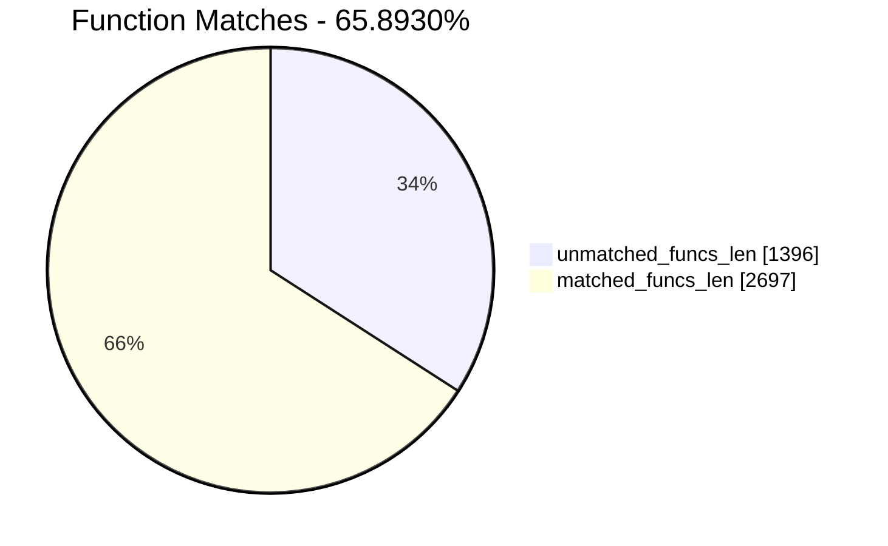
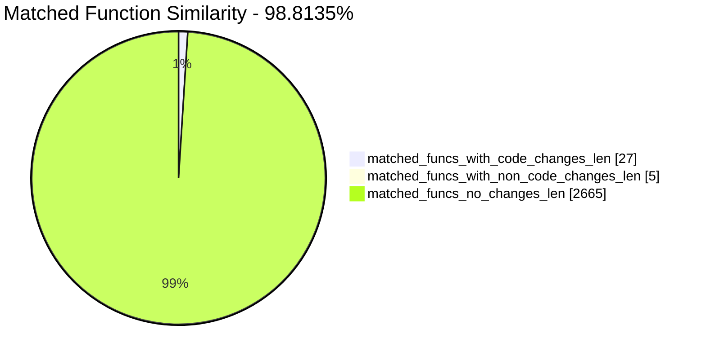
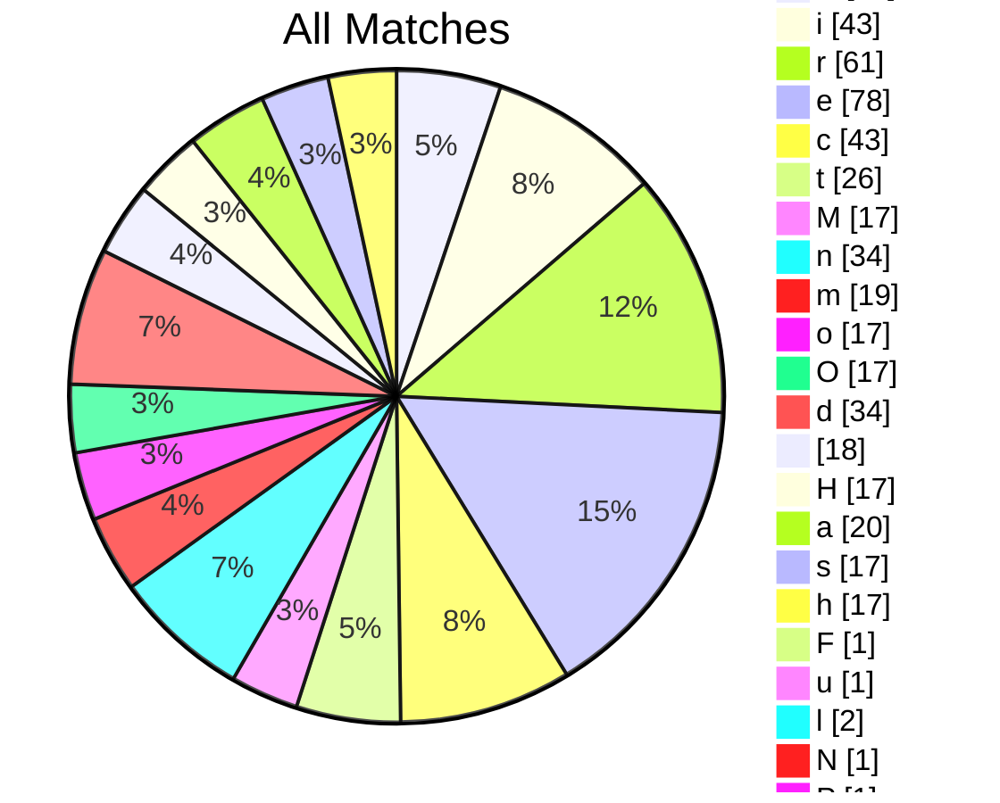
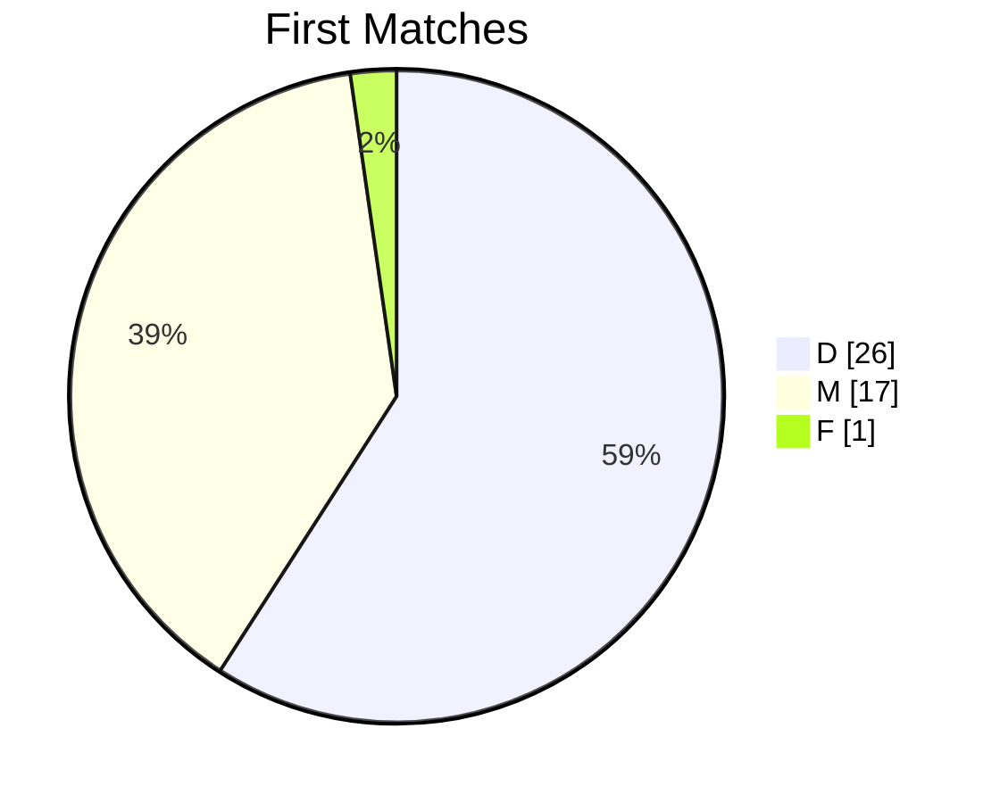
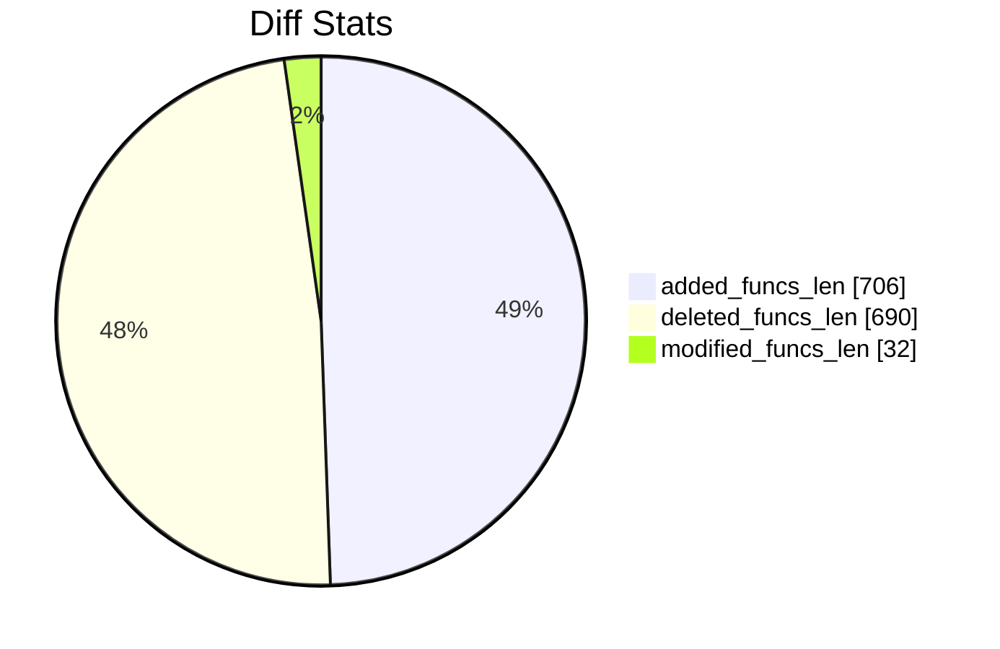
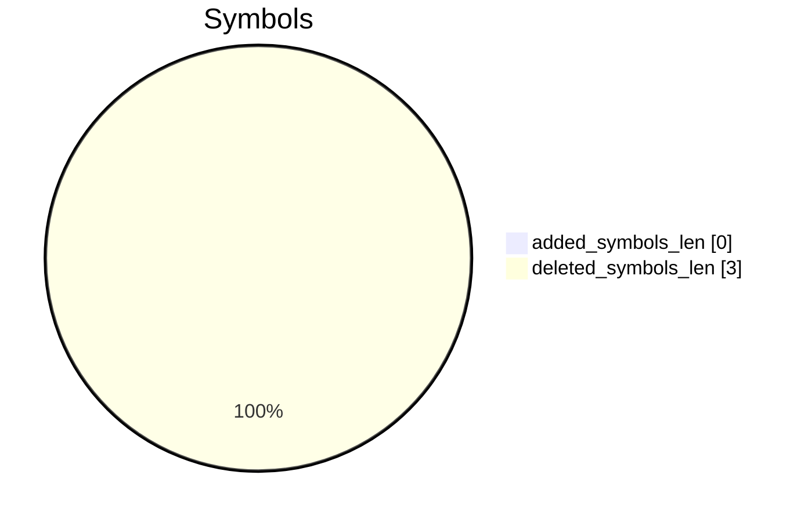
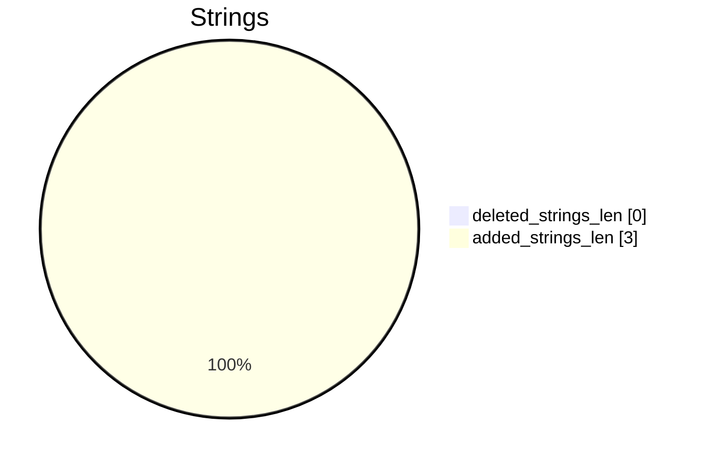

# winrar-x64-712.exe-winrar-x64-713.exe Diff

# TOC

* [Visual Chart Diff](#visual-chart-diff)
* [Metadata](#metadata)
	* [Ghidra Diff Engine](#ghidra-diff-engine)
		* [Command Line](#command-line)
	* [Binary Metadata Diff](#binary-metadata-diff)
	* [Program Options](#program-options)
	* [Diff Stats](#diff-stats)
	* [Strings](#strings)
* [Deleted](#deleted)
	* [FUN_14000d220](#fun_14000d220)
	* [FUN_14000d5b0](#fun_14000d5b0)
	* [FUN_14000dbc0](#fun_14000dbc0)
	* [FUN_14001aec0](#fun_14001aec0)
	* [FUN_14001b020](#fun_14001b020)
	* [FUN_14001b1d0](#fun_14001b1d0)
	* [FUN_14001b2a0](#fun_14001b2a0)
	* [FUN_14001b310](#fun_14001b310)
	* [FUN_14001b680](#fun_14001b680)
	* [FUN_14001e4b0](#fun_14001e4b0)
	* [FUN_14001f5b0](#fun_14001f5b0)
	* [FUN_1400235b0](#fun_1400235b0)
	* [_com_raise_error](#_com_raise_error)
	* [__scrt_unhandled_exception_filter](#__scrt_unhandled_exception_filter)
	* [__DestructExceptionObject](#__destructexceptionobject)
	* [__FrameHandler3::CxxCallCatchBlock](#__framehandler3cxxcallcatchblock)
	* [FUN_140028b80](#fun_140028b80)
	* [__acrt_initialize_clock](#__acrt_initialize_clock)
	* [__acrt_initialize_ptd](#__acrt_initialize_ptd)
	* [__acrt_initialize_stdio](#__acrt_initialize_stdio)
	* [FUN_140035630](#fun_140035630)
	* [FUN_140038da0](#fun_140038da0)
	* [__acrt_initialize_fma3](#__acrt_initialize_fma3)
	* [FUN_1400037c0](#fun_1400037c0)
	* [FUN_1400037f4](#fun_1400037f4)
	* [FUN_140003e34](#fun_140003e34)
	* [FUN_140004154](#fun_140004154)
	* [FUN_140005d10](#fun_140005d10)
	* [FUN_14000fa64](#fun_14000fa64)
	* [FUN_140017a84](#fun_140017a84)
	* [FUN_140013848](#fun_140013848)
	* [FUN_1400137f4](#fun_1400137f4)
	* [FUN_140013864](#fun_140013864)
	* [FUN_140025f50](#fun_140025f50)
	* [FUN_140026290](#fun_140026290)
	* [wcspbrk](#wcspbrk)
	* [FUN_14001ea20](#fun_14001ea20)
	* [FUN_14001d8c4](#fun_14001d8c4)
	* [FUN_14001a34c](#fun_14001a34c)
	* [FUN_14001abc8](#fun_14001abc8)
	* [FUN_14001ac48](#fun_14001ac48)
	* [FUN_140022330](#fun_140022330)
	* [FUN_1400222dc](#fun_1400222dc)
	* [FUN_14002234c](#fun_14002234c)
	* [FUN_14002a850](#fun_14002a850)
	* [FUN_14003397c](#fun_14003397c)
	* [FUN_140039fb0](#fun_140039fb0)
	* [FUN_14003ada8](#fun_14003ada8)
	* [__std_exception_destroy](#__std_exception_destroy)
	* [FUN_14002a3fc](#fun_14002a3fc)
	* [FUN_140008c0c](#fun_140008c0c)
	* [FUN_140002158](#fun_140002158)
	* [FUN_140008300](#fun_140008300)
	* [FUN_14000fbfc](#fun_14000fbfc)
	* [FUN_14000a2ac](#fun_14000a2ac)
	* [FUN_1400016d8](#fun_1400016d8)
	* [_byteswap_ulong](#_byteswap_ulong)
	* [FUN_140025fd0](#fun_140025fd0)
	* [FUN_1400138a4](#fun_1400138a4)
	* [FUN_1400183c0](#fun_1400183c0)
	* [_byteswap_uint64](#_byteswap_uint64)
	* [FUN_140003c68](#fun_140003c68)
	* [FUN_140014d0c](#fun_140014d0c)
	* [FUN_1400223d4](#fun_1400223d4)
	* [FUN_1400356dc](#fun_1400356dc)
	* [FUN_140035770](#fun_140035770)
	* [_handle_nan](#_handle_nan)
	* [FUN_140014c3c](#fun_140014c3c)
	* [std::_Allocate_manually_vector_aligned<struct_std::_Default_allocate_traits>](#std_allocate_manually_vector_alignedstruct_std_default_allocate_traits)
	* [FUN_140011af8](#fun_140011af8)
	* [FUN_1400139e4](#fun_1400139e4)
	* [FUN_1400224f4](#fun_1400224f4)
	* [FUN_140001190](#fun_140001190)
	* [FUN_140001514](#fun_140001514)
	* [FUN_140001884](#fun_140001884)
	* [std::_Adjust_manually_vector_aligned](#std_adjust_manually_vector_aligned)
	* [FUN_1400025c0](#fun_1400025c0)
	* [FUN_140002760](#fun_140002760)
	* [FUN_1400027c8](#fun_1400027c8)
	* [FUN_140003898](#fun_140003898)
	* [FUN_1400038f0](#fun_1400038f0)
	* [FUN_140003ad8](#fun_140003ad8)
	* [FUN_14000438c](#fun_14000438c)
	* [FUN_140004b58](#fun_140004b58)
	* [FUN_14000605c](#fun_14000605c)
	* [FUN_140007068](#fun_140007068)
	* [FUN_14000731c](#fun_14000731c)
	* [FUN_1400073e0](#fun_1400073e0)
	* [FUN_140007ac0](#fun_140007ac0)
	* [FUN_140008218](#fun_140008218)
	* [FUN_140008380](#fun_140008380)
	* [FUN_1400083cc](#fun_1400083cc)
	* [FUN_140008f10](#fun_140008f10)
	* [FUN_1400091ac](#fun_1400091ac)
	* [FUN_1400093fc](#fun_1400093fc)
	* [FUN_14000a25c](#fun_14000a25c)
	* [FUN_14000a310](#fun_14000a310)
	* [FUN_14000a3b8](#fun_14000a3b8)
	* [FUN_14000a588](#fun_14000a588)
	* [FUN_14000a720](#fun_14000a720)
	* [FUN_14000aa2c](#fun_14000aa2c)
	* [FUN_14000aeb0](#fun_14000aeb0)
	* [FUN_14000cd48](#fun_14000cd48)
	* [FUN_14000d134](#fun_14000d134)
	* [FUN_14000d448](#fun_14000d448)
	* [FUN_14000d650](#fun_14000d650)
	* [FUN_14000d968](#fun_14000d968)
	* [FUN_14000e068](#fun_14000e068)
	* [FUN_14000e3c0](#fun_14000e3c0)
	* [FUN_14000e758](#fun_14000e758)
	* [FUN_14000e9d0](#fun_14000e9d0)
	* [FUN_14000eab8](#fun_14000eab8)
	* [FUN_14000eb1c](#fun_14000eb1c)
	* [FUN_14000ecc4](#fun_14000ecc4)
	* [FUN_14000eebc](#fun_14000eebc)
	* [FUN_14000f48c](#fun_14000f48c)
	* [FUN_14000f9ec](#fun_14000f9ec)
	* [FUN_14000fb20](#fun_14000fb20)
	* [FUN_14000fd10](#fun_14000fd10)
	* [FUN_140010380](#fun_140010380)
	* [FUN_140010b10](#fun_140010b10)
	* [FUN_1400111e0](#fun_1400111e0)
	* [FUN_140011290](#fun_140011290)
	* [FUN_1400115b8](#fun_1400115b8)
	* [FUN_140011ca8](#fun_140011ca8)
	* [FUN_140011cfc](#fun_140011cfc)
	* [FUN_140011fb0](#fun_140011fb0)
	* [FUN_1400122a4](#fun_1400122a4)
	* [FUN_140012474](#fun_140012474)
	* [FUN_140012d00](#fun_140012d00)
	* [FUN_1400132a0](#fun_1400132a0)
	* [FUN_140013f60](#fun_140013f60)
	* [FUN_140013f9c](#fun_140013f9c)
	* [FUN_140014030](#fun_140014030)
	* [FUN_140014140](#fun_140014140)
	* [FUN_1400147d8](#fun_1400147d8)
	* [FUN_140014908](#fun_140014908)
	* [FUN_1400151ec](#fun_1400151ec)
	* [FUN_140015340](#fun_140015340)
	* [FUN_140015444](#fun_140015444)
	* [FUN_14001553c](#fun_14001553c)
	* [FUN_14001560c](#fun_14001560c)
	* [FUN_140015788](#fun_140015788)
	* [FUN_1400157ec](#fun_1400157ec)
	* [FUN_140015900](#fun_140015900)
	* [FUN_1400163ac](#fun_1400163ac)
	* [FUN_1400164d4](#fun_1400164d4)
	* [FUN_1400175d0](#fun_1400175d0)
	* [FUN_140017678](#fun_140017678)
	* [FUN_140017f14](#fun_140017f14)
	* [FUN_1400180fc](#fun_1400180fc)
	* [FUN_1400181c4](#fun_1400181c4)
	* [FUN_140018270](#fun_140018270)
	* [FUN_140018844](#fun_140018844)
	* [FUN_140018da8](#fun_140018da8)
	* [FUN_140019118](#fun_140019118)
	* [FUN_140019564](#fun_140019564)
	* [FUN_1400195e4](#fun_1400195e4)
	* [FUN_140019728](#fun_140019728)
	* [FUN_140019848](#fun_140019848)
	* [FUN_140019c04](#fun_140019c04)
	* [FUN_140019ed0](#fun_140019ed0)
	* [FUN_14001a308](#fun_14001a308)
	* [FUN_14001a3d8](#fun_14001a3d8)
	* [FUN_14001a4f4](#fun_14001a4f4)
	* [FUN_14001a744](#fun_14001a744)
	* [FUN_14001a8d4](#fun_14001a8d4)
	* [FUN_14001a9dc](#fun_14001a9dc)
	* [FUN_14001af68](#fun_14001af68)
	* [FUN_14001afbc](#fun_14001afbc)
	* [FUN_14001b418](#fun_14001b418)
	* [FUN_14001b504](#fun_14001b504)
	* [FUN_14001b5b8](#fun_14001b5b8)
	* [FUN_14001b804](#fun_14001b804)
	* [FUN_14001b9a8](#fun_14001b9a8)
	* [FUN_14001bc50](#fun_14001bc50)
	* [FUN_14001bcbc](#fun_14001bcbc)
	* [FUN_14001be20](#fun_14001be20)
	* [FUN_14001bfd0](#fun_14001bfd0)
	* [FUN_14001c35c](#fun_14001c35c)
	* [FUN_14001ca38](#fun_14001ca38)
	* [FUN_14001cfa8](#fun_14001cfa8)
	* [FUN_14001d6e4](#fun_14001d6e4)
	* [FUN_14001ddc4](#fun_14001ddc4)
	* [FUN_14001dec8](#fun_14001dec8)
	* [FUN_14001ef18](#fun_14001ef18)
	* [FUN_14001f2f4](#fun_14001f2f4)
	* [FUN_14001f39c](#fun_14001f39c)
	* [FUN_140021cb0](#fun_140021cb0)
	* [FUN_140022058](#fun_140022058)
	* [FUN_14002216c](#fun_14002216c)
	* [FUN_140023a90](#fun_140023a90)
	* [capture_current_context](#capture_current_context)
	* [capture_previous_context](#capture_previous_context)
	* [FUN_1400243e4](#fun_1400243e4)
	* [FUN_140024930](#fun_140024930)
	* [FUN_140024c10](#fun_140024c10)
	* [FUN_140024d9c](#fun_140024d9c)
	* [__security_init_cookie](#__security_init_cookie)
	* [__std_exception_copy](#__std_exception_copy)
	* [__vcrt_getptd_noexit](#__vcrt_getptd_noexit)
	* [Max Deleted Section Functions Reached Error](#max-deleted-section-functions-reached-error)
* [Added](#added)
	* [FUN_14000d6b0](#fun_14000d6b0)
	* [FUN_14000e060](#fun_14000e060)
	* [FUN_14001b820](#fun_14001b820)
	* [FUN_14001bb10](#fun_14001bb10)
	* [FUN_14001bb20](#fun_14001bb20)
	* [FUN_14001bea0](#fun_14001bea0)
	* [FUN_14001ed20](#fun_14001ed20)
	* [FUN_14001fe30](#fun_14001fe30)
	* [FUN_140023ee0](#fun_140023ee0)
	* [FUN_140026840](#fun_140026840)
	* [FUN_140027740](#fun_140027740)
	* [FUN_14002a3e0](#fun_14002a3e0)
	* [FUN_14002a5d0](#fun_14002a5d0)
	* [FUN_140030bf0](#fun_140030bf0)
	* [FUN_140032e40](#fun_140032e40)
	* [FUN_140033030](#fun_140033030)
	* [FUN_1400373b0](#fun_1400373b0)
	* [FUN_140037f10](#fun_140037f10)
	* [FUN_14003cde0](#fun_14003cde0)
	* [FUN_140001c0c](#fun_140001c0c)
	* [FUN_140002cf8](#fun_140002cf8)
	* [FUN_140003a94](#fun_140003a94)
	* [FUN_140003ad0](#fun_140003ad0)
	* [FUN_1400040b0](#fun_1400040b0)
	* [FUN_140004424](#fun_140004424)
	* [FUN_14000601c](#fun_14000601c)
	* [FUN_140025340](#fun_140025340)
	* [FUN_140024f90](#fun_140024f90)
	* [FUN_140024a70](#fun_140024a70)
	* [FUN_14000f25c](#fun_14000f25c)
	* [FUN_14000ff54](#fun_14000ff54)
	* [FUN_140024e30](#fun_140024e30)
	* [FUN_140013db4](#fun_140013db4)
	* [FUN_140013dec](#fun_140013dec)
	* [FUN_140013dd0](#fun_140013dd0)
	* [FUN_140027960](#fun_140027960)
	* [FUN_140027ca4](#fun_140027ca4)
	* [FUN_14002c200](#fun_14002c200)
	* [FUN_14001f290](#fun_14001f290)
	* [FUN_14001e128](#fun_14001e128)
	* [FUN_14001aac8](#fun_14001aac8)
	* [FUN_14001b430](#fun_14001b430)
	* [FUN_14001b3b8](#fun_14001b3b8)
	* [FUN_140022b68](#fun_140022b68)
	* [FUN_140022ba0](#fun_140022ba0)
	* [FUN_140022b84](#fun_140022b84)
	* [FUN_140035730](#fun_140035730)
	* [FUN_14003bc64](#fun_14003bc64)
	* [FUN_14003c8c0](#fun_14003c8c0)
	* [FUN_140027930](#fun_140027930)
	* [FUN_14002be50](#fun_14002be50)
	* [FUN_140008fb0](#fun_140008fb0)
	* [FUN_1400021d8](#fun_1400021d8)
	* [FUN_140008540](#fun_140008540)
	* [FUN_140010100](#fun_140010100)
	* [FUN_14000ab00](#fun_14000ab00)
	* [FUN_140025090](#fun_140025090)
	* [FUN_140001920](#fun_140001920)
	* [FUN_14000cd00](#fun_14000cd00)
	* [FUN_140018178](#fun_140018178)
	* [FUN_1400279e0](#fun_1400279e0)
	* [FUN_140013e5c](#fun_140013e5c)
	* [FUN_140013fd4](#fun_140013fd4)
	* [FUN_140018ad0](#fun_140018ad0)
	* [FUN_14001b470](#fun_14001b470)
	* [FUN_140003e54](#fun_140003e54)
	* [FUN_140015398](#fun_140015398)
	* [FUN_140022c1c](#fun_140022c1c)
	* [FUN_140022d70](#fun_140022d70)
	* [FUN_1400374e8](#fun_1400374e8)
	* [FUN_140037568](#fun_140037568)
	* [FUN_140001ea4](#fun_140001ea4)
	* [FUN_140011e2c](#fun_140011e2c)
	* [FUN_140015240](#fun_140015240)
	* [FUN_1400012d8](#fun_1400012d8)
	* [FUN_1400016dc](#fun_1400016dc)
	* [FUN_14000195c](#fun_14000195c)
	* [FUN_140001d54](#fun_140001d54)
	* [FUN_140002398](#fun_140002398)
	* [FUN_1400024d0](#fun_1400024d0)
	* [FUN_140002694](#fun_140002694)
	* [FUN_140002834](#fun_140002834)
	* [FUN_1400029ac](#fun_1400029ac)
	* [FUN_1400034e8](#fun_1400034e8)
	* [FUN_140003a50](#fun_140003a50)
	* [FUN_140003cc0](#fun_140003cc0)
	* [FUN_14000465c](#fun_14000465c)
	* [FUN_140004e2c](#fun_140004e2c)
	* [FUN_140006368](#fun_140006368)
	* [FUN_1400073e8](#fun_1400073e8)
	* [FUN_1400076b4](#fun_1400076b4)
	* [FUN_1400076c4](#fun_1400076c4)
	* [FUN_140007788](#fun_140007788)
	* [FUN_140008414](#fun_140008414)
	* [FUN_140008694](#fun_140008694)
	* [FUN_14000902c](#fun_14000902c)
	* [FUN_1400092c4](#fun_1400092c4)
	* [FUN_140009584](#fun_140009584)
	* [FUN_1400097d8](#fun_1400097d8)
	* [FUN_14000a5f0](#fun_14000a5f0)
	* [FUN_14000a6c4](#fun_14000a6c4)
	* [FUN_14000a76c](#fun_14000a76c)
	* [FUN_14000a850](#fun_14000a850)
	* [FUN_14000aa84](#fun_14000aa84)
	* [FUN_14000aba8](#fun_14000aba8)
	* [FUN_14000aeb4](#fun_14000aeb4)
	* [FUN_14000b338](#fun_14000b338)
	* [FUN_14000d1d0](#fun_14000d1d0)
	* [FUN_14000d5c0](#fun_14000d5c0)
	* [FUN_14000d8d8](#fun_14000d8d8)
	* [FUN_14000daf4](#fun_14000daf4)
	* [FUN_14000de08](#fun_14000de08)
	* [FUN_14000e518](#fun_14000e518)
	* [FUN_14000e874](#fun_14000e874)
	* [FUN_14000ec0c](#fun_14000ec0c)
	* [FUN_14000ee28](#fun_14000ee28)
	* [FUN_14000ee8c](#fun_14000ee8c)
	* [FUN_14000ef78](#fun_14000ef78)
	* [FUN_14000efe0](#fun_14000efe0)
	* [FUN_14000f188](#fun_14000f188)
	* [FUN_14000f974](#fun_14000f974)
	* [FUN_14001001c](#fun_14001001c)
	* [FUN_1400100f4](#fun_1400100f4)
	* [FUN_140010220](#fun_140010220)
	* [FUN_1400103c4](#fun_1400103c4)
	* [FUN_1400108e0](#fun_1400108e0)
	* [FUN_14001106c](#fun_14001106c)
	* [FUN_140011740](#fun_140011740)
	* [FUN_1400117f4](#fun_1400117f4)
	* [FUN_140011b20](#fun_140011b20)
	* [FUN_14001225c](#fun_14001225c)
	* [FUN_1400122b4](#fun_1400122b4)
	* [FUN_140012564](#fun_140012564)
	* [FUN_14001285c](#fun_14001285c)
	* [FUN_140012a30](#fun_140012a30)
	* [FUN_14001329c](#fun_14001329c)
	* [FUN_140013840](#fun_140013840)
	* [FUN_14001460c](#fun_14001460c)
	* [FUN_1400146a4](#fun_1400146a4)
	* [FUN_140014dd4](#fun_140014dd4)
	* [FUN_140014e2c](#fun_140014e2c)
	* [FUN_1400151c8](#fun_1400151c8)
	* [FUN_140015298](#fun_140015298)
	* [FUN_14001577c](#fun_14001577c)
	* [FUN_140015880](#fun_140015880)
	* [FUN_1400159d4](#fun_1400159d4)
	* [FUN_140015adc](#fun_140015adc)
	* [FUN_140015bdc](#fun_140015bdc)
	* [FUN_140015cac](#fun_140015cac)
	* [FUN_140015d84](#fun_140015d84)
	* [FUN_140015e68](#fun_140015e68)
	* [FUN_140015fe4](#fun_140015fe4)
	* [FUN_140016a90](#fun_140016a90)
	* [FUN_140016bbc](#fun_140016bbc)
	* [FUN_140017cc0](#fun_140017cc0)
	* [FUN_140017d6c](#fun_140017d6c)
	* [FUN_14001861c](#fun_14001861c)
	* [FUN_140018804](#fun_140018804)
	* [FUN_1400188c0](#fun_1400188c0)
	* [FUN_140018980](#fun_140018980)
	* [FUN_140018f9c](#fun_140018f9c)
	* [FUN_140019504](#fun_140019504)
	* [FUN_140019880](#fun_140019880)
	* [FUN_140019cdc](#fun_140019cdc)
	* [FUN_140019d58](#fun_140019d58)
	* [FUN_140019ea0](#fun_140019ea0)
	* [FUN_140019fbc](#fun_140019fbc)
	* [FUN_14001a378](#fun_14001a378)
	* [FUN_14001a648](#fun_14001a648)
	* [FUN_14001ab5c](#fun_14001ab5c)
	* [FUN_14001ac7c](#fun_14001ac7c)
	* [FUN_14001aecc](#fun_14001aecc)
	* [FUN_14001b068](#fun_14001b068)
	* [FUN_14001b188](#fun_14001b188)
	* [FUN_14001b758](#fun_14001b758)
	* [FUN_14001b7b4](#fun_14001b7b4)
	* [FUN_14001bc2c](#fun_14001bc2c)
	* [FUN_14001bd18](#fun_14001bd18)
	* [FUN_14001bdd4](#fun_14001bdd4)
	* [FUN_14001c024](#fun_14001c024)
	* [FUN_14001c1d0](#fun_14001c1d0)
	* [FUN_14001c1fc](#fun_14001c1fc)
	* [FUN_14001c310](#fun_14001c310)
	* [FUN_14001c49c](#fun_14001c49c)
	* [FUN_14001c510](#fun_14001c510)
	* [FUN_14001c684](#fun_14001c684)
	* [FUN_14001c838](#fun_14001c838)
	* [FUN_14001d298](#fun_14001d298)
	* [FUN_14001df44](#fun_14001df44)
	* [FUN_14001e628](#fun_14001e628)
	* [FUN_14001e734](#fun_14001e734)
	* [FUN_14001f788](#fun_14001f788)
	* [FUN_14001fb70](#fun_14001fb70)
	* [FUN_14001fc1c](#fun_14001fc1c)
	* [FUN_140022530](#fun_140022530)
	* [FUN_1400228dc](#fun_1400228dc)
	* [FUN_1400229f8](#fun_1400229f8)
	* [FUN_140022fb4](#fun_140022fb4)
	* [FUN_1400243b0](#fun_1400243b0)
	* [FUN_140024410](#fun_140024410)
	* [FUN_1400245e0](#fun_1400245e0)
	* [Max Added Section Functions Reached Error](#max-added-section-functions-reached-error)
* [Modified](#modified)
	* [FUN_140001180](#fun_140001180)
	* [FUN_140001cec](#fun_140001cec)
	* [FUN_140001f30](#fun_140001f30)
	* [FUN_140002ac8](#fun_140002ac8)
	* [FUN_1400032b8](#fun_1400032b8)
	* [FUN_140004068](#fun_140004068)
	* [FUN_140004304](#fun_140004304)
	* [FUN_140008c84](#fun_140008c84)
	* [FUN_14000a718](#fun_14000a718)
	* [FUN_14000da50](#fun_14000da50)
	* [FUN_14000f38c](#fun_14000f38c)
	* [FUN_1400103b4](#fun_1400103b4)
	* [FUN_1400147b8](#fun_1400147b8)
	* [FUN_140014c18](#fun_140014c18)
	* [FUN_1400150e8](#fun_1400150e8)
	* [FUN_140017e8c](#fun_140017e8c)
	* [FUN_14001b9d0](#fun_14001b9d0)
	* [FUN_14001bad0](#fun_14001bad0)
	* [FUN_14001cbc0](#fun_14001cbc0)
	* [FUN_14001d80c](#fun_14001d80c)
	* [FUN_1400227f4](#fun_1400227f4)
	* [FUN_140024910](#fun_140024910)
	* [FUN_1400252a0](#fun_1400252a0)
	* [FUN_1400269ac](#fun_1400269ac)
	* [FUN_14002e01c](#fun_14002e01c)
	* [FUN_140032d48](#fun_140032d48)
	* [wcsncmp](#wcsncmp)
* [Modified (No Code Changes)](#modified-no-code-changes)
	* [Section Skipped](#section-skipped)

# Visual Chart Diff

```mermaid

flowchart LR

FUN_140001180-3-old<--Match 4%-->FUN_140001180-3-new
FUN_140001cec-2-old<--Match 35%-->FUN_140001cec-2-new
FUN_140001f30-2-old<--Match 45%-->FUN_140001f30-2-new
FUN_140002ac8-2-old<--Match 21%-->FUN_140002ac8-2-new
FUN_1400032b8-4-old<--Match 14%-->FUN_1400032b8-4-new
FUN_140004068-3-old<--Match 6%-->FUN_140004068-3-new
FUN_140004304-3-old<--Match 20%-->FUN_140004304-3-new
FUN_140008c84-2-old<--Match 17%-->FUN_140008c84-2-new
FUN_14000a718-4-old<--Match 15%-->FUN_14000a718-4-new
FUN_14000da50-4-old<--Match 54%-->FUN_14000da50-4-new
FUN_14000f38c-3-old<--Match 48%-->FUN_14000f38c-3-new
FUN_1400103b4-3-old<--Match 14%-->FUN_1400103b4-3-new
FUN_1400147b8-1-old<--Match 9%-->FUN_1400147b8-1-new
FUN_140014c18-0-old<--Match 27%-->FUN_140014c18-0-new
FUN_1400150e8-3-old<--Match 12%-->FUN_1400150e8-3-new
FUN_140017e8c-1-old<--Match 13%-->FUN_140017e8c-1-new
FUN_14001b9d0-2-old<--Match 60%-->FUN_14001b9d0-2-new
FUN_14001bad0-2-old<--Match 4%-->FUN_14001bad0-2-new
FUN_14001cbc0-2-old<--Match 39%-->FUN_14001cbc0-2-new
FUN_14001d80c-1-old<--Match 22%-->FUN_14001d80c-1-new
FUN_1400227f4-1-old<--Match 33%-->FUN_1400227f4-1-new
FUN_140024910-2-old<--Match 7%-->FUN_140024910-2-new
FUN_1400252a0-2-old<--Match 24%-->FUN_1400252a0-2-new
FUN_1400269ac-4-old<--Match 15%-->FUN_1400269ac-4-new
FUN_14002e01c-1-old<--Match 47%-->FUN_14002e01c-1-new
FUN_140032d48-0-old<--Match 35%-->FUN_140032d48-0-new
winrar-x64-712.exe<--2ommited-->winrar-x64-713.exe

subgraph winrar-x64-713.exe
    FUN_140001180-3-new
FUN_140001cec-2-new
FUN_140001f30-2-new
FUN_140002ac8-2-new
FUN_1400032b8-4-new
FUN_140004068-3-new
FUN_140004304-3-new
FUN_140008c84-2-new
FUN_14000a718-4-new
FUN_14000da50-4-new
FUN_14000f38c-3-new
FUN_1400103b4-3-new
FUN_1400147b8-1-new
FUN_140014c18-0-new
FUN_1400150e8-3-new
FUN_140017e8c-1-new
FUN_14001b9d0-2-new
FUN_14001bad0-2-new
FUN_14001cbc0-2-new
FUN_14001d80c-1-new
FUN_1400227f4-1-new
FUN_140024910-2-new
FUN_1400252a0-2-new
FUN_1400269ac-4-new
FUN_14002e01c-1-new
FUN_140032d48-0-new
    subgraph Added
direction LR
FUN_14000d6b0
    FUN_14000e060
    FUN_14001b820
    FUN_14001bb10
    FUN_14001bb20
    FUN_14001bea0
    FUN_14001ed20
    FUN_14001fe30
    FUN_140023ee0
    FUN_140026840
    FUN_140027740
    FUN_14002a3e0
    FUN_14002a5d0
    FUN_140030bf0
    FUN_140032e40
    FUN_140033030
    FUN_1400373b0
    FUN_140037f10
    FUN_14003cde0
    FUN_140001c0c
    FUN_140002cf8
    FUN_140003a94
    FUN_140003ad0
    FUN_1400040b0
    FUN_140004424
    FUN_14000601c
    FUN_140025340
    681_more_added_funcs_omitted
end
end

subgraph winrar-x64-712.exe
    FUN_140001180-3-old
FUN_140001cec-2-old
FUN_140001f30-2-old
FUN_140002ac8-2-old
FUN_1400032b8-4-old
FUN_140004068-3-old
FUN_140004304-3-old
FUN_140008c84-2-old
FUN_14000a718-4-old
FUN_14000da50-4-old
FUN_14000f38c-3-old
FUN_1400103b4-3-old
FUN_1400147b8-1-old
FUN_140014c18-0-old
FUN_1400150e8-3-old
FUN_140017e8c-1-old
FUN_14001b9d0-2-old
FUN_14001bad0-2-old
FUN_14001cbc0-2-old
FUN_14001d80c-1-old
FUN_1400227f4-1-old
FUN_140024910-2-old
FUN_1400252a0-2-old
FUN_1400269ac-4-old
FUN_14002e01c-1-old
FUN_140032d48-0-old
    subgraph Deleted
direction LR
FUN_14000d220
    FUN_14000d5b0
    FUN_14000dbc0
    FUN_14001aec0
    FUN_14001b020
    FUN_14001b1d0
    FUN_14001b2a0
    FUN_14001b310
    FUN_14001b680
    FUN_14001e4b0
    FUN_14001f5b0
    FUN_1400235b0
    _com_raise_error
    __scrt_unhandled_exception_filter
    __DestructExceptionObject
    __FrameHandler3-CxxCallCatchBlock
    FUN_140028b80
    __acrt_initialize_clock
    __acrt_initialize_ptd
    __acrt_initialize_stdio
    FUN_140035630
    FUN_140038da0
    __acrt_initialize_fma3
    FUN_1400037c0
    FUN_1400037f4
    FUN_140003e34
    FUN_140004154
    665_more_deleted_funcs_omitted
end
end

```










# Metadata

## Ghidra Diff Engine

### Command Line

#### Captured Command Line


```
ghidriff --project-location ghidra_projects --project-name ghidriff --symbols-path symbols --gzfs-path gzfs --threaded --log-level INFO --file-log-level INFO --log-path ghidriff.log --min-func-len 10 --gdt [] --bsim --max-ram-percent 60.0 --max-section-funcs 200 winrar-x64-712.exe winrar-x64-713.exe
```


#### Verbose Args


<details>

```
--old ['winrar-x64-712.exe'] --new [['winrar-x64-713.exe']] --engine StructualGraphDiff --output-path PatchDiffStruct/ --summary False --project-location ghidra_projects --project-name ghidriff --symbols-path symbols --gzfs-path gzfs --base-address None --program-options None --threaded True --force-analysis False --force-diff False --no-symbols False --log-level INFO --file-log-level INFO --log-path ghidriff.log --va False --min-func-len 10 --use-calling-counts False --gdt [] --bsim True --bsim-full False --max-ram-percent 60.0 --print-flags False --jvm-args None --side-by-side False --max-section-funcs 200 --md-title None
```


</details>

#### Download Original PEs


```
wget https://msdl.microsoft.com/download/symbols/WinRAR.exe/6859079184000/WinRAR.exe -O winrar.exe.x64.7.12.0
wget https://msdl.microsoft.com/download/symbols/WinRAR.exe/6887424F8A000/WinRAR.exe -O winrar.exe.x64.7.13.0
```


## Binary Metadata Diff


```diff
--- winrar-x64-712.exe Meta
+++ winrar-x64-713.exe Meta
@@ -1,43 +1,43 @@
-Program Name: winrar-x64-712.exe
+Program Name: winrar-x64-713.exe
 Language ID: x86:LE:64:default (4.6)
 Compiler ID: windows
 Processor: x86
 Endian: Little
 Address Size: 64
 Minimum Address: 140000000
 Maximum Address: ff0000184f
-# of Bytes: 531428
-# of Memory Blocks: 9
-# of Instructions: 64724
-# of Defined Data: 4130
-# of Functions: 2033
-# of Symbols: 10756
-# of Data Types: 711
-# of Data Type Categories: 42
+# of Bytes: 550036
+# of Memory Blocks: 10
+# of Instructions: 66477
+# of Defined Data: 4192
+# of Functions: 2060
+# of Symbols: 10923
+# of Data Types: 700
+# of Data Type Categories: 41
 Analyzed: true
 Compiler: visualstudio:unknown
 Created With Ghidra Version: 11.4
-Date Created: Thu Sep 18 23:11:34 MDT 2025
+Date Created: Thu Sep 18 23:11:37 MDT 2025
 Executable Format: Portable Executable (PE)
-Executable Location: /media/conntrack/Seagate1/git/horizon3ai/interview2/winrar-x64-712.exe
-Executable MD5: 3618eaf32ece6218cc52e95f849c05a6
-Executable SHA256: 80ab68244a0d86600ab250e8dba551b87f7f8b4603e2300b3bcbd7e870e90f91
-FSRL: file:///media/conntrack/Seagate1/git/horizon3ai/interview2/winrar-x64-712.exe?MD5=3618eaf32ece6218cc52e95f849c05a6
+Executable Location: /media/conntrack/Seagate1/git/horizon3ai/interview2/winrar-x64-713.exe
+Executable MD5: 53ef4972d65304468d2519aa692001c8
+Executable SHA256: dbc951b4ab01646888b2a91da73a94dd920054c2f27c8cfeacae3eba298e71b0
+FSRL: file:///media/conntrack/Seagate1/git/horizon3ai/interview2/winrar-x64-713.exe?MD5=53ef4972d65304468d2519aa692001c8
 PDB Age: 1
 PDB File: sfxrar.pdb
-PDB GUID: 43d6d7ef-e283-4e62-89b5-5a0d83c44395
+PDB GUID: 8127c435-7c9e-4136-9c71-9e007ca98bfe
 PDB Version: RSDS
 PE Property[CompanyName]: Alexander Roshal
 PE Property[FileDescription]: WinRAR
-PE Property[FileVersion]: 7.12.0
+PE Property[FileVersion]: 7.13.0
 PE Property[InternalName]: WinRAR
 PE Property[LegalCopyright]: Copyright © Alexander Roshal 1993-2025
 PE Property[OriginalFilename]: WinRAR.exe
 PE Property[ProductName]: WinRAR
-PE Property[ProductVersion]: 7.12.0
+PE Property[ProductVersion]: 7.13.0
 PE Property[Translation]: 4e40409
 Preferred Root Namespace Category: 
 RTTI Found: true
 Relocatable: true
 SectionAlignment: 4096
 Should Ask To Analyze: false

```


## Program Options


<details>
<summary>Ghidra winrar-x64-712.exe Decompiler Options</summary>


|Decompiler Option|Value|
| :---: | :---: |
|Prototype Evaluation|__fastcall|

</details>


<details>
<summary>Ghidra winrar-x64-712.exe Specification extensions Options</summary>


|Specification extensions Option|Value|
| :---: | :---: |
|FormatVersion|0|
|VersionCounter|0|

</details>


<details>
<summary>Ghidra winrar-x64-712.exe Analyzers Options</summary>


|Analyzers Option|Value|
| :---: | :---: |
|ASCII Strings|true|
|ASCII Strings.Create Strings Containing Existing Strings|true|
|ASCII Strings.Create Strings Containing References|true|
|ASCII Strings.Force Model Reload|false|
|ASCII Strings.Minimum String Length|LEN_5|
|ASCII Strings.Model File|StringModel.sng|
|ASCII Strings.Require Null Termination for String|true|
|ASCII Strings.Search Only in Accessible Memory Blocks|true|
|ASCII Strings.String Start Alignment|ALIGN_1|
|ASCII Strings.String end alignment|4|
|Aggressive Instruction Finder|false|
|Aggressive Instruction Finder.Create Analysis Bookmarks|true|
|Apply Data Archives|true|
|Apply Data Archives.Archive Chooser|[Auto-Detect]|
|Apply Data Archives.Create Analysis Bookmarks|true|
|Apply Data Archives.GDT User File Archive Path|None|
|Apply Data Archives.User Project Archive Path|None|
|Call Convention ID|true|
|Call Convention ID.Analysis Decompiler Timeout (sec)|60|
|Call-Fixup Installer|true|
|Condense Filler Bytes|false|
|Condense Filler Bytes.Filler Value|Auto|
|Condense Filler Bytes.Minimum number of sequential bytes|1|
|Create Address Tables|true|
|Create Address Tables.Allow Offcut References|false|
|Create Address Tables.Auto Label Table|false|
|Create Address Tables.Create Analysis Bookmarks|true|
|Create Address Tables.Maxmimum Pointer Distance|16777215|
|Create Address Tables.Minimum Pointer Address|4132|
|Create Address Tables.Minimum Table Size|2|
|Create Address Tables.Pointer Alignment|1|
|Create Address Tables.Relocation Table Guide|true|
|Create Address Tables.Table Alignment|4|
|Data Reference|true|
|Data Reference.Address Table Alignment|1|
|Data Reference.Address Table Minimum Size|2|
|Data Reference.Align End of Strings|false|
|Data Reference.Ascii String References|true|
|Data Reference.Create Address Tables|true|
|Data Reference.Minimum String Length|5|
|Data Reference.References to Pointers|true|
|Data Reference.Relocation Table Guide|true|
|Data Reference.Respect Execute Flag|true|
|Data Reference.Subroutine References|true|
|Data Reference.Switch Table References|false|
|Data Reference.Unicode String References|true|
|Decompiler Parameter ID|true|
|Decompiler Parameter ID.Analysis Clear Level|ANALYSIS|
|Decompiler Parameter ID.Analysis Decompiler Timeout (sec)|60|
|Decompiler Parameter ID.Commit Data Types|true|
|Decompiler Parameter ID.Commit Void Return Values|false|
|Decompiler Parameter ID.Prototype Evaluation|__fastcall|
|Decompiler Switch Analysis|true|
|Decompiler Switch Analysis.Analysis Decompiler Timeout (sec)|60|
|Demangler Microsoft|true|
|Demangler Microsoft.Apply Function Calling Conventions|true|
|Demangler Microsoft.Apply Function Signatures|true|
|Demangler Microsoft.C-Style Symbol Interpretation|FUNCTION_IF_EXISTS|
|Demangler Microsoft.Demangle Only Known Mangled Symbols|false|
|Disassemble Entry Points|true|
|Disassemble Entry Points.Respect Execute Flag|true|
|Embedded Media|true|
|Embedded Media.Create Analysis Bookmarks|true|
|External Entry References|true|
|Function ID|true|
|Function ID.Always Apply FID Labels|false|
|Function ID.Create Analysis Bookmarks|true|
|Function ID.Instruction Count Threshold|14.6|
|Function ID.Multiple Match Threshold|30.0|
|Function Start Search|true|
|Function Start Search.Bookmark Functions|false|
|Function Start Search.Search Data Blocks|false|
|Non-Returning Functions - Discovered|true|
|Non-Returning Functions - Discovered.Create Analysis Bookmarks|true|
|Non-Returning Functions - Discovered.Function Non-return Threshold|3|
|Non-Returning Functions - Discovered.Repair Flow Damage|true|
|Non-Returning Functions - Known|true|
|Non-Returning Functions - Known.Create Analysis Bookmarks|true|
|PDB MSDIA|false|
|PDB MSDIA.Search untrusted symbol servers|false|
|PDB Universal|true|
|PDB Universal.Import Source Line Info|true|
|PDB Universal.Search untrusted symbol servers|false|
|Reference|true|
|Reference.Address Table Alignment|1|
|Reference.Address Table Minimum Size|2|
|Reference.Align End of Strings|false|
|Reference.Ascii String References|true|
|Reference.Create Address Tables|true|
|Reference.Minimum String Length|5|
|Reference.References to Pointers|true|
|Reference.Relocation Table Guide|true|
|Reference.Respect Execute Flag|true|
|Reference.Subroutine References|true|
|Reference.Switch Table References|false|
|Reference.Unicode String References|true|
|Scalar Operand References|true|
|Scalar Operand References.Relocation Table Guide|true|
|Shared Return Calls|true|
|Shared Return Calls.Allow Conditional Jumps|false|
|Shared Return Calls.Assume Contiguous Functions Only|true|
|Stack|true|
|Stack.Create Local Variables|true|
|Stack.Create Param Variables|false|
|Stack.Max Threads|2|
|Stack.useNewFunctionStackAnalysis|true|
|Subroutine References|true|
|Subroutine References.Create Thunks Early|true|
|Variadic Function Signature Override|false|
|Variadic Function Signature Override.Create Analysis Bookmarks|false|
|Windows x86 PE Exception Handling|true|
|Windows x86 PE RTTI Analyzer|true|
|Windows x86 Thread Environment Block (TEB) Analyzer|true|
|Windows x86 Thread Environment Block (TEB) Analyzer.Starting Address of the TEB||
|Windows x86 Thread Environment Block (TEB) Analyzer.Windows OS Version|Windows 7|
|WindowsPE x86 Propagate External Parameters|false|
|WindowsResourceReference|true|
|WindowsResourceReference.Create Analysis Bookmarks|true|
|x86 Constant Reference Analyzer|true|
|x86 Constant Reference Analyzer.Create Data from pointer|false|
|x86 Constant Reference Analyzer.Function parameter/return Pointer analysis|true|
|x86 Constant Reference Analyzer.Max Threads|2|
|x86 Constant Reference Analyzer.Min absolute reference|4|
|x86 Constant Reference Analyzer.Require pointer param data type|false|
|x86 Constant Reference Analyzer.Speculative reference max|256|
|x86 Constant Reference Analyzer.Speculative reference min|1024|
|x86 Constant Reference Analyzer.Stored Value Pointer analysis|true|
|x86 Constant Reference Analyzer.Trust values read from writable memory|true|

</details>


<details>
<summary>Ghidra winrar-x64-713.exe Decompiler Options</summary>


|Decompiler Option|Value|
| :---: | :---: |
|Prototype Evaluation|__fastcall|

</details>


<details>
<summary>Ghidra winrar-x64-713.exe Specification extensions Options</summary>


|Specification extensions Option|Value|
| :---: | :---: |
|FormatVersion|0|
|VersionCounter|0|

</details>


<details>
<summary>Ghidra winrar-x64-713.exe Analyzers Options</summary>


|Analyzers Option|Value|
| :---: | :---: |
|ASCII Strings|true|
|ASCII Strings.Create Strings Containing Existing Strings|true|
|ASCII Strings.Create Strings Containing References|true|
|ASCII Strings.Force Model Reload|false|
|ASCII Strings.Minimum String Length|LEN_5|
|ASCII Strings.Model File|StringModel.sng|
|ASCII Strings.Require Null Termination for String|true|
|ASCII Strings.Search Only in Accessible Memory Blocks|true|
|ASCII Strings.String Start Alignment|ALIGN_1|
|ASCII Strings.String end alignment|4|
|Aggressive Instruction Finder|false|
|Aggressive Instruction Finder.Create Analysis Bookmarks|true|
|Apply Data Archives|true|
|Apply Data Archives.Archive Chooser|[Auto-Detect]|
|Apply Data Archives.Create Analysis Bookmarks|true|
|Apply Data Archives.GDT User File Archive Path|None|
|Apply Data Archives.User Project Archive Path|None|
|Call Convention ID|true|
|Call Convention ID.Analysis Decompiler Timeout (sec)|60|
|Call-Fixup Installer|true|
|Condense Filler Bytes|false|
|Condense Filler Bytes.Filler Value|Auto|
|Condense Filler Bytes.Minimum number of sequential bytes|1|
|Create Address Tables|true|
|Create Address Tables.Allow Offcut References|false|
|Create Address Tables.Auto Label Table|false|
|Create Address Tables.Create Analysis Bookmarks|true|
|Create Address Tables.Maxmimum Pointer Distance|16777215|
|Create Address Tables.Minimum Pointer Address|4132|
|Create Address Tables.Minimum Table Size|2|
|Create Address Tables.Pointer Alignment|1|
|Create Address Tables.Relocation Table Guide|true|
|Create Address Tables.Table Alignment|4|
|Data Reference|true|
|Data Reference.Address Table Alignment|1|
|Data Reference.Address Table Minimum Size|2|
|Data Reference.Align End of Strings|false|
|Data Reference.Ascii String References|true|
|Data Reference.Create Address Tables|true|
|Data Reference.Minimum String Length|5|
|Data Reference.References to Pointers|true|
|Data Reference.Relocation Table Guide|true|
|Data Reference.Respect Execute Flag|true|
|Data Reference.Subroutine References|true|
|Data Reference.Switch Table References|false|
|Data Reference.Unicode String References|true|
|Decompiler Parameter ID|true|
|Decompiler Parameter ID.Analysis Clear Level|ANALYSIS|
|Decompiler Parameter ID.Analysis Decompiler Timeout (sec)|60|
|Decompiler Parameter ID.Commit Data Types|true|
|Decompiler Parameter ID.Commit Void Return Values|false|
|Decompiler Parameter ID.Prototype Evaluation|__fastcall|
|Decompiler Switch Analysis|true|
|Decompiler Switch Analysis.Analysis Decompiler Timeout (sec)|60|
|Demangler Microsoft|true|
|Demangler Microsoft.Apply Function Calling Conventions|true|
|Demangler Microsoft.Apply Function Signatures|true|
|Demangler Microsoft.C-Style Symbol Interpretation|FUNCTION_IF_EXISTS|
|Demangler Microsoft.Demangle Only Known Mangled Symbols|false|
|Disassemble Entry Points|true|
|Disassemble Entry Points.Respect Execute Flag|true|
|Embedded Media|true|
|Embedded Media.Create Analysis Bookmarks|true|
|External Entry References|true|
|Function ID|true|
|Function ID.Always Apply FID Labels|false|
|Function ID.Create Analysis Bookmarks|true|
|Function ID.Instruction Count Threshold|14.6|
|Function ID.Multiple Match Threshold|30.0|
|Function Start Search|true|
|Function Start Search.Bookmark Functions|false|
|Function Start Search.Search Data Blocks|false|
|Non-Returning Functions - Discovered|true|
|Non-Returning Functions - Discovered.Create Analysis Bookmarks|true|
|Non-Returning Functions - Discovered.Function Non-return Threshold|3|
|Non-Returning Functions - Discovered.Repair Flow Damage|true|
|Non-Returning Functions - Known|true|
|Non-Returning Functions - Known.Create Analysis Bookmarks|true|
|PDB MSDIA|false|
|PDB MSDIA.Search untrusted symbol servers|false|
|PDB Universal|true|
|PDB Universal.Import Source Line Info|true|
|PDB Universal.Search untrusted symbol servers|false|
|Reference|true|
|Reference.Address Table Alignment|1|
|Reference.Address Table Minimum Size|2|
|Reference.Align End of Strings|false|
|Reference.Ascii String References|true|
|Reference.Create Address Tables|true|
|Reference.Minimum String Length|5|
|Reference.References to Pointers|true|
|Reference.Relocation Table Guide|true|
|Reference.Respect Execute Flag|true|
|Reference.Subroutine References|true|
|Reference.Switch Table References|false|
|Reference.Unicode String References|true|
|Scalar Operand References|true|
|Scalar Operand References.Relocation Table Guide|true|
|Shared Return Calls|true|
|Shared Return Calls.Allow Conditional Jumps|false|
|Shared Return Calls.Assume Contiguous Functions Only|true|
|Stack|true|
|Stack.Create Local Variables|true|
|Stack.Create Param Variables|false|
|Stack.Max Threads|2|
|Stack.useNewFunctionStackAnalysis|true|
|Subroutine References|true|
|Subroutine References.Create Thunks Early|true|
|Variadic Function Signature Override|false|
|Variadic Function Signature Override.Create Analysis Bookmarks|false|
|Windows x86 PE Exception Handling|true|
|Windows x86 PE RTTI Analyzer|true|
|Windows x86 Thread Environment Block (TEB) Analyzer|true|
|Windows x86 Thread Environment Block (TEB) Analyzer.Starting Address of the TEB||
|Windows x86 Thread Environment Block (TEB) Analyzer.Windows OS Version|Windows 7|
|WindowsPE x86 Propagate External Parameters|false|
|WindowsResourceReference|true|
|WindowsResourceReference.Create Analysis Bookmarks|true|
|x86 Constant Reference Analyzer|true|
|x86 Constant Reference Analyzer.Create Data from pointer|false|
|x86 Constant Reference Analyzer.Function parameter/return Pointer analysis|true|
|x86 Constant Reference Analyzer.Max Threads|2|
|x86 Constant Reference Analyzer.Min absolute reference|4|
|x86 Constant Reference Analyzer.Require pointer param data type|false|
|x86 Constant Reference Analyzer.Speculative reference max|256|
|x86 Constant Reference Analyzer.Speculative reference min|1024|
|x86 Constant Reference Analyzer.Stored Value Pointer analysis|true|
|x86 Constant Reference Analyzer.Trust values read from writable memory|true|

</details>

## Diff Stats


|Stat|Value|
| :---: | :---: |
|added_funcs_len|706|
|deleted_funcs_len|690|
|modified_funcs_len|32|
|added_symbols_len|0|
|deleted_symbols_len|3|
|diff_time|92.28285431861877|
|deleted_strings_len|0|
|added_strings_len|3|
|match_types|Counter({'e': 78, 'r': 61, 'i': 43, 'c': 43, 'n': 34, 'd': 34, 'D': 26, 't': 26, 'a': 20, 'm': 19, ':': 18, 'M': 17, 'o': 17, 'O': 17, 'H': 17, 's': 17, 'h': 17, 'l': 2, 'F': 1, 'u': 1, 'N': 1, 'P': 1})|
|items_to_process|1431|
|diff_types|Counter({'length': 32, 'calling': 32, 'sig': 31, 'called': 29, 'code': 27, 'refcount': 21, 'address': 6, 'name': 5, 'fullname': 5, 'parent': 1})|
|unmatched_funcs_len|1396|
|total_funcs_len|4093|
|matched_funcs_len|2697|
|matched_funcs_with_code_changes_len|27|
|matched_funcs_with_non_code_changes_len|5|
|matched_funcs_no_changes_len|2665|
|match_func_similarity_percent|98.8135%|
|func_match_overall_percent|65.8930%|
|first_matches|Counter({'D': 26, 'M': 17, 'F': 1})|













## Strings




### Strings Diff


```diff
--- deleted strings
+++ added strings
@@ -0,0 +1,3 @@
+s_FlsGetValue2
+u_<pi-ms-win-core-fibers-l1-1-2
+u_<pi-ms-win-core-file-l2-1-4

```


### String References

#### Old


|String|Ref Count|Ref Func|
| :---: | :---: | :---: |

#### New


|String|Ref Count|Ref Func|
| :---: | :---: | :---: |
|u_<pi-ms-win-core-fibers-l1-1-2_140045840|1||
|u_<pi-ms-win-core-file-l2-1-4_1400458f0|1||
|s_FlsGetValue2_140045d48|2|FUN_1400373e0|

# Deleted

## FUN_14000d220

### Function Meta


|Key|winrar-x64-712.exe|
| :---: | :---: |
|name|FUN_14000d220|
|fullname|FUN_14000d220|
|refcount|8|
|length|497|
|called|<details><summary>Expand for full list:<br>FUN_1400023f0<br>FUN_140002480<br>FUN_140003d70<br>FUN_140009174<br>FUN_140010f40<br>FUN_140023dc0<br>KERNEL32.DLL::CreateFileW<br>KERNEL32.DLL::GetLastError<br>KERNEL32.DLL::SetFileTime<br>thunk_FUN_140001a8c<br>thunk_FUN_1400023f0</summary></details>|
|calling|FUN_140008f10<br>FUN_14000bc40<br>FUN_140012474|
|paramcount|3|
|address|14000d220|
|sig|undefined __fastcall FUN_14000d220(longlong param_1, undefined8 * param_2, ulonglong param_3)|
|sym_type|Function|
|sym_source|DEFAULT|
|external|False|

## FUN_14000d5b0

### Function Meta


|Key|winrar-x64-712.exe|
| :---: | :---: |
|name|FUN_14000d5b0|
|fullname|FUN_14000d5b0|
|refcount|9|
|length|93|
|called|FUN_1400088ac<br>KERNEL32.DLL::CloseHandle|
|calling|FUN_140008f10<br>FUN_1400093fc<br>FUN_14000aeb0<br>FUN_14000cd48<br>FUN_14000d1d4|
|paramcount|4|
|address|14000d5b0|
|sig|bool __fastcall FUN_14000d5b0(longlong param_1, undefined8 param_2, undefined8 param_3, undefined8 param_4)|
|sym_type|Function|
|sym_source|DEFAULT|
|external|False|

## FUN_14000dbc0

### Function Meta


|Key|winrar-x64-712.exe|
| :---: | :---: |
|name|FUN_14000dbc0|
|fullname|FUN_14000dbc0|
|refcount|5|
|length|162|
|called|FUN_140003da4<br>FUN_140008974<br>KERNEL32.DLL::GetLastError<br>KERNEL32.DLL::SetFilePointer|
|calling|FUN_140012474|
|paramcount|4|
|address|14000dbc0|
|sig|undefined8 __fastcall FUN_14000dbc0(longlong param_1, undefined8 param_2, undefined8 param_3, undefined8 param_4)|
|sym_type|Function|
|sym_source|DEFAULT|
|external|False|

## FUN_14001aec0

### Function Meta


|Key|winrar-x64-712.exe|
| :---: | :---: |
|name|FUN_14001aec0|
|fullname|FUN_14001aec0|
|refcount|3|
|length|37|
|called|FUN_14000ecc4|
|calling||
|paramcount|1|
|address|14001aec0|
|sig|longlong __fastcall FUN_14001aec0(longlong param_1)|
|sym_type|Function|
|sym_source|DEFAULT|
|external|False|

## FUN_14001b020

### Function Meta


|Key|winrar-x64-712.exe|
| :---: | :---: |
|name|FUN_14001b020|
|fullname|FUN_14001b020|
|refcount|7|
|length|244|
|called|FUN_14001c80c<br>_guard_dispatch_icall|
|calling|FUN_14001c730<br>FUN_14001c780<br>FUN_14001c7b0<br>FUN_14001c7f0|
|paramcount|3|
|address|14001b020|
|sig|undefined8 __fastcall FUN_14001b020(longlong * param_1, void * param_2, undefined8 * param_3)|
|sym_type|Function|
|sym_source|DEFAULT|
|external|False|

## FUN_14001b1d0

### Function Meta


|Key|winrar-x64-712.exe|
| :---: | :---: |
|name|FUN_14001b1d0|
|fullname|FUN_14001b1d0|
|refcount|3|
|length|195|
|called|FUN_140023dc0<br>USER32.DLL::CopyRect<br>USER32.DLL::GetClientRect<br>_guard_dispatch_icall|
|calling||
|paramcount|6|
|address|14001b1d0|
|sig|undefined __fastcall FUN_14001b1d0(longlong param_1, ulonglong * param_2, undefined8 * param_3, RECT * param_4, LPRECT param_5, undefined4 * param_6)|
|sym_type|Function|
|sym_source|DEFAULT|
|external|False|

## FUN_14001b2a0

### Function Meta


|Key|winrar-x64-712.exe|
| :---: | :---: |
|name|FUN_14001b2a0|
|fullname|FUN_14001b2a0|
|refcount|3|
|length|14|
|called||
|calling||
|paramcount|0|
|address|14001b2a0|
|sig|undefined8 __fastcall FUN_14001b2a0(void)|
|sym_type|Function|
|sym_source|DEFAULT|
|external|False|

## FUN_14001b310

### Function Meta


|Key|winrar-x64-712.exe|
| :---: | :---: |
|name|FUN_14001b310|
|fullname|FUN_14001b310|
|refcount|2|
|length|10|
|called||
|calling||
|paramcount|3|
|address|14001b310|
|sig|undefined8 __fastcall FUN_14001b310(undefined8 param_1, undefined8 param_2, undefined8 * param_3)|
|sym_type|Function|
|sym_source|DEFAULT|
|external|False|

## FUN_14001b680

### Function Meta


|Key|winrar-x64-712.exe|
| :---: | :---: |
|name|FUN_14001b680|
|fullname|FUN_14001b680|
|refcount|3|
|length|122|
|called|FUN_14001c80c<br>_guard_dispatch_icall|
|calling||
|paramcount|3|
|address|14001b680|
|sig|undefined8 __fastcall FUN_14001b680(longlong * param_1, void * param_2, undefined8 * param_3)|
|sym_type|Function|
|sym_source|DEFAULT|
|external|False|

## FUN_14001e4b0

### Function Meta


|Key|winrar-x64-712.exe|
| :---: | :---: |
|name|FUN_14001e4b0|
|fullname|FUN_14001e4b0|
|refcount|4|
|length|1107|
|called|<details><summary>Expand for full list:<br>FUN_1400013f4<br>FUN_140002290<br>FUN_1400023f0<br>FUN_14000267c<br>FUN_140002760<br>FUN_140003734<br>FUN_14000c85c<br>FUN_140010a98<br>FUN_140014140<br>FUN_140015418<br>FUN_14001d0f8</summary>FUN_14001d23c<br>FUN_14001d980<br>FUN_140023dc0<br>KERNEL32.DLL::FindClose<br>KERNEL32.DLL::FindFirstFileW<br>SHELL32.DLL::SHGetFileInfoW<br>USER32.DLL::DestroyIcon<br>USER32.DLL::EndDialog<br>USER32.DLL::GetDlgItem<br>USER32.DLL::SendDlgItemMessageW<br>USER32.DLL::SetFocus<br>thunk_FUN_140001a8c</details>|
|calling||
|paramcount|4|
|address|14001e4b0|
|sig|undefined __fastcall FUN_14001e4b0(HWND param_1, int param_2, undefined8 param_3, undefined1[32] * param_4)|
|sym_type|Function|
|sym_source|DEFAULT|
|external|False|

## FUN_14001f5b0

### Function Meta


|Key|winrar-x64-712.exe|
| :---: | :---: |
|name|FUN_14001f5b0|
|fullname|FUN_14001f5b0|
|refcount|3|
|length|3634|
|called|<details><summary>Expand for full list:<br>FUN_140001190<br>FUN_1400013f4<br>FUN_140001868<br>FUN_140002290<br>FUN_1400023f0<br>FUN_140002480<br>FUN_14000249c<br>FUN_1400024c0<br>FUN_1400024e8<br>FUN_1400025a0<br>FUN_1400025c0</summary>FUN_14000267c<br>FUN_140002760<br>FUN_1400055e8<br>FUN_140005be4<br>FUN_140005fd4<br>FUN_14000878c<br>FUN_140008c0c<br>FUN_14000a02c<br>FUN_14000a110<br>FUN_14000cc30<br>FUN_14000d134<br>FUN_14000d1d4<br>FUN_14000d448<br>FUN_14000df58<br>FUN_14000e264<br>FUN_14000f958<br>FUN_14001044c<br>FUN_140010464<br>FUN_1400115f0<br>FUN_14001160c<br>FUN_140014140<br>FUN_140015418<br>FUN_14001553c<br>FUN_14001b804<br>FUN_14001c9ec<br>FUN_14001cbc0<br>FUN_14001cbf8<br>FUN_14001cc30<br>FUN_14001cca4<br>FUN_14001cf68<br>FUN_14001cfa8<br>FUN_14001db00<br>FUN_14001dba8<br>FUN_14001ddc4<br>FUN_14001e0b0<br>FUN_14001eb4c<br>FUN_14001ec30<br>FUN_14002056c<br>FUN_140022058<br>FUN_140023dc0<br>GDI32.DLL::DeleteObject<br>GDI32.DLL::GetObjectW<br>KERNEL32.DLL::GetLastError<br>KERNEL32.DLL::GetTickCount<br>USER32.DLL::DialogBoxParamW<br>USER32.DLL::DispatchMessageW<br>USER32.DLL::EnableWindow<br>USER32.DLL::EndDialog<br>USER32.DLL::GetDlgItem<br>USER32.DLL::GetMessageW<br>USER32.DLL::GetWindowLongPtrW<br>USER32.DLL::IsDialogMessageW<br>USER32.DLL::IsWindowVisible<br>USER32.DLL::MoveWindow<br>USER32.DLL::PostMessageW<br>USER32.DLL::SendDlgItemMessageW<br>USER32.DLL::SendMessageW<br>USER32.DLL::SetDlgItemTextW<br>USER32.DLL::SetFocus<br>USER32.DLL::SetForegroundWindow<br>USER32.DLL::SetWindowLongPtrW<br>USER32.DLL::ShowWindow<br>USER32.DLL::TranslateMessage<br>thunk_FUN_1400012ac<br>thunk_FUN_1400015c4<br>thunk_FUN_140001a8c</details>|
|calling||
|paramcount|4|
|address|14001f5b0|
|sig|undefined __fastcall FUN_14001f5b0(HWND param_1, int param_2, undefined8 param_3, longlong * param_4)|
|sym_type|Function|
|sym_source|DEFAULT|
|external|False|

## FUN_1400235b0

### Function Meta


|Key|winrar-x64-712.exe|
| :---: | :---: |
|name|FUN_1400235b0|
|fullname|FUN_1400235b0|
|refcount|9|
|length|764|
|called|FUN_140023088<br>FUN_140023174<br>FUN_1400234fc<br>KERNEL32.DLL::FreeLibrary<br>KERNEL32.DLL::GetLastError<br>KERNEL32.DLL::GetProcAddress<br>KERNEL32.DLL::LoadLibraryExA<br>KERNEL32.DLL::RaiseException<br>_guard_dispatch_icall|
|calling|FUN_1400228b6<br>FUN_14002293b<br>FUN_1400229c0<br>FUN_140022cc1<br>FUN_140022da6<br>FUN_140022eeb<br>FUN_140022fc4|
|paramcount|2|
|address|1400235b0|
|sig|FARPROC __fastcall FUN_1400235b0(uint * param_1, char * param_2)|
|sym_type|Function|
|sym_source|DEFAULT|
|external|False|

## _com_raise_error

### Function Meta


|Key|winrar-x64-712.exe|
| :---: | :---: |
|name|_com_raise_error|
|fullname|_com_raise_error|
|refcount|2|
|length|40|
|called|FUN_14002630c<br>_com_error::_com_error|
|calling||
|paramcount|2|
|address|140023d80|
|sig|void __cdecl _com_raise_error(long param_1, IErrorInfo * param_2)|
|sym_type|Function|
|sym_source|ANALYSIS|
|external|False|

## __scrt_unhandled_exception_filter

### Function Meta


|Key|winrar-x64-712.exe|
| :---: | :---: |
|name|__scrt_unhandled_exception_filter|
|fullname|__scrt_unhandled_exception_filter|
|refcount|3|
|length|91|
|called|FUN_140030b58<br>__current_exception<br>__current_exception_context|
|calling||
|paramcount|1|
|address|140024e00|
|sig|undefined8 __fastcall __scrt_unhandled_exception_filter(undefined8 * param_1)|
|sym_type|Function|
|sym_source|ANALYSIS|
|external|False|

## __DestructExceptionObject

### Function Meta


|Key|winrar-x64-712.exe|
| :---: | :---: |
|name|__DestructExceptionObject|
|fullname|__DestructExceptionObject|
|refcount|10|
|length|107|
|called|FUN_140025d90<br>_guard_dispatch_icall|
|calling|FUN_1400263f8<br>FUN_1400270dc<br>FUN_1400275ac<br>FUN_140028b80<br>__FrameHandler3::CxxCallCatchBlock|
|paramcount|1|
|address|140025d20|
|sig|undefined __fastcall __DestructExceptionObject(int * param_1)|
|sym_type|Function|
|sym_source|ANALYSIS|
|external|False|

## __FrameHandler3::CxxCallCatchBlock

### Function Meta


|Key|winrar-x64-712.exe|
| :---: | :---: |
|name|CxxCallCatchBlock|
|fullname|__FrameHandler3::CxxCallCatchBlock|
|refcount|4|
|length|370|
|called|_CallSettingFrame<br>_CreateFrameInfo<br>_FindAndUnlinkFrame<br>_IsExceptionObjectToBeDestroyed<br>__DestructExceptionObject<br>__except_validate_context_record<br>__vcrt_getptd|
|calling||
|paramcount|1|
|address|140028990|
|sig|void * __cdecl CxxCallCatchBlock(_EXCEPTION_RECORD * param_1)|
|sym_type|Function|
|sym_source|ANALYSIS|
|external|False|

## FUN_140028b80

### Function Meta


|Key|winrar-x64-712.exe|
| :---: | :---: |
|name|FUN_140028b80|
|fullname|FUN_140028b80|
|refcount|4|
|length|463|
|called|FUN_140029d80<br>FUN_140029db0<br>_CreateFrameInfo<br>_FindAndUnlinkFrame<br>_IsExceptionObjectToBeDestroyed<br>__DestructExceptionObject<br>__except_validate_context_record<br>__vcrt_getptd<br>abort|
|calling||
|paramcount|1|
|address|140028b80|
|sig|longlong __fastcall FUN_140028b80(longlong param_1)|
|sym_type|Function|
|sym_source|DEFAULT|
|external|False|

## __acrt_initialize_clock

### Function Meta


|Key|winrar-x64-712.exe|
| :---: | :---: |
|name|__acrt_initialize_clock|
|fullname|__acrt_initialize_clock|
|refcount|3|
|length|83|
|called|KERNEL32.DLL::QueryPerformanceCounter<br>KERNEL32.DLL::QueryPerformanceFrequency|
|calling||
|paramcount|0|
|address|14002f3a0|
|sig|undefined8 __fastcall __acrt_initialize_clock(void)|
|sym_type|Function|
|sym_source|ANALYSIS|
|external|False|

## __acrt_initialize_ptd

### Function Meta


|Key|winrar-x64-712.exe|
| :---: | :---: |
|name|__acrt_initialize_ptd|
|fullname|__acrt_initialize_ptd|
|refcount|3|
|length|57|
|called|FUN_1400314e8<br>KERNEL32.DLL::FlsAlloc<br>__acrt_uninitialize_ptd|
|calling||
|paramcount|0|
|address|140031670|
|sig|undefined8 __fastcall __acrt_initialize_ptd(void)|
|sym_type|Function|
|sym_source|ANALYSIS|
|external|False|

## __acrt_initialize_stdio

### Function Meta


|Key|winrar-x64-712.exe|
| :---: | :---: |
|name|__acrt_initialize_stdio|
|fullname|__acrt_initialize_stdio|
|refcount|3|
|length|287|
|called|FUN_140031980<br>FUN_140035468<br>_calloc_base|
|calling||
|paramcount|0|
|address|1400317d0|
|sig|undefined8 __fastcall __acrt_initialize_stdio(void)|
|sym_type|Function|
|sym_source|ANALYSIS|
|external|False|

## FUN_140035630

### Function Meta


|Key|winrar-x64-712.exe|
| :---: | :---: |
|name|FUN_140035630|
|fullname|FUN_140035630|
|refcount|3|
|length|35|
|called||
|calling||
|paramcount|0|
|address|140035630|
|sig|undefined8 __fastcall FUN_140035630(void)|
|sym_type|Function|
|sym_source|DEFAULT|
|external|False|

## FUN_140038da0

### Function Meta


|Key|winrar-x64-712.exe|
| :---: | :---: |
|name|FUN_140038da0|
|fullname|FUN_140038da0|
|refcount|3|
|length|23|
|called|__acrt_initialize_multibyte|
|calling||
|paramcount|0|
|address|140038da0|
|sig|bool __fastcall FUN_140038da0(void)|
|sym_type|Function|
|sym_source|DEFAULT|
|external|False|

## __acrt_initialize_fma3

### Function Meta


|Key|winrar-x64-712.exe|
| :---: | :---: |
|name|__acrt_initialize_fma3|
|fullname|__acrt_initialize_fma3|
|refcount|3|
|length|112|
|called||
|calling||
|paramcount|0|
|address|14003b2b0|
|sig|undefined8 __fastcall __acrt_initialize_fma3(void)|
|sym_type|Function|
|sym_source|ANALYSIS|
|external|False|

## FUN_1400037c0

### Function Meta


|Key|winrar-x64-712.exe|
| :---: | :---: |
|name|FUN_1400037c0|
|fullname|FUN_1400037c0|
|refcount|4|
|length|49|
|called|FUN_140003df8|
|calling|FUN_1400038d8|
|paramcount|1|
|address|1400037c0|
|sig|undefined __fastcall FUN_1400037c0(undefined8 * param_1)|
|sym_type|Function|
|sym_source|DEFAULT|
|external|False|

## FUN_1400037f4

### Function Meta


|Key|winrar-x64-712.exe|
| :---: | :---: |
|name|FUN_1400037f4|
|fullname|FUN_1400037f4|
|refcount|3|
|length|53|
|called|FUN_140003ab0|
|calling||
|paramcount|1|
|address|1400037f4|
|sig|undefined __fastcall FUN_1400037f4(undefined8 * param_1)|
|sym_type|Function|
|sym_source|DEFAULT|
|external|False|

## FUN_140003e34

### Function Meta


|Key|winrar-x64-712.exe|
| :---: | :---: |
|name|FUN_140003e34|
|fullname|FUN_140003e34|
|refcount|4|
|length|84|
|called|FUN_140003ac0<br>FUN_140003dec<br>FUN_140003e04<br>FUN_140003e14|
|calling|FUN_14000a654|
|paramcount|1|
|address|140003e34|
|sig|undefined __fastcall FUN_140003e34(undefined8 * param_1)|
|sym_type|Function|
|sym_source|DEFAULT|
|external|False|

## FUN_140004154

### Function Meta


|Key|winrar-x64-712.exe|
| :---: | :---: |
|name|FUN_140004154|
|fullname|FUN_140004154|
|refcount|2|
|length|26|
|called|FUN_140003ec4<br>FUN_140004068|
|calling||
|paramcount|2|
|address|140004154|
|sig|undefined __fastcall FUN_140004154(longlong * param_1, undefined1 * param_2)|
|sym_type|Function|
|sym_source|DEFAULT|
|external|False|

## FUN_140005d10

### Function Meta


|Key|winrar-x64-712.exe|
| :---: | :---: |
|name|FUN_140005d10|
|fullname|FUN_140005d10|
|refcount|3|
|length|87|
|called|FUN_140005ca8<br>thunk_FUN_14000174c|
|calling||
|paramcount|2|
|address|140005d10|
|sig|undefined __fastcall FUN_140005d10(longlong * param_1, ulonglong param_2)|
|sym_type|Function|
|sym_source|DEFAULT|
|external|False|

## FUN_14000fa64

### Function Meta


|Key|winrar-x64-712.exe|
| :---: | :---: |
|name|FUN_14000fa64|
|fullname|FUN_14000fa64|
|refcount|3|
|length|52|
|called|OLEAUT32.DLL::Ordinal_6<br>thunk_FUN_14002a850|
|calling||
|paramcount|1|
|address|14000fa64|
|sig|undefined __fastcall FUN_14000fa64(longlong * param_1)|
|sym_type|Function|
|sym_source|DEFAULT|
|external|False|

## FUN_140017a84

### Function Meta


|Key|winrar-x64-712.exe|
| :---: | :---: |
|name|FUN_140017a84|
|fullname|FUN_140017a84|
|refcount|8|
|length|224|
|called|KERNEL32.DLL::CompareStringW|
|calling|FUN_14000d10c<br>FUN_1400103b4<br>FUN_14001dba8<br>FUN_14002193c|
|paramcount|2|
|address|140017a84|
|sig|int __fastcall FUN_140017a84(PCNZWCH param_1, PCNZWCH param_2)|
|sym_type|Function|
|sym_source|DEFAULT|
|external|False|

## FUN_140013848

### Function Meta


|Key|winrar-x64-712.exe|
| :---: | :---: |
|name|FUN_140013848|
|fullname|FUN_140013848|
|refcount|2|
|length|26|
|called|FUN_140013880<br>FUN_1400138a4|
|calling||
|paramcount|2|
|address|140013848|
|sig|undefined __fastcall FUN_140013848(longlong * param_1, undefined8 * param_2)|
|sym_type|Function|
|sym_source|DEFAULT|
|external|False|

## FUN_1400137f4

### Function Meta


|Key|winrar-x64-712.exe|
| :---: | :---: |
|name|FUN_1400137f4|
|fullname|FUN_1400137f4|
|refcount|3|
|length|67|
|called|FUN_140013838|
|calling||
|paramcount|1|
|address|1400137f4|
|sig|undefined __fastcall FUN_1400137f4(undefined8 * param_1)|
|sym_type|Function|
|sym_source|DEFAULT|
|external|False|

## FUN_140013864

### Function Meta


|Key|winrar-x64-712.exe|
| :---: | :---: |
|name|FUN_140013864|
|fullname|FUN_140013864|
|refcount|2|
|length|26|
|called|FUN_1400139c0<br>FUN_1400139e4|
|calling||
|paramcount|2|
|address|140013864|
|sig|undefined __fastcall FUN_140013864(longlong * param_1, undefined8 * param_2)|
|sym_type|Function|
|sym_source|DEFAULT|
|external|False|

## FUN_140025f50

### Function Meta


|Key|winrar-x64-712.exe|
| :---: | :---: |
|name|FUN_140025f50|
|fullname|FUN_140025f50|
|refcount|5|
|length|120|
|called||
|calling|FUN_14000fd10<br>FUN_1400109f4|
|paramcount|2|
|address|140025f50|
|sig|ushort * __fastcall FUN_140025f50(ushort * param_1, ushort param_2)|
|sym_type|Function|
|sym_source|DEFAULT|
|external|False|

## FUN_140026290

### Function Meta


|Key|winrar-x64-712.exe|
| :---: | :---: |
|name|FUN_140026290|
|fullname|FUN_140026290|
|refcount|2|
|length|123|
|called||
|calling||
|paramcount|2|
|address|140026290|
|sig|char * __fastcall FUN_140026290(ulonglong param_1, char param_2)|
|sym_type|Function|
|sym_source|DEFAULT|
|external|False|

## wcspbrk

### Function Meta


|Key|winrar-x64-712.exe|
| :---: | :---: |
|name|wcspbrk|
|fullname|wcspbrk|
|refcount|3|
|length|52|
|called||
|calling|FUN_14000fd10|
|paramcount|2|
|address|14002a7b8|
|sig|wchar_t * __cdecl wcspbrk(wchar_t * _Str, wchar_t * _Control)|
|sym_type|Function|
|sym_source|ANALYSIS|
|external|False|

## FUN_14001ea20

### Function Meta


|Key|winrar-x64-712.exe|
| :---: | :---: |
|name|FUN_14001ea20|
|fullname|FUN_14001ea20|
|refcount|3|
|length|57|
|called|FUN_140014ecc<br>FUN_14001d8c4<br>USER32.DLL::SendDlgItemMessageW|
|calling||
|paramcount|4|
|address|14001ea20|
|sig|undefined __fastcall FUN_14001ea20(undefined8 param_1, undefined8 param_2, longlong param_3, longlong param_4)|
|sym_type|Function|
|sym_source|DEFAULT|
|external|False|

## FUN_14001d8c4

### Function Meta


|Key|winrar-x64-712.exe|
| :---: | :---: |
|name|FUN_14001d8c4|
|fullname|FUN_14001d8c4|
|refcount|6|
|length|105|
|called|USER32.DLL::DispatchMessageW<br>USER32.DLL::GetMessageW<br>USER32.DLL::IsDialogMessageW<br>USER32.DLL::PeekMessageW<br>USER32.DLL::TranslateMessage|
|calling|FUN_14001e0b0<br>FUN_14001e2d4<br>FUN_14001ea20|
|paramcount|0|
|address|14001d8c4|
|sig|undefined __fastcall FUN_14001d8c4(void)|
|sym_type|Function|
|sym_source|DEFAULT|
|external|False|

## FUN_14001a34c

### Function Meta


|Key|winrar-x64-712.exe|
| :---: | :---: |
|name|FUN_14001a34c|
|fullname|FUN_14001a34c|
|refcount|3|
|length|64|
|called|FUN_14002a850|
|calling||
|paramcount|1|
|address|14001a34c|
|sig|undefined __fastcall FUN_14001a34c(undefined8 * param_1)|
|sym_type|Function|
|sym_source|DEFAULT|
|external|False|

## FUN_14001abc8

### Function Meta


|Key|winrar-x64-712.exe|
| :---: | :---: |
|name|FUN_14001abc8|
|fullname|FUN_14001abc8|
|refcount|3|
|length|53|
|called|FUN_14001ac00|
|calling||
|paramcount|1|
|address|14001abc8|
|sig|undefined __fastcall FUN_14001abc8(undefined8 * param_1)|
|sym_type|Function|
|sym_source|DEFAULT|
|external|False|

## FUN_14001ac48

### Function Meta


|Key|winrar-x64-712.exe|
| :---: | :---: |
|name|FUN_14001ac48|
|fullname|FUN_14001ac48|
|refcount|3|
|length|317|
|called|FUN_140001b2c<br>FUN_140013ad8<br>FUN_140013b50<br>FUN_140013b88<br>FUN_140013d08<br>FUN_140013d24<br>FUN_14001ad88<br>thunk_FUN_14000174c|
|calling||
|paramcount|2|
|address|14001ac48|
|sig|undefined __fastcall FUN_14001ac48(longlong * param_1, ulonglong param_2)|
|sym_type|Function|
|sym_source|DEFAULT|
|external|False|

## FUN_140022330

### Function Meta


|Key|winrar-x64-712.exe|
| :---: | :---: |
|name|FUN_140022330|
|fullname|FUN_140022330|
|refcount|2|
|length|26|
|called|FUN_1400223a4<br>FUN_1400223d4|
|calling||
|paramcount|2|
|address|140022330|
|sig|undefined __fastcall FUN_140022330(longlong * param_1, undefined8 * param_2)|
|sym_type|Function|
|sym_source|DEFAULT|
|external|False|

## FUN_1400222dc

### Function Meta


|Key|winrar-x64-712.exe|
| :---: | :---: |
|name|FUN_1400222dc|
|fullname|FUN_1400222dc|
|refcount|3|
|length|65|
|called|FUN_140022320<br>FUN_140022368|
|calling||
|paramcount|1|
|address|1400222dc|
|sig|undefined __fastcall FUN_1400222dc(longlong * param_1)|
|sym_type|Function|
|sym_source|DEFAULT|
|external|False|

## FUN_14002234c

### Function Meta


|Key|winrar-x64-712.exe|
| :---: | :---: |
|name|FUN_14002234c|
|fullname|FUN_14002234c|
|refcount|2|
|length|26|
|called|FUN_1400224d0<br>FUN_1400224f4|
|calling||
|paramcount|2|
|address|14002234c|
|sig|undefined __fastcall FUN_14002234c(longlong * param_1, undefined2 * param_2)|
|sym_type|Function|
|sym_source|DEFAULT|
|external|False|

## FUN_14002a850

### Function Meta


|Key|winrar-x64-712.exe|
| :---: | :---: |
|name|FUN_14002a850|
|fullname|FUN_14002a850|
|refcount|21|
|length|17|
|called|FUN_140031980|
|calling|<details><summary>Expand for full list:<br>FUN_1400123a4<br>FUN_140012474<br>FUN_140017e8c<br>FUN_14001a34c<br>FUN_14001aef0<br>FUN_14001b7d4<br>FUN_14001b804<br>FUN_14001dcf8<br>FUN_140023a90<br>FUN_140026640<br>__std_exception_copy</summary>__std_exception_destroy<br>__vcrt_getptd_noexit</details>|
|paramcount|1|
|address|14002a850|
|sig|undefined __fastcall FUN_14002a850(LPVOID param_1)|
|sym_type|Function|
|sym_source|DEFAULT|
|external|False|

## FUN_14003397c

### Function Meta


|Key|winrar-x64-712.exe|
| :---: | :---: |
|name|FUN_14003397c|
|fullname|FUN_14003397c|
|refcount|3|
|length|576|
|called|FUN_14002a214<br>FUN_1400317a8<br>FUN_140031980<br>FUN_140033bc0<br>FUN_140033d44<br>FUN_14003879c<br>FUN_140038930<br>__acrt_allocate_buffer_for_argv<br>_invoke_watson|
|calling||
|paramcount|2|
|address|14003397c|
|sig|ulonglong __fastcall FUN_14003397c(undefined8 * param_1, undefined8 * param_2)|
|sym_type|Function|
|sym_source|DEFAULT|
|external|False|

## FUN_140039fb0

### Function Meta


|Key|winrar-x64-712.exe|
| :---: | :---: |
|name|FUN_140039fb0|
|fullname|FUN_140039fb0|
|refcount|3|
|length|169|
|called|FUN_140031764<br>FUN_1400360c0<br>KERNEL32.DLL::GetLastError<br>KERNEL32.DLL::SetFilePointerEx|
|calling||
|paramcount|4|
|address|140039fb0|
|sig|longlong __fastcall FUN_140039fb0(uint param_1, LARGE_INTEGER param_2, DWORD param_3, longlong param_4)|
|sym_type|Function|
|sym_source|DEFAULT|
|external|False|

## FUN_14003ada8

### Function Meta


|Key|winrar-x64-712.exe|
| :---: | :---: |
|name|FUN_14003ada8|
|fullname|FUN_14003ada8|
|refcount|3|
|length|626|
|called|FUN_14003b530<br>_get_fpsr|
|calling||
|paramcount|2|
|address|14003ada8|
|sig|uint __fastcall FUN_14003ada8(uint param_1, uint param_2)|
|sym_type|Function|
|sym_source|DEFAULT|
|external|False|

## __std_exception_destroy

### Function Meta


|Key|winrar-x64-712.exe|
| :---: | :---: |
|name|__std_exception_destroy|
|fullname|__std_exception_destroy|
|refcount|3|
|length|37|
|called|FUN_14002a850|
|calling|FUN_140001f88<br>FUN_1400239f0|
|paramcount|1|
|address|140025f20|
|sig|undefined __fastcall __std_exception_destroy(undefined8 * param_1)|
|sym_type|Function|
|sym_source|ANALYSIS|
|external|False|

## FUN_14002a3fc

### Function Meta


|Key|winrar-x64-712.exe|
| :---: | :---: |
|name|FUN_14002a3fc|
|fullname|FUN_14002a3fc|
|refcount|9|
|length|297|
|called||
|calling|FUN_140002264<br>FUN_14000fbfc<br>FUN_14000ffa0<br>FUN_140012474<br>FUN_140014d94<br>FUN_1400156cc<br>FUN_140015788<br>FUN_140017b64|
|paramcount|1|
|address|14002a3fc|
|sig|ulonglong __fastcall FUN_14002a3fc(undefined1[32] * param_1)|
|sym_type|Function|
|sym_source|DEFAULT|
|external|False|

## FUN_140008c0c

### Function Meta


|Key|winrar-x64-712.exe|
| :---: | :---: |
|name|FUN_140008c0c|
|fullname|FUN_140008c0c|
|refcount|29|
|length|67|
|called||
|calling|<details><summary>Expand for full list:<br>FUN_140004284<br>FUN_140004304<br>FUN_140004338<br>FUN_14000438c<br>FUN_140005264<br>FUN_1400088ac<br>FUN_140008900<br>FUN_140008a0c<br>FUN_140008a88<br>FUN_140008b10<br>FUN_140008b90</summary>FUN_140008bb8<br>FUN_140008be0<br>FUN_140008c50<br>FUN_140008e24<br>FUN_140008f10<br>FUN_140009278<br>FUN_1400093fc<br>FUN_14000aa2c<br>FUN_14000aeb0<br>FUN_14000c17c<br>FUN_14000c634<br>FUN_14001ef18<br>FUN_14001f5b0</details>|
|paramcount|2|
|address|140008c0c|
|sig|undefined __fastcall FUN_140008c0c(uint * param_1, uint param_2)|
|sym_type|Function|
|sym_source|DEFAULT|
|external|False|

## FUN_140002158

### Function Meta


|Key|winrar-x64-712.exe|
| :---: | :---: |
|name|FUN_140002158|
|fullname|FUN_140002158|
|refcount|25|
|length|62|
|called|FUN_140002260<br>FUN_14003bd60|
|calling|<details><summary>Expand for full list:<br>FUN_140001350<br>FUN_140001570<br>FUN_1400017a0<br>FUN_14000192c<br>FUN_140002198<br>FUN_1400056dc<br>FUN_140005784<br>FUN_140005864<br>FUN_14000847c<br>FUN_1400086d8<br>FUN_14000a470</summary>FUN_14000c8e8<br>FUN_14001173c<br>FUN_1400118ec</details>|
|paramcount|3|
|address|140002158|
|sig|undefined8 * __fastcall FUN_140002158(undefined8 * param_1, undefined8 * param_2, longlong param_3)|
|sym_type|Function|
|sym_source|DEFAULT|
|external|False|

## FUN_140008300

### Function Meta


|Key|winrar-x64-712.exe|
| :---: | :---: |
|name|FUN_140008300|
|fullname|FUN_140008300|
|refcount|2|
|length|57|
|called|FUN_140008380|
|calling|FUN_1400080e0|
|paramcount|4|
|address|140008300|
|sig|longlong __fastcall FUN_140008300(longlong param_1, ulonglong param_2, ulonglong param_3, short param_4)|
|sym_type|Function|
|sym_source|DEFAULT|
|external|False|

## FUN_14000fbfc

### Function Meta


|Key|winrar-x64-712.exe|
| :---: | :---: |
|name|FUN_14000fbfc|
|fullname|FUN_14000fbfc|
|refcount|2|
|length|274|
|called|FUN_140002290<br>FUN_1400023f0<br>FUN_14000fd10<br>FUN_14000fe74<br>FUN_14000ffa0<br>FUN_14001040c<br>FUN_140023dc0<br>FUN_14002a3fc<br>thunk_FUN_140017b64|
|calling|FUN_1400086b0|
|paramcount|2|
|address|14000fbfc|
|sig|undefined __fastcall FUN_14000fbfc(undefined1[32] * param_1, undefined1[32] * param_2)|
|sym_type|Function|
|sym_source|DEFAULT|
|external|False|

## FUN_14000a2ac

### Function Meta


|Key|winrar-x64-712.exe|
| :---: | :---: |
|name|FUN_14000a2ac|
|fullname|FUN_14000a2ac|
|refcount|2|
|length|98|
|called|FUN_140001dd0<br>FUN_1400027c8|
|calling|FUN_140009f50|
|paramcount|4|
|address|14000a2ac|
|sig|uint __fastcall FUN_14000a2ac(longlong param_1, ulonglong param_2, ushort * param_3, ulonglong param_4)|
|sym_type|Function|
|sym_source|DEFAULT|
|external|False|

## FUN_1400016d8

### Function Meta


|Key|winrar-x64-712.exe|
| :---: | :---: |
|name|FUN_1400016d8|
|fullname|FUN_1400016d8|
|refcount|6|
|length|91|
|called|FUN_140001aac<br>FUN_14003bd60|
|calling|FUN_140002918<br>FUN_140003f74<br>FUN_14000a6d0<br>FUN_140013d24<br>FUN_140013df0|
|paramcount|3|
|address|1400016d8|
|sig|longlong __fastcall FUN_1400016d8(undefined8 param_1, undefined8 param_2, undefined8 param_3)|
|sym_type|Function|
|sym_source|DEFAULT|
|external|False|

## _byteswap_ulong

### Function Meta


|Key|winrar-x64-712.exe|
| :---: | :---: |
|name|_byteswap_ulong|
|fullname|_byteswap_ulong|
|refcount|1|
|length|37|
|called||
|calling|FUN_14000ed64|
|paramcount|1|
|address|14002a790|
|sig|ulong __cdecl _byteswap_ulong(ulong _Long)|
|sym_type|Function|
|sym_source|ANALYSIS|
|external|False|

## FUN_140025fd0

### Function Meta


|Key|winrar-x64-712.exe|
| :---: | :---: |
|name|FUN_140025fd0|
|fullname|FUN_140025fd0|
|refcount|2|
|length|528|
|called||
|calling|FUN_14000f9e0|
|paramcount|2|
|address|140025fd0|
|sig|undefined1[16] * __fastcall FUN_140025fd0(undefined1[16] * param_1, undefined1[16] * param_2)|
|sym_type|Function|
|sym_source|DEFAULT|
|external|False|

## FUN_1400138a4

### Function Meta


|Key|winrar-x64-712.exe|
| :---: | :---: |
|name|FUN_1400138a4|
|fullname|FUN_1400138a4|
|refcount|2|
|length|283|
|called|FUN_14000174c<br>FUN_140001b2c<br>FUN_140013ad8<br>FUN_140013b50<br>FUN_140013b88<br>FUN_140013d08<br>FUN_140013d10<br>FUN_140013d24<br>thunk_FUN_14000174c|
|calling|FUN_140013848|
|paramcount|3|
|address|1400138a4|
|sig|longlong __fastcall FUN_1400138a4(longlong * param_1, longlong param_2, undefined8 * param_3)|
|sym_type|Function|
|sym_source|DEFAULT|
|external|False|

## FUN_1400183c0

### Function Meta


|Key|winrar-x64-712.exe|
| :---: | :---: |
|name|FUN_1400183c0|
|fullname|FUN_1400183c0|
|refcount|2|
|length|1156|
|called|<details><summary>Expand for full list:<br>FUN_14000ed2c<br>FUN_140012064<br>FUN_14001679c<br>FUN_14001681c<br>FUN_140018270<br>FUN_140018844<br>FUN_140018bb8<br>FUN_140018da8<br>FUN_140019848<br>FUN_140019ed0<br>FUN_14001a8d4</summary>FUN_14001aeb0<br>FUN_14001af18<br>FUN_140023dc0<br>FUN_14003bd60</details>|
|calling|FUN_14001a890|
|paramcount|4|
|address|1400183c0|
|sig|undefined __fastcall FUN_1400183c0(longlong * param_1, char param_2, undefined8 param_3, uint * param_4)|
|sym_type|Function|
|sym_source|DEFAULT|
|external|False|

## _byteswap_uint64

### Function Meta


|Key|winrar-x64-712.exe|
| :---: | :---: |
|name|_byteswap_uint64|
|fullname|_byteswap_uint64|
|refcount|1|
|length|113|
|called||
|calling|FUN_14001ae68|
|paramcount|1|
|address|14002a71c|
|sig|ulonglong __cdecl _byteswap_uint64(ulonglong _Int64)|
|sym_type|Function|
|sym_source|ANALYSIS|
|external|False|

## FUN_140003c68

### Function Meta


|Key|winrar-x64-712.exe|
| :---: | :---: |
|name|FUN_140003c68|
|fullname|FUN_140003c68|
|refcount|9|
|length|56|
|called|FUN_140002260<br>FUN_14003bd60|
|calling|FUN_140003ca0<br>FUN_140017d48<br>FUN_14001c4c0<br>FUN_14001c5c0|
|paramcount|3|
|address|140003c68|
|sig|undefined8 * __fastcall FUN_140003c68(undefined8 * param_1, undefined8 * param_2, ulonglong param_3)|
|sym_type|Function|
|sym_source|DEFAULT|
|external|False|

## FUN_140014d0c

### Function Meta


|Key|winrar-x64-712.exe|
| :---: | :---: |
|name|FUN_140014d0c|
|fullname|FUN_140014d0c|
|refcount|8|
|length|46|
|called|FUN_140001aac<br>FUN_140001abc<br>FUN_140014d3c<br>FUN_140014ea4|
|calling|FUN_140007f50<br>FUN_14000aa2c<br>FUN_140014cf4<br>FUN_140014d94<br>FUN_14001ea14<br>FUN_14001ef18|
|paramcount|1|
|address|140014d0c|
|sig|undefined __fastcall FUN_140014d0c(longlong * param_1)|
|sym_type|Function|
|sym_source|DEFAULT|
|external|False|

## FUN_1400223d4

### Function Meta


|Key|winrar-x64-712.exe|
| :---: | :---: |
|name|FUN_1400223d4|
|fullname|FUN_1400223d4|
|refcount|2|
|length|252|
|called|FUN_14000174c<br>FUN_140001b2c<br>FUN_1400225ec<br>FUN_140022660<br>FUN_140022698<br>FUN_1400226e4<br>FUN_1400226f0<br>FUN_1400226f8<br>thunk_FUN_14000174c|
|calling|FUN_140022330|
|paramcount|3|
|address|1400223d4|
|sig|longlong __fastcall FUN_1400223d4(longlong * param_1, longlong param_2, undefined8 * param_3)|
|sym_type|Function|
|sym_source|DEFAULT|
|external|False|

## FUN_1400356dc

### Function Meta


|Key|winrar-x64-712.exe|
| :---: | :---: |
|name|FUN_1400356dc|
|fullname|FUN_1400356dc|
|refcount|2|
|length|148|
|called|_guard_dispatch_icall|
|calling|FUN_140030b0c|
|paramcount|2|
|address|1400356dc|
|sig|undefined8 __fastcall FUN_1400356dc(undefined8 * param_1, undefined8 * param_2)|
|sym_type|Function|
|sym_source|DEFAULT|
|external|False|

## FUN_140035770

### Function Meta


|Key|winrar-x64-712.exe|
| :---: | :---: |
|name|FUN_140035770|
|fullname|FUN_140035770|
|refcount|2|
|length|70|
|called|_guard_dispatch_icall|
|calling|__acrt_uninitialize|
|paramcount|2|
|address|140035770|
|sig|undefined8 __fastcall FUN_140035770(longlong param_1, longlong param_2)|
|sym_type|Function|
|sym_source|DEFAULT|
|external|False|

## _handle_nan

### Function Meta


|Key|winrar-x64-712.exe|
| :---: | :---: |
|name|_handle_nan|
|fullname|_handle_nan|
|refcount|1|
|length|25|
|called||
|calling|ceil|
|paramcount|1|
|address|14003b290|
|sig|ulonglong __fastcall _handle_nan(ulonglong param_1)|
|sym_type|Function|
|sym_source|ANALYSIS|
|external|False|

## FUN_140014c3c

### Function Meta


|Key|winrar-x64-712.exe|
| :---: | :---: |
|name|FUN_140014c3c|
|fullname|FUN_140014c3c|
|refcount|2|
|length|43|
|called|KERNEL32.DLL::FreeLibrary|
|calling|FUN_14003dc10|
|paramcount|1|
|address|140014c3c|
|sig|undefined __fastcall FUN_140014c3c(undefined8 * param_1)|
|sym_type|Function|
|sym_source|DEFAULT|
|external|False|

## std::_Allocate_manually_vector_aligned<struct_std::_Default_allocate_traits>

### Function Meta


|Key|winrar-x64-712.exe|
| :---: | :---: |
|name|_Allocate_manually_vector_aligned<struct_std::_Default_allocate_traits>|
|fullname|std::_Allocate_manually_vector_aligned<struct_std::_Default_allocate_traits>|
|refcount|2|
|length|58|
|called|FUN_140002088<br>FUN_14002a234<br>operator_new|
|calling|FUN_140001e7c|
|paramcount|1|
|address|140001e38|
|sig|void * __cdecl _Allocate_manually_vector_aligned<struct_std::_Default_allocate_traits>(__uint64 param_1)|
|sym_type|Function|
|sym_source|ANALYSIS|
|external|False|

## FUN_140011af8

### Function Meta


|Key|winrar-x64-712.exe|
| :---: | :---: |
|name|FUN_140011af8|
|fullname|FUN_140011af8|
|refcount|2|
|length|104|
|called|FUN_140001dd0<br>FUN_14000a548|
|calling|FUN_140011688|
|paramcount|4|
|address|140011af8|
|sig|longlong __fastcall FUN_140011af8(short * param_1, longlong param_2, undefined8 param_3, short param_4)|
|sym_type|Function|
|sym_source|DEFAULT|
|external|False|

## FUN_1400139e4

### Function Meta


|Key|winrar-x64-712.exe|
| :---: | :---: |
|name|FUN_1400139e4|
|fullname|FUN_1400139e4|
|refcount|2|
|length|242|
|called|FUN_14000174c<br>FUN_140001b2c<br>FUN_140013bbc<br>FUN_140013c1c<br>FUN_140013c54<br>FUN_140013ddc<br>FUN_140013de4<br>FUN_140013df0<br>thunk_FUN_14000174c|
|calling|FUN_140013864|
|paramcount|3|
|address|1400139e4|
|sig|longlong __fastcall FUN_1400139e4(longlong * param_1, longlong param_2, undefined8 * param_3)|
|sym_type|Function|
|sym_source|DEFAULT|
|external|False|

## FUN_1400224f4

### Function Meta


|Key|winrar-x64-712.exe|
| :---: | :---: |
|name|FUN_1400224f4|
|fullname|FUN_1400224f4|
|refcount|2|
|length|240|
|called|FUN_14000174c<br>FUN_140001af8<br>FUN_140001b2c<br>FUN_1400020e4<br>FUN_140002890<br>FUN_1400028e4<br>FUN_140002918<br>FUN_1400029b4<br>thunk_FUN_14000174c|
|calling|FUN_14002234c|
|paramcount|3|
|address|1400224f4|
|sig|longlong __fastcall FUN_1400224f4(longlong * param_1, longlong param_2, undefined2 * param_3)|
|sym_type|Function|
|sym_source|DEFAULT|
|external|False|

## FUN_140001190

### Function Meta


|Key|winrar-x64-712.exe|
| :---: | :---: |
|name|FUN_140001190|
|fullname|FUN_140001190|
|refcount|2|
|length|185|
|called|FUN_1400105b8<br>FUN_140023dc0<br>SHELL32.DLL::SHBrowseForFolderW<br>SHELL32.DLL::SHGetMalloc<br>_guard_dispatch_icall|
|calling|FUN_14001f5b0|
|paramcount|3|
|address|140001190|
|sig|undefined __fastcall FUN_140001190(HWND param_1, LPCWSTR param_2, ulonglong * param_3)|
|sym_type|Function|
|sym_source|DEFAULT|
|external|False|

## FUN_140001514

### Function Meta


|Key|winrar-x64-712.exe|
| :---: | :---: |
|name|FUN_140001514|
|fullname|FUN_140001514|
|refcount|10|
|length|90|
|called|FUN_1400015fc<br>FUN_140001a8c<br>FUN_140002428|
|calling|FUN_1400013bc<br>FUN_14000810c<br>FUN_140015340<br>FUN_1400176fc<br>FUN_1400178f4|
|paramcount|2|
|address|140001514|
|sig|undefined __fastcall FUN_140001514(ulonglong * param_1, ulonglong param_2)|
|sym_type|Function|
|sym_source|DEFAULT|
|external|False|

## FUN_140001884

### Function Meta


|Key|winrar-x64-712.exe|
| :---: | :---: |
|name|FUN_140001884|
|fullname|FUN_140001884|
|refcount|12|
|length|132|
|called|FUN_140002260<br>FUN_14003bd60|
|calling|FUN_1400012d0<br>FUN_140001a20<br>FUN_140005640<br>FUN_140005784<br>FUN_14000a0c0<br>FUN_14000c8e8<br>FUN_14001173c|
|paramcount|3|
|address|140001884|
|sig|undefined8 * __fastcall FUN_140001884(undefined8 * param_1, undefined8 * param_2, longlong param_3)|
|sym_type|Function|
|sym_source|DEFAULT|
|external|False|

## std::_Adjust_manually_vector_aligned

### Function Meta


|Key|winrar-x64-712.exe|
| :---: | :---: |
|name|_Adjust_manually_vector_aligned|
|fullname|std::_Adjust_manually_vector_aligned|
|refcount|2|
|length|42|
|called|FUN_14002a234|
|calling|FUN_14000230c|
|paramcount|2|
|address|1400022e0|
|sig|void __cdecl _Adjust_manually_vector_aligned(void * * param_1, __uint64 * param_2)|
|sym_type|Function|
|sym_source|ANALYSIS|
|external|False|

## FUN_1400025c0

### Function Meta


|Key|winrar-x64-712.exe|
| :---: | :---: |
|name|FUN_1400025c0|
|fullname|FUN_1400025c0|
|refcount|3|
|length|185|
|called|FUN_140001868<br>FUN_140002290<br>FUN_1400023f0<br>FUN_1400024e8<br>FUN_140023dc0<br>USER32.DLL::GetDlgItem|
|calling|FUN_14001e910<br>FUN_14001f5b0|
|paramcount|3|
|address|1400025c0|
|sig|undefined __fastcall FUN_1400025c0(undefined8 * param_1, HWND param_2, int param_3)|
|sym_type|Function|
|sym_source|DEFAULT|
|external|False|

## FUN_140002760

### Function Meta


|Key|winrar-x64-712.exe|
| :---: | :---: |
|name|FUN_140002760|
|fullname|FUN_140002760|
|refcount|5|
|length|64|
|called|FUN_1400132a0<br>FUN_14001376c|
|calling|FUN_14001e4b0<br>FUN_14001e910<br>FUN_14001f5b0<br>FUN_1400203f0|
|paramcount|8|
|address|140002760|
|sig|ulonglong __fastcall FUN_140002760(undefined8 param_1, int param_2, undefined8 param_3, undefined8 param_4, longlong param_5, undefined8 param_6, undefined8 param_7, undefined8 * param_8)|
|sym_type|Function|
|sym_source|DEFAULT|
|external|False|

## FUN_1400027c8

### Function Meta


|Key|winrar-x64-712.exe|
| :---: | :---: |
|name|FUN_1400027c8|
|fullname|FUN_1400027c8|
|refcount|5|
|length|109|
|called|FUN_140002260|
|calling|FUN_140002810<br>FUN_14000a2ac<br>FUN_14000a310<br>FUN_14000a3b8|
|paramcount|3|
|address|1400027c8|
|sig|int __fastcall FUN_1400027c8(longlong param_1, ushort * param_2, longlong param_3)|
|sym_type|Function|
|sym_source|DEFAULT|
|external|False|

## FUN_140003898

### Function Meta


|Key|winrar-x64-712.exe|
| :---: | :---: |
|name|FUN_140003898|
|fullname|FUN_140003898|
|refcount|2|
|length|63|
|called|FUN_1400038d8<br>FUN_1400038f0<br>FUN_14000398c<br>thunk_FUN_14000174c|
|calling|FUN_140003710|
|paramcount|2|
|address|140003898|
|sig|undefined __fastcall FUN_140003898(longlong * param_1, undefined8 param_2)|
|sym_type|Function|
|sym_source|DEFAULT|
|external|False|

## FUN_1400038f0

### Function Meta


|Key|winrar-x64-712.exe|
| :---: | :---: |
|name|FUN_1400038f0|
|fullname|FUN_1400038f0|
|refcount|2|
|length|93|
|called|FUN_140001b2c<br>FUN_140003950<br>FUN_140003bc4|
|calling|FUN_140003898|
|paramcount|1|
|address|1400038f0|
|sig|undefined __fastcall FUN_1400038f0(longlong * param_1)|
|sym_type|Function|
|sym_source|DEFAULT|
|external|False|

## FUN_140003ad8

### Function Meta


|Key|winrar-x64-712.exe|
| :---: | :---: |
|name|FUN_140003ad8|
|fullname|FUN_140003ad8|
|refcount|3|
|length|42|
|called|FUN_140003ac0<br>FUN_140003e14|
|calling|FUN_1400037a8<br>FUN_14000a198|
|paramcount|1|
|address|140003ad8|
|sig|undefined __fastcall FUN_140003ad8(undefined8 * param_1)|
|sym_type|Function|
|sym_source|DEFAULT|
|external|False|

## FUN_14000438c

### Function Meta


|Key|winrar-x64-712.exe|
| :---: | :---: |
|name|FUN_14000438c|
|fullname|FUN_14000438c|
|refcount|2|
|length|1994|
|called|<details><summary>Expand for full list:<br>FUN_140001aac<br>FUN_1400023f0<br>FUN_1400036cc<br>FUN_140003700<br>FUN_140003db4<br>FUN_140004284<br>FUN_140004304<br>FUN_140004338<br>FUN_140004364<br>FUN_140004b58<br>FUN_14000517c</summary>FUN_1400054fc<br>FUN_1400055e8<br>FUN_140005eb8<br>FUN_140005fd4<br>FUN_140005fec<br>FUN_140005ffc<br>FUN_14000600c<br>FUN_140008c0c<br>FUN_14000f4d8<br>FUN_14000f568<br>FUN_140011ca8<br>FUN_140011cc4<br>FUN_140011cfc<br>FUN_140011d5c<br>FUN_140011db8<br>FUN_140011de0<br>FUN_140011e3c<br>FUN_140011e98<br>FUN_140011ec4<br>FUN_140011f40<br>FUN_1400168c0<br>FUN_1400178f4<br>FUN_140023dc0<br>thunk_FUN_1400037c0<br>thunk_FUN_140003e34<br>thunk_FUN_140005d8c</details>|
|calling|FUN_140004194|
|paramcount|4|
|address|14000438c|
|sig|undefined __fastcall FUN_14000438c(longlong * param_1, undefined8 param_2, undefined8 param_3, longlong * param_4)|
|sym_type|Function|
|sym_source|DEFAULT|
|external|False|

## FUN_140004b58

### Function Meta


|Key|winrar-x64-712.exe|
| :---: | :---: |
|name|FUN_140004b58|
|fullname|FUN_140004b58|
|refcount|3|
|length|1529|
|called|<details><summary>Expand for full list:<br>FUN_140001aac<br>FUN_1400023f0<br>FUN_140005614<br>FUN_140005d70<br>FUN_140005d7c<br>FUN_140005d84<br>FUN_140005eb8<br>FUN_140005fd4<br>FUN_140005ffc<br>FUN_140010a98<br>FUN_140011de0</summary>FUN_140011e14<br>FUN_140011e3c<br>FUN_140011ec4<br>FUN_1400168b8<br>FUN_1400168c0<br>FUN_1400168cc<br>FUN_140016934<br>FUN_1400178f4<br>FUN_140023dc0<br>thunk_FUN_1400012ac<br>thunk_FUN_140003e34<br>thunk_FUN_140005d10<br>thunk_FUN_140005d8c</details>|
|calling|FUN_14000438c|
|paramcount|4|
|address|140004b58|
|sig|undefined __fastcall FUN_140004b58(longlong param_1, longlong * param_2, longlong param_3, longlong param_4)|
|sym_type|Function|
|sym_source|DEFAULT|
|external|False|

## FUN_14000605c

### Function Meta


|Key|winrar-x64-712.exe|
| :---: | :---: |
|name|FUN_14000605c|
|fullname|FUN_14000605c|
|refcount|2|
|length|3857|
|called||
|calling|FUN_140007928|
|paramcount|2|
|address|14000605c|
|sig|undefined8 __fastcall FUN_14000605c(longlong param_1, int * param_2)|
|sym_type|Function|
|sym_source|DEFAULT|
|external|False|

## FUN_140007068

### Function Meta


|Key|winrar-x64-712.exe|
| :---: | :---: |
|name|FUN_140007068|
|fullname|FUN_140007068|
|refcount|2|
|length|449|
|called|FUN_140006ff0<br>FUN_140007928<br>FUN_14001679c<br>FUN_14001681c<br>FUN_140023dc0<br>FUN_14003bd60|
|calling|FUN_14000ef60|
|paramcount|3|
|address|140007068|
|sig|undefined __fastcall FUN_140007068(longlong param_1, undefined8 * param_2, ulonglong param_3)|
|sym_type|Function|
|sym_source|DEFAULT|
|external|False|

## FUN_14000731c

### Function Meta


|Key|winrar-x64-712.exe|
| :---: | :---: |
|name|FUN_14000731c|
|fullname|FUN_14000731c|
|refcount|2|
|length|33|
|called|FUN_140007310|
|calling|FUN_1400079f4|
|paramcount|1|
|address|14000731c|
|sig|undefined __fastcall FUN_14000731c(longlong param_1)|
|sym_type|Function|
|sym_source|DEFAULT|
|external|False|

## FUN_1400073e0

### Function Meta


|Key|winrar-x64-712.exe|
| :---: | :---: |
|name|FUN_1400073e0|
|fullname|FUN_1400073e0|
|refcount|4|
|length|1350|
|called|FUN_140007abc<br>FUN_140023dc0|
|calling|FUN_140007928<br>FUN_1400079f4|
|paramcount|2|
|address|1400073e0|
|sig|undefined __fastcall FUN_1400073e0(longlong param_1, longlong param_2)|
|sym_type|Function|
|sym_source|DEFAULT|
|external|False|

## FUN_140007ac0

### Function Meta


|Key|winrar-x64-712.exe|
| :---: | :---: |
|name|FUN_140007ac0|
|fullname|FUN_140007ac0|
|refcount|2|
|length|43|
|called|FUN_14003c400|
|calling|FUN_140007358|
|paramcount|1|
|address|140007ac0|
|sig|undefined __fastcall FUN_140007ac0(undefined1[32] * param_1)|
|sym_type|Function|
|sym_source|DEFAULT|
|external|False|

## FUN_140008218

### Function Meta


|Key|winrar-x64-712.exe|
| :---: | :---: |
|name|FUN_140008218|
|fullname|FUN_140008218|
|refcount|2|
|length|199|
|called|FUN_1400082e0<br>FUN_14000833c<br>FUN_1400083cc<br>FUN_140023dc0<br>thunk_FUN_140008373|
|calling|FUN_14000808c|
|paramcount|5|
|address|140008218|
|sig|undefined __fastcall FUN_140008218(longlong param_1, ulonglong param_2, ulonglong param_3, ushort * param_4, longlong param_5)|
|sym_type|Function|
|sym_source|DEFAULT|
|external|False|

## FUN_140008380

### Function Meta


|Key|winrar-x64-712.exe|
| :---: | :---: |
|name|FUN_140008380|
|fullname|FUN_140008380|
|refcount|4|
|length|75|
|called|FUN_140002260<br>FUN_140008438|
|calling|FUN_140008300<br>FUN_1400083cc<br>FUN_14000a3b8|
|paramcount|3|
|address|140008380|
|sig|short * __fastcall FUN_140008380(short * param_1, longlong param_2, short * param_3)|
|sym_type|Function|
|sym_source|DEFAULT|
|external|False|

## FUN_1400083cc

### Function Meta


|Key|winrar-x64-712.exe|
| :---: | :---: |
|name|FUN_1400083cc|
|fullname|FUN_1400083cc|
|refcount|2|
|length|105|
|called|FUN_140008380|
|calling|FUN_140008218|
|paramcount|5|
|address|1400083cc|
|sig|longlong __fastcall FUN_1400083cc(longlong param_1, ulonglong param_2, ulonglong param_3, short * param_4, longlong param_5)|
|sym_type|Function|
|sym_source|DEFAULT|
|external|False|

## FUN_140008f10

### Function Meta


|Key|winrar-x64-712.exe|
| :---: | :---: |
|name|FUN_140008f10|
|fullname|FUN_140008f10|
|refcount|2|
|length|612|
|called|<details><summary>Expand for full list:<br>FUN_140001ab4<br>FUN_1400023f0<br>FUN_140005264<br>FUN_1400054fc<br>FUN_140005be4<br>FUN_14000878c<br>FUN_140008c0c<br>FUN_140008ed0<br>FUN_140009174<br>FUN_1400091ac<br>FUN_14000a110</summary>FUN_14000a718<br>FUN_14000d134<br>FUN_14000d1d4<br>FUN_14000d220<br>FUN_14000d584<br>FUN_14000d5b0<br>FUN_14000e324<br>FUN_14000eab8<br>FUN_140023dc0<br>KERNEL32.DLL::SetFileTime<br>thunk_FUN_1400012ac<br>thunk_FUN_1400023f0</details>|
|calling|FUN_140009a78|
|paramcount|4|
|address|140008f10|
|sig|undefined __fastcall FUN_140008f10(longlong param_1, undefined8 * param_2, char param_3, FILETIME * param_4)|
|sym_type|Function|
|sym_source|DEFAULT|
|external|False|

## FUN_1400091ac

### Function Meta


|Key|winrar-x64-712.exe|
| :---: | :---: |
|name|FUN_1400091ac|
|fullname|FUN_1400091ac|
|refcount|2|
|length|203|
|called|<details><summary>Expand for full list:<br>FUN_1400023f0<br>FUN_140002480<br>FUN_140003734<br>FUN_140008664<br>FUN_140009f18<br>FUN_14000a198<br>FUN_1400176fc<br>FUN_1400178f4<br>FUN_140023dc0<br>thunk_FUN_140003e34<br>thunk_FUN_140005d8c</summary></details>|
|calling|FUN_140008f10|
|paramcount|2|
|address|1400091ac|
|sig|undefined __fastcall FUN_1400091ac(ulonglong * param_1, longlong param_2)|
|sym_type|Function|
|sym_source|DEFAULT|
|external|False|

## FUN_1400093fc

### Function Meta


|Key|winrar-x64-712.exe|
| :---: | :---: |
|name|FUN_1400093fc|
|fullname|FUN_1400093fc|
|refcount|2|
|length|1657|
|called|<details><summary>Expand for full list:<br>FUN_140001aac<br>FUN_140001ab4<br>FUN_140002290<br>FUN_1400023f0<br>FUN_140003734<br>FUN_1400054fc<br>FUN_1400055e8<br>FUN_14000806c<br>FUN_14000878c<br>FUN_140008ab8<br>FUN_140008c0c</summary>FUN_140008cf4<br>FUN_140008ddc<br>FUN_140009cf0<br>FUN_140009f34<br>FUN_140009fb0<br>FUN_14000a200<br>FUN_14000a6ec<br>FUN_14000d134<br>FUN_14000d1d4<br>FUN_14000d5b0<br>FUN_14000dcb4<br>FUN_14000df40<br>FUN_14000df58<br>FUN_14000e264<br>FUN_14000e278<br>FUN_14000e29c<br>FUN_14000e324<br>FUN_14000e640<br>FUN_14000e6cc<br>FUN_140010cd4<br>FUN_140015844<br>FUN_140016260<br>FUN_140023dc0<br>FUN_14002a700<br>KERNEL32.DLL::CloseHandle<br>KERNEL32.DLL::CreateFileW<br>KERNEL32.DLL::DeleteFileW<br>KERNEL32.DLL::DeviceIoControl<br>KERNEL32.DLL::GetLastError<br>KERNEL32.DLL::RemoveDirectoryW<br>thunk_FUN_140001a8c<br>thunk_FUN_1400037c0</details>|
|calling|FUN_140009e98|
|paramcount|4|
|address|1400093fc|
|sig|undefined __fastcall FUN_1400093fc(longlong param_1, undefined1[32] * param_2, longlong param_3, undefined8 * param_4)|
|sym_type|Function|
|sym_source|DEFAULT|
|external|False|

## FUN_14000a25c

### Function Meta


|Key|winrar-x64-712.exe|
| :---: | :---: |
|name|FUN_14000a25c|
|fullname|FUN_14000a25c|
|refcount|2|
|length|79|
|called|FUN_1400038d8<br>FUN_140005ca8<br>FUN_14000a444<br>thunk_FUN_14000174c|
|calling|FUN_140009f34|
|paramcount|2|
|address|14000a25c|
|sig|undefined __fastcall FUN_14000a25c(longlong * param_1, ulonglong param_2)|
|sym_type|Function|
|sym_source|DEFAULT|
|external|False|

## FUN_14000a310

### Function Meta


|Key|winrar-x64-712.exe|
| :---: | :---: |
|name|FUN_14000a310|
|fullname|FUN_14000a310|
|refcount|3|
|length|165|
|called|FUN_140001dd0<br>FUN_1400027c8<br>FUN_14000a548|
|calling|FUN_140009fb0<br>FUN_14000e8ec|
|paramcount|5|
|address|14000a310|
|sig|ulonglong __fastcall FUN_14000a310(short * param_1, ulonglong param_2, ulonglong param_3, ushort * param_4, ulonglong param_5)|
|sym_type|Function|
|sym_source|DEFAULT|
|external|False|

## FUN_14000a3b8

### Function Meta


|Key|winrar-x64-712.exe|
| :---: | :---: |
|name|FUN_14000a3b8|
|fullname|FUN_14000a3b8|
|refcount|2|
|length|137|
|called|FUN_1400027c8<br>FUN_140008380|
|calling|FUN_140009ff4|
|paramcount|5|
|address|14000a3b8|
|sig|longlong __fastcall FUN_14000a3b8(short * param_1, ulonglong param_2, undefined8 param_3, undefined8 param_4, ulonglong param_5)|
|sym_type|Function|
|sym_source|DEFAULT|
|external|False|

## FUN_14000a588

### Function Meta


|Key|winrar-x64-712.exe|
| :---: | :---: |
|name|FUN_14000a588|
|fullname|FUN_14000a588|
|refcount|2|
|length|176|
|called|FUN_140001d58<br>FUN_140003b54<br>FUN_140003be4<br>FUN_140003c34<br>FUN_140005d8c<br>FUN_14000a654<br>FUN_14000a66c<br>FUN_14000a690|
|calling|FUN_14000a198|
|paramcount|4|
|address|14000a588|
|sig|undefined __fastcall FUN_14000a588(undefined8 * param_1, longlong param_2, ulonglong param_3, ulonglong param_4)|
|sym_type|Function|
|sym_source|DEFAULT|
|external|False|

## FUN_14000a720

### Function Meta


|Key|winrar-x64-712.exe|
| :---: | :---: |
|name|FUN_14000a720|
|fullname|FUN_14000a720|
|refcount|2|
|length|309|
|called|<details><summary>Expand for full list:<br>FUN_140002480<br>FUN_140003dd8<br>FUN_140004178<br>FUN_14000a858<br>FUN_14000a878<br>FUN_14000a898<br>FUN_140011f74<br>FUN_14001a524<br>FUN_14001a708<br>FUN_140023dc0<br>operator_new</summary></details>|
|calling|FUN_14001eb4c|
|paramcount|2|
|address|14000a720|
|sig|undefined __fastcall FUN_14000a720(undefined8 * param_1, longlong param_2)|
|sym_type|Function|
|sym_source|DEFAULT|
|external|False|

## FUN_14000aa2c

### Function Meta


|Key|winrar-x64-712.exe|
| :---: | :---: |
|name|FUN_14000aa2c|
|fullname|FUN_14000aa2c|
|refcount|2|
|length|398|
|called|<details><summary>Expand for full list:<br>FUN_14000383c<br>FUN_140005be4<br>FUN_140008060<br>FUN_140008c0c<br>FUN_140009174<br>FUN_14000a02c<br>FUN_14000ac70<br>FUN_14000cc30<br>FUN_14000cc38<br>FUN_14000eab8<br>FUN_140014d0c</summary>FUN_1400157ec<br>FUN_140023dc0<br>thunk_FUN_1400023f0</details>|
|calling|FUN_14001eb4c|
|paramcount|4|
|address|14000aa2c|
|sig|undefined __fastcall FUN_14000aa2c(ulonglong * param_1, undefined8 param_2, ulonglong param_3, longlong * param_4)|
|sym_type|Function|
|sym_source|DEFAULT|
|external|False|

## FUN_14000aeb0

### Function Meta


|Key|winrar-x64-712.exe|
| :---: | :---: |
|name|FUN_14000aeb0|
|fullname|FUN_14000aeb0|
|refcount|2|
|length|3318|
|called|<details><summary>Expand for full list:<br>FUN_1400023f0<br>FUN_140002480<br>FUN_1400036b4<br>FUN_140003d70<br>FUN_140003da4<br>FUN_14000418c<br>FUN_140005154<br>FUN_14000515c<br>FUN_1400054fc<br>FUN_140005bac<br>FUN_140005bd0</summary>FUN_140005be0<br>FUN_140005be4<br>FUN_140005ffc<br>FUN_140007d54<br>FUN_1400086a8<br>FUN_140008920<br>FUN_140008c0c<br>FUN_140008cf4<br>FUN_140008e24<br>FUN_140009174<br>FUN_140009a78<br>FUN_140009e98<br>FUN_14000a02c<br>FUN_14000bba8<br>FUN_14000bc40<br>FUN_14000beb0<br>FUN_14000c17c<br>FUN_14000c3fc<br>FUN_14000c5b0<br>FUN_14000c634<br>FUN_14000c6ac<br>FUN_14000c6b8<br>FUN_14000cc04<br>FUN_14000cc08<br>FUN_14000cc0c<br>FUN_14000cc18<br>FUN_14000cc40<br>FUN_14000d134<br>FUN_14000d1d4<br>FUN_14000d5b0<br>FUN_14000dc64<br>FUN_14000dc9c<br>FUN_14000dcb4<br>FUN_14000de14<br>FUN_14000e264<br>FUN_14000e324<br>FUN_14000e3c0<br>FUN_14000e758<br>FUN_14000eab8<br>FUN_14000eebc<br>FUN_14000f3d4<br>FUN_14001009c<br>FUN_1400104b8<br>FUN_140010e94<br>FUN_1400122a4<br>FUN_14001a744<br>FUN_14001a890<br>FUN_140023dc0<br>_guard_dispatch_icall<br>thunk_FUN_1400015c4<br>thunk_FUN_1400023f0<br>thunk_FUN_14000c8b8<br>thunk_FUN_140010a98<br>thunk_FUN_14001e2d4</details>|
|calling|FUN_14000ac70|
|paramcount|3|
|address|14000aeb0|
|sig|undefined __fastcall FUN_14000aeb0(ulonglong * param_1, ulonglong * param_2, longlong param_3)|
|sym_type|Function|
|sym_source|DEFAULT|
|external|False|

## FUN_14000cd48

### Function Meta


|Key|winrar-x64-712.exe|
| :---: | :---: |
|name|FUN_14000cd48|
|fullname|FUN_14000cd48|
|refcount|2|
|length|962|
|called|<details><summary>Expand for full list:<br>FUN_140001aac<br>FUN_140001abc<br>FUN_140001d3c<br>FUN_140002290<br>FUN_1400023f0<br>FUN_140002480<br>FUN_140003d70<br>FUN_140005fd4<br>FUN_1400086a8<br>FUN_14000878c<br>FUN_14000a02c</summary>FUN_14000c85c<br>FUN_14000d10c<br>FUN_14000d134<br>FUN_14000d1d4<br>FUN_14000d448<br>FUN_14000d5b0<br>FUN_14000d610<br>FUN_14000e264<br>FUN_140010000<br>FUN_1400102b4<br>FUN_140023dc0<br>KERNEL32.DLL::GetLongPathNameW<br>KERNEL32.DLL::GetShortPathNameW<br>KERNEL32.DLL::MoveFileW<br>thunk_FUN_140001a8c<br>thunk_FUN_140001bb0</details>|
|calling|FUN_14000cc40|
|paramcount|4|
|address|14000cd48|
|sig|undefined __fastcall FUN_14000cd48(undefined8 * param_1, undefined8 param_2, undefined8 param_3, undefined8 param_4)|
|sym_type|Function|
|sym_source|DEFAULT|
|external|False|

## FUN_14000d134

### Function Meta


|Key|winrar-x64-712.exe|
| :---: | :---: |
|name|FUN_14000d134|
|fullname|FUN_14000d134|
|refcount|11|
|length|95|
|called|FUN_140002480|
|calling|FUN_140002da8<br>FUN_140008f10<br>FUN_1400093fc<br>FUN_14000aeb0<br>FUN_14000bc40<br>FUN_14000cd48<br>FUN_140012474<br>FUN_14001f5b0|
|paramcount|1|
|address|14000d134|
|sig|undefined8 * __fastcall FUN_14000d134(undefined8 * param_1)|
|sym_type|Function|
|sym_source|DEFAULT|
|external|False|

## FUN_14000d448

### Function Meta


|Key|winrar-x64-712.exe|
| :---: | :---: |
|name|FUN_14000d448|
|fullname|FUN_14000d448|
|refcount|6|
|length|314|
|called|FUN_1400023f0<br>FUN_140002480<br>FUN_140003d70<br>FUN_14001007c<br>FUN_140010f40<br>FUN_140023dc0<br>KERNEL32.DLL::CreateFileW<br>thunk_FUN_140001a8c|
|calling|FUN_14000cc40<br>FUN_14000cd48<br>FUN_14000d584<br>FUN_14001f5b0|
|paramcount|3|
|address|14000d448|
|sig|undefined __fastcall FUN_14000d448(longlong param_1, undefined8 * param_2, ulonglong param_3)|
|sym_type|Function|
|sym_source|DEFAULT|
|external|False|

## FUN_14000d650

### Function Meta


|Key|winrar-x64-712.exe|
| :---: | :---: |
|name|FUN_14000d650|
|fullname|FUN_14000d650|
|refcount|3|
|length|387|
|called|FUN_140002290<br>FUN_1400023f0<br>FUN_140008920<br>FUN_140008940<br>FUN_140023dc0<br>KERNEL32.DLL::GetStdHandle<br>KERNEL32.DLL::WriteFile<br>_guard_dispatch_icall|
|calling|FUN_14000bc40<br>FUN_1400121f8|
|paramcount|4|
|address|14000d650|
|sig|undefined __fastcall FUN_14000d650(longlong * param_1, LPCVOID param_2, longlong * param_3, LPDWORD param_4)|
|sym_type|Function|
|sym_source|DEFAULT|
|external|False|

## FUN_14000d968

### Function Meta


|Key|winrar-x64-712.exe|
| :---: | :---: |
|name|FUN_14000d968|
|fullname|FUN_14000d968|
|refcount|4|
|length|219|
|called|FUN_14000d968<br>FUN_14000de14<br>KERNEL32.DLL::GetLastError<br>KERNEL32.DLL::GetStdHandle<br>KERNEL32.DLL::ReadFile|
|calling|FUN_14000d7e0<br>FUN_14000d968|
|paramcount|3|
|address|14000d968|
|sig|ulonglong __fastcall FUN_14000d968(longlong param_1, LPVOID param_2, ulonglong param_3)|
|sym_type|Function|
|sym_source|DEFAULT|
|external|False|

## FUN_14000e068

### Function Meta


|Key|winrar-x64-712.exe|
| :---: | :---: |
|name|FUN_14000e068|
|fullname|FUN_14000e068|
|refcount|2|
|length|506|
|called|<details><summary>Expand for full list:<br>FUN_1400023f0<br>FUN_140002480<br>FUN_14000de3c<br>FUN_14000e29c<br>FUN_14000e324<br>FUN_140010f40<br>FUN_140016864<br>FUN_140023dc0<br>KERNEL32.DLL::CloseHandle<br>KERNEL32.DLL::CreateFileW<br>KERNEL32.DLL::SetFileTime</summary>thunk_FUN_140001a8c</details>|
|calling|FUN_14000c17c|
|paramcount|4|
|address|14000e068|
|sig|undefined __fastcall FUN_14000e068(undefined8 * param_1, ulonglong * param_2, ulonglong * param_3, ulonglong * param_4)|
|sym_type|Function|
|sym_source|DEFAULT|
|external|False|

## FUN_14000e3c0

### Function Meta


|Key|winrar-x64-712.exe|
| :---: | :---: |
|name|FUN_14000e3c0|
|fullname|FUN_14000e3c0|
|refcount|2|
|length|417|
|called|<details><summary>Expand for full list:<br>FUN_1400013f4<br>FUN_1400023f0<br>FUN_140003d70<br>FUN_140003dd8<br>FUN_140005fd4<br>FUN_14000c85c<br>FUN_14000e264<br>FUN_14000e920<br>FUN_140016898<br>FUN_1400168e0<br>FUN_140023dc0</summary>KERNEL32.DLL::GetCurrentProcessId</details>|
|calling|FUN_14000aeb0|
|paramcount|1|
|address|14000e3c0|
|sig|undefined __fastcall FUN_14000e3c0(ulonglong * param_1)|
|sym_type|Function|
|sym_source|DEFAULT|
|external|False|

## FUN_14000e758

### Function Meta


|Key|winrar-x64-712.exe|
| :---: | :---: |
|name|FUN_14000e758|
|fullname|FUN_14000e758|
|refcount|4|
|length|401|
|called|<details><summary>Expand for full list:<br>FUN_140001ab4<br>FUN_1400023f0<br>FUN_140003d70<br>FUN_140005be4<br>FUN_14000878c<br>FUN_140008ab8<br>FUN_140009174<br>FUN_14000a090<br>FUN_14000e6cc<br>FUN_14000e8ec<br>FUN_14000eab8</summary>FUN_14001044c<br>FUN_140023dc0<br>thunk_FUN_1400023f0</details>|
|calling|FUN_14000aeb0<br>FUN_14000c17c<br>FUN_14000c3fc|
|paramcount|4|
|address|14000e758|
|sig|undefined __fastcall FUN_14000e758(undefined8 * param_1, undefined8 * param_2, ulonglong * param_3, undefined8 param_4)|
|sym_type|Function|
|sym_source|DEFAULT|
|external|False|

## FUN_14000e9d0

### Function Meta


|Key|winrar-x64-712.exe|
| :---: | :---: |
|name|FUN_14000e9d0|
|fullname|FUN_14000e9d0|
|refcount|4|
|length|232|
|called|FUN_1400023f0<br>FUN_14000a02c<br>FUN_14000e278<br>FUN_14000e288<br>FUN_14000e9d0<br>FUN_14000eb1c<br>FUN_140010000<br>FUN_140023dc0<br>thunk_FUN_140002840|
|calling|FUN_14000e9d0<br>FUN_14002056c|
|paramcount|2|
|address|14000e9d0|
|sig|undefined __fastcall FUN_14000e9d0(undefined8 * param_1, ulonglong * param_2)|
|sym_type|Function|
|sym_source|DEFAULT|
|external|False|

## FUN_14000eab8

### Function Meta


|Key|winrar-x64-712.exe|
| :---: | :---: |
|name|FUN_14000eab8|
|fullname|FUN_14000eab8|
|refcount|9|
|length|99|
|called|FUN_14000e278<br>FUN_14000e288<br>FUN_14000eb1c<br>FUN_14001040c<br>KERNEL32.DLL::FindClose|
|calling|FUN_140008f10<br>FUN_140009c14<br>FUN_14000aa2c<br>FUN_14000ac70<br>FUN_14000aeb0<br>FUN_14000e758<br>FUN_140016938|
|paramcount|2|
|address|14000eab8|
|sig|undefined1 __fastcall FUN_14000eab8(undefined8 * param_1, ulonglong * param_2)|
|sym_type|Function|
|sym_source|DEFAULT|
|external|False|

## FUN_14000eb1c

### Function Meta


|Key|winrar-x64-712.exe|
| :---: | :---: |
|name|FUN_14000eb1c|
|fullname|FUN_14000eb1c|
|refcount|4|
|length|421|
|called|<details><summary>Expand for full list:<br>FUN_140002290<br>FUN_1400023f0<br>FUN_140002480<br>FUN_140003d70<br>FUN_1400102b4<br>FUN_140010f40<br>FUN_140016880<br>FUN_140023dc0<br>KERNEL32.DLL::FindFirstFileW<br>KERNEL32.DLL::FindNextFileW<br>KERNEL32.DLL::GetLastError</summary>thunk_FUN_140001a8c</details>|
|calling|FUN_14000e9d0<br>FUN_14000eab8|
|paramcount|3|
|address|14000eb1c|
|sig|undefined __fastcall FUN_14000eb1c(HANDLE param_1, undefined8 * param_2, ulonglong * param_3)|
|sym_type|Function|
|sym_source|DEFAULT|
|external|False|

## FUN_14000ecc4

### Function Meta


|Key|winrar-x64-712.exe|
| :---: | :---: |
|name|FUN_14000ecc4|
|fullname|FUN_14000ecc4|
|refcount|4|
|length|63|
|called|FUN_14003c400<br>operator_new|
|calling|FUN_14001a524<br>FUN_14001aec0|
|paramcount|2|
|address|14000ecc4|
|sig|longlong __fastcall FUN_14000ecc4(longlong param_1, char param_2)|
|sym_type|Function|
|sym_source|DEFAULT|
|external|False|

## FUN_14000eebc

### Function Meta


|Key|winrar-x64-712.exe|
| :---: | :---: |
|name|FUN_14000eebc|
|fullname|FUN_14000eebc|
|refcount|4|
|length|126|
|called|FUN_140006f70<br>FUN_14000ef3c<br>operator_new|
|calling|FUN_140005264<br>FUN_14000aeb0|
|paramcount|3|
|address|14000eebc|
|sig|undefined __fastcall FUN_14000eebc(int * param_1, int param_2, uint param_3)|
|sym_type|Function|
|sym_source|DEFAULT|
|external|False|

## FUN_14000f48c

### Function Meta


|Key|winrar-x64-712.exe|
| :---: | :---: |
|name|FUN_14000f48c|
|fullname|FUN_14000f48c|
|refcount|2|
|length|53|
|called||
|calling|FUN_14000f470<br>FUN_14000f4c4|
|paramcount|1|
|address|14000f48c|
|sig|undefined __fastcall FUN_14000f48c(longlong param_1)|
|sym_type|Function|
|sym_source|DEFAULT|
|external|False|

## FUN_14000f9ec

### Function Meta


|Key|winrar-x64-712.exe|
| :---: | :---: |
|name|FUN_14000f9ec|
|fullname|FUN_14000f9ec|
|refcount|2|
|length|41|
|called|FUN_140023a90|
|calling|FUN_14000fa18|
|paramcount|2|
|address|14000f9ec|
|sig|undefined8 * __fastcall FUN_14000f9ec(undefined8 * param_1, LPCSTR param_2)|
|sym_type|Function|
|sym_source|DEFAULT|
|external|False|

## FUN_14000fb20

### Function Meta


|Key|winrar-x64-712.exe|
| :---: | :---: |
|name|FUN_14000fb20|
|fullname|FUN_14000fb20|
|refcount|2|
|length|75|
|called|FUN_140023a80<br>OLEAUT32.DLL::Ordinal_2|
|calling|FUN_14000fb6c|
|paramcount|2|
|address|14000fb20|
|sig|longlong * __fastcall FUN_14000fb20(longlong * param_1, longlong param_2)|
|sym_type|Function|
|sym_source|DEFAULT|
|external|False|

## FUN_14000fd10

### Function Meta


|Key|winrar-x64-712.exe|
| :---: | :---: |
|name|FUN_14000fd10|
|fullname|FUN_14000fd10|
|refcount|3|
|length|338|
|called|FUN_14000fd10<br>FUN_140025f50<br>thunk_FUN_140017a84<br>thunk_FUN_140017be8<br>wcspbrk|
|calling|FUN_14000fbfc<br>FUN_14000fd10|
|paramcount|2|
|address|14000fd10|
|sig|bool __fastcall FUN_14000fd10(wchar_t * param_1, ushort * param_2)|
|sym_type|Function|
|sym_source|DEFAULT|
|external|False|

## FUN_140010380

### Function Meta


|Key|winrar-x64-712.exe|
| :---: | :---: |
|name|FUN_140010380|
|fullname|FUN_140010380|
|refcount|5|
|length|50|
|called|FUN_140010030<br>FUN_140011688|
|calling|FUN_1400102d8<br>FUN_1400103b4<br>FUN_1400106fc|
|paramcount|1|
|address|140010380|
|sig|ulonglong __fastcall FUN_140010380(undefined8 * param_1)|
|sym_type|Function|
|sym_source|DEFAULT|
|external|False|

## FUN_140010b10

### Function Meta


|Key|winrar-x64-712.exe|
| :---: | :---: |
|name|FUN_140010b10|
|fullname|FUN_140010b10|
|refcount|4|
|length|450|
|called|<details><summary>Expand for full list:<br>FUN_140001aac<br>FUN_140001abc<br>FUN_140001d3c<br>FUN_1400023f0<br>FUN_140002480<br>FUN_140003d70<br>FUN_1400086a8<br>FUN_14000a02c<br>FUN_140010f40<br>FUN_140023dc0<br>KERNEL32.DLL::GetFullPathNameW</summary>thunk_FUN_140001274<br>thunk_FUN_140001a8c<br>thunk_FUN_140001bb0<br>thunk_FUN_14000c8b8</details>|
|calling|FUN_14002056c<br>FUN_14002193c|
|paramcount|2|
|address|140010b10|
|sig|undefined __fastcall FUN_140010b10(undefined8 * param_1, ulonglong * param_2)|
|sym_type|Function|
|sym_source|DEFAULT|
|external|False|

## FUN_1400111e0

### Function Meta


|Key|winrar-x64-712.exe|
| :---: | :---: |
|name|FUN_1400111e0|
|fullname|FUN_1400111e0|
|refcount|2|
|length|173|
|called|FUN_140001aac<br>FUN_140001abc<br>FUN_140001d3c<br>FUN_14000f668<br>KERNEL32.DLL::FoldStringW<br>thunk_FUN_140001274<br>thunk_FUN_140001a8c<br>thunk_FUN_140001bb0|
|calling|FUN_14000517c|
|paramcount|1|
|address|1400111e0|
|sig|undefined __fastcall FUN_1400111e0(ulonglong * param_1)|
|sym_type|Function|
|sym_source|DEFAULT|
|external|False|

## FUN_140011290

### Function Meta


|Key|winrar-x64-712.exe|
| :---: | :---: |
|name|FUN_140011290|
|fullname|FUN_140011290|
|refcount|2|
|length|643|
|called|<details><summary>Expand for full list:<br>FUN_140001ab4<br>FUN_1400023f0<br>FUN_140005640<br>FUN_140005be4<br>FUN_14000878c<br>FUN_14000f958<br>FUN_14001044c<br>FUN_140010464<br>FUN_140014f08<br>FUN_140017be8<br>FUN_140023dc0</summary></details>|
|calling|FUN_14000beb0|
|paramcount|3|
|address|140011290|
|sig|undefined __fastcall FUN_140011290(undefined8 * param_1, undefined8 param_2, undefined1 param_3)|
|sym_type|Function|
|sym_source|DEFAULT|
|external|False|

## FUN_1400115b8

### Function Meta


|Key|winrar-x64-712.exe|
| :---: | :---: |
|name|FUN_1400115b8|
|fullname|FUN_1400115b8|
|refcount|2|
|length|55|
|called|FUN_1400102b4<br>FUN_140011514|
|calling|FUN_140012474|
|paramcount|3|
|address|1400115b8|
|sig|undefined8 * __fastcall FUN_1400115b8(undefined8 * param_1, undefined8 param_2, undefined8 param_3)|
|sym_type|Function|
|sym_source|DEFAULT|
|external|False|

## FUN_140011ca8

### Function Meta


|Key|winrar-x64-712.exe|
| :---: | :---: |
|name|FUN_140011ca8|
|fullname|FUN_140011ca8|
|refcount|2|
|length|27|
|called|FUN_140004178<br>FUN_140011ce0|
|calling|FUN_14000438c|
|paramcount|1|
|address|140011ca8|
|sig|longlong * __fastcall FUN_140011ca8(longlong * param_1)|
|sym_type|Function|
|sym_source|DEFAULT|
|external|False|

## FUN_140011cfc

### Function Meta


|Key|winrar-x64-712.exe|
| :---: | :---: |
|name|FUN_140011cfc|
|fullname|FUN_140011cfc|
|refcount|3|
|length|94|
|called|FUN_1400036f8<br>FUN_140003700<br>_guard_dispatch_icall<br>thunk_FUN_140005d10|
|calling|FUN_14000438c|
|paramcount|2|
|address|140011cfc|
|sig|longlong __fastcall FUN_140011cfc(longlong * param_1, longlong param_2)|
|sym_type|Function|
|sym_source|DEFAULT|
|external|False|

## FUN_140011fb0

### Function Meta


|Key|winrar-x64-712.exe|
| :---: | :---: |
|name|FUN_140011fb0|
|fullname|FUN_140011fb0|
|refcount|2|
|length|126|
|called||
|calling|FUN_140005264<br>FUN_140011f74|
|paramcount|1|
|address|140011fb0|
|sig|undefined __fastcall FUN_140011fb0(undefined1 * param_1)|
|sym_type|Function|
|sym_source|DEFAULT|
|external|False|

## FUN_1400122a4

### Function Meta


|Key|winrar-x64-712.exe|
| :---: | :---: |
|name|FUN_1400122a4|
|fullname|FUN_1400122a4|
|refcount|2|
|length|26|
|called||
|calling|FUN_140005264<br>FUN_14000aeb0|
|paramcount|3|
|address|1400122a4|
|sig|undefined __fastcall FUN_1400122a4(longlong param_1, longlong param_2, longlong param_3)|
|sym_type|Function|
|sym_source|DEFAULT|
|external|False|

## FUN_140012474

### Function Meta


|Key|winrar-x64-712.exe|
| :---: | :---: |
|name|FUN_140012474|
|fullname|FUN_140012474|
|refcount|2|
|length|2186|
|called|<details><summary>Expand for full list:<br>FUN_140001aac<br>FUN_1400023f0<br>FUN_140002480<br>FUN_140003734<br>FUN_140003d70<br>FUN_1400080e0<br>FUN_14000d134<br>FUN_14000d1d4<br>FUN_14000d220<br>FUN_14000d7e0<br>FUN_14000da50</summary>FUN_14000dbc0<br>FUN_1400115b8<br>FUN_140012d00<br>FUN_1400137b4<br>FUN_1400137e0<br>FUN_1400140a0<br>FUN_140014f24<br>FUN_140014f6c<br>FUN_140014f90<br>FUN_140014fbc<br>FUN_1400175d0<br>FUN_140017624<br>FUN_140023dc0<br>FUN_1400241a4<br>FUN_14002a3fc<br>FUN_14002a850<br>FUN_14002a870<br>FUN_14002efd4<br>__chkstk<br>_malloc_base<br>strncmp<br>thunk_FUN_140013864<br>wcscmp<br>wcsncmp<br>wcspbrk</details>|
|calling|FUN_14001243c|
|paramcount|0|
|address|140012474|
|sig|undefined __fastcall FUN_140012474(void)|
|sym_type|Function|
|sym_source|DEFAULT|
|external|False|

## FUN_140012d00

### Function Meta


|Key|winrar-x64-712.exe|
| :---: | :---: |
|name|FUN_140012d00|
|fullname|FUN_140012d00|
|refcount|3|
|length|155|
|called|_strdup<br>_wcsdup<br>thunk_FUN_140013848|
|calling|FUN_140012474|
|paramcount|5|
|address|140012d00|
|sig|undefined __fastcall FUN_140012d00(undefined8 param_1, undefined4 param_2, char * param_3, wchar_t * param_4, longlong param_5)|
|sym_type|Function|
|sym_source|DEFAULT|
|external|False|

## FUN_1400132a0

### Function Meta


|Key|winrar-x64-712.exe|
| :---: | :---: |
|name|FUN_1400132a0|
|fullname|FUN_1400132a0|
|refcount|2|
|length|990|
|called|<details><summary>Expand for full list:<br>FUN_14000270c<br>FUN_140012ebc<br>FUN_140013218<br>FUN_140013680<br>FUN_140013ff4<br>FUN_1400175d0<br>FUN_140023dc0<br>USER32.DLL::GetClientRect<br>USER32.DLL::GetSystemMetrics<br>USER32.DLL::GetWindow<br>USER32.DLL::GetWindowLongPtrW</summary>USER32.DLL::GetWindowLongW<br>USER32.DLL::GetWindowRect<br>USER32.DLL::SendMessageW<br>USER32.DLL::SetDlgItemTextW<br>USER32.DLL::SetWindowPos<br>USER32.DLL::SetWindowTextW<br>strlen<br>strncmp</details>|
|calling|FUN_140002760|
|paramcount|3|
|address|1400132a0|
|sig|undefined __fastcall FUN_1400132a0(undefined8 param_1, HWND param_2, undefined8 param_3)|
|sym_type|Function|
|sym_source|DEFAULT|
|external|False|

## FUN_140013f60

### Function Meta


|Key|winrar-x64-712.exe|
| :---: | :---: |
|name|FUN_140013f60|
|fullname|FUN_140013f60|
|refcount|1|
|length|49|
|called|FUN_140002154|
|calling|FUN_140013ee8|
|paramcount|3|
|address|140013f60|
|sig|undefined __fastcall FUN_140013f60(undefined8 param_1, undefined8 param_2, undefined8 * param_3)|
|sym_type|Function|
|sym_source|DEFAULT|
|external|False|

## FUN_140013f9c

### Function Meta


|Key|winrar-x64-712.exe|
| :---: | :---: |
|name|FUN_140013f9c|
|fullname|FUN_140013f9c|
|refcount|3|
|length|86|
|called|FUN_140014028<br>FUN_14002ed78|
|calling|FUN_140013ff4<br>FUN_140015680|
|paramcount|5|
|address|140013f9c|
|sig|int __fastcall FUN_140013f9c(undefined2 * param_1, ulonglong param_2, longlong param_3, undefined8 param_4, undefined8 param_5)|
|sym_type|Function|
|sym_source|DEFAULT|
|external|False|

## FUN_140014030

### Function Meta


|Key|winrar-x64-712.exe|
| :---: | :---: |
|name|FUN_140014030|
|fullname|FUN_140014030|
|refcount|2|
|length|90|
|called|FUN_140014028<br>FUN_14002eb24|
|calling|FUN_14001408c|
|paramcount|5|
|address|140014030|
|sig|int __fastcall FUN_140014030(undefined1 * param_1, ulonglong param_2, longlong param_3, undefined8 param_4, undefined8 param_5)|
|sym_type|Function|
|sym_source|DEFAULT|
|external|False|

## FUN_140014140

### Function Meta


|Key|winrar-x64-712.exe|
| :---: | :---: |
|name|FUN_140014140|
|fullname|FUN_140014140|
|refcount|69|
|length|407|
|called|<details><summary>Expand for full list:<br>FUN_1400140c8<br>FUN_1400142d8<br>FUN_140014308<br>FUN_140014314<br>FUN_14001432c<br>FUN_140014350<br>FUN_140014378<br>FUN_14001441c<br>FUN_140014440<br>FUN_140023dc0<br>FUN_1400243e4</summary>_Init_thread_footer<br>__chkstk<br>atexit<br>thunk_FUN_140001a8c</details>|
|calling|FUN_140015900<br>FUN_140016ab8<br>FUN_1400174c0<br>FUN_14001e2d4<br>FUN_14001e4b0<br>FUN_14001ecb8<br>FUN_14001ed54<br>FUN_14001f5b0|
|paramcount|1|
|address|140014140|
|sig|undefined __fastcall FUN_140014140(uint param_1)|
|sym_type|Function|
|sym_source|DEFAULT|
|external|False|

## FUN_1400147d8

### Function Meta


|Key|winrar-x64-712.exe|
| :---: | :---: |
|name|FUN_1400147d8|
|fullname|FUN_1400147d8|
|refcount|2|
|length|303|
|called|FUN_140014998<br>FUN_1400149e4|
|calling|FUN_140014574|
|paramcount|3|
|address|1400147d8|
|sig|longlong * __fastcall FUN_1400147d8(longlong * param_1, longlong * param_2, longlong * param_3)|
|sym_type|Function|
|sym_source|DEFAULT|
|external|False|

## FUN_140014908

### Function Meta


|Key|winrar-x64-712.exe|
| :---: | :---: |
|name|FUN_140014908|
|fullname|FUN_140014908|
|refcount|1|
|length|13|
|called||
|calling|FUN_140014560|
|paramcount|1|
|address|140014908|
|sig|undefined8 * __fastcall FUN_140014908(undefined8 * param_1)|
|sym_type|Function|
|sym_source|DEFAULT|
|external|False|

## FUN_1400151ec

### Function Meta


|Key|winrar-x64-712.exe|
| :---: | :---: |
|name|FUN_1400151ec|
|fullname|FUN_1400151ec|
|refcount|4|
|length|340|
|called|FUN_140001ab4<br>FUN_140005be4<br>FUN_14000810c<br>FUN_1400086a8<br>FUN_140014f14|
|calling|FUN_14002056c|
|paramcount|3|
|address|1400151ec|
|sig|undefined8 __fastcall FUN_1400151ec(undefined8 * param_1, ulonglong * param_2, ulonglong * param_3)|
|sym_type|Function|
|sym_source|DEFAULT|
|external|False|

## FUN_140015340

### Function Meta


|Key|winrar-x64-712.exe|
| :---: | :---: |
|name|FUN_140015340|
|fullname|FUN_140015340|
|refcount|2|
|length|216|
|called|FUN_140001514<br>FUN_140014f08|
|calling|FUN_140015444|
|paramcount|2|
|address|140015340|
|sig|undefined __fastcall FUN_140015340(short * param_1, ulonglong * param_2)|
|sym_type|Function|
|sym_source|DEFAULT|
|external|False|

## FUN_140015444

### Function Meta


|Key|winrar-x64-712.exe|
| :---: | :---: |
|name|FUN_140015444|
|fullname|FUN_140015444|
|refcount|5|
|length|247|
|called|<details><summary>Expand for full list:<br>FUN_140001ab4<br>FUN_1400023f0<br>FUN_140002480<br>FUN_140005be4<br>FUN_1400080e0<br>FUN_140008618<br>FUN_14000cbcc<br>FUN_140015340<br>FUN_140015680<br>FUN_140023dc0<br>thunk_FUN_140001a8c</summary></details>|
|calling|FUN_1400089a8<br>FUN_140015418<br>FUN_14001e258<br>FUN_14001ea5c|
|paramcount|3|
|address|140015444|
|sig|undefined __fastcall FUN_140015444(undefined8 * param_1, short * param_2, undefined8 param_3)|
|sym_type|Function|
|sym_source|DEFAULT|
|external|False|

## FUN_14001553c

### Function Meta


|Key|winrar-x64-712.exe|
| :---: | :---: |
|name|FUN_14001553c|
|fullname|FUN_14001553c|
|refcount|3|
|length|161|
|called|FUN_140001aac<br>FUN_140001abc<br>FUN_140001d3c<br>KERNEL32.DLL::ExpandEnvironmentStringsW<br>thunk_FUN_140001274<br>thunk_FUN_140001a8c<br>thunk_FUN_140001bb0|
|calling|FUN_14001f5b0<br>FUN_14002056c|
|paramcount|1|
|address|14001553c|
|sig|DWORD __fastcall FUN_14001553c(ulonglong * param_1)|
|sym_type|Function|
|sym_source|DEFAULT|
|external|False|

## FUN_14001560c

### Function Meta


|Key|winrar-x64-712.exe|
| :---: | :---: |
|name|FUN_14001560c|
|fullname|FUN_14001560c|
|refcount|2|
|length|115|
|called|FUN_140002260<br>FUN_14003bd60|
|calling|FUN_14001c4c0|
|paramcount|3|
|address|14001560c|
|sig|undefined8 * __fastcall FUN_14001560c(undefined8 * param_1, undefined8 * param_2, ulonglong param_3)|
|sym_type|Function|
|sym_source|DEFAULT|
|external|False|

## FUN_140015788

### Function Meta


|Key|winrar-x64-712.exe|
| :---: | :---: |
|name|FUN_140015788|
|fullname|FUN_140015788|
|refcount|2|
|length|97|
|called|FUN_140001254<br>FUN_140001abc<br>FUN_14002a3fc|
|calling|FUN_14001575c|
|paramcount|2|
|address|140015788|
|sig|ulonglong __fastcall FUN_140015788(longlong * param_1, undefined8 * param_2)|
|sym_type|Function|
|sym_source|DEFAULT|
|external|False|

## FUN_1400157ec

### Function Meta


|Key|winrar-x64-712.exe|
| :---: | :---: |
|name|FUN_1400157ec|
|fullname|FUN_1400157ec|
|refcount|4|
|length|6|
|called||
|calling|FUN_140007b50<br>FUN_140007d54<br>FUN_14000aa2c<br>FUN_1400156ac|
|paramcount|1|
|address|1400157ec|
|sig|undefined __fastcall FUN_1400157ec(longlong param_1)|
|sym_type|Function|
|sym_source|DEFAULT|
|external|False|

## FUN_140015900

### Function Meta


|Key|winrar-x64-712.exe|
| :---: | :---: |
|name|FUN_140015900|
|fullname|FUN_140015900|
|refcount|2|
|length|2145|
|called|<details><summary>Expand for full list:<br>FUN_140001ab4<br>FUN_140002290<br>FUN_1400023f0<br>FUN_140002480<br>FUN_14000e29c<br>FUN_14000f668<br>FUN_140010000<br>FUN_1400102b4<br>FUN_140010570<br>FUN_140011514<br>FUN_140014140</summary>FUN_1400150e8<br>FUN_140015418<br>FUN_140016164<br>FUN_14001cf68<br>FUN_140023dc0<br>FUN_1400241a4<br>FUN_14002f75c<br>KERNEL32.DLL::AllocConsole<br>KERNEL32.DLL::AttachConsole<br>KERNEL32.DLL::CloseHandle<br>KERNEL32.DLL::CompareStringW<br>KERNEL32.DLL::CreateFileW<br>KERNEL32.DLL::ExitProcess<br>KERNEL32.DLL::FreeConsole<br>KERNEL32.DLL::GetCurrentProcessId<br>KERNEL32.DLL::GetModuleHandleW<br>KERNEL32.DLL::GetProcAddress<br>KERNEL32.DLL::GetStdHandle<br>KERNEL32.DLL::ReadFile<br>KERNEL32.DLL::SetFilePointer<br>KERNEL32.DLL::Sleep<br>KERNEL32.DLL::WriteConsoleW<br>__chkstk<br>_guard_dispatch_icall<br>thunk_FUN_140001a8c</details>|
|calling|FUN_14001ef18|
|paramcount|4|
|address|140015900|
|sig|undefined __fastcall FUN_140015900(undefined8 param_1, char * param_2, wchar_t * * param_3, undefined4 param_4)|
|sym_type|Function|
|sym_source|DEFAULT|
|external|False|

## FUN_1400163ac

### Function Meta


|Key|winrar-x64-712.exe|
| :---: | :---: |
|name|FUN_1400163ac|
|fullname|FUN_1400163ac|
|refcount|2|
|length|104|
|called|FUN_1400089a8<br>FUN_140008cf4<br>KERNEL32.DLL::CreateThread<br>thunk_FUN_140008c50|
|calling|FUN_140016648|
|paramcount|2|
|address|1400163ac|
|sig|HANDLE __fastcall FUN_1400163ac(undefined8 param_1, LPVOID param_2)|
|sym_type|Function|
|sym_source|DEFAULT|
|external|False|

## FUN_1400164d4

### Function Meta


|Key|winrar-x64-712.exe|
| :---: | :---: |
|name|FUN_1400164d4|
|fullname|FUN_1400164d4|
|refcount|4|
|length|226|
|called|FUN_1400089a8<br>FUN_140016380<br>KERNEL32.DLL::CreateEventW<br>KERNEL32.DLL::CreateSemaphoreW<br>thunk_FUN_140008c50|
|calling|FUN_14000ef60<br>FUN_14000f010<br>FUN_14001a708|
|paramcount|2|
|address|1400164d4|
|sig|uint * __fastcall FUN_1400164d4(uint * param_1, uint param_2)|
|sym_type|Function|
|sym_source|DEFAULT|
|external|False|

## FUN_1400175d0

### Function Meta


|Key|winrar-x64-712.exe|
| :---: | :---: |
|name|FUN_1400175d0|
|fullname|FUN_1400175d0|
|refcount|5|
|length|81|
|called|KERNEL32.DLL::WideCharToMultiByte|
|calling|FUN_140012474<br>FUN_140013218<br>FUN_1400132a0|
|paramcount|3|
|address|1400175d0|
|sig|undefined8 __fastcall FUN_1400175d0(LPCWSTR param_1, LPSTR param_2, longlong param_3)|
|sym_type|Function|
|sym_source|DEFAULT|
|external|False|

## FUN_140017678

### Function Meta


|Key|winrar-x64-712.exe|
| :---: | :---: |
|name|FUN_140017678|
|fullname|FUN_140017678|
|refcount|2|
|length|129|
|called|FUN_140001aac<br>FUN_140001ab4<br>FUN_140001abc<br>FUN_140001d3c<br>FUN_140017624<br>thunk_FUN_140001274<br>thunk_FUN_140001bb0<br>thunk_FUN_140005d8c|
|calling|FUN_140002c54|
|paramcount|2|
|address|140017678|
|sig|ulonglong __fastcall FUN_140017678(undefined8 * param_1, ulonglong * param_2)|
|sym_type|Function|
|sym_source|DEFAULT|
|external|False|

## FUN_140017f14

### Function Meta


|Key|winrar-x64-712.exe|
| :---: | :---: |
|name|FUN_140017f14|
|fullname|FUN_140017f14|
|refcount|4|
|length|485|
|called|FUN_140001734<br>FUN_14000863c<br>FUN_14001af18|
|calling|FUN_140018bb8<br>FUN_140018da8<br>FUN_140019118|
|paramcount|3|
|address|140017f14|
|sig|undefined __fastcall FUN_140017f14(longlong param_1, uint param_2, ulonglong param_3)|
|sym_type|Function|
|sym_source|DEFAULT|
|external|False|

## FUN_1400180fc

### Function Meta


|Key|winrar-x64-712.exe|
| :---: | :---: |
|name|FUN_1400180fc|
|fullname|FUN_1400180fc|
|refcount|14|
|length|198|
|called|FUN_14000ed6c<br>FUN_14000ed94|
|calling|FUN_140018844<br>FUN_140018da8<br>FUN_140019118<br>FUN_14001a02c|
|paramcount|3|
|address|1400180fc|
|sig|undefined2 __fastcall FUN_1400180fc(undefined8 param_1, int * param_2, uint * param_3)|
|sym_type|Function|
|sym_source|DEFAULT|
|external|False|

## FUN_1400181c4

### Function Meta


|Key|winrar-x64-712.exe|
| :---: | :---: |
|name|FUN_1400181c4|
|fullname|FUN_1400181c4|
|refcount|7|
|length|106|
|called|FUN_14000ed6c<br>FUN_14000ed94|
|calling|FUN_140018844<br>FUN_140018da8<br>FUN_140019118|
|paramcount|3|
|address|1400181c4|
|sig|int __fastcall FUN_1400181c4(undefined8 param_1, int * param_2, uint param_3)|
|sym_type|Function|
|sym_source|DEFAULT|
|external|False|

## FUN_140018270

### Function Meta


|Key|winrar-x64-712.exe|
| :---: | :---: |
|name|FUN_140018270|
|fullname|FUN_140018270|
|refcount|2|
|length|274|
|called|FUN_14000888c<br>FUN_14003c400<br>_malloc_base<br>`eh_vector_constructor_iterator'<br>operator_new|
|calling|FUN_1400183c0|
|paramcount|1|
|address|140018270|
|sig|undefined __fastcall FUN_140018270(longlong param_1)|
|sym_type|Function|
|sym_source|DEFAULT|
|external|False|

## FUN_140018844

### Function Meta


|Key|winrar-x64-712.exe|
| :---: | :---: |
|name|FUN_140018844|
|fullname|FUN_140018844|
|refcount|3|
|length|882|
|called|FUN_14000888c<br>FUN_14000ed6c<br>FUN_14000ed94<br>FUN_1400180fc<br>FUN_1400181c4<br>FUN_1400195e4<br>FUN_14001a02c<br>FUN_14001ae28<br>FUN_14001ae70<br>_realloc_base|
|calling|FUN_140018230<br>FUN_1400183c0|
|paramcount|4|
|address|140018844|
|sig|undefined __fastcall FUN_140018844(int * param_1, longlong param_2, uint * param_3, uint * param_4)|
|sym_type|Function|
|sym_source|DEFAULT|
|external|False|

## FUN_140018da8

### Function Meta


|Key|winrar-x64-712.exe|
| :---: | :---: |
|name|FUN_140018da8|
|fullname|FUN_140018da8|
|refcount|2|
|length|877|
|called|<details><summary>Expand for full list:<br>FUN_14000ed94<br>FUN_140017ee0<br>FUN_140017f14<br>FUN_1400180fc<br>FUN_1400181c4<br>FUN_1400195e4<br>FUN_14001967c<br>FUN_140019848<br>FUN_14001a02c<br>FUN_14001ae14<br>FUN_14001ae28</summary>FUN_14001ae70<br>FUN_14001af18</details>|
|calling|FUN_1400183c0|
|paramcount|2|
|address|140018da8|
|sig|undefined8 __fastcall FUN_140018da8(longlong * param_1, longlong param_2)|
|sym_type|Function|
|sym_source|DEFAULT|
|external|False|

## FUN_140019118

### Function Meta


|Key|winrar-x64-712.exe|
| :---: | :---: |
|name|FUN_140019118|
|fullname|FUN_140019118|
|refcount|2|
|length|1097|
|called|<details><summary>Expand for full list:<br>FUN_14000ed6c<br>FUN_14000ed94<br>FUN_140017ee0<br>FUN_140017f14<br>FUN_1400180fc<br>FUN_1400181c4<br>FUN_1400195e4<br>FUN_14001967c<br>FUN_140019728<br>FUN_140019848<br>FUN_140019ed0</summary>FUN_14001a02c<br>FUN_14001a38c<br>FUN_14001a3d8<br>FUN_14001a8d4<br>FUN_14001ae14<br>FUN_14001ae28<br>FUN_14001ae70<br>FUN_14001af18</details>|
|calling|FUN_14001a890|
|paramcount|2|
|address|140019118|
|sig|undefined __fastcall FUN_140019118(longlong * param_1, char param_2)|
|sym_type|Function|
|sym_source|DEFAULT|
|external|False|

## FUN_140019564

### Function Meta


|Key|winrar-x64-712.exe|
| :---: | :---: |
|name|FUN_140019564|
|fullname|FUN_140019564|
|refcount|3|
|length|126|
|called|FUN_14000ed94<br>thunk_FUN_14000ed6c|
|calling|FUN_1400195e4|
|paramcount|2|
|address|140019564|
|sig|int __fastcall FUN_140019564(undefined8 param_1, int * param_2)|
|sym_type|Function|
|sym_source|DEFAULT|
|external|False|

## FUN_1400195e4

### Function Meta


|Key|winrar-x64-712.exe|
| :---: | :---: |
|name|FUN_1400195e4|
|fullname|FUN_1400195e4|
|refcount|4|
|length|150|
|called|FUN_140019564<br>FUN_140019728<br>thunk_FUN_14000ed6c<br>thunk_FUN_14000ed94|
|calling|FUN_140018844<br>FUN_140018da8<br>FUN_140019118|
|paramcount|3|
|address|1400195e4|
|sig|ulonglong __fastcall FUN_1400195e4(undefined8 * param_1, int * param_2, char * param_3)|
|sym_type|Function|
|sym_source|DEFAULT|
|external|False|

## FUN_140019728

### Function Meta


|Key|winrar-x64-712.exe|
| :---: | :---: |
|name|FUN_140019728|
|fullname|FUN_140019728|
|refcount|7|
|length|285|
|called|FUN_140012064<br>FUN_14003bd60|
|calling|FUN_140019118<br>FUN_1400195e4<br>FUN_140019ed0<br>FUN_14001a02c|
|paramcount|1|
|address|140019728|
|sig|ulonglong __fastcall FUN_140019728(undefined8 * param_1)|
|sym_type|Function|
|sym_source|DEFAULT|
|external|False|

## FUN_140019848

### Function Meta


|Key|winrar-x64-712.exe|
| :---: | :---: |
|name|FUN_140019848|
|fullname|FUN_140019848|
|refcount|7|
|length|956|
|called|<details><summary>Expand for full list:<br>FUN_140001aac<br>FUN_1400121f8<br>FUN_1400137a8<br>FUN_1400137b4<br>FUN_140019c04<br>FUN_140019d9c<br>FUN_14001a4b0<br>FUN_14001ae14<br>FUN_14001af18<br>FUN_14003bd60<br>thunk_FUN_140005d10</summary>thunk_FUN_14001ac48</details>|
|calling|FUN_1400183c0<br>FUN_140018bb8<br>FUN_140018da8<br>FUN_140019118<br>FUN_14001967c|
|paramcount|1|
|address|140019848|
|sig|undefined __fastcall FUN_140019848(longlong * param_1)|
|sym_type|Function|
|sym_source|DEFAULT|
|external|False|

## FUN_140019c04

### Function Meta


|Key|winrar-x64-712.exe|
| :---: | :---: |
|name|FUN_140019c04|
|fullname|FUN_140019c04|
|refcount|2|
|length|406|
|called|FUN_140001aac<br>FUN_140007ab8<br>FUN_140007abc<br>thunk_FUN_140005d10|
|calling|FUN_140019848|
|paramcount|4|
|address|140019c04|
|sig|char * __fastcall FUN_140019c04(longlong param_1, char * param_2, uint param_3, char * param_4)|
|sym_type|Function|
|sym_source|DEFAULT|
|external|False|

## FUN_140019ed0

### Function Meta


|Key|winrar-x64-712.exe|
| :---: | :---: |
|name|FUN_140019ed0|
|fullname|FUN_140019ed0|
|refcount|4|
|length|346|
|called|FUN_14000ed94<br>FUN_140019728<br>thunk_FUN_14000ed6c<br>thunk_FUN_14000ed94|
|calling|FUN_1400183c0<br>FUN_140019118|
|paramcount|3|
|address|140019ed0|
|sig|ulonglong __fastcall FUN_140019ed0(undefined8 * param_1, int * param_2, int * param_3)|
|sym_type|Function|
|sym_source|DEFAULT|
|external|False|

## FUN_14001a308

### Function Meta


|Key|winrar-x64-712.exe|
| :---: | :---: |
|name|FUN_14001a308|
|fullname|FUN_14001a308|
|refcount|2|
|length|59|
|called|FUN_14003c400|
|calling|FUN_14001a524|
|paramcount|1|
|address|14001a308|
|sig|undefined1[32] * __fastcall FUN_14001a308(undefined1[32] * param_1)|
|sym_type|Function|
|sym_source|DEFAULT|
|external|False|

## FUN_14001a3d8

### Function Meta


|Key|winrar-x64-712.exe|
| :---: | :---: |
|name|FUN_14001a3d8|
|fullname|FUN_14001a3d8|
|refcount|2|
|length|215|
|called|FUN_14001a38c|
|calling|FUN_140019118|
|paramcount|6|
|address|14001a3d8|
|sig|undefined __fastcall FUN_14001a3d8(longlong * param_1, int param_2, ulonglong param_3, ulonglong * param_4, char param_5, ulonglong param_6)|
|sym_type|Function|
|sym_source|DEFAULT|
|external|False|

## FUN_14001a4f4

### Function Meta


|Key|winrar-x64-712.exe|
| :---: | :---: |
|name|FUN_14001a4f4|
|fullname|FUN_14001a4f4|
|refcount|1|
|length|48|
|called||
|calling|FUN_140019d9c|
|paramcount|3|
|address|14001a4f4|
|sig|ulonglong __fastcall FUN_14001a4f4(longlong param_1, ulonglong param_2, ulonglong param_3)|
|sym_type|Function|
|sym_source|DEFAULT|
|external|False|

## FUN_14001a744

### Function Meta


|Key|winrar-x64-712.exe|
| :---: | :---: |
|name|FUN_14001a744|
|fullname|FUN_14001a744|
|refcount|3|
|length|315|
|called|FUN_14001ac10<br>FUN_14001ac2c<br>FUN_14001ae0c<br>FUN_14002630c<br>std::bad_alloc::bad_alloc|
|calling|FUN_140005264<br>FUN_14000aeb0|
|paramcount|3|
|address|14001a744|
|sig|undefined __fastcall FUN_14001a744(longlong param_1, ulonglong param_2, char param_3)|
|sym_type|Function|
|sym_source|DEFAULT|
|external|False|

## FUN_14001a8d4

### Function Meta


|Key|winrar-x64-712.exe|
| :---: | :---: |
|name|FUN_14001a8d4|
|fullname|FUN_14001a8d4|
|refcount|4|
|length|264|
|called|FUN_140019ec4<br>FUN_14001a2fc<br>FUN_14001aeb0<br>FUN_14003c400|
|calling|FUN_1400183c0<br>FUN_140019118<br>FUN_14001a524|
|paramcount|2|
|address|14001a8d4|
|sig|undefined __fastcall FUN_14001a8d4(longlong param_1, char param_2)|
|sym_type|Function|
|sym_source|DEFAULT|
|external|False|

## FUN_14001a9dc

### Function Meta


|Key|winrar-x64-712.exe|
| :---: | :---: |
|name|FUN_14001a9dc|
|fullname|FUN_14001a9dc|
|refcount|6|
|length|475|
|called|FUN_140023dc0<br>FUN_14003bd60<br>FUN_14003c400|
|calling|FUN_14001a02c|
|paramcount|4|
|address|14001a9dc|
|sig|undefined __fastcall FUN_14001a9dc(undefined8 param_1, byte * param_2, uint * param_3, uint param_4)|
|sym_type|Function|
|sym_source|DEFAULT|
|external|False|

## FUN_14001af68

### Function Meta


|Key|winrar-x64-712.exe|
| :---: | :---: |
|name|FUN_14001af68|
|fullname|FUN_14001af68|
|refcount|1|
|length|83|
|called||
|calling|FUN_14001bad0|
|paramcount|1|
|address|14001af68|
|sig|undefined8 * __fastcall FUN_14001af68(undefined8 * param_1)|
|sym_type|Function|
|sym_source|DEFAULT|
|external|False|

## FUN_14001afbc

### Function Meta


|Key|winrar-x64-712.exe|
| :---: | :---: |
|name|FUN_14001afbc|
|fullname|FUN_14001afbc|
|refcount|2|
|length|96|
|called|_guard_dispatch_icall|
|calling|FUN_14001b14c|
|paramcount|1|
|address|14001afbc|
|sig|undefined __fastcall FUN_14001afbc(undefined8 * param_1)|
|sym_type|Function|
|sym_source|DEFAULT|
|external|False|

## FUN_14001b418

### Function Meta


|Key|winrar-x64-712.exe|
| :---: | :---: |
|name|FUN_14001b418|
|fullname|FUN_14001b418|
|refcount|2|
|length|225|
|called|_guard_dispatch_icall|
|calling|FUN_14001bc50|
|paramcount|1|
|address|14001b418|
|sig|undefined __fastcall FUN_14001b418(longlong param_1)|
|sym_type|Function|
|sym_source|DEFAULT|
|external|False|

## FUN_14001b504

### Function Meta


|Key|winrar-x64-712.exe|
| :---: | :---: |
|name|FUN_14001b504|
|fullname|FUN_14001b504|
|refcount|2|
|length|180|
|called|_guard_dispatch_icall|
|calling|FUN_14001bad0|
|paramcount|1|
|address|14001b504|
|sig|undefined __fastcall FUN_14001b504(longlong param_1)|
|sym_type|Function|
|sym_source|DEFAULT|
|external|False|

## FUN_14001b5b8

### Function Meta


|Key|winrar-x64-712.exe|
| :---: | :---: |
|name|FUN_14001b5b8|
|fullname|FUN_14001b5b8|
|refcount|3|
|length|121|
|called|_guard_dispatch_icall|
|calling|FUN_14001bad0<br>FUN_14001c324|
|paramcount|1|
|address|14001b5b8|
|sig|undefined __fastcall FUN_14001b5b8(longlong param_1)|
|sym_type|Function|
|sym_source|DEFAULT|
|external|False|

## FUN_14001b804

### Function Meta


|Key|winrar-x64-712.exe|
| :---: | :---: |
|name|FUN_14001b804|
|fullname|FUN_14001b804|
|refcount|4|
|length|420|
|called|<details><summary>Expand for full list:<br>FUN_1400023f0<br>FUN_1400025a0<br>FUN_14001b9d0<br>FUN_14001bfd0<br>FUN_140023dc0<br>FUN_14002a850<br>USER32.DLL::CreateWindowExW<br>USER32.DLL::DestroyWindow<br>USER32.DLL::GetParent<br>USER32.DLL::GetWindowRect<br>USER32.DLL::MapWindowPoints</summary>USER32.DLL::ShowWindow<br>USER32.DLL::UpdateWindow<br>_wcsdup</details>|
|calling|FUN_14001f5b0<br>FUN_1400203f0|
|paramcount|4|
|address|14001b804|
|sig|undefined __fastcall FUN_14001b804(undefined8 * param_1, HINSTANCE param_2, HWND param_3, wchar_t * param_4)|
|sym_type|Function|
|sym_source|DEFAULT|
|external|False|

## FUN_14001b9a8

### Function Meta


|Key|winrar-x64-712.exe|
| :---: | :---: |
|name|FUN_14001b9a8|
|fullname|FUN_14001b9a8|
|refcount|2|
|length|39|
|called|USER32.DLL::DestroyWindow|
|calling|FUN_14001e0b0|
|paramcount|0|
|address|14001b9a8|
|sig|undefined __fastcall FUN_14001b9a8(void)|
|sym_type|Function|
|sym_source|DEFAULT|
|external|False|

## FUN_14001bc50

### Function Meta


|Key|winrar-x64-712.exe|
| :---: | :---: |
|name|FUN_14001bc50|
|fullname|FUN_14001bc50|
|refcount|2|
|length|108|
|called|FUN_14001b418<br>FUN_14001c478<br>_guard_dispatch_icall|
|calling|FUN_14001b7d4|
|paramcount|2|
|address|14001bc50|
|sig|undefined __fastcall FUN_14001bc50(longlong param_1, longlong * param_2)|
|sym_type|Function|
|sym_source|DEFAULT|
|external|False|

## FUN_14001bcbc

### Function Meta


|Key|winrar-x64-712.exe|
| :---: | :---: |
|name|FUN_14001bcbc|
|fullname|FUN_14001bcbc|
|refcount|2|
|length|356|
|called|FUN_1400023f0<br>FUN_1400025a0<br>FUN_14001bfd0<br>FUN_140023dc0<br>USER32.DLL::SetWindowPos<br>USER32.DLL::ShowWindow<br>_guard_dispatch_icall|
|calling|FUN_14001be20|
|paramcount|3|
|address|14001bcbc|
|sig|undefined __fastcall FUN_14001bcbc(longlong param_1, longlong * param_2, undefined8 param_3)|
|sym_type|Function|
|sym_source|DEFAULT|
|external|False|

## FUN_14001be20

### Function Meta


|Key|winrar-x64-712.exe|
| :---: | :---: |
|name|FUN_14001be20|
|fullname|FUN_14001be20|
|refcount|2|
|length|430|
|called|<details><summary>Expand for full list:<br>FUN_140001ab4<br>FUN_140002290<br>FUN_1400023f0<br>FUN_140003734<br>FUN_1400037a8<br>FUN_140014f6c<br>FUN_140017798<br>FUN_140017b64<br>FUN_14001bcbc<br>FUN_14001c1ec<br>FUN_14001c4c0</summary>FUN_140023dc0<br>KERNEL32.DLL::GlobalAlloc<br>OLE32.DLL::CreateStreamOnHGlobal<br>_guard_dispatch_icall<br>thunk_FUN_1400015c4<br>thunk_FUN_140003e34<br>thunk_FUN_140005d8c<br>thunk_FUN_14001c1e0</details>|
|calling|FUN_14001c324|
|paramcount|2|
|address|14001be20|
|sig|undefined __fastcall FUN_14001be20(longlong param_1, undefined1[32] * param_2)|
|sym_type|Function|
|sym_source|DEFAULT|
|external|False|

## FUN_14001bfd0

### Function Meta


|Key|winrar-x64-712.exe|
| :---: | :---: |
|name|FUN_14001bfd0|
|fullname|FUN_14001bfd0|
|refcount|3|
|length|484|
|called|FUN_140002480<br>FUN_14000810c<br>FUN_14000a02c<br>FUN_1400116a8<br>FUN_140017b64<br>thunk_FUN_1400015c4<br>thunk_FUN_14001c1e0|
|calling|FUN_14001b804<br>FUN_14001bcbc|
|paramcount|3|
|address|14001bfd0|
|sig|ulonglong * __fastcall FUN_14001bfd0(undefined8 param_1, ulonglong * param_2, undefined1[32] * param_3)|
|sym_type|Function|
|sym_source|DEFAULT|
|external|False|

## FUN_14001c35c

### Function Meta


|Key|winrar-x64-712.exe|
| :---: | :---: |
|name|FUN_14001c35c|
|fullname|FUN_14001c35c|
|refcount|3|
|length|148|
|called|FUN_14001b634<br>_guard_dispatch_icall|
|calling|FUN_14001c3f0<br>FUN_14001c478|
|paramcount|2|
|address|14001c35c|
|sig|undefined8 __fastcall FUN_14001c35c(longlong param_1, longlong * param_2)|
|sym_type|Function|
|sym_source|DEFAULT|
|external|False|

## FUN_14001ca38

### Function Meta


|Key|winrar-x64-712.exe|
| :---: | :---: |
|name|FUN_14001ca38|
|fullname|FUN_14001ca38|
|refcount|2|
|length|309|
|called|GDI32.DLL::CreateCompatibleBitmap<br>GDI32.DLL::CreateCompatibleDC<br>GDI32.DLL::DeleteDC<br>GDI32.DLL::GetObjectW<br>GDI32.DLL::SelectObject<br>GDI32.DLL::StretchBlt<br>USER32.DLL::GetDC<br>USER32.DLL::ReleaseDC|
|calling|FUN_14001cca4|
|paramcount|3|
|address|14001ca38|
|sig|HBITMAP __fastcall FUN_14001ca38(HANDLE param_1, int param_2, int param_3)|
|sym_type|Function|
|sym_source|DEFAULT|
|external|False|

## FUN_14001cfa8

### Function Meta


|Key|winrar-x64-712.exe|
| :---: | :---: |
|name|FUN_14001cfa8|
|fullname|FUN_14001cfa8|
|refcount|3|
|length|335|
|called|<details><summary>Expand for full list:<br>FUN_14001d574<br>FUN_14001d580<br>FUN_14001d5b4<br>FUN_14001d72c<br>FUN_14003bd60<br>KERNEL32.DLL::FindResourceW<br>KERNEL32.DLL::GlobalAlloc<br>KERNEL32.DLL::GlobalFree<br>KERNEL32.DLL::GlobalLock<br>KERNEL32.DLL::GlobalUnlock<br>KERNEL32.DLL::LoadResource</summary>KERNEL32.DLL::LockResource<br>KERNEL32.DLL::SizeofResource<br>OLE32.DLL::CreateStreamOnHGlobal<br>_guard_dispatch_icall</details>|
|calling|FUN_14001f5b0|
|paramcount|1|
|address|14001cfa8|
|sig|undefined8 __fastcall FUN_14001cfa8(LPCWSTR param_1)|
|sym_type|Function|
|sym_source|DEFAULT|
|external|False|

## FUN_14001d6e4

### Function Meta


|Key|winrar-x64-712.exe|
| :---: | :---: |
|name|FUN_14001d6e4|
|fullname|FUN_14001d6e4|
|refcount|2|
|length|72|
|called|FUN_14001d5bc<br>FUN_14001d6dc<br>GDIPLUS.DLL::GdipCreateBitmapFromStream|
|calling|FUN_14001d72c|
|paramcount|2|
|address|14001d6e4|
|sig|undefined8 * __fastcall FUN_14001d6e4(undefined8 * param_1, undefined8 param_2)|
|sym_type|Function|
|sym_source|DEFAULT|
|external|False|

## FUN_14001ddc4

### Function Meta


|Key|winrar-x64-712.exe|
| :---: | :---: |
|name|FUN_14001ddc4|
|fullname|FUN_14001ddc4|
|refcount|2|
|length|257|
|called|ADVAPI32.DLL::InitializeSecurityDescriptor<br>ADVAPI32.DLL::SetEntriesInAclW<br>ADVAPI32.DLL::SetSecurityDescriptorDacl<br>FUN_14001dcf8<br>FUN_140023dc0<br>KERNEL32.DLL::CreateDirectoryW<br>KERNEL32.DLL::LocalFree<br>thunk_FUN_140001a8c|
|calling|FUN_14001f5b0|
|paramcount|1|
|address|14001ddc4|
|sig|undefined __fastcall FUN_14001ddc4(undefined8 * param_1)|
|sym_type|Function|
|sym_source|DEFAULT|
|external|False|

## FUN_14001dec8

### Function Meta


|Key|winrar-x64-712.exe|
| :---: | :---: |
|name|FUN_14001dec8|
|fullname|FUN_14001dec8|
|refcount|3|
|length|364|
|called|<details><summary>Expand for full list:<br>ADVAPI32.DLL::RegCloseKey<br>ADVAPI32.DLL::RegOpenKeyExW<br>ADVAPI32.DLL::RegQueryValueExW<br>FUN_140001aac<br>FUN_140001ab4<br>FUN_140001abc<br>FUN_140001d3c<br>FUN_140003d70<br>thunk_FUN_140001274<br>thunk_FUN_140001a8c<br>thunk_FUN_140001bb0</summary>thunk_FUN_14002234c</details>|
|calling|FUN_14002056c<br>FUN_14002216c|
|paramcount|5|
|address|14001dec8|
|sig|bool __fastcall FUN_14001dec8(HKEY param_1, undefined8 * param_2, undefined8 * param_3, ulonglong * param_4, undefined8 * param_5)|
|sym_type|Function|
|sym_source|DEFAULT|
|external|False|

## FUN_14001ef18

### Function Meta


|Key|winrar-x64-712.exe|
| :---: | :---: |
|name|FUN_14001ef18|
|fullname|FUN_14001ef18|
|refcount|2|
|length|861|
|called|<details><summary>Expand for full list:<br>FUN_140002290<br>FUN_1400023f0<br>FUN_140002480<br>FUN_140003734<br>FUN_140008c0c<br>FUN_14000cc30<br>FUN_140011514<br>FUN_14001160c<br>FUN_14001243c<br>FUN_140013ff4<br>FUN_140014d0c</summary>FUN_140015900<br>FUN_14001b75c<br>FUN_14001b7d4<br>FUN_14001d754<br>FUN_14001d7c4<br>FUN_14001eee4<br>FUN_14001f278<br>FUN_14001f2f4<br>FUN_14001f39c<br>FUN_140021cb0<br>FUN_140021d1c<br>FUN_140023dc0<br>FUN_14003c400<br>GDI32.DLL::DeleteObject<br>KERNEL32.DLL::CloseHandle<br>KERNEL32.DLL::GetCommandLineW<br>KERNEL32.DLL::GetCurrentProcess<br>KERNEL32.DLL::GetLocalTime<br>KERNEL32.DLL::GetModuleHandleW<br>KERNEL32.DLL::SetEnvironmentVariableW<br>KERNEL32.DLL::Sleep<br>USER32.DLL::DialogBoxParamW<br>USER32.DLL::SetUserObjectInformationW<br>thunk_FUN_140001a8c</details>|
|calling|FUN_14002469c|
|paramcount|4|
|address|14001ef18|
|sig|undefined __fastcall FUN_14001ef18(undefined8 param_1, char * param_2, wchar_t * * param_3, undefined4 param_4)|
|sym_type|Function|
|sym_source|DEFAULT|
|external|False|

## FUN_14001f2f4

### Function Meta


|Key|winrar-x64-712.exe|
| :---: | :---: |
|name|FUN_14001f2f4|
|fullname|FUN_14001f2f4|
|refcount|2|
|length|168|
|called|FUN_1400023f0<br>FUN_140002480<br>FUN_140005be4<br>FUN_140014f14<br>FUN_1400150e8<br>FUN_140023dc0<br>KERNEL32.DLL::SetEnvironmentVariableW<br>thunk_FUN_140001a8c|
|calling|FUN_14001ef18|
|paramcount|1|
|address|14001f2f4|
|sig|undefined __fastcall FUN_14001f2f4(undefined8 * param_1)|
|sym_type|Function|
|sym_source|DEFAULT|
|external|False|

## FUN_14001f39c

### Function Meta


|Key|winrar-x64-712.exe|
| :---: | :---: |
|name|FUN_14001f39c|
|fullname|FUN_14001f39c|
|refcount|2|
|length|527|
|called|FUN_1400023f0<br>FUN_140002480<br>FUN_140003734<br>FUN_140005be4<br>FUN_14000806c<br>FUN_140014d94<br>FUN_1400150e8<br>FUN_140017be8<br>FUN_140023dc0|
|calling|FUN_14001ef18|
|paramcount|1|
|address|14001f39c|
|sig|undefined __fastcall FUN_14001f39c(undefined8 * param_1)|
|sym_type|Function|
|sym_source|DEFAULT|
|external|False|

## FUN_140021cb0

### Function Meta


|Key|winrar-x64-712.exe|
| :---: | :---: |
|name|FUN_140021cb0|
|fullname|FUN_140021cb0|
|refcount|3|
|length|107|
|called|KERNEL32.DLL::WaitForSingleObject<br>USER32.DLL::DispatchMessageW<br>USER32.DLL::GetMessageW<br>USER32.DLL::PeekMessageW<br>USER32.DLL::TranslateMessage|
|calling|FUN_14001ef18<br>FUN_14002193c|
|paramcount|1|
|address|140021cb0|
|sig|undefined __fastcall FUN_140021cb0(HANDLE param_1)|
|sym_type|Function|
|sym_source|DEFAULT|
|external|False|

## FUN_140022058

### Function Meta


|Key|winrar-x64-712.exe|
| :---: | :---: |
|name|FUN_140022058|
|fullname|FUN_140022058|
|refcount|2|
|length|274|
|called|ADVAPI32.DLL::RegCloseKey<br>ADVAPI32.DLL::RegCreateKeyExW<br>ADVAPI32.DLL::RegSetValueExW<br>FUN_140001ab4<br>FUN_1400023f0<br>FUN_140002480<br>FUN_14000a02c<br>FUN_140021fe8<br>FUN_140023dc0<br>thunk_FUN_140001a8c|
|calling|FUN_14001f5b0|
|paramcount|1|
|address|140022058|
|sig|undefined __fastcall FUN_140022058(undefined8 * param_1)|
|sym_type|Function|
|sym_source|DEFAULT|
|external|False|

## FUN_14002216c

### Function Meta


|Key|winrar-x64-712.exe|
| :---: | :---: |
|name|FUN_14002216c|
|fullname|FUN_14002216c|
|refcount|2|
|length|317|
|called|FUN_140002290<br>FUN_1400023f0<br>FUN_140002480<br>FUN_140003d70<br>FUN_14000a02c<br>FUN_14001dec8<br>FUN_140021fe8<br>FUN_140023dc0<br>thunk_FUN_140001a8c|
|calling|FUN_14002056c|
|paramcount|1|
|address|14002216c|
|sig|undefined __fastcall FUN_14002216c(ulonglong * param_1)|
|sym_type|Function|
|sym_source|DEFAULT|
|external|False|

## FUN_140023a90

### Function Meta


|Key|winrar-x64-712.exe|
| :---: | :---: |
|name|FUN_140023a90|
|fullname|FUN_140023a90|
|refcount|2|
|length|392|
|called|FUN_140023a80<br>FUN_140023dc0<br>FUN_14002a850<br>KERNEL32.DLL::GetLastError<br>KERNEL32.DLL::MultiByteToWideChar<br>OLEAUT32.DLL::Ordinal_2<br>__chkstk<br>_malloc_base|
|calling|FUN_14000f9ec|
|paramcount|1|
|address|140023a90|
|sig|undefined __fastcall FUN_140023a90(LPCSTR param_1)|
|sym_type|Function|
|sym_source|DEFAULT|
|external|False|

## capture_current_context

### Function Meta


|Key|winrar-x64-712.exe|
| :---: | :---: |
|name|capture_current_context|
|fullname|capture_current_context|
|refcount|2|
|length|109|
|called|KERNEL32.DLL::RtlCaptureContext<br>KERNEL32.DLL::RtlLookupFunctionEntry<br>KERNEL32.DLL::RtlVirtualUnwind|
|calling|FUN_1400241b8|
|paramcount|1|
|address|140024258|
|sig|undefined __fastcall capture_current_context(PCONTEXT param_1)|
|sym_type|Function|
|sym_source|ANALYSIS|
|external|False|

## capture_previous_context

### Function Meta


|Key|winrar-x64-712.exe|
| :---: | :---: |
|name|capture_previous_context|
|fullname|capture_previous_context|
|refcount|2|
|length|113|
|called|KERNEL32.DLL::RtlCaptureContext<br>KERNEL32.DLL::RtlLookupFunctionEntry<br>KERNEL32.DLL::RtlVirtualUnwind|
|calling|FUN_1400240d0|
|paramcount|1|
|address|1400242c8|
|sig|undefined __fastcall capture_previous_context(PCONTEXT param_1)|
|sym_type|Function|
|sym_source|ANALYSIS|
|external|False|

## FUN_1400243e4

### Function Meta


|Key|winrar-x64-712.exe|
| :---: | :---: |
|name|FUN_1400243e4|
|fullname|FUN_1400243e4|
|refcount|3|
|length|120|
|called|KERNEL32.DLL::AcquireSRWLockExclusive<br>KERNEL32.DLL::SleepConditionVariableSRW|
|calling|FUN_140014140<br>FUN_140016ab8|
|paramcount|1|
|address|1400243e4|
|sig|undefined __fastcall FUN_1400243e4(int * param_1)|
|sym_type|Function|
|sym_source|DEFAULT|
|external|False|

## FUN_140024930

### Function Meta


|Key|winrar-x64-712.exe|
| :---: | :---: |
|name|FUN_140024930|
|fullname|FUN_140024930|
|refcount|2|
|length|714|
|called||
|calling|FUN_140023e94|
|paramcount|0|
|address|140024930|
|sig|undefined8 __fastcall FUN_140024930(void)|
|sym_type|Function|
|sym_source|DEFAULT|
|external|False|

## FUN_140024c10

### Function Meta


|Key|winrar-x64-712.exe|
| :---: | :---: |
|name|FUN_140024c10|
|fullname|FUN_140024c10|
|refcount|5|
|length|328|
|called|FUN_140024c08<br>FUN_14003c400<br>KERNEL32.DLL::IsDebuggerPresent<br>KERNEL32.DLL::IsProcessorFeaturePresent<br>KERNEL32.DLL::RtlCaptureContext<br>KERNEL32.DLL::RtlLookupFunctionEntry<br>KERNEL32.DLL::RtlVirtualUnwind<br>KERNEL32.DLL::SetUnhandledExceptionFilter<br>KERNEL32.DLL::UnhandledExceptionFilter|
|calling|FUN_1400245b0<br>FUN_14002469c<br>__scrt_initialize_onexit_tables|
|paramcount|1|
|address|140024c10|
|sig|undefined __fastcall FUN_140024c10(undefined4 param_1)|
|sym_type|Function|
|sym_source|DEFAULT|
|external|False|

## FUN_140024d9c

### Function Meta


|Key|winrar-x64-712.exe|
| :---: | :---: |
|name|FUN_140024d9c|
|fullname|FUN_140024d9c|
|refcount|2|
|length|81|
|called|KERNEL32.DLL::GetModuleHandleW|
|calling|FUN_14002469c|
|paramcount|0|
|address|140024d9c|
|sig|ulonglong __fastcall FUN_140024d9c(void)|
|sym_type|Function|
|sym_source|DEFAULT|
|external|False|

## __security_init_cookie

### Function Meta


|Key|winrar-x64-712.exe|
| :---: | :---: |
|name|__security_init_cookie|
|fullname|__security_init_cookie|
|refcount|2|
|length|172|
|called|KERNEL32.DLL::GetCurrentProcessId<br>KERNEL32.DLL::GetCurrentThreadId<br>KERNEL32.DLL::GetSystemTimeAsFileTime<br>KERNEL32.DLL::QueryPerformanceCounter|
|calling|entry|
|paramcount|0|
|address|140024e5c|
|sig|void __cdecl __security_init_cookie(void)|
|sym_type|Function|
|sym_source|ANALYSIS|
|external|False|

## __std_exception_copy

### Function Meta


|Key|winrar-x64-712.exe|
| :---: | :---: |
|name|__std_exception_copy|
|fullname|__std_exception_copy|
|refcount|8|
|length|141|
|called|FUN_14002a850<br>_malloc_base<br>strcpy_s|
|calling|FUN_1400238e8<br>FUN_140023930<br>FUN_1400239a8<br>std::exception::exception|
|paramcount|2|
|address|140025e90|
|sig|undefined __fastcall __std_exception_copy(longlong * param_1, longlong * param_2)|
|sym_type|Function|
|sym_source|ANALYSIS|
|external|False|

## __vcrt_getptd_noexit

### Function Meta


|Key|winrar-x64-712.exe|
| :---: | :---: |
|name|__vcrt_getptd_noexit|
|fullname|__vcrt_getptd_noexit|
|refcount|2|
|length|191|
|called|FUN_14002a850<br>KERNEL32.DLL::GetLastError<br>KERNEL32.DLL::SetLastError<br>__vcrt_FlsGetValue<br>__vcrt_FlsSetValue<br>_calloc_base|
|calling|__vcrt_getptd|
|paramcount|0|
|address|14002667c|
|sig|LPVOID __fastcall __vcrt_getptd_noexit(void)|
|sym_type|Function|
|sym_source|ANALYSIS|
|external|False|

## Max Deleted Section Functions Reached Error
  
490 Deleted Functions Ommited...
# Added

## FUN_14000d6b0

### Function Meta


|Key|winrar-x64-713.exe|
| :---: | :---: |
|name|FUN_14000d6b0|
|fullname|FUN_14000d6b0|
|refcount|8|
|length|497|
|called|<details><summary>Expand for full list:<br>FUN_1400024bc<br>FUN_140002554<br>FUN_140003fec<br>FUN_14000954c<br>FUN_1400114a0<br>FUN_1400257b0<br>KERNEL32.DLL::CreateFileW<br>KERNEL32.DLL::GetLastError<br>KERNEL32.DLL::SetFileTime<br>thunk_FUN_140001998<br>thunk_FUN_1400024bc</summary></details>|
|calling|FUN_1400092c4<br>FUN_14000c0c8<br>FUN_140012a30|
|paramcount|3|
|address|14000d6b0|
|sig|undefined __fastcall FUN_14000d6b0(longlong param_1, undefined8 * param_2, uint param_3)|
|sym_type|Function|
|sym_source|DEFAULT|
|external|False|

## FUN_14000e060

### Function Meta


|Key|winrar-x64-713.exe|
| :---: | :---: |
|name|FUN_14000e060|
|fullname|FUN_14000e060|
|refcount|5|
|length|165|
|called|FUN_140004020<br>FUN_140008d18<br>KERNEL32.DLL::GetLastError<br>KERNEL32.DLL::SetFilePointer|
|calling|FUN_140012a30|
|paramcount|4|
|address|14000e060|
|sig|undefined8 __fastcall FUN_14000e060(longlong param_1, undefined8 param_2, undefined8 param_3, undefined8 param_4)|
|sym_type|Function|
|sym_source|DEFAULT|
|external|False|

## FUN_14001b820

### Function Meta


|Key|winrar-x64-713.exe|
| :---: | :---: |
|name|FUN_14001b820|
|fullname|FUN_14001b820|
|refcount|7|
|length|247|
|called|FUN_14001d06c<br>_guard_dispatch_icall|
|calling|FUN_14001cf90<br>FUN_14001cfe0<br>FUN_14001d010<br>FUN_14001d050|
|paramcount|3|
|address|14001b820|
|sig|undefined8 __fastcall FUN_14001b820(longlong * param_1, void * param_2, undefined8 * param_3)|
|sym_type|Function|
|sym_source|DEFAULT|
|external|False|

## FUN_14001bb10

### Function Meta


|Key|winrar-x64-713.exe|
| :---: | :---: |
|name|FUN_14001bb10|
|fullname|FUN_14001bb10|
|refcount|2|
|length|13|
|called||
|calling||
|paramcount|0|
|address|14001bb10|
|sig|undefined8 __fastcall FUN_14001bb10(void)|
|sym_type|Function|
|sym_source|DEFAULT|
|external|False|

## FUN_14001bb20

### Function Meta


|Key|winrar-x64-713.exe|
| :---: | :---: |
|name|FUN_14001bb20|
|fullname|FUN_14001bb20|
|refcount|2|
|length|13|
|called||
|calling||
|paramcount|3|
|address|14001bb20|
|sig|undefined8 __fastcall FUN_14001bb20(undefined8 param_1, undefined8 param_2, undefined8 * param_3)|
|sym_type|Function|
|sym_source|DEFAULT|
|external|False|

## FUN_14001bea0

### Function Meta


|Key|winrar-x64-713.exe|
| :---: | :---: |
|name|FUN_14001bea0|
|fullname|FUN_14001bea0|
|refcount|3|
|length|125|
|called|FUN_14001d06c<br>_guard_dispatch_icall|
|calling||
|paramcount|3|
|address|14001bea0|
|sig|undefined8 __fastcall FUN_14001bea0(longlong * param_1, void * param_2, undefined8 * param_3)|
|sym_type|Function|
|sym_source|DEFAULT|
|external|False|

## FUN_14001ed20

### Function Meta


|Key|winrar-x64-713.exe|
| :---: | :---: |
|name|FUN_14001ed20|
|fullname|FUN_14001ed20|
|refcount|4|
|length|1116|
|called|<details><summary>Expand for full list:<br>FUN_14000128c<br>FUN_140002348<br>FUN_1400024bc<br>FUN_140002750<br>FUN_140002834<br>FUN_1400039bc<br>FUN_14000cc2c<br>FUN_140010ff4<br>FUN_1400147b8<br>FUN_140015ab0<br>FUN_14001d964</summary>FUN_14001daa8<br>FUN_14001e1e4<br>FUN_1400257b0<br>KERNEL32.DLL::FindClose<br>KERNEL32.DLL::FindFirstFileW<br>SHELL32.DLL::SHGetFileInfoW<br>USER32.DLL::DestroyIcon<br>USER32.DLL::EndDialog<br>USER32.DLL::GetDlgItem<br>USER32.DLL::SendDlgItemMessageW<br>USER32.DLL::SetFocus<br>thunk_FUN_140001998</details>|
|calling||
|paramcount|4|
|address|14001ed20|
|sig|undefined __fastcall FUN_14001ed20(HWND param_1, int param_2, undefined8 param_3, undefined1[32] * param_4)|
|sym_type|Function|
|sym_source|DEFAULT|
|external|False|

## FUN_14001fe30

### Function Meta


|Key|winrar-x64-713.exe|
| :---: | :---: |
|name|FUN_14001fe30|
|fullname|FUN_14001fe30|
|refcount|3|
|length|3635|
|called|<details><summary>Expand for full list:<br>FUN_140001180<br>FUN_14000128c<br>FUN_140001aec<br>FUN_140002348<br>FUN_1400024bc<br>FUN_140002554<br>FUN_140002570<br>FUN_140002594<br>FUN_1400025bc<br>FUN_140002674<br>FUN_140002694</summary>FUN_140002750<br>FUN_140002834<br>FUN_1400058a4<br>FUN_140005ebc<br>FUN_1400062e0<br>FUN_140008b30<br>FUN_140008fb0<br>FUN_14000a2fc<br>FUN_14000a55c<br>FUN_14000d0b8<br>FUN_14000d5c0<br>FUN_14000d664<br>FUN_14000d8d8<br>FUN_14000e408<br>FUN_14000e718<br>FUN_14000fe48<br>FUN_1400109a8<br>FUN_1400109c0<br>FUN_140011b5c<br>FUN_140011b78<br>FUN_1400147b8<br>FUN_140015ab0<br>FUN_140015bdc<br>FUN_14001c024<br>FUN_14001d24c<br>FUN_14001d424<br>FUN_14001d45c<br>FUN_14001d494<br>FUN_14001d508<br>FUN_14001d7cc<br>FUN_14001d80c<br>FUN_14001e364<br>FUN_14001e40c<br>FUN_14001e628<br>FUN_14001e91c<br>FUN_14001f3bc<br>FUN_14001f4a0<br>FUN_140020dec<br>FUN_1400228dc<br>FUN_1400257b0<br>GDI32.DLL::DeleteObject<br>GDI32.DLL::GetObjectW<br>KERNEL32.DLL::GetLastError<br>KERNEL32.DLL::GetTickCount<br>USER32.DLL::DialogBoxParamW<br>USER32.DLL::DispatchMessageW<br>USER32.DLL::EnableWindow<br>USER32.DLL::EndDialog<br>USER32.DLL::GetDlgItem<br>USER32.DLL::GetMessageW<br>USER32.DLL::GetWindowLongPtrW<br>USER32.DLL::IsDialogMessageW<br>USER32.DLL::IsWindowVisible<br>USER32.DLL::MoveWindow<br>USER32.DLL::PostMessageW<br>USER32.DLL::SendDlgItemMessageW<br>USER32.DLL::SendMessageW<br>USER32.DLL::SetDlgItemTextW<br>USER32.DLL::SetFocus<br>USER32.DLL::SetForegroundWindow<br>USER32.DLL::SetWindowLongPtrW<br>USER32.DLL::ShowWindow<br>USER32.DLL::TranslateMessage<br>thunk_FUN_1400013c4<br>thunk_FUN_1400013fc<br>thunk_FUN_140001998</details>|
|calling||
|paramcount|4|
|address|14001fe30|
|sig|undefined __fastcall FUN_14001fe30(HWND param_1, int param_2, undefined8 param_3, longlong * param_4)|
|sym_type|Function|
|sym_source|DEFAULT|
|external|False|

## FUN_140023ee0

### Function Meta


|Key|winrar-x64-713.exe|
| :---: | :---: |
|name|FUN_140023ee0|
|fullname|FUN_140023ee0|
|refcount|9|
|length|762|
|called|FUN_1400239b4<br>FUN_140023aa0<br>FUN_140023e28<br>KERNEL32.DLL::FreeLibrary<br>KERNEL32.DLL::GetLastError<br>KERNEL32.DLL::GetProcAddress<br>KERNEL32.DLL::LoadLibraryExA<br>KERNEL32.DLL::RaiseException<br>_guard_dispatch_icall|
|calling|FUN_1400231e2<br>FUN_140023267<br>FUN_1400232ec<br>FUN_1400235ed<br>FUN_1400236d2<br>FUN_140023817<br>FUN_1400238f0|
|paramcount|2|
|address|140023ee0|
|sig|FARPROC __fastcall FUN_140023ee0(uint * param_1, char * param_2)|
|sym_type|Function|
|sym_source|DEFAULT|
|external|False|

## FUN_140026840

### Function Meta


|Key|winrar-x64-713.exe|
| :---: | :---: |
|name|FUN_140026840|
|fullname|FUN_140026840|
|refcount|3|
|length|99|
|called|FUN_140027874<br>FUN_140027888<br>FUN_1400323e8|
|calling||
|paramcount|1|
|address|140026840|
|sig|undefined8 __fastcall FUN_140026840(undefined8 * param_1)|
|sym_type|Function|
|sym_source|DEFAULT|
|external|False|

## FUN_140027740

### Function Meta


|Key|winrar-x64-713.exe|
| :---: | :---: |
|name|FUN_140027740|
|fullname|FUN_140027740|
|refcount|10|
|length|114|
|called|FUN_1400277b4<br>_guard_dispatch_icall|
|calling|FUN_140027e14<br>FUN_140028aec<br>FUN_140028fdc<br>FUN_14002a3e0<br>FUN_14002a5d0|
|paramcount|1|
|address|140027740|
|sig|undefined __fastcall FUN_140027740(int * param_1)|
|sym_type|Function|
|sym_source|DEFAULT|
|external|False|

## FUN_14002a3e0

### Function Meta


|Key|winrar-x64-713.exe|
| :---: | :---: |
|name|FUN_14002a3e0|
|fullname|FUN_14002a3e0|
|refcount|4|
|length|382|
|called|FUN_140027740<br>_CallSettingFrame<br>_CreateFrameInfo<br>_FindAndUnlinkFrame<br>_IsExceptionObjectToBeDestroyed<br>__except_validate_context_record<br>__vcrt_getptd|
|calling||
|paramcount|1|
|address|14002a3e0|
|sig|undefined8 __fastcall FUN_14002a3e0(longlong param_1)|
|sym_type|Function|
|sym_source|DEFAULT|
|external|False|

## FUN_14002a5d0

### Function Meta


|Key|winrar-x64-713.exe|
| :---: | :---: |
|name|FUN_14002a5d0|
|fullname|FUN_14002a5d0|
|refcount|4|
|length|450|
|called|FUN_140027740<br>FUN_14002b7c0<br>FUN_14002b7f0<br>_CreateFrameInfo<br>_FindAndUnlinkFrame<br>_IsExceptionObjectToBeDestroyed<br>__except_validate_context_record<br>__vcrt_getptd<br>abort|
|calling||
|paramcount|1|
|address|14002a5d0|
|sig|longlong __fastcall FUN_14002a5d0(longlong param_1)|
|sym_type|Function|
|sym_source|DEFAULT|
|external|False|

## FUN_140030bf0

### Function Meta


|Key|winrar-x64-713.exe|
| :---: | :---: |
|name|FUN_140030bf0|
|fullname|FUN_140030bf0|
|refcount|3|
|length|95|
|called|KERNEL32.DLL::QueryPerformanceCounter<br>KERNEL32.DLL::QueryPerformanceFrequency|
|calling||
|paramcount|0|
|address|140030bf0|
|sig|undefined8 __fastcall FUN_140030bf0(void)|
|sym_type|Function|
|sym_source|DEFAULT|
|external|False|

## FUN_140032e40

### Function Meta


|Key|winrar-x64-713.exe|
| :---: | :---: |
|name|FUN_140032e40|
|fullname|FUN_140032e40|
|refcount|3|
|length|68|
|called|FUN_140032d48<br>FUN_140032e90<br>FUN_1400373e0<br>KERNEL32.DLL::FlsAlloc|
|calling||
|paramcount|0|
|address|140032e40|
|sig|undefined8 __fastcall FUN_140032e40(void)|
|sym_type|Function|
|sym_source|DEFAULT|
|external|False|

## FUN_140033030

### Function Meta


|Key|winrar-x64-713.exe|
| :---: | :---: |
|name|FUN_140033030|
|fullname|FUN_140033030|
|refcount|3|
|length|288|
|called|FUN_1400331e0<br>KERNEL32.DLL::InitializeCriticalSectionEx<br>_calloc_base|
|calling||
|paramcount|0|
|address|140033030|
|sig|undefined8 __fastcall FUN_140033030(void)|
|sym_type|Function|
|sym_source|DEFAULT|
|external|False|

## FUN_1400373b0

### Function Meta


|Key|winrar-x64-713.exe|
| :---: | :---: |
|name|FUN_1400373b0|
|fullname|FUN_1400373b0|
|refcount|3|
|length|48|
|called|KERNEL32.DLL::VirtualProtect|
|calling||
|paramcount|0|
|address|1400373b0|
|sig|bool __fastcall FUN_1400373b0(void)|
|sym_type|Function|
|sym_source|DEFAULT|
|external|False|

## FUN_140037f10

### Function Meta


|Key|winrar-x64-713.exe|
| :---: | :---: |
|name|FUN_140037f10|
|fullname|FUN_140037f10|
|refcount|2|
|length|22|
|called||
|calling||
|paramcount|0|
|address|140037f10|
|sig|undefined8 __fastcall FUN_140037f10(void)|
|sym_type|Function|
|sym_source|DEFAULT|
|external|False|

## FUN_14003cde0

### Function Meta


|Key|winrar-x64-713.exe|
| :---: | :---: |
|name|FUN_14003cde0|
|fullname|FUN_14003cde0|
|refcount|3|
|length|178|
|called||
|calling||
|paramcount|0|
|address|14003cde0|
|sig|undefined8 __fastcall FUN_14003cde0(void)|
|sym_type|Function|
|sym_source|DEFAULT|
|external|False|

## FUN_140001c0c

### Function Meta


|Key|winrar-x64-713.exe|
| :---: | :---: |
|name|FUN_140001c0c|
|fullname|FUN_140001c0c|
|refcount|4|
|length|61|
|called|FUN_140002424|
|calling|FUN_140001c4c|
|paramcount|1|
|address|140001c0c|
|sig|undefined __fastcall FUN_140001c0c(undefined8 * param_1)|
|sym_type|Function|
|sym_source|DEFAULT|
|external|False|

## FUN_140002cf8

### Function Meta


|Key|winrar-x64-713.exe|
| :---: | :---: |
|name|FUN_140002cf8|
|fullname|FUN_140002cf8|
|refcount|3|
|length|321|
|called|FUN_140001b54<br>FUN_140001b88<br>FUN_140001cec<br>FUN_140002164<br>FUN_140002a74<br>FUN_140002aac<br>FUN_140002b18<br>FUN_140002bb4<br>thunk_FUN_1400019d0|
|calling||
|paramcount|3|
|address|140002cf8|
|sig|undefined __fastcall FUN_140002cf8(longlong * param_1, ulonglong param_2, ulonglong param_3)|
|sym_type|Function|
|sym_source|DEFAULT|
|external|False|

## FUN_140003a94

### Function Meta


|Key|winrar-x64-713.exe|
| :---: | :---: |
|name|FUN_140003a94|
|fullname|FUN_140003a94|
|refcount|4|
|length|58|
|called|FUN_140004074|
|calling|FUN_140003b84|
|paramcount|1|
|address|140003a94|
|sig|undefined __fastcall FUN_140003a94(undefined8 * param_1)|
|sym_type|Function|
|sym_source|DEFAULT|
|external|False|

## FUN_140003ad0

### Function Meta


|Key|winrar-x64-713.exe|
| :---: | :---: |
|name|FUN_140003ad0|
|fullname|FUN_140003ad0|
|refcount|3|
|length|62|
|called|FUN_140003c6c|
|calling||
|paramcount|1|
|address|140003ad0|
|sig|undefined __fastcall FUN_140003ad0(undefined8 * param_1)|
|sym_type|Function|
|sym_source|DEFAULT|
|external|False|

## FUN_1400040b0

### Function Meta


|Key|winrar-x64-713.exe|
| :---: | :---: |
|name|FUN_1400040b0|
|fullname|FUN_1400040b0|
|refcount|4|
|length|87|
|called|FUN_140003ca8<br>FUN_140004068<br>FUN_140004080<br>FUN_140004090|
|calling|FUN_14000aabc|
|paramcount|1|
|address|1400040b0|
|sig|undefined __fastcall FUN_1400040b0(undefined8 * param_1)|
|sym_type|Function|
|sym_source|DEFAULT|
|external|False|

## FUN_140004424

### Function Meta


|Key|winrar-x64-713.exe|
| :---: | :---: |
|name|FUN_140004424|
|fullname|FUN_140004424|
|refcount|2|
|length|58|
|called|FUN_140004110<br>FUN_140004304|
|calling||
|paramcount|2|
|address|140004424|
|sig|undefined __fastcall FUN_140004424(longlong * param_1, undefined1 * param_2)|
|sym_type|Function|
|sym_source|DEFAULT|
|external|False|

## FUN_14000601c

### Function Meta


|Key|winrar-x64-713.exe|
| :---: | :---: |
|name|FUN_14000601c|
|fullname|FUN_14000601c|
|refcount|3|
|length|312|
|called|FUN_140001b88<br>FUN_140003c20<br>FUN_140003db0<br>FUN_140004170<br>FUN_1400041a8<br>FUN_140004210<br>FUN_1400042a8<br>FUN_140005fb4<br>thunk_FUN_1400019d0|
|calling||
|paramcount|3|
|address|14000601c|
|sig|undefined __fastcall FUN_14000601c(longlong * param_1, ulonglong param_2, ulonglong param_3)|
|sym_type|Function|
|sym_source|DEFAULT|
|external|False|

## FUN_140025340

### Function Meta


|Key|winrar-x64-713.exe|
| :---: | :---: |
|name|FUN_140025340|
|fullname|FUN_140025340|
|refcount|6|
|length|272|
|called|FUN_140024410<br>FUN_1400257b0<br>FUN_14003df80|
|calling||
|paramcount|4|
|address|140025340|
|sig|undefined __fastcall FUN_140025340(undefined1[16] * param_1, ulonglong param_2, undefined1[16] * param_3, ulonglong param_4)|
|sym_type|Function|
|sym_source|DEFAULT|
|external|False|

## FUN_140024f90

### Function Meta


|Key|winrar-x64-713.exe|
| :---: | :---: |
|name|FUN_140024f90|
|fullname|FUN_140024f90|
|refcount|3|
|length|242|
|called||
|calling|FUN_140025090|
|paramcount|3|
|address|140024f90|
|sig|undefined1[32] * __fastcall FUN_140024f90(undefined1[32] * param_1, undefined1[32] * param_2, short param_3)|
|sym_type|Function|
|sym_source|DEFAULT|
|external|False|

## FUN_140024a70

### Function Meta


|Key|winrar-x64-713.exe|
| :---: | :---: |
|name|FUN_140024a70|
|fullname|FUN_140024a70|
|refcount|3|
|length|960|
|called|FUN_140024e30<br>FUN_1400252a0<br>FUN_1400257b0<br>FUN_14003d8e0<br>memcmp|
|calling||
|paramcount|4|
|address|140024a70|
|sig|undefined __fastcall FUN_140024a70(undefined1[32] * param_1, undefined1[32] * param_2, undefined1[16] * param_3, longlong param_4)|
|sym_type|Function|
|sym_source|DEFAULT|
|external|False|

## FUN_14000f25c

### Function Meta


|Key|winrar-x64-713.exe|
| :---: | :---: |
|name|FUN_14000f25c|
|fullname|FUN_14000f25c|
|refcount|14|
|length|24|
|called||
|calling|FUN_140018804<br>FUN_1400188c0<br>FUN_140018f9c<br>FUN_140019504<br>FUN_140019880<br>FUN_140019cdc<br>FUN_14001a648|
|paramcount|2|
|address|14000f25c|
|sig|undefined __fastcall FUN_14000f25c(int * param_1, int param_2)|
|sym_type|Function|
|sym_source|DEFAULT|
|external|False|

## FUN_14000ff54

### Function Meta


|Key|winrar-x64-713.exe|
| :---: | :---: |
|name|FUN_14000ff54|
|fullname|FUN_14000ff54|
|refcount|3|
|length|58|
|called|OLEAUT32.DLL::Ordinal_6<br>thunk_FUN_1400331e0|
|calling||
|paramcount|1|
|address|14000ff54|
|sig|undefined __fastcall FUN_14000ff54(longlong * param_1)|
|sym_type|Function|
|sym_source|DEFAULT|
|external|False|

## FUN_140024e30

### Function Meta


|Key|winrar-x64-713.exe|
| :---: | :---: |
|name|FUN_140024e30|
|fullname|FUN_140024e30|
|refcount|4|
|length|343|
|called||
|calling|FUN_140024a70|
|paramcount|3|
|address|140024e30|
|sig|undefined1[32] * __fastcall FUN_140024e30(undefined1[32] * param_1, undefined1[32] * param_2, short param_3)|
|sym_type|Function|
|sym_source|DEFAULT|
|external|False|

## FUN_140013db4

### Function Meta


|Key|winrar-x64-713.exe|
| :---: | :---: |
|name|FUN_140013db4|
|fullname|FUN_140013db4|
|refcount|2|
|length|58|
|called|FUN_140013e5c<br>FUN_140014110|
|calling||
|paramcount|2|
|address|140013db4|
|sig|undefined __fastcall FUN_140013db4(longlong * param_1, undefined8 * param_2)|
|sym_type|Function|
|sym_source|DEFAULT|
|external|False|

## FUN_140013dec

### Function Meta


|Key|winrar-x64-713.exe|
| :---: | :---: |
|name|FUN_140013dec|
|fullname|FUN_140013dec|
|refcount|3|
|length|76|
|called|FUN_140014100|
|calling||
|paramcount|1|
|address|140013dec|
|sig|undefined __fastcall FUN_140013dec(undefined8 * param_1)|
|sym_type|Function|
|sym_source|DEFAULT|
|external|False|

## FUN_140013dd0

### Function Meta


|Key|winrar-x64-713.exe|
| :---: | :---: |
|name|FUN_140013dd0|
|fullname|FUN_140013dd0|
|refcount|2|
|length|58|
|called|FUN_1400019f0<br>FUN_140013fd4|
|calling||
|paramcount|2|
|address|140013dd0|
|sig|undefined __fastcall FUN_140013dd0(longlong * param_1, undefined8 * param_2)|
|sym_type|Function|
|sym_source|DEFAULT|
|external|False|

## FUN_140027960

### Function Meta


|Key|winrar-x64-713.exe|
| :---: | :---: |
|name|FUN_140027960|
|fullname|FUN_140027960|
|refcount|6|
|length|124|
|called||
|calling|FUN_140010220<br>FUN_140010f50<br>FUN_14002c200|
|paramcount|2|
|address|140027960|
|sig|ushort * __fastcall FUN_140027960(ushort * param_1, ushort param_2)|
|sym_type|Function|
|sym_source|DEFAULT|
|external|False|

## FUN_140027ca4

### Function Meta


|Key|winrar-x64-713.exe|
| :---: | :---: |
|name|FUN_140027ca4|
|fullname|FUN_140027ca4|
|refcount|2|
|length|126|
|called||
|calling||
|paramcount|2|
|address|140027ca4|
|sig|char * __fastcall FUN_140027ca4(ulonglong param_1, char param_2)|
|sym_type|Function|
|sym_source|DEFAULT|
|external|False|

## FUN_14002c200

### Function Meta


|Key|winrar-x64-713.exe|
| :---: | :---: |
|name|FUN_14002c200|
|fullname|FUN_14002c200|
|refcount|4|
|length|88|
|called|FUN_140027960|
|calling|FUN_140010220|
|paramcount|2|
|address|14002c200|
|sig|ushort * __fastcall FUN_14002c200(ushort * param_1, ushort * param_2)|
|sym_type|Function|
|sym_source|DEFAULT|
|external|False|

## FUN_14001f290

### Function Meta


|Key|winrar-x64-713.exe|
| :---: | :---: |
|name|FUN_14001f290|
|fullname|FUN_14001f290|
|refcount|3|
|length|60|
|called|FUN_140015560<br>FUN_14001e128<br>USER32.DLL::SendDlgItemMessageW|
|calling||
|paramcount|4|
|address|14001f290|
|sig|undefined __fastcall FUN_14001f290(undefined8 param_1, undefined8 param_2, longlong param_3, longlong param_4)|
|sym_type|Function|
|sym_source|DEFAULT|
|external|False|

## FUN_14001e128

### Function Meta


|Key|winrar-x64-713.exe|
| :---: | :---: |
|name|FUN_14001e128|
|fullname|FUN_14001e128|
|refcount|6|
|length|108|
|called|USER32.DLL::DispatchMessageW<br>USER32.DLL::GetMessageW<br>USER32.DLL::IsDialogMessageW<br>USER32.DLL::PeekMessageW<br>USER32.DLL::TranslateMessage|
|calling|FUN_14001e91c<br>FUN_14001eb40<br>FUN_14001f290|
|paramcount|0|
|address|14001e128|
|sig|undefined __fastcall FUN_14001e128(void)|
|sym_type|Function|
|sym_source|DEFAULT|
|external|False|

## FUN_14001aac8

### Function Meta


|Key|winrar-x64-713.exe|
| :---: | :---: |
|name|FUN_14001aac8|
|fullname|FUN_14001aac8|
|refcount|3|
|length|70|
|called|thunk_FUN_1400331e0|
|calling||
|paramcount|1|
|address|14001aac8|
|sig|undefined __fastcall FUN_14001aac8(undefined8 * param_1)|
|sym_type|Function|
|sym_source|DEFAULT|
|external|False|

## FUN_14001b430

### Function Meta


|Key|winrar-x64-713.exe|
| :---: | :---: |
|name|FUN_14001b430|
|fullname|FUN_14001b430|
|refcount|3|
|length|62|
|called|FUN_14001b5a4|
|calling||
|paramcount|1|
|address|14001b430|
|sig|undefined __fastcall FUN_14001b430(undefined8 * param_1)|
|sym_type|Function|
|sym_source|DEFAULT|
|external|False|

## FUN_14001b3b8

### Function Meta


|Key|winrar-x64-713.exe|
| :---: | :---: |
|name|FUN_14001b3b8|
|fullname|FUN_14001b3b8|
|refcount|3|
|length|117|
|called|FUN_14001b470<br>FUN_14001b56c<br>thunk_FUN_1400019d0|
|calling||
|paramcount|2|
|address|14001b3b8|
|sig|undefined __fastcall FUN_14001b3b8(longlong * param_1, ulonglong param_2)|
|sym_type|Function|
|sym_source|DEFAULT|
|external|False|

## FUN_140022b68

### Function Meta


|Key|winrar-x64-713.exe|
| :---: | :---: |
|name|FUN_140022b68|
|fullname|FUN_140022b68|
|refcount|2|
|length|72|
|called|FUN_1400019d0<br>FUN_140022c1c<br>FUN_140022ee0|
|calling||
|paramcount|2|
|address|140022b68|
|sig|undefined __fastcall FUN_140022b68(longlong * param_1, undefined8 * param_2)|
|sym_type|Function|
|sym_source|DEFAULT|
|external|False|

## FUN_140022ba0

### Function Meta


|Key|winrar-x64-713.exe|
| :---: | :---: |
|name|FUN_140022ba0|
|fullname|FUN_140022ba0|
|refcount|3|
|length|74|
|called|FUN_140022e94<br>FUN_140022ed0|
|calling||
|paramcount|1|
|address|140022ba0|
|sig|undefined __fastcall FUN_140022ba0(longlong * param_1)|
|sym_type|Function|
|sym_source|DEFAULT|
|external|False|

## FUN_140022b84

### Function Meta


|Key|winrar-x64-713.exe|
| :---: | :---: |
|name|FUN_140022b84|
|fullname|FUN_140022b84|
|refcount|2|
|length|58|
|called|FUN_140022d70<br>FUN_140022f74|
|calling||
|paramcount|2|
|address|140022b84|
|sig|undefined __fastcall FUN_140022b84(longlong * param_1, undefined2 * param_2)|
|sym_type|Function|
|sym_source|DEFAULT|
|external|False|

## FUN_140035730

### Function Meta


|Key|winrar-x64-713.exe|
| :---: | :---: |
|name|FUN_140035730|
|fullname|FUN_140035730|
|refcount|3|
|length|569|
|called|FUN_14002bc54<br>FUN_140033000<br>FUN_1400331e0<br>FUN_14003596c<br>FUN_140035af0<br>FUN_14003a3c0<br>FUN_14003a590<br>__acrt_allocate_buffer_for_argv<br>_invoke_watson|
|calling||
|paramcount|2|
|address|140035730|
|sig|ulonglong __fastcall FUN_140035730(undefined8 * param_1, undefined8 * param_2)|
|sym_type|Function|
|sym_source|DEFAULT|
|external|False|

## FUN_14003bc64

### Function Meta


|Key|winrar-x64-713.exe|
| :---: | :---: |
|name|FUN_14003bc64|
|fullname|FUN_14003bc64|
|refcount|3|
|length|175|
|called|FUN_140032fb8<br>FUN_140037e8c<br>KERNEL32.DLL::GetLastError<br>KERNEL32.DLL::SetFilePointerEx|
|calling||
|paramcount|4|
|address|14003bc64|
|sig|longlong __fastcall FUN_14003bc64(uint param_1, LARGE_INTEGER param_2, DWORD param_3, longlong param_4)|
|sym_type|Function|
|sym_source|DEFAULT|
|external|False|

## FUN_14003c8c0

### Function Meta


|Key|winrar-x64-713.exe|
| :---: | :---: |
|name|FUN_14003c8c0|
|fullname|FUN_14003c8c0|
|refcount|3|
|length|634|
|called|FUN_14003d130<br>FUN_14003d140|
|calling||
|paramcount|2|
|address|14003c8c0|
|sig|uint __fastcall FUN_14003c8c0(uint param_1, uint param_2)|
|sym_type|Function|
|sym_source|DEFAULT|
|external|False|

## FUN_140027930

### Function Meta


|Key|winrar-x64-713.exe|
| :---: | :---: |
|name|FUN_140027930|
|fullname|FUN_140027930|
|refcount|3|
|length|40|
|called|thunk_FUN_1400331e0|
|calling|FUN_140002008<br>FUN_140024320|
|paramcount|1|
|address|140027930|
|sig|undefined __fastcall FUN_140027930(undefined8 * param_1)|
|sym_type|Function|
|sym_source|DEFAULT|
|external|False|

## FUN_14002be50

### Function Meta


|Key|winrar-x64-713.exe|
| :---: | :---: |
|name|FUN_14002be50|
|fullname|FUN_14002be50|
|refcount|10|
|length|328|
|called||
|calling|FUN_14000231c<br>FUN_140010100<br>FUN_140010500<br>FUN_140012a30<br>FUN_140015428<br>FUN_140015dac<br>FUN_140015e68<br>FUN_14001826c<br>FUN_14002c1b0|
|paramcount|1|
|address|14002be50|
|sig|ulonglong __fastcall FUN_14002be50(undefined1[32] * param_1)|
|sym_type|Function|
|sym_source|DEFAULT|
|external|False|

## FUN_140008fb0

### Function Meta


|Key|winrar-x64-713.exe|
| :---: | :---: |
|name|FUN_140008fb0|
|fullname|FUN_140008fb0|
|refcount|29|
|length|72|
|called||
|calling|<details><summary>Expand for full list:<br>FUN_140004554<br>FUN_1400045d4<br>FUN_140004608<br>FUN_14000465c<br>FUN_140005538<br>FUN_140008c50<br>FUN_140008ca4<br>FUN_140008db0<br>FUN_140008e2c<br>FUN_140008eb4<br>FUN_140008f34</summary>FUN_140008f5c<br>FUN_140008f84<br>FUN_140008ff8<br>FUN_1400091d8<br>FUN_1400092c4<br>FUN_140009654<br>FUN_1400097d8<br>FUN_14000aeb4<br>FUN_14000b338<br>FUN_14000c604<br>FUN_14000cabc<br>FUN_14001f788<br>FUN_14001fe30</details>|
|paramcount|2|
|address|140008fb0|
|sig|undefined __fastcall FUN_140008fb0(int * param_1, int param_2)|
|sym_type|Function|
|sym_source|DEFAULT|
|external|False|

## FUN_1400021d8

### Function Meta


|Key|winrar-x64-713.exe|
| :---: | :---: |
|name|FUN_1400021d8|
|fullname|FUN_1400021d8|
|refcount|25|
|length|119|
|called|FUN_140002318<br>FUN_14003d8e0|
|calling|<details><summary>Expand for full list:<br>FUN_140001338<br>FUN_14000157c<br>FUN_1400017c0<br>FUN_140001a24<br>FUN_140002250<br>FUN_1400059f4<br>FUN_140005bac<br>FUN_140005c8c<br>FUN_140008820<br>FUN_140008a7c<br>FUN_14000a964</summary>FUN_14000cd88<br>FUN_140011ed0<br>FUN_140012080</details>|
|paramcount|3|
|address|1400021d8|
|sig|undefined8 * __fastcall FUN_1400021d8(undefined8 * param_1, undefined8 * param_2, ulonglong param_3)|
|sym_type|Function|
|sym_source|DEFAULT|
|external|False|

## FUN_140008540

### Function Meta


|Key|winrar-x64-713.exe|
| :---: | :---: |
|name|FUN_140008540|
|fullname|FUN_140008540|
|refcount|2|
|length|99|
|called|FUN_140002318<br>FUN_140008694<br>thunk_FUN_140024f90|
|calling|FUN_140008378|
|paramcount|4|
|address|140008540|
|sig|longlong __fastcall FUN_140008540(longlong param_1, ulonglong param_2, ulonglong param_3, short param_4)|
|sym_type|Function|
|sym_source|DEFAULT|
|external|False|

## FUN_140010100

### Function Meta


|Key|winrar-x64-713.exe|
| :---: | :---: |
|name|FUN_140010100|
|fullname|FUN_140010100|
|refcount|2|
|length|286|
|called|FUN_140002348<br>FUN_1400024bc<br>FUN_140010220<br>FUN_1400103c4<br>FUN_1400103d4<br>FUN_140010500<br>FUN_140010968<br>FUN_1400257b0<br>FUN_14002be50|
|calling|FUN_140008a54|
|paramcount|2|
|address|140010100|
|sig|undefined __fastcall FUN_140010100(undefined1[32] * param_1, undefined1[32] * param_2)|
|sym_type|Function|
|sym_source|DEFAULT|
|external|False|

## FUN_14000ab00

### Function Meta


|Key|winrar-x64-713.exe|
| :---: | :---: |
|name|FUN_14000ab00|
|fullname|FUN_14000ab00|
|refcount|2|
|length|40|
|called|FUN_140001920<br>FUN_140001b08|
|calling|FUN_14000aa3c|
|paramcount|3|
|address|14000ab00|
|sig|undefined __fastcall FUN_14000ab00(undefined8 param_1, ulonglong param_2, undefined8 param_3)|
|sym_type|Function|
|sym_source|DEFAULT|
|external|False|

## FUN_140025090

### Function Meta


|Key|winrar-x64-713.exe|
| :---: | :---: |
|name|FUN_140025090|
|fullname|FUN_140025090|
|refcount|6|
|length|525|
|called|FUN_140024f90<br>FUN_1400257b0<br>FUN_14003d8e0<br>memcmp|
|calling||
|paramcount|4|
|address|140025090|
|sig|undefined __fastcall FUN_140025090(undefined1[32] * param_1, undefined1[32] * param_2, undefined1[16] * param_3, longlong param_4)|
|sym_type|Function|
|sym_source|DEFAULT|
|external|False|

## FUN_140001920

### Function Meta


|Key|winrar-x64-713.exe|
| :---: | :---: |
|name|FUN_140001920|
|fullname|FUN_140001920|
|refcount|3|
|length|57|
|called|FUN_140001b08<br>FUN_14003d8e0|
|calling|FUN_14000195c<br>FUN_14000ab00|
|paramcount|3|
|address|140001920|
|sig|longlong __fastcall FUN_140001920(undefined8 * param_1, undefined8 param_2, ulonglong param_3)|
|sym_type|Function|
|sym_source|DEFAULT|
|external|False|

## FUN_14000cd00

### Function Meta


|Key|winrar-x64-713.exe|
| :---: | :---: |
|name|FUN_14000cd00|
|fullname|FUN_14000cd00|
|refcount|3|
|length|88|
|called|FUN_14000ccc4<br>FUN_14000cf14|
|calling||
|paramcount|1|
|address|14000cd00|
|sig|undefined __fastcall FUN_14000cd00(longlong * param_1)|
|sym_type|Function|
|sym_source|DEFAULT|
|external|False|

## FUN_140018178

### Function Meta


|Key|winrar-x64-713.exe|
| :---: | :---: |
|name|FUN_140018178|
|fullname|FUN_140018178|
|refcount|8|
|length|243|
|called|KERNEL32.DLL::CompareStringW|
|calling|FUN_14000d598<br>FUN_140010910<br>FUN_14001e40c<br>FUN_1400221bc|
|paramcount|2|
|address|140018178|
|sig|int __fastcall FUN_140018178(PCNZWCH param_1, PCNZWCH param_2)|
|sym_type|Function|
|sym_source|DEFAULT|
|external|False|

## FUN_1400279e0

### Function Meta


|Key|winrar-x64-713.exe|
| :---: | :---: |
|name|FUN_1400279e0|
|fullname|FUN_1400279e0|
|refcount|2|
|length|532|
|called||
|calling|FUN_14000fed0|
|paramcount|2|
|address|1400279e0|
|sig|undefined1[16] * __fastcall FUN_1400279e0(undefined1[16] * param_1, undefined1[16] * param_2)|
|sym_type|Function|
|sym_source|DEFAULT|
|external|False|

## FUN_140013e5c

### Function Meta


|Key|winrar-x64-713.exe|
| :---: | :---: |
|name|FUN_140013e5c|
|fullname|FUN_140013e5c|
|refcount|2|
|length|340|
|called|FUN_1400019d0<br>FUN_140001b88<br>FUN_140014150<br>FUN_140014158<br>FUN_14001416c<br>FUN_1400142d8<br>FUN_1400142f4<br>FUN_14001436c<br>FUN_1400143a4<br>thunk_FUN_1400019d0|
|calling|FUN_140013db4|
|paramcount|3|
|address|140013e5c|
|sig|longlong __fastcall FUN_140013e5c(longlong * param_1, longlong param_2, undefined8 * param_3)|
|sym_type|Function|
|sym_source|DEFAULT|
|external|False|

## FUN_140013fd4

### Function Meta


|Key|winrar-x64-713.exe|
| :---: | :---: |
|name|FUN_140013fd4|
|fullname|FUN_140013fd4|
|refcount|2|
|length|299|
|called|FUN_1400019d0<br>FUN_140001b88<br>FUN_140014224<br>FUN_14001422c<br>FUN_140014238<br>FUN_1400143d8<br>FUN_1400143f4<br>FUN_140014454<br>FUN_14001448c<br>thunk_FUN_1400019d0|
|calling|FUN_140013dd0|
|paramcount|3|
|address|140013fd4|
|sig|longlong __fastcall FUN_140013fd4(longlong * param_1, longlong param_2, undefined8 * param_3)|
|sym_type|Function|
|sym_source|DEFAULT|
|external|False|

## FUN_140018ad0

### Function Meta


|Key|winrar-x64-713.exe|
| :---: | :---: |
|name|FUN_140018ad0|
|fullname|FUN_140018ad0|
|refcount|2|
|length|1225|
|called|<details><summary>Expand for full list:<br>FUN_14000404c<br>FUN_14000f1f4<br>FUN_14001261c<br>FUN_140016e8c<br>FUN_140016f0c<br>FUN_140018980<br>FUN_140018f9c<br>FUN_140019314<br>FUN_140019504<br>FUN_140019fbc<br>FUN_14001a648</summary>FUN_14001b068<br>FUN_14001b708<br>FUN_1400257b0<br>FUN_14003d8e0</details>|
|calling|FUN_14001b024|
|paramcount|4|
|address|140018ad0|
|sig|undefined __fastcall FUN_140018ad0(longlong * param_1, char param_2, undefined8 param_3, uint * param_4)|
|sym_type|Function|
|sym_source|DEFAULT|
|external|False|

## FUN_14001b470

### Function Meta


|Key|winrar-x64-713.exe|
| :---: | :---: |
|name|FUN_14001b470|
|fullname|FUN_14001b470|
|refcount|2|
|length|252|
|called|FUN_140001b88<br>FUN_140014150<br>FUN_14001416c<br>FUN_1400142d8<br>FUN_1400142f4<br>FUN_14001436c<br>FUN_1400143a4<br>FUN_14001b56c<br>thunk_FUN_1400019d0|
|calling|FUN_14001b3b8|
|paramcount|3|
|address|14001b470|
|sig|undefined __fastcall FUN_14001b470(longlong * param_1, ulonglong param_2, ulonglong param_3)|
|sym_type|Function|
|sym_source|DEFAULT|
|external|False|

## FUN_140003e54

### Function Meta


|Key|winrar-x64-713.exe|
| :---: | :---: |
|name|FUN_140003e54|
|fullname|FUN_140003e54|
|refcount|9|
|length|110|
|called|FUN_140002318<br>FUN_14003d8e0|
|calling|FUN_140003ec4<br>FUN_140018450<br>FUN_14001cd28<br>FUN_14001ce28|
|paramcount|3|
|address|140003e54|
|sig|undefined8 * __fastcall FUN_140003e54(undefined8 * param_1, undefined8 * param_2, ulonglong param_3)|
|sym_type|Function|
|sym_source|DEFAULT|
|external|False|

## FUN_140015398

### Function Meta


|Key|winrar-x64-713.exe|
| :---: | :---: |
|name|FUN_140015398|
|fullname|FUN_140015398|
|refcount|8|
|length|53|
|called|FUN_140001b08<br>FUN_140001b18<br>FUN_1400153d0<br>FUN_140015538|
|calling|FUN_1400081e8<br>FUN_14000aeb4<br>FUN_140015380<br>FUN_140015428<br>FUN_14001f284<br>FUN_14001f788|
|paramcount|1|
|address|140015398|
|sig|undefined __fastcall FUN_140015398(longlong * param_1)|
|sym_type|Function|
|sym_source|DEFAULT|
|external|False|

## FUN_140022c1c

### Function Meta


|Key|winrar-x64-713.exe|
| :---: | :---: |
|name|FUN_140022c1c|
|fullname|FUN_140022c1c|
|refcount|2|
|length|302|
|called|FUN_1400019d0<br>FUN_140001b88<br>FUN_140022ee0<br>FUN_140022eec<br>FUN_140022ef4<br>FUN_140022fb4<br>FUN_140022fe4<br>FUN_140023058<br>FUN_140023090<br>thunk_FUN_1400019d0|
|calling|FUN_140022b68|
|paramcount|3|
|address|140022c1c|
|sig|longlong __fastcall FUN_140022c1c(longlong * param_1, longlong param_2, undefined8 * param_3)|
|sym_type|Function|
|sym_source|DEFAULT|
|external|False|

## FUN_140022d70

### Function Meta


|Key|winrar-x64-713.exe|
| :---: | :---: |
|name|FUN_140022d70|
|fullname|FUN_140022d70|
|refcount|2|
|length|292|
|called|FUN_1400019d0<br>FUN_140001b54<br>FUN_140001b88<br>FUN_140002164<br>FUN_140002a74<br>FUN_140002aac<br>FUN_140002ae4<br>FUN_140002b18<br>FUN_140002bb4<br>thunk_FUN_1400019d0|
|calling|FUN_140022b84|
|paramcount|3|
|address|140022d70|
|sig|longlong __fastcall FUN_140022d70(longlong * param_1, longlong param_2, undefined2 * param_3)|
|sym_type|Function|
|sym_source|DEFAULT|
|external|False|

## FUN_1400374e8

### Function Meta


|Key|winrar-x64-713.exe|
| :---: | :---: |
|name|FUN_1400374e8|
|fullname|FUN_1400374e8|
|refcount|2|
|length|126|
|called|_guard_dispatch_icall|
|calling|FUN_14003239c|
|paramcount|2|
|address|1400374e8|
|sig|undefined8 __fastcall FUN_1400374e8(undefined8 * param_1, undefined8 * param_2)|
|sym_type|Function|
|sym_source|DEFAULT|
|external|False|

## FUN_140037568

### Function Meta


|Key|winrar-x64-713.exe|
| :---: | :---: |
|name|FUN_140037568|
|fullname|FUN_140037568|
|refcount|2|
|length|59|
|called|_guard_dispatch_icall|
|calling|__acrt_uninitialize|
|paramcount|2|
|address|140037568|
|sig|undefined8 __fastcall FUN_140037568(longlong param_1, longlong param_2)|
|sym_type|Function|
|sym_source|DEFAULT|
|external|False|

## FUN_140001ea4

### Function Meta


|Key|winrar-x64-713.exe|
| :---: | :---: |
|name|FUN_140001ea4|
|fullname|FUN_140001ea4|
|refcount|2|
|length|76|
|called|FUN_140002108<br>_invoke_watson<br>operator_new|
|calling|FUN_140001efc|
|paramcount|1|
|address|140001ea4|
|sig|undefined __fastcall FUN_140001ea4(ulonglong param_1)|
|sym_type|Function|
|sym_source|DEFAULT|
|external|False|

## FUN_140011e2c

### Function Meta


|Key|winrar-x64-713.exe|
| :---: | :---: |
|name|FUN_140011e2c|
|fullname|FUN_140011e2c|
|refcount|2|
|length|161|
|called|FUN_140001e3c<br>FUN_140002318<br>FUN_14000aaf8<br>thunk_FUN_140024e30|
|calling|FUN_140011d78|
|paramcount|4|
|address|140011e2c|
|sig|longlong __fastcall FUN_140011e2c(undefined1[32] * param_1, longlong param_2, undefined8 param_3, short param_4)|
|sym_type|Function|
|sym_source|DEFAULT|
|external|False|

## FUN_140015240

### Function Meta


|Key|winrar-x64-713.exe|
| :---: | :---: |
|name|FUN_140015240|
|fullname|FUN_140015240|
|refcount|2|
|length|35|
|called|FUN_140001aec|
|calling|FUN_1400151a0|
|paramcount|2|
|address|140015240|
|sig|undefined4 * __fastcall FUN_140015240(undefined4 * param_1, undefined4 * param_2)|
|sym_type|Function|
|sym_source|DEFAULT|
|external|False|

## FUN_1400012d8

### Function Meta


|Key|winrar-x64-713.exe|
| :---: | :---: |
|name|FUN_1400012d8|
|fullname|FUN_1400012d8|
|refcount|10|
|length|93|
|called|FUN_140001420<br>FUN_140001998<br>FUN_1400024fc|
|calling|FUN_140001254<br>FUN_1400083a4<br>FUN_1400159d4<br>FUN_140017df0<br>FUN_140017fe8|
|paramcount|2|
|address|1400012d8|
|sig|undefined __fastcall FUN_1400012d8(ulonglong * param_1, ulonglong param_2)|
|sym_type|Function|
|sym_source|DEFAULT|
|external|False|

## FUN_1400016dc

### Function Meta


|Key|winrar-x64-713.exe|
| :---: | :---: |
|name|FUN_1400016dc|
|fullname|FUN_1400016dc|
|refcount|12|
|length|189|
|called|FUN_140002318<br>FUN_14003d8e0|
|calling|FUN_1400014fc<br>FUN_1400018b4<br>FUN_140005958<br>FUN_140005bac<br>FUN_14000a914<br>FUN_14000cd88<br>FUN_140011ed0|
|paramcount|3|
|address|1400016dc|
|sig|undefined8 * __fastcall FUN_1400016dc(undefined8 * param_1, undefined8 * param_2, ulonglong param_3)|
|sym_type|Function|
|sym_source|DEFAULT|
|external|False|

## FUN_14000195c

### Function Meta


|Key|winrar-x64-713.exe|
| :---: | :---: |
|name|FUN_14000195c|
|fullname|FUN_14000195c|
|refcount|5|
|length|58|
|called|FUN_140001920<br>FUN_140001b08|
|calling|FUN_140002b18<br>FUN_140004210<br>FUN_14001416c<br>FUN_140014238|
|paramcount|3|
|address|14000195c|
|sig|undefined __fastcall FUN_14000195c(undefined8 param_1, undefined8 param_2, undefined8 param_3)|
|sym_type|Function|
|sym_source|DEFAULT|
|external|False|

## FUN_140001d54

### Function Meta


|Key|winrar-x64-713.exe|
| :---: | :---: |
|name|FUN_140001d54|
|fullname|FUN_140001d54|
|refcount|2|
|length|82|
|called|FUN_140001bd8<br>FUN_140001c4c<br>FUN_140001cec<br>thunk_FUN_1400019d0|
|calling|FUN_140001da8|
|paramcount|2|
|address|140001d54|
|sig|undefined __fastcall FUN_140001d54(longlong * param_1, ulonglong param_2)|
|sym_type|Function|
|sym_source|DEFAULT|
|external|False|

## FUN_140002398

### Function Meta


|Key|winrar-x64-713.exe|
| :---: | :---: |
|name|FUN_140002398|
|fullname|FUN_140002398|
|refcount|2|
|length|60|
|called|_invoke_watson|
|calling|FUN_1400023d8|
|paramcount|2|
|address|140002398|
|sig|undefined __fastcall FUN_140002398(longlong * param_1, longlong * param_2)|
|sym_type|Function|
|sym_source|DEFAULT|
|external|False|

## FUN_1400024d0

### Function Meta


|Key|winrar-x64-713.exe|
| :---: | :---: |
|name|FUN_1400024d0|
|fullname|FUN_1400024d0|
|refcount|2|
|length|33|
|called|FUN_1400024c4|
|calling|FUN_1400019bc|
|paramcount|1|
|address|1400024d0|
|sig|undefined8 * __fastcall FUN_1400024d0(undefined8 * param_1)|
|sym_type|Function|
|sym_source|DEFAULT|
|external|False|

## FUN_140002694

### Function Meta


|Key|winrar-x64-713.exe|
| :---: | :---: |
|name|FUN_140002694|
|fullname|FUN_140002694|
|refcount|3|
|length|188|
|called|FUN_140001aec<br>FUN_140002348<br>FUN_1400024bc<br>FUN_1400025bc<br>FUN_1400257b0<br>USER32.DLL::GetDlgItem|
|calling|FUN_14001f180<br>FUN_14001fe30|
|paramcount|3|
|address|140002694|
|sig|undefined __fastcall FUN_140002694(undefined8 * param_1, HWND param_2, int param_3)|
|sym_type|Function|
|sym_source|DEFAULT|
|external|False|

## FUN_140002834

### Function Meta


|Key|winrar-x64-713.exe|
| :---: | :---: |
|name|FUN_140002834|
|fullname|FUN_140002834|
|refcount|5|
|length|67|
|called|FUN_140013840<br>FUN_140013d2c|
|calling|FUN_14001ed20<br>FUN_14001f180<br>FUN_14001fe30<br>FUN_140020c70|
|paramcount|8|
|address|140002834|
|sig|ulonglong __fastcall FUN_140002834(undefined8 param_1, int param_2, undefined8 param_3, undefined8 param_4, longlong param_5, undefined8 param_6, undefined8 param_7, undefined8 * param_8)|
|sym_type|Function|
|sym_source|DEFAULT|
|external|False|

## FUN_1400029ac

### Function Meta


|Key|winrar-x64-713.exe|
| :---: | :---: |
|name|FUN_1400029ac|
|fullname|FUN_1400029ac|
|refcount|5|
|length|378|
|called|FUN_140002318|
|calling|FUN_1400029f4<br>FUN_14000a718<br>FUN_14000a76c<br>FUN_14000a850|
|paramcount|3|
|address|1400029ac|
|sig|int __fastcall FUN_1400029ac(undefined1[32] * param_1, undefined1[32] * param_2, ulonglong param_3)|
|sym_type|Function|
|sym_source|DEFAULT|
|external|False|

## FUN_1400034e8

### Function Meta


|Key|winrar-x64-713.exe|
| :---: | :---: |
|name|FUN_1400034e8|
|fullname|FUN_1400034e8|
|refcount|3|
|length|1016|
|called|<details><summary>Expand for full list:<br>FUN_140001b08<br>FUN_140003498<br>FUN_1400038e0<br>FUN_140003924<br>FUN_140003980<br>FUN_140003988<br>FUN_140003998<br>FUN_140003fec<br>FUN_140004020<br>FUN_14000445c<br>FUN_140004464</summary>_guard_dispatch_icall<br>thunk_FUN_140003a94</details>|
|calling|FUN_140003444<br>FUN_14000b0f8|
|paramcount|4|
|address|1400034e8|
|sig|undefined8 __fastcall FUN_1400034e8(longlong * param_1, char param_2, undefined8 param_3, longlong * param_4)|
|sym_type|Function|
|sym_source|DEFAULT|
|external|False|

## FUN_140003a50

### Function Meta


|Key|winrar-x64-713.exe|
| :---: | :---: |
|name|FUN_140003a50|
|fullname|FUN_140003a50|
|refcount|2|
|length|66|
|called|FUN_140003b20<br>FUN_140003b84<br>FUN_140003b9c<br>thunk_FUN_1400019d0|
|calling|FUN_140003998|
|paramcount|2|
|address|140003a50|
|sig|undefined __fastcall FUN_140003a50(longlong * param_1, undefined8 param_2)|
|sym_type|Function|
|sym_source|DEFAULT|
|external|False|

## FUN_140003cc0

### Function Meta


|Key|winrar-x64-713.exe|
| :---: | :---: |
|name|FUN_140003cc0|
|fullname|FUN_140003cc0|
|refcount|3|
|length|45|
|called|FUN_140003ca8<br>FUN_140004090|
|calling|FUN_140003a30<br>FUN_14000a384|
|paramcount|1|
|address|140003cc0|
|sig|undefined __fastcall FUN_140003cc0(undefined8 * param_1)|
|sym_type|Function|
|sym_source|DEFAULT|
|external|False|

## FUN_14000465c

### Function Meta


|Key|winrar-x64-713.exe|
| :---: | :---: |
|name|FUN_14000465c|
|fullname|FUN_14000465c|
|refcount|2|
|length|1998|
|called|<details><summary>Expand for full list:<br>FUN_140001b08<br>FUN_1400024bc<br>FUN_1400038f8<br>FUN_140003988<br>FUN_140004030<br>FUN_140004554<br>FUN_1400045d4<br>FUN_140004608<br>FUN_140004634<br>FUN_140004e2c<br>FUN_140005450</summary>FUN_1400057b8<br>FUN_1400058a4<br>FUN_1400061c4<br>FUN_1400062e0<br>FUN_1400062f8<br>FUN_140006308<br>FUN_140006318<br>FUN_140008fb0<br>FUN_14000f9c8<br>FUN_14000fa58<br>FUN_14001225c<br>FUN_14001227c<br>FUN_1400122b4<br>FUN_140012310<br>FUN_14001236c<br>FUN_140012394<br>FUN_1400123f0<br>FUN_14001244c<br>FUN_140012478<br>FUN_1400124f4<br>FUN_140016fb0<br>FUN_140017fe8<br>FUN_1400257b0<br>thunk_FUN_140003a94<br>thunk_FUN_1400040b0<br>thunk_FUN_140006098</details>|
|calling|FUN_140004464|
|paramcount|4|
|address|14000465c|
|sig|undefined __fastcall FUN_14000465c(longlong * param_1, undefined8 param_2, ulonglong param_3, longlong * param_4)|
|sym_type|Function|
|sym_source|DEFAULT|
|external|False|

## FUN_140004e2c

### Function Meta


|Key|winrar-x64-713.exe|
| :---: | :---: |
|name|FUN_140004e2c|
|fullname|FUN_140004e2c|
|refcount|3|
|length|1531|
|called|<details><summary>Expand for full list:<br>FUN_140001b08<br>FUN_1400024bc<br>FUN_1400058d0<br>FUN_14000607c<br>FUN_140006088<br>FUN_140006090<br>FUN_1400061c4<br>FUN_1400062e0<br>FUN_140006308<br>FUN_140010ff4<br>FUN_140012394</summary>FUN_1400123c8<br>FUN_1400123f0<br>FUN_140012478<br>FUN_140016fa8<br>FUN_140016fb0<br>FUN_140016fbc<br>FUN_140017024<br>FUN_140017fe8<br>FUN_1400257b0<br>thunk_FUN_1400013fc<br>thunk_FUN_1400040b0<br>thunk_FUN_14000601c<br>thunk_FUN_140006098</details>|
|calling|FUN_14000465c|
|paramcount|4|
|address|140004e2c|
|sig|undefined __fastcall FUN_140004e2c(longlong param_1, longlong * param_2, undefined8 * param_3, longlong param_4)|
|sym_type|Function|
|sym_source|DEFAULT|
|external|False|

## FUN_140006368

### Function Meta


|Key|winrar-x64-713.exe|
| :---: | :---: |
|name|FUN_140006368|
|fullname|FUN_140006368|
|refcount|2|
|length|3966|
|called||
|calling|FUN_140007bbc|
|paramcount|2|
|address|140006368|
|sig|undefined8 __fastcall FUN_140006368(longlong param_1, int * param_2)|
|sym_type|Function|
|sym_source|DEFAULT|
|external|False|

## FUN_1400073e8

### Function Meta


|Key|winrar-x64-713.exe|
| :---: | :---: |
|name|FUN_1400073e8|
|fullname|FUN_1400073e8|
|refcount|2|
|length|487|
|called|FUN_140007368<br>FUN_140007bbc<br>FUN_140016e8c<br>FUN_140016f0c<br>FUN_1400257b0<br>FUN_14003d8e0|
|calling|FUN_14000f434|
|paramcount|3|
|address|1400073e8|
|sig|undefined __fastcall FUN_1400073e8(longlong param_1, undefined8 * param_2, ulonglong param_3)|
|sym_type|Function|
|sym_source|DEFAULT|
|external|False|

## FUN_1400076b4

### Function Meta


|Key|winrar-x64-713.exe|
| :---: | :---: |
|name|FUN_1400076b4|
|fullname|FUN_1400076b4|
|refcount|1|
|length|15|
|called||
|calling|FUN_1400076c4|
|paramcount|1|
|address|1400076b4|
|sig|undefined __fastcall FUN_1400076b4(longlong param_1)|
|sym_type|Function|
|sym_source|DEFAULT|
|external|False|

## FUN_1400076c4

### Function Meta


|Key|winrar-x64-713.exe|
| :---: | :---: |
|name|FUN_1400076c4|
|fullname|FUN_1400076c4|
|refcount|2|
|length|36|
|called|FUN_1400076b4|
|calling|FUN_140007c88|
|paramcount|1|
|address|1400076c4|
|sig|undefined __fastcall FUN_1400076c4(longlong param_1)|
|sym_type|Function|
|sym_source|DEFAULT|
|external|False|

## FUN_140007788

### Function Meta


|Key|winrar-x64-713.exe|
| :---: | :---: |
|name|FUN_140007788|
|fullname|FUN_140007788|
|refcount|4|
|length|1075|
|called|FUN_140007d50<br>FUN_1400257b0|
|calling|FUN_140007bbc<br>FUN_140007c88|
|paramcount|2|
|address|140007788|
|sig|undefined __fastcall FUN_140007788(longlong param_1, longlong param_2)|
|sym_type|Function|
|sym_source|DEFAULT|
|external|False|

## FUN_140008414

### Function Meta


|Key|winrar-x64-713.exe|
| :---: | :---: |
|name|FUN_140008414|
|fullname|FUN_140008414|
|refcount|2|
|length|265|
|called|FUN_140002318<br>FUN_140008520<br>FUN_140008624<br>FUN_140008694<br>FUN_1400257b0<br>thunk_FUN_14000865b<br>thunk_FUN_140025340|
|calling|FUN_140008324|
|paramcount|5|
|address|140008414|
|sig|undefined __fastcall FUN_140008414(longlong param_1, ulonglong param_2, ulonglong param_3, undefined1[32] * param_4, ulonglong param_5)|
|sym_type|Function|
|sym_source|DEFAULT|
|external|False|

## FUN_140008694

### Function Meta


|Key|winrar-x64-713.exe|
| :---: | :---: |
|name|FUN_140008694|
|fullname|FUN_140008694|
|refcount|4|
|length|355|
|called|FUN_140002318|
|calling|FUN_140008414<br>FUN_140008540<br>FUN_14000a850|
|paramcount|3|
|address|140008694|
|sig|undefined1[32] * __fastcall FUN_140008694(undefined1[32] * param_1, ulonglong param_2, short * param_3)|
|sym_type|Function|
|sym_source|DEFAULT|
|external|False|

## FUN_14000902c

### Function Meta


|Key|winrar-x64-713.exe|
| :---: | :---: |
|name|FUN_14000902c|
|fullname|FUN_14000902c|
|refcount|3|
|length|121|
|called|KERNEL32.DLL::FormatMessageW<br>KERNEL32.DLL::GetLastError<br>KERNEL32.DLL::LocalFree<br>thunk_FUN_14000138c|
|calling|FUN_1400090a8<br>FUN_140017bb0|
|paramcount|2|
|address|14000902c|
|sig|undefined4 __fastcall FUN_14000902c(undefined1[32] * param_1, ulonglong * param_2)|
|sym_type|Function|
|sym_source|DEFAULT|
|external|False|

## FUN_1400092c4

### Function Meta


|Key|winrar-x64-713.exe|
| :---: | :---: |
|name|FUN_1400092c4|
|fullname|FUN_1400092c4|
|refcount|2|
|length|646|
|called|<details><summary>Expand for full list:<br>FUN_140001b10<br>FUN_1400024bc<br>FUN_140005538<br>FUN_1400057b8<br>FUN_140005ebc<br>FUN_140008324<br>FUN_140008b30<br>FUN_140008fb0<br>FUN_140009284<br>FUN_14000954c<br>FUN_140009584</summary>FUN_14000a2fc<br>FUN_14000aba0<br>FUN_14000d5c0<br>FUN_14000d664<br>FUN_14000d6b0<br>FUN_14000da24<br>FUN_14000da50<br>FUN_14000e7d8<br>FUN_14000ef78<br>FUN_1400257b0<br>KERNEL32.DLL::SetFileTime<br>thunk_FUN_1400013fc<br>thunk_FUN_1400024bc</details>|
|calling|FUN_140009e5c|
|paramcount|4|
|address|1400092c4|
|sig|undefined __fastcall FUN_1400092c4(longlong param_1, undefined8 * param_2, char param_3, FILETIME * param_4)|
|sym_type|Function|
|sym_source|DEFAULT|
|external|False|

## FUN_140009584

### Function Meta


|Key|winrar-x64-713.exe|
| :---: | :---: |
|name|FUN_140009584|
|fullname|FUN_140009584|
|refcount|2|
|length|206|
|called|<details><summary>Expand for full list:<br>FUN_1400024bc<br>FUN_140002554<br>FUN_1400039bc<br>FUN_140008a08<br>FUN_14000a384<br>FUN_14000a448<br>FUN_140017df0<br>FUN_140017fe8<br>FUN_1400257b0<br>thunk_FUN_1400040b0<br>thunk_FUN_140006098</summary></details>|
|calling|FUN_1400092c4|
|paramcount|2|
|address|140009584|
|sig|undefined __fastcall FUN_140009584(ulonglong * param_1, longlong param_2)|
|sym_type|Function|
|sym_source|DEFAULT|
|external|False|

## FUN_1400097d8

### Function Meta


|Key|winrar-x64-713.exe|
| :---: | :---: |
|name|FUN_1400097d8|
|fullname|FUN_1400097d8|
|refcount|2|
|length|1666|
|called|<details><summary>Expand for full list:<br>FUN_140001b08<br>FUN_140001b10<br>FUN_140002348<br>FUN_1400024bc<br>FUN_1400039bc<br>FUN_1400057b8<br>FUN_1400058a4<br>FUN_140008304<br>FUN_140008b30<br>FUN_140008e5c<br>FUN_140008fb0</summary>FUN_1400090a8<br>FUN_140009190<br>FUN_14000a0d4<br>FUN_14000a3ec<br>FUN_14000a464<br>FUN_14000a4e0<br>FUN_14000ab74<br>FUN_14000d5c0<br>FUN_14000d664<br>FUN_14000da50<br>FUN_14000e158<br>FUN_14000e3f0<br>FUN_14000e408<br>FUN_14000e718<br>FUN_14000e72c<br>FUN_14000e750<br>FUN_14000e7d8<br>FUN_14000eaf4<br>FUN_14000eb80<br>FUN_140011234<br>FUN_140015f28<br>FUN_140016944<br>FUN_1400257b0<br>FUN_14002c1b0<br>KERNEL32.DLL::CloseHandle<br>KERNEL32.DLL::CreateFileW<br>KERNEL32.DLL::DeleteFileW<br>KERNEL32.DLL::DeviceIoControl<br>KERNEL32.DLL::GetLastError<br>KERNEL32.DLL::RemoveDirectoryW<br>thunk_FUN_140001998<br>thunk_FUN_140003a94</details>|
|calling|FUN_14000a27c|
|paramcount|4|
|address|1400097d8|
|sig|undefined __fastcall FUN_1400097d8(longlong param_1, undefined1[32] * param_2, longlong param_3, undefined8 * param_4)|
|sym_type|Function|
|sym_source|DEFAULT|
|external|False|

## FUN_14000a5f0

### Function Meta


|Key|winrar-x64-713.exe|
| :---: | :---: |
|name|FUN_14000a5f0|
|fullname|FUN_14000a5f0|
|refcount|2|
|length|182|
|called|FUN_140001dc4<br>FUN_140003d40<br>FUN_140003dd0<br>FUN_140003e20<br>FUN_140006098<br>FUN_14000aa3c<br>FUN_14000aabc<br>FUN_14000aad4|
|calling|FUN_14000a384|
|paramcount|4|
|address|14000a5f0|
|sig|undefined __fastcall FUN_14000a5f0(undefined8 * param_1, longlong param_2, ulonglong param_3, ulonglong param_4)|
|sym_type|Function|
|sym_source|DEFAULT|
|external|False|

## FUN_14000a6c4

### Function Meta


|Key|winrar-x64-713.exe|
| :---: | :---: |
|name|FUN_14000a6c4|
|fullname|FUN_14000a6c4|
|refcount|2|
|length|82|
|called|FUN_140003b84<br>FUN_140005fb4<br>FUN_14000aa90<br>thunk_FUN_1400019d0|
|calling|FUN_14000a464|
|paramcount|2|
|address|14000a6c4|
|sig|undefined __fastcall FUN_14000a6c4(longlong * param_1, ulonglong param_2)|
|sym_type|Function|
|sym_source|DEFAULT|
|external|False|

## FUN_14000a76c

### Function Meta


|Key|winrar-x64-713.exe|
| :---: | :---: |
|name|FUN_14000a76c|
|fullname|FUN_14000a76c|
|refcount|3|
|length|228|
|called|FUN_140001e3c<br>FUN_140002318<br>FUN_1400029ac<br>FUN_14000aaf8<br>thunk_FUN_140024a70|
|calling|FUN_14000a4e0<br>FUN_14000edd0|
|paramcount|5|
|address|14000a76c|
|sig|ulonglong __fastcall FUN_14000a76c(undefined1[32] * param_1, ulonglong param_2, ulonglong param_3, undefined1[32] * param_4, ulonglong param_5)|
|sym_type|Function|
|sym_source|DEFAULT|
|external|False|

## FUN_14000a850

### Function Meta


|Key|winrar-x64-713.exe|
| :---: | :---: |
|name|FUN_14000a850|
|fullname|FUN_14000a850|
|refcount|2|
|length|196|
|called|FUN_140002318<br>FUN_1400029ac<br>FUN_140008694<br>FUN_14000aa84|
|calling|FUN_14000a524|
|paramcount|5|
|address|14000a850|
|sig|longlong __fastcall FUN_14000a850(undefined1[32] * param_1, ulonglong param_2, undefined8 param_3, undefined8 param_4, ulonglong param_5)|
|sym_type|Function|
|sym_source|DEFAULT|
|external|False|

## FUN_14000aa84

### Function Meta


|Key|winrar-x64-713.exe|
| :---: | :---: |
|name|FUN_14000aa84|
|fullname|FUN_14000aa84|
|refcount|1|
|length|12|
|called|thunk_FUN_140025090|
|calling|FUN_14000a850|
|paramcount|4|
|address|14000aa84|
|sig|undefined __fastcall FUN_14000aa84(undefined1[32] * param_1, undefined1[32] * param_2, undefined8 param_3, longlong param_4)|
|sym_type|Function|
|sym_source|DEFAULT|
|external|False|

## FUN_14000aba8

### Function Meta


|Key|winrar-x64-713.exe|
| :---: | :---: |
|name|FUN_14000aba8|
|fullname|FUN_14000aba8|
|refcount|2|
|length|312|
|called|<details><summary>Expand for full list:<br>FUN_140002554<br>FUN_140004054<br>FUN_140004448<br>FUN_14000ace0<br>FUN_14000ad00<br>FUN_14000ad20<br>FUN_140012528<br>FUN_14001acac<br>FUN_14001ae90<br>FUN_1400257b0<br>operator_new</summary></details>|
|calling|FUN_14001f3bc|
|paramcount|2|
|address|14000aba8|
|sig|undefined __fastcall FUN_14000aba8(undefined8 * param_1, longlong param_2)|
|sym_type|Function|
|sym_source|DEFAULT|
|external|False|

## FUN_14000aeb4

### Function Meta


|Key|winrar-x64-713.exe|
| :---: | :---: |
|name|FUN_14000aeb4|
|fullname|FUN_14000aeb4|
|refcount|2|
|length|399|
|called|<details><summary>Expand for full list:<br>FUN_140003924<br>FUN_140005ebc<br>FUN_1400082f8<br>FUN_140008fb0<br>FUN_14000954c<br>FUN_14000a55c<br>FUN_14000b0f8<br>FUN_14000d0b8<br>FUN_14000d0c0<br>FUN_14000ef78<br>FUN_140015398</summary>FUN_140015ecc<br>FUN_1400257b0<br>thunk_FUN_1400024bc</details>|
|calling|FUN_14001f3bc|
|paramcount|4|
|address|14000aeb4|
|sig|undefined __fastcall FUN_14000aeb4(ulonglong * param_1, undefined8 param_2, ulonglong param_3, longlong * param_4)|
|sym_type|Function|
|sym_source|DEFAULT|
|external|False|

## FUN_14000b338

### Function Meta


|Key|winrar-x64-713.exe|
| :---: | :---: |
|name|FUN_14000b338|
|fullname|FUN_14000b338|
|refcount|2|
|length|3318|
|called|<details><summary>Expand for full list:<br>FUN_1400024bc<br>FUN_140002554<br>FUN_1400038e0<br>FUN_140003fec<br>FUN_140004020<br>FUN_14000445c<br>FUN_140005428<br>FUN_140005430<br>FUN_1400057b8<br>FUN_140005e80<br>FUN_140005ea8</summary>FUN_140005eb8<br>FUN_140005ebc<br>FUN_140006308<br>FUN_140007fec<br>FUN_140008a4c<br>FUN_140008cc4<br>FUN_140008fb0<br>FUN_1400090a8<br>FUN_1400091d8<br>FUN_14000954c<br>FUN_140009e5c<br>FUN_14000a27c<br>FUN_14000a55c<br>FUN_14000c030<br>FUN_14000c0c8<br>FUN_14000c338<br>FUN_14000c604<br>FUN_14000c884<br>FUN_14000ca38<br>FUN_14000cabc<br>FUN_14000cc4c<br>FUN_14000cc58<br>FUN_14000d08c<br>FUN_14000d090<br>FUN_14000d094<br>FUN_14000d0a0<br>FUN_14000d0c8<br>FUN_14000d5c0<br>FUN_14000d664<br>FUN_14000da50<br>FUN_14000e108<br>FUN_14000e140<br>FUN_14000e158<br>FUN_14000e2c4<br>FUN_14000e718<br>FUN_14000e7d8<br>FUN_14000e874<br>FUN_14000ec0c<br>FUN_14000ef78<br>FUN_14000f38c<br>FUN_14000f8b4<br>FUN_1400105fc<br>FUN_140010a14<br>FUN_1400113f4<br>FUN_14001285c<br>FUN_14001aecc<br>FUN_14001b024<br>FUN_1400257b0<br>_guard_dispatch_icall<br>thunk_FUN_1400013c4<br>thunk_FUN_1400024bc<br>thunk_FUN_14000cd58<br>thunk_FUN_140010ff4<br>thunk_FUN_14001eb40</details>|
|calling|FUN_14000b0f8|
|paramcount|3|
|address|14000b338|
|sig|undefined __fastcall FUN_14000b338(ulonglong * param_1, ulonglong * param_2, longlong param_3)|
|sym_type|Function|
|sym_source|DEFAULT|
|external|False|

## FUN_14000d1d0

### Function Meta


|Key|winrar-x64-713.exe|
| :---: | :---: |
|name|FUN_14000d1d0|
|fullname|FUN_14000d1d0|
|refcount|2|
|length|968|
|called|<details><summary>Expand for full list:<br>FUN_140001b08<br>FUN_140001b18<br>FUN_140001da8<br>FUN_140002348<br>FUN_1400024bc<br>FUN_140002554<br>FUN_140003fec<br>FUN_1400062e0<br>FUN_140008a4c<br>FUN_140008b30<br>FUN_14000a55c</summary>FUN_14000cc2c<br>FUN_14000d598<br>FUN_14000d5c0<br>FUN_14000d664<br>FUN_14000d8d8<br>FUN_14000da50<br>FUN_14000dab4<br>FUN_14000e718<br>FUN_140010560<br>FUN_140010814<br>FUN_1400257b0<br>KERNEL32.DLL::GetLongPathNameW<br>KERNEL32.DLL::GetShortPathNameW<br>KERNEL32.DLL::MoveFileW<br>thunk_FUN_140001998<br>thunk_FUN_140001c0c</details>|
|calling|FUN_14000d0c8|
|paramcount|1|
|address|14000d1d0|
|sig|undefined __fastcall FUN_14000d1d0(undefined8 * param_1)|
|sym_type|Function|
|sym_source|DEFAULT|
|external|False|

## FUN_14000d5c0

### Function Meta


|Key|winrar-x64-713.exe|
| :---: | :---: |
|name|FUN_14000d5c0|
|fullname|FUN_14000d5c0|
|refcount|11|
|length|98|
|called|FUN_140002554|
|calling|FUN_140002fd8<br>FUN_1400092c4<br>FUN_1400097d8<br>FUN_14000b338<br>FUN_14000c0c8<br>FUN_14000d1d0<br>FUN_140012a30<br>FUN_14001fe30|
|paramcount|1|
|address|14000d5c0|
|sig|undefined8 * __fastcall FUN_14000d5c0(undefined8 * param_1)|
|sym_type|Function|
|sym_source|DEFAULT|
|external|False|

## FUN_14000d8d8

### Function Meta


|Key|winrar-x64-713.exe|
| :---: | :---: |
|name|FUN_14000d8d8|
|fullname|FUN_14000d8d8|
|refcount|6|
|length|330|
|called|FUN_1400024bc<br>FUN_140002554<br>FUN_140003fec<br>FUN_1400105dc<br>FUN_1400114a0<br>FUN_1400257b0<br>KERNEL32.DLL::CreateFileW<br>thunk_FUN_140001998|
|calling|FUN_14000d0c8<br>FUN_14000d1d0<br>FUN_14000da24<br>FUN_14001fe30|
|paramcount|3|
|address|14000d8d8|
|sig|undefined __fastcall FUN_14000d8d8(longlong param_1, undefined8 * param_2, ulonglong param_3)|
|sym_type|Function|
|sym_source|DEFAULT|
|external|False|

## FUN_14000daf4

### Function Meta


|Key|winrar-x64-713.exe|
| :---: | :---: |
|name|FUN_14000daf4|
|fullname|FUN_14000daf4|
|refcount|3|
|length|394|
|called|FUN_140002348<br>FUN_1400024bc<br>FUN_140008cc4<br>FUN_140008ce4<br>FUN_1400257b0<br>KERNEL32.DLL::GetStdHandle<br>KERNEL32.DLL::WriteFile<br>_guard_dispatch_icall|
|calling|FUN_14000c0c8<br>FUN_1400127b0|
|paramcount|4|
|address|14000daf4|
|sig|undefined __fastcall FUN_14000daf4(longlong * param_1, LPCVOID param_2, ulonglong param_3, LPDWORD param_4)|
|sym_type|Function|
|sym_source|DEFAULT|
|external|False|

## FUN_14000de08

### Function Meta


|Key|winrar-x64-713.exe|
| :---: | :---: |
|name|FUN_14000de08|
|fullname|FUN_14000de08|
|refcount|4|
|length|222|
|called|FUN_14000de08<br>FUN_14000e2c4<br>KERNEL32.DLL::GetLastError<br>KERNEL32.DLL::GetStdHandle<br>KERNEL32.DLL::ReadFile|
|calling|FUN_14000dc80<br>FUN_14000de08|
|paramcount|3|
|address|14000de08|
|sig|ulonglong __fastcall FUN_14000de08(longlong param_1, LPVOID param_2, ulonglong param_3)|
|sym_type|Function|
|sym_source|DEFAULT|
|external|False|

## FUN_14000e518

### Function Meta


|Key|winrar-x64-713.exe|
| :---: | :---: |
|name|FUN_14000e518|
|fullname|FUN_14000e518|
|refcount|2|
|length|512|
|called|<details><summary>Expand for full list:<br>FUN_1400024bc<br>FUN_140002554<br>FUN_14000e2ec<br>FUN_14000e750<br>FUN_14000e7d8<br>FUN_1400114a0<br>FUN_140016f54<br>FUN_1400257b0<br>KERNEL32.DLL::CloseHandle<br>KERNEL32.DLL::CreateFileW<br>KERNEL32.DLL::SetFileTime</summary>thunk_FUN_140001998</details>|
|calling|FUN_14000c604|
|paramcount|4|
|address|14000e518|
|sig|undefined __fastcall FUN_14000e518(undefined8 * param_1, ulonglong * param_2, ulonglong * param_3, ulonglong * param_4)|
|sym_type|Function|
|sym_source|DEFAULT|
|external|False|

## FUN_14000e874

### Function Meta


|Key|winrar-x64-713.exe|
| :---: | :---: |
|name|FUN_14000e874|
|fullname|FUN_14000e874|
|refcount|2|
|length|419|
|called|<details><summary>Expand for full list:<br>FUN_14000128c<br>FUN_1400024bc<br>FUN_140003fec<br>FUN_140004054<br>FUN_1400062e0<br>FUN_14000cc2c<br>FUN_14000e718<br>FUN_14000eda4<br>FUN_140016f88<br>FUN_140016fd0<br>FUN_1400257b0</summary>KERNEL32.DLL::GetCurrentProcessId</details>|
|calling|FUN_14000b338|
|paramcount|1|
|address|14000e874|
|sig|undefined __fastcall FUN_14000e874(ulonglong * param_1)|
|sym_type|Function|
|sym_source|DEFAULT|
|external|False|

## FUN_14000ec0c

### Function Meta


|Key|winrar-x64-713.exe|
| :---: | :---: |
|name|FUN_14000ec0c|
|fullname|FUN_14000ec0c|
|refcount|4|
|length|405|
|called|<details><summary>Expand for full list:<br>FUN_140001b10<br>FUN_1400024bc<br>FUN_140003fec<br>FUN_140005ebc<br>FUN_140008b30<br>FUN_140008e5c<br>FUN_14000954c<br>FUN_14000a5c0<br>FUN_14000eb80<br>FUN_14000edd0<br>FUN_14000ef78</summary>FUN_1400109a8<br>FUN_1400257b0<br>thunk_FUN_1400024bc</details>|
|calling|FUN_14000b338<br>FUN_14000c604<br>FUN_14000c884|
|paramcount|4|
|address|14000ec0c|
|sig|undefined __fastcall FUN_14000ec0c(undefined8 * param_1, undefined8 * param_2, ulonglong * param_3, undefined8 param_4)|
|sym_type|Function|
|sym_source|DEFAULT|
|external|False|

## FUN_14000ee28

### Function Meta


|Key|winrar-x64-713.exe|
| :---: | :---: |
|name|FUN_14000ee28|
|fullname|FUN_14000ee28|
|refcount|2|
|length|33|
|called|FUN_140002554|
|calling|FUN_140020dec|
|paramcount|1|
|address|14000ee28|
|sig|undefined8 * __fastcall FUN_14000ee28(undefined8 * param_1)|
|sym_type|Function|
|sym_source|DEFAULT|
|external|False|

## FUN_14000ee8c

### Function Meta


|Key|winrar-x64-713.exe|
| :---: | :---: |
|name|FUN_14000ee8c|
|fullname|FUN_14000ee8c|
|refcount|4|
|length|235|
|called|FUN_1400024bc<br>FUN_14000a55c<br>FUN_14000e72c<br>FUN_14000e73c<br>FUN_14000ee8c<br>FUN_14000efe0<br>FUN_140010560<br>FUN_1400257b0<br>thunk_FUN_140002a24|
|calling|FUN_14000ee8c<br>FUN_140020dec|
|paramcount|2|
|address|14000ee8c|
|sig|undefined __fastcall FUN_14000ee8c(undefined8 * param_1, ulonglong * param_2)|
|sym_type|Function|
|sym_source|DEFAULT|
|external|False|

## FUN_14000ef78

### Function Meta


|Key|winrar-x64-713.exe|
| :---: | :---: |
|name|FUN_14000ef78|
|fullname|FUN_14000ef78|
|refcount|9|
|length|102|
|called|FUN_14000e72c<br>FUN_14000e73c<br>FUN_14000efe0<br>FUN_140010968<br>KERNEL32.DLL::FindClose|
|calling|FUN_1400092c4<br>FUN_140009ff8<br>FUN_14000aeb4<br>FUN_14000b0f8<br>FUN_14000b338<br>FUN_14000ec0c<br>FUN_140017028|
|paramcount|2|
|address|14000ef78|
|sig|undefined1 __fastcall FUN_14000ef78(undefined8 * param_1, ulonglong * param_2)|
|sym_type|Function|
|sym_source|DEFAULT|
|external|False|

## FUN_14000efe0

### Function Meta


|Key|winrar-x64-713.exe|
| :---: | :---: |
|name|FUN_14000efe0|
|fullname|FUN_14000efe0|
|refcount|4|
|length|424|
|called|<details><summary>Expand for full list:<br>FUN_140002348<br>FUN_1400024bc<br>FUN_140002554<br>FUN_140003fec<br>FUN_140010814<br>FUN_1400114a0<br>FUN_140016f70<br>FUN_1400257b0<br>KERNEL32.DLL::FindFirstFileW<br>KERNEL32.DLL::FindNextFileW<br>KERNEL32.DLL::GetLastError</summary>thunk_FUN_140001998</details>|
|calling|FUN_14000ee8c<br>FUN_14000ef78|
|paramcount|3|
|address|14000efe0|
|sig|undefined __fastcall FUN_14000efe0(HANDLE param_1, undefined8 * param_2, ulonglong * param_3)|
|sym_type|Function|
|sym_source|DEFAULT|
|external|False|

## FUN_14000f188

### Function Meta


|Key|winrar-x64-713.exe|
| :---: | :---: |
|name|FUN_14000f188|
|fullname|FUN_14000f188|
|refcount|4|
|length|66|
|called|FUN_14003df80<br>operator_new|
|calling|FUN_14001acac<br>FUN_14001b6b0|
|paramcount|2|
|address|14000f188|
|sig|longlong __fastcall FUN_14000f188(longlong param_1, char param_2)|
|sym_type|Function|
|sym_source|DEFAULT|
|external|False|

## FUN_14000f974

### Function Meta


|Key|winrar-x64-713.exe|
| :---: | :---: |
|name|FUN_14000f974|
|fullname|FUN_14000f974|
|refcount|2|
|length|62|
|called||
|calling|FUN_14000f950<br>FUN_14000f9b4|
|paramcount|1|
|address|14000f974|
|sig|undefined __fastcall FUN_14000f974(longlong param_1)|
|sym_type|Function|
|sym_source|DEFAULT|
|external|False|

## FUN_14001001c

### Function Meta


|Key|winrar-x64-713.exe|
| :---: | :---: |
|name|FUN_14001001c|
|fullname|FUN_14001001c|
|refcount|2|
|length|78|
|called|FUN_140025480<br>OLEAUT32.DLL::Ordinal_2|
|calling|FUN_14001006c|
|paramcount|2|
|address|14001001c|
|sig|longlong * __fastcall FUN_14001001c(longlong * param_1, longlong param_2)|
|sym_type|Function|
|sym_source|DEFAULT|
|external|False|

## FUN_1400100f4

### Function Meta


|Key|winrar-x64-713.exe|
| :---: | :---: |
|name|FUN_1400100f4|
|fullname|FUN_1400100f4|
|refcount|4|
|length|12|
|called|FUN_1400182f0|
|calling|FUN_140010220|
|paramcount|2|
|address|1400100f4|
|sig|ulonglong __fastcall FUN_1400100f4(uint param_1, char param_2)|
|sym_type|Function|
|sym_source|DEFAULT|
|external|False|

## FUN_140010220

### Function Meta


|Key|winrar-x64-713.exe|
| :---: | :---: |
|name|FUN_140010220|
|fullname|FUN_140010220|
|refcount|3|
|length|403|
|called|FUN_1400100f4<br>FUN_140010220<br>FUN_1400103b4<br>FUN_140027960<br>FUN_14002c200|
|calling|FUN_140010100<br>FUN_140010220|
|paramcount|3|
|address|140010220|
|sig|bool __fastcall FUN_140010220(ushort * param_1, ushort * param_2, char param_3)|
|sym_type|Function|
|sym_source|DEFAULT|
|external|False|

## FUN_1400103c4

### Function Meta


|Key|winrar-x64-713.exe|
| :---: | :---: |
|name|FUN_1400103c4|
|fullname|FUN_1400103c4|
|refcount|2|
|length|14|
|called|FUN_14001826c|
|calling|FUN_140010100|
|paramcount|4|
|address|1400103c4|
|sig|int __fastcall FUN_1400103c4(undefined1[32] * param_1, undefined1[32] * param_2, ulonglong param_3, char param_4)|
|sym_type|Function|
|sym_source|DEFAULT|
|external|False|

## FUN_1400108e0

### Function Meta


|Key|winrar-x64-713.exe|
| :---: | :---: |
|name|FUN_1400108e0|
|fullname|FUN_1400108e0|
|refcount|5|
|length|47|
|called|FUN_140010590<br>FUN_140011d78|
|calling|FUN_140010838<br>FUN_140010910<br>FUN_140010c58|
|paramcount|1|
|address|1400108e0|
|sig|ulonglong __fastcall FUN_1400108e0(undefined8 * param_1)|
|sym_type|Function|
|sym_source|DEFAULT|
|external|False|

## FUN_14001106c

### Function Meta


|Key|winrar-x64-713.exe|
| :---: | :---: |
|name|FUN_14001106c|
|fullname|FUN_14001106c|
|refcount|4|
|length|453|
|called|<details><summary>Expand for full list:<br>FUN_140001b08<br>FUN_140001b18<br>FUN_140001da8<br>FUN_1400024bc<br>FUN_140002554<br>FUN_140003fec<br>FUN_140008a4c<br>FUN_14000a55c<br>FUN_1400114a0<br>FUN_1400257b0<br>KERNEL32.DLL::GetFullPathNameW</summary>thunk_FUN_14000138c<br>thunk_FUN_140001998<br>thunk_FUN_140001c0c<br>thunk_FUN_14000cd58</details>|
|calling|FUN_140020dec<br>FUN_1400221bc|
|paramcount|2|
|address|14001106c|
|sig|undefined __fastcall FUN_14001106c(undefined8 * param_1, ulonglong * param_2)|
|sym_type|Function|
|sym_source|DEFAULT|
|external|False|

## FUN_140011740

### Function Meta


|Key|winrar-x64-713.exe|
| :---: | :---: |
|name|FUN_140011740|
|fullname|FUN_140011740|
|refcount|2|
|length|179|
|called|FUN_140001b08<br>FUN_140001b18<br>FUN_140001da8<br>FUN_14000fb58<br>KERNEL32.DLL::FoldStringW<br>thunk_FUN_14000138c<br>thunk_FUN_140001998<br>thunk_FUN_140001c0c|
|calling|FUN_140005450|
|paramcount|1|
|address|140011740|
|sig|undefined __fastcall FUN_140011740(ulonglong * param_1)|
|sym_type|Function|
|sym_source|DEFAULT|
|external|False|

## FUN_1400117f4

### Function Meta


|Key|winrar-x64-713.exe|
| :---: | :---: |
|name|FUN_1400117f4|
|fullname|FUN_1400117f4|
|refcount|2|
|length|645|
|called|<details><summary>Expand for full list:<br>FUN_140001b10<br>FUN_1400024bc<br>FUN_140005958<br>FUN_140005ebc<br>FUN_140008b30<br>FUN_14000fe48<br>FUN_1400109a8<br>FUN_1400109c0<br>FUN_14001559c<br>FUN_1400182f0<br>FUN_1400257b0</summary></details>|
|calling|FUN_14000c338|
|paramcount|3|
|address|1400117f4|
|sig|undefined __fastcall FUN_1400117f4(undefined8 * param_1, undefined8 param_2, undefined1 param_3)|
|sym_type|Function|
|sym_source|DEFAULT|
|external|False|

## FUN_140011b20

### Function Meta


|Key|winrar-x64-713.exe|
| :---: | :---: |
|name|FUN_140011b20|
|fullname|FUN_140011b20|
|refcount|2|
|length|58|
|called|FUN_140010814<br>FUN_140011a7c|
|calling|FUN_140012a30|
|paramcount|3|
|address|140011b20|
|sig|undefined8 * __fastcall FUN_140011b20(undefined8 * param_1, undefined8 param_2, undefined8 param_3)|
|sym_type|Function|
|sym_source|DEFAULT|
|external|False|

## FUN_14001225c

### Function Meta


|Key|winrar-x64-713.exe|
| :---: | :---: |
|name|FUN_14001225c|
|fullname|FUN_14001225c|
|refcount|2|
|length|30|
|called|FUN_140004448<br>FUN_140012298|
|calling|FUN_14000465c|
|paramcount|1|
|address|14001225c|
|sig|longlong * __fastcall FUN_14001225c(longlong * param_1)|
|sym_type|Function|
|sym_source|DEFAULT|
|external|False|

## FUN_1400122b4

### Function Meta


|Key|winrar-x64-713.exe|
| :---: | :---: |
|name|FUN_1400122b4|
|fullname|FUN_1400122b4|
|refcount|3|
|length|91|
|called|FUN_140003980<br>FUN_140003988<br>_guard_dispatch_icall<br>thunk_FUN_14000601c|
|calling|FUN_14000465c|
|paramcount|3|
|address|1400122b4|
|sig|longlong __fastcall FUN_1400122b4(longlong * param_1, longlong param_2, ulonglong param_3)|
|sym_type|Function|
|sym_source|DEFAULT|
|external|False|

## FUN_140012564

### Function Meta


|Key|winrar-x64-713.exe|
| :---: | :---: |
|name|FUN_140012564|
|fullname|FUN_140012564|
|refcount|2|
|length|129|
|called||
|calling|FUN_140005538<br>FUN_140012528|
|paramcount|1|
|address|140012564|
|sig|undefined __fastcall FUN_140012564(undefined1 * param_1)|
|sym_type|Function|
|sym_source|DEFAULT|
|external|False|

## FUN_14001285c

### Function Meta


|Key|winrar-x64-713.exe|
| :---: | :---: |
|name|FUN_14001285c|
|fullname|FUN_14001285c|
|refcount|2|
|length|29|
|called||
|calling|FUN_140005538<br>FUN_14000b338|
|paramcount|3|
|address|14001285c|
|sig|undefined __fastcall FUN_14001285c(longlong param_1, longlong param_2, longlong param_3)|
|sym_type|Function|
|sym_source|DEFAULT|
|external|False|

## FUN_140012a30

### Function Meta


|Key|winrar-x64-713.exe|
| :---: | :---: |
|name|FUN_140012a30|
|fullname|FUN_140012a30|
|refcount|2|
|length|2153|
|called|<details><summary>Expand for full list:<br>FUN_140001b08<br>FUN_1400024bc<br>FUN_140002554<br>FUN_1400039bc<br>FUN_140003fec<br>FUN_140008378<br>FUN_14000d5c0<br>FUN_14000d664<br>FUN_14000d6b0<br>FUN_14000dc80<br>FUN_14000def0</summary>FUN_14000e060<br>FUN_140011b20<br>FUN_14001329c<br>FUN_140013d74<br>FUN_140013da0<br>FUN_140014718<br>FUN_1400155b8<br>FUN_140015600<br>FUN_140015624<br>FUN_140015650<br>FUN_140017cc0<br>FUN_140017d18<br>FUN_1400257b0<br>FUN_140025b94<br>FUN_14002be50<br>FUN_14002c260<br>FUN_14002c2f0<br>FUN_140030af4<br>__chkstk<br>_malloc_base<br>strncmp<br>thunk_FUN_140013dd0<br>thunk_FUN_14002c200<br>thunk_FUN_1400331e0<br>wcsncmp</details>|
|calling|FUN_1400129f8|
|paramcount|0|
|address|140012a30|
|sig|undefined __fastcall FUN_140012a30(void)|
|sym_type|Function|
|sym_source|DEFAULT|
|external|False|

## FUN_14001329c

### Function Meta


|Key|winrar-x64-713.exe|
| :---: | :---: |
|name|FUN_14001329c|
|fullname|FUN_14001329c|
|refcount|3|
|length|152|
|called|FUN_140031070<br>FUN_140032740<br>thunk_FUN_140013db4|
|calling|FUN_140012a30|
|paramcount|5|
|address|14001329c|
|sig|undefined __fastcall FUN_14001329c(undefined8 param_1, undefined4 param_2, char * param_3, short * param_4, longlong param_5)|
|sym_type|Function|
|sym_source|DEFAULT|
|external|False|

## FUN_140013840

### Function Meta


|Key|winrar-x64-713.exe|
| :---: | :---: |
|name|FUN_140013840|
|fullname|FUN_140013840|
|refcount|2|
|length|1021|
|called|<details><summary>Expand for full list:<br>FUN_1400027e0<br>FUN_140013454<br>FUN_1400137b8<br>FUN_140013c40<br>FUN_140014668<br>FUN_140017cc0<br>FUN_1400257b0<br>USER32.DLL::GetClientRect<br>USER32.DLL::GetSystemMetrics<br>USER32.DLL::GetWindow<br>USER32.DLL::GetWindowLongPtrW</summary>USER32.DLL::GetWindowLongW<br>USER32.DLL::GetWindowRect<br>USER32.DLL::SendMessageW<br>USER32.DLL::SetDlgItemTextW<br>USER32.DLL::SetWindowPos<br>USER32.DLL::SetWindowTextW<br>strlen<br>strncmp</details>|
|calling|FUN_140002834|
|paramcount|4|
|address|140013840|
|sig|undefined __fastcall FUN_140013840(undefined8 param_1, HWND param_2, undefined8 param_3, char param_4)|
|sym_type|Function|
|sym_source|DEFAULT|
|external|False|

## FUN_14001460c

### Function Meta


|Key|winrar-x64-713.exe|
| :---: | :---: |
|name|FUN_14001460c|
|fullname|FUN_14001460c|
|refcount|3|
|length|89|
|called|FUN_14001469c<br>FUN_140030898|
|calling|FUN_140014668<br>FUN_140015d58|
|paramcount|5|
|address|14001460c|
|sig|int __fastcall FUN_14001460c(undefined2 * param_1, ulonglong param_2, longlong param_3, undefined8 param_4, undefined8 param_5)|
|sym_type|Function|
|sym_source|DEFAULT|
|external|False|

## FUN_1400146a4

### Function Meta


|Key|winrar-x64-713.exe|
| :---: | :---: |
|name|FUN_1400146a4|
|fullname|FUN_1400146a4|
|refcount|2|
|length|93|
|called|FUN_14001469c<br>FUN_140030644|
|calling|FUN_140014704|
|paramcount|5|
|address|1400146a4|
|sig|int __fastcall FUN_1400146a4(undefined1 * param_1, ulonglong param_2, longlong param_3, undefined8 param_4, undefined8 param_5)|
|sym_type|Function|
|sym_source|DEFAULT|
|external|False|

## FUN_140014dd4

### Function Meta


|Key|winrar-x64-713.exe|
| :---: | :---: |
|name|FUN_140014dd4|
|fullname|FUN_140014dd4|
|refcount|2|
|length|32|
|called|FUN_140014fcc|
|calling|FUN_140014aa8|
|paramcount|1|
|address|140014dd4|
|sig|undefined __fastcall FUN_140014dd4(longlong param_1)|
|sym_type|Function|
|sym_source|DEFAULT|
|external|False|

## FUN_140014e2c

### Function Meta


|Key|winrar-x64-713.exe|
| :---: | :---: |
|name|FUN_140014e2c|
|fullname|FUN_140014e2c|
|refcount|2|
|length|297|
|called|FUN_14001509c<br>FUN_1400150e8|
|calling|FUN_140014aa8|
|paramcount|3|
|address|140014e2c|
|sig|longlong * __fastcall FUN_140014e2c(longlong * param_1, longlong * param_2, longlong * param_3)|
|sym_type|Function|
|sym_source|DEFAULT|
|external|False|

## FUN_1400151c8

### Function Meta


|Key|winrar-x64-713.exe|
| :---: | :---: |
|name|FUN_1400151c8|
|fullname|FUN_1400151c8|
|refcount|2|
|length|32|
|called|FUN_140015218|
|calling|FUN_140015078|
|paramcount|1|
|address|1400151c8|
|sig|undefined __fastcall FUN_1400151c8(longlong param_1)|
|sym_type|Function|
|sym_source|DEFAULT|
|external|False|

## FUN_140015298

### Function Meta


|Key|winrar-x64-713.exe|
| :---: | :---: |
|name|FUN_140015298|
|fullname|FUN_140015298|
|refcount|1|
|length|37|
|called||
|calling|FUN_140001040|
|paramcount|0|
|address|140015298|
|sig|undefined * __fastcall FUN_140015298(void)|
|sym_type|Function|
|sym_source|DEFAULT|
|external|False|

## FUN_14001577c

### Function Meta


|Key|winrar-x64-713.exe|
| :---: | :---: |
|name|FUN_14001577c|
|fullname|FUN_14001577c|
|refcount|5|
|length|257|
|called|FUN_140001b10<br>FUN_140005ebc<br>FUN_1400083a4<br>FUN_140008a4c<br>FUN_1400155a8|
|calling|FUN_140015fe4<br>FUN_14001fb70<br>FUN_14001fc1c|
|paramcount|3|
|address|14001577c|
|sig|undefined8 __fastcall FUN_14001577c(undefined8 * param_1, ulonglong * param_2, ulonglong * param_3)|
|sym_type|Function|
|sym_source|DEFAULT|
|external|False|

## FUN_140015880

### Function Meta


|Key|winrar-x64-713.exe|
| :---: | :---: |
|name|FUN_140015880|
|fullname|FUN_140015880|
|refcount|4|
|length|337|
|called|FUN_140001b10<br>FUN_140005ebc<br>FUN_1400083a4<br>FUN_140008a4c<br>FUN_1400155a8|
|calling|FUN_140020dec|
|paramcount|3|
|address|140015880|
|sig|undefined8 __fastcall FUN_140015880(undefined8 * param_1, ulonglong * param_2, ulonglong * param_3)|
|sym_type|Function|
|sym_source|DEFAULT|
|external|False|

## FUN_1400159d4

### Function Meta


|Key|winrar-x64-713.exe|
| :---: | :---: |
|name|FUN_1400159d4|
|fullname|FUN_1400159d4|
|refcount|2|
|length|217|
|called|FUN_1400012d8<br>FUN_14001559c|
|calling|FUN_140015adc|
|paramcount|2|
|address|1400159d4|
|sig|undefined __fastcall FUN_1400159d4(short * param_1, ulonglong * param_2)|
|sym_type|Function|
|sym_source|DEFAULT|
|external|False|

## FUN_140015adc

### Function Meta


|Key|winrar-x64-713.exe|
| :---: | :---: |
|name|FUN_140015adc|
|fullname|FUN_140015adc|
|refcount|5|
|length|253|
|called|<details><summary>Expand for full list:<br>FUN_140001b10<br>FUN_1400024bc<br>FUN_140002554<br>FUN_140005ebc<br>FUN_140008378<br>FUN_1400089bc<br>FUN_14000d054<br>FUN_1400159d4<br>FUN_140015d58<br>FUN_1400257b0<br>thunk_FUN_140001998</summary></details>|
|calling|FUN_140008d4c<br>FUN_140015ab0<br>FUN_14001eac4<br>FUN_14001f2cc|
|paramcount|3|
|address|140015adc|
|sig|undefined __fastcall FUN_140015adc(undefined8 * param_1, short * param_2, undefined8 param_3)|
|sym_type|Function|
|sym_source|DEFAULT|
|external|False|

## FUN_140015bdc

### Function Meta


|Key|winrar-x64-713.exe|
| :---: | :---: |
|name|FUN_140015bdc|
|fullname|FUN_140015bdc|
|refcount|3|
|length|164|
|called|FUN_140001b08<br>FUN_140001b18<br>FUN_140001da8<br>KERNEL32.DLL::ExpandEnvironmentStringsW<br>thunk_FUN_14000138c<br>thunk_FUN_140001998<br>thunk_FUN_140001c0c|
|calling|FUN_14001fe30<br>FUN_140020dec|
|paramcount|1|
|address|140015bdc|
|sig|DWORD __fastcall FUN_140015bdc(ulonglong * param_1)|
|sym_type|Function|
|sym_source|DEFAULT|
|external|False|

## FUN_140015cac

### Function Meta


|Key|winrar-x64-713.exe|
| :---: | :---: |
|name|FUN_140015cac|
|fullname|FUN_140015cac|
|refcount|2|
|length|170|
|called|FUN_140002318<br>FUN_14003d8e0|
|calling|FUN_14001cd28|
|paramcount|3|
|address|140015cac|
|sig|undefined8 * __fastcall FUN_140015cac(undefined8 * param_1, undefined8 * param_2, ulonglong param_3)|
|sym_type|Function|
|sym_source|DEFAULT|
|external|False|

## FUN_140015d84

### Function Meta


|Key|winrar-x64-713.exe|
| :---: | :---: |
|name|FUN_140015d84|
|fullname|FUN_140015d84|
|refcount|7|
|length|38|
|called|FUN_1400058fc<br>FUN_140015ecc|
|calling|FUN_1400081e8<br>FUN_140015d6c|
|paramcount|1|
|address|140015d84|
|sig|undefined __fastcall FUN_140015d84(longlong * param_1)|
|sym_type|Function|
|sym_source|DEFAULT|
|external|False|

## FUN_140015e68

### Function Meta


|Key|winrar-x64-713.exe|
| :---: | :---: |
|name|FUN_140015e68|
|fullname|FUN_140015e68|
|refcount|2|
|length|100|
|called|FUN_1400012b8<br>FUN_140001b18<br>FUN_14002be50|
|calling|FUN_140015e3c|
|paramcount|2|
|address|140015e68|
|sig|ulonglong __fastcall FUN_140015e68(longlong * param_1, undefined8 * param_2)|
|sym_type|Function|
|sym_source|DEFAULT|
|external|False|

## FUN_140015fe4

### Function Meta


|Key|winrar-x64-713.exe|
| :---: | :---: |
|name|FUN_140015fe4|
|fullname|FUN_140015fe4|
|refcount|2|
|length|2147|
|called|<details><summary>Expand for full list:<br>FUN_140001b10<br>FUN_140002348<br>FUN_1400024bc<br>FUN_140002554<br>FUN_14000e750<br>FUN_14000fb58<br>FUN_140010560<br>FUN_140010814<br>FUN_140010acc<br>FUN_140011a7c<br>FUN_1400147b8</summary>FUN_14001577c<br>FUN_140015ab0<br>FUN_140016848<br>FUN_14001d7cc<br>FUN_1400257b0<br>FUN_140025b94<br>FUN_140030fa4<br>KERNEL32.DLL::AllocConsole<br>KERNEL32.DLL::AttachConsole<br>KERNEL32.DLL::CloseHandle<br>KERNEL32.DLL::CompareStringW<br>KERNEL32.DLL::CreateFileW<br>KERNEL32.DLL::ExitProcess<br>KERNEL32.DLL::FreeConsole<br>KERNEL32.DLL::GetCurrentProcessId<br>KERNEL32.DLL::GetModuleHandleW<br>KERNEL32.DLL::GetProcAddress<br>KERNEL32.DLL::GetStdHandle<br>KERNEL32.DLL::ReadFile<br>KERNEL32.DLL::SetFilePointer<br>KERNEL32.DLL::Sleep<br>KERNEL32.DLL::WriteConsoleW<br>__chkstk<br>_guard_dispatch_icall<br>thunk_FUN_140001998</details>|
|calling|FUN_14001f788|
|paramcount|4|
|address|140015fe4|
|sig|undefined __fastcall FUN_140015fe4(undefined8 param_1, char * param_2, wchar_t * * param_3, undefined4 param_4)|
|sym_type|Function|
|sym_source|DEFAULT|
|external|False|

## FUN_140016a90

### Function Meta


|Key|winrar-x64-713.exe|
| :---: | :---: |
|name|FUN_140016a90|
|fullname|FUN_140016a90|
|refcount|2|
|length|107|
|called|FUN_140008d4c<br>FUN_1400090a8<br>KERNEL32.DLL::CreateThread<br>thunk_FUN_140008ff8|
|calling|FUN_140016d34|
|paramcount|2|
|address|140016a90|
|sig|HANDLE __fastcall FUN_140016a90(undefined8 param_1, LPVOID param_2)|
|sym_type|Function|
|sym_source|DEFAULT|
|external|False|

## FUN_140016bbc

### Function Meta


|Key|winrar-x64-713.exe|
| :---: | :---: |
|name|FUN_140016bbc|
|fullname|FUN_140016bbc|
|refcount|4|
|length|229|
|called|FUN_140008d4c<br>FUN_140016a64<br>KERNEL32.DLL::CreateEventW<br>KERNEL32.DLL::CreateSemaphoreW<br>thunk_FUN_140008ff8|
|calling|FUN_14000f434<br>FUN_14000f4f0<br>FUN_14001ae90|
|paramcount|2|
|address|140016bbc|
|sig|uint * __fastcall FUN_140016bbc(uint * param_1, uint param_2)|
|sym_type|Function|
|sym_source|DEFAULT|
|external|False|

## FUN_140017cc0

### Function Meta


|Key|winrar-x64-713.exe|
| :---: | :---: |
|name|FUN_140017cc0|
|fullname|FUN_140017cc0|
|refcount|5|
|length|87|
|called|KERNEL32.DLL::WideCharToMultiByte|
|calling|FUN_140012a30<br>FUN_1400137b8<br>FUN_140013840|
|paramcount|3|
|address|140017cc0|
|sig|undefined8 __fastcall FUN_140017cc0(LPCWSTR param_1, LPSTR param_2, longlong param_3)|
|sym_type|Function|
|sym_source|DEFAULT|
|external|False|

## FUN_140017d6c

### Function Meta


|Key|winrar-x64-713.exe|
| :---: | :---: |
|name|FUN_140017d6c|
|fullname|FUN_140017d6c|
|refcount|2|
|length|132|
|called|FUN_140001b08<br>FUN_140001b10<br>FUN_140001b18<br>FUN_140001da8<br>FUN_140017d18<br>thunk_FUN_14000138c<br>thunk_FUN_140001c0c<br>thunk_FUN_140006098|
|calling|FUN_140002e84|
|paramcount|2|
|address|140017d6c|
|sig|ulonglong __fastcall FUN_140017d6c(undefined8 * param_1, ulonglong * param_2)|
|sym_type|Function|
|sym_source|DEFAULT|
|external|False|

## FUN_14001861c

### Function Meta


|Key|winrar-x64-713.exe|
| :---: | :---: |
|name|FUN_14001861c|
|fullname|FUN_14001861c|
|refcount|4|
|length|488|
|called|FUN_1400019b8<br>FUN_1400089e0<br>FUN_14001b708|
|calling|FUN_140019314<br>FUN_140019504<br>FUN_140019880|
|paramcount|3|
|address|14001861c|
|sig|undefined __fastcall FUN_14001861c(longlong param_1, uint param_2, ulonglong param_3)|
|sym_type|Function|
|sym_source|DEFAULT|
|external|False|

## FUN_140018804

### Function Meta


|Key|winrar-x64-713.exe|
| :---: | :---: |
|name|FUN_140018804|
|fullname|FUN_140018804|
|refcount|14|
|length|186|
|called|FUN_14000f234<br>FUN_14000f25c|
|calling|FUN_140018f9c<br>FUN_140019504<br>FUN_140019880<br>FUN_14001a7a4|
|paramcount|3|
|address|140018804|
|sig|undefined2 __fastcall FUN_140018804(undefined8 param_1, int * param_2, uint * param_3)|
|sym_type|Function|
|sym_source|DEFAULT|
|external|False|

## FUN_1400188c0

### Function Meta


|Key|winrar-x64-713.exe|
| :---: | :---: |
|name|FUN_1400188c0|
|fullname|FUN_1400188c0|
|refcount|7|
|length|115|
|called|FUN_14000f234<br>FUN_14000f25c|
|calling|FUN_140018f9c<br>FUN_140019504<br>FUN_140019880|
|paramcount|3|
|address|1400188c0|
|sig|ulonglong __fastcall FUN_1400188c0(undefined8 param_1, int * param_2, uint param_3)|
|sym_type|Function|
|sym_source|DEFAULT|
|external|False|

## FUN_140018980

### Function Meta


|Key|winrar-x64-713.exe|
| :---: | :---: |
|name|FUN_140018980|
|fullname|FUN_140018980|
|refcount|2|
|length|273|
|called|FUN_140008c30<br>FUN_14003df80<br>_malloc_base<br>`eh_vector_constructor_iterator'<br>operator_new|
|calling|FUN_140018ad0|
|paramcount|1|
|address|140018980|
|sig|undefined __fastcall FUN_140018980(longlong param_1)|
|sym_type|Function|
|sym_source|DEFAULT|
|external|False|

## FUN_140018f9c

### Function Meta


|Key|winrar-x64-713.exe|
| :---: | :---: |
|name|FUN_140018f9c|
|fullname|FUN_140018f9c|
|refcount|3|
|length|885|
|called|FUN_140008c30<br>FUN_14000f234<br>FUN_14000f25c<br>FUN_140018804<br>FUN_1400188c0<br>FUN_140019d58<br>FUN_14001a7a4<br>FUN_14001b61c<br>FUN_14001b664<br>_realloc_base|
|calling|FUN_140018940<br>FUN_140018ad0|
|paramcount|4|
|address|140018f9c|
|sig|undefined __fastcall FUN_140018f9c(int * param_1, longlong param_2, uint * param_3, uint * param_4)|
|sym_type|Function|
|sym_source|DEFAULT|
|external|False|

## FUN_140019504

### Function Meta


|Key|winrar-x64-713.exe|
| :---: | :---: |
|name|FUN_140019504|
|fullname|FUN_140019504|
|refcount|2|
|length|890|
|called|<details><summary>Expand for full list:<br>FUN_14000f25c<br>FUN_1400185e8<br>FUN_14001861c<br>FUN_140018804<br>FUN_1400188c0<br>FUN_140019d58<br>FUN_140019df4<br>FUN_140019fbc<br>FUN_14001a7a4<br>FUN_14001b608<br>FUN_14001b61c</summary>FUN_14001b664<br>FUN_14001b708</details>|
|calling|FUN_140018ad0|
|paramcount|3|
|address|140019504|
|sig|undefined8 __fastcall FUN_140019504(longlong * param_1, longlong param_2, uint * param_3)|
|sym_type|Function|
|sym_source|DEFAULT|
|external|False|

## FUN_140019880

### Function Meta


|Key|winrar-x64-713.exe|
| :---: | :---: |
|name|FUN_140019880|
|fullname|FUN_140019880|
|refcount|2|
|length|1114|
|called|<details><summary>Expand for full list:<br>FUN_14000f234<br>FUN_14000f25c<br>FUN_1400185e8<br>FUN_14001861c<br>FUN_140018804<br>FUN_1400188c0<br>FUN_140019d58<br>FUN_140019df4<br>FUN_140019ea0<br>FUN_140019fbc<br>FUN_14001a648</summary>FUN_14001a7a4<br>FUN_14001ab10<br>FUN_14001ab5c<br>FUN_14001b068<br>FUN_14001b608<br>FUN_14001b61c<br>FUN_14001b664<br>FUN_14001b708</details>|
|calling|FUN_14001b024|
|paramcount|3|
|address|140019880|
|sig|undefined __fastcall FUN_140019880(longlong * param_1, char param_2, uint * param_3)|
|sym_type|Function|
|sym_source|DEFAULT|
|external|False|

## FUN_140019cdc

### Function Meta


|Key|winrar-x64-713.exe|
| :---: | :---: |
|name|FUN_140019cdc|
|fullname|FUN_140019cdc|
|refcount|3|
|length|124|
|called|FUN_14000f25c<br>thunk_FUN_14000f234|
|calling|FUN_140019d58|
|paramcount|2|
|address|140019cdc|
|sig|int __fastcall FUN_140019cdc(undefined8 param_1, int * param_2)|
|sym_type|Function|
|sym_source|DEFAULT|
|external|False|

## FUN_140019d58

### Function Meta


|Key|winrar-x64-713.exe|
| :---: | :---: |
|name|FUN_140019d58|
|fullname|FUN_140019d58|
|refcount|4|
|length|153|
|called|FUN_140019cdc<br>FUN_140019ea0<br>thunk_FUN_14000f234<br>thunk_FUN_14000f25c|
|calling|FUN_140018f9c<br>FUN_140019504<br>FUN_140019880|
|paramcount|3|
|address|140019d58|
|sig|ulonglong __fastcall FUN_140019d58(undefined8 * param_1, int * param_2, char * param_3)|
|sym_type|Function|
|sym_source|DEFAULT|
|external|False|

## FUN_140019ea0

### Function Meta


|Key|winrar-x64-713.exe|
| :---: | :---: |
|name|FUN_140019ea0|
|fullname|FUN_140019ea0|
|refcount|7|
|length|282|
|called|FUN_14001261c<br>FUN_14003d8e0|
|calling|FUN_140019880<br>FUN_140019d58<br>FUN_14001a648<br>FUN_14001a7a4|
|paramcount|1|
|address|140019ea0|
|sig|ulonglong __fastcall FUN_140019ea0(undefined8 * param_1)|
|sym_type|Function|
|sym_source|DEFAULT|
|external|False|

## FUN_140019fbc

### Function Meta


|Key|winrar-x64-713.exe|
| :---: | :---: |
|name|FUN_140019fbc|
|fullname|FUN_140019fbc|
|refcount|7|
|length|955|
|called|<details><summary>Expand for full list:<br>FUN_140001b08<br>FUN_1400127b0<br>FUN_140013d68<br>FUN_140013d74<br>FUN_14001a378<br>FUN_14001a514<br>FUN_14001ac38<br>FUN_14001b608<br>FUN_14001b708<br>FUN_14003d8e0<br>thunk_FUN_14000601c</summary>thunk_FUN_14001b3b8</details>|
|calling|FUN_140018ad0<br>FUN_140019314<br>FUN_140019504<br>FUN_140019880<br>FUN_140019df4|
|paramcount|3|
|address|140019fbc|
|sig|undefined __fastcall FUN_140019fbc(longlong * param_1, undefined8 param_2, LPDWORD param_3)|
|sym_type|Function|
|sym_source|DEFAULT|
|external|False|

## FUN_14001a378

### Function Meta


|Key|winrar-x64-713.exe|
| :---: | :---: |
|name|FUN_14001a378|
|fullname|FUN_14001a378|
|refcount|2|
|length|409|
|called|FUN_140001b08<br>FUN_140007d4c<br>FUN_140007d50<br>thunk_FUN_14000601c|
|calling|FUN_140019fbc|
|paramcount|4|
|address|14001a378|
|sig|char * __fastcall FUN_14001a378(longlong param_1, char * param_2, uint param_3, byte * param_4)|
|sym_type|Function|
|sym_source|DEFAULT|
|external|False|

## FUN_14001a648

### Function Meta


|Key|winrar-x64-713.exe|
| :---: | :---: |
|name|FUN_14001a648|
|fullname|FUN_14001a648|
|refcount|4|
|length|345|
|called|FUN_14000f25c<br>FUN_140019ea0<br>thunk_FUN_14000f234<br>thunk_FUN_14000f25c|
|calling|FUN_140018ad0<br>FUN_140019880|
|paramcount|3|
|address|14001a648|
|sig|ulonglong __fastcall FUN_14001a648(undefined8 * param_1, int * param_2, int * param_3)|
|sym_type|Function|
|sym_source|DEFAULT|
|external|False|

## FUN_14001ab5c

### Function Meta


|Key|winrar-x64-713.exe|
| :---: | :---: |
|name|FUN_14001ab5c|
|fullname|FUN_14001ab5c|
|refcount|2|
|length|217|
|called|FUN_14001ab10|
|calling|FUN_140019880|
|paramcount|6|
|address|14001ab5c|
|sig|undefined __fastcall FUN_14001ab5c(longlong * param_1, int param_2, ulonglong param_3, ulonglong * param_4, char param_5, ulonglong param_6)|
|sym_type|Function|
|sym_source|DEFAULT|
|external|False|

## FUN_14001ac7c

### Function Meta


|Key|winrar-x64-713.exe|
| :---: | :---: |
|name|FUN_14001ac7c|
|fullname|FUN_14001ac7c|
|refcount|1|
|length|45|
|called||
|calling|FUN_14001a514|
|paramcount|3|
|address|14001ac7c|
|sig|ulonglong __fastcall FUN_14001ac7c(longlong param_1, ulonglong param_2, ulonglong param_3)|
|sym_type|Function|
|sym_source|DEFAULT|
|external|False|

## FUN_14001aecc

### Function Meta


|Key|winrar-x64-713.exe|
| :---: | :---: |
|name|FUN_14001aecc|
|fullname|FUN_14001aecc|
|refcount|3|
|length|326|
|called|FUN_14001b370<br>FUN_14001b38c<br>FUN_14001b600<br>FUN_140027d24<br>std::bad_alloc::bad_alloc|
|calling|FUN_140005538<br>FUN_14000b338|
|paramcount|3|
|address|14001aecc|
|sig|undefined __fastcall FUN_14001aecc(longlong param_1, ulonglong param_2, char param_3)|
|sym_type|Function|
|sym_source|DEFAULT|
|external|False|

## FUN_14001b068

### Function Meta


|Key|winrar-x64-713.exe|
| :---: | :---: |
|name|FUN_14001b068|
|fullname|FUN_14001b068|
|refcount|4|
|length|286|
|called|FUN_14000404c<br>FUN_14001a63c<br>FUN_14001aa74<br>FUN_14003df80|
|calling|FUN_140018ad0<br>FUN_140019880<br>FUN_14001acac|
|paramcount|2|
|address|14001b068|
|sig|undefined __fastcall FUN_14001b068(longlong param_1, char param_2)|
|sym_type|Function|
|sym_source|DEFAULT|
|external|False|

## FUN_14001b188

### Function Meta


|Key|winrar-x64-713.exe|
| :---: | :---: |
|name|FUN_14001b188|
|fullname|FUN_14001b188|
|refcount|6|
|length|487|
|called|FUN_1400257b0<br>FUN_14003d8e0<br>FUN_14003df80|
|calling|FUN_14001a7a4|
|paramcount|4|
|address|14001b188|
|sig|undefined __fastcall FUN_14001b188(undefined8 param_1, byte * param_2, uint * param_3, uint param_4)|
|sym_type|Function|
|sym_source|DEFAULT|
|external|False|

## FUN_14001b758

### Function Meta


|Key|winrar-x64-713.exe|
| :---: | :---: |
|name|FUN_14001b758|
|fullname|FUN_14001b758|
|refcount|1|
|length|89|
|called||
|calling|FUN_14001c310|
|paramcount|1|
|address|14001b758|
|sig|undefined8 * __fastcall FUN_14001b758(undefined8 * param_1)|
|sym_type|Function|
|sym_source|DEFAULT|
|external|False|

## FUN_14001b7b4

### Function Meta


|Key|winrar-x64-713.exe|
| :---: | :---: |
|name|FUN_14001b7b4|
|fullname|FUN_14001b7b4|
|refcount|2|
|length|99|
|called|_guard_dispatch_icall|
|calling|FUN_14001b94c|
|paramcount|1|
|address|14001b7b4|
|sig|undefined __fastcall FUN_14001b7b4(undefined8 * param_1)|
|sym_type|Function|
|sym_source|DEFAULT|
|external|False|

## FUN_14001bc2c

### Function Meta


|Key|winrar-x64-713.exe|
| :---: | :---: |
|name|FUN_14001bc2c|
|fullname|FUN_14001bc2c|
|refcount|2|
|length|228|
|called|_guard_dispatch_icall|
|calling|FUN_14001c49c|
|paramcount|1|
|address|14001bc2c|
|sig|undefined __fastcall FUN_14001bc2c(longlong param_1)|
|sym_type|Function|
|sym_source|DEFAULT|
|external|False|

## FUN_14001bd18

### Function Meta


|Key|winrar-x64-713.exe|
| :---: | :---: |
|name|FUN_14001bd18|
|fullname|FUN_14001bd18|
|refcount|2|
|length|186|
|called|_guard_dispatch_icall|
|calling|FUN_14001c310|
|paramcount|1|
|address|14001bd18|
|sig|undefined __fastcall FUN_14001bd18(longlong param_1)|
|sym_type|Function|
|sym_source|DEFAULT|
|external|False|

## FUN_14001bdd4

### Function Meta


|Key|winrar-x64-713.exe|
| :---: | :---: |
|name|FUN_14001bdd4|
|fullname|FUN_14001bdd4|
|refcount|3|
|length|124|
|called|_guard_dispatch_icall|
|calling|FUN_14001c310<br>FUN_14001cb88|
|paramcount|1|
|address|14001bdd4|
|sig|undefined __fastcall FUN_14001bdd4(longlong param_1)|
|sym_type|Function|
|sym_source|DEFAULT|
|external|False|

## FUN_14001c024

### Function Meta


|Key|winrar-x64-713.exe|
| :---: | :---: |
|name|FUN_14001c024|
|fullname|FUN_14001c024|
|refcount|4|
|length|426|
|called|<details><summary>Expand for full list:<br>FUN_1400024bc<br>FUN_140002674<br>FUN_14001c1fc<br>FUN_14001c838<br>FUN_1400257b0<br>FUN_140031070<br>USER32.DLL::CreateWindowExW<br>USER32.DLL::DestroyWindow<br>USER32.DLL::GetParent<br>USER32.DLL::GetWindowRect<br>USER32.DLL::MapWindowPoints</summary>USER32.DLL::ShowWindow<br>USER32.DLL::UpdateWindow<br>thunk_FUN_1400331e0</details>|
|calling|FUN_14001fe30<br>FUN_140020c70|
|paramcount|4|
|address|14001c024|
|sig|undefined __fastcall FUN_14001c024(undefined8 * param_1, HINSTANCE param_2, HWND param_3, longlong param_4)|
|sym_type|Function|
|sym_source|DEFAULT|
|external|False|

## FUN_14001c1d0

### Function Meta


|Key|winrar-x64-713.exe|
| :---: | :---: |
|name|FUN_14001c1d0|
|fullname|FUN_14001c1d0|
|refcount|2|
|length|42|
|called|USER32.DLL::DestroyWindow|
|calling|FUN_14001e91c|
|paramcount|0|
|address|14001c1d0|
|sig|undefined __fastcall FUN_14001c1d0(void)|
|sym_type|Function|
|sym_source|DEFAULT|
|external|False|

## FUN_14001c1fc

### Function Meta


|Key|winrar-x64-713.exe|
| :---: | :---: |
|name|FUN_14001c1fc|
|fullname|FUN_14001c1fc|
|refcount|2|
|length|149|
|called|USER32.DLL::LoadCursorW<br>USER32.DLL::RegisterClassExW|
|calling|FUN_14001c024|
|paramcount|2|
|address|14001c1fc|
|sig|undefined __fastcall FUN_14001c1fc(undefined8 * param_1, HINSTANCE param_2)|
|sym_type|Function|
|sym_source|DEFAULT|
|external|False|

## FUN_14001c310

### Function Meta


|Key|winrar-x64-713.exe|
| :---: | :---: |
|name|FUN_14001c310|
|fullname|FUN_14001c310|
|refcount|2|
|length|394|
|called|<details><summary>Expand for full list:<br>FUN_140002318<br>FUN_14001006c<br>FUN_1400100b8<br>FUN_14001b758<br>FUN_14001bb30<br>FUN_14001bd10<br>FUN_14001bd18<br>FUN_14001bdd4<br>FUN_14001be50<br>FUN_14001cc58<br>_guard_dispatch_icall</summary>operator_new<br>thunk_FUN_14000ffe4</details>|
|calling|FUN_14001c2a0|
|paramcount|2|
|address|14001c310|
|sig|undefined __fastcall FUN_14001c310(longlong param_1, longlong * param_2)|
|sym_type|Function|
|sym_source|DEFAULT|
|external|False|

## FUN_14001c49c

### Function Meta


|Key|winrar-x64-713.exe|
| :---: | :---: |
|name|FUN_14001c49c|
|fullname|FUN_14001c49c|
|refcount|2|
|length|114|
|called|FUN_14001bc2c<br>FUN_14001cce0<br>_guard_dispatch_icall|
|calling|FUN_14001bff4|
|paramcount|2|
|address|14001c49c|
|sig|undefined __fastcall FUN_14001c49c(longlong param_1, longlong * param_2)|
|sym_type|Function|
|sym_source|DEFAULT|
|external|False|

## FUN_14001c510

### Function Meta


|Key|winrar-x64-713.exe|
| :---: | :---: |
|name|FUN_14001c510|
|fullname|FUN_14001c510|
|refcount|2|
|length|372|
|called|FUN_1400024bc<br>FUN_140002674<br>FUN_14001c838<br>FUN_1400257b0<br>USER32.DLL::SetWindowPos<br>USER32.DLL::ShowWindow<br>_guard_dispatch_icall|
|calling|FUN_14001c684|
|paramcount|3|
|address|14001c510|
|sig|undefined __fastcall FUN_14001c510(longlong param_1, longlong * param_2, undefined8 param_3)|
|sym_type|Function|
|sym_source|DEFAULT|
|external|False|

## FUN_14001c684

### Function Meta


|Key|winrar-x64-713.exe|
| :---: | :---: |
|name|FUN_14001c684|
|fullname|FUN_14001c684|
|refcount|2|
|length|433|
|called|<details><summary>Expand for full list:<br>FUN_140001b10<br>FUN_140002348<br>FUN_1400024bc<br>FUN_1400039bc<br>FUN_140003a30<br>FUN_140015600<br>FUN_140017e8c<br>FUN_14001826c<br>FUN_14001c510<br>FUN_14001ca50<br>FUN_14001cd28</summary>FUN_1400257b0<br>KERNEL32.DLL::GlobalAlloc<br>OLE32.DLL::CreateStreamOnHGlobal<br>_guard_dispatch_icall<br>thunk_FUN_1400013c4<br>thunk_FUN_1400040b0<br>thunk_FUN_140006098<br>thunk_FUN_14001ca44</details>|
|calling|FUN_14001cb88|
|paramcount|2|
|address|14001c684|
|sig|undefined __fastcall FUN_14001c684(longlong param_1, undefined1[32] * param_2)|
|sym_type|Function|
|sym_source|DEFAULT|
|external|False|

## FUN_14001c838

### Function Meta


|Key|winrar-x64-713.exe|
| :---: | :---: |
|name|FUN_14001c838|
|fullname|FUN_14001c838|
|refcount|3|
|length|481|
|called|FUN_140002554<br>FUN_1400083a4<br>FUN_14000a55c<br>FUN_140011d98<br>FUN_14001826c<br>thunk_FUN_1400013c4<br>thunk_FUN_14001ca44|
|calling|FUN_14001c024<br>FUN_14001c510|
|paramcount|3|
|address|14001c838|
|sig|ulonglong * __fastcall FUN_14001c838(undefined8 param_1, ulonglong * param_2, undefined1[32] * param_3)|
|sym_type|Function|
|sym_source|DEFAULT|
|external|False|

## FUN_14001d298

### Function Meta


|Key|winrar-x64-713.exe|
| :---: | :---: |
|name|FUN_14001d298|
|fullname|FUN_14001d298|
|refcount|2|
|length|315|
|called|GDI32.DLL::CreateCompatibleBitmap<br>GDI32.DLL::CreateCompatibleDC<br>GDI32.DLL::DeleteDC<br>GDI32.DLL::GetObjectW<br>GDI32.DLL::SelectObject<br>GDI32.DLL::StretchBlt<br>USER32.DLL::GetDC<br>USER32.DLL::ReleaseDC|
|calling|FUN_14001d508|
|paramcount|3|
|address|14001d298|
|sig|HBITMAP __fastcall FUN_14001d298(HANDLE param_1, int param_2, int param_3)|
|sym_type|Function|
|sym_source|DEFAULT|
|external|False|

## FUN_14001df44

### Function Meta


|Key|winrar-x64-713.exe|
| :---: | :---: |
|name|FUN_14001df44|
|fullname|FUN_14001df44|
|refcount|2|
|length|75|
|called|FUN_14001de20<br>FUN_14001df3c<br>GDIPLUS.DLL::GdipCreateBitmapFromStream|
|calling|FUN_14001df90|
|paramcount|2|
|address|14001df44|
|sig|undefined8 * __fastcall FUN_14001df44(undefined8 * param_1, undefined8 param_2)|
|sym_type|Function|
|sym_source|DEFAULT|
|external|False|

## FUN_14001e628

### Function Meta


|Key|winrar-x64-713.exe|
| :---: | :---: |
|name|FUN_14001e628|
|fullname|FUN_14001e628|
|refcount|2|
|length|266|
|called|ADVAPI32.DLL::InitializeSecurityDescriptor<br>ADVAPI32.DLL::SetEntriesInAclW<br>ADVAPI32.DLL::SetSecurityDescriptorDacl<br>FUN_14001e55c<br>FUN_1400257b0<br>KERNEL32.DLL::CreateDirectoryW<br>KERNEL32.DLL::LocalFree<br>thunk_FUN_140001998|
|calling|FUN_14001fe30|
|paramcount|1|
|address|14001e628|
|sig|undefined __fastcall FUN_14001e628(undefined8 * param_1)|
|sym_type|Function|
|sym_source|DEFAULT|
|external|False|

## FUN_14001e734

### Function Meta


|Key|winrar-x64-713.exe|
| :---: | :---: |
|name|FUN_14001e734|
|fullname|FUN_14001e734|
|refcount|3|
|length|361|
|called|<details><summary>Expand for full list:<br>ADVAPI32.DLL::RegCloseKey<br>ADVAPI32.DLL::RegOpenKeyExW<br>ADVAPI32.DLL::RegQueryValueExW<br>FUN_140001b08<br>FUN_140001b10<br>FUN_140001b18<br>FUN_140001da8<br>FUN_140003fec<br>thunk_FUN_14000138c<br>thunk_FUN_140001998<br>thunk_FUN_140001c0c</summary>thunk_FUN_140022b84</details>|
|calling|FUN_140020dec<br>FUN_1400229f8|
|paramcount|5|
|address|14001e734|
|sig|bool __fastcall FUN_14001e734(HKEY param_1, undefined8 * param_2, undefined8 * param_3, ulonglong * param_4, undefined8 * param_5)|
|sym_type|Function|
|sym_source|DEFAULT|
|external|False|

## FUN_14001f788

### Function Meta


|Key|winrar-x64-713.exe|
| :---: | :---: |
|name|FUN_14001f788|
|fullname|FUN_14001f788|
|refcount|2|
|length|873|
|called|<details><summary>Expand for full list:<br>FUN_140002348<br>FUN_1400024bc<br>FUN_140002554<br>FUN_1400039bc<br>FUN_140008fb0<br>FUN_14000d0b8<br>FUN_140011a7c<br>FUN_140011b78<br>FUN_1400129f8<br>FUN_140014668<br>FUN_140015398</summary>FUN_140015fe4<br>FUN_14001bf7c<br>FUN_14001bff4<br>FUN_14001dfb8<br>FUN_14001e028<br>FUN_14001f754<br>FUN_14001faf4<br>FUN_14001fb70<br>FUN_14001fc1c<br>FUN_140022530<br>FUN_1400225a0<br>FUN_1400257b0<br>FUN_14003df80<br>GDI32.DLL::DeleteObject<br>KERNEL32.DLL::CloseHandle<br>KERNEL32.DLL::GetCommandLineW<br>KERNEL32.DLL::GetCurrentProcess<br>KERNEL32.DLL::GetLocalTime<br>KERNEL32.DLL::GetModuleHandleW<br>KERNEL32.DLL::SetEnvironmentVariableW<br>KERNEL32.DLL::Sleep<br>USER32.DLL::DialogBoxParamW<br>USER32.DLL::LoadIconW<br>USER32.DLL::SetUserObjectInformationW<br>thunk_FUN_140001998</details>|
|calling|FUN_14002607c|
|paramcount|4|
|address|14001f788|
|sig|undefined __fastcall FUN_14001f788(undefined8 param_1, char * param_2, wchar_t * * param_3, undefined4 param_4)|
|sym_type|Function|
|sym_source|DEFAULT|
|external|False|

## FUN_14001fb70

### Function Meta


|Key|winrar-x64-713.exe|
| :---: | :---: |
|name|FUN_14001fb70|
|fullname|FUN_14001fb70|
|refcount|2|
|length|171|
|called|FUN_1400024bc<br>FUN_140002554<br>FUN_140005ebc<br>FUN_1400155a8<br>FUN_14001577c<br>FUN_1400257b0<br>KERNEL32.DLL::SetEnvironmentVariableW<br>thunk_FUN_140001998|
|calling|FUN_14001f788|
|paramcount|1|
|address|14001fb70|
|sig|undefined __fastcall FUN_14001fb70(undefined8 * param_1)|
|sym_type|Function|
|sym_source|DEFAULT|
|external|False|

## FUN_14001fc1c

### Function Meta


|Key|winrar-x64-713.exe|
| :---: | :---: |
|name|FUN_14001fc1c|
|fullname|FUN_14001fc1c|
|refcount|2|
|length|522|
|called|FUN_1400024bc<br>FUN_140002554<br>FUN_1400039bc<br>FUN_140005ebc<br>FUN_140008304<br>FUN_140015428<br>FUN_14001577c<br>FUN_1400182f0<br>FUN_1400257b0|
|calling|FUN_14001f788|
|paramcount|1|
|address|14001fc1c|
|sig|undefined __fastcall FUN_14001fc1c(undefined8 * param_1)|
|sym_type|Function|
|sym_source|DEFAULT|
|external|False|

## FUN_140022530

### Function Meta


|Key|winrar-x64-713.exe|
| :---: | :---: |
|name|FUN_140022530|
|fullname|FUN_140022530|
|refcount|3|
|length|110|
|called|KERNEL32.DLL::WaitForSingleObject<br>USER32.DLL::DispatchMessageW<br>USER32.DLL::GetMessageW<br>USER32.DLL::PeekMessageW<br>USER32.DLL::TranslateMessage|
|calling|FUN_14001f788<br>FUN_1400221bc|
|paramcount|1|
|address|140022530|
|sig|undefined __fastcall FUN_140022530(HANDLE param_1)|
|sym_type|Function|
|sym_source|DEFAULT|
|external|False|

## FUN_1400228dc

### Function Meta


|Key|winrar-x64-713.exe|
| :---: | :---: |
|name|FUN_1400228dc|
|fullname|FUN_1400228dc|
|refcount|2|
|length|283|
|called|ADVAPI32.DLL::RegCloseKey<br>ADVAPI32.DLL::RegCreateKeyExW<br>ADVAPI32.DLL::RegSetValueExW<br>FUN_140001b10<br>FUN_1400024bc<br>FUN_140002554<br>FUN_14000a55c<br>FUN_14002286c<br>FUN_1400257b0<br>thunk_FUN_140001998|
|calling|FUN_14001fe30|
|paramcount|1|
|address|1400228dc|
|sig|undefined __fastcall FUN_1400228dc(undefined8 * param_1)|
|sym_type|Function|
|sym_source|DEFAULT|
|external|False|

## FUN_1400229f8

### Function Meta


|Key|winrar-x64-713.exe|
| :---: | :---: |
|name|FUN_1400229f8|
|fullname|FUN_1400229f8|
|refcount|2|
|length|320|
|called|FUN_140002348<br>FUN_1400024bc<br>FUN_140002554<br>FUN_140003fec<br>FUN_14000a55c<br>FUN_14001e734<br>FUN_14002286c<br>FUN_1400257b0<br>thunk_FUN_140001998|
|calling|FUN_140020dec|
|paramcount|1|
|address|1400229f8|
|sig|undefined __fastcall FUN_1400229f8(ulonglong * param_1)|
|sym_type|Function|
|sym_source|DEFAULT|
|external|False|

## FUN_140022fb4

### Function Meta


|Key|winrar-x64-713.exe|
| :---: | :---: |
|name|FUN_140022fb4|
|fullname|FUN_140022fb4|
|refcount|2|
|length|48|
|called|FUN_140022e94<br>FUN_140022ed0|
|calling|FUN_140022c1c|
|paramcount|1|
|address|140022fb4|
|sig|undefined __fastcall FUN_140022fb4(longlong param_1)|
|sym_type|Function|
|sym_source|DEFAULT|
|external|False|

## FUN_1400243b0

### Function Meta


|Key|winrar-x64-713.exe|
| :---: | :---: |
|name|FUN_1400243b0|
|fullname|FUN_1400243b0|
|refcount|1|
|length|89|
|called||
|calling|FUN_140024410|
|paramcount|2|
|address|1400243b0|
|sig|ulonglong __fastcall FUN_1400243b0(undefined1[16] * param_1, longlong param_2)|
|sym_type|Function|
|sym_source|DEFAULT|
|external|False|

## FUN_140024410

### Function Meta


|Key|winrar-x64-713.exe|
| :---: | :---: |
|name|FUN_140024410|
|fullname|FUN_140024410|
|refcount|2|
|length|455|
|called|FUN_1400243b0<br>FUN_1400245e0<br>FUN_140024720<br>FUN_1400257b0<br>FUN_14003df80|
|calling|FUN_140025340|
|paramcount|4|
|address|140024410|
|sig|undefined __fastcall FUN_140024410(undefined1[16] * param_1, ulonglong param_2, undefined1[16] * param_3, ulonglong param_4)|
|sym_type|Function|
|sym_source|DEFAULT|
|external|False|

## FUN_1400245e0

### Function Meta


|Key|winrar-x64-713.exe|
| :---: | :---: |
|name|FUN_1400245e0|
|fullname|FUN_1400245e0|
|refcount|2|
|length|316|
|called|FUN_140024910<br>FUN_14003d8e0|
|calling|FUN_140024410|
|paramcount|4|
|address|1400245e0|
|sig|longlong __fastcall FUN_1400245e0(longlong param_1, ulonglong param_2, ushort * param_3, ulonglong param_4)|
|sym_type|Function|
|sym_source|DEFAULT|
|external|False|

## Max Added Section Functions Reached Error
  
506 Added Functions Ommited...
# Modified


*Modified functions contain code changes*
## FUN_140001180

### Match Info


|Key|winrar-x64-712.exe - winrar-x64-713.exe|
| :---: | :---: |
|diff_type|code,length,sig,calling,called|
|ratio|0.24|
|i_ratio|0.0|
|m_ratio|0.08|
|b_ratio|0.04|
|match_types|Direct|

### Function Meta Diff


|Key|winrar-x64-712.exe|winrar-x64-713.exe|
| :---: | :---: | :---: |
|name|FUN_140001180|FUN_140001180|
|fullname|FUN_140001180|FUN_140001180|
|refcount|2|2|
|`length`|194|12|
|`called`|FUN_140010b14<br>FUN_1400257b0<br>SHELL32.DLL::SHBrowseForFolderW<br>SHELL32.DLL::SHGetMalloc<br>_guard_dispatch_icall|atexit|
|`calling`|FUN_14001fe30||
|paramcount|3|0|
|address|140001180|140001180|
|`sig`|undefined __fastcall FUN_140001180(HWND param_1, LPCWSTR param_2, ulonglong * param_3)|undefined __fastcall FUN_140001180(void)|
|sym_type|Function|Function|
|sym_source|DEFAULT|DEFAULT|
|external|False|False|

### FUN_140001180 Called Diff


```diff
--- FUN_140001180 called
+++ FUN_140001180 called
@@ -1,5 +1 @@
-FUN_140010b14
-FUN_1400257b0
-SHELL32.DLL::SHBrowseForFolderW
-SHELL32.DLL::SHGetMalloc
-_guard_dispatch_icall
+atexit
```


### FUN_140001180 Calling Diff


```diff
--- FUN_140001180 calling
+++ FUN_140001180 calling
@@ -1 +0,0 @@
-FUN_14001fe30
```


### FUN_140001180 Diff


```diff
--- FUN_140001180
+++ FUN_140001180
@@ -1,34 +1,8 @@
 
-/* WARNING: Function: _guard_dispatch_icall replaced with injection: guard_dispatch_icall */
-
-void FUN_140001180(HWND param_1,LPCWSTR param_2,ulonglong *param_3)
+void FUN_140001180(void)
 
 {
-  HRESULT HVar1;
-  LPITEMIDLIST pv;
-  undefined1 auStack_2a8 [32];
-  IMalloc *local_288 [2];
-  _browseinfoW local_278;
-  WCHAR local_238 [264];
-  ulonglong local_28;
-  
-  local_28 = DAT_0 ^ (ulonglong)auStack_2a8;
-  HVar1 = SHGetMalloc(local_288);
-  if (HVar1 == 0) {
-    local_278.pszDisplayName = local_238;
-    local_278.pidlRoot = (LPCITEMIDLIST)0x0;
-    local_278.ulFlags = 0x41;
-    local_278.lpfn = (BFFCALLBACK)0x0;
-    local_278.lParam = 0;
-    local_278.hwndOwner = param_1;
-    local_278.lpszTitle = param_2;
-    pv = SHBrowseForFolderW(&local_278);
-    if (pv != (LPITEMIDLIST)0x0) {
-      FUN_140010b14(pv,param_3);
-      (*local_288[0]->lpVtbl->Free)(local_288[0],pv);
-    }
-  }
-  FUN_1400257b0(local_28 ^ (ulonglong)auStack_2a8);
+  atexit(FUN_14003dce0);
   return;
 }
 

```


## FUN_140001cec

### Match Info


|Key|winrar-x64-712.exe - winrar-x64-713.exe|
| :---: | :---: |
|diff_type|code,refcount,length,sig,calling,called|
|ratio|0.28|
|i_ratio|0.2|
|m_ratio|0.86|
|b_ratio|0.35|
|match_types|Direct|

### Function Meta Diff


|Key|winrar-x64-712.exe|winrar-x64-713.exe|
| :---: | :---: | :---: |
|name|FUN_140001cec|FUN_140001cec|
|fullname|FUN_140001cec|FUN_140001cec|
|`refcount`|2|4|
|`length`|79|103|
|`called`|FUN_140001b7c<br>FUN_140001be4<br>FUN_140001c84<br>thunk_FUN_14000174c|FUN_1400019d0<br>FUN_140001c64<br>FUN_140001ca8<br>FUN_140001cc0<br>FUN_140001ce4<br>FUN_140002318|
|`calling`|FUN_140001d3c|FUN_140001d54<br>FUN_140002cf8|
|paramcount|2|3|
|address|140001cec|140001cec|
|`sig`|undefined __fastcall FUN_140001cec(longlong * param_1, ulonglong param_2)|longlong __fastcall FUN_140001cec(longlong param_1, longlong param_2, undefined8 param_3)|
|sym_type|Function|Function|
|sym_source|DEFAULT|DEFAULT|
|external|False|False|

### FUN_140001cec Called Diff


```diff
--- FUN_140001cec called
+++ FUN_140001cec called
@@ -1,4 +1,6 @@
-FUN_140001b7c
-FUN_140001be4
-FUN_140001c84
-thunk_FUN_14000174c
+FUN_1400019d0
+FUN_140001c64
+FUN_140001ca8
+FUN_140001cc0
+FUN_140001ce4
+FUN_140002318
```


### FUN_140001cec Calling Diff


```diff
--- FUN_140001cec calling
+++ FUN_140001cec calling
@@ -1 +1,2 @@
-FUN_140001d3c
+FUN_140001d54
+FUN_140002cf8
```


### FUN_140001cec Diff


```diff
--- FUN_140001cec
+++ FUN_140001cec
@@ -1,19 +1,30 @@
 
-void FUN_140001cec(longlong *param_1,ulonglong param_2)
+longlong FUN_140001cec(longlong param_1,longlong param_2,undefined8 param_3)
 
 {
-  undefined8 uVar1;
+  char cVar1;
   longlong lVar2;
-  undefined8 local_res8;
+  longlong lVar3;
+  undefined8 local_28 [4];
   
-  if (param_2 != 0) {
-    FUN_140001b7c(param_1,param_2);
-    uVar1 = thunk_FUN_14000174c(param_1);
-    lVar2 = FUN_140001c84(*param_1,param_2,uVar1);
-    local_res8 = 0;
-    param_1[1] = lVar2;
-    FUN_140001be4(&local_res8);
+  lVar2 = param_1;
+  lVar3 = param_2;
+  cVar1 = FUN_140002318();
+  if (cVar1 == '\0') {
+    lVar2 = FUN_1400019d0(lVar2);
+    FUN_140001c64(lVar2,lVar2 + lVar3 * 2);
+    lVar2 = param_1 + param_2 * 2;
   }
-  return;
+  else {
+    FUN_140001ca8(local_28,param_1,param_3);
+    if (param_2 != 0) {
+      do {
+        FUN_140001cc0((longlong)local_28);
+        param_2 = param_2 + -1;
+      } while (param_2 != 0);
+    }
+    lVar2 = FUN_140001ce4(local_28);
+  }
+  return lVar2;
 }
 

```


## FUN_140001f30

### Match Info


|Key|winrar-x64-712.exe - winrar-x64-713.exe|
| :---: | :---: |
|diff_type|code,refcount,length,sig,calling,called|
|ratio|0.53|
|i_ratio|0.09|
|m_ratio|0.55|
|b_ratio|0.45|
|match_types|Direct|

### Function Meta Diff


|Key|winrar-x64-712.exe|winrar-x64-713.exe|
| :---: | :---: | :---: |
|name|FUN_140001f30|FUN_140001f30|
|fullname|FUN_140001f30|FUN_140001f30|
|`refcount`|2|3|
|`length`|26|52|
|`called`||thunk_FUN_140001f88<br>thunk_FUN_14002a850|
|`calling`|FUN_140001f4c<br>std::bad_alloc::bad_alloc||
|paramcount|2|2|
|address|140001f30|140001f30|
|`sig`|undefined8 * __fastcall FUN_140001f30(undefined8 * param_1, undefined8 param_2)|undefined8 * __fastcall FUN_140001f30(undefined8 * param_1, uint param_2)|
|sym_type|Function|Function|
|sym_source|DEFAULT|DEFAULT|
|external|False|False|

### FUN_140001f30 Called Diff


```diff
--- FUN_140001f30 called
+++ FUN_140001f30 called
@@ -0,0 +1,2 @@
+thunk_FUN_140001f88
+thunk_FUN_14002a850
```


### FUN_140001f30 Calling Diff


```diff
--- FUN_140001f30 calling
+++ FUN_140001f30 calling
@@ -1,2 +0,0 @@
-FUN_140001f4c
-std::bad_alloc::bad_alloc
```


### FUN_140001f30 Diff


```diff
--- FUN_140001f30
+++ FUN_140001f30
@@ -1,10 +1,11 @@
 
-undefined8 * FUN_140001f30(undefined8 *param_1,undefined8 param_2)
+undefined8 * FUN_140001f30(undefined8 *param_1,uint param_2)
 
 {
-  *param_1 = std::exception::vftable;
-  param_1[2] = 0;
-  param_1[1] = param_2;
+  thunk_FUN_140001f88(param_1);
+  if ((param_2 & 1) != 0) {
+    thunk_FUN_14002a850(param_1);
+  }
   return param_1;
 }
 

```


## FUN_140002ac8

### Match Info


|Key|winrar-x64-712.exe - winrar-x64-713.exe|
| :---: | :---: |
|diff_type|code,length,sig,calling,called|
|ratio|0.19|
|i_ratio|0.05|
|m_ratio|0.42|
|b_ratio|0.21|
|match_types|Direct|

### Function Meta Diff


|Key|winrar-x64-712.exe|winrar-x64-713.exe|
| :---: | :---: | :---: |
|name|FUN_140002ac8|FUN_140002ac8|
|fullname|FUN_140002ac8|FUN_140002ac8|
|refcount|3|3|
|`length`|93|27|
|`called`|FUN_140001c84<br>thunk_FUN_14000174c|FUN_1400021d4|
|`calling`||FUN_140002ae4<br>FUN_140022f74|
|paramcount|2|2|
|address|140002ac8|140002ac8|
|`sig`|undefined __fastcall FUN_140002ac8(longlong * param_1, ulonglong param_2)|undefined __fastcall FUN_140002ac8(undefined8 param_1, undefined2 * param_2)|
|sym_type|Function|Function|
|sym_source|DEFAULT|DEFAULT|
|external|False|False|

### FUN_140002ac8 Called Diff


```diff
--- FUN_140002ac8 called
+++ FUN_140002ac8 called
@@ -1,2 +1 @@
-FUN_140001c84
-thunk_FUN_14000174c
+FUN_1400021d4
```


### FUN_140002ac8 Calling Diff


```diff
--- FUN_140002ac8 calling
+++ FUN_140002ac8 calling
@@ -0,0 +1,2 @@
+FUN_140002ae4
+FUN_140022f74
```


### FUN_140002ac8 Diff


```diff
--- FUN_140002ac8
+++ FUN_140002ac8
@@ -1,47 +1,11 @@
 
-void FUN_140002ac8(longlong *param_1,ulonglong param_2)
+void FUN_140002ac8(undefined8 param_1,undefined2 *param_2)
 
 {
-  code *pcVar1;
-  undefined8 uVar2;
-  longlong lVar3;
-  longlong *plVar4;
-  longlong lVar5;
-  ulonglong uVar6;
-  ulonglong uStackX_18;
+  undefined2 *puVar1;
   
-  lVar3 = *param_1;
-  uVar6 = param_1[1] - lVar3 >> 1;
-  if (param_2 < uVar6) {
-    lVar3 = lVar3 + param_2 * 2;
-  }
-  else {
-    if (param_2 <= uVar6) {
-      return;
-    }
-    if ((ulonglong)(param_1[2] - lVar3 >> 1) < param_2) {
-      uVar6 = FUN_140001af8((ulonglong)param_1);
-      if (uVar6 < param_2) {
-        FUN_140001b2c();
-        pcVar1 = (code *)swi(3);
-        (*pcVar1)();
-        return;
-      }
-      plVar4 = param_1;
-      uVar2 = thunk_FUN_14000174c(param_1);
-      lVar5 = param_1[1] - *param_1 >> 1;
-      uVar6 = FUN_140002890(plVar4,param_2);
-      uStackX_18 = uVar6;
-      lVar3 = FUN_1400020e4(plVar4,&uStackX_18);
-      FUN_140001c84(lVar3 + lVar5 * 2,param_2 - lVar5,uVar2);
-      FUN_140002918(*param_1,param_1[1],lVar3,uVar2);
-      FUN_1400029b4(param_1,lVar3,param_2,uVar6);
-      return;
-    }
-    uVar2 = thunk_FUN_14000174c(param_1);
-    lVar3 = FUN_140001c84(param_1[1],param_2 - uVar6,uVar2);
-  }
-  param_1[1] = lVar3;
+  puVar1 = (undefined2 *)FUN_1400021d4(param_1,param_1);
+  *puVar1 = *param_2;
   return;
 }
 

```


## FUN_1400032b8

### Match Info


|Key|winrar-x64-712.exe - winrar-x64-713.exe|
| :---: | :---: |
|diff_type|code,refcount,length,sig,calling,called|
|ratio|0.04|
|i_ratio|0.01|
|m_ratio|0.18|
|b_ratio|0.14|
|match_types|Direct|

### Function Meta Diff


|Key|winrar-x64-712.exe|winrar-x64-713.exe|
| :---: | :---: | :---: |
|name|FUN_1400032b8|FUN_1400032b8|
|fullname|FUN_1400032b8|FUN_1400032b8|
|`refcount`|3|5|
|`length`|1017|127|
|`called`|<details><summary>Expand for full list:<br>FUN_140001aac<br>FUN_140003268<br>FUN_1400036b4<br>FUN_1400036f8<br>FUN_140003700<br>FUN_140003710<br>FUN_14000383c<br>FUN_140003d70<br>FUN_140003da4<br>FUN_14000418c<br>FUN_140004194</summary>_guard_dispatch_icall<br>thunk_FUN_1400037c0</details>|FUN_1400024bc<br>FUN_140003274<br>FUN_140003280<br>FUN_1400032ac<br>FUN_140003338<br>FUN_14000d664<br>FUN_1400125e8|
|`calling`|FUN_140003214<br>FUN_14000ac70|FUN_140003240<br>FUN_14000b0f8<br>FUN_14001f4a0|
|paramcount|4|4|
|address|1400032b8|1400032b8|
|`sig`|undefined8 __fastcall FUN_1400032b8(longlong * param_1, char param_2, undefined8 param_3, longlong * param_4)|undefined __fastcall FUN_1400032b8(longlong * param_1, undefined8 param_2, undefined8 param_3, undefined8 param_4)|
|sym_type|Function|Function|
|sym_source|DEFAULT|DEFAULT|
|external|False|False|

### FUN_1400032b8 Called Diff


```diff
--- FUN_1400032b8 called
+++ FUN_1400032b8 called
@@ -1,13 +1,7 @@
-FUN_140001aac
-FUN_140003268
-FUN_1400036b4
-FUN_1400036f8
-FUN_140003700
-FUN_140003710
-FUN_14000383c
-FUN_140003d70
-FUN_140003da4
-FUN_14000418c
-FUN_140004194
-_guard_dispatch_icall
-thunk_FUN_1400037c0
+FUN_1400024bc
+FUN_140003274
+FUN_140003280
+FUN_1400032ac
+FUN_140003338
+FUN_14000d664
+FUN_1400125e8
```


### FUN_1400032b8 Calling Diff


```diff
--- FUN_1400032b8 calling
+++ FUN_1400032b8 calling
@@ -1,2 +1,3 @@
-FUN_140003214
-FUN_14000ac70
+FUN_140003240
+FUN_14000b0f8
+FUN_14001f4a0
```


### FUN_1400032b8 Diff


```diff
--- FUN_1400032b8
+++ FUN_1400032b8
@@ -1,203 +1,18 @@
 
-/* WARNING: Function: _guard_dispatch_icall replaced with injection: guard_dispatch_icall */
-
-ulonglong FUN_1400032b8(longlong *param_1,char param_2,undefined8 param_3,longlong *param_4)
+void FUN_1400032b8(longlong *param_1,undefined8 param_2,undefined8 param_3,undefined8 param_4)
 
 {
-  char cVar1;
-  bool bVar2;
-  undefined1 uVar3;
-  int iVar4;
-  int iVar5;
-  undefined8 uVar6;
-  longlong lVar7;
-  longlong *plVar8;
-  char *pcVar9;
-  ulonglong uVar10;
-  longlong lVar11;
-  undefined4 extraout_var_00;
-  undefined7 extraout_var;
-  longlong lVar12;
-  ulonglong *puVar13;
-  longlong *plVar14;
-  undefined4 uVar15;
-  longlong *plVar17;
-  uint uVar18;
-  code *pcVar19;
-  uint uVar21;
-  bool bVar22;
-  longlong local_38 [4];
-  longlong *plVar16;
-  longlong *plVar20;
-  
-  plVar20 = (longlong *)0x0;
-  bVar2 = false;
-  *(undefined1 *)((longlong)param_1 + 0xa74) = 0;
-  *(undefined1 *)(param_1 + 0x150) = 0;
-  plVar14 = param_1 + 0x3c;
-  uVar15 = 7;
-  plVar16 = (longlong *)0x7;
-  plVar17 = (longlong *)0x7;
-  uVar10 = (**(code **)(*param_1 + 0x18))(param_1,plVar14);
-  if ((int)uVar10 == 7) {
-    param_1[0x14f] = 0;
-    plVar8 = plVar16;
-    uVar6 = FUN_140003268((char *)plVar14,7);
-    iVar5 = (int)uVar6;
-    if (iVar5 == 0) {
-      FUN_140003710(local_38,plVar8);
-      iVar5 = (**(code **)(*param_1 + 0x28))(param_1);
-      pcVar19 = *(code **)(*param_1 + 0x18);
-      lVar11 = FUN_140003700(local_38);
-      plVar17 = (longlong *)(lVar11 + -0x10);
-      plVar8 = (longlong *)FUN_140001aac(local_38);
-      uVar21 = (*pcVar19)(param_1);
-      uVar10 = (ulonglong)uVar21;
-      if (0 < (int)uVar21) {
-        do {
-          plVar8 = (longlong *)(longlong)(int)plVar20;
-          pcVar9 = (char *)FUN_1400036f8(local_38,(longlong)plVar8);
-          if (*pcVar9 == 'R') {
-            plVar17 = (longlong *)(longlong)(int)uVar21;
-            pcVar9 = (char *)FUN_1400036f8(local_38,(longlong)plVar8);
-            plVar8 = plVar17;
-            plVar17 = plVar8;
-            uVar6 = FUN_140003268(pcVar9,(ulonglong)plVar8);
-            iVar4 = (int)uVar6;
-            if (iVar4 != 0) {
-              *(int *)(param_1 + 0x14d) = iVar4;
-              if ((((iVar4 == 1) && (0 < (int)plVar20)) && (iVar5 < 0x1c)) && (0x1f < (int)uVar10))
-              {
-                plVar8 = (longlong *)(longlong)(0x1c - iVar5);
-                pcVar9 = (char *)FUN_1400036f8(local_38,(longlong)plVar8);
-                if (((*pcVar9 != 'R') || (pcVar9[1] != 'S')) ||
-                   ((pcVar9[2] != 'F' || (pcVar9[3] != 'X')))) goto LAB_0;
-              }
-              plVar8 = (longlong *)(longlong)((int)plVar20 + iVar5);
-              param_1[0x14f] = (longlong)plVar8;
-              plVar17 = (longlong *)0x0;
-              (**(code **)(*param_1 + 0x20))(param_1);
-              if ((int)param_1[0x14d] - 2U < 2) {
-                (**(code **)(*param_1 + 0x18))(param_1);
-                plVar8 = plVar14;
-                plVar17 = plVar16;
-              }
-              break;
-            }
-          }
-LAB_0:
-          uVar18 = (int)plVar20 + 1;
-          plVar20 = (longlong *)(ulonglong)uVar18;
-          uVar21 = uVar21 - 1;
-        } while ((int)uVar18 < (int)uVar10);
-      }
-      if (param_1[0x14f] == 0) {
-        uVar10 = thunk_FUN_1400037c0(local_38);
-        goto LAB_1;
-      }
-      thunk_FUN_1400037c0(local_38);
-    }
-    else {
-      *(int *)(param_1 + 0x14d) = iVar5;
-      plVar20 = param_4;
-      if (iVar5 == 1) {
-        lVar11 = *param_1;
-        lVar7 = (**(code **)(lVar11 + 0x28))(param_1);
-        plVar8 = (longlong *)(lVar7 + -7);
-        plVar17 = (longlong *)0x0;
-        (**(code **)(lVar11 + 0x20))(param_1);
-        plVar20 = param_4;
-      }
-    }
-    if ((int)param_1[0x14d] == 4) {
-      uVar10 = FUN_14000383c(0x3e,param_1 + 8,plVar17,plVar20);
-    }
-    else {
-      if ((int)param_1[0x14d] == 3) {
-        plVar17 = (longlong *)0x1;
-        plVar8 = (longlong *)((longlong)param_1 + 0x1e7);
-        uVar10 = (**(code **)(*param_1 + 0x18))(param_1);
-        if (((int)uVar10 != 1) || (*(char *)((longlong)param_1 + 0x1e7) != '\0'))
-        goto LAB_1;
-        uVar15 = 8;
-      }
-      *(undefined4 *)(param_1 + 0x3d) = uVar15;
-      lVar11 = FUN_140004194(param_1,plVar8,plVar17,plVar20);
-      bVar22 = lVar11 != 0;
-      if (lVar11 != 0) {
-        do {
-          FUN_1400036b4(param_1);
-          iVar5 = FUN_14000418c((longlong)param_1);
-          lVar11 = CONCAT44(extraout_var_00,iVar5);
-          if ((iVar5 == 1) || (((char)param_1[0x39] != '\0' && (iVar5 == 4)))) {
-            bVar2 = true;
-            goto LAB_2;
-          }
-          lVar11 = FUN_140004194(param_1,plVar8,plVar17,plVar20);
-          bVar22 = lVar11 != 0;
-        } while (lVar11 != 0);
-        lVar11 = 0;
-      }
-LAB_2:
-      cVar1 = *(char *)((longlong)param_1 + 0xa81);
-      uVar10 = CONCAT71((int7)((ulonglong)lVar11 >> 8),cVar1);
-      if ((cVar1 == '\0') || (param_2 != '\0')) {
-        if (((char)param_1[0x150] != '\0') || (!bVar2)) {
-          if (cVar1 == '\0') {
-            plVar8 = param_1 + 8;
-            uVar10 = FUN_14000383c(0x1b,plVar8,plVar17,plVar20);
-          }
-          if (param_2 == '\0') goto LAB_1;
-        }
-        puVar13 = (ulonglong *)
-                  CONCAT71((int7)(uVar10 >> 8),*(undefined1 *)((longlong)param_1 + 0x20c));
-        *(undefined1 *)((longlong)param_1 + 0xa6e) = *(undefined1 *)((longlong)param_1 + 0x20c);
-        if ((bVar22) &&
-           (((char)param_1[0x39] == '\0' || (*(char *)((longlong)param_1 + 0xa74) == '\0')))) {
-          bVar2 = FUN_140003da4((longlong)param_1);
-          puVar13 = (ulonglong *)CONCAT71(extraout_var,bVar2);
-          if (bVar2) {
-            uVar6 = (**(code **)(*param_1 + 0x28))();
-            lVar11 = param_1[0x14b];
-            lVar7 = param_1[0x14c];
-            uVar15 = *(undefined4 *)((longlong)param_1 + 0x1c4);
-            while (lVar12 = FUN_140004194(param_1,plVar8,plVar17,plVar20), lVar12 != 0) {
-              iVar5 = FUN_14000418c((longlong)param_1);
-              if (iVar5 == 3) {
-                if ((*(char *)((longlong)param_1 + 0xa6d) == '\0') ||
-                   (uVar3 = 1, (char)param_1[0xde] != '\0')) {
-                  uVar3 = 0;
-                }
-                *(undefined1 *)((longlong)param_1 + 0xa71) = uVar3;
-              }
-              else {
-                if (iVar5 == 2) {
-                  if ((*(char *)((longlong)param_1 + 0xa6d) == '\0') ||
-                     (uVar3 = 1, (char)param_1[0x6a] != '\0')) {
-                    uVar3 = 0;
-                  }
-                  *(undefined1 *)((longlong)param_1 + 0xa71) = uVar3;
-                  break;
-                }
-                if (iVar5 == 5) break;
-              }
-              FUN_1400036b4(param_1);
-            }
-            param_1[0x14b] = lVar11;
-            param_1[0x14c] = lVar7;
-            *(undefined4 *)((longlong)param_1 + 0x1c4) = uVar15;
-            puVar13 = (ulonglong *)(**(code **)(*param_1 + 0x20))(param_1,uVar6,0);
-          }
-        }
-        if ((*(char *)((longlong)param_1 + 0xa6d) == '\0') ||
-           (*(char *)((longlong)param_1 + 0xa71) != '\0')) {
-          puVar13 = FUN_140003d70((ulonglong *)(param_1 + 0x155),param_1 + 8);
-        }
-        return CONCAT71((int7)((ulonglong)puVar13 >> 8),1);
-      }
-    }
+  *param_1 = (longlong)&PTR_FUN_14004b600;
+  if (((char)param_1[0x33] != '\0') && ((LPVOID)param_1[0x34] != (LPVOID)0x0)) {
+    FUN_140003338((LPVOID)param_1[0x34]);
   }
-LAB_1:
-  return uVar10 & 0xffffffffffffff00;
+  FUN_1400024bc((longlong)(param_1 + 0x155));
+  FUN_1400032ac((longlong)(param_1 + 0x141));
+  FUN_140003280((longlong)(param_1 + 199));
+  FUN_140003280((longlong)(param_1 + 0x53));
+  FUN_140003274((longlong)(param_1 + 0x3e));
+  FUN_1400125e8((longlong)(param_1 + 0xd));
+  FUN_14000d664(param_1,param_2,param_3,param_4);
+  return;
 }
 

```


## FUN_140004068

### Match Info


|Key|winrar-x64-712.exe - winrar-x64-713.exe|
| :---: | :---: |
|diff_type|code,length,sig,calling,called|
|ratio|0.12|
|i_ratio|0.03|
|m_ratio|0.08|
|b_ratio|0.06|
|match_types|Direct|

### Function Meta Diff


|Key|winrar-x64-712.exe|winrar-x64-713.exe|
| :---: | :---: | :---: |
|name|FUN_140004068|FUN_140004068|
|fullname|FUN_140004068|FUN_140004068|
|refcount|2|2|
|`length`|234|9|
|`called`|FUN_14000174c<br>FUN_140001b2c<br>FUN_140003950<br>FUN_140003bc4<br>FUN_140003ef0<br>FUN_140003f44<br>FUN_140003f74<br>FUN_14000400c<br>thunk_FUN_14000174c||
|`calling`|FUN_140004154|FUN_1400040b0<br>FUN_140006098|
|paramcount|3|1|
|address|140004068|140004068|
|`sig`|longlong __fastcall FUN_140004068(longlong * param_1, longlong param_2, undefined1 * param_3)|bool __fastcall FUN_140004068(longlong param_1)|
|sym_type|Function|Function|
|sym_source|DEFAULT|DEFAULT|
|external|False|False|

### FUN_140004068 Called Diff


```diff
--- FUN_140004068 called
+++ FUN_140004068 called
@@ -1,9 +0,0 @@
-FUN_14000174c
-FUN_140001b2c
-FUN_140003950
-FUN_140003bc4
-FUN_140003ef0
-FUN_140003f44
-FUN_140003f74
-FUN_14000400c
-thunk_FUN_14000174c
```


### FUN_140004068 Calling Diff


```diff
--- FUN_140004068 calling
+++ FUN_140004068 calling
@@ -1 +1,2 @@
-FUN_140004154
+FUN_1400040b0
+FUN_140006098
```


### FUN_140004068 Diff


```diff
--- FUN_140004068
+++ FUN_140004068
@@ -1,50 +1,7 @@
 
-longlong FUN_140004068(longlong *param_1,longlong param_2,undefined1 *param_3)
+bool FUN_140004068(longlong param_1)
 
 {
-  longlong lVar1;
-  code *pcVar2;
-  undefined8 uVar3;
-  ulonglong uVar4;
-  longlong lVar5;
-  undefined8 uVar6;
-  longlong lVar7;
-  longlong *plVar8;
-  longlong lVar9;
-  longlong lVar10;
-  ulonglong uVar11;
-  ulonglong local_res8;
-  
-  plVar8 = param_1;
-  uVar3 = thunk_FUN_14000174c(param_1);
-  lVar7 = *plVar8;
-  uVar11 = plVar8[1] - lVar7;
-  uVar4 = FUN_140003950((ulonglong)plVar8);
-  if (uVar11 != uVar4) {
-    plVar8 = param_1;
-    uVar4 = FUN_140003ef0(param_1,uVar11 + 1);
-    local_res8 = uVar4;
-    lVar5 = FUN_140003bc4(plVar8,&local_res8);
-    lVar1 = (lVar5 - lVar7) + param_2;
-    lVar7 = lVar1;
-    uVar6 = FUN_14000174c(lVar1);
-    FUN_140003f44(lVar7,uVar6,param_3);
-    lVar10 = param_1[1];
-    lVar9 = *param_1;
-    lVar7 = lVar5;
-    if (param_2 != lVar10) {
-      FUN_140003f74(*param_1,param_2,lVar5,uVar3);
-      lVar10 = param_1[1];
-      lVar7 = lVar1 + 1;
-      lVar9 = param_2;
-    }
-    FUN_140003f74(lVar9,lVar10,lVar7,uVar3);
-    FUN_14000400c(param_1,lVar5,uVar11 + 1,uVar4);
-    return lVar1;
-  }
-  FUN_140001b2c();
-  pcVar2 = (code *)swi(3);
-  lVar7 = (*pcVar2)();
-  return lVar7;
+  return 0xf < *(ulonglong *)(param_1 + 0x18);
 }
 

```


## FUN_140004304

### Match Info


|Key|winrar-x64-712.exe - winrar-x64-713.exe|
| :---: | :---: |
|diff_type|code,refcount,length,sig,calling,called|
|ratio|0.09|
|i_ratio|0.02|
|m_ratio|0.26|
|b_ratio|0.2|
|match_types|Direct|

### Function Meta Diff


|Key|winrar-x64-712.exe|winrar-x64-713.exe|
| :---: | :---: | :---: |
|name|FUN_140004304|FUN_140004304|
|fullname|FUN_140004304|FUN_140004304|
|`refcount`|2|4|
|`length`|285|52|
|`called`|FUN_1400019d0<br>FUN_140001b88<br>FUN_140003c20<br>FUN_140003db0<br>FUN_140004170<br>FUN_1400041a8<br>FUN_1400041e0<br>FUN_140004210<br>FUN_1400042a8<br>thunk_FUN_1400019d0|FUN_14000383c<br>FUN_140008c0c|
|`calling`|FUN_140004424|FUN_140004194<br>FUN_14000438c|
|paramcount|3|4|
|address|140004304|140004304|
|`sig`|longlong __fastcall FUN_140004304(longlong * param_1, longlong param_2, undefined1 * param_3)|undefined __fastcall FUN_140004304(longlong param_1, undefined8 param_2, undefined8 param_3, undefined8 param_4)|
|sym_type|Function|Function|
|sym_source|DEFAULT|DEFAULT|
|external|False|False|

### FUN_140004304 Called Diff


```diff
--- FUN_140004304 called
+++ FUN_140004304 called
@@ -1,10 +1,2 @@
-FUN_1400019d0
-FUN_140001b88
-FUN_140003c20
-FUN_140003db0
-FUN_140004170
-FUN_1400041a8
-FUN_1400041e0
-FUN_140004210
-FUN_1400042a8
-thunk_FUN_1400019d0
+FUN_14000383c
+FUN_140008c0c
```


### FUN_140004304 Calling Diff


```diff
--- FUN_140004304 calling
+++ FUN_140004304 calling
@@ -1 +1,2 @@
-FUN_140004424
+FUN_140004194
+FUN_14000438c
```


### FUN_140004304 Diff


```diff
--- FUN_140004304
+++ FUN_140004304
@@ -1,62 +1,10 @@
 
-longlong FUN_140004304(longlong *param_1,longlong param_2,undefined1 *param_3)
+void FUN_140004304(longlong param_1,undefined8 param_2,undefined8 param_3,undefined8 param_4)
 
 {
-  code *pcVar1;
-  undefined8 uVar2;
-  ulonglong uVar3;
-  longlong lVar4;
-  undefined8 uVar5;
-  longlong lVar6;
-  longlong *plVar7;
-  longlong lVar8;
-  ulonglong uVar9;
-  longlong lVar10;
-  longlong lVar11;
-  ulonglong local_res8;
-  undefined8 local_68;
-  undefined8 local_60;
-  ulonglong local_58;
-  longlong local_50;
-  longlong local_48;
-  
-  plVar7 = param_1;
-  uVar2 = thunk_FUN_1400019d0(param_1);
-  lVar6 = *plVar7;
-  uVar9 = plVar7[1] - lVar6;
-  uVar3 = FUN_140003c20((ulonglong)plVar7);
-  if (uVar9 == uVar3) {
-    FUN_140001b88();
-    pcVar1 = (code *)swi(3);
-    lVar6 = (*pcVar1)();
-    return lVar6;
-  }
-  plVar7 = param_1;
-  uVar3 = FUN_140004170(param_1,uVar9 + 1);
-  local_res8 = uVar3;
-  lVar4 = FUN_140003db0(plVar7,&local_res8);
-  lVar11 = (lVar4 - lVar6) + param_2;
-  lVar6 = lVar11;
-  local_68 = uVar2;
-  local_58 = uVar3;
-  local_48 = lVar11 + 1;
-  uVar5 = FUN_1400019d0(lVar11);
-  FUN_1400041e0(lVar6,uVar5,param_3);
-  lVar8 = param_1[1];
-  lVar6 = *param_1;
-  lVar10 = lVar4;
-  local_50 = lVar11;
-  if (param_2 != lVar8) {
-    FUN_140004210(lVar6,param_2,lVar4,uVar2);
-    lVar8 = param_1[1];
-    lVar6 = param_2;
-    lVar10 = lVar11 + 1;
-    local_50 = lVar4;
-  }
-  FUN_140004210(lVar6,lVar8,lVar10,uVar2);
-  local_60 = 0;
-  FUN_1400042a8(param_1,lVar4,uVar9 + 1,uVar3);
-  FUN_1400041a8((longlong)&local_68);
-  return lVar11;
+  FUN_14000383c(0x1a,(undefined8 *)(param_1 + 0x40),param_3,param_4);
+  *(undefined1 *)(param_1 + 0xa80) = 1;
+  FUN_140008c0c(&DAT_0,3);
+  return;
 }
 

```


## FUN_140008c84

### Match Info


|Key|winrar-x64-712.exe - winrar-x64-713.exe|
| :---: | :---: |
|diff_type|code,refcount,length,sig,calling,called|
|ratio|0.23|
|i_ratio|0.0|
|m_ratio|0.33|
|b_ratio|0.17|
|match_types|Direct|

### Function Meta Diff


|Key|winrar-x64-712.exe|winrar-x64-713.exe|
| :---: | :---: | :---: |
|name|FUN_140008c84|FUN_140008c84|
|fullname|FUN_140008c84|FUN_140008c84|
|`refcount`|3|2|
|`length`|112|30|
|`called`|KERNEL32.DLL::FormatMessageW<br>KERNEL32.DLL::GetLastError<br>KERNEL32.DLL::LocalFree<br>thunk_FUN_140001274|FUN_140008edc<br>thunk_FUN_140008ff8|
|`calling`|FUN_140008cf4<br>FUN_1400174c0|FUN_14000dc80|
|paramcount|2|4|
|address|140008c84|140008c84|
|`sig`|undefined4 __fastcall FUN_140008c84(undefined1[32] * param_1, ulonglong * param_2)|undefined __fastcall FUN_140008c84(undefined8 param_1, undefined8 * param_2, undefined8 param_3, undefined8 param_4)|
|sym_type|Function|Function|
|sym_source|DEFAULT|DEFAULT|
|external|False|False|

### FUN_140008c84 Called Diff


```diff
--- FUN_140008c84 called
+++ FUN_140008c84 called
@@ -1,4 +1,2 @@
-KERNEL32.DLL::FormatMessageW
-KERNEL32.DLL::GetLastError
-KERNEL32.DLL::LocalFree
-thunk_FUN_140001274
+FUN_140008edc
+thunk_FUN_140008ff8
```


### FUN_140008c84 Calling Diff


```diff
--- FUN_140008c84 calling
+++ FUN_140008c84 calling
@@ -1,2 +1 @@
-FUN_140008cf4
-FUN_1400174c0
+FUN_14000dc80
```


### FUN_140008c84 Diff


```diff
--- FUN_140008c84
+++ FUN_140008c84
@@ -1,23 +1,9 @@
 
-uint FUN_140008c84(undefined1 (*param_1) [32],ulonglong *param_2)
+void FUN_140008c84(undefined8 param_1,undefined8 *param_2,undefined8 param_3,undefined8 param_4)
 
 {
-  uint dwMessageId;
-  HLOCAL pvVar1;
-  undefined1 (*local_res8 [4]) [32];
-  
-  local_res8[0] = param_1;
-  dwMessageId = GetLastError();
-  if (dwMessageId != 0) {
-    local_res8[0] = (undefined1 (*) [32])0x0;
-    dwMessageId = FormatMessageW(0x1300,(LPCVOID)0x0,dwMessageId,0x400,(LPWSTR)local_res8,0,
-                                 (va_list *)0x0);
-    if (dwMessageId != 0) {
-      thunk_FUN_140001274(param_2,local_res8[0]);
-      pvVar1 = LocalFree(local_res8[0]);
-      return CONCAT31((int3)((ulonglong)pvVar1 >> 8),1);
-    }
-  }
-  return dwMessageId & 0xffffff00;
+  FUN_140008edc(param_1,param_2,param_3,param_4);
+  thunk_FUN_140008ff8(&DAT_0,0xc);
+  return;
 }
 

```


## FUN_14000a718

### Match Info


|Key|winrar-x64-712.exe - winrar-x64-713.exe|
| :---: | :---: |
|diff_type|code,refcount,length,sig,calling,called|
|ratio|0.24|
|i_ratio|0.07|
|m_ratio|0.15|
|b_ratio|0.15|
|match_types|Direct|

### Function Meta Diff


|Key|winrar-x64-712.exe|winrar-x64-713.exe|
| :---: | :---: | :---: |
|name|FUN_14000a718|FUN_14000a718|
|fullname|FUN_14000a718|FUN_14000a718|
|`refcount`|2|1|
|`length`|81|5|
|`called`|FUN_140001e3c<br>FUN_1400029ac||
|`calling`|FUN_14000a480|FUN_140008f10|
|paramcount|4|1|
|address|14000a718|14000a718|
|`sig`|uint __fastcall FUN_14000a718(undefined1[32] * param_1, ulonglong param_2, undefined1[32] * param_3, ulonglong param_4)|undefined8 __fastcall FUN_14000a718(longlong param_1)|
|sym_type|Function|Function|
|sym_source|DEFAULT|DEFAULT|
|external|False|False|

### FUN_14000a718 Called Diff


```diff
--- FUN_14000a718 called
+++ FUN_14000a718 called
@@ -1,2 +0,0 @@
-FUN_140001e3c
-FUN_1400029ac
```


### FUN_14000a718 Calling Diff


```diff
--- FUN_14000a718 calling
+++ FUN_14000a718 calling
@@ -1 +1 @@
-FUN_14000a480
+FUN_140008f10
```


### FUN_14000a718 Diff


```diff
--- FUN_14000a718
+++ FUN_14000a718
@@ -1,25 +1,7 @@
 
-uint FUN_14000a718(undefined1 (*param_1) [32],ulonglong param_2,undefined1 (*param_3) [32],
-                  ulonglong param_4)
+undefined8 FUN_14000a718(longlong param_1)
 
 {
-  uint uVar1;
-  ulonglong *puVar2;
-  ulonglong local_res10 [2];
-  ulonglong local_res20;
-  
-  local_res10[0] = param_2;
-  local_res20 = param_4;
-  puVar2 = FUN_140001e3c(local_res10,&local_res20);
-  uVar1 = FUN_1400029ac(param_1,param_3,*puVar2);
-  if (uVar1 == 0) {
-    if (local_res10[0] < local_res20) {
-      uVar1 = 0xffffffff;
-    }
-    else {
-      uVar1 = (uint)(local_res20 < local_res10[0]);
-    }
-  }
-  return uVar1;
+  return *(undefined8 *)(param_1 + 8);
 }
 

```


## FUN_14000da50

### Match Info


|Key|winrar-x64-712.exe - winrar-x64-713.exe|
| :---: | :---: |
|diff_type|code,refcount,length,sig,calling,called|
|ratio|0.3|
|i_ratio|0.24|
|m_ratio|0.63|
|b_ratio|0.54|
|match_types|Direct|

### Function Meta Diff


|Key|winrar-x64-712.exe|winrar-x64-713.exe|
| :---: | :---: | :---: |
|name|FUN_14000da50|FUN_14000da50|
|fullname|FUN_14000da50|FUN_14000da50|
|`refcount`|9|6|
|`length`|99|38|
|`called`|FUN_140008c50<br>KERNEL32.DLL::CloseHandle|FUN_140008974<br>FUN_14000da78|
|`calling`|FUN_1400092c4<br>FUN_1400097d8<br>FUN_14000b338<br>FUN_14000d1d0<br>FUN_14000d664|FUN_140012474|
|paramcount|4|4|
|address|14000da50|14000da50|
|`sig`|bool __fastcall FUN_14000da50(longlong param_1, undefined8 param_2, undefined8 param_3, undefined8 param_4)|undefined __fastcall FUN_14000da50(longlong * param_1, ulonglong param_2, undefined8 param_3, undefined8 param_4)|
|sym_type|Function|Function|
|sym_source|DEFAULT|DEFAULT|
|external|False|False|

### FUN_14000da50 Called Diff


```diff
--- FUN_14000da50 called
+++ FUN_14000da50 called
@@ -1,2 +1,2 @@
-FUN_140008c50
-KERNEL32.DLL::CloseHandle
+FUN_140008974
+FUN_14000da78
```


### FUN_14000da50 Calling Diff


```diff
--- FUN_14000da50 calling
+++ FUN_14000da50 calling
@@ -1,5 +1 @@
-FUN_1400092c4
-FUN_1400097d8
-FUN_14000b338
-FUN_14000d1d0
-FUN_14000d664
+FUN_140012474
```


### FUN_14000da50 Diff


```diff
--- FUN_14000da50
+++ FUN_14000da50
@@ -1,24 +1,15 @@
 
-bool FUN_14000da50(longlong param_1,undefined8 param_2,undefined8 param_3,undefined8 param_4)
+void FUN_14000da50(longlong *param_1,ulonglong param_2,undefined8 param_3,undefined8 param_4)
 
 {
-  BOOL BVar1;
-  HANDLE hObject;
-  bool bVar2;
+  char cVar1;
+  longlong *plVar2;
   
-  bVar2 = true;
-  hObject = *(HANDLE *)(param_1 + 8);
-  if (hObject != (HANDLE)0xffffffffffffffff) {
-    if ((*(char *)(param_1 + 0x19) == '\0') && (*(int *)(param_1 + 0x14) == 0)) {
-      BVar1 = CloseHandle(hObject);
-      bVar2 = BVar1 != 0;
-    }
-    *(undefined8 *)(param_1 + 8) = 0xffffffffffffffff;
+  plVar2 = param_1;
+  cVar1 = FUN_14000da78(param_1,param_2,(DWORD)param_3);
+  if ((cVar1 == '\0') && (*(char *)((longlong)param_1 + 0x22) != '\0')) {
+    FUN_140008974(plVar2,param_1 + 8,param_3,param_4);
   }
-  *(undefined4 *)(param_1 + 0x14) = 0;
-  if ((bVar2 == false) && (*(char *)(param_1 + 0x22) != '\0')) {
-    FUN_140008c50(hObject,(undefined8 *)(param_1 + 0x40),param_3,param_4);
-  }
-  return bVar2;
+  return;
 }
 

```


## FUN_14000f38c

### Match Info


|Key|winrar-x64-712.exe - winrar-x64-713.exe|
| :---: | :---: |
|diff_type|code,refcount,length,sig,calling,called|
|ratio|0.23|
|i_ratio|0.17|
|m_ratio|0.66|
|b_ratio|0.48|
|match_types|Direct|

### Function Meta Diff


|Key|winrar-x64-712.exe|winrar-x64-713.exe|
| :---: | :---: | :---: |
|name|FUN_14000f38c|FUN_14000f38c|
|fullname|FUN_14000f38c|FUN_14000f38c|
|`refcount`|4|2|
|`length`|132|70|
|`called`|FUN_1400072e8<br>FUN_14000f410<br>operator_new|FUN_14000f470|
|`calling`|FUN_140005538<br>FUN_14000b338|FUN_14000f2cc|
|paramcount|3|2|
|address|14000f38c|14000f38c|
|`sig`|undefined __fastcall FUN_14000f38c(int * param_1, int param_2, uint param_3)|undefined __fastcall FUN_14000f38c(longlong param_1, longlong param_2)|
|sym_type|Function|Function|
|sym_source|DEFAULT|DEFAULT|
|external|False|False|

### FUN_14000f38c Called Diff


```diff
--- FUN_14000f38c called
+++ FUN_14000f38c called
@@ -1,3 +1 @@
-FUN_1400072e8
-FUN_14000f410
-operator_new
+FUN_14000f470
```


### FUN_14000f38c Calling Diff


```diff
--- FUN_14000f38c calling
+++ FUN_14000f38c calling
@@ -1,2 +1 @@
-FUN_140005538
-FUN_14000b338
+FUN_14000f2cc
```


### FUN_14000f38c Diff


```diff
--- FUN_14000f38c
+++ FUN_14000f38c
@@ -1,32 +1,17 @@
 
-void FUN_14000f38c(int *param_1,int param_2,uint param_3)
+void FUN_14000f38c(longlong param_1,longlong param_2)
 
 {
-  uint uVar1;
-  void *pvVar2;
-  undefined1 (*pauVar3) [32];
+  longlong lVar1;
+  longlong lVar2;
   
-  pauVar3 = *(undefined1 (**) [32])(param_1 + 2);
-  if (pauVar3 == (undefined1 (*) [32])0x0) {
-    pvVar2 = operator_new(0xc38);
-    pauVar3 = (undefined1 (*) [32])FUN_14000f410((longlong)pvVar2);
-    *(undefined1 (**) [32])(param_1 + 2) = pauVar3;
-  }
-  *param_1 = param_2;
-  if (param_2 == 1) {
-    param_1[1] = 0;
-  }
-  else if (param_2 == 2) {
-    param_1[1] = -1;
-  }
-  else if (param_2 == 3) {
-    FUN_1400072e8(pauVar3);
-  }
-  uVar1 = 8;
-  if (param_3 < 8) {
-    uVar1 = param_3;
-  }
-  param_1[6] = uVar1;
+  lVar1 = param_1 - param_2;
+  lVar2 = 8;
+  do {
+    FUN_14000f470(lVar1 + param_2,param_2);
+    param_2 = param_2 + 0x120;
+    lVar2 = lVar2 + -1;
+  } while (lVar2 != 0);
   return;
 }
 

```


## FUN_1400103b4

### Match Info


|Key|winrar-x64-712.exe - winrar-x64-713.exe|
| :---: | :---: |
|diff_type|code,refcount,length,sig,calling,called|
|ratio|0.33|
|i_ratio|0.0|
|m_ratio|0.21|
|b_ratio|0.14|
|match_types|Direct|

### Function Meta Diff


|Key|winrar-x64-712.exe|winrar-x64-713.exe|
| :---: | :---: | :---: |
|name|FUN_1400103b4|FUN_1400103b4|
|fullname|FUN_1400103b4|FUN_1400103b4|
|`refcount`|1|4|
|`length`|14|86|
|`called`|thunk_FUN_140018178|FUN_140005be4<br>FUN_14000a02c<br>FUN_140010380<br>FUN_140017a84<br>thunk_FUN_140001a8c|
|`calling`|FUN_140010220|FUN_1400106fc<br>FUN_14002056c|
|paramcount|3|2|
|address|1400103b4|1400103b4|
|`sig`|int __fastcall FUN_1400103b4(PCNZWCH param_1, PCNZWCH param_2, char param_3)|bool __fastcall FUN_1400103b4(undefined8 * param_1, undefined8 * param_2)|
|sym_type|Function|Function|
|sym_source|DEFAULT|DEFAULT|
|external|False|False|

### FUN_1400103b4 Called Diff


```diff
--- FUN_1400103b4 called
+++ FUN_1400103b4 called
@@ -1 +1,5 @@
-thunk_FUN_140018178
+FUN_140005be4
+FUN_14000a02c
+FUN_140010380
+FUN_140017a84
+thunk_FUN_140001a8c
```


### FUN_1400103b4 Calling Diff


```diff
--- FUN_1400103b4 calling
+++ FUN_1400103b4 calling
@@ -1 +1,2 @@
-FUN_140010220
+FUN_1400106fc
+FUN_14002056c
```


### FUN_1400103b4 Diff


```diff
--- FUN_1400103b4
+++ FUN_1400103b4
@@ -1,26 +1,23 @@
 
-int FUN_1400103b4(PCNZWCH param_1,PCNZWCH param_2,char param_3)
+bool FUN_1400103b4(undefined8 *param_1,undefined8 *param_2)
 
 {
-  WCHAR WVar1;
+  bool bVar1;
   int iVar2;
-  longlong lVar3;
+  ulonglong uVar3;
+  PCNZWCH pWVar4;
+  PCNZWCH pWVar5;
   
-  if (param_3 == '\0') {
-    iVar2 = thunk_FUN_140018178(param_1,param_2);
-    return iVar2;
+  uVar3 = FUN_140010380(param_1);
+  if (uVar3 == 0xffffffffffffffff) {
+    bVar1 = FUN_14000a02c((longlong)param_2);
   }
-  WVar1 = *param_2;
-  iVar2 = (uint)(ushort)*param_1 - (uint)(ushort)WVar1;
-  if (iVar2 == 0) {
-    lVar3 = (longlong)param_1 - (longlong)param_2;
-    do {
-      if (WVar1 == L'\0') break;
-      WVar1 = param_2[1];
-      param_2 = param_2 + 1;
-      iVar2 = (uint)*(ushort *)(lVar3 + (longlong)param_2) - (uint)(ushort)WVar1;
-    } while (iVar2 == 0);
+  else {
+    pWVar4 = (PCNZWCH)thunk_FUN_140001a8c(param_2);
+    pWVar5 = (PCNZWCH)FUN_140005be4(param_1,uVar3 + 1);
+    iVar2 = FUN_140017a84(pWVar5,pWVar4);
+    bVar1 = iVar2 == 0;
   }
-  return (iVar2 >> 0x1f) - (-iVar2 >> 0x1f);
+  return bVar1;
 }
 

```


## FUN_1400147b8

### Match Info


|Key|winrar-x64-712.exe - winrar-x64-713.exe|
| :---: | :---: |
|diff_type|code,refcount,length,sig,calling,called|
|ratio|0.16|
|i_ratio|0.04|
|m_ratio|0.15|
|b_ratio|0.09|
|match_types|Direct|

### Function Meta Diff


|Key|winrar-x64-712.exe|winrar-x64-713.exe|
| :---: | :---: | :---: |
|name|FUN_1400147b8|FUN_1400147b8|
|fullname|FUN_1400147b8|FUN_1400147b8|
|`refcount`|69|2|
|`length`|410|29|
|`called`|<details><summary>Expand for full list:<br>FUN_140014740<br>FUN_140014954<br>FUN_140014984<br>FUN_140014990<br>FUN_1400149b4<br>FUN_1400149f0<br>FUN_140014a08<br>FUN_140014a14<br>FUN_140014a3c<br>FUN_1400257b0<br>FUN_140025dd4</summary>_Init_thread_footer<br>__chkstk<br>atexit<br>thunk_FUN_140001998</details>|FUN_140014b08|
|`calling`|FUN_140015fe4<br>FUN_1400171a8<br>FUN_140017bb0<br>FUN_14001eb40<br>FUN_14001ed20<br>FUN_14001f528<br>FUN_14001f5c4<br>FUN_14001fe30|FUN_140014574|
|paramcount|1|1|
|address|1400147b8|1400147b8|
|`sig`|undefined __fastcall FUN_1400147b8(uint param_1)|undefined __fastcall FUN_1400147b8(longlong param_1)|
|sym_type|Function|Function|
|sym_source|DEFAULT|DEFAULT|
|external|False|False|

### FUN_1400147b8 Called Diff


```diff
--- FUN_1400147b8 called
+++ FUN_1400147b8 called
@@ -1,15 +1 @@
-FUN_140014740
-FUN_140014954
-FUN_140014984
-FUN_140014990
-FUN_1400149b4
-FUN_1400149f0
-FUN_140014a08
-FUN_140014a14
-FUN_140014a3c
-FUN_1400257b0
-FUN_140025dd4
-_Init_thread_footer
-__chkstk
-atexit
-thunk_FUN_140001998
+FUN_140014b08
```


### FUN_1400147b8 Calling Diff


```diff
--- FUN_1400147b8 calling
+++ FUN_1400147b8 calling
@@ -1,8 +1 @@
-FUN_140015fe4
-FUN_1400171a8
-FUN_140017bb0
-FUN_14001eb40
-FUN_14001ed20
-FUN_14001f528
-FUN_14001f5c4
-FUN_14001fe30
+FUN_140014574
```


### FUN_1400147b8 Diff


```diff
--- FUN_1400147b8
+++ FUN_1400147b8
@@ -1,59 +1,11 @@
 
-/* WARNING: Function: __chkstk replaced with injection: alloca_probe */
-
-void FUN_1400147b8(uint param_1)
+void FUN_1400147b8(longlong param_1)
 
 {
-  longlong *plVar1;
-  undefined8 uVar2;
-  longlong lVar3;
-  undefined1 auStack_1088 [32];
-  uint local_1068 [2];
-  longlong local_1060;
-  longlong local_1058 [2];
-  undefined4 local_1048 [12];
-  WCHAR local_1018 [2048];
-  ulonglong local_18;
-  undefined8 uStack_10;
+  undefined8 local_res8 [4];
   
-  uStack_10 = 0x1400147d0;
-  local_18 = DAT_0 ^ (ulonglong)auStack_1088;
-                    /* WARNING: Load size is inaccurate */
-  local_1068[0] = param_1;
-  if (*(int *)(*ThreadLocalStoragePointer + 4) < DAT_1) {
-    FUN_140025dd4(&DAT_1);
-    if (DAT_1 == -1) {
-      FUN_140014954((undefined8 *)&DAT_2);
-      atexit(FUN_14003faf0);
-      _Init_thread_footer(&DAT_1);
-    }
-  }
-  if (DAT_3 == '\0') {
-    FUN_140014a14(&DAT_2,&local_1060,(int *)local_1068);
-    plVar1 = FUN_140014a3c(&DAT_2,local_1058);
-    uVar2 = FUN_140014a08(&local_1060,plVar1);
-    if ((char)uVar2 == '\0') {
-      plVar1 = &local_1060;
-    }
-    else {
-      FUN_140014740((ulonglong)param_1,local_1018,0x800);
-      FUN_140014990(local_1048,local_1068,(undefined1 (*) [32])local_1018);
-      FUN_1400149b4(0x14005c208,local_1058,local_1048);
-      FUN_140014984((longlong)local_1048);
-      plVar1 = local_1058;
-    }
-    lVar3 = FUN_1400149f0(plVar1);
-    thunk_FUN_140001998((undefined8 *)(lVar3 + 8));
-  }
-  else {
-    DAT_4 = DAT_4 + 1;
-    if (7 < DAT_4) {
-      DAT_4 = 0;
-    }
-    FUN_140014740((ulonglong)param_1,(LPWSTR)(&DAT_5 + (longlong)(int)DAT_14005c1f0 * 0x800)
-                  ,0x400);
-  }
-  FUN_1400257b0(local_18 ^ (ulonglong)auStack_1088);
+  local_res8[0] = 0;
+  FUN_140014b08((undefined8 *)(param_1 + 8),local_res8);
   return;
 }
 

```


## FUN_140014c18

### Match Info


|Key|winrar-x64-712.exe - winrar-x64-713.exe|
| :---: | :---: |
|diff_type|code,refcount,length,sig,calling,called|
|ratio|0.35|
|i_ratio|0.13|
|m_ratio|0.8|
|b_ratio|0.27|
|match_types|Direct|

### Function Meta Diff


|Key|winrar-x64-712.exe|winrar-x64-713.exe|
| :---: | :---: | :---: |
|name|FUN_140014c18|FUN_140014c18|
|fullname|FUN_140014c18|FUN_140014c18|
|`refcount`|1|2|
|`length`|34|28|
|`called`||FUN_140014dc0<br>FUN_140014f58|
|`calling`|FUN_140001040|FUN_140014a7c|
|paramcount|0|1|
|address|140014c18|140014c18|
|`sig`|undefined * __fastcall FUN_140014c18(void)|undefined8 * __fastcall FUN_140014c18(undefined8 * param_1)|
|sym_type|Function|Function|
|sym_source|DEFAULT|DEFAULT|
|external|False|False|

### FUN_140014c18 Called Diff


```diff
--- FUN_140014c18 called
+++ FUN_140014c18 called
@@ -0,0 +1,2 @@
+FUN_140014dc0
+FUN_140014f58
```


### FUN_140014c18 Calling Diff


```diff
--- FUN_140014c18 calling
+++ FUN_140014c18 calling
@@ -1 +1 @@
-FUN_140001040
+FUN_140014a7c
```


### FUN_140014c18 Diff


```diff
--- FUN_140014c18
+++ FUN_140014c18
@@ -1,13 +1,12 @@
 
-/* WARNING: Globals starting with '_' overlap smaller symbols at the same address */
-
-undefined * FUN_140014c18(void)
+undefined8 * FUN_140014c18(undefined8 *param_1)
 
 {
-  _DAT_0 = 0;
-  DAT_1 = 0;
-  DAT_2 = 0;
-  uRam0000000140052508 = 0;
-  return &DAT_0;
+  undefined8 *puVar1;
+  
+  puVar1 = param_1;
+  FUN_140014dc0(param_1);
+  FUN_140014f58((longlong)puVar1);
+  return param_1;
 }
 

```


## FUN_1400150e8

### Match Info


|Key|winrar-x64-712.exe - winrar-x64-713.exe|
| :---: | :---: |
|diff_type|code,refcount,length,sig,calling,called|
|ratio|0.21|
|i_ratio|0.04|
|m_ratio|0.46|
|b_ratio|0.12|
|match_types|Direct|

### Function Meta Diff


|Key|winrar-x64-712.exe|winrar-x64-713.exe|
| :---: | :---: | :---: |
|name|FUN_1400150e8|FUN_1400150e8|
|fullname|FUN_1400150e8|FUN_1400150e8|
|`refcount`|5|2|
|`length`|260|73|
|`called`|FUN_140001ab4<br>FUN_140005be4<br>FUN_14000810c<br>FUN_1400086a8<br>FUN_140014f14||
|`calling`|FUN_140015900<br>FUN_14001f2f4<br>FUN_14001f39c|FUN_140014e2c|
|paramcount|3|2|
|address|1400150e8|1400150e8|
|`sig`|undefined8 __fastcall FUN_1400150e8(undefined8 * param_1, ulonglong * param_2, ulonglong * param_3)|undefined __fastcall FUN_1400150e8(longlong * param_1, longlong param_2)|
|sym_type|Function|Function|
|sym_source|DEFAULT|DEFAULT|
|external|False|False|

### FUN_1400150e8 Called Diff


```diff
--- FUN_1400150e8 called
+++ FUN_1400150e8 called
@@ -1,5 +0,0 @@
-FUN_140001ab4
-FUN_140005be4
-FUN_14000810c
-FUN_1400086a8
-FUN_140014f14
```


### FUN_1400150e8 Calling Diff


```diff
--- FUN_1400150e8 calling
+++ FUN_1400150e8 calling
@@ -1,3 +1 @@
-FUN_140015900
-FUN_14001f2f4
-FUN_14001f39c
+FUN_140014e2c
```


### FUN_1400150e8 Diff


```diff
--- FUN_1400150e8
+++ FUN_1400150e8
@@ -1,63 +1,30 @@
 
-ulonglong FUN_1400150e8(undefined8 *param_1,ulonglong *param_2,ulonglong *param_3)
+void FUN_1400150e8(longlong *param_1,longlong param_2)
 
 {
-  bool bVar1;
-  char cVar2;
-  ushort *puVar3;
-  ulonglong uVar4;
-  undefined7 extraout_var;
-  short *psVar5;
-  undefined8 *puVar6;
-  ulonglong uVar7;
+  longlong *plVar1;
+  longlong *plVar2;
   
-  FUN_1400086a8(param_3);
-  uVar7 = *param_2;
-  while( true ) {
-    puVar3 = (ushort *)FUN_140005be4(param_1,uVar7);
-    cVar2 = FUN_140014f14((uint)*puVar3);
-    if (cVar2 == '\0') break;
-    uVar7 = uVar7 + 1;
-    *param_2 = uVar7;
+  plVar1 = *(longlong **)(param_2 + 0x10);
+  *(longlong *)(param_2 + 0x10) = *plVar1;
+  if (*(char *)(*plVar1 + 0x19) == '\0') {
+    *(longlong *)(*plVar1 + 8) = param_2;
   }
-  puVar6 = param_1;
-  uVar4 = FUN_140001ab4((longlong)param_1);
-  if (uVar7 == uVar4) {
-    uVar4 = uVar4 & 0xffffffffffffff00;
+  plVar1[1] = *(longlong *)(param_2 + 8);
+  if (param_2 == *(longlong *)(*param_1 + 8)) {
+    *(longlong **)(*param_1 + 8) = plVar1;
   }
   else {
-    bVar1 = false;
-    uVar4 = FUN_140001ab4((longlong)puVar6);
-    if (uVar7 < uVar4) {
-      do {
-        if (!bVar1) {
-          puVar3 = (ushort *)FUN_140005be4(param_1,uVar7);
-          cVar2 = FUN_140014f14((uint)*puVar3);
-          uVar4 = CONCAT71(extraout_var,cVar2);
-          if (cVar2 != '\0') break;
-        }
-        psVar5 = (short *)FUN_140005be4(param_1,uVar7);
-        if (*psVar5 == 0x22) {
-          psVar5 = (short *)FUN_140005be4(param_1,uVar7 + 1);
-          if (*psVar5 == 0x22) {
-            FUN_14000810c(param_3,0x22);
-            *param_2 = *param_2 + 1;
-          }
-          else {
-            bVar1 = !bVar1;
-          }
-        }
-        else {
-          puVar3 = (ushort *)FUN_140005be4(param_1,uVar7);
-          FUN_14000810c(param_3,(ulonglong)*puVar3);
-        }
-        uVar7 = *param_2 + 1;
-        *param_2 = uVar7;
-        uVar4 = FUN_140001ab4((longlong)param_1);
-      } while (uVar7 < uVar4);
+    plVar2 = *(longlong **)(param_2 + 8);
+    if (param_2 == *plVar2) {
+      *plVar2 = (longlong)plVar1;
     }
-    uVar4 = CONCAT71((int7)(uVar4 >> 8),1);
+    else {
+      plVar2[2] = (longlong)plVar1;
+    }
   }
-  return uVar4;
+  *plVar1 = param_2;
+  *(longlong **)(param_2 + 8) = plVar1;
+  return;
 }
 

```


## FUN_140017e8c

### Match Info


|Key|winrar-x64-712.exe - winrar-x64-713.exe|
| :---: | :---: |
|diff_type|code,refcount,length,sig,calling,called|
|ratio|0.14|
|i_ratio|0.02|
|m_ratio|0.15|
|b_ratio|0.13|
|match_types|Direct|

### Function Meta Diff


|Key|winrar-x64-712.exe|winrar-x64-713.exe|
| :---: | :---: | :---: |
|name|FUN_140017e8c|FUN_140017e8c|
|fullname|FUN_140017e8c|FUN_140017e8c|
|`refcount`|3|2|
|`length`|29|346|
|`called`|FUN_14002a850|FUN_140001b10<br>FUN_140005ebc<br>FUN_1400183f8|
|`calling`||FUN_14001c684|
|paramcount|1|2|
|address|140017e8c|140017e8c|
|`sig`|undefined __fastcall FUN_140017e8c(int * param_1)|undefined __fastcall FUN_140017e8c(undefined8 * param_1, ulonglong * param_2)|
|sym_type|Function|Function|
|sym_source|DEFAULT|DEFAULT|
|external|False|False|

### FUN_140017e8c Called Diff


```diff
--- FUN_140017e8c called
+++ FUN_140017e8c called
@@ -1 +1,3 @@
-FUN_14002a850
+FUN_140001b10
+FUN_140005ebc
+FUN_1400183f8
```


### FUN_140017e8c Calling Diff


```diff
--- FUN_140017e8c calling
+++ FUN_140017e8c calling
@@ -0,0 +1 @@
+FUN_14001c684
```


### FUN_140017e8c Diff


```diff
--- FUN_140017e8c
+++ FUN_140017e8c
@@ -1,11 +1,67 @@
 
-void FUN_140017e8c(int *param_1)
+void FUN_140017e8c(undefined8 *param_1,ulonglong *param_2)
 
 {
-  if (*param_1 != 0) {
-    *param_1 = 0;
-    FUN_14002a850(*(LPVOID *)(param_1 + 0x2c));
+  ushort uVar1;
+  longlong lVar2;
+  short *psVar3;
+  ushort *puVar4;
+  ulonglong uVar5;
+  undefined8 *puVar6;
+  ulonglong uVar7;
+  ulonglong uVar8;
+  ulonglong uVar9;
+  
+  lVar2 = FUN_140001b10((longlong)param_1);
+  uVar7 = 0;
+  if (lVar2 != 0) {
+    do {
+      uVar5 = uVar7;
+      psVar3 = (short *)FUN_140005ebc(param_1,uVar7);
+      if (*psVar3 == 0) {
+        return;
+      }
+      puVar4 = (ushort *)FUN_140005ebc(param_1,uVar5);
+      uVar9 = uVar7 + 1;
+      uVar1 = *puVar4;
+      uVar8 = (ulonglong)uVar1;
+      if (uVar1 < 0x80) {
+LAB_0:
+        FUN_1400183f8(param_2,CONCAT71((int7)(uVar5 >> 8),(char)uVar8));
+      }
+      else {
+        if (uVar1 < 0x800) {
+          uVar5 = (ulonglong)CONCAT11((byte)(uVar1 >> 0xe),(char)(uVar1 >> 6)) | 0xc0;
+LAB_1:
+          FUN_1400183f8(param_2,uVar5);
+          uVar8 = (ulonglong)((byte)uVar8 & 0x3f | 0x80);
+          goto LAB_0;
+        }
+        if ((((uVar1 - 0xd800 < 0x400) &&
+             (puVar6 = param_1, uVar5 = FUN_140001b10((longlong)param_1), uVar9 < uVar5)) &&
+            (uVar5 = uVar9, puVar4 = (ushort *)FUN_140005ebc(puVar6,uVar9), 0xdbff < *puVar4)) &&
+           (puVar4 = (ushort *)FUN_140005ebc(param_1,uVar5), *puVar4 < 0xe000)) {
+          puVar4 = (ushort *)FUN_140005ebc(param_1,uVar5);
+          uVar8 = (ulonglong)((uint)uVar1 * 0x400 + -0x35fdc00 + (uint)*puVar4);
+          uVar9 = uVar7 + 2;
+        }
+        if ((uint)uVar8 < 0x10000) {
+          uVar7 = uVar8 >> 0xc | 0xe0;
+LAB_2:
+          FUN_1400183f8(param_2,uVar7);
+          uVar5 = uVar8 >> 6 & 0x3ffff3f | 0x80;
+          goto LAB_1;
+        }
+        if ((uint)uVar8 < 0x200000) {
+          FUN_1400183f8(param_2,uVar8 >> 0x12 | 0xf0);
+          uVar7 = uVar8 >> 0xc & 0xfff3f | 0x80;
+          goto LAB_2;
+        }
+      }
+      uVar5 = FUN_140001b10((longlong)param_1);
+      uVar7 = uVar9;
+    } while (uVar9 < uVar5);
   }
   return;
 }
 

```


## FUN_14001b9d0

### Match Info


|Key|winrar-x64-712.exe - winrar-x64-713.exe|
| :---: | :---: |
|diff_type|code,refcount,length,sig,calling,called|
|ratio|0.23|
|i_ratio|0.02|
|m_ratio|0.77|
|b_ratio|0.6|
|match_types|Direct|

### Function Meta Diff


|Key|winrar-x64-712.exe|winrar-x64-713.exe|
| :---: | :---: | :---: |
|name|FUN_14001b9d0|FUN_14001b9d0|
|fullname|FUN_14001b9d0|FUN_14001b9d0|
|`refcount`|2|3|
|`length`|143|204|
|`called`|USER32.DLL::LoadCursorW<br>USER32.DLL::RegisterClassExW|FUN_1400257b0<br>USER32.DLL::CopyRect<br>USER32.DLL::GetClientRect<br>_guard_dispatch_icall|
|`calling`|FUN_14001b804||
|paramcount|2|6|
|address|14001b9d0|14001b9d0|
|`sig`|undefined __fastcall FUN_14001b9d0(undefined8 * param_1, HINSTANCE param_2)|undefined __fastcall FUN_14001b9d0(longlong param_1, ulonglong * param_2, undefined8 * param_3, RECT * param_4, LPRECT param_5, undefined8 * param_6)|
|sym_type|Function|Function|
|sym_source|DEFAULT|DEFAULT|
|external|False|False|

### FUN_14001b9d0 Called Diff


```diff
--- FUN_14001b9d0 called
+++ FUN_14001b9d0 called
@@ -1,2 +1,4 @@
-USER32.DLL::LoadCursorW
-USER32.DLL::RegisterClassExW
+FUN_1400257b0
+USER32.DLL::CopyRect
+USER32.DLL::GetClientRect
+_guard_dispatch_icall
```


### FUN_14001b9d0 Calling Diff


```diff
--- FUN_14001b9d0 calling
+++ FUN_14001b9d0 calling
@@ -1 +0,0 @@
-FUN_14001b804
```


### FUN_14001b9d0 Diff


```diff
--- FUN_14001b9d0
+++ FUN_14001b9d0
@@ -1,23 +1,29 @@
 
-void FUN_14001b9d0(undefined8 *param_1,HINSTANCE param_2)
+/* WARNING: Function: _guard_dispatch_icall replaced with injection: guard_dispatch_icall */
+
+void FUN_14001b9d0(longlong param_1,ulonglong *param_2,undefined8 *param_3,RECT *param_4,
+                  LPRECT param_5,undefined8 *param_6)
 
 {
-  WNDCLASSEXW local_58;
+  undefined1 auStack_68 [32];
+  tagRECT local_48;
+  ulonglong local_38;
   
-  local_58.cbClsExtra = 0;
-  local_58.cbWndExtra = 0;
-  local_58.hIcon = (HICON)0x0;
-  local_58.lpfnWndProc = FUN_14001ba60;
-  local_58.cbSize = 0x50;
-  local_58.style = 0x828;
-  local_58.hInstance = param_2;
-  local_58.hCursor = LoadCursorW((HINSTANCE)0x0,(LPCWSTR)0x7f00);
-  local_58.hIconSm = (HICON)0x0;
-  local_58.lpszClassName = L"RarHtmlClassName";
-  local_58.hbrBackground = (HBRUSH)0x6;
-  local_58.lpszMenuName = (LPCWSTR)0x0;
-  RegisterClassExW(&local_58);
-  *param_1 = param_2;
+  local_38 = DAT_0 ^ (ulonglong)auStack_68;
+  *param_2 = -(ulonglong)(param_1 != 8) & param_1 + 8U;
+  *param_3 = 0;
+  GetClientRect(*(HWND *)(param_1 + 0x28),&local_48);
+  param_4->right = local_48.right;
+  param_4->bottom = local_48.bottom;
+  param_4->left = 0;
+  param_4->top = 0;
+  CopyRect(param_5,param_4);
+  *param_6 = 0x20;
+  param_6[1] = *(undefined8 *)(param_1 + 0x28);
+  param_6[2] = 0;
+  *(undefined4 *)(param_6 + 3) = 0;
+  (**(code **)(*(longlong *)*param_2 + 8))();
+  FUN_1400257b0(local_38 ^ (ulonglong)auStack_68);
   return;
 }
 

```


## FUN_14001bad0

### Match Info


|Key|winrar-x64-712.exe - winrar-x64-713.exe|
| :---: | :---: |
|diff_type|code,refcount,length,sig,calling,called|
|ratio|0.1|
|i_ratio|0.02|
|m_ratio|0.04|
|b_ratio|0.04|
|match_types|Direct|

### Function Meta Diff


|Key|winrar-x64-712.exe|winrar-x64-713.exe|
| :---: | :---: | :---: |
|name|FUN_14001bad0|FUN_14001bad0|
|fullname|FUN_14001bad0|FUN_14001bad0|
|`refcount`|2|6|
|`length`|381|6|
|`called`|<details><summary>Expand for full list:<br>FUN_140002260<br>FUN_14000fb6c<br>FUN_14000fbb8<br>FUN_14001af68<br>FUN_14001b31c<br>FUN_14001b4fc<br>FUN_14001b504<br>FUN_14001b5b8<br>FUN_14001b634<br>FUN_14001c3f0<br>_guard_dispatch_icall</summary>operator_new<br>thunk_FUN_14000faec</details>||
|`calling`|FUN_14001ba60|FUN_140025f90|
|paramcount|2|0|
|address|14001bad0|14001bad0|
|`sig`|undefined __fastcall FUN_14001bad0(longlong param_1, longlong * param_2)|undefined8 __fastcall FUN_14001bad0(void)|
|sym_type|Function|Function|
|sym_source|DEFAULT|DEFAULT|
|external|False|False|

### FUN_14001bad0 Called Diff


```diff
--- FUN_14001bad0 called
+++ FUN_14001bad0 called
@@ -1,13 +0,0 @@
-FUN_140002260
-FUN_14000fb6c
-FUN_14000fbb8
-FUN_14001af68
-FUN_14001b31c
-FUN_14001b4fc
-FUN_14001b504
-FUN_14001b5b8
-FUN_14001b634
-FUN_14001c3f0
-_guard_dispatch_icall
-operator_new
-thunk_FUN_14000faec
```


### FUN_14001bad0 Calling Diff


```diff
--- FUN_14001bad0 calling
+++ FUN_14001bad0 calling
@@ -1 +1 @@
-FUN_14001ba60
+FUN_140025f90
```


### FUN_14001bad0 Diff


```diff
--- FUN_14001bad0
+++ FUN_14001bad0
@@ -1,62 +1,7 @@
 
-/* WARNING: Function: _guard_dispatch_icall replaced with injection: guard_dispatch_icall */
-
-void FUN_14001bad0(longlong param_1,longlong *param_2)
+undefined8 FUN_14001bad0(void)
 
 {
-  longlong *plVar1;
-  code *pcVar2;
-  char cVar3;
-  int iVar4;
-  undefined8 *puVar5;
-  longlong *plVar6;
-  undefined8 uVar7;
-  longlong lVar8;
-  undefined8 *local_res8;
-  
-  *(longlong **)(param_1 + 8) = param_2;
-  lVar8 = param_1;
-  cVar3 = FUN_140002260();
-  *(char *)(lVar8 + 0x38) = cVar3;
-  if (cVar3 != '\x01') {
-    local_res8 = (undefined8 *)operator_new(0x50);
-    puVar5 = FUN_14001af68(local_res8);
-    *(undefined8 **)(param_1 + 0x18) = puVar5;
-    if (puVar5 != (undefined8 *)0x0) {
-      FUN_14001b4fc((longlong)puVar5,param_2);
-      FUN_14001b31c(*(longlong *)(param_1 + 0x18));
-      FUN_14001b504(*(longlong *)(param_1 + 0x18));
-      FUN_14001b5b8(*(longlong *)(param_1 + 0x18));
-      plVar6 = (longlong *)FUN_14001b634(*(longlong *)(param_1 + 0x18));
-      plVar1 = (longlong *)(param_1 + 0x20);
-      if (plVar6 != (longlong *)0x0) {
-        param_2 = (longlong *)&DAT_0;
-        iVar4 = (**(code **)*plVar6)(plVar6,&DAT_0,plVar1);
-        (**(code **)(*plVar6 + 0x10))(plVar6);
-        if (iVar4 < 0) {
-          *plVar1 = 0;
-          return;
-        }
-      }
-      if (*plVar1 != 0) {
-        FUN_14001c3f0(param_1,param_2);
-        *(undefined1 *)(param_1 + 0x71) = 0;
-        plVar1 = (longlong *)*plVar1;
-        pcVar2 = *(code **)(*plVar1 + 0x58);
-        if (*(longlong *)(param_1 + 0x48) == 0) {
-          plVar6 = FUN_14000fb6c(&local_res8,0x140047fb8);
-          uVar7 = FUN_14000fbb8(plVar6);
-          (*pcVar2)(plVar1,uVar7,0,0,0,0);
-        }
-        else {
-          plVar6 = FUN_14000fb6c(&local_res8,*(longlong *)(param_1 + 0x48));
-          uVar7 = FUN_14000fbb8(plVar6);
-          (*pcVar2)(plVar1,uVar7,0,0,0,0);
-        }
-        thunk_FUN_14000faec(&local_res8);
-      }
-    }
-  }
-  return;
+  return 1;
 }
 

```


## FUN_14001cbc0

### Match Info


|Key|winrar-x64-712.exe - winrar-x64-713.exe|
| :---: | :---: |
|diff_type|code,refcount,length,sig,calling,called|
|ratio|0.29|
|i_ratio|0.18|
|m_ratio|0.63|
|b_ratio|0.39|
|match_types|Direct|

### Function Meta Diff


|Key|winrar-x64-712.exe|winrar-x64-713.exe|
| :---: | :---: | :---: |
|name|FUN_14001cbc0|FUN_14001cbc0|
|fullname|FUN_14001cbc0|FUN_14001cbc0|
|`refcount`|3|4|
|`length`|151|55|
|`called`|FUN_14001be50<br>_guard_dispatch_icall|FUN_14001cb70|
|`calling`|FUN_14001cc58<br>FUN_14001cce0|FUN_14001cc30<br>FUN_14001dba8<br>FUN_14001f5b0|
|paramcount|2|1|
|address|14001cbc0|14001cbc0|
|`sig`|undefined8 __fastcall FUN_14001cbc0(longlong param_1, longlong * param_2)|int __fastcall FUN_14001cbc0(int param_1)|
|sym_type|Function|Function|
|sym_source|DEFAULT|DEFAULT|
|external|False|False|

### FUN_14001cbc0 Called Diff


```diff
--- FUN_14001cbc0 called
+++ FUN_14001cbc0 called
@@ -1,2 +1 @@
-FUN_14001be50
-_guard_dispatch_icall
+FUN_14001cb70
```


### FUN_14001cbc0 Calling Diff


```diff
--- FUN_14001cbc0 calling
+++ FUN_14001cbc0 calling
@@ -1,2 +1,3 @@
-FUN_14001cc58
-FUN_14001cce0
+FUN_14001cc30
+FUN_14001dba8
+FUN_14001f5b0
```


### FUN_14001cbc0 Diff


```diff
--- FUN_14001cbc0
+++ FUN_14001cbc0
@@ -1,26 +1,10 @@
 
-/* WARNING: Function: _guard_dispatch_icall replaced with injection: guard_dispatch_icall */
-
-undefined8 FUN_14001cbc0(longlong param_1,longlong *param_2)
+int FUN_14001cbc0(int param_1)
 
 {
-  int iVar1;
-  longlong *plVar2;
-  undefined8 local_res8;
-  longlong *local_res10 [3];
-  
-  if ((*(longlong *)(param_1 + 0x18) != 0) &&
-     (local_res10[0] = param_2, plVar2 = (longlong *)FUN_14001be50(*(longlong *)(param_1 + 0x18)),
-     plVar2 != (longlong *)0x0)) {
-    local_res8 = 0;
-    iVar1 = (**(code **)*plVar2)(plVar2,&DAT_0,local_res10);
-    if (-1 < iVar1) {
-      (**(code **)(*local_res10[0] + 0x20))(local_res10[0],&DAT_1,&local_res8);
-      (**(code **)(*local_res10[0] + 0x10))();
-    }
-    (**(code **)(*plVar2 + 0x10))(plVar2);
-    return local_res8;
+  if (DAT_0 == 0) {
+    FUN_14001cb70();
   }
-  return 0;
+  return (DAT_0 * param_1) / 0x60;
 }
 

```


## FUN_14001d80c

### Match Info


|Key|winrar-x64-712.exe - winrar-x64-713.exe|
| :---: | :---: |
|diff_type|code,refcount,length,sig,calling,called|
|ratio|0.11|
|i_ratio|0.1|
|m_ratio|0.33|
|b_ratio|0.22|
|match_types|Direct|

### Function Meta Diff


|Key|winrar-x64-712.exe|winrar-x64-713.exe|
| :---: | :---: | :---: |
|name|FUN_14001d80c|FUN_14001d80c|
|fullname|FUN_14001d80c|FUN_14001d80c|
|`refcount`|3|2|
|`length`|341|73|
|`called`|<details><summary>Expand for full list:<br>FUN_14001ddd4<br>FUN_14001dde0<br>FUN_14001de14<br>FUN_14001df90<br>FUN_14003d8e0<br>KERNEL32.DLL::FindResourceW<br>KERNEL32.DLL::GlobalAlloc<br>KERNEL32.DLL::GlobalFree<br>KERNEL32.DLL::GlobalLock<br>KERNEL32.DLL::GlobalUnlock<br>KERNEL32.DLL::LoadResource</summary>KERNEL32.DLL::LockResource<br>KERNEL32.DLL::SizeofResource<br>OLE32.DLL::CreateStreamOnHGlobal<br>_guard_dispatch_icall</details>|FUN_1400023f0<br>FUN_140014cf4|
|`calling`|FUN_14001fe30|FUN_14003dc30|
|paramcount|1|1|
|address|14001d80c|14001d80c|
|`sig`|undefined8 __fastcall FUN_14001d80c(LPCWSTR param_1)|undefined __fastcall FUN_14001d80c(longlong param_1)|
|sym_type|Function|Function|
|sym_source|DEFAULT|DEFAULT|
|external|False|False|

### FUN_14001d80c Called Diff


```diff
--- FUN_14001d80c called
+++ FUN_14001d80c called
@@ -1,15 +1,2 @@
-FUN_14001ddd4
-FUN_14001dde0
-FUN_14001de14
-FUN_14001df90
-FUN_14003d8e0
-KERNEL32.DLL::FindResourceW
-KERNEL32.DLL::GlobalAlloc
-KERNEL32.DLL::GlobalFree
-KERNEL32.DLL::GlobalLock
-KERNEL32.DLL::GlobalUnlock
-KERNEL32.DLL::LoadResource
-KERNEL32.DLL::LockResource
-KERNEL32.DLL::SizeofResource
-OLE32.DLL::CreateStreamOnHGlobal
-_guard_dispatch_icall
+FUN_1400023f0
+FUN_140014cf4
```


### FUN_14001d80c Calling Diff


```diff
--- FUN_14001d80c calling
+++ FUN_14001d80c calling
@@ -1 +1 @@
-FUN_14001fe30
+FUN_14003dc30
```


### FUN_14001d80c Diff


```diff
--- FUN_14001d80c
+++ FUN_14001d80c
@@ -1,53 +1,13 @@
 
-/* WARNING: Function: _guard_dispatch_icall replaced with injection: guard_dispatch_icall */
-/* WARNING: Exceeded maximum restarts with more pending */
-
-undefined8 FUN_14001d80c(LPCWSTR param_1)
+void FUN_14001d80c(longlong param_1)
 
 {
-  DWORD DVar1;
-  HRESULT HVar2;
-  int iVar3;
-  HRSRC hResInfo;
-  HGLOBAL pvVar4;
-  undefined8 *puVar5;
-  undefined8 *puVar6;
-  undefined4 local_res10 [2];
-  LPSTREAM local_res18;
-  undefined8 local_res20;
-  
-  hResInfo = FindResourceW(DAT_0,param_1,L"PNG");
-  if ((((hResInfo == (HRSRC)0x0) || (DVar1 = SizeofResource(DAT_0,hResInfo), DVar1 == 0)) ||
-      (pvVar4 = LoadResource(DAT_0,hResInfo), pvVar4 == (HGLOBAL)0x0)) ||
-     (puVar5 = (undefined8 *)LockResource(pvVar4), puVar5 == (undefined8 *)0x0)) {
-    local_res20 = 0;
-  }
-  else {
-    local_res20 = 0;
-    pvVar4 = GlobalAlloc(2,(ulonglong)DVar1);
-    if (pvVar4 != (HGLOBAL)0x0) {
-      puVar6 = (undefined8 *)GlobalLock(pvVar4);
-      if (puVar6 != (undefined8 *)0x0) {
-        FUN_14003d8e0(puVar6,puVar5,(ulonglong)DVar1);
-        local_res18 = (LPSTREAM)0x0;
-        HVar2 = CreateStreamOnHGlobal(pvVar4,0,&local_res18);
-        if (HVar2 == 0) {
-          puVar5 = FUN_14001df90(local_res18);
-          (*local_res18->lpVtbl->Release)();
-          if (puVar5 != (undefined8 *)0x0) {
-            iVar3 = FUN_14001de14((longlong)puVar5);
-            if (iVar3 == 0) {
-              FUN_14001ddd4(local_res10);
-              FUN_14001dde0((longlong)puVar5,local_res10,&local_res20);
-            }
-            (**(code **)*puVar5)(puVar5,1);
-          }
-        }
-        GlobalUnlock(pvVar4);
-      }
-      GlobalFree(pvVar4);
-    }
-  }
-  return local_res20;
+  FUN_140014cf4((longlong *)(param_1 + 0xb8));
+  FUN_1400023f0(param_1 + 0x98);
+  FUN_1400023f0(param_1 + 0x78);
+  FUN_1400023f0(param_1 + 0x58);
+  FUN_1400023f0(param_1 + 0x28);
+  FUN_1400023f0(param_1);
+  return;
 }
 

```


## FUN_1400227f4

### Match Info


|Key|winrar-x64-712.exe - winrar-x64-713.exe|
| :---: | :---: |
|diff_type|code,refcount,length,sig,calling,called|
|ratio|0.43|
|i_ratio|0.0|
|m_ratio|0.44|
|b_ratio|0.33|
|match_types|Direct|

### Function Meta Diff


|Key|winrar-x64-712.exe|winrar-x64-713.exe|
| :---: | :---: | :---: |
|name|FUN_1400227f4|FUN_1400227f4|
|fullname|FUN_1400227f4|FUN_1400227f4|
|`refcount`|3|2|
|`length`|120|30|
|`called`|FUN_140002570<br>FUN_14000a55c<br>USER32.DLL::SendMessageW<br>USER32.DLL::ShowWindow|FUN_140002154<br>FUN_14000878c|
|`calling`||FUN_1400226e4|
|paramcount|1|2|
|address|1400227f4|1400227f4|
|`sig`|undefined __fastcall FUN_1400227f4(HWND param_1)|undefined __fastcall FUN_1400227f4(undefined8 param_1, undefined8 * param_2)|
|sym_type|Function|Function|
|sym_source|DEFAULT|DEFAULT|
|external|False|False|

### FUN_1400227f4 Called Diff


```diff
--- FUN_1400227f4 called
+++ FUN_1400227f4 called
@@ -1,4 +1,2 @@
-FUN_140002570
-FUN_14000a55c
-USER32.DLL::SendMessageW
-USER32.DLL::ShowWindow
+FUN_140002154
+FUN_14000878c
```


### FUN_1400227f4 Calling Diff


```diff
--- FUN_1400227f4 calling
+++ FUN_1400227f4 calling
@@ -0,0 +1 @@
+FUN_1400226e4
```


### FUN_1400227f4 Diff


```diff
--- FUN_1400227f4
+++ FUN_1400227f4
@@ -1,18 +1,11 @@
 
-void FUN_1400227f4(HWND param_1)
+void FUN_1400227f4(undefined8 param_1,undefined8 *param_2)
 
 {
-  bool bVar1;
+  undefined8 *puVar1;
   
-  DAT_0 = 1;
-  DAT_1 = 0;
-  DAT_2 = 1;
-  ShowWindow(param_1,1);
-  FUN_140002570(param_1,2,0);
-  bVar1 = FUN_14000a55c(0x140055f40);
-  if (((bVar1) && (DAT_3 == '\0')) || (DAT_1400572f8 == 0)) {
-    SendMessageW(param_1,0x111,1,0);
-  }
+  puVar1 = (undefined8 *)FUN_140002154(param_1,param_1);
+  FUN_14000878c(puVar1,param_2);
   return;
 }
 

```


## FUN_140024910

### Match Info


|Key|winrar-x64-712.exe - winrar-x64-713.exe|
| :---: | :---: |
|diff_type|code,length,sig,calling,called|
|ratio|0.03|
|i_ratio|0.0|
|m_ratio|0.16|
|b_ratio|0.07|
|match_types|Direct|

### Function Meta Diff


|Key|winrar-x64-712.exe|winrar-x64-713.exe|
| :---: | :---: | :---: |
|name|FUN_140024910|FUN_140024910|
|fullname|FUN_140024910|FUN_140024910|
|refcount|2|2|
|`length`|348|32|
|`called`|FUN_1400257b0<br>FUN_14003df80|FUN_14002630c<br>std::bad_alloc::bad_alloc|
|`calling`|FUN_1400245e0|operator_new|
|paramcount|2|0|
|address|140024910|140024910|
|`sig`|undefined __fastcall FUN_140024910(ushort * param_1, ulonglong param_2)|undefined __fastcall FUN_140024910(void)|
|sym_type|Function|Function|
|sym_source|DEFAULT|DEFAULT|
|external|False|False|

### FUN_140024910 Called Diff


```diff
--- FUN_140024910 called
+++ FUN_140024910 called
@@ -1,2 +1,2 @@
-FUN_1400257b0
-FUN_14003df80
+FUN_14002630c
+std::bad_alloc::bad_alloc
```


### FUN_140024910 Calling Diff


```diff
--- FUN_140024910 calling
+++ FUN_140024910 calling
@@ -1 +1 @@
-FUN_1400245e0
+operator_new
```


### FUN_140024910 Diff


```diff
--- FUN_140024910
+++ FUN_140024910
@@ -1,306 +1,14 @@
 
-void FUN_140024910(ushort *param_1,ulonglong param_2)
+void FUN_140024910(void)
 
 {
-  ushort *puVar1;
-  ushort uVar2;
-  undefined1 auVar3 [16];
-  undefined1 auVar4 [16];
-  undefined1 auVar5 [32];
-  undefined1 auVar6 [64];
-  undefined1 auStack_158 [56];
-  undefined1 local_120 [32];
-  undefined1 local_100 [32];
-  undefined1 local_e0 [32];
-  undefined1 local_c0 [32];
-  undefined1 local_a0 [32];
-  undefined1 local_80 [32];
-  undefined1 local_60 [32];
-  undefined1 local_40 [32];
-  ulonglong local_20;
+  code *pcVar1;
+  bad_alloc local_28 [40];
   
-  local_20 = DAT_0 ^ (ulonglong)auStack_158;
-  puVar1 = param_1 + param_2;
-  if (param_2 < 0x15) {
-    auVar6 = ZEXT1664((undefined1  [16])0x0);
-    if (param_1 != puVar1) {
-      do {
-        uVar2 = *param_1;
-        param_1 = param_1 + 1;
-        auVar5 = vpmovzxbq_avx2(ZEXT416((uint)(1 << ((byte)(uVar2 >> 3) & 0x18))));
-        auVar5 = vpsllq_avx2(auVar5,ZEXT416(uVar2 & 0x3f));
-        auVar5 = vpor_avx2(auVar5,auVar6._0_32_);
-        auVar6 = ZEXT3264(auVar5);
-      } while (param_1 != puVar1);
-    }
-  }
-  else {
-    FUN_14003df80(&local_120,0,0x100);
-    if (param_1 != puVar1) {
-      do {
-        uVar2 = *param_1;
-        param_1 = param_1 + 1;
-        (*&local_120)[uVar2] = 0xff;
-      } while (param_1 != puVar1);
-    }
-    auVar3 = vpinsrd_avx(ZEXT416((uint)(SUB321(local_a0 >> 7,0) & 1) |
-                                 (uint)(SUB321(local_a0 >> 0xf,0) & 1) << 1 |
-                                 (uint)(SUB321(local_a0 >> 0x17,0) & 1) << 2 |
-                                 (uint)(SUB321(local_a0 >> 0x1f,0) & 1) << 3 |
-                                 (uint)(SUB321(local_a0 >> 0x27,0) & 1) << 4 |
-                                 (uint)(SUB321(local_a0 >> 0x2f,0) & 1) << 5 |
-                                 (uint)(SUB321(local_a0 >> 0x37,0) & 1) << 6 |
-                                 (uint)(SUB321(local_a0 >> 0x3f,0) & 1) << 7 |
-                                 (uint)(SUB321(local_a0 >> 0x47,0) & 1) << 8 |
-                                 (uint)(SUB321(local_a0 >> 0x4f,0) & 1) << 9 |
-                                 (uint)(SUB321(local_a0 >> 0x57,0) & 1) << 10 |
-                                 (uint)(SUB321(local_a0 >> 0x5f,0) & 1) << 0xb |
-                                 (uint)(SUB321(local_a0 >> 0x67,0) & 1) << 0xc |
-                                 (uint)(SUB321(local_a0 >> 0x6f,0) & 1) << 0xd |
-                                 (uint)(SUB321(local_a0 >> 0x77,0) & 1) << 0xe |
-                                 (uint)SUB321(local_a0 >> 0x7f,0) << 0xf |
-                                 (uint)(SUB321(local_a0 >> 0x87,0) & 1) << 0x10 |
-                                 (uint)(SUB321(local_a0 >> 0x8f,0) & 1) << 0x11 |
-                                 (uint)(SUB321(local_a0 >> 0x97,0) & 1) << 0x12 |
-                                 (uint)(SUB321(local_a0 >> 0x9f,0) & 1) << 0x13 |
-                                 (uint)(SUB321(local_a0 >> 0xa7,0) & 1) << 0x14 |
-                                 (uint)(SUB321(local_a0 >> 0xaf,0) & 1) << 0x15 |
-                                 (uint)(SUB321(local_a0 >> 0xb7,0) & 1) << 0x16 |
-                                 (uint)SUB321(local_a0 >> 0xbf,0) << 0x17 |
-                                 (uint)(SUB321(local_a0 >> 199,0) & 1) << 0x18 |
-                                 (uint)(SUB321(local_a0 >> 0xcf,0) & 1) << 0x19 |
-                                 (uint)(SUB321(local_a0 >> 0xd7,0) & 1) << 0x1a |
-                                 (uint)(SUB321(local_a0 >> 0xdf,0) & 1) << 0x1b |
-                                 (uint)(SUB321(local_a0 >> 0xe7,0) & 1) << 0x1c |
-                                 (uint)(SUB321(local_a0 >> 0xef,0) & 1) << 0x1d |
-                                 (uint)(SUB321(local_a0 >> 0xf7,0) & 1) << 0x1e |
-                                 (uint)(byte)(local_a0[0x1f] >> 7) << 0x1f),
-                         (uint)(SUB321(local_80 >> 7,0) & 1) |
-                         (uint)(SUB321(local_80 >> 0xf,0) & 1) << 1 |
-                         (uint)(SUB321(local_80 >> 0x17,0) & 1) << 2 |
-                         (uint)(SUB321(local_80 >> 0x1f,0) & 1) << 3 |
-                         (uint)(SUB321(local_80 >> 0x27,0) & 1) << 4 |
-                         (uint)(SUB321(local_80 >> 0x2f,0) & 1) << 5 |
-                         (uint)(SUB321(local_80 >> 0x37,0) & 1) << 6 |
-                         (uint)(SUB321(local_80 >> 0x3f,0) & 1) << 7 |
-                         (uint)(SUB321(local_80 >> 0x47,0) & 1) << 8 |
-                         (uint)(SUB321(local_80 >> 0x4f,0) & 1) << 9 |
-                         (uint)(SUB321(local_80 >> 0x57,0) & 1) << 10 |
-                         (uint)(SUB321(local_80 >> 0x5f,0) & 1) << 0xb |
-                         (uint)(SUB321(local_80 >> 0x67,0) & 1) << 0xc |
-                         (uint)(SUB321(local_80 >> 0x6f,0) & 1) << 0xd |
-                         (uint)(SUB321(local_80 >> 0x77,0) & 1) << 0xe |
-                         (uint)SUB321(local_80 >> 0x7f,0) << 0xf |
-                         (uint)(SUB321(local_80 >> 0x87,0) & 1) << 0x10 |
-                         (uint)(SUB321(local_80 >> 0x8f,0) & 1) << 0x11 |
-                         (uint)(SUB321(local_80 >> 0x97,0) & 1) << 0x12 |
-                         (uint)(SUB321(local_80 >> 0x9f,0) & 1) << 0x13 |
-                         (uint)(SUB321(local_80 >> 0xa7,0) & 1) << 0x14 |
-                         (uint)(SUB321(local_80 >> 0xaf,0) & 1) << 0x15 |
-                         (uint)(SUB321(local_80 >> 0xb7,0) & 1) << 0x16 |
-                         (uint)SUB321(local_80 >> 0xbf,0) << 0x17 |
-                         (uint)(SUB321(local_80 >> 199,0) & 1) << 0x18 |
-                         (uint)(SUB321(local_80 >> 0xcf,0) & 1) << 0x19 |
-                         (uint)(SUB321(local_80 >> 0xd7,0) & 1) << 0x1a |
-                         (uint)(SUB321(local_80 >> 0xdf,0) & 1) << 0x1b |
-                         (uint)(SUB321(local_80 >> 0xe7,0) & 1) << 0x1c |
-                         (uint)(SUB321(local_80 >> 0xef,0) & 1) << 0x1d |
-                         (uint)(SUB321(local_80 >> 0xf7,0) & 1) << 0x1e |
-                         (uint)(byte)(local_80[0x1f] >> 7) << 0x1f,1);
-    auVar3 = vpinsrd_avx(auVar3,(uint)(SUB321(local_60 >> 7,0) & 1) |
-                                (uint)(SUB321(local_60 >> 0xf,0) & 1) << 1 |
-                                (uint)(SUB321(local_60 >> 0x17,0) & 1) << 2 |
-                                (uint)(SUB321(local_60 >> 0x1f,0) & 1) << 3 |
-                                (uint)(SUB321(local_60 >> 0x27,0) & 1) << 4 |
-                                (uint)(SUB321(local_60 >> 0x2f,0) & 1) << 5 |
-                                (uint)(SUB321(local_60 >> 0x37,0) & 1) << 6 |
-                                (uint)(SUB321(local_60 >> 0x3f,0) & 1) << 7 |
-                                (uint)(SUB321(local_60 >> 0x47,0) & 1) << 8 |
-                                (uint)(SUB321(local_60 >> 0x4f,0) & 1) << 9 |
-                                (uint)(SUB321(local_60 >> 0x57,0) & 1) << 10 |
-                                (uint)(SUB321(local_60 >> 0x5f,0) & 1) << 0xb |
-                                (uint)(SUB321(local_60 >> 0x67,0) & 1) << 0xc |
-                                (uint)(SUB321(local_60 >> 0x6f,0) & 1) << 0xd |
-                                (uint)(SUB321(local_60 >> 0x77,0) & 1) << 0xe |
-                                (uint)SUB321(local_60 >> 0x7f,0) << 0xf |
-                                (uint)(SUB321(local_60 >> 0x87,0) & 1) << 0x10 |
-                                (uint)(SUB321(local_60 >> 0x8f,0) & 1) << 0x11 |
-                                (uint)(SUB321(local_60 >> 0x97,0) & 1) << 0x12 |
-                                (uint)(SUB321(local_60 >> 0x9f,0) & 1) << 0x13 |
-                                (uint)(SUB321(local_60 >> 0xa7,0) & 1) << 0x14 |
-                                (uint)(SUB321(local_60 >> 0xaf,0) & 1) << 0x15 |
-                                (uint)(SUB321(local_60 >> 0xb7,0) & 1) << 0x16 |
-                                (uint)SUB321(local_60 >> 0xbf,0) << 0x17 |
-                                (uint)(SUB321(local_60 >> 199,0) & 1) << 0x18 |
-                                (uint)(SUB321(local_60 >> 0xcf,0) & 1) << 0x19 |
-                                (uint)(SUB321(local_60 >> 0xd7,0) & 1) << 0x1a |
-                                (uint)(SUB321(local_60 >> 0xdf,0) & 1) << 0x1b |
-                                (uint)(SUB321(local_60 >> 0xe7,0) & 1) << 0x1c |
-                                (uint)(SUB321(local_60 >> 0xef,0) & 1) << 0x1d |
-                                (uint)(SUB321(local_60 >> 0xf7,0) & 1) << 0x1e |
-                                (uint)(byte)(local_60[0x1f] >> 7) << 0x1f,2);
-    auVar4 = vpinsrd_avx(ZEXT416((uint)(SUB321(local_120 >> 7,0) & 1) |
-                                 (uint)(SUB321(local_120 >> 0xf,0) & 1) << 1 |
-                                 (uint)(SUB321(local_120 >> 0x17,0) & 1) << 2 |
-                                 (uint)(SUB321(local_120 >> 0x1f,0) & 1) << 3 |
-                                 (uint)(SUB321(local_120 >> 0x27,0) & 1) << 4 |
-                                 (uint)(SUB321(local_120 >> 0x2f,0) & 1) << 5 |
-                                 (uint)(SUB321(local_120 >> 0x37,0) & 1) << 6 |
-                                 (uint)(SUB321(local_120 >> 0x3f,0) & 1) << 7 |
-                                 (uint)(SUB321(local_120 >> 0x47,0) & 1) << 8 |
-                                 (uint)(SUB321(local_120 >> 0x4f,0) & 1) << 9 |
-                                 (uint)(SUB321(local_120 >> 0x57,0) & 1) << 10 |
-                                 (uint)(SUB321(local_120 >> 0x5f,0) & 1) << 0xb |
-                                 (uint)(SUB321(local_120 >> 0x67,0) & 1) << 0xc |
-                                 (uint)(SUB321(local_120 >> 0x6f,0) & 1) << 0xd |
-                                 (uint)(SUB321(local_120 >> 0x77,0) & 1) << 0xe |
-                                 (uint)SUB321(local_120 >> 0x7f,0) << 0xf |
-                                 (uint)(SUB321(local_120 >> 0x87,0) & 1) << 0x10 |
-                                 (uint)(SUB321(local_120 >> 0x8f,0) & 1) << 0x11 |
-                                 (uint)(SUB321(local_120 >> 0x97,0) & 1) << 0x12 |
-                                 (uint)(SUB321(local_120 >> 0x9f,0) & 1) << 0x13 |
-                                 (uint)(SUB321(local_120 >> 0xa7,0) & 1) << 0x14 |
-                                 (uint)(SUB321(local_120 >> 0xaf,0) & 1) << 0x15 |
-                                 (uint)(SUB321(local_120 >> 0xb7,0) & 1) << 0x16 |
-                                 (uint)SUB321(local_120 >> 0xbf,0) << 0x17 |
-                                 (uint)(SUB321(local_120 >> 199,0) & 1) << 0x18 |
-                                 (uint)(SUB321(local_120 >> 0xcf,0) & 1) << 0x19 |
-                                 (uint)(SUB321(local_120 >> 0xd7,0) & 1) << 0x1a |
-                                 (uint)(SUB321(local_120 >> 0xdf,0) & 1) << 0x1b |
-                                 (uint)(SUB321(local_120 >> 0xe7,0) & 1) << 0x1c |
-                                 (uint)(SUB321(local_120 >> 0xef,0) & 1) << 0x1d |
-                                 (uint)(SUB321(local_120 >> 0xf7,0) & 1) << 0x1e |
-                                 (uint)(byte)(local_120[0x1f] >> 7) << 0x1f),
-                         (uint)(SUB321(local_100 >> 7,0) & 1) |
-                         (uint)(SUB321(local_100 >> 0xf,0) & 1) << 1 |
-                         (uint)(SUB321(local_100 >> 0x17,0) & 1) << 2 |
-                         (uint)(SUB321(local_100 >> 0x1f,0) & 1) << 3 |
-                         (uint)(SUB321(local_100 >> 0x27,0) & 1) << 4 |
-                         (uint)(SUB321(local_100 >> 0x2f,0) & 1) << 5 |
-                         (uint)(SUB321(local_100 >> 0x37,0) & 1) << 6 |
-                         (uint)(SUB321(local_100 >> 0x3f,0) & 1) << 7 |
-                         (uint)(SUB321(local_100 >> 0x47,0) & 1) << 8 |
-                         (uint)(SUB321(local_100 >> 0x4f,0) & 1) << 9 |
-                         (uint)(SUB321(local_100 >> 0x57,0) & 1) << 10 |
-                         (uint)(SUB321(local_100 >> 0x5f,0) & 1) << 0xb |
-                         (uint)(SUB321(local_100 >> 0x67,0) & 1) << 0xc |
-                         (uint)(SUB321(local_100 >> 0x6f,0) & 1) << 0xd |
-                         (uint)(SUB321(local_100 >> 0x77,0) & 1) << 0xe |
-                         (uint)SUB321(local_100 >> 0x7f,0) << 0xf |
-                         (uint)(SUB321(local_100 >> 0x87,0) & 1) << 0x10 |
-                         (uint)(SUB321(local_100 >> 0x8f,0) & 1) << 0x11 |
-                         (uint)(SUB321(local_100 >> 0x97,0) & 1) << 0x12 |
-                         (uint)(SUB321(local_100 >> 0x9f,0) & 1) << 0x13 |
-                         (uint)(SUB321(local_100 >> 0xa7,0) & 1) << 0x14 |
-                         (uint)(SUB321(local_100 >> 0xaf,0) & 1) << 0x15 |
-                         (uint)(SUB321(local_100 >> 0xb7,0) & 1) << 0x16 |
-                         (uint)SUB321(local_100 >> 0xbf,0) << 0x17 |
-                         (uint)(SUB321(local_100 >> 199,0) & 1) << 0x18 |
-                         (uint)(SUB321(local_100 >> 0xcf,0) & 1) << 0x19 |
-                         (uint)(SUB321(local_100 >> 0xd7,0) & 1) << 0x1a |
-                         (uint)(SUB321(local_100 >> 0xdf,0) & 1) << 0x1b |
-                         (uint)(SUB321(local_100 >> 0xe7,0) & 1) << 0x1c |
-                         (uint)(SUB321(local_100 >> 0xef,0) & 1) << 0x1d |
-                         (uint)(SUB321(local_100 >> 0xf7,0) & 1) << 0x1e |
-                         (uint)(byte)(local_100[0x1f] >> 7) << 0x1f,1);
-    auVar4 = vpinsrd_avx(auVar4,(uint)(SUB321(local_e0 >> 7,0) & 1) |
-                                (uint)(SUB321(local_e0 >> 0xf,0) & 1) << 1 |
-                                (uint)(SUB321(local_e0 >> 0x17,0) & 1) << 2 |
-                                (uint)(SUB321(local_e0 >> 0x1f,0) & 1) << 3 |
-                                (uint)(SUB321(local_e0 >> 0x27,0) & 1) << 4 |
-                                (uint)(SUB321(local_e0 >> 0x2f,0) & 1) << 5 |
-                                (uint)(SUB321(local_e0 >> 0x37,0) & 1) << 6 |
-                                (uint)(SUB321(local_e0 >> 0x3f,0) & 1) << 7 |
-                                (uint)(SUB321(local_e0 >> 0x47,0) & 1) << 8 |
-                                (uint)(SUB321(local_e0 >> 0x4f,0) & 1) << 9 |
-                                (uint)(SUB321(local_e0 >> 0x57,0) & 1) << 10 |
-                                (uint)(SUB321(local_e0 >> 0x5f,0) & 1) << 0xb |
-                                (uint)(SUB321(local_e0 >> 0x67,0) & 1) << 0xc |
-                                (uint)(SUB321(local_e0 >> 0x6f,0) & 1) << 0xd |
-                                (uint)(SUB321(local_e0 >> 0x77,0) & 1) << 0xe |
-                                (uint)SUB321(local_e0 >> 0x7f,0) << 0xf |
-                                (uint)(SUB321(local_e0 >> 0x87,0) & 1) << 0x10 |
-                                (uint)(SUB321(local_e0 >> 0x8f,0) & 1) << 0x11 |
-                                (uint)(SUB321(local_e0 >> 0x97,0) & 1) << 0x12 |
-                                (uint)(SUB321(local_e0 >> 0x9f,0) & 1) << 0x13 |
-                                (uint)(SUB321(local_e0 >> 0xa7,0) & 1) << 0x14 |
-                                (uint)(SUB321(local_e0 >> 0xaf,0) & 1) << 0x15 |
-                                (uint)(SUB321(local_e0 >> 0xb7,0) & 1) << 0x16 |
-                                (uint)SUB321(local_e0 >> 0xbf,0) << 0x17 |
-                                (uint)(SUB321(local_e0 >> 199,0) & 1) << 0x18 |
-                                (uint)(SUB321(local_e0 >> 0xcf,0) & 1) << 0x19 |
-                                (uint)(SUB321(local_e0 >> 0xd7,0) & 1) << 0x1a |
-                                (uint)(SUB321(local_e0 >> 0xdf,0) & 1) << 0x1b |
-                                (uint)(SUB321(local_e0 >> 0xe7,0) & 1) << 0x1c |
-                                (uint)(SUB321(local_e0 >> 0xef,0) & 1) << 0x1d |
-                                (uint)(SUB321(local_e0 >> 0xf7,0) & 1) << 0x1e |
-                                (uint)(byte)(local_e0[0x1f] >> 7) << 0x1f,2);
-    vpinsrd_avx(auVar4,(uint)(SUB321(local_c0 >> 7,0) & 1) |
-                       (uint)(SUB321(local_c0 >> 0xf,0) & 1) << 1 |
-                       (uint)(SUB321(local_c0 >> 0x17,0) & 1) << 2 |
-                       (uint)(SUB321(local_c0 >> 0x1f,0) & 1) << 3 |
-                       (uint)(SUB321(local_c0 >> 0x27,0) & 1) << 4 |
-                       (uint)(SUB321(local_c0 >> 0x2f,0) & 1) << 5 |
-                       (uint)(SUB321(local_c0 >> 0x37,0) & 1) << 6 |
-                       (uint)(SUB321(local_c0 >> 0x3f,0) & 1) << 7 |
-                       (uint)(SUB321(local_c0 >> 0x47,0) & 1) << 8 |
-                       (uint)(SUB321(local_c0 >> 0x4f,0) & 1) << 9 |
-                       (uint)(SUB321(local_c0 >> 0x57,0) & 1) << 10 |
-                       (uint)(SUB321(local_c0 >> 0x5f,0) & 1) << 0xb |
-                       (uint)(SUB321(local_c0 >> 0x67,0) & 1) << 0xc |
-                       (uint)(SUB321(local_c0 >> 0x6f,0) & 1) << 0xd |
-                       (uint)(SUB321(local_c0 >> 0x77,0) & 1) << 0xe |
-                       (uint)SUB321(local_c0 >> 0x7f,0) << 0xf |
-                       (uint)(SUB321(local_c0 >> 0x87,0) & 1) << 0x10 |
-                       (uint)(SUB321(local_c0 >> 0x8f,0) & 1) << 0x11 |
-                       (uint)(SUB321(local_c0 >> 0x97,0) & 1) << 0x12 |
-                       (uint)(SUB321(local_c0 >> 0x9f,0) & 1) << 0x13 |
-                       (uint)(SUB321(local_c0 >> 0xa7,0) & 1) << 0x14 |
-                       (uint)(SUB321(local_c0 >> 0xaf,0) & 1) << 0x15 |
-                       (uint)(SUB321(local_c0 >> 0xb7,0) & 1) << 0x16 |
-                       (uint)SUB321(local_c0 >> 0xbf,0) << 0x17 |
-                       (uint)(SUB321(local_c0 >> 199,0) & 1) << 0x18 |
-                       (uint)(SUB321(local_c0 >> 0xcf,0) & 1) << 0x19 |
-                       (uint)(SUB321(local_c0 >> 0xd7,0) & 1) << 0x1a |
-                       (uint)(SUB321(local_c0 >> 0xdf,0) & 1) << 0x1b |
-                       (uint)(SUB321(local_c0 >> 0xe7,0) & 1) << 0x1c |
-                       (uint)(SUB321(local_c0 >> 0xef,0) & 1) << 0x1d |
-                       (uint)(SUB321(local_c0 >> 0xf7,0) & 1) << 0x1e |
-                       (uint)(byte)(local_c0[0x1f] >> 7) << 0x1f,3);
-    vpinsrd_avx(auVar3,(uint)(SUB321(local_40 >> 7,0) & 1) |
-                       (uint)(SUB321(local_40 >> 0xf,0) & 1) << 1 |
-                       (uint)(SUB321(local_40 >> 0x17,0) & 1) << 2 |
-                       (uint)(SUB321(local_40 >> 0x1f,0) & 1) << 3 |
-                       (uint)(SUB321(local_40 >> 0x27,0) & 1) << 4 |
-                       (uint)(SUB321(local_40 >> 0x2f,0) & 1) << 5 |
-                       (uint)(SUB321(local_40 >> 0x37,0) & 1) << 6 |
-                       (uint)(SUB321(local_40 >> 0x3f,0) & 1) << 7 |
-                       (uint)(SUB321(local_40 >> 0x47,0) & 1) << 8 |
-                       (uint)(SUB321(local_40 >> 0x4f,0) & 1) << 9 |
-                       (uint)(SUB321(local_40 >> 0x57,0) & 1) << 10 |
-                       (uint)(SUB321(local_40 >> 0x5f,0) & 1) << 0xb |
-                       (uint)(SUB321(local_40 >> 0x67,0) & 1) << 0xc |
-                       (uint)(SUB321(local_40 >> 0x6f,0) & 1) << 0xd |
-                       (uint)(SUB321(local_40 >> 0x77,0) & 1) << 0xe |
-                       (uint)SUB321(local_40 >> 0x7f,0) << 0xf |
-                       (uint)(SUB321(local_40 >> 0x87,0) & 1) << 0x10 |
-                       (uint)(SUB321(local_40 >> 0x8f,0) & 1) << 0x11 |
-                       (uint)(SUB321(local_40 >> 0x97,0) & 1) << 0x12 |
-                       (uint)(SUB321(local_40 >> 0x9f,0) & 1) << 0x13 |
-                       (uint)(SUB321(local_40 >> 0xa7,0) & 1) << 0x14 |
-                       (uint)(SUB321(local_40 >> 0xaf,0) & 1) << 0x15 |
-                       (uint)(SUB321(local_40 >> 0xb7,0) & 1) << 0x16 |
-                       (uint)SUB321(local_40 >> 0xbf,0) << 0x17 |
-                       (uint)(SUB321(local_40 >> 199,0) & 1) << 0x18 |
-                       (uint)(SUB321(local_40 >> 0xcf,0) & 1) << 0x19 |
-                       (uint)(SUB321(local_40 >> 0xd7,0) & 1) << 0x1a |
-                       (uint)(SUB321(local_40 >> 0xdf,0) & 1) << 0x1b |
-                       (uint)(SUB321(local_40 >> 0xe7,0) & 1) << 0x1c |
-                       (uint)(SUB321(local_40 >> 0xef,0) & 1) << 0x1d |
-                       (uint)(SUB321(local_40 >> 0xf7,0) & 1) << 0x1e |
-                       (uint)(byte)(local_40[0x1f] >> 7) << 0x1f,3);
-  }
-  FUN_1400257b0(local_20 ^ (ulonglong)auStack_158);
+  std::bad_alloc::bad_alloc(local_28);
+  FUN_14002630c((longlong *)local_28,&DAT_0);
+  pcVar1 = (code *)swi(3);
+  (*pcVar1)();
   return;
 }
 

```


## FUN_1400252a0

### Match Info


|Key|winrar-x64-712.exe - winrar-x64-713.exe|
| :---: | :---: |
|diff_type|code,length,sig,calling,called|
|ratio|0.15|
|i_ratio|0.1|
|m_ratio|0.47|
|b_ratio|0.24|
|match_types|Direct|

### Function Meta Diff


|Key|winrar-x64-712.exe|winrar-x64-713.exe|
| :---: | :---: | :---: |
|name|FUN_1400252a0|FUN_1400252a0|
|fullname|FUN_1400252a0|FUN_1400252a0|
|refcount|2|2|
|`length`|140|42|
|`called`|memcmp|FUN_140025104<br>FUN_140026844|
|`calling`|FUN_140024a70|FUN_1400270dc|
|paramcount|2|2|
|address|1400252a0|1400252a0|
|`sig`|ulonglong __fastcall FUN_1400252a0(undefined8 * param_1, uint param_2)|bool __fastcall FUN_1400252a0(ulonglong * param_1, longlong param_2)|
|sym_type|Function|Function|
|sym_source|DEFAULT|DEFAULT|
|external|False|False|

### FUN_1400252a0 Called Diff


```diff
--- FUN_1400252a0 called
+++ FUN_1400252a0 called
@@ -1 +1,2 @@
-memcmp
+FUN_140025104
+FUN_140026844
```


### FUN_1400252a0 Calling Diff


```diff
--- FUN_1400252a0 calling
+++ FUN_1400252a0 calling
@@ -1 +1 @@
-FUN_140024a70
+FUN_1400270dc
```


### FUN_1400252a0 Diff


```diff
--- FUN_1400252a0
+++ FUN_1400252a0
@@ -1,47 +1,12 @@
 
-ulonglong FUN_1400252a0(undefined8 *param_1,uint param_2)
+bool FUN_1400252a0(ulonglong *param_1,longlong param_2)
 
 {
-  longlong *plVar1;
-  uint *puVar2;
-  uint uVar3;
-  byte *pbVar4;
-  int iVar5;
-  uint *in_RAX;
-  undefined4 extraout_var;
-  uint *puVar6;
-  undefined1 auVar7 [16];
-  uint local_res10 [2];
+  int iVar1;
+  longlong lVar2;
   
-  local_res10[0] = param_2;
-  if (param_2 != 0) {
-    plVar1 = (longlong *)*param_1;
-    puVar2 = (uint *)*plVar1;
-    do {
-      uVar3 = 0x1f;
-      if (local_res10[0] != 0) {
-        for (; local_res10[0] >> uVar3 == 0; uVar3 = uVar3 - 1) {
-        }
-      }
-      puVar6 = puVar2;
-      if ((uVar3 == 0) ||
-         (puVar6 = (uint *)((ulonglong)uVar3 * 2 + (longlong)puVar2),
-         auVar7._0_4_ = *puVar6 ^ *(uint *)(param_1 + 2),
-         auVar7._4_4_ = puVar6[1] ^ *(uint *)((longlong)param_1 + 0x14),
-         auVar7._8_4_ = puVar6[2] ^ *(uint *)(param_1 + 3),
-         auVar7._12_4_ = puVar6[3] ^ *(uint *)((longlong)param_1 + 0x1c),
-         auVar7 == (undefined1  [16])0x0)) {
-        iVar5 = memcmp(puVar6 + 4,(void *)param_1[4],param_1[5] - 0x10);
-        if (iVar5 == 0) {
-          *plVar1 = (longlong)puVar6;
-          return CONCAT71((int7)(CONCAT44(extraout_var,iVar5) >> 8),1);
-        }
-      }
-      in_RAX = local_res10;
-      pbVar4 = (byte *)((longlong)in_RAX + ((longlong)(int)uVar3 >> 3));
-      *pbVar4 = *pbVar4 & ~('\x01' << (uVar3 & 7));
-    } while (local_res10[0] != 0);
-  }
-  return (ulonglong)in_RAX & 0xffffffffffffff00;
+  iVar1 = FUN_140026844(param_2,param_1);
+  lVar2 = FUN_140025104(param_2,iVar1);
+  return lVar2 != 0;
 }
 

```


## FUN_1400269ac

### Match Info


|Key|winrar-x64-712.exe - winrar-x64-713.exe|
| :---: | :---: |
|diff_type|code,length,sig,calling,called|
|ratio|0.11|
|i_ratio|0.04|
|m_ratio|0.21|
|b_ratio|0.15|
|match_types|Direct|

### Function Meta Diff


|Key|winrar-x64-712.exe|winrar-x64-713.exe|
| :---: | :---: | :---: |
|name|FUN_1400269ac|FUN_1400269ac|
|fullname|FUN_1400269ac|FUN_1400269ac|
|refcount|2|2|
|`length`|503|60|
|`called`|FUN_14003bd60<br>_GetImageBase<br>_GetThrowImageBase<br>__AdjustPointer<br>_guard_dispatch_icall<br>abort|_guard_dispatch_icall|
|`calling`|BuildCatchObjectInternal<class___FrameHandler3>|FUN_140025f90|
|paramcount|4|0|
|address|1400269ac|1400269ac|
|`sig`|char __fastcall FUN_1400269ac(longlong param_1, longlong * param_2, byte * param_3, byte * param_4)|undefined __fastcall FUN_1400269ac(void)|
|sym_type|Function|Function|
|sym_source|DEFAULT|DEFAULT|
|external|False|False|

### FUN_1400269ac Called Diff


```diff
--- FUN_1400269ac called
+++ FUN_1400269ac called
@@ -1,4 +0,0 @@
-FUN_14003bd60
-_GetImageBase
-_GetThrowImageBase
-__AdjustPointer
@@ -6 +1,0 @@
-abort
```


### FUN_1400269ac Calling Diff


```diff
--- FUN_1400269ac calling
+++ FUN_1400269ac calling
@@ -1 +1 @@
-BuildCatchObjectInternal<class___FrameHandler3>
+FUN_140025f90
```


### FUN_1400269ac Diff


```diff
--- FUN_1400269ac
+++ FUN_1400269ac
@@ -1,106 +1,16 @@
 
 /* WARNING: Function: _guard_dispatch_icall replaced with injection: guard_dispatch_icall */
 
-char FUN_1400269ac(longlong param_1,longlong *param_2,byte *param_3,byte *param_4)
+void FUN_1400269ac(void)
 
 {
-  longlong lVar1;
-  undefined8 *puVar2;
-  ulonglong uVar3;
-  ulonglong uVar4;
-  int iVar5;
-  ulonglong uVar6;
-  int iVar7;
+  undefined8 *puVar1;
   
-  uVar4 = 0;
-  uVar6 = 0;
-  iVar5 = 0;
-  uVar3 = uVar4;
-  iVar7 = iVar5;
-  if (*(int *)(param_3 + 4) != 0) {
-    iVar7 = *(int *)(param_3 + 4);
-    lVar1 = _GetImageBase();
-    uVar3 = iVar7 + lVar1;
-  }
-  if (uVar3 == 0) {
-    return '\0';
-  }
-  uVar3 = uVar4;
-  if (iVar7 != 0) {
-    lVar1 = _GetImageBase();
-    uVar3 = lVar1 + *(int *)(param_3 + 4);
-  }
-  if (*(char *)(uVar3 + 0x10) == '\0') {
-    return '\0';
-  }
-  if ((*(int *)(param_3 + 8) == 0) && (-1 < *(int *)param_3)) {
-    return '\0';
-  }
-  if (-1 < *(int *)param_3) {
-    param_2 = (longlong *)((longlong)*(int *)(param_3 + 8) + *param_2);
-  }
-  if ((((*param_3 & 0x80) == 0) || ((*param_4 & 0x10) == 0)) || (DAT_0 == 0)) {
-    if ((*param_3 & 8) == 0) {
-      if ((*param_4 & 1) == 0) {
-        uVar3 = uVar4;
-        if (*(int *)(param_4 + 0x18) != 0) {
-          iVar5 = *(int *)(param_4 + 0x18);
-          lVar1 = _GetThrowImageBase();
-          uVar3 = iVar5 + lVar1;
-        }
-        if (uVar3 != 0) {
-          if ((*(longlong *)(param_1 + 0x28) != 0) && (param_2 != (longlong *)0x0)) {
-            if (iVar5 != 0) {
-              lVar1 = _GetThrowImageBase();
-              uVar4 = lVar1 + *(int *)(param_4 + 0x18);
-            }
-            if (uVar4 != 0) {
-              uVar6 = (ulonglong)(((*param_4 & 4) != 0) + 1);
-              goto LAB_1;
-            }
-          }
-                    /* WARNING: Subroutine does not return */
-          abort();
-        }
-        if ((*(longlong *)(param_1 + 0x28) == 0) || (param_2 == (longlong *)0x0)) {
-                    /* WARNING: Subroutine does not return */
-          abort();
-        }
-        iVar7 = *(int *)(param_4 + 0x14);
-        puVar2 = (undefined8 *)__AdjustPointer(*(longlong *)(param_1 + 0x28),(int *)(param_4 + 8));
-        FUN_14003bd60(param_2,puVar2,(longlong)iVar7);
-        goto LAB_1;
-      }
-      if ((*(undefined8 **)(param_1 + 0x28) == (undefined8 *)0x0) || (param_2 == (longlong *)0x0)) {
-                    /* WARNING: Subroutine does not return */
-        abort();
-      }
-      FUN_14003bd60(param_2,*(undefined8 **)(param_1 + 0x28),(longlong)*(int *)(param_4 + 0x14));
-      uVar6 = uVar4;
-      if ((*(int *)(param_4 + 0x14) != 8) || (*param_2 == 0)) goto LAB_1;
-      lVar1 = *param_2;
-    }
-    else {
-      lVar1 = *(longlong *)(param_1 + 0x28);
-      if ((lVar1 == 0) || (param_2 == (longlong *)0x0)) {
-                    /* WARNING: Subroutine does not return */
-        abort();
-      }
-      *param_2 = lVar1;
+  for (puVar1 = &DAT_0; puVar1 < &DAT_0; puVar1 = puVar1 + 1) {
+    if ((code *)*puVar1 != (code *)0x0) {
+      (*(code *)*puVar1)();
     }
   }
-  else {
-    lVar1 = (*(code *)DAT_0)();
-    if ((lVar1 == 0) || (param_2 == (longlong *)0x0)) {
-                    /* WARNING: Subroutine does not return */
-      abort();
-    }
-    *param_2 = lVar1;
-  }
-  lVar1 = __AdjustPointer(lVar1,(int *)(param_4 + 8));
-  *param_2 = lVar1;
-  uVar6 = uVar4;
-LAB_1:
-  return (char)uVar6;
+  return;
 }
 

```


## FUN_14002e01c

### Match Info


|Key|winrar-x64-712.exe - winrar-x64-713.exe|
| :---: | :---: |
|diff_type|code,length,sig,calling,called|
|ratio|0.24|
|i_ratio|0.04|
|m_ratio|0.8|
|b_ratio|0.47|
|match_types|Direct|

### Function Meta Diff


|Key|winrar-x64-712.exe|winrar-x64-713.exe|
| :---: | :---: | :---: |
|name|FUN_14002e01c|FUN_14002e01c|
|fullname|FUN_14002e01c|FUN_14002e01c|
|refcount|2|2|
|`length`|125|189|
|`called`|__crt_stdio_output::is_wide_character_specifier<wchar_t>||
|`calling`|FUN_14002db3c|FUN_14002d860|
|paramcount|1|3|
|address|14002e01c|14002e01c|
|`sig`|undefined8 __fastcall FUN_14002e01c(__uint64 * param_1)|undefined __fastcall FUN_14002e01c(longlong param_1, uint param_2, byte param_3)|
|sym_type|Function|Function|
|sym_source|DEFAULT|DEFAULT|
|external|False|False|

### FUN_14002e01c Called Diff


```diff
--- FUN_14002e01c called
+++ FUN_14002e01c called
@@ -1 +0,0 @@
-__crt_stdio_output::is_wide_character_specifier<wchar_t>
```


### FUN_14002e01c Calling Diff


```diff
--- FUN_14002e01c calling
+++ FUN_14002e01c calling
@@ -1 +1 @@
-FUN_14002db3c
+FUN_14002d860
```


### FUN_14002e01c Diff


```diff
--- FUN_14002e01c
+++ FUN_14002e01c
@@ -1,37 +1,37 @@
 
-undefined8 FUN_14002e01c(__uint64 *param_1)
+void FUN_14002e01c(longlong param_1,uint param_2,byte param_3)
 
 {
-  ushort uVar1;
-  undefined8 *puVar2;
-  ushort *puVar3;
-  __uint64 _Var4;
-  bool bVar5;
-  ulonglong uVar6;
+  short *psVar1;
+  ulonglong uVar2;
+  short *psVar3;
+  ushort uVar4;
+  longlong lVar5;
   
-  puVar2 = (undefined8 *)param_1[3];
-  param_1[3] = (__uint64)(puVar2 + 1);
-  puVar3 = (ushort *)*puVar2;
-  if ((puVar3 == (ushort *)0x0) || (_Var4 = *(__uint64 *)(puVar3 + 4), _Var4 == 0)) {
-    uVar6 = 6;
-    param_1[8] = (__uint64)"(null)";
+  lVar5 = *(longlong *)(param_1 + 0x458);
+  if (lVar5 == 0) {
+    uVar2 = 0x100;
+    lVar5 = param_1 + 0x50;
   }
   else {
-    bVar5 = __crt_stdio_output::is_wide_character_specifier<wchar_t>
-                      (*param_1,*(wchar_t *)((longlong)param_1 + 0x3a),
-                       *(length_modifier *)((longlong)param_1 + 0x34));
-    param_1[8] = _Var4;
-    uVar1 = *puVar3;
-    uVar6 = (ulonglong)uVar1;
-    if (bVar5) {
-      *(undefined1 *)((longlong)param_1 + 0x4c) = 1;
-      uVar6 = (ulonglong)(uVar1 >> 1);
-      goto LAB_0;
+    uVar2 = *(ulonglong *)(param_1 + 0x450) >> 2;
+  }
+  psVar1 = (short *)(lVar5 + (uVar2 - 1) * 2);
+  *(short **)(param_1 + 0x40) = psVar1;
+  psVar3 = psVar1;
+  while ((0 < *(int *)(param_1 + 0x30) || (param_2 != 0))) {
+    *(int *)(param_1 + 0x30) = *(int *)(param_1 + 0x30) + -1;
+    uVar4 = (short)param_2 + (short)((ulonglong)param_2 / 10) * -10 + 0x30;
+    param_2 = (uint)((ulonglong)param_2 / 10);
+    if (0x39 < uVar4) {
+      uVar4 = (ushort)(char)((param_3 ^ 1) * ' ' + '\a' + (char)uVar4);
     }
+    *psVar3 = (short)(char)uVar4;
+    *(longlong *)(param_1 + 0x40) = *(longlong *)(param_1 + 0x40) + -2;
+    psVar3 = *(short **)(param_1 + 0x40);
   }
-  *(undefined1 *)((longlong)param_1 + 0x4c) = 0;
-LAB_0:
-  *(int *)(param_1 + 9) = (int)uVar6;
-  return CONCAT71((int7)(uVar6 >> 8),1);
+  *(int *)(param_1 + 0x48) = (int)((longlong)psVar1 - (longlong)psVar3 >> 1);
+  *(short **)(param_1 + 0x40) = psVar3 + 1;
+  return;
 }
 

```


## FUN_140032d48

### Match Info


|Key|winrar-x64-712.exe - winrar-x64-713.exe|
| :---: | :---: |
|diff_type|code,refcount,length,sig,calling,called|
|ratio|0.15|
|i_ratio|0.04|
|m_ratio|0.75|
|b_ratio|0.35|
|match_types|Direct|

### Function Meta Diff


|Key|winrar-x64-712.exe|winrar-x64-713.exe|
| :---: | :---: | :---: |
|name|FUN_140032d48|FUN_140032d48|
|fullname|FUN_140032d48|FUN_140032d48|
|`refcount`|7|2|
|`length`|144|264|
|`called`|FUN_140032bc8<br>FUN_14003723c<br>KERNEL32.DLL::FlsGetValue<br>KERNEL32.DLL::GetLastError<br>KERNEL32.DLL::SetLastError|KERNEL32.DLL::GetFileType<br>KERNEL32.DLL::GetStdHandle|
|`calling`|FUN_1400313fc<br>FUN_140032e40<br>FUN_140032fdc<br>FUN_140033000<br>FUN_14003763c<br>__vcrt_getptd|__acrt_initialize_lowio|
|paramcount|0|0|
|address|140032d48|140032d48|
|`sig`|__acrt_ptd * __fastcall FUN_140032d48(void)|undefined __fastcall FUN_140032d48(void)|
|sym_type|Function|Function|
|sym_source|DEFAULT|DEFAULT|
|external|False|False|

### FUN_140032d48 Called Diff


```diff
--- FUN_140032d48 called
+++ FUN_140032d48 called
@@ -1,5 +1,2 @@
-FUN_140032bc8
-FUN_14003723c
-KERNEL32.DLL::FlsGetValue
-KERNEL32.DLL::GetLastError
-KERNEL32.DLL::SetLastError
+KERNEL32.DLL::GetFileType
+KERNEL32.DLL::GetStdHandle
```


### FUN_140032d48 Calling Diff


```diff
--- FUN_140032d48 calling
+++ FUN_140032d48 calling
@@ -1,6 +1 @@
-FUN_1400313fc
-FUN_140032e40
-FUN_140032fdc
-FUN_140033000
-FUN_14003763c
-__vcrt_getptd
+__acrt_initialize_lowio
```


### FUN_140032d48 Diff


```diff
--- FUN_140032d48
+++ FUN_140032d48
@@ -1,34 +1,64 @@
 
-__acrt_ptd * FUN_140032d48(void)
+void FUN_140032d48(void)
 
 {
-  DWORD dwErrCode;
-  __acrt_ptd *p_Var1;
-  __acrt_ptd *p_Var2;
+  byte *pbVar1;
+  longlong lVar2;
+  DWORD DVar3;
+  HANDLE hFile;
+  ulonglong uVar4;
+  uint uVar5;
+  longlong lVar6;
   
-  p_Var2 = (__acrt_ptd *)0x0;
-  if (DAT_0 == '\0') {
-    dwErrCode = GetLastError();
-    p_Var1 = p_Var2;
-    if (DAT_1 != 0xffffffff) {
-      p_Var1 = (__acrt_ptd *)FlsGetValue(DAT_1);
+  uVar5 = 0;
+  lVar6 = 0;
+  do {
+    uVar4 = (ulonglong)(uVar5 & 0x3f);
+    lVar2 = (&DAT_0)[(longlong)(int)uVar5 >> 6];
+    if (*(longlong *)(lVar2 + 0x28 + uVar4 * 0x48) + 2U < 2) {
+      *(undefined1 *)(lVar2 + 0x38 + uVar4 * 0x48) = 0x81;
+      if (uVar5 == 0) {
+        DVar3 = 0xfffffff6;
+      }
+      else if (uVar5 == 1) {
+        DVar3 = 0xfffffff5;
+      }
+      else {
+        DVar3 = 0xfffffff4;
+      }
+      hFile = GetStdHandle(DVar3);
+      if (1 < (longlong)hFile + 1U) {
+        DVar3 = GetFileType(hFile);
+        if (DVar3 != 0) {
+          *(HANDLE *)(lVar2 + 0x28 + uVar4 * 0x48) = hFile;
+          if ((DVar3 & 0xff) == 2) {
+            pbVar1 = (byte *)(lVar2 + 0x38 + uVar4 * 0x48);
+            *pbVar1 = *pbVar1 | 0x40;
+          }
+          else if ((DVar3 & 0xff) == 3) {
+            pbVar1 = (byte *)(lVar2 + 0x38 + uVar4 * 0x48);
+            *pbVar1 = *pbVar1 | 8;
+          }
+          goto LAB_1;
+        }
+      }
+      pbVar1 = (byte *)(lVar2 + 0x38 + uVar4 * 0x48);
+      *pbVar1 = *pbVar1 | 0x40;
+      *(undefined8 *)(lVar2 + 0x28 + uVar4 * 0x48) = 0xfffffffffffffffe;
+      if (DAT_2 != 0) {
+        *(undefined4 *)(*(longlong *)(lVar6 + DAT_2) + 0x18) = 0xfffffffe;
+      }
     }
-    if ((p_Var1 != (__acrt_ptd *)0xffffffffffffffff) &&
-       (p_Var2 = p_Var1, p_Var1 == (__acrt_ptd *)0x0)) {
-      p_Var2 = FUN_140032bc8();
+    else {
+      pbVar1 = (byte *)(lVar2 + 0x38 + uVar4 * 0x48);
+      *pbVar1 = *pbVar1 | 0x80;
     }
-    SetLastError(dwErrCode);
-  }
-  else {
-    p_Var1 = p_Var2;
-    if (DAT_1 != 0xffffffff) {
-      p_Var1 = (__acrt_ptd *)FUN_14003723c();
+LAB_1:
+    uVar5 = uVar5 + 1;
+    lVar6 = lVar6 + 8;
+    if (uVar5 == 3) {
+      return;
     }
-    if ((p_Var1 != (__acrt_ptd *)0xffffffffffffffff) &&
-       (p_Var2 = p_Var1, p_Var1 == (__acrt_ptd *)0x0)) {
-      p_Var2 = FUN_140032bc8();
-    }
-  }
-  return p_Var2;
+  } while( true );
 }
 

```


## wcsncmp

### Match Info


|Key|winrar-x64-712.exe - winrar-x64-713.exe|
| :---: | :---: |
|diff_type|code,refcount,length,address,calling|
|ratio|0.32|
|i_ratio|0.7|
|m_ratio|0.92|
|b_ratio|0.92|
|match_types|FullName:Param|

### Function Meta Diff


|Key|winrar-x64-712.exe|winrar-x64-713.exe|
| :---: | :---: | :---: |
|name|wcsncmp|wcsncmp|
|fullname|wcsncmp|wcsncmp|
|`refcount`|5|6|
|`length`|44|52|
|called|||
|`calling`|FUN_140012474<br>FUN_140029a1c<br>FUN_1400351f0|FUN_140012a30<br>FUN_14002b45c<br>FUN_140036fc8|
|paramcount|3|3|
|`address`|14002a824|14002c2a0|
|sig|int __cdecl wcsncmp(wchar_t * _Str1, wchar_t * _Str2, size_t _MaxCount)|int __cdecl wcsncmp(wchar_t * _Str1, wchar_t * _Str2, size_t _MaxCount)|
|sym_type|Function|Function|
|sym_source|ANALYSIS|ANALYSIS|
|external|False|False|

### wcsncmp Calling Diff


```diff
--- wcsncmp calling
+++ wcsncmp calling
@@ -1,3 +1,3 @@
-FUN_140012474
-FUN_140029a1c
-FUN_1400351f0
+FUN_140012a30
+FUN_14002b45c
+FUN_140036fc8
```


### wcsncmp Diff


```diff
--- wcsncmp
+++ wcsncmp
@@ -1,19 +1,22 @@
 
 /* Library Function - Single Match
     wcsncmp
    
-   Libraries: Visual Studio 2015 Release, Visual Studio 2017 Release, Visual Studio 2019 Release */
+   Library: Visual Studio 2005 Release */
 
 int __cdecl wcsncmp(wchar_t *_Str1,wchar_t *_Str2,size_t _MaxCount)
 
 {
-  if (_MaxCount == 0) {
-    return 0;
+  longlong lVar1;
+  
+  if (_MaxCount != 0) {
+    lVar1 = _MaxCount - 1;
+    for (; ((lVar1 != 0 && (*_Str1 != L'\0')) && (*_Str1 == *_Str2)); _Str1 = _Str1 + 1) {
+      _Str2 = _Str2 + 1;
+      lVar1 = lVar1 + -1;
+    }
+    return (uint)(ushort)*_Str1 - (uint)(ushort)*_Str2;
   }
-  for (; ((_MaxCount = _MaxCount - 1, _MaxCount != 0 && (*_Str1 != L'\0')) && (*_Str1 == *_Str2));
-      _Str1 = _Str1 + 1) {
-    _Str2 = _Str2 + 1;
-  }
-  return (uint)(ushort)*_Str1 - (uint)(ushort)*_Str2;
+  return 0;
 }
 

```


# Modified (No Code Changes)


*Slightly modified functions have no code changes, rather differnces in:*
- refcount
- length
- called
- calling
- name
- fullname

## Section Skipped


**This section was skipped because markdown was too big. Adjust max_section_funcs: 200 to a higher number.**


<sub>Generated with `ghidriff` version: 1.0.0 on 2025-09-18T23:14:42</sub>