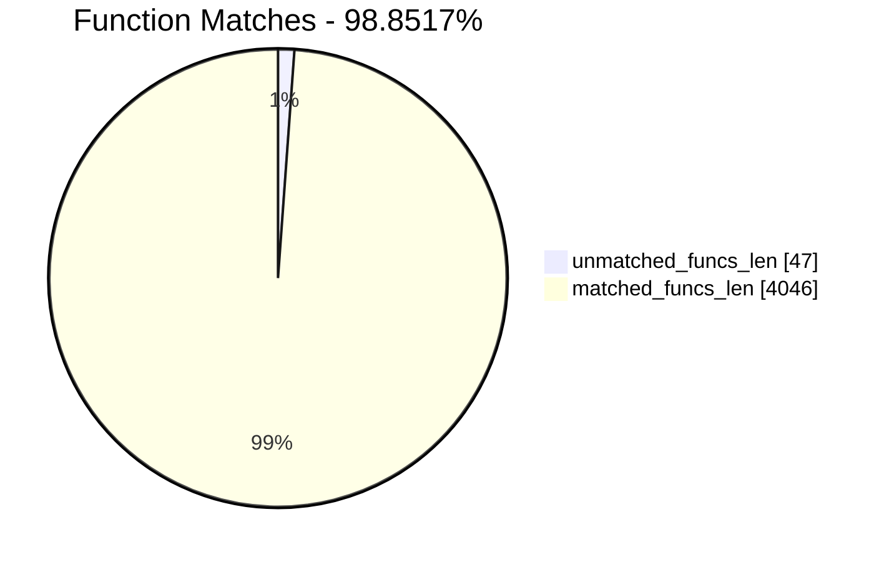
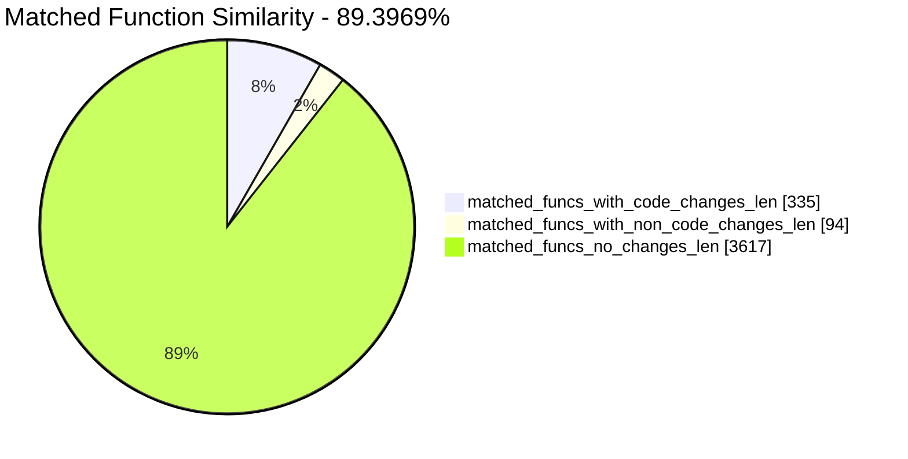
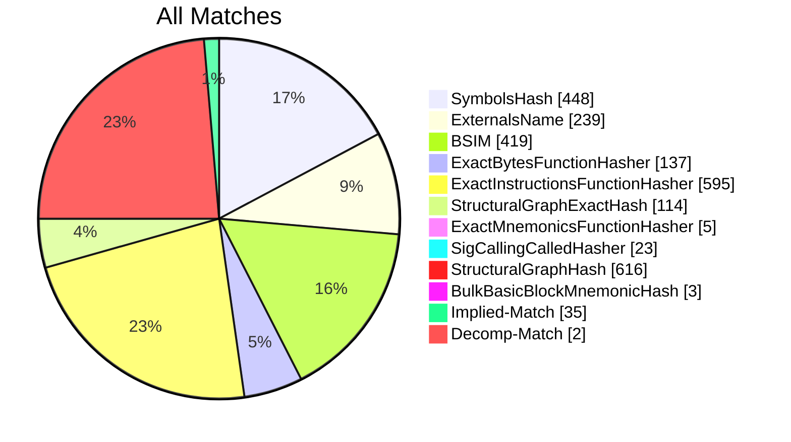
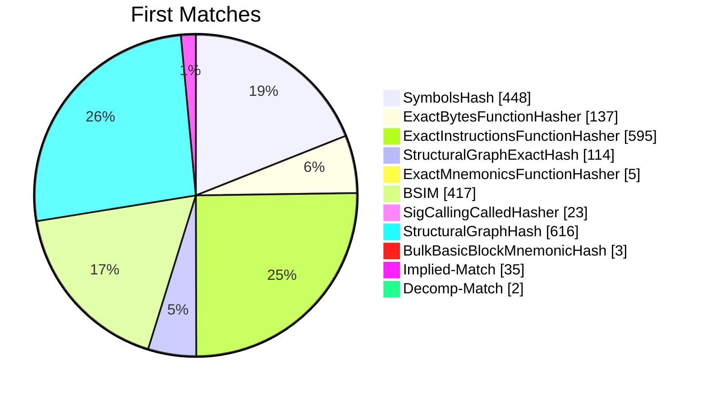
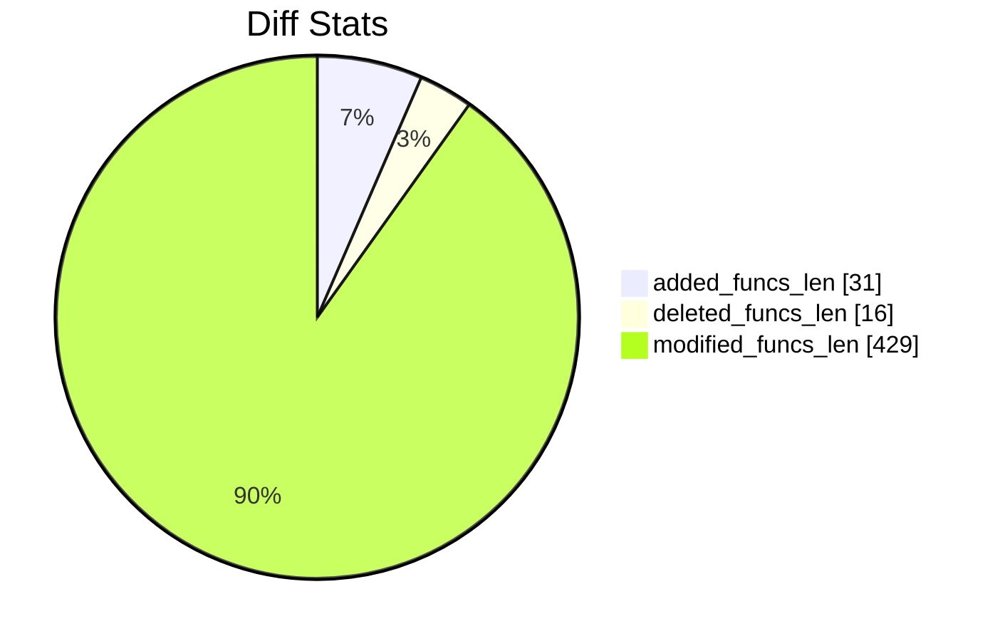
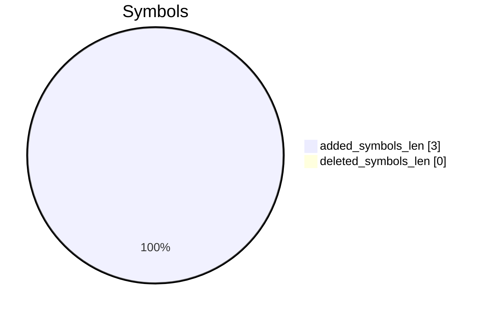
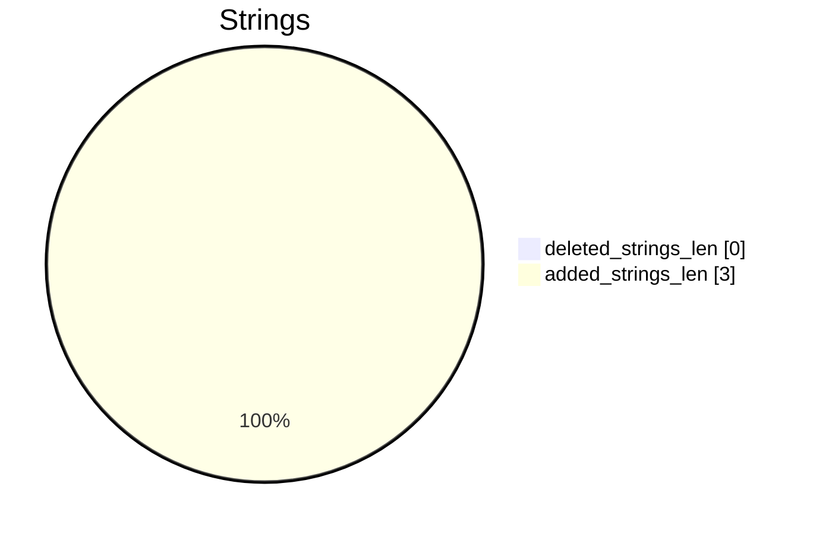

# winrar-x64-712.exe-winrar-x64-713.exe Diff

# TOC

* [Visual Chart Diff](#visual-chart-diff)
* [Metadata](#metadata)
	* [Ghidra Diff Engine](#ghidra-diff-engine)
		* [Command Line](#command-line)
	* [Binary Metadata Diff](#binary-metadata-diff)
	* [Program Options](#program-options)
	* [Diff Stats](#diff-stats)
	* [Strings](#strings)
* [Deleted](#deleted)
	* [FUN_1400037f4](#fun_1400037f4)
	* [FUN_140003ec4](#fun_140003ec4)
	* [FUN_1400137f4](#fun_1400137f4)
	* [FUN_140013880](#fun_140013880)
	* [FUN_14001abc8](#fun_14001abc8)
	* [FUN_1400224d0](#fun_1400224d0)
	* [FUN_14002433c](#fun_14002433c)
	* [FUN_14002a234](#fun_14002a234)
	* [_byteswap_uint64](#_byteswap_uint64)
	* [FUN_14002fe98](#fun_14002fe98)
	* [FUN_140035630](#fun_140035630)
	* [FUN_140036140](#fun_140036140)
	* [FUN_140038da0](#fun_140038da0)
	* [FUN_14003b044](#fun_14003b044)
	* [__acrt_initialize_fma3](#__acrt_initialize_fma3)
	* [FUN_14003b8a0](#fun_14003b8a0)
* [Added](#added)
	* [FUN_140003ad0](#fun_140003ad0)
	* [FUN_140003be8](#fun_140003be8)
	* [FUN_1400041a8](#fun_1400041a8)
	* [FUN_1400100f4](#fun_1400100f4)
	* [FUN_140013dec](#fun_140013dec)
	* [FUN_1400142d8](#fun_1400142d8)
	* [FUN_1400143d8](#fun_1400143d8)
	* [FUN_140015240](#fun_140015240)
	* [FUN_14001b430](#fun_14001b430)
	* [FUN_14001de14](#fun_14001de14)
	* [FUN_140024218](#fun_140024218)
	* [FUN_140024410](#fun_140024410)
	* [FUN_1400245e0](#fun_1400245e0)
	* [FUN_140024720](#fun_140024720)
	* [FUN_140024910](#fun_140024910)
	* [FUN_140024a70](#fun_140024a70)
	* [FUN_140024e30](#fun_140024e30)
	* [FUN_140024f90](#fun_140024f90)
	* [FUN_140025090](#fun_140025090)
	* [FUN_1400252a0](#fun_1400252a0)
	* [FUN_140027888](#fun_140027888)
	* [_set_new_handler](#_set_new_handler)
	* [FUN_1400344a8](#fun_1400344a8)
	* [FUN_1400346a0](#fun_1400346a0)
	* [FUN_1400373b0](#fun_1400373b0)
	* [FUN_140037f10](#fun_140037f10)
	* [FUN_14003a4f0](#fun_14003a4f0)
	* [FUN_14003a9f0](#fun_14003a9f0)
	* [FUN_14003cde0](#fun_14003cde0)
	* [FUN_14003fa90](#fun_14003fa90)
	* [KERNEL32.DLL::InitializeCriticalSectionEx](#kernel32dllinitializecriticalsectionex)
* [Modified](#modified)
	* [wcsncmp](#wcsncmp)
	* [FUN_140015340](#fun_140015340)
	* [FUN_14001a8d4](#fun_14001a8d4)
	* [FUN_14000d968](#fun_14000d968)
	* [__scrt_unhandled_exception_filter](#__scrt_unhandled_exception_filter)
	* [FUN_14000e068](#fun_14000e068)
	* [FUN_1400303d0](#fun_1400303d0)
	* [FUN_14001cfa8](#fun_14001cfa8)
	* [FUN_1400291a4](#fun_1400291a4)
	* [FUN_140024c10](#fun_140024c10)
	* [FUN_140014140](#fun_140014140)
	* [FUN_140038fb8](#fun_140038fb8)
	* [FUN_14000d650](#fun_14000d650)
	* [FUN_140036cd0](#fun_140036cd0)
	* [FUN_140021f70](#fun_140021f70)
	* [FUN_14000aa2c](#fun_14000aa2c)
	* [FUN_14002fb14](#fun_14002fb14)
	* [FUN_140019728](#fun_140019728)
	* [FUN_14002e8e0](#fun_14002e8e0)
	* [FUN_1400164d4](#fun_1400164d4)
	* [FUN_14003b598](#fun_14003b598)
	* [FUN_140028dd0](#fun_140028dd0)
	* [FUN_14003bb38](#fun_14003bb38)
	* [FUN_14001be20](#fun_14001be20)
	* [std::_Allocate_manually_vector_aligned<struct_std::_Default_allocate_traits>](#std_allocate_manually_vector_alignedstruct_std_default_allocate_traits)
	* [FUN_1400183c0](#fun_1400183c0)
	* [FUN_14001b804](#fun_14001b804)
	* [FUN_1400180fc](#fun_1400180fc)
	* [FUN_14000a720](#fun_14000a720)
	* [FUN_1400150e8](#fun_1400150e8)
	* [FUN_140019c04](#fun_140019c04)
	* [FUN_14001e4b0](#fun_14001e4b0)
	* [FUN_140027d20](#fun_140027d20)
	* [FUN_14001b680](#fun_14001b680)
	* [FUN_14001ddc4](#fun_14001ddc4)
	* [FUN_140018270](#fun_140018270)
	* [FUN_14001f2f4](#fun_14001f2f4)
	* [FUN_1400151ec](#fun_1400151ec)
	* [FUN_140038498](#fun_140038498)
	* [__std_type_info_compare](#__std_type_info_compare)
	* [FUN_14003397c](#fun_14003397c)
	* [FUN_1400147d8](#fun_1400147d8)
	* [FUN_140035850](#fun_140035850)
	* [FUN_14002ffac](#fun_14002ffac)
	* [FUN_140018da8](#fun_140018da8)
	* [FUN_140019ed0](#fun_140019ed0)
	* [FUN_140018844](#fun_140018844)
	* [FUN_14000d448](#fun_14000d448)
	* [__acrt_call_reportfault](#__acrt_call_reportfault)
	* [FUN_14000e9d0](#fun_14000e9d0)
	* [FUN_1400307d0](#fun_1400307d0)
	* [FUN_14000e3c0](#fun_14000e3c0)
	* [FUN_1400195e4](#fun_1400195e4)
	* [FUN_14001bad0](#fun_14001bad0)
	* [FUN_140015444](#fun_140015444)
	* [FUN_140025f50](#fun_140025f50)
	* [FUN_140008c84](#fun_140008c84)
	* [FUN_14000438c](#fun_14000438c)
	* [FUN_1400284d8](#fun_1400284d8)
	* [FUN_1400091ac](#fun_1400091ac)
	* [__vcrt_getptd_noexit](#__vcrt_getptd_noexit)
	* [FUN_14000fbfc](#fun_14000fbfc)
	* [FUN_140025924](#fun_140025924)
	* [FUN_14000a2ac](#fun_14000a2ac)
	* [FUN_14002a148](#fun_14002a148)
	* [FUN_1400025c0](#fun_1400025c0)
	* [FUN_14000dbc0](#fun_14000dbc0)
	* [FUN_140025c58](#fun_140025c58)
	* [FUN_140024930](#fun_140024930)
	* [FUN_140029018](#fun_140029018)
	* [FUN_140017678](#fun_140017678)
	* [FUN_140024d9c](#fun_140024d9c)
	* [FUN_14001b020](#fun_14001b020)
	* [FUN_14001a9dc](#fun_14001a9dc)
	* [FUN_14000a588](#fun_14000a588)
	* [FUN_14001a744](#fun_14001a744)
	* [FUN_14000d5b0](#fun_14000d5b0)
	* [FUN_140025168](#fun_140025168)
	* [FUN_1400093fc](#fun_1400093fc)
	* [FUN_14002b160](#fun_14002b160)
	* [FUN_14001dec8](#fun_14001dec8)
	* [FUN_140034b5c](#fun_140034b5c)
	* [FUN_140019848](#fun_140019848)
	* [FUN_1400345c4](#fun_1400345c4)
	* [FUN_140011290](#fun_140011290)
	* [FUN_14002216c](#fun_14002216c)
	* [FUN_1400235b0](#fun_1400235b0)
	* [FUN_14001a3d8](#fun_14001a3d8)
	* [FUN_140012d00](#fun_140012d00)
	* [FUN_14002e844](#fun_14002e844)
	* [__acrt_initialize_stdio](#__acrt_initialize_stdio)
	* [FUN_14002fe64](#fun_14002fe64)
	* [FUN_14002f3f4](#fun_14002f3f4)
	* [_wcsdup](#_wcsdup)
	* [FUN_14001553c](#fun_14001553c)
	* [FUN_14001a4f4](#fun_14001a4f4)
	* [FUN_14003716c](#fun_14003716c)
	* [FUN_1400282a0](#fun_1400282a0)
	* [__acrt_initialize_clock](#__acrt_initialize_clock)
	* [FUN_140001190](#fun_140001190)
	* [FUN_140038930](#fun_140038930)
	* [FUN_140028f64](#fun_140028f64)
	* [_IsNonwritableInCurrentImage](#_isnonwritableincurrentimage)
	* [FUN_140003ad8](#fun_140003ad8)
	* [FUN_140029544](#fun_140029544)
	* [FUN_140007ac0](#fun_140007ac0)
	* [FUN_140014030](#fun_140014030)
	* [FUN_14003879c](#fun_14003879c)
	* [FUN_14002febc](#fun_14002febc)
	* [FUN_140013f60](#fun_140013f60)
	* [FUN_14002e01c](#fun_14002e01c)
	* [FUN_1400163ac](#fun_1400163ac)
	* [FUN_14002536c](#fun_14002536c)
	* [FUN_1400181c4](#fun_1400181c4)
	* [FUN_14001b1d0](#fun_14001b1d0)
	* [FUN_14000605c](#fun_14000605c)
	* [FUN_140013f9c](#fun_140013f9c)
	* [FUN_140039fb0](#fun_140039fb0)
	* [FUN_140019564](#fun_140019564)
	* [FUN_140017a84](#fun_140017a84)
	* [FUN_14001f39c](#fun_14001f39c)
	* [FUN_1400016d8](#fun_1400016d8)
	* [FUN_140010380](#fun_140010380)
	* [_configure_narrow_argv](#_configure_narrow_argv)
	* [FUN_1400398e0](#fun_1400398e0)
	* [FUN_1400111e0](#fun_1400111e0)
	* [FUN_140023a90](#fun_140023a90)
	* [FUN_140014b68](#fun_140014b68)
	* [FUN_14003b570](#fun_14003b570)
	* [FUN_14003ad34](#fun_14003ad34)
	* [FUN_140032244](#fun_140032244)
	* [FUN_140027ab0](#fun_140027ab0)
	* [FUN_14003ada8](#fun_14003ada8)
	* [FUN_140025594](#fun_140025594)
	* [FUN_140008300](#fun_140008300)
	* [FUN_14001bcbc](#fun_14001bcbc)
	* [FUN_1400032b8](#fun_1400032b8)
	* [FUN_140031e8c](#fun_140031e8c)
	* [FUN_14000731c](#fun_14000731c)
	* [_get_narrow_winmain_command_line](#_get_narrow_winmain_command_line)
	* [FUN_140008f10](#fun_140008f10)
	* [FUN_140004b58](#fun_140004b58)
	* [FUN_14000ed94](#fun_14000ed94)
	* [FUN_140002760](#fun_140002760)
	* [FUN_140011fb0](#fun_140011fb0)
	* [FUN_140011cfc](#fun_140011cfc)
	* [FUN_14000eebc](#fun_14000eebc)
	* [__DestructExceptionObject](#__destructexceptionobject)
	* [FUN_140022058](#fun_140022058)
	* [FUN_14002a2ac](#fun_14002a2ac)
	* [FUN_14003a954](#fun_14003a954)
	* [FUN_140025fd0](#fun_140025fd0)
	* [FUN_1400275ac](#fun_1400275ac)
	* [FUN_1400351f0](#fun_1400351f0)
	* [FUN_1400132a0](#fun_1400132a0)
	* [FUN_140017f14](#fun_140017f14)
	* [FUN_140017e8c](#fun_140017e8c)
	* [FUN_14003d8cf](#fun_14003d8cf)
	* [FUN_1400147b8](#fun_1400147b8)
	* [FUN_14003a0e8](#fun_14003a0e8)
	* [FUN_14000fa64](#fun_14000fa64)
	* [FUN_14000f9ec](#fun_14000f9ec)
	* [FUN_140007068](#fun_140007068)
	* [__GSHandlerCheckCommon](#__gshandlercheckcommon)
	* [FUN_14003ab1c](#fun_14003ab1c)
	* [__acrt_initialize_ptd](#__acrt_initialize_ptd)
	* [FUN_14002fcd0](#fun_14002fcd0)
	* [FUN_140008218](#fun_140008218)
	* [FUN_14002fd9c](#fun_14002fd9c)
	* [FUN_140014d0c](#fun_140014d0c)
	* [FUN_14001c35c](#fun_14001c35c)
	* [FUN_14000fb20](#fun_14000fb20)
	* [FUN_140019118](#fun_140019118)
	* [FUN_140025460](#fun_140025460)
	* [FUN_14001ef18](#fun_14001ef18)
	* [FUN_14000d134](#fun_14000d134)
	* [FUN_14001ea20](#fun_14001ea20)
	* [FUN_14001a34c](#fun_14001a34c)
	* [_controlfp_s](#_controlfp_s)
	* [__security_init_cookie](#__security_init_cookie)
	* [FUN_140015900](#fun_140015900)
	* [FUN_1400115b8](#fun_1400115b8)
	* [initialize_inherited_file_handles_nolock](#initialize_inherited_file_handles_nolock)
	* [FUN_14000a3b8](#fun_14000a3b8)
	* [FUN_14001a308](#fun_14001a308)
	* [FUN_140033d44](#fun_140033d44)
	* [FUN_14001afbc](#fun_14001afbc)
	* [FUN_14002efd4](#fun_14002efd4)
	* [__ArrayUnwind](#__arrayunwind)
	* [FUN_140015788](#fun_140015788)
	* [FUN_140008c0c](#fun_140008c0c)
	* [FUN_14001bc50](#fun_14001bc50)
	* [std::_Adjust_manually_vector_aligned](#std_adjust_manually_vector_aligned)
	* [FUN_14003853c](#fun_14003853c)
	* [FUN_140030b58](#fun_140030b58)
	* [FUN_1400073e0](#fun_1400073e0)
	* [FUN_14002a870](#fun_14002a870)
	* [FUN_14001d6e4](#fun_14001d6e4)
	* [FUN_140038580](#fun_140038580)
	* [FUN_14000eab8](#fun_14000eab8)
	* [_strdup](#_strdup)
	* [Max Modified Section Functions Reached Error](#max-modified-section-functions-reached-error)
* [Modified (No Code Changes)](#modified-no-code-changes)
	* [Section Skipped](#section-skipped)

# Visual Chart Diff

```mermaid

flowchart LR

wcsncmp-3-old<--Match 92%-->wcsncmp-3-new
FUN_140015340-2-old<--Match 99%-->FUN_1400159d4-2-new
FUN_14001a8d4-2-old<--Match 83%-->FUN_14001b068-2-new
FUN_14000d968-3-old<--Match 98%-->FUN_14000de08-3-new
__scrt_unhandled_exception_filter-1-old<--Match 48%-->FUN_14003734c-1-new
FUN_14000e068-4-old<--Match 99%-->FUN_14000e518-4-new
FUN_1400303d0-1-old<--Match 90%-->FUN_140031c68-1-new
FUN_14001cfa8-1-old<--Match 98%-->FUN_14001d80c-1-new
FUN_1400291a4-4-old<--Match 98%-->FUN_14002abec-4-new
FUN_140024c10-1-old<--Match 99%-->FUN_140026648-1-new
FUN_140014140-1-old<--Match 99%-->FUN_1400147b8-1-new
FUN_140038fb8-5-old<--Match 92%-->FUN_14003ac20-5-new
FUN_14000d650-4-old<--Match 96%-->FUN_14000daf4-4-new
FUN_140036cd0-2-old<--Match 90%-->FUN_140038ac0-2-new
FUN_140021f70-1-old<--Match 96%-->FUN_1400227f4-1-new
FUN_14000aa2c-4-old<--Match 99%-->FUN_14000aeb4-4-new
FUN_14002fb14-2-old<--Match 99%-->FUN_1400313fc-2-new
FUN_140019728-1-old<--Match 97%-->FUN_140019ea0-1-new
FUN_14002e8e0-2-old<--Match 47%-->FUN_140032550-2-new
FUN_1400164d4-2-old<--Match 93%-->FUN_140016bbc-2-new
FUN_14003b598-7-old<--Match 79%-->FUN_14003d1b0-7-new
FUN_140028dd0-1-old<--Match 99%-->FH4HandlerMap4DecompHandler-1-new
FUN_14003bb38-2-old<--Match 18%-->FUN_140032ec0-2-new
FUN_14001be20-2-old<--Match 99%-->FUN_14001c684-2-new
std_Allocate_manually_vector_alignedstruct_std_Default_allocate_traits-1-old<--Match 85%-->FUN_140001ea4-1-new
FUN_1400183c0-4-old<--Match 97%-->FUN_140018ad0-4-new
winrar-x64-712.exe<--310ommited-->winrar-x64-713.exe

subgraph winrar-x64-713.exe
    wcsncmp-3-new
FUN_1400159d4-2-new
FUN_14001b068-2-new
FUN_14000de08-3-new
FUN_14003734c-1-new
FUN_14000e518-4-new
FUN_140031c68-1-new
FUN_14001d80c-1-new
FUN_14002abec-4-new
FUN_140026648-1-new
FUN_1400147b8-1-new
FUN_14003ac20-5-new
FUN_14000daf4-4-new
FUN_140038ac0-2-new
FUN_1400227f4-1-new
FUN_14000aeb4-4-new
FUN_1400313fc-2-new
FUN_140019ea0-1-new
FUN_140032550-2-new
FUN_140016bbc-2-new
FUN_14003d1b0-7-new
FH4HandlerMap4DecompHandler-1-new
FUN_140032ec0-2-new
FUN_14001c684-2-new
FUN_140001ea4-1-new
FUN_140018ad0-4-new
    subgraph Added
direction LR
FUN_140003ad0
    FUN_140003be8
    FUN_1400041a8
    FUN_1400100f4
    FUN_140013dec
    FUN_1400142d8
    FUN_1400143d8
    FUN_140015240
    FUN_14001b430
    FUN_14001de14
    FUN_140024218
    FUN_140024410
    FUN_1400245e0
    FUN_140024720
    FUN_140024910
    FUN_140024a70
    FUN_140024e30
    FUN_140024f90
    FUN_140025090
    FUN_1400252a0
    FUN_140027888
    _set_new_handler
    FUN_1400344a8
    FUN_1400346a0
    FUN_1400373b0
    FUN_140037f10
    FUN_14003a4f0
    6_more_added_funcs_omitted
end
end

subgraph winrar-x64-712.exe
    wcsncmp-3-old
FUN_140015340-2-old
FUN_14001a8d4-2-old
FUN_14000d968-3-old
__scrt_unhandled_exception_filter-1-old
FUN_14000e068-4-old
FUN_1400303d0-1-old
FUN_14001cfa8-1-old
FUN_1400291a4-4-old
FUN_140024c10-1-old
FUN_140014140-1-old
FUN_140038fb8-5-old
FUN_14000d650-4-old
FUN_140036cd0-2-old
FUN_140021f70-1-old
FUN_14000aa2c-4-old
FUN_14002fb14-2-old
FUN_140019728-1-old
FUN_14002e8e0-2-old
FUN_1400164d4-2-old
FUN_14003b598-7-old
FUN_140028dd0-1-old
FUN_14003bb38-2-old
FUN_14001be20-2-old
std_Allocate_manually_vector_alignedstruct_std_Default_allocate_traits-1-old
FUN_1400183c0-4-old
    subgraph Deleted
direction LR
FUN_1400037f4
    FUN_140003ec4
    FUN_1400137f4
    FUN_140013880
    FUN_14001abc8
    FUN_1400224d0
    FUN_14002433c
    FUN_14002a234
    _byteswap_uint64
    FUN_14002fe98
    FUN_140035630
    FUN_140036140
    FUN_140038da0
    FUN_14003b044
    __acrt_initialize_fma3
    FUN_14003b8a0
end
end

```










# Metadata

## Ghidra Diff Engine

### Command Line

#### Captured Command Line


```
ghidriff --project-location ghidra_projects --project-name ghidriff --symbols-path symbols --gzfs-path gzfs --threaded --log-level INFO --file-log-level INFO --log-path ghidriff.log --min-func-len 10 --gdt [] --bsim --max-ram-percent 60.0 --max-section-funcs 200 winrar-x64-712.exe winrar-x64-713.exe
```


#### Verbose Args


<details>

```
--old ['winrar-x64-712.exe'] --new [['winrar-x64-713.exe']] --engine VersionTrackingDiff --output-path PatchDiffVersion/ --summary False --project-location ghidra_projects --project-name ghidriff --symbols-path symbols --gzfs-path gzfs --base-address None --program-options None --threaded True --force-analysis False --force-diff False --no-symbols False --log-level INFO --file-log-level INFO --log-path ghidriff.log --va False --min-func-len 10 --use-calling-counts False --gdt [] --bsim True --bsim-full False --max-ram-percent 60.0 --print-flags False --jvm-args None --side-by-side False --max-section-funcs 200 --md-title None
```


</details>

#### Download Original PEs


```
wget https://msdl.microsoft.com/download/symbols/WinRAR.exe/6859079184000/WinRAR.exe -O winrar.exe.x64.7.12.0
wget https://msdl.microsoft.com/download/symbols/WinRAR.exe/6887424F8A000/WinRAR.exe -O winrar.exe.x64.7.13.0
```


## Binary Metadata Diff


```diff
--- winrar-x64-712.exe Meta
+++ winrar-x64-713.exe Meta
@@ -1,43 +1,43 @@
-Program Name: winrar-x64-712.exe
+Program Name: winrar-x64-713.exe
 Language ID: x86:LE:64:default (4.6)
 Compiler ID: windows
 Processor: x86
 Endian: Little
 Address Size: 64
 Minimum Address: 140000000
 Maximum Address: ff0000184f
-# of Bytes: 531428
-# of Memory Blocks: 9
-# of Instructions: 64724
-# of Defined Data: 4130
-# of Functions: 2033
-# of Symbols: 10756
-# of Data Types: 711
-# of Data Type Categories: 42
+# of Bytes: 550036
+# of Memory Blocks: 10
+# of Instructions: 66477
+# of Defined Data: 4192
+# of Functions: 2060
+# of Symbols: 10923
+# of Data Types: 700
+# of Data Type Categories: 41
 Analyzed: true
 Compiler: visualstudio:unknown
 Created With Ghidra Version: 11.4
-Date Created: Thu Sep 18 23:07:57 MDT 2025
+Date Created: Thu Sep 18 23:08:01 MDT 2025
 Executable Format: Portable Executable (PE)
-Executable Location: /media/conntrack/Seagate1/git/horizon3ai/interview2/winrar-x64-712.exe
-Executable MD5: 3618eaf32ece6218cc52e95f849c05a6
-Executable SHA256: 80ab68244a0d86600ab250e8dba551b87f7f8b4603e2300b3bcbd7e870e90f91
-FSRL: file:///media/conntrack/Seagate1/git/horizon3ai/interview2/winrar-x64-712.exe?MD5=3618eaf32ece6218cc52e95f849c05a6
+Executable Location: /media/conntrack/Seagate1/git/horizon3ai/interview2/winrar-x64-713.exe
+Executable MD5: 53ef4972d65304468d2519aa692001c8
+Executable SHA256: dbc951b4ab01646888b2a91da73a94dd920054c2f27c8cfeacae3eba298e71b0
+FSRL: file:///media/conntrack/Seagate1/git/horizon3ai/interview2/winrar-x64-713.exe?MD5=53ef4972d65304468d2519aa692001c8
 PDB Age: 1
 PDB File: sfxrar.pdb
-PDB GUID: 43d6d7ef-e283-4e62-89b5-5a0d83c44395
+PDB GUID: 8127c435-7c9e-4136-9c71-9e007ca98bfe
 PDB Version: RSDS
 PE Property[CompanyName]: Alexander Roshal
 PE Property[FileDescription]: WinRAR
-PE Property[FileVersion]: 7.12.0
+PE Property[FileVersion]: 7.13.0
 PE Property[InternalName]: WinRAR
 PE Property[LegalCopyright]: Copyright © Alexander Roshal 1993-2025
 PE Property[OriginalFilename]: WinRAR.exe
 PE Property[ProductName]: WinRAR
-PE Property[ProductVersion]: 7.12.0
+PE Property[ProductVersion]: 7.13.0
 PE Property[Translation]: 4e40409
 Preferred Root Namespace Category: 
 RTTI Found: true
 Relocatable: true
 SectionAlignment: 4096
 Should Ask To Analyze: false

```


## Program Options


<details>
<summary>Ghidra winrar-x64-712.exe Decompiler Options</summary>


|Decompiler Option|Value|
| :---: | :---: |
|Prototype Evaluation|__fastcall|

</details>


<details>
<summary>Ghidra winrar-x64-712.exe Specification extensions Options</summary>


|Specification extensions Option|Value|
| :---: | :---: |
|FormatVersion|0|
|VersionCounter|0|

</details>


<details>
<summary>Ghidra winrar-x64-712.exe Analyzers Options</summary>


|Analyzers Option|Value|
| :---: | :---: |
|ASCII Strings|true|
|ASCII Strings.Create Strings Containing Existing Strings|true|
|ASCII Strings.Create Strings Containing References|true|
|ASCII Strings.Force Model Reload|false|
|ASCII Strings.Minimum String Length|LEN_5|
|ASCII Strings.Model File|StringModel.sng|
|ASCII Strings.Require Null Termination for String|true|
|ASCII Strings.Search Only in Accessible Memory Blocks|true|
|ASCII Strings.String Start Alignment|ALIGN_1|
|ASCII Strings.String end alignment|4|
|Aggressive Instruction Finder|false|
|Aggressive Instruction Finder.Create Analysis Bookmarks|true|
|Apply Data Archives|true|
|Apply Data Archives.Archive Chooser|[Auto-Detect]|
|Apply Data Archives.Create Analysis Bookmarks|true|
|Apply Data Archives.GDT User File Archive Path|None|
|Apply Data Archives.User Project Archive Path|None|
|Call Convention ID|true|
|Call Convention ID.Analysis Decompiler Timeout (sec)|60|
|Call-Fixup Installer|true|
|Condense Filler Bytes|false|
|Condense Filler Bytes.Filler Value|Auto|
|Condense Filler Bytes.Minimum number of sequential bytes|1|
|Create Address Tables|true|
|Create Address Tables.Allow Offcut References|false|
|Create Address Tables.Auto Label Table|false|
|Create Address Tables.Create Analysis Bookmarks|true|
|Create Address Tables.Maxmimum Pointer Distance|16777215|
|Create Address Tables.Minimum Pointer Address|4132|
|Create Address Tables.Minimum Table Size|2|
|Create Address Tables.Pointer Alignment|1|
|Create Address Tables.Relocation Table Guide|true|
|Create Address Tables.Table Alignment|4|
|Data Reference|true|
|Data Reference.Address Table Alignment|1|
|Data Reference.Address Table Minimum Size|2|
|Data Reference.Align End of Strings|false|
|Data Reference.Ascii String References|true|
|Data Reference.Create Address Tables|true|
|Data Reference.Minimum String Length|5|
|Data Reference.References to Pointers|true|
|Data Reference.Relocation Table Guide|true|
|Data Reference.Respect Execute Flag|true|
|Data Reference.Subroutine References|true|
|Data Reference.Switch Table References|false|
|Data Reference.Unicode String References|true|
|Decompiler Parameter ID|true|
|Decompiler Parameter ID.Analysis Clear Level|ANALYSIS|
|Decompiler Parameter ID.Analysis Decompiler Timeout (sec)|60|
|Decompiler Parameter ID.Commit Data Types|true|
|Decompiler Parameter ID.Commit Void Return Values|false|
|Decompiler Parameter ID.Prototype Evaluation|__fastcall|
|Decompiler Switch Analysis|true|
|Decompiler Switch Analysis.Analysis Decompiler Timeout (sec)|60|
|Demangler Microsoft|true|
|Demangler Microsoft.Apply Function Calling Conventions|true|
|Demangler Microsoft.Apply Function Signatures|true|
|Demangler Microsoft.C-Style Symbol Interpretation|FUNCTION_IF_EXISTS|
|Demangler Microsoft.Demangle Only Known Mangled Symbols|false|
|Disassemble Entry Points|true|
|Disassemble Entry Points.Respect Execute Flag|true|
|Embedded Media|true|
|Embedded Media.Create Analysis Bookmarks|true|
|External Entry References|true|
|Function ID|true|
|Function ID.Always Apply FID Labels|false|
|Function ID.Create Analysis Bookmarks|true|
|Function ID.Instruction Count Threshold|14.6|
|Function ID.Multiple Match Threshold|30.0|
|Function Start Search|true|
|Function Start Search.Bookmark Functions|false|
|Function Start Search.Search Data Blocks|false|
|Non-Returning Functions - Discovered|true|
|Non-Returning Functions - Discovered.Create Analysis Bookmarks|true|
|Non-Returning Functions - Discovered.Function Non-return Threshold|3|
|Non-Returning Functions - Discovered.Repair Flow Damage|true|
|Non-Returning Functions - Known|true|
|Non-Returning Functions - Known.Create Analysis Bookmarks|true|
|PDB MSDIA|false|
|PDB MSDIA.Search untrusted symbol servers|false|
|PDB Universal|true|
|PDB Universal.Import Source Line Info|true|
|PDB Universal.Search untrusted symbol servers|false|
|Reference|true|
|Reference.Address Table Alignment|1|
|Reference.Address Table Minimum Size|2|
|Reference.Align End of Strings|false|
|Reference.Ascii String References|true|
|Reference.Create Address Tables|true|
|Reference.Minimum String Length|5|
|Reference.References to Pointers|true|
|Reference.Relocation Table Guide|true|
|Reference.Respect Execute Flag|true|
|Reference.Subroutine References|true|
|Reference.Switch Table References|false|
|Reference.Unicode String References|true|
|Scalar Operand References|true|
|Scalar Operand References.Relocation Table Guide|true|
|Shared Return Calls|true|
|Shared Return Calls.Allow Conditional Jumps|false|
|Shared Return Calls.Assume Contiguous Functions Only|true|
|Stack|true|
|Stack.Create Local Variables|true|
|Stack.Create Param Variables|false|
|Stack.Max Threads|2|
|Stack.useNewFunctionStackAnalysis|true|
|Subroutine References|true|
|Subroutine References.Create Thunks Early|true|
|Variadic Function Signature Override|false|
|Variadic Function Signature Override.Create Analysis Bookmarks|false|
|Windows x86 PE Exception Handling|true|
|Windows x86 PE RTTI Analyzer|true|
|Windows x86 Thread Environment Block (TEB) Analyzer|true|
|Windows x86 Thread Environment Block (TEB) Analyzer.Starting Address of the TEB||
|Windows x86 Thread Environment Block (TEB) Analyzer.Windows OS Version|Windows 7|
|WindowsPE x86 Propagate External Parameters|false|
|WindowsResourceReference|true|
|WindowsResourceReference.Create Analysis Bookmarks|true|
|x86 Constant Reference Analyzer|true|
|x86 Constant Reference Analyzer.Create Data from pointer|false|
|x86 Constant Reference Analyzer.Function parameter/return Pointer analysis|true|
|x86 Constant Reference Analyzer.Max Threads|2|
|x86 Constant Reference Analyzer.Min absolute reference|4|
|x86 Constant Reference Analyzer.Require pointer param data type|false|
|x86 Constant Reference Analyzer.Speculative reference max|256|
|x86 Constant Reference Analyzer.Speculative reference min|1024|
|x86 Constant Reference Analyzer.Stored Value Pointer analysis|true|
|x86 Constant Reference Analyzer.Trust values read from writable memory|true|

</details>


<details>
<summary>Ghidra winrar-x64-713.exe Decompiler Options</summary>


|Decompiler Option|Value|
| :---: | :---: |
|Prototype Evaluation|__fastcall|

</details>


<details>
<summary>Ghidra winrar-x64-713.exe Specification extensions Options</summary>


|Specification extensions Option|Value|
| :---: | :---: |
|FormatVersion|0|
|VersionCounter|0|

</details>


<details>
<summary>Ghidra winrar-x64-713.exe Analyzers Options</summary>


|Analyzers Option|Value|
| :---: | :---: |
|ASCII Strings|true|
|ASCII Strings.Create Strings Containing Existing Strings|true|
|ASCII Strings.Create Strings Containing References|true|
|ASCII Strings.Force Model Reload|false|
|ASCII Strings.Minimum String Length|LEN_5|
|ASCII Strings.Model File|StringModel.sng|
|ASCII Strings.Require Null Termination for String|true|
|ASCII Strings.Search Only in Accessible Memory Blocks|true|
|ASCII Strings.String Start Alignment|ALIGN_1|
|ASCII Strings.String end alignment|4|
|Aggressive Instruction Finder|false|
|Aggressive Instruction Finder.Create Analysis Bookmarks|true|
|Apply Data Archives|true|
|Apply Data Archives.Archive Chooser|[Auto-Detect]|
|Apply Data Archives.Create Analysis Bookmarks|true|
|Apply Data Archives.GDT User File Archive Path|None|
|Apply Data Archives.User Project Archive Path|None|
|Call Convention ID|true|
|Call Convention ID.Analysis Decompiler Timeout (sec)|60|
|Call-Fixup Installer|true|
|Condense Filler Bytes|false|
|Condense Filler Bytes.Filler Value|Auto|
|Condense Filler Bytes.Minimum number of sequential bytes|1|
|Create Address Tables|true|
|Create Address Tables.Allow Offcut References|false|
|Create Address Tables.Auto Label Table|false|
|Create Address Tables.Create Analysis Bookmarks|true|
|Create Address Tables.Maxmimum Pointer Distance|16777215|
|Create Address Tables.Minimum Pointer Address|4132|
|Create Address Tables.Minimum Table Size|2|
|Create Address Tables.Pointer Alignment|1|
|Create Address Tables.Relocation Table Guide|true|
|Create Address Tables.Table Alignment|4|
|Data Reference|true|
|Data Reference.Address Table Alignment|1|
|Data Reference.Address Table Minimum Size|2|
|Data Reference.Align End of Strings|false|
|Data Reference.Ascii String References|true|
|Data Reference.Create Address Tables|true|
|Data Reference.Minimum String Length|5|
|Data Reference.References to Pointers|true|
|Data Reference.Relocation Table Guide|true|
|Data Reference.Respect Execute Flag|true|
|Data Reference.Subroutine References|true|
|Data Reference.Switch Table References|false|
|Data Reference.Unicode String References|true|
|Decompiler Parameter ID|true|
|Decompiler Parameter ID.Analysis Clear Level|ANALYSIS|
|Decompiler Parameter ID.Analysis Decompiler Timeout (sec)|60|
|Decompiler Parameter ID.Commit Data Types|true|
|Decompiler Parameter ID.Commit Void Return Values|false|
|Decompiler Parameter ID.Prototype Evaluation|__fastcall|
|Decompiler Switch Analysis|true|
|Decompiler Switch Analysis.Analysis Decompiler Timeout (sec)|60|
|Demangler Microsoft|true|
|Demangler Microsoft.Apply Function Calling Conventions|true|
|Demangler Microsoft.Apply Function Signatures|true|
|Demangler Microsoft.C-Style Symbol Interpretation|FUNCTION_IF_EXISTS|
|Demangler Microsoft.Demangle Only Known Mangled Symbols|false|
|Disassemble Entry Points|true|
|Disassemble Entry Points.Respect Execute Flag|true|
|Embedded Media|true|
|Embedded Media.Create Analysis Bookmarks|true|
|External Entry References|true|
|Function ID|true|
|Function ID.Always Apply FID Labels|false|
|Function ID.Create Analysis Bookmarks|true|
|Function ID.Instruction Count Threshold|14.6|
|Function ID.Multiple Match Threshold|30.0|
|Function Start Search|true|
|Function Start Search.Bookmark Functions|false|
|Function Start Search.Search Data Blocks|false|
|Non-Returning Functions - Discovered|true|
|Non-Returning Functions - Discovered.Create Analysis Bookmarks|true|
|Non-Returning Functions - Discovered.Function Non-return Threshold|3|
|Non-Returning Functions - Discovered.Repair Flow Damage|true|
|Non-Returning Functions - Known|true|
|Non-Returning Functions - Known.Create Analysis Bookmarks|true|
|PDB MSDIA|false|
|PDB MSDIA.Search untrusted symbol servers|false|
|PDB Universal|true|
|PDB Universal.Import Source Line Info|true|
|PDB Universal.Search untrusted symbol servers|false|
|Reference|true|
|Reference.Address Table Alignment|1|
|Reference.Address Table Minimum Size|2|
|Reference.Align End of Strings|false|
|Reference.Ascii String References|true|
|Reference.Create Address Tables|true|
|Reference.Minimum String Length|5|
|Reference.References to Pointers|true|
|Reference.Relocation Table Guide|true|
|Reference.Respect Execute Flag|true|
|Reference.Subroutine References|true|
|Reference.Switch Table References|false|
|Reference.Unicode String References|true|
|Scalar Operand References|true|
|Scalar Operand References.Relocation Table Guide|true|
|Shared Return Calls|true|
|Shared Return Calls.Allow Conditional Jumps|false|
|Shared Return Calls.Assume Contiguous Functions Only|true|
|Stack|true|
|Stack.Create Local Variables|true|
|Stack.Create Param Variables|false|
|Stack.Max Threads|2|
|Stack.useNewFunctionStackAnalysis|true|
|Subroutine References|true|
|Subroutine References.Create Thunks Early|true|
|Variadic Function Signature Override|false|
|Variadic Function Signature Override.Create Analysis Bookmarks|false|
|Windows x86 PE Exception Handling|true|
|Windows x86 PE RTTI Analyzer|true|
|Windows x86 Thread Environment Block (TEB) Analyzer|true|
|Windows x86 Thread Environment Block (TEB) Analyzer.Starting Address of the TEB||
|Windows x86 Thread Environment Block (TEB) Analyzer.Windows OS Version|Windows 7|
|WindowsPE x86 Propagate External Parameters|false|
|WindowsResourceReference|true|
|WindowsResourceReference.Create Analysis Bookmarks|true|
|x86 Constant Reference Analyzer|true|
|x86 Constant Reference Analyzer.Create Data from pointer|false|
|x86 Constant Reference Analyzer.Function parameter/return Pointer analysis|true|
|x86 Constant Reference Analyzer.Max Threads|2|
|x86 Constant Reference Analyzer.Min absolute reference|4|
|x86 Constant Reference Analyzer.Require pointer param data type|false|
|x86 Constant Reference Analyzer.Speculative reference max|256|
|x86 Constant Reference Analyzer.Speculative reference min|1024|
|x86 Constant Reference Analyzer.Stored Value Pointer analysis|true|
|x86 Constant Reference Analyzer.Trust values read from writable memory|true|

</details>

## Diff Stats


|Stat|Value|
| :---: | :---: |
|added_funcs_len|31|
|deleted_funcs_len|16|
|modified_funcs_len|429|
|added_symbols_len|3|
|deleted_symbols_len|0|
|diff_time|58.46660137176514|
|deleted_strings_len|0|
|added_strings_len|3|
|match_types|Counter({'StructuralGraphHash': 616, 'ExactInstructionsFunctionHasher': 595, 'SymbolsHash': 448, 'BSIM': 419, 'ExternalsName': 239, 'ExactBytesFunctionHasher': 137, 'StructuralGraphExactHash': 114, 'Implied Match': 35, 'SigCallingCalledHasher': 23, 'ExactMnemonicsFunctionHasher': 5, 'BulkBasicBlockMnemonicHash': 3, 'Decomp Match': 2})|
|items_to_process|479|
|diff_types|Counter({'address': 427, 'name': 409, 'fullname': 409, 'sig': 409, 'length': 380, 'calling': 375, 'code': 335, 'called': 326, 'refcount': 93, 'parent': 6})|
|unmatched_funcs_len|47|
|total_funcs_len|4093|
|matched_funcs_len|4046|
|matched_funcs_with_code_changes_len|335|
|matched_funcs_with_non_code_changes_len|94|
|matched_funcs_no_changes_len|3617|
|match_func_similarity_percent|89.3969%|
|func_match_overall_percent|98.8517%|
|first_matches|Counter({'StructuralGraphHash': 616, 'ExactInstructionsFunctionHasher': 595, 'SymbolsHash': 448, 'BSIM': 417, 'ExactBytesFunctionHasher': 137, 'StructuralGraphExactHash': 114, 'Implied Match': 35, 'SigCallingCalledHasher': 23, 'ExactMnemonicsFunctionHasher': 5, 'BulkBasicBlockMnemonicHash': 3, 'Decomp Match': 2})|













## Strings




### Strings Diff


```diff
--- deleted strings
+++ added strings
@@ -0,0 +1,3 @@
+s_FlsGetValue2
+u_<pi-ms-win-core-fibers-l1-1-2
+u_<pi-ms-win-core-file-l2-1-4

```


### String References

#### Old


|String|Ref Count|Ref Func|
| :---: | :---: | :---: |

#### New


|String|Ref Count|Ref Func|
| :---: | :---: | :---: |
|s_FlsGetValue2_140045d48|2|FUN_1400373e0|
|u_<pi-ms-win-core-file-l2-1-4_1400458f0|1||
|u_<pi-ms-win-core-fibers-l1-1-2_140045840|1||

# Deleted

## FUN_1400037f4

### Function Meta


|Key|winrar-x64-712.exe|
| :---: | :---: |
|name|FUN_1400037f4|
|fullname|FUN_1400037f4|
|refcount|3|
|length|53|
|called|FUN_140003ab0|
|calling||
|paramcount|1|
|address|1400037f4|
|sig|undefined __fastcall FUN_1400037f4(undefined8 * param_1)|
|sym_type|Function|
|sym_source|DEFAULT|
|external|False|


```diff
--- FUN_1400037f4
+++ FUN_1400037f4
@@ -1,16 +0,0 @@
-
-void FUN_1400037f4(undefined8 *param_1)
-
-{
-  LPVOID pvVar1;
-  
-  pvVar1 = (LPVOID)*param_1;
-  if (pvVar1 != (LPVOID)0x0) {
-    FUN_140003ab0(param_1,pvVar1,param_1[2] - (longlong)pvVar1 >> 3);
-    *param_1 = 0;
-    param_1[1] = 0;
-    param_1[2] = 0;
-  }
-  return;
-}
-

```


## FUN_140003ec4

### Function Meta


|Key|winrar-x64-712.exe|
| :---: | :---: |
|name|FUN_140003ec4|
|fullname|FUN_140003ec4|
|refcount|2|
|length|33|
|called|FUN_140003e90|
|calling|FUN_140004154|
|paramcount|2|
|address|140003ec4|
|sig|undefined __fastcall FUN_140003ec4(longlong param_1, undefined1 * param_2)|
|sym_type|Function|
|sym_source|DEFAULT|
|external|False|


```diff
--- FUN_140003ec4
+++ FUN_140003ec4
@@ -1,9 +0,0 @@
-
-void FUN_140003ec4(longlong param_1,undefined1 *param_2)
-
-{
-  FUN_140003e90(*(undefined8 *)(param_1 + 8),param_2);
-  *(longlong *)(param_1 + 8) = *(longlong *)(param_1 + 8) + 1;
-  return;
-}
-

```


## FUN_1400137f4

### Function Meta


|Key|winrar-x64-712.exe|
| :---: | :---: |
|name|FUN_1400137f4|
|fullname|FUN_1400137f4|
|refcount|3|
|length|67|
|called|FUN_140013838|
|calling||
|paramcount|1|
|address|1400137f4|
|sig|undefined __fastcall FUN_1400137f4(undefined8 * param_1)|
|sym_type|Function|
|sym_source|DEFAULT|
|external|False|


```diff
--- FUN_1400137f4
+++ FUN_1400137f4
@@ -1,16 +0,0 @@
-
-void FUN_1400137f4(undefined8 *param_1)
-
-{
-  LPVOID pvVar1;
-  
-  pvVar1 = (LPVOID)*param_1;
-  if (pvVar1 != (LPVOID)0x0) {
-    FUN_140013838(param_1,pvVar1,(param_1[2] - (longlong)pvVar1 >> 3) * -0x5555555555555555);
-    *param_1 = 0;
-    param_1[1] = 0;
-    param_1[2] = 0;
-  }
-  return;
-}
-

```


## FUN_140013880

### Function Meta


|Key|winrar-x64-712.exe|
| :---: | :---: |
|name|FUN_140013880|
|fullname|FUN_140013880|
|refcount|2|
|length|33|
|called|FUN_140013cc8|
|calling|FUN_140013848|
|paramcount|2|
|address|140013880|
|sig|undefined __fastcall FUN_140013880(longlong param_1, undefined8 * param_2)|
|sym_type|Function|
|sym_source|DEFAULT|
|external|False|


```diff
--- FUN_140013880
+++ FUN_140013880
@@ -1,9 +0,0 @@
-
-void FUN_140013880(longlong param_1,undefined8 *param_2)
-
-{
-  FUN_140013cc8(*(undefined8 *)(param_1 + 8),param_2);
-  *(longlong *)(param_1 + 8) = *(longlong *)(param_1 + 8) + 0x18;
-  return;
-}
-

```


## FUN_14001abc8

### Function Meta


|Key|winrar-x64-712.exe|
| :---: | :---: |
|name|FUN_14001abc8|
|fullname|FUN_14001abc8|
|refcount|3|
|length|53|
|called|FUN_14001ac00|
|calling||
|paramcount|1|
|address|14001abc8|
|sig|undefined __fastcall FUN_14001abc8(undefined8 * param_1)|
|sym_type|Function|
|sym_source|DEFAULT|
|external|False|


```diff
--- FUN_14001abc8
+++ FUN_14001abc8
@@ -1,16 +0,0 @@
-
-void FUN_14001abc8(undefined8 *param_1)
-
-{
-  LPVOID pvVar1;
-  
-  pvVar1 = (LPVOID)*param_1;
-  if (pvVar1 != (LPVOID)0x0) {
-    FUN_14001ac00(param_1,pvVar1,param_1[2] - (longlong)pvVar1 >> 2);
-    *param_1 = 0;
-    param_1[1] = 0;
-    param_1[2] = 0;
-  }
-  return;
-}
-

```


## FUN_1400224d0

### Function Meta


|Key|winrar-x64-712.exe|
| :---: | :---: |
|name|FUN_1400224d0|
|fullname|FUN_1400224d0|
|refcount|2|
|length|33|
|called|FUN_140022778|
|calling|FUN_14002234c|
|paramcount|2|
|address|1400224d0|
|sig|undefined __fastcall FUN_1400224d0(longlong param_1, undefined2 * param_2)|
|sym_type|Function|
|sym_source|DEFAULT|
|external|False|


```diff
--- FUN_1400224d0
+++ FUN_1400224d0
@@ -1,9 +0,0 @@
-
-void FUN_1400224d0(longlong param_1,undefined2 *param_2)
-
-{
-  FUN_140022778(*(undefined8 *)(param_1 + 8),param_2);
-  *(longlong *)(param_1 + 8) = *(longlong *)(param_1 + 8) + 2;
-  return;
-}
-

```


## FUN_14002433c

### Function Meta


|Key|winrar-x64-712.exe|
| :---: | :---: |
|name|FUN_14002433c|
|fullname|FUN_14002433c|
|refcount|1|
|length|57|
|called|KERNEL32.DLL::AcquireSRWLockExclusive<br>KERNEL32.DLL::ReleaseSRWLockExclusive|
|calling||
|paramcount|1|
|address|14002433c|
|sig|undefined __fastcall FUN_14002433c(undefined4 * param_1)|
|sym_type|Function|
|sym_source|DEFAULT|
|external|False|


```diff
--- FUN_14002433c
+++ FUN_14002433c
@@ -1,13 +0,0 @@
-
-void FUN_14002433c(undefined4 *param_1)
-
-{
-  AcquireSRWLockExclusive((PSRWLOCK)&DAT_1400517d8);
-  *param_1 = 0;
-  ReleaseSRWLockExclusive((PSRWLOCK)&DAT_1400517d8);
-                    /* WARNING: Could not recover jumptable at 0x00014002436e. Too many branches */
-                    /* WARNING: Treating indirect jump as call */
-  WakeAllConditionVariable(&DAT_1400517d0);
-  return;
-}
-

```


## FUN_14002a234

### Function Meta


|Key|winrar-x64-712.exe|
| :---: | :---: |
|name|FUN_14002a234|
|fullname|FUN_14002a234|
|refcount|3|
|length|46|
|called|FUN_14002a0ac<br>_invoke_watson|
|calling|std::_Adjust_manually_vector_aligned<br>std::_Allocate_manually_vector_aligned<struct_std::_Default_allocate_traits>|
|paramcount|0|
|address|14002a234|
|sig|undefined __fastcall FUN_14002a234(void)|
|sym_type|Function|
|sym_source|DEFAULT|
|external|False|


```diff
--- FUN_14002a234
+++ FUN_14002a234
@@ -1,9 +0,0 @@
-
-void FUN_14002a234(void)
-
-{
-  FUN_14002a0ac((wchar_t *)0x0,(wchar_t *)0x0,(wchar_t *)0x0,0,0);
-                    /* WARNING: Subroutine does not return */
-  _invoke_watson((wchar_t *)0x0,(wchar_t *)0x0,(wchar_t *)0x0,0,0);
-}
-

```


## _byteswap_uint64

### Function Meta


|Key|winrar-x64-712.exe|
| :---: | :---: |
|name|_byteswap_uint64|
|fullname|_byteswap_uint64|
|refcount|1|
|length|113|
|called||
|calling|FUN_14001ae68|
|paramcount|1|
|address|14002a71c|
|sig|ulonglong __cdecl _byteswap_uint64(ulonglong _Int64)|
|sym_type|Function|
|sym_source|ANALYSIS|
|external|False|


```diff
--- _byteswap_uint64
+++ _byteswap_uint64
@@ -1,15 +0,0 @@
-
-/* Library Function - Single Match
-    _byteswap_uint64
-   
-   Libraries: Visual Studio 2015 Release, Visual Studio 2017 Release, Visual Studio 2019 Release */
-
-ulonglong __cdecl _byteswap_uint64(ulonglong _Int64)
-
-{
-  return (_Int64 >> 0x28 & 0xff00) +
-         ((((_Int64 & 0xff00) + _Int64 * 0x10000) * 0x10000 + (_Int64 & 0xff0000)) * 0x10000 +
-         (_Int64 & 0xff000000)) * 0x100 + (_Int64 >> 8 & 0xff000000) + (_Int64 >> 0x18 & 0xff0000) +
-         (_Int64 >> 0x38);
-}
-

```


## FUN_14002fe98

### Function Meta


|Key|winrar-x64-712.exe|
| :---: | :---: |
|name|FUN_14002fe98|
|fullname|FUN_14002fe98|
|refcount|2|
|length|33|
|called|FUN_140033584<br>FUN_1400335b8|
|calling|FUN_14002fe64|
|paramcount|0|
|address|14002fe98|
|sig|bool __fastcall FUN_14002fe98(void)|
|sym_type|Function|
|sym_source|DEFAULT|
|external|False|


```diff
--- FUN_14002fe98
+++ FUN_14002fe98
@@ -1,19 +0,0 @@
-
-bool FUN_14002fe98(void)
-
-{
-  bool bVar1;
-  undefined3 extraout_var;
-  uint uVar2;
-  
-  bVar1 = FUN_1400335b8();
-  if (CONCAT31(extraout_var,bVar1) == 1) {
-    bVar1 = false;
-  }
-  else {
-    uVar2 = FUN_140033584();
-    bVar1 = (char)uVar2 == '\0';
-  }
-  return bVar1;
-}
-

```


## FUN_140035630

### Function Meta


|Key|winrar-x64-712.exe|
| :---: | :---: |
|name|FUN_140035630|
|fullname|FUN_140035630|
|refcount|3|
|length|35|
|called||
|calling||
|paramcount|0|
|address|140035630|
|sig|undefined8 __fastcall FUN_140035630(void)|
|sym_type|Function|
|sym_source|DEFAULT|
|external|False|


```diff
--- FUN_140035630
+++ FUN_140035630
@@ -1,17 +0,0 @@
-
-undefined8 FUN_140035630(void)
-
-{
-  undefined8 uVar1;
-  longlong lVar2;
-  undefined8 *puVar3;
-  
-  uVar1 = DAT_140050040;
-  puVar3 = &DAT_1400522b0;
-  for (lVar2 = 0x1f; lVar2 != 0; lVar2 = lVar2 + -1) {
-    *puVar3 = uVar1;
-    puVar3 = puVar3 + 1;
-  }
-  return CONCAT71((int7)((ulonglong)uVar1 >> 8),1);
-}
-

```


## FUN_140036140

### Function Meta


|Key|winrar-x64-712.exe|
| :---: | :---: |
|name|FUN_140036140|
|fullname|FUN_140036140|
|refcount|2|
|length|25|
|called||
|calling||
|paramcount|0|
|address|140036140|
|sig|undefined8 __fastcall FUN_140036140(void)|
|sym_type|Function|
|sym_source|DEFAULT|
|external|False|


```diff
--- FUN_140036140
+++ FUN_140036140
@@ -1,10 +0,0 @@
-
-undefined8 FUN_140036140(void)
-
-{
-  if (DAT_1400523d0 == 0) {
-    DAT_1400523d0 = 0x4000;
-  }
-  return 0;
-}
-

```


## FUN_140038da0

### Function Meta


|Key|winrar-x64-712.exe|
| :---: | :---: |
|name|FUN_140038da0|
|fullname|FUN_140038da0|
|refcount|3|
|length|23|
|called|__acrt_initialize_multibyte|
|calling||
|paramcount|0|
|address|140038da0|
|sig|bool __fastcall FUN_140038da0(void)|
|sym_type|Function|
|sym_source|DEFAULT|
|external|False|


```diff
--- FUN_140038da0
+++ FUN_140038da0
@@ -1,10 +0,0 @@
-
-bool FUN_140038da0(void)
-
-{
-  undefined8 uVar1;
-  
-  uVar1 = __acrt_initialize_multibyte();
-  return (char)uVar1 == '\0';
-}
-

```


## FUN_14003b044

### Function Meta


|Key|winrar-x64-712.exe|
| :---: | :---: |
|name|FUN_14003b044|
|fullname|FUN_14003b044|
|refcount|2|
|length|101|
|called|FUN_140030bbc<br>FUN_14003b8a0<br>_ctrlfp|
|calling|FUN_14003b168|
|paramcount|7|
|address|14003b044|
|sig|undefined8 __fastcall FUN_14003b044(int param_1, undefined8 param_2, undefined8 param_3, undefined8 param_4, undefined8 param_5, undefined8 param_6, uint param_7)|
|sym_type|Function|
|sym_source|DEFAULT|
|external|False|


```diff
--- FUN_14003b044
+++ FUN_14003b044
@@ -1,26 +0,0 @@
-
-undefined8
-FUN_14003b044(int param_1,undefined8 param_2,undefined8 param_3,undefined8 param_4,
-             undefined8 param_5,undefined8 param_6,uint param_7)
-
-{
-  undefined8 uVar1;
-  int local_38 [2];
-  undefined8 local_30;
-  undefined8 local_28;
-  undefined8 local_20;
-  undefined8 local_18;
-  
-  local_20 = param_5;
-  local_18 = param_6;
-  local_38[0] = param_1;
-  local_30 = param_3;
-  local_28 = param_4;
-  _ctrlfp(param_7,0xffc0);
-  uVar1 = FUN_140030bbc(local_38);
-  if ((int)uVar1 == 0) {
-    FUN_14003b8a0(param_1);
-  }
-  return local_18;
-}
-

```


## __acrt_initialize_fma3

### Function Meta


|Key|winrar-x64-712.exe|
| :---: | :---: |
|name|__acrt_initialize_fma3|
|fullname|__acrt_initialize_fma3|
|refcount|3|
|length|112|
|called||
|calling||
|paramcount|0|
|address|14003b2b0|
|sig|undefined8 __fastcall __acrt_initialize_fma3(void)|
|sym_type|Function|
|sym_source|ANALYSIS|
|external|False|


```diff
--- __acrt_initialize_fma3
+++ __acrt_initialize_fma3
@@ -1,22 +0,0 @@
-
-/* WARNING: Removing unreachable block (ram,0x00014003b2c9) */
-/* Library Function - Single Match
-    __acrt_initialize_fma3
-   
-   Libraries: Visual Studio 2015 Release, Visual Studio 2017 Release, Visual Studio 2019 Release */
-
-undefined8 __acrt_initialize_fma3(void)
-
-{
-  longlong lVar1;
-  byte in_XCR0;
-  
-  DAT_1400523e8 = 0;
-  lVar1 = cpuid_Version_info(1);
-  if ((*(uint *)(lVar1 + 0xc) & 0x18001000) == 0x18001000) {
-    DAT_1400523e8 = (uint)((in_XCR0 & 6) == 6);
-  }
-  DAT_1400523ec = DAT_1400523e8;
-  return 0;
-}
-

```


## FUN_14003b8a0

### Function Meta


|Key|winrar-x64-712.exe|
| :---: | :---: |
|name|FUN_14003b8a0|
|fullname|FUN_14003b8a0|
|refcount|3|
|length|48|
|called|FUN_1400317a8|
|calling|FUN_14003b044<br>FUN_14003b168|
|paramcount|1|
|address|14003b8a0|
|sig|undefined __fastcall FUN_14003b8a0(int param_1)|
|sym_type|Function|
|sym_source|DEFAULT|
|external|False|


```diff
--- FUN_14003b8a0
+++ FUN_14003b8a0
@@ -1,17 +0,0 @@
-
-void FUN_14003b8a0(int param_1)
-
-{
-  __acrt_ptd *p_Var1;
-  
-  if (param_1 == 1) {
-    p_Var1 = FUN_1400317a8();
-    *(undefined4 *)p_Var1 = 0x21;
-  }
-  else if ((param_1 == 2) || (param_1 == 3)) {
-    p_Var1 = FUN_1400317a8();
-    *(undefined4 *)p_Var1 = 0x22;
-  }
-  return;
-}
-

```


# Added

## FUN_140003ad0

### Function Meta


|Key|winrar-x64-713.exe|
| :---: | :---: |
|name|FUN_140003ad0|
|fullname|FUN_140003ad0|
|refcount|3|
|length|62|
|called|FUN_140003c6c|
|calling||
|paramcount|1|
|address|140003ad0|
|sig|undefined __fastcall FUN_140003ad0(undefined8 * param_1)|
|sym_type|Function|
|sym_source|DEFAULT|
|external|False|


```diff
--- FUN_140003ad0
+++ FUN_140003ad0
@@ -0,0 +1,16 @@
+
+void FUN_140003ad0(undefined8 *param_1)
+
+{
+  LPVOID pvVar1;
+  
+  pvVar1 = (LPVOID)*param_1;
+  if (pvVar1 != (LPVOID)0x0) {
+    FUN_140003c6c(param_1,pvVar1,param_1[2] - (longlong)pvVar1 >> 3);
+    *param_1 = 0;
+    param_1[1] = 0;
+    param_1[2] = 0;
+  }
+  return;
+}
+

```


## FUN_140003be8

### Function Meta


|Key|winrar-x64-713.exe|
| :---: | :---: |
|name|FUN_140003be8|
|fullname|FUN_140003be8|
|refcount|2|
|length|55|
|called|FUN_140003db0|
|calling|FUN_140003b9c|
|paramcount|1|
|address|140003be8|
|sig|undefined __fastcall FUN_140003be8(longlong * param_1)|
|sym_type|Function|
|sym_source|DEFAULT|
|external|False|


```diff
--- FUN_140003be8
+++ FUN_140003be8
@@ -0,0 +1,15 @@
+
+void FUN_140003be8(longlong *param_1)
+
+{
+  longlong lVar1;
+  undefined8 local_res10 [3];
+  
+  local_res10[0] = 0x400000;
+  lVar1 = FUN_140003db0(param_1,local_res10);
+  *param_1 = lVar1;
+  param_1[1] = lVar1;
+  param_1[2] = lVar1 + 0x400000;
+  return;
+}
+

```


## FUN_1400041a8

### Function Meta


|Key|winrar-x64-713.exe|
| :---: | :---: |
|name|FUN_1400041a8|
|fullname|FUN_1400041a8|
|refcount|3|
|length|27|
|called|FUN_140004074|
|calling|FUN_140004304<br>FUN_14000601c|
|paramcount|1|
|address|1400041a8|
|sig|undefined __fastcall FUN_1400041a8(longlong param_1)|
|sym_type|Function|
|sym_source|DEFAULT|
|external|False|


```diff
--- FUN_1400041a8
+++ FUN_1400041a8
@@ -0,0 +1,10 @@
+
+void FUN_1400041a8(longlong param_1)
+
+{
+  if (*(LPVOID *)(param_1 + 8) != (LPVOID)0x0) {
+    FUN_140004074(param_1,*(LPVOID *)(param_1 + 8),*(ulonglong *)(param_1 + 0x10));
+  }
+  return;
+}
+

```


## FUN_1400100f4

### Function Meta


|Key|winrar-x64-713.exe|
| :---: | :---: |
|name|FUN_1400100f4|
|fullname|FUN_1400100f4|
|refcount|4|
|length|12|
|called|FUN_1400182f0|
|calling|FUN_140010220|
|paramcount|2|
|address|1400100f4|
|sig|ulonglong __fastcall FUN_1400100f4(uint param_1, char param_2)|
|sym_type|Function|
|sym_source|DEFAULT|
|external|False|


```diff
--- FUN_1400100f4
+++ FUN_1400100f4
@@ -0,0 +1,13 @@
+
+ulonglong FUN_1400100f4(uint param_1,char param_2)
+
+{
+  ulonglong uVar1;
+  
+  if (param_2 != '\0') {
+    return (ulonglong)param_1;
+  }
+  uVar1 = FUN_1400182f0((short)param_1);
+  return uVar1;
+}
+

```


## FUN_140013dec

### Function Meta


|Key|winrar-x64-713.exe|
| :---: | :---: |
|name|FUN_140013dec|
|fullname|FUN_140013dec|
|refcount|3|
|length|76|
|called|FUN_140014100|
|calling||
|paramcount|1|
|address|140013dec|
|sig|undefined __fastcall FUN_140013dec(undefined8 * param_1)|
|sym_type|Function|
|sym_source|DEFAULT|
|external|False|


```diff
--- FUN_140013dec
+++ FUN_140013dec
@@ -0,0 +1,16 @@
+
+void FUN_140013dec(undefined8 *param_1)
+
+{
+  LPVOID pvVar1;
+  
+  pvVar1 = (LPVOID)*param_1;
+  if (pvVar1 != (LPVOID)0x0) {
+    FUN_140014100(param_1,pvVar1,(param_1[2] - (longlong)pvVar1 >> 3) * -0x5555555555555555);
+    *param_1 = 0;
+    param_1[1] = 0;
+    param_1[2] = 0;
+  }
+  return;
+}
+

```


## FUN_1400142d8

### Function Meta


|Key|winrar-x64-713.exe|
| :---: | :---: |
|name|FUN_1400142d8|
|fullname|FUN_1400142d8|
|refcount|3|
|length|27|
|called|FUN_140014100|
|calling|FUN_140013e5c<br>FUN_14001b470|
|paramcount|1|
|address|1400142d8|
|sig|undefined __fastcall FUN_1400142d8(longlong param_1)|
|sym_type|Function|
|sym_source|DEFAULT|
|external|False|


```diff
--- FUN_1400142d8
+++ FUN_1400142d8
@@ -0,0 +1,10 @@
+
+void FUN_1400142d8(longlong param_1)
+
+{
+  if (*(LPVOID *)(param_1 + 8) != (LPVOID)0x0) {
+    FUN_140014100(param_1,*(LPVOID *)(param_1 + 8),*(longlong *)(param_1 + 0x10));
+  }
+  return;
+}
+

```


## FUN_1400143d8

### Function Meta


|Key|winrar-x64-713.exe|
| :---: | :---: |
|name|FUN_1400143d8|
|fullname|FUN_1400143d8|
|refcount|2|
|length|27|
|called|FUN_140003c6c|
|calling|FUN_140013fd4|
|paramcount|1|
|address|1400143d8|
|sig|undefined __fastcall FUN_1400143d8(longlong param_1)|
|sym_type|Function|
|sym_source|DEFAULT|
|external|False|


```diff
--- FUN_1400143d8
+++ FUN_1400143d8
@@ -0,0 +1,10 @@
+
+void FUN_1400143d8(longlong param_1)
+
+{
+  if (*(LPVOID *)(param_1 + 8) != (LPVOID)0x0) {
+    FUN_140003c6c(param_1,*(LPVOID *)(param_1 + 8),*(longlong *)(param_1 + 0x10));
+  }
+  return;
+}
+

```


## FUN_140015240

### Function Meta


|Key|winrar-x64-713.exe|
| :---: | :---: |
|name|FUN_140015240|
|fullname|FUN_140015240|
|refcount|2|
|length|35|
|called|FUN_140001aec|
|calling|FUN_1400151a0|
|paramcount|2|
|address|140015240|
|sig|undefined4 * __fastcall FUN_140015240(undefined4 * param_1, undefined4 * param_2)|
|sym_type|Function|
|sym_source|DEFAULT|
|external|False|


```diff
--- FUN_140015240
+++ FUN_140015240
@@ -0,0 +1,9 @@
+
+undefined4 * FUN_140015240(undefined4 *param_1,undefined4 *param_2)
+
+{
+  *param_1 = *param_2;
+  FUN_140001aec((undefined8 *)(param_1 + 2),(undefined8 *)(param_2 + 2));
+  return param_1;
+}
+

```


## FUN_14001b430

### Function Meta


|Key|winrar-x64-713.exe|
| :---: | :---: |
|name|FUN_14001b430|
|fullname|FUN_14001b430|
|refcount|3|
|length|62|
|called|FUN_14001b5a4|
|calling||
|paramcount|1|
|address|14001b430|
|sig|undefined __fastcall FUN_14001b430(undefined8 * param_1)|
|sym_type|Function|
|sym_source|DEFAULT|
|external|False|


```diff
--- FUN_14001b430
+++ FUN_14001b430
@@ -0,0 +1,16 @@
+
+void FUN_14001b430(undefined8 *param_1)
+
+{
+  LPVOID pvVar1;
+  
+  pvVar1 = (LPVOID)*param_1;
+  if (pvVar1 != (LPVOID)0x0) {
+    FUN_14001b5a4(param_1,pvVar1,param_1[2] - (longlong)pvVar1 >> 2);
+    *param_1 = 0;
+    param_1[1] = 0;
+    param_1[2] = 0;
+  }
+  return;
+}
+

```


## FUN_14001de14

### Function Meta


|Key|winrar-x64-713.exe|
| :---: | :---: |
|name|FUN_14001de14|
|fullname|FUN_14001de14|
|refcount|1|
|length|11|
|called||
|calling|FUN_14001d80c|
|paramcount|1|
|address|14001de14|
|sig|undefined4 __fastcall FUN_14001de14(longlong param_1)|
|sym_type|Function|
|sym_source|DEFAULT|
|external|False|


```diff
--- FUN_14001de14
+++ FUN_14001de14
@@ -0,0 +1,11 @@
+
+undefined4 FUN_14001de14(longlong param_1)
+
+{
+  undefined4 uVar1;
+  
+  uVar1 = *(undefined4 *)(param_1 + 0x10);
+  *(undefined4 *)(param_1 + 0x10) = 0;
+  return uVar1;
+}
+

```


## FUN_140024218

### Function Meta


|Key|winrar-x64-713.exe|
| :---: | :---: |
|name|FUN_140024218|
|fullname|FUN_140024218|
|refcount|2|
|length|71|
|called|FUN_1400278b0|
|calling|FUN_140024364|
|paramcount|2|
|address|140024218|
|sig|undefined8 * __fastcall FUN_140024218(undefined8 * param_1, longlong param_2)|
|sym_type|Function|
|sym_source|DEFAULT|
|external|False|


```diff
--- FUN_140024218
+++ FUN_140024218
@@ -0,0 +1,17 @@
+
+undefined8 * FUN_140024218(undefined8 *param_1,longlong param_2)
+
+{
+  longlong local_18;
+  undefined1 local_10;
+  
+  local_10 = 1;
+  *param_1 = std::exception::vftable;
+  param_1[1] = 0;
+  param_1[2] = 0;
+  local_18 = param_2;
+  FUN_1400278b0(&local_18,param_1 + 1);
+  *param_1 = std::length_error::vftable;
+  return param_1;
+}
+

```


## FUN_140024410

### Function Meta


|Key|winrar-x64-713.exe|
| :---: | :---: |
|name|FUN_140024410|
|fullname|FUN_140024410|
|refcount|2|
|length|455|
|called|FUN_1400243b0<br>FUN_1400245e0<br>FUN_140024720<br>FUN_1400257b0<br>FUN_14003df80|
|calling|FUN_140025340|
|paramcount|4|
|address|140024410|
|sig|undefined __fastcall FUN_140024410(undefined1[16] * param_1, ulonglong param_2, undefined1[16] * param_3, ulonglong param_4)|
|sym_type|Function|
|sym_source|DEFAULT|
|external|False|


```diff
--- FUN_140024410
+++ FUN_140024410
@@ -0,0 +1,85 @@
+
+/* WARNING: Globals starting with '_' overlap smaller symbols at the same address */
+
+void FUN_140024410(undefined1 (*param_1) [16],ulonglong param_2,undefined1 (*param_3) [16],
+                  ulonglong param_4)
+
+{
+  undefined1 *puVar1;
+  undefined1 *puVar2;
+  undefined1 (*pauVar3) [16];
+  ulonglong uVar4;
+  char cVar5;
+  ulonglong uVar6;
+  undefined1 (*pauVar7) [16];
+  ulonglong uVar8;
+  bool bVar9;
+  bool bVar10;
+  undefined1 auStack_188 [40];
+  char local_160 [256];
+  ulonglong local_60;
+  
+  local_60 = DAT_140055040 ^ (ulonglong)auStack_188;
+  if ((((byte)DAT_140055024 & 0x20) == 0) || (param_2 < 0x31)) {
+    cVar5 = '\0';
+    if (8 < param_4) {
+      if (param_4 < 0x51) {
+        bVar9 = param_2 < 0x10;
+        bVar10 = param_2 == 0x10;
+      }
+      else {
+        bVar9 = param_2 < 8;
+        bVar10 = param_2 == 8;
+      }
+      cVar5 = !bVar9 && !bVar10;
+    }
+  }
+  else if (param_4 < 9) {
+    cVar5 = (0x80 < param_2) * '\x02';
+  }
+  else {
+    cVar5 = '\x02';
+  }
+  uVar6 = 0;
+  uVar8 = param_4;
+  if (cVar5 == '\x02') {
+    pauVar7 = (undefined1 (*) [16])(*param_3 + (param_4 * 2 & 0xffffffffffffffe0));
+    pauVar3 = param_3;
+    if (param_3 != pauVar7) {
+      do {
+        if ((*pauVar3 & _DAT_140043130) != (undefined1  [16])0x0) goto LAB_140024583;
+        pauVar3 = pauVar3 + 2;
+      } while (pauVar3 != pauVar7);
+    }
+    for (; pauVar3 != (undefined1 (*) [16])(*pauVar7 + ((uint)(param_4 * 2) & 0x1e));
+        pauVar3 = (undefined1 (*) [16])(*pauVar3 + 2)) {
+      if ((*(ushort *)*pauVar3 & 0xff00) != 0) goto LAB_140024583;
+    }
+    FUN_1400245e0((longlong)param_1,param_2,(ushort *)param_3,param_4);
+  }
+  else if ((cVar5 == '\x01') && (uVar4 = FUN_1400243b0(param_3,param_4), (char)uVar4 != '\0')) {
+    FUN_14003df80((undefined1 (*) [32])local_160,0,0x100);
+    puVar1 = *param_3;
+    if (param_3 != (undefined1 (*) [16])(puVar1 + param_4 * 2)) {
+      do {
+        puVar2 = *param_3;
+        param_3 = (undefined1 (*) [16])(*param_3 + 2);
+        (*(undefined1 (*) [32])local_160)[*(ushort *)puVar2] = 1;
+      } while (param_3 != (undefined1 (*) [16])(puVar1 + param_4 * 2));
+    }
+    if (param_2 != 0) {
+      do {
+        if ((*(ushort *)(*param_1 + uVar6 * 2) < 0x100) &&
+           ((*(undefined1 (*) [32])local_160)[*(ushort *)(*param_1 + uVar6 * 2)] != '\0')) break;
+        uVar6 = uVar6 + 1;
+      } while (uVar6 != param_2);
+    }
+  }
+  else {
+LAB_140024583:
+    FUN_140024720(param_1,param_2 * 2,param_3,uVar8 * 2);
+  }
+  FUN_1400257b0(local_60 ^ (ulonglong)auStack_188);
+  return;
+}
+

```


## FUN_1400245e0

### Function Meta


|Key|winrar-x64-713.exe|
| :---: | :---: |
|name|FUN_1400245e0|
|fullname|FUN_1400245e0|
|refcount|2|
|length|316|
|called|FUN_140024910<br>FUN_14003d8e0|
|calling|FUN_140024410|
|paramcount|4|
|address|1400245e0|
|sig|longlong __fastcall FUN_1400245e0(longlong param_1, ulonglong param_2, ushort * param_3, ulonglong param_4)|
|sym_type|Function|
|sym_source|DEFAULT|
|external|False|


```diff
--- FUN_1400245e0
+++ FUN_1400245e0
@@ -0,0 +1,71 @@
+
+/* WARNING: Globals starting with '_' overlap smaller symbols at the same address */
+
+longlong FUN_1400245e0(longlong param_1,ulonglong param_2,ushort *param_3,ulonglong param_4)
+
+{
+  undefined1 auVar1 [32];
+  undefined1 auVar2 [32];
+  ulonglong uVar3;
+  uint uVar4;
+  uint uVar5;
+  ulonglong uVar6;
+  undefined1 auVar7 [64];
+  undefined1 auVar8 [32];
+  undefined1 auVar9 [32];
+  undefined1 local_a0 [2] [16];
+  undefined1 local_80 [32];
+  undefined1 extraout_var [56];
+  
+  auVar7._0_8_ = FUN_140024910(param_3,param_4);
+  auVar7._8_56_ = extraout_var;
+  uVar3 = 0;
+  local_80 = auVar7._0_32_;
+  uVar6 = param_2 & 0xfffffffffffffff8;
+  if (uVar6 != 0) {
+    do {
+      auVar9 = vpmovzxwd_avx2(*(undefined1 (*) [16])(param_1 + uVar3 * 2));
+      auVar1 = vpand_avx2(auVar9,_DAT_140043180);
+      auVar8 = vpsrld_avx2(auVar9,5);
+      auVar2 = vpcmpeqd_avx2(auVar1,SUB6432(ZEXT1664((undefined1  [16])0x0),0));
+      auVar8 = vpermd_avx2(auVar8,local_80);
+      auVar1 = vpandn_avx2(auVar9,_DAT_140043160);
+      auVar1 = vpsllvd_avx2(auVar8,auVar1);
+      auVar1 = vpand_avx2(auVar1,auVar2);
+      uVar4 = vmovmskps_avx(auVar1);
+      if (uVar4 != 0) {
+        uVar5 = 0;
+        for (; (uVar4 & 1) == 0; uVar4 = uVar4 >> 1 | 0x80000000) {
+          uVar5 = uVar5 + 1;
+        }
+        return uVar3 + uVar5;
+      }
+      uVar3 = uVar3 + 8;
+    } while (uVar3 != uVar6);
+  }
+  uVar4 = (uint)param_2 & 7;
+  if ((param_2 & 7) != 0) {
+    FUN_14003d8e0((undefined8 *)local_a0,(undefined8 *)(param_1 + uVar6 * 2),(ulonglong)uVar4 * 2);
+    auVar9 = vpmovzxwd_avx2(local_a0[0]);
+    auVar1 = vpand_avx2(_DAT_140043180,auVar9);
+    auVar2 = vpandn_avx2(auVar9,_DAT_140043160);
+    auVar1 = vpcmpeqd_avx2(auVar1,SUB6432(ZEXT1664((undefined1  [16])0x0),0));
+    auVar9 = vpsrld_avx2(auVar9,5);
+    auVar9 = vpermd_avx2(auVar9,local_80);
+    auVar2 = vpsllvd_avx2(auVar9,auVar2);
+    auVar1 = vpand_avx2(auVar2,auVar1);
+    uVar5 = vmovmskps_avx(auVar1);
+    uVar5 = uVar5 & (1 << (sbyte)uVar4) - 1U;
+    if (uVar5 != 0) {
+      uVar4 = 0;
+      for (; (uVar5 & 1) == 0; uVar5 = uVar5 >> 1 | 0x80000000) {
+        uVar4 = uVar4 + 1;
+      }
+      return uVar4 + uVar6;
+    }
+  }
+                    /* WARNING: Read-only address (ram,0x000140043160) is written */
+                    /* WARNING: Read-only address (ram,0x000140043180) is written */
+  return -1;
+}
+

```


## FUN_140024720

### Function Meta


|Key|winrar-x64-713.exe|
| :---: | :---: |
|name|FUN_140024720|
|fullname|FUN_140024720|
|refcount|2|
|length|494|
|called|FUN_1400257b0<br>FUN_14003d8e0|
|calling|FUN_140024410|
|paramcount|4|
|address|140024720|
|sig|undefined __fastcall FUN_140024720(undefined1[16] * param_1, ulonglong param_2, undefined1[16] * param_3, ulonglong param_4)|
|sym_type|Function|
|sym_source|DEFAULT|
|external|False|


```diff
--- FUN_140024720
+++ FUN_140024720
@@ -0,0 +1,94 @@
+
+/* WARNING: Removing unreachable block (ram,0x000140024859) */
+/* WARNING: Removing unreachable block (ram,0x00014002485c) */
+/* WARNING: Removing unreachable block (ram,0x0001400248d5) */
+/* WARNING: Removing unreachable block (ram,0x0001400248d8) */
+
+void FUN_140024720(undefined1 (*param_1) [16],ulonglong param_2,undefined1 (*param_3) [16],
+                  ulonglong param_4)
+
+{
+  undefined1 auVar1 [16];
+  int iVar2;
+  undefined1 (*pauVar3) [16];
+  undefined1 (*pauVar4) [16];
+  uint uVar5;
+  undefined1 (*pauVar6) [16];
+  int iVar7;
+  uint uVar8;
+  uint uVar9;
+  bool bVar10;
+  undefined1 uVar11;
+  undefined1 auStack_88 [32];
+  undefined1 local_68 [16];
+  ulonglong local_58;
+  
+  local_58 = DAT_140055040 ^ (ulonglong)auStack_88;
+  pauVar3 = (undefined1 (*) [16])(*param_1 + (param_2 & 0xfffffffffffffff0));
+  if (param_4 < 0x11) {
+    FUN_14003d8e0((undefined8 *)local_68,(undefined8 *)param_3,param_4);
+    auVar1 = local_68;
+    bVar10 = param_1 < pauVar3;
+    if (param_1 != pauVar3) {
+      do {
+        pcmpestri(local_68,*param_1,1);
+        if (bVar10) goto LAB_1400248e6;
+        param_1 = param_1 + 1;
+        bVar10 = param_1 < pauVar3;
+      } while (param_1 != pauVar3);
+    }
+    if ((param_2 & 0xf) != 0) {
+      FUN_14003d8e0((undefined8 *)local_68,(undefined8 *)param_1,(ulonglong)((uint)param_2 & 0xf));
+      pcmpestri(auVar1,local_68,1);
+    }
+  }
+  else {
+    uVar8 = (uint)param_4 & 0xf;
+    pauVar4 = (undefined1 (*) [16])(*param_3 + (param_4 & 0xfffffffffffffff0));
+    FUN_14003d8e0((undefined8 *)local_68,(undefined8 *)pauVar4,(ulonglong)uVar8);
+    auVar1 = local_68;
+    iVar7 = 0x10;
+    uVar8 = uVar8 >> 1;
+    bVar10 = param_1 < pauVar3;
+    if (param_1 != pauVar3) {
+      do {
+        pauVar6 = param_3;
+        do {
+          iVar2 = pcmpestri(*pauVar6,*param_1,1);
+          if ((bVar10) && (iVar2 < iVar7)) {
+            iVar7 = iVar2;
+          }
+          pauVar6 = pauVar6 + 1;
+          bVar10 = pauVar6 < pauVar4;
+        } while (pauVar6 != pauVar4);
+        if (uVar8 != 0) {
+          pcmpestri(local_68,*param_1,1);
+        }
+        if (iVar7 != 0x10) goto LAB_1400248e6;
+        param_1 = param_1 + 1;
+        bVar10 = param_1 < pauVar3;
+      } while (param_1 != pauVar3);
+    }
+    uVar9 = (uint)param_2 & 0xf;
+    if ((param_2 & 0xf) != 0) {
+      uVar11 = (param_2 & 1) != 0;
+      uVar5 = uVar9 >> 1;
+      FUN_14003d8e0((undefined8 *)local_68,(undefined8 *)param_1,(ulonglong)uVar9);
+      do {
+        uVar9 = pcmpestri(*param_3,local_68,1);
+        if (((bool)uVar11) && ((int)uVar9 < (int)uVar5)) {
+          uVar5 = uVar9;
+        }
+        param_3 = param_3 + 1;
+        uVar11 = param_3 < pauVar4;
+      } while (param_3 != pauVar4);
+      if (uVar8 != 0) {
+        pcmpestri(auVar1,local_68,1);
+      }
+    }
+  }
+LAB_1400248e6:
+  FUN_1400257b0(local_58 ^ (ulonglong)auStack_88);
+  return;
+}
+

```


## FUN_140024910

### Function Meta


|Key|winrar-x64-713.exe|
| :---: | :---: |
|name|FUN_140024910|
|fullname|FUN_140024910|
|refcount|2|
|length|348|
|called|FUN_1400257b0<br>FUN_14003df80|
|calling|FUN_1400245e0|
|paramcount|2|
|address|140024910|
|sig|undefined __fastcall FUN_140024910(ushort * param_1, ulonglong param_2)|
|sym_type|Function|
|sym_source|DEFAULT|
|external|False|


```diff
--- FUN_140024910
+++ FUN_140024910
@@ -0,0 +1,306 @@
+
+void FUN_140024910(ushort *param_1,ulonglong param_2)
+
+{
+  ushort *puVar1;
+  ushort uVar2;
+  undefined1 auVar3 [16];
+  undefined1 auVar4 [16];
+  undefined1 auVar5 [32];
+  undefined1 auVar6 [64];
+  undefined1 auStack_158 [56];
+  undefined1 local_120 [32];
+  undefined1 local_100 [32];
+  undefined1 local_e0 [32];
+  undefined1 local_c0 [32];
+  undefined1 local_a0 [32];
+  undefined1 local_80 [32];
+  undefined1 local_60 [32];
+  undefined1 local_40 [32];
+  ulonglong local_20;
+  
+  local_20 = DAT_140055040 ^ (ulonglong)auStack_158;
+  puVar1 = param_1 + param_2;
+  if (param_2 < 0x15) {
+    auVar6 = ZEXT1664((undefined1  [16])0x0);
+    if (param_1 != puVar1) {
+      do {
+        uVar2 = *param_1;
+        param_1 = param_1 + 1;
+        auVar5 = vpmovzxbq_avx2(ZEXT416((uint)(1 << ((byte)(uVar2 >> 3) & 0x18))));
+        auVar5 = vpsllq_avx2(auVar5,ZEXT416(uVar2 & 0x3f));
+        auVar5 = vpor_avx2(auVar5,auVar6._0_32_);
+        auVar6 = ZEXT3264(auVar5);
+      } while (param_1 != puVar1);
+    }
+  }
+  else {
+    FUN_14003df80(&local_120,0,0x100);
+    if (param_1 != puVar1) {
+      do {
+        uVar2 = *param_1;
+        param_1 = param_1 + 1;
+        (*&local_120)[uVar2] = 0xff;
+      } while (param_1 != puVar1);
+    }
+    auVar3 = vpinsrd_avx(ZEXT416((uint)(SUB321(local_a0 >> 7,0) & 1) |
+                                 (uint)(SUB321(local_a0 >> 0xf,0) & 1) << 1 |
+                                 (uint)(SUB321(local_a0 >> 0x17,0) & 1) << 2 |
+                                 (uint)(SUB321(local_a0 >> 0x1f,0) & 1) << 3 |
+                                 (uint)(SUB321(local_a0 >> 0x27,0) & 1) << 4 |
+                                 (uint)(SUB321(local_a0 >> 0x2f,0) & 1) << 5 |
+                                 (uint)(SUB321(local_a0 >> 0x37,0) & 1) << 6 |
+                                 (uint)(SUB321(local_a0 >> 0x3f,0) & 1) << 7 |
+                                 (uint)(SUB321(local_a0 >> 0x47,0) & 1) << 8 |
+                                 (uint)(SUB321(local_a0 >> 0x4f,0) & 1) << 9 |
+                                 (uint)(SUB321(local_a0 >> 0x57,0) & 1) << 10 |
+                                 (uint)(SUB321(local_a0 >> 0x5f,0) & 1) << 0xb |
+                                 (uint)(SUB321(local_a0 >> 0x67,0) & 1) << 0xc |
+                                 (uint)(SUB321(local_a0 >> 0x6f,0) & 1) << 0xd |
+                                 (uint)(SUB321(local_a0 >> 0x77,0) & 1) << 0xe |
+                                 (uint)SUB321(local_a0 >> 0x7f,0) << 0xf |
+                                 (uint)(SUB321(local_a0 >> 0x87,0) & 1) << 0x10 |
+                                 (uint)(SUB321(local_a0 >> 0x8f,0) & 1) << 0x11 |
+                                 (uint)(SUB321(local_a0 >> 0x97,0) & 1) << 0x12 |
+                                 (uint)(SUB321(local_a0 >> 0x9f,0) & 1) << 0x13 |
+                                 (uint)(SUB321(local_a0 >> 0xa7,0) & 1) << 0x14 |
+                                 (uint)(SUB321(local_a0 >> 0xaf,0) & 1) << 0x15 |
+                                 (uint)(SUB321(local_a0 >> 0xb7,0) & 1) << 0x16 |
+                                 (uint)SUB321(local_a0 >> 0xbf,0) << 0x17 |
+                                 (uint)(SUB321(local_a0 >> 199,0) & 1) << 0x18 |
+                                 (uint)(SUB321(local_a0 >> 0xcf,0) & 1) << 0x19 |
+                                 (uint)(SUB321(local_a0 >> 0xd7,0) & 1) << 0x1a |
+                                 (uint)(SUB321(local_a0 >> 0xdf,0) & 1) << 0x1b |
+                                 (uint)(SUB321(local_a0 >> 0xe7,0) & 1) << 0x1c |
+                                 (uint)(SUB321(local_a0 >> 0xef,0) & 1) << 0x1d |
+                                 (uint)(SUB321(local_a0 >> 0xf7,0) & 1) << 0x1e |
+                                 (uint)(byte)(local_a0[0x1f] >> 7) << 0x1f),
+                         (uint)(SUB321(local_80 >> 7,0) & 1) |
+                         (uint)(SUB321(local_80 >> 0xf,0) & 1) << 1 |
+                         (uint)(SUB321(local_80 >> 0x17,0) & 1) << 2 |
+                         (uint)(SUB321(local_80 >> 0x1f,0) & 1) << 3 |
+                         (uint)(SUB321(local_80 >> 0x27,0) & 1) << 4 |
+                         (uint)(SUB321(local_80 >> 0x2f,0) & 1) << 5 |
+                         (uint)(SUB321(local_80 >> 0x37,0) & 1) << 6 |
+                         (uint)(SUB321(local_80 >> 0x3f,0) & 1) << 7 |
+                         (uint)(SUB321(local_80 >> 0x47,0) & 1) << 8 |
+                         (uint)(SUB321(local_80 >> 0x4f,0) & 1) << 9 |
+                         (uint)(SUB321(local_80 >> 0x57,0) & 1) << 10 |
+                         (uint)(SUB321(local_80 >> 0x5f,0) & 1) << 0xb |
+                         (uint)(SUB321(local_80 >> 0x67,0) & 1) << 0xc |
+                         (uint)(SUB321(local_80 >> 0x6f,0) & 1) << 0xd |
+                         (uint)(SUB321(local_80 >> 0x77,0) & 1) << 0xe |
+                         (uint)SUB321(local_80 >> 0x7f,0) << 0xf |
+                         (uint)(SUB321(local_80 >> 0x87,0) & 1) << 0x10 |
+                         (uint)(SUB321(local_80 >> 0x8f,0) & 1) << 0x11 |
+                         (uint)(SUB321(local_80 >> 0x97,0) & 1) << 0x12 |
+                         (uint)(SUB321(local_80 >> 0x9f,0) & 1) << 0x13 |
+                         (uint)(SUB321(local_80 >> 0xa7,0) & 1) << 0x14 |
+                         (uint)(SUB321(local_80 >> 0xaf,0) & 1) << 0x15 |
+                         (uint)(SUB321(local_80 >> 0xb7,0) & 1) << 0x16 |
+                         (uint)SUB321(local_80 >> 0xbf,0) << 0x17 |
+                         (uint)(SUB321(local_80 >> 199,0) & 1) << 0x18 |
+                         (uint)(SUB321(local_80 >> 0xcf,0) & 1) << 0x19 |
+                         (uint)(SUB321(local_80 >> 0xd7,0) & 1) << 0x1a |
+                         (uint)(SUB321(local_80 >> 0xdf,0) & 1) << 0x1b |
+                         (uint)(SUB321(local_80 >> 0xe7,0) & 1) << 0x1c |
+                         (uint)(SUB321(local_80 >> 0xef,0) & 1) << 0x1d |
+                         (uint)(SUB321(local_80 >> 0xf7,0) & 1) << 0x1e |
+                         (uint)(byte)(local_80[0x1f] >> 7) << 0x1f,1);
+    auVar3 = vpinsrd_avx(auVar3,(uint)(SUB321(local_60 >> 7,0) & 1) |
+                                (uint)(SUB321(local_60 >> 0xf,0) & 1) << 1 |
+                                (uint)(SUB321(local_60 >> 0x17,0) & 1) << 2 |
+                                (uint)(SUB321(local_60 >> 0x1f,0) & 1) << 3 |
+                                (uint)(SUB321(local_60 >> 0x27,0) & 1) << 4 |
+                                (uint)(SUB321(local_60 >> 0x2f,0) & 1) << 5 |
+                                (uint)(SUB321(local_60 >> 0x37,0) & 1) << 6 |
+                                (uint)(SUB321(local_60 >> 0x3f,0) & 1) << 7 |
+                                (uint)(SUB321(local_60 >> 0x47,0) & 1) << 8 |
+                                (uint)(SUB321(local_60 >> 0x4f,0) & 1) << 9 |
+                                (uint)(SUB321(local_60 >> 0x57,0) & 1) << 10 |
+                                (uint)(SUB321(local_60 >> 0x5f,0) & 1) << 0xb |
+                                (uint)(SUB321(local_60 >> 0x67,0) & 1) << 0xc |
+                                (uint)(SUB321(local_60 >> 0x6f,0) & 1) << 0xd |
+                                (uint)(SUB321(local_60 >> 0x77,0) & 1) << 0xe |
+                                (uint)SUB321(local_60 >> 0x7f,0) << 0xf |
+                                (uint)(SUB321(local_60 >> 0x87,0) & 1) << 0x10 |
+                                (uint)(SUB321(local_60 >> 0x8f,0) & 1) << 0x11 |
+                                (uint)(SUB321(local_60 >> 0x97,0) & 1) << 0x12 |
+                                (uint)(SUB321(local_60 >> 0x9f,0) & 1) << 0x13 |
+                                (uint)(SUB321(local_60 >> 0xa7,0) & 1) << 0x14 |
+                                (uint)(SUB321(local_60 >> 0xaf,0) & 1) << 0x15 |
+                                (uint)(SUB321(local_60 >> 0xb7,0) & 1) << 0x16 |
+                                (uint)SUB321(local_60 >> 0xbf,0) << 0x17 |
+                                (uint)(SUB321(local_60 >> 199,0) & 1) << 0x18 |
+                                (uint)(SUB321(local_60 >> 0xcf,0) & 1) << 0x19 |
+                                (uint)(SUB321(local_60 >> 0xd7,0) & 1) << 0x1a |
+                                (uint)(SUB321(local_60 >> 0xdf,0) & 1) << 0x1b |
+                                (uint)(SUB321(local_60 >> 0xe7,0) & 1) << 0x1c |
+                                (uint)(SUB321(local_60 >> 0xef,0) & 1) << 0x1d |
+                                (uint)(SUB321(local_60 >> 0xf7,0) & 1) << 0x1e |
+                                (uint)(byte)(local_60[0x1f] >> 7) << 0x1f,2);
+    auVar4 = vpinsrd_avx(ZEXT416((uint)(SUB321(local_120 >> 7,0) & 1) |
+                                 (uint)(SUB321(local_120 >> 0xf,0) & 1) << 1 |
+                                 (uint)(SUB321(local_120 >> 0x17,0) & 1) << 2 |
+                                 (uint)(SUB321(local_120 >> 0x1f,0) & 1) << 3 |
+                                 (uint)(SUB321(local_120 >> 0x27,0) & 1) << 4 |
+                                 (uint)(SUB321(local_120 >> 0x2f,0) & 1) << 5 |
+                                 (uint)(SUB321(local_120 >> 0x37,0) & 1) << 6 |
+                                 (uint)(SUB321(local_120 >> 0x3f,0) & 1) << 7 |
+                                 (uint)(SUB321(local_120 >> 0x47,0) & 1) << 8 |
+                                 (uint)(SUB321(local_120 >> 0x4f,0) & 1) << 9 |
+                                 (uint)(SUB321(local_120 >> 0x57,0) & 1) << 10 |
+                                 (uint)(SUB321(local_120 >> 0x5f,0) & 1) << 0xb |
+                                 (uint)(SUB321(local_120 >> 0x67,0) & 1) << 0xc |
+                                 (uint)(SUB321(local_120 >> 0x6f,0) & 1) << 0xd |
+                                 (uint)(SUB321(local_120 >> 0x77,0) & 1) << 0xe |
+                                 (uint)SUB321(local_120 >> 0x7f,0) << 0xf |
+                                 (uint)(SUB321(local_120 >> 0x87,0) & 1) << 0x10 |
+                                 (uint)(SUB321(local_120 >> 0x8f,0) & 1) << 0x11 |
+                                 (uint)(SUB321(local_120 >> 0x97,0) & 1) << 0x12 |
+                                 (uint)(SUB321(local_120 >> 0x9f,0) & 1) << 0x13 |
+                                 (uint)(SUB321(local_120 >> 0xa7,0) & 1) << 0x14 |
+                                 (uint)(SUB321(local_120 >> 0xaf,0) & 1) << 0x15 |
+                                 (uint)(SUB321(local_120 >> 0xb7,0) & 1) << 0x16 |
+                                 (uint)SUB321(local_120 >> 0xbf,0) << 0x17 |
+                                 (uint)(SUB321(local_120 >> 199,0) & 1) << 0x18 |
+                                 (uint)(SUB321(local_120 >> 0xcf,0) & 1) << 0x19 |
+                                 (uint)(SUB321(local_120 >> 0xd7,0) & 1) << 0x1a |
+                                 (uint)(SUB321(local_120 >> 0xdf,0) & 1) << 0x1b |
+                                 (uint)(SUB321(local_120 >> 0xe7,0) & 1) << 0x1c |
+                                 (uint)(SUB321(local_120 >> 0xef,0) & 1) << 0x1d |
+                                 (uint)(SUB321(local_120 >> 0xf7,0) & 1) << 0x1e |
+                                 (uint)(byte)(local_120[0x1f] >> 7) << 0x1f),
+                         (uint)(SUB321(local_100 >> 7,0) & 1) |
+                         (uint)(SUB321(local_100 >> 0xf,0) & 1) << 1 |
+                         (uint)(SUB321(local_100 >> 0x17,0) & 1) << 2 |
+                         (uint)(SUB321(local_100 >> 0x1f,0) & 1) << 3 |
+                         (uint)(SUB321(local_100 >> 0x27,0) & 1) << 4 |
+                         (uint)(SUB321(local_100 >> 0x2f,0) & 1) << 5 |
+                         (uint)(SUB321(local_100 >> 0x37,0) & 1) << 6 |
+                         (uint)(SUB321(local_100 >> 0x3f,0) & 1) << 7 |
+                         (uint)(SUB321(local_100 >> 0x47,0) & 1) << 8 |
+                         (uint)(SUB321(local_100 >> 0x4f,0) & 1) << 9 |
+                         (uint)(SUB321(local_100 >> 0x57,0) & 1) << 10 |
+                         (uint)(SUB321(local_100 >> 0x5f,0) & 1) << 0xb |
+                         (uint)(SUB321(local_100 >> 0x67,0) & 1) << 0xc |
+                         (uint)(SUB321(local_100 >> 0x6f,0) & 1) << 0xd |
+                         (uint)(SUB321(local_100 >> 0x77,0) & 1) << 0xe |
+                         (uint)SUB321(local_100 >> 0x7f,0) << 0xf |
+                         (uint)(SUB321(local_100 >> 0x87,0) & 1) << 0x10 |
+                         (uint)(SUB321(local_100 >> 0x8f,0) & 1) << 0x11 |
+                         (uint)(SUB321(local_100 >> 0x97,0) & 1) << 0x12 |
+                         (uint)(SUB321(local_100 >> 0x9f,0) & 1) << 0x13 |
+                         (uint)(SUB321(local_100 >> 0xa7,0) & 1) << 0x14 |
+                         (uint)(SUB321(local_100 >> 0xaf,0) & 1) << 0x15 |
+                         (uint)(SUB321(local_100 >> 0xb7,0) & 1) << 0x16 |
+                         (uint)SUB321(local_100 >> 0xbf,0) << 0x17 |
+                         (uint)(SUB321(local_100 >> 199,0) & 1) << 0x18 |
+                         (uint)(SUB321(local_100 >> 0xcf,0) & 1) << 0x19 |
+                         (uint)(SUB321(local_100 >> 0xd7,0) & 1) << 0x1a |
+                         (uint)(SUB321(local_100 >> 0xdf,0) & 1) << 0x1b |
+                         (uint)(SUB321(local_100 >> 0xe7,0) & 1) << 0x1c |
+                         (uint)(SUB321(local_100 >> 0xef,0) & 1) << 0x1d |
+                         (uint)(SUB321(local_100 >> 0xf7,0) & 1) << 0x1e |
+                         (uint)(byte)(local_100[0x1f] >> 7) << 0x1f,1);
+    auVar4 = vpinsrd_avx(auVar4,(uint)(SUB321(local_e0 >> 7,0) & 1) |
+                                (uint)(SUB321(local_e0 >> 0xf,0) & 1) << 1 |
+                                (uint)(SUB321(local_e0 >> 0x17,0) & 1) << 2 |
+                                (uint)(SUB321(local_e0 >> 0x1f,0) & 1) << 3 |
+                                (uint)(SUB321(local_e0 >> 0x27,0) & 1) << 4 |
+                                (uint)(SUB321(local_e0 >> 0x2f,0) & 1) << 5 |
+                                (uint)(SUB321(local_e0 >> 0x37,0) & 1) << 6 |
+                                (uint)(SUB321(local_e0 >> 0x3f,0) & 1) << 7 |
+                                (uint)(SUB321(local_e0 >> 0x47,0) & 1) << 8 |
+                                (uint)(SUB321(local_e0 >> 0x4f,0) & 1) << 9 |
+                                (uint)(SUB321(local_e0 >> 0x57,0) & 1) << 10 |
+                                (uint)(SUB321(local_e0 >> 0x5f,0) & 1) << 0xb |
+                                (uint)(SUB321(local_e0 >> 0x67,0) & 1) << 0xc |
+                                (uint)(SUB321(local_e0 >> 0x6f,0) & 1) << 0xd |
+                                (uint)(SUB321(local_e0 >> 0x77,0) & 1) << 0xe |
+                                (uint)SUB321(local_e0 >> 0x7f,0) << 0xf |
+                                (uint)(SUB321(local_e0 >> 0x87,0) & 1) << 0x10 |
+                                (uint)(SUB321(local_e0 >> 0x8f,0) & 1) << 0x11 |
+                                (uint)(SUB321(local_e0 >> 0x97,0) & 1) << 0x12 |
+                                (uint)(SUB321(local_e0 >> 0x9f,0) & 1) << 0x13 |
+                                (uint)(SUB321(local_e0 >> 0xa7,0) & 1) << 0x14 |
+                                (uint)(SUB321(local_e0 >> 0xaf,0) & 1) << 0x15 |
+                                (uint)(SUB321(local_e0 >> 0xb7,0) & 1) << 0x16 |
+                                (uint)SUB321(local_e0 >> 0xbf,0) << 0x17 |
+                                (uint)(SUB321(local_e0 >> 199,0) & 1) << 0x18 |
+                                (uint)(SUB321(local_e0 >> 0xcf,0) & 1) << 0x19 |
+                                (uint)(SUB321(local_e0 >> 0xd7,0) & 1) << 0x1a |
+                                (uint)(SUB321(local_e0 >> 0xdf,0) & 1) << 0x1b |
+                                (uint)(SUB321(local_e0 >> 0xe7,0) & 1) << 0x1c |
+                                (uint)(SUB321(local_e0 >> 0xef,0) & 1) << 0x1d |
+                                (uint)(SUB321(local_e0 >> 0xf7,0) & 1) << 0x1e |
+                                (uint)(byte)(local_e0[0x1f] >> 7) << 0x1f,2);
+    vpinsrd_avx(auVar4,(uint)(SUB321(local_c0 >> 7,0) & 1) |
+                       (uint)(SUB321(local_c0 >> 0xf,0) & 1) << 1 |
+                       (uint)(SUB321(local_c0 >> 0x17,0) & 1) << 2 |
+                       (uint)(SUB321(local_c0 >> 0x1f,0) & 1) << 3 |
+                       (uint)(SUB321(local_c0 >> 0x27,0) & 1) << 4 |
+                       (uint)(SUB321(local_c0 >> 0x2f,0) & 1) << 5 |
+                       (uint)(SUB321(local_c0 >> 0x37,0) & 1) << 6 |
+                       (uint)(SUB321(local_c0 >> 0x3f,0) & 1) << 7 |
+                       (uint)(SUB321(local_c0 >> 0x47,0) & 1) << 8 |
+                       (uint)(SUB321(local_c0 >> 0x4f,0) & 1) << 9 |
+                       (uint)(SUB321(local_c0 >> 0x57,0) & 1) << 10 |
+                       (uint)(SUB321(local_c0 >> 0x5f,0) & 1) << 0xb |
+                       (uint)(SUB321(local_c0 >> 0x67,0) & 1) << 0xc |
+                       (uint)(SUB321(local_c0 >> 0x6f,0) & 1) << 0xd |
+                       (uint)(SUB321(local_c0 >> 0x77,0) & 1) << 0xe |
+                       (uint)SUB321(local_c0 >> 0x7f,0) << 0xf |
+                       (uint)(SUB321(local_c0 >> 0x87,0) & 1) << 0x10 |
+                       (uint)(SUB321(local_c0 >> 0x8f,0) & 1) << 0x11 |
+                       (uint)(SUB321(local_c0 >> 0x97,0) & 1) << 0x12 |
+                       (uint)(SUB321(local_c0 >> 0x9f,0) & 1) << 0x13 |
+                       (uint)(SUB321(local_c0 >> 0xa7,0) & 1) << 0x14 |
+                       (uint)(SUB321(local_c0 >> 0xaf,0) & 1) << 0x15 |
+                       (uint)(SUB321(local_c0 >> 0xb7,0) & 1) << 0x16 |
+                       (uint)SUB321(local_c0 >> 0xbf,0) << 0x17 |
+                       (uint)(SUB321(local_c0 >> 199,0) & 1) << 0x18 |
+                       (uint)(SUB321(local_c0 >> 0xcf,0) & 1) << 0x19 |
+                       (uint)(SUB321(local_c0 >> 0xd7,0) & 1) << 0x1a |
+                       (uint)(SUB321(local_c0 >> 0xdf,0) & 1) << 0x1b |
+                       (uint)(SUB321(local_c0 >> 0xe7,0) & 1) << 0x1c |
+                       (uint)(SUB321(local_c0 >> 0xef,0) & 1) << 0x1d |
+                       (uint)(SUB321(local_c0 >> 0xf7,0) & 1) << 0x1e |
+                       (uint)(byte)(local_c0[0x1f] >> 7) << 0x1f,3);
+    vpinsrd_avx(auVar3,(uint)(SUB321(local_40 >> 7,0) & 1) |
+                       (uint)(SUB321(local_40 >> 0xf,0) & 1) << 1 |
+                       (uint)(SUB321(local_40 >> 0x17,0) & 1) << 2 |
+                       (uint)(SUB321(local_40 >> 0x1f,0) & 1) << 3 |
+                       (uint)(SUB321(local_40 >> 0x27,0) & 1) << 4 |
+                       (uint)(SUB321(local_40 >> 0x2f,0) & 1) << 5 |
+                       (uint)(SUB321(local_40 >> 0x37,0) & 1) << 6 |
+                       (uint)(SUB321(local_40 >> 0x3f,0) & 1) << 7 |
+                       (uint)(SUB321(local_40 >> 0x47,0) & 1) << 8 |
+                       (uint)(SUB321(local_40 >> 0x4f,0) & 1) << 9 |
+                       (uint)(SUB321(local_40 >> 0x57,0) & 1) << 10 |
+                       (uint)(SUB321(local_40 >> 0x5f,0) & 1) << 0xb |
+                       (uint)(SUB321(local_40 >> 0x67,0) & 1) << 0xc |
+                       (uint)(SUB321(local_40 >> 0x6f,0) & 1) << 0xd |
+                       (uint)(SUB321(local_40 >> 0x77,0) & 1) << 0xe |
+                       (uint)SUB321(local_40 >> 0x7f,0) << 0xf |
+                       (uint)(SUB321(local_40 >> 0x87,0) & 1) << 0x10 |
+                       (uint)(SUB321(local_40 >> 0x8f,0) & 1) << 0x11 |
+                       (uint)(SUB321(local_40 >> 0x97,0) & 1) << 0x12 |
+                       (uint)(SUB321(local_40 >> 0x9f,0) & 1) << 0x13 |
+                       (uint)(SUB321(local_40 >> 0xa7,0) & 1) << 0x14 |
+                       (uint)(SUB321(local_40 >> 0xaf,0) & 1) << 0x15 |
+                       (uint)(SUB321(local_40 >> 0xb7,0) & 1) << 0x16 |
+                       (uint)SUB321(local_40 >> 0xbf,0) << 0x17 |
+                       (uint)(SUB321(local_40 >> 199,0) & 1) << 0x18 |
+                       (uint)(SUB321(local_40 >> 0xcf,0) & 1) << 0x19 |
+                       (uint)(SUB321(local_40 >> 0xd7,0) & 1) << 0x1a |
+                       (uint)(SUB321(local_40 >> 0xdf,0) & 1) << 0x1b |
+                       (uint)(SUB321(local_40 >> 0xe7,0) & 1) << 0x1c |
+                       (uint)(SUB321(local_40 >> 0xef,0) & 1) << 0x1d |
+                       (uint)(SUB321(local_40 >> 0xf7,0) & 1) << 0x1e |
+                       (uint)(byte)(local_40[0x1f] >> 7) << 0x1f,3);
+  }
+  FUN_1400257b0(local_20 ^ (ulonglong)auStack_158);
+  return;
+}
+

```


## FUN_140024a70

### Function Meta


|Key|winrar-x64-713.exe|
| :---: | :---: |
|name|FUN_140024a70|
|fullname|FUN_140024a70|
|refcount|3|
|length|960|
|called|FUN_140024e30<br>FUN_1400252a0<br>FUN_1400257b0<br>FUN_14003d8e0<br>memcmp|
|calling||
|paramcount|4|
|address|140024a70|
|sig|undefined __fastcall FUN_140024a70(undefined1[32] * param_1, undefined1[32] * param_2, undefined1[16] * param_3, longlong param_4)|
|sym_type|Function|
|sym_source|DEFAULT|
|external|False|


```diff
--- FUN_140024a70
+++ FUN_140024a70
@@ -0,0 +1,222 @@
+
+void FUN_140024a70(undefined1 (*param_1) [32],undefined1 (*param_2) [32],undefined1 (*param_3) [16],
+                  longlong param_4)
+
+{
+  uint uVar1;
+  byte *pbVar2;
+  ulonglong uVar3;
+  uint uVar4;
+  int iVar5;
+  uint *puVar6;
+  uint uVar7;
+  longlong lVar8;
+  undefined1 (*pauVar9) [32];
+  undefined1 (*pauVar10) [32];
+  undefined1 (*pauVar11) [16];
+  longlong lVar12;
+  uint uVar13;
+  ulonglong uVar14;
+  uint uVar15;
+  undefined1 auVar16 [16];
+  undefined1 auVar17 [16];
+  undefined1 auVar18 [16];
+  undefined1 auVar19 [16];
+  undefined1 auVar20 [16];
+  uint uVar21;
+  uint uVar22;
+  undefined1 auStack_d8 [32];
+  uint local_b8 [2];
+  undefined1 (*local_b0) [32];
+  undefined1 (**local_a8 [2]) [32];
+  undefined1 local_98 [16];
+  undefined1 (*local_88) [16];
+  ulonglong local_80;
+  undefined1 (*local_78) [32];
+  undefined8 uStack_70;
+  ulonglong local_68;
+  
+  local_68 = DAT_140055040 ^ (ulonglong)auStack_d8;
+  local_b0 = param_2;
+  if (param_4 != 0) {
+    if (param_4 == 1) {
+      FUN_140024e30(param_1,param_2,*(short *)*param_3);
+    }
+    else {
+      uVar3 = param_4 * 2;
+      uVar14 = (longlong)param_2 - (longlong)param_1;
+      if (uVar3 <= uVar14) {
+        if ((((byte)DAT_140055024 & 4) == 0) || (uVar14 < 0x10)) {
+          pauVar10 = (undefined1 (*) [32])((longlong)param_2 + param_4 * -2);
+          lVar12 = (longlong)param_3 - (longlong)pauVar10;
+          while( true ) {
+            if (*(short *)*pauVar10 == *(short *)*param_3) {
+              lVar8 = 1;
+              pauVar9 = pauVar10;
+              while (pauVar9 = (undefined1 (*) [32])(*pauVar9 + 2),
+                    *(short *)*pauVar9 == *(short *)(*pauVar9 + lVar12)) {
+                lVar8 = lVar8 + 1;
+                if (lVar8 == param_4) goto LAB_140024e07;
+              }
+            }
+            if (pauVar10 == param_1) break;
+            pauVar10 = (undefined1 (*) [32])(pauVar10[-1] + 0x1e);
+            lVar12 = lVar12 + 2;
+          }
+        }
+        else if (uVar3 < 0x11) {
+          uVar13 = (uint)uVar14 & 0xf;
+          uVar15 = (1 << (9U - (char)param_4 & 0x1f)) - 1;
+          FUN_14003d8e0(&local_78,(undefined8 *)param_3,uVar3);
+          auVar17._8_8_ = uStack_70;
+          auVar17._0_8_ = local_78;
+          pauVar11 = (undefined1 (*) [16])(local_b0[-1] + 0x10);
+          auVar16 = pcmpestrm(auVar17,*pauVar11,0xd);
+          uVar4 = auVar16._0_4_ & uVar15;
+          if (uVar4 == 0) {
+            uVar4 = (uint)local_78;
+            uVar21 = (uint)((ulonglong)local_78 >> 0x20);
+            uVar22 = (uint)((ulonglong)uStack_70 >> 0x20);
+            if (pauVar11 != (undefined1 (*) [16])(*param_1 + uVar13)) {
+              do {
+                pauVar11 = pauVar11 + -1;
+                auVar16 = pcmpestrm(auVar17,*pauVar11,0xd);
+                uVar7 = auVar16._0_4_;
+                if (uVar7 != 0) {
+                  local_b8[0] = (uVar15 ^ 0xff) & uVar7;
+                  if (local_b8[0] != 0) {
+                    auVar16 = *(undefined1 (*) [16])(&DAT_140043120 + param_4 * -2);
+                    do {
+                      uVar1 = 0x1f;
+                      if (local_b8[0] != 0) {
+                        for (; local_b8[0] >> uVar1 == 0; uVar1 = uVar1 - 1) {
+                        }
+                      }
+                      puVar6 = (uint *)(*pauVar11 + (ulonglong)uVar1 * 2);
+                      auVar19._0_4_ = uVar4 ^ *puVar6;
+                      auVar19._4_4_ = uVar21 ^ puVar6[1];
+                      auVar19._8_4_ = (uint)uStack_70 ^ puVar6[2];
+                      auVar19._12_4_ = uVar22 ^ puVar6[3];
+                      if ((auVar16 & auVar19) == (undefined1  [16])0x0) goto LAB_140024e07;
+                      pbVar2 = (byte *)((longlong)local_b8 + ((longlong)(int)uVar1 >> 3));
+                      *pbVar2 = *pbVar2 & ~('\x01' << (uVar1 & 7));
+                    } while (local_b8[0] != 0);
+                  }
+                  uVar7 = uVar7 & uVar15;
+                  if (uVar7 != 0) {
+                    iVar5 = 0x1f;
+                    if (uVar7 != 0) {
+                      for (; uVar7 >> iVar5 == 0; iVar5 = iVar5 + -1) {
+                      }
+                    }
+                    goto LAB_140024e07;
+                  }
+                }
+              } while (pauVar11 != (undefined1 (*) [16])(*param_1 + uVar13));
+            }
+            if ((ulonglong)uVar13 != 0) {
+              auVar17 = pcmpestrm(auVar17,*(undefined1 (*) [16])*param_1,0xd);
+              uVar13 = auVar17._0_4_ & (1 << (sbyte)uVar13) - 1U;
+              if (uVar13 != 0) {
+                local_b8[0] = (uVar15 ^ 0xff) & uVar13;
+                if (local_b8[0] != 0) {
+                  auVar17 = *(undefined1 (*) [16])(&DAT_140043120 + param_4 * -2);
+                  do {
+                    uVar7 = 0x1f;
+                    if (local_b8[0] != 0) {
+                      for (; local_b8[0] >> uVar7 == 0; uVar7 = uVar7 - 1) {
+                      }
+                    }
+                    puVar6 = (uint *)(*param_1 + (ulonglong)uVar7 * 2);
+                    auVar16._0_4_ = *puVar6 ^ uVar4;
+                    auVar16._4_4_ = puVar6[1] ^ uVar21;
+                    auVar16._8_4_ = puVar6[2] ^ (uint)uStack_70;
+                    auVar16._12_4_ = puVar6[3] ^ uVar22;
+                    if ((auVar17 & auVar16) == (undefined1  [16])0x0) goto LAB_140024e07;
+                    pbVar2 = (byte *)((longlong)local_b8 + ((longlong)(int)uVar7 >> 3));
+                    *pbVar2 = *pbVar2 & ~('\x01' << (uVar7 & 7));
+                  } while (local_b8[0] != 0);
+                }
+                uVar13 = uVar13 & uVar15;
+                if ((uVar13 != 0) && (iVar5 = 0x1f, uVar13 != 0)) {
+                  for (; uVar13 >> iVar5 == 0; iVar5 = iVar5 + -1) {
+                  }
+                }
+              }
+            }
+          }
+          else {
+            iVar5 = 0x1f;
+            if (uVar4 != 0) {
+              for (; uVar4 >> iVar5 == 0; iVar5 = iVar5 + -1) {
+              }
+            }
+          }
+        }
+        else {
+          auVar17 = *param_3;
+          uVar4 = (uint)uVar14 + (int)param_4 * -2;
+          local_80 = uVar3;
+          pauVar11 = param_3 + 1;
+          local_98 = auVar17;
+          local_88 = pauVar11;
+          pauVar10 = (undefined1 (*) [32])((longlong)param_2 + param_4 * -2);
+          local_a8[0] = &local_78;
+          auVar18._0_4_ = *(uint *)*pauVar10 ^ auVar17._0_4_;
+          auVar18._4_4_ = *(uint *)(*pauVar10 + 4) ^ auVar17._4_4_;
+          auVar18._8_4_ = *(uint *)(*pauVar10 + 8) ^ auVar17._8_4_;
+          auVar18._12_4_ = *(uint *)(*pauVar10 + 0xc) ^ auVar17._12_4_;
+          local_78 = pauVar10;
+          if ((auVar18 != (undefined1  [16])0x0) ||
+             (iVar5 = memcmp(*pauVar10 + 0x10,pauVar11,uVar3 - 0x10), iVar5 != 0)) {
+            while (pauVar10 != (undefined1 (*) [32])(*param_1 + (uVar4 & 0xf))) {
+              pauVar10 = (undefined1 (*) [32])(pauVar10[-1] + 0x10);
+              local_78 = pauVar10;
+              auVar16 = pcmpestrm(auVar17,*(undefined1 (*) [16])*pauVar10,0xd);
+              if (auVar16._0_4_ != 0) {
+                local_b8[0] = auVar16._0_4_;
+                do {
+                  uVar13 = 0x1f;
+                  if (local_b8[0] != 0) {
+                    for (; local_b8[0] >> uVar13 == 0; uVar13 = uVar13 - 1) {
+                    }
+                  }
+                  pauVar9 = pauVar10;
+                  if (uVar13 == 0) {
+LAB_140024d33:
+                    iVar5 = memcmp(*pauVar9 + 0x10,pauVar11,uVar3 - 0x10);
+                    if (iVar5 == 0) goto LAB_140024e07;
+                  }
+                  else {
+                    puVar6 = (uint *)(*pauVar10 + (ulonglong)uVar13 * 2);
+                    pauVar9 = (undefined1 (*) [32])(*pauVar10 + (ulonglong)uVar13 * 2);
+                    auVar20._0_4_ = auVar17._0_4_ ^ *puVar6;
+                    auVar20._4_4_ = auVar17._4_4_ ^ puVar6[1];
+                    auVar20._8_4_ = auVar17._8_4_ ^ puVar6[2];
+                    auVar20._12_4_ = auVar17._12_4_ ^ puVar6[3];
+                    if (auVar20 == (undefined1  [16])0x0) goto LAB_140024d33;
+                  }
+                  pbVar2 = (byte *)((longlong)local_b8 + ((longlong)(int)uVar13 >> 3));
+                  *pbVar2 = *pbVar2 & ~('\x01' << (uVar13 & 7));
+                } while (local_b8[0] != 0);
+              }
+            }
+            uVar4 = uVar4 & 0xf;
+            if (uVar4 != 0) {
+              auVar17 = pcmpestrm(auVar17,*(undefined1 (*) [16])*param_1,0xd);
+              uVar4 = auVar17._0_4_ & (1 << (sbyte)uVar4) - 1U;
+              local_78 = param_1;
+              if (uVar4 != 0) {
+                FUN_1400252a0(local_a8,uVar4);
+              }
+            }
+          }
+        }
+      }
+    }
+  }
+LAB_140024e07:
+  FUN_1400257b0(local_68 ^ (ulonglong)auStack_d8);
+  return;
+}
+

```


## FUN_140024e30

### Function Meta


|Key|winrar-x64-713.exe|
| :---: | :---: |
|name|FUN_140024e30|
|fullname|FUN_140024e30|
|refcount|4|
|length|343|
|called||
|calling|FUN_140024a70|
|paramcount|3|
|address|140024e30|
|sig|undefined1[32] * __fastcall FUN_140024e30(undefined1[32] * param_1, undefined1[32] * param_2, short param_3)|
|sym_type|Function|
|sym_source|DEFAULT|
|external|False|


```diff
--- FUN_140024e30
+++ FUN_140024e30
@@ -0,0 +1,157 @@
+
+undefined1 (*) [32]
+FUN_140024e30(undefined1 (*param_1) [32],undefined1 (*param_2) [32],short param_3)
+
+{
+  ushort uVar1;
+  undefined1 auVar2 [32];
+  uint uVar3;
+  undefined1 (*pauVar4) [32];
+  undefined1 (*pauVar5) [32];
+  undefined1 (*pauVar6) [32];
+  undefined1 (*pauVar7) [32];
+  undefined1 (*pauVar8) [32];
+  undefined1 (*pauVar9) [32];
+  undefined1 (*pauVar10) [32];
+  undefined1 (*pauVar11) [32];
+  undefined1 (*pauVar12) [32];
+  ulonglong uVar13;
+  ulonglong uVar14;
+  undefined1 auVar15 [16];
+  undefined1 auVar16 [32];
+  
+  uVar13 = (longlong)param_2 - (longlong)param_1;
+  pauVar12 = param_2;
+  if (((uVar13 & 0xffffffffffffffe0) == 0) || ((DAT_140055024 & 0x20) == 0)) {
+    if (((uVar13 & 0xfffffffffffffff0) != 0) && ((DAT_140055024 & 4) != 0)) {
+      do {
+        pauVar4 = pauVar12 + -1;
+        pauVar5 = pauVar12 + -1;
+        pauVar6 = pauVar12 + -1;
+        pauVar7 = pauVar12 + -1;
+        pauVar8 = pauVar12 + -1;
+        pauVar9 = pauVar12 + -1;
+        pauVar10 = pauVar12 + -1;
+        pauVar11 = pauVar12 + -1;
+        pauVar12 = (undefined1 (*) [32])(pauVar12[-1] + 0x10);
+        auVar15._0_2_ = -(ushort)(*(short *)(*pauVar4 + 0x10) == param_3);
+        auVar15._2_2_ = -(ushort)(*(short *)(*pauVar5 + 0x12) == param_3);
+        auVar15._4_2_ = -(ushort)(*(short *)(*pauVar6 + 0x14) == param_3);
+        auVar15._6_2_ = -(ushort)(*(short *)(*pauVar7 + 0x16) == param_3);
+        auVar15._8_2_ = -(ushort)(*(short *)(*pauVar8 + 0x18) == param_3);
+        auVar15._10_2_ = -(ushort)(*(short *)(*pauVar9 + 0x1a) == param_3);
+        auVar15._12_2_ = -(ushort)(*(short *)(*pauVar10 + 0x1c) == param_3);
+        auVar15._14_2_ = -(ushort)(*(short *)(*pauVar11 + 0x1e) == param_3);
+        uVar1 = (ushort)(SUB161(auVar15 >> 7,0) & 1) | (ushort)(SUB161(auVar15 >> 0xf,0) & 1) << 1 |
+                (ushort)(SUB161(auVar15 >> 0x17,0) & 1) << 2 |
+                (ushort)(SUB161(auVar15 >> 0x1f,0) & 1) << 3 |
+                (ushort)(SUB161(auVar15 >> 0x27,0) & 1) << 4 |
+                (ushort)(SUB161(auVar15 >> 0x2f,0) & 1) << 5 |
+                (ushort)(SUB161(auVar15 >> 0x37,0) & 1) << 6 |
+                (ushort)(SUB161(auVar15 >> 0x3f,0) & 1) << 7 |
+                (ushort)(SUB161(auVar15 >> 0x47,0) & 1) << 8 |
+                (ushort)(SUB161(auVar15 >> 0x4f,0) & 1) << 9 |
+                (ushort)(SUB161(auVar15 >> 0x57,0) & 1) << 10 |
+                (ushort)(SUB161(auVar15 >> 0x5f,0) & 1) << 0xb |
+                (ushort)(SUB161(auVar15 >> 0x67,0) & 1) << 0xc |
+                (ushort)(SUB161(auVar15 >> 0x6f,0) & 1) << 0xd |
+                (ushort)((byte)(auVar15._14_2_ >> 7) & 1) << 0xe | auVar15._14_2_ & 0x8000;
+        if (uVar1 != 0) {
+          uVar3 = 0x1f;
+          if (uVar1 != 0) {
+            for (; uVar1 >> uVar3 == 0; uVar3 = uVar3 - 1) {
+            }
+          }
+          return (undefined1 (*) [32])(pauVar12[-1] + (ulonglong)uVar3 + 0x1f);
+        }
+      } while (pauVar12 != (undefined1 (*) [32])((longlong)param_2 - (uVar13 & 0xfffffffffffffff0)))
+      ;
+    }
+  }
+  else {
+    auVar15 = vpunpcklwd_avx(ZEXT416((uint)(int)param_3),ZEXT416((uint)(int)param_3));
+    auVar15 = vpshufd_avx(auVar15,0);
+    auVar16._16_16_ = auVar15;
+    auVar16._0_16_ = auVar15;
+    do {
+      auVar2 = vpcmpeqw_avx2(auVar16,pauVar12[-1]);
+      pauVar12 = pauVar12 + -1;
+      uVar3 = (uint)(SUB321(auVar2 >> 7,0) & 1) | (uint)(SUB321(auVar2 >> 0xf,0) & 1) << 1 |
+              (uint)(SUB321(auVar2 >> 0x17,0) & 1) << 2 | (uint)(SUB321(auVar2 >> 0x1f,0) & 1) << 3
+              | (uint)(SUB321(auVar2 >> 0x27,0) & 1) << 4 |
+              (uint)(SUB321(auVar2 >> 0x2f,0) & 1) << 5 | (uint)(SUB321(auVar2 >> 0x37,0) & 1) << 6
+              | (uint)(SUB321(auVar2 >> 0x3f,0) & 1) << 7 |
+              (uint)(SUB321(auVar2 >> 0x47,0) & 1) << 8 | (uint)(SUB321(auVar2 >> 0x4f,0) & 1) << 9
+              | (uint)(SUB321(auVar2 >> 0x57,0) & 1) << 10 |
+              (uint)(SUB321(auVar2 >> 0x5f,0) & 1) << 0xb |
+              (uint)(SUB321(auVar2 >> 0x67,0) & 1) << 0xc |
+              (uint)(SUB321(auVar2 >> 0x6f,0) & 1) << 0xd |
+              (uint)(SUB321(auVar2 >> 0x77,0) & 1) << 0xe | (uint)SUB321(auVar2 >> 0x7f,0) << 0xf |
+              (uint)(SUB321(auVar2 >> 0x87,0) & 1) << 0x10 |
+              (uint)(SUB321(auVar2 >> 0x8f,0) & 1) << 0x11 |
+              (uint)(SUB321(auVar2 >> 0x97,0) & 1) << 0x12 |
+              (uint)(SUB321(auVar2 >> 0x9f,0) & 1) << 0x13 |
+              (uint)(SUB321(auVar2 >> 0xa7,0) & 1) << 0x14 |
+              (uint)(SUB321(auVar2 >> 0xaf,0) & 1) << 0x15 |
+              (uint)(SUB321(auVar2 >> 0xb7,0) & 1) << 0x16 | (uint)SUB321(auVar2 >> 0xbf,0) << 0x17
+              | (uint)(SUB321(auVar2 >> 199,0) & 1) << 0x18 |
+              (uint)(SUB321(auVar2 >> 0xcf,0) & 1) << 0x19 |
+              (uint)(SUB321(auVar2 >> 0xd7,0) & 1) << 0x1a |
+              (uint)(SUB321(auVar2 >> 0xdf,0) & 1) << 0x1b |
+              (uint)(SUB321(auVar2 >> 0xe7,0) & 1) << 0x1c |
+              (uint)(SUB321(auVar2 >> 0xef,0) & 1) << 0x1d |
+              (uint)(SUB321(auVar2 >> 0xf7,0) & 1) << 0x1e | (uint)(byte)(auVar2[0x1f] >> 7) << 0x1f
+      ;
+      if (uVar3 != 0) {
+        return (undefined1 (*) [32])(pauVar12[-1] + (ulonglong)(0x1f - LZCOUNT(uVar3)) + 0x1f);
+      }
+    } while (pauVar12 != (undefined1 (*) [32])((longlong)param_2 - (uVar13 & 0xffffffffffffffe0)));
+    uVar14 = (ulonglong)((uint)uVar13 & 0x1c);
+    if ((uVar13 & 0x1c) != 0) {
+      pauVar12 = (undefined1 (*) [32])((longlong)pauVar12 - uVar14);
+      auVar2 = vpmaskmovd_avx2(*(undefined1 (*) [32])(&DAT_1400430f0 + -uVar14),*pauVar12);
+      auVar16 = vpcmpeqw_avx2(auVar2,auVar16);
+      auVar16 = vpand_avx2(auVar16,*(undefined1 (*) [32])(&DAT_1400430f0 + -uVar14));
+      uVar3 = (uint)(SUB321(auVar16 >> 7,0) & 1) | (uint)(SUB321(auVar16 >> 0xf,0) & 1) << 1 |
+              (uint)(SUB321(auVar16 >> 0x17,0) & 1) << 2 |
+              (uint)(SUB321(auVar16 >> 0x1f,0) & 1) << 3 |
+              (uint)(SUB321(auVar16 >> 0x27,0) & 1) << 4 |
+              (uint)(SUB321(auVar16 >> 0x2f,0) & 1) << 5 |
+              (uint)(SUB321(auVar16 >> 0x37,0) & 1) << 6 |
+              (uint)(SUB321(auVar16 >> 0x3f,0) & 1) << 7 |
+              (uint)(SUB321(auVar16 >> 0x47,0) & 1) << 8 |
+              (uint)(SUB321(auVar16 >> 0x4f,0) & 1) << 9 |
+              (uint)(SUB321(auVar16 >> 0x57,0) & 1) << 10 |
+              (uint)(SUB321(auVar16 >> 0x5f,0) & 1) << 0xb |
+              (uint)(SUB321(auVar16 >> 0x67,0) & 1) << 0xc |
+              (uint)(SUB321(auVar16 >> 0x6f,0) & 1) << 0xd |
+              (uint)(SUB321(auVar16 >> 0x77,0) & 1) << 0xe | (uint)SUB321(auVar16 >> 0x7f,0) << 0xf
+              | (uint)(SUB321(auVar16 >> 0x87,0) & 1) << 0x10 |
+              (uint)(SUB321(auVar16 >> 0x8f,0) & 1) << 0x11 |
+              (uint)(SUB321(auVar16 >> 0x97,0) & 1) << 0x12 |
+              (uint)(SUB321(auVar16 >> 0x9f,0) & 1) << 0x13 |
+              (uint)(SUB321(auVar16 >> 0xa7,0) & 1) << 0x14 |
+              (uint)(SUB321(auVar16 >> 0xaf,0) & 1) << 0x15 |
+              (uint)(SUB321(auVar16 >> 0xb7,0) & 1) << 0x16 |
+              (uint)SUB321(auVar16 >> 0xbf,0) << 0x17 | (uint)(SUB321(auVar16 >> 199,0) & 1) << 0x18
+              | (uint)(SUB321(auVar16 >> 0xcf,0) & 1) << 0x19 |
+              (uint)(SUB321(auVar16 >> 0xd7,0) & 1) << 0x1a |
+              (uint)(SUB321(auVar16 >> 0xdf,0) & 1) << 0x1b |
+              (uint)(SUB321(auVar16 >> 0xe7,0) & 1) << 0x1c |
+              (uint)(SUB321(auVar16 >> 0xef,0) & 1) << 0x1d |
+              (uint)(SUB321(auVar16 >> 0xf7,0) & 1) << 0x1e |
+              (uint)(byte)(auVar16[0x1f] >> 7) << 0x1f;
+      if (uVar3 != 0) {
+        return (undefined1 (*) [32])(pauVar12[-1] + (ulonglong)(0x1f - LZCOUNT(uVar3)) + 0x1f);
+      }
+    }
+  }
+  do {
+    if (pauVar12 == param_1) {
+      return param_2;
+    }
+    pauVar12 = (undefined1 (*) [32])(pauVar12[-1] + 0x1e);
+  } while (*(short *)*pauVar12 != param_3);
+  return pauVar12;
+}
+

```


## FUN_140024f90

### Function Meta


|Key|winrar-x64-713.exe|
| :---: | :---: |
|name|FUN_140024f90|
|fullname|FUN_140024f90|
|refcount|3|
|length|242|
|called||
|calling|FUN_140025090|
|paramcount|3|
|address|140024f90|
|sig|undefined1[32] * __fastcall FUN_140024f90(undefined1[32] * param_1, undefined1[32] * param_2, short param_3)|
|sym_type|Function|
|sym_source|DEFAULT|
|external|False|


```diff
--- FUN_140024f90
+++ FUN_140024f90
@@ -0,0 +1,138 @@
+
+undefined1 (*) [32]
+FUN_140024f90(undefined1 (*param_1) [32],undefined1 (*param_2) [32],short param_3)
+
+{
+  ushort uVar1;
+  undefined1 auVar2 [32];
+  undefined1 *puVar3;
+  uint uVar4;
+  uint uVar5;
+  ulonglong uVar6;
+  undefined1 auVar7 [16];
+  undefined1 auVar8 [32];
+  
+  uVar6 = (longlong)param_2 - (longlong)param_1;
+  if (((uVar6 & 0xffffffffffffffe0) == 0) || ((DAT_140055024 & 0x20) == 0)) {
+    if (((uVar6 & 0xfffffffffffffff0) != 0) && ((DAT_140055024 & 4) != 0)) {
+      puVar3 = *param_1;
+      do {
+        auVar7._0_2_ = -(ushort)(*(short *)*param_1 == param_3);
+        auVar7._2_2_ = -(ushort)(*(short *)(*param_1 + 2) == param_3);
+        auVar7._4_2_ = -(ushort)(*(short *)(*param_1 + 4) == param_3);
+        auVar7._6_2_ = -(ushort)(*(short *)(*param_1 + 6) == param_3);
+        auVar7._8_2_ = -(ushort)(*(short *)(*param_1 + 8) == param_3);
+        auVar7._10_2_ = -(ushort)(*(short *)(*param_1 + 10) == param_3);
+        auVar7._12_2_ = -(ushort)(*(short *)(*param_1 + 0xc) == param_3);
+        auVar7._14_2_ = -(ushort)(*(short *)(*param_1 + 0xe) == param_3);
+        uVar1 = (ushort)(SUB161(auVar7 >> 7,0) & 1) | (ushort)(SUB161(auVar7 >> 0xf,0) & 1) << 1 |
+                (ushort)(SUB161(auVar7 >> 0x17,0) & 1) << 2 |
+                (ushort)(SUB161(auVar7 >> 0x1f,0) & 1) << 3 |
+                (ushort)(SUB161(auVar7 >> 0x27,0) & 1) << 4 |
+                (ushort)(SUB161(auVar7 >> 0x2f,0) & 1) << 5 |
+                (ushort)(SUB161(auVar7 >> 0x37,0) & 1) << 6 |
+                (ushort)(SUB161(auVar7 >> 0x3f,0) & 1) << 7 |
+                (ushort)(SUB161(auVar7 >> 0x47,0) & 1) << 8 |
+                (ushort)(SUB161(auVar7 >> 0x4f,0) & 1) << 9 |
+                (ushort)(SUB161(auVar7 >> 0x57,0) & 1) << 10 |
+                (ushort)(SUB161(auVar7 >> 0x5f,0) & 1) << 0xb |
+                (ushort)(SUB161(auVar7 >> 0x67,0) & 1) << 0xc |
+                (ushort)(SUB161(auVar7 >> 0x6f,0) & 1) << 0xd |
+                (ushort)((byte)(auVar7._14_2_ >> 7) & 1) << 0xe | auVar7._14_2_ & 0x8000;
+        if (uVar1 != 0) {
+          uVar4 = 0;
+          if (uVar1 != 0) {
+            for (; (uVar1 >> uVar4 & 1) == 0; uVar4 = uVar4 + 1) {
+            }
+          }
+          return (undefined1 (*) [32])(*param_1 + uVar4);
+        }
+        param_1 = (undefined1 (*) [32])(*param_1 + 0x10);
+      } while (param_1 != (undefined1 (*) [32])(puVar3 + (uVar6 & 0xfffffffffffffff0)));
+    }
+  }
+  else {
+    puVar3 = *param_1;
+    auVar7 = vpunpcklwd_avx(ZEXT416((uint)(int)param_3),ZEXT416((uint)(int)param_3));
+    auVar7 = vpshufd_avx(auVar7,0);
+    auVar8._16_16_ = auVar7;
+    auVar8._0_16_ = auVar7;
+    do {
+      auVar2 = vpcmpeqw_avx2(auVar8,*param_1);
+      uVar4 = (uint)(SUB321(auVar2 >> 7,0) & 1) | (uint)(SUB321(auVar2 >> 0xf,0) & 1) << 1 |
+              (uint)(SUB321(auVar2 >> 0x17,0) & 1) << 2 | (uint)(SUB321(auVar2 >> 0x1f,0) & 1) << 3
+              | (uint)(SUB321(auVar2 >> 0x27,0) & 1) << 4 |
+              (uint)(SUB321(auVar2 >> 0x2f,0) & 1) << 5 | (uint)(SUB321(auVar2 >> 0x37,0) & 1) << 6
+              | (uint)(SUB321(auVar2 >> 0x3f,0) & 1) << 7 |
+              (uint)(SUB321(auVar2 >> 0x47,0) & 1) << 8 | (uint)(SUB321(auVar2 >> 0x4f,0) & 1) << 9
+              | (uint)(SUB321(auVar2 >> 0x57,0) & 1) << 10 |
+              (uint)(SUB321(auVar2 >> 0x5f,0) & 1) << 0xb |
+              (uint)(SUB321(auVar2 >> 0x67,0) & 1) << 0xc |
+              (uint)(SUB321(auVar2 >> 0x6f,0) & 1) << 0xd |
+              (uint)(SUB321(auVar2 >> 0x77,0) & 1) << 0xe | (uint)SUB321(auVar2 >> 0x7f,0) << 0xf |
+              (uint)(SUB321(auVar2 >> 0x87,0) & 1) << 0x10 |
+              (uint)(SUB321(auVar2 >> 0x8f,0) & 1) << 0x11 |
+              (uint)(SUB321(auVar2 >> 0x97,0) & 1) << 0x12 |
+              (uint)(SUB321(auVar2 >> 0x9f,0) & 1) << 0x13 |
+              (uint)(SUB321(auVar2 >> 0xa7,0) & 1) << 0x14 |
+              (uint)(SUB321(auVar2 >> 0xaf,0) & 1) << 0x15 |
+              (uint)(SUB321(auVar2 >> 0xb7,0) & 1) << 0x16 | (uint)SUB321(auVar2 >> 0xbf,0) << 0x17
+              | (uint)(SUB321(auVar2 >> 199,0) & 1) << 0x18 |
+              (uint)(SUB321(auVar2 >> 0xcf,0) & 1) << 0x19 |
+              (uint)(SUB321(auVar2 >> 0xd7,0) & 1) << 0x1a |
+              (uint)(SUB321(auVar2 >> 0xdf,0) & 1) << 0x1b |
+              (uint)(SUB321(auVar2 >> 0xe7,0) & 1) << 0x1c |
+              (uint)(SUB321(auVar2 >> 0xef,0) & 1) << 0x1d |
+              (uint)(SUB321(auVar2 >> 0xf7,0) & 1) << 0x1e | (uint)(byte)(auVar2[0x1f] >> 7) << 0x1f
+      ;
+      if (uVar4 != 0) goto LAB_140025033;
+      param_1 = param_1 + 1;
+    } while (param_1 != (undefined1 (*) [32])(puVar3 + (uVar6 & 0xffffffffffffffe0)));
+    uVar5 = (uint)uVar6 & 0x1c;
+    if ((uVar6 & 0x1c) != 0) {
+      auVar2 = vpmaskmovd_avx2(*(undefined1 (*) [32])(&DAT_1400430f0 + -(ulonglong)uVar5),*param_1);
+      auVar8 = vpcmpeqw_avx2(auVar2,auVar8);
+      auVar8 = vpand_avx2(auVar8,*(undefined1 (*) [32])(&DAT_1400430f0 + -(ulonglong)uVar5));
+      uVar4 = (uint)(SUB321(auVar8 >> 7,0) & 1) | (uint)(SUB321(auVar8 >> 0xf,0) & 1) << 1 |
+              (uint)(SUB321(auVar8 >> 0x17,0) & 1) << 2 | (uint)(SUB321(auVar8 >> 0x1f,0) & 1) << 3
+              | (uint)(SUB321(auVar8 >> 0x27,0) & 1) << 4 |
+              (uint)(SUB321(auVar8 >> 0x2f,0) & 1) << 5 | (uint)(SUB321(auVar8 >> 0x37,0) & 1) << 6
+              | (uint)(SUB321(auVar8 >> 0x3f,0) & 1) << 7 |
+              (uint)(SUB321(auVar8 >> 0x47,0) & 1) << 8 | (uint)(SUB321(auVar8 >> 0x4f,0) & 1) << 9
+              | (uint)(SUB321(auVar8 >> 0x57,0) & 1) << 10 |
+              (uint)(SUB321(auVar8 >> 0x5f,0) & 1) << 0xb |
+              (uint)(SUB321(auVar8 >> 0x67,0) & 1) << 0xc |
+              (uint)(SUB321(auVar8 >> 0x6f,0) & 1) << 0xd |
+              (uint)(SUB321(auVar8 >> 0x77,0) & 1) << 0xe | (uint)SUB321(auVar8 >> 0x7f,0) << 0xf |
+              (uint)(SUB321(auVar8 >> 0x87,0) & 1) << 0x10 |
+              (uint)(SUB321(auVar8 >> 0x8f,0) & 1) << 0x11 |
+              (uint)(SUB321(auVar8 >> 0x97,0) & 1) << 0x12 |
+              (uint)(SUB321(auVar8 >> 0x9f,0) & 1) << 0x13 |
+              (uint)(SUB321(auVar8 >> 0xa7,0) & 1) << 0x14 |
+              (uint)(SUB321(auVar8 >> 0xaf,0) & 1) << 0x15 |
+              (uint)(SUB321(auVar8 >> 0xb7,0) & 1) << 0x16 | (uint)SUB321(auVar8 >> 0xbf,0) << 0x17
+              | (uint)(SUB321(auVar8 >> 199,0) & 1) << 0x18 |
+              (uint)(SUB321(auVar8 >> 0xcf,0) & 1) << 0x19 |
+              (uint)(SUB321(auVar8 >> 0xd7,0) & 1) << 0x1a |
+              (uint)(SUB321(auVar8 >> 0xdf,0) & 1) << 0x1b |
+              (uint)(SUB321(auVar8 >> 0xe7,0) & 1) << 0x1c |
+              (uint)(SUB321(auVar8 >> 0xef,0) & 1) << 0x1d |
+              (uint)(SUB321(auVar8 >> 0xf7,0) & 1) << 0x1e | (uint)(byte)(auVar8[0x1f] >> 7) << 0x1f
+      ;
+      if (uVar4 != 0) {
+LAB_140025033:
+        uVar5 = 0;
+        for (; (uVar4 & 1) == 0; uVar4 = uVar4 >> 1 | 0x80000000) {
+          uVar5 = uVar5 + 1;
+        }
+        return (undefined1 (*) [32])(*param_1 + uVar5);
+      }
+      param_1 = (undefined1 (*) [32])(*param_1 + uVar5);
+    }
+  }
+  for (; (param_1 != param_2 && (*(short *)*param_1 != param_3));
+      param_1 = (undefined1 (*) [32])(*param_1 + 2)) {
+  }
+  return param_1;
+}
+

```


## FUN_140025090

### Function Meta


|Key|winrar-x64-713.exe|
| :---: | :---: |
|name|FUN_140025090|
|fullname|FUN_140025090|
|refcount|6|
|length|525|
|called|FUN_140024f90<br>FUN_1400257b0<br>FUN_14003d8e0<br>memcmp|
|calling||
|paramcount|4|
|address|140025090|
|sig|undefined __fastcall FUN_140025090(undefined1[32] * param_1, undefined1[32] * param_2, undefined1[16] * param_3, longlong param_4)|
|sym_type|Function|
|sym_source|DEFAULT|
|external|False|


```diff
--- FUN_140025090
+++ FUN_140025090
@@ -0,0 +1,108 @@
+
+void FUN_140025090(undefined1 (*param_1) [32],undefined1 (*param_2) [32],undefined1 (*param_3) [16],
+                  longlong param_4)
+
+{
+  undefined1 auVar1 [16];
+  ulonglong uVar2;
+  int iVar3;
+  ulonglong uVar4;
+  undefined1 (*pauVar5) [32];
+  longlong lVar6;
+  ulonglong uVar7;
+  undefined1 (*pauVar8) [32];
+  longlong lVar9;
+  undefined1 uVar10;
+  bool bVar11;
+  undefined1 auVar12 [16];
+  undefined1 auStack_78 [32];
+  undefined1 local_58 [16];
+  ulonglong local_48;
+  
+  local_48 = DAT_140055040 ^ (ulonglong)auStack_78;
+  if (param_4 != 0) {
+    if (param_4 == 1) {
+      FUN_140024f90(param_1,param_2,*(short *)*param_3);
+    }
+    else {
+      uVar4 = (longlong)param_2 - (longlong)param_1;
+      uVar2 = param_4 * 2;
+      if (uVar2 <= uVar4) {
+        if ((((byte)DAT_140055024 & 4) == 0) || (uVar4 < 0x10)) {
+          pauVar8 = (undefined1 (*) [32])((longlong)param_1 + uVar4 + param_4 * -2 + 2);
+          if (param_1 != pauVar8) {
+            lVar9 = (longlong)param_3 - (longlong)param_1;
+            do {
+              if (*(short *)*param_1 == *(short *)*param_3) {
+                lVar6 = 1;
+                pauVar5 = param_1;
+                while (pauVar5 = (undefined1 (*) [32])(*pauVar5 + 2),
+                      *(short *)*pauVar5 == *(short *)(*pauVar5 + lVar9)) {
+                  lVar6 = lVar6 + 1;
+                  if (lVar6 == param_4) goto LAB_14002522f;
+                }
+              }
+              param_1 = (undefined1 (*) [32])(*param_1 + 2);
+              lVar9 = lVar9 + -2;
+            } while (param_1 != pauVar8);
+          }
+        }
+        else if (uVar2 < 0x11) {
+          uVar10 = 8 < (uint)param_4;
+          FUN_14003d8e0((undefined8 *)local_58,(undefined8 *)param_3,uVar2);
+          auVar1 = local_58;
+          do {
+            iVar3 = pcmpestri(local_58,*(undefined1 (*) [16])*param_1,0xd);
+            if ((bool)uVar10) {
+              param_1 = (undefined1 (*) [32])(*param_1 + (longlong)iVar3 * 2);
+              if (iVar3 <= (int)(8 - (uint)param_4)) goto LAB_14002522f;
+            }
+            else {
+              param_1 = (undefined1 (*) [32])(*param_1 + 0x10);
+            }
+            uVar10 = param_1 < (undefined1 (*) [32])(param_2[-1] + 0x10);
+          } while (param_1 <= (undefined1 (*) [32])(param_2[-1] + 0x10));
+          if ((longlong)param_2 - (longlong)param_1 != 0) {
+            FUN_14003d8e0((undefined8 *)local_58,(undefined8 *)param_1,
+                          (longlong)param_2 - (longlong)param_1);
+            pcmpestri(auVar1,local_58,0xd);
+          }
+        }
+        else {
+          auVar1 = *param_3;
+          uVar7 = (longlong)param_1 + param_4 * -2;
+          bVar11 = CARRY8(uVar7,uVar4);
+          pauVar8 = (undefined1 (*) [32])(uVar7 + uVar4);
+          do {
+            iVar3 = pcmpestri(auVar1,*(undefined1 (*) [16])*param_1,0xd);
+            if (bVar11) {
+              if (iVar3 == 0) {
+LAB_1400251fb:
+                iVar3 = memcmp(*param_1 + 0x10,param_3 + 1,uVar2 - 0x10);
+                if (iVar3 == 0) break;
+              }
+              else {
+                param_1 = (undefined1 (*) [32])(*param_1 + (longlong)iVar3 * 2);
+                if (pauVar8 < param_1) break;
+                auVar12._0_4_ = auVar1._0_4_ ^ *(uint *)*param_1;
+                auVar12._4_4_ = auVar1._4_4_ ^ *(uint *)(*param_1 + 4);
+                auVar12._8_4_ = auVar1._8_4_ ^ *(uint *)(*param_1 + 8);
+                auVar12._12_4_ = auVar1._12_4_ ^ *(uint *)(*param_1 + 0xc);
+                if (auVar12 == (undefined1  [16])0x0) goto LAB_1400251fb;
+              }
+              param_1 = (undefined1 (*) [32])(*param_1 + 2);
+            }
+            else {
+              param_1 = (undefined1 (*) [32])(*param_1 + 0x10);
+            }
+            bVar11 = param_1 < pauVar8;
+          } while (param_1 <= pauVar8);
+        }
+      }
+    }
+  }
+LAB_14002522f:
+  FUN_1400257b0(local_48 ^ (ulonglong)auStack_78);
+  return;
+}
+

```


## FUN_1400252a0

### Function Meta


|Key|winrar-x64-713.exe|
| :---: | :---: |
|name|FUN_1400252a0|
|fullname|FUN_1400252a0|
|refcount|2|
|length|140|
|called|memcmp|
|calling|FUN_140024a70|
|paramcount|2|
|address|1400252a0|
|sig|ulonglong __fastcall FUN_1400252a0(undefined8 * param_1, uint param_2)|
|sym_type|Function|
|sym_source|DEFAULT|
|external|False|


```diff
--- FUN_1400252a0
+++ FUN_1400252a0
@@ -0,0 +1,47 @@
+
+ulonglong FUN_1400252a0(undefined8 *param_1,uint param_2)
+
+{
+  longlong *plVar1;
+  uint *puVar2;
+  uint uVar3;
+  byte *pbVar4;
+  int iVar5;
+  uint *in_RAX;
+  undefined4 extraout_var;
+  uint *puVar6;
+  undefined1 auVar7 [16];
+  uint local_res10 [2];
+  
+  local_res10[0] = param_2;
+  if (param_2 != 0) {
+    plVar1 = (longlong *)*param_1;
+    puVar2 = (uint *)*plVar1;
+    do {
+      uVar3 = 0x1f;
+      if (local_res10[0] != 0) {
+        for (; local_res10[0] >> uVar3 == 0; uVar3 = uVar3 - 1) {
+        }
+      }
+      puVar6 = puVar2;
+      if ((uVar3 == 0) ||
+         (puVar6 = (uint *)((ulonglong)uVar3 * 2 + (longlong)puVar2),
+         auVar7._0_4_ = *puVar6 ^ *(uint *)(param_1 + 2),
+         auVar7._4_4_ = puVar6[1] ^ *(uint *)((longlong)param_1 + 0x14),
+         auVar7._8_4_ = puVar6[2] ^ *(uint *)(param_1 + 3),
+         auVar7._12_4_ = puVar6[3] ^ *(uint *)((longlong)param_1 + 0x1c),
+         auVar7 == (undefined1  [16])0x0)) {
+        iVar5 = memcmp(puVar6 + 4,(void *)param_1[4],param_1[5] - 0x10);
+        if (iVar5 == 0) {
+          *plVar1 = (longlong)puVar6;
+          return CONCAT71((int7)(CONCAT44(extraout_var,iVar5) >> 8),1);
+        }
+      }
+      in_RAX = local_res10;
+      pbVar4 = (byte *)((longlong)in_RAX + ((longlong)(int)uVar3 >> 3));
+      *pbVar4 = *pbVar4 & ~('\x01' << (uVar3 & 7));
+    } while (local_res10[0] != 0);
+  }
+  return (ulonglong)in_RAX & 0xffffffffffffff00;
+}
+

```


## FUN_140027888

### Function Meta


|Key|winrar-x64-713.exe|
| :---: | :---: |
|name|FUN_140027888|
|fullname|FUN_140027888|
|refcount|3|
|length|18|
|called|__vcrt_getptd|
|calling|FUN_140026840|
|paramcount|0|
|address|140027888|
|sig|longlong __fastcall FUN_140027888(void)|
|sym_type|Function|
|sym_source|DEFAULT|
|external|False|


```diff
--- FUN_140027888
+++ FUN_140027888
@@ -0,0 +1,10 @@
+
+longlong FUN_140027888(void)
+
+{
+  longlong lVar1;
+  
+  lVar1 = __vcrt_getptd();
+  return lVar1 + 0x28;
+}
+

```


## _set_new_handler

### Function Meta


|Key|winrar-x64-713.exe|
| :---: | :---: |
|name|_set_new_handler|
|fullname|_set_new_handler|
|refcount|1|
|length|89|
|called|__acrt_lock<br>__acrt_unlock|
|calling||
|paramcount|1|
|address|140031390|
|sig|ulonglong __fastcall _set_new_handler(ulonglong param_1)|
|sym_type|Function|
|sym_source|ANALYSIS|
|external|False|


```diff
--- _set_new_handler
+++ _set_new_handler
@@ -0,0 +1,22 @@
+
+/* Library Function - Single Match
+    _set_new_handler
+   
+   Libraries: Visual Studio 2015 Release, Visual Studio 2017 Release, Visual Studio 2019 Release */
+
+ulonglong _set_new_handler(ulonglong param_1)
+
+{
+  byte bVar1;
+  byte bVar2;
+  ulonglong uVar3;
+  
+  __acrt_lock(0);
+  bVar2 = (byte)DAT_140055040 & 0x3f;
+  uVar3 = DAT_140055040 ^ DAT_140056900;
+  bVar1 = 0x40 - bVar2 & 0x3f;
+  DAT_140056900 = (param_1 >> bVar1 | param_1 << 0x40 - bVar1) ^ DAT_140055040;
+  __acrt_unlock(0);
+  return uVar3 >> bVar2 | uVar3 << 0x40 - bVar2;
+}
+

```


## FUN_1400344a8

### Function Meta


|Key|winrar-x64-713.exe|
| :---: | :---: |
|name|FUN_1400344a8|
|fullname|FUN_1400344a8|
|refcount|2|
|length|56|
|called||
|calling|FUN_1400303c0<br>FUN_1400344e0|
|paramcount|1|
|address|1400344a8|
|sig|ulonglong __fastcall FUN_1400344a8(byte * param_1)|
|sym_type|Function|
|sym_source|DEFAULT|
|external|False|


```diff
--- FUN_1400344a8
+++ FUN_1400344a8
@@ -0,0 +1,24 @@
+
+ulonglong FUN_1400344a8(byte *param_1)
+
+{
+  byte bVar1;
+  ulonglong uVar2;
+  
+  bVar1 = *param_1;
+  if (-1 < (char)bVar1) {
+    return (ulonglong)(bVar1 != 0);
+  }
+  if ((bVar1 & 0xe0) == 0xc0) {
+    return 2;
+  }
+  if ((bVar1 & 0xf0) == 0xe0) {
+    return 3;
+  }
+  uVar2 = 0xffffffff;
+  if ((bVar1 & 0xf8) == 0xf0) {
+    uVar2 = 4;
+  }
+  return uVar2;
+}
+

```


## FUN_1400346a0

### Function Meta


|Key|winrar-x64-713.exe|
| :---: | :---: |
|name|FUN_1400346a0|
|fullname|FUN_1400346a0|
|refcount|2|
|length|163|
|called|FUN_14003a274<br>FUN_14003a318<br>FUN_14003a320|
|calling|FUN_14002f088|
|paramcount|4|
|address|1400346a0|
|sig|undefined8 __fastcall FUN_1400346a0(byte * param_1, uint param_2, int * param_3, longlong param_4)|
|sym_type|Function|
|sym_source|DEFAULT|
|external|False|


```diff
--- FUN_1400346a0
+++ FUN_1400346a0
@@ -0,0 +1,34 @@
+
+undefined8 FUN_1400346a0(byte *param_1,uint param_2,int *param_3,longlong param_4)
+
+{
+  ushort uVar1;
+  undefined8 uVar2;
+  int *piVar3;
+  undefined8 local_res18 [2];
+  
+  piVar3 = &DAT_140056ac8;
+  if (param_3 != (int *)0x0) {
+    piVar3 = param_3;
+  }
+  uVar1 = (short)param_2 + 0x2400;
+  if (*piVar3 == 0) {
+    if (0x3ff < uVar1) {
+      if ((ushort)((short)param_2 + 0x2800U) < 0x400) {
+        *piVar3 = (param_2 & 0x27ff) * 0x400 + 0x10000;
+        return 0;
+      }
+      uVar2 = FUN_14003a274(param_1,param_2 & 0xffff,(undefined8 *)piVar3,param_4);
+      return uVar2;
+    }
+  }
+  else if (uVar1 < 0x400) {
+    local_res18[0] = 0;
+    uVar2 = FUN_14003a274(param_1,(param_2 & 0x23ff) + *piVar3,local_res18,param_4);
+    uVar2 = FUN_14003a318(uVar2,(undefined8 *)piVar3);
+    return uVar2;
+  }
+  uVar2 = FUN_14003a320((undefined8 *)piVar3,param_4);
+  return uVar2;
+}
+

```


## FUN_1400373b0

### Function Meta


|Key|winrar-x64-713.exe|
| :---: | :---: |
|name|FUN_1400373b0|
|fullname|FUN_1400373b0|
|refcount|3|
|length|48|
|called|KERNEL32.DLL::VirtualProtect|
|calling||
|paramcount|0|
|address|1400373b0|
|sig|bool __fastcall FUN_1400373b0(void)|
|sym_type|Function|
|sym_source|DEFAULT|
|external|False|


```diff
--- FUN_1400373b0
+++ FUN_1400373b0
@@ -0,0 +1,12 @@
+
+bool FUN_1400373b0(void)
+
+{
+  BOOL BVar1;
+  DWORD local_res8 [8];
+  
+  local_res8[0] = 0;
+  BVar1 = VirtualProtect(&DAT_140066000,0x100,2,local_res8);
+  return BVar1 != 0;
+}
+

```


## FUN_140037f10

### Function Meta


|Key|winrar-x64-713.exe|
| :---: | :---: |
|name|FUN_140037f10|
|fullname|FUN_140037f10|
|refcount|2|
|length|22|
|called||
|calling||
|paramcount|0|
|address|140037f10|
|sig|undefined8 __fastcall FUN_140037f10(void)|
|sym_type|Function|
|sym_source|DEFAULT|
|external|False|


```diff
--- FUN_140037f10
+++ FUN_140037f10
@@ -0,0 +1,10 @@
+
+undefined8 FUN_140037f10(void)
+
+{
+  if (DAT_140057290 == 0) {
+    DAT_140057290 = 0x4000;
+  }
+  return 0;
+}
+

```


## FUN_14003a4f0

### Function Meta


|Key|winrar-x64-713.exe|
| :---: | :---: |
|name|FUN_14003a4f0|
|fullname|FUN_14003a4f0|
|refcount|3|
|length|154|
|called|FUN_1400257b0|
|calling|FUN_14003a590|
|paramcount|2|
|address|14003a4f0|
|sig|undefined __fastcall FUN_14003a4f0(byte * param_1, byte * param_2)|
|sym_type|Function|
|sym_source|DEFAULT|
|external|False|


```diff
--- FUN_14003a4f0
+++ FUN_14003a4f0
@@ -0,0 +1,39 @@
+
+void FUN_14003a4f0(byte *param_1,byte *param_2)
+
+{
+  byte *pbVar1;
+  byte bVar2;
+  undefined8 local_38;
+  undefined8 uStack_30;
+  undefined8 local_28;
+  undefined8 uStack_20;
+  ulonglong local_18;
+  
+  local_18 = DAT_140055040 ^ (ulonglong)&local_38;
+  bVar2 = *param_2;
+  local_38 = 0;
+  uStack_30 = 0;
+  local_28 = 0;
+  uStack_20 = 0;
+  while (bVar2 != 0) {
+    pbVar1 = (byte *)((longlong)&local_38 + ((longlong)(int)(uint)bVar2 >> 3));
+    *pbVar1 = *pbVar1 | '\x01' << (bVar2 & 7);
+    pbVar1 = param_2 + 1;
+    param_2 = param_2 + 1;
+    bVar2 = *pbVar1;
+  }
+  bVar2 = *param_1;
+  while( true ) {
+    if (bVar2 == 0) {
+      FUN_1400257b0(local_18 ^ (ulonglong)&local_38);
+      return;
+    }
+    if ((*(byte *)((longlong)&local_38 + (ulonglong)(bVar2 >> 3)) >> (bVar2 & 7) & 1) != 0) break;
+    bVar2 = param_1[1];
+    param_1 = param_1 + 1;
+  }
+  FUN_1400257b0(local_18 ^ (ulonglong)&local_38);
+  return;
+}
+

```


## FUN_14003a9f0

### Function Meta


|Key|winrar-x64-713.exe|
| :---: | :---: |
|name|FUN_14003a9f0|
|fullname|FUN_14003a9f0|
|refcount|3|
|length|20|
|called|__acrt_initialize_multibyte|
|calling||
|paramcount|0|
|address|14003a9f0|
|sig|uint __fastcall FUN_14003a9f0(void)|
|sym_type|Function|
|sym_source|DEFAULT|
|external|False|


```diff
--- FUN_14003a9f0
+++ FUN_14003a9f0
@@ -0,0 +1,10 @@
+
+uint FUN_14003a9f0(void)
+
+{
+  undefined8 uVar1;
+  
+  uVar1 = __acrt_initialize_multibyte();
+  return (uint)uVar1 & 0xff ^ 1;
+}
+

```


## FUN_14003cde0

### Function Meta


|Key|winrar-x64-713.exe|
| :---: | :---: |
|name|FUN_14003cde0|
|fullname|FUN_14003cde0|
|refcount|3|
|length|178|
|called||
|calling||
|paramcount|0|
|address|14003cde0|
|sig|undefined8 __fastcall FUN_14003cde0(void)|
|sym_type|Function|
|sym_source|DEFAULT|
|external|False|


```diff
--- FUN_14003cde0
+++ FUN_14003cde0
@@ -0,0 +1,35 @@
+
+/* WARNING: Removing unreachable block (ram,0x00014003ce60) */
+/* WARNING: Removing unreachable block (ram,0x00014003ce52) */
+/* WARNING: Removing unreachable block (ram,0x00014003cdf7) */
+
+undefined8 FUN_14003cde0(void)
+
+{
+  longlong lVar1;
+  int *piVar2;
+  byte in_XCR0;
+  
+  DAT_14005729c = 0;
+  DAT_1400572a0 = 0;
+  lVar1 = cpuid_Version_info(1);
+  if ((*(uint *)(lVar1 + 0xc) & 0x18001000) == 0x18001000) {
+    if ((in_XCR0 & 6) == 6) {
+      DAT_14005729c = 1;
+      DAT_1400572a0 = 1;
+    }
+    else {
+      DAT_14005729c = 0;
+    }
+  }
+  if ((DAT_14005729c != 0) && (piVar2 = (int *)cpuid_basic_info(0), 6 < *piVar2)) {
+    lVar1 = cpuid_Extended_Feature_Enumeration_info(7);
+    if ((*(uint *)(lVar1 + 4) & 0x20) != 0) {
+      DAT_1400572a0 = 3;
+      DAT_14005729c = 3;
+      return 0;
+    }
+  }
+  return 0;
+}
+

```


## FUN_14003fa90

### Function Meta


|Key|winrar-x64-713.exe|
| :---: | :---: |
|name|FUN_14003fa90|
|fullname|FUN_14003fa90|
|refcount|1|
|length|44|
|called||
|calling||
|paramcount|2|
|address|14003fa90|
|sig|undefined8 __fastcall FUN_14003fa90(undefined8 * param_1, longlong param_2)|
|sym_type|Function|
|sym_source|DEFAULT|
|external|False|


```diff
--- FUN_14003fa90
+++ FUN_14003fa90
@@ -0,0 +1,19 @@
+
+undefined8 FUN_14003fa90(undefined8 *param_1,longlong param_2)
+
+{
+  int iVar1;
+  undefined8 uVar2;
+  
+  *(undefined8 **)(param_2 + 0x10) = param_1;
+  iVar1 = *(int *)*param_1;
+  *(int *)(param_2 + 8) = iVar1;
+  if ((iVar1 == -0x3ffffffb) || (iVar1 == -0x3fffffe3)) {
+    uVar2 = 1;
+  }
+  else {
+    uVar2 = 0;
+  }
+  return uVar2;
+}
+

```


## KERNEL32.DLL::InitializeCriticalSectionEx

### Function Meta


|Key|winrar-x64-713.exe|
| :---: | :---: |
|name|InitializeCriticalSectionEx|
|fullname|KERNEL32.DLL::InitializeCriticalSectionEx|
|refcount|3|
|length|0|
|called||
|calling||
|paramcount|3|
|address|EXTERNAL:00000063|
|sig|BOOL __stdcall InitializeCriticalSectionEx(LPCRITICAL_SECTION lpCriticalSection, DWORD dwSpinCount, DWORD Flags)|
|sym_type|Function|
|sym_source|IMPORTED|
|external|True|


*No code available for KERNEL32.DLL::InitializeCriticalSectionEx*
# Modified


*Modified functions contain code changes*
## wcsncmp

### Match Info


|Key|winrar-x64-712.exe - winrar-x64-713.exe|
| :---: | :---: |
|diff_type|code,refcount,length,address,calling|
|ratio|0.32|
|i_ratio|0.7|
|m_ratio|0.92|
|b_ratio|0.92|
|match_types|SymbolsHash|

### Function Meta Diff


|Key|winrar-x64-712.exe|winrar-x64-713.exe|
| :---: | :---: | :---: |
|name|wcsncmp|wcsncmp|
|fullname|wcsncmp|wcsncmp|
|`refcount`|5|6|
|`length`|44|52|
|called|||
|`calling`|FUN_140012474<br>FUN_140029a1c<br>FUN_1400351f0|FUN_140012a30<br>FUN_14002b45c<br>FUN_140036fc8|
|paramcount|3|3|
|`address`|14002a824|14002c2a0|
|sig|int __cdecl wcsncmp(wchar_t * _Str1, wchar_t * _Str2, size_t _MaxCount)|int __cdecl wcsncmp(wchar_t * _Str1, wchar_t * _Str2, size_t _MaxCount)|
|sym_type|Function|Function|
|sym_source|ANALYSIS|ANALYSIS|
|external|False|False|

### wcsncmp Calling Diff


```diff
--- wcsncmp calling
+++ wcsncmp calling
@@ -1,3 +1,3 @@
-FUN_140012474
-FUN_140029a1c
-FUN_1400351f0
+FUN_140012a30
+FUN_14002b45c
+FUN_140036fc8
```


### wcsncmp Diff


```diff
--- wcsncmp
+++ wcsncmp
@@ -1,19 +1,22 @@
 
 /* Library Function - Single Match
     wcsncmp
    
-   Libraries: Visual Studio 2015 Release, Visual Studio 2017 Release, Visual Studio 2019 Release */
+   Library: Visual Studio 2005 Release */
 
 int __cdecl wcsncmp(wchar_t *_Str1,wchar_t *_Str2,size_t _MaxCount)
 
 {
-  if (_MaxCount == 0) {
-    return 0;
+  longlong lVar1;
+  
+  if (_MaxCount != 0) {
+    lVar1 = _MaxCount - 1;
+    for (; ((lVar1 != 0 && (*_Str1 != L'\0')) && (*_Str1 == *_Str2)); _Str1 = _Str1 + 1) {
+      _Str2 = _Str2 + 1;
+      lVar1 = lVar1 + -1;
+    }
+    return (uint)(ushort)*_Str1 - (uint)(ushort)*_Str2;
   }
-  for (; ((_MaxCount = _MaxCount - 1, _MaxCount != 0 && (*_Str1 != L'\0')) && (*_Str1 == *_Str2));
-      _Str1 = _Str1 + 1) {
-    _Str2 = _Str2 + 1;
-  }
-  return (uint)(ushort)*_Str1 - (uint)(ushort)*_Str2;
+  return 0;
 }
 

```


## FUN_140015340

### Match Info


|Key|winrar-x64-712.exe - winrar-x64-713.exe|
| :---: | :---: |
|diff_type|code,name,fullname,length,sig,address,calling,called|
|ratio|0.81|
|i_ratio|0.65|
|m_ratio|0.99|
|b_ratio|0.99|
|match_types|StructuralGraphExactHash|

### Function Meta Diff


|Key|winrar-x64-712.exe|winrar-x64-713.exe|
| :---: | :---: | :---: |
|`name`|FUN_140015340|FUN_1400159d4|
|`fullname`|FUN_140015340|FUN_1400159d4|
|refcount|2|2|
|`length`|216|217|
|`called`|FUN_140001514<br>FUN_140014f08|FUN_1400012d8<br>FUN_14001559c|
|`calling`|FUN_140015444|FUN_140015adc|
|paramcount|2|2|
|`address`|140015340|1400159d4|
|`sig`|undefined __fastcall FUN_140015340(short * param_1, ulonglong * param_2)|undefined __fastcall FUN_1400159d4(short * param_1, ulonglong * param_2)|
|sym_type|Function|Function|
|sym_source|DEFAULT|DEFAULT|
|external|False|False|

### FUN_140015340 Called Diff


```diff
--- FUN_140015340 called
+++ FUN_1400159d4 called
@@ -1,2 +1,2 @@
-FUN_140001514
-FUN_140014f08
+FUN_1400012d8
+FUN_14001559c
```


### FUN_140015340 Calling Diff


```diff
--- FUN_140015340 calling
+++ FUN_1400159d4 calling
@@ -1 +1 @@
-FUN_140015444
+FUN_140015adc
```


### FUN_140015340 Diff


```diff
--- FUN_140015340
+++ FUN_1400159d4
@@ -1,40 +1,40 @@
 
-void FUN_140015340(short *param_1,ulonglong *param_2)
+void FUN_1400159d4(short *param_1,ulonglong *param_2)
 
 {
   ushort *puVar1;
   short sVar2;
   undefined4 uVar3;
   uint uVar4;
   ulonglong uVar5;
   ulonglong uVar6;
   
   uVar5 = 0;
   sVar2 = *param_1;
   while (sVar2 != 0) {
     if ((param_1[uVar5] == 0x25) && ((uVar6 = uVar5, uVar5 == 0 || (param_1[uVar5 - 1] != 0x25)))) {
       do {
         do {
           uVar6 = uVar6 + 1;
           uVar4 = (uint)(ushort)param_1[uVar6];
-          uVar3 = FUN_140014f08((uint)(ushort)param_1[uVar6]);
+          uVar3 = FUN_14001559c((uint)(ushort)param_1[uVar6]);
         } while ((char)uVar3 != '\0');
       } while (uVar4 == 0x2d);
       if (uVar4 == 0x73) {
         for (; uVar5 < uVar6; uVar5 = uVar5 + 1) {
-          FUN_140001514(param_2,(ulonglong)(ushort)param_1[uVar5]);
+          FUN_1400012d8(param_2,(ulonglong)(ushort)param_1[uVar5]);
         }
-        FUN_140001514(param_2,0x6c);
+        FUN_1400012d8(param_2,0x6c);
       }
     }
-    if ((param_1[uVar5] == 10) && ((uVar5 == 0 || (param_1[uVar5 - 1] != 0xd)))) {
-      FUN_140001514(param_2,0xd);
+    puVar1 = (ushort *)(param_1 + uVar5);
+    if ((*puVar1 == 10) && ((uVar5 == 0 || (puVar1[-1] != 0xd)))) {
+      FUN_1400012d8(param_2,0xd);
     }
-    puVar1 = (ushort *)(param_1 + uVar5);
     uVar5 = uVar5 + 1;
-    FUN_140001514(param_2,(ulonglong)*puVar1);
+    FUN_1400012d8(param_2,(ulonglong)*puVar1);
     sVar2 = param_1[uVar5];
   }
   return;
 }
 

```


## FUN_14001a8d4

### Match Info


|Key|winrar-x64-712.exe - winrar-x64-713.exe|
| :---: | :---: |
|diff_type|code,name,fullname,length,sig,address,calling,called|
|ratio|0.66|
|i_ratio|0.62|
|m_ratio|0.99|
|b_ratio|0.83|
|match_types|StructuralGraphExactHash|

### Function Meta Diff


|Key|winrar-x64-712.exe|winrar-x64-713.exe|
| :---: | :---: | :---: |
|`name`|FUN_14001a8d4|FUN_14001b068|
|`fullname`|FUN_14001a8d4|FUN_14001b068|
|refcount|4|4|
|`length`|264|286|
|`called`|FUN_140019ec4<br>FUN_14001a2fc<br>FUN_14001aeb0<br>FUN_14003c400|FUN_14000404c<br>FUN_14001a63c<br>FUN_14001aa74<br>FUN_14003df80|
|`calling`|FUN_1400183c0<br>FUN_140019118<br>FUN_14001a524|FUN_140018ad0<br>FUN_140019880<br>FUN_14001acac|
|paramcount|2|2|
|`address`|14001a8d4|14001b068|
|`sig`|undefined __fastcall FUN_14001a8d4(longlong param_1, char param_2)|undefined __fastcall FUN_14001b068(longlong param_1, char param_2)|
|sym_type|Function|Function|
|sym_source|DEFAULT|DEFAULT|
|external|False|False|

### FUN_14001a8d4 Called Diff


```diff
--- FUN_14001a8d4 called
+++ FUN_14001b068 called
@@ -1,4 +1,4 @@
-FUN_140019ec4
-FUN_14001a2fc
-FUN_14001aeb0
-FUN_14003c400
+FUN_14000404c
+FUN_14001a63c
+FUN_14001aa74
+FUN_14003df80
```


### FUN_14001a8d4 Calling Diff


```diff
--- FUN_14001a8d4 calling
+++ FUN_14001b068 calling
@@ -1,3 +1,3 @@
-FUN_1400183c0
-FUN_140019118
-FUN_14001a524
+FUN_140018ad0
+FUN_140019880
+FUN_14001acac
```


### FUN_14001a8d4 Diff


```diff
--- FUN_14001a8d4
+++ FUN_14001b068
@@ -1,37 +1,36 @@
 
-void FUN_14001a8d4(longlong param_1,char param_2)
+void FUN_14001b068(longlong param_1,char param_2)
 
 {
   ulonglong uVar1;
   
   if (param_2 == '\0') {
-    *(undefined8 *)(param_1 + 0xd0) = 0;
-    *(undefined4 *)(param_1 + 0xdc) = 0xffffffff;
-    *(undefined4 *)(param_1 + 0xd8) = 0;
     *(undefined8 *)(param_1 + 200) = 0xffffffffffffffff;
     *(undefined8 *)(param_1 + 0xc0) = 0xffffffffffffffff;
     *(undefined8 *)(param_1 + 0xb8) = 0xffffffffffffffff;
     *(undefined8 *)(param_1 + 0xb0) = 0xffffffffffffffff;
-    FUN_14003c400((undefined1 (*) [32])(param_1 + 0x11c),0,0x2c9c);
+    *(undefined8 *)(param_1 + 0xd0) = 0;
+    *(undefined4 *)(param_1 + 0xdc) = 0xffffffff;
+    *(undefined4 *)(param_1 + 0xd8) = 0;
+    FUN_14003df80((undefined1 (*) [32])(param_1 + 0x11c),0,0x2c9c);
     *(undefined8 *)(param_1 + 0xf8) = 0;
     *(undefined8 *)(param_1 + 0xe0) = 0;
-    *(undefined8 *)(param_1 + 0xe8) = 0;
-    *(undefined1 *)(param_1 + 0xf0) = 0;
     uVar1 = 0x400000;
     if (*(ulonglong *)(param_1 + 0xb360) < 0x400000) {
       uVar1 = *(ulonglong *)(param_1 + 0xb360);
     }
+    *(undefined8 *)(param_1 + 0xe8) = 0;
     *(ulonglong *)(param_1 + 0x2db8) = uVar1;
+    *(undefined1 *)(param_1 + 0xf0) = 0;
   }
-  FUN_14001a2fc(param_1);
-  FUN_14001aeb0((undefined4 *)(param_1 + 8));
+  FUN_14001aa74(param_1);
+  FUN_14000404c((undefined8 *)(param_1 + 8));
   *(undefined8 *)(param_1 + 0x2fe8) = 0;
-  *(undefined4 *)(param_1 + 0x100) = 0;
-  *(undefined4 *)(param_1 + 0x104) = 0;
-  FUN_14003c400((undefined1 (*) [32])(param_1 + 0x108),0,0x14);
+  *(undefined8 *)(param_1 + 0x100) = 0;
+  FUN_14003df80((undefined1 (*) [32])(param_1 + 0x108),0,0x14);
   *(undefined4 *)*(undefined1 (*) [32])(param_1 + 0x108) = 0xffffffff;
   *(undefined1 *)(param_1 + 0x2fd1) = 0;
-  FUN_140019ec4(param_1,param_2);
+  FUN_14001a63c(param_1,param_2);
   return;
 }
 

```


## FUN_14000d968

### Match Info


|Key|winrar-x64-712.exe - winrar-x64-713.exe|
| :---: | :---: |
|diff_type|code,name,fullname,length,sig,address,calling,called|
|ratio|0.93|
|i_ratio|0.68|
|m_ratio|1.0|
|b_ratio|0.98|
|match_types|StructuralGraphExactHash|

### Function Meta Diff


|Key|winrar-x64-712.exe|winrar-x64-713.exe|
| :---: | :---: | :---: |
|`name`|FUN_14000d968|FUN_14000de08|
|`fullname`|FUN_14000d968|FUN_14000de08|
|refcount|4|4|
|`length`|219|222|
|`called`|FUN_14000d968<br>FUN_14000de14<br>KERNEL32.DLL::GetLastError<br>KERNEL32.DLL::GetStdHandle<br>KERNEL32.DLL::ReadFile|FUN_14000de08<br>FUN_14000e2c4<br>KERNEL32.DLL::GetLastError<br>KERNEL32.DLL::GetStdHandle<br>KERNEL32.DLL::ReadFile|
|`calling`|FUN_14000d7e0<br>FUN_14000d968|FUN_14000dc80<br>FUN_14000de08|
|paramcount|3|3|
|`address`|14000d968|14000de08|
|`sig`|ulonglong __fastcall FUN_14000d968(longlong param_1, LPVOID param_2, ulonglong param_3)|ulonglong __fastcall FUN_14000de08(longlong param_1, LPVOID param_2, ulonglong param_3)|
|sym_type|Function|Function|
|sym_source|DEFAULT|DEFAULT|
|external|False|False|

### FUN_14000d968 Called Diff


```diff
--- FUN_14000d968 called
+++ FUN_14000de08 called
@@ -1,2 +1,2 @@
-FUN_14000d968
-FUN_14000de14
+FUN_14000de08
+FUN_14000e2c4
```


### FUN_14000d968 Calling Diff


```diff
--- FUN_14000d968 calling
+++ FUN_14000de08 calling
@@ -1,2 +1,2 @@
-FUN_14000d7e0
-FUN_14000d968
+FUN_14000dc80
+FUN_14000de08
```


### FUN_14000d968 Diff


```diff
--- FUN_14000d968
+++ FUN_14000de08
@@ -1,33 +1,33 @@
 
-ulonglong FUN_14000d968(longlong param_1,LPVOID param_2,ulonglong param_3)
+ulonglong FUN_14000de08(longlong param_1,LPVOID param_2,ulonglong param_3)
 
 {
   BOOL BVar1;
   DWORD DVar2;
   HANDLE pvVar3;
   ulonglong uVar4;
   uint local_res8 [2];
   
   if (*(int *)(param_1 + 0x14) == 1) {
     pvVar3 = GetStdHandle(0xfffffff6);
     *(HANDLE *)(param_1 + 8) = pvVar3;
   }
   BVar1 = ReadFile(*(HANDLE *)(param_1 + 8),param_2,(DWORD)param_3,local_res8,(LPOVERLAPPED)0x0);
   if (BVar1 == 0) {
-    uVar4 = FUN_14000de14(param_1);
+    uVar4 = FUN_14000e2c4(param_1);
     if (((char)uVar4 == '\0') || (uVar4 = 20000, param_3 < 0x4e21)) {
       if ((*(int *)(param_1 + 0x14) == 1) && (DVar2 = GetLastError(), DVar2 == 0x6d)) {
         return 0;
       }
       if (((*(int *)(param_1 + 0x14) != 0) || (param_3 < 0x8001)) ||
          (DVar2 = GetLastError(), DVar2 != 0x21)) {
         return 0xffffffff;
       }
       uVar4 = 0x8000;
     }
-    uVar4 = FUN_14000d968(param_1,param_2,uVar4);
+    uVar4 = FUN_14000de08(param_1,param_2,uVar4);
     return uVar4;
   }
   return (ulonglong)local_res8[0];
 }
 

```


## __scrt_unhandled_exception_filter

### Match Info


|Key|winrar-x64-712.exe - winrar-x64-713.exe|
| :---: | :---: |
|diff_type|code,name,fullname,refcount,length,sig,address,calling,called|
|ratio|0.24|
|i_ratio|0.26|
|m_ratio|1.0|
|b_ratio|0.48|
|match_types|StructuralGraphExactHash|

### Function Meta Diff


|Key|winrar-x64-712.exe|winrar-x64-713.exe|
| :---: | :---: | :---: |
|`name`|__scrt_unhandled_exception_filter|FUN_14003734c|
|`fullname`|__scrt_unhandled_exception_filter|FUN_14003734c|
|`refcount`|3|2|
|`length`|91|98|
|`called`|FUN_140030b58<br>__current_exception<br>__current_exception_context|FUN_140036fc8<br>FUN_14003aa58<br>_guard_dispatch_icall|
|`calling`||FUN_140037258|
|paramcount|1|2|
|`address`|140024e00|14003734c|
|`sig`|undefined8 __fastcall __scrt_unhandled_exception_filter(undefined8 * param_1)|undefined __fastcall FUN_14003734c(ushort * param_1, uint param_2)|
|sym_type|Function|Function|
|sym_source|ANALYSIS|DEFAULT|
|external|False|False|

### __scrt_unhandled_exception_filter Called Diff


```diff
--- __scrt_unhandled_exception_filter called
+++ FUN_14003734c called
@@ -1,3 +1,3 @@
-FUN_140030b58
-__current_exception
-__current_exception_context
+FUN_140036fc8
+FUN_14003aa58
+_guard_dispatch_icall
```


### __scrt_unhandled_exception_filter Calling Diff


```diff
--- __scrt_unhandled_exception_filter calling
+++ FUN_14003734c calling
@@ -0,0 +1 @@
+FUN_140037258
```


### __scrt_unhandled_exception_filter Diff


```diff
--- __scrt_unhandled_exception_filter
+++ FUN_14003734c
@@ -1,30 +1,24 @@
 
-/* Library Function - Single Match
-    __scrt_unhandled_exception_filter
-   
-   Library: Visual Studio 2019 Release */
+/* WARNING: Function: _guard_dispatch_icall replaced with injection: guard_dispatch_icall */
 
-undefined8 __scrt_unhandled_exception_filter(undefined8 *param_1)
+void FUN_14003734c(ushort *param_1,uint param_2)
 
 {
-  int *piVar1;
-  code *pcVar2;
-  undefined8 *puVar3;
-  undefined8 uVar4;
+  FARPROC pFVar1;
   
-  piVar1 = (int *)*param_1;
-  if (((*piVar1 == -0x1f928c9d) && (piVar1[6] == 4)) &&
-     ((piVar1[8] + 0xe66cfae0U < 3 || (piVar1[8] == 0x1994000)))) {
-    puVar3 = (undefined8 *)__current_exception();
-    *puVar3 = piVar1;
-    uVar4 = param_1[1];
-    puVar3 = (undefined8 *)__current_exception_context();
-    *puVar3 = uVar4;
-    FUN_140030b58();
-    pcVar2 = (code *)swi(3);
-    uVar4 = (*pcVar2)();
-    return uVar4;
+  if (DAT_0 == (FARPROC)0xffffffffffffffff) {
+LAB_1:
+    FUN_14003aa58(param_1);
   }
-  return 0;
+  else {
+    pFVar1 = DAT_0;
+    if (DAT_0 == (FARPROC)0x0) {
+      pFVar1 = FUN_140036fc8(0x14,"LocaleNameToLCID",(uint *)&DAT_2,
+                             (uint *)"LocaleNameToLCID");
+      if (pFVar1 == (FARPROC)0x0) goto LAB_1;
+    }
+    (*pFVar1)(param_1,(ulonglong)param_2);
+  }
+  return;
 }
 

```


## FUN_14000e068

### Match Info


|Key|winrar-x64-712.exe - winrar-x64-713.exe|
| :---: | :---: |
|diff_type|code,name,fullname,length,sig,address,calling,called|
|ratio|0.83|
|i_ratio|0.72|
|m_ratio|1.0|
|b_ratio|0.99|
|match_types|StructuralGraphExactHash|

### Function Meta Diff


|Key|winrar-x64-712.exe|winrar-x64-713.exe|
| :---: | :---: | :---: |
|`name`|FUN_14000e068|FUN_14000e518|
|`fullname`|FUN_14000e068|FUN_14000e518|
|refcount|2|2|
|`length`|506|512|
|`called`|<details><summary>Expand for full list:<br>FUN_1400023f0<br>FUN_140002480<br>FUN_14000de3c<br>FUN_14000e29c<br>FUN_14000e324<br>FUN_140010f40<br>FUN_140016864<br>FUN_140023dc0<br>KERNEL32.DLL::CloseHandle<br>KERNEL32.DLL::CreateFileW<br>KERNEL32.DLL::SetFileTime</summary>thunk_FUN_140001a8c</details>|<details><summary>Expand for full list:<br>FUN_1400024bc<br>FUN_140002554<br>FUN_14000e2ec<br>FUN_14000e750<br>FUN_14000e7d8<br>FUN_1400114a0<br>FUN_140016f54<br>FUN_1400257b0<br>KERNEL32.DLL::CloseHandle<br>KERNEL32.DLL::CreateFileW<br>KERNEL32.DLL::SetFileTime</summary>thunk_FUN_140001998</details>|
|`calling`|FUN_14000c17c|FUN_14000c604|
|paramcount|4|4|
|`address`|14000e068|14000e518|
|`sig`|undefined __fastcall FUN_14000e068(undefined8 * param_1, ulonglong * param_2, ulonglong * param_3, ulonglong * param_4)|undefined __fastcall FUN_14000e518(undefined8 * param_1, ulonglong * param_2, ulonglong * param_3, ulonglong * param_4)|
|sym_type|Function|Function|
|sym_source|DEFAULT|DEFAULT|
|external|False|False|

### FUN_14000e068 Called Diff


```diff
--- FUN_14000e068 called
+++ FUN_14000e518 called
@@ -1,8 +1,8 @@
-FUN_1400023f0
-FUN_140002480
-FUN_14000de3c
-FUN_14000e29c
-FUN_14000e324
-FUN_140010f40
-FUN_140016864
-FUN_140023dc0
+FUN_1400024bc
+FUN_140002554
+FUN_14000e2ec
+FUN_14000e750
+FUN_14000e7d8
+FUN_1400114a0
+FUN_140016f54
+FUN_1400257b0
@@ -12 +12 @@
-thunk_FUN_140001a8c
+thunk_FUN_140001998
```


### FUN_14000e068 Calling Diff


```diff
--- FUN_14000e068 calling
+++ FUN_14000e518 calling
@@ -1 +1 @@
-FUN_14000c17c
+FUN_14000c604
```


### FUN_14000e068 Diff


```diff
--- FUN_14000e068
+++ FUN_14000e518
@@ -1,91 +1,91 @@
 
-void FUN_14000e068(undefined8 *param_1,ulonglong *param_2,ulonglong *param_3,ulonglong *param_4)
+void FUN_14000e518(undefined8 *param_1,ulonglong *param_2,ulonglong *param_3,ulonglong *param_4)
 
 {
   bool bVar1;
   bool bVar2;
   bool bVar3;
   bool bVar4;
   char cVar5;
   uint uVar6;
   LPCWSTR pWVar7;
   HANDLE hFile;
   undefined1 auStackY_d8 [32];
   HANDLE local_98;
   undefined4 local_88 [2];
   undefined4 local_80 [2];
   undefined4 local_78 [2];
   ulonglong local_70 [4];
   ulonglong local_50;
   
   local_50 = DAT_0 ^ (ulonglong)auStackY_d8;
   bVar1 = true;
   if (param_2 == (ulonglong *)0x0) {
 LAB_1:
     bVar2 = false;
   }
   else {
-    bVar2 = FUN_14000de3c((longlong *)param_2);
+    bVar2 = FUN_14000e2ec((longlong *)param_2);
     if (!bVar2) goto LAB_1;
     bVar2 = true;
   }
   if (param_3 == (ulonglong *)0x0) {
 LAB_2:
     bVar3 = false;
   }
   else {
-    bVar3 = FUN_14000de3c((longlong *)param_3);
+    bVar3 = FUN_14000e2ec((longlong *)param_3);
     if (!bVar3) goto LAB_2;
     bVar3 = true;
   }
   if (param_4 == (ulonglong *)0x0) {
 LAB_3:
     bVar4 = false;
   }
   else {
-    bVar4 = FUN_14000de3c((longlong *)param_4);
+    bVar4 = FUN_14000e2ec((longlong *)param_4);
     if (!bVar4) goto LAB_3;
     bVar4 = true;
   }
-  uVar6 = FUN_14000e29c(param_1);
+  uVar6 = FUN_14000e750(param_1);
   if ((uVar6 == 0xffffffff) || ((uVar6 & 1) == 0)) {
     bVar1 = false;
   }
   else {
-    FUN_14000e324(param_1,0);
+    FUN_14000e7d8(param_1,0);
   }
-  pWVar7 = (LPCWSTR)thunk_FUN_140001a8c(param_1);
+  pWVar7 = (LPCWSTR)thunk_FUN_140001998(param_1);
   local_98 = CreateFileW(pWVar7,0x40000000,3,(LPSECURITY_ATTRIBUTES)0x0,3,0x2000000,(HANDLE)0x0);
   if (local_98 == (HANDLE)0xffffffffffffffff) {
-    FUN_140002480(local_70);
-    cVar5 = FUN_140010f40(param_1,local_70);
+    FUN_140002554(local_70);
+    cVar5 = FUN_1400114a0(param_1,local_70);
     if (cVar5 != '\0') {
-      pWVar7 = (LPCWSTR)thunk_FUN_140001a8c(local_70);
+      pWVar7 = (LPCWSTR)thunk_FUN_140001998(local_70);
       local_98 = CreateFileW(pWVar7,0x40000000,3,(LPSECURITY_ATTRIBUTES)0x0,3,0x2000000,(HANDLE)0x0)
       ;
     }
-    FUN_1400023f0((longlong)local_70);
+    FUN_1400024bc((longlong)local_70);
     if (local_98 == (HANDLE)0xffffffffffffffff) goto LAB_4;
   }
   hFile = local_98;
   if (bVar2) {
-    FUN_140016864(param_2,local_88);
+    FUN_140016f54(param_2,local_88);
   }
   if (bVar3) {
-    FUN_140016864(param_3,local_78);
+    FUN_140016f54(param_3,local_78);
   }
   if (bVar4) {
-    FUN_140016864(param_4,local_80);
+    FUN_140016f54(param_4,local_80);
   }
   SetFileTime(hFile,(FILETIME *)(-(ulonglong)bVar3 & (ulonglong)local_78),
               (FILETIME *)(-(ulonglong)bVar4 & (ulonglong)local_80),
               (FILETIME *)(-(ulonglong)bVar2 & (ulonglong)local_88));
   CloseHandle(local_98);
   if (bVar1) {
-    FUN_14000e324(param_1,uVar6);
+    FUN_14000e7d8(param_1,uVar6);
   }
 LAB_4:
-  FUN_140023dc0(local_50 ^ (ulonglong)auStackY_d8);
+  FUN_1400257b0(local_50 ^ (ulonglong)auStackY_d8);
   return;
 }
 

```


## FUN_1400303d0

### Match Info


|Key|winrar-x64-712.exe - winrar-x64-713.exe|
| :---: | :---: |
|diff_type|code,name,fullname,length,sig,address,calling,called|
|ratio|0.46|
|i_ratio|0.7|
|m_ratio|1.0|
|b_ratio|0.9|
|match_types|StructuralGraphExactHash|

### Function Meta Diff


|Key|winrar-x64-712.exe|winrar-x64-713.exe|
| :---: | :---: | :---: |
|`name`|FUN_1400303d0|FUN_140031c68|
|`fullname`|FUN_1400303d0|FUN_140031c68|
|refcount|2|2|
|`length`|270|273|
|`called`|FUN_140031980<br>_calloc_base<br>_invoke_watson<br>free_environment<><br>strcpy_s|FUN_140032830<br>FUN_1400331e0<br>_calloc_base<br>_invoke_watson<br>free_environment<>|
|`calling`|FUN_14003035c|FUN_140031bf4|
|paramcount|1|1|
|`address`|1400303d0|140031c68|
|`sig`|undefined8 * __fastcall FUN_1400303d0(char * param_1)|undefined8 * __fastcall FUN_140031c68(char * param_1)|
|sym_type|Function|Function|
|sym_source|DEFAULT|DEFAULT|
|external|False|False|

### FUN_1400303d0 Called Diff


```diff
--- FUN_1400303d0 called
+++ FUN_140031c68 called
@@ -1 +1,2 @@
-FUN_140031980
+FUN_140032830
+FUN_1400331e0
@@ -5 +5,0 @@
-strcpy_s
```


### FUN_1400303d0 Calling Diff


```diff
--- FUN_1400303d0 calling
+++ FUN_140031c68 calling
@@ -1 +1 @@
-FUN_14003035c
+FUN_140031bf4
```


### FUN_1400303d0 Diff


```diff
--- FUN_1400303d0
+++ FUN_140031c68
@@ -1,68 +1,68 @@
 
-undefined8 * FUN_1400303d0(char *param_1)
+undefined8 * FUN_140031c68(char *param_1)
 
 {
-  errno_t eVar1;
+  longlong lVar1;
   longlong lVar2;
-  longlong lVar3;
-  undefined8 *puVar4;
-  char *pcVar5;
+  undefined8 *puVar3;
+  char *pcVar4;
+  undefined8 uVar5;
   char cVar6;
   longlong lVar7;
-  ulonglong _SizeInBytes;
-  undefined8 *puVar8;
+  ulonglong uVar8;
+  undefined8 *puVar9;
   
   cVar6 = *param_1;
   lVar7 = 0;
-  pcVar5 = param_1;
+  pcVar4 = param_1;
   while (cVar6 != '\0') {
-    lVar2 = lVar7 + 1;
+    lVar1 = lVar7 + 1;
     if (cVar6 == '=') {
-      lVar2 = lVar7;
+      lVar1 = lVar7;
     }
     lVar7 = -1;
     do {
-      lVar3 = lVar7;
-      lVar7 = lVar3 + 1;
-    } while (pcVar5[lVar7] != '\0');
-    pcVar5 = pcVar5 + lVar3 + 2;
-    lVar7 = lVar2;
-    cVar6 = *pcVar5;
+      lVar2 = lVar7;
+      lVar7 = lVar2 + 1;
+    } while (pcVar4[lVar7] != '\0');
+    pcVar4 = pcVar4 + lVar2 + 2;
+    lVar7 = lVar1;
+    cVar6 = *pcVar4;
   }
-  puVar4 = (undefined8 *)_calloc_base(lVar7 + 1,8);
-  puVar8 = puVar4;
-  if (puVar4 == (undefined8 *)0x0) {
+  puVar3 = (undefined8 *)_calloc_base(lVar7 + 1,8);
+  puVar9 = puVar3;
+  if (puVar3 == (undefined8 *)0x0) {
 LAB_0:
-    FUN_140031980((LPVOID)0x0);
-    puVar4 = (undefined8 *)0x0;
+    FUN_1400331e0((LPVOID)0x0);
+    puVar3 = (undefined8 *)0x0;
   }
   else {
-    for (; *param_1 != '\0'; param_1 = param_1 + _SizeInBytes) {
+    for (; *param_1 != '\0'; param_1 = param_1 + uVar8) {
       lVar7 = -1;
       do {
-        lVar2 = lVar7;
-        lVar7 = lVar2 + 1;
+        lVar1 = lVar7;
+        lVar7 = lVar1 + 1;
       } while (param_1[lVar7] != '\0');
-      _SizeInBytes = lVar2 + 2;
+      uVar8 = lVar1 + 2;
       if (*param_1 != '=') {
-        pcVar5 = (char *)_calloc_base(_SizeInBytes,1);
-        if (pcVar5 == (char *)0x0) {
-          free_environment<>(puVar4);
-          FUN_140031980((LPVOID)0x0);
+        pcVar4 = (char *)_calloc_base(uVar8,1);
+        if (pcVar4 == (char *)0x0) {
+          free_environment<>(puVar3);
+          FUN_1400331e0((LPVOID)0x0);
           goto LAB_0;
         }
-        eVar1 = strcpy_s(pcVar5,_SizeInBytes,param_1);
-        if (eVar1 != 0) {
+        uVar5 = FUN_140032830(pcVar4,uVar8,(longlong)param_1);
+        if ((int)uVar5 != 0) {
                     /* WARNING: Subroutine does not return */
           _invoke_watson((wchar_t *)0x0,(wchar_t *)0x0,(wchar_t *)0x0,0,0);
         }
-        *puVar8 = pcVar5;
-        puVar8 = puVar8 + 1;
-        FUN_140031980((LPVOID)0x0);
+        *puVar9 = pcVar4;
+        puVar9 = puVar9 + 1;
+        FUN_1400331e0((LPVOID)0x0);
       }
     }
-    FUN_140031980((LPVOID)0x0);
+    FUN_1400331e0((LPVOID)0x0);
   }
-  return puVar4;
+  return puVar3;
 }
 

```


## FUN_14001cfa8

### Match Info


|Key|winrar-x64-712.exe - winrar-x64-713.exe|
| :---: | :---: |
|diff_type|code,name,fullname,length,sig,address,calling,called|
|ratio|0.89|
|i_ratio|0.62|
|m_ratio|1.0|
|b_ratio|0.98|
|match_types|StructuralGraphExactHash|

### Function Meta Diff


|Key|winrar-x64-712.exe|winrar-x64-713.exe|
| :---: | :---: | :---: |
|`name`|FUN_14001cfa8|FUN_14001d80c|
|`fullname`|FUN_14001cfa8|FUN_14001d80c|
|refcount|3|3|
|`length`|335|341|
|`called`|<details><summary>Expand for full list:<br>FUN_14001d574<br>FUN_14001d580<br>FUN_14001d5b4<br>FUN_14001d72c<br>FUN_14003bd60<br>KERNEL32.DLL::FindResourceW<br>KERNEL32.DLL::GlobalAlloc<br>KERNEL32.DLL::GlobalFree<br>KERNEL32.DLL::GlobalLock<br>KERNEL32.DLL::GlobalUnlock<br>KERNEL32.DLL::LoadResource</summary>KERNEL32.DLL::LockResource<br>KERNEL32.DLL::SizeofResource<br>OLE32.DLL::CreateStreamOnHGlobal<br>_guard_dispatch_icall</details>|<details><summary>Expand for full list:<br>FUN_14001ddd4<br>FUN_14001dde0<br>FUN_14001de14<br>FUN_14001df90<br>FUN_14003d8e0<br>KERNEL32.DLL::FindResourceW<br>KERNEL32.DLL::GlobalAlloc<br>KERNEL32.DLL::GlobalFree<br>KERNEL32.DLL::GlobalLock<br>KERNEL32.DLL::GlobalUnlock<br>KERNEL32.DLL::LoadResource</summary>KERNEL32.DLL::LockResource<br>KERNEL32.DLL::SizeofResource<br>OLE32.DLL::CreateStreamOnHGlobal<br>_guard_dispatch_icall</details>|
|`calling`|FUN_14001f5b0|FUN_14001fe30|
|paramcount|1|1|
|`address`|14001cfa8|14001d80c|
|`sig`|undefined8 __fastcall FUN_14001cfa8(LPCWSTR param_1)|undefined8 __fastcall FUN_14001d80c(LPCWSTR param_1)|
|sym_type|Function|Function|
|sym_source|DEFAULT|DEFAULT|
|external|False|False|

### FUN_14001cfa8 Called Diff


```diff
--- FUN_14001cfa8 called
+++ FUN_14001d80c called
@@ -1,5 +1,5 @@
-FUN_14001d574
-FUN_14001d580
-FUN_14001d5b4
-FUN_14001d72c
-FUN_14003bd60
+FUN_14001ddd4
+FUN_14001dde0
+FUN_14001de14
+FUN_14001df90
+FUN_14003d8e0
```


### FUN_14001cfa8 Calling Diff


```diff
--- FUN_14001cfa8 calling
+++ FUN_14001d80c calling
@@ -1 +1 @@
-FUN_14001f5b0
+FUN_14001fe30
```


### FUN_14001cfa8 Diff


```diff
--- FUN_14001cfa8
+++ FUN_14001d80c
@@ -1,53 +1,53 @@
 
 /* WARNING: Function: _guard_dispatch_icall replaced with injection: guard_dispatch_icall */
 /* WARNING: Exceeded maximum restarts with more pending */
 
-undefined8 FUN_14001cfa8(LPCWSTR param_1)
+undefined8 FUN_14001d80c(LPCWSTR param_1)
 
 {
   DWORD DVar1;
   HRESULT HVar2;
   int iVar3;
   HRSRC hResInfo;
   HGLOBAL pvVar4;
   undefined8 *puVar5;
   undefined8 *puVar6;
   undefined4 local_res10 [2];
   LPSTREAM local_res18;
   undefined8 local_res20;
   
   hResInfo = FindResourceW(DAT_0,param_1,L"PNG");
   if ((((hResInfo == (HRSRC)0x0) || (DVar1 = SizeofResource(DAT_0,hResInfo), DVar1 == 0)) ||
       (pvVar4 = LoadResource(DAT_0,hResInfo), pvVar4 == (HGLOBAL)0x0)) ||
      (puVar5 = (undefined8 *)LockResource(pvVar4), puVar5 == (undefined8 *)0x0)) {
     local_res20 = 0;
   }
   else {
     local_res20 = 0;
     pvVar4 = GlobalAlloc(2,(ulonglong)DVar1);
     if (pvVar4 != (HGLOBAL)0x0) {
       puVar6 = (undefined8 *)GlobalLock(pvVar4);
       if (puVar6 != (undefined8 *)0x0) {
-        FUN_14003bd60(puVar6,puVar5,(ulonglong)DVar1);
+        FUN_14003d8e0(puVar6,puVar5,(ulonglong)DVar1);
         local_res18 = (LPSTREAM)0x0;
         HVar2 = CreateStreamOnHGlobal(pvVar4,0,&local_res18);
         if (HVar2 == 0) {
-          puVar5 = FUN_14001d72c(local_res18);
+          puVar5 = FUN_14001df90(local_res18);
           (*local_res18->lpVtbl->Release)();
           if (puVar5 != (undefined8 *)0x0) {
-            iVar3 = FUN_14001d5b4((longlong)puVar5);
+            iVar3 = FUN_14001de14((longlong)puVar5);
             if (iVar3 == 0) {
-              FUN_14001d574(local_res10);
-              FUN_14001d580((longlong)puVar5,local_res10,&local_res20);
+              FUN_14001ddd4(local_res10);
+              FUN_14001dde0((longlong)puVar5,local_res10,&local_res20);
             }
             (**(code **)*puVar5)(puVar5,1);
           }
         }
         GlobalUnlock(pvVar4);
       }
       GlobalFree(pvVar4);
     }
   }
   return local_res20;
 }
 

```


## FUN_1400291a4

### Match Info


|Key|winrar-x64-712.exe - winrar-x64-713.exe|
| :---: | :---: |
|diff_type|code,name,fullname,length,sig,address,calling,called|
|ratio|0.57|
|i_ratio|0.75|
|m_ratio|1.0|
|b_ratio|0.98|
|match_types|StructuralGraphExactHash|

### Function Meta Diff


|Key|winrar-x64-712.exe|winrar-x64-713.exe|
| :---: | :---: | :---: |
|`name`|FUN_1400291a4|FUN_14002abec|
|`fullname`|FUN_1400291a4|FUN_14002abec|
|refcount|3|3|
|`length`|747|752|
|`called`|<details><summary>Expand for full list:<br>FUN_140023dc0<br>FUN_140025ba0<br>FUN_14002684c<br>FUN_1400296bc<br>FUN_140029774<br>FUN_140029844<br>_CallSettingFrame<br>_CallSettingFrameEncoded<br>_GetImageBase<br>__vcrt_getptd<br>abort</summary></details>|<details><summary>Expand for full list:<br>FH4::UWMap4::ReadEntry<br>FUN_1400257b0<br>FUN_140027598<br>FUN_1400275c0<br>FUN_14002826c<br>FUN_14002b1bc<br>FUN_14002b28c<br>_CallSettingFrame<br>_CallSettingFrameEncoded<br>__vcrt_getptd<br>abort</summary></details>|
|`calling`|FUN_1400284d8<br>__FrameHandler4::FrameUnwindToEmptyState|FUN_140029f10<br>__FrameHandler4::FrameUnwindToEmptyState|
|paramcount|4|4|
|`address`|1400291a4|14002abec|
|`sig`|undefined __fastcall FUN_1400291a4(longlong * param_1, ulonglong * param_2, longlong param_3, int param_4)|undefined __fastcall FUN_14002abec(longlong * param_1, ulonglong * param_2, longlong param_3, int param_4)|
|sym_type|Function|Function|
|sym_source|DEFAULT|DEFAULT|
|external|False|False|

### FUN_1400291a4 Called Diff


```diff
--- FUN_1400291a4 called
+++ FUN_14002abec called
@@ -1,6 +1,7 @@
-FUN_140023dc0
-FUN_140025ba0
-FUN_14002684c
-FUN_1400296bc
-FUN_140029774
-FUN_140029844
+FH4::UWMap4::ReadEntry
+FUN_1400257b0
+FUN_140027598
+FUN_1400275c0
+FUN_14002826c
+FUN_14002b1bc
+FUN_14002b28c
@@ -9 +9,0 @@
-_GetImageBase
```


### FUN_1400291a4 Calling Diff


```diff
--- FUN_1400291a4 calling
+++ FUN_14002abec calling
@@ -1 +1 @@
-FUN_1400284d8
+FUN_140029f10
```


### FUN_1400291a4 Diff


```diff
--- FUN_1400291a4
+++ FUN_14002abec
@@ -1,141 +1,139 @@
 
-void FUN_1400291a4(longlong *param_1,ulonglong *param_2,longlong param_3,int param_4)
+void FUN_14002abec(longlong *param_1,ulonglong *param_2,longlong param_3,int param_4)
 
 {
   ulonglong *puVar1;
-  uint uVar2;
-  uint uVar3;
-  uint *puVar4;
-  ulonglong uVar5;
+  int iVar2;
+  int iVar3;
+  UWMap4 *pUVar4;
+  byte *pbVar5;
   int iVar6;
   longlong lVar7;
   uint uVar8;
-  byte *pbVar9;
-  ulonglong *puVar10;
-  longlong lVar11;
+  ulonglong *puVar9;
+  longlong lVar10;
   undefined1 auStackY_138 [32];
-  uint *local_108;
-  ulonglong uStack_100;
-  uint local_f8;
+  UWMap4 *local_108;
+  byte *pbStack_100;
+  int local_f8;
   int local_f4;
   int local_f0;
   uint *local_e8;
-  ulonglong local_e0;
+  byte *local_e0;
   longlong *local_d8;
   undefined8 local_d0;
   ulonglong *local_c8;
-  ulonglong *local_c0;
-  longlong *local_b8;
+  longlong *local_c0;
+  ulonglong *local_b8;
   uint *local_b0;
-  ulonglong local_a8;
-  uint *local_98;
-  ulonglong uStack_90;
-  uint local_88;
-  uint uStack_84;
-  uint uStack_80;
+  byte *local_a8;
+  UWMap4 *local_98;
+  byte *pbStack_90;
+  undefined4 local_88;
+  int iStack_84;
+  int iStack_80;
   uint uStack_7c;
   uint local_78 [2];
-  ulonglong local_70;
+  byte *local_70;
   undefined8 local_68;
   undefined8 uStack_60;
   ulonglong local_58;
   
   local_58 = DAT_0 ^ (ulonglong)auStackY_138;
   local_f0 = param_4;
   local_d8 = param_1;
-  local_b8 = param_1;
-  local_d0 = _GetImageBase();
-  iVar6 = FUN_14002684c(param_3,param_2);
+  local_c0 = param_1;
+  local_d0 = FUN_140027598();
+  iVar6 = FUN_14002826c(param_3,param_2);
   puVar1 = param_2 + 9;
-  local_c0 = puVar1;
+  local_c8 = puVar1;
   if ((int)*puVar1 == 0) {
     lVar7 = __vcrt_getptd();
     if (*(int *)(lVar7 + 0x78) != -2) {
       lVar7 = __vcrt_getptd();
       iVar6 = *(int *)(lVar7 + 0x78);
       lVar7 = __vcrt_getptd();
       *(undefined4 *)(lVar7 + 0x78) = 0xfffffffe;
     }
   }
   else {
     lVar7 = __vcrt_getptd();
     if (*(int *)(lVar7 + 0x78) != -2) {
                     /* WARNING: Subroutine does not return */
       abort();
     }
     iVar6 = (int)*puVar1 + -2;
   }
   lVar7 = __vcrt_getptd();
   *(int *)(lVar7 + 0x30) = *(int *)(lVar7 + 0x30) + 1;
-  puVar10 = param_2 + 1;
-  local_70 = 0;
+  puVar9 = param_2 + 1;
+  local_70 = (byte *)0x0;
   local_68 = 0;
   uStack_60 = 0;
   if (*(int *)(param_3 + 8) == 0) {
     local_78[0] = 0;
   }
   else {
-    pbVar9 = (byte *)((longlong)*(int *)(param_3 + 8) + *puVar10);
-    uVar8 = *pbVar9 & 0xf;
-    local_70 = (longlong)pbVar9 - (longlong)(char)(&DAT_1)[uVar8];
-    local_78[0] = *(uint *)(local_70 - 4) >> ((&DAT_2)[uVar8] & 0x1f);
+    local_70 = (byte *)((longlong)*(int *)(param_3 + 8) + *puVar9);
+    uVar8 = *local_70 & 0xf;
+    local_70 = local_70 + -(longlong)(char)(&DAT_1)[uVar8];
+    local_78[0] = *(uint *)(local_70 + -4) >> ((&DAT_2)[uVar8] & 0x1f);
   }
-  local_108 = local_78;
+  local_108 = (UWMap4 *)local_78;
   local_e8 = local_78;
-  uStack_100 = local_70;
+  pbStack_100 = local_70;
   local_e0 = local_70;
-  local_c8 = puVar10;
-  FUN_140029774((int *)local_78,iVar6,param_4,(longlong *)&local_108,(longlong *)&local_e8);
+  local_b8 = puVar9;
+  FUN_14002b1bc((UWMap4 *)local_78,iVar6,param_4,(longlong *)&local_108,(longlong *)&local_e8);
   while( true ) {
-    uVar5 = uStack_100;
+    pbVar5 = pbStack_100;
     local_b0 = local_78;
     local_a8 = local_70;
-    if ((uStack_100 < local_70) || (uStack_100 <= local_e0)) break;
-    FUN_1400296bc((longlong)local_108,(longlong *)&uStack_100);
-    puVar4 = local_108;
-    local_88 = local_108[4];
-    uVar8 = local_108[5];
-    uVar2 = local_108[6];
-    uVar3 = local_108[7];
+    if ((pbStack_100 < local_70) || (pbStack_100 <= local_e0)) break;
+    FH4::UWMap4::ReadEntry(local_108,&pbStack_100);
+    pUVar4 = local_108;
+    local_88 = *(undefined4 *)(local_108 + 0x10);
+    iVar2 = *(int *)(local_108 + 0x14);
+    iVar3 = *(int *)(local_108 + 0x18);
+    uVar8 = *(uint *)(local_108 + 0x1c);
     local_98 = local_108;
-    uStack_90 = uVar5;
-    uStack_100 = uVar5;
-    uStack_84 = uVar8;
-    uStack_80 = uVar2;
-    uStack_7c = uVar3;
-    FUN_1400296bc((longlong)local_108,(longlong *)&uStack_100);
-    uStack_100 = uVar5 - puVar4[4];
-    iVar6 = FUN_140029844((longlong *)&local_e8,param_4,(longlong)&local_98,iVar6,
-                          (longlong *)&local_108);
+    pbStack_90 = pbVar5;
+    pbStack_100 = pbVar5;
+    iStack_84 = iVar2;
+    iStack_80 = iVar3;
+    uStack_7c = uVar8;
+    FH4::UWMap4::ReadEntry(local_108,&pbStack_100);
+    pbStack_100 = pbVar5 + -(ulonglong)*(uint *)(pUVar4 + 0x10);
+    iVar6 = FUN_14002b28c(&local_e8,param_4,(longlong)&local_98,iVar6,&local_108);
     local_f8 = 0;
-    if (uVar8 != 0) {
-      local_f8 = uVar2;
+    if (iVar2 != 0) {
+      local_f8 = iVar3;
     }
     local_f4 = iVar6;
     if (local_f8 != 0) {
       *(int *)puVar1 = iVar6 + 2;
-      if (uVar8 - 1 < 2) {
+      if (iVar2 - 1U < 2) {
         lVar7 = *local_d8;
-        if (uVar8 == 2) {
-          lVar11 = *(longlong *)((ulonglong)uVar3 + lVar7);
+        if (iVar2 == 2) {
+          lVar10 = *(longlong *)((ulonglong)uVar8 + lVar7);
         }
         else {
-          lVar11 = (ulonglong)uVar3 + lVar7;
+          lVar10 = (ulonglong)uVar8 + lVar7;
         }
-        _CallSettingFrameEncoded((longlong)(int)local_f8 + *puVar10,lVar7,lVar11);
+        _CallSettingFrameEncoded((longlong)local_f8 + *puVar9,lVar7,lVar10);
       }
       else {
         _CallSettingFrame();
       }
-      FUN_140025ba0(local_d0);
+      FUN_1400275c0(local_d0);
     }
   }
   lVar7 = __vcrt_getptd();
   if (0 < *(int *)(lVar7 + 0x30)) {
     lVar7 = __vcrt_getptd();
     *(int *)(lVar7 + 0x30) = *(int *)(lVar7 + 0x30) + -1;
   }
-  FUN_140023dc0(local_58 ^ (ulonglong)auStackY_138);
+  FUN_1400257b0(local_58 ^ (ulonglong)auStackY_138);
   return;
 }
 

```


## FUN_140024c10

### Match Info


|Key|winrar-x64-712.exe - winrar-x64-713.exe|
| :---: | :---: |
|diff_type|code,name,fullname,length,sig,address,calling,called|
|ratio|0.77|
|i_ratio|0.76|
|m_ratio|1.0|
|b_ratio|0.99|
|match_types|StructuralGraphExactHash|

### Function Meta Diff


|Key|winrar-x64-712.exe|winrar-x64-713.exe|
| :---: | :---: | :---: |
|`name`|FUN_140024c10|FUN_140026648|
|`fullname`|FUN_140024c10|FUN_140026648|
|refcount|5|5|
|`length`|328|331|
|`called`|FUN_140024c08<br>FUN_14003c400<br>KERNEL32.DLL::IsDebuggerPresent<br>KERNEL32.DLL::IsProcessorFeaturePresent<br>KERNEL32.DLL::RtlCaptureContext<br>KERNEL32.DLL::RtlLookupFunctionEntry<br>KERNEL32.DLL::RtlVirtualUnwind<br>KERNEL32.DLL::SetUnhandledExceptionFilter<br>KERNEL32.DLL::UnhandledExceptionFilter|FUN_14002663c<br>FUN_14003df80<br>KERNEL32.DLL::IsDebuggerPresent<br>KERNEL32.DLL::IsProcessorFeaturePresent<br>KERNEL32.DLL::RtlCaptureContext<br>KERNEL32.DLL::RtlLookupFunctionEntry<br>KERNEL32.DLL::RtlVirtualUnwind<br>KERNEL32.DLL::SetUnhandledExceptionFilter<br>KERNEL32.DLL::UnhandledExceptionFilter|
|`calling`|FUN_1400245b0<br>FUN_14002469c<br>__scrt_initialize_onexit_tables|FUN_140025f90<br>FUN_14002607c<br>__scrt_initialize_onexit_tables|
|paramcount|1|1|
|`address`|140024c10|140026648|
|`sig`|undefined __fastcall FUN_140024c10(undefined4 param_1)|undefined __fastcall FUN_140026648(undefined4 param_1)|
|sym_type|Function|Function|
|sym_source|DEFAULT|DEFAULT|
|external|False|False|

### FUN_140024c10 Called Diff


```diff
--- FUN_140024c10 called
+++ FUN_140026648 called
@@ -1,2 +1,2 @@
-FUN_140024c08
-FUN_14003c400
+FUN_14002663c
+FUN_14003df80
```


### FUN_140024c10 Calling Diff


```diff
--- FUN_140024c10 calling
+++ FUN_140026648 calling
@@ -1,2 +1,2 @@
-FUN_1400245b0
-FUN_14002469c
+FUN_140025f90
+FUN_14002607c
```


### FUN_140024c10 Diff


```diff
--- FUN_140024c10
+++ FUN_140026648
@@ -1,65 +1,65 @@
 
-void FUN_140024c10(undefined4 param_1)
+void FUN_140026648(undefined4 param_1)
 
 {
   code *pcVar1;
   BOOL BVar2;
   LONG LVar3;
   PRUNTIME_FUNCTION FunctionEntry;
   undefined1 *puVar4;
   undefined8 unaff_retaddr;
   DWORD64 local_res10;
   undefined1 local_res18 [8];
   undefined1 local_res20 [8];
   undefined1 auStack_5c8 [8];
   undefined1 auStack_5c0 [232];
   undefined1 local_4d8 [152];
   undefined1 *local_440;
   DWORD64 local_3e0;
   
   puVar4 = auStack_5c8;
   BVar2 = IsProcessorFeaturePresent(0x17);
   if (BVar2 != 0) {
     pcVar1 = (code *)swi(0x29);
     (*pcVar1)(param_1);
     puVar4 = auStack_5c0;
   }
-  *(undefined8 *)(puVar4 + -8) = 0x140024c44;
-  FUN_140024c08();
-  *(undefined8 *)(puVar4 + -8) = 0x140024c55;
-  FUN_14003c400((undefined1 (*) [32])local_4d8,0,0x4d0);
-  *(undefined8 *)(puVar4 + -8) = 0x140024c5f;
+  *(undefined8 *)(puVar4 + -8) = 0x14002667c;
+  FUN_14002663c();
+  *(undefined8 *)(puVar4 + -8) = 0x14002668d;
+  FUN_14003df80((undefined1 (*) [32])local_4d8,0,0x4d0);
+  *(undefined8 *)(puVar4 + -8) = 0x140026697;
   RtlCaptureContext(local_4d8);
-  *(undefined8 *)(puVar4 + -8) = 0x140024c79;
+  *(undefined8 *)(puVar4 + -8) = 0x1400266b1;
   FunctionEntry = RtlLookupFunctionEntry(local_3e0,&local_res10,(PUNWIND_HISTORY_TABLE)0x0);
   if (FunctionEntry != (PRUNTIME_FUNCTION)0x0) {
     *(undefined8 *)(puVar4 + 0x38) = 0;
     *(undefined1 **)(puVar4 + 0x30) = local_res18;
     *(undefined1 **)(puVar4 + 0x28) = local_res20;
     *(undefined1 **)(puVar4 + 0x20) = local_4d8;
-    *(undefined8 *)(puVar4 + -8) = 0x140024cba;
+    *(undefined8 *)(puVar4 + -8) = 0x1400266f5;
     RtlVirtualUnwind(0,local_res10,local_3e0,FunctionEntry,*(PCONTEXT *)(puVar4 + 0x20),
                      *(PVOID **)(puVar4 + 0x28),*(PDWORD64 *)(puVar4 + 0x30),
                      *(PKNONVOLATILE_CONTEXT_POINTERS *)(puVar4 + 0x38));
   }
   local_440 = &stack0x00000008;
-  *(undefined8 *)(puVar4 + -8) = 0x140024cec;
-  FUN_14003c400((undefined1 (*) [32])(puVar4 + 0x50),0,0x98);
+  *(undefined8 *)(puVar4 + -8) = 0x140026727;
+  FUN_14003df80((undefined1 (*) [32])(puVar4 + 0x50),0,0x98);
   *(undefined8 *)(puVar4 + 0x60) = unaff_retaddr;
   *(undefined4 *)(puVar4 + 0x50) = 0x40000015;
   *(undefined4 *)(puVar4 + 0x54) = 1;
-  *(undefined8 *)(puVar4 + -8) = 0x140024d0e;
+  *(undefined8 *)(puVar4 + -8) = 0x140026749;
   BVar2 = IsDebuggerPresent();
   *(undefined1 **)(puVar4 + 0x40) = puVar4 + 0x50;
   *(undefined1 **)(puVar4 + 0x48) = local_4d8;
-  *(undefined8 *)(puVar4 + -8) = 0x140024d2b;
+  *(undefined8 *)(puVar4 + -8) = 0x140026766;
   SetUnhandledExceptionFilter((LPTOP_LEVEL_EXCEPTION_FILTER)0x0);
-  *(undefined8 *)(puVar4 + -8) = 0x140024d36;
+  *(undefined8 *)(puVar4 + -8) = 0x140026771;
   LVar3 = UnhandledExceptionFilter((_EXCEPTION_POINTERS *)(puVar4 + 0x40));
   if ((LVar3 == 0) && (BVar2 != 1)) {
-    *(undefined8 *)(puVar4 + -8) = 0x140024d47;
-    FUN_140024c08();
+    *(undefined8 *)(puVar4 + -8) = 0x140026782;
+    FUN_14002663c();
   }
   return;
 }
 

```


## FUN_140014140

### Match Info


|Key|winrar-x64-712.exe - winrar-x64-713.exe|
| :---: | :---: |
|diff_type|code,name,fullname,length,sig,address,calling,called|
|ratio|0.72|
|i_ratio|0.55|
|m_ratio|1.0|
|b_ratio|0.99|
|match_types|StructuralGraphExactHash|

### Function Meta Diff


|Key|winrar-x64-712.exe|winrar-x64-713.exe|
| :---: | :---: | :---: |
|`name`|FUN_140014140|FUN_1400147b8|
|`fullname`|FUN_140014140|FUN_1400147b8|
|refcount|69|69|
|`length`|407|410|
|`called`|<details><summary>Expand for full list:<br>FUN_1400140c8<br>FUN_1400142d8<br>FUN_140014308<br>FUN_140014314<br>FUN_14001432c<br>FUN_140014350<br>FUN_140014378<br>FUN_14001441c<br>FUN_140014440<br>FUN_140023dc0<br>FUN_1400243e4</summary>_Init_thread_footer<br>__chkstk<br>atexit<br>thunk_FUN_140001a8c</details>|<details><summary>Expand for full list:<br>FUN_140014740<br>FUN_140014954<br>FUN_140014984<br>FUN_140014990<br>FUN_1400149b4<br>FUN_1400149f0<br>FUN_140014a08<br>FUN_140014a14<br>FUN_140014a3c<br>FUN_1400257b0<br>FUN_140025dd4</summary>_Init_thread_footer<br>__chkstk<br>atexit<br>thunk_FUN_140001998</details>|
|`calling`|FUN_140015900<br>FUN_140016ab8<br>FUN_1400174c0<br>FUN_14001e2d4<br>FUN_14001e4b0<br>FUN_14001ecb8<br>FUN_14001ed54<br>FUN_14001f5b0|FUN_140015fe4<br>FUN_1400171a8<br>FUN_140017bb0<br>FUN_14001eb40<br>FUN_14001ed20<br>FUN_14001f528<br>FUN_14001f5c4<br>FUN_14001fe30|
|paramcount|1|1|
|`address`|140014140|1400147b8|
|`sig`|undefined __fastcall FUN_140014140(uint param_1)|undefined __fastcall FUN_1400147b8(uint param_1)|
|sym_type|Function|Function|
|sym_source|DEFAULT|DEFAULT|
|external|False|False|

### FUN_140014140 Called Diff


```diff
--- FUN_140014140 called
+++ FUN_1400147b8 called
@@ -1,11 +1,11 @@
-FUN_1400140c8
-FUN_1400142d8
-FUN_140014308
-FUN_140014314
-FUN_14001432c
-FUN_140014350
-FUN_140014378
-FUN_14001441c
-FUN_140014440
-FUN_140023dc0
-FUN_1400243e4
+FUN_140014740
+FUN_140014954
+FUN_140014984
+FUN_140014990
+FUN_1400149b4
+FUN_1400149f0
+FUN_140014a08
+FUN_140014a14
+FUN_140014a3c
+FUN_1400257b0
+FUN_140025dd4
@@ -15 +15 @@
-thunk_FUN_140001a8c
+thunk_FUN_140001998
```


### FUN_140014140 Calling Diff


```diff
--- FUN_140014140 calling
+++ FUN_1400147b8 calling
@@ -1,8 +1,8 @@
-FUN_140015900
-FUN_140016ab8
-FUN_1400174c0
-FUN_14001e2d4
-FUN_14001e4b0
-FUN_14001ecb8
-FUN_14001ed54
-FUN_14001f5b0
+FUN_140015fe4
+FUN_1400171a8
+FUN_140017bb0
+FUN_14001eb40
+FUN_14001ed20
+FUN_14001f528
+FUN_14001f5c4
+FUN_14001fe30
```


### FUN_140014140 Diff


```diff
--- FUN_140014140
+++ FUN_1400147b8
@@ -1,59 +1,59 @@
 
 /* WARNING: Function: __chkstk replaced with injection: alloca_probe */
 
-void FUN_140014140(uint param_1)
+void FUN_1400147b8(uint param_1)
 
 {
   longlong *plVar1;
   undefined8 uVar2;
   longlong lVar3;
   undefined1 auStack_1088 [32];
   uint local_1068 [2];
   longlong local_1060;
   longlong local_1058 [2];
   undefined4 local_1048 [12];
   WCHAR local_1018 [2048];
   ulonglong local_18;
   undefined8 uStack_10;
   
-  uStack_10 = 0x140014158;
+  uStack_10 = 0x1400147d0;
   local_18 = DAT_0 ^ (ulonglong)auStack_1088;
                     /* WARNING: Load size is inaccurate */
   local_1068[0] = param_1;
   if (*(int *)(*ThreadLocalStoragePointer + 4) < DAT_1) {
-    FUN_1400243e4(&DAT_1);
+    FUN_140025dd4(&DAT_1);
     if (DAT_1 == -1) {
-      FUN_1400142d8((undefined8 *)&DAT_2);
-      atexit(FUN_14003dc00);
+      FUN_140014954((undefined8 *)&DAT_2);
+      atexit(FUN_14003faf0);
       _Init_thread_footer(&DAT_1);
     }
   }
   if (DAT_3 == '\0') {
-    FUN_140014350(&DAT_2,&local_1060,(int *)local_1068);
-    plVar1 = FUN_140014378(&DAT_2,local_1058);
-    uVar2 = FUN_14001432c(&local_1060,plVar1);
+    FUN_140014a14(&DAT_2,&local_1060,(int *)local_1068);
+    plVar1 = FUN_140014a3c(&DAT_2,local_1058);
+    uVar2 = FUN_140014a08(&local_1060,plVar1);
     if ((char)uVar2 == '\0') {
       plVar1 = &local_1060;
     }
     else {
-      FUN_1400140c8((ulonglong)param_1,local_1018,0x800);
-      FUN_14001441c(local_1048,local_1068,(undefined1 (*) [32])local_1018);
-      FUN_140014440(0x140057358,local_1058,local_1048);
-      FUN_140014308((longlong)local_1048);
+      FUN_140014740((ulonglong)param_1,local_1018,0x800);
+      FUN_140014990(local_1048,local_1068,(undefined1 (*) [32])local_1018);
+      FUN_1400149b4(0x14005c208,local_1058,local_1048);
+      FUN_140014984((longlong)local_1048);
       plVar1 = local_1058;
     }
-    lVar3 = FUN_140014314(plVar1);
-    thunk_FUN_140001a8c((undefined8 *)(lVar3 + 8));
+    lVar3 = FUN_1400149f0(plVar1);
+    thunk_FUN_140001998((undefined8 *)(lVar3 + 8));
   }
   else {
     DAT_4 = DAT_4 + 1;
     if (7 < DAT_4) {
       DAT_4 = 0;
     }
-    FUN_1400140c8((ulonglong)param_1,(LPWSTR)(&DAT_5 + (longlong)(int)DAT_140057340 * 0x800)
+    FUN_140014740((ulonglong)param_1,(LPWSTR)(&DAT_5 + (longlong)(int)DAT_14005c1f0 * 0x800)
                   ,0x400);
   }
-  FUN_140023dc0(local_18 ^ (ulonglong)auStack_1088);
+  FUN_1400257b0(local_18 ^ (ulonglong)auStack_1088);
   return;
 }
 

```


## FUN_140038fb8

### Match Info


|Key|winrar-x64-712.exe - winrar-x64-713.exe|
| :---: | :---: |
|diff_type|code,name,fullname,length,sig,address,calling,called|
|ratio|0.61|
|i_ratio|0.68|
|m_ratio|0.99|
|b_ratio|0.92|
|match_types|StructuralGraphExactHash|

### Function Meta Diff


|Key|winrar-x64-712.exe|winrar-x64-713.exe|
| :---: | :---: | :---: |
|`name`|FUN_140038fb8|FUN_14003ac20|
|`fullname`|FUN_140038fb8|FUN_14003ac20|
|refcount|2|2|
|`length`|1141|1171|
|`called`|FUN_140023dc0<br>FUN_14002e960<br>FUN_140032aa0<br>FUN_140034f68<br>FUN_140038580<br>FUN_14003bd60<br>KERNEL32.DLL::GetConsoleOutputCP<br>KERNEL32.DLL::GetLastError<br>KERNEL32.DLL::WriteFile|FUN_1400257b0<br>FUN_140030480<br>FUN_140034330<br>FUN_14003478c<br>FUN_140036d28<br>FUN_14003d8e0<br>KERNEL32.DLL::GetConsoleOutputCP<br>KERNEL32.DLL::GetLastError<br>KERNEL32.DLL::WriteFile|
|`calling`|FUN_1400398e0|FUN_14003b56c|
|paramcount|5|5|
|`address`|140038fb8|14003ac20|
|`sig`|undefined __fastcall FUN_140038fb8(DWORD * param_1, uint param_2, byte * param_3, ulonglong param_4, longlong * param_5)|undefined __fastcall FUN_14003ac20(DWORD * param_1, uint param_2, byte * param_3, ulonglong param_4, longlong * param_5)|
|sym_type|Function|Function|
|sym_source|DEFAULT|DEFAULT|
|external|False|False|

### FUN_140038fb8 Called Diff


```diff
--- FUN_140038fb8 called
+++ FUN_14003ac20 called
@@ -1,6 +1,6 @@
-FUN_140023dc0
-FUN_14002e960
-FUN_140032aa0
-FUN_140034f68
-FUN_140038580
-FUN_14003bd60
+FUN_1400257b0
+FUN_140030480
+FUN_140034330
+FUN_14003478c
+FUN_140036d28
+FUN_14003d8e0
```


### FUN_140038fb8 Calling Diff


```diff
--- FUN_140038fb8 calling
+++ FUN_14003ac20 calling
@@ -1 +1 @@
-FUN_1400398e0
+FUN_14003b56c
```


### FUN_140038fb8 Diff


```diff
--- FUN_140038fb8
+++ FUN_14003ac20
@@ -1,222 +1,223 @@
 
-void FUN_140038fb8(DWORD *param_1,uint param_2,byte *param_3,ulonglong param_4,longlong *param_5)
+void FUN_14003ac20(DWORD *param_1,uint param_2,byte *param_3,ulonglong param_4,longlong *param_5)
 
 {
   char cVar1;
   byte bVar2;
   HANDLE hFile;
   int iVar3;
   BOOL BVar4;
   DWORD DVar5;
   ulonglong uVar6;
-  char *pcVar7;
-  ulonglong uVar8;
-  uint uVar9;
+  byte *pbVar7;
+  char *pcVar8;
+  ulonglong uVar9;
   uint uVar10;
-  longlong lVar11;
+  uint uVar11;
   undefined1 *puVar12;
-  byte *pbVar13;
-  ulonglong uVar14;
+  ulonglong uVar13;
+  longlong lVar14;
   ulonglong uVar15;
   longlong lVar16;
   ulonglong uVar17;
   undefined1 auStackY_108 [32];
   undefined2 local_c8 [2];
   WCHAR local_c4 [2];
-  uint local_c0 [2];
+  DWORD local_c0 [2];
   byte *local_b8;
   longlong *local_b0;
   uint local_a8 [2];
   UINT local_a0;
   int local_9c;
   byte *local_98;
   longlong local_90;
   uint local_88 [2];
   undefined8 *local_80;
   byte *local_78;
   HANDLE local_70;
   longlong local_68;
   undefined8 local_60;
   undefined8 local_58;
   byte local_50;
   byte local_4f;
   CHAR local_48 [8];
   ulonglong local_40;
   
   local_60 = 0xfffffffffffffffe;
   local_40 = DAT_0 ^ (ulonglong)auStackY_108;
   local_b0 = param_5;
   lVar16 = (longlong)(int)param_2 >> 6;
   uVar6 = (ulonglong)(param_2 & 0x3f);
   local_70 = *(HANDLE *)((&DAT_1)[lVar16] + 0x28 + uVar6 * 0x48);
   local_b8 = param_3 + (param_4 & 0xffffffff);
   local_98 = param_3;
   local_90 = lVar16;
   local_a0 = GetConsoleOutputCP();
-  uVar14 = 0;
+  uVar13 = 0;
   if ((char)local_b0[5] == '\0') {
-    FUN_14002e960(local_b0);
+    FUN_140030480(local_b0);
   }
   local_9c = *(int *)(local_b0[3] + 0xc);
   param_1[0] = 0;
   param_1[1] = 0;
   param_1[2] = 0;
-  uVar15 = uVar14;
-  lVar11 = lVar16;
+  uVar15 = uVar13;
+  lVar14 = lVar16;
   if (local_98 < param_3 + (param_4 & 0xffffffff)) {
     do {
-      local_68 = lVar11;
+      local_68 = lVar14;
       local_c8[0] = CONCAT11(local_c8[0]._1_1_,*param_3);
       local_c4[0] = L'\0';
       local_c4[1] = L'\0';
-      uVar9 = 1;
+      uVar10 = 1;
       if (local_9c == 0xfde9) {
-        pcVar7 = (char *)(uVar6 * 0x48 + 0x3e + (&DAT_1)[local_68]);
-        uVar15 = uVar14;
-        uVar17 = uVar14;
+        pcVar8 = (char *)(uVar6 * 0x48 + 0x3e + (&DAT_1)[local_68]);
+        uVar15 = uVar13;
+        uVar17 = uVar13;
         do {
-          uVar9 = (uint)uVar15;
-          if (*pcVar7 == '\0') break;
-          uVar9 = uVar9 + 1;
-          uVar15 = (ulonglong)uVar9;
+          uVar10 = (uint)uVar15;
+          if (*pcVar8 == '\0') break;
+          uVar10 = uVar10 + 1;
+          uVar15 = (ulonglong)uVar10;
           uVar17 = uVar17 + 1;
-          pcVar7 = pcVar7 + 1;
+          pcVar8 = pcVar8 + 1;
         } while ((longlong)uVar17 < 5);
         if ((longlong)uVar17 < 1) {
           cVar1 = (&DAT_2)[*param_3];
           iVar3 = cVar1 + 1;
           lVar16 = (longlong)local_b8 - (longlong)param_3;
           if (lVar16 < iVar3) {
-            uVar15 = uVar14;
+            uVar15 = uVar13;
             if (0 < lVar16) {
               do {
-                *(byte *)((&DAT_1)[local_90] + uVar14 + 0x3e + uVar6 * 0x48) =
-                     param_3[uVar14];
-                uVar9 = (int)uVar15 + 1;
-                uVar14 = uVar14 + 1;
-                uVar15 = (ulonglong)uVar9;
-              } while ((int)uVar9 < lVar16);
+                *(byte *)(uVar15 + uVar6 * 0x48 + 0x3e + (&DAT_1)[local_90]) =
+                     param_3[uVar15];
+                uVar10 = (int)uVar13 + 1;
+                uVar13 = (ulonglong)uVar10;
+                uVar15 = uVar15 + 1;
+              } while ((int)uVar10 < lVar16);
             }
             param_1[1] = param_1[1] + (int)lVar16;
             break;
           }
           local_a8[0] = 0;
           local_a8[1] = 0;
-          uVar9 = (iVar3 == 4) + 1;
+          uVar10 = (iVar3 == 4) + 1;
           local_78 = param_3;
-          lVar16 = FUN_140038580((ushort *)local_c4,&local_78,(ulonglong)uVar9,local_a8,
-                                 (longlong)local_b0);
-          if (lVar16 == -1) break;
-          pbVar13 = param_3 + cVar1;
+          pbVar7 = FUN_14003478c((ushort *)local_c4,(longlong *)&local_78,(ulonglong)uVar10,local_a8
+                                 ,(longlong)local_b0);
+          if (pbVar7 == (byte *)0xffffffffffffffff) break;
+          pbVar7 = param_3 + cVar1;
           lVar16 = local_90;
         }
         else {
-          cVar1 = (&DAT_2)[*(byte *)((&DAT_140051b60)[lVar16] + 0x3e + uVar6 * 0x48)];
-          iVar3 = (cVar1 + 1) - uVar9;
+          cVar1 = (&DAT_2)[*(byte *)((&DAT_140056af0)[lVar16] + 0x3e + uVar6 * 0x48)];
+          iVar3 = (cVar1 + 1) - uVar10;
           local_a8[0] = iVar3;
-          lVar11 = (longlong)local_b8 - (longlong)param_3;
+          lVar14 = (longlong)local_b8 - (longlong)param_3;
           uVar15 = (ulonglong)iVar3;
-          if (lVar11 < (longlong)uVar15) {
-            if (0 < lVar11) {
+          if (lVar14 < (longlong)uVar15) {
+            if (0 < lVar14) {
               uVar15 = uVar17;
               do {
-                *(byte *)((&DAT_1)[lVar16] + uVar15 + 0x3e + uVar6 * 0x48) =
+                *(byte *)(uVar15 + uVar6 * 0x48 + 0x3e + (&DAT_1)[lVar16]) =
                      param_3[uVar15 - uVar17];
-                uVar9 = (int)uVar14 + 1;
-                uVar14 = (ulonglong)uVar9;
+                uVar10 = (int)uVar13 + 1;
+                uVar13 = (ulonglong)uVar10;
                 uVar15 = uVar15 + 1;
-              } while ((int)uVar9 < lVar11);
-            }
-            param_1[1] = param_1[1] + (int)lVar11;
+              } while ((int)uVar10 < lVar14);
+            }
+            param_1[1] = param_1[1] + (int)lVar14;
             break;
           }
           puVar12 = (undefined1 *)(uVar6 * 0x48 + 0x3e + (&DAT_1)[local_68]);
-          uVar8 = uVar14;
+          uVar9 = uVar13;
           do {
-            *(undefined1 *)((longlong)&local_58 + uVar8) = *puVar12;
-            uVar8 = uVar8 + 1;
+            *(undefined1 *)((longlong)&local_58 + uVar9) = *puVar12;
+            uVar9 = uVar9 + 1;
             puVar12 = puVar12 + 1;
-          } while ((longlong)uVar8 < (longlong)uVar17);
-          uVar8 = uVar14;
+          } while ((longlong)uVar9 < (longlong)uVar17);
+          uVar9 = uVar13;
           if (0 < (longlong)uVar15) {
-            FUN_14003bd60((undefined8 *)((longlong)&local_58 + uVar17),(undefined8 *)param_3,uVar15)
+            FUN_14003d8e0((undefined8 *)((longlong)&local_58 + uVar17),(undefined8 *)param_3,uVar15)
             ;
           }
           do {
-            *(undefined1 *)((&DAT_1)[lVar16] + uVar8 + 0x3e + uVar6 * 0x48) = 0;
-            uVar8 = uVar8 + 1;
-          } while ((longlong)uVar8 < (longlong)uVar17);
+            *(undefined1 *)(uVar9 + uVar6 * 0x48 + 0x3e + (&DAT_1)[lVar16]) = 0;
+            uVar9 = uVar9 + 1;
+          } while ((longlong)uVar9 < (longlong)uVar17);
           local_88[0] = 0;
           local_88[1] = 0;
           local_80 = &local_58;
-          uVar9 = (cVar1 + 1 == 4) + 1;
-          lVar11 = FUN_140038580((ushort *)local_c4,&local_80,(ulonglong)uVar9,local_88,
-                                 (longlong)local_b0);
-          if (lVar11 == -1) break;
-          pbVar13 = param_3 + (int)(local_a8[0] - 1);
+          uVar10 = (cVar1 + 1 == 4) + 1;
+          pbVar7 = FUN_14003478c((ushort *)local_c4,(longlong *)&local_80,(ulonglong)uVar10,local_88
+                                 ,(longlong)local_b0);
+          if (pbVar7 == (byte *)0xffffffffffffffff) break;
+          pbVar7 = param_3 + (int)(local_a8[0] - 1);
         }
       }
       else {
-        lVar11 = (&DAT_1)[lVar16];
-        bVar2 = *(byte *)(lVar11 + 0x3d + uVar6 * 0x48);
+        lVar14 = (&DAT_1)[lVar16];
+        bVar2 = *(byte *)(lVar14 + 0x3d + uVar6 * 0x48);
         if ((bVar2 & 4) == 0) {
           if (*(short *)(*(longlong *)local_b0[3] + (ulonglong)*param_3 * 2) < 0) {
-            pbVar13 = param_3 + 1;
-            if (pbVar13 < local_b8) {
-              iVar3 = FUN_140032aa0(local_c4,param_3,2,local_b0);
+            pbVar7 = param_3 + 1;
+            if (pbVar7 < local_b8) {
+              iVar3 = FUN_140034330(local_c4,param_3,2,local_b0);
               if (iVar3 != -1) goto LAB_3;
             }
             else {
-              *(byte *)(lVar11 + 0x3e + uVar6 * 0x48) = *param_3;
-              pbVar13 = (byte *)((&DAT_1)[lVar16] + 0x3d + uVar6 * 0x48);
-              *pbVar13 = *pbVar13 | 4;
+              *(byte *)(lVar14 + 0x3e + uVar6 * 0x48) = *param_3;
+              pbVar7 = (byte *)((&DAT_1)[lVar16] + 0x3d + uVar6 * 0x48);
+              *pbVar7 = *pbVar7 | 4;
               param_1[1] = (int)uVar15 + 1;
             }
             break;
           }
           uVar15 = 1;
-          pbVar13 = param_3;
+          pbVar7 = param_3;
         }
         else {
-          local_50 = *(byte *)(lVar11 + 0x3e + uVar6 * 0x48);
+          local_50 = *(byte *)(lVar14 + 0x3e + uVar6 * 0x48);
           local_4f = *param_3;
-          *(byte *)(lVar11 + 0x3d + uVar6 * 0x48) = bVar2 & 0xfb;
+          *(byte *)(lVar14 + 0x3d + uVar6 * 0x48) = bVar2 & 0xfb;
           uVar15 = 2;
-          pbVar13 = &local_50;
-        }
-        iVar3 = FUN_140032aa0(local_c4,pbVar13,uVar15,local_b0);
-        pbVar13 = param_3;
+          pbVar7 = &local_50;
+        }
+        iVar3 = FUN_140034330(local_c4,pbVar7,uVar15,local_b0);
+        pbVar7 = param_3;
         if (iVar3 == -1) break;
       }
 LAB_3:
-      param_3 = pbVar13 + 1;
-      uVar9 = FUN_140034f68(local_a0,0,local_c4,uVar9,local_48,5,(LPBOOL)0x0,(LPBOOL)0x0);
+      param_3 = pbVar7 + 1;
+      uVar10 = FUN_140036d28(local_a0,0,local_c4,uVar10,local_48,5,(LPBOOL)0x0,(LPBOOL)0x0);
       hFile = local_70;
-      if (uVar9 == 0) break;
-      BVar4 = WriteFile(local_70,local_48,uVar9,local_c0,(LPOVERLAPPED)0x0);
+      if (uVar10 == 0) break;
+      local_c0[0] = 0;
+      BVar4 = WriteFile(local_70,local_48,uVar10,local_c0,(LPOVERLAPPED)0x0);
       if (BVar4 == 0) {
 LAB_4:
         DVar5 = GetLastError();
         *param_1 = DVar5;
         break;
       }
-      uVar10 = ((int)param_3 - (int)local_98) + param_1[2];
-      param_1[1] = uVar10;
-      if (local_c0[0] < uVar9) break;
+      uVar11 = (param_1[2] - (int)local_98) + (int)param_3;
+      param_1[1] = uVar11;
+      if (local_c0[0] < uVar10) break;
       if ((char)local_c8[0] == '\n') {
         local_c8[0] = 0xd;
         BVar4 = WriteFile(hFile,local_c8,1,local_c0,(LPOVERLAPPED)0x0);
         if (BVar4 == 0) goto LAB_4;
         if (local_c0[0] == 0) break;
         param_1[2] = param_1[2] + 1;
         param_1[1] = param_1[1] + 1;
-        uVar10 = param_1[1];
-      }
-      uVar15 = (ulonglong)uVar10;
-      lVar11 = local_68;
+        uVar11 = param_1[1];
+      }
+      uVar15 = (ulonglong)uVar11;
+      lVar14 = local_68;
     } while (param_3 < local_b8);
   }
-  FUN_140023dc0(local_40 ^ (ulonglong)auStackY_108);
+  FUN_1400257b0(local_40 ^ (ulonglong)auStackY_108);
   return;
 }
 

```


## FUN_14000d650

### Match Info


|Key|winrar-x64-712.exe - winrar-x64-713.exe|
| :---: | :---: |
|diff_type|code,name,fullname,length,sig,address,calling,called|
|ratio|0.72|
|i_ratio|0.67|
|m_ratio|1.0|
|b_ratio|0.96|
|match_types|StructuralGraphExactHash|

### Function Meta Diff


|Key|winrar-x64-712.exe|winrar-x64-713.exe|
| :---: | :---: | :---: |
|`name`|FUN_14000d650|FUN_14000daf4|
|`fullname`|FUN_14000d650|FUN_14000daf4|
|refcount|3|3|
|`length`|387|394|
|`called`|FUN_140002290<br>FUN_1400023f0<br>FUN_140008920<br>FUN_140008940<br>FUN_140023dc0<br>KERNEL32.DLL::GetStdHandle<br>KERNEL32.DLL::WriteFile<br>_guard_dispatch_icall|FUN_140002348<br>FUN_1400024bc<br>FUN_140008cc4<br>FUN_140008ce4<br>FUN_1400257b0<br>KERNEL32.DLL::GetStdHandle<br>KERNEL32.DLL::WriteFile<br>_guard_dispatch_icall|
|`calling`|FUN_14000bc40<br>FUN_1400121f8|FUN_14000c0c8<br>FUN_1400127b0|
|paramcount|4|4|
|`address`|14000d650|14000daf4|
|`sig`|undefined __fastcall FUN_14000d650(longlong * param_1, LPCVOID param_2, longlong * param_3, LPDWORD param_4)|undefined __fastcall FUN_14000daf4(longlong * param_1, LPCVOID param_2, ulonglong param_3, LPDWORD param_4)|
|sym_type|Function|Function|
|sym_source|DEFAULT|DEFAULT|
|external|False|False|

### FUN_14000d650 Called Diff


```diff
--- FUN_14000d650 called
+++ FUN_14000daf4 called
@@ -1,5 +1,5 @@
-FUN_140002290
-FUN_1400023f0
-FUN_140008920
-FUN_140008940
-FUN_140023dc0
+FUN_140002348
+FUN_1400024bc
+FUN_140008cc4
+FUN_140008ce4
+FUN_1400257b0
```


### FUN_14000d650 Calling Diff


```diff
--- FUN_14000d650 calling
+++ FUN_14000daf4 calling
@@ -1,2 +1,2 @@
-FUN_14000bc40
-FUN_1400121f8
+FUN_14000c0c8
+FUN_1400127b0
```


### FUN_14000d650 Diff


```diff
--- FUN_14000d650
+++ FUN_14000daf4
@@ -1,83 +1,83 @@
 
 /* WARNING: Function: _guard_dispatch_icall replaced with injection: guard_dispatch_icall */
 
-void FUN_14000d650(longlong *param_1,LPCVOID param_2,longlong *param_3,LPDWORD param_4)
+void FUN_14000daf4(longlong *param_1,LPCVOID param_2,ulonglong param_3,LPDWORD param_4)
 
 {
   longlong lVar1;
   char cVar2;
   BOOL BVar3;
   HANDLE pvVar4;
   longlong lVar5;
   longlong *hFile;
   undefined8 *puVar6;
-  longlong *plVar7;
-  longlong *plVar8;
+  ulonglong uVar7;
+  ulonglong uVar8;
   bool bVar9;
   undefined1 auStackY_88 [32];
   DWORD local_58 [2];
   undefined8 local_50 [4];
   ulonglong local_30;
   
   local_30 = DAT_0 ^ (ulonglong)auStackY_88;
-  if (param_3 != (longlong *)0x0) {
+  if (param_3 != 0) {
     hFile = param_1;
-    plVar8 = param_3;
+    uVar8 = param_3;
     if (*(int *)((longlong)param_1 + 0x14) == 1) {
       hFile = (longlong *)0xfffffff5;
       pvVar4 = GetStdHandle(0xfffffff5);
       param_1[1] = (longlong)pvVar4;
     }
 LAB_1:
     local_58[0] = 0;
     if (*(int *)((longlong)param_1 + 0x14) == 0) {
       param_4 = local_58;
-      plVar8 = (longlong *)((ulonglong)param_3 & 0xffffffff);
+      uVar8 = param_3 & 0xffffffff;
       hFile = (longlong *)param_1[1];
       BVar3 = WriteFile(hFile,param_2,(DWORD)param_3,param_4,(LPOVERLAPPED)0x0);
       bVar9 = BVar3 != 0;
 LAB_2:
       if (bVar9) goto LAB_3;
     }
     else {
-      plVar7 = (longlong *)0x0;
-      if (param_3 != (longlong *)0x0) {
+      uVar7 = 0;
+      if (param_3 != 0) {
         do {
-          plVar8 = (longlong *)0x4000;
-          if ((ulonglong)((longlong)param_3 - (longlong)plVar7) < 0x4000) {
-            plVar8 = (longlong *)(ulonglong)((DWORD)param_3 - (int)plVar7);
+          uVar8 = 0x4000;
+          if (param_3 - uVar7 < 0x4000) {
+            uVar8 = (ulonglong)((DWORD)param_3 - (int)uVar7);
           }
           param_4 = local_58;
           hFile = (longlong *)param_1[1];
-          BVar3 = WriteFile(hFile,(LPCVOID)((longlong)param_2 + (longlong)plVar7),(DWORD)plVar8,
-                            param_4,(LPOVERLAPPED)0x0);
+          BVar3 = WriteFile(hFile,(LPCVOID)((longlong)param_2 + uVar7),(DWORD)uVar8,param_4,
+                            (LPOVERLAPPED)0x0);
           bVar9 = BVar3 != 0;
-        } while ((BVar3 != 0) && (plVar7 = plVar7 + 0x800, plVar7 < param_3));
+        } while ((BVar3 != 0) && (uVar7 = uVar7 + 0x4000, uVar7 < param_3));
         goto LAB_2;
       }
     }
     if ((*(char *)((longlong)param_1 + 0x22) == '\0') || (*(int *)((longlong)param_1 + 0x14) != 0))
     goto LAB_3;
-    cVar2 = FUN_140008940(hFile,param_1 + 8,plVar8,param_4);
+    cVar2 = FUN_140008ce4(hFile,param_1 + 8,uVar8,param_4);
     if (cVar2 != '\0') {
-      hFile = (longlong *)(ulonglong)local_58[0];
-      if ((hFile < param_3) && (local_58[0] != 0)) {
+      uVar7 = (ulonglong)local_58[0];
+      if ((local_58[0] < param_3) && (local_58[0] != 0)) {
         lVar1 = *param_1;
         lVar5 = (**(code **)(lVar1 + 0x28))(param_1);
-        plVar8 = (longlong *)0x0;
+        uVar8 = 0;
         hFile = param_1;
-        (**(code **)(lVar1 + 0x20))(param_1,lVar5 - (ulonglong)local_58[0]);
+        (**(code **)(lVar1 + 0x20))(param_1,lVar5 - uVar7);
       }
       goto LAB_1;
     }
     puVar6 = local_50;
-    FUN_140002290(puVar6,(undefined1 (*) [32])&DAT_4);
-    FUN_140008920(puVar6,local_50,param_1 + 8,param_4);
-    FUN_1400023f0((longlong)local_50);
+    FUN_140002348(puVar6,(undefined1 (*) [32])&DAT_4);
+    FUN_140008cc4(puVar6,local_50,param_1 + 8,param_4);
+    FUN_1400024bc((longlong)local_50);
 LAB_3:
     *(undefined1 *)(param_1 + 2) = 1;
   }
-  FUN_140023dc0(local_30 ^ (ulonglong)auStackY_88);
+  FUN_1400257b0(local_30 ^ (ulonglong)auStackY_88);
   return;
 }
 

```


## FUN_140036cd0

### Match Info


|Key|winrar-x64-712.exe - winrar-x64-713.exe|
| :---: | :---: |
|diff_type|code,name,fullname,length,sig,address,calling|
|ratio|0.59|
|i_ratio|0.77|
|m_ratio|0.99|
|b_ratio|0.9|
|match_types|StructuralGraphExactHash|

### Function Meta Diff


|Key|winrar-x64-712.exe|winrar-x64-713.exe|
| :---: | :---: | :---: |
|`name`|FUN_140036cd0|FUN_140038ac0|
|`fullname`|FUN_140036cd0|FUN_140038ac0|
|refcount|5|5|
|`length`|1180|1164|
|called|memcpy_s|memcpy_s|
|`calling`|FUN_14003716c|FUN_140038f4c|
|paramcount|2|2|
|`address`|140036cd0|140038ac0|
|`sig`|ulonglong __fastcall FUN_140036cd0(uint * param_1, uint * param_2)|ulonglong __fastcall FUN_140038ac0(uint * param_1, uint * param_2)|
|sym_type|Function|Function|
|sym_source|DEFAULT|DEFAULT|
|external|False|False|

### FUN_140036cd0 Calling Diff


```diff
--- FUN_140036cd0 calling
+++ FUN_140038ac0 calling
@@ -1 +1 @@
-FUN_14003716c
+FUN_140038f4c
```


### FUN_140036cd0 Diff


```diff
--- FUN_140036cd0
+++ FUN_140038ac0
@@ -1,224 +1,223 @@
 
-ulonglong FUN_140036cd0(uint *param_1,uint *param_2)
+ulonglong FUN_140038ac0(uint *param_1,uint *param_2)
 
 {
   ulonglong uVar1;
   ulonglong uVar2;
-  uint *puVar3;
+  ulonglong uVar3;
   uint uVar4;
-  uint uVar5;
-  ulonglong uVar6;
-  longlong lVar7;
-  int iVar8;
-  longlong lVar9;
-  int iVar10;
-  uint uVar11;
-  ulonglong uVar12;
+  uint *puVar5;
+  uint uVar6;
+  ulonglong uVar7;
+  longlong lVar8;
+  int iVar9;
+  longlong lVar10;
+  int iVar11;
+  uint uVar12;
   uint uVar13;
   uint uVar14;
   uint uVar15;
   ulonglong uVar16;
   ulonglong uVar17;
   uint uVar18;
   byte local_res8;
   uint local_res18;
   undefined8 local_238;
   ulonglong local_228;
   undefined1 local_214 [468];
   
   if ((*param_1 == 0) || (uVar4 = *param_2, uVar4 == 0)) {
     return 0;
   }
   uVar15 = *param_1 - 1;
   uVar16 = (ulonglong)uVar15;
   uVar14 = uVar4 - 1;
   if (uVar14 == 0) {
     uVar4 = param_2[1];
-    uVar17 = (ulonglong)uVar4;
-    uVar6 = 0;
+    uVar7 = 0;
     if (uVar4 == 1) {
       uVar4 = param_1[1];
       *param_1 = 0;
       memcpy_s(param_1 + 1,0x1cc,local_214,0);
       return (ulonglong)uVar4;
     }
-    uVar1 = uVar6;
+    uVar17 = uVar7;
     if (uVar15 != 0) {
       while (uVar15 != 0xffffffff) {
-        lVar7 = uVar16 + 1;
+        lVar8 = uVar16 + 1;
         uVar15 = (int)uVar16 - 1;
         uVar16 = (ulonglong)uVar15;
-        uVar12 = (ulonglong)param_1[lVar7] | uVar6 << 0x20;
-        uVar6 = uVar12 % uVar17;
-        uVar1 = (uVar1 << 0x20) + (uVar12 / uVar17 & 0xffffffff);
+        uVar1 = (ulonglong)param_1[lVar8] | uVar7 << 0x20;
+        uVar7 = uVar1 % (ulonglong)uVar4;
+        uVar17 = (uVar17 << 0x20) + (uVar1 / uVar4 & 0xffffffff);
       }
       *param_1 = 0;
       memcpy_s(param_1 + 1,0x1cc,local_214,0);
-      param_1[1] = (uint)uVar6;
+      param_1[1] = (uint)uVar7;
       param_1[2] = 0;
       *param_1 = 1;
-      return uVar1;
+      return uVar17;
     }
     uVar14 = param_1[1];
     *param_1 = 0;
     memcpy_s(param_1 + 1,0x1cc,local_214,0);
-    uVar4 = uVar14 % uVar4;
-    param_1[1] = uVar4;
-    *param_1 = (uint)(uVar4 != 0);
-    return uVar14 / uVar17;
+    uVar15 = uVar14 % uVar4;
+    param_1[1] = uVar15;
+    *param_1 = (uint)(uVar15 != 0);
+    return (ulonglong)uVar14 / (ulonglong)uVar4;
   }
   if (uVar15 < uVar14) {
     return 0;
   }
-  lVar7 = (longlong)(int)uVar15;
-  iVar10 = uVar15 - uVar14;
-  lVar9 = (longlong)iVar10;
-  if (lVar9 <= lVar7) {
-    puVar3 = param_1 + lVar7 + 1;
+  lVar8 = (longlong)(int)uVar15;
+  iVar11 = uVar15 - uVar14;
+  lVar10 = (longlong)iVar11;
+  if (lVar10 <= lVar8) {
+    puVar5 = param_1 + lVar8 + 1;
     uVar13 = uVar15;
     do {
-      if (*(uint *)((longlong)param_2 + (lVar9 * -4 - (longlong)param_1) + (longlong)puVar3) !=
-          *puVar3) {
-        if (param_1[(longlong)(int)uVar13 + 1] <= param_2[(longlong)(int)(uVar13 - iVar10) + 1])
+      if (*(uint *)((longlong)param_2 + (lVar10 * -4 - (longlong)param_1) + (longlong)puVar5) !=
+          *puVar5) {
+        if (param_1[(longlong)(int)uVar13 + 1] <= param_2[(longlong)(int)(uVar13 - iVar11) + 1])
         goto LAB_0;
         break;
       }
       uVar13 = uVar13 - 1;
-      lVar7 = lVar7 + -1;
-      puVar3 = puVar3 + -1;
-    } while (lVar9 <= lVar7);
-  }
-  iVar10 = iVar10 + 1;
+      lVar8 = lVar8 + -1;
+      puVar5 = puVar5 + -1;
+    } while (lVar10 <= lVar8);
+  }
+  iVar11 = iVar11 + 1;
 LAB_0:
-  if (iVar10 == 0) {
+  if (iVar11 == 0) {
     return 0;
   }
   uVar14 = param_2[(ulonglong)uVar14 + 1];
   local_res18 = param_2[(ulonglong)(uVar4 - 2) + 1];
   uVar13 = 0;
-  uVar6 = 0;
-  iVar8 = 0x1f;
+  uVar7 = 0;
+  iVar9 = 0x1f;
   if (uVar14 != 0) {
-    for (; uVar14 >> iVar8 == 0; iVar8 = iVar8 + -1) {
+    for (; uVar14 >> iVar9 == 0; iVar9 = iVar9 + -1) {
     }
   }
   if (uVar14 == 0) {
-    iVar8 = 0x20;
+    iVar9 = 0x20;
     local_res8 = 0;
   }
   else {
-    iVar8 = 0x1f - iVar8;
-    local_res8 = 0x20 - (char)iVar8;
-    if (iVar8 == 0) goto LAB_1;
-  }
-  uVar5 = local_res18 >> (local_res8 & 0x1f);
-  local_res18 = local_res18 << ((byte)iVar8 & 0x1f);
-  uVar14 = uVar5 | uVar14 << ((byte)iVar8 & 0x1f);
+    iVar9 = 0x1f - iVar9;
+    local_res8 = 0x20 - (char)iVar9;
+    if (iVar9 == 0) goto LAB_1;
+  }
+  uVar6 = local_res18 >> (local_res8 & 0x1f);
+  local_res18 = local_res18 << ((byte)iVar9 & 0x1f);
+  uVar14 = uVar6 | uVar14 << ((byte)iVar9 & 0x1f);
   if (2 < uVar4) {
     local_res18 = local_res18 | param_2[(ulonglong)(uVar4 - 3) + 1] >> (local_res8 & 0x1f);
   }
 LAB_1:
-  iVar10 = iVar10 + -1;
+  iVar11 = iVar11 + -1;
   local_228 = 0;
-  uVar17 = uVar6;
-  if (-1 < iVar10) {
+  uVar17 = uVar7;
+  if (-1 < iVar11) {
     uVar1 = (ulonglong)uVar14;
-    uVar14 = iVar10 + uVar4;
+    uVar14 = iVar11 + uVar4;
     do {
       uVar15 = uVar13;
       if (uVar14 <= (uint)uVar16) {
         uVar15 = param_1[(ulonglong)uVar14 + 1];
       }
-      uVar5 = param_1[(ulonglong)(uVar14 - 2) + 1];
-      uVar17 = (ulonglong)uVar5;
+      uVar6 = param_1[(ulonglong)(uVar14 - 2) + 1];
+      uVar17 = (ulonglong)uVar6;
       local_238 = CONCAT44(uVar15,param_1[(ulonglong)(uVar14 - 1) + 1]);
-      if (iVar8 != 0) {
-        local_238 = (ulonglong)(uVar5 >> (local_res8 & 0x3f)) | local_238 << ((byte)iVar8 & 0x3f);
-        uVar5 = uVar5 << ((byte)iVar8 & 0x1f);
-        uVar17 = (ulonglong)uVar5;
+      if (iVar9 != 0) {
+        local_238 = (ulonglong)(uVar6 >> (local_res8 & 0x3f)) | local_238 << ((byte)iVar9 & 0x3f);
+        uVar6 = uVar6 << ((byte)iVar9 & 0x1f);
+        uVar17 = (ulonglong)uVar6;
         if (2 < uVar14) {
-          uVar17 = (ulonglong)(uVar5 | param_1[(ulonglong)(uVar14 - 3) + 1] >> (local_res8 & 0x1f));
+          uVar17 = (ulonglong)(uVar6 | param_1[(ulonglong)(uVar14 - 3) + 1] >> (local_res8 & 0x1f));
         }
       }
-      uVar12 = local_238 / uVar1;
+      uVar2 = local_238 / uVar1;
       local_238 = local_238 % uVar1;
-      if (0xffffffff < uVar12) {
-        lVar7 = uVar12 - 0xffffffff;
-        uVar12 = 0xffffffff;
-        local_238 = local_238 + lVar7 * uVar1;
+      if (0xffffffff < uVar2) {
+        lVar8 = uVar2 - 0xffffffff;
+        uVar2 = 0xffffffff;
+        local_238 = local_238 + lVar8 * uVar1;
       }
       if (local_238 < 0x100000000) {
-        uVar2 = local_res18 * uVar12;
+        uVar3 = local_res18 * uVar2;
         do {
-          if (uVar2 <= (local_238 << 0x20 | uVar17)) break;
-          uVar12 = uVar12 - 1;
-          uVar2 = uVar2 - local_res18;
+          if (uVar3 <= (local_238 << 0x20 | uVar17)) break;
+          uVar2 = uVar2 - 1;
+          uVar3 = uVar3 - local_res18;
           local_238 = local_238 + uVar1;
         } while (local_238 < 0x100000000);
       }
-      if (uVar12 != 0) {
-        uVar16 = uVar6;
-        uVar5 = uVar13;
-        puVar3 = param_2;
+      if (uVar2 != 0) {
+        uVar16 = uVar7;
+        uVar6 = uVar13;
+        puVar5 = param_2;
         if (uVar4 != 0) {
           do {
-            uVar16 = uVar16 + puVar3[1] * uVar12;
+            uVar16 = uVar16 + puVar5[1] * uVar2;
             uVar17 = uVar16 >> 0x20;
-            uVar11 = (uint)uVar16;
+            uVar12 = (uint)uVar16;
             uVar16 = uVar17 + 1;
-            if (uVar11 <= param_1[(ulonglong)(uVar5 + iVar10) + 1]) {
+            if (uVar12 <= param_1[(ulonglong)(uVar6 + iVar11) + 1]) {
               uVar16 = uVar17;
             }
-            uVar18 = uVar5 + 1;
-            param_1[(ulonglong)(uVar5 + iVar10) + 1] =
-                 param_1[(ulonglong)(uVar5 + iVar10) + 1] - uVar11;
-            uVar5 = uVar18;
-            puVar3 = puVar3 + 1;
+            uVar18 = uVar6 + 1;
+            param_1[(ulonglong)(uVar6 + iVar11) + 1] =
+                 param_1[(ulonglong)(uVar6 + iVar11) + 1] - uVar12;
+            uVar6 = uVar18;
+            puVar5 = puVar5 + 1;
           } while (uVar18 < uVar4);
         }
         if (uVar15 < uVar16) {
-          uVar16 = uVar6;
+          uVar16 = uVar7;
           uVar15 = uVar13;
-          puVar3 = param_2;
+          puVar5 = param_2;
           if (uVar4 != 0) {
             do {
-              uVar5 = uVar15 + 1;
-              uVar16 = uVar16 + puVar3[1] + (ulonglong)param_1[(ulonglong)(uVar15 + iVar10) + 1];
-              param_1[(ulonglong)(uVar15 + iVar10) + 1] = (uint)uVar16;
+              uVar6 = uVar15 + 1;
+              uVar16 = uVar16 + param_1[(ulonglong)(uVar15 + iVar11) + 1] + (ulonglong)puVar5[1];
+              param_1[(ulonglong)(uVar15 + iVar11) + 1] = (uint)uVar16;
               uVar16 = uVar16 >> 0x20;
-              uVar15 = uVar5;
-              puVar3 = puVar3 + 1;
-            } while (uVar5 < uVar4);
+              uVar15 = uVar6;
+              puVar5 = puVar5 + 1;
+            } while (uVar6 < uVar4);
           }
-          uVar12 = uVar12 - 1;
+          uVar2 = uVar2 - 1;
         }
         uVar16 = (ulonglong)(uVar14 - 1);
       }
       uVar15 = (uint)uVar16;
       uVar14 = uVar14 - 1;
-      uVar17 = (local_228 << 0x20) + (uVar12 & 0xffffffff);
-      iVar10 = iVar10 + -1;
+      uVar17 = (local_228 << 0x20) + (uVar2 & 0xffffffff);
+      iVar11 = iVar11 + -1;
       local_228 = uVar17;
-    } while (-1 < iVar10);
+    } while (-1 < iVar11);
   }
   uVar15 = uVar15 + 1;
   uVar4 = uVar15;
   if (uVar15 < *param_1) {
     do {
       uVar16 = (ulonglong)uVar4;
       uVar4 = uVar4 + 1;
       param_1[uVar16 + 1] = 0;
     } while (uVar4 < *param_1);
   }
   *param_1 = uVar15;
   while( true ) {
     if (uVar15 == 0) {
       return uVar17;
     }
     uVar15 = uVar15 - 1;
     if (param_1[(ulonglong)uVar15 + 1] != 0) break;
     *param_1 = uVar15;
   }
   return uVar17;
 }
 

```


## FUN_140021f70

### Match Info


|Key|winrar-x64-712.exe - winrar-x64-713.exe|
| :---: | :---: |
|diff_type|code,name,fullname,length,sig,address,called|
|ratio|0.67|
|i_ratio|0.54|
|m_ratio|1.0|
|b_ratio|0.96|
|match_types|StructuralGraphExactHash|

### Function Meta Diff


|Key|winrar-x64-712.exe|winrar-x64-713.exe|
| :---: | :---: | :---: |
|`name`|FUN_140021f70|FUN_1400227f4|
|`fullname`|FUN_140021f70|FUN_1400227f4|
|refcount|3|3|
|`length`|117|120|
|`called`|FUN_14000249c<br>FUN_14000a02c<br>USER32.DLL::SendMessageW<br>USER32.DLL::ShowWindow|FUN_140002570<br>FUN_14000a55c<br>USER32.DLL::SendMessageW<br>USER32.DLL::ShowWindow|
|calling|||
|paramcount|1|1|
|`address`|140021f70|1400227f4|
|`sig`|undefined __fastcall FUN_140021f70(HWND param_1)|undefined __fastcall FUN_1400227f4(HWND param_1)|
|sym_type|Function|Function|
|sym_source|DEFAULT|DEFAULT|
|external|False|False|

### FUN_140021f70 Called Diff


```diff
--- FUN_140021f70 called
+++ FUN_1400227f4 called
@@ -1,2 +1,2 @@
-FUN_14000249c
-FUN_14000a02c
+FUN_140002570
+FUN_14000a55c
```


### FUN_140021f70 Diff


```diff
--- FUN_140021f70
+++ FUN_1400227f4
@@ -1,18 +1,18 @@
 
-void FUN_140021f70(HWND param_1)
+void FUN_1400227f4(HWND param_1)
 
 {
   bool bVar1;
   
-  DAT_0 = 0;
-  DAT_1 = 1;
+  DAT_0 = 1;
+  DAT_1 = 0;
   DAT_2 = 1;
   ShowWindow(param_1,1);
-  FUN_14000249c(param_1,2,0);
-  bVar1 = FUN_14000a02c(0x140050f60);
-  if (((bVar1) && (DAT_3 == '\0')) || (DAT_140052448 == 0)) {
+  FUN_140002570(param_1,2,0);
+  bVar1 = FUN_14000a55c(0x140055f40);
+  if (((bVar1) && (DAT_3 == '\0')) || (DAT_1400572f8 == 0)) {
     SendMessageW(param_1,0x111,1,0);
   }
   return;
 }
 

```


## FUN_14000aa2c

### Match Info


|Key|winrar-x64-712.exe - winrar-x64-713.exe|
| :---: | :---: |
|diff_type|code,name,fullname,length,sig,address,calling,called|
|ratio|0.74|
|i_ratio|0.61|
|m_ratio|1.0|
|b_ratio|0.99|
|match_types|StructuralGraphExactHash|

### Function Meta Diff


|Key|winrar-x64-712.exe|winrar-x64-713.exe|
| :---: | :---: | :---: |
|`name`|FUN_14000aa2c|FUN_14000aeb4|
|`fullname`|FUN_14000aa2c|FUN_14000aeb4|
|refcount|2|2|
|`length`|398|399|
|`called`|<details><summary>Expand for full list:<br>FUN_14000383c<br>FUN_140005be4<br>FUN_140008060<br>FUN_140008c0c<br>FUN_140009174<br>FUN_14000a02c<br>FUN_14000ac70<br>FUN_14000cc30<br>FUN_14000cc38<br>FUN_14000eab8<br>FUN_140014d0c</summary>FUN_1400157ec<br>FUN_140023dc0<br>thunk_FUN_1400023f0</details>|<details><summary>Expand for full list:<br>FUN_140003924<br>FUN_140005ebc<br>FUN_1400082f8<br>FUN_140008fb0<br>FUN_14000954c<br>FUN_14000a55c<br>FUN_14000b0f8<br>FUN_14000d0b8<br>FUN_14000d0c0<br>FUN_14000ef78<br>FUN_140015398</summary>FUN_140015ecc<br>FUN_1400257b0<br>thunk_FUN_1400024bc</details>|
|`calling`|FUN_14001eb4c|FUN_14001f3bc|
|paramcount|4|4|
|`address`|14000aa2c|14000aeb4|
|`sig`|undefined __fastcall FUN_14000aa2c(ulonglong * param_1, undefined8 param_2, ulonglong param_3, longlong * param_4)|undefined __fastcall FUN_14000aeb4(ulonglong * param_1, undefined8 param_2, ulonglong param_3, longlong * param_4)|
|sym_type|Function|Function|
|sym_source|DEFAULT|DEFAULT|
|external|False|False|

### FUN_14000aa2c Called Diff


```diff
--- FUN_14000aa2c called
+++ FUN_14000aeb4 called
@@ -1,14 +1,14 @@
-FUN_14000383c
-FUN_140005be4
-FUN_140008060
-FUN_140008c0c
-FUN_140009174
-FUN_14000a02c
-FUN_14000ac70
-FUN_14000cc30
-FUN_14000cc38
-FUN_14000eab8
-FUN_140014d0c
-FUN_1400157ec
-FUN_140023dc0
-thunk_FUN_1400023f0
+FUN_140003924
+FUN_140005ebc
+FUN_1400082f8
+FUN_140008fb0
+FUN_14000954c
+FUN_14000a55c
+FUN_14000b0f8
+FUN_14000d0b8
+FUN_14000d0c0
+FUN_14000ef78
+FUN_140015398
+FUN_140015ecc
+FUN_1400257b0
+thunk_FUN_1400024bc
```


### FUN_14000aa2c Calling Diff


```diff
--- FUN_14000aa2c calling
+++ FUN_14000aeb4 calling
@@ -1 +1 @@
-FUN_14001eb4c
+FUN_14001f3bc
```


### FUN_14000aa2c Diff


```diff
--- FUN_14000aa2c
+++ FUN_14000aeb4
@@ -1,73 +1,73 @@
 
-void FUN_14000aa2c(ulonglong *param_1,undefined8 param_2,ulonglong param_3,longlong *param_4)
+void FUN_14000aeb4(ulonglong *param_1,undefined8 param_2,ulonglong param_3,longlong *param_4)
 
 {
   ulonglong *puVar1;
   ulonglong uVar2;
   bool bVar3;
   char cVar4;
   int iVar5;
   undefined2 *puVar6;
   short *psVar7;
   ulonglong *puVar8;
   undefined1 auStack_a8 [32];
   ulonglong local_88 [4];
   longlong local_68;
   ulonglong local_18;
   
   local_18 = DAT_0 ^ (ulonglong)auStack_a8;
   *(undefined1 *)(param_1 + 0x43) = 0;
-  puVar6 = (undefined2 *)FUN_140005be4((undefined8 *)(param_1[0xf] + 0x200),0);
-  FUN_14000cc38((longlong)(param_1 + 0x10),*puVar6);
+  puVar6 = (undefined2 *)FUN_140005ebc((undefined8 *)(param_1[0xf] + 0x200),0);
+  FUN_14000d0c0((longlong)(param_1 + 0x10),*puVar6);
   puVar1 = param_1 + 0x3a;
-  bVar3 = FUN_14000a02c(param_1[0xf] + 0x340);
+  bVar3 = FUN_14000a55c(param_1[0xf] + 0x340);
   if (bVar3) {
-    FUN_140009174(local_88);
+    FUN_14000954c(local_88);
     while( true ) {
-      cVar4 = FUN_140008060(param_1[0xf],puVar1);
+      cVar4 = FUN_1400082f8(param_1[0xf],puVar1);
       if (cVar4 == '\0') break;
-      cVar4 = FUN_14000eab8(puVar1,local_88);
+      cVar4 = FUN_14000ef78(puVar1,local_88);
       if (cVar4 != '\0') {
         param_1[0x28] = param_1[0x28] + local_68;
       }
     }
-    thunk_FUN_1400023f0((longlong)local_88);
+    thunk_FUN_1400024bc((longlong)local_88);
   }
-  FUN_1400157ec(param_1[0xf] + 0x570);
+  FUN_140015ecc(param_1[0xf] + 0x570);
   while( true ) {
     puVar8 = puVar1;
-    cVar4 = FUN_140008060(param_1[0xf],puVar1);
+    cVar4 = FUN_1400082f8(param_1[0xf],puVar1);
     uVar2 = param_1[0xf];
     if (cVar4 == '\0') break;
     if (*(char *)(uVar2 + 0x36) != '\0') {
-      FUN_140014d0c((longlong *)(uVar2 + 0x6d0));
+      FUN_140015398((longlong *)(uVar2 + 0x6d0));
     }
     *(undefined2 *)((longlong)param_1 + 0x1c6) = 0;
     do {
-      iVar5 = FUN_14000ac70(param_1,puVar8,param_3,param_4);
+      iVar5 = FUN_14000b0f8(param_1,puVar8,param_3,param_4);
     } while (iVar5 == 1);
     param_1[0x26] = param_1[0x26] + param_1[0x27];
   }
   if (*(char *)(uVar2 + 0x36) != '\0') {
-    FUN_140014d0c((longlong *)(uVar2 + 0x6d0));
+    FUN_140015398((longlong *)(uVar2 + 0x6d0));
   }
   if ((int)param_1[0x37] == 0) {
     cVar4 = '\0';
-    psVar7 = (short *)FUN_140005be4((undefined8 *)(param_1[0xf] + 0x200),0);
+    psVar7 = (short *)FUN_140005ebc((undefined8 *)(param_1[0xf] + 0x200),0);
     if (*psVar7 != 0x49) {
-      iVar5 = FUN_14000cc30();
+      iVar5 = FUN_14000d0b8();
       if (iVar5 != 0xb) {
         if ((char)param_1[0x43] == cVar4) {
-          FUN_14000383c(0x46,puVar1,param_3,param_4);
+          FUN_140003924(0x46,puVar1,param_3,param_4);
         }
-        iVar5 = FUN_14000cc30();
+        iVar5 = FUN_14000d0b8();
         if (iVar5 == 0) {
-          FUN_140008c0c(&DAT_1,10);
+          FUN_140008fb0(&DAT_1,10);
         }
       }
     }
   }
-  FUN_140023dc0(local_18 ^ (ulonglong)auStack_a8);
+  FUN_1400257b0(local_18 ^ (ulonglong)auStack_a8);
   return;
 }
 

```


## FUN_14002fb14

### Match Info


|Key|winrar-x64-712.exe - winrar-x64-713.exe|
| :---: | :---: |
|diff_type|code,name,fullname,length,sig,address,calling,called|
|ratio|0.99|
|i_ratio|0.64|
|m_ratio|0.99|
|b_ratio|0.99|
|match_types|StructuralGraphExactHash|

### Function Meta Diff


|Key|winrar-x64-712.exe|winrar-x64-713.exe|
| :---: | :---: | :---: |
|`name`|FUN_14002fb14|FUN_1400313fc|
|`fullname`|FUN_14002fb14|FUN_1400313fc|
|refcount|2|2|
|`length`|385|363|
|`called`|FUN_1400314e8<br>_guard_dispatch_icall|FUN_140032d48<br>_guard_dispatch_icall|
|`calling`|FUN_14003d5f6|FUN_14003f4aa|
|paramcount|2|2|
|`address`|14002fb14|1400313fc|
|`sig`|undefined4 __fastcall FUN_14002fb14(int param_1, undefined8 param_2)|undefined4 __fastcall FUN_1400313fc(int param_1, undefined8 param_2)|
|sym_type|Function|Function|
|sym_source|DEFAULT|DEFAULT|
|external|False|False|

### FUN_14002fb14 Called Diff


```diff
--- FUN_14002fb14 called
+++ FUN_1400313fc called
@@ -1 +1 @@
-FUN_1400314e8
+FUN_140032d48
```


### FUN_14002fb14 Calling Diff


```diff
--- FUN_14002fb14 calling
+++ FUN_1400313fc calling
@@ -1 +1 @@
-FUN_14003d5f6
+FUN_14003f4aa
```


### FUN_14002fb14 Diff


```diff
--- FUN_14002fb14
+++ FUN_1400313fc
@@ -1,98 +1,98 @@
 
 /* WARNING: Function: _guard_dispatch_icall replaced with injection: guard_dispatch_icall */
 
-undefined4 FUN_14002fb14(int param_1,undefined8 param_2)
+undefined4 FUN_1400313fc(int param_1,undefined8 param_2)
 
 {
   undefined4 uVar1;
   int *piVar2;
   code *pcVar3;
   undefined8 uVar4;
   __acrt_ptd *p_Var5;
   int *piVar6;
   int *piVar7;
   undefined4 uVar8;
   
-  p_Var5 = FUN_1400314e8();
+  p_Var5 = FUN_140032d48();
   if (p_Var5 != (__acrt_ptd *)0x0) {
     piVar2 = *(int **)p_Var5;
     for (piVar6 = piVar2; piVar6 != piVar2 + 0x30; piVar6 = piVar6 + 4) {
       if (*piVar6 == param_1) {
         if (piVar6 == (int *)0x0) {
           return 0;
         }
         pcVar3 = *(code **)(piVar6 + 2);
         if (pcVar3 == (code *)0x0) {
           return 0;
         }
         if (pcVar3 == (code *)0x5) {
           piVar6[2] = 0;
           piVar6[3] = 0;
           return 1;
         }
         if (pcVar3 != (code *)0x1) {
           uVar4 = *(undefined8 *)(p_Var5 + 8);
           *(undefined8 *)(p_Var5 + 8) = param_2;
           if (piVar6[1] == 8) {
             for (piVar7 = piVar2 + 0xc; piVar7 != piVar2 + 0x30; piVar7 = piVar7 + 4) {
               piVar7[2] = 0;
               piVar7[3] = 0;
             }
             uVar1 = *(undefined4 *)(p_Var5 + 0x10);
             if (*piVar6 == -0x3fffff73) {
               uVar8 = 0x82;
 LAB_0:
               *(undefined4 *)(p_Var5 + 0x10) = uVar8;
             }
             else {
               if (*piVar6 == -0x3fffff72) {
                 uVar8 = 0x83;
                 goto LAB_0;
               }
               if (*piVar6 == -0x3fffff71) {
                 uVar8 = 0x86;
                 goto LAB_0;
               }
               if (*piVar6 == -0x3fffff70) {
                 uVar8 = 0x81;
                 goto LAB_0;
               }
               if (*piVar6 == -0x3fffff6f) {
                 uVar8 = 0x84;
                 goto LAB_0;
               }
               if (*piVar6 == -0x3fffff6e) {
                 uVar8 = 0x8a;
                 goto LAB_0;
               }
               if (*piVar6 == -0x3fffff6d) {
                 uVar8 = 0x85;
                 goto LAB_0;
               }
               if (*piVar6 == -0x3ffffd4c) {
                 uVar8 = 0x8e;
                 goto LAB_0;
               }
               uVar8 = uVar1;
               if (*piVar6 == -0x3ffffd4b) {
                 uVar8 = 0x8d;
                 goto LAB_0;
               }
             }
             (*pcVar3)(8,uVar8);
             *(undefined4 *)(p_Var5 + 0x10) = uVar1;
           }
           else {
             piVar6[2] = 0;
             piVar6[3] = 0;
             (*pcVar3)(piVar6[1]);
           }
           *(undefined8 *)(p_Var5 + 8) = uVar4;
         }
         return 0xffffffff;
       }
     }
   }
   return 0;
 }
 

```


## FUN_140019728

### Match Info


|Key|winrar-x64-712.exe - winrar-x64-713.exe|
| :---: | :---: |
|diff_type|code,name,fullname,length,sig,address,calling,called|
|ratio|0.54|
|i_ratio|0.65|
|m_ratio|0.98|
|b_ratio|0.97|
|match_types|StructuralGraphExactHash|

### Function Meta Diff


|Key|winrar-x64-712.exe|winrar-x64-713.exe|
| :---: | :---: | :---: |
|`name`|FUN_140019728|FUN_140019ea0|
|`fullname`|FUN_140019728|FUN_140019ea0|
|refcount|7|7|
|`length`|285|282|
|`called`|FUN_140012064<br>FUN_14003bd60|FUN_14001261c<br>FUN_14003d8e0|
|`calling`|FUN_140019118<br>FUN_1400195e4<br>FUN_140019ed0<br>FUN_14001a02c|FUN_140019880<br>FUN_140019d58<br>FUN_14001a648<br>FUN_14001a7a4|
|paramcount|1|1|
|`address`|140019728|140019ea0|
|`sig`|ulonglong __fastcall FUN_140019728(undefined8 * param_1)|ulonglong __fastcall FUN_140019ea0(undefined8 * param_1)|
|sym_type|Function|Function|
|sym_source|DEFAULT|DEFAULT|
|external|False|False|

### FUN_140019728 Called Diff


```diff
--- FUN_140019728 called
+++ FUN_140019ea0 called
@@ -1,2 +1,2 @@
-FUN_140012064
-FUN_14003bd60
+FUN_14001261c
+FUN_14003d8e0
```


### FUN_140019728 Calling Diff


```diff
--- FUN_140019728 calling
+++ FUN_140019ea0 calling
@@ -1,4 +1,4 @@
-FUN_140019118
-FUN_1400195e4
-FUN_140019ed0
-FUN_14001a02c
+FUN_140019880
+FUN_140019d58
+FUN_14001a648
+FUN_14001a7a4
```


### FUN_140019728 Diff


```diff
--- FUN_140019728
+++ FUN_140019ea0
@@ -1,61 +1,64 @@
 
-ulonglong FUN_140019728(undefined8 *param_1)
+ulonglong FUN_140019ea0(undefined8 *param_1)
 
 {
-  int iVar1;
+  int *piVar1;
   ulonglong in_RAX;
   ulonglong uVar2;
   int iVar3;
   int iVar4;
   int iVar5;
+  int iVar6;
   
   iVar4 = *(int *)(param_1 + 1);
-  iVar1 = *(int *)(param_1 + 0x20);
-  iVar5 = iVar1 - iVar4;
+  piVar1 = (int *)(param_1 + 0x20);
+  iVar5 = *piVar1 - iVar4;
   if (iVar5 < 0) {
     uVar2 = in_RAX & 0xffffffffffffff00;
   }
   else {
     *(int *)(param_1 + 0x21) = *(int *)(param_1 + 0x21) + (*(int *)(param_1 + 0x22) - iVar4);
-    if (0x4000 < iVar4) {
+    if (iVar4 < 0x4001) {
+      iVar5 = *piVar1;
+    }
+    else {
       if (0 < iVar5) {
-        FUN_14003bd60((undefined8 *)param_1[3],
+        FUN_14003d8e0((undefined8 *)param_1[3],
                       (undefined8 *)((longlong)iVar4 + (longlong)param_1[3]),(longlong)iVar5);
       }
       *(int *)(param_1 + 1) = 0;
       iVar4 = 0;
+      *piVar1 = iVar5;
+    }
+    iVar6 = 0;
+    if (iVar5 != 0x8000) {
+      uVar2 = FUN_14001261c((char *)*param_1,(byte *)((longlong)iVar5 + param_1[3]),
+                            (longlong)(0x8000 - iVar5));
+      iVar4 = *(int *)(param_1 + 1);
+      iVar6 = (int)uVar2;
+      iVar5 = *(int *)(param_1 + 0x20);
+    }
+    if (0 < iVar6) {
+      iVar5 = iVar5 + iVar6;
       *(int *)(param_1 + 0x20) = iVar5;
-      iVar1 = iVar5;
     }
-    iVar5 = 0;
-    if (iVar1 != 0x8000) {
-      uVar2 = FUN_140012064((char *)*param_1,(byte *)((longlong)iVar1 + param_1[3]),
-                            (longlong)(0x8000 - iVar1));
-      iVar1 = *(int *)(param_1 + 0x20);
-      iVar5 = (int)uVar2;
-      iVar4 = *(int *)(param_1 + 1);
-    }
-    if (0 < iVar5) {
-      iVar1 = iVar1 + iVar5;
-      *(int *)(param_1 + 0x20) = iVar1;
-    }
-    iVar3 = iVar1 + -0x1e;
+    iVar3 = iVar5 + -0x1e;
     *(int *)((longlong)param_1 + 0x104) = iVar3;
     if (*(char *)((longlong)param_1 + 0x2fd1) != '\0') {
-      iVar3 = iVar1 + -500;
+      iVar3 = iVar5 + -500;
       *(int *)((longlong)param_1 + 0x104) = iVar3;
     }
-    iVar1 = *(int *)(param_1 + 0x21);
+    iVar5 = *(int *)(param_1 + 0x21);
     *(int *)(param_1 + 0x22) = iVar4;
-    if (iVar1 != -1) {
-      iVar1 = iVar1 + -1 + iVar4;
-      if (iVar1 <= iVar3) {
-        iVar3 = iVar1;
+    if (iVar5 != -1) {
+      iVar5 = iVar5 + -1 + iVar4;
+      if (iVar5 <= iVar3) {
+        iVar3 = iVar5;
       }
       *(int *)((longlong)param_1 + 0x104) = iVar3;
     }
-    uVar2 = (ulonglong)CONCAT31((int3)((uint)iVar1 >> 8),iVar5 != -1);
+    uVar2 = (ulonglong)CONCAT31((int3)((uint)iVar5 >> 8),iVar6 != -1);
   }
   return uVar2;
 }
 

```


## FUN_14002e8e0

### Match Info


|Key|winrar-x64-712.exe - winrar-x64-713.exe|
| :---: | :---: |
|diff_type|code,name,fullname,length,sig,address,calling,called|
|ratio|0.24|
|i_ratio|0.25|
|m_ratio|0.76|
|b_ratio|0.47|
|match_types|StructuralGraphExactHash|

### Function Meta Diff


|Key|winrar-x64-712.exe|winrar-x64-713.exe|
| :---: | :---: | :---: |
|`name`|FUN_14002e8e0|FUN_140032550|
|`fullname`|FUN_14002e8e0|FUN_140032550|
|refcount|2|2|
|`length`|115|60|
|`called`|FUN_14002e960|_guard_dispatch_icall|
|`calling`|FUN_14002e844|FUN_14002607c|
|paramcount|2|2|
|`address`|14002e8e0|140032550|
|`sig`|int __fastcall FUN_14002e8e0(longlong param_1, int param_2)|undefined8 __fastcall FUN_140032550(undefined8 * param_1, undefined8 * param_2)|
|sym_type|Function|Function|
|sym_source|DEFAULT|DEFAULT|
|external|False|False|

### FUN_14002e8e0 Called Diff


```diff
--- FUN_14002e8e0 called
+++ FUN_140032550 called
@@ -1 +1 @@
-FUN_14002e960
+_guard_dispatch_icall
```


### FUN_14002e8e0 Calling Diff


```diff
--- FUN_14002e8e0 calling
+++ FUN_140032550 calling
@@ -1 +1 @@
-FUN_14002e844
+FUN_14002607c
```


### FUN_14002e8e0 Diff


```diff
--- FUN_14002e8e0
+++ FUN_140032550
@@ -1,31 +1,19 @@
 
-int FUN_14002e8e0(longlong param_1,int param_2)
+/* WARNING: Function: _guard_dispatch_icall replaced with injection: guard_dispatch_icall */
+
+undefined8 FUN_140032550(undefined8 *param_1,undefined8 *param_2)
 
 {
-  longlong *plVar1;
-  byte *pbVar2;
-  byte *pbVar3;
-  int iVar4;
+  undefined8 uVar1;
   
-  plVar1 = *(longlong **)(param_1 + 8);
-  if ((char)plVar1[5] == '\0') {
-    FUN_14002e960(plVar1);
+  if (param_1 != param_2) {
+    do {
+      if (((code *)*param_1 != (code *)0x0) && (uVar1 = (*(code *)*param_1)(), (int)uVar1 != 0)) {
+        return uVar1;
+      }
+      param_1 = param_1 + 1;
+    } while (param_1 != param_2);
   }
-  pbVar3 = *(byte **)(param_1 + 0x40);
-  iVar4 = 0;
-  if (0 < param_2) {
-    do {
-      if (*pbVar3 == 0) {
-        return iVar4;
-      }
-      pbVar2 = pbVar3 + 1;
-      if (-1 < *(short *)(*(longlong *)plVar1[3] + (ulonglong)*pbVar3 * 2)) {
-        pbVar2 = pbVar3;
-      }
-      iVar4 = iVar4 + 1;
-      pbVar3 = pbVar2 + 1;
-    } while (iVar4 < param_2);
-  }
-  return iVar4;
+  return 0;
 }
 

```


## FUN_1400164d4

### Match Info


|Key|winrar-x64-712.exe - winrar-x64-713.exe|
| :---: | :---: |
|diff_type|code,name,fullname,length,sig,address,calling,called|
|ratio|0.92|
|i_ratio|0.64|
|m_ratio|0.99|
|b_ratio|0.93|
|match_types|StructuralGraphExactHash|

### Function Meta Diff


|Key|winrar-x64-712.exe|winrar-x64-713.exe|
| :---: | :---: | :---: |
|`name`|FUN_1400164d4|FUN_140016bbc|
|`fullname`|FUN_1400164d4|FUN_140016bbc|
|refcount|4|4|
|`length`|226|229|
|`called`|FUN_1400089a8<br>FUN_140016380<br>KERNEL32.DLL::CreateEventW<br>KERNEL32.DLL::CreateSemaphoreW<br>thunk_FUN_140008c50|FUN_140008d4c<br>FUN_140016a64<br>KERNEL32.DLL::CreateEventW<br>KERNEL32.DLL::CreateSemaphoreW<br>thunk_FUN_140008ff8|
|`calling`|FUN_14000ef60<br>FUN_14000f010<br>FUN_14001a708|FUN_14000f434<br>FUN_14000f4f0<br>FUN_14001ae90|
|paramcount|2|2|
|`address`|1400164d4|140016bbc|
|`sig`|uint * __fastcall FUN_1400164d4(uint * param_1, uint param_2)|uint * __fastcall FUN_140016bbc(uint * param_1, uint param_2)|
|sym_type|Function|Function|
|sym_source|DEFAULT|DEFAULT|
|external|False|False|

### FUN_1400164d4 Called Diff


```diff
--- FUN_1400164d4 called
+++ FUN_140016bbc called
@@ -1,2 +1,2 @@
-FUN_1400089a8
-FUN_140016380
+FUN_140008d4c
+FUN_140016a64
@@ -5 +5 @@
-thunk_FUN_140008c50
+thunk_FUN_140008ff8
```


### FUN_1400164d4 Calling Diff


```diff
--- FUN_1400164d4 calling
+++ FUN_140016bbc calling
@@ -1,3 +1,3 @@
-FUN_14000ef60
-FUN_14000f010
-FUN_14001a708
+FUN_14000f434
+FUN_14000f4f0
+FUN_14001ae90
```


### FUN_1400164d4 Diff


```diff
--- FUN_1400164d4
+++ FUN_140016bbc
@@ -1,42 +1,42 @@
 
-uint * FUN_1400164d4(uint *param_1,uint param_2)
+uint * FUN_140016bbc(uint *param_1,uint param_2)
 
 {
   char cVar1;
   HANDLE pvVar2;
   undefined8 uVar3;
   undefined8 uVar4;
   
   *param_1 = param_2;
   if (param_2 < 0x41) {
     if (param_2 == 0) {
       *param_1 = 1;
       param_2 = 1;
     }
   }
   else {
     *param_1 = 0x40;
     param_2 = 0x40;
   }
   param_1[0x82] = 0;
   if (0x40 < param_2) {
     *param_1 = 0x40;
   }
   *(undefined1 *)(param_1 + 0x186) = 0;
-  cVar1 = FUN_140016380((LPCRITICAL_SECTION)(param_1 + 0x18c));
+  cVar1 = FUN_140016a64((LPCRITICAL_SECTION)(param_1 + 0x18c));
   pvVar2 = CreateSemaphoreW((LPSECURITY_ATTRIBUTES)0x0,0,0x40,(LPCWSTR)0x0);
   uVar4 = 0;
   *(HANDLE *)(param_1 + 0x188) = pvVar2;
   uVar3 = 1;
   pvVar2 = CreateEventW((LPSECURITY_ATTRIBUTES)0x0,1,1,(LPCWSTR)0x0);
   *(HANDLE *)(param_1 + 0x18a) = pvVar2;
   if (((cVar1 == '\0') || (*(longlong *)(param_1 + 0x188) == 0)) || (pvVar2 == (HANDLE)0x0)) {
-    FUN_1400089a8(&DAT_0,L"\nThread pool initialization failed.",uVar3,uVar4);
-    thunk_FUN_140008c50(&DAT_0,2);
+    FUN_140008d4c(&DAT_0,L"\nThread pool initialization failed.",uVar3,uVar4);
+    thunk_FUN_140008ff8(&DAT_0,2);
   }
   param_1[0x184] = 0;
   param_1[0x185] = 0;
   param_1[0x83] = 0;
   return param_1;
 }
 

```


## FUN_14003b598

### Match Info


|Key|winrar-x64-712.exe - winrar-x64-713.exe|
| :---: | :---: |
|diff_type|code,name,fullname,length,sig,address,calling,called|
|ratio|0.96|
|i_ratio|0.45|
|m_ratio|0.99|
|b_ratio|0.79|
|match_types|StructuralGraphExactHash|

### Function Meta Diff


|Key|winrar-x64-712.exe|winrar-x64-713.exe|
| :---: | :---: | :---: |
|`name`|FUN_14003b598|FUN_14003d1b0|
|`fullname`|FUN_14003b598|FUN_14003d1b0|
|refcount|2|2|
|`length`|776|778|
|`called`|FUN_14003b98c<br>KERNEL32.DLL::RaiseException<br>_clrfp|FUN_14003d090<br>FUN_14003d170<br>KERNEL32.DLL::RaiseException|
|`calling`|FUN_14003b570|FUN_14003d180|
|paramcount|7|7|
|`address`|14003b598|14003d1b0|
|`sig`|undefined __fastcall FUN_14003b598(uint * param_1, ulonglong * param_2, ulonglong param_3, uint param_4, uint * param_5, uint * param_6, int param_7)|undefined __fastcall FUN_14003d1b0(uint * param_1, ulonglong * param_2, ulonglong param_3, int param_4, uint * param_5, uint * param_6, int param_7)|
|sym_type|Function|Function|
|sym_source|DEFAULT|DEFAULT|
|external|False|False|

### FUN_14003b598 Called Diff


```diff
--- FUN_14003b598 called
+++ FUN_14003d1b0 called
@@ -1 +1,2 @@
-FUN_14003b98c
+FUN_14003d090
+FUN_14003d170
@@ -3 +3,0 @@
-_clrfp
```


### FUN_14003b598 Calling Diff


```diff
--- FUN_14003b598 calling
+++ FUN_14003d1b0 calling
@@ -1 +1 @@
-FUN_14003b570
+FUN_14003d180
```


### FUN_14003b598 Diff


```diff
--- FUN_14003b598
+++ FUN_14003d1b0
@@ -1,128 +1,127 @@
 
-void FUN_14003b598(uint *param_1,ulonglong *param_2,ulonglong param_3,uint param_4,uint *param_5,
+void FUN_14003d1b0(uint *param_1,ulonglong *param_2,ulonglong param_3,int param_4,uint *param_5,
                   uint *param_6,int param_7)
 
 {
   uint uVar1;
   DWORD dwExceptionCode;
   uint *local_res8;
   
   dwExceptionCode = 0xc000000d;
   param_1[1] = 0;
   param_1[2] = 0;
   param_1[3] = 0;
   if ((param_3 & 0x10) != 0) {
     dwExceptionCode = 0xc000008f;
     param_1[1] = param_1[1] | 1;
   }
   if ((param_3 & 2) != 0) {
     dwExceptionCode = 0xc0000093;
     param_1[1] = param_1[1] | 2;
   }
   if ((param_3 & 1) != 0) {
     dwExceptionCode = 0xc0000091;
     param_1[1] = param_1[1] | 4;
   }
   if ((param_3 & 4) != 0) {
     dwExceptionCode = 0xc000008e;
     param_1[1] = param_1[1] | 8;
   }
   if ((param_3 & 8) != 0) {
     dwExceptionCode = 0xc0000090;
     param_1[1] = param_1[1] | 0x10;
   }
   param_1[2] = param_1[2] ^ (~((int)(*param_2 >> 7) << 4) ^ param_1[2]) & 0x10;
   param_1[2] = param_1[2] ^ (~((int)(*param_2 >> 9) << 3) ^ param_1[2]) & 8;
   param_1[2] = param_1[2] ^ (~((int)(*param_2 >> 10) << 2) ^ param_1[2]) & 4;
   param_1[2] = param_1[2] ^ (~((int)(*param_2 >> 0xb) * 2) ^ param_1[2]) & 2;
   param_1[2] = param_1[2] ^ (~((uint)*param_2 >> 0xc) ^ param_1[2]) & 1;
   local_res8 = param_1;
-  uVar1 = FUN_14003b98c();
+  uVar1 = FUN_14003d170();
   if ((uVar1 & 1) != 0) {
     local_res8[3] = local_res8[3] | 0x10;
   }
   if ((uVar1 & 4) != 0) {
     local_res8[3] = local_res8[3] | 8;
   }
   if ((uVar1 & 8) != 0) {
     local_res8[3] = local_res8[3] | 4;
   }
   if ((uVar1 & 0x10) != 0) {
     local_res8[3] = local_res8[3] | 2;
   }
   if ((uVar1 & 0x20) != 0) {
     local_res8[3] = local_res8[3] | 1;
   }
   uVar1 = (uint)*param_2 & 0x6000;
-  if (((uint)*param_2 & 0x6000) == 0) {
+  if (uVar1 == 0) {
     *local_res8 = *local_res8 & 0xfffffffc;
   }
   else if (uVar1 == 0x2000) {
     *local_res8 = *local_res8 & 0xfffffffd;
     *local_res8 = *local_res8 | 1;
   }
   else if (uVar1 == 0x4000) {
     *local_res8 = *local_res8 & 0xfffffffe;
     *local_res8 = *local_res8 | 2;
   }
   else if (uVar1 == 0x6000) {
     *local_res8 = *local_res8 | 3;
   }
-  *local_res8 = *local_res8 & 0xfffe001f;
-  *local_res8 = *local_res8 | (param_4 & 0xfff) << 5;
+  *local_res8 = *local_res8 ^ (param_4 << 5 ^ *local_res8) & 0x1ffe0;
   local_res8[8] = local_res8[8] | 1;
   if (param_7 == 0) {
     local_res8[8] = local_res8[8] & 0xffffffe3 | 2;
     *(undefined8 *)(local_res8 + 4) = *(undefined8 *)param_5;
     local_res8[0x18] = local_res8[0x18] | 1;
     local_res8[0x18] = local_res8[0x18] & 0xffffffe3 | 2;
     *(undefined8 *)(local_res8 + 0x14) = *(undefined8 *)param_6;
   }
   else {
     local_res8[8] = local_res8[8] & 0xffffffe1;
     local_res8[4] = *param_5;
     local_res8[0x18] = local_res8[0x18] | 1;
     local_res8[0x18] = local_res8[0x18] & 0xffffffe1;
     local_res8[0x14] = *param_6;
   }
-  _clrfp();
+  FUN_14003d090();
   RaiseException(dwExceptionCode,0,1,(ULONG_PTR *)&local_res8);
   if ((local_res8[2] & 0x10) != 0) {
     *param_2 = *param_2 & 0xffffffffffffff7f;
   }
   if ((local_res8[2] & 8) != 0) {
     *param_2 = *param_2 & 0xfffffffffffffdff;
   }
   if ((local_res8[2] & 4) != 0) {
     *param_2 = *param_2 & 0xfffffffffffffbff;
   }
   if ((local_res8[2] & 2) != 0) {
     *param_2 = *param_2 & 0xfffffffffffff7ff;
   }
   if ((local_res8[2] & 1) != 0) {
     *param_2 = *param_2 & 0xffffffffffffefff;
   }
   uVar1 = *local_res8 & 3;
   if (uVar1 == 0) {
     *param_2 = *param_2 & 0xffffffffffff9fff;
   }
   else if (uVar1 == 1) {
     *param_2 = *param_2 & 0xffffffffffffbfff;
     *param_2 = *param_2 | 0x2000;
   }
   else if (uVar1 == 2) {
     *param_2 = *param_2 & 0xffffffffffffdfff;
     *param_2 = *param_2 | 0x4000;
   }
   else if (uVar1 == 3) {
     *param_2 = *param_2 | 0x6000;
   }
   if (param_7 == 0) {
     *(undefined8 *)param_6 = *(undefined8 *)(local_res8 + 0x14);
   }
   else {
     *param_6 = local_res8[0x14];
   }
   return;
 }
 

```


## FUN_140028dd0

### Match Info


|Key|winrar-x64-712.exe - winrar-x64-713.exe|
| :---: | :---: |
|diff_type|code,name,fullname,length,sig,address,calling,parent|
|ratio|0.26|
|i_ratio|0.54|
|m_ratio|0.99|
|b_ratio|0.99|
|match_types|StructuralGraphExactHash|

### Function Meta Diff


|Key|winrar-x64-712.exe|winrar-x64-713.exe|
| :---: | :---: | :---: |
|`name`|FUN_140028dd0|DecompHandler|
|`fullname`|FUN_140028dd0|FH4::HandlerMap4::DecompHandler|
|refcount|5|5|
|`length`|404|392|
|called|||
|`calling`|FUN_1400275ac<br>FUN_140027d20<br>FUN_1400287c0|FUN_140028fdc<br>FUN_140029778<br>FUN_14002a20c|
|paramcount|1|1|
|`address`|140028dd0|14002a810|
|`sig`|undefined __fastcall FUN_140028dd0(longlong param_1)|void __thiscall DecompHandler(HandlerMap4 * this)|
|sym_type|Function|Function|
|sym_source|DEFAULT|ANALYSIS|
|external|False|False|

### FUN_140028dd0 Calling Diff


```diff
--- FUN_140028dd0 calling
+++ FH4::HandlerMap4::DecompHandler calling
@@ -1,3 +1,3 @@
-FUN_1400275ac
-FUN_140027d20
-FUN_1400287c0
+FUN_140028fdc
+FUN_140029778
+FUN_14002a20c
```


### FUN_140028dd0 Diff


```diff
--- FUN_140028dd0
+++ FH4::HandlerMap4::DecompHandler
@@ -1,87 +1,95 @@
 
-void FUN_140028dd0(longlong param_1)
+/* Library Function - Single Match
+    private: void __cdecl FH4::HandlerMap4::DecompHandler(void) __ptr64
+   
+   Library: Visual Studio 2019 Release */
+
+void __thiscall FH4::HandlerMap4::DecompHandler(HandlerMap4 *this)
 
 {
-  byte bVar1;
-  byte bVar2;
+  HandlerMap4 HVar1;
+  HandlerMap4 HVar2;
   undefined4 uVar3;
   int iVar4;
   uint uVar5;
-  ulonglong uVar6;
-  byte *pbVar7;
-  byte *pbVar8;
+  byte bVar6;
+  ulonglong uVar7;
+  HandlerMap4 *pHVar8;
+  HandlerMap4 *pHVar9;
   
-  *(undefined1 *)(param_1 + 0x18) = 0;
-  *(undefined8 *)(param_1 + 0x1c) = 0;
-  *(undefined8 *)(param_1 + 0x24) = 0;
-  *(undefined8 *)(param_1 + 0x30) = 0;
-  *(undefined8 *)(param_1 + 0x38) = 0;
-  bVar1 = **(byte **)(param_1 + 8);
-  pbVar7 = *(byte **)(param_1 + 8) + 1;
-  *(byte *)(param_1 + 0x18) = bVar1;
-  *(byte **)(param_1 + 8) = pbVar7;
-  if ((bVar1 & 1) != 0) {
-    bVar2 = *pbVar7;
-    pbVar7 = pbVar7 + -(longlong)(char)(&DAT_0)[bVar2 & 0xf];
-    *(uint *)(param_1 + 0x1c) = *(uint *)(pbVar7 + -4) >> ((&DAT_1)[bVar2 & 0xf] & 0x1f);
-    *(byte **)(param_1 + 8) = pbVar7;
+  this[0x18] = (HandlerMap4)0x0;
+  *(undefined8 *)(this + 0x1c) = 0;
+  *(undefined8 *)(this + 0x24) = 0;
+  *(undefined8 *)(this + 0x30) = 0;
+  *(undefined8 *)(this + 0x38) = 0;
+  HVar1 = **(HandlerMap4 **)(this + 8);
+  pHVar8 = *(HandlerMap4 **)(this + 8) + 1;
+  this[0x18] = HVar1;
+  *(HandlerMap4 **)(this + 8) = pHVar8;
+  if (((byte)HVar1 & 1) != 0) {
+    HVar2 = *pHVar8;
+    pHVar8 = pHVar8 + -(longlong)(char)(&DAT_0)[(byte)HVar2 & 0xf];
+    *(uint *)(this + 0x1c) = *(uint *)(pHVar8 + -4) >> ((&DAT_1)[(byte)HVar2 & 0xf] & 0x1f);
+    *(HandlerMap4 **)(this + 8) = pHVar8;
   }
-  if ((bVar1 & 2) != 0) {
-    uVar3 = *(undefined4 *)pbVar7;
-    pbVar7 = pbVar7 + 4;
-    *(byte **)(param_1 + 8) = pbVar7;
-    *(undefined4 *)(param_1 + 0x20) = uVar3;
+  if (((byte)HVar1 & 2) != 0) {
+    uVar3 = *(undefined4 *)pHVar8;
+    pHVar8 = pHVar8 + 4;
+    *(HandlerMap4 **)(this + 8) = pHVar8;
+    *(undefined4 *)(this + 0x20) = uVar3;
   }
-  if ((bVar1 & 4) != 0) {
-    bVar2 = *pbVar7;
-    pbVar7 = pbVar7 + -(longlong)(char)(&DAT_0)[bVar2 & 0xf];
-    *(uint *)(param_1 + 0x24) = *(uint *)(pbVar7 + -4) >> ((&DAT_1)[bVar2 & 0xf] & 0x1f);
-    *(byte **)(param_1 + 8) = pbVar7;
+  if (((byte)HVar1 & 4) != 0) {
+    HVar2 = *pHVar8;
+    pHVar8 = pHVar8 + -(longlong)(char)(&DAT_0)[(byte)HVar2 & 0xf];
+    *(uint *)(this + 0x24) = *(uint *)(pHVar8 + -4) >> ((&DAT_1)[(byte)HVar2 & 0xf] & 0x1f);
+    *(HandlerMap4 **)(this + 8) = pHVar8;
   }
-  pbVar8 = pbVar7 + 4;
-  *(undefined4 *)(param_1 + 0x28) = *(undefined4 *)pbVar7;
-  *(byte **)(param_1 + 8) = pbVar8;
-  if ((bVar1 & 8) == 0) {
-    if ((bVar1 & 0x30) == 0x10) {
-      bVar1 = (&DAT_1)[*pbVar8 & 0xf];
-      uVar5 = *(uint *)(((longlong)pbVar8 - (longlong)(char)(&DAT_0)[*pbVar8 & 0xf]) + -4);
-      *(longlong *)(param_1 + 8) =
-           (longlong)pbVar8 - (longlong)(char)(&DAT_0)[*pbVar8 & 0xf];
-      *(ulonglong *)(param_1 + 0x30) =
-           (ulonglong)(*(int *)(param_1 + 0x48) + (uVar5 >> (bVar1 & 0x1f)));
+  pHVar9 = pHVar8 + 4;
+  *(undefined4 *)(this + 0x28) = *(undefined4 *)pHVar8;
+  bVar6 = (byte)HVar1 & 0x30;
+  *(HandlerMap4 **)(this + 8) = pHVar9;
+  if (((byte)HVar1 & 8) == 0) {
+    if (bVar6 == 0x10) {
+      bVar6 = (&DAT_1)[(byte)*pHVar9 & 0xf];
+      uVar5 = *(uint *)(((longlong)pHVar9 - (longlong)(char)(&DAT_0)[(byte)*pHVar9 & 0xf]) +
+                       -4);
+      *(longlong *)(this + 8) =
+           (longlong)pHVar9 - (longlong)(char)(&DAT_0)[(byte)*pHVar9 & 0xf];
+      *(ulonglong *)(this + 0x30) = (ulonglong)(*(int *)(this + 0x48) + (uVar5 >> (bVar6 & 0x1f)));
       return;
     }
-    if ((bVar1 & 0x30) != 0x20) {
+    if (bVar6 != 0x20) {
       return;
     }
-    bVar1 = (&DAT_1)[*pbVar8 & 0xf];
-    pbVar8 = pbVar8 + -(longlong)(char)(&DAT_0)[*pbVar8 & 0xf];
-    uVar5 = *(uint *)(pbVar8 + -4);
-    *(byte **)(param_1 + 8) = pbVar8;
-    *(ulonglong *)(param_1 + 0x30) =
-         (ulonglong)(*(int *)(param_1 + 0x48) + (uVar5 >> (bVar1 & 0x1f)));
-    bVar1 = (&DAT_1)[*pbVar8 & 0xf];
-    uVar5 = *(uint *)(((longlong)pbVar8 - (longlong)(char)(&DAT_0)[*pbVar8 & 0xf]) + -4);
-    *(longlong *)(param_1 + 8) = (longlong)pbVar8 - (longlong)(char)(&DAT_0)[*pbVar8 & 0xf];
-    uVar6 = (ulonglong)(*(int *)(param_1 + 0x48) + (uVar5 >> (bVar1 & 0x1f)));
+    bVar6 = (&DAT_1)[(byte)*pHVar9 & 0xf];
+    pHVar9 = pHVar9 + -(longlong)(char)(&DAT_0)[(byte)*pHVar9 & 0xf];
+    uVar5 = *(uint *)(pHVar9 + -4);
+    *(HandlerMap4 **)(this + 8) = pHVar9;
+    *(ulonglong *)(this + 0x30) = (ulonglong)(*(int *)(this + 0x48) + (uVar5 >> (bVar6 & 0x1f)));
+    bVar6 = (&DAT_1)[(byte)*pHVar9 & 0xf];
+    uVar5 = *(uint *)(((longlong)pHVar9 - (longlong)(char)(&DAT_0)[(byte)*pHVar9 & 0xf]) +
+                     -4);
+    *(longlong *)(this + 8) =
+         (longlong)pHVar9 - (longlong)(char)(&DAT_0)[(byte)*pHVar9 & 0xf];
+    uVar7 = (ulonglong)(*(int *)(this + 0x48) + (uVar5 >> (bVar6 & 0x1f)));
   }
   else {
-    if ((bVar1 & 0x30) == 0x10) {
-      iVar4 = *(int *)pbVar8;
-      *(byte **)(param_1 + 8) = pbVar7 + 8;
-      *(longlong *)(param_1 + 0x30) = (longlong)iVar4;
+    if (bVar6 == 0x10) {
+      iVar4 = *(int *)pHVar9;
+      *(HandlerMap4 **)(this + 8) = pHVar8 + 8;
+      *(longlong *)(this + 0x30) = (longlong)iVar4;
       return;
     }
-    if ((bVar1 & 0x30) != 0x20) {
+    if (bVar6 != 0x20) {
       return;
     }
-    iVar4 = *(int *)pbVar8;
-    *(byte **)(param_1 + 8) = pbVar7 + 8;
-    *(longlong *)(param_1 + 0x30) = (longlong)iVar4;
-    uVar6 = (ulonglong)*(int *)(pbVar7 + 8);
-    *(byte **)(param_1 + 8) = pbVar7 + 0xc;
+    iVar4 = *(int *)pHVar9;
+    *(HandlerMap4 **)(this + 8) = pHVar8 + 8;
+    *(longlong *)(this + 0x30) = (longlong)iVar4;
+    uVar7 = (ulonglong)*(int *)(pHVar8 + 8);
+    *(HandlerMap4 **)(this + 8) = pHVar8 + 0xc;
   }
-  *(ulonglong *)(param_1 + 0x38) = uVar6;
+  *(ulonglong *)(this + 0x38) = uVar7;
   return;
 }
 

```


## FUN_14003bb38

### Match Info


|Key|winrar-x64-712.exe - winrar-x64-713.exe|
| :---: | :---: |
|diff_type|code,name,fullname,refcount,length,sig,address,calling|
|ratio|0.08|
|i_ratio|0.05|
|m_ratio|0.78|
|b_ratio|0.18|
|match_types|StructuralGraphExactHash|

### Function Meta Diff


|Key|winrar-x64-712.exe|winrar-x64-713.exe|
| :---: | :---: | :---: |
|`name`|FUN_14003bb38|FUN_140032ec0|
|`fullname`|FUN_14003bb38|FUN_140032ec0|
|`refcount`|2|4|
|`length`|312|207|
|called|||
|`calling`|FUN_140031af4|FUN_140032f90<br>FUN_140032fb8<br>FUN_1400331e0|
|paramcount|2|1|
|`address`|14003bb38|140032ec0|
|`sig`|undefined1[16] * __fastcall FUN_14003bb38(undefined1[16] * param_1, byte param_2)|uint __fastcall FUN_140032ec0(uint param_1)|
|sym_type|Function|Function|
|sym_source|DEFAULT|DEFAULT|
|external|False|False|

### FUN_14003bb38 Calling Diff


```diff
--- FUN_14003bb38 calling
+++ FUN_140032ec0 calling
@@ -1 +1,3 @@
-FUN_140031af4
+FUN_140032f90
+FUN_140032fb8
+FUN_1400331e0
```


### FUN_14003bb38 Diff


```diff
--- FUN_14003bb38
+++ FUN_140032ec0
@@ -1,295 +1,69 @@
 
-undefined1 (*) [16] FUN_14003bb38(undefined1 (*param_1) [16],byte param_2)
+uint FUN_140032ec0(uint param_1)
 
 {
-  ushort uVar1;
+  longlong lVar1;
   uint uVar2;
-  undefined1 (*pauVar3) [16];
-  byte bVar4;
-  int iVar5;
-  char *pcVar6;
-  char *pcVar7;
-  uint uVar8;
-  bool bVar9;
-  bool bVar10;
-  undefined1 auVar12 [16];
-  undefined1 auVar13 [16];
-  undefined1 auVar14 [16];
-  undefined1 auVar15 [16];
-  undefined1 in_XMM1 [16];
-  undefined1 auVar19 [16];
-  undefined1 auVar20 [16];
-  char cVar11;
-  char cVar16;
-  char cVar17;
-  char cVar18;
+  uint *puVar3;
+  ulonglong uVar4;
+  ulonglong uVar5;
+  ulonglong uVar6;
+  ulonglong uVar7;
+  ulonglong uVar8;
   
-  pauVar3 = (undefined1 (*) [16])0x0;
-  if (param_2 == 0) {
-    pcVar6 = (char *)((ulonglong)param_1 & 0xfffffffffffffff0);
-    auVar12[0] = -(*pcVar6 == '\0');
-    auVar12[1] = -(pcVar6[1] == '\0');
-    auVar12[2] = -(pcVar6[2] == '\0');
-    auVar12[3] = -(pcVar6[3] == '\0');
-    auVar12[4] = -(pcVar6[4] == '\0');
-    auVar12[5] = -(pcVar6[5] == '\0');
-    auVar12[6] = -(pcVar6[6] == '\0');
-    auVar12[7] = -(pcVar6[7] == '\0');
-    auVar12[8] = -(pcVar6[8] == '\0');
-    auVar12[9] = -(pcVar6[9] == '\0');
-    auVar12[10] = -(pcVar6[10] == '\0');
-    auVar12[0xb] = -(pcVar6[0xb] == '\0');
-    auVar12[0xc] = -(pcVar6[0xc] == '\0');
-    auVar12[0xd] = -(pcVar6[0xd] == '\0');
-    auVar12[0xe] = -(pcVar6[0xe] == '\0');
-    auVar12[0xf] = -(pcVar6[0xf] == '\0');
-    uVar2 = (uint)(ushort)((ushort)(SUB161(auVar12 >> 7,0) & 1) |
-                           (ushort)(SUB161(auVar12 >> 0xf,0) & 1) << 1 |
-                           (ushort)(SUB161(auVar12 >> 0x17,0) & 1) << 2 |
-                           (ushort)(SUB161(auVar12 >> 0x1f,0) & 1) << 3 |
-                           (ushort)(SUB161(auVar12 >> 0x27,0) & 1) << 4 |
-                           (ushort)(SUB161(auVar12 >> 0x2f,0) & 1) << 5 |
-                           (ushort)(SUB161(auVar12 >> 0x37,0) & 1) << 6 |
-                           (ushort)(SUB161(auVar12 >> 0x3f,0) & 1) << 7 |
-                           (ushort)(SUB161(auVar12 >> 0x47,0) & 1) << 8 |
-                           (ushort)(SUB161(auVar12 >> 0x4f,0) & 1) << 9 |
-                           (ushort)(SUB161(auVar12 >> 0x57,0) & 1) << 10 |
-                           (ushort)(SUB161(auVar12 >> 0x5f,0) & 1) << 0xb |
-                           (ushort)(SUB161(auVar12 >> 0x67,0) & 1) << 0xc |
-                           (ushort)(SUB161(auVar12 >> 0x6f,0) & 1) << 0xd |
-                           (ushort)(SUB161(auVar12 >> 0x77,0) & 1) << 0xe |
-                          (ushort)(auVar12[0xf] >> 7) << 0xf) & -1 << ((byte)param_1 & 0xf);
-    pcVar7 = pcVar6;
-    if (uVar2 == 0) {
+  if (param_1 != 0) {
+    if (param_1 < 0xe) {
+      return *(uint *)(&DAT_0 + (ulonglong)(param_1 - 1) * 8);
+    }
+    if (param_1 < 0x719) {
+      uVar4 = 0x2d;
+      uVar6 = 0;
+      uVar7 = 0x2c;
       do {
-        pcVar6 = pcVar7 + 0x10;
-        auVar13[0] = -(*pcVar6 == '\0');
-        auVar13[1] = -(pcVar7[0x11] == '\0');
-        auVar13[2] = -(pcVar7[0x12] == '\0');
-        auVar13[3] = -(pcVar7[0x13] == '\0');
-        auVar13[4] = -(pcVar7[0x14] == '\0');
-        auVar13[5] = -(pcVar7[0x15] == '\0');
-        auVar13[6] = -(pcVar7[0x16] == '\0');
-        auVar13[7] = -(pcVar7[0x17] == '\0');
-        auVar13[8] = -(pcVar7[0x18] == '\0');
-        auVar13[9] = -(pcVar7[0x19] == '\0');
-        auVar13[10] = -(pcVar7[0x1a] == '\0');
-        auVar13[0xb] = -(pcVar7[0x1b] == '\0');
-        auVar13[0xc] = -(pcVar7[0x1c] == '\0');
-        auVar13[0xd] = -(pcVar7[0x1d] == '\0');
-        auVar13[0xe] = -(pcVar7[0x1e] == '\0');
-        auVar13[0xf] = -(pcVar7[0x1f] == '\0');
-        uVar1 = (ushort)(SUB161(auVar13 >> 7,0) & 1) | (ushort)(SUB161(auVar13 >> 0xf,0) & 1) << 1 |
-                (ushort)(SUB161(auVar13 >> 0x17,0) & 1) << 2 |
-                (ushort)(SUB161(auVar13 >> 0x1f,0) & 1) << 3 |
-                (ushort)(SUB161(auVar13 >> 0x27,0) & 1) << 4 |
-                (ushort)(SUB161(auVar13 >> 0x2f,0) & 1) << 5 |
-                (ushort)(SUB161(auVar13 >> 0x37,0) & 1) << 6 |
-                (ushort)(SUB161(auVar13 >> 0x3f,0) & 1) << 7 |
-                (ushort)(SUB161(auVar13 >> 0x47,0) & 1) << 8 |
-                (ushort)(SUB161(auVar13 >> 0x4f,0) & 1) << 9 |
-                (ushort)(SUB161(auVar13 >> 0x57,0) & 1) << 10 |
-                (ushort)(SUB161(auVar13 >> 0x5f,0) & 1) << 0xb |
-                (ushort)(SUB161(auVar13 >> 0x67,0) & 1) << 0xc |
-                (ushort)(SUB161(auVar13 >> 0x6f,0) & 1) << 0xd |
-                (ushort)(SUB161(auVar13 >> 0x77,0) & 1) << 0xe | (ushort)(auVar13[0xf] >> 7) << 0xf;
-        uVar2 = (uint)uVar1;
-        pcVar7 = pcVar6;
-      } while (uVar1 == 0);
-    }
-    uVar8 = 0;
-    if (uVar2 != 0) {
-      for (; (uVar2 >> uVar8 & 1) == 0; uVar8 = uVar8 + 1) {
-      }
-    }
-    pauVar3 = (undefined1 (*) [16])(pcVar6 + uVar8);
-  }
-  else if (DAT_0 < 2) {
-    pcVar6 = (char *)((ulonglong)param_1 & 0xfffffffffffffff0);
-    bVar4 = (byte)param_1 & 0xf;
-    auVar19 = pshuflw(in_XMM1,ZEXT216(CONCAT11(param_2,param_2)),0);
-    auVar14[0] = -(*pcVar6 == '\0');
-    auVar14[1] = -(pcVar6[1] == '\0');
-    auVar14[2] = -(pcVar6[2] == '\0');
-    auVar14[3] = -(pcVar6[3] == '\0');
-    auVar14[4] = -(pcVar6[4] == '\0');
-    auVar14[5] = -(pcVar6[5] == '\0');
-    auVar14[6] = -(pcVar6[6] == '\0');
-    auVar14[7] = -(pcVar6[7] == '\0');
-    auVar14[8] = -(pcVar6[8] == '\0');
-    auVar14[9] = -(pcVar6[9] == '\0');
-    auVar14[10] = -(pcVar6[10] == '\0');
-    auVar14[0xb] = -(pcVar6[0xb] == '\0');
-    auVar14[0xc] = -(pcVar6[0xc] == '\0');
-    auVar14[0xd] = -(pcVar6[0xd] == '\0');
-    auVar14[0xe] = -(pcVar6[0xe] == '\0');
-    auVar14[0xf] = -(pcVar6[0xf] == '\0');
-    cVar11 = auVar19[0];
-    auVar15[0] = -(cVar11 == *pcVar6);
-    cVar16 = auVar19[1];
-    auVar15[1] = -(cVar16 == pcVar6[1]);
-    cVar17 = auVar19[2];
-    auVar15[2] = -(cVar17 == pcVar6[2]);
-    cVar18 = auVar19[3];
-    auVar15[3] = -(cVar18 == pcVar6[3]);
-    auVar15[4] = -(cVar11 == pcVar6[4]);
-    auVar15[5] = -(cVar16 == pcVar6[5]);
-    auVar15[6] = -(cVar17 == pcVar6[6]);
-    auVar15[7] = -(cVar18 == pcVar6[7]);
-    auVar15[8] = -(cVar11 == pcVar6[8]);
-    auVar15[9] = -(cVar16 == pcVar6[9]);
-    auVar15[10] = -(cVar17 == pcVar6[10]);
-    auVar15[0xb] = -(cVar18 == pcVar6[0xb]);
-    auVar15[0xc] = -(cVar11 == pcVar6[0xc]);
-    auVar15[0xd] = -(cVar16 == pcVar6[0xd]);
-    auVar15[0xe] = -(cVar17 == pcVar6[0xe]);
-    auVar15[0xf] = -(cVar18 == pcVar6[0xf]);
-    uVar2 = (uint)(ushort)((ushort)(SUB161(auVar15 >> 7,0) & 1) |
-                           (ushort)(SUB161(auVar15 >> 0xf,0) & 1) << 1 |
-                           (ushort)(SUB161(auVar15 >> 0x17,0) & 1) << 2 |
-                           (ushort)(SUB161(auVar15 >> 0x1f,0) & 1) << 3 |
-                           (ushort)(SUB161(auVar15 >> 0x27,0) & 1) << 4 |
-                           (ushort)(SUB161(auVar15 >> 0x2f,0) & 1) << 5 |
-                           (ushort)(SUB161(auVar15 >> 0x37,0) & 1) << 6 |
-                           (ushort)(SUB161(auVar15 >> 0x3f,0) & 1) << 7 |
-                           (ushort)(SUB161(auVar15 >> 0x47,0) & 1) << 8 |
-                           (ushort)(SUB161(auVar15 >> 0x4f,0) & 1) << 9 |
-                           (ushort)(SUB161(auVar15 >> 0x57,0) & 1) << 10 |
-                           (ushort)(SUB161(auVar15 >> 0x5f,0) & 1) << 0xb |
-                           (ushort)(SUB161(auVar15 >> 0x67,0) & 1) << 0xc |
-                           (ushort)(SUB161(auVar15 >> 0x6f,0) & 1) << 0xd |
-                           (ushort)(SUB161(auVar15 >> 0x77,0) & 1) << 0xe |
-                          (ushort)(auVar15[0xf] >> 7) << 0xf) & -1 << bVar4;
-    uVar8 = (uint)(ushort)((ushort)(SUB161(auVar14 >> 7,0) & 1) |
-                           (ushort)(SUB161(auVar14 >> 0xf,0) & 1) << 1 |
-                           (ushort)(SUB161(auVar14 >> 0x17,0) & 1) << 2 |
-                           (ushort)(SUB161(auVar14 >> 0x1f,0) & 1) << 3 |
-                           (ushort)(SUB161(auVar14 >> 0x27,0) & 1) << 4 |
-                           (ushort)(SUB161(auVar14 >> 0x2f,0) & 1) << 5 |
-                           (ushort)(SUB161(auVar14 >> 0x37,0) & 1) << 6 |
-                           (ushort)(SUB161(auVar14 >> 0x3f,0) & 1) << 7 |
-                           (ushort)(SUB161(auVar14 >> 0x47,0) & 1) << 8 |
-                           (ushort)(SUB161(auVar14 >> 0x4f,0) & 1) << 9 |
-                           (ushort)(SUB161(auVar14 >> 0x57,0) & 1) << 10 |
-                           (ushort)(SUB161(auVar14 >> 0x5f,0) & 1) << 0xb |
-                           (ushort)(SUB161(auVar14 >> 0x67,0) & 1) << 0xc |
-                           (ushort)(SUB161(auVar14 >> 0x6f,0) & 1) << 0xd |
-                           (ushort)(SUB161(auVar14 >> 0x77,0) & 1) << 0xe |
-                          (ushort)(auVar14[0xf] >> 7) << 0xf) & -1 << bVar4;
-    pcVar7 = pcVar6;
-    if (uVar8 == 0) {
-      do {
-        uVar8 = 0x1f;
-        if (uVar2 != 0) {
-          for (; uVar2 >> uVar8 == 0; uVar8 = uVar8 - 1) {
+        uVar8 = uVar4 >> 1;
+        if (uVar8 == 0) {
+          if (uVar4 != 0) {
+            puVar3 = (uint *)(&DAT_1 + uVar6 * 8);
+            if (param_1 != *puVar3) {
+              puVar3 = (uint *)0x0;
+            }
+LAB_2:
+            if (puVar3 != (uint *)0x0) {
+              return puVar3[1];
+            }
           }
+          break;
         }
-        if (uVar2 != 0) {
-          pauVar3 = (undefined1 (*) [16])(pcVar7 + uVar8);
+        uVar5 = uVar8 - 1;
+        if ((uVar4 & 1) != 0) {
+          uVar5 = uVar8;
         }
-        pcVar6 = pcVar7 + 0x10;
-        auVar20[0] = -(*pcVar6 == '\0');
-        auVar20[1] = -(pcVar7[0x11] == '\0');
-        auVar20[2] = -(pcVar7[0x12] == '\0');
-        auVar20[3] = -(pcVar7[0x13] == '\0');
-        auVar20[4] = -(pcVar7[0x14] == '\0');
-        auVar20[5] = -(pcVar7[0x15] == '\0');
-        auVar20[6] = -(pcVar7[0x16] == '\0');
-        auVar20[7] = -(pcVar7[0x17] == '\0');
-        auVar20[8] = -(pcVar7[0x18] == '\0');
-        auVar20[9] = -(pcVar7[0x19] == '\0');
-        auVar20[10] = -(pcVar7[0x1a] == '\0');
-        auVar20[0xb] = -(pcVar7[0x1b] == '\0');
-        auVar20[0xc] = -(pcVar7[0x1c] == '\0');
-        auVar20[0xd] = -(pcVar7[0x1d] == '\0');
-        auVar20[0xe] = -(pcVar7[0x1e] == '\0');
-        auVar20[0xf] = -(pcVar7[0x1f] == '\0');
-        auVar19[0] = -(cVar11 == *pcVar6);
-        auVar19[1] = -(cVar16 == pcVar7[0x11]);
-        auVar19[2] = -(cVar17 == pcVar7[0x12]);
-        auVar19[3] = -(cVar18 == pcVar7[0x13]);
-        auVar19[4] = -(cVar11 == pcVar7[0x14]);
-        auVar19[5] = -(cVar16 == pcVar7[0x15]);
-        auVar19[6] = -(cVar17 == pcVar7[0x16]);
-        auVar19[7] = -(cVar18 == pcVar7[0x17]);
-        auVar19[8] = -(cVar11 == pcVar7[0x18]);
-        auVar19[9] = -(cVar16 == pcVar7[0x19]);
-        auVar19[10] = -(cVar17 == pcVar7[0x1a]);
-        auVar19[0xb] = -(cVar18 == pcVar7[0x1b]);
-        auVar19[0xc] = -(cVar11 == pcVar7[0x1c]);
-        auVar19[0xd] = -(cVar16 == pcVar7[0x1d]);
-        auVar19[0xe] = -(cVar17 == pcVar7[0x1e]);
-        auVar19[0xf] = -(cVar18 == pcVar7[0x1f]);
-        uVar1 = (ushort)(SUB161(auVar20 >> 7,0) & 1) | (ushort)(SUB161(auVar20 >> 0xf,0) & 1) << 1 |
-                (ushort)(SUB161(auVar20 >> 0x17,0) & 1) << 2 |
-                (ushort)(SUB161(auVar20 >> 0x1f,0) & 1) << 3 |
-                (ushort)(SUB161(auVar20 >> 0x27,0) & 1) << 4 |
-                (ushort)(SUB161(auVar20 >> 0x2f,0) & 1) << 5 |
-                (ushort)(SUB161(auVar20 >> 0x37,0) & 1) << 6 |
-                (ushort)(SUB161(auVar20 >> 0x3f,0) & 1) << 7 |
-                (ushort)(SUB161(auVar20 >> 0x47,0) & 1) << 8 |
-                (ushort)(SUB161(auVar20 >> 0x4f,0) & 1) << 9 |
-                (ushort)(SUB161(auVar20 >> 0x57,0) & 1) << 10 |
-                (ushort)(SUB161(auVar20 >> 0x5f,0) & 1) << 0xb |
-                (ushort)(SUB161(auVar20 >> 0x67,0) & 1) << 0xc |
-                (ushort)(SUB161(auVar20 >> 0x6f,0) & 1) << 0xd |
-                (ushort)(SUB161(auVar20 >> 0x77,0) & 1) << 0xe | (ushort)(auVar20[0xf] >> 7) << 0xf;
-        uVar8 = (uint)uVar1;
-        uVar2 = (uint)(ushort)((ushort)(SUB161(auVar19 >> 7,0) & 1) |
-                               (ushort)(SUB161(auVar19 >> 0xf,0) & 1) << 1 |
-                               (ushort)(SUB161(auVar19 >> 0x17,0) & 1) << 2 |
-                               (ushort)(SUB161(auVar19 >> 0x1f,0) & 1) << 3 |
-                               (ushort)(SUB161(auVar19 >> 0x27,0) & 1) << 4 |
-                               (ushort)(SUB161(auVar19 >> 0x2f,0) & 1) << 5 |
-                               (ushort)(SUB161(auVar19 >> 0x37,0) & 1) << 6 |
-                               (ushort)(SUB161(auVar19 >> 0x3f,0) & 1) << 7 |
-                               (ushort)(SUB161(auVar19 >> 0x47,0) & 1) << 8 |
-                               (ushort)(SUB161(auVar19 >> 0x4f,0) & 1) << 9 |
-                               (ushort)(SUB161(auVar19 >> 0x57,0) & 1) << 10 |
-                               (ushort)(SUB161(auVar19 >> 0x5f,0) & 1) << 0xb |
-                               (ushort)(SUB161(auVar19 >> 0x67,0) & 1) << 0xc |
-                               (ushort)(SUB161(auVar19 >> 0x6f,0) & 1) << 0xd |
-                               (ushort)(SUB161(auVar19 >> 0x77,0) & 1) << 0xe |
-                              (ushort)(auVar19[0xf] >> 7) << 0xf);
-        pcVar7 = pcVar6;
-      } while (uVar1 == 0);
-    }
-    uVar2 = uVar2 & (-uVar8 & uVar8) - 1;
-    uVar8 = 0x1f;
-    if (uVar2 != 0) {
-      for (; uVar2 >> uVar8 == 0; uVar8 = uVar8 - 1) {
-      }
-    }
-    if (uVar2 != 0) {
-      pauVar3 = (undefined1 (*) [16])(pcVar6 + uVar8);
+        lVar1 = uVar5 + uVar6;
+        puVar3 = (uint *)(&DAT_1 + lVar1 * 8);
+        uVar2 = *puVar3;
+        if (param_1 == uVar2) goto LAB_2;
+        uVar4 = uVar5;
+        if (uVar2 <= param_1) {
+          uVar6 = lVar1 + 1;
+          uVar4 = uVar8;
+        }
+        uVar8 = lVar1 - 1;
+        if (uVar2 <= param_1) {
+          uVar8 = uVar7;
+        }
+        uVar7 = uVar8;
+      } while (uVar6 <= uVar8);
     }
   }
+  if (param_1 - 0x13 < 0x12) {
+    uVar2 = 0xd;
+  }
   else {
-    while( true ) {
-      bVar9 = false;
-      bVar10 = ((ulonglong)param_1 & 0xf) == 0;
-      if (bVar10) break;
-      if ((*param_1)[0] == param_2) {
-        pauVar3 = param_1;
-      }
-      if ((*param_1)[0] == '\0') {
-        return pauVar3;
-      }
-      param_1 = (undefined1 (*) [16])(*param_1 + 1);
-    }
-    while( true ) {
-      iVar5 = pcmpistri(ZEXT116(param_2),*param_1,0x40);
-      if (bVar9) {
-        pauVar3 = (undefined1 (*) [16])(*param_1 + iVar5);
-        bVar10 = pauVar3 == (undefined1 (*) [16])0x0;
-        pcmpistri(ZEXT116(param_2),*param_1,0x40);
-      }
-      if (bVar10) break;
-      bVar9 = (undefined1 (*) [16])0xffffffffffffffef < param_1;
-      param_1 = param_1 + 1;
-      bVar10 = param_1 == (undefined1 (*) [16])0x0;
+    uVar2 = 0x16;
+    if (param_1 - 0xbc < 0xf) {
+      uVar2 = 8;
     }
   }
-  return pauVar3;
+  return uVar2;
 }
 

```


## FUN_14001be20

### Match Info


|Key|winrar-x64-712.exe - winrar-x64-713.exe|
| :---: | :---: |
|diff_type|code,name,fullname,length,sig,address,calling,called|
|ratio|0.74|
|i_ratio|0.68|
|m_ratio|1.0|
|b_ratio|0.99|
|match_types|StructuralGraphExactHash|

### Function Meta Diff


|Key|winrar-x64-712.exe|winrar-x64-713.exe|
| :---: | :---: | :---: |
|`name`|FUN_14001be20|FUN_14001c684|
|`fullname`|FUN_14001be20|FUN_14001c684|
|refcount|2|2|
|`length`|430|433|
|`called`|<details><summary>Expand for full list:<br>FUN_140001ab4<br>FUN_140002290<br>FUN_1400023f0<br>FUN_140003734<br>FUN_1400037a8<br>FUN_140014f6c<br>FUN_140017798<br>FUN_140017b64<br>FUN_14001bcbc<br>FUN_14001c1ec<br>FUN_14001c4c0</summary>FUN_140023dc0<br>KERNEL32.DLL::GlobalAlloc<br>OLE32.DLL::CreateStreamOnHGlobal<br>_guard_dispatch_icall<br>thunk_FUN_1400015c4<br>thunk_FUN_140003e34<br>thunk_FUN_140005d8c<br>thunk_FUN_14001c1e0</details>|<details><summary>Expand for full list:<br>FUN_140001b10<br>FUN_140002348<br>FUN_1400024bc<br>FUN_1400039bc<br>FUN_140003a30<br>FUN_140015600<br>FUN_140017e8c<br>FUN_14001826c<br>FUN_14001c510<br>FUN_14001ca50<br>FUN_14001cd28</summary>FUN_1400257b0<br>KERNEL32.DLL::GlobalAlloc<br>OLE32.DLL::CreateStreamOnHGlobal<br>_guard_dispatch_icall<br>thunk_FUN_1400013c4<br>thunk_FUN_1400040b0<br>thunk_FUN_140006098<br>thunk_FUN_14001ca44</details>|
|`calling`|FUN_14001c324|FUN_14001cb88|
|paramcount|2|2|
|`address`|14001be20|14001c684|
|`sig`|undefined __fastcall FUN_14001be20(longlong param_1, undefined1[32] * param_2)|undefined __fastcall FUN_14001c684(longlong param_1, undefined1[32] * param_2)|
|sym_type|Function|Function|
|sym_source|DEFAULT|DEFAULT|
|external|False|False|

### FUN_14001be20 Called Diff


```diff
--- FUN_14001be20 called
+++ FUN_14001c684 called
@@ -1,12 +1,12 @@
-FUN_140001ab4
-FUN_140002290
-FUN_1400023f0
-FUN_140003734
-FUN_1400037a8
-FUN_140014f6c
-FUN_140017798
-FUN_140017b64
-FUN_14001bcbc
-FUN_14001c1ec
-FUN_14001c4c0
-FUN_140023dc0
+FUN_140001b10
+FUN_140002348
+FUN_1400024bc
+FUN_1400039bc
+FUN_140003a30
+FUN_140015600
+FUN_140017e8c
+FUN_14001826c
+FUN_14001c510
+FUN_14001ca50
+FUN_14001cd28
+FUN_1400257b0
@@ -16,4 +16,4 @@
-thunk_FUN_1400015c4
-thunk_FUN_140003e34
-thunk_FUN_140005d8c
-thunk_FUN_14001c1e0
+thunk_FUN_1400013c4
+thunk_FUN_1400040b0
+thunk_FUN_140006098
+thunk_FUN_14001ca44
```


### FUN_14001be20 Calling Diff


```diff
--- FUN_14001be20 calling
+++ FUN_14001c684 calling
@@ -1 +1 @@
-FUN_14001c324
+FUN_14001cb88
```


### FUN_14001be20 Diff


```diff
--- FUN_14001be20
+++ FUN_14001c684
@@ -1,82 +1,82 @@
 
 /* WARNING: Function: _guard_dispatch_icall replaced with injection: guard_dispatch_icall */
 /* WARNING: Exceeded maximum restarts with more pending */
 
-void FUN_14001be20(longlong param_1,undefined1 (*param_2) [32])
+void FUN_14001c684(longlong param_1,undefined1 (*param_2) [32])
 
 {
   short sVar1;
   int iVar2;
   HRESULT HVar3;
   ulonglong uVar4;
   ulonglong *puVar5;
   longlong lVar6;
   char *hGlobal;
   undefined8 *puVar7;
   undefined1 (*pauVar8) [32];
   undefined1 uVar9;
   ulonglong *puVar10;
   undefined1 auStack_b8 [32];
   LPSTREAM local_98;
   ulonglong local_90 [4];
   ulonglong local_70 [4];
   ulonglong local_50 [4];
   ulonglong local_30;
   
   local_30 = DAT_0 ^ (ulonglong)auStack_b8;
   if (*(longlong *)(param_1 + 0x20) != 0) {
     local_98 = (LPSTREAM)0x0;
-    uVar4 = thunk_FUN_14001c1e0(param_1,(ushort *)param_2);
-    FUN_140002290(local_90,(undefined1 (*) [32])
+    uVar4 = thunk_FUN_14001ca44(param_1,(ushort *)param_2);
+    FUN_140002348(local_90,(undefined1 (*) [32])
                            L"<html><head><meta http-equiv=\"content-type\" content=\"text/html; charset=utf-8\"></head>"
                  );
     sVar1 = *(short *)*param_2;
     pauVar8 = param_2;
     while (sVar1 == 0x20) {
       pauVar8 = (undefined1 (*) [32])(*pauVar8 + 2);
       sVar1 = *(short *)*pauVar8;
     }
     uVar9 = 6;
-    iVar2 = FUN_140017b64(pauVar8,(undefined1 (*) [32])L"<html>",6);
+    iVar2 = FUN_14001826c(pauVar8,(undefined1 (*) [32])L"<html>",6);
     if (iVar2 != 0) {
-      thunk_FUN_1400015c4(local_90,(undefined1 (*) [32])
+      thunk_FUN_1400013c4(local_90,(undefined1 (*) [32])
                                    L"<style>body{font-family:\"Arial\";font-size:12;}</style>");
     }
     if (iVar2 == 0) {
       param_2 = (undefined1 (*) [32])(*pauVar8 + 0xc);
     }
     puVar5 = local_90;
-    thunk_FUN_1400015c4(puVar5,param_2);
+    thunk_FUN_1400013c4(puVar5,param_2);
     if (iVar2 != 0) {
       puVar5 = local_90;
-      thunk_FUN_1400015c4(puVar5,(undefined1 (*) [32])&DAT_1);
+      thunk_FUN_1400013c4(puVar5,(undefined1 (*) [32])&DAT_1);
     }
     if ((char)uVar4 == '\0') {
       puVar10 = local_90;
-      puVar5 = FUN_14001c1ec(puVar5,local_50,puVar10);
+      puVar5 = FUN_14001ca50(puVar5,local_50,puVar10);
       uVar9 = SUB81(puVar10,0);
-      FUN_140003734(local_90,puVar5);
-      FUN_1400023f0((longlong)local_50);
+      FUN_1400039bc(local_90,puVar5);
+      FUN_1400024bc((longlong)local_50);
     }
-    FUN_1400037a8(local_70);
+    FUN_140003a30(local_70);
     puVar5 = local_70;
-    FUN_140017798(local_90,puVar5);
-    FUN_14001c4c0(local_70,puVar5,uVar9);
-    lVar6 = FUN_140001ab4((longlong)local_70);
+    FUN_140017e8c(local_90,puVar5);
+    FUN_14001cd28(local_70,puVar5,uVar9);
+    lVar6 = FUN_140001b10((longlong)local_70);
     hGlobal = (char *)GlobalAlloc(0x40,lVar6 + 1);
-    lVar6 = FUN_140001ab4((longlong)local_70);
+    lVar6 = FUN_140001b10((longlong)local_70);
     lVar6 = lVar6 + 1;
-    puVar7 = thunk_FUN_140005d8c(local_70);
-    FUN_140014f6c(hGlobal,(longlong)puVar7,lVar6);
+    puVar7 = thunk_FUN_140006098(local_70);
+    FUN_140015600(hGlobal,(longlong)puVar7,lVar6);
     HVar3 = CreateStreamOnHGlobal(hGlobal,1,&local_98);
     if (-1 < HVar3) {
-      FUN_14001bcbc(param_1,*(longlong **)(param_1 + 0x20),local_98);
+      FUN_14001c510(param_1,*(longlong **)(param_1 + 0x20),local_98);
       (*local_98->lpVtbl->Release)();
     }
-    thunk_FUN_140003e34(local_70);
-    FUN_1400023f0((longlong)local_90);
+    thunk_FUN_1400040b0(local_70);
+    FUN_1400024bc((longlong)local_90);
   }
-  FUN_140023dc0(local_30 ^ (ulonglong)auStack_b8);
+  FUN_1400257b0(local_30 ^ (ulonglong)auStack_b8);
   return;
 }
 

```


## std::_Allocate_manually_vector_aligned<struct_std::_Default_allocate_traits>

### Match Info


|Key|winrar-x64-712.exe - winrar-x64-713.exe|
| :---: | :---: |
|diff_type|code,name,fullname,length,sig,address,calling,called,parent|
|ratio|0.57|
|i_ratio|0.5|
|m_ratio|0.9|
|b_ratio|0.85|
|match_types|StructuralGraphExactHash|

### Function Meta Diff


|Key|winrar-x64-712.exe|winrar-x64-713.exe|
| :---: | :---: | :---: |
|`name`|_Allocate_manually_vector_aligned<struct_std::_Default_allocate_traits>|FUN_140001ea4|
|`fullname`|std::_Allocate_manually_vector_aligned<struct_std::_Default_allocate_traits>|FUN_140001ea4|
|refcount|2|2|
|`length`|58|76|
|`called`|FUN_140002088<br>FUN_14002a234<br>operator_new|FUN_140002108<br>_invoke_watson<br>operator_new|
|`calling`|FUN_140001e7c|FUN_140001efc|
|paramcount|1|1|
|`address`|140001e38|140001ea4|
|`sig`|void * __cdecl _Allocate_manually_vector_aligned<struct_std::_Default_allocate_traits>(__uint64 param_1)|undefined __fastcall FUN_140001ea4(ulonglong param_1)|
|sym_type|Function|Function|
|sym_source|ANALYSIS|DEFAULT|
|external|False|False|

### std::_Allocate_manually_vector_aligned<struct_std::_Default_allocate_traits> Called Diff


```diff
--- std::_Allocate_manually_vector_aligned<struct_std::_Default_allocate_traits> called
+++ FUN_140001ea4 called
@@ -1,2 +1,2 @@
-FUN_140002088
-FUN_14002a234
+FUN_140002108
+_invoke_watson
```


### std::_Allocate_manually_vector_aligned<struct_std::_Default_allocate_traits> Calling Diff


```diff
--- std::_Allocate_manually_vector_aligned<struct_std::_Default_allocate_traits> calling
+++ FUN_140001ea4 calling
@@ -1 +1 @@
-FUN_140001e7c
+FUN_140001efc
```


### std::_Allocate_manually_vector_aligned<struct_std::_Default_allocate_traits> Diff


```diff
--- std::_Allocate_manually_vector_aligned<struct_std::_Default_allocate_traits>
+++ FUN_140001ea4
@@ -1,33 +1,22 @@
 
-/* Library Function - Single Match
-    void * __ptr64 __cdecl std::_Allocate_manually_vector_aligned<struct
-   std::_Default_allocate_traits>(unsigned __int64)
-   
-   Library: Visual Studio 2019 Release */
-
-void * __cdecl
-std::_Allocate_manually_vector_aligned<struct_std::_Default_allocate_traits>(__uint64 param_1)
+void FUN_140001ea4(ulonglong param_1)
 
 {
   code *pcVar1;
   void *pvVar2;
-  void *pvVar3;
   
   if (param_1 + 0x27 <= param_1) {
-    FUN_140002088();
+    FUN_140002108();
     pcVar1 = (code *)swi(3);
-    pvVar2 = (void *)(*pcVar1)();
-    return pvVar2;
+    (*pcVar1)();
+    return;
   }
   pvVar2 = operator_new(param_1 + 0x27);
   if (pvVar2 != (void *)0x0) {
-    pvVar3 = (void *)((longlong)pvVar2 + 0x27U & 0xffffffffffffffe0);
-    *(void **)((longlong)pvVar3 + -8) = pvVar2;
-    return pvVar3;
+    *(void **)(((longlong)pvVar2 + 0x27U & 0xffffffffffffffe0) - 8) = pvVar2;
+    return;
   }
-  FUN_14002a234();
-  pcVar1 = (code *)swi(3);
-  pvVar2 = (void *)(*pcVar1)();
-  return pvVar2;
+                    /* WARNING: Subroutine does not return */
+  _invoke_watson((wchar_t *)0x0,(wchar_t *)0x0,(wchar_t *)0x0,0,0);
 }
 

```


## FUN_1400183c0

### Match Info


|Key|winrar-x64-712.exe - winrar-x64-713.exe|
| :---: | :---: |
|diff_type|code,name,fullname,length,sig,address,calling,called|
|ratio|0.29|
|i_ratio|0.43|
|m_ratio|1.0|
|b_ratio|0.97|
|match_types|StructuralGraphExactHash|

### Function Meta Diff


|Key|winrar-x64-712.exe|winrar-x64-713.exe|
| :---: | :---: | :---: |
|`name`|FUN_1400183c0|FUN_140018ad0|
|`fullname`|FUN_1400183c0|FUN_140018ad0|
|refcount|2|2|
|`length`|1156|1225|
|`called`|<details><summary>Expand for full list:<br>FUN_14000ed2c<br>FUN_140012064<br>FUN_14001679c<br>FUN_14001681c<br>FUN_140018270<br>FUN_140018844<br>FUN_140018bb8<br>FUN_140018da8<br>FUN_140019848<br>FUN_140019ed0<br>FUN_14001a8d4</summary>FUN_14001aeb0<br>FUN_14001af18<br>FUN_140023dc0<br>FUN_14003bd60</details>|<details><summary>Expand for full list:<br>FUN_14000404c<br>FUN_14000f1f4<br>FUN_14001261c<br>FUN_140016e8c<br>FUN_140016f0c<br>FUN_140018980<br>FUN_140018f9c<br>FUN_140019314<br>FUN_140019504<br>FUN_140019fbc<br>FUN_14001a648</summary>FUN_14001b068<br>FUN_14001b708<br>FUN_1400257b0<br>FUN_14003d8e0</details>|
|`calling`|FUN_14001a890|FUN_14001b024|
|paramcount|4|4|
|`address`|1400183c0|140018ad0|
|`sig`|undefined __fastcall FUN_1400183c0(longlong * param_1, char param_2, undefined8 param_3, uint * param_4)|undefined __fastcall FUN_140018ad0(longlong * param_1, char param_2, undefined8 param_3, uint * param_4)|
|sym_type|Function|Function|
|sym_source|DEFAULT|DEFAULT|
|external|False|False|

### FUN_1400183c0 Called Diff


```diff
--- FUN_1400183c0 called
+++ FUN_140018ad0 called
@@ -1,15 +1,15 @@
-FUN_14000ed2c
-FUN_140012064
-FUN_14001679c
-FUN_14001681c
-FUN_140018270
-FUN_140018844
-FUN_140018bb8
-FUN_140018da8
-FUN_140019848
-FUN_140019ed0
-FUN_14001a8d4
-FUN_14001aeb0
-FUN_14001af18
-FUN_140023dc0
-FUN_14003bd60
+FUN_14000404c
+FUN_14000f1f4
+FUN_14001261c
+FUN_140016e8c
+FUN_140016f0c
+FUN_140018980
+FUN_140018f9c
+FUN_140019314
+FUN_140019504
+FUN_140019fbc
+FUN_14001a648
+FUN_14001b068
+FUN_14001b708
+FUN_1400257b0
+FUN_14003d8e0
```


### FUN_1400183c0 Calling Diff


```diff
--- FUN_1400183c0 calling
+++ FUN_140018ad0 calling
@@ -1 +1 @@
-FUN_14001a890
+FUN_14001b024
```


### FUN_1400183c0 Diff


```diff
--- FUN_1400183c0
+++ FUN_140018ad0
@@ -1,228 +1,233 @@
 
-void FUN_1400183c0(longlong *param_1,char param_2,undefined8 param_3,uint *param_4)
+void FUN_140018ad0(longlong *param_1,char param_2,undefined8 param_3,uint *param_4)
 
 {
-  int *piVar1;
-  undefined4 uVar2;
-  undefined8 *puVar3;
-  longlong lVar4;
-  uint uVar5;
+  undefined4 uVar1;
+  undefined8 *puVar2;
+  uint uVar3;
+  ulonglong uVar4;
+  undefined8 uVar5;
   ulonglong uVar6;
-  ulonglong uVar7;
-  undefined8 uVar8;
-  longlong lVar9;
-  longlong *plVar10;
-  uint uVar11;
-  longlong lVar12;
-  int iVar13;
-  undefined8 *puVar14;
-  uint uVar15;
-  uint *puVar16;
-  uint uVar17;
-  int iVar18;
+  int *piVar7;
+  longlong *plVar8;
+  uint uVar9;
+  longlong lVar10;
+  longlong lVar11;
+  int iVar12;
+  longlong lVar13;
+  uint uVar14;
+  undefined8 *puVar15;
+  uint uVar16;
+  uint *puVar17;
+  LPDWORD pDVar18;
   int iVar19;
+  int iVar20;
   undefined1 auStack_478 [32];
   char local_458;
   char local_457;
   uint local_454;
   int local_450;
   int local_448;
   uint local_438 [256];
   ulonglong local_38;
   
   local_38 = DAT_0 ^ (ulonglong)auStack_478;
-  FUN_140018270((longlong)param_1);
-  FUN_14001a8d4((longlong)param_1,param_2);
-  plVar10 = param_1 + 5;
-  iVar13 = 0;
-  uVar11 = 0;
+  FUN_140018980((longlong)param_1);
+  FUN_14001b068((longlong)param_1,param_2);
+  plVar8 = param_1 + 5;
+  iVar12 = 0;
+  uVar9 = 0;
   if ((*(uint *)(param_1 + 6) & 0x7fffffff) != 0) {
     do {
-      uVar6 = (ulonglong)uVar11;
-      uVar11 = uVar11 + 1;
-      lVar9 = uVar6 * 0x2cf8 + *plVar10;
-      *(undefined1 *)(lVar9 + 0x2cdd) = 0;
-      *(undefined1 *)(lVar9 + 0x2cdf) = 0;
-    } while (uVar11 < (uint)((int)param_1[6] * 2));
+      uVar4 = (ulonglong)uVar9;
+      uVar9 = uVar9 + 1;
+      lVar10 = *plVar8;
+      *(undefined1 *)(uVar4 * 0x2cf8 + 0x2cdd + lVar10) = 0;
+      *(undefined1 *)(uVar4 * 0x2cf8 + 0x2cdf + lVar10) = 0;
+    } while (uVar9 < (uint)((int)param_1[6] * 2));
   }
-  lVar9 = *plVar10;
-  lVar4 = param_1[0x22];
-  *(longlong *)(lVar9 + 0x24) = param_1[0x21];
-  *(longlong *)(lVar9 + 0x2c) = lVar4;
-  *(int *)(lVar9 + 0x34) = (int)param_1[0x23];
-  FUN_14003bd60((undefined8 *)(*plVar10 + 0x3c),(undefined8 *)((longlong)param_1 + 0x11c),0x2c9c);
+  lVar10 = *plVar8;
+  lVar13 = param_1[0x22];
+  *(longlong *)(lVar10 + 0x24) = param_1[0x21];
+  *(longlong *)(lVar10 + 0x2c) = lVar13;
+  *(int *)(lVar10 + 0x34) = (int)param_1[0x23];
+  FUN_14003d8e0((undefined8 *)(*plVar8 + 0x3c),(undefined8 *)((longlong)param_1 + 0x11c),0x2c9c);
   local_454 = 0;
   local_457 = '\0';
   local_458 = '\0';
 LAB_1:
   iVar19 = 0;
-  iVar18 = iVar13;
+  iVar20 = iVar12;
   do {
     while( true ) {
-      uVar6 = FUN_140012064((char *)*param_1,(byte *)((longlong)iVar18 + param_1[7]),
-                            (longlong)(0x400000 - iVar18) & 0xfffffffffffffff0);
-      local_450 = (int)uVar6;
-      if ((local_450 < 0) || (local_448 = iVar18 + local_450, local_448 == 0)) goto LAB_2;
-      iVar18 = local_448;
+      uVar4 = FUN_14001261c((char *)*param_1,(byte *)((longlong)iVar20 + param_1[7]),
+                            (longlong)(0x400000 - iVar20) & 0xfffffffffffffff0);
+      local_450 = (int)uVar4;
+      if ((local_450 < 0) || (local_448 = iVar20 + local_450, local_448 == 0)) goto LAB_2;
+      iVar20 = local_448;
       if (((0 < local_450) && (local_448 < 0x400)) || (local_448 <= iVar19)) break;
       do {
-        uVar7 = 0;
-        uVar11 = 0;
-        uVar6 = uVar7;
+        uVar6 = 0;
+        uVar9 = 0;
+        uVar4 = uVar6;
         if ((*(uint *)(param_1 + 6) & 0x7fffffff) != 0) {
           do {
-            uVar11 = (uint)uVar7;
-            puVar14 = (undefined8 *)(uVar7 * 0x2cf8 + *plVar10);
-            piVar1 = (int *)(puVar14 + 1);
-            *puVar14 = param_1;
-            local_454 = uVar11;
-            if (*(char *)((longlong)puVar14 + 0x2cdf) == '\0') {
-              FUN_14000ed2c((longlong)piVar1,(longlong)iVar19 + param_1[7]);
-              FUN_14001aeb0(piVar1);
-              *(int *)(puVar14 + 0x59b) = iVar18 - iVar19;
-              if (iVar18 - iVar19 == 0) break;
-              *(undefined1 *)((longlong)puVar14 + 0x2cdc) = 0;
-              *(undefined1 *)(puVar14 + 4) = 0;
-              *(undefined1 *)(puVar14 + 7) = 0;
-            }
-            else {
-              *(int *)(puVar14 + 0x59b) = iVar18;
-            }
-            *(undefined1 *)((longlong)puVar14 + 0x2cdf) = 0;
-            *(uint *)(puVar14 + 0x59e) = uVar11;
-            *(bool *)((longlong)puVar14 + 0x2cde) = local_450 == 0;
-            if (*(char *)(puVar14 + 4) == '\0') {
-              *(undefined1 *)(puVar14 + 4) = 1;
-              uVar7 = FUN_140019ed0(param_1,piVar1,(int *)((longlong)puVar14 + 0x24));
-              if (((char)uVar7 == '\0') ||
-                 ((*(char *)((longlong)puVar14 + 0x35) == '\0' &&
+            lVar10 = *plVar8;
+            uVar9 = (uint)uVar4;
+            lVar13 = uVar4 * 0x2cf8;
+            piVar7 = (int *)(lVar10 + 8 + lVar13);
+            *(longlong **)(lVar13 + lVar10) = param_1;
+            local_454 = uVar9;
+            if (*(char *)(lVar13 + 0x2cdf + lVar10) == '\0') {
+              FUN_14000f1f4((longlong)piVar7,(longlong)iVar19 + param_1[7]);
+              piVar7 = (int *)(lVar10 + 8 + lVar13);
+              FUN_14000404c((undefined8 *)piVar7);
+              *(int *)(lVar13 + 0x2cd8 + lVar10) = iVar20 - iVar19;
+              if (iVar20 - iVar19 == 0) break;
+              *(undefined1 *)(lVar13 + 0x2cdc + lVar10) = 0;
+              *(undefined1 *)(lVar13 + 0x20 + lVar10) = 0;
+              *(undefined1 *)(lVar13 + 0x38 + lVar10) = 0;
+            }
+            else {
+              *(int *)(lVar13 + 0x2cd8 + lVar10) = iVar20;
+            }
+            *(undefined1 *)(lVar13 + 0x2cdf + lVar10) = 0;
+            *(uint *)(lVar13 + 0x2cf0 + lVar10) = uVar9;
+            *(bool *)(lVar13 + 0x2cde + lVar10) = local_450 == 0;
+            if (*(char *)(lVar13 + 0x20 + lVar10) == '\0') {
+              *(undefined1 *)(lVar13 + 0x20 + lVar10) = 1;
+              uVar4 = FUN_14001a648(param_1,piVar7,(int *)(lVar10 + 0x24 + lVar13));
+              if (((char)uVar4 == '\0') ||
+                 ((*(char *)(lVar13 + 0x35 + lVar10) == '\0' &&
                   (*(char *)((longlong)param_1 + 0xb2c6) == '\0')))) {
                 local_458 = '\x01';
                 break;
               }
               *(undefined1 *)((longlong)param_1 + 0xb2c6) = 1;
             }
-            if ((local_457 == '\0') && (*(int *)((longlong)puVar14 + 0x24) < 0x20001)) {
+            if ((local_457 == '\0') && (*(int *)(lVar13 + 0x24 + lVar10) < 0x20001)) {
               uVar6 = (ulonglong)((int)uVar6 + 1);
             }
             else {
-              *(undefined1 *)((longlong)puVar14 + 0x2cdd) = 1;
+              *(undefined1 *)(lVar13 + 0x2cdd + lVar10) = 1;
               local_457 = '\x01';
             }
-            uVar11 = uVar11 + 1;
-            uVar7 = (ulonglong)uVar11;
-            iVar19 = iVar19 + *(int *)(puVar14 + 6) + *(int *)((longlong)puVar14 + 0x24);
-            if ((((-1 < iVar18 - iVar19) && (*(char *)((longlong)puVar14 + 0x34) != '\0')) ||
-                (iVar18 - iVar19 < 0x400)) || ((uint)((int)param_1[6] * 2) <= uVar11)) break;
+            uVar9 = uVar9 + 1;
+            uVar4 = (ulonglong)uVar9;
+            iVar19 = iVar19 + *(int *)(lVar13 + 0x30 + lVar10) + *(int *)(lVar13 + 0x24 + lVar10);
+            if ((((-1 < iVar20 - iVar19) && (*(char *)(lVar13 + 0x34 + lVar10) != '\0')) ||
+                (iVar20 - iVar19 < 0x400)) || ((uint)((int)param_1[6] * 2) <= uVar9)) break;
           } while( true );
         }
-        uVar7 = 0;
-        uVar17 = (uint)uVar6;
-        uVar5 = (uint)(uVar6 / *(uint *)(param_1 + 6));
-        uVar15 = uVar5 + 1;
+        uVar4 = 0;
+        uVar14 = (uint)uVar6;
+        uVar3 = (uint)(uVar6 / *(uint *)(param_1 + 6));
+        uVar16 = uVar3 + 1;
         if ((int)(uVar6 % (ulonglong)*(uint *)(param_1 + 6)) == 0) {
-          uVar15 = uVar5;
-        }
-        uVar6 = uVar7;
-        if (uVar17 != 0) {
+          uVar16 = uVar3;
+        }
+        uVar6 = uVar4;
+        if (uVar14 != 0) {
           do {
-            puVar16 = local_438 + uVar6 * 4;
-            lVar9 = uVar7 * 0x2cf8 + *plVar10;
-            uVar5 = uVar17 - (int)uVar7;
-            *(longlong *)puVar16 = lVar9;
-            if (uVar15 < uVar5) {
-              uVar5 = uVar15;
-            }
-            local_438[uVar6 * 4 + 2] = uVar5;
-            if (uVar11 == 1) {
-              FUN_140018844((int *)param_1,lVar9,puVar16,param_4);
-            }
-            else {
-              FUN_14001679c((uint *)param_1[4],FUN_140018230,puVar16);
-            }
-            uVar5 = (int)uVar7 + uVar15;
-            uVar7 = (ulonglong)uVar5;
+            puVar17 = local_438 + uVar6 * 4;
+            lVar10 = uVar4 * 0x2cf8 + *plVar8;
+            uVar3 = uVar14 - (int)uVar4;
+            *(longlong *)puVar17 = lVar10;
+            if (uVar16 < uVar3) {
+              uVar3 = uVar16;
+            }
+            local_438[uVar6 * 4 + 2] = uVar3;
+            if (uVar9 == 1) {
+              FUN_140018f9c((int *)param_1,lVar10,puVar17,param_4);
+            }
+            else {
+              FUN_140016e8c((uint *)param_1[4],FUN_140018940,puVar17);
+            }
+            uVar3 = (int)uVar4 + uVar16;
+            uVar4 = (ulonglong)uVar3;
             uVar6 = (ulonglong)((int)uVar6 + 1);
-            iVar18 = local_448;
-          } while (uVar5 < uVar17);
-        }
-        if (uVar11 == 0) goto LAB_3;
-        FUN_14001681c(param_1[4]);
-        uVar7 = 0;
-        uVar6 = uVar7;
-        if (uVar11 != 0) {
+            iVar20 = local_448;
+          } while (uVar3 < uVar14);
+        }
+        if (uVar9 == 0) goto LAB_3;
+        FUN_140016f0c(param_1[4]);
+        uVar6 = 0;
+        uVar4 = uVar6;
+        if (uVar9 != 0) {
           do {
-            puVar14 = (undefined8 *)(*plVar10 + uVar6);
-            if (*(char *)((longlong)puVar14 + 0x2cdd) == '\0') {
-              uVar8 = FUN_140018bb8(param_1,(longlong)puVar14);
-              if ((char)uVar8 == '\0') goto LAB_2;
-              if (*(char *)((longlong)puVar14 + 0x2cdd) != '\0') goto LAB_4;
+            puVar15 = (undefined8 *)(*plVar8 + uVar4);
+            if (*(char *)((longlong)puVar15 + 0x2cdd) == '\0') {
+              uVar5 = FUN_140019314(param_1,(longlong)puVar15,(LPDWORD)0x0);
+              if ((char)uVar5 == '\0') goto LAB_2;
+              if (*(char *)((longlong)puVar15 + 0x2cdd) != '\0') goto LAB_4;
             }
             else {
 LAB_4:
-              uVar8 = FUN_140018da8(param_1,(longlong)puVar14);
-              if ((char)uVar8 == '\0') goto LAB_2;
-            }
-            if (*(char *)((longlong)puVar14 + 0x2cdc) != '\0') goto LAB_2;
-            if (*(char *)((longlong)puVar14 + 0x2cdf) != '\0') {
-              iVar13 = (*(int *)(puVar14 + 3) - (int)param_1[7]) + *(int *)(puVar14 + 1);
-              if (iVar18 <= iVar13) goto LAB_2;
-              iVar18 = iVar18 - iVar13;
-              FUN_14003bd60((undefined8 *)param_1[7],(undefined8 *)((longlong)iVar13 + param_1[7]),
-                            (longlong)iVar18);
-              *(int *)((longlong)puVar14 + 0x24) =
-                   *(int *)((longlong)puVar14 + 0x24) +
-                   (*(int *)((longlong)puVar14 + 0x2c) - *(int *)(puVar14 + 1));
-              *(undefined8 *)((longlong)puVar14 + 0x2c) = 0;
-              puVar14[3] = param_1[7];
-              *(undefined4 *)(puVar14 + 1) = 0;
-              if ((int)uVar7 != 0) {
-                puVar3 = (undefined8 *)*plVar10;
-                uVar8 = puVar3[0x59c];
-                uVar2 = *(undefined4 *)((longlong)puVar3 + 0x2cec);
-                FUN_14003bd60(puVar3,puVar14,0x2cf8);
-                *(undefined8 *)(*plVar10 + 0x2ce0) = uVar8;
-                *(undefined4 *)(*plVar10 + 0x2cec) = uVar2;
-                *(undefined1 *)((longlong)puVar14 + 0x2cdf) = 0;
+              uVar5 = FUN_140019504(param_1,(longlong)puVar15,(uint *)0x0);
+              if ((char)uVar5 == '\0') goto LAB_2;
+            }
+            if (*(char *)((longlong)puVar15 + 0x2cdc) != '\0') goto LAB_2;
+            if (*(char *)((longlong)puVar15 + 0x2cdf) != '\0') {
+              iVar12 = (*(int *)(puVar15 + 1) - (int)param_1[7]) + *(int *)(puVar15 + 3);
+              if (iVar20 <= iVar12) goto LAB_2;
+              iVar20 = iVar20 - iVar12;
+              FUN_14003d8e0((undefined8 *)param_1[7],(undefined8 *)((longlong)iVar12 + param_1[7]),
+                            (longlong)iVar20);
+              *(int *)((longlong)puVar15 + 0x24) =
+                   *(int *)((longlong)puVar15 + 0x24) +
+                   (*(int *)((longlong)puVar15 + 0x2c) - *(int *)(puVar15 + 1));
+              *(undefined8 *)((longlong)puVar15 + 0x2c) = 0;
+              puVar15[3] = param_1[7];
+              *(undefined4 *)(puVar15 + 1) = 0;
+              if ((int)uVar6 != 0) {
+                puVar2 = (undefined8 *)*plVar8;
+                uVar5 = puVar2[0x59c];
+                uVar1 = *(undefined4 *)((longlong)puVar2 + 0x2cec);
+                FUN_14003d8e0(puVar2,puVar15,0x2cf8);
+                *(undefined8 *)(*plVar8 + 0x2ce0) = uVar5;
+                *(undefined4 *)(*plVar8 + 0x2cec) = uVar1;
+                *(undefined1 *)((longlong)puVar15 + 0x2cdf) = 0;
               }
               iVar19 = 0;
               goto LAB_3;
             }
-            if (*(char *)((longlong)puVar14 + 0x34) != '\0') goto LAB_2;
-            uVar5 = (int)uVar7 + 1;
-            uVar7 = (ulonglong)uVar5;
-            uVar6 = uVar6 + 0x2cf8;
-          } while (uVar5 < uVar11);
+            if (*(char *)((longlong)puVar15 + 0x34) != '\0') goto LAB_2;
+            uVar3 = (int)uVar6 + 1;
+            uVar6 = (ulonglong)uVar3;
+            uVar4 = uVar4 + 0x2cf8;
+          } while (uVar3 < uVar9);
         }
         if (local_458 != '\0') goto LAB_2;
-        iVar13 = iVar18 - iVar19;
-        if (iVar13 < 0x400) {
-          if (iVar13 < 0) goto LAB_2;
-          if (0 < iVar13) {
-            FUN_14003bd60((undefined8 *)param_1[7],(undefined8 *)((longlong)iVar19 + param_1[7]),
-                          (longlong)iVar13);
+        iVar12 = iVar20 - iVar19;
+        if (iVar12 < 0x400) {
+          if (iVar12 < 0) goto LAB_2;
+          if (0 < iVar12) {
+            FUN_14003d8e0((undefined8 *)param_1[7],(undefined8 *)((longlong)iVar19 + param_1[7]),
+                          (longlong)iVar12);
           }
           goto LAB_1;
         }
-      } while (iVar19 < iVar18);
+      } while (iVar19 < iVar20);
     }
 LAB_3:
   } while (local_458 == '\0');
 LAB_2:
-  plVar10 = param_1;
-  uVar6 = FUN_14001af18((longlong)param_1,param_1[0x1c]);
+  pDVar18 = (LPDWORD)0x0;
+  uVar4 = param_1[0x1c];
+  plVar8 = param_1;
+  uVar6 = FUN_14001b708((longlong)param_1,uVar4);
   param_1[0x1c] = uVar6;
-  FUN_140019848(plVar10);
-  lVar12 = (ulonglong)local_454 * 0x2cf8;
-  lVar9 = param_1[5];
-  plVar10 = (longlong *)(lVar12 + 0x24 + lVar9);
-  lVar4 = plVar10[1];
-  param_1[0x21] = *plVar10;
-  param_1[0x22] = lVar4;
-  *(undefined4 *)(param_1 + 0x23) = *(undefined4 *)(lVar12 + 0x34 + lVar9);
-  FUN_14003bd60((undefined8 *)((longlong)param_1 + 0x11c),(undefined8 *)(lVar12 + lVar9 + 0x3c),
+  FUN_140019fbc(plVar8,uVar4,pDVar18);
+  lVar11 = (ulonglong)local_454 * 0x2cf8;
+  lVar10 = param_1[5];
+  plVar8 = (longlong *)(lVar11 + 0x24 + lVar10);
+  lVar13 = plVar8[1];
+  param_1[0x21] = *plVar8;
+  param_1[0x22] = lVar13;
+  *(undefined4 *)(param_1 + 0x23) = *(undefined4 *)(lVar11 + 0x34 + lVar10);
+  FUN_14003d8e0((undefined8 *)((longlong)param_1 + 0x11c),(undefined8 *)(lVar11 + lVar10 + 0x3c),
                 0x2c9c);
-  FUN_140023dc0(local_38 ^ (ulonglong)auStack_478);
+  FUN_1400257b0(local_38 ^ (ulonglong)auStack_478);
   return;
 }
 

```


## FUN_14001b804

### Match Info


|Key|winrar-x64-712.exe - winrar-x64-713.exe|
| :---: | :---: |
|diff_type|code,name,fullname,length,sig,address,calling,called|
|ratio|0.8|
|i_ratio|0.66|
|m_ratio|1.0|
|b_ratio|0.97|
|match_types|StructuralGraphExactHash|

### Function Meta Diff


|Key|winrar-x64-712.exe|winrar-x64-713.exe|
| :---: | :---: | :---: |
|`name`|FUN_14001b804|FUN_14001c024|
|`fullname`|FUN_14001b804|FUN_14001c024|
|refcount|4|4|
|`length`|420|426|
|`called`|<details><summary>Expand for full list:<br>FUN_1400023f0<br>FUN_1400025a0<br>FUN_14001b9d0<br>FUN_14001bfd0<br>FUN_140023dc0<br>FUN_14002a850<br>USER32.DLL::CreateWindowExW<br>USER32.DLL::DestroyWindow<br>USER32.DLL::GetParent<br>USER32.DLL::GetWindowRect<br>USER32.DLL::MapWindowPoints</summary>USER32.DLL::ShowWindow<br>USER32.DLL::UpdateWindow<br>_wcsdup</details>|<details><summary>Expand for full list:<br>FUN_1400024bc<br>FUN_140002674<br>FUN_14001c1fc<br>FUN_14001c838<br>FUN_1400257b0<br>FUN_140031070<br>USER32.DLL::CreateWindowExW<br>USER32.DLL::DestroyWindow<br>USER32.DLL::GetParent<br>USER32.DLL::GetWindowRect<br>USER32.DLL::MapWindowPoints</summary>USER32.DLL::ShowWindow<br>USER32.DLL::UpdateWindow<br>thunk_FUN_1400331e0</details>|
|`calling`|FUN_14001f5b0<br>FUN_1400203f0|FUN_14001fe30<br>FUN_140020c70|
|paramcount|4|4|
|`address`|14001b804|14001c024|
|`sig`|undefined __fastcall FUN_14001b804(undefined8 * param_1, HINSTANCE param_2, HWND param_3, wchar_t * param_4)|undefined __fastcall FUN_14001c024(undefined8 * param_1, HINSTANCE param_2, HWND param_3, longlong param_4)|
|sym_type|Function|Function|
|sym_source|DEFAULT|DEFAULT|
|external|False|False|

### FUN_14001b804 Called Diff


```diff
--- FUN_14001b804 called
+++ FUN_14001c024 called
@@ -1,6 +1,6 @@
-FUN_1400023f0
-FUN_1400025a0
-FUN_14001b9d0
-FUN_14001bfd0
-FUN_140023dc0
-FUN_14002a850
+FUN_1400024bc
+FUN_140002674
+FUN_14001c1fc
+FUN_14001c838
+FUN_1400257b0
+FUN_140031070
@@ -14 +14 @@
-_wcsdup
+thunk_FUN_1400331e0
```


### FUN_14001b804 Calling Diff


```diff
--- FUN_14001b804 calling
+++ FUN_14001c024 calling
@@ -1,2 +1,2 @@
-FUN_14001f5b0
-FUN_1400203f0
+FUN_14001fe30
+FUN_140020c70
```


### FUN_14001b804 Diff


```diff
--- FUN_14001b804
+++ FUN_14001c024
@@ -1,59 +1,59 @@
 
-void FUN_14001b804(undefined8 *param_1,HINSTANCE param_2,HWND param_3,wchar_t *param_4)
+void FUN_14001c024(undefined8 *param_1,HINSTANCE param_2,HWND param_3,longlong param_4)
 
 {
   HINSTANCE hInstance;
-  wchar_t *pwVar1;
+  short *psVar1;
   HWND pHVar2;
   undefined8 uVar3;
   undefined1 auStackY_c8 [32];
   tagRECT local_68;
   ulonglong local_58 [4];
   ulonglong local_38;
   
   local_38 = DAT_0 ^ (ulonglong)auStackY_c8;
   param_1[2] = param_3;
   *(undefined1 *)((longlong)param_1 + 0x72) = 0;
   ShowWindow(param_3,0);
-  FUN_14001b9d0(param_1,param_2);
+  FUN_14001c1fc(param_1,param_2);
   if ((LPVOID)param_1[8] != (LPVOID)0x0) {
-    FUN_14002a850((LPVOID)param_1[8]);
+    thunk_FUN_1400331e0((LPVOID)param_1[8]);
   }
-  if (param_4 == (wchar_t *)0x0) {
-    pwVar1 = (wchar_t *)0x0;
+  if (param_4 == 0) {
+    psVar1 = (short *)0x0;
   }
   else {
-    pwVar1 = _wcsdup(param_4);
+    psVar1 = FUN_140031070(param_4);
   }
+  param_1[8] = psVar1;
   param_1[9] = 0;
-  param_1[8] = pwVar1;
   GetWindowRect(param_3,&local_68);
   pHVar2 = GetParent(param_3);
   MapWindowPoints((HWND)0x0,pHVar2,(LPPOINT)&local_68,2);
   if ((HWND)param_1[1] != (HWND)0x0) {
     DestroyWindow((HWND)param_1[1]);
   }
   hInstance = (HINSTANCE)*param_1;
   pHVar2 = GetParent(param_3);
   uVar3 = 0;
   pHVar2 = CreateWindowExW(0,L"RarHtmlClassName",(LPCWSTR)0x0,0x40000000,local_68.left + 1,
                            local_68.top,(local_68.right - local_68.left) + -2,
                            local_68.bottom - local_68.top,pHVar2,(HMENU)0x0,hInstance,param_1);
   param_1[1] = pHVar2;
   if ((*(char *)(param_1 + 7) == '\0') && (param_1[4] == 0)) {
     if (((param_3 != (HWND)0x0) && (param_1[9] == 0)) &&
        ((undefined1 (*) [32])param_1[8] != (undefined1 (*) [32])0x0)) {
-      FUN_14001bfd0(uVar3,local_58,(undefined1 (*) [32])param_1[8]);
+      FUN_14001c838(uVar3,local_58,(undefined1 (*) [32])param_1[8]);
       ShowWindow(param_3,5);
-      FUN_1400025a0(param_3,local_58);
-      FUN_1400023f0((longlong)local_58);
+      FUN_140002674(param_3,local_58);
+      FUN_1400024bc((longlong)local_58);
     }
   }
   else if (pHVar2 != (HWND)0x0) {
     ShowWindow(pHVar2,5);
     UpdateWindow((HWND)param_1[1]);
   }
-  FUN_140023dc0(local_38 ^ (ulonglong)auStackY_c8);
+  FUN_1400257b0(local_38 ^ (ulonglong)auStackY_c8);
   return;
 }
 

```


## FUN_1400180fc

### Match Info


|Key|winrar-x64-712.exe - winrar-x64-713.exe|
| :---: | :---: |
|diff_type|code,name,fullname,length,sig,address,calling,called|
|ratio|0.58|
|i_ratio|0.54|
|m_ratio|0.98|
|b_ratio|0.98|
|match_types|StructuralGraphExactHash|

### Function Meta Diff


|Key|winrar-x64-712.exe|winrar-x64-713.exe|
| :---: | :---: | :---: |
|`name`|FUN_1400180fc|FUN_140018804|
|`fullname`|FUN_1400180fc|FUN_140018804|
|refcount|14|14|
|`length`|198|186|
|`called`|FUN_14000ed6c<br>FUN_14000ed94|FUN_14000f234<br>FUN_14000f25c|
|`calling`|FUN_140018844<br>FUN_140018da8<br>FUN_140019118<br>FUN_14001a02c|FUN_140018f9c<br>FUN_140019504<br>FUN_140019880<br>FUN_14001a7a4|
|paramcount|3|3|
|`address`|1400180fc|140018804|
|`sig`|undefined2 __fastcall FUN_1400180fc(undefined8 param_1, int * param_2, uint * param_3)|undefined2 __fastcall FUN_140018804(undefined8 param_1, int * param_2, uint * param_3)|
|sym_type|Function|Function|
|sym_source|DEFAULT|DEFAULT|
|external|False|False|

### FUN_1400180fc Called Diff


```diff
--- FUN_1400180fc called
+++ FUN_140018804 called
@@ -1,2 +1,2 @@
-FUN_14000ed6c
-FUN_14000ed94
+FUN_14000f234
+FUN_14000f25c
```


### FUN_1400180fc Calling Diff


```diff
--- FUN_1400180fc calling
+++ FUN_140018804 calling
@@ -1,4 +1,4 @@
-FUN_140018844
-FUN_140018da8
-FUN_140019118
-FUN_14001a02c
+FUN_140018f9c
+FUN_140019504
+FUN_140019880
+FUN_14001a7a4
```


### FUN_1400180fc Diff


```diff
--- FUN_1400180fc
+++ FUN_140018804
@@ -1,41 +1,41 @@
 
-undefined2 FUN_1400180fc(undefined8 param_1,int *param_2,uint *param_3)
+undefined2 FUN_140018804(undefined8 param_1,int *param_2,uint *param_3)
 
 {
   undefined2 uVar1;
   uint uVar2;
   uint uVar3;
-  uint *puVar4;
-  ulonglong uVar5;
+  uint uVar4;
+  uint *puVar5;
+  ulonglong uVar6;
   
-  uVar2 = FUN_14000ed6c(param_2);
+  uVar2 = FUN_14000f234(param_2);
   uVar3 = param_3[0x21];
   uVar2 = uVar2 & 0xfffe;
   if (uVar2 < param_3[(ulonglong)uVar3 + 1]) {
-    uVar5 = (ulonglong)(uVar2 >> (0x10U - (char)uVar3 & 0x3f));
-    FUN_14000ed94(param_2,(uint)*(byte *)(uVar5 + 0x88 + (longlong)param_3));
-    uVar1 = *(undefined2 *)((longlong)param_3 + uVar5 * 2 + 0x288);
+    uVar6 = (ulonglong)(uVar2 >> (0x10U - (char)uVar3 & 0x3f));
+    FUN_14000f25c(param_2,(uint)*(byte *)(uVar6 + 0x88 + (longlong)param_3));
+    uVar1 = *(undefined2 *)((longlong)param_3 + uVar6 * 2 + 0x288);
   }
   else {
-    uVar5 = 0xf;
     uVar3 = uVar3 + 1;
+    uVar4 = 0xf;
     if (uVar3 < 0xf) {
-      puVar4 = param_3 + (ulonglong)uVar3 + 1;
+      puVar5 = param_3 + (ulonglong)uVar3 + 1;
       do {
-        if (uVar2 < *puVar4) {
-          uVar5 = (ulonglong)uVar3;
-          break;
-        }
+        uVar4 = uVar3;
+        if (uVar2 < *puVar5) break;
         uVar3 = uVar3 + 1;
-        puVar4 = puVar4 + 1;
+        puVar5 = puVar5 + 1;
+        uVar4 = 0xf;
       } while (uVar3 < 0xf);
     }
-    FUN_14000ed94(param_2,(int)uVar5);
-    uVar3 = param_3[(uVar5 & 0xffffffff) + 0x11] +
-            (uVar2 - param_3[(ulonglong)((int)uVar5 - 1) + 1] >> (0x10U - (char)uVar5 & 0x1f));
+    FUN_14000f25c(param_2,uVar4);
+    uVar3 = param_3[(ulonglong)uVar4 + 0x11] +
+            (uVar2 - param_3[(ulonglong)(uVar4 - 1) + 1] >> (0x10U - (char)uVar4 & 0x1f));
     uVar1 = *(undefined2 *)
              ((longlong)param_3 + (ulonglong)(-(uint)(uVar3 < *param_3) & uVar3) * 2 + 0x688);
   }
   return uVar1;
 }
 

```


## FUN_14000a720

### Match Info


|Key|winrar-x64-712.exe - winrar-x64-713.exe|
| :---: | :---: |
|diff_type|code,name,fullname,length,sig,address,calling,called|
|ratio|0.64|
|i_ratio|0.76|
|m_ratio|1.0|
|b_ratio|0.99|
|match_types|StructuralGraphExactHash|

### Function Meta Diff


|Key|winrar-x64-712.exe|winrar-x64-713.exe|
| :---: | :---: | :---: |
|`name`|FUN_14000a720|FUN_14000aba8|
|`fullname`|FUN_14000a720|FUN_14000aba8|
|refcount|2|2|
|`length`|309|312|
|`called`|<details><summary>Expand for full list:<br>FUN_140002480<br>FUN_140003dd8<br>FUN_140004178<br>FUN_14000a858<br>FUN_14000a878<br>FUN_14000a898<br>FUN_140011f74<br>FUN_14001a524<br>FUN_14001a708<br>FUN_140023dc0<br>operator_new</summary></details>|<details><summary>Expand for full list:<br>FUN_140002554<br>FUN_140004054<br>FUN_140004448<br>FUN_14000ace0<br>FUN_14000ad00<br>FUN_14000ad20<br>FUN_140012528<br>FUN_14001acac<br>FUN_14001ae90<br>FUN_1400257b0<br>operator_new</summary></details>|
|`calling`|FUN_14001eb4c|FUN_14001f3bc|
|paramcount|2|2|
|`address`|14000a720|14000aba8|
|`sig`|undefined __fastcall FUN_14000a720(undefined8 * param_1, longlong param_2)|undefined __fastcall FUN_14000aba8(undefined8 * param_1, longlong param_2)|
|sym_type|Function|Function|
|sym_source|DEFAULT|DEFAULT|
|external|False|False|

### FUN_14000a720 Called Diff


```diff
--- FUN_14000a720 called
+++ FUN_14000aba8 called
@@ -1,10 +1,10 @@
-FUN_140002480
-FUN_140003dd8
-FUN_140004178
-FUN_14000a858
-FUN_14000a878
-FUN_14000a898
-FUN_140011f74
-FUN_14001a524
-FUN_14001a708
-FUN_140023dc0
+FUN_140002554
+FUN_140004054
+FUN_140004448
+FUN_14000ace0
+FUN_14000ad00
+FUN_14000ad20
+FUN_140012528
+FUN_14001acac
+FUN_14001ae90
+FUN_1400257b0
```


### FUN_14000a720 Calling Diff


```diff
--- FUN_14000a720 calling
+++ FUN_14000aba8 calling
@@ -1 +1 @@
-FUN_14001eb4c
+FUN_14001f3bc
```


### FUN_14000a720 Diff


```diff
--- FUN_14000a720
+++ FUN_14000aba8
@@ -1,42 +1,42 @@
 
-void FUN_14000a720(undefined8 *param_1,longlong param_2)
+void FUN_14000aba8(undefined8 *param_1,longlong param_2)
 
 {
   undefined8 *puVar1;
   undefined1 auStack_a8 [32];
   undefined8 *local_88;
   undefined8 *local_78;
   undefined8 local_68 [4];
   undefined8 local_48;
   undefined8 local_40 [4];
   undefined8 local_20;
   ulonglong local_18;
   
   local_18 = DAT_0 ^ (ulonglong)auStack_a8;
   puVar1 = param_1;
   local_88 = param_1;
-  FUN_140004178(param_1);
-  FUN_14000a858(puVar1 + 3);
-  FUN_140003dd8(param_1 + 0xe);
-  FUN_140011f74((undefined1 *)(param_1 + 0x10));
-  FUN_140002480(param_1 + 0x3a);
-  FUN_140002480(param_1 + 0x3f);
-  FUN_140002480(param_1 + 0x44);
+  FUN_140004448(param_1);
+  FUN_14000ace0(puVar1 + 3);
+  FUN_140004054(param_1 + 0xe);
+  FUN_140012528((undefined1 *)(param_1 + 0x10));
+  FUN_140002554(param_1 + 0x3a);
+  FUN_140002554(param_1 + 0x3f);
+  FUN_140002554(param_1 + 0x44);
   param_1[0xf] = param_2;
   *(undefined1 *)(param_1 + 0xd) = 0;
   local_20 = 0;
-  FUN_140002480(local_68);
+  FUN_140002554(local_68);
   local_48 = 0;
-  FUN_140002480(local_40);
-  FUN_14000a898(param_1 + 3,local_68);
-  FUN_14000a878((longlong)local_68);
+  FUN_140002554(local_40);
+  FUN_14000ad20(param_1 + 3,local_68);
+  FUN_14000ad00((longlong)local_68);
   *(undefined4 *)(param_1 + 0x37) = 0;
   *(undefined1 *)((longlong)param_1 + 0x219) = 1;
   local_78 = (undefined8 *)operator_new(0xb378);
-  puVar1 = FUN_14001a524(local_78,param_1 + 0x10);
+  puVar1 = FUN_14001acac(local_78,param_1 + 0x10);
   param_1[0x36] = puVar1;
-  FUN_14001a708((longlong)puVar1,*(uint *)(param_2 + 0x1e0));
-  FUN_140023dc0(local_18 ^ (ulonglong)auStack_a8);
+  FUN_14001ae90((longlong)puVar1,*(uint *)(param_2 + 0x1e0));
+  FUN_1400257b0(local_18 ^ (ulonglong)auStack_a8);
   return;
 }
 

```


## FUN_1400150e8

### Match Info


|Key|winrar-x64-712.exe - winrar-x64-713.exe|
| :---: | :---: |
|diff_type|code,name,fullname,length,sig,address,calling,called|
|ratio|0.75|
|i_ratio|0.54|
|m_ratio|0.99|
|b_ratio|0.99|
|match_types|StructuralGraphExactHash|

### Function Meta Diff


|Key|winrar-x64-712.exe|winrar-x64-713.exe|
| :---: | :---: | :---: |
|`name`|FUN_1400150e8|FUN_14001577c|
|`fullname`|FUN_1400150e8|FUN_14001577c|
|refcount|5|5|
|`length`|260|257|
|`called`|FUN_140001ab4<br>FUN_140005be4<br>FUN_14000810c<br>FUN_1400086a8<br>FUN_140014f14|FUN_140001b10<br>FUN_140005ebc<br>FUN_1400083a4<br>FUN_140008a4c<br>FUN_1400155a8|
|`calling`|FUN_140015900<br>FUN_14001f2f4<br>FUN_14001f39c|FUN_140015fe4<br>FUN_14001fb70<br>FUN_14001fc1c|
|paramcount|3|3|
|`address`|1400150e8|14001577c|
|`sig`|undefined8 __fastcall FUN_1400150e8(undefined8 * param_1, ulonglong * param_2, ulonglong * param_3)|undefined8 __fastcall FUN_14001577c(undefined8 * param_1, ulonglong * param_2, ulonglong * param_3)|
|sym_type|Function|Function|
|sym_source|DEFAULT|DEFAULT|
|external|False|False|

### FUN_1400150e8 Called Diff


```diff
--- FUN_1400150e8 called
+++ FUN_14001577c called
@@ -1,5 +1,5 @@
-FUN_140001ab4
-FUN_140005be4
-FUN_14000810c
-FUN_1400086a8
-FUN_140014f14
+FUN_140001b10
+FUN_140005ebc
+FUN_1400083a4
+FUN_140008a4c
+FUN_1400155a8
```


### FUN_1400150e8 Calling Diff


```diff
--- FUN_1400150e8 calling
+++ FUN_14001577c calling
@@ -1,3 +1,3 @@
-FUN_140015900
-FUN_14001f2f4
-FUN_14001f39c
+FUN_140015fe4
+FUN_14001fb70
+FUN_14001fc1c
```


### FUN_1400150e8 Diff


```diff
--- FUN_1400150e8
+++ FUN_14001577c
@@ -1,63 +1,63 @@
 
-ulonglong FUN_1400150e8(undefined8 *param_1,ulonglong *param_2,ulonglong *param_3)
+ulonglong FUN_14001577c(undefined8 *param_1,ulonglong *param_2,ulonglong *param_3)
 
 {
   bool bVar1;
   char cVar2;
   ushort *puVar3;
   ulonglong uVar4;
   undefined7 extraout_var;
   short *psVar5;
   undefined8 *puVar6;
   ulonglong uVar7;
   
-  FUN_1400086a8(param_3);
+  FUN_140008a4c(param_3);
   uVar7 = *param_2;
   while( true ) {
-    puVar3 = (ushort *)FUN_140005be4(param_1,uVar7);
-    cVar2 = FUN_140014f14((uint)*puVar3);
+    puVar3 = (ushort *)FUN_140005ebc(param_1,uVar7);
+    cVar2 = FUN_1400155a8((uint)*puVar3);
     if (cVar2 == '\0') break;
     uVar7 = uVar7 + 1;
     *param_2 = uVar7;
   }
   puVar6 = param_1;
-  uVar4 = FUN_140001ab4((longlong)param_1);
+  uVar4 = FUN_140001b10((longlong)param_1);
   if (uVar7 == uVar4) {
     uVar4 = uVar4 & 0xffffffffffffff00;
   }
   else {
     bVar1 = false;
-    uVar4 = FUN_140001ab4((longlong)puVar6);
+    uVar4 = FUN_140001b10((longlong)puVar6);
     if (uVar7 < uVar4) {
       do {
         if (!bVar1) {
-          puVar3 = (ushort *)FUN_140005be4(param_1,uVar7);
-          cVar2 = FUN_140014f14((uint)*puVar3);
+          puVar3 = (ushort *)FUN_140005ebc(param_1,uVar7);
+          cVar2 = FUN_1400155a8((uint)*puVar3);
           uVar4 = CONCAT71(extraout_var,cVar2);
           if (cVar2 != '\0') break;
         }
-        psVar5 = (short *)FUN_140005be4(param_1,uVar7);
+        psVar5 = (short *)FUN_140005ebc(param_1,uVar7);
         if (*psVar5 == 0x22) {
-          psVar5 = (short *)FUN_140005be4(param_1,uVar7 + 1);
+          psVar5 = (short *)FUN_140005ebc(param_1,uVar7 + 1);
           if (*psVar5 == 0x22) {
-            FUN_14000810c(param_3,0x22);
+            FUN_1400083a4(param_3,0x22);
             *param_2 = *param_2 + 1;
           }
           else {
             bVar1 = !bVar1;
           }
         }
         else {
-          puVar3 = (ushort *)FUN_140005be4(param_1,uVar7);
-          FUN_14000810c(param_3,(ulonglong)*puVar3);
+          puVar3 = (ushort *)FUN_140005ebc(param_1,uVar7);
+          FUN_1400083a4(param_3,(ulonglong)*puVar3);
         }
-        uVar7 = *param_2 + 1;
-        *param_2 = uVar7;
-        uVar4 = FUN_140001ab4((longlong)param_1);
+        *param_2 = *param_2 + 1;
+        uVar7 = *param_2;
+        uVar4 = FUN_140001b10((longlong)param_1);
       } while (uVar7 < uVar4);
     }
     uVar4 = CONCAT71((int7)(uVar4 >> 8),1);
   }
   return uVar4;
 }
 

```


## FUN_140019c04

### Match Info


|Key|winrar-x64-712.exe - winrar-x64-713.exe|
| :---: | :---: |
|diff_type|code,name,fullname,length,sig,address,calling,called|
|ratio|0.38|
|i_ratio|0.71|
|m_ratio|1.0|
|b_ratio|0.99|
|match_types|StructuralGraphExactHash|

### Function Meta Diff


|Key|winrar-x64-712.exe|winrar-x64-713.exe|
| :---: | :---: | :---: |
|`name`|FUN_140019c04|FUN_14001a378|
|`fullname`|FUN_140019c04|FUN_14001a378|
|refcount|2|2|
|`length`|406|409|
|`called`|FUN_140001aac<br>FUN_140007ab8<br>FUN_140007abc<br>thunk_FUN_140005d10|FUN_140001b08<br>FUN_140007d4c<br>FUN_140007d50<br>thunk_FUN_14000601c|
|`calling`|FUN_140019848|FUN_140019fbc|
|paramcount|4|4|
|`address`|140019c04|14001a378|
|`sig`|char * __fastcall FUN_140019c04(longlong param_1, char * param_2, uint param_3, char * param_4)|char * __fastcall FUN_14001a378(longlong param_1, char * param_2, uint param_3, byte * param_4)|
|sym_type|Function|Function|
|sym_source|DEFAULT|DEFAULT|
|external|False|False|

### FUN_140019c04 Called Diff


```diff
--- FUN_140019c04 called
+++ FUN_14001a378 called
@@ -1,4 +1,4 @@
-FUN_140001aac
-FUN_140007ab8
-FUN_140007abc
-thunk_FUN_140005d10
+FUN_140001b08
+FUN_140007d4c
+FUN_140007d50
+thunk_FUN_14000601c
```


### FUN_140019c04 Calling Diff


```diff
--- FUN_140019c04 calling
+++ FUN_14001a378 calling
@@ -1 +1 @@
-FUN_140019848
+FUN_140019fbc
```


### FUN_140019c04 Diff


```diff
--- FUN_140019c04
+++ FUN_14001a378
@@ -1,95 +1,96 @@
 
-char * FUN_140019c04(longlong param_1,char *param_2,uint param_3,char *param_4)
+char * FUN_14001a378(longlong param_1,char *param_2,uint param_3,byte *param_4)
 
 {
   byte bVar1;
-  int iVar2;
-  char *pcVar3;
+  byte bVar2;
+  uint uVar3;
   int iVar4;
-  uint uVar5;
-  uint uVar6;
-  char *pcVar7;
-  char *pcVar8;
-  uint uVar9;
-  byte *pbVar10;
+  char *pcVar5;
+  int iVar6;
+  uint uVar7;
+  uint uVar8;
+  char *pcVar9;
+  char *pcVar10;
   char cVar11;
   ulonglong uVar12;
   
-  cVar11 = *param_4;
-  if (cVar11 == '\0') {
-    bVar1 = param_4[1];
+  bVar1 = *param_4;
+  if (bVar1 == 0) {
+    bVar2 = param_4[1];
     uVar12 = 0;
-    thunk_FUN_140005d10((longlong *)(param_1 + 0x80),(ulonglong)param_3);
-    pcVar3 = (char *)FUN_140001aac((longlong *)(param_1 + 0x80));
-    uVar5 = 0;
-    if (bVar1 != 0) {
+    thunk_FUN_14000601c((longlong *)(param_1 + 0x80),(ulonglong)param_3,(ulonglong)bVar1);
+    pcVar5 = (char *)FUN_140001b08((longlong *)(param_1 + 0x80));
+    uVar7 = 0;
+    if (bVar2 != 0) {
       do {
         cVar11 = '\0';
-        for (uVar9 = uVar5; uVar9 < param_3; uVar9 = uVar9 + bVar1) {
+        for (uVar3 = uVar7; uVar3 < param_3; uVar3 = uVar3 + bVar2) {
           cVar11 = cVar11 - param_2[uVar12];
-          pcVar3[uVar9] = cVar11;
+          pcVar5[uVar3] = cVar11;
           uVar12 = (ulonglong)((int)uVar12 + 1);
         }
-        uVar5 = uVar5 + 1;
-      } while (uVar5 < bVar1);
+        uVar7 = uVar7 + 1;
+      } while (uVar7 < bVar2);
     }
   }
   else {
-    pcVar3 = param_2;
-    if ((cVar11 == '\x01') || (cVar11 == '\x02')) {
-      uVar5 = *(uint *)(param_1 + 0x2fe8);
-      cVar11 = (cVar11 == '\x02') + -0x18;
+    pcVar5 = param_2;
+    if ((bVar1 == 1) || (bVar1 == 2)) {
+      uVar7 = *(uint *)(param_1 + 0x2fe8);
+      cVar11 = (bVar1 == 2) + -0x18;
       if (4 < param_3) {
-        uVar9 = 4;
-        pcVar7 = param_2;
+        uVar3 = 4;
+        pcVar9 = param_2;
         do {
-          uVar5 = uVar5 + 1;
-          pcVar8 = pcVar7 + 1;
-          uVar9 = uVar9 + 1;
-          if ((*pcVar7 == -0x18) || (*pcVar7 == cVar11)) {
-            uVar6 = uVar5 & 0xffffff;
-            iVar2 = FUN_140007abc((undefined4 *)pcVar8);
-            if (iVar2 < 0) {
-              if (-1 < (int)(iVar2 + uVar6)) {
-                iVar2 = iVar2 + 0x1000000;
+          uVar7 = uVar7 + 1;
+          pcVar10 = pcVar9 + 1;
+          uVar3 = uVar3 + 1;
+          if ((*pcVar9 == -0x18) || (*pcVar9 == cVar11)) {
+            uVar8 = uVar7 & 0xffffff;
+            iVar4 = FUN_140007d50((undefined4 *)pcVar10);
+            if (iVar4 < 0) {
+              if (-1 < (int)(iVar4 + uVar8)) {
+                iVar4 = iVar4 + 0x1000000;
 LAB_0:
-                FUN_140007ab8(iVar2,(undefined4 *)pcVar8);
+                FUN_140007d4c(iVar4,(undefined4 *)pcVar10);
               }
             }
-            else if (iVar2 + -0x1000000 < 0) {
-              iVar2 = iVar2 - uVar6;
+            else if (iVar4 + -0x1000000 < 0) {
+              iVar4 = iVar4 - uVar8;
               goto LAB_0;
             }
-            pcVar8 = pcVar7 + 5;
-            uVar5 = uVar5 + 4;
-            uVar9 = uVar9 + 4;
+            pcVar10 = pcVar9 + 5;
+            uVar7 = uVar7 + 4;
+            uVar3 = uVar3 + 4;
           }
-          pcVar3 = param_2;
-          pcVar7 = pcVar8;
-        } while (uVar9 < param_3);
+          pcVar5 = param_2;
+          pcVar9 = pcVar10;
+        } while (uVar3 < param_3);
       }
     }
-    else if (cVar11 == '\x03') {
-      iVar2 = *(int *)(param_1 + 0x2fe8);
-      uVar5 = 3;
+    else if (bVar1 == 3) {
+      iVar4 = *(int *)(param_1 + 0x2fe8);
+      uVar7 = 3;
       if (3 < param_3) {
         do {
-          pbVar10 = (byte *)(param_2 + (uVar5 - 3));
-          if (pbVar10[3] == 0xeb) {
-            iVar4 = (((uint)pbVar10[2] * 0x100 + (uint)pbVar10[1]) * 0x100 -
-                    (iVar2 + -3 + uVar5 >> 2)) + (uint)*pbVar10;
-            *pbVar10 = (byte)iVar4;
-            pbVar10[2] = (byte)((uint)iVar4 >> 0x10);
-            pbVar10[1] = (byte)((uint)iVar4 >> 8);
+          uVar3 = uVar7 - 3;
+          if (param_2[(ulonglong)uVar3 + 3] == -0x15) {
+            iVar6 = (((uint)(byte)param_2[(ulonglong)uVar3 + 2] * 0x100 +
+                     (uint)(byte)param_2[(ulonglong)uVar3 + 1]) * 0x100 - (iVar4 + -3 + uVar7 >> 2))
+                    + (uint)(byte)param_2[uVar3];
+            param_2[uVar3] = (char)iVar6;
+            param_2[(ulonglong)uVar3 + 2] = (char)((uint)iVar6 >> 0x10);
+            param_2[(ulonglong)uVar3 + 1] = (char)((uint)iVar6 >> 8);
           }
-          uVar5 = uVar5 + 4;
-        } while (uVar5 < param_3);
+          uVar7 = uVar7 + 4;
+        } while (uVar7 < param_3);
       }
     }
     else {
-      pcVar3 = (char *)0x0;
+      pcVar5 = (char *)0x0;
     }
   }
-  return pcVar3;
+  return pcVar5;
 }
 

```


## FUN_14001e4b0

### Match Info


|Key|winrar-x64-712.exe - winrar-x64-713.exe|
| :---: | :---: |
|diff_type|code,name,fullname,length,sig,address,called|
|ratio|0.68|
|i_ratio|0.56|
|m_ratio|1.0|
|b_ratio|0.8|
|match_types|StructuralGraphExactHash|

### Function Meta Diff


|Key|winrar-x64-712.exe|winrar-x64-713.exe|
| :---: | :---: | :---: |
|`name`|FUN_14001e4b0|FUN_14001ed20|
|`fullname`|FUN_14001e4b0|FUN_14001ed20|
|refcount|4|4|
|`length`|1107|1116|
|`called`|<details><summary>Expand for full list:<br>FUN_1400013f4<br>FUN_140002290<br>FUN_1400023f0<br>FUN_14000267c<br>FUN_140002760<br>FUN_140003734<br>FUN_14000c85c<br>FUN_140010a98<br>FUN_140014140<br>FUN_140015418<br>FUN_14001d0f8</summary>FUN_14001d23c<br>FUN_14001d980<br>FUN_140023dc0<br>KERNEL32.DLL::FindClose<br>KERNEL32.DLL::FindFirstFileW<br>SHELL32.DLL::SHGetFileInfoW<br>USER32.DLL::DestroyIcon<br>USER32.DLL::EndDialog<br>USER32.DLL::GetDlgItem<br>USER32.DLL::SendDlgItemMessageW<br>USER32.DLL::SetFocus<br>thunk_FUN_140001a8c</details>|<details><summary>Expand for full list:<br>FUN_14000128c<br>FUN_140002348<br>FUN_1400024bc<br>FUN_140002750<br>FUN_140002834<br>FUN_1400039bc<br>FUN_14000cc2c<br>FUN_140010ff4<br>FUN_1400147b8<br>FUN_140015ab0<br>FUN_14001d964</summary>FUN_14001daa8<br>FUN_14001e1e4<br>FUN_1400257b0<br>KERNEL32.DLL::FindClose<br>KERNEL32.DLL::FindFirstFileW<br>SHELL32.DLL::SHGetFileInfoW<br>USER32.DLL::DestroyIcon<br>USER32.DLL::EndDialog<br>USER32.DLL::GetDlgItem<br>USER32.DLL::SendDlgItemMessageW<br>USER32.DLL::SetFocus<br>thunk_FUN_140001998</details>|
|calling|||
|paramcount|4|4|
|`address`|14001e4b0|14001ed20|
|`sig`|undefined __fastcall FUN_14001e4b0(HWND param_1, int param_2, undefined8 param_3, undefined1[32] * param_4)|undefined __fastcall FUN_14001ed20(HWND param_1, int param_2, undefined8 param_3, undefined1[32] * param_4)|
|sym_type|Function|Function|
|sym_source|DEFAULT|DEFAULT|
|external|False|False|

### FUN_14001e4b0 Called Diff


```diff
--- FUN_14001e4b0 called
+++ FUN_14001ed20 called
@@ -1,14 +1,14 @@
-FUN_1400013f4
-FUN_140002290
-FUN_1400023f0
-FUN_14000267c
-FUN_140002760
-FUN_140003734
-FUN_14000c85c
-FUN_140010a98
-FUN_140014140
-FUN_140015418
-FUN_14001d0f8
-FUN_14001d23c
-FUN_14001d980
-FUN_140023dc0
+FUN_14000128c
+FUN_140002348
+FUN_1400024bc
+FUN_140002750
+FUN_140002834
+FUN_1400039bc
+FUN_14000cc2c
+FUN_140010ff4
+FUN_1400147b8
+FUN_140015ab0
+FUN_14001d964
+FUN_14001daa8
+FUN_14001e1e4
+FUN_1400257b0
@@ -23 +23 @@
-thunk_FUN_140001a8c
+thunk_FUN_140001998
```


### FUN_14001e4b0 Diff


```diff
--- FUN_14001e4b0
+++ FUN_14001ed20
@@ -1,133 +1,133 @@
 
-void FUN_14001e4b0(HWND param_1,int param_2,undefined8 param_3,undefined1 (*param_4) [32])
+void FUN_14001ed20(HWND param_1,int param_2,undefined8 param_3,undefined1 (*param_4) [32])
 
 {
   ulonglong uVar1;
   HICON hIcon;
   HWND hWnd;
   LPCWSTR pWVar2;
   HANDLE hFindFile;
   undefined8 *puVar3;
   undefined1 (*pauVar4) [32];
   ulonglong *puVar5;
   undefined8 *puVar6;
   undefined8 uVar7;
   _FILETIME _Var8;
   uint uVar9;
   FILETIME FVar10;
   INT_PTR nResult;
   undefined1 auStackY_718 [32];
   undefined8 in_stack_fffffffffffff910;
   undefined8 in_stack_fffffffffffff918;
   undefined8 local_6d8 [2];
   SHFILEINFOW local_6c8;
   undefined8 local_408 [4];
   undefined8 local_3e8 [4];
   undefined8 local_3c8 [4];
   undefined8 local_3a8 [4];
   undefined8 local_388 [4];
   undefined8 local_368 [4];
   undefined1 local_348 [32];
   undefined8 local_328 [4];
   undefined8 local_308 [4];
   _WIN32_FIND_DATAW local_2e8;
   WCHAR local_98 [56];
   ulonglong local_28;
   
   local_28 = DAT_0 ^ (ulonglong)auStackY_718;
   uVar7 = param_3;
-  uVar1 = FUN_140002760(param_1,param_2,param_3,param_4,0x140048200,in_stack_fffffffffffff910,
+  uVar1 = FUN_140002834(param_1,param_2,param_3,param_4,0x14004c900,in_stack_fffffffffffff910,
                         in_stack_fffffffffffff918,local_6d8);
   if ((char)uVar1 != '\0') goto LAB_1;
   if (param_2 == 0x110) {
     hWnd = GetDlgItem(param_1,0x6c);
     SetFocus(hWnd);
-    FUN_140002290(local_3e8,param_4);
-    FUN_140010a98(local_3e8,local_3e8,uVar7);
-    FUN_14000267c(param_1,0x65,local_3e8);
-    pWVar2 = (LPCWSTR)thunk_FUN_140001a8c(local_3e8);
+    FUN_140002348(local_3e8,param_4);
+    FUN_140010ff4(local_3e8,local_3e8,uVar7);
+    FUN_140002750(param_1,0x65,local_3e8);
+    pWVar2 = (LPCWSTR)thunk_FUN_140001998(local_3e8);
     SHGetFileInfoW(pWVar2,0,&local_6c8,0x2b8,0x100);
     SendDlgItemMessageW(param_1,0x66,0x170,(WPARAM)local_6c8.hIcon,0);
-    pWVar2 = (LPCWSTR)thunk_FUN_140001a8c(local_3e8);
+    pWVar2 = (LPCWSTR)thunk_FUN_140001998(local_3e8);
     hFindFile = FindFirstFileW(pWVar2,&local_2e8);
     if (hFindFile != (HANDLE)0xffffffffffffffff) {
-      puVar3 = (undefined8 *)FUN_14001d0f8((_FILETIME)local_348,&local_2e8.ftLastWriteTime);
-      pauVar4 = (undefined1 (*) [32])FUN_140014140(0x99);
-      puVar5 = FUN_140002290(local_368,pauVar4);
-      puVar6 = FUN_1400013f4(local_388,puVar5,(undefined1 (*) [32])&DAT_2);
-      FUN_14000c85c(local_408,puVar6,puVar3);
-      FUN_1400023f0((longlong)local_388);
-      FUN_1400023f0((longlong)local_368);
-      FUN_1400023f0((longlong)local_348);
-      FUN_14000267c(param_1,0x6a,local_408);
+      puVar3 = (undefined8 *)FUN_14001d964((_FILETIME)local_348,&local_2e8.ftLastWriteTime);
+      pauVar4 = (undefined1 (*) [32])FUN_1400147b8(0x99);
+      puVar5 = FUN_140002348(local_368,pauVar4);
+      puVar6 = FUN_14000128c(local_388,puVar5,(undefined1 (*) [32])&DAT_2);
+      FUN_14000cc2c(local_408,puVar6,puVar3);
+      FUN_1400024bc((longlong)local_388);
+      FUN_1400024bc((longlong)local_368);
+      FUN_1400024bc((longlong)local_348);
+      FUN_140002750(param_1,0x6a,local_408);
       FindClose(hFindFile);
       if (((byte)local_2e8.dwFileAttributes & 0x10) == 0) {
-        FUN_14001d980(CONCAT44(local_2e8.nFileSizeHigh,local_2e8.nFileSizeLow),local_98);
-        uVar7 = FUN_140014140(0x98);
-        puVar3 = FUN_140015418(local_3c8,L"%s %s",local_98,uVar7);
-        FUN_140003734(local_408,puVar3);
-        FUN_1400023f0((longlong)local_3c8);
-        FUN_14000267c(param_1,0x68,local_408);
+        FUN_14001e1e4(CONCAT44(local_2e8.nFileSizeHigh,local_2e8.nFileSizeLow),local_98);
+        uVar7 = FUN_1400147b8(0x98);
+        puVar3 = FUN_140015ab0(local_3c8,L"%s %s",local_98,uVar7);
+        FUN_1400039bc(local_408,puVar3);
+        FUN_1400024bc((longlong)local_3c8);
+        FUN_140002750(param_1,0x68,local_408);
       }
       FVar10.dwLowDateTime = 0x67;
       FVar10.dwHighDateTime = 0;
       SendDlgItemMessageW(param_1,0x67,0x170,(WPARAM)local_6c8.hIcon,0);
-      _Var8 = FUN_14001d23c((_FILETIME)local_3a8,FVar10);
-      pauVar4 = (undefined1 (*) [32])FUN_140014140(0x99);
-      puVar5 = FUN_140002290(local_308,pauVar4);
-      puVar3 = FUN_1400013f4(local_328,puVar5,(undefined1 (*) [32])&DAT_2);
-      puVar3 = FUN_14000c85c(local_3c8,puVar3,(undefined8 *)_Var8);
-      FUN_140003734(local_408,puVar3);
-      FUN_1400023f0((longlong)local_3c8);
-      FUN_1400023f0((longlong)local_328);
-      FUN_1400023f0((longlong)local_308);
-      FUN_1400023f0((longlong)local_3a8);
-      FUN_14000267c(param_1,0x6b,local_408);
+      _Var8 = FUN_14001daa8((_FILETIME)local_3a8,FVar10);
+      pauVar4 = (undefined1 (*) [32])FUN_1400147b8(0x99);
+      puVar5 = FUN_140002348(local_308,pauVar4);
+      puVar3 = FUN_14000128c(local_328,puVar5,(undefined1 (*) [32])&DAT_2);
+      puVar3 = FUN_14000cc2c(local_3c8,puVar3,(undefined8 *)_Var8);
+      FUN_1400039bc(local_408,puVar3);
+      FUN_1400024bc((longlong)local_3c8);
+      FUN_1400024bc((longlong)local_328);
+      FUN_1400024bc((longlong)local_308);
+      FUN_1400024bc((longlong)local_3a8);
+      FUN_140002750(param_1,0x6b,local_408);
       if ((((byte)local_2e8.dwFileAttributes & 0x10) == 0) || (DAT_3 != 0)) {
-        FUN_14001d980(DAT_3,local_98);
-        uVar7 = FUN_140014140(0x98);
-        puVar3 = FUN_140015418(local_3a8,L"%s %s",local_98,uVar7);
-        FUN_140003734(local_408,puVar3);
-        FUN_1400023f0((longlong)local_3a8);
-        FUN_14000267c(param_1,0x69,local_408);
+        FUN_14001e1e4(DAT_3,local_98);
+        uVar7 = FUN_1400147b8(0x98);
+        puVar3 = FUN_140015ab0(local_3a8,L"%s %s",local_98,uVar7);
+        FUN_1400039bc(local_408,puVar3);
+        FUN_1400024bc((longlong)local_3a8);
+        FUN_140002750(param_1,0x69,local_408);
       }
-      FUN_1400023f0((longlong)local_408);
+      FUN_1400024bc((longlong)local_408);
     }
-    FUN_1400023f0((longlong)local_3e8);
+    FUN_1400024bc((longlong)local_3e8);
     goto LAB_1;
   }
   if (param_2 != 0x111) goto LAB_1;
   uVar9 = (uint)param_3 & 0xffff;
   nResult = 1;
   if (uVar9 == 2) {
 LAB_4:
     nResult = 6;
   }
   else if (uVar9 == 0x6c) {
     nResult = 0;
   }
   else if (uVar9 != 0x6d) {
     if (uVar9 == 0x6e) {
       nResult = 4;
     }
     else {
       nResult = 2;
       if (uVar9 != 0x6f) {
         if (uVar9 != 0x70) {
           if (uVar9 != 0x71) goto LAB_1;
           goto LAB_4;
         }
         nResult = 3;
       }
     }
   }
   hIcon = (HICON)SendDlgItemMessageW(param_1,0x66,0x171,0,0);
   if (hIcon != (HICON)0x0) {
     DestroyIcon(hIcon);
   }
   EndDialog(param_1,nResult);
 LAB_1:
-  FUN_140023dc0(local_28 ^ (ulonglong)auStackY_718);
+  FUN_1400257b0(local_28 ^ (ulonglong)auStackY_718);
   return;
 }
 

```


## FUN_140027d20

### Match Info


|Key|winrar-x64-712.exe - winrar-x64-713.exe|
| :---: | :---: |
|diff_type|code,name,fullname,length,sig,address,calling,called|
|ratio|0.42|
|i_ratio|0.47|
|m_ratio|0.99|
|b_ratio|0.96|
|match_types|StructuralGraphExactHash|

### Function Meta Diff


|Key|winrar-x64-712.exe|winrar-x64-713.exe|
| :---: | :---: | :---: |
|`name`|FUN_140027d20|FUN_140029778|
|`fullname`|FUN_140027d20|FUN_140029778|
|refcount|2|2|
|`length`|755|773|
|`called`|<details><summary>Expand for full list:<br>CatchIt<class___FrameHandler4><br>FUN_140023dc0<br>FUN_140025594<br>FUN_1400287c0<br>FUN_140028844<br>FUN_140028dd0<br>KERNEL32.DLL::EncodePointer<br>_CallSETranslator<><br>_GetImageBase<br>__vcrt_getptd<br>abort</summary></details>|<details><summary>Expand for full list:<br>FH4::HandlerMap4::DecompHandler<br>FUN_1400257b0<br>FUN_140026a84<br>FUN_140026f78<br>FUN_140027598<br>FUN_140028a14<br>FUN_14002a20c<br>FUN_14002a290<br>KERNEL32.DLL::EncodePointer<br>__vcrt_getptd<br>abort</summary></details>|
|`calling`|FUN_1400275ac|FUN_140028fdc|
|paramcount|8|6|
|`address`|140027d20|140029778|
|`sig`|undefined __fastcall FUN_140027d20(EHExceptionRecord * param_1, __uint64 * param_2, _CONTEXT * param_3, _xDISPATCHER_CONTEXT * param_4, FuncInfo4 * param_5, int param_6, int param_7, __uint64 * param_8)|undefined __fastcall FUN_140029778(int * param_1, longlong * param_2, ULONG_PTR param_3, undefined8 * param_4, byte * param_5, int param_6)|
|sym_type|Function|Function|
|sym_source|DEFAULT|DEFAULT|
|external|False|False|

### FUN_140027d20 Called Diff


```diff
--- FUN_140027d20 called
+++ FUN_140029778 called
@@ -1,6 +1,8 @@
-CatchIt<class___FrameHandler4>
-FUN_140023dc0
-FUN_140025594
-FUN_1400287c0
-FUN_140028844
-FUN_140028dd0
+FH4::HandlerMap4::DecompHandler
+FUN_1400257b0
+FUN_140026a84
+FUN_140026f78
+FUN_140027598
+FUN_140028a14
+FUN_14002a20c
+FUN_14002a290
@@ -8,2 +9,0 @@
-_CallSETranslator<>
-_GetImageBase
```


### FUN_140027d20 Calling Diff


```diff
--- FUN_140027d20 calling
+++ FUN_140029778 calling
@@ -1 +1 @@
-FUN_1400275ac
+FUN_140028fdc
```


### FUN_140027d20 Diff


```diff
--- FUN_140027d20
+++ FUN_140029778
@@ -1,112 +1,118 @@
 
-void FUN_140027d20(EHExceptionRecord *param_1,__uint64 *param_2,_CONTEXT *param_3,
-                  _xDISPATCHER_CONTEXT *param_4,FuncInfo4 *param_5,int param_6,int param_7,
-                  __uint64 *param_8)
+void FUN_140029778(int *param_1,longlong *param_2,ULONG_PTR param_3,undefined8 *param_4,
+                  byte *param_5,int param_6)
 
 {
   byte bVar1;
-  int iVar2;
-  longlong lVar3;
-  PVOID pvVar4;
-  uint uVar5;
-  byte *pbVar6;
-  byte *pbVar7;
-  ulonglong uVar8;
+  char cVar2;
+  uint uVar3;
+  int iVar4;
+  longlong lVar5;
+  PVOID pvVar6;
+  longlong lVar7;
+  byte *pbVar8;
+  byte *pbVar9;
+  ulonglong uVar10;
+  byte *pbVar11;
   undefined1 auStackY_178 [32];
   uint local_118;
-  longlong local_f8;
-  undefined8 uStack_f0;
+  longlong local_100;
+  undefined8 uStack_f8;
+  longlong *local_f0;
   longlong local_e8;
   undefined8 uStack_e0;
   uint local_d0;
-  uint local_c8 [2];
+  int local_c8 [2];
   undefined8 local_c0;
   undefined8 local_b8;
-  HandlerType4 local_b0 [4];
+  undefined1 local_b0 [4];
   byte local_ac;
   int local_a8;
   uint local_78 [10];
   ulonglong local_50;
   
   local_50 = DAT_0 ^ (ulonglong)auStackY_178;
-  if (*(int *)param_1 != -0x7ffffffd) {
-    lVar3 = __vcrt_getptd();
-    if (*(longlong *)(lVar3 + 0x10) != 0) {
-      pvVar4 = EncodePointer((PVOID)0x0);
-      lVar3 = __vcrt_getptd();
-      if ((((*(PVOID *)(lVar3 + 0x10) != pvVar4) && (*(int *)param_1 != -0x1fbcb0b3)) &&
-          (*(int *)param_1 != -0x1fbcbcae)) &&
-         (iVar2 = _CallSETranslator<>((undefined4 *)param_1,param_2,param_3), iVar2 != 0))
-      goto LAB_1;
+  local_f0 = param_2;
+  if (*param_1 != -0x7ffffffd) {
+    lVar5 = __vcrt_getptd();
+    if (*(longlong *)(lVar5 + 0x10) != 0) {
+      pvVar6 = EncodePointer((PVOID)0x0);
+      lVar5 = __vcrt_getptd();
+      if ((((*(PVOID *)(lVar5 + 0x10) != pvVar6) && (*param_1 != -0x1fbcb0b3)) &&
+          (*param_1 != -0x1fbcbcae)) && (iVar4 = FUN_140026a84(param_1,param_2,param_3), iVar4 != 0)
+         ) goto LAB_1;
     }
-    FUN_140028844(local_78,(longlong)param_5,*(longlong *)(param_4 + 8));
+    FUN_14002a290(local_78,(longlong)param_5,param_4[1]);
     if (local_78[0] == 0) {
                     /* WARNING: Subroutine does not return */
       abort();
     }
-    FUN_140025594((undefined4 *)&local_e8,(int *)local_78,param_6);
+    FUN_140026f78((undefined4 *)&local_e8,(int *)local_78,param_6);
     local_118 = (uint)uStack_e0;
-    local_f8 = local_e8;
-    uStack_f0 = uStack_e0;
+    local_100 = local_e8;
+    uStack_f8 = uStack_e0;
     if (local_118 < local_d0) {
       do {
-        local_f8 = *(longlong *)(local_e8 + 0x18);
-        uStack_f0 = *(undefined8 *)(local_e8 + 0x20);
+        local_100 = *(longlong *)(local_e8 + 0x18);
+        uStack_f8 = *(undefined8 *)(local_e8 + 0x20);
         if ((*(int *)(local_e8 + 0x18) <= param_6) && (param_6 <= *(int *)(local_e8 + 0x1c))) {
-          FUN_1400287c0(local_c8,(longlong)&local_f8,*(longlong *)(param_4 + 8),
-                        **(uint **)(param_4 + 0x10));
+          FUN_14002a20c((HandlerMap4 *)local_c8,(longlong)&local_100,param_4[1],
+                        *(undefined4 *)param_4[2]);
           local_c0 = local_b8;
-          FUN_140028dd0((longlong)local_c8);
-          uVar5 = local_c8[0];
+          FH4::HandlerMap4::DecompHandler((HandlerMap4 *)local_c8);
+          iVar4 = local_c8[0];
           local_c0 = local_b8;
-          FUN_140028dd0((longlong)local_c8);
-          uVar8 = (ulonglong)(uVar5 - 1);
-          if (uVar5 - 1 != 0) {
+          FH4::HandlerMap4::DecompHandler((HandlerMap4 *)local_c8);
+          uVar10 = (ulonglong)(iVar4 - 1U);
+          if (iVar4 - 1U != 0) {
             do {
-              FUN_140028dd0((longlong)local_c8);
-              uVar8 = uVar8 - 1;
-            } while (uVar8 != 0);
+              FH4::HandlerMap4::DecompHandler((HandlerMap4 *)local_c8);
+              uVar10 = uVar10 - 1;
+            } while (uVar10 != 0);
           }
-          if ((local_a8 != 0) && (lVar3 = _GetImageBase(), lVar3 + local_a8 != 0)) {
+          lVar5 = (longlong)local_a8;
+          if ((local_a8 != 0) && (lVar7 = FUN_140027598(), lVar7 + lVar5 != 0)) {
+            lVar5 = (longlong)local_a8;
             if (local_a8 == 0) {
-              lVar3 = 0;
+              lVar7 = 0;
             }
             else {
-              lVar3 = _GetImageBase();
-              lVar3 = lVar3 + local_a8;
+              lVar7 = FUN_140027598();
+              lVar7 = lVar7 + lVar5;
             }
-            if (*(char *)(lVar3 + 0x10) != '\0') goto LAB_2;
+            if (*(char *)(lVar7 + 0x10) != '\0') goto LAB_2;
           }
           if ((local_ac & 0x40) == 0) {
-            CatchIt<class___FrameHandler4>
-                      (param_1,param_2,param_3,param_4,param_5,local_b0,(_s_CatchableType *)0x0,
-                       (TryBlockMapEntry4 *)&local_f8,param_7,param_8,'\x01','\0');
+            FUN_140028a14((ULONG_PTR)param_1,local_f0,param_3,param_4,param_5,(longlong)local_b0,
+                          (byte *)0x0,(int *)&local_100);
           }
         }
 LAB_2:
-        uVar5 = **(byte **)(local_e8 + 8) & 0xf;
-        bVar1 = (&DAT_3)[uVar5];
-        pbVar6 = *(byte **)(local_e8 + 8) + -(longlong)(char)(&DAT_4)[uVar5];
-        uVar5 = *(uint *)(pbVar6 + -4);
-        *(byte **)(local_e8 + 8) = pbVar6;
-        *(uint *)(local_e8 + 0x18) = uVar5 >> (bVar1 & 0x1f);
-        bVar1 = (&DAT_3)[*pbVar6 & 0xf];
-        pbVar6 = pbVar6 + -(longlong)(char)(&DAT_4)[*pbVar6 & 0xf];
-        uVar5 = *(uint *)(pbVar6 + -4);
-        *(byte **)(local_e8 + 8) = pbVar6;
-        *(uint *)(local_e8 + 0x1c) = uVar5 >> (bVar1 & 0x1f);
-        pbVar7 = pbVar6 + -(longlong)(char)(&DAT_4)[*pbVar6 & 0xf];
+        pbVar11 = *(byte **)(local_e8 + 8);
+        lVar5 = (longlong)(char)(&DAT_3)[*pbVar11 & 0xf];
+        bVar1 = (&DAT_4)[*pbVar11 & 0xf];
+        pbVar8 = pbVar11 + -lVar5;
+        uVar3 = *(uint *)(pbVar8 + -4);
+        *(byte **)(local_e8 + 8) = pbVar8;
+        *(uint *)(local_e8 + 0x18) = uVar3 >> (bVar1 & 0x1f);
+        cVar2 = (&DAT_3)[*pbVar8 & 0xf];
+        pbVar9 = pbVar11 + (-lVar5 - (longlong)cVar2);
+        *(uint *)(local_e8 + 0x1c) =
+             *(uint *)(pbVar9 + -4) >> ((&DAT_4)[*pbVar8 & 0xf] & 0x1f);
+        *(byte **)(local_e8 + 8) = pbVar9;
+        pbVar11 = pbVar11 + ((-(longlong)cVar2 - (longlong)(char)(&DAT_3)[*pbVar9 & 0xf]) -
+                            lVar5);
         *(uint *)(local_e8 + 0x20) =
-             *(uint *)(pbVar7 + -4) >> ((&DAT_3)[*pbVar6 & 0xf] & 0x1f);
-        *(byte **)(local_e8 + 8) = pbVar7;
-        *(undefined4 *)(local_e8 + 0x24) = *(undefined4 *)pbVar7;
+             *(uint *)(pbVar11 + -4) >> ((&DAT_4)[*pbVar9 & 0xf] & 0x1f);
+        *(byte **)(local_e8 + 8) = pbVar11;
+        *(undefined4 *)(local_e8 + 0x24) = *(undefined4 *)pbVar11;
         local_118 = local_118 + 1;
-        *(byte **)(local_e8 + 8) = pbVar7 + 4;
+        *(byte **)(local_e8 + 8) = pbVar11 + 4;
       } while (local_118 < local_d0);
     }
   }
 LAB_1:
-  FUN_140023dc0(local_50 ^ (ulonglong)auStackY_178);
+  FUN_1400257b0(local_50 ^ (ulonglong)auStackY_178);
   return;
 }
 

```


## FUN_14001b680

### Match Info


|Key|winrar-x64-712.exe - winrar-x64-713.exe|
| :---: | :---: |
|diff_type|code,name,fullname,length,sig,address,called|
|ratio|0.91|
|i_ratio|0.69|
|m_ratio|1.0|
|b_ratio|0.97|
|match_types|StructuralGraphExactHash|

### Function Meta Diff


|Key|winrar-x64-712.exe|winrar-x64-713.exe|
| :---: | :---: | :---: |
|`name`|FUN_14001b680|FUN_14001bea0|
|`fullname`|FUN_14001b680|FUN_14001bea0|
|refcount|3|3|
|`length`|122|125|
|`called`|FUN_14001c80c<br>_guard_dispatch_icall|FUN_14001d06c<br>_guard_dispatch_icall|
|calling|||
|paramcount|3|3|
|`address`|14001b680|14001bea0|
|`sig`|undefined8 __fastcall FUN_14001b680(longlong * param_1, void * param_2, undefined8 * param_3)|undefined8 __fastcall FUN_14001bea0(longlong * param_1, void * param_2, undefined8 * param_3)|
|sym_type|Function|Function|
|sym_source|DEFAULT|DEFAULT|
|external|False|False|

### FUN_14001b680 Called Diff


```diff
--- FUN_14001b680 called
+++ FUN_14001bea0 called
@@ -1 +1 @@
-FUN_14001c80c
+FUN_14001d06c
```


### FUN_14001b680 Diff


```diff
--- FUN_14001b680
+++ FUN_14001bea0
@@ -1,28 +1,28 @@
 
 /* WARNING: Function: _guard_dispatch_icall replaced with injection: guard_dispatch_icall */
 
-undefined8 FUN_14001b680(longlong *param_1,void *param_2,undefined8 *param_3)
+undefined8 FUN_14001bea0(longlong *param_1,void *param_2,undefined8 *param_3)
 
 {
   bool bVar1;
   undefined8 uVar2;
   undefined7 extraout_var;
   undefined7 extraout_var_00;
   
   if (param_3 == (undefined8 *)0x0) {
     uVar2 = 0x80004003;
   }
   else {
-    bVar1 = FUN_14001c80c(param_2,&DAT_0);
+    bVar1 = FUN_14001d06c(param_2,&DAT_0);
     if (((int)CONCAT71(extraout_var,bVar1) == 0) &&
-       (bVar1 = FUN_14001c80c(param_2,&DAT_1), (int)CONCAT71(extraout_var_00,bVar1) == 0)) {
+       (bVar1 = FUN_14001d06c(param_2,&DAT_1), (int)CONCAT71(extraout_var_00,bVar1) == 0)) {
       *param_3 = 0;
       return 0x80004002;
     }
     *param_3 = param_1;
     (**(code **)(*param_1 + 8))(param_1);
     uVar2 = 0;
   }
   return uVar2;
 }
 

```


## FUN_14001ddc4

### Match Info


|Key|winrar-x64-712.exe - winrar-x64-713.exe|
| :---: | :---: |
|diff_type|code,name,fullname,length,sig,address,calling,called|
|ratio|0.88|
|i_ratio|0.6|
|m_ratio|0.99|
|b_ratio|0.93|
|match_types|StructuralGraphExactHash|

### Function Meta Diff


|Key|winrar-x64-712.exe|winrar-x64-713.exe|
| :---: | :---: | :---: |
|`name`|FUN_14001ddc4|FUN_14001e628|
|`fullname`|FUN_14001ddc4|FUN_14001e628|
|refcount|2|2|
|`length`|257|266|
|`called`|ADVAPI32.DLL::InitializeSecurityDescriptor<br>ADVAPI32.DLL::SetEntriesInAclW<br>ADVAPI32.DLL::SetSecurityDescriptorDacl<br>FUN_14001dcf8<br>FUN_140023dc0<br>KERNEL32.DLL::CreateDirectoryW<br>KERNEL32.DLL::LocalFree<br>thunk_FUN_140001a8c|ADVAPI32.DLL::InitializeSecurityDescriptor<br>ADVAPI32.DLL::SetEntriesInAclW<br>ADVAPI32.DLL::SetSecurityDescriptorDacl<br>FUN_14001e55c<br>FUN_1400257b0<br>KERNEL32.DLL::CreateDirectoryW<br>KERNEL32.DLL::LocalFree<br>thunk_FUN_140001998|
|`calling`|FUN_14001f5b0|FUN_14001fe30|
|paramcount|1|1|
|`address`|14001ddc4|14001e628|
|`sig`|undefined __fastcall FUN_14001ddc4(undefined8 * param_1)|undefined __fastcall FUN_14001e628(undefined8 * param_1)|
|sym_type|Function|Function|
|sym_source|DEFAULT|DEFAULT|
|external|False|False|

### FUN_14001ddc4 Called Diff


```diff
--- FUN_14001ddc4 called
+++ FUN_14001e628 called
@@ -4,2 +4,2 @@
-FUN_14001dcf8
-FUN_140023dc0
+FUN_14001e55c
+FUN_1400257b0
@@ -8 +8 @@
-thunk_FUN_140001a8c
+thunk_FUN_140001998
```


### FUN_14001ddc4 Calling Diff


```diff
--- FUN_14001ddc4 calling
+++ FUN_14001e628 calling
@@ -1 +1 @@
-FUN_14001f5b0
+FUN_14001fe30
```


### FUN_14001ddc4 Diff


```diff
--- FUN_14001ddc4
+++ FUN_14001e628
@@ -1,51 +1,51 @@
 
-void FUN_14001ddc4(undefined8 *param_1)
+void FUN_14001e628(undefined8 *param_1)
 
 {
   bool bVar1;
   DWORD DVar2;
   BOOL BVar3;
   LPCWSTR lpPathName;
   undefined1 auStack_108 [32];
   PACL local_e8;
   _SECURITY_ATTRIBUTES local_e0;
   _EXPLICIT_ACCESS_W local_c8;
   undefined1 local_98 [48];
   WCHAR local_68 [40];
   ulonglong local_18;
   
   local_18 = DAT_0 ^ (ulonglong)auStack_108;
-  bVar1 = FUN_14001dcf8(local_68);
+  bVar1 = FUN_14001e55c(local_68);
   if (bVar1) {
     local_c8.Trustee.TrusteeType = TRUSTEE_IS_UNKNOWN;
     local_c8.Trustee._20_4_ = 0;
+    local_c8.grfAccessPermissions = 0x11060000;
     local_c8.Trustee.ptstrName = local_68;
+    local_c8.grfAccessMode = GRANT_ACCESS;
     local_c8.grfInheritance = 0;
     local_c8.Trustee.TrusteeForm = TRUSTEE_IS_SID;
     local_e8 = (PACL)0x0;
-    local_c8.grfAccessPermissions = 0x11060000;
     local_c8._12_8_ = 0;
     local_c8.Trustee._4_8_ = 0;
-    local_c8.grfAccessMode = GRANT_ACCESS;
     DVar2 = SetEntriesInAclW(1,&local_c8,(PACL)0x0,&local_e8);
     if (DVar2 == 0) {
       BVar3 = InitializeSecurityDescriptor(local_98,1);
       if (BVar3 != 0) {
         BVar3 = SetSecurityDescriptorDacl(local_98,1,local_e8,0);
         if (BVar3 != 0) {
-          local_e0.bInheritHandle = 0;
           local_e0.lpSecurityDescriptor = local_98;
           local_e0.nLength = 0x18;
-          lpPathName = (LPCWSTR)thunk_FUN_140001a8c(param_1);
+          local_e0.bInheritHandle = 0;
+          lpPathName = (LPCWSTR)thunk_FUN_140001998(param_1);
           CreateDirectoryW(lpPathName,&local_e0);
         }
       }
       if (local_e8 != (PACL)0x0) {
         LocalFree(local_e8);
       }
     }
   }
-  FUN_140023dc0(local_18 ^ (ulonglong)auStack_108);
+  FUN_1400257b0(local_18 ^ (ulonglong)auStack_108);
   return;
 }
 

```


## FUN_140018270

### Match Info


|Key|winrar-x64-712.exe - winrar-x64-713.exe|
| :---: | :---: |
|diff_type|code,name,fullname,length,sig,address,calling,called|
|ratio|0.87|
|i_ratio|0.61|
|m_ratio|0.99|
|b_ratio|0.98|
|match_types|StructuralGraphExactHash|

### Function Meta Diff


|Key|winrar-x64-712.exe|winrar-x64-713.exe|
| :---: | :---: | :---: |
|`name`|FUN_140018270|FUN_140018980|
|`fullname`|FUN_140018270|FUN_140018980|
|refcount|2|2|
|`length`|274|273|
|`called`|FUN_14000888c<br>FUN_14003c400<br>_malloc_base<br>`eh_vector_constructor_iterator'<br>operator_new|FUN_140008c30<br>FUN_14003df80<br>_malloc_base<br>`eh_vector_constructor_iterator'<br>operator_new|
|`calling`|FUN_1400183c0|FUN_140018ad0|
|paramcount|1|1|
|`address`|140018270|140018980|
|`sig`|undefined __fastcall FUN_140018270(longlong param_1)|undefined __fastcall FUN_140018980(longlong param_1)|
|sym_type|Function|Function|
|sym_source|DEFAULT|DEFAULT|
|external|False|False|

### FUN_140018270 Called Diff


```diff
--- FUN_140018270 called
+++ FUN_140018980 called
@@ -1,2 +1,2 @@
-FUN_14000888c
-FUN_14003c400
+FUN_140008c30
+FUN_14003df80
```


### FUN_140018270 Calling Diff


```diff
--- FUN_140018270 calling
+++ FUN_140018980 calling
@@ -1 +1 @@
-FUN_1400183c0
+FUN_140018ad0
```


### FUN_140018270 Diff


```diff
--- FUN_140018270
+++ FUN_140018980
@@ -1,66 +1,66 @@
 
-void FUN_140018270(longlong param_1)
+void FUN_140018980(longlong param_1)
 
 {
   longlong lVar1;
   undefined1 auVar2 [16];
   uint uVar3;
   undefined1 (*pauVar4) [32];
   ulonglong uVar5;
   __uint64 _Var6;
   ulonglong *puVar7;
   LPVOID pvVar8;
   undefined8 uVar9;
   undefined8 uVar10;
   longlong lVar11;
   ulonglong uVar12;
   code *pcVar13;
   
   if (*(longlong *)(param_1 + 0x38) == 0) {
     pauVar4 = (undefined1 (*) [32])operator_new(0x400400);
     *(undefined1 (**) [32])(param_1 + 0x38) = pauVar4;
-    FUN_14003c400(pauVar4,0,0x400400);
+    FUN_14003df80(pauVar4,0,0x400400);
   }
   if (*(longlong *)(param_1 + 0x28) == 0) {
     uVar3 = *(int *)(param_1 + 0x30) * 2;
     uVar12 = CONCAT44(0,uVar3);
     auVar2._8_8_ = 0;
     auVar2._0_8_ = uVar12;
     uVar5 = SUB168(ZEXT816(0x2cf8) * auVar2,0);
     if (SUB168(ZEXT816(0x2cf8) * auVar2,8) != 0) {
       uVar5 = 0xffffffffffffffff;
     }
     _Var6 = uVar5 + 8;
     if (0xfffffffffffffff7 < uVar5) {
       _Var6 = 0xffffffffffffffff;
     }
     puVar7 = (ulonglong *)operator_new(_Var6);
     *puVar7 = uVar12;
     pauVar4 = (undefined1 (*) [32])(puVar7 + 1);
-    pcVar13 = FUN_14001aec0;
-    _eh_vector_constructor_iterator_(pauVar4,0x2cf8,(ulonglong)uVar3,FUN_14001aec0,FUN_14001aef0);
+    pcVar13 = FUN_14001b6b0;
+    _eh_vector_constructor_iterator_(pauVar4,0x2cf8,(ulonglong)uVar3,FUN_14001b6b0,FUN_14001b6e0);
     *(undefined1 (**) [32])(param_1 + 0x28) = pauVar4;
     uVar5 = uVar12 * 0x2cf8;
     uVar10 = 0;
-    FUN_14003c400(pauVar4,0,uVar5);
+    FUN_14003df80(pauVar4,0,uVar5);
     if (uVar3 != 0) {
       lVar11 = 0;
       do {
         lVar1 = *(longlong *)(param_1 + 0x28);
-        if (*(longlong *)(lVar11 + 0x2ce0 + lVar1) == 0) {
-          *(undefined4 *)(lVar11 + 0x2cec + lVar1) = 0x4100;
+        if (*(longlong *)(lVar1 + 0x2ce0 + lVar11) == 0) {
+          *(undefined4 *)(lVar1 + 0x2cec + lVar11) = 0x4100;
           uVar9 = 0x41000;
           pvVar8 = _malloc_base(0x41000);
-          *(LPVOID *)(lVar11 + 0x2ce0 + lVar1) = pvVar8;
+          *(LPVOID *)(lVar1 + 0x2ce0 + lVar11) = pvVar8;
           if (pvVar8 == (LPVOID)0x0) {
-            FUN_14000888c(uVar9,uVar10,uVar5,pcVar13);
+            FUN_140008c30(uVar9,uVar10,uVar5,pcVar13);
           }
         }
         lVar11 = lVar11 + 0x2cf8;
         uVar12 = uVar12 - 1;
       } while (uVar12 != 0);
     }
   }
   return;
 }
 

```


## FUN_14001f2f4

### Match Info


|Key|winrar-x64-712.exe - winrar-x64-713.exe|
| :---: | :---: |
|diff_type|code,name,fullname,length,sig,address,calling,called|
|ratio|0.76|
|i_ratio|0.6|
|m_ratio|1.0|
|b_ratio|0.98|
|match_types|StructuralGraphExactHash|

### Function Meta Diff


|Key|winrar-x64-712.exe|winrar-x64-713.exe|
| :---: | :---: | :---: |
|`name`|FUN_14001f2f4|FUN_14001fb70|
|`fullname`|FUN_14001f2f4|FUN_14001fb70|
|refcount|2|2|
|`length`|168|171|
|`called`|FUN_1400023f0<br>FUN_140002480<br>FUN_140005be4<br>FUN_140014f14<br>FUN_1400150e8<br>FUN_140023dc0<br>KERNEL32.DLL::SetEnvironmentVariableW<br>thunk_FUN_140001a8c|FUN_1400024bc<br>FUN_140002554<br>FUN_140005ebc<br>FUN_1400155a8<br>FUN_14001577c<br>FUN_1400257b0<br>KERNEL32.DLL::SetEnvironmentVariableW<br>thunk_FUN_140001998|
|`calling`|FUN_14001ef18|FUN_14001f788|
|paramcount|1|1|
|`address`|14001f2f4|14001fb70|
|`sig`|undefined __fastcall FUN_14001f2f4(undefined8 * param_1)|undefined __fastcall FUN_14001fb70(undefined8 * param_1)|
|sym_type|Function|Function|
|sym_source|DEFAULT|DEFAULT|
|external|False|False|

### FUN_14001f2f4 Called Diff


```diff
--- FUN_14001f2f4 called
+++ FUN_14001fb70 called
@@ -1,6 +1,6 @@
-FUN_1400023f0
-FUN_140002480
-FUN_140005be4
-FUN_140014f14
-FUN_1400150e8
-FUN_140023dc0
+FUN_1400024bc
+FUN_140002554
+FUN_140005ebc
+FUN_1400155a8
+FUN_14001577c
+FUN_1400257b0
@@ -8 +8 @@
-thunk_FUN_140001a8c
+thunk_FUN_140001998
```


### FUN_14001f2f4 Calling Diff


```diff
--- FUN_14001f2f4 calling
+++ FUN_14001fb70 calling
@@ -1 +1 @@
-FUN_14001ef18
+FUN_14001f788
```


### FUN_14001f2f4 Diff


```diff
--- FUN_14001f2f4
+++ FUN_14001fb70
@@ -1,36 +1,36 @@
 
-void FUN_14001f2f4(undefined8 *param_1)
+void FUN_14001fb70(undefined8 *param_1)
 
 {
   char cVar1;
   LPCWSTR pWVar2;
   undefined8 uVar3;
   ushort *puVar4;
   ulonglong uVar5;
   undefined1 auStack_58 [32];
   ulonglong local_38;
   ulonglong local_30 [4];
   ulonglong local_10;
   
   local_10 = DAT_0 ^ (ulonglong)auStack_58;
-  pWVar2 = (LPCWSTR)thunk_FUN_140001a8c(param_1);
+  pWVar2 = (LPCWSTR)thunk_FUN_140001998(param_1);
   SetEnvironmentVariableW(L"sfxcmd",pWVar2);
-  FUN_140002480(local_30);
+  FUN_140002554(local_30);
   local_38 = 0;
-  uVar3 = FUN_1400150e8(param_1,&local_38,local_30);
+  uVar3 = FUN_14001577c(param_1,&local_38,local_30);
   uVar5 = local_38;
   if ((char)uVar3 != '\0') {
     while( true ) {
-      puVar4 = (ushort *)FUN_140005be4(param_1,uVar5);
-      cVar1 = FUN_140014f14((uint)*puVar4);
+      puVar4 = (ushort *)FUN_140005ebc(param_1,uVar5);
+      cVar1 = FUN_1400155a8((uint)*puVar4);
       if (cVar1 == '\0') break;
       uVar5 = uVar5 + 1;
     }
-    pWVar2 = (LPCWSTR)FUN_140005be4(param_1,uVar5);
+    pWVar2 = (LPCWSTR)FUN_140005ebc(param_1,uVar5);
     SetEnvironmentVariableW(L"sfxpar",pWVar2);
   }
-  FUN_1400023f0((longlong)local_30);
-  FUN_140023dc0(local_10 ^ (ulonglong)auStack_58);
+  FUN_1400024bc((longlong)local_30);
+  FUN_1400257b0(local_10 ^ (ulonglong)auStack_58);
   return;
 }
 

```


## FUN_1400151ec

### Match Info


|Key|winrar-x64-712.exe - winrar-x64-713.exe|
| :---: | :---: |
|diff_type|code,name,fullname,length,sig,address,calling,called|
|ratio|0.77|
|i_ratio|0.64|
|m_ratio|0.99|
|b_ratio|0.99|
|match_types|StructuralGraphExactHash|

### Function Meta Diff


|Key|winrar-x64-712.exe|winrar-x64-713.exe|
| :---: | :---: | :---: |
|`name`|FUN_1400151ec|FUN_140015880|
|`fullname`|FUN_1400151ec|FUN_140015880|
|refcount|4|4|
|`length`|340|337|
|`called`|FUN_140001ab4<br>FUN_140005be4<br>FUN_14000810c<br>FUN_1400086a8<br>FUN_140014f14|FUN_140001b10<br>FUN_140005ebc<br>FUN_1400083a4<br>FUN_140008a4c<br>FUN_1400155a8|
|`calling`|FUN_14002056c|FUN_140020dec|
|paramcount|3|3|
|`address`|1400151ec|140015880|
|`sig`|undefined8 __fastcall FUN_1400151ec(undefined8 * param_1, ulonglong * param_2, ulonglong * param_3)|undefined8 __fastcall FUN_140015880(undefined8 * param_1, ulonglong * param_2, ulonglong * param_3)|
|sym_type|Function|Function|
|sym_source|DEFAULT|DEFAULT|
|external|False|False|

### FUN_1400151ec Called Diff


```diff
--- FUN_1400151ec called
+++ FUN_140015880 called
@@ -1,5 +1,5 @@
-FUN_140001ab4
-FUN_140005be4
-FUN_14000810c
-FUN_1400086a8
-FUN_140014f14
+FUN_140001b10
+FUN_140005ebc
+FUN_1400083a4
+FUN_140008a4c
+FUN_1400155a8
```


### FUN_1400151ec Calling Diff


```diff
--- FUN_1400151ec calling
+++ FUN_140015880 calling
@@ -1 +1 @@
-FUN_14002056c
+FUN_140020dec
```


### FUN_1400151ec Diff


```diff
--- FUN_1400151ec
+++ FUN_140015880
@@ -1,77 +1,77 @@
 
-ulonglong FUN_1400151ec(undefined8 *param_1,ulonglong *param_2,ulonglong *param_3)
+ulonglong FUN_140015880(undefined8 *param_1,ulonglong *param_2,ulonglong *param_3)
 
 {
   bool bVar1;
   char cVar2;
   ushort *puVar3;
   ulonglong uVar4;
   ulonglong uVar5;
   short *psVar6;
   undefined8 *puVar7;
   ulonglong uVar8;
   longlong lVar9;
   ulonglong uVar10;
   
-  FUN_1400086a8(param_3);
+  FUN_140008a4c(param_3);
   uVar10 = *param_2;
   while( true ) {
-    puVar3 = (ushort *)FUN_140005be4(param_1,uVar10);
-    cVar2 = FUN_140014f14((uint)*puVar3);
+    puVar3 = (ushort *)FUN_140005ebc(param_1,uVar10);
+    cVar2 = FUN_1400155a8((uint)*puVar3);
     if (cVar2 == '\0') break;
     uVar10 = uVar10 + 1;
     *param_2 = uVar10;
   }
   puVar7 = param_1;
-  uVar4 = FUN_140001ab4((longlong)param_1);
+  uVar4 = FUN_140001b10((longlong)param_1);
   if (uVar10 == uVar4) {
     uVar4 = uVar4 & 0xffffffffffffff00;
   }
   else {
     bVar1 = false;
     uVar4 = uVar10;
-    uVar5 = FUN_140001ab4((longlong)puVar7);
+    uVar5 = FUN_140001b10((longlong)puVar7);
     uVar8 = uVar10;
     if (uVar10 < uVar5) {
       do {
         uVar4 = uVar8;
         uVar8 = uVar4;
-        if ((!bVar1) && (psVar6 = (short *)FUN_140005be4(param_1,uVar4), *psVar6 == 0x2c)) break;
+        if ((!bVar1) && (psVar6 = (short *)FUN_140005ebc(param_1,uVar4), *psVar6 == 0x2c)) break;
         uVar4 = uVar8;
-        psVar6 = (short *)FUN_140005be4(param_1,uVar8);
+        psVar6 = (short *)FUN_140005ebc(param_1,uVar8);
         if (*psVar6 == 0x22) {
-          psVar6 = (short *)FUN_140005be4(param_1,uVar4 + 1);
+          psVar6 = (short *)FUN_140005ebc(param_1,uVar4 + 1);
           if (*psVar6 == 0x22) {
             if (uVar4 == uVar10) {
               lVar9 = uVar4 + 2;
-              psVar6 = (short *)FUN_140005be4(param_1,lVar9);
+              psVar6 = (short *)FUN_140005ebc(param_1,lVar9);
               if ((*psVar6 == 0x2c) ||
-                 (psVar6 = (short *)FUN_140005be4(param_1,lVar9), *psVar6 == 0)) goto LAB_0;
+                 (psVar6 = (short *)FUN_140005ebc(param_1,lVar9), *psVar6 == 0)) goto LAB_0;
             }
-            FUN_14000810c(param_3,0x22);
+            FUN_1400083a4(param_3,0x22);
             *param_2 = *param_2 + 1;
           }
           else {
 LAB_0:
             bVar1 = !bVar1;
           }
         }
         else {
-          puVar3 = (ushort *)FUN_140005be4(param_1,uVar8);
-          FUN_14000810c(param_3,(ulonglong)*puVar3);
+          puVar3 = (ushort *)FUN_140005ebc(param_1,uVar8);
+          FUN_1400083a4(param_3,(ulonglong)*puVar3);
         }
-        uVar4 = *param_2 + 1;
-        *param_2 = uVar4;
+        *param_2 = *param_2 + 1;
+        uVar4 = *param_2;
         uVar8 = uVar4;
-        uVar5 = FUN_140001ab4((longlong)param_1);
+        uVar5 = FUN_140001b10((longlong)param_1);
       } while (uVar4 < uVar5);
     }
-    psVar6 = (short *)FUN_140005be4(param_1,uVar4);
+    psVar6 = (short *)FUN_140005ebc(param_1,uVar4);
     if (*psVar6 == 0x2c) {
       *param_2 = uVar4 + 1;
     }
     uVar4 = CONCAT71((int7)((ulonglong)psVar6 >> 8),1);
   }
   return uVar4;
 }
 

```


## FUN_140038498

### Match Info


|Key|winrar-x64-712.exe - winrar-x64-713.exe|
| :---: | :---: |
|diff_type|code,name,fullname,refcount,sig,address,calling,called|
|ratio|0.66|
|i_ratio|0.5|
|m_ratio|1.0|
|b_ratio|0.98|
|match_types|StructuralGraphExactHash|

### Function Meta Diff


|Key|winrar-x64-712.exe|winrar-x64-713.exe|
| :---: | :---: | :---: |
|`name`|FUN_140038498|FUN_14003a274|
|`fullname`|FUN_140038498|FUN_14003a274|
|`refcount`|1|3|
|length|162|162|
|`called`|FUN_14003ab00<br>FUN_14003ab08|FUN_14003a318<br>FUN_14003a320|
|`calling`|FUN_1400328f0|FUN_140034180<br>FUN_1400346a0|
|paramcount|4|4|
|`address`|140038498|14003a274|
|`sig`|undefined8 __fastcall FUN_140038498(byte * param_1, uint param_2, undefined8 * param_3, longlong param_4)|undefined8 __fastcall FUN_14003a274(byte * param_1, uint param_2, undefined8 * param_3, longlong param_4)|
|sym_type|Function|Function|
|sym_source|DEFAULT|DEFAULT|
|external|False|False|

### FUN_140038498 Called Diff


```diff
--- FUN_140038498 called
+++ FUN_14003a274 called
@@ -1,2 +1,2 @@
-FUN_14003ab00
-FUN_14003ab08
+FUN_14003a318
+FUN_14003a320
```


### FUN_140038498 Calling Diff


```diff
--- FUN_140038498 calling
+++ FUN_14003a274 calling
@@ -1 +1,2 @@
-FUN_1400328f0
+FUN_140034180
+FUN_1400346a0
```


### FUN_140038498 Diff


```diff
--- FUN_140038498
+++ FUN_14003a274
@@ -1,53 +1,53 @@
 
-undefined8 FUN_140038498(byte *param_1,uint param_2,undefined8 *param_3,longlong param_4)
+undefined8 FUN_14003a274(byte *param_1,uint param_2,undefined8 *param_3,longlong param_4)
 
 {
   byte bVar1;
   undefined8 uVar2;
-  longlong lVar3;
+  byte bVar3;
   longlong lVar4;
-  byte bVar5;
+  longlong lVar5;
   
   if (param_1 != (byte *)0x0) {
     if (param_2 != 0) {
       if ((param_2 & 0xffffff80) == 0) {
         *param_1 = (byte)param_2;
         return 1;
       }
       if ((param_2 & 0xfffff800) == 0) {
-        lVar3 = 1;
-        bVar5 = 0xc0;
-        lVar4 = lVar3;
+        lVar4 = 1;
+        bVar3 = 0xc0;
+        lVar5 = lVar4;
       }
       else if ((param_2 & 0xffff0000) == 0) {
         if (param_2 - 0xd800 < 0x800) {
 LAB_0:
-          uVar2 = FUN_14003ab08(param_3,param_4);
+          uVar2 = FUN_14003a320(param_3,param_4);
           return uVar2;
         }
-        lVar3 = 2;
-        bVar5 = 0xe0;
-        lVar4 = lVar3;
+        lVar4 = 2;
+        bVar3 = 0xe0;
+        lVar5 = lVar4;
       }
       else {
         if (((param_2 & 0xffe00000) != 0) || (0x10ffff < param_2)) goto LAB_0;
-        lVar3 = 3;
-        bVar5 = 0xf0;
-        lVar4 = lVar3;
+        lVar4 = 3;
+        bVar3 = 0xf0;
+        lVar5 = lVar4;
       }
       do {
         bVar1 = (byte)param_2;
         param_2 = param_2 >> 6;
-        param_1[lVar3] = bVar1 & 0x3f | 0x80;
-        lVar3 = lVar3 + -1;
-      } while (lVar3 != 0);
-      *param_1 = (byte)param_2 | bVar5;
-      uVar2 = FUN_14003ab00(lVar4 + 1,param_3);
+        param_1[lVar4] = bVar1 & 0x3f | 0x80;
+        lVar4 = lVar4 + -1;
+      } while (lVar4 != 0);
+      *param_1 = bVar3 | (byte)param_2;
+      uVar2 = FUN_14003a318(lVar5 + 1,param_3);
       return uVar2;
     }
     *param_1 = 0;
   }
   *param_3 = 0;
   return 1;
 }
 

```


## __std_type_info_compare

### Match Info


|Key|winrar-x64-712.exe - winrar-x64-713.exe|
| :---: | :---: |
|diff_type|code,name,fullname,refcount,length,sig,address,calling,parent|
|ratio|0.23|
|i_ratio|0.07|
|m_ratio|0.52|
|b_ratio|0.3|
|match_types|StructuralGraphExactHash|

### Function Meta Diff


|Key|winrar-x64-712.exe|winrar-x64-713.exe|
| :---: | :---: | :---: |
|`name`|__std_type_info_compare|ReadEntry|
|`fullname`|__std_type_info_compare|FH4::UWMap4::ReadEntry|
|`refcount`|1|5|
|`length`|39|158|
|called|||
|`calling`|Is_bad_exception_allowed|FUN_14002abec<br>FUN_14002b1bc<br>FUN_14002b28c|
|paramcount|2|2|
|`address`|140026610|14002b100|
|`sig`|uint __fastcall __std_type_info_compare(longlong param_1, longlong param_2)|void __thiscall ReadEntry(UWMap4 * this, uchar * * param_1)|
|sym_type|Function|Function|
|sym_source|ANALYSIS|ANALYSIS|
|external|False|False|

### __std_type_info_compare Calling Diff


```diff
--- __std_type_info_compare calling
+++ FH4::UWMap4::ReadEntry calling
@@ -1 +1,3 @@
-Is_bad_exception_allowed
+FUN_14002abec
+FUN_14002b1bc
+FUN_14002b28c
```


### __std_type_info_compare Diff


```diff
--- __std_type_info_compare
+++ FH4::UWMap4::ReadEntry
@@ -1,27 +1,42 @@
 
 /* Library Function - Single Match
-    __std_type_info_compare
+    private: void __cdecl FH4::UWMap4::ReadEntry(unsigned char * __ptr64 * __ptr64) __ptr64
    
    Library: Visual Studio 2019 Release */
 
-uint __std_type_info_compare(longlong param_1,longlong param_2)
+void __thiscall FH4::UWMap4::ReadEntry(UWMap4 *this,uchar **param_1)
 
 {
   byte bVar1;
-  byte *pbVar2;
-  longlong lVar3;
+  undefined4 uVar2;
+  uint uVar3;
+  uint uVar4;
+  byte *pbVar5;
   
-  if (param_1 != param_2) {
-    pbVar2 = (byte *)(param_1 + 9);
-    lVar3 = (param_2 + 9) - (longlong)pbVar2;
-    do {
-      bVar1 = *pbVar2;
-      if (bVar1 != pbVar2[lVar3]) {
-        return -(uint)(bVar1 < pbVar2[lVar3]) | 1;
-      }
-      pbVar2 = pbVar2 + 1;
-    } while (bVar1 != 0);
+  uVar3 = **param_1 & 0xf;
+  pbVar5 = *param_1 + -(longlong)(char)(&DAT_0)[uVar3];
+  uVar3 = *(uint *)(pbVar5 + -4) >> ((&DAT_1)[uVar3] & 0x1f);
+  *param_1 = pbVar5;
+  uVar4 = uVar3 & 3;
+  *(uint *)(this + 0x14) = uVar4;
+  *(uint *)(this + 0x10) = uVar3 >> 2;
+  if ((uVar4 == 1) || (uVar4 == 2)) {
+    uVar2 = *(undefined4 *)*param_1;
+    *param_1 = *param_1 + 4;
+    *(undefined4 *)(this + 0x18) = uVar2;
+    uVar3 = **param_1 & 0xf;
+    bVar1 = (&DAT_1)[uVar3];
+    pbVar5 = *param_1 + -(longlong)(char)(&DAT_0)[uVar3];
+    uVar3 = *(uint *)(pbVar5 + -4);
+    *param_1 = pbVar5;
+    *(uint *)(this + 0x1c) = uVar3 >> (bVar1 & 0x1f);
   }
-  return 0;
+  else if (uVar4 == 3) {
+    uVar2 = *(undefined4 *)*param_1;
+    *param_1 = *param_1 + 4;
+    *(undefined4 *)(this + 0x18) = uVar2;
+    return;
+  }
+  return;
 }
 

```


## FUN_14003397c

### Match Info


|Key|winrar-x64-712.exe - winrar-x64-713.exe|
| :---: | :---: |
|diff_type|code,name,fullname,length,sig,address,called|
|ratio|0.89|
|i_ratio|0.72|
|m_ratio|1.0|
|b_ratio|0.93|
|match_types|StructuralGraphExactHash|

### Function Meta Diff


|Key|winrar-x64-712.exe|winrar-x64-713.exe|
| :---: | :---: | :---: |
|`name`|FUN_14003397c|FUN_140035730|
|`fullname`|FUN_14003397c|FUN_140035730|
|refcount|3|3|
|`length`|576|569|
|`called`|FUN_14002a214<br>FUN_1400317a8<br>FUN_140031980<br>FUN_140033bc0<br>FUN_140033d44<br>FUN_14003879c<br>FUN_140038930<br>__acrt_allocate_buffer_for_argv<br>_invoke_watson|FUN_14002bc54<br>FUN_140033000<br>FUN_1400331e0<br>FUN_14003596c<br>FUN_140035af0<br>FUN_14003a3c0<br>FUN_14003a590<br>__acrt_allocate_buffer_for_argv<br>_invoke_watson|
|calling|||
|paramcount|2|2|
|`address`|14003397c|140035730|
|`sig`|ulonglong __fastcall FUN_14003397c(undefined8 * param_1, undefined8 * param_2)|ulonglong __fastcall FUN_140035730(undefined8 * param_1, undefined8 * param_2)|
|sym_type|Function|Function|
|sym_source|DEFAULT|DEFAULT|
|external|False|False|

### FUN_14003397c Called Diff


```diff
--- FUN_14003397c called
+++ FUN_140035730 called
@@ -1,7 +1,7 @@
-FUN_14002a214
-FUN_1400317a8
-FUN_140031980
-FUN_140033bc0
-FUN_140033d44
-FUN_14003879c
-FUN_140038930
+FUN_14002bc54
+FUN_140033000
+FUN_1400331e0
+FUN_14003596c
+FUN_140035af0
+FUN_14003a3c0
+FUN_14003a590
```


### FUN_14003397c Diff


```diff
--- FUN_14003397c
+++ FUN_140035730
@@ -1,127 +1,127 @@
 
-ulonglong FUN_14003397c(undefined8 *param_1,undefined8 *param_2)
+ulonglong FUN_140035730(undefined8 *param_1,undefined8 *param_2)
 
 {
   uint uVar1;
   int iVar2;
   __acrt_ptd *p_Var3;
   byte *pbVar4;
   ulonglong uVar5;
   LPVOID pvVar6;
   longlong lVar7;
   longlong *plVar8;
   longlong *plVar9;
   char *pcVar10;
   ulonglong uVar11;
   longlong *plVar12;
   longlong lVar13;
   longlong local_res10;
   ulonglong local_res18;
   char *local_res20;
   longlong *local_58;
   longlong *plStack_50;
   undefined8 local_48;
   
   if (param_2 == (undefined8 *)0x0) {
-    p_Var3 = FUN_1400317a8();
+    p_Var3 = FUN_140033000();
     *(undefined4 *)p_Var3 = 0x16;
-    FUN_14002a214();
+    FUN_14002bc54();
     uVar11 = 0x16;
   }
   else {
     *param_2 = 0;
     pbVar4 = (byte *)*param_1;
     local_58 = (longlong *)0x0;
     plStack_50 = (longlong *)0x0;
     local_48 = 0;
     while (plVar8 = plStack_50, plVar9 = local_58, pbVar4 != (byte *)0x0) {
       local_res10 = CONCAT53(local_res10._3_5_,0x3f2a);
-      pbVar4 = FUN_140038930(pbVar4,(byte *)&local_res10);
+      pbVar4 = FUN_14003a590(pbVar4,(byte *)&local_res10);
       if (pbVar4 == (byte *)0x0) {
-        uVar5 = FUN_140033bc0((longlong)*param_1,0,0,(longlong *)&local_58);
+        uVar5 = FUN_14003596c((longlong)*param_1,0,0,(longlong *)&local_58);
         plVar9 = local_58;
         uVar11 = uVar5 & 0xffffffff;
         if ((int)uVar5 != 0) {
           plVar8 = local_58;
           if (local_58 != plStack_50) {
             do {
-              FUN_140031980((LPVOID)*plVar8);
+              FUN_1400331e0((LPVOID)*plVar8);
               plVar8 = plVar8 + 1;
             } while (plVar8 != plStack_50);
           }
           goto LAB_0;
         }
       }
       else {
-        uVar1 = FUN_140033d44((byte *)*param_1,pbVar4,(longlong *)&local_58);
+        uVar1 = FUN_140035af0((byte *)*param_1,pbVar4,(longlong *)&local_58);
         plVar9 = local_58;
         uVar11 = (ulonglong)uVar1;
         if (uVar1 != 0) {
           plVar8 = local_58;
           if (local_58 != plStack_50) {
             do {
-              FUN_140031980((LPVOID)*plVar8);
+              FUN_1400331e0((LPVOID)*plVar8);
               plVar8 = plVar8 + 1;
             } while (plVar8 != plStack_50);
           }
           goto LAB_0;
         }
       }
       param_1 = param_1 + 1;
       pbVar4 = (byte *)*param_1;
     }
     uVar11 = ((longlong)plStack_50 - (longlong)local_58 >> 3) + 1;
     local_res18 = 0;
     for (plVar12 = local_58; plVar12 != plStack_50; plVar12 = plVar12 + 1) {
       lVar7 = -1;
       do {
         lVar7 = lVar7 + 1;
       } while (*(char *)(*plVar12 + lVar7) != '\0');
       local_res18 = local_res18 + 1 + lVar7;
     }
     pvVar6 = __acrt_allocate_buffer_for_argv(uVar11,local_res18,1);
     if (pvVar6 == (LPVOID)0x0) {
-      FUN_140031980((LPVOID)0x0);
+      FUN_1400331e0((LPVOID)0x0);
       for (plVar12 = plVar9; plVar12 != plVar8; plVar12 = plVar12 + 1) {
-        FUN_140031980((LPVOID)*plVar12);
+        FUN_1400331e0((LPVOID)*plVar12);
       }
       uVar11 = 0xffffffff;
 LAB_0:
-      FUN_140031980(plVar9);
+      FUN_1400331e0(plVar9);
     }
     else {
       pcVar10 = (char *)((longlong)pvVar6 + uVar11 * 8);
       local_res20 = pcVar10;
       if (plVar9 != plVar8) {
         local_res10 = (longlong)pvVar6 - (longlong)plVar9;
         plVar12 = plVar9;
         do {
           lVar7 = -1;
           do {
             lVar13 = lVar7;
             lVar7 = lVar13 + 1;
           } while (*(char *)(*plVar12 + lVar7) != '\0');
           lVar13 = lVar13 + 2;
-          iVar2 = FUN_14003879c(pcVar10,(longlong)(local_res20 + (local_res18 - (longlong)pcVar10)),
+          iVar2 = FUN_14003a3c0(pcVar10,(longlong)(local_res20 + (local_res18 - (longlong)pcVar10)),
                                 *plVar12,lVar13);
           if (iVar2 != 0) {
                     /* WARNING: Subroutine does not return */
             _invoke_watson((wchar_t *)0x0,(wchar_t *)0x0,(wchar_t *)0x0,0,0);
           }
           *(char **)(local_res10 + (longlong)plVar12) = pcVar10;
           pcVar10 = pcVar10 + lVar13;
           plVar12 = plVar12 + 1;
         } while (plVar12 != plVar8);
       }
       *param_2 = pvVar6;
-      FUN_140031980((LPVOID)0x0);
+      FUN_1400331e0((LPVOID)0x0);
       for (plVar12 = plVar9; plVar12 != plVar8; plVar12 = plVar12 + 1) {
-        FUN_140031980((LPVOID)*plVar12);
+        FUN_1400331e0((LPVOID)*plVar12);
       }
-      FUN_140031980(plVar9);
+      FUN_1400331e0(plVar9);
       uVar11 = 0;
     }
   }
   return uVar11;
 }
 

```


## FUN_1400147d8

### Match Info


|Key|winrar-x64-712.exe - winrar-x64-713.exe|
| :---: | :---: |
|diff_type|code,name,fullname,length,sig,address,calling,called|
|ratio|0.79|
|i_ratio|0.63|
|m_ratio|0.99|
|b_ratio|0.99|
|match_types|StructuralGraphExactHash|

### Function Meta Diff


|Key|winrar-x64-712.exe|winrar-x64-713.exe|
| :---: | :---: | :---: |
|`name`|FUN_1400147d8|FUN_140014e2c|
|`fullname`|FUN_1400147d8|FUN_140014e2c|
|refcount|2|2|
|`length`|303|297|
|`called`|FUN_140014998<br>FUN_1400149e4|FUN_14001509c<br>FUN_1400150e8|
|`calling`|FUN_140014574|FUN_140014aa8|
|paramcount|3|3|
|`address`|1400147d8|140014e2c|
|`sig`|longlong * __fastcall FUN_1400147d8(longlong * param_1, longlong * param_2, longlong * param_3)|longlong * __fastcall FUN_140014e2c(longlong * param_1, longlong * param_2, longlong * param_3)|
|sym_type|Function|Function|
|sym_source|DEFAULT|DEFAULT|
|external|False|False|

### FUN_1400147d8 Called Diff


```diff
--- FUN_1400147d8 called
+++ FUN_140014e2c called
@@ -1,2 +1,2 @@
-FUN_140014998
-FUN_1400149e4
+FUN_14001509c
+FUN_1400150e8
```


### FUN_1400147d8 Calling Diff


```diff
--- FUN_1400147d8 calling
+++ FUN_140014e2c calling
@@ -1 +1 @@
-FUN_140014574
+FUN_140014aa8
```


### FUN_1400147d8 Diff


```diff
--- FUN_1400147d8
+++ FUN_140014e2c
@@ -1,74 +1,74 @@
 
-longlong * FUN_1400147d8(longlong *param_1,longlong *param_2,longlong *param_3)
+longlong * FUN_140014e2c(longlong *param_1,longlong *param_2,longlong *param_3)
 
 {
-  longlong lVar1;
-  longlong *plVar2;
+  longlong *plVar1;
+  longlong lVar2;
   longlong *plVar3;
   longlong *plVar4;
   longlong *plVar5;
   
   param_1[1] = param_1[1] + 1;
   plVar5 = (longlong *)*param_1;
   plVar4 = (longlong *)*param_2;
   param_3[1] = (longlong)plVar4;
   if (plVar4 == plVar5) {
     *plVar5 = (longlong)param_3;
     plVar5[1] = (longlong)param_3;
     plVar5[2] = (longlong)param_3;
     *(undefined1 *)(param_3 + 3) = 1;
   }
   else {
     if ((int)param_2[1] == 0) {
       plVar4[2] = (longlong)param_3;
       if (plVar4 == (longlong *)plVar5[2]) {
         plVar5[2] = (longlong)param_3;
       }
     }
     else {
       *plVar4 = (longlong)param_3;
       if (plVar4 == (longlong *)*plVar5) {
         *plVar5 = (longlong)param_3;
       }
     }
-    lVar1 = param_3[1];
+    lVar2 = param_3[1];
     plVar4 = param_3;
-    while (*(char *)(lVar1 + 0x18) == '\0') {
+    while (*(char *)(lVar2 + 0x18) == '\0') {
       plVar3 = (longlong *)plVar4[1];
-      plVar2 = *(longlong **)plVar3[1];
-      if (plVar3 == plVar2) {
-        plVar2 = (longlong *)((undefined8 *)plVar3[1])[2];
-        if ((char)plVar2[3] == '\0') {
+      plVar1 = *(longlong **)plVar3[1];
+      if (plVar3 == plVar1) {
+        plVar1 = (longlong *)((undefined8 *)plVar3[1])[2];
+        if ((char)plVar1[3] == '\0') {
 LAB_0:
           *(undefined1 *)(plVar3 + 3) = 1;
-          *(undefined1 *)(plVar2 + 3) = 1;
+          *(undefined1 *)(plVar1 + 3) = 1;
           *(undefined1 *)(*(longlong *)(plVar4[1] + 8) + 0x18) = 0;
           plVar4 = *(longlong **)(plVar4[1] + 8);
         }
         else {
           if (plVar4 == (longlong *)plVar3[2]) {
-            FUN_1400149e4(param_1,(longlong)plVar3);
+            FUN_1400150e8(param_1,(longlong)plVar3);
             plVar4 = plVar3;
           }
           *(undefined1 *)(plVar4[1] + 0x18) = 1;
           *(undefined1 *)(*(longlong *)(plVar4[1] + 8) + 0x18) = 0;
-          FUN_140014998(param_1,*(longlong **)(plVar4[1] + 8));
+          FUN_14001509c(param_1,*(longlong **)(plVar4[1] + 8));
         }
       }
       else {
-        if ((char)plVar2[3] == '\0') goto LAB_0;
+        if ((char)plVar1[3] == '\0') goto LAB_0;
         if (plVar4 == (longlong *)*plVar3) {
-          FUN_140014998(param_1,plVar3);
+          FUN_14001509c(param_1,plVar3);
           plVar4 = plVar3;
         }
         *(undefined1 *)(plVar4[1] + 0x18) = 1;
         *(undefined1 *)(*(longlong *)(plVar4[1] + 8) + 0x18) = 0;
-        FUN_1400149e4(param_1,*(longlong *)(plVar4[1] + 8));
+        FUN_1400150e8(param_1,*(longlong *)(plVar4[1] + 8));
       }
-      lVar1 = plVar4[1];
+      lVar2 = plVar4[1];
     }
     *(undefined1 *)(plVar5[1] + 0x18) = 1;
   }
   return param_3;
 }
 

```


## FUN_140035850

### Match Info


|Key|winrar-x64-712.exe - winrar-x64-713.exe|
| :---: | :---: |
|diff_type|code,name,fullname,length,sig,address,called|
|ratio|0.61|
|i_ratio|0.61|
|m_ratio|0.99|
|b_ratio|0.99|
|match_types|StructuralGraphExactHash|

### Function Meta Diff


|Key|winrar-x64-712.exe|winrar-x64-713.exe|
| :---: | :---: | :---: |
|`name`|FUN_140035850|FUN_14003763c|
|`fullname`|FUN_140035850|FUN_14003763c|
|refcount|2|2|
|`length`|633|604|
|`called`|FUN_14002a214<br>FUN_14002ff54<br>FUN_140031370<br>FUN_1400314e8<br>FUN_1400317a8<br>__acrt_lock<br>__acrt_unlock<br>_guard_dispatch_icall|FUN_14002bc54<br>FUN_140031800<br>FUN_140032d48<br>FUN_140033000<br>__acrt_lock<br>__acrt_unlock<br>__vcrt_getptd<br>_guard_dispatch_icall|
|calling|abort|abort|
|paramcount|1|1|
|`address`|140035850|14003763c|
|`sig`|undefined8 __fastcall FUN_140035850(uint param_1)|undefined8 __fastcall FUN_14003763c(uint param_1)|
|sym_type|Function|Function|
|sym_source|DEFAULT|DEFAULT|
|external|False|False|

### FUN_140035850 Called Diff


```diff
--- FUN_140035850 called
+++ FUN_14003763c called
@@ -1,5 +1,4 @@
-FUN_14002a214
-FUN_14002ff54
-FUN_140031370
-FUN_1400314e8
-FUN_1400317a8
+FUN_14002bc54
+FUN_140031800
+FUN_140032d48
+FUN_140033000
@@ -7,0 +7 @@
+__vcrt_getptd
```


### FUN_140035850 Diff


```diff
--- FUN_140035850
+++ FUN_14003763c
@@ -1,138 +1,138 @@
 
 /* WARNING: Function: _guard_dispatch_icall replaced with injection: guard_dispatch_icall */
 
-undefined8 FUN_140035850(uint param_1)
+undefined8 FUN_14003763c(uint param_1)
 
 {
   bool bVar1;
   longlong lVar2;
-  __acrt_ptd *p_Var3;
+  longlong lVar3;
   longlong lVar4;
   undefined8 uVar5;
   byte bVar6;
-  longlong lVar7;
-  code *pcVar8;
-  ulonglong *puVar9;
+  code *pcVar7;
+  ulonglong *puVar8;
+  __acrt_ptd *p_Var9;
+  undefined4 local_res10;
   __acrt_ptd *p_Var10;
-  undefined4 local_res10;
   
-  p_Var3 = (__acrt_ptd *)0x0;
   p_Var10 = (__acrt_ptd *)0x0;
+  p_Var9 = (__acrt_ptd *)0x0;
   local_res10 = 0;
   bVar1 = true;
   if (param_1 == 2) {
 LAB_0:
     if (param_1 == 2) {
-      puVar9 = (ulonglong *)&DAT_1;
+      puVar8 = (ulonglong *)&DAT_1;
     }
     else if (param_1 == 6) {
 LAB_2:
-      puVar9 = &DAT_3;
-      p_Var10 = p_Var3;
+      puVar8 = &DAT_3;
+      p_Var9 = p_Var10;
     }
     else if (param_1 == 0xf) {
-      puVar9 = (ulonglong *)&DAT_4;
+      puVar8 = (ulonglong *)&DAT_4;
     }
     else if (param_1 == 0x15) {
-      puVar9 = (ulonglong *)&DAT_5;
-      p_Var10 = p_Var3;
+      puVar8 = (ulonglong *)&DAT_5;
+      p_Var9 = p_Var10;
     }
     else {
       if (param_1 == 0x16) goto LAB_2;
-      puVar9 = (ulonglong *)0x0;
-      p_Var10 = p_Var3;
+      puVar8 = (ulonglong *)0x0;
+      p_Var9 = p_Var10;
     }
   }
   else {
     if (param_1 != 4) {
       if (param_1 != 6) {
         if ((param_1 == 8) || (param_1 == 0xb)) goto LAB_6;
         if ((param_1 != 0xf) && ((param_1 != 0x15 && (param_1 != 0x16)))) goto LAB_7;
       }
       goto LAB_0;
     }
 LAB_6:
-    p_Var10 = FUN_1400314e8();
-    if (p_Var10 == (__acrt_ptd *)0x0) {
+    p_Var9 = FUN_140032d48();
+    if (p_Var9 == (__acrt_ptd *)0x0) {
       return 0xffffffff;
     }
-    lVar2 = *(longlong *)p_Var10;
-    lVar7 = lVar2 + 0xc0;
-    for (; lVar2 != lVar7; lVar2 = lVar2 + 0x10) {
-      if (*(uint *)(lVar2 + 4) == param_1) goto LAB_8;
+    lVar4 = *(longlong *)p_Var9;
+    lVar2 = lVar4 + 0xc0;
+    for (; lVar4 != lVar2; lVar4 = lVar4 + 0x10) {
+      if (*(uint *)(lVar4 + 4) == param_1) goto LAB_8;
     }
-    lVar2 = 0;
+    lVar4 = 0;
 LAB_8:
-    if (lVar2 == 0) {
+    if (lVar4 == 0) {
 LAB_7:
-      p_Var10 = FUN_1400317a8();
-      *(undefined4 *)p_Var10 = 0x16;
-      FUN_14002a214();
+      p_Var9 = FUN_140033000();
+      *(undefined4 *)p_Var9 = 0x16;
+      FUN_14002bc54();
       return 0xffffffff;
     }
-    puVar9 = (ulonglong *)(lVar2 + 8);
+    puVar8 = (ulonglong *)(lVar4 + 8);
     bVar1 = false;
   }
-  lVar2 = 0;
+  lVar4 = 0;
   if (bVar1) {
     __acrt_lock(3);
   }
-  pcVar8 = (code *)*puVar9;
+  pcVar7 = (code *)*puVar8;
   if (bVar1) {
     bVar6 = (byte)DAT_9 & 0x3f;
-    pcVar8 = (code *)(((ulonglong)pcVar8 ^ DAT_9) >> bVar6 |
-                     ((ulonglong)pcVar8 ^ DAT_9) << 0x40 - bVar6);
+    pcVar7 = (code *)(((ulonglong)pcVar7 ^ DAT_9) >> bVar6 |
+                     ((ulonglong)pcVar7 ^ DAT_9) << 0x40 - bVar6);
   }
-  if (pcVar8 == (code *)0x1) goto LAB_10;
-  if (pcVar8 == (code *)0x0) {
+  if (pcVar7 == (code *)0x1) goto LAB_10;
+  if (pcVar7 == (code *)0x0) {
     if (bVar1) {
       __acrt_unlock(3);
     }
-    FUN_14002ff54(3);
-    pcVar8 = (code *)swi(3);
-    uVar5 = (*pcVar8)();
+    FUN_140031800(3);
+    pcVar7 = (code *)swi(3);
+    uVar5 = (*pcVar7)();
     return uVar5;
   }
   if ((param_1 < 0xc) && ((0x910U >> (param_1 & 0x1f) & 1) != 0)) {
-    lVar2 = *(longlong *)(p_Var10 + 8);
-    *(longlong *)(p_Var10 + 8) = 0;
+    lVar4 = *(longlong *)(p_Var9 + 8);
+    *(longlong *)(p_Var9 + 8) = 0;
     if (param_1 == 8) {
-      p_Var3 = FUN_140031370();
-      local_res10 = *(undefined4 *)(p_Var3 + 0x10);
-      p_Var3 = FUN_140031370();
-      *(undefined4 *)(p_Var3 + 0x10) = 0x8c;
+      lVar2 = __vcrt_getptd();
+      local_res10 = *(undefined4 *)(lVar2 + 0x10);
+      lVar2 = __vcrt_getptd();
+      *(undefined4 *)(lVar2 + 0x10) = 0x8c;
       goto LAB_11;
     }
   }
   else {
 LAB_11:
     if (param_1 == 8) {
-      lVar7 = *(longlong *)p_Var10;
-      for (lVar4 = lVar7 + 0x30; lVar4 != lVar7 + 0xc0; lVar4 = lVar4 + 0x10) {
-        *(undefined8 *)(lVar4 + 8) = 0;
+      lVar2 = *(longlong *)p_Var9;
+      for (lVar3 = lVar2 + 0x30; lVar3 != lVar2 + 0xc0; lVar3 = lVar3 + 0x10) {
+        *(undefined8 *)(lVar3 + 8) = 0;
       }
       goto LAB_10;
     }
   }
-  *puVar9 = DAT_9;
+  *puVar8 = DAT_9;
 LAB_10:
   if (bVar1) {
     __acrt_unlock(3);
   }
-  if (pcVar8 != (code *)0x1) {
+  if (pcVar7 != (code *)0x1) {
     if (param_1 == 8) {
-      p_Var3 = FUN_140031370();
-      (*pcVar8)(8,*(undefined4 *)(p_Var3 + 0x10),_guard_dispatch_icall);
+      lVar2 = __vcrt_getptd();
+      (*pcVar7)(8,*(undefined4 *)(lVar2 + 0x10));
     }
     else {
-      (*pcVar8)(param_1,_guard_dispatch_icall);
+      (*pcVar7)(param_1);
     }
     if (((param_1 < 0xc) && ((0x910U >> (param_1 & 0x1f) & 1) != 0)) &&
-       (*(longlong *)(p_Var10 + 8) = lVar2, param_1 == 8)) {
-      p_Var10 = FUN_140031370();
-      *(undefined4 *)(p_Var10 + 0x10) = local_res10;
+       (*(longlong *)(p_Var9 + 8) = lVar4, param_1 == 8)) {
+      lVar4 = __vcrt_getptd();
+      *(undefined4 *)(lVar4 + 0x10) = local_res10;
     }
   }
   return 0;
 }
 

```


## FUN_14002ffac

### Match Info


|Key|winrar-x64-712.exe - winrar-x64-713.exe|
| :---: | :---: |
|diff_type|code,name,fullname,length,sig,address,calling,called|
|ratio|0.98|
|i_ratio|0.59|
|m_ratio|0.99|
|b_ratio|0.97|
|match_types|StructuralGraphExactHash|

### Function Meta Diff


|Key|winrar-x64-712.exe|winrar-x64-713.exe|
| :---: | :---: | :---: |
|`name`|FUN_14002ffac|FUN_140031854|
|`fullname`|FUN_14002ffac|FUN_140031854|
|refcount|3|3|
|`length`|453|445|
|`called`|_ismbblead|FUN_140036c58|
|`calling`|_configure_narrow_argv|FUN_140031a74|
|paramcount|5|5|
|`address`|14002ffac|140031854|
|`sig`|undefined __fastcall FUN_14002ffac(char * param_1, undefined8 * param_2, char * param_3, longlong * param_4, longlong * param_5)|undefined __fastcall FUN_140031854(char * param_1, undefined8 * param_2, char * param_3, longlong * param_4, longlong * param_5)|
|sym_type|Function|Function|
|sym_source|DEFAULT|DEFAULT|
|external|False|False|

### FUN_14002ffac Called Diff


```diff
--- FUN_14002ffac called
+++ FUN_140031854 called
@@ -1 +1 @@
-_ismbblead
+FUN_140036c58
```


### FUN_14002ffac Calling Diff


```diff
--- FUN_14002ffac calling
+++ FUN_140031854 calling
@@ -1 +1 @@
-_configure_narrow_argv
+FUN_140031a74
```


### FUN_14002ffac Diff


```diff
--- FUN_14002ffac
+++ FUN_140031854
@@ -1,126 +1,126 @@
 
-void FUN_14002ffac(char *param_1,undefined8 *param_2,char *param_3,longlong *param_4,
+void FUN_140031854(char *param_1,undefined8 *param_2,char *param_3,longlong *param_4,
                   longlong *param_5)
 
 {
   bool bVar1;
   bool bVar2;
   char cVar3;
   uint uVar4;
   int iVar5;
   char *pcVar6;
   
   *param_5 = 0;
   *param_4 = 1;
   if (param_2 != (undefined8 *)0x0) {
     *param_2 = param_3;
     param_2 = param_2 + 1;
   }
   bVar2 = false;
   do {
     if (*param_1 == '\"') {
       bVar2 = !bVar2;
       cVar3 = '\"';
       pcVar6 = param_1 + 1;
     }
     else {
       *param_5 = *param_5 + 1;
       if (param_3 != (char *)0x0) {
         *param_3 = *param_1;
         param_3 = param_3 + 1;
       }
       cVar3 = *param_1;
       pcVar6 = param_1 + 1;
-      iVar5 = _ismbblead((int)cVar3);
+      iVar5 = FUN_140036c58((int)cVar3);
       if (iVar5 != 0) {
         *param_5 = *param_5 + 1;
         if (param_3 != (char *)0x0) {
           *param_3 = *pcVar6;
           param_3 = param_3 + 1;
         }
         pcVar6 = param_1 + 2;
       }
       if (cVar3 == '\0') {
         pcVar6 = pcVar6 + -1;
         goto LAB_0;
       }
     }
     param_1 = pcVar6;
   } while ((bVar2) || ((cVar3 != ' ' && (cVar3 != '\t'))));
   if (param_3 != (char *)0x0) {
     param_3[-1] = '\0';
   }
 LAB_0:
   bVar2 = false;
   while (cVar3 = *pcVar6, cVar3 != '\0') {
     while ((cVar3 == ' ' || (cVar3 == '\t'))) {
       pcVar6 = pcVar6 + 1;
       cVar3 = *pcVar6;
     }
     if (cVar3 == '\0') break;
     if (param_2 != (undefined8 *)0x0) {
       *param_2 = param_3;
       param_2 = param_2 + 1;
     }
     *param_4 = *param_4 + 1;
     while( true ) {
       bVar1 = true;
       uVar4 = 0;
       while( true ) {
         if (*pcVar6 != '\\') break;
         pcVar6 = pcVar6 + 1;
         uVar4 = uVar4 + 1;
       }
       if (*pcVar6 == '\"') {
         if ((uVar4 & 1) == 0) {
           if ((bVar2) && (pcVar6[1] == '\"')) {
             pcVar6 = pcVar6 + 1;
           }
           else {
             bVar1 = false;
             bVar2 = !bVar2;
           }
         }
         uVar4 = uVar4 >> 1;
       }
       while (uVar4 != 0) {
         uVar4 = uVar4 - 1;
         if (param_3 != (char *)0x0) {
           *param_3 = '\\';
           param_3 = param_3 + 1;
         }
         *param_5 = *param_5 + 1;
       }
       cVar3 = *pcVar6;
       if ((cVar3 == '\0') || ((!bVar2 && ((cVar3 == ' ' || (cVar3 == '\t')))))) break;
       if (bVar1) {
         if (param_3 != (char *)0x0) {
           *param_3 = cVar3;
           param_3 = param_3 + 1;
         }
-        iVar5 = _ismbblead((int)*pcVar6);
+        iVar5 = FUN_140036c58((int)*pcVar6);
         if (iVar5 != 0) {
           *param_5 = *param_5 + 1;
           pcVar6 = pcVar6 + 1;
           if (param_3 != (char *)0x0) {
             *param_3 = *pcVar6;
             param_3 = param_3 + 1;
           }
         }
         *param_5 = *param_5 + 1;
       }
       pcVar6 = pcVar6 + 1;
     }
     if (param_3 != (char *)0x0) {
       *param_3 = '\0';
       param_3 = param_3 + 1;
     }
     *param_5 = *param_5 + 1;
   }
   if (param_2 != (undefined8 *)0x0) {
     *param_2 = 0;
   }
   *param_4 = *param_4 + 1;
   return;
 }
 

```


## FUN_140018da8

### Match Info


|Key|winrar-x64-712.exe - winrar-x64-713.exe|
| :---: | :---: |
|diff_type|code,name,fullname,length,sig,address,calling,called|
|ratio|0.42|
|i_ratio|0.43|
|m_ratio|1.0|
|b_ratio|0.98|
|match_types|StructuralGraphExactHash|

### Function Meta Diff


|Key|winrar-x64-712.exe|winrar-x64-713.exe|
| :---: | :---: | :---: |
|`name`|FUN_140018da8|FUN_140019504|
|`fullname`|FUN_140018da8|FUN_140019504|
|refcount|2|2|
|`length`|877|890|
|`called`|<details><summary>Expand for full list:<br>FUN_14000ed94<br>FUN_140017ee0<br>FUN_140017f14<br>FUN_1400180fc<br>FUN_1400181c4<br>FUN_1400195e4<br>FUN_14001967c<br>FUN_140019848<br>FUN_14001a02c<br>FUN_14001ae14<br>FUN_14001ae28</summary>FUN_14001ae70<br>FUN_14001af18</details>|<details><summary>Expand for full list:<br>FUN_14000f25c<br>FUN_1400185e8<br>FUN_14001861c<br>FUN_140018804<br>FUN_1400188c0<br>FUN_140019d58<br>FUN_140019df4<br>FUN_140019fbc<br>FUN_14001a7a4<br>FUN_14001b608<br>FUN_14001b61c</summary>FUN_14001b664<br>FUN_14001b708</details>|
|`calling`|FUN_1400183c0|FUN_140018ad0|
|paramcount|2|3|
|`address`|140018da8|140019504|
|`sig`|undefined8 __fastcall FUN_140018da8(longlong * param_1, longlong param_2)|undefined8 __fastcall FUN_140019504(longlong * param_1, longlong param_2, uint * param_3)|
|sym_type|Function|Function|
|sym_source|DEFAULT|DEFAULT|
|external|False|False|

### FUN_140018da8 Called Diff


```diff
--- FUN_140018da8 called
+++ FUN_140019504 called
@@ -1,13 +1,13 @@
-FUN_14000ed94
-FUN_140017ee0
-FUN_140017f14
-FUN_1400180fc
-FUN_1400181c4
-FUN_1400195e4
-FUN_14001967c
-FUN_140019848
-FUN_14001a02c
-FUN_14001ae14
-FUN_14001ae28
-FUN_14001ae70
-FUN_14001af18
+FUN_14000f25c
+FUN_1400185e8
+FUN_14001861c
+FUN_140018804
+FUN_1400188c0
+FUN_140019d58
+FUN_140019df4
+FUN_140019fbc
+FUN_14001a7a4
+FUN_14001b608
+FUN_14001b61c
+FUN_14001b664
+FUN_14001b708
```


### FUN_140018da8 Calling Diff


```diff
--- FUN_140018da8 calling
+++ FUN_140019504 calling
@@ -1 +1 @@
-FUN_1400183c0
+FUN_140018ad0
```


### FUN_140018da8 Diff


```diff
--- FUN_140018da8
+++ FUN_140019504
@@ -1,170 +1,180 @@
 
-ulonglong FUN_140018da8(longlong *param_1,longlong param_2)
+ulonglong FUN_140019504(longlong *param_1,longlong param_2,uint *param_3)
 
 {
   int *piVar1;
   int iVar2;
   int iVar3;
-  ulonglong *puVar4;
+  longlong *plVar4;
   undefined2 uVar5;
   uint uVar6;
   ulonglong in_RAX;
   ulonglong uVar7;
   ulonglong uVar8;
   undefined6 extraout_var;
+  ulonglong uVar9;
   undefined6 extraout_var_00;
   undefined6 extraout_var_01;
   undefined6 extraout_var_02;
-  byte bVar9;
-  char cVar10;
-  longlong *plVar11;
-  int *piVar12;
-  longlong *plVar13;
-  uint uVar14;
+  byte bVar10;
+  char cVar11;
+  longlong *plVar12;
+  int *piVar13;
+  longlong *plVar14;
   ulonglong uVar15;
-  int iVar16;
-  int iVar17;
+  uint uVar16;
+  uint uVar17;
   int iVar18;
   int iVar19;
-  uint uVar20;
-  char local_58 [32];
+  int iVar20;
+  int iVar21;
+  longlong lVar22;
+  DWORD local_58 [8];
   
   piVar1 = (int *)(param_2 + 8);
   if (*(char *)(param_2 + 0x38) == '\0') {
     *(undefined1 *)(param_2 + 0x38) = 1;
-    in_RAX = FUN_14001a02c((int *)param_1,piVar1,param_2 + 0x24,(uint *)(param_2 + 0x3c));
+    param_3 = (uint *)(param_2 + 0x24);
+    in_RAX = FUN_14001a7a4((int *)param_1,piVar1,(longlong)param_3,(uint *)(param_2 + 0x3c));
     if ((char)in_RAX == '\0') goto LAB_0;
   }
   if (*piVar1 <= *(int *)(param_2 + 0x30) + *(int *)(param_2 + 0x24)) {
-    iVar16 = *(int *)(param_2 + 0x2c) + -1 + *(int *)(param_2 + 0x24);
-    iVar19 = *(int *)(param_2 + 0x2cd8) + -0x10;
-    iVar3 = iVar19;
-    if (iVar16 < iVar19) {
-      iVar3 = iVar16;
+    iVar18 = *(int *)(param_2 + 0x2c) + -1 + *(int *)(param_2 + 0x24);
+    iVar21 = *(int *)(param_2 + 0x2cd8) + -0x10;
+    iVar3 = iVar21;
+    if (iVar18 < iVar21) {
+      iVar3 = iVar18;
     }
 LAB_1:
-    iVar18 = iVar3;
-    iVar17 = iVar16;
-    uVar7 = FUN_14001af18((longlong)param_1,param_1[0x1c]);
-    uVar15 = param_1[0x1d];
+    iVar20 = iVar3;
+    iVar19 = iVar18;
+    uVar7 = FUN_14001b708((longlong)param_1,param_1[0x1c]);
+    uVar9 = param_1[0x1d];
     param_1[0x1c] = uVar7;
     param_1[0x1d] = uVar7;
-    *(byte *)(param_1 + 0x1e) = *(byte *)(param_1 + 0x1e) | uVar7 < uVar15;
+    *(byte *)(param_1 + 0x1e) = *(byte *)(param_1 + 0x1e) | uVar7 < uVar9;
     iVar2 = *piVar1;
-    if (iVar18 <= iVar2) {
-      uVar15 = uVar7;
-      if ((iVar17 < iVar2) ||
-         ((iVar2 == iVar17 &&
-          (uVar15 = (ulonglong)*(uint *)(param_2 + 0x28),
+    if (iVar20 <= iVar2) {
+      uVar9 = uVar7;
+      if ((iVar19 < iVar2) ||
+         ((iVar2 == iVar19 &&
+          (uVar9 = (ulonglong)*(uint *)(param_2 + 0x28),
           (int)*(uint *)(param_2 + 0x28) <= *(int *)(param_2 + 0xc))))) goto LAB_2;
-      if (((iVar19 <= iVar2) && (*(char *)(param_2 + 0x2cde) == '\0')) ||
+      if (((iVar21 <= iVar2) && (*(char *)(param_2 + 0x2cde) == '\0')) ||
          (*(int *)(param_2 + 0x2cd8) <= iVar2)) {
         *(undefined1 *)(param_2 + 0x2cdf) = 1;
 LAB_2:
-        return CONCAT71((int7)(uVar15 >> 8),1);
+        return CONCAT71((int7)(uVar9 >> 8),1);
       }
     }
-    uVar15 = param_1[0x5b7];
-    plVar11 = param_1;
-    uVar8 = FUN_14001ae14((longlong)param_1,uVar15 - uVar7);
-    if ((uVar8 < 0x1005) && (uVar15 != uVar7)) {
-      FUN_140019848(plVar11);
+    uVar9 = param_1[0x5b7];
+    uVar15 = uVar9 - uVar7;
+    plVar12 = param_1;
+    uVar8 = FUN_14001b608((longlong)param_1,uVar15);
+    if ((uVar8 < 0x1005) && (uVar9 != uVar7)) {
+      FUN_140019fbc(plVar12,uVar15,param_3);
       in_RAX = param_1[0x5fb];
       if ((longlong)in_RAX < param_1[0x5fd]) goto LAB_3;
     }
-    uVar5 = FUN_1400180fc(plVar11,piVar1,(uint *)(param_2 + 0x3c));
-    uVar6 = (uint)CONCAT62(extraout_var,uVar5);
-    if (uVar6 < 0x100) {
+    param_3 = (uint *)(param_2 + 0x3c);
+    uVar5 = FUN_140018804(plVar12,piVar1,param_3);
+    uVar17 = (uint)CONCAT62(extraout_var,uVar5);
+    if (uVar17 < 0x100) {
       *(char *)(param_1[0x5b8] + param_1[0x1c]) = (char)uVar5;
       param_1[0x1c] = param_1[0x1c] + 1;
       goto LAB_1;
     }
-    plVar13 = param_1;
-    if (uVar6 < 0x106) {
-      if (uVar6 == 0x100) {
-        uVar15 = FUN_1400195e4(param_1,piVar1,local_58);
-        if (((char)uVar15 == '\0') ||
-           (uVar15 = FUN_14001967c(param_1,(undefined8 *)local_58), (char)uVar15 == '\0'))
+    plVar14 = param_1;
+    if (uVar17 < 0x106) {
+      if (uVar17 == 0x100) {
+        param_3 = local_58;
+        uVar9 = FUN_140019d58(param_1,piVar1,(char *)param_3);
+        if (((char)uVar9 == '\0') ||
+           (uVar9 = FUN_140019df4(param_1,(undefined8 *)local_58,param_3), (char)uVar9 == '\0'))
         goto LAB_2;
         goto LAB_1;
       }
-      if (uVar6 == 0x101) {
-        uVar20 = *(uint *)(param_1 + 0x1b);
-        if (uVar20 != 0) {
-          uVar15 = param_1[0x16];
+      if (uVar17 == 0x101) {
+        uVar17 = *(uint *)(param_1 + 0x1b);
+        if (uVar17 != 0) {
+          param_3 = (uint *)param_1[0x16];
           goto LAB_4;
         }
         goto LAB_1;
       }
-      uVar6 = uVar6 - 0x102;
-      uVar7 = (ulonglong)uVar6;
-      puVar4 = (ulonglong *)(param_1 + (ulonglong)uVar6 + 0x16);
-      uVar15 = *puVar4;
-      while (uVar6 != 0) {
-        uVar6 = (int)uVar7 - 1;
-        uVar7 = (ulonglong)uVar6;
-        plVar11 = (longlong *)param_1[uVar7 + 0x16];
-        *puVar4 = (ulonglong)plVar11;
-        puVar4 = puVar4 + -1;
+      uVar17 = uVar17 - 0x102;
+      uVar9 = (ulonglong)uVar17;
+      plVar4 = param_1 + (ulonglong)uVar17 + 0x16;
+      param_3 = (uint *)*plVar4;
+      while (uVar17 != 0) {
+        uVar17 = (int)uVar9 - 1;
+        uVar9 = (ulonglong)uVar17;
+        plVar12 = (longlong *)param_1[uVar9 + 0x16];
+        *plVar4 = (longlong)plVar12;
+        plVar4 = plVar4 + -1;
       }
-      param_1[0x16] = uVar15;
-      uVar5 = FUN_1400180fc(plVar11,piVar1,(uint *)(param_2 + 0x1b00));
-      uVar20 = FUN_1400181c4(plVar11,piVar1,(uint)CONCAT62(extraout_var_02,uVar5));
-      *(uint *)(param_1 + 0x1b) = uVar20;
+      param_1[0x16] = (longlong)param_3;
+      uVar5 = FUN_140018804(plVar12,piVar1,(uint *)(param_2 + 0x1b00));
+      uVar9 = FUN_1400188c0(plVar12,piVar1,(uint)CONCAT62(extraout_var_02,uVar5));
+      uVar17 = (uint)uVar9;
+      *(uint *)(param_1 + 0x1b) = uVar17;
     }
     else {
-      uVar6 = FUN_1400181c4(plVar11,piVar1,uVar6 - 0x106);
-      uVar5 = FUN_1400180fc(plVar11,piVar1,(uint *)(param_2 + 0x928));
-      uVar20 = (uint)CONCAT62(extraout_var_00,uVar5);
-      if (uVar20 < 4) {
-        uVar15 = (CONCAT62(extraout_var_00,uVar5) & 0xffffffff) + 1;
+      uVar9 = FUN_1400188c0(plVar12,piVar1,uVar17 - 0x106);
+      uVar16 = (uint)uVar9;
+      uVar5 = FUN_140018804(plVar12,piVar1,(uint *)(param_2 + 0x928));
+      uVar17 = (uint)CONCAT62(extraout_var_00,uVar5);
+      if (uVar17 < 4) {
+        param_3 = (uint *)((CONCAT62(extraout_var_00,uVar5) & 0xffffffff) + 1);
       }
       else {
-        uVar14 = (uVar20 >> 1) - 1;
-        piVar12 = (int *)(ulonglong)uVar14;
-        bVar9 = (byte)uVar14;
-        uVar15 = (((ulonglong)(uVar20 & 1) | 2) << (bVar9 & 0x3f)) + 1;
-        if (uVar14 != 0) {
-          if (uVar14 < 4) {
-            uVar20 = FUN_14001ae28(piVar1);
-            uVar15 = (uVar20 >> (0x20 - bVar9 & 0x3f)) + uVar15;
-            FUN_14000ed94(piVar1,uVar14);
+        uVar6 = (uVar17 >> 1) - 1;
+        piVar13 = (int *)(ulonglong)uVar6;
+        bVar10 = (byte)uVar6;
+        lVar22 = ((ulonglong)(uVar17 & 1) | 2) << (bVar10 & 0x3f);
+        param_3 = (uint *)(lVar22 + 1);
+        if (uVar6 != 0) {
+          if (uVar6 < 4) {
+            uVar17 = FUN_14001b61c(piVar1);
+            param_3 = (uint *)((ulonglong)(uVar17 >> (0x20 - bVar10 & 0x3f)) + 1 + lVar22);
+            FUN_14000f25c(piVar1,uVar6);
           }
           else {
-            if (4 < uVar14) {
-              if (uVar14 < 0x25) {
-                uVar14 = FUN_14001ae28(piVar1);
-                uVar7 = (ulonglong)uVar14;
-                cVar10 = '$';
+            if (4 < uVar6) {
+              if (uVar6 < 0x25) {
+                uVar6 = FUN_14001b61c(piVar1);
+                uVar9 = (ulonglong)uVar6;
+                cVar11 = '$';
               }
               else {
-                uVar7 = FUN_14001ae70(piVar1);
-                cVar10 = 'D';
+                uVar9 = FUN_14001b664(piVar1);
+                cVar11 = 'D';
               }
-              uVar15 = (uVar7 >> (cVar10 - bVar9 & 0x3f)) * 0x10 + uVar15;
-              piVar12 = piVar1;
-              FUN_14000ed94(piVar1,(uVar20 >> 1) - 5);
+              uVar9 = uVar9 >> (cVar11 - bVar10 & 0x3f);
+              piVar13 = piVar1;
+              FUN_14000f25c(piVar1,(uVar17 >> 1) - 5);
+              param_3 = (uint *)(lVar22 + 1 + uVar9 * 0x10);
             }
-            uVar5 = FUN_1400180fc(piVar12,piVar1,(uint *)(param_2 + 0x1214));
-            uVar15 = uVar15 + (CONCAT62(extraout_var_01,uVar5) & 0xffffffff);
+            uVar5 = FUN_140018804(piVar13,piVar1,(uint *)(param_2 + 0x1214));
+            param_3 = (uint *)((longlong)param_3 + (CONCAT62(extraout_var_01,uVar5) & 0xffffffff));
           }
         }
       }
-      uVar20 = uVar6;
-      if (((0x100 < uVar15) && (uVar20 = uVar6 + 1, 0x2000 < uVar15)) &&
-         (uVar20 = uVar6 + 2, 0x40000 < uVar15)) {
-        uVar20 = uVar6 + 3;
+      uVar17 = uVar16;
+      if ((((uint *)0x100 < param_3) && (uVar17 = uVar16 + 1, (uint *)0x2000 < param_3)) &&
+         (uVar17 = uVar16 + 2, (uint *)0x40000 < param_3)) {
+        uVar17 = uVar16 + 3;
       }
-      FUN_140017ee0((longlong)param_1,uVar15);
-      *(uint *)(param_1 + 0x1b) = uVar20;
+      FUN_1400185e8((longlong)param_1,param_3);
+      *(uint *)(param_1 + 0x1b) = uVar17;
     }
 LAB_4:
-    FUN_140017f14((longlong)plVar13,uVar20,uVar15);
+    FUN_14001861c((longlong)plVar14,uVar17,(ulonglong)param_3);
     goto LAB_1;
   }
 LAB_0:
   *(undefined1 *)(param_2 + 0x2cdc) = 1;
 LAB_3:
   return in_RAX & 0xffffffffffffff00;
 }
 

```


## FUN_140019ed0

### Match Info


|Key|winrar-x64-712.exe - winrar-x64-713.exe|
| :---: | :---: |
|diff_type|code,name,fullname,length,sig,address,calling,called|
|ratio|0.26|
|i_ratio|0.59|
|m_ratio|1.0|
|b_ratio|0.99|
|match_types|StructuralGraphExactHash|

### Function Meta Diff


|Key|winrar-x64-712.exe|winrar-x64-713.exe|
| :---: | :---: | :---: |
|`name`|FUN_140019ed0|FUN_14001a648|
|`fullname`|FUN_140019ed0|FUN_14001a648|
|refcount|4|4|
|`length`|346|345|
|`called`|FUN_14000ed94<br>FUN_140019728<br>thunk_FUN_14000ed6c<br>thunk_FUN_14000ed94|FUN_14000f25c<br>FUN_140019ea0<br>thunk_FUN_14000f234<br>thunk_FUN_14000f25c|
|`calling`|FUN_1400183c0<br>FUN_140019118|FUN_140018ad0<br>FUN_140019880|
|paramcount|3|3|
|`address`|140019ed0|14001a648|
|`sig`|ulonglong __fastcall FUN_140019ed0(undefined8 * param_1, int * param_2, int * param_3)|ulonglong __fastcall FUN_14001a648(undefined8 * param_1, int * param_2, int * param_3)|
|sym_type|Function|Function|
|sym_source|DEFAULT|DEFAULT|
|external|False|False|

### FUN_140019ed0 Called Diff


```diff
--- FUN_140019ed0 called
+++ FUN_14001a648 called
@@ -1,4 +1,4 @@
-FUN_14000ed94
-FUN_140019728
-thunk_FUN_14000ed6c
-thunk_FUN_14000ed94
+FUN_14000f25c
+FUN_140019ea0
+thunk_FUN_14000f234
+thunk_FUN_14000f25c
```


### FUN_140019ed0 Calling Diff


```diff
--- FUN_140019ed0 calling
+++ FUN_14001a648 calling
@@ -1,2 +1,2 @@
-FUN_1400183c0
-FUN_140019118
+FUN_140018ad0
+FUN_140019880
```


### FUN_140019ed0 Diff


```diff
--- FUN_140019ed0
+++ FUN_14001a648
@@ -1,63 +1,66 @@
 
-ulonglong FUN_140019ed0(undefined8 *param_1,int *param_2,int *param_3)
+ulonglong FUN_14001a648(undefined8 *param_1,int *param_2,int *param_3)
 
 {
-  int iVar1;
-  uint uVar2;
-  ulonglong uVar3;
+  uint uVar1;
+  ulonglong uVar2;
+  int *piVar3;
   int iVar4;
-  int *piVar5;
-  int iVar6;
-  byte bVar7;
+  int iVar5;
+  byte bVar6;
+  uint uVar7;
   uint uVar8;
-  uint uVar9;
-  ulonglong uVar10;
+  int iVar9;
+  byte local_res10;
   
-  iVar6 = 0;
+  iVar5 = 0;
   param_3[3] = 0;
   if ((((char)param_2[2] != '\0') || (*param_2 <= *(int *)(param_1 + 0x20) + -7)) ||
-     (uVar3 = FUN_140019728(param_1), (char)uVar3 != '\0')) {
-    piVar5 = param_2;
-    thunk_FUN_14000ed94(param_2,-param_2[1] & 7);
-    uVar2 = thunk_FUN_14000ed6c(piVar5);
-    uVar3 = thunk_FUN_14000ed94(param_2,8);
-    uVar8 = (uVar2 >> 8 & 0xff) >> 3 & 3;
-    uVar9 = uVar8 + 1;
-    uVar10 = (ulonglong)uVar9;
-    if (uVar9 != 4) {
-      param_3[3] = uVar8 + 3;
-      param_3[1] = (uVar2 >> 8 & 7) + 1;
-      uVar8 = thunk_FUN_14000ed6c(param_2);
-      thunk_FUN_14000ed94(param_2,8);
-      if (uVar9 != 0) {
-        bVar7 = 0;
+     (uVar2 = FUN_140019ea0(param_1), (char)uVar2 != '\0')) {
+    piVar3 = param_2;
+    thunk_FUN_14000f25c(param_2,-param_2[1] & 7);
+    uVar1 = thunk_FUN_14000f234(piVar3);
+    piVar3 = param_2;
+    uVar2 = thunk_FUN_14000f25c(param_2,8);
+    uVar7 = (uVar1 >> 8 & 0xff) >> 3 & 3;
+    uVar8 = uVar7 + 1;
+    if (uVar8 != 4) {
+      param_3[3] = uVar7 + 3;
+      param_3[1] = (uVar1 >> 8 & 7) + 1;
+      uVar7 = thunk_FUN_14000f234(piVar3);
+      thunk_FUN_14000f25c(param_2,8);
+      if (uVar8 != 0) {
+        iVar9 = 0;
+        uVar2 = (ulonglong)uVar8;
         do {
-          uVar9 = thunk_FUN_14000ed6c(param_2);
-          iVar6 = iVar6 + ((uVar9 >> 8) << (bVar7 & 0x1f));
-          FUN_14000ed94(param_2,8);
-          bVar7 = bVar7 + 8;
-          uVar10 = uVar10 - 1;
-        } while (uVar10 != 0);
+          uVar8 = thunk_FUN_14000f234(param_2);
+          iVar4 = 8;
+          iVar5 = iVar5 + ((uVar8 >> 8) << ((byte)iVar9 & 0x1f));
+          FUN_14000f25c(param_2,8);
+          iVar9 = iVar9 + iVar4;
+          uVar2 = uVar2 - 1;
+        } while (uVar2 != 0);
       }
-      *param_3 = iVar6;
-      uVar3 = (ulonglong)(uint)(iVar6 >> 8);
-      bVar7 = (byte)(uVar2 >> 8);
-      if ((byte)((byte)((uint)iVar6 >> 0x10) ^ (byte)((uint)iVar6 >> 8) ^ (byte)iVar6 ^ bVar7 ^ 0x5a
-                ) == (byte)(uVar8 >> 8)) {
-        iVar1 = *param_2;
-        param_3[2] = iVar1;
-        iVar6 = iVar1 + -1 + iVar6;
+      *param_3 = iVar5;
+      uVar2 = (ulonglong)(uint)(iVar5 >> 8);
+      bVar6 = (byte)(uVar1 >> 8);
+      local_res10 = (byte)(uVar7 >> 8);
+      if ((byte)((byte)((uint)iVar5 >> 0x10) ^ (byte)((uint)iVar5 >> 8) ^ (byte)iVar5 ^ bVar6 ^ 0x5a
+                ) == local_res10) {
+        iVar9 = *param_2;
+        param_3[2] = iVar9;
+        iVar5 = iVar9 + -1 + iVar5;
         iVar4 = *(int *)((longlong)param_1 + 0x104);
-        if (iVar6 <= *(int *)((longlong)param_1 + 0x104)) {
-          iVar4 = iVar6;
+        if (iVar5 <= *(int *)((longlong)param_1 + 0x104)) {
+          iVar4 = iVar5;
         }
         *(int *)((longlong)param_1 + 0x104) = iVar4;
-        *(byte *)((longlong)param_3 + 0x11) = bVar7 >> 7;
-        *(byte *)(param_3 + 4) = bVar7 >> 6 & 1;
-        return CONCAT71((uint7)(uint3)((uint)iVar1 >> 8),1);
+        *(byte *)((longlong)param_3 + 0x11) = bVar6 >> 7;
+        *(byte *)(param_3 + 4) = bVar6 >> 6 & 1;
+        return CONCAT71((uint7)(uint3)((uint)iVar9 >> 8),1);
       }
     }
   }
-  return uVar3 & 0xffffffffffffff00;
+  return uVar2 & 0xffffffffffffff00;
 }
 

```


## FUN_140018844

### Match Info


|Key|winrar-x64-712.exe - winrar-x64-713.exe|
| :---: | :---: |
|diff_type|code,name,fullname,length,sig,address,calling,called|
|ratio|0.41|
|i_ratio|0.45|
|m_ratio|1.0|
|b_ratio|0.62|
|match_types|StructuralGraphExactHash|

### Function Meta Diff


|Key|winrar-x64-712.exe|winrar-x64-713.exe|
| :---: | :---: | :---: |
|`name`|FUN_140018844|FUN_140018f9c|
|`fullname`|FUN_140018844|FUN_140018f9c|
|refcount|3|3|
|`length`|882|885|
|`called`|FUN_14000888c<br>FUN_14000ed6c<br>FUN_14000ed94<br>FUN_1400180fc<br>FUN_1400181c4<br>FUN_1400195e4<br>FUN_14001a02c<br>FUN_14001ae28<br>FUN_14001ae70<br>_realloc_base|FUN_140008c30<br>FUN_14000f234<br>FUN_14000f25c<br>FUN_140018804<br>FUN_1400188c0<br>FUN_140019d58<br>FUN_14001a7a4<br>FUN_14001b61c<br>FUN_14001b664<br>_realloc_base|
|`calling`|FUN_140018230<br>FUN_1400183c0|FUN_140018940<br>FUN_140018ad0|
|paramcount|4|4|
|`address`|140018844|140018f9c|
|`sig`|undefined __fastcall FUN_140018844(int * param_1, longlong param_2, uint * param_3, uint * param_4)|undefined __fastcall FUN_140018f9c(int * param_1, longlong param_2, uint * param_3, uint * param_4)|
|sym_type|Function|Function|
|sym_source|DEFAULT|DEFAULT|
|external|False|False|

### FUN_140018844 Called Diff


```diff
--- FUN_140018844 called
+++ FUN_140018f9c called
@@ -1,9 +1,9 @@
-FUN_14000888c
-FUN_14000ed6c
-FUN_14000ed94
-FUN_1400180fc
-FUN_1400181c4
-FUN_1400195e4
-FUN_14001a02c
-FUN_14001ae28
-FUN_14001ae70
+FUN_140008c30
+FUN_14000f234
+FUN_14000f25c
+FUN_140018804
+FUN_1400188c0
+FUN_140019d58
+FUN_14001a7a4
+FUN_14001b61c
+FUN_14001b664
```


### FUN_140018844 Calling Diff


```diff
--- FUN_140018844 calling
+++ FUN_140018f9c calling
@@ -1,2 +1,2 @@
-FUN_140018230
-FUN_1400183c0
+FUN_140018940
+FUN_140018ad0
```


### FUN_140018844 Diff


```diff
--- FUN_140018844
+++ FUN_140018f9c
@@ -1,182 +1,182 @@
 
-void FUN_140018844(int *param_1,longlong param_2,uint *param_3,uint *param_4)
+void FUN_140018f9c(int *param_1,longlong param_2,uint *param_3,uint *param_4)
 
 {
   int *piVar1;
   int iVar2;
-  char cVar3;
-  undefined2 uVar4;
-  ushort uVar5;
-  short sVar6;
+  int iVar3;
+  char cVar4;
+  undefined2 uVar5;
+  ushort uVar6;
   int iVar7;
-  LPVOID pvVar9;
+  uint uVar8;
+  uint uVar9;
+  LPVOID pvVar10;
   undefined6 extraout_var;
+  ulonglong uVar11;
   undefined6 extraout_var_00;
-  ulonglong uVar10;
   undefined6 extraout_var_01;
   undefined6 extraout_var_02;
-  byte bVar11;
-  LPVOID pvVar12;
-  int *piVar13;
-  ulonglong uVar14;
-  uint uVar15;
-  uint uVar16;
-  undefined1 *puVar17;
-  int iVar18;
+  byte bVar12;
+  LPVOID pvVar13;
+  int *piVar14;
+  ulonglong uVar15;
+  undefined1 *puVar16;
+  int iVar17;
+  longlong lVar18;
   short sVar19;
+  short sVar20;
   byte local_58;
   byte local_57;
   undefined8 local_50;
   uint local_48;
-  int iVar8;
   
   piVar1 = (int *)(param_2 + 8);
   if (*(char *)(param_2 + 0x38) == '\0') {
     *(undefined1 *)(param_2 + 0x38) = 1;
     param_4 = (uint *)(param_2 + 0x3c);
     param_3 = (uint *)(param_2 + 0x24);
-    cVar3 = FUN_14001a02c(param_1,piVar1,(longlong)param_3,param_4);
-    if (cVar3 == '\0') goto LAB_0;
+    cVar4 = FUN_14001a7a4(param_1,piVar1,(longlong)param_3,param_4);
+    if (cVar4 == '\0') goto LAB_0;
   }
   if (*piVar1 <= *(int *)(param_2 + 0x30) + *(int *)(param_2 + 0x24)) {
     iVar7 = *(int *)(param_2 + 0x2c) + *(int *)(param_2 + 0x24) + -1;
-    iVar18 = *(int *)(param_2 + 0x2cd8) + -0x10;
+    iVar17 = *(int *)(param_2 + 0x2cd8) + -0x10;
     *(undefined4 *)(param_2 + 0x2ce8) = 0;
-    iVar2 = iVar18;
-    if (iVar7 < iVar18) {
-      iVar2 = iVar7;
+    iVar3 = iVar17;
+    if (iVar7 < iVar17) {
+      iVar3 = iVar7;
     }
     do {
-      iVar8 = *piVar1;
-      if (iVar2 <= iVar8) {
-        if (iVar7 < iVar8) {
+      iVar2 = *piVar1;
+      if (iVar3 <= iVar2) {
+        if (iVar7 < iVar2) {
           return;
         }
-        if ((iVar8 == iVar7) && (*(int *)(param_2 + 0x28) <= *(int *)(param_2 + 0xc))) {
+        if ((iVar2 == iVar7) && (*(int *)(param_2 + 0x28) <= *(int *)(param_2 + 0xc))) {
           return;
         }
-        if (((iVar18 <= iVar8) && (*(char *)(param_2 + 0x2cde) == '\0')) ||
-           (*(int *)(param_2 + 0x2cd8) <= iVar8)) {
+        if (((iVar17 <= iVar2) && (*(char *)(param_2 + 0x2cde) == '\0')) ||
+           (*(int *)(param_2 + 0x2cd8) <= iVar2)) {
           *(undefined1 *)(param_2 + 0x2cdf) = 1;
           return;
         }
       }
-      uVar15 = *(uint *)(param_2 + 0x2cec);
-      pvVar12 = (LPVOID)(ulonglong)uVar15;
-      if (uVar15 - 8 < *(uint *)(param_2 + 0x2ce8)) {
-        pvVar12 = *(LPVOID *)(param_2 + 0x2ce0);
-        uVar14 = (ulonglong)(uVar15 * 2) << 4;
-        *(uint *)(param_2 + 0x2cec) = uVar15 * 2;
-        pvVar9 = _realloc_base(pvVar12,uVar14);
-        if (pvVar9 == (LPVOID)0x0) {
-          FUN_14000888c(pvVar12,uVar14,param_3,param_4);
+      uVar9 = *(uint *)(param_2 + 0x2cec);
+      pvVar13 = (LPVOID)(ulonglong)uVar9;
+      if (uVar9 - 8 < *(uint *)(param_2 + 0x2ce8)) {
+        pvVar13 = *(LPVOID *)(param_2 + 0x2ce0);
+        uVar15 = (ulonglong)(uVar9 * 2) << 4;
+        *(uint *)(param_2 + 0x2cec) = uVar9 * 2;
+        pvVar10 = _realloc_base(pvVar13,uVar15);
+        if (pvVar10 == (LPVOID)0x0) {
+          FUN_140008c30(pvVar13,uVar15,param_3,param_4);
         }
-        *(LPVOID *)(param_2 + 0x2ce0) = pvVar9;
+        *(LPVOID *)(param_2 + 0x2ce0) = pvVar10;
       }
       param_3 = (uint *)(param_2 + 0x3c);
-      puVar17 = (undefined1 *)
+      puVar16 = (undefined1 *)
                 ((ulonglong)*(uint *)(param_2 + 0x2ce8) * 0x10 + *(longlong *)(param_2 + 0x2ce0));
       *(uint *)(param_2 + 0x2ce8) = *(uint *)(param_2 + 0x2ce8) + 1;
-      uVar4 = FUN_1400180fc(pvVar12,piVar1,param_3);
-      uVar15 = (uint)CONCAT62(extraout_var,uVar4);
-      uVar14 = CONCAT62(extraout_var,uVar4) & 0xffffffff;
-      if (uVar15 < 0x100) {
-        if (((*(uint *)(param_2 + 0x2ce8) < 2) || (puVar17[-0x10] != '\0')) ||
-           (6 < *(ushort *)(puVar17 + -0xe))) {
-          *puVar17 = 0;
-          puVar17[8] = (char)uVar14;
-          *(undefined2 *)(puVar17 + 2) = 0;
+      uVar5 = FUN_140018804(pvVar13,piVar1,param_3);
+      uVar9 = (uint)CONCAT62(extraout_var,uVar5);
+      uVar15 = CONCAT62(extraout_var,uVar5) & 0xffffffff;
+      if (uVar9 < 0x100) {
+        if (((*(uint *)(param_2 + 0x2ce8) < 2) || (puVar16[-0x10] != '\0')) ||
+           (6 < *(ushort *)(puVar16 + -0xe))) {
+          *puVar16 = 0;
+          puVar16[8] = (char)uVar15;
+          *(undefined2 *)(puVar16 + 2) = 0;
         }
         else {
-          uVar5 = *(ushort *)(puVar17 + -0xe) + 1;
-          *(ushort *)(puVar17 + -0xe) = uVar5;
-          puVar17[(ulonglong)uVar5 - 8] = (char)uVar14;
+          uVar6 = *(ushort *)(puVar16 + -0xe) + 1;
+          *(ushort *)(puVar16 + -0xe) = uVar6;
+          puVar16[(ulonglong)uVar6 - 8] = (char)uVar15;
           *(int *)(param_2 + 0x2ce8) = *(int *)(param_2 + 0x2ce8) + -1;
         }
       }
-      else if (uVar15 < 0x106) {
-        if (uVar15 == 0x100) {
+      else if (uVar9 < 0x106) {
+        if (uVar9 == 0x100) {
           param_3 = (uint *)&local_58;
-          FUN_1400195e4((undefined8 *)param_1,piVar1,(char *)param_3);
-          *(ushort *)(puVar17 + 2) = (ushort)local_58;
-          *(undefined8 *)(puVar17 + 8) = local_50;
-          *puVar17 = 4;
-          puVar17 = (undefined1 *)
-                    ((ulonglong)*(uint *)(param_2 + 0x2ce8) * 0x10 + *(longlong *)(param_2 + 0x2ce0)
-                    );
+          FUN_140019d58((undefined8 *)param_1,piVar1,(char *)param_3);
+          *(ushort *)(puVar16 + 2) = (ushort)local_58;
+          *(undefined8 *)(puVar16 + 8) = local_50;
+          *puVar16 = 4;
+          lVar18 = *(longlong *)(param_2 + 0x2ce0);
+          uVar15 = (ulonglong)*(uint *)(param_2 + 0x2ce8);
           *(uint *)(param_2 + 0x2ce8) = *(uint *)(param_2 + 0x2ce8) + 1;
-          *(ushort *)(puVar17 + 2) = (ushort)local_57;
-          *(ulonglong *)(puVar17 + 8) = (ulonglong)local_48;
-          *puVar17 = 4;
+          *(ushort *)(lVar18 + 2 + uVar15 * 0x10) = (ushort)local_57;
+          *(ulonglong *)(lVar18 + 8 + uVar15 * 0x10) = (ulonglong)local_48;
+          *(undefined1 *)(lVar18 + uVar15 * 0x10) = 4;
         }
-        else if (uVar15 == 0x101) {
-          *puVar17 = 2;
+        else if (uVar9 == 0x101) {
+          *puVar16 = 2;
         }
         else {
-          uVar14 = (ulonglong)(uVar15 - 0x102);
-          *puVar17 = 3;
-          *(ulonglong *)(puVar17 + 8) = uVar14;
-          uVar4 = FUN_1400180fc(uVar14,piVar1,(uint *)(param_2 + 0x1b00));
-          param_3 = (uint *)(CONCAT62(extraout_var_02,uVar4) & 0xffffffff);
-          iVar8 = FUN_1400181c4(uVar14,piVar1,(uint)CONCAT62(extraout_var_02,uVar4));
-          *(short *)(puVar17 + 2) = (short)iVar8;
+          uVar15 = (ulonglong)(uVar9 - 0x102);
+          *puVar16 = 3;
+          *(ulonglong *)(puVar16 + 8) = uVar15;
+          uVar5 = FUN_140018804(uVar15,piVar1,(uint *)(param_2 + 0x1b00));
+          param_3 = (uint *)(CONCAT62(extraout_var_02,uVar5) & 0xffffffff);
+          uVar15 = FUN_1400188c0(uVar15,piVar1,(uint)CONCAT62(extraout_var_02,uVar5));
+          *(short *)(puVar16 + 2) = (short)uVar15;
         }
       }
       else {
-        iVar8 = FUN_1400181c4(uVar14,piVar1,uVar15 - 0x106);
-        sVar6 = (short)iVar8;
+        uVar11 = FUN_1400188c0(uVar15,piVar1,uVar9 - 0x106);
         param_3 = (uint *)(param_2 + 0x928);
-        uVar5 = FUN_1400180fc(uVar14,piVar1,param_3);
-        uVar15 = (uint)CONCAT62(extraout_var_00,uVar5);
-        if (uVar15 < 4) {
-          uVar14 = (CONCAT62(extraout_var_00,uVar5) & 0xffffffff) + 1;
+        sVar19 = (short)uVar11;
+        uVar5 = FUN_140018804(uVar15,piVar1,param_3);
+        uVar9 = (uint)CONCAT62(extraout_var_00,uVar5);
+        if (uVar9 < 4) {
+          uVar15 = (CONCAT62(extraout_var_00,uVar5) & 0xffffffff) + 1;
         }
         else {
-          uVar15 = uVar15 >> 1;
-          uVar16 = uVar15 - 1;
-          piVar13 = (int *)(ulonglong)uVar16;
-          bVar11 = (byte)uVar16;
-          uVar14 = (((ulonglong)uVar5 & 1 | 2) << (bVar11 & 0x3f)) + 1;
-          if (uVar16 != 0) {
-            if (uVar16 < 4) {
-              uVar15 = FUN_14000ed6c(piVar1);
-              uVar14 = (uVar15 >> (0x10 - bVar11 & 0x3f)) + uVar14;
-              FUN_14000ed94(piVar1,uVar16);
+          uVar8 = (uVar9 >> 1) - 1;
+          piVar14 = (int *)(ulonglong)uVar8;
+          bVar12 = (byte)uVar8;
+          lVar18 = ((ulonglong)(uVar9 & 1) | 2) << (bVar12 & 0x3f);
+          uVar15 = lVar18 + 1;
+          if (uVar8 != 0) {
+            if (uVar8 < 4) {
+              uVar9 = FUN_14000f234(piVar1);
+              uVar15 = (ulonglong)(uVar9 >> (0x10 - bVar12 & 0x3f)) + 1 + lVar18;
+              FUN_14000f25c(piVar1,uVar8);
             }
             else {
-              if (4 < uVar16) {
-                if (uVar16 < 0x25) {
-                  uVar16 = FUN_14001ae28(piVar1);
-                  uVar10 = (ulonglong)uVar16;
-                  cVar3 = '$';
+              if (4 < uVar8) {
+                if (uVar8 < 0x25) {
+                  uVar8 = FUN_14001b61c(piVar1);
+                  uVar15 = (ulonglong)uVar8;
+                  cVar4 = '$';
                 }
                 else {
-                  uVar10 = FUN_14001ae70(piVar1);
-                  cVar3 = 'D';
+                  uVar15 = FUN_14001b664(piVar1);
+                  cVar4 = 'D';
                 }
-                uVar14 = (uVar10 >> (cVar3 - bVar11 & 0x3f)) * 0x10 + uVar14;
-                piVar13 = piVar1;
-                FUN_14000ed94(piVar1,uVar15 - 5);
+                piVar14 = piVar1;
+                FUN_14000f25c(piVar1,(uVar9 >> 1) - 5);
+                uVar15 = (uVar15 >> (cVar4 - bVar12 & 0x3f)) * 0x10 + lVar18 + 1;
               }
               param_3 = (uint *)(param_2 + 0x1214);
-              uVar4 = FUN_1400180fc(piVar13,piVar1,param_3);
-              uVar14 = uVar14 + (CONCAT62(extraout_var_01,uVar4) & 0xffffffff);
+              uVar5 = FUN_140018804(piVar14,piVar1,param_3);
+              uVar15 = uVar15 + (CONCAT62(extraout_var_01,uVar5) & 0xffffffff);
             }
           }
         }
-        sVar19 = sVar6;
-        if (((0x100 < uVar14) && (sVar19 = sVar6 + 1, 0x2000 < uVar14)) &&
-           (sVar19 = sVar6 + 2, 0x40000 < uVar14)) {
-          sVar19 = sVar6 + 3;
+        sVar20 = sVar19;
+        if (((0x100 < uVar15) && (sVar20 = sVar19 + 1, 0x2000 < uVar15)) &&
+           (sVar20 = sVar19 + 2, 0x40000 < uVar15)) {
+          sVar20 = sVar19 + 3;
         }
-        *(short *)(puVar17 + 2) = sVar19;
-        *puVar17 = 1;
-        *(ulonglong *)(puVar17 + 8) = uVar14;
+        *(short *)(puVar16 + 2) = sVar20;
+        *(ulonglong *)(puVar16 + 8) = uVar15;
+        *puVar16 = 1;
       }
     } while( true );
   }
 LAB_0:
   *(undefined1 *)(param_2 + 0x2cdc) = 1;
   return;
 }
 

```


## FUN_14000d448

### Match Info


|Key|winrar-x64-712.exe - winrar-x64-713.exe|
| :---: | :---: |
|diff_type|code,name,fullname,length,sig,address,calling,called|
|ratio|0.76|
|i_ratio|0.62|
|m_ratio|0.99|
|b_ratio|0.88|
|match_types|StructuralGraphExactHash|

### Function Meta Diff


|Key|winrar-x64-712.exe|winrar-x64-713.exe|
| :---: | :---: | :---: |
|`name`|FUN_14000d448|FUN_14000d8d8|
|`fullname`|FUN_14000d448|FUN_14000d8d8|
|refcount|6|6|
|`length`|314|330|
|`called`|FUN_1400023f0<br>FUN_140002480<br>FUN_140003d70<br>FUN_14001007c<br>FUN_140010f40<br>FUN_140023dc0<br>KERNEL32.DLL::CreateFileW<br>thunk_FUN_140001a8c|FUN_1400024bc<br>FUN_140002554<br>FUN_140003fec<br>FUN_1400105dc<br>FUN_1400114a0<br>FUN_1400257b0<br>KERNEL32.DLL::CreateFileW<br>thunk_FUN_140001998|
|`calling`|FUN_14000cc40<br>FUN_14000cd48<br>FUN_14000d584<br>FUN_14001f5b0|FUN_14000d0c8<br>FUN_14000d1d0<br>FUN_14000da24<br>FUN_14001fe30|
|paramcount|3|3|
|`address`|14000d448|14000d8d8|
|`sig`|undefined __fastcall FUN_14000d448(longlong param_1, undefined8 * param_2, ulonglong param_3)|undefined __fastcall FUN_14000d8d8(longlong param_1, undefined8 * param_2, ulonglong param_3)|
|sym_type|Function|Function|
|sym_source|DEFAULT|DEFAULT|
|external|False|False|

### FUN_14000d448 Called Diff


```diff
--- FUN_14000d448 called
+++ FUN_14000d8d8 called
@@ -1,6 +1,6 @@
-FUN_1400023f0
-FUN_140002480
-FUN_140003d70
-FUN_14001007c
-FUN_140010f40
-FUN_140023dc0
+FUN_1400024bc
+FUN_140002554
+FUN_140003fec
+FUN_1400105dc
+FUN_1400114a0
+FUN_1400257b0
@@ -8 +8 @@
-thunk_FUN_140001a8c
+thunk_FUN_140001998
```


### FUN_14000d448 Calling Diff


```diff
--- FUN_14000d448 calling
+++ FUN_14000d8d8 calling
@@ -1,4 +1,4 @@
-FUN_14000cc40
-FUN_14000cd48
-FUN_14000d584
-FUN_14001f5b0
+FUN_14000d0c8
+FUN_14000d1d0
+FUN_14000da24
+FUN_14001fe30
```


### FUN_14000d448 Diff


```diff
--- FUN_14000d448
+++ FUN_14000d8d8
@@ -1,52 +1,52 @@
 
-void FUN_14000d448(longlong param_1,undefined8 *param_2,ulonglong param_3)
+void FUN_14000d8d8(longlong param_1,undefined8 *param_2,ulonglong param_3)
 
 {
   char cVar1;
   short sVar2;
   HANDLE pvVar3;
   LPCWSTR pWVar4;
   DWORD dwShareMode;
-  int iVar5;
+  DWORD dwDesiredAccess;
   undefined1 auStackY_88 [32];
   ulonglong local_48 [4];
   ulonglong local_28;
   
   local_28 = DAT_0 ^ (ulonglong)auStackY_88;
   if (((param_3 & 0x10) == 0) && (*(char *)(param_1 + 0x38) == '\0')) {
     dwShareMode = 0;
   }
   else {
     dwShareMode = 1;
   }
   *(int *)(param_1 + 0x24) = (int)param_3;
-  iVar5 = ~((uint)(param_3 >> 1) & 0x7fffffff) * -0x80000000;
-  sVar2 = FUN_14001007c(param_2);
+  dwDesiredAccess = (-(uint)((param_3 & 2) != 0) & 0x80000000) + 0xc0000000;
+  sVar2 = FUN_1400105dc(param_2);
   if (((sVar2 == 0x2e) || (sVar2 == 0x20)) && ((param_3 & 0x20) == 0)) {
     pvVar3 = (HANDLE)0xffffffffffffffff;
   }
   else {
-    pWVar4 = (LPCWSTR)thunk_FUN_140001a8c(param_2);
-    pvVar3 = CreateFileW(pWVar4,iVar5 + 0x40000000,dwShareMode,(LPSECURITY_ATTRIBUTES)0x0,2,0,
+    pWVar4 = (LPCWSTR)thunk_FUN_140001998(param_2);
+    pvVar3 = CreateFileW(pWVar4,dwDesiredAccess,dwShareMode,(LPSECURITY_ATTRIBUTES)0x0,2,0,
                          (HANDLE)0x0);
   }
   *(HANDLE *)(param_1 + 8) = pvVar3;
   if (pvVar3 == (HANDLE)0xffffffffffffffff) {
-    FUN_140002480(local_48);
-    cVar1 = FUN_140010f40(param_2,local_48);
+    FUN_140002554(local_48);
+    cVar1 = FUN_1400114a0(param_2,local_48);
     if (cVar1 != '\0') {
-      pWVar4 = (LPCWSTR)thunk_FUN_140001a8c(local_48);
-      pvVar3 = CreateFileW(pWVar4,iVar5 + 0x40000000,dwShareMode,(LPSECURITY_ATTRIBUTES)0x0,2,0,
+      pWVar4 = (LPCWSTR)thunk_FUN_140001998(local_48);
+      pvVar3 = CreateFileW(pWVar4,dwDesiredAccess,dwShareMode,(LPSECURITY_ATTRIBUTES)0x0,2,0,
                            (HANDLE)0x0);
       *(HANDLE *)(param_1 + 8) = pvVar3;
     }
-    FUN_1400023f0((longlong)local_48);
+    FUN_1400024bc((longlong)local_48);
   }
   *(undefined1 *)(param_1 + 0x20) = 1;
   *(undefined4 *)(param_1 + 0x14) = 0;
   *(undefined1 *)(param_1 + 0x19) = 0;
-  FUN_140003d70((ulonglong *)(param_1 + 0x40),param_2);
-  FUN_140023dc0(local_28 ^ (ulonglong)auStackY_88);
+  FUN_140003fec((ulonglong *)(param_1 + 0x40),param_2);
+  FUN_1400257b0(local_28 ^ (ulonglong)auStackY_88);
   return;
 }
 

```


## __acrt_call_reportfault

### Match Info


|Key|winrar-x64-712.exe - winrar-x64-713.exe|
| :---: | :---: |
|diff_type|code,name,fullname,length,sig,address,called|
|ratio|0.64|
|i_ratio|0.72|
|m_ratio|0.98|
|b_ratio|0.98|
|match_types|StructuralGraphExactHash|

### Function Meta Diff


|Key|winrar-x64-712.exe|winrar-x64-713.exe|
| :---: | :---: | :---: |
|`name`|__acrt_call_reportfault|FUN_14002b988|
|`fullname`|__acrt_call_reportfault|FUN_14002b988|
|refcount|3|3|
|`length`|347|365|
|`called`|FUN_140023dc0<br>FUN_140024c08<br>FUN_14003c400<br>KERNEL32.DLL::IsDebuggerPresent<br>KERNEL32.DLL::RtlCaptureContext<br>KERNEL32.DLL::RtlLookupFunctionEntry<br>KERNEL32.DLL::RtlVirtualUnwind<br>KERNEL32.DLL::SetUnhandledExceptionFilter<br>KERNEL32.DLL::UnhandledExceptionFilter|FUN_1400257b0<br>FUN_14002663c<br>FUN_14003df80<br>KERNEL32.DLL::IsDebuggerPresent<br>KERNEL32.DLL::RtlCaptureContext<br>KERNEL32.DLL::RtlLookupFunctionEntry<br>KERNEL32.DLL::RtlVirtualUnwind<br>KERNEL32.DLL::SetUnhandledExceptionFilter<br>KERNEL32.DLL::UnhandledExceptionFilter|
|calling|_invoke_watson<br>abort|_invoke_watson<br>abort|
|paramcount|3|3|
|`address`|140029f48|14002b988|
|`sig`|undefined __fastcall __acrt_call_reportfault(int param_1, DWORD param_2, DWORD param_3)|undefined __fastcall FUN_14002b988(int param_1, DWORD param_2, DWORD param_3)|
|sym_type|Function|Function|
|sym_source|ANALYSIS|DEFAULT|
|external|False|False|

### __acrt_call_reportfault Called Diff


```diff
--- __acrt_call_reportfault called
+++ FUN_14002b988 called
@@ -1,3 +1,3 @@
-FUN_140023dc0
-FUN_140024c08
-FUN_14003c400
+FUN_1400257b0
+FUN_14002663c
+FUN_14003df80
```


### __acrt_call_reportfault Diff


```diff
--- __acrt_call_reportfault
+++ FUN_14002b988
@@ -1,49 +1,46 @@
 
-/* Library Function - Single Match
-    __acrt_call_reportfault
-   
-   Libraries: Visual Studio 2017 Release, Visual Studio 2019 Release */
-
-void __acrt_call_reportfault(int param_1,DWORD param_2,DWORD param_3)
+void FUN_14002b988(int param_1,DWORD param_2,DWORD param_3)
 
 {
   BOOL BVar1;
   LONG LVar2;
   PRUNTIME_FUNCTION FunctionEntry;
   undefined1 auStackX_8 [8];
   undefined1 auStackY_608 [32];
-  DWORD64 local_5c8;
-  _EXCEPTION_POINTERS local_5c0;
-  ulonglong local_5b0;
-  PVOID local_5a8 [2];
+  ulonglong local_5c8 [2];
+  PVOID local_5b8;
+  _EXCEPTION_POINTERS local_5b0;
   EXCEPTION_RECORD local_598;
   _CONTEXT local_4f8;
   ulonglong local_28;
   
   local_28 = DAT_0 ^ (ulonglong)auStackY_608;
   if (param_1 != -1) {
-    FUN_140024c08();
+    FUN_14002663c();
   }
-  FUN_14003c400((undefined1 (*) [32])&local_598,0,0x98);
-  FUN_14003c400((undefined1 (*) [32])&local_4f8,0,0x4d0);
-  local_5c0.ExceptionRecord = &local_598;
-  local_5c0.ContextRecord = &local_4f8;
+  FUN_14003df80((undefined1 (*) [32])&local_598,0,0x98);
+  FUN_14003df80((undefined1 (*) [32])&local_4f8,0,0x4d0);
+  local_5c8[1] = 0;
+  local_5b0.ExceptionRecord = &local_598;
+  local_5c8[0] = 0;
+  local_5b8 = (PVOID)0x0;
+  local_5b0.ContextRecord = &local_4f8;
   RtlCaptureContext(&local_4f8);
-  FunctionEntry = RtlLookupFunctionEntry(local_4f8.Rip,&local_5c8,(PUNWIND_HISTORY_TABLE)0x0);
+  FunctionEntry = RtlLookupFunctionEntry(local_4f8.Rip,local_5c8,(PUNWIND_HISTORY_TABLE)0x0);
   if (FunctionEntry != (PRUNTIME_FUNCTION)0x0) {
-    RtlVirtualUnwind(0,local_5c8,local_4f8.Rip,FunctionEntry,&local_4f8,local_5a8,&local_5b0,
+    RtlVirtualUnwind(0,local_5c8[0],local_4f8.Rip,FunctionEntry,&local_4f8,&local_5b8,local_5c8 + 1,
                      (PKNONVOLATILE_CONTEXT_POINTERS)0x0);
   }
   local_4f8.Rsp = (DWORD64)auStackX_8;
   local_598.ExceptionCode = param_2;
   local_598.ExceptionFlags = param_3;
   BVar1 = IsDebuggerPresent();
   SetUnhandledExceptionFilter((LPTOP_LEVEL_EXCEPTION_FILTER)0x0);
-  LVar2 = UnhandledExceptionFilter(&local_5c0);
+  LVar2 = UnhandledExceptionFilter(&local_5b0);
   if (((LVar2 == 0) && (BVar1 == 0)) && (param_1 != -1)) {
-    FUN_140024c08();
+    FUN_14002663c();
   }
-  FUN_140023dc0(local_28 ^ (ulonglong)auStackY_608);
+  FUN_1400257b0(local_28 ^ (ulonglong)auStackY_608);
   return;
 }
 

```


## FUN_14000e9d0

### Match Info


|Key|winrar-x64-712.exe - winrar-x64-713.exe|
| :---: | :---: |
|diff_type|code,name,fullname,length,sig,address,calling,called|
|ratio|0.77|
|i_ratio|0.64|
|m_ratio|1.0|
|b_ratio|0.98|
|match_types|StructuralGraphExactHash|

### Function Meta Diff


|Key|winrar-x64-712.exe|winrar-x64-713.exe|
| :---: | :---: | :---: |
|`name`|FUN_14000e9d0|FUN_14000ee8c|
|`fullname`|FUN_14000e9d0|FUN_14000ee8c|
|refcount|4|4|
|`length`|232|235|
|`called`|FUN_1400023f0<br>FUN_14000a02c<br>FUN_14000e278<br>FUN_14000e288<br>FUN_14000e9d0<br>FUN_14000eb1c<br>FUN_140010000<br>FUN_140023dc0<br>thunk_FUN_140002840|FUN_1400024bc<br>FUN_14000a55c<br>FUN_14000e72c<br>FUN_14000e73c<br>FUN_14000ee8c<br>FUN_14000efe0<br>FUN_140010560<br>FUN_1400257b0<br>thunk_FUN_140002a24|
|`calling`|FUN_14000e9d0<br>FUN_14002056c|FUN_14000ee8c<br>FUN_140020dec|
|paramcount|2|2|
|`address`|14000e9d0|14000ee8c|
|`sig`|undefined __fastcall FUN_14000e9d0(undefined8 * param_1, ulonglong * param_2)|undefined __fastcall FUN_14000ee8c(undefined8 * param_1, ulonglong * param_2)|
|sym_type|Function|Function|
|sym_source|DEFAULT|DEFAULT|
|external|False|False|

### FUN_14000e9d0 Called Diff


```diff
--- FUN_14000e9d0 called
+++ FUN_14000ee8c called
@@ -1,9 +1,9 @@
-FUN_1400023f0
-FUN_14000a02c
-FUN_14000e278
-FUN_14000e288
-FUN_14000e9d0
-FUN_14000eb1c
-FUN_140010000
-FUN_140023dc0
-thunk_FUN_140002840
+FUN_1400024bc
+FUN_14000a55c
+FUN_14000e72c
+FUN_14000e73c
+FUN_14000ee8c
+FUN_14000efe0
+FUN_140010560
+FUN_1400257b0
+thunk_FUN_140002a24
```


### FUN_14000e9d0 Calling Diff


```diff
--- FUN_14000e9d0 calling
+++ FUN_14000ee8c calling
@@ -1,2 +1,2 @@
-FUN_14000e9d0
-FUN_14002056c
+FUN_14000ee8c
+FUN_140020dec
```


### FUN_14000e9d0 Diff


```diff
--- FUN_14000e9d0
+++ FUN_14000ee8c
@@ -1,51 +1,51 @@
 
-void FUN_14000e9d0(undefined8 *param_1,ulonglong *param_2)
+void FUN_14000ee8c(undefined8 *param_1,ulonglong *param_2)
 
 {
   bool bVar1;
   undefined1 uVar2;
   byte bVar3;
   char cVar4;
   longlong lVar5;
   uint uVar6;
   undefined8 *puVar7;
   ulonglong *puVar8;
   undefined1 auStack_58 [32];
   undefined8 local_38 [4];
   ulonglong local_18;
   
   local_18 = DAT_0 ^ (ulonglong)auStack_58;
   *(undefined1 *)((longlong)param_2 + 100) = 0;
   puVar7 = param_1;
   puVar8 = param_2;
-  bVar1 = FUN_14000a02c((longlong)param_1);
+  bVar1 = FUN_14000a55c((longlong)param_1);
   if (!bVar1) {
     if ((bool)*(char *)(puVar7 + 4) == bVar1) {
-      lVar5 = FUN_14000eb1c((HANDLE)puVar7[5],puVar7,puVar8);
+      lVar5 = FUN_14000efe0((HANDLE)puVar7[5],puVar7,puVar8);
     }
     else {
-      lVar5 = FUN_14000eb1c((HANDLE)0xffffffffffffffff,puVar7,puVar8);
+      lVar5 = FUN_14000efe0((HANDLE)0xffffffffffffffff,puVar7,puVar8);
       param_1[5] = lVar5;
     }
     if (lVar5 != -1) {
       *(undefined4 *)(param_2 + 0xc) = 0;
       uVar6 = (uint)param_2[5];
-      uVar2 = FUN_14000e278(uVar6);
+      uVar2 = FUN_14000e72c(uVar6);
       *(undefined1 *)((longlong)param_2 + 0x2c) = uVar2;
-      bVar3 = FUN_14000e288(uVar6);
+      bVar3 = FUN_14000e73c(uVar6);
       *(byte *)((longlong)param_2 + 0x2d) = bVar3;
       *(undefined1 *)(param_1 + 4) = 0;
-      FUN_140010000(local_38,param_2);
-      cVar4 = thunk_FUN_140002840(local_38,(undefined1 (*) [32])&DAT_1);
+      FUN_140010560(local_38,param_2);
+      cVar4 = thunk_FUN_140002a24(local_38,(undefined1 (*) [32])&DAT_1);
       if ((cVar4 != '\0') ||
-         (cVar4 = thunk_FUN_140002840(local_38,(undefined1 (*) [32])&DAT_2), cVar4 != '\0'))
+         (cVar4 = thunk_FUN_140002a24(local_38,(undefined1 (*) [32])&DAT_2), cVar4 != '\0'))
       {
-        FUN_14000e9d0(param_1,param_2);
+        FUN_14000ee8c(param_1,param_2);
       }
-      FUN_1400023f0((longlong)local_38);
+      FUN_1400024bc((longlong)local_38);
     }
   }
-  FUN_140023dc0(local_18 ^ (ulonglong)auStack_58);
+  FUN_1400257b0(local_18 ^ (ulonglong)auStack_58);
   return;
 }
 

```


## FUN_1400307d0

### Match Info


|Key|winrar-x64-712.exe - winrar-x64-713.exe|
| :---: | :---: |
|diff_type|code,name,fullname,length,sig,address,called|
|ratio|0.98|
|i_ratio|0.83|
|m_ratio|0.99|
|b_ratio|0.99|
|match_types|StructuralGraphExactHash|

### Function Meta Diff


|Key|winrar-x64-712.exe|winrar-x64-713.exe|
| :---: | :---: | :---: |
|`name`|FUN_1400307d0|FUN_14003206c|
|`fullname`|FUN_1400307d0|FUN_14003206c|
|refcount|2|2|
|`length`|288|277|
|`called`|FUN_140031980<br>_guard_dispatch_icall|FUN_1400331e0<br>_guard_dispatch_icall|
|calling|operator()<>|operator()<>|
|paramcount|1|1|
|`address`|1400307d0|14003206c|
|`sig`|undefined8 __fastcall FUN_1400307d0(undefined8 * param_1)|undefined8 __fastcall FUN_14003206c(undefined8 * param_1)|
|sym_type|Function|Function|
|sym_source|DEFAULT|DEFAULT|
|external|False|False|

### FUN_1400307d0 Called Diff


```diff
--- FUN_1400307d0 called
+++ FUN_14003206c called
@@ -1 +1 @@
-FUN_140031980
+FUN_1400331e0
```


### FUN_1400307d0 Diff


```diff
--- FUN_1400307d0
+++ FUN_14003206c
@@ -1,69 +1,69 @@
 
 /* WARNING: Function: _guard_dispatch_icall replaced with injection: guard_dispatch_icall */
 
-undefined8 FUN_1400307d0(undefined8 *param_1)
+undefined8 FUN_14003206c(undefined8 *param_1)
 
 {
   ulonglong uVar1;
   undefined8 uVar2;
   ulonglong uVar3;
   ulonglong *puVar4;
   byte bVar5;
   sbyte sVar6;
   uint uVar7;
   ulonglong *puVar8;
   ulonglong *puVar9;
   ulonglong *puVar10;
   ulonglong uVar11;
   ulonglong *puVar12;
   ulonglong *puVar13;
   
   uVar1 = DAT_0;
   puVar8 = *(ulonglong **)*param_1;
   if (puVar8 == (ulonglong *)0x0) {
     uVar2 = 0xffffffff;
   }
   else {
     bVar5 = (byte)DAT_0 & 0x3f;
     puVar10 = (ulonglong *)
               ((DAT_0 ^ *puVar8) >> bVar5 | (DAT_0 ^ *puVar8) << 0x40 - bVar5);
     puVar8 = (ulonglong *)
              ((DAT_0 ^ puVar8[1]) >> bVar5 | (DAT_0 ^ puVar8[1]) << 0x40 - bVar5);
     if ((longlong)puVar10 - 1U < 0xfffffffffffffffe) {
       uVar7 = (uint)DAT_0 & 0x3f;
       puVar9 = puVar8;
       uVar3 = DAT_0;
       puVar13 = puVar10;
       while (puVar8 = puVar8 + -1, puVar10 <= puVar8) {
         if (*puVar8 != uVar1) {
           uVar3 = *puVar8 ^ uVar3;
           *puVar8 = uVar1;
           (*(code *)(uVar3 >> (sbyte)uVar7 | uVar3 << 0x40 - (sbyte)uVar7))();
           uVar7 = (uint)DAT_0 & 0x3f;
           uVar11 = DAT_0 ^ **(ulonglong **)*param_1;
           uVar3 = DAT_0 ^ (*(ulonglong **)*param_1)[1];
           sVar6 = (sbyte)uVar7;
           puVar12 = (ulonglong *)(uVar11 >> sVar6 | uVar11 << 0x40 - sVar6);
           puVar4 = (ulonglong *)(uVar3 >> sVar6 | uVar3 << 0x40 - sVar6);
           uVar3 = DAT_0;
           if ((puVar12 != puVar13) || (puVar4 != puVar9)) {
             puVar8 = puVar4;
             puVar9 = puVar4;
             puVar10 = puVar12;
             puVar13 = puVar12;
           }
         }
       }
       if (puVar10 != (ulonglong *)0xffffffffffffffff) {
-        FUN_140031980(puVar10);
+        FUN_1400331e0(puVar10);
         uVar3 = DAT_0;
       }
       **(ulonglong **)*param_1 = uVar3;
       *(ulonglong *)(*(longlong *)*param_1 + 8) = uVar3;
       *(ulonglong *)(*(longlong *)*param_1 + 0x10) = uVar3;
     }
     uVar2 = 0;
   }
   return uVar2;
 }
 

```


## FUN_14000e3c0

### Match Info


|Key|winrar-x64-712.exe - winrar-x64-713.exe|
| :---: | :---: |
|diff_type|code,name,fullname,length,sig,address,calling,called|
|ratio|0.51|
|i_ratio|0.76|
|m_ratio|1.0|
|b_ratio|0.99|
|match_types|StructuralGraphExactHash|

### Function Meta Diff


|Key|winrar-x64-712.exe|winrar-x64-713.exe|
| :---: | :---: | :---: |
|`name`|FUN_14000e3c0|FUN_14000e874|
|`fullname`|FUN_14000e3c0|FUN_14000e874|
|refcount|2|2|
|`length`|417|419|
|`called`|<details><summary>Expand for full list:<br>FUN_1400013f4<br>FUN_1400023f0<br>FUN_140003d70<br>FUN_140003dd8<br>FUN_140005fd4<br>FUN_14000c85c<br>FUN_14000e264<br>FUN_14000e920<br>FUN_140016898<br>FUN_1400168e0<br>FUN_140023dc0</summary>KERNEL32.DLL::GetCurrentProcessId</details>|<details><summary>Expand for full list:<br>FUN_14000128c<br>FUN_1400024bc<br>FUN_140003fec<br>FUN_140004054<br>FUN_1400062e0<br>FUN_14000cc2c<br>FUN_14000e718<br>FUN_14000eda4<br>FUN_140016f88<br>FUN_140016fd0<br>FUN_1400257b0</summary>KERNEL32.DLL::GetCurrentProcessId</details>|
|`calling`|FUN_14000aeb0|FUN_14000b338|
|paramcount|1|1|
|`address`|14000e3c0|14000e874|
|`sig`|undefined __fastcall FUN_14000e3c0(ulonglong * param_1)|undefined __fastcall FUN_14000e874(ulonglong * param_1)|
|sym_type|Function|Function|
|sym_source|DEFAULT|DEFAULT|
|external|False|False|

### FUN_14000e3c0 Called Diff


```diff
--- FUN_14000e3c0 called
+++ FUN_14000e874 called
@@ -1,11 +1,11 @@
-FUN_1400013f4
-FUN_1400023f0
-FUN_140003d70
-FUN_140003dd8
-FUN_140005fd4
-FUN_14000c85c
-FUN_14000e264
-FUN_14000e920
-FUN_140016898
-FUN_1400168e0
-FUN_140023dc0
+FUN_14000128c
+FUN_1400024bc
+FUN_140003fec
+FUN_140004054
+FUN_1400062e0
+FUN_14000cc2c
+FUN_14000e718
+FUN_14000eda4
+FUN_140016f88
+FUN_140016fd0
+FUN_1400257b0
```


### FUN_14000e3c0 Calling Diff


```diff
--- FUN_14000e3c0 calling
+++ FUN_14000e874 calling
@@ -1 +1 @@
-FUN_14000aeb0
+FUN_14000b338
```


### FUN_14000e3c0 Diff


```diff
--- FUN_14000e3c0
+++ FUN_14000e874
@@ -1,73 +1,77 @@
 
-void FUN_14000e3c0(ulonglong *param_1)
+void FUN_14000e874(ulonglong *param_1)
 
 {
   undefined1 auVar1 [16];
   bool bVar2;
   DWORD DVar3;
   ulonglong uVar4;
   undefined1 (*pauVar5) [32];
   undefined8 *puVar6;
   undefined8 *puVar7;
   ulonglong *puVar8;
   int iVar9;
-  longlong lVar10;
-  int iVar11;
+  uint uVar10;
+  longlong lVar11;
   int iVar12;
-  undefined1 (*pauVar13) [32];
+  int iVar13;
+  uint uVar14;
+  undefined1 (*pauVar15) [32];
   undefined1 auStack_118 [32];
   ulonglong local_f8;
   undefined8 local_f0 [4];
   undefined8 local_d0 [4];
   undefined8 local_b0 [4];
   undefined8 local_90 [4];
   undefined8 local_70 [4];
   undefined8 local_50 [4];
   ulonglong local_30;
   
   local_30 = DAT_0 ^ (ulonglong)auStack_118;
-  FUN_140003dd8(&local_f8);
-  FUN_1400168e0((longlong *)&local_f8);
-  uVar4 = FUN_140016898(&local_f8);
+  FUN_140004054(&local_f8);
+  FUN_140016fd0((longlong *)&local_f8);
+  uVar4 = FUN_140016f88(&local_f8);
   auVar1._8_8_ = 0;
   auVar1._0_8_ = uVar4;
-  lVar10 = SUB168(ZEXT816(0x4f8b588e368f0847) * auVar1,8);
-  uVar4 = (uVar4 - lVar10 >> 1) + lVar10;
+  lVar11 = SUB168(ZEXT816(0x4f8b588e368f0847) * auVar1,8);
+  uVar4 = (uVar4 - lVar11 >> 1) + lVar11;
   DVar3 = GetCurrentProcessId();
-  iVar11 = 0;
-  iVar12 = (int)(uVar4 >> 0x10);
+  iVar12 = 0;
+  iVar13 = (int)(uVar4 >> 0x10);
   iVar9 = (int)((uVar4 >> 0x10 & 0xffffffff) * 0x4f8b588f >> 0x20);
-  pauVar13 = (undefined1 (*) [32])0x0;
+  uVar14 = iVar13 + (((uint)(iVar13 - iVar9) >> 1) + iVar9 >> 0xf) * -50000;
+  pauVar15 = (undefined1 (*) [32])0x0;
+  uVar10 = uVar14;
   while( true ) {
     pauVar5 = (undefined1 (*) [32])L".rartemp";
-    if (pauVar13 != (undefined1 (*) [32])0x0) {
-      pauVar5 = pauVar13;
+    if (pauVar15 != (undefined1 (*) [32])0x0) {
+      pauVar5 = pauVar15;
     }
-    puVar6 = FUN_140005fd4(local_50,iVar12 + (((uint)(iVar12 - iVar9) >> 1) + iVar9 >> 0xf) * -50000
-                                    + iVar11);
-    puVar7 = FUN_140005fd4(local_70,DVar3);
-    puVar8 = FUN_14000e920(local_90,param_1,puVar7);
-    puVar7 = FUN_1400013f4(local_b0,puVar8,(undefined1 (*) [32])&DAT_1);
-    puVar8 = FUN_14000c85c(local_d0,puVar7,puVar6);
-    FUN_1400013f4(local_f0,puVar8,pauVar5);
-    FUN_1400023f0((longlong)local_d0);
-    FUN_1400023f0((longlong)local_b0);
-    FUN_1400023f0((longlong)local_90);
-    FUN_1400023f0((longlong)local_70);
-    FUN_1400023f0((longlong)local_50);
-    bVar2 = FUN_14000e264(local_f0);
+    puVar6 = FUN_1400062e0(local_50,uVar10);
+    puVar7 = FUN_1400062e0(local_70,DVar3);
+    puVar8 = FUN_14000eda4(local_90,param_1,puVar7);
+    puVar7 = FUN_14000128c(local_b0,puVar8,(undefined1 (*) [32])&DAT_1);
+    puVar8 = FUN_14000cc2c(local_d0,puVar7,puVar6);
+    FUN_14000128c(local_f0,puVar8,pauVar5);
+    FUN_1400024bc((longlong)local_d0);
+    FUN_1400024bc((longlong)local_b0);
+    FUN_1400024bc((longlong)local_90);
+    FUN_1400024bc((longlong)local_70);
+    FUN_1400024bc((longlong)local_50);
+    bVar2 = FUN_14000e718(local_f0);
     if (!bVar2) break;
-    FUN_1400023f0((longlong)local_f0);
-    iVar11 = iVar11 + 1;
-    pauVar13 = pauVar5;
-    if (iVar11 == 1000) {
+    FUN_1400024bc((longlong)local_f0);
+    iVar12 = iVar12 + 1;
+    uVar10 = uVar14 + iVar12;
+    pauVar15 = pauVar5;
+    if (iVar12 == 1000) {
 LAB_2:
-      FUN_140023dc0(local_30 ^ (ulonglong)auStack_118);
+      FUN_1400257b0(local_30 ^ (ulonglong)auStack_118);
       return;
     }
   }
-  FUN_140003d70(param_1,local_f0);
-  FUN_1400023f0((longlong)local_f0);
+  FUN_140003fec(param_1,local_f0);
+  FUN_1400024bc((longlong)local_f0);
   goto LAB_2;
 }
 

```


## FUN_1400195e4

### Match Info


|Key|winrar-x64-712.exe - winrar-x64-713.exe|
| :---: | :---: |
|diff_type|code,name,fullname,length,sig,address,calling,called|
|ratio|0.78|
|i_ratio|0.71|
|m_ratio|1.0|
|b_ratio|0.98|
|match_types|StructuralGraphExactHash|

### Function Meta Diff


|Key|winrar-x64-712.exe|winrar-x64-713.exe|
| :---: | :---: | :---: |
|`name`|FUN_1400195e4|FUN_140019d58|
|`fullname`|FUN_1400195e4|FUN_140019d58|
|refcount|4|4|
|`length`|150|153|
|`called`|FUN_140019564<br>FUN_140019728<br>thunk_FUN_14000ed6c<br>thunk_FUN_14000ed94|FUN_140019cdc<br>FUN_140019ea0<br>thunk_FUN_14000f234<br>thunk_FUN_14000f25c|
|`calling`|FUN_140018844<br>FUN_140018da8<br>FUN_140019118|FUN_140018f9c<br>FUN_140019504<br>FUN_140019880|
|paramcount|3|3|
|`address`|1400195e4|140019d58|
|`sig`|ulonglong __fastcall FUN_1400195e4(undefined8 * param_1, int * param_2, char * param_3)|ulonglong __fastcall FUN_140019d58(undefined8 * param_1, int * param_2, char * param_3)|
|sym_type|Function|Function|
|sym_source|DEFAULT|DEFAULT|
|external|False|False|

### FUN_1400195e4 Called Diff


```diff
--- FUN_1400195e4 called
+++ FUN_140019d58 called
@@ -1,4 +1,4 @@
-FUN_140019564
-FUN_140019728
-thunk_FUN_14000ed6c
-thunk_FUN_14000ed94
+FUN_140019cdc
+FUN_140019ea0
+thunk_FUN_14000f234
+thunk_FUN_14000f25c
```


### FUN_1400195e4 Calling Diff


```diff
--- FUN_1400195e4 calling
+++ FUN_140019d58 calling
@@ -1,3 +1,3 @@
-FUN_140018844
-FUN_140018da8
-FUN_140019118
+FUN_140018f9c
+FUN_140019504
+FUN_140019880
```


### FUN_1400195e4 Diff


```diff
--- FUN_1400195e4
+++ FUN_140019d58
@@ -1,35 +1,35 @@
 
-ulonglong FUN_1400195e4(undefined8 *param_1,int *param_2,char *param_3)
+ulonglong FUN_140019d58(undefined8 *param_1,int *param_2,char *param_3)
 
 {
   uint uVar1;
   ulonglong uVar2;
   undefined8 uVar3;
   int *piVar4;
   
   if ((((char)param_2[2] == '\0') && (*(int *)(param_1 + 0x20) + -0x10 < *param_2)) &&
-     (uVar2 = FUN_140019728(param_1), (char)uVar2 == '\0')) {
+     (uVar2 = FUN_140019ea0(param_1), (char)uVar2 == '\0')) {
     return uVar2;
   }
-  uVar1 = FUN_140019564(param_1,param_2);
+  uVar1 = FUN_140019cdc(param_1,param_2);
   *(ulonglong *)(param_3 + 8) = (ulonglong)uVar1;
-  uVar1 = FUN_140019564(param_1,param_2);
+  uVar1 = FUN_140019cdc(param_1,param_2);
   *(uint *)(param_3 + 0x10) = uVar1;
   if (0x400000 < uVar1) {
     param_3[0x10] = '\0';
     param_3[0x11] = '\0';
     param_3[0x12] = '\0';
     param_3[0x13] = '\0';
   }
-  uVar1 = thunk_FUN_14000ed6c(param_2);
+  uVar1 = thunk_FUN_14000f234(param_2);
   *param_3 = (char)(uVar1 >> 0xd);
   piVar4 = param_2;
-  uVar3 = thunk_FUN_14000ed94(param_2,3);
+  uVar3 = thunk_FUN_14000f25c(param_2,3);
   if (*param_3 == '\0') {
-    uVar1 = thunk_FUN_14000ed6c(piVar4);
+    uVar1 = thunk_FUN_14000f234(piVar4);
     param_3[1] = (char)(uVar1 >> 0xb) + '\x01';
-    uVar3 = thunk_FUN_14000ed94(param_2,5);
+    uVar3 = thunk_FUN_14000f25c(param_2,5);
   }
   return CONCAT71((int7)((ulonglong)uVar3 >> 8),1);
 }
 

```


## FUN_14001bad0

### Match Info


|Key|winrar-x64-712.exe - winrar-x64-713.exe|
| :---: | :---: |
|diff_type|code,name,fullname,length,sig,address,calling,called|
|ratio|0.44|
|i_ratio|0.59|
|m_ratio|0.99|
|b_ratio|0.94|
|match_types|StructuralGraphExactHash|

### Function Meta Diff


|Key|winrar-x64-712.exe|winrar-x64-713.exe|
| :---: | :---: | :---: |
|`name`|FUN_14001bad0|FUN_14001c310|
|`fullname`|FUN_14001bad0|FUN_14001c310|
|refcount|2|2|
|`length`|381|394|
|`called`|<details><summary>Expand for full list:<br>FUN_140002260<br>FUN_14000fb6c<br>FUN_14000fbb8<br>FUN_14001af68<br>FUN_14001b31c<br>FUN_14001b4fc<br>FUN_14001b504<br>FUN_14001b5b8<br>FUN_14001b634<br>FUN_14001c3f0<br>_guard_dispatch_icall</summary>operator_new<br>thunk_FUN_14000faec</details>|<details><summary>Expand for full list:<br>FUN_140002318<br>FUN_14001006c<br>FUN_1400100b8<br>FUN_14001b758<br>FUN_14001bb30<br>FUN_14001bd10<br>FUN_14001bd18<br>FUN_14001bdd4<br>FUN_14001be50<br>FUN_14001cc58<br>_guard_dispatch_icall</summary>operator_new<br>thunk_FUN_14000ffe4</details>|
|`calling`|FUN_14001ba60|FUN_14001c2a0|
|paramcount|2|2|
|`address`|14001bad0|14001c310|
|`sig`|undefined __fastcall FUN_14001bad0(longlong param_1, longlong * param_2)|undefined __fastcall FUN_14001c310(longlong param_1, longlong * param_2)|
|sym_type|Function|Function|
|sym_source|DEFAULT|DEFAULT|
|external|False|False|

### FUN_14001bad0 Called Diff


```diff
--- FUN_14001bad0 called
+++ FUN_14001c310 called
@@ -1,10 +1,10 @@
-FUN_140002260
-FUN_14000fb6c
-FUN_14000fbb8
-FUN_14001af68
-FUN_14001b31c
-FUN_14001b4fc
-FUN_14001b504
-FUN_14001b5b8
-FUN_14001b634
-FUN_14001c3f0
+FUN_140002318
+FUN_14001006c
+FUN_1400100b8
+FUN_14001b758
+FUN_14001bb30
+FUN_14001bd10
+FUN_14001bd18
+FUN_14001bdd4
+FUN_14001be50
+FUN_14001cc58
@@ -13 +13 @@
-thunk_FUN_14000faec
+thunk_FUN_14000ffe4
```


### FUN_14001bad0 Calling Diff


```diff
--- FUN_14001bad0 calling
+++ FUN_14001c310 calling
@@ -1 +1 @@
-FUN_14001ba60
+FUN_14001c2a0
```


### FUN_14001bad0 Diff


```diff
--- FUN_14001bad0
+++ FUN_14001c310
@@ -1,62 +1,61 @@
 
 /* WARNING: Function: _guard_dispatch_icall replaced with injection: guard_dispatch_icall */
 
-void FUN_14001bad0(longlong param_1,longlong *param_2)
+void FUN_14001c310(longlong param_1,longlong *param_2)
 
 {
   longlong *plVar1;
-  code *pcVar2;
-  char cVar3;
-  int iVar4;
-  undefined8 *puVar5;
-  longlong *plVar6;
-  undefined8 uVar7;
-  longlong lVar8;
+  char cVar2;
+  int iVar3;
+  undefined8 *puVar4;
+  longlong *plVar5;
+  undefined8 uVar6;
+  longlong lVar7;
   undefined8 *local_res8;
   
   *(longlong **)(param_1 + 8) = param_2;
-  lVar8 = param_1;
-  cVar3 = FUN_140002260();
-  *(char *)(lVar8 + 0x38) = cVar3;
-  if (cVar3 != '\x01') {
+  lVar7 = param_1;
+  cVar2 = FUN_140002318();
+  *(char *)(lVar7 + 0x38) = cVar2;
+  if (cVar2 != '\x01') {
     local_res8 = (undefined8 *)operator_new(0x50);
-    puVar5 = FUN_14001af68(local_res8);
-    *(undefined8 **)(param_1 + 0x18) = puVar5;
-    if (puVar5 != (undefined8 *)0x0) {
-      FUN_14001b4fc((longlong)puVar5,param_2);
-      FUN_14001b31c(*(longlong *)(param_1 + 0x18));
-      FUN_14001b504(*(longlong *)(param_1 + 0x18));
-      FUN_14001b5b8(*(longlong *)(param_1 + 0x18));
-      plVar6 = (longlong *)FUN_14001b634(*(longlong *)(param_1 + 0x18));
+    puVar4 = FUN_14001b758(local_res8);
+    *(undefined8 **)(param_1 + 0x18) = puVar4;
+    if (puVar4 != (undefined8 *)0x0) {
+      FUN_14001bd10((longlong)puVar4,param_2);
+      FUN_14001bb30(*(longlong *)(param_1 + 0x18));
+      FUN_14001bd18(*(longlong *)(param_1 + 0x18));
+      FUN_14001bdd4(*(longlong *)(param_1 + 0x18));
+      plVar5 = (longlong *)FUN_14001be50(*(longlong *)(param_1 + 0x18));
       plVar1 = (longlong *)(param_1 + 0x20);
-      if (plVar6 != (longlong *)0x0) {
+      if (plVar5 != (longlong *)0x0) {
         param_2 = (longlong *)&DAT_0;
-        iVar4 = (**(code **)*plVar6)(plVar6,&DAT_0,plVar1);
-        (**(code **)(*plVar6 + 0x10))(plVar6);
-        if (iVar4 < 0) {
+        iVar3 = (**(code **)*plVar5)(plVar5,&DAT_0,plVar1);
+        (**(code **)(*plVar5 + 0x10))(plVar5);
+        if (iVar3 < 0) {
           *plVar1 = 0;
           return;
         }
       }
       if (*plVar1 != 0) {
-        FUN_14001c3f0(param_1,param_2);
+        FUN_14001cc58(param_1,param_2);
         *(undefined1 *)(param_1 + 0x71) = 0;
         plVar1 = (longlong *)*plVar1;
-        pcVar2 = *(code **)(*plVar1 + 0x58);
+        lVar7 = *plVar1;
         if (*(longlong *)(param_1 + 0x48) == 0) {
-          plVar6 = FUN_14000fb6c(&local_res8,0x140047fb8);
-          uVar7 = FUN_14000fbb8(plVar6);
-          (*pcVar2)(plVar1,uVar7,0,0,0,0);
+          plVar5 = FUN_14001006c(&local_res8,0x14004c6b8);
+          uVar6 = FUN_1400100b8(plVar5);
+          (**(code **)(lVar7 + 0x58))(plVar1,uVar6,0,0,0,0);
         }
         else {
-          plVar6 = FUN_14000fb6c(&local_res8,*(longlong *)(param_1 + 0x48));
-          uVar7 = FUN_14000fbb8(plVar6);
-          (*pcVar2)(plVar1,uVar7,0,0,0,0);
+          plVar5 = FUN_14001006c(&local_res8,*(longlong *)(param_1 + 0x48));
+          uVar6 = FUN_1400100b8(plVar5);
+          (**(code **)(lVar7 + 0x58))(plVar1,uVar6,0,0,0,0);
         }
-        thunk_FUN_14000faec(&local_res8);
+        thunk_FUN_14000ffe4(&local_res8);
       }
     }
   }
   return;
 }
 

```


## FUN_140015444

### Match Info


|Key|winrar-x64-712.exe - winrar-x64-713.exe|
| :---: | :---: |
|diff_type|code,name,fullname,length,sig,address,calling,called|
|ratio|0.55|
|i_ratio|0.6|
|m_ratio|0.99|
|b_ratio|0.98|
|match_types|StructuralGraphExactHash|

### Function Meta Diff


|Key|winrar-x64-712.exe|winrar-x64-713.exe|
| :---: | :---: | :---: |
|`name`|FUN_140015444|FUN_140015adc|
|`fullname`|FUN_140015444|FUN_140015adc|
|refcount|5|5|
|`length`|247|253|
|`called`|<details><summary>Expand for full list:<br>FUN_140001ab4<br>FUN_1400023f0<br>FUN_140002480<br>FUN_140005be4<br>FUN_1400080e0<br>FUN_140008618<br>FUN_14000cbcc<br>FUN_140015340<br>FUN_140015680<br>FUN_140023dc0<br>thunk_FUN_140001a8c</summary></details>|<details><summary>Expand for full list:<br>FUN_140001b10<br>FUN_1400024bc<br>FUN_140002554<br>FUN_140005ebc<br>FUN_140008378<br>FUN_1400089bc<br>FUN_14000d054<br>FUN_1400159d4<br>FUN_140015d58<br>FUN_1400257b0<br>thunk_FUN_140001998</summary></details>|
|`calling`|FUN_1400089a8<br>FUN_140015418<br>FUN_14001e258<br>FUN_14001ea5c|FUN_140008d4c<br>FUN_140015ab0<br>FUN_14001eac4<br>FUN_14001f2cc|
|paramcount|3|3|
|`address`|140015444|140015adc|
|`sig`|undefined __fastcall FUN_140015444(undefined8 * param_1, short * param_2, undefined8 param_3)|undefined __fastcall FUN_140015adc(undefined8 * param_1, short * param_2, undefined8 param_3)|
|sym_type|Function|Function|
|sym_source|DEFAULT|DEFAULT|
|external|False|False|

### FUN_140015444 Called Diff


```diff
--- FUN_140015444 called
+++ FUN_140015adc called
@@ -1,11 +1,11 @@
-FUN_140001ab4
-FUN_1400023f0
-FUN_140002480
-FUN_140005be4
-FUN_1400080e0
-FUN_140008618
-FUN_14000cbcc
-FUN_140015340
-FUN_140015680
-FUN_140023dc0
-thunk_FUN_140001a8c
+FUN_140001b10
+FUN_1400024bc
+FUN_140002554
+FUN_140005ebc
+FUN_140008378
+FUN_1400089bc
+FUN_14000d054
+FUN_1400159d4
+FUN_140015d58
+FUN_1400257b0
+thunk_FUN_140001998
```


### FUN_140015444 Calling Diff


```diff
--- FUN_140015444 calling
+++ FUN_140015adc calling
@@ -1,4 +1,4 @@
-FUN_1400089a8
-FUN_140015418
-FUN_14001e258
-FUN_14001ea5c
+FUN_140008d4c
+FUN_140015ab0
+FUN_14001eac4
+FUN_14001f2cc
```


### FUN_140015444 Diff


```diff
--- FUN_140015444
+++ FUN_140015adc
@@ -1,47 +1,47 @@
 
-void FUN_140015444(undefined8 *param_1,short *param_2,undefined8 param_3)
+void FUN_140015adc(undefined8 *param_1,short *param_2,undefined8 param_3)
 
 {
   int iVar1;
   longlong lVar2;
-  undefined8 *puVar3;
-  ulonglong uVar4;
-  undefined2 *puVar5;
+  ulonglong uVar3;
+  undefined2 *puVar4;
+  undefined8 *puVar5;
   undefined8 *puVar6;
   undefined8 uVar7;
   undefined1 auStack_68 [32];
   undefined4 local_48;
   undefined8 *local_40;
   ulonglong local_38 [4];
   ulonglong local_18;
   
   local_18 = DAT_0 ^ (ulonglong)auStack_68;
   local_48 = 0;
   local_40 = param_1;
-  FUN_140002480(local_38);
-  FUN_140015340(param_2,local_38);
-  FUN_14000cbcc(param_1,0x100,0);
+  FUN_140002554(local_38);
+  FUN_1400159d4(param_2,local_38);
+  FUN_14000d054(param_1,0x100,0);
   local_48 = 1;
   while( true ) {
-    puVar3 = thunk_FUN_140001a8c(local_38);
-    puVar6 = param_1;
-    uVar4 = FUN_140001ab4((longlong)param_1);
-    puVar5 = (undefined2 *)FUN_140005be4(puVar6,0);
-    iVar1 = FUN_140015680(puVar5,uVar4,(longlong)puVar3,param_3);
+    puVar5 = param_1;
+    uVar3 = FUN_140001b10((longlong)param_1);
+    puVar4 = (undefined2 *)FUN_140005ebc(puVar5,0);
+    puVar5 = thunk_FUN_140001998(local_38);
+    iVar1 = FUN_140015d58(puVar4,uVar3,(longlong)puVar5,param_3);
     if (-1 < iVar1) break;
     puVar6 = param_1;
-    uVar4 = FUN_140001ab4((longlong)param_1);
-    if (0x10000 < uVar4) break;
-    lVar2 = FUN_140001ab4((longlong)puVar6);
-    FUN_140008618(puVar6,lVar2 << 2,puVar3);
+    uVar3 = FUN_140001b10((longlong)param_1);
+    if (0x10000 < uVar3) break;
+    lVar2 = FUN_140001b10((longlong)puVar6);
+    FUN_1400089bc(puVar6,lVar2 << 2,puVar5);
   }
   uVar7 = 0;
-  uVar4 = FUN_1400080e0(param_1,0,0);
-  if (uVar4 != 0xffffffffffffffff) {
-    FUN_140008618(param_1,uVar4,uVar7);
+  uVar3 = FUN_140008378(param_1,0,0);
+  if (uVar3 != 0xffffffffffffffff) {
+    FUN_1400089bc(param_1,uVar3,uVar7);
   }
-  FUN_1400023f0((longlong)local_38);
-  FUN_140023dc0(local_18 ^ (ulonglong)auStack_68);
+  FUN_1400024bc((longlong)local_38);
+  FUN_1400257b0(local_18 ^ (ulonglong)auStack_68);
   return;
 }
 

```


## FUN_140025f50

### Match Info


|Key|winrar-x64-712.exe - winrar-x64-713.exe|
| :---: | :---: |
|diff_type|code,name,fullname,refcount,length,sig,address,calling|
|ratio|0.96|
|i_ratio|0.67|
|m_ratio|0.99|
|b_ratio|0.99|
|match_types|StructuralGraphExactHash|

### Function Meta Diff


|Key|winrar-x64-712.exe|winrar-x64-713.exe|
| :---: | :---: | :---: |
|`name`|FUN_140025f50|FUN_140027960|
|`fullname`|FUN_140025f50|FUN_140027960|
|`refcount`|5|6|
|`length`|120|124|
|called|||
|`calling`|FUN_14000fd10<br>FUN_1400109f4|FUN_140010220<br>FUN_140010f50<br>FUN_14002c200|
|paramcount|2|2|
|`address`|140025f50|140027960|
|`sig`|ushort * __fastcall FUN_140025f50(ushort * param_1, ushort param_2)|ushort * __fastcall FUN_140027960(ushort * param_1, ushort param_2)|
|sym_type|Function|Function|
|sym_source|DEFAULT|DEFAULT|
|external|False|False|

### FUN_140025f50 Calling Diff


```diff
--- FUN_140025f50 calling
+++ FUN_140027960 calling
@@ -1,2 +1,3 @@
-FUN_14000fd10
-FUN_1400109f4
+FUN_140010220
+FUN_140010f50
+FUN_14002c200
```


### FUN_140025f50 Diff


```diff
--- FUN_140025f50
+++ FUN_140027960
@@ -1,78 +1,78 @@
 
-ushort * FUN_140025f50(ushort *param_1,ushort param_2)
+ushort * FUN_140027960(ushort *param_1,ushort param_2)
 
 {
   uint uVar1;
   longlong lVar2;
   ushort *puVar3;
   undefined1 auVar4 [16];
   undefined1 in_XMM1 [16];
   undefined1 auVar5 [16];
   undefined1 auVar6 [16];
   ushort uVar7;
   ushort uVar8;
   
-  auVar5 = pshuflw(in_XMM1,ZEXT216(param_2),0);
+  auVar5 = pshuflw(in_XMM1,ZEXT416((uint)param_2),0);
   do {
     if (((uint)param_1 & 0xfff) < 0xff1) {
       auVar6._0_2_ = -(ushort)(*param_1 == 0);
       auVar6._2_2_ = -(ushort)(param_1[1] == 0);
       auVar6._4_2_ = -(ushort)(param_1[2] == 0);
       auVar6._6_2_ = -(ushort)(param_1[3] == 0);
       auVar6._8_2_ = -(ushort)(param_1[4] == 0);
       auVar6._10_2_ = -(ushort)(param_1[5] == 0);
       auVar6._12_2_ = -(ushort)(param_1[6] == 0);
       auVar6._14_2_ = -(ushort)(param_1[7] == 0);
       uVar7 = auVar5._0_2_;
       auVar4._0_2_ = -(ushort)(*param_1 == uVar7);
       uVar8 = auVar5._2_2_;
       auVar4._2_2_ = -(ushort)(param_1[1] == uVar8);
       auVar4._4_2_ = -(ushort)(param_1[2] == uVar7);
       auVar4._6_2_ = -(ushort)(param_1[3] == uVar8);
       auVar4._8_2_ = -(ushort)(param_1[4] == uVar7);
       auVar4._10_2_ = -(ushort)(param_1[5] == uVar8);
       auVar4._12_2_ = -(ushort)(param_1[6] == uVar7);
       auVar4._14_2_ = -(ushort)(param_1[7] == uVar8);
       auVar6 = auVar6 | auVar4;
       uVar7 = (ushort)(SUB161(auVar6 >> 7,0) & 1) | (ushort)(SUB161(auVar6 >> 0xf,0) & 1) << 1 |
               (ushort)(SUB161(auVar6 >> 0x17,0) & 1) << 2 |
               (ushort)(SUB161(auVar6 >> 0x1f,0) & 1) << 3 |
               (ushort)(SUB161(auVar6 >> 0x27,0) & 1) << 4 |
               (ushort)(SUB161(auVar6 >> 0x2f,0) & 1) << 5 |
               (ushort)(SUB161(auVar6 >> 0x37,0) & 1) << 6 |
               (ushort)(SUB161(auVar6 >> 0x3f,0) & 1) << 7 |
               (ushort)(SUB161(auVar6 >> 0x47,0) & 1) << 8 |
               (ushort)(SUB161(auVar6 >> 0x4f,0) & 1) << 9 |
               (ushort)(SUB161(auVar6 >> 0x57,0) & 1) << 10 |
               (ushort)(SUB161(auVar6 >> 0x5f,0) & 1) << 0xb |
               (ushort)(SUB161(auVar6 >> 0x67,0) & 1) << 0xc |
               (ushort)(SUB161(auVar6 >> 0x6f,0) & 1) << 0xd |
               (ushort)(SUB161(auVar6 >> 0x77,0) & 1) << 0xe |
               (ushort)(byte)(auVar6[0xf] >> 7) << 0xf;
       if (uVar7 != 0) {
         uVar1 = 0;
         if (uVar7 != 0) {
           for (; (uVar7 >> uVar1 & 1) == 0; uVar1 = uVar1 + 1) {
           }
         }
         puVar3 = (ushort *)0x0;
-        if (*(ushort *)((longlong)param_1 + (ulonglong)uVar1) == param_2) {
-          puVar3 = (ushort *)((longlong)param_1 + (ulonglong)uVar1);
+        if ((uint)*(ushort *)((ulonglong)uVar1 + (longlong)param_1) == (uint)param_2) {
+          puVar3 = (ushort *)((ulonglong)uVar1 + (longlong)param_1);
         }
         return puVar3;
       }
       lVar2 = 0x10;
     }
     else {
       if (*param_1 == param_2) {
         return param_1;
       }
       if (*param_1 == 0) {
         return (ushort *)0x0;
       }
       lVar2 = 2;
     }
     param_1 = (ushort *)((longlong)param_1 + lVar2);
   } while( true );
 }
 

```


## FUN_140008c84

### Match Info


|Key|winrar-x64-712.exe - winrar-x64-713.exe|
| :---: | :---: |
|diff_type|code,name,fullname,length,sig,address,calling,called|
|ratio|0.95|
|i_ratio|0.6|
|m_ratio|1.0|
|b_ratio|0.9|
|match_types|StructuralGraphExactHash|

### Function Meta Diff


|Key|winrar-x64-712.exe|winrar-x64-713.exe|
| :---: | :---: | :---: |
|`name`|FUN_140008c84|FUN_14000902c|
|`fullname`|FUN_140008c84|FUN_14000902c|
|refcount|3|3|
|`length`|112|121|
|`called`|KERNEL32.DLL::FormatMessageW<br>KERNEL32.DLL::GetLastError<br>KERNEL32.DLL::LocalFree<br>thunk_FUN_140001274|KERNEL32.DLL::FormatMessageW<br>KERNEL32.DLL::GetLastError<br>KERNEL32.DLL::LocalFree<br>thunk_FUN_14000138c|
|`calling`|FUN_140008cf4<br>FUN_1400174c0|FUN_1400090a8<br>FUN_140017bb0|
|paramcount|2|2|
|`address`|140008c84|14000902c|
|`sig`|undefined4 __fastcall FUN_140008c84(undefined1[32] * param_1, ulonglong * param_2)|undefined4 __fastcall FUN_14000902c(undefined1[32] * param_1, ulonglong * param_2)|
|sym_type|Function|Function|
|sym_source|DEFAULT|DEFAULT|
|external|False|False|

### FUN_140008c84 Called Diff


```diff
--- FUN_140008c84 called
+++ FUN_14000902c called
@@ -4 +4 @@
-thunk_FUN_140001274
+thunk_FUN_14000138c
```


### FUN_140008c84 Calling Diff


```diff
--- FUN_140008c84 calling
+++ FUN_14000902c calling
@@ -1,2 +1,2 @@
-FUN_140008cf4
-FUN_1400174c0
+FUN_1400090a8
+FUN_140017bb0
```


### FUN_140008c84 Diff


```diff
--- FUN_140008c84
+++ FUN_14000902c
@@ -1,23 +1,23 @@
 
-uint FUN_140008c84(undefined1 (*param_1) [32],ulonglong *param_2)
+uint FUN_14000902c(undefined1 (*param_1) [32],ulonglong *param_2)
 
 {
   uint dwMessageId;
   HLOCAL pvVar1;
   undefined1 (*local_res8 [4]) [32];
   
   local_res8[0] = param_1;
   dwMessageId = GetLastError();
   if (dwMessageId != 0) {
     local_res8[0] = (undefined1 (*) [32])0x0;
     dwMessageId = FormatMessageW(0x1300,(LPCVOID)0x0,dwMessageId,0x400,(LPWSTR)local_res8,0,
                                  (va_list *)0x0);
     if (dwMessageId != 0) {
-      thunk_FUN_140001274(param_2,local_res8[0]);
+      thunk_FUN_14000138c(param_2,local_res8[0]);
       pvVar1 = LocalFree(local_res8[0]);
       return CONCAT31((int3)((ulonglong)pvVar1 >> 8),1);
     }
   }
   return dwMessageId & 0xffffff00;
 }
 

```


## FUN_14000438c

### Match Info


|Key|winrar-x64-712.exe - winrar-x64-713.exe|
| :---: | :---: |
|diff_type|code,name,fullname,length,sig,address,calling,called|
|ratio|0.44|
|i_ratio|0.59|
|m_ratio|1.0|
|b_ratio|0.99|
|match_types|StructuralGraphExactHash|

### Function Meta Diff


|Key|winrar-x64-712.exe|winrar-x64-713.exe|
| :---: | :---: | :---: |
|`name`|FUN_14000438c|FUN_14000465c|
|`fullname`|FUN_14000438c|FUN_14000465c|
|refcount|2|2|
|`length`|1994|1998|
|`called`|<details><summary>Expand for full list:<br>FUN_140001aac<br>FUN_1400023f0<br>FUN_1400036cc<br>FUN_140003700<br>FUN_140003db4<br>FUN_140004284<br>FUN_140004304<br>FUN_140004338<br>FUN_140004364<br>FUN_140004b58<br>FUN_14000517c</summary>FUN_1400054fc<br>FUN_1400055e8<br>FUN_140005eb8<br>FUN_140005fd4<br>FUN_140005fec<br>FUN_140005ffc<br>FUN_14000600c<br>FUN_140008c0c<br>FUN_14000f4d8<br>FUN_14000f568<br>FUN_140011ca8<br>FUN_140011cc4<br>FUN_140011cfc<br>FUN_140011d5c<br>FUN_140011db8<br>FUN_140011de0<br>FUN_140011e3c<br>FUN_140011e98<br>FUN_140011ec4<br>FUN_140011f40<br>FUN_1400168c0<br>FUN_1400178f4<br>FUN_140023dc0<br>thunk_FUN_1400037c0<br>thunk_FUN_140003e34<br>thunk_FUN_140005d8c</details>|<details><summary>Expand for full list:<br>FUN_140001b08<br>FUN_1400024bc<br>FUN_1400038f8<br>FUN_140003988<br>FUN_140004030<br>FUN_140004554<br>FUN_1400045d4<br>FUN_140004608<br>FUN_140004634<br>FUN_140004e2c<br>FUN_140005450</summary>FUN_1400057b8<br>FUN_1400058a4<br>FUN_1400061c4<br>FUN_1400062e0<br>FUN_1400062f8<br>FUN_140006308<br>FUN_140006318<br>FUN_140008fb0<br>FUN_14000f9c8<br>FUN_14000fa58<br>FUN_14001225c<br>FUN_14001227c<br>FUN_1400122b4<br>FUN_140012310<br>FUN_14001236c<br>FUN_140012394<br>FUN_1400123f0<br>FUN_14001244c<br>FUN_140012478<br>FUN_1400124f4<br>FUN_140016fb0<br>FUN_140017fe8<br>FUN_1400257b0<br>thunk_FUN_140003a94<br>thunk_FUN_1400040b0<br>thunk_FUN_140006098</details>|
|`calling`|FUN_140004194|FUN_140004464|
|paramcount|4|4|
|`address`|14000438c|14000465c|
|`sig`|undefined __fastcall FUN_14000438c(longlong * param_1, undefined8 param_2, undefined8 param_3, longlong * param_4)|undefined __fastcall FUN_14000465c(longlong * param_1, undefined8 param_2, ulonglong param_3, longlong * param_4)|
|sym_type|Function|Function|
|sym_source|DEFAULT|DEFAULT|
|external|False|False|

### FUN_14000438c Called Diff


```diff
--- FUN_14000438c called
+++ FUN_14000465c called
@@ -1,37 +1,37 @@
-FUN_140001aac
-FUN_1400023f0
-FUN_1400036cc
-FUN_140003700
-FUN_140003db4
-FUN_140004284
-FUN_140004304
-FUN_140004338
-FUN_140004364
-FUN_140004b58
-FUN_14000517c
-FUN_1400054fc
-FUN_1400055e8
-FUN_140005eb8
-FUN_140005fd4
-FUN_140005fec
-FUN_140005ffc
-FUN_14000600c
-FUN_140008c0c
-FUN_14000f4d8
-FUN_14000f568
-FUN_140011ca8
-FUN_140011cc4
-FUN_140011cfc
-FUN_140011d5c
-FUN_140011db8
-FUN_140011de0
-FUN_140011e3c
-FUN_140011e98
-FUN_140011ec4
-FUN_140011f40
-FUN_1400168c0
-FUN_1400178f4
-FUN_140023dc0
-thunk_FUN_1400037c0
-thunk_FUN_140003e34
-thunk_FUN_140005d8c
+FUN_140001b08
+FUN_1400024bc
+FUN_1400038f8
+FUN_140003988
+FUN_140004030
+FUN_140004554
+FUN_1400045d4
+FUN_140004608
+FUN_140004634
+FUN_140004e2c
+FUN_140005450
+FUN_1400057b8
+FUN_1400058a4
+FUN_1400061c4
+FUN_1400062e0
+FUN_1400062f8
+FUN_140006308
+FUN_140006318
+FUN_140008fb0
+FUN_14000f9c8
+FUN_14000fa58
+FUN_14001225c
+FUN_14001227c
+FUN_1400122b4
+FUN_140012310
+FUN_14001236c
+FUN_140012394
+FUN_1400123f0
+FUN_14001244c
+FUN_140012478
+FUN_1400124f4
+FUN_140016fb0
+FUN_140017fe8
+FUN_1400257b0
+thunk_FUN_140003a94
+thunk_FUN_1400040b0
+thunk_FUN_140006098
```


### FUN_14000438c Calling Diff


```diff
--- FUN_14000438c calling
+++ FUN_14000465c calling
@@ -1 +1 @@
-FUN_140004194
+FUN_140004464
```


### FUN_14000438c Diff


```diff
--- FUN_14000438c
+++ FUN_14000465c
@@ -1,306 +1,308 @@
 
-void FUN_14000438c(longlong *param_1,undefined8 param_2,undefined8 param_3,longlong *param_4)
+void FUN_14000465c(longlong *param_1,undefined8 param_2,ulonglong param_3,longlong *param_4)
 
 {
   uint *puVar1;
   byte bVar2;
   undefined1 uVar3;
   char cVar4;
   uint uVar5;
   int iVar6;
   uint uVar7;
   undefined4 uVar8;
   ulonglong uVar9;
   longlong lVar10;
   longlong lVar11;
-  ulonglong uVar12;
+  undefined8 *puVar12;
   undefined8 *puVar13;
-  ulonglong uVar14;
+  undefined8 *puVar14;
   ulonglong uVar15;
   byte *pbVar16;
   longlong *plVar17;
   longlong lVar18;
-  ulonglong *puVar19;
-  longlong *plVar20;
-  int iVar21;
+  ulonglong uVar19;
+  ulonglong *puVar20;
+  longlong *plVar21;
   undefined1 auStack_f8 [32];
   int local_d8;
   uint local_d4;
   longlong local_d0 [7];
   uint local_98;
   longlong local_90;
   longlong local_88 [4];
   longlong local_68 [7];
   ulonglong local_30;
   
   local_30 = DAT_0 ^ (ulonglong)auStack_f8;
-  FUN_140011cc4(local_d0,(longlong)param_1);
-  uVar12 = 0;
+  FUN_14001227c(local_d0,(longlong)param_1);
+  puVar13 = (undefined8 *)0x0;
   if ((*(char *)((longlong)param_1 + 0xa74) != '\0') && (param_1[0x14f] + 8 < param_1[0x14b]))
   goto LAB_1;
   lVar18 = 7;
-  uVar9 = FUN_140011cfc(local_d0,7);
+  uVar9 = FUN_1400122b4(local_d0,7,param_3);
   if (uVar9 < 7) {
 LAB_2:
-    FUN_140004284(param_1,lVar18,param_3,param_4);
+    FUN_140004554(param_1,lVar18,param_3,param_4);
     goto LAB_1;
   }
   puVar1 = (uint *)((longlong)param_1 + 0x1cc);
-  FUN_140003db4((longlong)puVar1);
-  uVar5 = FUN_140011de0(local_d0);
+  FUN_140004030((longlong)puVar1);
+  uVar5 = FUN_140012394(local_d0);
   *puVar1 = uVar5;
-  iVar6 = FUN_140011e98(local_d0);
-  lVar10 = FUN_140011e3c(local_d0);
+  iVar6 = FUN_14001244c(local_d0);
+  lVar10 = FUN_1400123f0(local_d0);
   if ((lVar10 != 0) && (iVar6 != 0)) {
     uVar5 = iVar6 + 4 + (int)lVar10;
     iVar6 = iVar6 + -3 + (int)lVar10;
     if ((-1 < iVar6) && (6 < uVar5)) {
       lVar18 = (longlong)iVar6;
-      FUN_140011cfc(local_d0,lVar18);
-      uVar9 = FUN_140005ffc((longlong)local_d0);
+      FUN_1400122b4(local_d0,lVar18,param_3);
+      uVar9 = FUN_140006308((longlong)local_d0);
       if (uVar9 < uVar5) goto LAB_2;
-      uVar7 = FUN_140011f40(local_d0);
+      uVar7 = FUN_1400124f4(local_d0);
       local_d4 = uVar7;
-      lVar10 = FUN_140011e3c(local_d0);
+      lVar10 = FUN_1400123f0(local_d0);
       *(int *)(param_1 + 0x3a) = (int)lVar10;
-      lVar11 = FUN_140011e3c(local_d0);
+      lVar11 = FUN_1400123f0(local_d0);
       *(uint *)((longlong)param_1 + 0x1d4) = (uint)lVar11;
       uVar3 = 1;
       *(byte *)((longlong)param_1 + 0x1dc) = (byte)((uint)lVar11 >> 2) & 1;
       *(uint *)(param_1 + 0x3b) = uVar5;
       *(int *)((longlong)param_1 + 0x1c4) = (int)lVar10;
       local_98 = *puVar1;
       if (local_98 != uVar7) {
-        FUN_140004304((longlong)param_1,lVar18,param_3,param_4);
+        FUN_1400045d4((longlong)param_1,lVar18,param_3,param_4);
         *(undefined1 *)(param_1 + 0x150) = 1;
         lVar18 = 3;
-        FUN_140008c0c(&DAT_3,3);
+        FUN_140008fb0(&DAT_3,3);
       }
       uVar5 = *(uint *)((longlong)param_1 + 0x1d4);
-      uVar9 = uVar12;
-      if (((uVar5 & 1) == 0) || (uVar9 = FUN_140011e3c(local_d0), uVar9 < *(uint *)(param_1 + 0x3b))
-         ) {
+      puVar12 = puVar13;
+      if (((uVar5 & 1) == 0) ||
+         (puVar12 = (undefined8 *)FUN_1400123f0(local_d0),
+         puVar12 < (undefined8 *)(ulonglong)*(uint *)(param_1 + 0x3b))) {
         if ((uVar5 & 2) != 0) {
-          uVar12 = FUN_140011e3c(local_d0);
+          puVar13 = (undefined8 *)FUN_1400123f0(local_d0);
         }
-        uVar5 = FUN_1400036cc((longlong)param_1,(int)param_1[0x3b]);
-        lVar18 = FUN_140004364((ulonglong)uVar5 + param_1[0x14b],uVar12);
+        uVar5 = FUN_1400038f8((longlong)param_1,(int)param_1[0x3b]);
+        lVar18 = FUN_140004634((ulonglong)uVar5 + param_1[0x14b],(longlong)puVar13);
         param_1[0x14c] = lVar18;
-        iVar6 = (int)param_1[0x3a];
-        iVar21 = 0;
-        if (iVar6 == 1) {
-          plVar20 = param_1 + 0x3e;
-          FUN_14000f568(plVar20);
-          FUN_140005fec(plVar20,(undefined8 *)((longlong)param_1 + 0x1cc));
-          uVar12 = FUN_140011e3c(local_d0);
-          *(byte *)((longlong)param_1 + 0xa6d) = (byte)uVar12 & 1;
-          *(byte *)((longlong)param_1 + 0xa6c) = (byte)(uVar12 >> 2) & 1;
-          *(byte *)((longlong)param_1 + 0xa6f) = (byte)(uVar12 >> 4) & 1;
-          *(byte *)((longlong)param_1 + 0xa73) = (byte)((uint)uVar12 >> 3) & 1;
+        uVar5 = *(uint *)(param_1 + 0x3a);
+        iVar6 = 0;
+        if (uVar5 == 1) {
+          plVar21 = param_1 + 0x3e;
+          FUN_14000fa58(plVar21);
+          FUN_1400062f8(plVar21,(undefined8 *)((longlong)param_1 + 0x1cc));
+          uVar9 = FUN_1400123f0(local_d0);
+          *(byte *)((longlong)param_1 + 0xa6d) = (byte)uVar9 & 1;
+          *(byte *)((longlong)param_1 + 0xa6c) = (byte)(uVar9 >> 2) & 1;
+          *(byte *)((longlong)param_1 + 0xa6f) = (byte)(uVar9 >> 4) & 1;
+          *(byte *)((longlong)param_1 + 0xa73) = (byte)((uint)uVar9 >> 3) & 1;
           *(undefined1 *)(param_1 + 0x14e) = 0;
           *(undefined1 *)((longlong)param_1 + 0xa72) = 1;
-          if ((uVar12 & 2) != 0) {
-            lVar18 = FUN_140011e3c(local_d0);
-            iVar21 = (int)lVar18;
-          }
-          *(int *)((longlong)param_1 + 0xa84) = iVar21;
-          if (((uVar12 & 1) == 0) || (iVar21 != 0)) {
+          if ((uVar9 & 2) != 0) {
+            lVar18 = FUN_1400123f0(local_d0);
+            iVar6 = (int)lVar18;
+          }
+          *(int *)((longlong)param_1 + 0xa84) = iVar6;
+          if (((uVar9 & 1) == 0) || (iVar6 != 0)) {
             uVar3 = 0;
           }
           *(undefined1 *)((longlong)param_1 + 0xa71) = uVar3;
-          if (uVar9 != 0) {
-            FUN_140004b58((longlong)param_1,local_d0,uVar9,(longlong)plVar20);
+          if (puVar12 != (undefined8 *)0x0) {
+            FUN_140004e2c((longlong)param_1,local_d0,puVar12,(longlong)plVar21);
           }
         }
-        else if ((iVar6 == 2) || (iVar6 == 3)) {
+        else if ((uVar5 == 2) || (uVar5 == 3)) {
           lVar18 = 0x638;
-          if (iVar6 == 2) {
+          if (uVar5 == 2) {
             lVar18 = 0x298;
           }
-          plVar20 = (longlong *)(lVar18 + (longlong)param_1);
-          FUN_14000f4d8((longlong)plVar20);
+          plVar21 = (longlong *)(lVar18 + (longlong)param_1);
+          FUN_14000f9c8((longlong)plVar21,(ulonglong)uVar5,param_3);
           lVar18 = *(longlong *)((longlong)param_1 + 0x1d4);
-          *plVar20 = *(longlong *)((longlong)param_1 + 0x1cc);
-          plVar20[1] = lVar18;
-          *(undefined4 *)(plVar20 + 2) = *(undefined4 *)((longlong)param_1 + 0x1dc);
+          *plVar21 = *(longlong *)((longlong)param_1 + 0x1cc);
+          plVar21[1] = lVar18;
+          *(undefined4 *)(plVar21 + 2) = *(undefined4 *)((longlong)param_1 + 0x1dc);
           local_d8 = (int)param_1[0x3a];
-          *(undefined1 *)((longlong)plVar20 + 0x121) = 1;
-          plVar20[0xf] = uVar12;
-          uVar14 = FUN_140011e3c(local_d0);
-          *(int *)((longlong)plVar20 + 0xb4) = (int)uVar14;
-          uVar15 = FUN_140011e3c(local_d0);
-          plVar20[0x10] = uVar15;
-          *(byte *)((longlong)plVar20 + 0xba) = (byte)(uVar14 >> 3) & 1;
-          if ((uVar14 >> 3 & 1) != 0) {
-            uVar15 = 0x7fffffff7fffffff;
-            plVar20[0x10] = 0x7fffffff7fffffff;
-          }
-          if ((longlong)uVar15 < (longlong)uVar12) {
-            uVar15 = uVar12;
-          }
-          plVar20[0x11] = uVar15;
-          lVar18 = FUN_140011e3c(local_d0);
-          *(int *)((longlong)plVar20 + 0x24) = (int)lVar18;
-          if ((uVar14 & 2) != 0) {
-            uVar5 = FUN_140011de0(local_d0);
-            FUN_1400168c0(plVar20 + 0xc,(ulonglong)uVar5);
-          }
-          *(undefined4 *)(plVar20 + 0x12) = 0;
-          if ((*(byte *)((longlong)plVar20 + 0xb4) & 4) != 0) {
-            *(undefined4 *)(plVar20 + 0x12) = 2;
-            uVar8 = FUN_140011de0(local_d0);
-            *(undefined4 *)((longlong)plVar20 + 0x94) = uVar8;
-          }
-          *(undefined4 *)(plVar20 + 0x25) = 0;
-          uVar12 = FUN_140011e3c(local_d0);
-          *(byte *)(plVar20 + 4) = (byte)(uVar12 >> 7) & 7;
-          uVar5 = (uint)uVar12 & 0x3f;
-          if ((uVar12 & 0x3f) == 0) {
-            *(undefined4 *)((longlong)plVar20 + 0x1c) = 0x32;
+          *(undefined1 *)((longlong)plVar21 + 0x121) = 1;
+          plVar21[0xf] = (longlong)puVar13;
+          uVar9 = FUN_1400123f0(local_d0);
+          uVar5 = (uint)uVar9;
+          *(uint *)((longlong)plVar21 + 0xb4) = uVar5;
+          puVar14 = (undefined8 *)FUN_1400123f0(local_d0);
+          plVar21[0x10] = (longlong)puVar14;
+          *(bool *)((longlong)plVar21 + 0xba) = (uVar5 >> 3 & 1) != 0;
+          if ((uVar5 >> 3 & 1) != 0) {
+            puVar14 = (undefined8 *)0x7fffffff7fffffff;
+            plVar21[0x10] = 0x7fffffff7fffffff;
+          }
+          if ((longlong)puVar14 < (longlong)puVar13) {
+            puVar14 = puVar13;
+          }
+          plVar21[0x11] = (longlong)puVar14;
+          lVar18 = FUN_1400123f0(local_d0);
+          *(int *)((longlong)plVar21 + 0x24) = (int)lVar18;
+          if ((uVar9 & 2) != 0) {
+            uVar5 = FUN_140012394(local_d0);
+            FUN_140016fb0(plVar21 + 0xc,(ulonglong)uVar5);
+          }
+          *(undefined4 *)(plVar21 + 0x12) = 0;
+          if ((*(byte *)((longlong)plVar21 + 0xb4) & 4) != 0) {
+            *(undefined4 *)(plVar21 + 0x12) = 2;
+            uVar8 = FUN_140012394(local_d0);
+            *(undefined4 *)((longlong)plVar21 + 0x94) = uVar8;
+          }
+          *(undefined4 *)(plVar21 + 0x25) = 0;
+          uVar9 = FUN_1400123f0(local_d0);
+          *(byte *)(plVar21 + 4) = (byte)(uVar9 >> 7) & 7;
+          uVar5 = (uint)uVar9 & 0x3f;
+          if ((uVar9 & 0x3f) == 0) {
+            *(undefined4 *)((longlong)plVar21 + 0x1c) = 0x32;
           }
           else {
             uVar8 = 9999;
             if (uVar5 == 1) {
               uVar8 = 0x46;
             }
-            *(undefined4 *)((longlong)plVar20 + 0x1c) = uVar8;
-          }
-          local_90 = FUN_140011e3c(local_d0);
-          *(char *)(plVar20 + 3) = (char)local_90;
-          uVar15 = FUN_140011e3c(local_d0);
-          *(byte *)(plVar20 + 0x24) = (byte)(*(uint *)((longlong)param_1 + 0x1d4) >> 6) & 1;
-          *(undefined4 *)((longlong)plVar20 + 0x124) = 2;
+            *(undefined4 *)((longlong)plVar21 + 0x1c) = uVar8;
+          }
+          local_90 = FUN_1400123f0(local_d0);
+          *(char *)(plVar21 + 3) = (char)local_90;
+          uVar15 = FUN_1400123f0(local_d0);
+          *(byte *)(plVar21 + 0x24) = (byte)(*(uint *)((longlong)param_1 + 0x1d4) >> 6) & 1;
+          *(undefined4 *)((longlong)plVar21 + 0x124) = 2;
           if ((char)local_90 == '\x01') {
-            *(undefined4 *)((longlong)plVar20 + 0x124) = 1;
+            *(undefined4 *)((longlong)plVar21 + 0x124) = 1;
           }
           else if ((char)local_90 == '\0') {
-            *(undefined4 *)((longlong)plVar20 + 0x124) = 0;
-          }
-          uVar7 = *(uint *)(plVar20 + 1);
-          *(byte *)(plVar20 + 0x17) = (byte)(uVar7 >> 3) & 1;
-          *(byte *)((longlong)plVar20 + 0xb9) = (byte)(uVar7 >> 4) & 1;
-          *(byte *)((longlong)plVar20 + 0x122) = (byte)(uVar7 >> 5) & 1;
-          if ((local_d8 != 2) || (uVar3 = 1, (uVar12 & 0x40) == 0)) {
+            *(undefined4 *)((longlong)plVar21 + 0x124) = 0;
+          }
+          uVar7 = *(uint *)(plVar21 + 1);
+          *(byte *)(plVar21 + 0x17) = (byte)(uVar7 >> 3) & 1;
+          *(byte *)((longlong)plVar21 + 0xb9) = (byte)(uVar7 >> 4) & 1;
+          *(byte *)((longlong)plVar21 + 0x122) = (byte)(uVar7 >> 5) & 1;
+          if ((local_d8 != 2) || (uVar3 = 1, (uVar9 & 0x40) == 0)) {
             uVar3 = 0;
           }
-          *(undefined1 *)(plVar20 + 0x22) = uVar3;
-          bVar2 = *(byte *)((longlong)plVar20 + 0xb4) & 1;
-          *(byte *)((longlong)plVar20 + 0x111) = bVar2;
-          if ((bVar2 == 0) && ((uVar12 & 0x3f) == 0 || uVar5 == 1)) {
-            uVar14 = 0x20000L << ((-((uVar12 & 0x3f) != 0) & 0x10U) + 0xf & (byte)(uVar12 >> 10));
-            plVar20[0x23] = uVar14;
+          *(undefined1 *)(plVar21 + 0x22) = uVar3;
+          bVar2 = *(byte *)((longlong)plVar21 + 0xb4) & 1;
+          *(byte *)((longlong)plVar21 + 0x111) = bVar2;
+          if ((bVar2 == 0) && ((uVar9 & 0x3f) == 0 || uVar5 == 1)) {
+            uVar19 = 0x20000L << ((-((uVar9 & 0x3f) != 0) & 0x10U) + 0xf & (byte)(uVar9 >> 10));
+            plVar21[0x23] = uVar19;
             if (uVar5 == 1) {
-              uVar14 = (uVar14 >> 5) * (ulonglong)((uint)((uVar12 & 0xffffffff) >> 0xf) & 0x1f) +
-                       uVar14;
-              plVar20[0x23] = uVar14;
-              if (((uint)uVar12 >> 0x14 & 1) != 0) {
-                *(undefined4 *)((longlong)plVar20 + 0x1c) = 0x32;
+              uVar19 = (uVar19 >> 5) * (ulonglong)((uint)((uVar9 & 0xffffffff) >> 0xf) & 0x1f) +
+                       uVar19;
+              plVar21[0x23] = uVar19;
+              if (((uint)uVar9 >> 0x14 & 1) != 0) {
+                *(undefined4 *)((longlong)plVar21 + 0x1c) = 0x32;
               }
-              if (0x1000000000 < uVar14) {
-                *(undefined4 *)((longlong)plVar20 + 0x1c) = 9999;
+              if (0x1000000000 < uVar19) {
+                *(undefined4 *)((longlong)plVar21 + 0x1c) = 9999;
               }
             }
           }
           else {
-            plVar20[0x23] = 0;
-          }
-          uVar12 = 0x10000;
+            plVar21[0x23] = 0;
+          }
+          uVar9 = 0x10000;
           if (uVar15 < 0x10000) {
-            uVar12 = uVar15;
-          }
-          FUN_140005eb8((undefined1 (*) [32])local_88,uVar12);
-          puVar13 = thunk_FUN_140005d8c(local_88);
-          FUN_140011ec4(local_d0,puVar13,uVar12);
-          puVar19 = (ulonglong *)(plVar20 + 5);
-          pbVar16 = (byte *)thunk_FUN_140005d8c(local_88);
-          FUN_1400178f4(pbVar16,puVar19);
-          if (uVar9 != 0) {
-            param_4 = plVar20;
-            FUN_140004b58((longlong)param_1,local_d0,uVar9,(longlong)plVar20);
+            uVar9 = uVar15;
+          }
+          FUN_1400061c4((undefined1 (*) [32])local_88,uVar9);
+          puVar13 = thunk_FUN_140006098(local_88);
+          FUN_140012478(local_d0,puVar13,uVar9);
+          puVar20 = (ulonglong *)(plVar21 + 5);
+          pbVar16 = (byte *)thunk_FUN_140006098(local_88);
+          FUN_140017fe8(pbVar16,puVar20);
+          if (puVar12 != (undefined8 *)0x0) {
+            param_4 = plVar21;
+            FUN_140004e2c((longlong)param_1,local_d0,puVar12,(longlong)plVar21);
           }
           if (local_d8 == 2) {
-            FUN_14000517c((longlong)param_1,(longlong)plVar20);
+            FUN_140005450((longlong)param_1,(longlong)plVar21);
           }
           else {
-            cVar4 = FUN_14000600c((longlong)plVar20,(undefined1 (*) [32])&DAT_4);
+            cVar4 = FUN_140006318((longlong)plVar21,(undefined1 (*) [32])&DAT_4);
             if (cVar4 != '\0') {
               *(undefined1 *)((longlong)param_1 + 0xa6e) = 1;
             }
-            cVar4 = FUN_14000600c((longlong)plVar20,(undefined1 (*) [32])&DAT_5);
+            cVar4 = FUN_140006318((longlong)plVar21,(undefined1 (*) [32])&DAT_5);
             if (cVar4 != '\0') {
-              plVar17 = plVar20 + 9;
-              lVar18 = FUN_140003700(plVar17);
+              plVar17 = plVar21 + 9;
+              lVar18 = FUN_140003988(plVar17);
               param_4 = plVar17;
               if (lVar18 != 0) {
-                FUN_140011ca8(local_68);
+                FUN_14001225c(local_68);
                 param_4 = plVar17;
-                uVar12 = FUN_140003700(plVar17);
-                puVar13 = (undefined8 *)FUN_140001aac(plVar17);
-                FUN_140011d5c(local_68,puVar13,uVar12);
-                lVar18 = FUN_140011e3c(local_68);
+                uVar9 = FUN_140003988(plVar17);
+                puVar13 = (undefined8 *)FUN_140001b08(plVar17);
+                FUN_140012310(local_68,puVar13,uVar9);
+                lVar18 = FUN_1400123f0(local_68);
                 *(int *)(param_1 + 0x35) = (int)lVar18;
-                thunk_FUN_1400037c0(local_68);
+                thunk_FUN_140003a94(local_68);
               }
             }
           }
           if (local_98 != local_d4) {
-            FUN_1400054fc(0x1c,param_1 + 8,plVar20 + 5,param_4);
-          }
-          thunk_FUN_140003e34(local_88);
+            FUN_1400057b8(0x1c,param_1 + 8,plVar21 + 5,param_4);
+          }
+          thunk_FUN_1400040b0(local_88);
         }
         else {
-          if (iVar6 == 4) {
-            FUN_140005fec(param_1 + 0x4c,(undefined8 *)((longlong)param_1 + 0x1cc));
-            lVar18 = FUN_140011e3c(local_d0);
+          if (uVar5 == 4) {
+            FUN_1400062f8(param_1 + 0x4c,(undefined8 *)((longlong)param_1 + 0x1cc));
+            lVar18 = FUN_1400123f0(local_d0);
             if ((uint)lVar18 == 0) {
-              lVar18 = FUN_140011e3c(local_d0);
+              lVar18 = FUN_1400123f0(local_d0);
               *(byte *)((longlong)param_1 + 0x274) = (byte)lVar18 & 1;
-              bVar2 = FUN_140011db8(local_d0);
+              bVar2 = FUN_14001236c(local_d0);
               *(uint *)(param_1 + 0x4f) = (uint)bVar2;
               if (bVar2 < 0x19) {
-                FUN_140011ec4(local_d0,(undefined8 *)((longlong)param_1 + 0x27c),0x10);
+                FUN_140012478(local_d0,(undefined8 *)((longlong)param_1 + 0x27c),0x10);
                 if (*(char *)((longlong)param_1 + 0x274) != '\0') {
-                  FUN_140011ec4(local_d0,(undefined8 *)((longlong)param_1 + 0x28c),8);
-                  FUN_140011ec4(local_d0,(undefined8 *)&local_d4,4);
+                  FUN_140012478(local_d0,(undefined8 *)((longlong)param_1 + 0x28c),8);
+                  FUN_140012478(local_d0,(undefined8 *)&local_d4,4);
                 }
                 *(undefined1 *)((longlong)param_1 + 0xa74) = 1;
                 goto LAB_6;
               }
-              puVar13 = FUN_140005fd4(local_88,(uint)bVar2);
-              puVar13 = FUN_1400055e8(local_68,(undefined1 (*) [32])&DAT_7,puVar13);
-              FUN_140004338((longlong)param_1,param_1 + 8,puVar13);
-              FUN_1400023f0((longlong)local_68);
-              plVar20 = local_88;
+              puVar13 = FUN_1400062e0(local_88,(uint)bVar2);
+              puVar13 = FUN_1400058a4(local_68,(undefined1 (*) [32])&DAT_7,puVar13);
+              FUN_140004608((longlong)param_1,param_1 + 8,puVar13);
+              FUN_1400024bc((longlong)local_68);
+              plVar21 = local_88;
             }
             else {
-              puVar13 = FUN_140005fd4(local_68,(uint)lVar18);
-              puVar13 = FUN_1400055e8(local_88,(undefined1 (*) [32])&DAT_8,puVar13);
-              FUN_140004338((longlong)param_1,param_1 + 8,puVar13);
-              FUN_1400023f0((longlong)local_88);
-              plVar20 = local_68;
-            }
-            FUN_1400023f0((longlong)plVar20);
+              puVar13 = FUN_1400062e0(local_68,(uint)lVar18);
+              puVar13 = FUN_1400058a4(local_88,(undefined1 (*) [32])&DAT_8,puVar13);
+              FUN_140004608((longlong)param_1,param_1 + 8,puVar13);
+              FUN_1400024bc((longlong)local_88);
+              plVar21 = local_68;
+            }
+            FUN_1400024bc((longlong)plVar21);
             *(undefined1 *)((longlong)param_1 + 0xa81) = 1;
             goto LAB_1;
           }
-          if (iVar6 == 5) {
-            FUN_140005fec(param_1 + 0xbf,(undefined8 *)((longlong)param_1 + 0x1cc));
-            lVar18 = FUN_140011e3c(local_d0);
+          if (uVar5 == 5) {
+            FUN_1400062f8(param_1 + 0xbf,(undefined8 *)((longlong)param_1 + 0x1cc));
+            lVar18 = FUN_1400123f0(local_d0);
             *(byte *)((longlong)param_1 + 0x614) = (byte)lVar18 & 1;
             *(undefined2 *)((longlong)param_1 + 0x616) = 0;
             *(undefined1 *)((longlong)param_1 + 0x615) = 0;
           }
         }
 LAB_6:
-        FUN_140005ffc((longlong)local_d0);
+        FUN_140006308((longlong)local_d0);
         goto LAB_1;
       }
     }
   }
-  FUN_140004304((longlong)param_1,lVar18,param_3,param_4);
+  FUN_1400045d4((longlong)param_1,lVar18,param_3,param_4);
 LAB_1:
-  thunk_FUN_1400037c0(local_d0);
-  FUN_140023dc0(local_30 ^ (ulonglong)auStack_f8);
+  thunk_FUN_140003a94(local_d0);
+  FUN_1400257b0(local_30 ^ (ulonglong)auStack_f8);
   return;
 }
 

```


## FUN_1400284d8

### Match Info


|Key|winrar-x64-712.exe - winrar-x64-713.exe|
| :---: | :---: |
|diff_type|code,name,fullname,length,sig,address,calling,called|
|ratio|0.66|
|i_ratio|0.35|
|m_ratio|0.98|
|b_ratio|0.96|
|match_types|StructuralGraphExactHash|

### Function Meta Diff


|Key|winrar-x64-712.exe|winrar-x64-713.exe|
| :---: | :---: | :---: |
|`name`|FUN_1400284d8|FUN_140029f10|
|`fullname`|FUN_1400284d8|FUN_140029f10|
|refcount|2|2|
|`length`|659|676|
|`called`|FUN_1400268bc<br>FUN_1400275ac<br>FUN_140028844<br>FUN_1400291a4<br>_GetThrowImageBase<br>__FrameHandler4::FrameUnwindToEmptyState<br>__except_validate_context_record<br>__vcrt_getptd<br>_guard_dispatch_icall<br>abort|FUN_1400275ac<br>FUN_1400282dc<br>FUN_140028fdc<br>FUN_14002a290<br>FUN_14002abec<br>__FrameHandler4::FrameUnwindToEmptyState<br>__except_validate_context_record<br>__vcrt_getptd<br>_guard_dispatch_icall<br>abort|
|`calling`|FUN_140028774|FUN_14002a1c0|
|paramcount|8|8|
|`address`|1400284d8|140029f10|
|`sig`|undefined8 __fastcall FUN_1400284d8(EHExceptionRecord * param_1, __uint64 * param_2, _CONTEXT * param_3, _xDISPATCHER_CONTEXT * param_4, FuncInfo4 * param_5, int param_6, __uint64 * param_7, byte param_8)|undefined8 __fastcall FUN_140029f10(int * param_1, __uint64 * param_2, ULONG_PTR param_3, _xDISPATCHER_CONTEXT * param_4, FuncInfo4 * param_5, int param_6, undefined8 param_7, byte param_8)|
|sym_type|Function|Function|
|sym_source|DEFAULT|DEFAULT|
|external|False|False|

### FUN_1400284d8 Called Diff


```diff
--- FUN_1400284d8 called
+++ FUN_140029f10 called
@@ -1 +0,0 @@
-FUN_1400268bc
@@ -3,3 +2,4 @@
-FUN_140028844
-FUN_1400291a4
-_GetThrowImageBase
+FUN_1400282dc
+FUN_140028fdc
+FUN_14002a290
+FUN_14002abec
```


### FUN_1400284d8 Calling Diff


```diff
--- FUN_1400284d8 calling
+++ FUN_140029f10 calling
@@ -1 +1 @@
-FUN_140028774
+FUN_14002a1c0
```


### FUN_1400284d8 Diff


```diff
--- FUN_1400284d8
+++ FUN_140029f10
@@ -1,105 +1,108 @@
 
 /* WARNING: Function: _guard_dispatch_icall replaced with injection: guard_dispatch_icall */
 
 undefined8
-FUN_1400284d8(EHExceptionRecord *param_1,__uint64 *param_2,_CONTEXT *param_3,
-             _xDISPATCHER_CONTEXT *param_4,FuncInfo4 *param_5,int param_6,__uint64 *param_7,
-             byte param_8)
+FUN_140029f10(int *param_1,__uint64 *param_2,ULONG_PTR param_3,_xDISPATCHER_CONTEXT *param_4,
+             FuncInfo4 *param_5,int param_6,undefined8 param_7,byte param_8)
 
 {
   int iVar1;
   longlong lVar2;
   undefined8 uVar3;
   uint uVar4;
   uint uVar5;
   code *pcVar6;
+  undefined8 in_stack_ffffffffffffff98;
+  undefined4 uVar7;
   undefined8 in_stack_ffffffffffffffa0;
-  undefined4 uVar7;
+  undefined4 uVar8;
   uint local_48 [12];
   
-  uVar7 = (undefined4)((ulonglong)in_stack_ffffffffffffffa0 >> 0x20);
-  __except_validate_context_record((longlong)param_3);
+  uVar7 = (undefined4)((ulonglong)in_stack_ffffffffffffff98 >> 0x20);
+  uVar8 = (undefined4)((ulonglong)in_stack_ffffffffffffffa0 >> 0x20);
+  __except_validate_context_record(param_3);
   lVar2 = __vcrt_getptd();
   uVar5 = 0;
-  if ((*(int *)(lVar2 + 0x40) == 0) && (*(int *)param_1 != -0x1f928c9d)) {
-    if (*(int *)param_1 == -0x7fffffd7) {
-      if (*(int *)(param_1 + 0x18) == 0xf) {
-        if (*(longlong *)(param_1 + 0x60) == 0x19930520) goto LAB_0;
+  if ((*(int *)(lVar2 + 0x40) == 0) && (*param_1 != -0x1f928c9d)) {
+    if (*param_1 == -0x7fffffd7) {
+      if (param_1[6] == 0xf) {
+        if (*(longlong *)(param_1 + 0x18) == 0x19930520) goto LAB_0;
         goto LAB_1;
       }
     }
     else {
 LAB_1:
-      if (*(int *)param_1 == -0x7fffffda) goto LAB_0;
+      if (*param_1 == -0x7fffffda) goto LAB_0;
     }
     if (((byte)*param_5 & 0x20) != 0) {
       return 1;
     }
   }
 LAB_0:
-  if (((byte)param_1[4] & 0x66) == 0) {
-    FUN_140028844(local_48,(longlong)param_5,*(longlong *)(param_4 + 8));
+  if ((*(byte *)(param_1 + 1) & 0x66) == 0) {
+    FUN_14002a290(local_48,(longlong)param_5,*(longlong *)(param_4 + 8));
     if ((local_48[0] == 0) && (((byte)*param_5 & 0x40) == 0)) {
       return 1;
     }
-    if ((*(int *)param_1 == -0x1f928c9d) &&
-       (((2 < *(uint *)(param_1 + 0x18) && (0x19930522 < *(uint *)(param_1 + 0x20))) &&
-        (*(int *)(*(longlong *)(param_1 + 0x30) + 8) != 0)))) {
-      lVar2 = _GetThrowImageBase();
-      pcVar6 = (code *)(lVar2 + *(int *)(*(longlong *)(param_1 + 0x30) + 8));
+    if ((*param_1 == -0x1f928c9d) &&
+       (((2 < (uint)param_1[6] && (0x19930522 < (uint)param_1[8])) &&
+        (iVar1 = *(int *)(*(longlong *)(param_1 + 0xc) + 8), iVar1 != 0)))) {
+      lVar2 = FUN_1400275ac();
+      pcVar6 = (code *)(lVar2 + iVar1);
       if (pcVar6 != (code *)0x0) {
         uVar3 = (*pcVar6)(param_1,param_2,param_3,param_4,param_5,param_6,param_7,
-                          CONCAT44(uVar7,(uint)param_8));
+                          CONCAT44(uVar8,(uint)param_8));
         return uVar3;
       }
     }
-    FUN_1400275ac(param_1,param_2,param_3,param_4,param_5,param_8,param_6,param_7);
+    FUN_140028fdc(param_1,(longlong *)param_2,param_3,(ulonglong *)param_4,(byte *)param_5,param_8,
+                  CONCAT44(uVar7,param_6),param_7);
     return 1;
   }
   if (*(int *)(param_5 + 8) == 0) {
     return 1;
   }
-  uVar4 = *(byte *)((longlong)*(int *)(param_5 + 8) + *(longlong *)(param_4 + 8)) & 0xf;
-  if (*(uint *)((byte *)((longlong)*(int *)(param_5 + 8) + *(longlong *)(param_4 + 8)) +
-               (-4 - (longlong)(char)(&DAT_2)[uVar4])) >> ((&DAT_14003eda8)[uVar4] & 0x1f)
+  uVar4 = *(byte *)(*(longlong *)(param_4 + 8) + (longlong)*(int *)(param_5 + 8)) & 0xf;
+  if (*(uint *)((byte *)(*(longlong *)(param_4 + 8) + (longlong)*(int *)(param_5 + 8)) +
+               (-4 - (longlong)(char)(&DAT_2)[uVar4])) >> ((&DAT_140043358)[uVar4] & 0x1f)
       == 0) {
     return 1;
   }
   if (param_6 != 0) {
     return 1;
   }
-  if (((byte)param_1[4] & 0x20) == 0) {
+  if ((*(byte *)(param_1 + 1) & 0x20) == 0) {
 LAB_3:
     __FrameHandler4::FrameUnwindToEmptyState(param_2,param_4,param_5);
   }
   else {
-    if (*(int *)param_1 == -0x7fffffda) {
-      iVar1 = FUN_1400268bc((longlong)param_5,(longlong)param_4,*(ulonglong *)(param_4 + 0x20));
+    if (*param_1 == -0x7fffffda) {
+      iVar1 = FUN_1400282dc((longlong)param_5,(longlong)param_4,*(ulonglong *)(param_4 + 0x20));
       if (iVar1 < -1) {
 LAB_4:
                     /* WARNING: Subroutine does not return */
         abort();
       }
       if (*(int *)(param_5 + 8) != 0) {
-        uVar5 = *(byte *)((longlong)*(int *)(param_5 + 8) + *(longlong *)(param_4 + 8)) & 0xf;
-        uVar5 = *(uint *)((byte *)((longlong)*(int *)(param_5 + 8) + *(longlong *)(param_4 + 8)) +
+        uVar5 = *(byte *)(*(longlong *)(param_4 + 8) + (longlong)*(int *)(param_5 + 8)) & 0xf;
+        uVar5 = *(uint *)((byte *)(*(longlong *)(param_4 + 8) + (longlong)*(int *)(param_5 + 8)) +
                          (-4 - (longlong)(char)(&DAT_2)[uVar5])) >>
                 ((&DAT_5)[uVar5] & 0x1f);
       }
       if ((int)uVar5 <= iVar1) goto LAB_4;
     }
     else {
-      if (*(int *)param_1 != -0x7fffffd7) goto LAB_3;
-      iVar1 = *(int *)(param_1 + 0x38);
+      if (*param_1 != -0x7fffffd7) goto LAB_3;
+      iVar1 = param_1[0xe];
       if ((iVar1 < -1) ||
-         (uVar5 = *(byte *)((longlong)*(int *)(param_5 + 8) + *(longlong *)(param_4 + 8)) & 0xf,
-         (int)(*(uint *)((byte *)((longlong)*(int *)(param_5 + 8) + *(longlong *)(param_4 + 8)) +
+         (uVar5 = *(byte *)(*(longlong *)(param_4 + 8) + (longlong)*(int *)(param_5 + 8)) & 0xf,
+         (int)(*(uint *)((byte *)(*(longlong *)(param_4 + 8) + (longlong)*(int *)(param_5 + 8)) +
                         (-4 - (longlong)(char)(&DAT_2)[uVar5])) >>
-              ((&DAT_5)[uVar5] & 0x1f)) <= iVar1)) goto LAB_140028766;
-      param_2 = *(__uint64 **)(param_1 + 0x28);
+              ((&DAT_5)[uVar5] & 0x1f)) <= iVar1)) goto LAB_14002a1af;
+      param_2 = *(__uint64 **)(param_1 + 10);
     }
-    FUN_1400291a4((longlong *)param_2,(ulonglong *)param_4,(longlong)param_5,iVar1);
+    FUN_14002abec((longlong *)param_2,(ulonglong *)param_4,(longlong)param_5,iVar1);
   }
   return 1;
 }
 

```


## FUN_1400091ac

### Match Info


|Key|winrar-x64-712.exe - winrar-x64-713.exe|
| :---: | :---: |
|diff_type|code,name,fullname,length,sig,address,calling,called|
|ratio|0.71|
|i_ratio|0.7|
|m_ratio|1.0|
|b_ratio|0.98|
|match_types|StructuralGraphExactHash|

### Function Meta Diff


|Key|winrar-x64-712.exe|winrar-x64-713.exe|
| :---: | :---: | :---: |
|`name`|FUN_1400091ac|FUN_140009584|
|`fullname`|FUN_1400091ac|FUN_140009584|
|refcount|2|2|
|`length`|203|206|
|`called`|<details><summary>Expand for full list:<br>FUN_1400023f0<br>FUN_140002480<br>FUN_140003734<br>FUN_140008664<br>FUN_140009f18<br>FUN_14000a198<br>FUN_1400176fc<br>FUN_1400178f4<br>FUN_140023dc0<br>thunk_FUN_140003e34<br>thunk_FUN_140005d8c</summary></details>|<details><summary>Expand for full list:<br>FUN_1400024bc<br>FUN_140002554<br>FUN_1400039bc<br>FUN_140008a08<br>FUN_14000a384<br>FUN_14000a448<br>FUN_140017df0<br>FUN_140017fe8<br>FUN_1400257b0<br>thunk_FUN_1400040b0<br>thunk_FUN_140006098</summary></details>|
|`calling`|FUN_140008f10|FUN_1400092c4|
|paramcount|2|2|
|`address`|1400091ac|140009584|
|`sig`|undefined __fastcall FUN_1400091ac(ulonglong * param_1, longlong param_2)|undefined __fastcall FUN_140009584(ulonglong * param_1, longlong param_2)|
|sym_type|Function|Function|
|sym_source|DEFAULT|DEFAULT|
|external|False|False|

### FUN_1400091ac Called Diff


```diff
--- FUN_1400091ac called
+++ FUN_140009584 called
@@ -1,11 +1,11 @@
-FUN_1400023f0
-FUN_140002480
-FUN_140003734
-FUN_140008664
-FUN_140009f18
-FUN_14000a198
-FUN_1400176fc
-FUN_1400178f4
-FUN_140023dc0
-thunk_FUN_140003e34
-thunk_FUN_140005d8c
+FUN_1400024bc
+FUN_140002554
+FUN_1400039bc
+FUN_140008a08
+FUN_14000a384
+FUN_14000a448
+FUN_140017df0
+FUN_140017fe8
+FUN_1400257b0
+thunk_FUN_1400040b0
+thunk_FUN_140006098
```


### FUN_1400091ac Calling Diff


```diff
--- FUN_1400091ac calling
+++ FUN_140009584 calling
@@ -1 +1 @@
-FUN_140008f10
+FUN_1400092c4
```


### FUN_1400091ac Diff


```diff
--- FUN_1400091ac
+++ FUN_140009584
@@ -1,41 +1,41 @@
 
-void FUN_1400091ac(ulonglong *param_1,longlong param_2)
+void FUN_140009584(ulonglong *param_1,longlong param_2)
 
 {
   ulonglong *puVar1;
   undefined8 *puVar2;
   byte *pbVar3;
   undefined8 uVar4;
   longlong *plVar5;
   undefined1 auStack_78 [32];
   undefined4 local_58;
   ulonglong *local_50;
   undefined8 local_48;
   undefined8 local_40;
   ulonglong local_38 [4];
   ulonglong local_18;
   
   local_18 = DAT_0 ^ (ulonglong)auStack_78;
   local_58 = 0;
   local_50 = param_1;
-  FUN_140002480(param_1);
+  FUN_140002554(param_1);
   local_58 = 1;
   plVar5 = (longlong *)(param_2 + 0x680);
   if (*(int *)(param_2 + 0xa68) == 2) {
-    puVar1 = FUN_1400176fc(local_38,plVar5);
-    FUN_140003734(param_1,puVar1);
-    FUN_1400023f0((longlong)local_38);
+    puVar1 = FUN_140017df0(local_38,plVar5);
+    FUN_1400039bc(param_1,puVar1);
+    FUN_1400024bc((longlong)local_38);
   }
   else {
-    puVar2 = FUN_140008664((longlong)plVar5,&local_48);
+    puVar2 = FUN_140008a08((longlong)plVar5,&local_48);
     uVar4 = *puVar2;
-    puVar2 = FUN_140009f18(plVar5,&local_40);
-    FUN_14000a198(local_38,*puVar2,uVar4);
-    pbVar3 = (byte *)thunk_FUN_140005d8c(local_38);
-    FUN_1400178f4(pbVar3,param_1);
-    thunk_FUN_140003e34(local_38);
+    puVar2 = FUN_14000a448(plVar5,&local_40);
+    FUN_14000a384(local_38,*puVar2,uVar4);
+    pbVar3 = (byte *)thunk_FUN_140006098(local_38);
+    FUN_140017fe8(pbVar3,param_1);
+    thunk_FUN_1400040b0(local_38);
   }
-  FUN_140023dc0(local_18 ^ (ulonglong)auStack_78);
+  FUN_1400257b0(local_18 ^ (ulonglong)auStack_78);
   return;
 }
 

```


## __vcrt_getptd_noexit

### Match Info


|Key|winrar-x64-712.exe - winrar-x64-713.exe|
| :---: | :---: |
|diff_type|code,name,fullname,length,sig,address,called|
|ratio|0.97|
|i_ratio|0.5|
|m_ratio|0.98|
|b_ratio|0.96|
|match_types|StructuralGraphExactHash|

### Function Meta Diff


|Key|winrar-x64-712.exe|winrar-x64-713.exe|
| :---: | :---: | :---: |
|`name`|__vcrt_getptd_noexit|FUN_14002808c|
|`fullname`|__vcrt_getptd_noexit|FUN_14002808c|
|refcount|2|2|
|`length`|191|201|
|`called`|FUN_14002a850<br>KERNEL32.DLL::GetLastError<br>KERNEL32.DLL::SetLastError<br>__vcrt_FlsGetValue<br>__vcrt_FlsSetValue<br>_calloc_base|KERNEL32.DLL::GetLastError<br>KERNEL32.DLL::SetLastError<br>__vcrt_FlsGetValue<br>__vcrt_FlsSetValue<br>_calloc_base<br>thunk_FUN_1400331e0|
|calling|__vcrt_getptd|__vcrt_getptd|
|paramcount|0|0|
|`address`|14002667c|14002808c|
|`sig`|LPVOID __fastcall __vcrt_getptd_noexit(void)|LPVOID __fastcall FUN_14002808c(void)|
|sym_type|Function|Function|
|sym_source|ANALYSIS|DEFAULT|
|external|False|False|

### __vcrt_getptd_noexit Called Diff


```diff
--- __vcrt_getptd_noexit called
+++ FUN_14002808c called
@@ -1 +0,0 @@
-FUN_14002a850
@@ -6,0 +6 @@
+thunk_FUN_1400331e0
```


### __vcrt_getptd_noexit Diff


```diff
--- __vcrt_getptd_noexit
+++ FUN_14002808c
@@ -1,45 +1,40 @@
 
-/* Library Function - Single Match
-    __vcrt_getptd_noexit
-   
-   Library: Visual Studio 2019 Release */
-
-LPVOID __vcrt_getptd_noexit(void)
+LPVOID FUN_14002808c(void)
 
 {
   DWORD dwErrCode;
   int iVar1;
   LPVOID pvVar2;
   LPVOID pvVar3;
   LPVOID pvVar4;
   
   if (DAT_0 == 0xffffffff) {
     pvVar3 = (LPVOID)0x0;
   }
   else {
     dwErrCode = GetLastError();
     pvVar2 = (LPVOID)__vcrt_FlsGetValue(DAT_0);
     pvVar4 = (LPVOID)0x0;
     pvVar3 = pvVar4;
     if (((pvVar2 != (LPVOID)0xffffffffffffffff) && (pvVar3 = pvVar2, pvVar2 == (LPVOID)0x0)) &&
        (iVar1 = __vcrt_FlsSetValue(DAT_0,(LPVOID)0xffffffffffffffff), pvVar3 = pvVar4,
        iVar1 != 0)) {
       pvVar3 = _calloc_base(1,0x80);
       if ((pvVar3 == (LPVOID)0x0) || (iVar1 = __vcrt_FlsSetValue(DAT_0,pvVar3), iVar1 == 0))
       {
         __vcrt_FlsSetValue(DAT_0,(LPVOID)0x0);
         pvVar2 = pvVar3;
       }
       else {
         *(undefined4 *)((longlong)pvVar3 + 0x78) = 0xfffffffe;
         pvVar2 = pvVar4;
         pvVar4 = pvVar3;
       }
-      FUN_14002a850(pvVar2);
+      thunk_FUN_1400331e0(pvVar2);
       pvVar3 = pvVar4;
     }
     SetLastError(dwErrCode);
   }
   return pvVar3;
 }
 

```


## FUN_14000fbfc

### Match Info


|Key|winrar-x64-712.exe - winrar-x64-713.exe|
| :---: | :---: |
|diff_type|code,name,fullname,length,sig,address,calling,called|
|ratio|0.76|
|i_ratio|0.71|
|m_ratio|0.98|
|b_ratio|0.98|
|match_types|StructuralGraphExactHash|

### Function Meta Diff


|Key|winrar-x64-712.exe|winrar-x64-713.exe|
| :---: | :---: | :---: |
|`name`|FUN_14000fbfc|FUN_140010100|
|`fullname`|FUN_14000fbfc|FUN_140010100|
|refcount|2|2|
|`length`|274|286|
|`called`|FUN_140002290<br>FUN_1400023f0<br>FUN_14000fd10<br>FUN_14000fe74<br>FUN_14000ffa0<br>FUN_14001040c<br>FUN_140023dc0<br>FUN_14002a3fc<br>thunk_FUN_140017b64|FUN_140002348<br>FUN_1400024bc<br>FUN_140010220<br>FUN_1400103c4<br>FUN_1400103d4<br>FUN_140010500<br>FUN_140010968<br>FUN_1400257b0<br>FUN_14002be50|
|`calling`|FUN_1400086b0|FUN_140008a54|
|paramcount|2|2|
|`address`|14000fbfc|140010100|
|`sig`|undefined __fastcall FUN_14000fbfc(undefined1[32] * param_1, undefined1[32] * param_2)|undefined __fastcall FUN_140010100(undefined1[32] * param_1, undefined1[32] * param_2)|
|sym_type|Function|Function|
|sym_source|DEFAULT|DEFAULT|
|external|False|False|

### FUN_14000fbfc Called Diff


```diff
--- FUN_14000fbfc called
+++ FUN_140010100 called
@@ -1,9 +1,9 @@
-FUN_140002290
-FUN_1400023f0
-FUN_14000fd10
-FUN_14000fe74
-FUN_14000ffa0
-FUN_14001040c
-FUN_140023dc0
-FUN_14002a3fc
-thunk_FUN_140017b64
+FUN_140002348
+FUN_1400024bc
+FUN_140010220
+FUN_1400103c4
+FUN_1400103d4
+FUN_140010500
+FUN_140010968
+FUN_1400257b0
+FUN_14002be50
```


### FUN_14000fbfc Calling Diff


```diff
--- FUN_14000fbfc calling
+++ FUN_140010100 calling
@@ -1 +1 @@
-FUN_1400086b0
+FUN_140008a54
```


### FUN_14000fbfc Diff


```diff
--- FUN_14000fbfc
+++ FUN_140010100
@@ -1,49 +1,49 @@
 
-void FUN_14000fbfc(undefined1 (*param_1) [32],undefined1 (*param_2) [32])
+void FUN_140010100(undefined1 (*param_1) [32],undefined1 (*param_2) [32])
 
 {
   short sVar1;
   bool bVar2;
   int iVar3;
   undefined1 (*pauVar4) [32];
   undefined1 (*pauVar5) [32];
   ulonglong uVar6;
   longlong lVar7;
   undefined1 (*pauVar8) [32];
   undefined1 (*pauVar9) [32];
   undefined1 auStack_88 [40];
   undefined8 local_60 [4];
   ulonglong local_40;
   
   local_40 = DAT_0 ^ (ulonglong)auStack_88;
-  pauVar4 = FUN_14000ffa0(param_1);
-  pauVar5 = FUN_14000ffa0(param_2);
-  uVar6 = FUN_14002a3fc(param_1);
-  iVar3 = thunk_FUN_140017b64(param_1,param_2,uVar6);
+  pauVar4 = FUN_140010500(param_1);
+  pauVar5 = FUN_140010500(param_2);
+  uVar6 = FUN_14002be50(param_1);
+  iVar3 = FUN_1400103c4(param_1,param_2,uVar6,'\0');
   if ((iVar3 == 0) &&
      (((sVar1 = *(short *)(*param_2 + uVar6 * 2), sVar1 == 0x5c || (sVar1 == 0x2f)) || (sVar1 == 0))
      )) goto LAB_1;
   uVar6 = (longlong)pauVar4 - (longlong)param_1 >> 1;
   pauVar8 = param_1;
-  lVar7 = FUN_14000fe74((short *)param_1,uVar6);
+  lVar7 = FUN_1400103d4((short *)param_1,uVar6);
   pauVar9 = param_2;
   if ((char)lVar7 == '\0') {
-    FUN_140002290(local_60,param_1);
-    bVar2 = FUN_14001040c(local_60);
-    FUN_1400023f0((longlong)local_60);
+    FUN_140002348(local_60,param_1);
+    bVar2 = FUN_140010968(local_60);
+    FUN_1400024bc((longlong)local_60);
     pauVar8 = pauVar4;
     pauVar9 = pauVar5;
     if (bVar2) {
       if (uVar6 == 0) goto LAB_2;
     }
     else if (uVar6 != (longlong)pauVar5 - (longlong)param_2 >> 1) goto LAB_1;
-    iVar3 = thunk_FUN_140017b64(param_1,param_2,uVar6);
+    iVar3 = FUN_1400103c4(param_1,param_2,uVar6,'\0');
     if (iVar3 != 0) goto LAB_1;
   }
 LAB_2:
-  FUN_14000fd10((wchar_t *)pauVar8,(ushort *)pauVar9);
+  FUN_140010220((ushort *)pauVar8,(ushort *)pauVar9,'\0');
 LAB_1:
-  FUN_140023dc0(local_40 ^ (ulonglong)auStack_88);
+  FUN_1400257b0(local_40 ^ (ulonglong)auStack_88);
   return;
 }
 

```


## FUN_140025924

### Match Info


|Key|winrar-x64-712.exe - winrar-x64-713.exe|
| :---: | :---: |
|diff_type|code,name,fullname,refcount,length,sig,address,calling|
|ratio|0.14|
|i_ratio|0.27|
|m_ratio|0.94|
|b_ratio|0.91|
|match_types|StructuralGraphExactHash|

### Function Meta Diff


|Key|winrar-x64-712.exe|winrar-x64-713.exe|
| :---: | :---: | :---: |
|`name`|FUN_140025924|FUN_14002731c|
|`fullname`|FUN_140025924|FUN_14002731c|
|`refcount`|2|3|
|`length`|450|489|
|called|||
|`calling`|FUN_140025594|FUN_140026f78|
|paramcount|2|2|
|`address`|140025924|14002731c|
|`sig`|undefined __fastcall FUN_140025924(longlong param_1, longlong param_2)|undefined __fastcall FUN_14002731c(longlong param_1, longlong param_2)|
|sym_type|Function|Function|
|sym_source|DEFAULT|DEFAULT|
|external|False|False|

### FUN_140025924 Calling Diff


```diff
--- FUN_140025924 calling
+++ FUN_14002731c calling
@@ -1 +1 @@
-FUN_140025594
+FUN_140026f78
```


### FUN_140025924 Diff


```diff
--- FUN_140025924
+++ FUN_14002731c
@@ -1,81 +1,87 @@
 
-void FUN_140025924(longlong param_1,longlong param_2)
+void FUN_14002731c(longlong param_1,longlong param_2)
 
 {
   byte bVar1;
-  uint uVar2;
-  undefined4 uVar3;
+  char cVar2;
+  uint uVar3;
   int iVar4;
-  byte *pbVar5;
-  byte *pbVar6;
-  ulonglong uVar7;
+  undefined4 uVar5;
+  ulonglong uVar6;
+  byte *pbVar7;
+  longlong lVar8;
+  byte *pbVar9;
   
-  pbVar6 = *(byte **)(param_1 + 0x10);
-  *(byte **)(param_1 + 8) = pbVar6;
-  bVar1 = (&DAT_0)[*pbVar6 & 0xf];
-  pbVar6 = pbVar6 + -(longlong)(char)(&DAT_1)[*pbVar6 & 0xf];
-  uVar2 = *(uint *)(pbVar6 + -4);
-  *(byte **)(param_1 + 8) = pbVar6;
-  *(uint *)(param_1 + 0x18) = uVar2 >> (bVar1 & 0x1f);
-  bVar1 = (&DAT_0)[*pbVar6 & 0xf];
-  pbVar6 = pbVar6 + -(longlong)(char)(&DAT_1)[*pbVar6 & 0xf];
-  uVar2 = *(uint *)(pbVar6 + -4);
-  *(byte **)(param_1 + 8) = pbVar6;
-  *(uint *)(param_1 + 0x1c) = uVar2 >> (bVar1 & 0x1f);
-  bVar1 = (&DAT_0)[*pbVar6 & 0xf];
-  pbVar6 = pbVar6 + -(longlong)(char)(&DAT_1)[*pbVar6 & 0xf];
-  uVar2 = *(uint *)(pbVar6 + -4);
-  *(byte **)(param_1 + 8) = pbVar6;
-  *(uint *)(param_1 + 0x20) = uVar2 >> (bVar1 & 0x1f);
-  uVar3 = *(undefined4 *)pbVar6;
-  pbVar6 = pbVar6 + 4;
+  pbVar9 = *(byte **)(param_1 + 0x10);
+  *(byte **)(param_1 + 8) = pbVar9;
+  pbVar7 = pbVar9 + -(longlong)(char)(&DAT_0)[*pbVar9 & 0xf];
+  *(uint *)(param_1 + 0x18) = *(uint *)(pbVar7 + -4) >> ((&DAT_1)[*pbVar9 & 0xf] & 0x1f);
+  *(byte **)(param_1 + 8) = pbVar7;
+  bVar1 = (&DAT_1)[*pbVar7 & 0xf];
+  pbVar7 = pbVar7 + -(longlong)(char)(&DAT_0)[*pbVar7 & 0xf];
+  uVar3 = *(uint *)(pbVar7 + -4);
+  *(byte **)(param_1 + 8) = pbVar7;
+  *(uint *)(param_1 + 0x1c) = uVar3 >> (bVar1 & 0x1f);
+  bVar1 = (&DAT_1)[*pbVar7 & 0xf];
+  pbVar7 = pbVar7 + -(longlong)(char)(&DAT_0)[*pbVar7 & 0xf];
+  uVar3 = *(uint *)(pbVar7 + -4);
+  pbVar9 = pbVar7 + 4;
+  *(byte **)(param_1 + 8) = pbVar7;
   iVar4 = *(int *)(param_2 + 8);
-  *(byte **)(param_1 + 8) = pbVar6;
-  *(undefined4 *)(param_1 + 0x24) = uVar3;
+  *(uint *)(param_1 + 0x20) = uVar3 >> (bVar1 & 0x1f);
+  uVar5 = *(undefined4 *)pbVar7;
+  *(byte **)(param_1 + 8) = pbVar9;
+  *(undefined4 *)(param_1 + 0x24) = uVar5;
   if (iVar4 != 0) {
-    uVar7 = (ulonglong)*(uint *)(param_2 + 8);
+    uVar6 = (ulonglong)*(uint *)(param_2 + 8);
     do {
-      bVar1 = (&DAT_0)[*pbVar6 & 0xf];
-      pbVar6 = pbVar6 + -(longlong)(char)(&DAT_1)[*pbVar6 & 0xf];
-      uVar2 = *(uint *)(pbVar6 + -4);
-      *(byte **)(param_1 + 8) = pbVar6;
-      *(uint *)(param_1 + 0x18) = uVar2 >> (bVar1 & 0x1f);
-      bVar1 = (&DAT_0)[*pbVar6 & 0xf];
-      pbVar6 = pbVar6 + -(longlong)(char)(&DAT_1)[*pbVar6 & 0xf];
-      uVar2 = *(uint *)(pbVar6 + -4);
-      *(byte **)(param_1 + 8) = pbVar6;
-      *(uint *)(param_1 + 0x1c) = uVar2 >> (bVar1 & 0x1f);
-      bVar1 = (&DAT_0)[*pbVar6 & 0xf];
-      pbVar6 = pbVar6 + -(longlong)(char)(&DAT_1)[*pbVar6 & 0xf];
-      uVar2 = *(uint *)(pbVar6 + -4);
-      pbVar5 = pbVar6 + 4;
-      *(byte **)(param_1 + 8) = pbVar6;
-      *(uint *)(param_1 + 0x20) = uVar2 >> (bVar1 & 0x1f);
-      uVar3 = *(undefined4 *)pbVar6;
-      *(byte **)(param_1 + 8) = pbVar5;
-      *(undefined4 *)(param_1 + 0x24) = uVar3;
-      bVar1 = (&DAT_0)[*pbVar5 & 0xf];
-      pbVar5 = pbVar5 + -(longlong)(char)(&DAT_1)[*pbVar5 & 0xf];
-      uVar2 = *(uint *)(pbVar5 + -4);
-      *(byte **)(param_1 + 8) = pbVar5;
-      *(uint *)(param_1 + 0x18) = uVar2 >> (bVar1 & 0x1f);
-      bVar1 = (&DAT_0)[*pbVar5 & 0xf];
-      pbVar5 = pbVar5 + -(longlong)(char)(&DAT_1)[*pbVar5 & 0xf];
-      uVar2 = *(uint *)(pbVar5 + -4);
-      *(byte **)(param_1 + 8) = pbVar5;
-      *(uint *)(param_1 + 0x1c) = uVar2 >> (bVar1 & 0x1f);
-      bVar1 = (&DAT_0)[*pbVar5 & 0xf];
-      pbVar5 = pbVar5 + -(longlong)(char)(&DAT_1)[*pbVar5 & 0xf];
-      uVar2 = *(uint *)(pbVar5 + -4);
-      pbVar6 = pbVar5 + 4;
-      *(byte **)(param_1 + 8) = pbVar5;
-      *(uint *)(param_1 + 0x20) = uVar2 >> (bVar1 & 0x1f);
-      uVar3 = *(undefined4 *)pbVar5;
-      *(byte **)(param_1 + 8) = pbVar6;
-      *(undefined4 *)(param_1 + 0x24) = uVar3;
-      uVar7 = uVar7 - 1;
-    } while (uVar7 != 0);
+      lVar8 = (longlong)(char)(&DAT_0)[*pbVar9 & 0xf];
+      bVar1 = (&DAT_1)[*pbVar9 & 0xf];
+      pbVar7 = pbVar9 + -lVar8;
+      uVar3 = *(uint *)(pbVar7 + -4);
+      *(byte **)(param_1 + 8) = pbVar7;
+      *(uint *)(param_1 + 0x18) = uVar3 >> (bVar1 & 0x1f);
+      cVar2 = (&DAT_0)[*pbVar7 & 0xf];
+      bVar1 = (&DAT_1)[*pbVar7 & 0xf];
+      pbVar7 = pbVar9 + (-lVar8 - (longlong)cVar2);
+      uVar3 = *(uint *)(pbVar7 + -4);
+      *(byte **)(param_1 + 8) = pbVar7;
+      *(uint *)(param_1 + 0x1c) = uVar3 >> (bVar1 & 0x1f);
+      bVar1 = (&DAT_1)[*pbVar7 & 0xf];
+      pbVar9 = pbVar9 + ((-(longlong)cVar2 - (longlong)(char)(&DAT_0)[*pbVar7 & 0xf]) -
+                        lVar8);
+      uVar3 = *(uint *)(pbVar9 + -4);
+      *(byte **)(param_1 + 8) = pbVar9;
+      *(uint *)(param_1 + 0x20) = uVar3 >> (bVar1 & 0x1f);
+      uVar5 = *(undefined4 *)pbVar9;
+      pbVar9 = pbVar9 + 4;
+      *(byte **)(param_1 + 8) = pbVar9;
+      *(undefined4 *)(param_1 + 0x24) = uVar5;
+      lVar8 = (longlong)(char)(&DAT_0)[*pbVar9 & 0xf];
+      bVar1 = (&DAT_1)[*pbVar9 & 0xf];
+      pbVar7 = pbVar9 + -lVar8;
+      uVar3 = *(uint *)(pbVar7 + -4);
+      *(byte **)(param_1 + 8) = pbVar7;
+      *(uint *)(param_1 + 0x18) = uVar3 >> (bVar1 & 0x1f);
+      cVar2 = (&DAT_0)[*pbVar7 & 0xf];
+      bVar1 = (&DAT_1)[*pbVar7 & 0xf];
+      pbVar7 = pbVar9 + (-lVar8 - (longlong)cVar2);
+      uVar3 = *(uint *)(pbVar7 + -4);
+      *(byte **)(param_1 + 8) = pbVar7;
+      *(uint *)(param_1 + 0x1c) = uVar3 >> (bVar1 & 0x1f);
+      bVar1 = (&DAT_1)[*pbVar7 & 0xf];
+      pbVar9 = pbVar9 + ((-(longlong)cVar2 - (longlong)(char)(&DAT_0)[*pbVar7 & 0xf]) -
+                        lVar8);
+      uVar3 = *(uint *)(pbVar9 + -4);
+      *(byte **)(param_1 + 8) = pbVar9;
+      *(uint *)(param_1 + 0x20) = uVar3 >> (bVar1 & 0x1f);
+      uVar5 = *(undefined4 *)pbVar9;
+      pbVar9 = pbVar9 + 4;
+      *(byte **)(param_1 + 8) = pbVar9;
+      *(undefined4 *)(param_1 + 0x24) = uVar5;
+      uVar6 = uVar6 - 1;
+    } while (uVar6 != 0);
   }
   return;
 }
 

```


## FUN_14000a2ac

### Match Info


|Key|winrar-x64-712.exe - winrar-x64-713.exe|
| :---: | :---: |
|diff_type|code,name,fullname,refcount,length,sig,address,calling,called|
|ratio|0.28|
|i_ratio|0.04|
|m_ratio|0.64|
|b_ratio|0.21|
|match_types|StructuralGraphExactHash|

### Function Meta Diff


|Key|winrar-x64-712.exe|winrar-x64-713.exe|
| :---: | :---: | :---: |
|`name`|FUN_14000a2ac|FUN_14003d4c0|
|`fullname`|FUN_14000a2ac|FUN_14003d4c0|
|`refcount`|2|3|
|`length`|98|51|
|`called`|FUN_140001dd0<br>FUN_1400027c8|FUN_140033000|
|`calling`|FUN_140009f50|FUN_14003cc70|
|paramcount|4|1|
|`address`|14000a2ac|14003d4c0|
|`sig`|uint __fastcall FUN_14000a2ac(longlong param_1, ulonglong param_2, ushort * param_3, ulonglong param_4)|undefined __fastcall FUN_14003d4c0(int param_1)|
|sym_type|Function|Function|
|sym_source|DEFAULT|DEFAULT|
|external|False|False|

### FUN_14000a2ac Called Diff


```diff
--- FUN_14000a2ac called
+++ FUN_14003d4c0 called
@@ -1,2 +1 @@
-FUN_140001dd0
-FUN_1400027c8
+FUN_140033000
```


### FUN_14000a2ac Calling Diff


```diff
--- FUN_14000a2ac calling
+++ FUN_14003d4c0 calling
@@ -1 +1 @@
-FUN_140009f50
+FUN_14003cc70
```


### FUN_14000a2ac Diff


```diff
--- FUN_14000a2ac
+++ FUN_14003d4c0
@@ -1,24 +1,18 @@
 
-uint FUN_14000a2ac(longlong param_1,ulonglong param_2,ushort *param_3,ulonglong param_4)
+void FUN_14003d4c0(int param_1)
 
 {
-  uint uVar1;
-  ulonglong *puVar2;
-  ulonglong local_res10 [2];
-  ulonglong local_res20;
+  __acrt_ptd *p_Var1;
   
-  local_res10[0] = param_2;
-  local_res20 = param_4;
-  puVar2 = FUN_140001dd0(local_res10,&local_res20);
-  uVar1 = FUN_1400027c8(param_1,param_3,*puVar2);
-  if (uVar1 == 0) {
-    if (param_2 < param_4) {
-      uVar1 = 0xffffffff;
-    }
-    else {
-      uVar1 = (uint)(param_4 < param_2);
-    }
+  if (param_1 == 1) {
+    p_Var1 = FUN_140033000();
+    *(undefined4 *)p_Var1 = 0x21;
   }
-  return uVar1;
+  else if ((param_1 == 2) || (param_1 == 3)) {
+    p_Var1 = FUN_140033000();
+    *(undefined4 *)p_Var1 = 0x22;
+    return;
+  }
+  return;
 }
 

```


## FUN_14002a148

### Match Info


|Key|winrar-x64-712.exe - winrar-x64-713.exe|
| :---: | :---: |
|diff_type|code,name,fullname,refcount,length,sig,address,calling,called|
|ratio|0.91|
|i_ratio|0.54|
|m_ratio|0.98|
|b_ratio|0.88|
|match_types|StructuralGraphExactHash|

### Function Meta Diff


|Key|winrar-x64-712.exe|winrar-x64-713.exe|
| :---: | :---: | :---: |
|`name`|FUN_14002a148|FUN_14002bb9c|
|`fullname`|FUN_14002a148|FUN_14002bb9c|
|`refcount`|31|29|
|`length`|203|182|
|`called`|FUN_140029e90<br>FUN_140029efc<br>_guard_dispatch_icall<br>_invoke_watson|FUN_14002b8d0<br>FUN_14002b93c<br>_guard_dispatch_icall<br>_invoke_watson|
|`calling`|<details><summary>Expand for full list:<br>FUN_14002a0ac<br>FUN_14002aeac<br>FUN_14002b160<br>FUN_14002b8d8<br>FUN_14002badc<br>FUN_14002bce8<br>FUN_14002beec<br>FUN_14002c0f8<br>FUN_14002c2fc<br>FUN_14002cda8<br>FUN_14002d128</summary>FUN_14002d400<br>FUN_14002d588<br>FUN_14002e6f0<br>FUN_14002eb24<br>FUN_14002ed78<br>FUN_14002f3f4<br>FUN_140031af4<br>FUN_140031f88<br>FUN_140032608<br>FUN_1400328f0<br>FUN_140036bc0<br>FUN_1400397c0<br>FUN_1400398e0<br>FUN_140039be8<br>FUN_140039c64<br>FUN_140039e1c</details>|<details><summary>Expand for full list:<br>FUN_14002bb00<br>FUN_14002c82c<br>FUN_14002cae0<br>FUN_14002d24c<br>FUN_14002d450<br>FUN_14002d65c<br>FUN_14002d860<br>FUN_14002da6c<br>FUN_14002dc70<br>FUN_14002e71c<br>FUN_14002ea8c</summary>FUN_14002ed50<br>FUN_14002eed8<br>FUN_1400301d0<br>FUN_140030644<br>FUN_140030898<br>FUN_140030c50<br>FUN_140033388<br>FUN_140033820<br>FUN_140033e98<br>FUN_140034180<br>FUN_1400389a8<br>FUN_14003b44c<br>FUN_14003b56c<br>FUN_14003b89c<br>FUN_14003b918<br>FUN_14003bad0</details>|
|paramcount|6|6|
|`address`|14002a148|14002bb9c|
|`sig`|undefined __fastcall FUN_14002a148(wchar_t * param_1, wchar_t * param_2, wchar_t * param_3, uint param_4, uintptr_t param_5, longlong * param_6)|undefined __fastcall FUN_14002bb9c(wchar_t * param_1, wchar_t * param_2, wchar_t * param_3, uint param_4, uintptr_t param_5, longlong * param_6)|
|sym_type|Function|Function|
|sym_source|DEFAULT|DEFAULT|
|external|False|False|

### FUN_14002a148 Called Diff


```diff
--- FUN_14002a148 called
+++ FUN_14002bb9c called
@@ -1,2 +1,2 @@
-FUN_140029e90
-FUN_140029efc
+FUN_14002b8d0
+FUN_14002b93c
```


### FUN_14002a148 Calling Diff


```diff
--- FUN_14002a148 calling
+++ FUN_14002bb9c calling
@@ -1,27 +1,27 @@
-FUN_14002a0ac
-FUN_14002aeac
-FUN_14002b160
-FUN_14002b8d8
-FUN_14002badc
-FUN_14002bce8
-FUN_14002beec
-FUN_14002c0f8
-FUN_14002c2fc
-FUN_14002cda8
-FUN_14002d128
-FUN_14002d400
-FUN_14002d588
-FUN_14002e6f0
-FUN_14002eb24
-FUN_14002ed78
-FUN_14002f3f4
-FUN_140031af4
-FUN_140031f88
-FUN_140032608
-FUN_1400328f0
-FUN_140036bc0
-FUN_1400397c0
-FUN_1400398e0
-FUN_140039be8
-FUN_140039c64
-FUN_140039e1c
+FUN_14002bb00
+FUN_14002c82c
+FUN_14002cae0
+FUN_14002d24c
+FUN_14002d450
+FUN_14002d65c
+FUN_14002d860
+FUN_14002da6c
+FUN_14002dc70
+FUN_14002e71c
+FUN_14002ea8c
+FUN_14002ed50
+FUN_14002eed8
+FUN_1400301d0
+FUN_140030644
+FUN_140030898
+FUN_140030c50
+FUN_140033388
+FUN_140033820
+FUN_140033e98
+FUN_140034180
+FUN_1400389a8
+FUN_14003b44c
+FUN_14003b56c
+FUN_14003b89c
+FUN_14003b918
+FUN_14003bad0
```


### FUN_14002a148 Diff


```diff
--- FUN_14002a148
+++ FUN_14002bb9c
@@ -1,28 +1,28 @@
 
 /* WARNING: Function: _guard_dispatch_icall replaced with injection: guard_dispatch_icall */
 
-void FUN_14002a148(wchar_t *param_1,wchar_t *param_2,wchar_t *param_3,uint param_4,uintptr_t param_5
+void FUN_14002bb9c(wchar_t *param_1,wchar_t *param_2,wchar_t *param_3,uint param_4,uintptr_t param_5
                   ,longlong *param_6)
 
 {
   __acrt_ptd *p_Var1;
   ulonglong *puVar2;
   byte bVar3;
   code *pcVar4;
   
-  p_Var1 = FUN_140029e90(param_6);
+  p_Var1 = FUN_14002b8d0(param_6);
   if ((p_Var1 == (__acrt_ptd *)0x0) || (pcVar4 = *(code **)(p_Var1 + 0x3b8), pcVar4 == (code *)0x0))
   {
-    puVar2 = (ulonglong *)FUN_140029efc(0x140051970,(longlong)param_6);
+    puVar2 = (ulonglong *)FUN_14002b93c(0x1400568e8,(longlong)param_6);
     bVar3 = (byte)DAT_0 & 0x3f;
     pcVar4 = (code *)((*puVar2 ^ DAT_0) >> bVar3 | (*puVar2 ^ DAT_0) << 0x40 - bVar3
                      );
     if (pcVar4 == (code *)0x0) {
                     /* WARNING: Subroutine does not return */
       _invoke_watson(param_1,param_2,param_3,param_4,param_5);
     }
   }
   (*pcVar4)(param_1,param_2,param_3,param_4,param_5);
   return;
 }
 

```


## FUN_1400025c0

### Match Info


|Key|winrar-x64-712.exe - winrar-x64-713.exe|
| :---: | :---: |
|diff_type|code,name,fullname,length,sig,address,calling,called|
|ratio|0.81|
|i_ratio|0.7|
|m_ratio|1.0|
|b_ratio|0.98|
|match_types|StructuralGraphExactHash|

### Function Meta Diff


|Key|winrar-x64-712.exe|winrar-x64-713.exe|
| :---: | :---: | :---: |
|`name`|FUN_1400025c0|FUN_140002694|
|`fullname`|FUN_1400025c0|FUN_140002694|
|refcount|3|3|
|`length`|185|188|
|`called`|FUN_140001868<br>FUN_140002290<br>FUN_1400023f0<br>FUN_1400024e8<br>FUN_140023dc0<br>USER32.DLL::GetDlgItem|FUN_140001aec<br>FUN_140002348<br>FUN_1400024bc<br>FUN_1400025bc<br>FUN_1400257b0<br>USER32.DLL::GetDlgItem|
|`calling`|FUN_14001e910<br>FUN_14001f5b0|FUN_14001f180<br>FUN_14001fe30|
|paramcount|3|3|
|`address`|1400025c0|140002694|
|`sig`|undefined __fastcall FUN_1400025c0(undefined8 * param_1, HWND param_2, int param_3)|undefined __fastcall FUN_140002694(undefined8 * param_1, HWND param_2, int param_3)|
|sym_type|Function|Function|
|sym_source|DEFAULT|DEFAULT|
|external|False|False|

### FUN_1400025c0 Called Diff


```diff
--- FUN_1400025c0 called
+++ FUN_140002694 called
@@ -1,5 +1,5 @@
-FUN_140001868
-FUN_140002290
-FUN_1400023f0
-FUN_1400024e8
-FUN_140023dc0
+FUN_140001aec
+FUN_140002348
+FUN_1400024bc
+FUN_1400025bc
+FUN_1400257b0
```


### FUN_1400025c0 Calling Diff


```diff
--- FUN_1400025c0 calling
+++ FUN_140002694 calling
@@ -1,2 +1,2 @@
-FUN_14001e910
-FUN_14001f5b0
+FUN_14001f180
+FUN_14001fe30
```


### FUN_1400025c0 Diff


```diff
--- FUN_1400025c0
+++ FUN_140002694
@@ -1,34 +1,34 @@
 
-void FUN_1400025c0(undefined8 *param_1,HWND param_2,int param_3)
+void FUN_140002694(undefined8 *param_1,HWND param_2,int param_3)
 
 {
   HWND pHVar1;
   undefined8 *puVar2;
   undefined1 auStack_88 [32];
   undefined4 local_68;
   undefined8 *local_60;
   undefined8 local_58 [4];
   undefined8 local_38 [4];
   ulonglong local_18;
   
   local_18 = DAT_0 ^ (ulonglong)auStack_88;
   local_68 = 0;
   local_60 = param_1;
   pHVar1 = GetDlgItem(param_2,param_3);
   if (pHVar1 != (HWND)0x0) {
-    puVar2 = (undefined8 *)FUN_1400024e8(local_58,pHVar1);
+    puVar2 = (undefined8 *)FUN_1400025bc(local_58,pHVar1);
   }
   else {
-    puVar2 = FUN_140002290(local_38,(undefined1 (*) [32])&DAT_1);
+    puVar2 = FUN_140002348(local_38,(undefined1 (*) [32])&DAT_1);
   }
-  FUN_140001868(param_1,puVar2);
+  FUN_140001aec(param_1,puVar2);
   if (pHVar1 != (HWND)0x0) {
-    FUN_1400023f0((longlong)local_58);
+    FUN_1400024bc((longlong)local_58);
   }
   else {
-    FUN_1400023f0((longlong)local_38);
+    FUN_1400024bc((longlong)local_38);
   }
-  FUN_140023dc0(local_18 ^ (ulonglong)auStack_88);
+  FUN_1400257b0(local_18 ^ (ulonglong)auStack_88);
   return;
 }
 

```


## FUN_14000dbc0

### Match Info


|Key|winrar-x64-712.exe - winrar-x64-713.exe|
| :---: | :---: |
|diff_type|code,name,fullname,length,sig,address,calling,called|
|ratio|0.89|
|i_ratio|0.68|
|m_ratio|1.0|
|b_ratio|0.98|
|match_types|StructuralGraphExactHash|

### Function Meta Diff


|Key|winrar-x64-712.exe|winrar-x64-713.exe|
| :---: | :---: | :---: |
|`name`|FUN_14000dbc0|FUN_14000e060|
|`fullname`|FUN_14000dbc0|FUN_14000e060|
|refcount|5|5|
|`length`|162|165|
|`called`|FUN_140003da4<br>FUN_140008974<br>KERNEL32.DLL::GetLastError<br>KERNEL32.DLL::SetFilePointer|FUN_140004020<br>FUN_140008d18<br>KERNEL32.DLL::GetLastError<br>KERNEL32.DLL::SetFilePointer|
|`calling`|FUN_140012474|FUN_140012a30|
|paramcount|4|4|
|`address`|14000dbc0|14000e060|
|`sig`|undefined8 __fastcall FUN_14000dbc0(longlong param_1, undefined8 param_2, undefined8 param_3, undefined8 param_4)|undefined8 __fastcall FUN_14000e060(longlong param_1, undefined8 param_2, undefined8 param_3, undefined8 param_4)|
|sym_type|Function|Function|
|sym_source|DEFAULT|DEFAULT|
|external|False|False|

### FUN_14000dbc0 Called Diff


```diff
--- FUN_14000dbc0 called
+++ FUN_14000e060 called
@@ -1,2 +1,2 @@
-FUN_140003da4
-FUN_140008974
+FUN_140004020
+FUN_140008d18
```


### FUN_14000dbc0 Calling Diff


```diff
--- FUN_14000dbc0 calling
+++ FUN_14000e060 calling
@@ -1 +1 @@
-FUN_140012474
+FUN_140012a30
```


### FUN_14000dbc0 Diff


```diff
--- FUN_14000dbc0
+++ FUN_14000e060
@@ -1,40 +1,40 @@
 
-undefined8 FUN_14000dbc0(longlong param_1,undefined8 param_2,undefined8 param_3,undefined8 param_4)
+undefined8 FUN_14000e060(longlong param_1,undefined8 param_2,undefined8 param_3,undefined8 param_4)
 
 {
   bool bVar1;
   DWORD DVar2;
   DWORD DVar3;
   HANDLE hFile;
   PLONG lpDistanceToMoveHigh;
   undefined8 uVar4;
   LONG local_res8 [2];
   
   if (*(longlong *)(param_1 + 8) == -1) {
     if (*(char *)(param_1 + 0x22) != '\0') {
-      FUN_140008974(param_1,(undefined8 *)(param_1 + 0x40),param_3,param_4);
+      FUN_140008d18(param_1,(undefined8 *)(param_1 + 0x40),param_3,param_4);
       goto LAB_0;
     }
 LAB_1:
     uVar4 = 0xffffffffffffffff;
   }
   else {
 LAB_0:
-    bVar1 = FUN_140003da4(param_1);
+    bVar1 = FUN_140004020(param_1);
     if (!bVar1) {
       return *(undefined8 *)(param_1 + 0x30);
     }
     hFile = *(HANDLE *)(param_1 + 8);
     lpDistanceToMoveHigh = local_res8;
+    uVar4 = 1;
     local_res8[0] = 0;
-    uVar4 = 1;
     DVar2 = SetFilePointer(hFile,0,lpDistanceToMoveHigh,1);
     if ((DVar2 == 0xffffffff) && (DVar3 = GetLastError(), DVar3 != 0)) {
       if (*(char *)(param_1 + 0x22) == '\0') goto LAB_1;
-      FUN_140008974(hFile,(undefined8 *)(param_1 + 0x40),lpDistanceToMoveHigh,uVar4);
+      FUN_140008d18(hFile,(undefined8 *)(param_1 + 0x40),lpDistanceToMoveHigh,uVar4);
     }
     uVar4 = CONCAT44(local_res8[0],DVar2);
   }
   return uVar4;
 }
 

```


## FUN_140025c58

### Match Info


|Key|winrar-x64-712.exe - winrar-x64-713.exe|
| :---: | :---: |
|diff_type|code,name,fullname,refcount,length,sig,address,called|
|ratio|0.66|
|i_ratio|0.73|
|m_ratio|0.98|
|b_ratio|0.88|
|match_types|StructuralGraphExactHash|

### Function Meta Diff


|Key|winrar-x64-712.exe|winrar-x64-713.exe|
| :---: | :---: | :---: |
|`name`|FUN_140025c58|FUN_140027678|
|`fullname`|FUN_140025c58|FUN_140027678|
|`refcount`|39|41|
|`length`|191|200|
|`called`|FUN_140025168<br>FUN_140028774<br>__vcrt_getptd|FUN_140026b3c<br>FUN_14002a1c0<br>__vcrt_getptd|
|calling|||
|paramcount|4|4|
|`address`|140025c58|140027678|
|`sig`|undefined __fastcall FUN_140025c58(EHExceptionRecord * param_1, __uint64 param_2, _CONTEXT * param_3, _xDISPATCHER_CONTEXT * param_4)|undefined __fastcall FUN_140027678(int * param_1, __uint64 param_2, ULONG_PTR param_3, _xDISPATCHER_CONTEXT * param_4)|
|sym_type|Function|Function|
|sym_source|DEFAULT|DEFAULT|
|external|False|False|

### FUN_140025c58 Called Diff


```diff
--- FUN_140025c58 called
+++ FUN_140027678 called
@@ -1,2 +1,2 @@
-FUN_140025168
-FUN_140028774
+FUN_140026b3c
+FUN_14002a1c0
```


### FUN_140025c58 Diff


```diff
--- FUN_140025c58
+++ FUN_140027678
@@ -1,35 +1,30 @@
 
-void FUN_140025c58(EHExceptionRecord *param_1,__uint64 param_2,_CONTEXT *param_3,
-                  _xDISPATCHER_CONTEXT *param_4)
+void FUN_140027678(int *param_1,__uint64 param_2,ULONG_PTR param_3,_xDISPATCHER_CONTEXT *param_4)
 
 {
   undefined8 uVar1;
   longlong lVar2;
   __uint64 local_res8;
   FuncInfo4 local_28 [4];
-  undefined4 local_24;
-  undefined4 local_20;
-  undefined4 local_1c;
-  undefined4 local_18;
+  undefined8 local_24;
+  undefined8 local_1c;
   undefined4 local_14;
   
-  local_24 = 0;
-  local_20 = 0;
-  local_1c = 0;
-  local_18 = 0;
-  local_14 = 0;
   uVar1 = *(undefined8 *)(param_4 + 8);
   local_28[0] = (FuncInfo4)0x0;
+  local_24 = 0;
+  local_1c = 0;
+  local_14 = 0;
   local_res8 = param_2;
   lVar2 = __vcrt_getptd();
   *(undefined8 *)(lVar2 + 0x60) = uVar1;
-  uVar1 = *(undefined8 *)(param_1 + 0x38);
+  uVar1 = *(undefined8 *)(param_1 + 0xe);
   lVar2 = __vcrt_getptd();
   *(undefined8 *)(lVar2 + 0x68) = uVar1;
   lVar2 = __vcrt_getptd();
-  FUN_140025168((byte *)((ulonglong)**(uint **)(param_4 + 0x38) + *(longlong *)(lVar2 + 0x60)),
+  FUN_140026b3c((byte *)((ulonglong)**(uint **)(param_4 + 0x38) + *(longlong *)(lVar2 + 0x60)),
                 (byte *)local_28,*(longlong *)(param_4 + 8),**(int **)(param_4 + 0x10),'\0');
-  FUN_140028774(param_1,&local_res8,param_3,param_4,local_28,0,(__uint64 *)0x0,0);
+  FUN_14002a1c0(param_1,&local_res8,param_3,param_4,local_28,0,0,0);
   return;
 }
 

```


## FUN_140024930

### Match Info


|Key|winrar-x64-712.exe - winrar-x64-713.exe|
| :---: | :---: |
|diff_type|code,name,fullname,length,sig,address,calling|
|ratio|0.74|
|i_ratio|0.45|
|m_ratio|0.93|
|b_ratio|0.91|
|match_types|StructuralGraphExactHash|

### Function Meta Diff


|Key|winrar-x64-712.exe|winrar-x64-713.exe|
| :---: | :---: | :---: |
|`name`|FUN_140024930|FUN_140026284|
|`fullname`|FUN_140024930|FUN_140026284|
|refcount|2|2|
|`length`|714|661|
|called|||
|`calling`|FUN_140023e94|FUN_140025884|
|paramcount|0|0|
|`address`|140024930|140026284|
|`sig`|undefined8 __fastcall FUN_140024930(void)|undefined8 __fastcall FUN_140026284(void)|
|sym_type|Function|Function|
|sym_source|DEFAULT|DEFAULT|
|external|False|False|

### FUN_140024930 Calling Diff


```diff
--- FUN_140024930 calling
+++ FUN_140026284 calling
@@ -1 +1 @@
-FUN_140023e94
+FUN_140025884
```


### FUN_140024930 Diff


```diff
--- FUN_140024930
+++ FUN_140026284
@@ -1,102 +1,102 @@
 
-/* WARNING: Removing unreachable block (ram,0x000140024a53) */
-/* WARNING: Removing unreachable block (ram,0x000140024a36) */
-/* WARNING: Removing unreachable block (ram,0x000140024a05) */
-/* WARNING: Removing unreachable block (ram,0x00014002496c) */
-/* WARNING: Removing unreachable block (ram,0x000140024949) */
+/* WARNING: Removing unreachable block (ram,0x000140026375) */
+/* WARNING: Removing unreachable block (ram,0x000140026365) */
+/* WARNING: Removing unreachable block (ram,0x000140026340) */
+/* WARNING: Removing unreachable block (ram,0x0001400262be) */
+/* WARNING: Removing unreachable block (ram,0x00014002629c) */
 /* WARNING: Globals starting with '_' overlap smaller symbols at the same address */
 
-undefined8 FUN_140024930(void)
+undefined8 FUN_140026284(void)
 
 {
   int *piVar1;
   uint *puVar2;
   int *piVar3;
   longlong lVar4;
   uint uVar5;
-  ulonglong uVar6;
-  byte bVar7;
+  byte bVar6;
+  ulonglong uVar7;
   uint uVar8;
   uint uVar9;
   uint uVar10;
-  uint uVar11;
+  ulonglong uVar11;
   uint in_XCR0;
   
   piVar1 = (int *)cpuid_basic_info(0);
   puVar2 = (uint *)cpuid_Version_info(1);
   uVar5 = puVar2[3];
   if ((piVar1[2] == 0x49656e69 && piVar1[3] == 0x6c65746e) && piVar1[1] == 0x756e6547) {
-    DAT_0 = 0xffffffffffffffff;
     uVar8 = *puVar2 & 0xfff3ff0;
-    DAT_1 = 0x8000;
+    DAT_0 = 0x8000;
+    DAT_1 = 0xffffffffffffffff;
     if ((((uVar8 == 0x106c0) || (uVar8 == 0x20660)) || (uVar8 == 0x20670)) ||
        ((uVar8 - 0x30650 < 0x21 &&
         ((0x100010001U >> ((ulonglong)(uVar8 - 0x30650) & 0x3f) & 1) != 0)))) {
       DAT_2 = DAT_2 | 1;
     }
   }
+  uVar8 = 0;
+  uVar9 = 0;
   uVar10 = 0;
-  uVar8 = uVar10;
-  uVar9 = uVar10;
-  uVar11 = uVar10;
+  uVar11 = 0;
   if (6 < *piVar1) {
     piVar3 = (int *)cpuid_Extended_Feature_Enumeration_info(7);
     uVar8 = piVar3[1];
     uVar9 = piVar3[2];
     if ((uVar8 >> 9 & 1) != 0) {
       DAT_2 = DAT_2 | 2;
     }
     if (0 < *piVar3) {
       lVar4 = cpuid_Extended_Feature_Enumeration_info(7);
-      uVar11 = *(uint *)(lVar4 + 8);
+      uVar10 = *(uint *)(lVar4 + 8);
     }
     if (0x23 < *piVar1) {
       lVar4 = cpuid(0x24);
-      uVar10 = *(uint *)(lVar4 + 4);
+      uVar11 = (ulonglong)*(uint *)(lVar4 + 4);
     }
   }
   DAT_3 = 1;
   DAT_4 = 2;
-  uVar6 = DAT_5 & 0xfffffffffffffffe;
+  uVar7 = DAT_5 & 0xfffffffffffffffe;
   if ((uVar5 >> 0x14 & 1) != 0) {
     DAT_3 = 2;
     DAT_4 = 6;
-    uVar6 = DAT_5 & 0xffffffffffffffee;
+    uVar7 = DAT_5 & 0xffffffffffffffee;
   }
-  DAT_5 = uVar6;
+  DAT_5 = uVar7;
   if ((uVar5 >> 0x1b & 1) != 0) {
-    if (((uVar5 >> 0x1c & 1) != 0) && (bVar7 = (byte)in_XCR0, (bVar7 & 6) == 6)) {
+    if (((uVar5 >> 0x1c & 1) != 0) && (bVar6 = (byte)in_XCR0, (bVar6 & 6) == 6)) {
       DAT_3 = 3;
-      uVar6 = DAT_5;
+      uVar7 = DAT_5;
       uVar5 = DAT_4 | 8;
       if ((uVar8 & 0x20) != 0) {
         DAT_3 = 5;
-        uVar6 = DAT_5 & 0xfffffffffffffffd;
+        uVar7 = DAT_5 & 0xfffffffffffffffd;
         uVar5 = DAT_4 | 0x28;
-        if (((uVar8 & 0xd0030000) == 0xd0030000) && ((bVar7 & 0xe0) == 0xe0)) {
+        if (((uVar8 & 0xd0030000) == 0xd0030000) && ((bVar6 & 0xe0) == 0xe0)) {
           DAT_4 = DAT_4 | 0x68;
           DAT_3 = 6;
-          uVar6 = DAT_5 & 0xffffffffffffffd9;
+          uVar7 = DAT_5 & 0xffffffffffffffd9;
           uVar5 = DAT_4;
         }
       }
       DAT_4 = uVar5;
-      DAT_5 = uVar6;
+      DAT_5 = uVar7;
       if ((uVar9 >> 0x17 & 1) != 0) {
         DAT_5 = DAT_5 & 0xfffffffffeffffff;
       }
-      if (((uVar11 >> 0x13 & 1) != 0) && ((bVar7 & 0xe0) == 0xe0)) {
-        _DAT_6 = uVar10 & 0x400ff;
-        DAT_5 = ~((ulonglong)(uVar10 >> 0x10 & 7) | 0x1000028) & DAT_5;
-        if (1 < _DAT_6) {
+      if (((uVar10 >> 0x13 & 1) != 0) && ((bVar6 & 0xe0) == 0xe0)) {
+        _DAT_6 = (uint)uVar11 & 0x400ff;
+        DAT_5 = ~((ulonglong)((uint)(uVar11 >> 0x10) & 6) | 0x1000029) & DAT_5;
+        if (1 < (byte)_DAT_6) {
           DAT_5 = DAT_5 & 0xffffffffffffffbf;
         }
       }
     }
-    if (((uVar11 >> 0x15 & 1) != 0) && ((in_XCR0 >> 0x13 & 1) != 0)) {
+    if (((uVar10 >> 0x15 & 1) != 0) && ((in_XCR0 >> 0x13 & 1) != 0)) {
       DAT_5 = DAT_5 & 0xffffffffffffff7f;
     }
   }
   return 0;
 }
 

```


## FUN_140029018

### Match Info


|Key|winrar-x64-712.exe - winrar-x64-713.exe|
| :---: | :---: |
|diff_type|code,name,fullname,length,sig,address,calling,called|
|ratio|0.7|
|i_ratio|0.56|
|m_ratio|1.0|
|b_ratio|0.95|
|match_types|StructuralGraphExactHash|

### Function Meta Diff


|Key|winrar-x64-712.exe|winrar-x64-713.exe|
| :---: | :---: | :---: |
|`name`|FUN_140029018|FUN_14002aa60|
|`fullname`|FUN_140029018|FUN_14002aa60|
|refcount|3|3|
|`length`|362|361|
|`called`|FUN_140025ba0<br>FUN_1400267a8<br>_CallSettingFrame<br>_GetImageBase<br>__FrameHandler3::SetState<br>__vcrt_getptd<br>abort|FUN_140027598<br>FUN_1400275c0<br>FUN_1400281c8<br>_CallSettingFrame<br>__FrameHandler3::SetState<br>__vcrt_getptd<br>abort|
|`calling`|FUN_1400282a0<br>__FrameHandler3::FrameUnwindToEmptyState|FUN_140029ce0<br>__FrameHandler3::FrameUnwindToEmptyState|
|paramcount|4|4|
|`address`|140029018|14002aa60|
|`sig`|undefined __fastcall FUN_140029018(__uint64 * param_1, ulonglong * param_2, _s_FuncInfo * param_3, int param_4)|undefined __fastcall FUN_14002aa60(__uint64 * param_1, ulonglong * param_2, _s_FuncInfo * param_3, int param_4)|
|sym_type|Function|Function|
|sym_source|DEFAULT|DEFAULT|
|external|False|False|

### FUN_140029018 Called Diff


```diff
--- FUN_140029018 called
+++ FUN_14002aa60 called
@@ -1,2 +1,3 @@
-FUN_140025ba0
-FUN_1400267a8
+FUN_140027598
+FUN_1400275c0
+FUN_1400281c8
@@ -4 +4,0 @@
-_GetImageBase
```


### FUN_140029018 Calling Diff


```diff
--- FUN_140029018 calling
+++ FUN_14002aa60 calling
@@ -1 +1 @@
-FUN_1400282a0
+FUN_140029ce0
```


### FUN_140029018 Diff


```diff
--- FUN_140029018
+++ FUN_14002aa60
@@ -1,56 +1,59 @@
 
-void FUN_140029018(__uint64 *param_1,ulonglong *param_2,_s_FuncInfo *param_3,int param_4)
+void FUN_14002aa60(__uint64 *param_1,ulonglong *param_2,_s_FuncInfo *param_3,int param_4)
 
 {
   int iVar1;
   int iVar2;
   undefined8 uVar3;
   longlong lVar4;
   longlong lVar5;
   
-  uVar3 = _GetImageBase();
-  iVar2 = FUN_1400267a8((longlong *)param_1,param_2,(longlong)param_3);
+  uVar3 = FUN_140027598();
+  iVar2 = FUN_1400281c8((longlong *)param_1,param_2,(longlong)param_3);
   lVar4 = __vcrt_getptd();
   *(int *)(lVar4 + 0x30) = *(int *)(lVar4 + 0x30) + 1;
   while ((iVar2 != -1 && (param_4 < iVar2))) {
     if ((iVar2 < 0) || (param_3->maxState <= iVar2)) {
                     /* WARNING: Subroutine does not return */
       abort();
     }
-    lVar5 = (longlong)iVar2;
-    lVar4 = _GetImageBase();
-    iVar2 = *(int *)((longlong)(int)param_3->dispUnwindMap + lVar4 + lVar5 * 8);
-    lVar4 = _GetImageBase();
-    if (*(int *)((longlong)(int)param_3->dispUnwindMap + 4 + lVar4 + lVar5 * 8) == 0) {
+    lVar4 = FUN_140027598();
+    lVar5 = (longlong)iVar2 * 8;
+    iVar2 = *(int *)((int)param_3->dispUnwindMap + lVar5 + lVar4);
+    iVar1 = param_3->dispUnwindMap;
+    lVar4 = FUN_140027598();
+    if (*(int *)(lVar4 + lVar5 + 4 + (longlong)iVar1) == 0) {
       lVar4 = 0;
     }
     else {
-      lVar4 = _GetImageBase();
-      iVar1 = *(int *)((longlong)(int)param_3->dispUnwindMap + 4 + lVar4 + lVar5 * 8);
-      lVar4 = _GetImageBase();
+      iVar1 = param_3->dispUnwindMap;
+      lVar4 = FUN_140027598();
+      iVar1 = *(int *)(lVar4 + lVar5 + 4 + (longlong)iVar1);
+      lVar4 = FUN_140027598();
       lVar4 = lVar4 + iVar1;
     }
     if (lVar4 != 0) {
       __FrameHandler3::SetState(param_1,param_3,iVar2);
-      lVar4 = _GetImageBase();
-      if (*(int *)((longlong)(int)param_3->dispUnwindMap + 4 + lVar4 + lVar5 * 8) != 0) {
-        _GetImageBase();
-        _GetImageBase();
+      iVar1 = param_3->dispUnwindMap;
+      lVar4 = FUN_140027598();
+      if (*(int *)(lVar4 + lVar5 + 4 + (longlong)iVar1) != 0) {
+        FUN_140027598();
+        FUN_140027598();
       }
       _CallSettingFrame();
-      FUN_140025ba0(uVar3);
+      FUN_1400275c0(uVar3);
     }
   }
   lVar4 = __vcrt_getptd();
   if (0 < *(int *)(lVar4 + 0x30)) {
     lVar4 = __vcrt_getptd();
     *(int *)(lVar4 + 0x30) = *(int *)(lVar4 + 0x30) + -1;
   }
   if ((iVar2 != -1) && (param_4 < iVar2)) {
                     /* WARNING: Subroutine does not return */
     abort();
   }
   __FrameHandler3::SetState(param_1,param_3,iVar2);
   return;
 }
 

```


## FUN_140017678

### Match Info


|Key|winrar-x64-712.exe - winrar-x64-713.exe|
| :---: | :---: |
|diff_type|code,name,fullname,length,sig,address,calling,called|
|ratio|0.48|
|i_ratio|0.67|
|m_ratio|0.99|
|b_ratio|0.99|
|match_types|StructuralGraphExactHash|

### Function Meta Diff


|Key|winrar-x64-712.exe|winrar-x64-713.exe|
| :---: | :---: | :---: |
|`name`|FUN_140017678|FUN_140017d6c|
|`fullname`|FUN_140017678|FUN_140017d6c|
|refcount|2|2|
|`length`|129|132|
|`called`|FUN_140001aac<br>FUN_140001ab4<br>FUN_140001abc<br>FUN_140001d3c<br>FUN_140017624<br>thunk_FUN_140001274<br>thunk_FUN_140001bb0<br>thunk_FUN_140005d8c|FUN_140001b08<br>FUN_140001b10<br>FUN_140001b18<br>FUN_140001da8<br>FUN_140017d18<br>thunk_FUN_14000138c<br>thunk_FUN_140001c0c<br>thunk_FUN_140006098|
|`calling`|FUN_140002c54|FUN_140002e84|
|paramcount|2|2|
|`address`|140017678|140017d6c|
|`sig`|ulonglong __fastcall FUN_140017678(undefined8 * param_1, ulonglong * param_2)|ulonglong __fastcall FUN_140017d6c(undefined8 * param_1, ulonglong * param_2)|
|sym_type|Function|Function|
|sym_source|DEFAULT|DEFAULT|
|external|False|False|

### FUN_140017678 Called Diff


```diff
--- FUN_140017678 called
+++ FUN_140017d6c called
@@ -1,8 +1,8 @@
-FUN_140001aac
-FUN_140001ab4
-FUN_140001abc
-FUN_140001d3c
-FUN_140017624
-thunk_FUN_140001274
-thunk_FUN_140001bb0
-thunk_FUN_140005d8c
+FUN_140001b08
+FUN_140001b10
+FUN_140001b18
+FUN_140001da8
+FUN_140017d18
+thunk_FUN_14000138c
+thunk_FUN_140001c0c
+thunk_FUN_140006098
```


### FUN_140017678 Calling Diff


```diff
--- FUN_140017678 calling
+++ FUN_140017d6c calling
@@ -1 +1 @@
-FUN_140002c54
+FUN_140002e84
```


### FUN_140017678 Diff


```diff
--- FUN_140017678
+++ FUN_140017d6c
@@ -1,24 +1,24 @@
 
-ulonglong FUN_140017678(undefined8 *param_1,ulonglong *param_2)
+ulonglong FUN_140017d6c(undefined8 *param_1,ulonglong *param_2)
 
 {
   longlong lVar1;
-  LPWSTR pWVar2;
-  LPCSTR pCVar3;
+  LPCSTR pCVar2;
+  LPWSTR pWVar3;
   undefined8 uVar4;
   undefined1 (*pauVar5) [32];
   undefined8 uVar6;
   longlong local_28 [4];
   
-  lVar1 = FUN_140001ab4((longlong)param_1);
-  FUN_140001d3c(local_28,lVar1 * 2 + 1);
-  lVar1 = FUN_140001abc(local_28);
-  pWVar2 = (LPWSTR)FUN_140001aac(local_28);
-  pCVar3 = (LPCSTR)thunk_FUN_140005d8c(param_1);
-  uVar4 = FUN_140017624(pCVar3,pWVar2,lVar1);
-  pauVar5 = (undefined1 (*) [32])FUN_140001aac(local_28);
-  thunk_FUN_140001274(param_2,pauVar5);
-  uVar6 = thunk_FUN_140001bb0(local_28);
+  lVar1 = FUN_140001b10((longlong)param_1);
+  FUN_140001da8(local_28,lVar1 * 2 + 1);
+  lVar1 = FUN_140001b18(local_28);
+  pCVar2 = (LPCSTR)thunk_FUN_140006098(param_1);
+  pWVar3 = (LPWSTR)FUN_140001b08(local_28);
+  uVar4 = FUN_140017d18(pCVar2,pWVar3,lVar1);
+  pauVar5 = (undefined1 (*) [32])FUN_140001b08(local_28);
+  thunk_FUN_14000138c(param_2,pauVar5);
+  uVar6 = thunk_FUN_140001c0c(local_28);
   return CONCAT71((int7)((ulonglong)uVar6 >> 8),(char)uVar4);
 }
 

```


## FUN_140024d9c

### Match Info


|Key|winrar-x64-712.exe - winrar-x64-713.exe|
| :---: | :---: |
|diff_type|code,name,fullname,length,sig,address,calling|
|ratio|0.57|
|i_ratio|0.44|
|m_ratio|0.98|
|b_ratio|0.98|
|match_types|StructuralGraphExactHash|

### Function Meta Diff


|Key|winrar-x64-712.exe|winrar-x64-713.exe|
| :---: | :---: | :---: |
|`name`|FUN_140024d9c|FUN_1400267d8|
|`fullname`|FUN_140024d9c|FUN_1400267d8|
|refcount|2|2|
|`length`|81|82|
|called|KERNEL32.DLL::GetModuleHandleW|KERNEL32.DLL::GetModuleHandleW|
|`calling`|FUN_14002469c|FUN_14002607c|
|paramcount|0|0|
|`address`|140024d9c|1400267d8|
|`sig`|ulonglong __fastcall FUN_140024d9c(void)|bool __fastcall FUN_1400267d8(void)|
|sym_type|Function|Function|
|sym_source|DEFAULT|DEFAULT|
|external|False|False|

### FUN_140024d9c Calling Diff


```diff
--- FUN_140024d9c calling
+++ FUN_1400267d8 calling
@@ -1 +1 @@
-FUN_14002469c
+FUN_14002607c
```


### FUN_140024d9c Diff


```diff
--- FUN_140024d9c
+++ FUN_1400267d8
@@ -1,20 +1,21 @@
 
-ulonglong FUN_140024d9c(void)
+bool FUN_1400267d8(void)
 
 {
   HMODULE pHVar1;
-  ulonglong uVar2;
-  int *piVar3;
+  longlong lVar2;
+  bool bVar3;
   
   pHVar1 = GetModuleHandleW((LPCWSTR)0x0);
   if ((((pHVar1 == (HMODULE)0x0) || ((short)pHVar1->unused != 0x5a4d)) ||
-      (piVar3 = (int *)((longlong)&pHVar1->unused + (longlong)pHVar1[0xf].unused), *piVar3 != 0x4550
-      )) || ((pHVar1 = (HMODULE)0x20b, (short)piVar3[6] != 0x20b || ((uint)piVar3[0x21] < 0xf)))) {
-    uVar2 = (ulonglong)pHVar1 & 0xffffffffffffff00;
+      (lVar2 = (longlong)pHVar1[0xf].unused, *(int *)((longlong)&pHVar1->unused + lVar2) != 0x4550))
+     || ((*(short *)((longlong)&pHVar1[6].unused + lVar2) != 0x20b ||
+         (*(uint *)((longlong)&pHVar1[0x21].unused + lVar2) < 0xf)))) {
+    bVar3 = false;
   }
   else {
-    uVar2 = CONCAT71(2,piVar3[0x3e] != 0);
+    bVar3 = *(int *)((longlong)&pHVar1[0x3e].unused + lVar2) != 0;
   }
-  return uVar2;
+  return bVar3;
 }
 

```


## FUN_14001b020

### Match Info


|Key|winrar-x64-712.exe - winrar-x64-713.exe|
| :---: | :---: |
|diff_type|code,name,fullname,length,sig,address,calling,called|
|ratio|0.88|
|i_ratio|0.6|
|m_ratio|1.0|
|b_ratio|0.99|
|match_types|StructuralGraphExactHash|

### Function Meta Diff


|Key|winrar-x64-712.exe|winrar-x64-713.exe|
| :---: | :---: | :---: |
|`name`|FUN_14001b020|FUN_14001b820|
|`fullname`|FUN_14001b020|FUN_14001b820|
|refcount|7|7|
|`length`|244|247|
|`called`|FUN_14001c80c<br>_guard_dispatch_icall|FUN_14001d06c<br>_guard_dispatch_icall|
|`calling`|FUN_14001c730<br>FUN_14001c780<br>FUN_14001c7b0<br>FUN_14001c7f0|FUN_14001cf90<br>FUN_14001cfe0<br>FUN_14001d010<br>FUN_14001d050|
|paramcount|3|3|
|`address`|14001b020|14001b820|
|`sig`|undefined8 __fastcall FUN_14001b020(longlong * param_1, void * param_2, undefined8 * param_3)|undefined8 __fastcall FUN_14001b820(longlong * param_1, void * param_2, undefined8 * param_3)|
|sym_type|Function|Function|
|sym_source|DEFAULT|DEFAULT|
|external|False|False|

### FUN_14001b020 Called Diff


```diff
--- FUN_14001b020 called
+++ FUN_14001b820 called
@@ -1 +1 @@
-FUN_14001c80c
+FUN_14001d06c
```


### FUN_14001b020 Calling Diff


```diff
--- FUN_14001b020 calling
+++ FUN_14001b820 calling
@@ -1,4 +1,4 @@
-FUN_14001c730
-FUN_14001c780
-FUN_14001c7b0
-FUN_14001c7f0
+FUN_14001cf90
+FUN_14001cfe0
+FUN_14001d010
+FUN_14001d050
```


### FUN_14001b020 Diff


```diff
--- FUN_14001b020
+++ FUN_14001b820
@@ -1,57 +1,57 @@
 
 /* WARNING: Function: _guard_dispatch_icall replaced with injection: guard_dispatch_icall */
 
-undefined8 FUN_14001b020(longlong *param_1,void *param_2,undefined8 *param_3)
+undefined8 FUN_14001b820(longlong *param_1,void *param_2,undefined8 *param_3)
 
 {
   bool bVar1;
   undefined7 extraout_var;
   undefined7 extraout_var_00;
   undefined7 extraout_var_01;
   undefined7 extraout_var_02;
   undefined7 extraout_var_03;
   undefined7 extraout_var_04;
   longlong *plVar2;
   
   if (param_3 == (undefined8 *)0x0) {
     return 0x80004003;
   }
-  bVar1 = FUN_14001c80c(param_2,&DAT_0);
+  bVar1 = FUN_14001d06c(param_2,&DAT_0);
   plVar2 = param_1;
   if ((int)CONCAT71(extraout_var,bVar1) == 0) {
-    bVar1 = FUN_14001c80c(param_2,&DAT_1);
+    bVar1 = FUN_14001d06c(param_2,&DAT_1);
     if ((int)CONCAT71(extraout_var_00,bVar1) == 0) {
-      bVar1 = FUN_14001c80c(param_2,&DAT_2);
+      bVar1 = FUN_14001d06c(param_2,&DAT_2);
       if ((int)CONCAT71(extraout_var_01,bVar1) == 0) {
-        bVar1 = FUN_14001c80c(param_2,&DAT_3);
+        bVar1 = FUN_14001d06c(param_2,&DAT_3);
         if ((int)CONCAT71(extraout_var_02,bVar1) == 0) {
-          bVar1 = FUN_14001c80c(param_2,&DAT_4);
+          bVar1 = FUN_14001d06c(param_2,&DAT_4);
           if ((int)CONCAT71(extraout_var_03,bVar1) == 0) {
-            bVar1 = FUN_14001c80c(param_2,&DAT_5);
+            bVar1 = FUN_14001d06c(param_2,&DAT_5);
             if ((int)CONCAT71(extraout_var_04,bVar1) == 0) {
               *param_3 = 0;
               return 0x80004002;
             }
             goto LAB_6;
           }
           plVar2 = param_1 + 4;
         }
         else {
           plVar2 = param_1 + 3;
         }
       }
       else {
         plVar2 = param_1 + 2;
       }
     }
     else {
       plVar2 = param_1 + 1;
     }
     plVar2 = (longlong *)(-(ulonglong)(param_1 != (longlong *)0x0) & (ulonglong)plVar2);
   }
 LAB_6:
   *param_3 = plVar2;
   (**(code **)(*param_1 + 8))(param_1);
   return 0;
 }
 

```


## FUN_14001a9dc

### Match Info


|Key|winrar-x64-712.exe - winrar-x64-713.exe|
| :---: | :---: |
|diff_type|code,name,fullname,length,sig,address,calling,called|
|ratio|0.72|
|i_ratio|0.71|
|m_ratio|1.0|
|b_ratio|0.95|
|match_types|StructuralGraphExactHash|

### Function Meta Diff


|Key|winrar-x64-712.exe|winrar-x64-713.exe|
| :---: | :---: | :---: |
|`name`|FUN_14001a9dc|FUN_14001b188|
|`fullname`|FUN_14001a9dc|FUN_14001b188|
|refcount|6|6|
|`length`|475|487|
|`called`|FUN_140023dc0<br>FUN_14003bd60<br>FUN_14003c400|FUN_1400257b0<br>FUN_14003d8e0<br>FUN_14003df80|
|`calling`|FUN_14001a02c|FUN_14001a7a4|
|paramcount|4|4|
|`address`|14001a9dc|14001b188|
|`sig`|undefined __fastcall FUN_14001a9dc(undefined8 param_1, byte * param_2, uint * param_3, uint param_4)|undefined __fastcall FUN_14001b188(undefined8 param_1, byte * param_2, uint * param_3, uint param_4)|
|sym_type|Function|Function|
|sym_source|DEFAULT|DEFAULT|
|external|False|False|

### FUN_14001a9dc Called Diff


```diff
--- FUN_14001a9dc called
+++ FUN_14001b188 called
@@ -1,3 +1,3 @@
-FUN_140023dc0
-FUN_14003bd60
-FUN_14003c400
+FUN_1400257b0
+FUN_14003d8e0
+FUN_14003df80
```


### FUN_14001a9dc Calling Diff


```diff
--- FUN_14001a9dc calling
+++ FUN_14001b188 calling
@@ -1 +1 @@
-FUN_14001a02c
+FUN_14001a7a4
```


### FUN_14001a9dc Diff


```diff
--- FUN_14001a9dc
+++ FUN_14001b188
@@ -1,110 +1,111 @@
 
-void FUN_14001a9dc(undefined8 param_1,byte *param_2,uint *param_3,uint param_4)
+void FUN_14001b188(undefined8 param_1,byte *param_2,uint *param_3,uint param_4)
 
 {
   byte *pbVar1;
   byte bVar2;
   uint *puVar3;
   undefined2 uVar4;
   ulonglong uVar5;
   uint uVar6;
   ulonglong uVar7;
   uint *puVar8;
-  uint uVar9;
+  int iVar9;
   uint uVar10;
   int iVar11;
+  uint uVar12;
   uint *puVar13;
-  uint *puVar14;
+  longlong lVar14;
   char cVar15;
   uint uVar16;
   int aiStack_10c [7];
   undefined8 uStack_f0;
   undefined1 auStack_e8 [32];
   int local_c8 [16];
   uint local_88 [16];
   ulonglong local_48;
-  int iVar12;
   
   local_48 = DAT_0 ^ (ulonglong)auStack_e8;
   *param_3 = param_4;
-  uStack_f0 = 0x14001aa1c;
-  FUN_14003c400((undefined1 (*) [32])local_c8,0,0x40);
+  uStack_f0 = 0x14001b1c8;
+  FUN_14003df80((undefined1 (*) [32])local_c8,0,0x40);
   uVar5 = 0;
   uVar7 = 1;
   if (param_4 != 0) {
     do {
       pbVar1 = param_2 + uVar5;
       uVar5 = uVar5 + 1;
       local_c8[*pbVar1 & 0xf] = local_c8[*pbVar1 & 0xf] + 1;
     } while (uVar5 < param_4);
   }
   local_c8[0] = 0;
-  uStack_f0 = 0x14001aa53;
-  FUN_14003c400((undefined1 (*) [32])(param_3 + 0x1a2),0,(ulonglong)param_4 * 2);
+  uStack_f0 = 0x14001b202;
+  FUN_14003df80((undefined1 (*) [32])(param_3 + 0x1a2),0,(ulonglong)param_4 * 2);
+  puVar13 = param_3 + 0x11;
   param_3[1] = 0;
-  puVar13 = param_3 + 0x11;
   *puVar13 = 0;
-  iVar12 = 0;
+  iVar9 = 0;
   uVar16 = 0;
   puVar8 = puVar13;
   uVar5 = uVar7;
   do {
-    iVar11 = iVar12 + *(int *)((longlong)puVar8 + (longlong)aiStack_10c + (4 - (longlong)param_3));
     uVar16 = uVar16 + *(int *)(((longlong)aiStack_10c - (longlong)param_3) + (longlong)puVar8);
+    iVar11 = *(int *)((longlong)puVar8 + (longlong)aiStack_10c + (4 - (longlong)param_3)) + iVar9;
+    puVar8[1] = uVar16;
     cVar15 = (char)uVar5;
-    puVar8[1] = uVar16;
     uVar5 = uVar5 + 1;
-    iVar12 = iVar11 * 2;
+    iVar9 = iVar11 * 2;
     puVar8[-0xf] = iVar11 << (0x10U - cVar15 & 0x1f);
     puVar8 = puVar8 + 1;
   } while (uVar5 < 0x10);
-  uStack_f0 = 0x14001aab8;
-  FUN_14003bd60((undefined8 *)local_88,(undefined8 *)puVar13,0x40);
+  uStack_f0 = 0x14001b26f;
+  FUN_14003d8e0((undefined8 *)local_88,(undefined8 *)puVar13,0x40);
   uVar16 = 0;
   if (param_4 != 0) {
     do {
       bVar2 = *param_2 & 0xf;
       if (bVar2 != 0) {
-        uVar10 = local_88[bVar2];
-        *(short *)((longlong)param_3 + (ulonglong)uVar10 * 2 + 0x688) = (short)uVar16;
-        local_88[bVar2] = uVar10 + 1;
+        uVar12 = local_88[bVar2];
+        *(short *)((longlong)param_3 + (ulonglong)uVar12 * 2 + 0x688) = (short)uVar16;
+        local_88[bVar2] = uVar12 + 1;
       }
       uVar16 = uVar16 + 1;
       param_2 = param_2 + 1;
     } while (uVar16 < param_4);
   }
   if (((param_4 == 0x12a) || (param_4 == 299)) || (uVar16 = 6, param_4 == 0x132)) {
     uVar16 = 9;
   }
   param_3[0x21] = uVar16;
   puVar13 = param_3 + 0x22;
-  uVar10 = 0;
+  uVar12 = 0;
+  lVar14 = 0;
   puVar8 = param_3;
-  puVar14 = param_3;
   do {
-    uVar9 = uVar10 << (0x10U - (char)param_3[0x21] & 0x1f);
-    while ((uVar6 = (uint)uVar7, uVar6 < 0x10 && (param_3[uVar7 + 1] <= uVar9))) {
+    uVar10 = uVar12 << (0x10U - (char)param_3[0x21] & 0x1f);
+    while ((uVar6 = (uint)uVar7, uVar6 < 0x10 && (param_3[uVar7 + 1] <= uVar10))) {
       uVar7 = (ulonglong)(uVar6 + 1);
     }
     *(char *)puVar13 = (char)uVar7;
     if ((uVar6 < 0x10) &&
-       (uVar9 = (uVar9 - param_3[(ulonglong)(uVar6 - 1) + 1] >> (0x10U - (char)uVar7 & 0x1f)) +
-                param_3[uVar7 + 0x11], uVar9 < param_4)) {
-      uVar4 = *(undefined2 *)((longlong)param_3 + (ulonglong)uVar9 * 2 + 0x688);
+       (uVar10 = param_3[uVar7 + 0x11] +
+                 (uVar10 - param_3[(ulonglong)(uVar6 - 1) + 1] >> (0x10U - (char)uVar7 & 0x1f)),
+       uVar10 < param_4)) {
+      uVar4 = *(undefined2 *)((longlong)param_3 + (ulonglong)uVar10 * 2 + 0x688);
       puVar3 = puVar8;
     }
     else {
+      puVar3 = (uint *)(lVar14 + (longlong)param_3);
       uVar4 = 0;
-      puVar3 = puVar14;
     }
-    uVar10 = uVar10 + 1;
+    uVar12 = uVar12 + 1;
     *(undefined2 *)(puVar3 + 0xa2) = uVar4;
     puVar13 = (uint *)((longlong)puVar13 + 1);
+    lVar14 = lVar14 + 2;
     puVar8 = (uint *)((longlong)puVar8 + 2);
-    puVar14 = (uint *)((longlong)puVar14 + 2);
-  } while (uVar10 < (uint)(1 << (sbyte)uVar16));
-  uStack_f0 = 0x14001aba5;
-  FUN_140023dc0(local_48 ^ (ulonglong)auStack_e8);
+  } while (uVar12 < (uint)(1 << (sbyte)uVar16));
+  uStack_f0 = 0x14001b35d;
+  FUN_1400257b0(local_48 ^ (ulonglong)auStack_e8);
   return;
 }
 

```


## FUN_14000a588

### Match Info


|Key|winrar-x64-712.exe - winrar-x64-713.exe|
| :---: | :---: |
|diff_type|code,name,fullname,length,sig,address,calling,called|
|ratio|0.74|
|i_ratio|0.73|
|m_ratio|1.0|
|b_ratio|0.96|
|match_types|StructuralGraphExactHash|

### Function Meta Diff


|Key|winrar-x64-712.exe|winrar-x64-713.exe|
| :---: | :---: | :---: |
|`name`|FUN_14000a588|FUN_14000a5f0|
|`fullname`|FUN_14000a588|FUN_14000a5f0|
|refcount|2|2|
|`length`|176|182|
|`called`|FUN_140001d58<br>FUN_140003b54<br>FUN_140003be4<br>FUN_140003c34<br>FUN_140005d8c<br>FUN_14000a654<br>FUN_14000a66c<br>FUN_14000a690|FUN_140001dc4<br>FUN_140003d40<br>FUN_140003dd0<br>FUN_140003e20<br>FUN_140006098<br>FUN_14000aa3c<br>FUN_14000aabc<br>FUN_14000aad4|
|`calling`|FUN_14000a198|FUN_14000a384|
|paramcount|4|4|
|`address`|14000a588|14000a5f0|
|`sig`|undefined __fastcall FUN_14000a588(undefined8 * param_1, longlong param_2, ulonglong param_3, ulonglong param_4)|undefined __fastcall FUN_14000a5f0(undefined8 * param_1, longlong param_2, ulonglong param_3, ulonglong param_4)|
|sym_type|Function|Function|
|sym_source|DEFAULT|DEFAULT|
|external|False|False|

### FUN_14000a588 Called Diff


```diff
--- FUN_14000a588 called
+++ FUN_14000a5f0 called
@@ -1,8 +1,8 @@
-FUN_140001d58
-FUN_140003b54
-FUN_140003be4
-FUN_140003c34
-FUN_140005d8c
-FUN_14000a654
-FUN_14000a66c
-FUN_14000a690
+FUN_140001dc4
+FUN_140003d40
+FUN_140003dd0
+FUN_140003e20
+FUN_140006098
+FUN_14000aa3c
+FUN_14000aabc
+FUN_14000aad4
```


### FUN_14000a588 Calling Diff


```diff
--- FUN_14000a588 calling
+++ FUN_14000a5f0 calling
@@ -1 +1 @@
-FUN_14000a198
+FUN_14000a384
```


### FUN_14000a588 Diff


```diff
--- FUN_14000a588
+++ FUN_14000a5f0
@@ -1,38 +1,38 @@
 
-void FUN_14000a588(undefined8 *param_1,longlong param_2,ulonglong param_3,ulonglong param_4)
+void FUN_14000a5f0(undefined8 *param_1,longlong param_2,ulonglong param_3,ulonglong param_4)
 
 {
   code *pcVar1;
   ulonglong uVar2;
   undefined8 *puVar3;
   ulonglong uVar4;
   undefined8 local_res8;
   ulonglong local_res18 [2];
   
   param_1[2] = 0;
   param_1[3] = 0xf;
   uVar4 = param_4;
   local_res18[0] = param_3;
-  uVar2 = FUN_140003b54((ulonglong)param_1);
+  uVar2 = FUN_140003d40((ulonglong)param_1);
   if (uVar4 <= uVar2) {
     if (0xf < uVar4) {
       puVar3 = param_1;
-      local_res18[0] = FUN_14000a66c((ulonglong)param_1,uVar4);
-      local_res8 = FUN_140003be4(puVar3,local_res18);
-      FUN_140003c34(param_1,&local_res8);
+      local_res18[0] = FUN_14000aad4((ulonglong)param_1,uVar4);
+      local_res8 = FUN_140003dd0(puVar3,local_res18);
+      FUN_140003e20(param_1,&local_res8);
       param_1[3] = local_res18[0];
     }
-    puVar3 = FUN_140005d8c(param_1);
-    FUN_14000a690(param_2,param_4,(undefined1 *)puVar3);
-    local_res18[0] = 0;
+    puVar3 = FUN_140006098(param_1);
+    FUN_14000aa3c(param_2,param_4,(undefined1 *)puVar3);
     param_1[2] = param_4;
     *(undefined1 *)((longlong)puVar3 + param_4) = 0;
-    FUN_14000a654(local_res18);
+    local_res18[0] = 0;
+    FUN_14000aabc(local_res18);
     return;
   }
-  FUN_140001d58();
+  FUN_140001dc4();
   pcVar1 = (code *)swi(3);
   (*pcVar1)();
   return;
 }
 

```


## FUN_14001a744

### Match Info


|Key|winrar-x64-712.exe - winrar-x64-713.exe|
| :---: | :---: |
|diff_type|code,name,fullname,length,sig,address,calling,called|
|ratio|0.91|
|i_ratio|0.65|
|m_ratio|1.0|
|b_ratio|0.99|
|match_types|StructuralGraphExactHash|

### Function Meta Diff


|Key|winrar-x64-712.exe|winrar-x64-713.exe|
| :---: | :---: | :---: |
|`name`|FUN_14001a744|FUN_14001aecc|
|`fullname`|FUN_14001a744|FUN_14001aecc|
|refcount|3|3|
|`length`|315|326|
|`called`|FUN_14001ac10<br>FUN_14001ac2c<br>FUN_14001ae0c<br>FUN_14002630c<br>std::bad_alloc::bad_alloc|FUN_14001b370<br>FUN_14001b38c<br>FUN_14001b600<br>FUN_140027d24<br>std::bad_alloc::bad_alloc|
|`calling`|FUN_140005264<br>FUN_14000aeb0|FUN_140005538<br>FUN_14000b338|
|paramcount|3|3|
|`address`|14001a744|14001aecc|
|`sig`|undefined __fastcall FUN_14001a744(longlong param_1, ulonglong param_2, char param_3)|undefined __fastcall FUN_14001aecc(longlong param_1, ulonglong param_2, char param_3)|
|sym_type|Function|Function|
|sym_source|DEFAULT|DEFAULT|
|external|False|False|

### FUN_14001a744 Called Diff


```diff
--- FUN_14001a744 called
+++ FUN_14001aecc called
@@ -1,4 +1,4 @@
-FUN_14001ac10
-FUN_14001ac2c
-FUN_14001ae0c
-FUN_14002630c
+FUN_14001b370
+FUN_14001b38c
+FUN_14001b600
+FUN_140027d24
```


### FUN_14001a744 Calling Diff


```diff
--- FUN_14001a744 calling
+++ FUN_14001aecc calling
@@ -1,2 +1,2 @@
-FUN_140005264
-FUN_14000aeb0
+FUN_140005538
+FUN_14000b338
```


### FUN_14001a744 Diff


```diff
--- FUN_14001a744
+++ FUN_14001aecc
@@ -1,67 +1,67 @@
 
-void FUN_14001a744(longlong param_1,ulonglong param_2,char param_3)
+void FUN_14001aecc(longlong param_1,ulonglong param_2,char param_3)
 
 {
   longlong *plVar1;
   code *pcVar2;
   ulonglong uVar3;
   undefined8 uVar4;
   longlong lVar5;
   ulonglong uVar6;
   bad_alloc local_58 [24];
   bad_alloc local_40 [24];
   bad_alloc local_28 [32];
   
   uVar6 = 0x40000;
   if (0x3ffff < param_2) {
     uVar6 = param_2;
   }
   if (0x1000000000 < uVar6) {
     std::bad_alloc::bad_alloc(local_58);
-    FUN_14002630c((longlong *)local_58,&DAT_0);
+    FUN_140027d24((longlong *)local_58,&DAT_0);
     pcVar2 = (code *)swi(3);
     (*pcVar2)();
     return;
   }
   plVar1 = (longlong *)(param_1 + 0x2dc0);
   if ((param_3 == '\0') || (*plVar1 == 0)) {
     *(ulonglong *)(param_1 + 0xb360) = uVar6;
     *(ulonglong *)(param_1 + 0xb368) = uVar6 - 1;
   }
   if (*(ulonglong *)(param_1 + 0xb358) < uVar6) {
     lVar5 = param_1;
     if (param_3 != '\0') {
       if (*plVar1 != 0) {
 LAB_1:
         std::bad_alloc::bad_alloc(local_40);
-        FUN_14002630c((longlong *)local_40,&DAT_0);
+        FUN_140027d24((longlong *)local_40,&DAT_0);
         pcVar2 = (code *)swi(3);
         (*pcVar2)();
         return;
       }
       if (*(char *)(param_1 + 0x2fd0) != '\0') {
         lVar5 = param_1 + 0x2dc8;
-        uVar3 = FUN_14001ae0c(lVar5);
+        uVar3 = FUN_14001b600(lVar5);
         if (uVar3 < uVar6) goto LAB_1;
       }
     }
-    FUN_14001ac10(lVar5,(LPVOID)*plVar1);
+    FUN_14001b370(lVar5,(LPVOID)*plVar1);
     *plVar1 = 0;
     if (*(char *)(param_1 + 0x2fd0) == '\0') {
-      uVar4 = FUN_14001ac2c(lVar5,uVar6);
+      uVar4 = FUN_14001b38c(lVar5,uVar6);
       *(undefined8 *)(param_1 + 0x2dc0) = uVar4;
     }
     if (*(longlong *)(param_1 + 0x2dc0) == 0) {
       std::bad_alloc::bad_alloc(local_28);
-      FUN_14002630c((longlong *)local_28,&DAT_0);
+      FUN_140027d24((longlong *)local_28,&DAT_0);
       pcVar2 = (code *)swi(3);
       (*pcVar2)();
       return;
     }
     if (*(char *)(param_1 + 0x2fd0) == '\0') {
       *(ulonglong *)(param_1 + 0xb358) = uVar6;
     }
   }
   return;
 }
 

```


## FUN_14000d5b0

### Match Info


|Key|winrar-x64-712.exe - winrar-x64-713.exe|
| :---: | :---: |
|diff_type|code,name,fullname,length,sig,address,calling,called|
|ratio|0.95|
|i_ratio|0.68|
|m_ratio|1.0|
|b_ratio|0.93|
|match_types|StructuralGraphExactHash|

### Function Meta Diff


|Key|winrar-x64-712.exe|winrar-x64-713.exe|
| :---: | :---: | :---: |
|`name`|FUN_14000d5b0|FUN_14000da50|
|`fullname`|FUN_14000d5b0|FUN_14000da50|
|refcount|9|9|
|`length`|93|99|
|`called`|FUN_1400088ac<br>KERNEL32.DLL::CloseHandle|FUN_140008c50<br>KERNEL32.DLL::CloseHandle|
|`calling`|FUN_140008f10<br>FUN_1400093fc<br>FUN_14000aeb0<br>FUN_14000cd48<br>FUN_14000d1d4|FUN_1400092c4<br>FUN_1400097d8<br>FUN_14000b338<br>FUN_14000d1d0<br>FUN_14000d664|
|paramcount|4|4|
|`address`|14000d5b0|14000da50|
|`sig`|bool __fastcall FUN_14000d5b0(longlong param_1, undefined8 param_2, undefined8 param_3, undefined8 param_4)|bool __fastcall FUN_14000da50(longlong param_1, undefined8 param_2, undefined8 param_3, undefined8 param_4)|
|sym_type|Function|Function|
|sym_source|DEFAULT|DEFAULT|
|external|False|False|

### FUN_14000d5b0 Called Diff


```diff
--- FUN_14000d5b0 called
+++ FUN_14000da50 called
@@ -1 +1 @@
-FUN_1400088ac
+FUN_140008c50
```


### FUN_14000d5b0 Calling Diff


```diff
--- FUN_14000d5b0 calling
+++ FUN_14000da50 calling
@@ -1,5 +1,5 @@
-FUN_140008f10
-FUN_1400093fc
-FUN_14000aeb0
-FUN_14000cd48
-FUN_14000d1d4
+FUN_1400092c4
+FUN_1400097d8
+FUN_14000b338
+FUN_14000d1d0
+FUN_14000d664
```


### FUN_14000d5b0 Diff


```diff
--- FUN_14000d5b0
+++ FUN_14000da50
@@ -1,24 +1,24 @@
 
-bool FUN_14000d5b0(longlong param_1,undefined8 param_2,undefined8 param_3,undefined8 param_4)
+bool FUN_14000da50(longlong param_1,undefined8 param_2,undefined8 param_3,undefined8 param_4)
 
 {
   BOOL BVar1;
   HANDLE hObject;
   bool bVar2;
   
   bVar2 = true;
   hObject = *(HANDLE *)(param_1 + 8);
   if (hObject != (HANDLE)0xffffffffffffffff) {
     if ((*(char *)(param_1 + 0x19) == '\0') && (*(int *)(param_1 + 0x14) == 0)) {
       BVar1 = CloseHandle(hObject);
       bVar2 = BVar1 != 0;
     }
     *(undefined8 *)(param_1 + 8) = 0xffffffffffffffff;
   }
   *(undefined4 *)(param_1 + 0x14) = 0;
   if ((bVar2 == false) && (*(char *)(param_1 + 0x22) != '\0')) {
-    FUN_1400088ac(hObject,(undefined8 *)(param_1 + 0x40),param_3,param_4);
+    FUN_140008c50(hObject,(undefined8 *)(param_1 + 0x40),param_3,param_4);
   }
   return bVar2;
 }
 

```


## FUN_140025168

### Match Info


|Key|winrar-x64-712.exe - winrar-x64-713.exe|
| :---: | :---: |
|diff_type|code,name,fullname,length,sig,address,calling|
|ratio|0.42|
|i_ratio|0.37|
|m_ratio|0.99|
|b_ratio|0.99|
|match_types|StructuralGraphExactHash|

### Function Meta Diff


|Key|winrar-x64-712.exe|winrar-x64-713.exe|
| :---: | :---: | :---: |
|`name`|FUN_140025168|FUN_140026b3c|
|`fullname`|FUN_140025168|FUN_140026b3c|
|refcount|2|2|
|`length`|311|300|
|called|||
|`calling`|FUN_140025c58|FUN_140027678|
|paramcount|5|5|
|`address`|140025168|140026b3c|
|`sig`|longlong __fastcall FUN_140025168(byte * param_1, byte * param_2, longlong param_3, int param_4, char param_5)|longlong __fastcall FUN_140026b3c(byte * param_1, byte * param_2, longlong param_3, int param_4, char param_5)|
|sym_type|Function|Function|
|sym_source|DEFAULT|DEFAULT|
|external|False|False|

### FUN_140025168 Calling Diff


```diff
--- FUN_140025168 calling
+++ FUN_140026b3c calling
@@ -1 +1 @@
-FUN_140025c58
+FUN_140027678
```


### FUN_140025168 Diff


```diff
--- FUN_140025168
+++ FUN_140026b3c
@@ -1,74 +1,74 @@
 
-longlong FUN_140025168(byte *param_1,byte *param_2,longlong param_3,int param_4,char param_5)
+longlong FUN_140026b3c(byte *param_1,byte *param_2,longlong param_3,int param_4,char param_5)
 
 {
   uint *puVar1;
   byte *pbVar2;
   byte bVar3;
-  undefined4 uVar4;
-  int iVar5;
-  code *pcVar6;
-  uint uVar7;
-  byte *pbVar8;
+  byte bVar4;
+  undefined4 uVar5;
+  int iVar6;
+  code *pcVar7;
+  uint uVar8;
   uint uVar9;
   byte *pbVar10;
-  byte bVar11;
+  byte *pbVar11;
   
-  bVar11 = *param_1;
-  pbVar10 = param_1 + 1;
-  *param_2 = bVar11;
-  if ((bVar11 & 4) != 0) {
-    bVar3 = *pbVar10;
-    pbVar10 = pbVar10 + -(longlong)(char)(&DAT_0)[bVar3 & 0xf];
-    *(uint *)(param_2 + 4) = *(uint *)(pbVar10 + -4) >> ((&DAT_1)[bVar3 & 0xf] & 0x1f);
+  bVar3 = *param_1;
+  pbVar11 = param_1 + 1;
+  *param_2 = bVar3;
+  if ((bVar3 & 4) != 0) {
+    bVar4 = *pbVar11;
+    pbVar11 = pbVar11 + -(longlong)(char)(&DAT_0)[bVar4 & 0xf];
+    *(uint *)(param_2 + 4) = *(uint *)(pbVar11 + -4) >> ((&DAT_1)[bVar4 & 0xf] & 0x1f);
   }
-  if ((bVar11 & 8) != 0) {
-    uVar4 = *(undefined4 *)pbVar10;
-    pbVar10 = pbVar10 + 4;
-    *(undefined4 *)(param_2 + 8) = uVar4;
+  if ((bVar3 & 8) != 0) {
+    uVar5 = *(undefined4 *)pbVar11;
+    pbVar11 = pbVar11 + 4;
+    *(undefined4 *)(param_2 + 8) = uVar5;
   }
-  if ((bVar11 & 0x10) != 0) {
-    uVar4 = *(undefined4 *)pbVar10;
-    pbVar10 = pbVar10 + 4;
-    *(undefined4 *)(param_2 + 0xc) = uVar4;
+  if ((bVar3 & 0x10) != 0) {
+    uVar5 = *(undefined4 *)pbVar11;
+    pbVar11 = pbVar11 + 4;
+    *(undefined4 *)(param_2 + 0xc) = uVar5;
   }
   uVar9 = 0;
-  pbVar8 = pbVar10 + 4;
-  if ((param_5 == '\0') && ((bVar11 & 2) != 0)) {
+  pbVar10 = pbVar11 + 4;
+  if ((param_5 == '\0') && ((bVar3 & 2) != 0)) {
     param_2[0x10] = 0;
     param_2[0x11] = 0;
     param_2[0x12] = 0;
     param_2[0x13] = 0;
-    if (*(int *)pbVar10 == 0) {
-      pcVar6 = (code *)swi(0x29);
-      (*pcVar6)(7);
+    if (*(int *)pbVar11 == 0) {
+      pcVar7 = (code *)swi(0x29);
+      (*pcVar7)(7);
     }
     else {
-      uVar7 = *(byte *)(*(int *)pbVar10 + param_3) & 0xf;
-      pbVar10 = (byte *)(*(int *)pbVar10 + param_3) + -(longlong)(char)(&DAT_0)[uVar7];
-      puVar1 = (uint *)(pbVar10 + -4);
-      if (*puVar1 >> ((&DAT_1)[uVar7] & 0x1f) != 0) {
+      uVar8 = *(byte *)(param_3 + *(int *)pbVar11) & 0xf;
+      pbVar11 = (byte *)(param_3 + *(int *)pbVar11) + -(longlong)(char)(&DAT_0)[uVar8];
+      puVar1 = (uint *)(pbVar11 + -4);
+      if (*puVar1 >> ((&DAT_1)[uVar8] & 0x1f) != 0) {
         do {
-          iVar5 = *(int *)pbVar10;
-          pbVar2 = pbVar10 + 4;
-          pbVar10 = pbVar10 + 8;
-          if (iVar5 == param_4) {
+          iVar6 = *(int *)pbVar11;
+          pbVar2 = pbVar11 + 4;
+          pbVar11 = pbVar11 + 8;
+          if (iVar6 == param_4) {
             *(undefined4 *)(param_2 + 0x10) = *(undefined4 *)pbVar2;
             break;
           }
           uVar9 = uVar9 + 1;
-        } while (uVar9 < *puVar1 >> ((&DAT_1)[uVar7] & 0x1f));
+        } while (uVar9 < *puVar1 >> ((&DAT_1)[uVar8] & 0x1f));
       }
     }
   }
   else {
-    *(undefined4 *)(param_2 + 0x10) = *(undefined4 *)pbVar10;
+    *(undefined4 *)(param_2 + 0x10) = *(undefined4 *)pbVar11;
   }
-  if ((bVar11 & 1) != 0) {
-    bVar11 = *pbVar8;
-    pbVar8 = pbVar8 + -(longlong)(char)(&DAT_0)[bVar11 & 0xf];
-    *(uint *)(param_2 + 0x14) = *(uint *)(pbVar8 + -4) >> ((&DAT_1)[bVar11 & 0xf] & 0x1f);
+  if ((bVar3 & 1) != 0) {
+    bVar3 = *pbVar10;
+    pbVar10 = pbVar10 + -(longlong)(char)(&DAT_0)[bVar3 & 0xf];
+    *(uint *)(param_2 + 0x14) = *(uint *)(pbVar10 + -4) >> ((&DAT_1)[bVar3 & 0xf] & 0x1f);
   }
-  return (longlong)pbVar8 - (longlong)param_1;
+  return (longlong)pbVar10 - (longlong)param_1;
 }
 

```


## FUN_1400093fc

### Match Info


|Key|winrar-x64-712.exe - winrar-x64-713.exe|
| :---: | :---: |
|diff_type|code,name,fullname,length,sig,address,calling,called|
|ratio|0.32|
|i_ratio|0.59|
|m_ratio|1.0|
|b_ratio|0.78|
|match_types|StructuralGraphExactHash|

### Function Meta Diff


|Key|winrar-x64-712.exe|winrar-x64-713.exe|
| :---: | :---: | :---: |
|`name`|FUN_1400093fc|FUN_1400097d8|
|`fullname`|FUN_1400093fc|FUN_1400097d8|
|refcount|2|2|
|`length`|1657|1666|
|`called`|<details><summary>Expand for full list:<br>FUN_140001aac<br>FUN_140001ab4<br>FUN_140002290<br>FUN_1400023f0<br>FUN_140003734<br>FUN_1400054fc<br>FUN_1400055e8<br>FUN_14000806c<br>FUN_14000878c<br>FUN_140008ab8<br>FUN_140008c0c</summary>FUN_140008cf4<br>FUN_140008ddc<br>FUN_140009cf0<br>FUN_140009f34<br>FUN_140009fb0<br>FUN_14000a200<br>FUN_14000a6ec<br>FUN_14000d134<br>FUN_14000d1d4<br>FUN_14000d5b0<br>FUN_14000dcb4<br>FUN_14000df40<br>FUN_14000df58<br>FUN_14000e264<br>FUN_14000e278<br>FUN_14000e29c<br>FUN_14000e324<br>FUN_14000e640<br>FUN_14000e6cc<br>FUN_140010cd4<br>FUN_140015844<br>FUN_140016260<br>FUN_140023dc0<br>FUN_14002a700<br>KERNEL32.DLL::CloseHandle<br>KERNEL32.DLL::CreateFileW<br>KERNEL32.DLL::DeleteFileW<br>KERNEL32.DLL::DeviceIoControl<br>KERNEL32.DLL::GetLastError<br>KERNEL32.DLL::RemoveDirectoryW<br>thunk_FUN_140001a8c<br>thunk_FUN_1400037c0</details>|<details><summary>Expand for full list:<br>FUN_140001b08<br>FUN_140001b10<br>FUN_140002348<br>FUN_1400024bc<br>FUN_1400039bc<br>FUN_1400057b8<br>FUN_1400058a4<br>FUN_140008304<br>FUN_140008b30<br>FUN_140008e5c<br>FUN_140008fb0</summary>FUN_1400090a8<br>FUN_140009190<br>FUN_14000a0d4<br>FUN_14000a3ec<br>FUN_14000a464<br>FUN_14000a4e0<br>FUN_14000ab74<br>FUN_14000d5c0<br>FUN_14000d664<br>FUN_14000da50<br>FUN_14000e158<br>FUN_14000e3f0<br>FUN_14000e408<br>FUN_14000e718<br>FUN_14000e72c<br>FUN_14000e750<br>FUN_14000e7d8<br>FUN_14000eaf4<br>FUN_14000eb80<br>FUN_140011234<br>FUN_140015f28<br>FUN_140016944<br>FUN_1400257b0<br>FUN_14002c1b0<br>KERNEL32.DLL::CloseHandle<br>KERNEL32.DLL::CreateFileW<br>KERNEL32.DLL::DeleteFileW<br>KERNEL32.DLL::DeviceIoControl<br>KERNEL32.DLL::GetLastError<br>KERNEL32.DLL::RemoveDirectoryW<br>thunk_FUN_140001998<br>thunk_FUN_140003a94</details>|
|`calling`|FUN_140009e98|FUN_14000a27c|
|paramcount|4|4|
|`address`|1400093fc|1400097d8|
|`sig`|undefined __fastcall FUN_1400093fc(longlong param_1, undefined1[32] * param_2, longlong param_3, undefined8 * param_4)|undefined __fastcall FUN_1400097d8(longlong param_1, undefined1[32] * param_2, longlong param_3, undefined8 * param_4)|
|sym_type|Function|Function|
|sym_source|DEFAULT|DEFAULT|
|external|False|False|

### FUN_1400093fc Called Diff


```diff
--- FUN_1400093fc called
+++ FUN_1400097d8 called
@@ -1,35 +1,35 @@
-FUN_140001aac
-FUN_140001ab4
-FUN_140002290
-FUN_1400023f0
-FUN_140003734
-FUN_1400054fc
-FUN_1400055e8
-FUN_14000806c
-FUN_14000878c
-FUN_140008ab8
-FUN_140008c0c
-FUN_140008cf4
-FUN_140008ddc
-FUN_140009cf0
-FUN_140009f34
-FUN_140009fb0
-FUN_14000a200
-FUN_14000a6ec
-FUN_14000d134
-FUN_14000d1d4
-FUN_14000d5b0
-FUN_14000dcb4
-FUN_14000df40
-FUN_14000df58
-FUN_14000e264
-FUN_14000e278
-FUN_14000e29c
-FUN_14000e324
-FUN_14000e640
-FUN_14000e6cc
-FUN_140010cd4
-FUN_140015844
-FUN_140016260
-FUN_140023dc0
-FUN_14002a700
+FUN_140001b08
+FUN_140001b10
+FUN_140002348
+FUN_1400024bc
+FUN_1400039bc
+FUN_1400057b8
+FUN_1400058a4
+FUN_140008304
+FUN_140008b30
+FUN_140008e5c
+FUN_140008fb0
+FUN_1400090a8
+FUN_140009190
+FUN_14000a0d4
+FUN_14000a3ec
+FUN_14000a464
+FUN_14000a4e0
+FUN_14000ab74
+FUN_14000d5c0
+FUN_14000d664
+FUN_14000da50
+FUN_14000e158
+FUN_14000e3f0
+FUN_14000e408
+FUN_14000e718
+FUN_14000e72c
+FUN_14000e750
+FUN_14000e7d8
+FUN_14000eaf4
+FUN_14000eb80
+FUN_140011234
+FUN_140015f28
+FUN_140016944
+FUN_1400257b0
+FUN_14002c1b0
@@ -42,2 +42,2 @@
-thunk_FUN_140001a8c
-thunk_FUN_1400037c0
+thunk_FUN_140001998
+thunk_FUN_140003a94
```


### FUN_1400093fc Calling Diff


```diff
--- FUN_1400093fc calling
+++ FUN_1400097d8 calling
@@ -1 +1 @@
-FUN_140009e98
+FUN_14000a27c
```


### FUN_1400093fc Diff


```diff
--- FUN_1400093fc
+++ FUN_1400097d8
@@ -1,225 +1,224 @@
 
-void FUN_1400093fc(longlong param_1,undefined1 (*param_2) [32],longlong param_3,undefined8 *param_4)
+void FUN_1400097d8(longlong param_1,undefined1 (*param_2) [32],longlong param_3,undefined8 *param_4)
 
 {
-  int iVar1;
-  char cVar2;
-  bool bVar3;
-  uint uVar4;
-  BOOL BVar5;
-  DWORD DVar6;
+  char cVar1;
+  bool bVar2;
+  uint uVar3;
+  BOOL BVar4;
+  DWORD DVar5;
+  longlong lVar6;
+  undefined4 *lpInBuffer;
   longlong lVar7;
-  undefined4 *lpInBuffer;
-  longlong lVar8;
-  undefined8 *puVar9;
-  longlong lVar10;
-  undefined8 uVar11;
-  HANDLE pvVar12;
-  short *psVar13;
-  short sVar14;
-  undefined8 *puVar15;
-  undefined1 (*pauVar16) [32];
-  ulonglong *puVar17;
-  undefined8 uVar18;
-  undefined1 (**ppauVar19) [32];
-  ulonglong *puVar20;
-  undefined8 uVar21;
-  ulonglong uVar22;
-  ulonglong *puVar23;
+  undefined8 *puVar8;
+  longlong lVar9;
+  undefined8 uVar10;
+  HANDLE pvVar11;
+  undefined1 (*pauVar12) [32];
+  short sVar13;
+  undefined8 *puVar14;
+  ulonglong *puVar15;
+  int iVar16;
+  undefined8 uVar17;
+  undefined1 (**ppauVar18) [32];
+  ulonglong *puVar19;
+  undefined8 uVar20;
+  ulonglong uVar21;
+  ulonglong *puVar22;
   undefined1 auStackY_1e8 [32];
   short local_1a8;
   undefined1 (*local_190) [32];
   DWORD local_188 [4];
   longlong local_178 [3];
   undefined8 local_160 [4];
   undefined8 local_140 [4];
   undefined8 local_120 [4];
   undefined8 local_100 [4];
   undefined8 local_e0 [5];
   longlong local_b8 [14];
   ulonglong local_48;
   
   local_48 = DAT_0 ^ (ulonglong)auStackY_1e8;
-  uVar4 = 1;
+  iVar16 = 1;
   local_190 = param_2;
   if (DAT_1 == '\0') {
-    FUN_140015844(L"SeRestorePrivilege");
-    FUN_140015844(L"SeCreateSymbolicLinkPrivilege");
+    FUN_140015f28(L"SeRestorePrivilege");
+    FUN_140015f28(L"SeCreateSymbolicLinkPrivilege");
     DAT_1 = '\x01';
   }
-  puVar15 = (undefined8 *)(param_3 + 0x130);
-  lVar7 = FUN_140001ab4((longlong)puVar15);
-  FUN_140009f34(local_178,(ulonglong)((int)lVar7 * 4 + 0x1c));
-  lpInBuffer = (undefined4 *)FUN_140001aac(local_178);
-  lVar8 = FUN_140009fb0(puVar15,(undefined1 (*) [32])L"\\??\\");
-  if (lVar8 == -1) {
-    puVar9 = FUN_14000878c(local_100,puVar15);
+  puVar14 = (undefined8 *)(param_3 + 0x130);
+  lVar6 = FUN_140001b10((longlong)puVar14);
+  FUN_14000a464(local_178,(ulonglong)((int)lVar6 * 4 + 0x1c));
+  lpInBuffer = (undefined4 *)FUN_140001b08(local_178);
+  lVar7 = FUN_14000a4e0(puVar14,(undefined1 (*) [32])L"\\??\\");
+  if (lVar7 == -1) {
+    puVar8 = FUN_140008b30(local_100,puVar14);
   }
   else {
     param_4 = (undefined8 *)0xffffffffffffffff;
-    puVar9 = FUN_14000806c(puVar15,local_e0,4,0xffffffffffffffff);
-  }
-  FUN_14000878c(local_140,puVar9);
-  if (lVar8 == -1) {
-    FUN_1400023f0((longlong)local_100);
+    puVar8 = FUN_140008304(puVar14,local_e0,4,0xffffffffffffffff);
+  }
+  FUN_140008b30(local_140,puVar8);
+  if (lVar7 == -1) {
+    FUN_1400024bc((longlong)local_100);
   }
   else {
-    FUN_1400023f0((longlong)local_e0);
-    lVar10 = FUN_140009fb0(local_140,(undefined1 (*) [32])L"UNC\\");
-    if (lVar10 != -1) {
+    FUN_1400024bc((longlong)local_e0);
+    lVar9 = FUN_14000a4e0(local_140,(undefined1 (*) [32])L"UNC\\");
+    if (lVar9 != -1) {
       param_4 = (undefined8 *)0xffffffffffffffff;
-      puVar9 = FUN_14000806c(local_140,local_120,3,0xffffffffffffffff);
-      puVar9 = FUN_1400055e8(local_160,(undefined1 (*) [32])&DAT_2,puVar9);
-      FUN_140003734(local_140,puVar9);
-      FUN_1400023f0((longlong)local_160);
-      FUN_1400023f0((longlong)local_120);
-    }
-  }
-  lVar10 = lVar8;
-  uVar11 = FUN_140001ab4((longlong)local_140);
+      puVar8 = FUN_140008304(local_140,local_120,3,0xffffffffffffffff);
+      puVar8 = FUN_1400058a4(local_160,(undefined1 (*) [32])&DAT_2,puVar8);
+      FUN_1400039bc(local_140,puVar8);
+      FUN_1400024bc((longlong)local_160);
+      FUN_1400024bc((longlong)local_120);
+    }
+  }
+  lVar9 = lVar7;
+  uVar10 = FUN_140001b10((longlong)local_140);
   if (*(char *)(param_1 + 0x93) == '\0') {
-    if ((lVar10 == -1) && (cVar2 = FUN_140010cd4(puVar15), cVar2 == '\0')) {
-      puVar9 = FUN_140002290(local_120,param_2);
-      param_4 = puVar15;
-      cVar2 = FUN_140009cf0(param_1,(undefined8 *)(param_3 + 0x28),puVar9,puVar15);
-      if (cVar2 != '\0') goto LAB_3;
-    }
-    FUN_1400054fc(0x68,(undefined8 *)(param_3 + 0x28),puVar15,param_4);
+    if ((lVar9 == -1) && (cVar1 = FUN_140011234(puVar14), cVar1 == '\0')) {
+      puVar8 = FUN_140002348(local_120,param_2);
+      param_4 = puVar14;
+      cVar1 = FUN_14000a0d4(param_1,(undefined8 *)(param_3 + 0x28),puVar8,puVar14);
+      if (cVar1 != '\0') goto LAB_3;
+    }
+    FUN_1400057b8(0x68,(undefined8 *)(param_3 + 0x28),puVar14,param_4);
 LAB_4:
-    FUN_140008c0c(&DAT_5,uVar4);
+    FUN_140008fb0(&DAT_5,iVar16);
   }
   else {
 LAB_3:
-    FUN_140002290(local_160,param_2);
-    FUN_14000df58(local_160,'\x01');
-    FUN_1400023f0((longlong)local_160);
-    FUN_140002290(local_160,param_2);
-    bVar3 = FUN_14000e264(local_160);
-    FUN_1400023f0((longlong)local_160);
-    if (bVar3) {
-      FUN_140002290(local_160,param_2);
-      uVar4 = FUN_14000e29c(local_160);
-      cVar2 = FUN_14000e278(uVar4);
-      FUN_1400023f0((longlong)local_160);
-      FUN_140002290(local_160,param_2);
-      if (cVar2 == '\0') {
-        FUN_14000e640(local_160);
+    FUN_140002348(local_160,param_2);
+    FUN_14000e408(local_160,'\x01');
+    FUN_1400024bc((longlong)local_160);
+    FUN_140002348(local_160,param_2);
+    bVar2 = FUN_14000e718(local_160);
+    FUN_1400024bc((longlong)local_160);
+    if (bVar2) {
+      FUN_140002348(local_160,param_2);
+      uVar3 = FUN_14000e750(local_160);
+      cVar1 = FUN_14000e72c(uVar3);
+      FUN_1400024bc((longlong)local_160);
+      FUN_140002348(local_160,param_2);
+      if (cVar1 == '\0') {
+        FUN_14000eaf4(local_160);
       }
       else {
-        FUN_14000e6cc(local_160);
-      }
-      FUN_1400023f0((longlong)local_160);
+        FUN_14000eb80(local_160);
+      }
+      FUN_1400024bc((longlong)local_160);
     }
     if ((*(char *)(param_3 + 0x111) == '\0') && (*(char *)(param_3 + 0x150) == '\0')) {
-      uVar21 = 0;
-      uVar18 = 0;
-      pvVar12 = CreateFileW((LPCWSTR)param_2,0x40000000,0,(LPSECURITY_ATTRIBUTES)0x0,1,0x80,
+      uVar20 = 0;
+      uVar17 = 0;
+      pvVar11 = CreateFileW((LPCWSTR)param_2,0x40000000,0,(LPSECURITY_ATTRIBUTES)0x0,1,0x80,
                             (HANDLE)0x0);
-      if (pvVar12 == (HANDLE)0xffffffffffffffff) {
-        puVar15 = local_160;
-        FUN_140002290(puVar15,param_2);
-        FUN_140008ab8(puVar15,local_160,uVar18,uVar21);
-        FUN_1400023f0((longlong)local_160);
+      if (pvVar11 == (HANDLE)0xffffffffffffffff) {
+        puVar14 = local_160;
+        FUN_140002348(puVar14,param_2);
+        FUN_140008e5c(puVar14,local_160,uVar17,uVar20);
+        FUN_1400024bc((longlong)local_160);
         goto LAB_6;
       }
-      CloseHandle(pvVar12);
+      CloseHandle(pvVar11);
     }
     else {
-      pauVar16 = param_2;
-      FUN_140002290(local_160,param_2);
-      bVar3 = FUN_14000df40(local_160);
-      FUN_1400023f0((longlong)local_160);
-      if (!bVar3) {
-        FUN_14000a200(0x14,pauVar16,&local_190,param_4);
-        uVar4 = 9;
+      pauVar12 = param_2;
+      FUN_140002348(local_160,param_2);
+      bVar2 = FUN_14000e3f0(local_160);
+      FUN_1400024bc((longlong)local_160);
+      if (!bVar2) {
+        FUN_14000a3ec(0x14,pauVar12,&local_190,param_4);
+        iVar16 = 9;
         goto LAB_4;
       }
     }
-    iVar1 = *(int *)(param_3 + 0x128);
-    local_1a8 = (short)uVar11;
-    sVar14 = (short)lVar7;
-    if (iVar1 == 3) {
+    iVar16 = *(int *)(param_3 + 0x128);
+    local_1a8 = (short)uVar10;
+    sVar13 = (short)lVar6;
+    if (iVar16 == 3) {
       *lpInBuffer = 0xa0000003;
-      *(short *)(lpInBuffer + 1) = (local_1a8 + 6 + sVar14) * 2;
+      *(short *)(lpInBuffer + 1) = (local_1a8 + 6 + sVar13) * 2;
       *(undefined4 *)((longlong)lpInBuffer + 6) = 0;
-      *(short *)((longlong)lpInBuffer + 10) = sVar14 * 2;
-      psVar13 = (short *)thunk_FUN_140001a8c(puVar15);
-      FUN_14002a700((short *)(lpInBuffer + 4),psVar13);
-      *(short *)(lpInBuffer + 3) = sVar14 * 2 + 2;
+      *(short *)((longlong)lpInBuffer + 10) = sVar13 * 2;
+      pauVar12 = (undefined1 (*) [32])thunk_FUN_140001998(puVar14);
+      FUN_14002c1b0((undefined8 *)(lpInBuffer + 4),pauVar12);
+      *(short *)(lpInBuffer + 3) = sVar13 * 2 + 2;
       *(short *)((longlong)lpInBuffer + 0xe) = local_1a8 * 2;
-      psVar13 = (short *)thunk_FUN_140001a8c(local_140);
-      FUN_14002a700((short *)((longlong)lpInBuffer + (lVar7 + 9) * 2),psVar13);
+      pauVar12 = (undefined1 (*) [32])thunk_FUN_140001998(local_140);
+      FUN_14002c1b0((undefined8 *)((longlong)lpInBuffer + (lVar6 + 9) * 2),pauVar12);
     }
     else {
-      if (iVar1 != 1 && iVar1 != 2) goto LAB_6;
+      if (iVar16 != 1 && iVar16 != 2) goto LAB_6;
       *lpInBuffer = 0xa000000c;
-      *(short *)(lpInBuffer + 1) = (local_1a8 + sVar14 + 8) * 2;
+      *(short *)(lpInBuffer + 1) = (local_1a8 + sVar13 + 8) * 2;
       *(undefined4 *)((longlong)lpInBuffer + 6) = 0;
-      *(short *)((longlong)lpInBuffer + 10) = sVar14 * 2;
-      psVar13 = (short *)thunk_FUN_140001a8c(puVar15);
-      FUN_14002a700((short *)(lpInBuffer + 5),psVar13);
-      *(short *)(lpInBuffer + 3) = sVar14 * 2 + 2;
+      *(short *)((longlong)lpInBuffer + 10) = sVar13 * 2;
+      pauVar12 = (undefined1 (*) [32])thunk_FUN_140001998(puVar14);
+      FUN_14002c1b0((undefined8 *)(lpInBuffer + 5),pauVar12);
+      *(short *)(lpInBuffer + 3) = sVar13 * 2 + 2;
       *(short *)((longlong)lpInBuffer + 0xe) = local_1a8 * 2;
-      psVar13 = (short *)thunk_FUN_140001a8c(local_140);
-      FUN_14002a700((short *)((longlong)lpInBuffer + (lVar7 + 0xb) * 2),psVar13);
-      lpInBuffer[4] = (uint)(lVar8 == -1);
-    }
-    uVar18 = 0;
-    uVar11 = 0;
-    pvVar12 = CreateFileW((LPCWSTR)param_2,0xc0000000,0,(LPSECURITY_ATTRIBUTES)0x0,3,0x2200000,
+      pauVar12 = (undefined1 (*) [32])thunk_FUN_140001998(local_140);
+      FUN_14002c1b0((undefined8 *)((longlong)lpInBuffer + (lVar6 + 0xb) * 2),pauVar12);
+      lpInBuffer[4] = (uint)(lVar7 == -1);
+    }
+    uVar17 = 0;
+    uVar10 = 0;
+    pvVar11 = CreateFileW((LPCWSTR)param_2,0xc0000000,0,(LPSECURITY_ATTRIBUTES)0x0,3,0x2200000,
                           (HANDLE)0x0);
-    if (pvVar12 == (HANDLE)0xffffffffffffffff) {
-      puVar15 = local_160;
-      FUN_140002290(puVar15,param_2);
-      FUN_140008ab8(puVar15,local_160,uVar11,uVar18);
-      FUN_1400023f0((longlong)local_160);
-      FUN_140008c0c(&DAT_5,9);
+    if (pvVar11 == (HANDLE)0xffffffffffffffff) {
+      puVar14 = local_160;
+      FUN_140002348(puVar14,param_2);
+      FUN_140008e5c(puVar14,local_160,uVar10,uVar17);
+      FUN_1400024bc((longlong)local_160);
+      FUN_140008fb0(&DAT_5,9);
     }
     else {
-      uVar22 = (ulonglong)(*(ushort *)(lpInBuffer + 1) + 8);
-      uVar11 = 0x900a4;
-      BVar5 = DeviceIoControl(pvVar12,0x900a4,lpInBuffer,*(ushort *)(lpInBuffer + 1) + 8,(LPVOID)0x0
+      uVar21 = (ulonglong)(*(ushort *)(lpInBuffer + 1) + 8);
+      uVar10 = 0x900a4;
+      BVar4 = DeviceIoControl(pvVar11,0x900a4,lpInBuffer,*(ushort *)(lpInBuffer + 1) + 8,(LPVOID)0x0
                               ,0,local_188,(LPOVERLAPPED)0x0);
-      if (BVar5 == 0) {
-        CloseHandle(pvVar12);
-        ppauVar19 = &local_190;
-        FUN_14000a200(0x15,uVar11,ppauVar19,uVar22);
-        DVar6 = GetLastError();
-        if (((DVar6 == 5) || (DVar6 == 0x522)) && (cVar2 = FUN_140016260(), cVar2 == '\0')) {
-          FUN_140008ddc(0x18,uVar11,ppauVar19,uVar22);
-        }
-        FUN_140008cf4();
-        FUN_140008c0c(&DAT_5,9);
+      if (BVar4 == 0) {
+        CloseHandle(pvVar11);
+        ppauVar18 = &local_190;
+        FUN_14000a3ec(0x15,uVar10,ppauVar18,uVar21);
+        DVar5 = GetLastError();
+        if (((DVar5 == 5) || (DVar5 == 0x522)) && (cVar1 = FUN_140016944(), cVar1 == '\0')) {
+          FUN_140009190(0x18,uVar10,ppauVar18,uVar21);
+        }
+        FUN_1400090a8();
+        FUN_140008fb0(&DAT_5,9);
         if (*(char *)(param_3 + 0x111) == '\0') {
           DeleteFileW((LPCWSTR)param_2);
         }
         else {
           RemoveDirectoryW((LPCWSTR)param_2);
         }
       }
       else {
-        FUN_14000d134(local_b8);
-        FUN_14000a6ec(local_b8,(longlong)pvVar12);
-        puVar23 = (ulonglong *)(-(ulonglong)(*(int *)(param_1 + 0x1d8) != 0) & param_3 + 0x70U);
-        puVar20 = (ulonglong *)(-(ulonglong)(*(int *)(param_1 + 0x1d4) != 0) & param_3 + 0x68U);
-        puVar17 = (ulonglong *)(-(ulonglong)(*(int *)(param_1 + 0x1d0) != 0) & param_3 + 0x60U);
-        FUN_14000dcb4((longlong)local_b8,puVar17,puVar20,puVar23);
-        FUN_14000d5b0((longlong)local_b8,puVar17,puVar20,puVar23);
+        FUN_14000d5c0(local_b8);
+        FUN_14000ab74(local_b8,(longlong)pvVar11);
+        puVar22 = (ulonglong *)(-(ulonglong)(*(int *)(param_1 + 0x1d8) != 0) & param_3 + 0x70U);
+        puVar19 = (ulonglong *)(-(ulonglong)(*(int *)(param_1 + 0x1d4) != 0) & param_3 + 0x68U);
+        puVar15 = (ulonglong *)(-(ulonglong)(*(int *)(param_1 + 0x1d0) != 0) & param_3 + 0x60U);
+        FUN_14000e158((longlong)local_b8,puVar15,puVar19,puVar22);
+        FUN_14000da50((longlong)local_b8,puVar15,puVar19,puVar22);
         if (*(char *)(param_1 + 0xaa) == '\0') {
-          uVar4 = *(uint *)(param_3 + 0x24);
-          FUN_140002290(local_160,param_2);
-          puVar17 = (ulonglong *)(ulonglong)uVar4;
-          FUN_14000e324(local_160,uVar4);
-          FUN_1400023f0((longlong)local_160);
-        }
-        FUN_14000d1d4(local_b8,puVar17,puVar20,puVar23);
+          uVar3 = *(uint *)(param_3 + 0x24);
+          FUN_140002348(local_160,param_2);
+          puVar15 = (ulonglong *)(ulonglong)uVar3;
+          FUN_14000e7d8(local_160,uVar3);
+          FUN_1400024bc((longlong)local_160);
+        }
+        FUN_14000d664(local_b8,puVar15,puVar19,puVar22);
       }
     }
   }
 LAB_6:
-  FUN_1400023f0((longlong)local_140);
-  thunk_FUN_1400037c0(local_178);
-  FUN_140023dc0(local_48 ^ (ulonglong)auStackY_1e8);
+  FUN_1400024bc((longlong)local_140);
+  thunk_FUN_140003a94(local_178);
+  FUN_1400257b0(local_48 ^ (ulonglong)auStackY_1e8);
   return;
 }
 

```


## FUN_14002b160

### Match Info


|Key|winrar-x64-712.exe - winrar-x64-713.exe|
| :---: | :---: |
|diff_type|code,name,fullname,length,sig,address,calling,called|
|ratio|0.84|
|i_ratio|0.47|
|m_ratio|1.0|
|b_ratio|0.7|
|match_types|StructuralGraphExactHash|

### Function Meta Diff


|Key|winrar-x64-712.exe|winrar-x64-713.exe|
| :---: | :---: | :---: |
|`name`|FUN_14002b160|FUN_14002cae0|
|`fullname`|FUN_14002b160|FUN_14002cae0|
|refcount|2|2|
|`length`|1909|1898|
|`called`|FUN_14002a148<br>FUN_14002a214<br>FUN_1400317a8|FUN_14002bb9c<br>FUN_14002bc54<br>FUN_140033000|
|`calling`|FUN_14002cd18|FUN_14002e68c|
|paramcount|4|4|
|`address`|14002b160|14002cae0|
|`sig`|uint __fastcall FUN_14002b160(longlong * param_1, longlong * param_2, uint param_3, uint param_4)|uint __fastcall FUN_14002cae0(longlong * param_1, longlong * param_2, uint param_3, uint param_4)|
|sym_type|Function|Function|
|sym_source|DEFAULT|DEFAULT|
|external|False|False|

### FUN_14002b160 Called Diff


```diff
--- FUN_14002b160 called
+++ FUN_14002cae0 called
@@ -1,3 +1,3 @@
-FUN_14002a148
-FUN_14002a214
-FUN_1400317a8
+FUN_14002bb9c
+FUN_14002bc54
+FUN_140033000
```


### FUN_14002b160 Calling Diff


```diff
--- FUN_14002b160 calling
+++ FUN_14002cae0 calling
@@ -1 +1 @@
-FUN_14002cd18
+FUN_14002e68c
```


### FUN_14002b160 Diff


```diff
--- FUN_14002b160
+++ FUN_14002cae0
@@ -1,311 +1,311 @@
 
-uint FUN_14002b160(longlong *param_1,longlong *param_2,uint param_3,uint param_4)
+uint FUN_14002cae0(longlong *param_1,longlong *param_2,uint param_3,uint param_4)
 
 {
   short sVar1;
   ushort *puVar2;
   short *psVar3;
   ushort *puVar4;
   longlong *plVar5;
   int iVar6;
   __acrt_ptd *p_Var7;
   uint uVar8;
   uint uVar9;
   ushort uVar10;
   uint uVar11;
   uint uVar12;
   int local_a8;
   
   puVar2 = (ushort *)*param_2;
   if (puVar2 == (ushort *)0x0) {
-    p_Var7 = FUN_1400317a8();
+    p_Var7 = FUN_140033000();
     *(undefined4 *)p_Var7 = 0x16;
-    FUN_14002a214();
+    FUN_14002bc54();
 LAB_0:
     if ((longlong *)param_2[1] != (longlong *)0x0) {
       *(longlong *)param_2[1] = *param_2;
     }
     return 0;
   }
   if ((param_3 != 0) && (0x22 < param_3 - 2)) {
     *(undefined1 *)(param_1 + 6) = 1;
     *(undefined4 *)((longlong)param_1 + 0x2c) = 0x16;
-    FUN_14002a148((wchar_t *)0x0,(wchar_t *)0x0,(wchar_t *)0x0,0,0,param_1);
+    FUN_14002bb9c((wchar_t *)0x0,(wchar_t *)0x0,(wchar_t *)0x0,0,0,param_1);
     goto LAB_0;
   }
   uVar10 = *puVar2;
   *param_2 = (longlong)(puVar2 + 1);
-  uVar11 = param_4 & 0xff | 2;
+  uVar12 = param_4 & 0xff | 2;
   if (uVar10 != 0x2d) {
-    uVar11 = param_4 & 0xff;
+    uVar12 = param_4 & 0xff;
   }
   if ((uVar10 - 0x2b & 0xfffd) == 0) {
     uVar10 = puVar2[1];
     *param_2 = (longlong)(puVar2 + 2);
   }
-  local_a8 = 0xa66;
+  local_a8 = 0xae6;
   uVar8 = param_3;
   if ((param_3 & 0xffffffef) != 0) goto LAB_1;
   if (uVar10 < 0x30) goto LAB_2;
   iVar6 = 0x30;
   if (uVar10 < 0x3a) {
 LAB_3:
     iVar6 = (uint)uVar10 - iVar6;
 LAB_4:
     if (iVar6 == -1) goto LAB_2;
 LAB_5:
     if (iVar6 != 0) goto LAB_6;
     psVar3 = (short *)*param_2;
     sVar1 = *psVar3;
     *param_2 = (longlong)(psVar3 + 1);
     if ((sVar1 - 0x58U & 0xffdf) != 0) {
       *param_2 = (longlong)psVar3;
       uVar8 = 8;
       if (param_3 != 0) {
         uVar8 = param_3;
       }
       if ((sVar1 != 0) && (*psVar3 != sVar1)) {
-        p_Var7 = FUN_1400317a8();
+        p_Var7 = FUN_140033000();
         *(undefined4 *)p_Var7 = 0x16;
-        FUN_14002a214();
+        FUN_14002bc54();
       }
       goto LAB_1;
     }
     uVar10 = psVar3[1];
     *param_2 = (longlong)(psVar3 + 2);
     uVar8 = 0x10;
   }
   else {
     if (uVar10 < 0xff10) {
       if (0x65f < uVar10) {
         if (uVar10 < 0x66a) {
           iVar6 = uVar10 - 0x660;
           goto LAB_4;
         }
         if (0x6ef < uVar10) {
           if (uVar10 < 0x6fa) {
             iVar6 = uVar10 - 0x6f0;
             goto LAB_4;
           }
           if (0x965 < uVar10) {
             if (uVar10 < 0x970) {
               iVar6 = uVar10 - 0x966;
               goto LAB_4;
             }
             if (0x9e5 < uVar10) {
               if (uVar10 < 0x9f0) {
                 iVar6 = uVar10 - 0x9e6;
                 goto LAB_4;
               }
-              if ((0xa65 < uVar10) &&
-                 ((iVar6 = local_a8, uVar10 < 0xa70 ||
-                  ((iVar6 = 0xae6, 0xae5 < uVar10 &&
-                   ((uVar10 < 0xaf0 ||
+              if (0xa65 < uVar10) {
+                if (uVar10 < 0xa70) {
+                  iVar6 = uVar10 - 0xa66;
+                  goto LAB_4;
+                }
+                if ((0xae5 < uVar10) &&
+                   ((iVar6 = local_a8, uVar10 < 0xaf0 ||
                     ((iVar6 = 0xb66, 0xb65 < uVar10 &&
                      ((uVar10 < 0xb70 ||
                       ((iVar6 = 0xc66, 0xc65 < uVar10 &&
                        ((uVar10 < 0xc70 ||
                         ((iVar6 = 0xce6, 0xce5 < uVar10 &&
                          ((uVar10 < 0xcf0 ||
                           ((iVar6 = 0xd66, 0xd65 < uVar10 &&
                            ((uVar10 < 0xd70 ||
                             ((iVar6 = 0xe50, 0xe4f < uVar10 &&
                              ((uVar10 < 0xe5a ||
                               ((iVar6 = 0xed0, 0xecf < uVar10 &&
                                ((uVar10 < 0xeda ||
                                 ((iVar6 = 0xf20, 0xf1f < uVar10 &&
                                  ((uVar10 < 0xf2a ||
                                   ((iVar6 = 0x1040, 0x103f < uVar10 &&
                                    ((uVar10 < 0x104a ||
                                     ((iVar6 = 0x17e0, 0x17df < uVar10 &&
                                      ((uVar10 < 0x17ea ||
                                       (iVar6 = 0x1810, (ushort)(uVar10 + 0xe7f0) < 10)))))))))))))))
-                               ))))))))))))))))))))))))))))) goto LAB_3;
+                               ))))))))))))))))))))))))) goto LAB_3;
+              }
             }
           }
         }
       }
     }
     else if (uVar10 < 0xff1a) {
       iVar6 = uVar10 - 0xff10;
       goto LAB_4;
     }
 LAB_2:
     uVar8 = (uint)uVar10;
     if ((uVar10 - 0x41 < 0x1a) || (uVar10 - 0x61 < 0x1a)) {
       if (uVar10 - 0x61 < 0x1a) {
         uVar8 = uVar10 - 0x20;
       }
       iVar6 = uVar8 - 0x37;
       goto LAB_5;
     }
 LAB_6:
     uVar8 = 10;
   }
   if (param_3 != 0) {
     uVar8 = param_3;
   }
 LAB_1:
-  uVar12 = 0;
+  uVar11 = 0;
   do {
     if (uVar10 < 0x30) goto LAB_7;
     if (uVar10 < 0x3a) {
       uVar9 = uVar10 - 0x30;
 LAB_8:
       if (uVar9 == 0xffffffff) goto LAB_7;
     }
     else {
       if (uVar10 < 0xff10) {
         if (0x65f < uVar10) {
           if (uVar10 < 0x66a) {
             uVar9 = uVar10 - 0x660;
             goto LAB_8;
           }
           if (0x6ef < uVar10) {
-            iVar6 = 0x6f0;
             if (uVar10 < 0x6fa) {
-LAB_9:
-              uVar9 = (uint)uVar10 - iVar6;
+              uVar9 = uVar10 - 0x6f0;
               goto LAB_8;
             }
             if (0x965 < uVar10) {
               iVar6 = 0x966;
-              if (uVar10 < 0x970) goto LAB_9;
+              if (uVar10 < 0x970) {
+LAB_9:
+                uVar9 = (uint)uVar10 - iVar6;
+                goto LAB_8;
+              }
               if (0x9e5 < uVar10) {
                 iVar6 = 0x9e6;
                 if (uVar10 < 0x9f0) goto LAB_9;
                 if (0xa65 < uVar10) {
-                  iVar6 = local_a8;
+                  iVar6 = 0xa66;
                   if (uVar10 < 0xa70) goto LAB_9;
-                  iVar6 = 0xae6;
                   if (0xae5 < uVar10) {
+                    iVar6 = local_a8;
                     if (uVar10 < 0xaf0) goto LAB_9;
                     iVar6 = 0xb66;
                     if (0xb65 < uVar10) {
                       if (uVar10 < 0xb70) goto LAB_9;
                       iVar6 = 0xc66;
                       if (0xc65 < uVar10) {
                         if (uVar10 < 0xc70) goto LAB_9;
                         iVar6 = 0xce6;
                         if (0xce5 < uVar10) {
                           if (uVar10 < 0xcf0) goto LAB_9;
                           iVar6 = 0xd66;
                           if (0xd65 < uVar10) {
                             if (uVar10 < 0xd70) goto LAB_9;
                             iVar6 = 0xe50;
                             if (0xe4f < uVar10) {
                               if (uVar10 < 0xe5a) goto LAB_9;
                               iVar6 = 0xed0;
                               if (0xecf < uVar10) {
                                 if (uVar10 < 0xeda) goto LAB_9;
                                 iVar6 = 0xf20;
                                 if (0xf1f < uVar10) {
                                   if (uVar10 < 0xf2a) goto LAB_9;
                                   iVar6 = 0x1040;
                                   if (0x103f < uVar10) {
                                     if (uVar10 < 0x104a) goto LAB_9;
                                     iVar6 = 0x17e0;
                                     if (0x17df < uVar10) {
                                       if (uVar10 < 0x17ea) goto LAB_9;
                                       if ((ushort)(uVar10 + 0xe7f0) < 10) {
                                         uVar9 = uVar10 - 0x1810;
                                         goto LAB_8;
                                       }
                                     }
                                   }
                                 }
                               }
                             }
                           }
                         }
                       }
                     }
                   }
                 }
               }
             }
           }
         }
       }
       else if (uVar10 < 0xff1a) {
         uVar9 = uVar10 - 0xff10;
         goto LAB_8;
       }
 LAB_7:
       uVar9 = (uint)uVar10;
       if (((uVar10 < 0x41) || (0x5a < uVar10)) && ((uVar9 < 0x61 || (0x7a < uVar10)))) {
         uVar9 = 0xffffffff;
       }
       else {
         if ((ushort)(uVar10 - 0x61) < 0x1a) {
           uVar9 = uVar9 - 0x20;
         }
         uVar9 = uVar9 - 0x37;
       }
     }
     puVar4 = (ushort *)*param_2;
     if (uVar8 <= uVar9) break;
     uVar10 = *puVar4;
-    uVar9 = uVar12 * uVar8 + uVar9;
+    uVar9 = uVar11 * uVar8 + uVar9;
     *param_2 = (longlong)(puVar4 + 1);
-    uVar11 = uVar11 | (uint)(uVar9 < uVar12 * uVar8 ||
-                            (uint)(0xffffffff / (ulonglong)uVar8) < uVar12) << 2 | 8;
-    uVar12 = uVar9;
+    uVar12 = uVar12 | (uint)(uVar9 < uVar11 * uVar8 ||
+                            (uint)(0xffffffff / (ulonglong)uVar8) < uVar11) << 2 | 8;
+    uVar11 = uVar9;
   } while( true );
   *param_2 = (longlong)(puVar4 + -1);
   if ((uVar10 != 0) && (puVar4[-1] != uVar10)) {
-    p_Var7 = FUN_1400317a8();
+    p_Var7 = FUN_140033000();
     *(undefined4 *)p_Var7 = 0x16;
-    FUN_14002a214();
-  }
-  if ((uVar11 & 8) == 0) {
+    FUN_14002bc54();
+  }
+  if ((uVar12 & 8) == 0) {
     *param_2 = (longlong)puVar2;
     if ((undefined8 *)param_2[1] == (undefined8 *)0x0) {
       return 0;
     }
     *(undefined8 *)param_2[1] = puVar2;
     return 0;
   }
-  if ((uVar11 & 4) == 0) {
-    if ((uVar11 & 1) == 0) {
-      if ((uVar11 & 2) == 0) goto LAB_10;
+  if ((uVar12 & 4) == 0) {
+    if ((uVar12 & 1) == 0) {
+      if ((uVar12 & 2) == 0) goto LAB_10;
 LAB_11:
-      uVar12 = -uVar12;
+      uVar11 = -uVar11;
       goto LAB_10;
     }
-    if ((uVar11 & 2) == 0) {
-      if (uVar12 < 0x80000000) goto LAB_10;
-    }
-    else if (uVar12 < 0x80000001) goto LAB_11;
-    uVar12 = 1;
-    uVar8 = uVar11;
-  }
-  else {
-    uVar8 = 1;
-    uVar12 = uVar11;
+    if ((uVar12 & 2) == 0) {
+      if (uVar11 < 0x80000000) goto LAB_10;
+    }
+    else if (uVar11 < 0x80000001) goto LAB_11;
   }
   *(undefined1 *)(param_1 + 6) = 1;
   *(undefined4 *)((longlong)param_1 + 0x2c) = 0x22;
-  if ((uVar8 & uVar12) != 0) {
+  if ((uVar12 & 1) != 0) {
     plVar5 = (longlong *)param_2[1];
-    if ((uVar11 & 2) != 0) {
+    if ((uVar12 & 2) != 0) {
       if (plVar5 != (longlong *)0x0) {
         *plVar5 = *param_2;
       }
       return 0x80000000;
     }
     if (plVar5 != (longlong *)0x0) {
       *plVar5 = *param_2;
       return 0x7fffffff;
     }
     return 0x7fffffff;
   }
-  uVar12 = 0xffffffff;
+  uVar11 = 0xffffffff;
 LAB_10:
   if ((longlong *)param_2[1] != (longlong *)0x0) {
     *(longlong *)param_2[1] = *param_2;
-    return uVar12;
-  }
-  return uVar12;
+    return uVar11;
+  }
+  return uVar11;
 }
 

```


## FUN_14001dec8

### Match Info


|Key|winrar-x64-712.exe - winrar-x64-713.exe|
| :---: | :---: |
|diff_type|code,name,fullname,length,sig,address,calling,called|
|ratio|0.78|
|i_ratio|0.74|
|m_ratio|0.99|
|b_ratio|0.99|
|match_types|StructuralGraphExactHash|

### Function Meta Diff


|Key|winrar-x64-712.exe|winrar-x64-713.exe|
| :---: | :---: | :---: |
|`name`|FUN_14001dec8|FUN_14001e734|
|`fullname`|FUN_14001dec8|FUN_14001e734|
|refcount|3|3|
|`length`|364|361|
|`called`|<details><summary>Expand for full list:<br>ADVAPI32.DLL::RegCloseKey<br>ADVAPI32.DLL::RegOpenKeyExW<br>ADVAPI32.DLL::RegQueryValueExW<br>FUN_140001aac<br>FUN_140001ab4<br>FUN_140001abc<br>FUN_140001d3c<br>FUN_140003d70<br>thunk_FUN_140001274<br>thunk_FUN_140001a8c<br>thunk_FUN_140001bb0</summary>thunk_FUN_14002234c</details>|<details><summary>Expand for full list:<br>ADVAPI32.DLL::RegCloseKey<br>ADVAPI32.DLL::RegOpenKeyExW<br>ADVAPI32.DLL::RegQueryValueExW<br>FUN_140001b08<br>FUN_140001b10<br>FUN_140001b18<br>FUN_140001da8<br>FUN_140003fec<br>thunk_FUN_14000138c<br>thunk_FUN_140001998<br>thunk_FUN_140001c0c</summary>thunk_FUN_140022b84</details>|
|`calling`|FUN_14002056c<br>FUN_14002216c|FUN_140020dec<br>FUN_1400229f8|
|paramcount|5|5|
|`address`|14001dec8|14001e734|
|`sig`|bool __fastcall FUN_14001dec8(HKEY param_1, undefined8 * param_2, undefined8 * param_3, ulonglong * param_4, undefined8 * param_5)|bool __fastcall FUN_14001e734(HKEY param_1, undefined8 * param_2, undefined8 * param_3, ulonglong * param_4, undefined8 * param_5)|
|sym_type|Function|Function|
|sym_source|DEFAULT|DEFAULT|
|external|False|False|

### FUN_14001dec8 Called Diff


```diff
--- FUN_14001dec8 called
+++ FUN_14001e734 called
@@ -4,9 +4,9 @@
-FUN_140001aac
-FUN_140001ab4
-FUN_140001abc
-FUN_140001d3c
-FUN_140003d70
-thunk_FUN_140001274
-thunk_FUN_140001a8c
-thunk_FUN_140001bb0
-thunk_FUN_14002234c
+FUN_140001b08
+FUN_140001b10
+FUN_140001b18
+FUN_140001da8
+FUN_140003fec
+thunk_FUN_14000138c
+thunk_FUN_140001998
+thunk_FUN_140001c0c
+thunk_FUN_140022b84
```


### FUN_14001dec8 Calling Diff


```diff
--- FUN_14001dec8 calling
+++ FUN_14001e734 calling
@@ -1,2 +1,2 @@
-FUN_14002056c
-FUN_14002216c
+FUN_140020dec
+FUN_1400229f8
```


### FUN_14001dec8 Diff


```diff
--- FUN_14001dec8
+++ FUN_14001e734
@@ -1,62 +1,62 @@
 
-bool FUN_14001dec8(HKEY param_1,undefined8 *param_2,undefined8 *param_3,ulonglong *param_4,
+bool FUN_14001e734(HKEY param_1,undefined8 *param_2,undefined8 *param_3,ulonglong *param_4,
                   undefined8 *param_5)
 
 {
   LSTATUS LVar1;
   LPCWSTR pWVar2;
   ulonglong uVar3;
   longlong lVar4;
   LPBYTE lpData;
   undefined1 (*pauVar5) [32];
   undefined8 *puVar6;
   ulonglong uVar7;
   bool bVar8;
   undefined2 local_38 [2];
   uint local_34;
   DWORD local_30;
   DWORD local_2c;
   HKEY local_28;
   longlong local_20 [3];
   
   bVar8 = false;
-  pWVar2 = (LPCWSTR)thunk_FUN_140001a8c(param_2);
+  pWVar2 = (LPCWSTR)thunk_FUN_140001998(param_2);
   LVar1 = RegOpenKeyExW(param_1,pWVar2,0,1,&local_28);
   if (LVar1 == 0) {
-    pWVar2 = (LPCWSTR)thunk_FUN_140001a8c(param_3);
+    pWVar2 = (LPCWSTR)thunk_FUN_140001998(param_3);
     LVar1 = RegQueryValueExW(local_28,pWVar2,(LPDWORD)0x0,(LPDWORD)0x0,(LPBYTE)0x0,&local_34);
     if (LVar1 == 0) {
       uVar7 = (ulonglong)(local_34 >> 1);
       puVar6 = param_5;
-      uVar3 = FUN_140001ab4((longlong)param_5);
+      uVar3 = FUN_140001b10((longlong)param_5);
       if (uVar7 < uVar3) {
-        uVar7 = FUN_140001ab4((longlong)puVar6);
+        uVar7 = FUN_140001b10((longlong)puVar6);
       }
       uVar3 = 0x10000;
       if (uVar7 + 1 < 0x10000) {
         uVar3 = uVar7 + 1;
       }
-      FUN_140001d3c(local_20,uVar3);
-      lVar4 = FUN_140001abc(local_20);
+      FUN_140001da8(local_20,uVar3);
+      lVar4 = FUN_140001b18(local_20);
       local_30 = (int)lVar4 * 2;
-      lpData = (LPBYTE)FUN_140001aac(local_20);
-      pWVar2 = (LPCWSTR)thunk_FUN_140001a8c(param_3);
+      pWVar2 = (LPCWSTR)thunk_FUN_140001998(param_3);
+      lpData = (LPBYTE)FUN_140001b08(local_20);
       LVar1 = RegQueryValueExW(local_28,pWVar2,(LPDWORD)0x0,&local_2c,lpData,&local_30);
       bVar8 = LVar1 == 0;
       if (bVar8) {
         local_38[0] = 0;
-        thunk_FUN_14002234c(local_20,local_38);
-        pauVar5 = (undefined1 (*) [32])FUN_140001aac(local_20);
-        thunk_FUN_140001274(param_4,pauVar5);
+        thunk_FUN_140022b84(local_20,local_38);
+        pauVar5 = (undefined1 (*) [32])FUN_140001b08(local_20);
+        thunk_FUN_14000138c(param_4,pauVar5);
       }
-      thunk_FUN_140001bb0(local_20);
+      thunk_FUN_140001c0c(local_20);
     }
     RegCloseKey(local_28);
     if (bVar8 != false) {
       return bVar8;
     }
   }
-  FUN_140003d70(param_4,param_5);
+  FUN_140003fec(param_4,param_5);
   return bVar8;
 }
 

```


## FUN_140034b5c

### Match Info


|Key|winrar-x64-712.exe - winrar-x64-713.exe|
| :---: | :---: |
|diff_type|code,name,fullname,length,sig,address,calling,called|
|ratio|0.29|
|i_ratio|0.62|
|m_ratio|0.99|
|b_ratio|0.98|
|match_types|StructuralGraphExactHash|

### Function Meta Diff


|Key|winrar-x64-712.exe|winrar-x64-713.exe|
| :---: | :---: | :---: |
|`name`|FUN_140034b5c|FUN_14003691c|
|`fullname`|FUN_140034b5c|FUN_14003691c|
|refcount|2|2|
|`length`|701|712|
|`called`|FUN_140023dc0<br>FUN_14003452c<br>FUN_1400345c4<br>FUN_14003c400<br>KERNEL32.DLL::GetCPInfo<br>KERNEL32.DLL::IsValidCodePage<br>getSystemCP|FUN_1400257b0<br>FUN_1400362e8<br>FUN_140036380<br>FUN_14003df80<br>KERNEL32.DLL::GetCPInfo<br>KERNEL32.DLL::IsValidCodePage<br>getSystemCP|
|`calling`|FUN_1400347ac|FUN_140036578|
|paramcount|2|2|
|`address`|140034b5c|14003691c|
|`sig`|undefined __fastcall FUN_140034b5c(int param_1, longlong param_2)|undefined __fastcall FUN_14003691c(int param_1, longlong param_2)|
|sym_type|Function|Function|
|sym_source|DEFAULT|DEFAULT|
|external|False|False|

### FUN_140034b5c Called Diff


```diff
--- FUN_140034b5c called
+++ FUN_14003691c called
@@ -1,4 +1,4 @@
-FUN_140023dc0
-FUN_14003452c
-FUN_1400345c4
-FUN_14003c400
+FUN_1400257b0
+FUN_1400362e8
+FUN_140036380
+FUN_14003df80
```


### FUN_140034b5c Calling Diff


```diff
--- FUN_140034b5c calling
+++ FUN_14003691c calling
@@ -1 +1 @@
-FUN_1400347ac
+FUN_140036578
```


### FUN_140034b5c Diff


```diff
--- FUN_140034b5c
+++ FUN_14003691c
@@ -1,173 +1,186 @@
 
-void FUN_140034b5c(int param_1,longlong param_2)
+void FUN_14003691c(int param_1,longlong param_2)
 
 {
   byte *pbVar1;
   byte bVar2;
-  undefined2 uVar3;
-  int iVar4;
-  uint uVar5;
-  BOOL BVar6;
-  uint *puVar7;
-  byte *pbVar8;
-  wchar_t *pwVar9;
-  longlong lVar10;
-  BYTE *pBVar11;
-  ulonglong uVar12;
-  byte *pbVar13;
-  undefined2 *puVar14;
-  undefined4 uVar15;
-  undefined2 *puVar16;
-  uint uVar17;
+  int iVar3;
+  uint uVar4;
+  BOOL BVar5;
+  uint *puVar6;
+  byte *pbVar7;
+  wchar_t *pwVar8;
+  longlong lVar9;
+  BYTE *pBVar10;
+  ulonglong uVar11;
+  byte *pbVar12;
+  undefined2 *puVar13;
+  undefined4 uVar14;
+  uint uVar15;
+  uint uVar16;
   byte *pbVar18;
-  uint uVar19;
   undefined1 auStack_68 [32];
   _cpinfo local_48;
   ulonglong local_30;
-  wchar_t *pwVar20;
+  wchar_t *pwVar17;
   
   local_30 = DAT_0 ^ (ulonglong)auStack_68;
-  uVar5 = getSystemCP(param_1);
-  pwVar9 = (wchar_t *)0x0;
-  if (uVar5 != 0) {
-    puVar7 = &DAT_1;
-    uVar15 = 1;
-    pwVar20 = pwVar9;
+  local_48.MaxCharSize = 0;
+  local_48.DefaultChar[0] = '\0';
+  local_48.DefaultChar[1] = '\0';
+  local_48.LeadByte[0] = '\0';
+  local_48.LeadByte[1] = '\0';
+  local_48.LeadByte[2] = '\0';
+  local_48.LeadByte[3] = '\0';
+  local_48.LeadByte[4] = '\0';
+  local_48.LeadByte[5] = '\0';
+  local_48.LeadByte[6] = '\0';
+  local_48.LeadByte[7] = '\0';
+  local_48.LeadByte[8] = '\0';
+  local_48.LeadByte[9] = '\0';
+  local_48.LeadByte[10] = '\0';
+  local_48.LeadByte[0xb] = '\0';
+  local_48._18_2_ = 0;
+  uVar4 = getSystemCP(param_1);
+  pwVar8 = (wchar_t *)0x0;
+  if (uVar4 != 0) {
+    puVar6 = &DAT_1;
+    uVar14 = 1;
+    pwVar17 = pwVar8;
 LAB_2:
-    if (*puVar7 != uVar5) goto code_r0x000140034bad;
-    FUN_14003c400((undefined1 (*) [32])(param_2 + 0x18),0,0x101);
+    if (*puVar6 != uVar4) goto code_r0x00014003697b;
+    FUN_14003df80((undefined1 (*) [32])(param_2 + 0x18),0,0x101);
     pbVar18 = &DAT_3;
-    lVar10 = 4;
-    pbVar8 = &DAT_4 + (longlong)pwVar20 * 0x30;
+    lVar9 = 4;
+    pbVar7 = &DAT_4 + (longlong)pwVar17 * 0x30;
     do {
-      bVar2 = *pbVar8;
-      pbVar13 = pbVar8;
-      while ((bVar2 != 0 && (pbVar13[1] != 0))) {
-        bVar2 = *pbVar13;
-        uVar19 = (uint)bVar2;
-        if (bVar2 <= pbVar13[1]) {
-          uVar17 = (uint)bVar2;
+      bVar2 = *pbVar7;
+      pbVar12 = pbVar7;
+      while ((bVar2 != 0 && (pbVar12[1] != 0))) {
+        bVar2 = *pbVar12;
+        uVar16 = (uint)bVar2;
+        if (bVar2 <= pbVar12[1]) {
+          uVar15 = (uint)bVar2;
           do {
-            uVar17 = uVar17 + 1;
-            if (0x100 < uVar17) break;
-            uVar19 = uVar19 + 1;
-            pbVar1 = (byte *)((ulonglong)uVar17 + 0x18 + param_2);
+            uVar15 = uVar15 + 1;
+            if (0x100 < uVar15) break;
+            uVar16 = uVar16 + 1;
+            pbVar1 = (byte *)((ulonglong)uVar15 + 0x18 + param_2);
             *pbVar1 = *pbVar1 | *pbVar18;
-          } while (uVar19 <= pbVar13[1]);
+          } while (uVar16 <= pbVar12[1]);
         }
-        pbVar13 = pbVar13 + 2;
-        bVar2 = *pbVar13;
+        pbVar12 = pbVar12 + 2;
+        bVar2 = *pbVar12;
       }
-      pbVar8 = pbVar8 + 8;
+      pbVar7 = pbVar7 + 8;
       pbVar18 = pbVar18 + 1;
-      lVar10 = lVar10 + -1;
-    } while (lVar10 != 0);
-    *(uint *)(param_2 + 4) = uVar5;
+      lVar9 = lVar9 + -1;
+    } while (lVar9 != 0);
+    *(uint *)(param_2 + 4) = uVar4;
     *(undefined4 *)(param_2 + 8) = 1;
-    if (uVar5 == 0x3a4) {
-      pwVar9 = L"ja-JP";
+    if (uVar4 == 0x3a4) {
+      pwVar8 = L"ja-JP";
     }
-    else if (uVar5 == 0x3a8) {
-      pwVar9 = L"zh-CN";
+    else if (uVar4 == 0x3a8) {
+      pwVar8 = L"zh-CN";
     }
-    else if (uVar5 == 0x3b5) {
-      pwVar9 = L"ko-KR";
+    else if (uVar4 == 0x3b5) {
+      pwVar8 = L"ko-KR";
     }
-    else if (uVar5 == 0x3b6) {
-      pwVar9 = L"zh-TW";
+    else if (uVar4 == 0x3b6) {
+      pwVar8 = L"zh-TW";
     }
-    *(wchar_t **)(param_2 + 0x220) = pwVar9;
-    puVar16 = (undefined2 *)(&DAT_5 + (longlong)pwVar20 * 0x30);
-    puVar14 = (undefined2 *)(param_2 + 0xc);
-    lVar10 = 6;
+    *(wchar_t **)(param_2 + 0x220) = pwVar8;
+    puVar13 = (undefined2 *)(param_2 + 0xc);
+    lVar9 = 6;
     do {
-      uVar3 = *puVar16;
-      puVar16 = puVar16 + 1;
-      *puVar14 = uVar3;
-      puVar14 = puVar14 + 1;
-      lVar10 = lVar10 + -1;
-    } while (lVar10 != 0);
-    goto LAB_6;
+      *puVar13 = *(undefined2 *)
+                  (((longlong)pwVar17 * 0x30 - param_2) + 0x140055798 + (longlong)puVar13);
+      puVar13 = puVar13 + 1;
+      lVar9 = lVar9 + -1;
+    } while (lVar9 != 0);
+    goto LAB_5;
   }
+LAB_6:
+  FUN_1400362e8(param_2);
 LAB_7:
-  FUN_14003452c(param_2);
-LAB_8:
-  FUN_140023dc0(local_30 ^ (ulonglong)auStack_68);
+  FUN_1400257b0(local_30 ^ (ulonglong)auStack_68);
   return;
-code_r0x000140034bad:
-  uVar19 = (int)pwVar20 + 1;
-  pwVar20 = (wchar_t *)(ulonglong)uVar19;
-  puVar7 = puVar7 + 0xc;
-  if (4 < uVar19) goto code_r0x000140034bba;
+code_r0x00014003697b:
+  uVar16 = (int)pwVar17 + 1;
+  pwVar17 = (wchar_t *)(ulonglong)uVar16;
+  puVar6 = puVar6 + 0xc;
+  if (4 < uVar16) goto code_r0x000140036988;
   goto LAB_2;
-code_r0x000140034bba:
-  if ((uVar5 == 65000) || (BVar6 = IsValidCodePage(uVar5 & 0xffff), BVar6 == 0)) goto LAB_8;
-  if (uVar5 == 0xfde9) {
+code_r0x000140036988:
+  if ((uVar4 == 65000) || (BVar5 = IsValidCodePage(uVar4 & 0xffff), BVar5 == 0)) goto LAB_7;
+  if (uVar4 == 0xfde9) {
     *(undefined8 *)(param_2 + 4) = 0xfde9;
     *(undefined8 *)(param_2 + 0x220) = 0;
     *(undefined4 *)(param_2 + 0x18) = 0;
     *(undefined2 *)(param_2 + 0x1c) = 0;
   }
   else {
-    BVar6 = GetCPInfo(uVar5,&local_48);
-    if (BVar6 == 0) {
-      if (DAT_9 == 0) goto LAB_140034df3;
-      goto LAB_7;
+    BVar5 = GetCPInfo(uVar4,&local_48);
+    if (BVar5 == 0) {
+      if (DAT_8 == 0) goto LAB_140036bbe;
+      goto LAB_6;
     }
-    FUN_14003c400((undefined1 (*) [32])(param_2 + 0x18),0,0x101);
-    *(uint *)(param_2 + 4) = uVar5;
+    FUN_14003df80((undefined1 (*) [32])(param_2 + 0x18),0,0x101);
+    *(uint *)(param_2 + 4) = uVar4;
     *(undefined8 *)(param_2 + 0x220) = 0;
     if (local_48.MaxCharSize == 2) {
-      pBVar11 = local_48.LeadByte;
-      while ((local_48.LeadByte[0] != 0 && (pBVar11[1] != 0))) {
-        bVar2 = *pBVar11;
-        if ((uint)bVar2 <= (uint)pBVar11[1]) {
-          uVar5 = (uint)bVar2;
-          uVar12 = (ulonglong)(((uint)pBVar11[1] - (uint)bVar2) + 1);
+      pBVar10 = local_48.LeadByte;
+      bVar2 = local_48.LeadByte[0];
+      while ((bVar2 != 0 && (pBVar10[1] != 0))) {
+        bVar2 = *pBVar10;
+        if ((uint)bVar2 <= (uint)pBVar10[1]) {
+          uVar4 = (uint)bVar2;
+          uVar11 = (ulonglong)(((uint)pBVar10[1] - (uint)bVar2) + 1);
           do {
-            uVar5 = uVar5 + 1;
-            pbVar8 = (byte *)((ulonglong)uVar5 + 0x18 + param_2);
-            *pbVar8 = *pbVar8 | 4;
-            uVar12 = uVar12 - 1;
-          } while (uVar12 != 0);
+            uVar4 = uVar4 + 1;
+            pbVar7 = (byte *)((ulonglong)uVar4 + 0x18 + param_2);
+            *pbVar7 = *pbVar7 | 4;
+            uVar11 = uVar11 - 1;
+          } while (uVar11 != 0);
         }
-        pBVar11 = pBVar11 + 2;
-        local_48.LeadByte[0] = *pBVar11;
+        pBVar10 = pBVar10 + 2;
+        bVar2 = *pBVar10;
       }
-      pbVar8 = (byte *)(param_2 + 0x1a);
-      lVar10 = 0xfe;
+      pbVar7 = (byte *)(param_2 + 0x1a);
+      lVar9 = 0xfe;
       do {
-        *pbVar8 = *pbVar8 | 8;
-        pbVar8 = pbVar8 + 1;
-        lVar10 = lVar10 + -1;
-      } while (lVar10 != 0);
-      iVar4 = *(int *)(param_2 + 4);
-      if (iVar4 == 0x3a4) {
-        pwVar9 = L"ja-JP";
+        *pbVar7 = *pbVar7 | 8;
+        pbVar7 = pbVar7 + 1;
+        lVar9 = lVar9 + -1;
+      } while (lVar9 != 0);
+      iVar3 = *(int *)(param_2 + 4);
+      if (iVar3 == 0x3a4) {
+        pwVar8 = L"ja-JP";
       }
-      else if (iVar4 == 0x3a8) {
-        pwVar9 = L"zh-CN";
+      else if (iVar3 == 0x3a8) {
+        pwVar8 = L"zh-CN";
       }
-      else if (iVar4 == 0x3b5) {
-        pwVar9 = L"ko-KR";
+      else if (iVar3 == 0x3b5) {
+        pwVar8 = L"ko-KR";
       }
-      else if (iVar4 == 0x3b6) {
-        pwVar9 = L"zh-TW";
+      else if (iVar3 == 0x3b6) {
+        pwVar8 = L"zh-TW";
       }
-      *(wchar_t **)(param_2 + 0x220) = pwVar9;
+      *(wchar_t **)(param_2 + 0x220) = pwVar8;
     }
     else {
-      uVar15 = 0;
+      uVar14 = 0;
     }
-    *(undefined4 *)(param_2 + 8) = uVar15;
+    *(undefined4 *)(param_2 + 8) = uVar14;
   }
-  puVar14 = (undefined2 *)(param_2 + 0xc);
-  for (lVar10 = 6; lVar10 != 0; lVar10 = lVar10 + -1) {
-    *puVar14 = 0;
-    puVar14 = puVar14 + 1;
+  puVar13 = (undefined2 *)(param_2 + 0xc);
+  for (lVar9 = 6; lVar9 != 0; lVar9 = lVar9 + -1) {
+    *puVar13 = 0;
+    puVar13 = puVar13 + 1;
   }
-LAB_6:
-  FUN_1400345c4(param_2);
-  goto LAB_8;
+LAB_5:
+  FUN_140036380(param_2);
+  goto LAB_7;
 }
 

```


## FUN_140019848

### Match Info


|Key|winrar-x64-712.exe - winrar-x64-713.exe|
| :---: | :---: |
|diff_type|code,name,fullname,length,sig,address,calling,called|
|ratio|0.35|
|i_ratio|0.68|
|m_ratio|1.0|
|b_ratio|0.99|
|match_types|StructuralGraphExactHash|

### Function Meta Diff


|Key|winrar-x64-712.exe|winrar-x64-713.exe|
| :---: | :---: | :---: |
|`name`|FUN_140019848|FUN_140019fbc|
|`fullname`|FUN_140019848|FUN_140019fbc|
|refcount|7|7|
|`length`|956|955|
|`called`|<details><summary>Expand for full list:<br>FUN_140001aac<br>FUN_1400121f8<br>FUN_1400137a8<br>FUN_1400137b4<br>FUN_140019c04<br>FUN_140019d9c<br>FUN_14001a4b0<br>FUN_14001ae14<br>FUN_14001af18<br>FUN_14003bd60<br>thunk_FUN_140005d10</summary>thunk_FUN_14001ac48</details>|<details><summary>Expand for full list:<br>FUN_140001b08<br>FUN_1400127b0<br>FUN_140013d68<br>FUN_140013d74<br>FUN_14001a378<br>FUN_14001a514<br>FUN_14001ac38<br>FUN_14001b608<br>FUN_14001b708<br>FUN_14003d8e0<br>thunk_FUN_14000601c</summary>thunk_FUN_14001b3b8</details>|
|`calling`|FUN_1400183c0<br>FUN_140018bb8<br>FUN_140018da8<br>FUN_140019118<br>FUN_14001967c|FUN_140018ad0<br>FUN_140019314<br>FUN_140019504<br>FUN_140019880<br>FUN_140019df4|
|paramcount|1|3|
|`address`|140019848|140019fbc|
|`sig`|undefined __fastcall FUN_140019848(longlong * param_1)|undefined __fastcall FUN_140019fbc(longlong * param_1, undefined8 param_2, LPDWORD param_3)|
|sym_type|Function|Function|
|sym_source|DEFAULT|DEFAULT|
|external|False|False|

### FUN_140019848 Called Diff


```diff
--- FUN_140019848 called
+++ FUN_140019fbc called
@@ -1,12 +1,12 @@
-FUN_140001aac
-FUN_1400121f8
-FUN_1400137a8
-FUN_1400137b4
-FUN_140019c04
-FUN_140019d9c
-FUN_14001a4b0
-FUN_14001ae14
-FUN_14001af18
-FUN_14003bd60
-thunk_FUN_140005d10
-thunk_FUN_14001ac48
+FUN_140001b08
+FUN_1400127b0
+FUN_140013d68
+FUN_140013d74
+FUN_14001a378
+FUN_14001a514
+FUN_14001ac38
+FUN_14001b608
+FUN_14001b708
+FUN_14003d8e0
+thunk_FUN_14000601c
+thunk_FUN_14001b3b8
```


### FUN_140019848 Calling Diff


```diff
--- FUN_140019848 calling
+++ FUN_140019fbc calling
@@ -1,5 +1,5 @@
-FUN_1400183c0
-FUN_140018bb8
-FUN_140018da8
-FUN_140019118
-FUN_14001967c
+FUN_140018ad0
+FUN_140019314
+FUN_140019504
+FUN_140019880
+FUN_140019df4
```


### FUN_140019848 Diff


```diff
--- FUN_140019848
+++ FUN_140019fbc
@@ -1,193 +1,195 @@
 
-void FUN_140019848(longlong *param_1)
+void FUN_140019fbc(longlong *param_1,undefined8 param_2,LPDWORD param_3)
 
 {
   uint uVar1;
   bool bVar2;
   LPDWORD pDVar3;
   longlong lVar4;
-  char *pcVar5;
+  byte *pbVar5;
   LPDWORD pDVar6;
   LPDWORD pDVar7;
-  char *pcVar8;
-  byte *pbVar9;
-  undefined1 *puVar10;
-  ulonglong uVar11;
-  undefined4 *puVar12;
-  LPDWORD pDVar13;
-  ulonglong uVar14;
+  LPDWORD pDVar8;
+  undefined1 *puVar9;
+  ulonglong uVar10;
+  undefined4 *puVar11;
+  char *pcVar12;
+  ulonglong uVar13;
+  longlong *plVar14;
   longlong *plVar15;
-  longlong *plVar16;
-  char *pcVar17;
-  undefined8 *puVar18;
-  LPDWORD pDVar19;
-  ulonglong uVar20;
-  longlong lVar21;
-  LPDWORD pDVar22;
+  char *pcVar16;
+  undefined8 *puVar17;
+  LPDWORD pDVar18;
+  ulonglong uVar19;
+  LPDWORD pDVar20;
   undefined8 extraout_XMM0_Qa;
+  undefined4 uVar21;
+  undefined4 uVar22;
   undefined4 uVar23;
   undefined4 uVar24;
-  undefined4 uVar25;
-  undefined4 uVar26;
   
-  pDVar7 = (LPDWORD)param_1[0x1f];
-  plVar15 = param_1;
-  pDVar3 = (LPDWORD)FUN_14001ae14((longlong)param_1,param_1[0x1c] - (longlong)pDVar7);
-  plVar15 = plVar15 + 0x13;
-  uVar20 = 0;
-  pDVar22 = pDVar3;
-  pDVar13 = pDVar3;
-  lVar4 = FUN_1400137b4(plVar15);
+  pDVar8 = (LPDWORD)param_1[0x1f];
+  plVar14 = param_1;
+  pDVar3 = (LPDWORD)FUN_14001b608((longlong)param_1,param_1[0x1c] - (longlong)pDVar8);
+  plVar14 = plVar14 + 0x13;
+  uVar19 = 0;
+  pDVar20 = pDVar3;
+  pDVar7 = pDVar3;
+  lVar4 = FUN_140013d74(plVar14);
   bVar2 = false;
   if (lVar4 != 0) {
     do {
-      pcVar5 = (char *)FUN_1400137a8(plVar15,uVar20);
-      if (*pcVar5 != '\n') {
-        pDVar6 = *(LPDWORD *)(pcVar5 + 8);
-        if (pcVar5[2] == '\0') {
-          uVar1 = *(uint *)(pcVar5 + 0x10);
-          pDVar19 = (LPDWORD)(ulonglong)uVar1;
-          plVar16 = param_1;
-          pDVar13 = (LPDWORD)FUN_14001ae14((longlong)param_1,(longlong)pDVar6 - (longlong)pDVar7);
-          if (pDVar13 < pDVar22) {
-            if (pDVar7 != pDVar6) {
-              FUN_140019d9c(plVar16,(longlong *)pDVar7,(longlong *)pDVar6,pDVar22);
-              pDVar22 = (LPDWORD)FUN_14001ae14((longlong)param_1,param_1[0x1c] - (longlong)pDVar6);
-              plVar15 = param_1 + 0x13;
-              pDVar7 = pDVar6;
+      pbVar5 = (byte *)FUN_140013d68(plVar14,uVar19);
+      if (*pbVar5 != 10) {
+        pDVar6 = *(LPDWORD *)(pbVar5 + 8);
+        if (pbVar5[2] == 0) {
+          uVar1 = *(uint *)(pbVar5 + 0x10);
+          pDVar18 = (LPDWORD)(ulonglong)uVar1;
+          plVar15 = param_1;
+          pDVar7 = (LPDWORD)FUN_14001b608((longlong)param_1,(longlong)pDVar6 - (longlong)pDVar8);
+          if (pDVar7 < pDVar20) {
+            if (pDVar8 != pDVar6) {
+              param_3 = pDVar6;
+              FUN_14001a514(plVar15,(ulonglong)pDVar8,(ulonglong)pDVar6,pDVar20);
+              pDVar20 = (LPDWORD)FUN_14001b608((longlong)param_1,param_1[0x1c] - (longlong)pDVar6);
+              plVar14 = param_1 + 0x13;
+              pDVar8 = pDVar6;
             }
-            if (pDVar22 < pDVar19) {
-              param_1[0x1f] = (longlong)pDVar7;
-              uVar11 = FUN_1400137b4(param_1 + 0x13);
-              if (uVar20 < uVar11) {
-                plVar15 = param_1 + 0x13;
+            if (pDVar20 < pDVar18) {
+              param_1[0x1f] = (longlong)pDVar8;
+              uVar10 = FUN_140013d74(param_1 + 0x13);
+              if (uVar19 < uVar10) {
+                plVar14 = param_1 + 0x13;
                 do {
-                  plVar16 = plVar15;
-                  pcVar5 = (char *)FUN_1400137a8(plVar15,uVar20);
-                  if (*pcVar5 != '\n') {
-                    pcVar5[2] = '\0';
+                  plVar15 = plVar14;
+                  pcVar12 = (char *)FUN_140013d68(plVar14,uVar19);
+                  if (*pcVar12 != '\n') {
+                    pcVar12[2] = '\0';
                   }
-                  uVar20 = uVar20 + 1;
-                  uVar11 = FUN_1400137b4(plVar15);
-                  plVar15 = plVar16;
-                } while (uVar20 < uVar11);
+                  uVar19 = uVar19 + 1;
+                  uVar10 = FUN_140013d74(plVar14);
+                  plVar14 = plVar15;
+                } while (uVar19 < uVar10);
               }
               bVar2 = true;
               break;
             }
             if (uVar1 == 0) goto LAB_0;
-            pDVar7 = (LPDWORD)FUN_14001af18((longlong)param_1,(longlong)pDVar19 + (longlong)pDVar6);
-            thunk_FUN_140005d10(param_1 + 0xd,(ulonglong)pDVar19);
-            pcVar8 = (char *)FUN_140001aac(param_1 + 0xd);
-            if ((pDVar6 < pDVar7) || (pDVar7 == (LPDWORD)0x0)) {
-              pcVar17 = pcVar8;
-              pDVar22 = pDVar19;
+            pDVar8 = (LPDWORD)FUN_14001b708((longlong)param_1,(longlong)pDVar18 + (longlong)pDVar6);
+            thunk_FUN_14000601c(param_1 + 0xd,(ulonglong)pDVar18,(ulonglong)param_3);
+            pcVar12 = (char *)FUN_140001b08(param_1 + 0xd);
+            if ((pDVar6 < pDVar8) || (pDVar8 == (LPDWORD)0x0)) {
+              pcVar16 = pcVar12;
+              pDVar20 = pDVar18;
               if ((char)param_1[0x5fa] == '\0') {
-                puVar18 = (undefined8 *)(param_1[0x5b8] + (longlong)pDVar6);
+                puVar17 = (undefined8 *)(param_1[0x5b8] + (longlong)pDVar6);
                 goto LAB_1;
               }
 LAB_2:
-              FUN_14001a4b0(param_1 + 0x5b9,pcVar17,(longlong)pDVar6,(longlong)pDVar22);
+              FUN_14001ac38(param_1 + 0x5b9,pcVar16,(longlong)pDVar6,(longlong)pDVar20);
             }
             else {
-              uVar11 = param_1[0x166c] - (longlong)pDVar6;
+              uVar10 = param_1[0x166c] - (longlong)pDVar6;
               if ((char)param_1[0x5fa] != '\0') {
-                FUN_14001a4b0(param_1 + 0x5b9,pcVar8,(longlong)pDVar6,uVar11);
+                FUN_14001ac38(param_1 + 0x5b9,pcVar12,(longlong)pDVar6,uVar10);
                 pDVar6 = (LPDWORD)0x0;
-                pcVar17 = pcVar8 + uVar11;
-                pDVar22 = pDVar7;
+                pcVar16 = pcVar12 + uVar10;
+                pDVar20 = pDVar8;
                 goto LAB_2;
               }
-              FUN_14003bd60((undefined8 *)pcVar8,(undefined8 *)(param_1[0x5b8] + (longlong)pDVar6),
-                            uVar11);
-              puVar18 = (undefined8 *)param_1[0x5b8];
-              pcVar17 = pcVar8 + uVar11;
-              pDVar22 = pDVar7;
+              FUN_14003d8e0((undefined8 *)pcVar12,(undefined8 *)(param_1[0x5b8] + (longlong)pDVar6),
+                            uVar10);
+              puVar17 = (undefined8 *)param_1[0x5b8];
+              pcVar16 = pcVar12 + uVar10;
+              pDVar20 = pDVar8;
 LAB_1:
-              FUN_14003bd60((undefined8 *)pcVar17,puVar18,(ulonglong)pDVar22);
+              FUN_14003d8e0((undefined8 *)pcVar16,puVar17,(ulonglong)pDVar20);
             }
-            pbVar9 = (byte *)FUN_140019c04((longlong)param_1,pcVar8,uVar1,pcVar5);
-            puVar10 = (undefined1 *)FUN_1400137a8(param_1 + 0x13,uVar20);
-            *puVar10 = 10;
-            if (pbVar9 != (byte *)0x0) {
-              FUN_1400121f8(*param_1,pbVar9,(longlong *)pDVar19,(LPDWORD)pbVar9);
+            param_3 = pDVar18;
+            pbVar5 = (byte *)FUN_14001a378((longlong)param_1,pcVar12,uVar1,pbVar5);
+            puVar9 = (undefined1 *)FUN_140013d68(param_1 + 0x13,uVar19);
+            *puVar9 = 10;
+            if (pbVar5 != (byte *)0x0) {
+              param_3 = pDVar18;
+              FUN_1400127b0(*param_1,pbVar5,(ulonglong)pDVar18,(LPDWORD)pbVar5);
             }
-            param_1[0x5fd] = param_1[0x5fd] + (longlong)pDVar19;
+            param_1[0x5fd] = param_1[0x5fd] + (longlong)pDVar18;
             *(undefined1 *)((longlong)param_1 + 0x2fe1) = 1;
-            pDVar22 = (LPDWORD)FUN_14001ae14((longlong)param_1,param_1[0x1c] - (longlong)pDVar7);
-            plVar15 = param_1 + 0x13;
+            pDVar20 = (LPDWORD)FUN_14001b608((longlong)param_1,param_1[0x1c] - (longlong)pDVar8);
+            plVar14 = param_1 + 0x13;
           }
         }
         else {
-          pDVar6 = (LPDWORD)FUN_14001ae14((longlong)param_1,(longlong)pDVar6 - param_1[0x1f]);
-          if (pDVar6 <= pDVar13) {
-            pcVar5[2] = '\0';
+          pDVar6 = (LPDWORD)FUN_14001b608((longlong)param_1,(longlong)pDVar6 - param_1[0x1f]);
+          if (pDVar6 <= pDVar7) {
+            pbVar5[2] = 0;
           }
         }
       }
 LAB_0:
-      uVar20 = uVar20 + 1;
-      uVar11 = FUN_1400137b4(plVar15);
-      pDVar13 = pDVar3;
+      uVar19 = uVar19 + 1;
+      uVar10 = FUN_140013d74(plVar14);
+      pDVar7 = pDVar3;
       bVar2 = false;
-    } while (uVar20 < uVar11);
+    } while (uVar19 < uVar10);
   }
-  lVar21 = 0;
-  pDVar22 = (LPDWORD)0x0;
-  lVar4 = FUN_1400137b4(param_1 + 0x13);
+  pDVar20 = (LPDWORD)0x0;
+  uVar19 = 0;
+  lVar4 = FUN_140013d74(param_1 + 0x13);
   if (lVar4 != 0) {
-    plVar15 = param_1 + 0x13;
+    plVar14 = param_1 + 0x13;
     do {
-      plVar16 = plVar15;
-      if (lVar21 != 0) {
-        puVar12 = (undefined4 *)FUN_1400137a8(plVar15,(longlong)pDVar22);
-        uVar23 = *puVar12;
-        uVar24 = puVar12[1];
-        uVar25 = puVar12[2];
-        uVar26 = puVar12[3];
-        puVar12 = (undefined4 *)FUN_1400137a8(plVar15,(longlong)pDVar22 - lVar21);
-        *puVar12 = uVar23;
-        puVar12[1] = uVar24;
-        puVar12[2] = uVar25;
-        puVar12[3] = uVar26;
-        *(undefined8 *)(puVar12 + 4) = extraout_XMM0_Qa;
+      plVar15 = plVar14;
+      if (pDVar20 != (LPDWORD)0x0) {
+        puVar11 = (undefined4 *)FUN_140013d68(plVar14,uVar19);
+        uVar21 = *puVar11;
+        uVar22 = puVar11[1];
+        uVar23 = puVar11[2];
+        uVar24 = puVar11[3];
+        puVar11 = (undefined4 *)FUN_140013d68(plVar14,uVar19 - (longlong)pDVar20);
+        *puVar11 = uVar21;
+        puVar11[1] = uVar22;
+        puVar11[2] = uVar23;
+        puVar11[3] = uVar24;
+        *(undefined8 *)(puVar11 + 4) = extraout_XMM0_Qa;
       }
-      plVar15 = plVar16;
-      pcVar5 = (char *)FUN_1400137a8(plVar16,(longlong)pDVar22);
-      if (*pcVar5 == '\n') {
-        lVar21 = lVar21 + 1;
+      plVar14 = plVar15;
+      pcVar12 = (char *)FUN_140013d68(plVar15,uVar19);
+      if (*pcVar12 == '\n') {
+        pDVar20 = (LPDWORD)((longlong)pDVar20 + 1);
       }
-      pDVar22 = (LPDWORD)((longlong)pDVar22 + 1);
-      pDVar13 = (LPDWORD)FUN_1400137b4(plVar16);
-    } while (pDVar22 < pDVar13);
-    if (lVar21 != 0) {
-      lVar4 = FUN_1400137b4(param_1 + 0x13);
-      thunk_FUN_14001ac48(param_1 + 0x13,lVar4 - lVar21);
+      uVar19 = uVar19 + 1;
+      uVar10 = FUN_140013d74(plVar15);
+    } while (uVar19 < uVar10);
+    if (pDVar20 != (LPDWORD)0x0) {
+      plVar14 = param_1 + 0x13;
+      lVar4 = FUN_140013d74(plVar14);
+      thunk_FUN_14001b3b8(plVar14,lVar4 - (longlong)pDVar20);
     }
   }
   if (!bVar2) {
-    FUN_140019d9c(param_1,(longlong *)pDVar7,(longlong *)param_1[0x1c],pDVar22);
+    FUN_14001a514(param_1,(ulonglong)pDVar8,param_1[0x1c],pDVar20);
     param_1[0x1f] = param_1[0x1c];
   }
-  uVar20 = param_1[0x1c];
-  uVar11 = 0x400000;
+  uVar19 = param_1[0x1c];
+  uVar10 = 0x400000;
   if ((ulonglong)param_1[0x166c] < 0x400000) {
-    uVar11 = param_1[0x166c];
+    uVar10 = param_1[0x166c];
   }
-  plVar15 = param_1;
-  uVar11 = FUN_14001af18((longlong)param_1,uVar20 + uVar11);
-  param_1[0x5b7] = uVar11;
-  if (uVar11 != uVar20) {
-    if (param_1[0x1f] == uVar20) {
+  plVar14 = param_1;
+  uVar10 = FUN_14001b708((longlong)param_1,uVar19 + uVar10);
+  param_1[0x5b7] = uVar10;
+  if (uVar10 != uVar19) {
+    if (param_1[0x1f] == uVar19) {
       return;
     }
-    uVar14 = FUN_14001ae14((longlong)plVar15,param_1[0x1f] - uVar20);
-    uVar20 = FUN_14001ae14((longlong)plVar15,uVar11 - uVar20);
-    if (uVar20 <= uVar14) {
+    uVar13 = FUN_14001b608((longlong)plVar14,param_1[0x1f] - uVar19);
+    uVar19 = FUN_14001b608((longlong)plVar14,uVar10 - uVar19);
+    if (uVar19 <= uVar13) {
       return;
     }
   }
   param_1[0x5b7] = param_1[0x1f];
   return;
 }
 

```


## FUN_1400345c4

### Match Info


|Key|winrar-x64-712.exe - winrar-x64-713.exe|
| :---: | :---: |
|diff_type|code,name,fullname,length,sig,address,calling,called|
|ratio|0.39|
|i_ratio|0.78|
|m_ratio|0.98|
|b_ratio|0.98|
|match_types|StructuralGraphExactHash|

### Function Meta Diff


|Key|winrar-x64-712.exe|winrar-x64-713.exe|
| :---: | :---: | :---: |
|`name`|FUN_1400345c4|FUN_140036380|
|`fullname`|FUN_1400345c4|FUN_140036380|
|refcount|2|2|
|`length`|487|501|
|`called`|FUN_140023dc0<br>FUN_140036410<br>KERNEL32.DLL::GetCPInfo<br>__acrt_LCMapStringA|FUN_1400257b0<br>FUN_1400381dc<br>KERNEL32.DLL::GetCPInfo<br>__acrt_LCMapStringA|
|`calling`|FUN_140034b5c|FUN_14003691c|
|paramcount|1|1|
|`address`|1400345c4|140036380|
|`sig`|undefined __fastcall FUN_1400345c4(longlong param_1)|undefined __fastcall FUN_140036380(longlong param_1)|
|sym_type|Function|Function|
|sym_source|DEFAULT|DEFAULT|
|external|False|False|

### FUN_1400345c4 Called Diff


```diff
--- FUN_1400345c4 called
+++ FUN_140036380 called
@@ -1,2 +1,2 @@
-FUN_140023dc0
-FUN_140036410
+FUN_1400257b0
+FUN_1400381dc
```


### FUN_1400345c4 Calling Diff


```diff
--- FUN_1400345c4 calling
+++ FUN_140036380 calling
@@ -1 +1 @@
-FUN_140034b5c
+FUN_14003691c
```


### FUN_1400345c4 Diff


```diff
--- FUN_1400345c4
+++ FUN_140036380
@@ -1,98 +1,116 @@
 
-void FUN_1400345c4(longlong param_1)
+void FUN_140036380(longlong param_1)
 
 {
   byte bVar1;
-  BOOL BVar2;
-  uint uVar3;
-  byte *pbVar4;
-  CHAR *pCVar5;
-  ulonglong uVar6;
-  BYTE *pBVar7;
-  WORD *pWVar8;
-  longlong lVar9;
+  byte bVar2;
+  BOOL BVar3;
+  uint uVar4;
+  byte *pbVar5;
+  CHAR *pCVar6;
+  ulonglong uVar7;
+  BYTE *pBVar8;
+  WORD *pWVar9;
+  longlong lVar10;
   undefined1 auStackY_788 [32];
   _cpinfo local_738;
   CHAR local_718 [231];
   byte abStack_631 [25];
   undefined1 local_618 [231];
   byte abStack_531 [25];
   undefined1 local_518 [256];
   WORD local_418 [512];
   ulonglong local_18;
   
   local_18 = DAT_0 ^ (ulonglong)auStackY_788;
+  local_738.LeadByte[10] = '\0';
+  local_738.LeadByte[0xb] = '\0';
+  local_738._18_2_ = 0;
+  local_738.MaxCharSize = 0;
+  local_738.DefaultChar[0] = '\0';
+  local_738.DefaultChar[1] = '\0';
+  local_738.LeadByte[0] = '\0';
+  local_738.LeadByte[1] = '\0';
+  local_738.LeadByte[2] = '\0';
+  local_738.LeadByte[3] = '\0';
+  local_738.LeadByte[4] = '\0';
+  local_738.LeadByte[5] = '\0';
+  local_738.LeadByte[6] = '\0';
+  local_738.LeadByte[7] = '\0';
+  local_738.LeadByte[8] = '\0';
+  local_738.LeadByte[9] = '\0';
   if ((*(UINT *)(param_1 + 4) == 0xfde9) ||
-     (BVar2 = GetCPInfo(*(UINT *)(param_1 + 4),&local_738), BVar2 == 0)) {
-    uVar3 = 0;
-    pbVar4 = (byte *)(param_1 + 0x19);
+     (BVar3 = GetCPInfo(*(UINT *)(param_1 + 4),&local_738), BVar3 == 0)) {
+    uVar4 = 0;
+    pbVar5 = (byte *)(param_1 + 0x19);
     do {
-      if (uVar3 - 0x41 < 0x1a) {
-        *pbVar4 = *pbVar4 | 0x10;
-        bVar1 = (char)uVar3 + 0x20;
+      if (uVar4 - 0x41 < 0x1a) {
+        *pbVar5 = *pbVar5 | 0x10;
+        bVar2 = (char)uVar4 + 0x20;
       }
-      else if (uVar3 - 0x61 < 0x1a) {
-        *pbVar4 = *pbVar4 | 0x20;
-        bVar1 = (char)uVar3 - 0x20;
+      else if (uVar4 - 0x61 < 0x1a) {
+        *pbVar5 = *pbVar5 | 0x20;
+        bVar2 = (char)uVar4 - 0x20;
       }
       else {
-        bVar1 = 0;
+        bVar2 = 0;
       }
-      pbVar4[0x100] = bVar1;
-      uVar3 = uVar3 + 1;
-      pbVar4 = pbVar4 + 1;
-    } while (uVar3 < 0x100);
+      pbVar5[0x100] = bVar2;
+      uVar4 = uVar4 + 1;
+      pbVar5 = pbVar5 + 1;
+    } while (uVar4 < 0x100);
   }
   else {
-    uVar3 = 0;
-    pCVar5 = local_718;
-    lVar9 = 0x100;
+    uVar4 = 0;
+    pCVar6 = local_718;
+    lVar10 = 0x100;
     do {
-      *pCVar5 = (CHAR)uVar3;
-      uVar3 = uVar3 + 1;
-      pCVar5 = pCVar5 + 1;
-    } while (uVar3 < 0x100);
-    pBVar7 = local_738.LeadByte;
+      *pCVar6 = (CHAR)uVar4;
+      uVar4 = uVar4 + 1;
+      pCVar6 = pCVar6 + 1;
+    } while (uVar4 < 0x100);
+    pBVar8 = local_738.LeadByte;
     local_718[0] = ' ';
-    while (local_738.LeadByte[0] != 0) {
-      bVar1 = pBVar7[1];
-      uVar6 = (ulonglong)local_738.LeadByte[0];
-      while ((uVar3 = (uint)uVar6, uVar3 <= bVar1 && (uVar3 < 0x100))) {
-        local_718[uVar6] = ' ';
-        uVar6 = (ulonglong)(uVar3 + 1);
+    bVar2 = local_738.LeadByte[0];
+    while (bVar2 != 0) {
+      bVar1 = pBVar8[1];
+      uVar7 = (ulonglong)bVar2;
+      while ((uVar4 = (uint)uVar7, uVar4 <= bVar1 && (uVar4 < 0x100))) {
+        local_718[uVar7] = ' ';
+        uVar7 = (ulonglong)(uVar4 + 1);
       }
-      pBVar7 = pBVar7 + 2;
-      local_738.LeadByte[0] = *pBVar7;
+      pBVar8 = pBVar8 + 2;
+      bVar2 = *pBVar8;
     }
-    FUN_140036410((__crt_locale_pointers *)0x0,1,local_718,0x100,local_418,*(UINT *)(param_1 + 4),0)
+    FUN_1400381dc((__crt_locale_pointers *)0x0,1,local_718,0x100,local_418,*(UINT *)(param_1 + 4),0)
     ;
     __acrt_LCMapStringA((__crt_locale_pointers *)0x0,*(ushort **)(param_1 + 0x220),0x100,local_718,
                         0x100,local_618,0x100,*(UINT *)(param_1 + 4),0);
     __acrt_LCMapStringA((__crt_locale_pointers *)0x0,*(ushort **)(param_1 + 0x220),0x200,local_718,
                         0x100,local_518,0x100,*(UINT *)(param_1 + 4),0);
-    pWVar8 = local_418;
-    pbVar4 = (byte *)(param_1 + 0x19);
+    pWVar9 = local_418;
+    pbVar5 = (byte *)(param_1 + 0x19);
     do {
-      if ((*pWVar8 & 1) == 0) {
-        if ((*pWVar8 & 2) == 0) {
-          bVar1 = 0;
+      if ((*pWVar9 & 1) == 0) {
+        if ((*pWVar9 & 2) == 0) {
+          bVar2 = 0;
         }
         else {
-          *pbVar4 = *pbVar4 | 0x20;
-          bVar1 = pbVar4[(longlong)(abStack_531 + -param_1)];
+          *pbVar5 = *pbVar5 | 0x20;
+          bVar2 = pbVar5[(longlong)(abStack_531 + -param_1)];
         }
       }
       else {
-        *pbVar4 = *pbVar4 | 0x10;
-        bVar1 = pbVar4[(longlong)(abStack_631 + -param_1)];
+        *pbVar5 = *pbVar5 | 0x10;
+        bVar2 = pbVar5[(longlong)(abStack_631 + -param_1)];
       }
-      pbVar4[0x100] = bVar1;
-      pWVar8 = pWVar8 + 1;
-      pbVar4 = pbVar4 + 1;
-      lVar9 = lVar9 + -1;
-    } while (lVar9 != 0);
+      pbVar5[0x100] = bVar2;
+      pWVar9 = pWVar9 + 1;
+      pbVar5 = pbVar5 + 1;
+      lVar10 = lVar10 + -1;
+    } while (lVar10 != 0);
   }
-  FUN_140023dc0(local_18 ^ (ulonglong)auStackY_788);
+  FUN_1400257b0(local_18 ^ (ulonglong)auStackY_788);
   return;
 }
 

```


## FUN_140011290

### Match Info


|Key|winrar-x64-712.exe - winrar-x64-713.exe|
| :---: | :---: |
|diff_type|code,name,fullname,length,sig,address,calling,called|
|ratio|0.76|
|i_ratio|0.56|
|m_ratio|1.0|
|b_ratio|0.98|
|match_types|StructuralGraphExactHash|

### Function Meta Diff


|Key|winrar-x64-712.exe|winrar-x64-713.exe|
| :---: | :---: | :---: |
|`name`|FUN_140011290|FUN_1400117f4|
|`fullname`|FUN_140011290|FUN_1400117f4|
|refcount|2|2|
|`length`|643|645|
|`called`|<details><summary>Expand for full list:<br>FUN_140001ab4<br>FUN_1400023f0<br>FUN_140005640<br>FUN_140005be4<br>FUN_14000878c<br>FUN_14000f958<br>FUN_14001044c<br>FUN_140010464<br>FUN_140014f08<br>FUN_140017be8<br>FUN_140023dc0</summary></details>|<details><summary>Expand for full list:<br>FUN_140001b10<br>FUN_1400024bc<br>FUN_140005958<br>FUN_140005ebc<br>FUN_140008b30<br>FUN_14000fe48<br>FUN_1400109a8<br>FUN_1400109c0<br>FUN_14001559c<br>FUN_1400182f0<br>FUN_1400257b0</summary></details>|
|`calling`|FUN_14000beb0|FUN_14000c338|
|paramcount|3|3|
|`address`|140011290|1400117f4|
|`sig`|undefined __fastcall FUN_140011290(undefined8 * param_1, undefined8 param_2, undefined1 param_3)|undefined __fastcall FUN_1400117f4(undefined8 * param_1, undefined8 param_2, undefined1 param_3)|
|sym_type|Function|Function|
|sym_source|DEFAULT|DEFAULT|
|external|False|False|

### FUN_140011290 Called Diff


```diff
--- FUN_140011290 called
+++ FUN_1400117f4 called
@@ -1,11 +1,11 @@
-FUN_140001ab4
-FUN_1400023f0
-FUN_140005640
-FUN_140005be4
-FUN_14000878c
-FUN_14000f958
-FUN_14001044c
-FUN_140010464
-FUN_140014f08
-FUN_140017be8
-FUN_140023dc0
+FUN_140001b10
+FUN_1400024bc
+FUN_140005958
+FUN_140005ebc
+FUN_140008b30
+FUN_14000fe48
+FUN_1400109a8
+FUN_1400109c0
+FUN_14001559c
+FUN_1400182f0
+FUN_1400257b0
```


### FUN_140011290 Calling Diff


```diff
--- FUN_140011290 calling
+++ FUN_1400117f4 calling
@@ -1 +1 @@
-FUN_14000beb0
+FUN_14000c338
```


### FUN_140011290 Diff


```diff
--- FUN_140011290
+++ FUN_1400117f4
@@ -1,134 +1,134 @@
 
-void FUN_140011290(undefined8 *param_1,undefined8 param_2,undefined1 param_3)
+void FUN_1400117f4(undefined8 *param_1,undefined8 param_2,undefined1 param_3)
 
 {
-  short sVar1;
+  ushort uVar1;
   bool bVar2;
   char cVar3;
   undefined4 uVar4;
   uint uVar5;
   undefined8 uVar6;
   longlong lVar7;
   ushort *puVar8;
   short *psVar9;
   ulonglong uVar10;
   undefined2 *puVar11;
   longlong lVar12;
   undefined8 *puVar13;
   undefined *puVar14;
   ulonglong uVar15;
   int iVar16;
   longlong lVar17;
   undefined **ppuVar18;
   undefined1 auStack_78 [32];
   undefined8 *local_58;
   undefined8 local_50 [4];
   ulonglong local_30;
   
   local_30 = DAT_0 ^ (ulonglong)auStack_78;
   uVar15 = 0;
   uVar10 = uVar15;
   local_58 = param_1;
-  uVar6 = FUN_140001ab4((longlong)param_1);
+  uVar6 = FUN_140001b10((longlong)param_1);
   if (0 < (int)uVar6) {
     do {
       iVar16 = (int)uVar10;
       lVar17 = (longlong)iVar16;
       lVar12 = lVar17 + 1;
       puVar13 = param_1;
-      lVar7 = FUN_140001ab4((longlong)param_1);
+      lVar7 = FUN_140001b10((longlong)param_1);
       if (lVar12 == lVar7) {
 LAB_1:
         if ((-1 < iVar16) &&
-           ((lVar12 = lVar17, psVar9 = (short *)FUN_140005be4(param_1,lVar17), *psVar9 == 0x2e ||
-            (psVar9 = (short *)FUN_140005be4(param_1,lVar17), *psVar9 == 0x20)))) {
-          psVar9 = (short *)FUN_140005be4(param_1,lVar12);
+           ((lVar12 = lVar17, psVar9 = (short *)FUN_140005ebc(param_1,lVar17), *psVar9 == 0x2e ||
+            (psVar9 = (short *)FUN_140005ebc(param_1,lVar17), *psVar9 == 0x20)))) {
+          psVar9 = (short *)FUN_140005ebc(param_1,lVar12);
           if (*psVar9 != 0x2e) goto LAB_2;
           if (iVar16 != 0) {
-            puVar8 = (ushort *)FUN_140005be4(param_1,lVar12 + -1);
-            cVar3 = FUN_14001044c((uint)*puVar8);
+            puVar8 = (ushort *)FUN_140005ebc(param_1,lVar12 + -1);
+            cVar3 = FUN_1400109a8((uint)*puVar8);
             if ((cVar3 == '\0') &&
-               ((iVar16 != 2 || (uVar10 = FUN_140010464(param_1), (char)uVar10 == '\0')))) {
+               ((iVar16 != 2 || (uVar10 = FUN_1400109c0(param_1), (char)uVar10 == '\0')))) {
               if ((iVar16 < 1) ||
-                 (psVar9 = (short *)FUN_140005be4(param_1,lVar12 + -1), *psVar9 != 0x2e)) {
+                 (psVar9 = (short *)FUN_140005ebc(param_1,lVar12 + -1), *psVar9 != 0x2e)) {
 LAB_2:
-                puVar11 = (undefined2 *)FUN_140005be4(param_1,lVar12);
+                puVar11 = (undefined2 *)FUN_140005ebc(param_1,lVar12);
                 *puVar11 = 0x5f;
               }
               else if (iVar16 != 1) {
-                puVar8 = (ushort *)FUN_140005be4(param_1,lVar12 + -2);
-                cVar3 = FUN_14001044c((uint)*puVar8);
+                puVar8 = (ushort *)FUN_140005ebc(param_1,lVar12 + -2);
+                cVar3 = FUN_1400109a8((uint)*puVar8);
                 if ((cVar3 == '\0') &&
-                   ((iVar16 != 3 || (uVar10 = FUN_140010464(param_1), (char)uVar10 == '\0'))))
+                   ((iVar16 != 3 || (uVar10 = FUN_1400109c0(param_1), (char)uVar10 == '\0'))))
                 goto LAB_2;
               }
             }
           }
         }
       }
       else {
-        puVar8 = (ushort *)FUN_140005be4(puVar13,lVar12);
-        cVar3 = FUN_14001044c((uint)*puVar8);
+        puVar8 = (ushort *)FUN_140005ebc(puVar13,lVar12);
+        cVar3 = FUN_1400109a8((uint)*puVar8);
         if (cVar3 != '\0') goto LAB_1;
       }
       uVar10 = (ulonglong)(iVar16 + 1);
-      uVar6 = FUN_140001ab4((longlong)param_1);
+      uVar6 = FUN_140001b10((longlong)param_1);
     } while ((int)uVar10 < (int)uVar6);
   }
-  lVar12 = FUN_140001ab4((longlong)param_1);
+  lVar12 = FUN_140001b10((longlong)param_1);
   if (lVar12 != 0) {
     do {
       if (uVar15 == 0) {
 LAB_3:
-        lVar12 = FUN_140005be4(param_1,uVar15);
+        lVar12 = FUN_140005ebc(param_1,uVar15);
         bVar2 = false;
         ppuVar18 = &PTR_DAT_4;
         lVar7 = 6;
         do {
           puVar14 = *ppuVar18;
           uVar10 = 0;
 LAB_5:
+          uVar1 = *(ushort *)(lVar12 + uVar10 * 2);
           if (*(short *)(puVar14 + uVar10 * 2) == 0x23) {
-            uVar4 = FUN_140014f08((uint)*(ushort *)(lVar12 + uVar10 * 2));
+            uVar4 = FUN_14001559c((uint)uVar1);
             if ((char)uVar4 == '\0') goto LAB_6;
 LAB_7:
             uVar10 = (ulonglong)((int)uVar10 + 1);
             goto LAB_5;
           }
-          sVar1 = *(short *)(lVar12 + uVar10 * 2);
           if (*(short *)(puVar14 + uVar10 * 2) != 0) {
-            uVar5 = FUN_140017be8(sVar1);
+            uVar5 = FUN_1400182f0(uVar1);
             puVar14 = *ppuVar18;
             if (*(ushort *)(puVar14 + uVar10 * 2) != uVar5) goto LAB_6;
             goto LAB_7;
           }
-          if ((sVar1 != 0) && ((sVar1 != 0x2e || (cVar3 = FUN_14000f958(), cVar3 != '\0')))) {
-            cVar3 = FUN_14001044c((uint)*(ushort *)(lVar12 + uVar10 * 2));
+          if ((uVar1 != 0) && ((uVar1 != 0x2e || (cVar3 = FUN_14000fe48(), cVar3 != '\0')))) {
+            cVar3 = FUN_1400109a8((uint)*(ushort *)(lVar12 + uVar10 * 2));
             bVar2 = false;
             if (cVar3 == '\0') goto LAB_6;
           }
           bVar2 = true;
 LAB_6:
           param_1 = local_58;
           ppuVar18 = ppuVar18 + 1;
           lVar7 = lVar7 + -1;
         } while (lVar7 != 0);
         if (bVar2) {
-          FUN_14000878c(local_50,local_58);
-          FUN_140005640(param_1,uVar15,param_3,0x5f);
-          FUN_1400023f0((longlong)local_50);
+          FUN_140008b30(local_50,local_58);
+          FUN_140005958(param_1,uVar15,param_3,0x5f);
+          FUN_1400024bc((longlong)local_50);
         }
       }
       else {
-        puVar8 = (ushort *)FUN_140005be4(param_1,uVar15 - 1);
-        cVar3 = FUN_14001044c((uint)*puVar8);
+        puVar8 = (ushort *)FUN_140005ebc(param_1,uVar15 - 1);
+        cVar3 = FUN_1400109a8((uint)*puVar8);
         if (cVar3 != '\0') goto LAB_3;
       }
       uVar15 = uVar15 + 1;
-      uVar10 = FUN_140001ab4((longlong)param_1);
+      uVar10 = FUN_140001b10((longlong)param_1);
     } while (uVar15 < uVar10);
   }
-  FUN_140023dc0(local_30 ^ (ulonglong)auStack_78);
+  FUN_1400257b0(local_30 ^ (ulonglong)auStack_78);
   return;
 }
 

```


## FUN_14002216c

### Match Info


|Key|winrar-x64-712.exe - winrar-x64-713.exe|
| :---: | :---: |
|diff_type|code,name,fullname,length,sig,address,calling,called|
|ratio|0.61|
|i_ratio|0.69|
|m_ratio|1.0|
|b_ratio|0.99|
|match_types|StructuralGraphExactHash|

### Function Meta Diff


|Key|winrar-x64-712.exe|winrar-x64-713.exe|
| :---: | :---: | :---: |
|`name`|FUN_14002216c|FUN_1400229f8|
|`fullname`|FUN_14002216c|FUN_1400229f8|
|refcount|2|2|
|`length`|317|320|
|`called`|FUN_140002290<br>FUN_1400023f0<br>FUN_140002480<br>FUN_140003d70<br>FUN_14000a02c<br>FUN_14001dec8<br>FUN_140021fe8<br>FUN_140023dc0<br>thunk_FUN_140001a8c|FUN_140002348<br>FUN_1400024bc<br>FUN_140002554<br>FUN_140003fec<br>FUN_14000a55c<br>FUN_14001e734<br>FUN_14002286c<br>FUN_1400257b0<br>thunk_FUN_140001998|
|`calling`|FUN_14002056c|FUN_140020dec|
|paramcount|1|1|
|`address`|14002216c|1400229f8|
|`sig`|undefined __fastcall FUN_14002216c(ulonglong * param_1)|undefined __fastcall FUN_1400229f8(ulonglong * param_1)|
|sym_type|Function|Function|
|sym_source|DEFAULT|DEFAULT|
|external|False|False|

### FUN_14002216c Called Diff


```diff
--- FUN_14002216c called
+++ FUN_1400229f8 called
@@ -1,9 +1,9 @@
-FUN_140002290
-FUN_1400023f0
-FUN_140002480
-FUN_140003d70
-FUN_14000a02c
-FUN_14001dec8
-FUN_140021fe8
-FUN_140023dc0
-thunk_FUN_140001a8c
+FUN_140002348
+FUN_1400024bc
+FUN_140002554
+FUN_140003fec
+FUN_14000a55c
+FUN_14001e734
+FUN_14002286c
+FUN_1400257b0
+thunk_FUN_140001998
```


### FUN_14002216c Calling Diff


```diff
--- FUN_14002216c calling
+++ FUN_1400229f8 calling
@@ -1 +1 @@
-FUN_14002056c
+FUN_140020dec
```


### FUN_14002216c Diff


```diff
--- FUN_14002216c
+++ FUN_1400229f8
@@ -1,47 +1,47 @@
 
-void FUN_14002216c(ulonglong *param_1)
+void FUN_1400229f8(ulonglong *param_1)
 
 {
   bool bVar1;
   bool bVar2;
   undefined1 (*pauVar3) [32];
   undefined1 auStackY_e8 [32];
   ulonglong local_b0 [4];
   ulonglong local_90 [4];
   undefined8 local_70 [4];
   undefined8 local_50 [4];
   undefined8 local_30 [4];
   ulonglong local_10;
   
   local_10 = DAT_0 ^ (ulonglong)auStackY_e8;
-  if (DAT_2 == '\0') goto LAB_140022288;
-  FUN_140002480(local_90);
-  FUN_140021fe8(param_1,local_90);
-  FUN_140002480(local_b0);
-  FUN_140002290(local_30,(undefined1 (*) [32])&DAT_3);
+  if (DAT_2 == '\0') goto LAB_140022b17;
+  FUN_140002554(local_90);
+  FUN_14002286c(param_1,local_90);
+  FUN_140002554(local_b0);
+  FUN_140002348(local_30,(undefined1 (*) [32])&DAT_3);
   bVar1 = true;
-  pauVar3 = (undefined1 (*) [32])thunk_FUN_140001a8c(local_90);
-  FUN_140002290(local_50,pauVar3);
-  FUN_140002290(local_70,(undefined1 (*) [32])L"Software\\WinRAR SFX");
-  bVar2 = FUN_14001dec8((HKEY)0xffffffff80000001,local_70,local_50,local_b0,local_30);
+  pauVar3 = (undefined1 (*) [32])thunk_FUN_140001998(local_90);
+  FUN_140002348(local_50,pauVar3);
+  FUN_140002348(local_70,(undefined1 (*) [32])L"Software\\WinRAR SFX");
+  bVar2 = FUN_14001e734((HKEY)0xffffffff80000001,local_70,local_50,local_b0,local_30);
   if (bVar2) {
-    bVar2 = FUN_14000a02c((longlong)local_b0);
+    bVar2 = FUN_14000a55c((longlong)local_b0);
     if (bVar2) goto LAB_4;
   }
   else {
 LAB_4:
     bVar1 = false;
   }
-  FUN_1400023f0((longlong)local_70);
-  FUN_1400023f0((longlong)local_50);
-  FUN_1400023f0((longlong)local_30);
+  FUN_1400024bc((longlong)local_70);
+  FUN_1400024bc((longlong)local_50);
+  FUN_1400024bc((longlong)local_30);
   if (bVar1) {
-    FUN_140003d70(param_1,local_b0);
+    FUN_140003fec(param_1,local_b0);
   }
-  FUN_1400023f0((longlong)local_b0);
-  FUN_1400023f0((longlong)local_90);
+  FUN_1400024bc((longlong)local_b0);
+  FUN_1400024bc((longlong)local_90);
 LAB_1:
-  FUN_140023dc0(local_10 ^ (ulonglong)auStackY_e8);
+  FUN_1400257b0(local_10 ^ (ulonglong)auStackY_e8);
   return;
 }
 

```


## FUN_1400235b0

### Match Info


|Key|winrar-x64-712.exe - winrar-x64-713.exe|
| :---: | :---: |
|diff_type|code,name,fullname,length,sig,address,calling,called|
|ratio|0.79|
|i_ratio|0.35|
|m_ratio|0.99|
|b_ratio|0.76|
|match_types|StructuralGraphExactHash|

### Function Meta Diff


|Key|winrar-x64-712.exe|winrar-x64-713.exe|
| :---: | :---: | :---: |
|`name`|FUN_1400235b0|FUN_140023ee0|
|`fullname`|FUN_1400235b0|FUN_140023ee0|
|refcount|9|9|
|`length`|764|762|
|`called`|FUN_140023088<br>FUN_140023174<br>FUN_1400234fc<br>KERNEL32.DLL::FreeLibrary<br>KERNEL32.DLL::GetLastError<br>KERNEL32.DLL::GetProcAddress<br>KERNEL32.DLL::LoadLibraryExA<br>KERNEL32.DLL::RaiseException<br>_guard_dispatch_icall|FUN_1400239b4<br>FUN_140023aa0<br>FUN_140023e28<br>KERNEL32.DLL::FreeLibrary<br>KERNEL32.DLL::GetLastError<br>KERNEL32.DLL::GetProcAddress<br>KERNEL32.DLL::LoadLibraryExA<br>KERNEL32.DLL::RaiseException<br>_guard_dispatch_icall|
|`calling`|FUN_1400228b6<br>FUN_14002293b<br>FUN_1400229c0<br>FUN_140022cc1<br>FUN_140022da6<br>FUN_140022eeb<br>FUN_140022fc4|FUN_1400231e2<br>FUN_140023267<br>FUN_1400232ec<br>FUN_1400235ed<br>FUN_1400236d2<br>FUN_140023817<br>FUN_1400238f0|
|paramcount|2|2|
|`address`|1400235b0|140023ee0|
|`sig`|FARPROC __fastcall FUN_1400235b0(uint * param_1, char * param_2)|FARPROC __fastcall FUN_140023ee0(uint * param_1, char * param_2)|
|sym_type|Function|Function|
|sym_source|DEFAULT|DEFAULT|
|external|False|False|

### FUN_1400235b0 Called Diff


```diff
--- FUN_1400235b0 called
+++ FUN_140023ee0 called
@@ -1,3 +1,3 @@
-FUN_140023088
-FUN_140023174
-FUN_1400234fc
+FUN_1400239b4
+FUN_140023aa0
+FUN_140023e28
```


### FUN_1400235b0 Calling Diff


```diff
--- FUN_1400235b0 calling
+++ FUN_140023ee0 calling
@@ -1,7 +1,7 @@
-FUN_1400228b6
-FUN_14002293b
-FUN_1400229c0
-FUN_140022cc1
-FUN_140022da6
-FUN_140022eeb
-FUN_140022fc4
+FUN_1400231e2
+FUN_140023267
+FUN_1400232ec
+FUN_1400235ed
+FUN_1400236d2
+FUN_140023817
+FUN_1400238f0
```


### FUN_1400235b0 Diff


```diff
--- FUN_1400235b0
+++ FUN_140023ee0
@@ -1,119 +1,115 @@
 
 /* WARNING: Function: _guard_dispatch_icall replaced with injection: guard_dispatch_icall */
-/* WARNING: Removing unreachable block (ram,0x0001400237fa) */
-/* WARNING: Removing unreachable block (ram,0x00014002371c) */
-/* WARNING: Removing unreachable block (ram,0x0001400236ae) */
-/* WARNING: Removing unreachable block (ram,0x0001400236c6) */
-/* WARNING: Removing unreachable block (ram,0x0001400236db) */
-/* WARNING: Removing unreachable block (ram,0x000140023780) */
-/* WARNING: Removing unreachable block (ram,0x000140023868) */
+/* WARNING: Removing unreachable block (ram,0x00014002412e) */
+/* WARNING: Removing unreachable block (ram,0x000140024054) */
+/* WARNING: Removing unreachable block (ram,0x000140023fe6) */
+/* WARNING: Removing unreachable block (ram,0x000140023ffe) */
+/* WARNING: Removing unreachable block (ram,0x000140024013) */
+/* WARNING: Removing unreachable block (ram,0x0001400240b8) */
+/* WARNING: Removing unreachable block (ram,0x000140024193) */
 
-FARPROC FUN_1400235b0(uint *param_1,char *param_2)
+FARPROC FUN_140023ee0(uint *param_1,char *param_2)
 
 {
   HMODULE pHVar1;
   uint uVar2;
   uint uVar3;
   uint uVar4;
   HMODULE hLibModule;
   longlong lVar5;
   FARPROC pFVar6;
   ulonglong uVar7;
-  ulonglong uVar8;
-  char *pcVar9;
+  char *pcVar8;
   undefined4 *local_res8;
   char *local_88;
-  FARPROC pFStack_80;
+  FARPROC local_80;
   undefined4 local_78 [2];
   uint *local_70;
   char *local_68;
   char *local_60;
   ulonglong local_58;
   char *pcStack_50;
   HMODULE local_48;
   FARPROC local_40;
   DWORD local_38;
   
-  FUN_140023174();
+  FUN_140023aa0();
   local_60 = IMAGE_DOS_HEADER_140000000.e_magic + param_1[1];
-  pcVar9 = IMAGE_DOS_HEADER_140000000.e_magic + param_1[2];
+  pcVar8 = IMAGE_DOS_HEADER_140000000.e_magic + param_1[2];
   uVar2 = param_1[4];
   uVar3 = param_1[5];
+  local_res8 = (undefined4 *)CONCAT44(local_res8._4_4_,param_1[7]);
+  local_78[0] = 0x48;
   local_48 = (HMODULE)0x0;
   local_40 = (FARPROC)0x0;
   local_38 = 0;
-  local_res8 = (undefined4 *)CONCAT44(local_res8._4_4_,param_1[7]);
-  local_78[0] = 0x48;
   local_58 = 0;
   pcStack_50 = (char *)0x0;
   local_70 = param_1;
   local_68 = param_2;
   if ((*param_1 & 1) == 0) {
     local_res8 = local_78;
-    FUN_1400234fc();
+    FUN_140023e28();
     RaiseException(0xc06d0057,0,1,(ULONG_PTR *)&local_res8);
     pFVar6 = (FARPROC)0x0;
   }
   else {
-    hLibModule = *(HMODULE *)pcVar9;
-    uVar8 = (longlong)param_2 - (longlong)(IMAGE_DOS_HEADER_140000000.e_magic + param_1[3]) >> 3;
-    uVar7 = uVar8 & 0xffffffff;
+    hLibModule = *(HMODULE *)pcVar8;
+    uVar7 = (longlong)param_2 - (longlong)(IMAGE_DOS_HEADER_140000000.e_magic + param_1[3]) >> 3 &
+            0xffffffff;
     uVar4 = -(int)((longlong)
                    *(undefined8 *)
                     (IMAGE_DOS_HEADER_140000000.e_magic + uVar7 * 8 + (ulonglong)uVar2) >> 0x3f);
     local_58 = (ulonglong)uVar4 ^ 1;
     if (uVar4 == 1) {
       pcStack_50 = (char *)(ulonglong)
                            *(ushort *)
                             (IMAGE_DOS_HEADER_140000000.e_magic + uVar7 * 8 + (ulonglong)uVar2);
     }
     else {
       pcStack_50 = IMAGE_DOS_HEADER_140000000.e_magic +
                    (ulonglong)
                    *(uint *)(IMAGE_DOS_HEADER_140000000.e_magic + uVar7 * 8 + (ulonglong)uVar2) + 2;
     }
     if (hLibModule == (HMODULE)0x0) {
       hLibModule = LoadLibraryExA(local_60,(HANDLE)0x0,0);
       if (hLibModule == (HMODULE)0x0) {
         local_38 = GetLastError();
         local_res8 = local_78;
-        FUN_1400234fc();
+        FUN_140023e28();
         RaiseException(0xc06d007e,0,1,(ULONG_PTR *)&local_res8);
         return local_40;
       }
       LOCK();
-      pHVar1 = *(HMODULE *)pcVar9;
-      *(HMODULE *)pcVar9 = hLibModule;
+      pHVar1 = *(HMODULE *)pcVar8;
+      *(HMODULE *)pcVar8 = hLibModule;
       UNLOCK();
       if (pHVar1 == hLibModule) {
         FreeLibrary(hLibModule);
       }
     }
     local_48 = hLibModule;
     if (((((param_1[5] == 0) || (param_1[7] == 0)) ||
          (lVar5 = (longlong)hLibModule[0xf].unused,
          *(int *)((longlong)&hLibModule->unused + lVar5) != 0x4550)) ||
         (((*(int *)((longlong)&hLibModule[2].unused + lVar5) != (int)local_res8 ||
           (hLibModule != *(HMODULE *)((longlong)&hLibModule[0xc].unused + lVar5))) ||
-         (pFVar6 = *(FARPROC *)
-                    (IMAGE_DOS_HEADER_140000000.e_magic +
-                    (uVar8 & 0xffffffff) * 8 + (ulonglong)uVar3),
-         *(FARPROC *)
-          (IMAGE_DOS_HEADER_140000000.e_magic + (uVar8 & 0xffffffff) * 8 + (ulonglong)uVar3) ==
+         (pFVar6 = *(FARPROC *)(IMAGE_DOS_HEADER_140000000.e_magic + uVar7 * 8 + (ulonglong)uVar3),
+         *(FARPROC *)(IMAGE_DOS_HEADER_140000000.e_magic + uVar7 * 8 + (ulonglong)uVar3) ==
          (FARPROC)0x0)))) &&
        (pFVar6 = GetProcAddress(hLibModule,pcStack_50), pFVar6 == (FARPROC)0x0)) {
       local_38 = GetLastError();
       local_res8 = local_78;
-      FUN_1400234fc();
+      FUN_140023e28();
       RaiseException(0xc06d007f,0,1,(ULONG_PTR *)&local_res8);
-      FUN_140023174();
+      FUN_140023aa0();
       pFVar6 = local_40;
     }
     local_88 = param_2;
-    pFStack_80 = pFVar6;
-    FUN_140023088(param_2,8,&local_88);
-    FUN_1400234fc();
+    local_80 = pFVar6;
+    FUN_1400239b4(param_2,8,&local_88);
+    FUN_140023e28();
   }
   return pFVar6;
 }
 

```


## FUN_14001a3d8

### Match Info


|Key|winrar-x64-712.exe - winrar-x64-713.exe|
| :---: | :---: |
|diff_type|code,name,fullname,length,sig,address,calling,called|
|ratio|0.75|
|i_ratio|0.78|
|m_ratio|0.99|
|b_ratio|0.99|
|match_types|StructuralGraphExactHash|

### Function Meta Diff


|Key|winrar-x64-712.exe|winrar-x64-713.exe|
| :---: | :---: | :---: |
|`name`|FUN_14001a3d8|FUN_14001ab5c|
|`fullname`|FUN_14001a3d8|FUN_14001ab5c|
|refcount|2|2|
|`length`|215|217|
|`called`|FUN_14001a38c|FUN_14001ab10|
|`calling`|FUN_140019118|FUN_140019880|
|paramcount|6|6|
|`address`|14001a3d8|14001ab5c|
|`sig`|undefined __fastcall FUN_14001a3d8(longlong * param_1, int param_2, ulonglong param_3, ulonglong * param_4, char param_5, ulonglong param_6)|undefined __fastcall FUN_14001ab5c(longlong * param_1, int param_2, ulonglong param_3, ulonglong * param_4, char param_5, ulonglong param_6)|
|sym_type|Function|Function|
|sym_source|DEFAULT|DEFAULT|
|external|False|False|

### FUN_14001a3d8 Called Diff


```diff
--- FUN_14001a3d8 called
+++ FUN_14001ab5c called
@@ -1 +1 @@
-FUN_14001a38c
+FUN_14001ab10
```


### FUN_14001a3d8 Calling Diff


```diff
--- FUN_14001a3d8 calling
+++ FUN_14001ab5c calling
@@ -1 +1 @@
-FUN_140019118
+FUN_140019880
```


### FUN_14001a3d8 Diff


```diff
--- FUN_14001a3d8
+++ FUN_14001ab5c
@@ -1,50 +1,49 @@
 
-void FUN_14001a3d8(longlong *param_1,int param_2,ulonglong param_3,ulonglong *param_4,char param_5,
+void FUN_14001ab5c(longlong *param_1,int param_2,ulonglong param_3,ulonglong *param_4,char param_5,
                   ulonglong param_6)
 
 {
   undefined1 *puVar1;
-  ulonglong uVar2;
-  undefined1 uVar3;
+  undefined1 *puVar2;
+  ulonglong uVar3;
   ulonglong uVar4;
   
   uVar4 = *param_4;
-  uVar2 = uVar4 - param_3;
-  if ((uVar4 < param_3) && ((uVar2 = uVar2 + param_6, param_6 < param_3 || (param_5 == '\0')))) {
+  uVar3 = uVar4 - param_3;
+  if ((uVar4 < param_3) && ((uVar3 = uVar3 + param_6, param_6 < param_3 || (param_5 == '\0')))) {
     if (param_2 != 0) {
       do {
         param_2 = param_2 + -1;
-        puVar1 = (undefined1 *)FUN_14001a38c(param_1,uVar4);
+        puVar1 = (undefined1 *)FUN_14001ab10(param_1,uVar4);
         *puVar1 = 0;
         uVar4 = *param_4 + 1;
         *param_4 = uVar4;
         if (param_6 <= uVar4) {
           uVar4 = uVar4 - param_6;
           *param_4 = uVar4;
         }
       } while (param_2 != 0);
     }
   }
   else if (param_2 != 0) {
     do {
       param_2 = param_2 + -1;
-      puVar1 = (undefined1 *)FUN_14001a38c(param_1,uVar2);
-      uVar3 = *puVar1;
-      puVar1 = (undefined1 *)FUN_14001a38c(param_1,uVar4);
-      *puVar1 = uVar3;
-      uVar4 = uVar2 + 1;
-      uVar2 = uVar4 - param_6;
+      puVar1 = (undefined1 *)FUN_14001ab10(param_1,uVar3);
+      puVar2 = (undefined1 *)FUN_14001ab10(param_1,uVar4);
+      *puVar2 = *puVar1;
+      uVar4 = uVar3 + 1;
+      uVar3 = uVar4 - param_6;
       if (uVar4 < param_6) {
-        uVar2 = uVar4;
+        uVar3 = uVar4;
       }
       uVar4 = *param_4 + 1;
       *param_4 = uVar4;
       if (param_6 <= uVar4) {
         uVar4 = uVar4 - param_6;
         *param_4 = uVar4;
       }
     } while (param_2 != 0);
   }
   return;
 }
 

```


## FUN_140012d00

### Match Info


|Key|winrar-x64-712.exe - winrar-x64-713.exe|
| :---: | :---: |
|diff_type|code,name,fullname,length,sig,address,calling,called|
|ratio|0.53|
|i_ratio|0.73|
|m_ratio|0.99|
|b_ratio|0.96|
|match_types|BSIM|

### Function Meta Diff


|Key|winrar-x64-712.exe|winrar-x64-713.exe|
| :---: | :---: | :---: |
|`name`|FUN_140012d00|FUN_14001329c|
|`fullname`|FUN_140012d00|FUN_14001329c|
|refcount|3|3|
|`length`|155|152|
|`called`|_strdup<br>_wcsdup<br>thunk_FUN_140013848|FUN_140031070<br>FUN_140032740<br>thunk_FUN_140013db4|
|`calling`|FUN_140012474|FUN_140012a30|
|paramcount|5|5|
|`address`|140012d00|14001329c|
|`sig`|undefined __fastcall FUN_140012d00(undefined8 param_1, undefined4 param_2, char * param_3, wchar_t * param_4, longlong param_5)|undefined __fastcall FUN_14001329c(undefined8 param_1, undefined4 param_2, char * param_3, short * param_4, longlong param_5)|
|sym_type|Function|Function|
|sym_source|DEFAULT|DEFAULT|
|external|False|False|

### FUN_140012d00 Called Diff


```diff
--- FUN_140012d00 called
+++ FUN_14001329c called
@@ -1,3 +1,3 @@
-_strdup
-_wcsdup
-thunk_FUN_140013848
+FUN_140031070
+FUN_140032740
+thunk_FUN_140013db4
```


### FUN_140012d00 Calling Diff


```diff
--- FUN_140012d00 calling
+++ FUN_14001329c calling
@@ -1 +1 @@
-FUN_140012474
+FUN_140012a30
```


### FUN_140012d00 Diff


```diff
--- FUN_140012d00
+++ FUN_14001329c
@@ -1,35 +1,37 @@
 
-void FUN_140012d00(undefined8 param_1,undefined4 param_2,char *param_3,wchar_t *param_4,
+void FUN_14001329c(undefined8 param_1,undefined4 param_2,char *param_3,short *param_4,
                   longlong param_5)
 
 {
-  wchar_t *pwVar1;
+  short *psVar1;
   undefined4 local_28 [2];
   char *local_20;
-  wchar_t *local_18;
+  short *local_18;
   
   if (*param_3 != '\0') {
     local_28[0] = param_2;
-    local_20 = _strdup(param_3);
+    local_20 = FUN_140032740((longlong)param_3);
     if (param_5 != 0) {
-      pwVar1 = param_4 + param_5 + -1;
+      psVar1 = param_4 + param_5 + -1;
       do {
-        if ((*pwVar1 != L' ') && (*pwVar1 != L'\t')) break;
-        *pwVar1 = L'\0';
-        pwVar1 = pwVar1 + -1;
+        if ((*psVar1 != 0x20) && (*psVar1 != 9)) {
+          if (param_4[param_5 + -1] == 0x22) {
+            param_4[param_5 + -1] = 0;
+          }
+          break;
+        }
+        *psVar1 = 0;
+        psVar1 = psVar1 + -1;
         param_5 = param_5 + -1;
       } while (param_5 != 0);
-      if ((param_5 != 0) && (param_4[param_5 + -1] == L'\"')) {
-        param_4[param_5 + -1] = L'\0';
-      }
     }
-    param_4[param_5] = L'\0';
-    if (*param_4 == L'\"') {
+    param_4[param_5] = 0;
+    if (*param_4 == 0x22) {
       param_4 = param_4 + 1;
     }
-    local_18 = _wcsdup(param_4);
-    thunk_FUN_140013848((longlong *)&DAT_0,(undefined8 *)local_28);
+    local_18 = FUN_140031070((longlong)param_4);
+    thunk_FUN_140013db4((longlong *)&DAT_0,(undefined8 *)local_28);
   }
   return;
 }
 

```


## FUN_14002e844

### Match Info


|Key|winrar-x64-712.exe - winrar-x64-713.exe|
| :---: | :---: |
|diff_type|code,name,fullname,length,sig,address,calling,called|
|ratio|0.73|
|i_ratio|0.75|
|m_ratio|1.0|
|b_ratio|0.93|
|match_types|BSIM|

### Function Meta Diff


|Key|winrar-x64-712.exe|winrar-x64-713.exe|
| :---: | :---: | :---: |
|`name`|FUN_14002e844|FUN_140030324|
|`fullname`|FUN_14002e844|FUN_140030324|
|refcount|2|2|
|`length`|156|154|
|`called`|FUN_14002a528<br>FUN_14002e8e0<br>__crt_stdio_output::is_wide_character_specifier<wchar_t>|FUN_14002bfa0<br>FUN_1400303c0<br>__crt_stdio_output::is_wide_character_specifier<wchar_t>|
|`calling`|FUN_14002db3c|FUN_14002f4f8|
|paramcount|1|1|
|`address`|14002e844|140030324|
|`sig`|undefined8 __fastcall FUN_14002e844(__uint64 * param_1)|undefined8 __fastcall FUN_140030324(__uint64 * param_1)|
|sym_type|Function|Function|
|sym_source|DEFAULT|DEFAULT|
|external|False|False|

### FUN_14002e844 Called Diff


```diff
--- FUN_14002e844 called
+++ FUN_140030324 called
@@ -1,2 +1,2 @@
-FUN_14002a528
-FUN_14002e8e0
+FUN_14002bfa0
+FUN_1400303c0
```


### FUN_14002e844 Calling Diff


```diff
--- FUN_14002e844 calling
+++ FUN_140030324 calling
@@ -1 +1 @@
-FUN_14002db3c
+FUN_14002f4f8
```


### FUN_14002e844 Diff


```diff
--- FUN_14002e844
+++ FUN_140030324
@@ -1,44 +1,41 @@
 
-undefined8 FUN_14002e844(__uint64 *param_1)
+undefined8 FUN_140030324(__uint64 *param_1)
 
 {
   __uint64 *p_Var1;
   bool bVar2;
   int iVar3;
   ulonglong uVar4;
   undefined4 extraout_var;
-  undefined1 (*pauVar5) [32];
-  wchar_t *pwVar6;
+  wchar_t *pwVar5;
   
   p_Var1 = (__uint64 *)param_1[3];
   param_1[3] = (__uint64)(p_Var1 + 1);
-  pwVar6 = (wchar_t *)*p_Var1;
+  pwVar5 = (wchar_t *)*p_Var1;
   iVar3 = (int)param_1[6];
   if ((int)param_1[6] == -1) {
     iVar3 = 0x7fffffff;
   }
-  param_1[8] = (__uint64)pwVar6;
+  param_1[8] = (__uint64)pwVar5;
   bVar2 = __crt_stdio_output::is_wide_character_specifier<wchar_t>
                     (*param_1,*(wchar_t *)((longlong)param_1 + 0x3a),
                      *(length_modifier *)((longlong)param_1 + 0x34));
   if (bVar2) {
-    if ((undefined1 (*) [32])pwVar6 == (undefined1 (*) [32])0x0) {
-      pwVar6 = L"(null)";
+    if ((undefined1 (*) [32])pwVar5 == (undefined1 (*) [32])0x0) {
+      pwVar5 = L"(null)";
       param_1[8] = (__uint64)L"(null)";
     }
     *(undefined1 *)((longlong)param_1 + 0x4c) = 1;
-    uVar4 = FUN_14002a528((undefined1 (*) [32])pwVar6,(longlong)iVar3);
+    uVar4 = FUN_14002bfa0((undefined1 (*) [32])pwVar5,(longlong)iVar3);
   }
   else {
-    pauVar5 = (undefined1 (*) [32])"(null)";
-    if ((undefined1 (*) [32])pwVar6 != (undefined1 (*) [32])0x0) {
-      pauVar5 = (undefined1 (*) [32])pwVar6;
+    if ((undefined1 (*) [32])pwVar5 == (undefined1 (*) [32])0x0) {
+      param_1[8] = (__uint64)"(null)";
     }
-    param_1[8] = (__uint64)pauVar5;
-    iVar3 = FUN_14002e8e0((longlong)param_1,iVar3);
+    iVar3 = FUN_1400303c0((longlong)param_1,iVar3);
     uVar4 = CONCAT44(extraout_var,iVar3);
   }
   *(int *)(param_1 + 9) = (int)uVar4;
   return CONCAT71((int7)(uVar4 >> 8),1);
 }
 

```


## __acrt_initialize_stdio

### Match Info


|Key|winrar-x64-712.exe - winrar-x64-713.exe|
| :---: | :---: |
|diff_type|code,name,fullname,length,sig,address,called|
|ratio|0.5|
|i_ratio|0.66|
|m_ratio|0.99|
|b_ratio|0.97|
|match_types|BSIM|

### Function Meta Diff


|Key|winrar-x64-712.exe|winrar-x64-713.exe|
| :---: | :---: | :---: |
|`name`|__acrt_initialize_stdio|FUN_140033030|
|`fullname`|__acrt_initialize_stdio|FUN_140033030|
|refcount|3|3|
|`length`|287|288|
|`called`|FUN_140031980<br>FUN_140035468<br>_calloc_base|FUN_1400331e0<br>KERNEL32.DLL::InitializeCriticalSectionEx<br>_calloc_base|
|calling|||
|paramcount|0|0|
|`address`|1400317d0|140033030|
|`sig`|undefined8 __fastcall __acrt_initialize_stdio(void)|undefined8 __fastcall FUN_140033030(void)|
|sym_type|Function|Function|
|sym_source|ANALYSIS|DEFAULT|
|external|False|False|

### __acrt_initialize_stdio Called Diff


```diff
--- __acrt_initialize_stdio called
+++ FUN_140033030 called
@@ -1,2 +1,2 @@
-FUN_140031980
-FUN_140035468
+FUN_1400331e0
+KERNEL32.DLL::InitializeCriticalSectionEx
```


### __acrt_initialize_stdio Diff


```diff
--- __acrt_initialize_stdio
+++ FUN_140033030
@@ -1,52 +1,51 @@
 
-/* Library Function - Single Match
-    __acrt_initialize_stdio
-   
-   Libraries: Visual Studio 2017 Release, Visual Studio 2019 Release */
-
-undefined8 __acrt_initialize_stdio(void)
+undefined8 FUN_140033030(void)
 
 {
   longlong lVar1;
   longlong lVar2;
   undefined4 *puVar3;
-  longlong lVar4;
-  undefined *puVar5;
+  int iVar4;
+  longlong lVar5;
+  undefined *puVar6;
   
   lVar1 = 0;
-  lVar4 = 3;
+  lVar5 = 3;
   if (DAT_0 == 0) {
-    DAT_0 = 0x200;
+    iVar4 = 0x200;
   }
-  else if (DAT_0 < 3) {
+  else {
+    iVar4 = 3;
+    if (2 < DAT_0) goto LAB_14003306d;
+  }
+  DAT_0 = iVar4;
+LAB_1:
+  DAT_2 = _calloc_base((longlong)DAT_140056aa8,8);
+  FUN_1400331e0((LPVOID)0x0);
+  if (DAT_2 == (LPVOID)0x0) {
     DAT_0 = 3;
-  }
-  DAT_1 = _calloc_base((longlong)DAT_140051b30,8);
-  FUN_140031980((LPVOID)0x0);
-  if (DAT_1 == (LPVOID)0x0) {
-    DAT_0 = 3;
-    DAT_1 = _calloc_base(3,8);
-    FUN_140031980((LPVOID)0x0);
-    if (DAT_1 == (LPVOID)0x0) {
+    DAT_2 = _calloc_base(3,8);
+    FUN_1400331e0((LPVOID)0x0);
+    if (DAT_2 == (LPVOID)0x0) {
       return 0xffffffff;
     }
   }
-  puVar3 = &DAT_2;
-  puVar5 = &DAT_3;
+  puVar3 = &DAT_3;
+  puVar6 = &DAT_4;
   lVar2 = lVar1;
   do {
-    FUN_140035468((LPCRITICAL_SECTION)(puVar5 + 0x30),4000,0);
-    *(undefined **)(lVar1 + (longlong)DAT_1) = puVar5;
-    if (*(longlong *)((&DAT_4)[lVar2 >> 6] + 0x28 + (ulonglong)((uint)lVar2 & 0x3f) * 0x48)
+    InitializeCriticalSectionEx((LPCRITICAL_SECTION)(puVar6 + 0x30),4000,0);
+    *(undefined **)(lVar1 + (longlong)DAT_2) = puVar6;
+    if (*(longlong *)((&DAT_5)[lVar2 >> 6] + 0x28 + (ulonglong)((uint)lVar2 & 0x3f) * 0x48)
         + 2U < 3) {
       *puVar3 = 0xfffffffe;
     }
     lVar2 = lVar2 + 1;
-    puVar5 = puVar5 + 0x58;
+    puVar6 = puVar6 + 0x58;
     lVar1 = lVar1 + 8;
     puVar3 = puVar3 + 0x16;
-    lVar4 = lVar4 + -1;
-  } while (lVar4 != 0);
+    lVar5 = lVar5 + -1;
+  } while (lVar5 != 0);
   return 0;
 }
 

```


## FUN_14002fe64

### Match Info


|Key|winrar-x64-712.exe - winrar-x64-713.exe|
| :---: | :---: |
|diff_type|code,name,fullname,length,sig,address,calling,called|
|ratio|0.77|
|i_ratio|0.52|
|m_ratio|0.96|
|b_ratio|0.96|
|match_types|BSIM|

### Function Meta Diff


|Key|winrar-x64-712.exe|winrar-x64-713.exe|
| :---: | :---: | :---: |
|`name`|FUN_14002fe64|FUN_140031744|
|`fullname`|FUN_14002fe64|FUN_140031744|
|refcount|2|2|
|`length`|49|44|
|`called`|FUN_14002fe98<br>FUN_14002febc<br>KERNEL32.DLL::ExitProcess<br>KERNEL32.DLL::GetCurrentProcess<br>KERNEL32.DLL::TerminateProcess|FUN_140031774<br>KERNEL32.DLL::ExitProcess<br>KERNEL32.DLL::GetCurrentProcess<br>KERNEL32.DLL::TerminateProcess|
|`calling`|FUN_14002fd9c|FUN_140031660|
|paramcount|1|2|
|`address`|14002fe64|140031744|
|`sig`|undefined __fastcall FUN_14002fe64(UINT param_1)|undefined __fastcall FUN_140031744(UINT param_1, char param_2)|
|sym_type|Function|Function|
|sym_source|DEFAULT|DEFAULT|
|external|False|False|

### FUN_14002fe64 Called Diff


```diff
--- FUN_14002fe64 called
+++ FUN_140031744 called
@@ -1,2 +1 @@
-FUN_14002fe98
-FUN_14002febc
+FUN_140031774
```


### FUN_14002fe64 Calling Diff


```diff
--- FUN_14002fe64 calling
+++ FUN_140031744 calling
@@ -1 +1 @@
-FUN_14002fd9c
+FUN_140031660
```


### FUN_14002fe64 Diff


```diff
--- FUN_14002fe64
+++ FUN_140031744
@@ -1,17 +1,15 @@
 
-void FUN_14002fe64(UINT param_1)
+void FUN_140031744(UINT param_1,char param_2)
 
 {
-  bool bVar1;
   HANDLE hProcess;
   
-  bVar1 = FUN_14002fe98();
-  if (bVar1) {
+  if (param_2 != '\0') {
     hProcess = GetCurrentProcess();
     TerminateProcess(hProcess,param_1);
   }
-  FUN_14002febc(param_1);
+  FUN_140031774(param_1);
                     /* WARNING: Subroutine does not return */
   ExitProcess(param_1);
 }
 

```


## FUN_14002f3f4

### Match Info


|Key|winrar-x64-712.exe - winrar-x64-713.exe|
| :---: | :---: |
|diff_type|code,name,fullname,length,sig,address,calling,called|
|ratio|0.66|
|i_ratio|0.45|
|m_ratio|0.98|
|b_ratio|0.77|
|match_types|BSIM|

### Function Meta Diff


|Key|winrar-x64-712.exe|winrar-x64-713.exe|
| :---: | :---: | :---: |
|`name`|FUN_14002f3f4|FUN_140030c50|
|`fullname`|FUN_14002f3f4|FUN_140030c50|
|refcount|2|2|
|`length`|749|729|
|`called`|FUN_14002a148<br>FUN_14002a214<br>FUN_14002e960<br>FUN_14002f6e4<br>FUN_1400317a8|FUN_14002bb9c<br>FUN_14002bc54<br>FUN_140030480<br>FUN_140030f2c<br>FUN_140033000|
|`calling`|FUN_14002f75c|FUN_140030fa4|
|paramcount|4|4|
|`address`|14002f3f4|140030c50|
|`sig`|uint __fastcall FUN_14002f3f4(longlong * param_1, longlong * param_2, uint param_3, uint param_4)|uint __fastcall FUN_140030c50(longlong * param_1, longlong * param_2, uint param_3, uint param_4)|
|sym_type|Function|Function|
|sym_source|DEFAULT|DEFAULT|
|external|False|False|

### FUN_14002f3f4 Called Diff


```diff
--- FUN_14002f3f4 called
+++ FUN_140030c50 called
@@ -1,5 +1,5 @@
-FUN_14002a148
-FUN_14002a214
-FUN_14002e960
-FUN_14002f6e4
-FUN_1400317a8
+FUN_14002bb9c
+FUN_14002bc54
+FUN_140030480
+FUN_140030f2c
+FUN_140033000
```


### FUN_14002f3f4 Calling Diff


```diff
--- FUN_14002f3f4 calling
+++ FUN_140030c50 calling
@@ -1 +1 @@
-FUN_14002f75c
+FUN_140030fa4
```


### FUN_14002f3f4 Diff


```diff
--- FUN_14002f3f4
+++ FUN_140030c50
@@ -1,180 +1,174 @@
 
-uint FUN_14002f3f4(longlong *param_1,longlong *param_2,uint param_3,uint param_4)
+uint FUN_140030c50(longlong *param_1,longlong *param_2,uint param_3,uint param_4)
 
 {
   char cVar1;
   byte *pbVar2;
   char *pcVar3;
   byte *pbVar4;
   longlong *plVar5;
-  ulonglong uVar6;
-  byte bVar7;
-  uint uVar8;
-  int iVar9;
+  byte bVar6;
+  uint uVar7;
+  int iVar8;
+  uint uVar9;
   uint uVar10;
   __acrt_ptd *p_Var11;
-  ulonglong uVar12;
-  uint uVar13;
+  uint uVar12;
+  ulonglong uVar13;
   uint uVar14;
-  uint uVar15;
   
   pbVar2 = (byte *)*param_2;
-  uVar6 = (ulonglong)param_3;
+  uVar13 = (ulonglong)param_3;
   if (pbVar2 == (byte *)0x0) {
-    p_Var11 = FUN_1400317a8();
+    p_Var11 = FUN_140033000();
     *(undefined4 *)p_Var11 = 0x16;
-    FUN_14002a214();
+    FUN_14002bc54();
 LAB_0:
     if ((longlong *)param_2[1] != (longlong *)0x0) {
       *(longlong *)param_2[1] = *param_2;
     }
     return 0;
   }
   if ((param_3 != 0) && (0x22 < param_3 - 2)) {
     *(undefined1 *)(param_1 + 6) = 1;
     *(undefined4 *)((longlong)param_1 + 0x2c) = 0x16;
-    FUN_14002a148((wchar_t *)0x0,(wchar_t *)0x0,(wchar_t *)0x0,0,0,param_1);
+    FUN_14002bb9c((wchar_t *)0x0,(wchar_t *)0x0,(wchar_t *)0x0,0,0,param_1);
     goto LAB_0;
   }
   uVar14 = (uint)*pbVar2;
   *param_2 = (longlong)(pbVar2 + 1);
   if ((char)param_1[5] == '\0') {
-    FUN_14002e960(param_1);
+    FUN_140030480(param_1);
   }
-  while (uVar8 = FUN_14002f6e4(uVar14,8,(_locale_t)(param_1 + 3)), uVar8 != 0) {
+  while (uVar7 = FUN_140030f2c(uVar14,8,(_locale_t)(param_1 + 3)), uVar7 != 0) {
     uVar14 = (uint)*(byte *)*param_2;
     *param_2 = (longlong)((byte *)*param_2 + 1);
   }
-  uVar8 = param_4 & 0xff | 2;
+  uVar7 = param_4 & 0xff | 2;
   if ((char)uVar14 != '-') {
-    uVar8 = param_4 & 0xff;
+    uVar7 = param_4 & 0xff;
   }
   if ((uVar14 - 0x2b & 0xfd) == 0) {
     uVar14 = (uint)*(byte *)*param_2;
     *param_2 = (longlong)((byte *)*param_2 + 1);
   }
-  uVar12 = uVar6;
   if ((param_3 & 0xffffffef) == 0) {
     cVar1 = (char)uVar14;
     if ((byte)(cVar1 - 0x30U) < 10) {
-      iVar9 = cVar1 + -0x30;
+      iVar8 = cVar1 + -0x30;
 LAB_1:
-      if (iVar9 != 0) goto LAB_2;
+      if (iVar8 != 0) goto LAB_2;
       pcVar3 = (char *)*param_2;
       cVar1 = *pcVar3;
       *param_2 = (longlong)(pcVar3 + 1);
       if ((cVar1 + 0xa8U & 0xdf) != 0) {
         *param_2 = (longlong)pcVar3;
-        uVar12 = 8;
+        uVar9 = 8;
         if (param_3 != 0) {
-          uVar12 = uVar6;
+          uVar9 = param_3;
         }
+        uVar13 = (ulonglong)uVar9;
         if ((cVar1 != '\0') && (*pcVar3 != cVar1)) {
-          p_Var11 = FUN_1400317a8();
+          p_Var11 = FUN_140033000();
           *(undefined4 *)p_Var11 = 0x16;
-          FUN_14002a214();
+          FUN_14002bc54();
         }
         goto LAB_3;
       }
       uVar14 = (uint)(byte)pcVar3[1];
       *param_2 = (longlong)(pcVar3 + 2);
-      uVar12 = 0x10;
+      uVar9 = 0x10;
     }
     else {
       if ((byte)(cVar1 + 0x9fU) < 0x1a) {
-        iVar9 = cVar1 + -0x57;
+        iVar8 = cVar1 + -0x57;
         goto LAB_1;
       }
       if ((byte)(cVar1 + 0xbfU) < 0x1a) {
-        iVar9 = cVar1 + -0x37;
+        iVar8 = cVar1 + -0x37;
         goto LAB_1;
       }
 LAB_2:
-      uVar12 = 10;
+      uVar9 = 10;
     }
     if (param_3 != 0) {
-      uVar12 = uVar6;
+      uVar9 = param_3;
     }
+    uVar13 = (ulonglong)uVar9;
   }
 LAB_3:
-  uVar15 = 0;
+  uVar9 = 0;
   while( true ) {
-    bVar7 = (byte)uVar14;
-    if ((byte)(bVar7 - 0x30) < 10) {
-      uVar13 = (int)(char)bVar7 - 0x30;
+    bVar6 = (byte)uVar14;
+    if ((byte)(bVar6 - 0x30) < 10) {
+      uVar12 = (int)(char)bVar6 - 0x30;
     }
-    else if ((byte)(bVar7 + 0x9f) < 0x1a) {
-      uVar13 = (int)(char)bVar7 - 0x57;
+    else if ((byte)(bVar6 + 0x9f) < 0x1a) {
+      uVar12 = (int)(char)bVar6 - 0x57;
     }
-    else if ((byte)(bVar7 + 0xbf) < 0x1a) {
-      uVar13 = (int)(char)bVar7 - 0x37;
+    else if ((byte)(bVar6 + 0xbf) < 0x1a) {
+      uVar12 = (int)(char)bVar6 - 0x37;
     }
     else {
-      uVar13 = 0xffffffff;
+      uVar12 = 0xffffffff;
     }
     pbVar4 = (byte *)*param_2;
-    if ((uint)uVar12 <= uVar13) break;
+    if ((uint)uVar13 <= uVar12) break;
     uVar14 = (uint)*pbVar4;
-    uVar10 = uVar15 * (uint)uVar12;
-    uVar13 = uVar10 + uVar13;
+    uVar10 = uVar9 * (uint)uVar13;
+    uVar12 = uVar10 + uVar12;
     *param_2 = (longlong)(pbVar4 + 1);
-    uVar8 = uVar8 | (uint)(uVar13 < uVar10 || (uint)(0xffffffff / uVar12) < uVar15) << 2 | 8;
-    uVar15 = uVar13;
+    uVar7 = uVar7 | (uint)(uVar12 < uVar10 || (uint)(0xffffffff / uVar13) < uVar9) << 2 | 8;
+    uVar9 = uVar12;
   }
   *param_2 = (longlong)(pbVar4 + -1);
-  if ((bVar7 != 0) && (pbVar4[-1] != bVar7)) {
-    p_Var11 = FUN_1400317a8();
+  if ((bVar6 != 0) && (pbVar4[-1] != bVar6)) {
+    p_Var11 = FUN_140033000();
     *(undefined4 *)p_Var11 = 0x16;
-    FUN_14002a214();
+    FUN_14002bc54();
   }
-  if ((uVar8 & 8) == 0) {
+  if ((uVar7 & 8) == 0) {
     *param_2 = (longlong)pbVar2;
     if ((undefined8 *)param_2[1] == (undefined8 *)0x0) {
       return 0;
     }
     *(undefined8 *)param_2[1] = pbVar2;
     return 0;
   }
-  if ((uVar8 & 4) == 0) {
-    if ((uVar8 & 1) == 0) {
-      if ((uVar8 & 2) == 0) goto LAB_4;
+  if ((uVar7 & 4) == 0) {
+    if ((uVar7 & 1) == 0) {
+      if ((uVar7 & 2) == 0) goto LAB_4;
 LAB_5:
-      uVar15 = -uVar15;
+      uVar9 = -uVar9;
       goto LAB_4;
     }
-    if ((uVar8 & 2) == 0) {
-      if (uVar15 < 0x80000000) goto LAB_4;
+    if ((uVar7 & 2) == 0) {
+      if (uVar9 < 0x80000000) goto LAB_4;
     }
-    else if (uVar15 < 0x80000001) goto LAB_5;
-    uVar15 = 1;
-    uVar14 = uVar8;
-  }
-  else {
-    uVar14 = 1;
-    uVar15 = uVar8;
+    else if (uVar9 < 0x80000001) goto LAB_5;
   }
   *(undefined1 *)(param_1 + 6) = 1;
   *(undefined4 *)((longlong)param_1 + 0x2c) = 0x22;
-  if ((uVar14 & uVar15) != 0) {
+  uVar9 = 0xffffffff;
+  if ((uVar7 & 1) != 0) {
     plVar5 = (longlong *)param_2[1];
-    if ((uVar8 & 2) != 0) {
+    if ((uVar7 & 2) != 0) {
       if (plVar5 != (longlong *)0x0) {
         *plVar5 = *param_2;
       }
       return 0x80000000;
     }
     if (plVar5 != (longlong *)0x0) {
       *plVar5 = *param_2;
       return 0x7fffffff;
     }
     return 0x7fffffff;
   }
-  uVar15 = 0xffffffff;
 LAB_4:
   if ((longlong *)param_2[1] != (longlong *)0x0) {
     *(longlong *)param_2[1] = *param_2;
-    return uVar15;
+    return uVar9;
   }
-  return uVar15;
+  return uVar9;
 }
 

```


## _wcsdup

### Match Info


|Key|winrar-x64-712.exe - winrar-x64-713.exe|
| :---: | :---: |
|diff_type|code,name,fullname,length,sig,address,calling,called|
|ratio|0.42|
|i_ratio|0.56|
|m_ratio|0.98|
|b_ratio|0.83|
|match_types|BSIM|

### Function Meta Diff


|Key|winrar-x64-712.exe|winrar-x64-713.exe|
| :---: | :---: | :---: |
|`name`|_wcsdup|FUN_140031070|
|`fullname`|_wcsdup|FUN_140031070|
|refcount|3|3|
|`length`|129|141|
|`called`|_invoke_watson<br>_malloc_base<br>wcscpy_s|FUN_140034dd0<br>_invoke_watson<br>_malloc_base|
|`calling`|FUN_140012d00<br>FUN_14001b804|FUN_14001329c<br>FUN_14001c024|
|paramcount|1|1|
|`address`|14002f814|140031070|
|`sig`|wchar_t * __cdecl _wcsdup(wchar_t * _Str)|short * __fastcall FUN_140031070(longlong param_1)|
|sym_type|Function|Function|
|sym_source|ANALYSIS|DEFAULT|
|external|False|False|

### _wcsdup Called Diff


```diff
--- _wcsdup called
+++ FUN_140031070 called
@@ -0,0 +1 @@
+FUN_140034dd0
@@ -3 +3,0 @@
-wcscpy_s
```


### _wcsdup Calling Diff


```diff
--- _wcsdup calling
+++ FUN_140031070 calling
@@ -1,2 +1,2 @@
-FUN_140012d00
-FUN_14001b804
+FUN_14001329c
+FUN_14001c024
```


### _wcsdup Diff


```diff
--- _wcsdup
+++ FUN_140031070
@@ -1,35 +1,29 @@
 
-/* Library Function - Single Match
-    _wcsdup
-   
-   Libraries: Visual Studio 2017 Release, Visual Studio 2019 Release */
-
-wchar_t * __cdecl _wcsdup(wchar_t *_Str)
+short * FUN_140031070(longlong param_1)
 
 {
-  errno_t eVar1;
-  wchar_t *_Dst;
-  longlong lVar2;
-  rsize_t _SizeInWords;
+  short *psVar1;
+  undefined8 uVar2;
   longlong lVar3;
+  longlong lVar4;
   
-  if (_Str != (wchar_t *)0x0) {
-    lVar2 = -1;
+  if (param_1 != 0) {
+    lVar3 = -1;
     do {
-      lVar3 = lVar2;
-      lVar2 = lVar3 + 1;
-    } while (_Str[lVar2] != L'\0');
-    _SizeInWords = lVar3 + 2;
-    _Dst = (wchar_t *)_malloc_base(_SizeInWords * 2);
-    if (_Dst != (wchar_t *)0x0) {
-      eVar1 = wcscpy_s(_Dst,_SizeInWords,_Str);
-      if (eVar1 == 0) {
-        return _Dst;
+      lVar4 = lVar3;
+      lVar3 = lVar4 + 1;
+    } while (*(short *)(param_1 + lVar3 * 2) != 0);
+    lVar4 = lVar4 + 2;
+    psVar1 = (short *)_malloc_base(lVar4 * 2);
+    if (psVar1 != (short *)0x0) {
+      uVar2 = FUN_140034dd0(psVar1,lVar4,param_1);
+      if ((int)uVar2 == 0) {
+        return psVar1;
       }
                     /* WARNING: Subroutine does not return */
       _invoke_watson((wchar_t *)0x0,(wchar_t *)0x0,(wchar_t *)0x0,0,0);
     }
   }
-  return (wchar_t *)0x0;
+  return (short *)0x0;
 }
 

```


## FUN_14001553c

### Match Info


|Key|winrar-x64-712.exe - winrar-x64-713.exe|
| :---: | :---: |
|diff_type|code,name,fullname,length,sig,address,calling,called|
|ratio|0.76|
|i_ratio|0.52|
|m_ratio|0.99|
|b_ratio|0.99|
|match_types|BSIM|

### Function Meta Diff


|Key|winrar-x64-712.exe|winrar-x64-713.exe|
| :---: | :---: | :---: |
|`name`|FUN_14001553c|FUN_140015bdc|
|`fullname`|FUN_14001553c|FUN_140015bdc|
|refcount|3|3|
|`length`|161|164|
|`called`|FUN_140001aac<br>FUN_140001abc<br>FUN_140001d3c<br>KERNEL32.DLL::ExpandEnvironmentStringsW<br>thunk_FUN_140001274<br>thunk_FUN_140001a8c<br>thunk_FUN_140001bb0|FUN_140001b08<br>FUN_140001b18<br>FUN_140001da8<br>KERNEL32.DLL::ExpandEnvironmentStringsW<br>thunk_FUN_14000138c<br>thunk_FUN_140001998<br>thunk_FUN_140001c0c|
|`calling`|FUN_14001f5b0<br>FUN_14002056c|FUN_14001fe30<br>FUN_140020dec|
|paramcount|1|1|
|`address`|14001553c|140015bdc|
|`sig`|DWORD __fastcall FUN_14001553c(ulonglong * param_1)|DWORD __fastcall FUN_140015bdc(ulonglong * param_1)|
|sym_type|Function|Function|
|sym_source|DEFAULT|DEFAULT|
|external|False|False|

### FUN_14001553c Called Diff


```diff
--- FUN_14001553c called
+++ FUN_140015bdc called
@@ -1,3 +1,3 @@
-FUN_140001aac
-FUN_140001abc
-FUN_140001d3c
+FUN_140001b08
+FUN_140001b18
+FUN_140001da8
@@ -5,3 +5,3 @@
-thunk_FUN_140001274
-thunk_FUN_140001a8c
-thunk_FUN_140001bb0
+thunk_FUN_14000138c
+thunk_FUN_140001998
+thunk_FUN_140001c0c
```


### FUN_14001553c Calling Diff


```diff
--- FUN_14001553c calling
+++ FUN_140015bdc calling
@@ -1,2 +1,2 @@
-FUN_14001f5b0
-FUN_14002056c
+FUN_14001fe30
+FUN_140020dec
```


### FUN_14001553c Diff


```diff
--- FUN_14001553c
+++ FUN_140015bdc
@@ -1,41 +1,41 @@
 
-DWORD FUN_14001553c(ulonglong *param_1)
+DWORD FUN_140015bdc(ulonglong *param_1)
 
 {
   DWORD DVar1;
   LPCWSTR pWVar2;
   longlong lVar3;
   LPWSTR lpDst;
   ulonglong uVar4;
   undefined1 (*pauVar5) [32];
   undefined8 uVar6;
   ulonglong uVar7;
   undefined1 uVar8;
   longlong local_28 [4];
   
-  pWVar2 = (LPCWSTR)thunk_FUN_140001a8c(param_1);
+  pWVar2 = (LPCWSTR)thunk_FUN_140001998(param_1);
   DVar1 = ExpandEnvironmentStringsW(pWVar2,(LPWSTR)0x0,0);
   if (DVar1 != 0) {
-    FUN_140001d3c(local_28,(ulonglong)DVar1);
-    lVar3 = FUN_140001abc(local_28);
+    FUN_140001da8(local_28,(ulonglong)DVar1);
+    pWVar2 = (LPCWSTR)thunk_FUN_140001998(param_1);
+    lVar3 = FUN_140001b18(local_28);
     DVar1 = (DWORD)lVar3;
-    lpDst = (LPWSTR)FUN_140001aac(local_28);
-    pWVar2 = (LPCWSTR)thunk_FUN_140001a8c(param_1);
+    lpDst = (LPWSTR)FUN_140001b08(local_28);
     DVar1 = ExpandEnvironmentStringsW(pWVar2,lpDst,DVar1);
     uVar7 = (ulonglong)DVar1;
     uVar8 = 0;
     if (DVar1 != 0) {
-      uVar4 = FUN_140001abc(local_28);
+      uVar4 = FUN_140001b18(local_28);
       uVar8 = 0;
       if (uVar7 <= uVar4) {
-        pauVar5 = (undefined1 (*) [32])FUN_140001aac(local_28);
-        thunk_FUN_140001274(param_1,pauVar5);
+        pauVar5 = (undefined1 (*) [32])FUN_140001b08(local_28);
+        thunk_FUN_14000138c(param_1,pauVar5);
         uVar8 = 1;
       }
     }
-    uVar6 = thunk_FUN_140001bb0(local_28);
+    uVar6 = thunk_FUN_140001c0c(local_28);
     DVar1 = (DWORD)CONCAT71((int7)((ulonglong)uVar6 >> 8),uVar8);
   }
   return DVar1;
 }
 

```


## FUN_14001a4f4

### Match Info


|Key|winrar-x64-712.exe - winrar-x64-713.exe|
| :---: | :---: |
|diff_type|code,name,fullname,length,sig,address,calling|
|ratio|0.43|
|i_ratio|0.25|
|m_ratio|1.0|
|b_ratio|0.94|
|match_types|BSIM|

### Function Meta Diff


|Key|winrar-x64-712.exe|winrar-x64-713.exe|
| :---: | :---: | :---: |
|`name`|FUN_14001a4f4|FUN_14001ac7c|
|`fullname`|FUN_14001a4f4|FUN_14001ac7c|
|refcount|1|1|
|`length`|48|45|
|called|||
|`calling`|FUN_140019d9c|FUN_14001a514|
|paramcount|3|3|
|`address`|14001a4f4|14001ac7c|
|`sig`|ulonglong __fastcall FUN_14001a4f4(longlong param_1, ulonglong param_2, ulonglong param_3)|ulonglong __fastcall FUN_14001ac7c(longlong param_1, ulonglong param_2, ulonglong param_3)|
|sym_type|Function|Function|
|sym_source|DEFAULT|DEFAULT|
|external|False|False|

### FUN_14001a4f4 Calling Diff


```diff
--- FUN_14001a4f4 calling
+++ FUN_14001ac7c calling
@@ -1 +1 @@
-FUN_140019d9c
+FUN_14001a514
```


### FUN_14001a4f4 Diff


```diff
--- FUN_14001a4f4
+++ FUN_14001ac7c
@@ -1,24 +1,24 @@
 
-ulonglong FUN_14001a4f4(longlong param_1,ulonglong param_2,ulonglong param_3)
+ulonglong FUN_14001ac7c(longlong param_1,ulonglong param_2,ulonglong param_3)
 
 {
-  ulonglong uVar1;
-  ulonglong *puVar2;
-  uint uVar3;
+  uint uVar1;
+  ulonglong uVar2;
+  ulonglong *puVar3;
   
-  uVar3 = 0;
-  puVar2 = (ulonglong *)(param_1 + 0x100);
+  uVar1 = 0;
+  puVar3 = (ulonglong *)(param_1 + 0x100);
   do {
-    if (param_2 < *puVar2) {
-      uVar1 = *puVar2 - param_2;
-      if (uVar1 < param_3) {
-        param_3 = uVar1;
+    if (param_2 < *puVar3) {
+      uVar2 = *puVar3 - param_2;
+      if (uVar2 < param_3) {
+        param_3 = uVar2;
       }
       return param_3;
     }
-    uVar3 = uVar3 + 1;
-    puVar2 = puVar2 + 1;
-  } while (uVar3 < 0x20);
+    uVar1 = uVar1 + 1;
+    puVar3 = puVar3 + 1;
+  } while (uVar1 < 0x20);
   return 0;
 }
 

```


## FUN_14003716c

### Match Info


|Key|winrar-x64-712.exe - winrar-x64-713.exe|
| :---: | :---: |
|diff_type|code,name,fullname,length,sig,address,calling,called|
|ratio|0.12|
|i_ratio|0.26|
|m_ratio|1.0|
|b_ratio|0.67|
|match_types|BSIM|

### Function Meta Diff


|Key|winrar-x64-712.exe|winrar-x64-713.exe|
| :---: | :---: | :---: |
|`name`|FUN_14003716c|FUN_140038f4c|
|`fullname`|FUN_14003716c|FUN_140038f4c|
|refcount|4|4|
|`length`|4749|4734|
|`called`|<details><summary>Expand for full list:<br>FUN_140023dc0<br>FUN_14002a214<br>FUN_1400317a8<br>FUN_140036cd0<br>FUN_14003a0e8<br>FUN_14003a260<br>FUN_14003bd60<br>FUN_14003c400<br>_controlfp_s<br>_invoke_watson<br>ceil</summary>fegetenv<br>feholdexcept<br>memcpy_s<br>strcpy_s</details>|<details><summary>Expand for full list:<br>FUN_1400257b0<br>FUN_14002bc54<br>FUN_140032830<br>FUN_140033000<br>FUN_140038ac0<br>FUN_14003bd20<br>FUN_14003bd90<br>FUN_14003bdb0<br>FUN_14003be20<br>FUN_14003be80<br>FUN_14003bf50</summary>FUN_14003d8e0<br>FUN_14003df80<br>_invoke_watson<br>memcpy_s</details>|
|`calling`|FUN_140031e8c<br>FUN_14003216c<br>FUN_14003239c|FUN_14003371c<br>FUN_140033a04<br>FUN_140033c2c|
|paramcount|6|6|
|`address`|14003716c|140038f4c|
|`sig`|undefined __fastcall FUN_14003716c(uint * param_1, int param_2, uint param_3, undefined4 * param_4, char * param_5, rsize_t param_6)|undefined __fastcall FUN_140038f4c(ulonglong param_1, int param_2, uint param_3, undefined4 * param_4, char * param_5, longlong param_6)|
|sym_type|Function|Function|
|sym_source|DEFAULT|DEFAULT|
|external|False|False|

### FUN_14003716c Called Diff


```diff
--- FUN_14003716c called
+++ FUN_140038f4c called
@@ -1,9 +1,13 @@
-FUN_140023dc0
-FUN_14002a214
-FUN_1400317a8
-FUN_140036cd0
-FUN_14003a0e8
-FUN_14003a260
-FUN_14003bd60
-FUN_14003c400
-_controlfp_s
+FUN_1400257b0
+FUN_14002bc54
+FUN_140032830
+FUN_140033000
+FUN_140038ac0
+FUN_14003bd20
+FUN_14003bd90
+FUN_14003bdb0
+FUN_14003be20
+FUN_14003be80
+FUN_14003bf50
+FUN_14003d8e0
+FUN_14003df80
@@ -11,3 +14,0 @@
-ceil
-fegetenv
-feholdexcept
@@ -15 +15,0 @@
-strcpy_s
```


### FUN_14003716c Calling Diff


```diff
--- FUN_14003716c calling
+++ FUN_140038f4c calling
@@ -1,3 +1,3 @@
-FUN_140031e8c
-FUN_14003216c
-FUN_14003239c
+FUN_14003371c
+FUN_140033a04
+FUN_140033c2c
```


### FUN_14003716c Diff


```diff
--- FUN_14003716c
+++ FUN_140038f4c
@@ -1,927 +1,905 @@
 
 /* WARNING: Type propagation algorithm not settling */
 
-void FUN_14003716c(uint *param_1,int param_2,uint param_3,undefined4 *param_4,char *param_5,
-                  rsize_t param_6)
+void FUN_140038f4c(ulonglong param_1,int param_2,uint param_3,undefined4 *param_4,char *param_5,
+                  longlong param_6)
 
 {
   uint *puVar1;
   byte bVar2;
   sbyte sVar3;
   undefined4 uVar4;
-  int iVar5;
-  uint uVar6;
-  uint uVar7;
-  ulonglong uVar8;
-  __acrt_ptd *p_Var9;
-  longlong lVar10;
-  byte bVar11;
+  uint uVar5;
+  ulonglong uVar6;
+  undefined8 uVar7;
+  __acrt_ptd *p_Var8;
+  longlong lVar9;
+  byte bVar10;
+  int iVar11;
   ulonglong uVar12;
   ulonglong uVar13;
   uint uVar14;
-  ulonglong uVar15;
-  char *pcVar16;
+  char *pcVar15;
+  uint uVar16;
   uint uVar17;
   int iVar18;
   char *pcVar19;
-  uint uVar20;
+  ulonglong uVar20;
   uint uVar21;
+  rsize_t _MaxCount;
   uint uVar22;
   uint uVar23;
-  bool bVar24;
-  double dVar25;
+  uint uVar24;
+  bool bVar25;
+  double dVar26;
   undefined1 auStackY_828 [32];
-  uint local_7f4;
   uint local_7f0;
+  uint local_7ec;
   undefined8 local_7e8;
   uint local_7e0;
-  uint *local_7d8;
-  uint *local_7d0;
-  uint local_7c8;
-  uint local_7c4;
-  uint local_7c0;
-  uint local_7bc;
-  byte local_7b8 [8];
-  char local_7b0;
-  uint local_7a8 [2];
-  char *local_7a0;
-  uint *local_798;
-  undefined4 *local_790;
-  uint local_788;
-  undefined8 local_784;
-  uint local_5b8;
-  uint local_5b4 [115];
-  uint local_3e8;
-  uint local_3e4 [115];
-  uint local_218;
-  uint local_214 [115];
-  ulonglong local_48;
+  uint local_7dc;
+  uint local_7d8 [2];
+  uint local_7d0;
+  uint local_7cc;
+  uint *local_7c8;
+  ulonglong local_7c0;
+  char local_7b8;
+  uint *local_7b0;
+  char *local_7a8;
+  undefined4 *local_7a0;
+  uint local_798;
+  undefined8 local_794;
+  uint local_5c8;
+  uint local_5c4 [115];
+  uint local_3f8;
+  uint local_3f4 [115];
+  uint local_228;
+  uint local_224 [115];
+  ulonglong local_58;
   
-  local_48 = DAT_0 ^ (ulonglong)auStackY_828;
-  local_7a0 = param_5;
-  local_7d8 = param_1;
-  local_7c4 = param_3;
-  local_790 = param_4;
-  fegetenv((uint *)local_7b8);
-  local_7b0 = (local_7b8[0] & 0x1f) != 0x1f;
-  if ((bool)local_7b0) {
-    feholdexcept((undefined8 *)local_7b8);
+  local_58 = DAT_0 ^ (ulonglong)auStackY_828;
+  local_7a8 = param_5;
+  local_7dc = param_3;
+  local_7a0 = param_4;
+  FUN_14003bd90((uint *)&local_7c0);
+  local_7b8 = ((byte)local_7c0 & 0x1f) != 0x1f;
+  if ((bool)local_7b8) {
+    FUN_14003be20(&local_7c0);
   }
-  puVar1 = local_7d8;
   *(char **)(param_4 + 2) = param_5;
   uVar4 = 0x20;
-  if ((longlong)local_7d8 < 0) {
+  if ((longlong)param_1 < 0) {
     uVar4 = 0x2d;
   }
+  local_7d8[0] = 0;
   *param_4 = uVar4;
-  _controlfp_s(local_7a8,0,0);
-  uVar8 = (ulonglong)puVar1 >> 0x34 & 0x7ff;
-  if (uVar8 == 0) {
-    if ((((ulonglong)puVar1 & 0xfffffffffffff) != 0) && ((local_7a8[0] & 0x1000000) == 0)) {
+  FUN_14003bd20(local_7d8,0,0);
+  uVar6 = param_1 >> 0x34 & 0x7ff;
+  if (uVar6 == 0) {
+    if (((param_1 & 0xfffffffffffff) != 0) && ((local_7d8[0] & 0x1000000) == 0)) {
 LAB_1:
-      local_7d8 = (uint *)((ulonglong)puVar1 & 0x7fffffffffffffff);
-      local_7bc = 0x8001f;
-      _controlfp_s(&local_7c0,0,0);
-      _controlfp_s((uint *)&local_7e8,0x8001f,local_7bc);
-      local_7c8 = param_2 + 1;
-      local_7d0 = local_7d8;
-      uVar8 = (ulonglong)local_7d8 >> 0x34 & 0x7ff;
-      uVar15 = (-(ulonglong)(uVar8 != 0) & 0x10000000000000) +
-               ((ulonglong)local_7d8 & 0xfffffffffffff);
-      uVar22 = (2 - (uint)(uVar8 != 0)) + ((uint)((ulonglong)local_7d8 >> 0x34) & 0x7ff);
-      dVar25 = FUN_14003a260();
-      dVar25 = ceil(dVar25);
-      uVar6 = -(uint)(((int)dVar25 + 0x80000001U & 0xfffffffe) != 0) & (int)dVar25;
-      uVar17 = (uint)(uVar15 >> 0x20);
-      local_784 = uVar15;
-      uVar23 = (uint)(uVar17 != 0);
-      uVar14 = uVar23 + 1;
-      if (uVar22 < 0x434) {
-        if (uVar22 == 0x36) {
+      local_7ec = 0;
+      local_7cc = 0x8001f;
+      FUN_14003bd20(&local_7d0,0,0);
+      FUN_14003bd20(&local_7ec,0x8001f,local_7cc);
+      local_7ec = param_2 + 1;
+      uVar20 = (param_1 & 0x7fffffffffffffff) >> 0x34;
+      uVar6 = (-(ulonglong)(uVar20 != 0) & 0x10000000000000) + (param_1 & 0xfffffffffffff);
+      uVar24 = (2 - (uint)(uVar20 != 0)) + (uint)((param_1 & 0x7fffffffffffffff) >> 0x34);
+      FUN_14003bf50();
+      dVar26 = FUN_14003be80();
+      uVar5 = -(uint)(((int)dVar26 + 0x80000001U & 0xfffffffe) != 0) & (int)dVar26;
+      uVar16 = (uint)(uVar6 >> 0x20);
+      local_794 = uVar6;
+      uVar21 = (uint)(uVar16 != 0);
+      uVar14 = uVar21 + 1;
+      if (uVar24 < 0x434) {
+        if (uVar24 == 0x36) {
 LAB_2:
           local_7e8 = (uint *)((ulonglong)local_7e8._4_4_ << 0x20);
-          puVar1 = (uint *)((longlong)&local_784 + (ulonglong)(-(uint)(uVar17 != 0) & 4));
-          iVar5 = 0x1f;
-          bVar24 = *puVar1 == 0;
-          if (!bVar24) {
-            for (; *puVar1 >> iVar5 == 0; iVar5 = iVar5 + -1) {
-            }
-          }
-          if (bVar24) {
-            iVar5 = 0;
-          }
-          else {
-            iVar5 = iVar5 + 1;
-          }
-          uVar23 = (iVar5 == 0x20) + uVar14;
-          if (uVar23 < 0x74) {
-            uVar17 = uVar23 - 1;
-            while (uVar17 != 0xffffffff) {
-              uVar21 = uVar17 - 1;
-              if (uVar17 < uVar14) {
-                iVar5 = *(int *)((longlong)&local_784 + (ulonglong)uVar17 * 4);
+          puVar1 = (uint *)((longlong)&local_794 + (ulonglong)(-(uint)(uVar16 != 0) & 4));
+          iVar11 = 0x1f;
+          bVar25 = *puVar1 == 0;
+          if (!bVar25) {
+            for (; *puVar1 >> iVar11 == 0; iVar11 = iVar11 + -1) {
+            }
+          }
+          if (bVar25) {
+            iVar11 = 0;
+          }
+          else {
+            iVar11 = iVar11 + 1;
+          }
+          uVar21 = (iVar11 == 0x20) + uVar14;
+          uVar6 = (ulonglong)uVar21;
+          if (uVar21 < 0x74) {
+            uVar21 = uVar21 - 1;
+            while (uVar21 != 0xffffffff) {
+              uVar16 = uVar21 - 1;
+              if (uVar21 < uVar14) {
+                iVar11 = *(int *)((longlong)&local_794 + (ulonglong)uVar21 * 4);
               }
               else {
-                iVar5 = 0;
-              }
+                iVar11 = 0;
+              }
+              if (uVar16 < uVar14) {
+                uVar23 = *(uint *)((longlong)&local_794 + (ulonglong)uVar16 * 4);
+              }
+              else {
+                uVar23 = 0;
+              }
+              *(uint *)((longlong)&local_794 + (ulonglong)uVar21 * 4) = uVar23 >> 0x1f | iVar11 * 2;
+              uVar21 = uVar16;
+            }
+          }
+          else {
+            uVar6 = 0;
+          }
+          local_798 = (uint)uVar6;
+          uVar21 = 0x435 - uVar24 >> 5;
+          FUN_14003df80((undefined1 (*) [32])local_3f4,0,(ulonglong)uVar21 * 4);
+          local_3f4[uVar21] = 1 << ((byte)(0x435 - uVar24) & 0x1f);
+        }
+        else {
+          local_3f4[1] = 0x100000;
+          local_3f4[0] = 0;
+          local_3f8 = 2;
+          if (uVar16 == 0) goto LAB_2;
+          uVar6 = 0;
+          do {
+            if (local_3f4[uVar6] != *(uint *)((longlong)&local_794 + uVar6 * 4)) goto LAB_2;
+            uVar21 = (int)uVar6 + 1;
+            uVar6 = (ulonglong)uVar21;
+          } while (uVar21 != 2);
+          local_7e8 = (uint *)((ulonglong)local_7e8._4_4_ << 0x20);
+          iVar11 = 0x1f;
+          if (uVar16 != 0) {
+            for (; uVar16 >> iVar11 == 0; iVar11 = iVar11 + -1) {
+            }
+          }
+          if (uVar16 == 0) {
+            iVar11 = 0;
+          }
+          else {
+            iVar11 = iVar11 + 1;
+          }
+          local_798 = (0x20U - iVar11 < 2) + uVar14;
+          if (local_798 < 0x74) {
+            uVar21 = local_798 - 1;
+            while (uVar21 != 0xffffffff) {
+              uVar16 = uVar21 - 1;
               if (uVar21 < uVar14) {
-                uVar7 = *(uint *)((longlong)&local_784 + (ulonglong)uVar21 * 4);
+                iVar11 = *(int *)((longlong)&local_794 + (ulonglong)uVar21 * 4);
               }
               else {
-                uVar7 = 0;
-              }
-              *(uint *)((longlong)&local_784 + (ulonglong)uVar17 * 4) = uVar7 >> 0x1f | iVar5 * 2;
-              uVar17 = uVar21;
-            }
-          }
-          else {
-            uVar23 = 0;
-          }
-          uVar14 = 0x435 - uVar22 >> 5;
-          local_788 = uVar23;
-          FUN_14003c400((undefined1 (*) [32])local_3e4,0,(ulonglong)uVar14 * 4);
-          local_3e4[uVar14] = 1 << ((byte)(0x435 - uVar22) & 0x1f);
-        }
-        else {
-          local_3e4[1] = 0x100000;
-          local_3e4[0] = 0;
-          local_3e8 = 2;
-          if (uVar17 == 0) goto LAB_2;
-          uVar8 = 0;
-          do {
-            if (local_3e4[uVar8] != *(uint *)((longlong)&local_784 + uVar8 * 4)) goto LAB_2;
-            uVar23 = (int)uVar8 + 1;
-            uVar8 = (ulonglong)uVar23;
-          } while (uVar23 != 2);
-          local_7e8 = (uint *)((ulonglong)local_7e8._4_4_ << 0x20);
-          iVar5 = 0x1f;
-          if (uVar17 != 0) {
-            for (; uVar17 >> iVar5 == 0; iVar5 = iVar5 + -1) {
-            }
-          }
-          if (uVar17 == 0) {
-            iVar5 = 0;
-          }
-          else {
-            iVar5 = iVar5 + 1;
-          }
-          uVar23 = (0x20U - iVar5 < 2) + uVar14;
-          if (uVar23 < 0x74) {
-            uVar17 = uVar23 - 1;
-            while (uVar17 != 0xffffffff) {
-              uVar21 = uVar17 - 1;
-              if (uVar17 < uVar14) {
-                iVar5 = *(int *)((longlong)&local_784 + (ulonglong)uVar17 * 4);
+                iVar11 = 0;
+              }
+              if (uVar16 < uVar14) {
+                uVar23 = *(uint *)((longlong)&local_794 + (ulonglong)uVar16 * 4);
               }
               else {
-                iVar5 = 0;
-              }
-              if (uVar21 < uVar14) {
-                uVar7 = *(uint *)((longlong)&local_784 + (ulonglong)uVar21 * 4);
-              }
-              else {
-                uVar7 = 0;
-              }
-              *(uint *)((longlong)&local_784 + (ulonglong)uVar17 * 4) = uVar7 >> 0x1e | iVar5 * 4;
-              uVar17 = uVar21;
-            }
-          }
-          else {
-            uVar23 = 0;
-          }
-          uVar14 = 0x436 - uVar22 >> 5;
-          local_788 = uVar23;
-          FUN_14003c400((undefined1 (*) [32])local_3e4,0,(ulonglong)uVar14 * 4);
-          local_3e4[uVar14] = 1 << ((byte)(0x436 - uVar22) & 0x1f);
-        }
-        local_3e8 = uVar14 + 1;
-        uVar8 = (ulonglong)local_3e8;
-        local_5b8 = local_3e8;
-        if (uVar8 != 0) {
-          if (uVar8 << 2 < 0x1cd) {
-            FUN_14003bd60((undefined8 *)local_5b4,(undefined8 *)local_3e4,uVar8 << 2);
-          }
-          else {
-            FUN_14003c400((undefined1 (*) [32])local_5b4,0,0x1cc);
-            p_Var9 = FUN_1400317a8();
-            *(undefined4 *)p_Var9 = 0x22;
-            FUN_14002a214();
-          }
-          uVar8 = (ulonglong)local_5b8;
-        }
+                uVar23 = 0;
+              }
+              *(uint *)((longlong)&local_794 + (ulonglong)uVar21 * 4) = uVar23 >> 0x1e | iVar11 * 4;
+              uVar21 = uVar16;
+            }
+          }
+          else {
+            local_3f8 = 0;
+            local_798 = 0;
+            memcpy_s(&local_794,0x1cc,local_3f4,0);
+          }
+          uVar6 = (ulonglong)local_798;
+          uVar21 = 0x436 - uVar24 >> 5;
+          FUN_14003df80((undefined1 (*) [32])local_3f4,0,(ulonglong)uVar21 * 4);
+          local_3f4[uVar21] = 1 << ((byte)(0x436 - uVar24) & 0x1f);
+        }
+        local_3f8 = uVar21 + 1;
+        _MaxCount = (ulonglong)local_3f8 << 2;
       }
       else {
-        local_3e4[1] = 0x100000;
-        local_3e4[0] = 0;
-        local_3e8 = 2;
-        if (uVar17 == 0) {
+        local_3f4[1] = 0x100000;
+        local_3f4[0] = 0;
+        local_3f8 = 2;
+        if (uVar16 == 0) {
 LAB_3:
           local_7e8 = (uint *)((ulonglong)local_7e8._4_4_ << 0x20);
-          uVar21 = uVar22 - 0x433 & 0x1f;
-          uVar17 = uVar22 - 0x433 >> 5;
-          sVar3 = (sbyte)uVar21;
-          bVar11 = 0x20 - sVar3;
-          uVar22 = (int)(1L << (bVar11 & 0x3f)) - 1;
-          puVar1 = (uint *)((longlong)&local_784 + (ulonglong)uVar23 * 4);
-          iVar5 = 0x1f;
-          bVar24 = *puVar1 == 0;
-          if (!bVar24) {
-            for (; *puVar1 >> iVar5 == 0; iVar5 = iVar5 + -1) {
-            }
-          }
-          if (bVar24) {
-            iVar5 = 0;
-          }
-          else {
-            iVar5 = iVar5 + 1;
-          }
-          if ((uVar14 + uVar17 < 0x74) &&
-             (uVar23 = (0x20U - iVar5 < uVar21) + uVar14 + uVar17, uVar23 < 0x74)) {
-            uVar21 = uVar23;
-            while (uVar21 = uVar21 - 1, uVar21 != uVar17 - 1) {
-              uVar7 = uVar21 - uVar17;
-              if (uVar7 < uVar14) {
-                uVar20 = *(uint *)((longlong)&local_784 + (ulonglong)uVar7 * 4);
+          uVar23 = uVar24 - 0x433 & 0x1f;
+          uVar16 = uVar24 - 0x433 >> 5;
+          sVar3 = (sbyte)uVar23;
+          bVar10 = 0x20 - sVar3;
+          uVar24 = (int)(1L << (bVar10 & 0x3f)) - 1;
+          puVar1 = (uint *)((longlong)&local_794 + (ulonglong)uVar21 * 4);
+          iVar11 = 0x1f;
+          bVar25 = *puVar1 == 0;
+          if (!bVar25) {
+            for (; *puVar1 >> iVar11 == 0; iVar11 = iVar11 + -1) {
+            }
+          }
+          if (bVar25) {
+            iVar11 = 0;
+          }
+          else {
+            iVar11 = iVar11 + 1;
+          }
+          if ((uVar14 + uVar16 < 0x74) &&
+             (local_798 = (0x20U - iVar11 < uVar23) + uVar14 + uVar16, local_798 < 0x74)) {
+            uVar21 = local_798;
+            while (uVar21 = uVar21 - 1, uVar21 != uVar16 - 1) {
+              uVar23 = uVar21 - uVar16;
+              if (uVar23 < uVar14) {
+                uVar22 = *(uint *)((longlong)&local_794 + (ulonglong)uVar23 * 4);
               }
               else {
-                uVar20 = 0;
-              }
-              if (uVar7 - 1 < uVar14) {
-                uVar7 = *(uint *)((longlong)&local_784 + (ulonglong)(uVar7 - 1) * 4);
+                uVar22 = 0;
+              }
+              if (uVar23 - 1 < uVar14) {
+                uVar23 = *(uint *)((longlong)&local_794 + (ulonglong)(uVar23 - 1) * 4);
               }
               else {
-                uVar7 = 0;
-              }
-              *(uint *)((longlong)&local_784 + (ulonglong)uVar21 * 4) =
-                   (uVar7 & ~uVar22) >> (bVar11 & 0x1f) | (uVar20 & uVar22) << sVar3;
-            }
-            uVar8 = 0;
-            if (uVar17 != 0) {
+                uVar23 = 0;
+              }
+              *(uint *)((longlong)&local_794 + (ulonglong)uVar21 * 4) =
+                   (uVar23 & ~uVar24) >> (bVar10 & 0x1f) | (uVar22 & uVar24) << sVar3;
+            }
+            uVar6 = 0;
+            if (uVar16 != 0) {
               do {
-                *(undefined4 *)((longlong)&local_784 + uVar8 * 4) = 0;
-                uVar14 = (int)uVar8 + 1;
-                uVar8 = (ulonglong)uVar14;
-              } while (uVar14 != uVar17);
-            }
-          }
-          else {
-            uVar23 = 0;
-          }
-          uVar8 = 1;
-          local_5b8 = 1;
-          local_5b4[0] = 2;
-          local_788 = uVar23;
+                *(undefined4 *)((longlong)&local_794 + uVar6 * 4) = 0;
+                uVar21 = (int)uVar6 + 1;
+                uVar6 = (ulonglong)uVar21;
+              } while (uVar21 != uVar16);
+            }
+          }
+          else {
+            local_3f8 = 0;
+            local_798 = 0;
+            memcpy_s(&local_794,0x1cc,local_3f4,0);
+          }
+          local_3f4[0] = 2;
         }
         else {
-          uVar8 = 0;
+          uVar6 = 0;
           do {
-            if (local_3e4[uVar8] != *(uint *)((longlong)&local_784 + uVar8 * 4)) goto LAB_3;
-            uVar17 = (int)uVar8 + 1;
-            uVar8 = (ulonglong)uVar17;
-          } while (uVar17 != 2);
+            if (local_3f4[uVar6] != *(uint *)((longlong)&local_794 + uVar6 * 4)) goto LAB_3;
+            uVar16 = (int)uVar6 + 1;
+            uVar6 = (ulonglong)uVar16;
+          } while (uVar16 != 2);
           local_7e8 = (uint *)((ulonglong)local_7e8._4_4_ << 0x20);
-          uVar21 = uVar22 - 0x432 & 0x1f;
-          uVar17 = uVar22 - 0x432 >> 5;
-          sVar3 = (sbyte)uVar21;
-          bVar11 = 0x20 - sVar3;
-          uVar22 = (int)(1L << (bVar11 & 0x3f)) - 1;
-          puVar1 = (uint *)((longlong)&local_784 + (ulonglong)uVar23 * 4);
-          iVar5 = 0x1f;
-          bVar24 = *puVar1 == 0;
-          if (!bVar24) {
-            for (; *puVar1 >> iVar5 == 0; iVar5 = iVar5 + -1) {
-            }
-          }
-          if (bVar24) {
-            iVar5 = 0;
-          }
-          else {
-            iVar5 = iVar5 + 1;
-          }
-          if ((uVar14 + uVar17 < 0x74) &&
-             (uVar23 = (0x20U - iVar5 < uVar21) + uVar14 + uVar17, uVar23 < 0x74)) {
-            uVar21 = uVar23;
-            while (uVar21 = uVar21 - 1, uVar21 != uVar17 - 1) {
-              uVar7 = uVar21 - uVar17;
-              if (uVar7 < uVar14) {
-                uVar20 = *(uint *)((longlong)&local_784 + (ulonglong)uVar7 * 4);
+          uVar23 = uVar24 - 0x432 & 0x1f;
+          uVar16 = uVar24 - 0x432 >> 5;
+          sVar3 = (sbyte)uVar23;
+          bVar10 = 0x20 - sVar3;
+          uVar24 = (int)(1L << (bVar10 & 0x3f)) - 1;
+          puVar1 = (uint *)((longlong)&local_794 + (ulonglong)uVar21 * 4);
+          iVar11 = 0x1f;
+          bVar25 = *puVar1 == 0;
+          if (!bVar25) {
+            for (; *puVar1 >> iVar11 == 0; iVar11 = iVar11 + -1) {
+            }
+          }
+          if (bVar25) {
+            iVar11 = 0;
+          }
+          else {
+            iVar11 = iVar11 + 1;
+          }
+          if ((uVar14 + uVar16 < 0x74) &&
+             (local_798 = (0x20U - iVar11 < uVar23) + uVar14 + uVar16, local_798 < 0x74)) {
+            uVar21 = local_798;
+            while (uVar21 = uVar21 - 1, uVar21 != uVar16 - 1) {
+              uVar23 = uVar21 - uVar16;
+              if (uVar23 < uVar14) {
+                uVar22 = *(uint *)((longlong)&local_794 + (ulonglong)uVar23 * 4);
               }
               else {
-                uVar20 = 0;
-              }
-              if (uVar7 - 1 < uVar14) {
-                uVar7 = *(uint *)((longlong)&local_784 + (ulonglong)(uVar7 - 1) * 4);
+                uVar22 = 0;
+              }
+              if (uVar23 - 1 < uVar14) {
+                uVar23 = *(uint *)((longlong)&local_794 + (ulonglong)(uVar23 - 1) * 4);
               }
               else {
-                uVar7 = 0;
-              }
-              *(uint *)((longlong)&local_784 + (ulonglong)uVar21 * 4) =
-                   (uVar7 & ~uVar22) >> (bVar11 & 0x1f) | (uVar20 & uVar22) << sVar3;
-            }
-            uVar8 = 0;
-            if (uVar17 != 0) {
+                uVar23 = 0;
+              }
+              *(uint *)((longlong)&local_794 + (ulonglong)uVar21 * 4) =
+                   (uVar23 & ~uVar24) >> (bVar10 & 0x1f) | (uVar22 & uVar24) << sVar3;
+            }
+            uVar6 = 0;
+            if (uVar16 != 0) {
               do {
-                *(undefined4 *)((longlong)&local_784 + uVar8 * 4) = 0;
-                uVar14 = (int)uVar8 + 1;
-                uVar8 = (ulonglong)uVar14;
-              } while (uVar14 != uVar17);
-            }
-          }
-          else {
-            uVar23 = 0;
-          }
-          uVar8 = 1;
-          local_5b8 = 1;
-          local_5b4[0] = 4;
-          local_788 = uVar23;
-        }
-      }
-      uVar14 = (uint)uVar8;
-      if ((int)uVar6 < 0) {
-        local_7e0 = -uVar6;
-        uVar8 = (ulonglong)local_7e0 / 10;
-        local_7f4 = (uint)uVar8;
-        local_7e8 = (uint *)CONCAT44(local_7e8._4_4_,local_7f4);
-        if (local_7f4 != 0) {
+                *(undefined4 *)((longlong)&local_794 + uVar6 * 4) = 0;
+                uVar21 = (int)uVar6 + 1;
+                uVar6 = (ulonglong)uVar21;
+              } while (uVar21 != uVar16);
+            }
+          }
+          else {
+            local_3f8 = 0;
+            local_798 = 0;
+            memcpy_s(&local_794,0x1cc,local_3f4,0);
+          }
+          local_3f4[0] = 4;
+        }
+        uVar6 = (ulonglong)local_798;
+        local_3f4[1] = 0;
+        _MaxCount = 4;
+        local_3f8 = 1;
+      }
+      uVar21 = (uint)uVar6;
+      local_5c8 = local_3f8;
+      memcpy_s(local_5c4,0x1cc,local_3f4,_MaxCount);
+      if ((int)uVar5 < 0) {
+        uVar14 = -uVar5;
+        local_7e8 = (uint *)CONCAT44(local_7e8._4_4_,uVar14);
+        uVar20 = (ulonglong)uVar14 / 10;
+        local_7f0 = (uint)uVar20;
+        if (local_7f0 != 0) {
           do {
-            uVar17 = (uint)uVar8;
-            if (0x26 < uVar17) {
-              uVar17 = 0x26;
-            }
-            local_7d8 = (uint *)CONCAT44(local_7d8._4_4_,uVar17);
-            uVar17 = uVar17 - 1;
-            bVar11 = (&DAT_4)[(ulonglong)uVar17 * 4];
-            bVar2 = (&DAT_5)[(ulonglong)uVar17 * 4];
-            local_3e8 = (uint)bVar2 + (uint)bVar11;
-            FUN_14003c400((undefined1 (*) [32])local_3e4,0,(ulonglong)bVar11 * 4);
-            FUN_14003bd60((undefined8 *)(local_3e4 + bVar11),
+            uVar21 = (uint)uVar6;
+            local_7e0 = (uint)uVar20;
+            if (0x26 < local_7e0) {
+              local_7e0 = 0x26;
+            }
+            uVar14 = local_7e0 - 1;
+            bVar10 = (&DAT_4)[(ulonglong)uVar14 * 4];
+            bVar2 = (&DAT_5)[(ulonglong)uVar14 * 4];
+            local_3f8 = (uint)bVar2 + (uint)bVar10;
+            FUN_14003df80((undefined1 (*) [32])local_3f4,0,(ulonglong)bVar10 * 4);
+            FUN_14003d8e0((undefined8 *)(local_3f4 + bVar10),
                           (undefined8 *)
                           (&DAT_6 +
-                          (ulonglong)*(ushort *)(&UNK_7 + (ulonglong)uVar17 * 4) * 4),
+                          (ulonglong)*(ushort *)(&DAT_7 + (ulonglong)uVar14 * 4) * 4),
                           (ulonglong)bVar2 << 2);
-            if (local_3e8 < 2) {
-              uVar8 = (ulonglong)local_3e4[0];
-              if (local_3e4[0] == 0) {
+            if (local_3f8 < 2) {
+              uVar20 = (ulonglong)local_3f4[0];
+              if (local_3f4[0] == 0) {
 LAB_8:
-                uVar23 = 0;
-                local_788 = uVar23;
+                uVar6 = 0;
 LAB_9:
-                bVar24 = true;
+                local_798 = (uint)uVar6;
+                goto LAB_10;
+              }
+              if ((local_3f4[0] == 1) || (uVar21 == 0)) goto LAB_10;
+              uVar6 = 0;
+              uVar13 = 0;
+              do {
+                uVar12 = *(uint *)((longlong)&local_794 + uVar13 * 4) * uVar20 + uVar6;
+                *(int *)((longlong)&local_794 + uVar13 * 4) = (int)uVar12;
+                uVar6 = uVar12 >> 0x20;
+                iVar11 = (int)(uVar12 >> 0x20);
+                uVar14 = (int)uVar13 + 1;
+                uVar13 = (ulonglong)uVar14;
+              } while (uVar14 != uVar21);
+LAB_11:
+              if (iVar11 == 0) goto LAB_12;
+              if (local_798 < 0x73) {
+                *(int *)((longlong)&local_794 + (ulonglong)local_798 * 4) = iVar11;
+                uVar6 = (ulonglong)(local_798 + 1);
+                goto LAB_9;
+              }
+              uVar6 = 0;
+              local_798 = 0;
+              bVar25 = false;
+            }
+            else {
+              if (uVar21 < 2) {
+                uVar21 = (uint)local_794;
+                uVar20 = local_794 & 0xffffffff;
+                uVar6 = (ulonglong)local_3f8 << 2;
+                local_798 = local_3f8;
+                if ((ulonglong)local_3f8 != 0) {
+                  if (uVar6 < 0x1cd) {
+                    FUN_14003d8e0(&local_794,(undefined8 *)local_3f4,uVar6);
+                  }
+                  else {
+                    FUN_14003df80((undefined1 (*) [32])&local_794,0,0x1cc);
+                    p_Var8 = FUN_140033000();
+                    *(undefined4 *)p_Var8 = 0x22;
+                    FUN_14002bc54();
+                  }
+                }
+                uVar6 = (ulonglong)local_798;
+                if (uVar21 == 0) goto LAB_8;
+                if ((uVar21 != 1) && (local_798 != 0)) {
+                  uVar6 = 0;
+                  uVar13 = 0;
+                  do {
+                    uVar12 = *(uint *)((longlong)&local_794 + uVar13 * 4) * uVar20 + uVar6;
+                    *(int *)((longlong)&local_794 + uVar13 * 4) = (int)uVar12;
+                    uVar6 = uVar12 >> 0x20;
+                    iVar11 = (int)(uVar12 >> 0x20);
+                    uVar21 = (int)uVar13 + 1;
+                    uVar13 = (ulonglong)uVar21;
+                  } while (uVar21 != local_798);
+                  goto LAB_11;
+                }
               }
               else {
-                if ((local_3e4[0] == 1) || (uVar23 == 0)) goto LAB_9;
-                uVar15 = 0;
+                bVar25 = local_3f8 < uVar21;
+                local_7b0 = local_3f4;
+                if (!bVar25) {
+                  local_7b0 = (uint *)&local_794;
+                }
+                local_7c8 = local_3f4;
+                uVar14 = uVar21;
+                if (bVar25) {
+                  uVar14 = local_3f8;
+                }
+                uVar16 = local_3f8;
+                if (bVar25) {
+                  uVar16 = uVar21;
+                  local_7c8 = (uint *)&local_794;
+                }
+                uVar6 = 0;
+                uVar20 = 0;
+                local_228 = 0;
+                if (uVar14 != 0) {
+                  do {
+                    uVar21 = local_7b0[uVar20];
+                    iVar11 = (int)uVar20;
+                    if (uVar21 == 0) {
+                      if (iVar11 == (int)uVar6) {
+                        local_224[uVar20] = 0;
+                        uVar6 = (ulonglong)(iVar11 + 1U);
+                        local_228 = iVar11 + 1U;
+                      }
+                    }
+                    else {
+                      uVar13 = 0;
+                      if (uVar16 != 0) {
+                        do {
+                          iVar18 = (int)uVar20;
+                          uVar12 = uVar20;
+                          if (iVar18 == 0x73) break;
+                          if (iVar18 == (int)uVar6) {
+                            local_224[uVar20] = 0;
+                            local_228 = iVar18 + 1;
+                          }
+                          uVar12 = (ulonglong)(iVar18 + 1U);
+                          uVar13 = (ulonglong)local_7c8[(uint)(iVar18 + -iVar11)] *
+                                   (ulonglong)uVar21 + uVar13 + (ulonglong)local_224[uVar20];
+                          local_224[uVar20] = (uint)uVar13;
+                          uVar6 = (ulonglong)local_228;
+                          uVar13 = uVar13 >> 0x20;
+                          uVar20 = uVar12;
+                        } while (iVar18 + 1U + -iVar11 != uVar16);
+                        uVar21 = (uint)uVar13;
+                        uVar20 = uVar12;
+                        while (uVar21 != 0) {
+                          iVar18 = (int)uVar20;
+                          if (iVar18 == 0x73) goto LAB_13;
+                          if (iVar18 == (int)uVar6) {
+                            local_224[uVar20] = 0;
+                            local_228 = iVar18 + 1;
+                          }
+                          uVar21 = local_224[uVar20];
+                          local_224[uVar20] = (uint)(uVar21 + uVar13);
+                          uVar6 = (ulonglong)local_228;
+                          uVar21 = (uint)(uVar21 + uVar13 >> 0x20);
+                          uVar13 = (ulonglong)uVar21;
+                          uVar20 = (ulonglong)(iVar18 + 1);
+                        }
+                      }
+                      if ((int)uVar20 == 0x73) goto LAB_13;
+                    }
+                    uVar20 = (ulonglong)(iVar11 + 1U);
+                  } while (iVar11 + 1U != uVar14);
+                }
+                local_798 = (uint)uVar6;
+                if (uVar6 != 0) {
+                  if (uVar6 << 2 < 0x1cd) {
+                    FUN_14003d8e0(&local_794,(undefined8 *)local_224,uVar6 << 2);
+                  }
+                  else {
+                    FUN_14003df80((undefined1 (*) [32])&local_794,0,0x1cc);
+                    p_Var8 = FUN_140033000();
+                    *(undefined4 *)p_Var8 = 0x22;
+                    FUN_14002bc54();
+                  }
+LAB_12:
+                  uVar6 = (ulonglong)local_798;
+                }
+              }
+LAB_10:
+              bVar25 = true;
+            }
+            uVar21 = (uint)uVar6;
+            if (!bVar25) goto LAB_13;
+            local_7f0 = local_7f0 - local_7e0;
+            uVar20 = (ulonglong)local_7f0;
+          } while (local_7f0 != 0);
+          uVar14 = (uint)local_7e8;
+        }
+        uVar16 = local_5c8;
+        if (uVar14 % 10 != 0) {
+          uVar14 = *(uint *)(&DAT_14 + (ulonglong)(uVar14 % 10 - 1) * 4);
+          if (uVar14 == 0) {
+LAB_13:
+            local_798 = 0;
+            uVar16 = local_5c8;
+            uVar21 = local_798;
+          }
+          else if ((uVar14 != 1) && (uVar21 != 0)) {
+            uVar6 = 0;
+            uVar20 = 0;
+            do {
+              uVar13 = (ulonglong)*(uint *)((longlong)&local_794 + uVar20 * 4) * (ulonglong)uVar14 +
+                       uVar6;
+              *(int *)((longlong)&local_794 + uVar20 * 4) = (int)uVar13;
+              uVar6 = uVar13 >> 0x20;
+              uVar16 = (int)uVar20 + 1;
+              uVar20 = (ulonglong)uVar16;
+            } while (uVar16 != uVar21);
+            iVar11 = (int)(uVar13 >> 0x20);
+            uVar16 = local_5c8;
+            uVar21 = local_798;
+            if (iVar11 != 0) {
+              if (0x72 < local_798) goto LAB_13;
+              *(int *)((longlong)&local_794 + (ulonglong)local_798 * 4) = iVar11;
+              local_798 = local_798 + 1;
+              uVar21 = local_798;
+            }
+          }
+        }
+      }
+      else {
+        uVar6 = (ulonglong)uVar5 / 10;
+        uVar14 = (uint)uVar6;
+        uVar16 = local_5c8;
+        while (uVar14 != 0) {
+          local_7e0 = (uint)uVar6;
+          if (0x26 < local_7e0) {
+            local_7e0 = 0x26;
+          }
+          uVar24 = local_7e0 - 1;
+          bVar10 = (&DAT_4)[(ulonglong)uVar24 * 4];
+          bVar2 = (&DAT_5)[(ulonglong)uVar24 * 4];
+          local_3f8 = (uint)bVar2 + (uint)bVar10;
+          FUN_14003df80((undefined1 (*) [32])local_3f4,0,(ulonglong)bVar10 * 4);
+          FUN_14003d8e0((undefined8 *)(local_3f4 + bVar10),
+                        (undefined8 *)
+                        (&DAT_6 +
+                        (ulonglong)*(ushort *)(&DAT_7 + (ulonglong)uVar24 * 4) * 4),
+                        (ulonglong)bVar2 << 2);
+          uVar24 = local_5c4[0];
+          if (local_3f8 < 2) {
+            uVar6 = (ulonglong)local_3f4[0];
+            if (local_3f4[0] == 0) {
+LAB_15:
+              local_5c8 = 0;
+LAB_16:
+              uVar16 = local_5c8;
+              goto LAB_17;
+            }
+            if ((local_3f4[0] == 1) || (uVar16 == 0)) goto LAB_17;
+            uVar20 = 0;
+            uVar13 = 0;
+            do {
+              uVar12 = local_5c4[uVar13] * uVar6 + uVar20;
+              local_5c4[uVar13] = (uint)uVar12;
+              uVar20 = uVar12 >> 0x20;
+              uVar24 = (uint)(uVar12 >> 0x20);
+              uVar23 = (int)uVar13 + 1;
+              uVar13 = (ulonglong)uVar23;
+            } while (uVar23 != uVar16);
+LAB_18:
+            uVar16 = local_5c8;
+            if (uVar24 == 0) goto LAB_17;
+            if (local_5c8 < 0x73) {
+              local_5c4[local_5c8] = uVar24;
+              local_5c8 = local_5c8 + 1;
+              goto LAB_16;
+            }
+            uVar16 = 0;
+            local_5c8 = 0;
+            bVar25 = false;
+          }
+          else {
+            if (uVar16 < 2) {
+              uVar6 = (ulonglong)local_5c4[0];
+              uVar20 = (ulonglong)local_3f8 << 2;
+              local_5c8 = local_3f8;
+              if ((ulonglong)local_3f8 != 0) {
+                if (uVar20 < 0x1cd) {
+                  FUN_14003d8e0((undefined8 *)local_5c4,(undefined8 *)local_3f4,uVar20);
+                }
+                else {
+                  FUN_14003df80((undefined1 (*) [32])local_5c4,0,0x1cc);
+                  p_Var8 = FUN_140033000();
+                  *(undefined4 *)p_Var8 = 0x22;
+                  FUN_14002bc54();
+                }
+              }
+              if (uVar24 == 0) goto LAB_15;
+              uVar16 = local_5c8;
+              if ((uVar24 != 1) && (local_5c8 != 0)) {
+                uVar20 = 0;
                 uVar13 = 0;
                 do {
-                  uVar12 = *(uint *)((longlong)&local_784 + uVar13 * 4) * uVar8 + uVar15;
-                  *(int *)((longlong)&local_784 + uVar13 * 4) = (int)uVar12;
-                  uVar15 = uVar12 >> 0x20;
-                  iVar5 = (int)(uVar12 >> 0x20);
-                  uVar17 = (int)uVar13 + 1;
-                  uVar13 = (ulonglong)uVar17;
-                } while (uVar17 != uVar23);
-LAB_10:
-                uVar23 = local_788;
-                if (iVar5 == 0) goto LAB_9;
-                if (local_788 < 0x73) {
-                  *(int *)((longlong)&local_784 + (ulonglong)local_788 * 4) = iVar5;
-                  uVar23 = local_788 + 1;
-                  local_788 = uVar23;
-                  goto LAB_9;
-                }
-                uVar23 = 0;
-                bVar24 = false;
-                local_788 = 0;
-              }
-              if (!bVar24) goto LAB_11;
+                  uVar12 = local_5c4[uVar13] * uVar6 + uVar20;
+                  local_5c4[uVar13] = (uint)uVar12;
+                  uVar20 = uVar12 >> 0x20;
+                  uVar24 = (uint)(uVar12 >> 0x20);
+                  uVar16 = (int)uVar13 + 1;
+                  uVar13 = (ulonglong)uVar16;
+                } while (uVar16 != local_5c8);
+                goto LAB_18;
+              }
             }
             else {
-              if (uVar23 < 2) {
-                uVar17 = (uint)local_784;
-                uVar8 = local_784 & 0xffffffff;
-                uVar15 = (ulonglong)local_3e8 << 2;
-                local_788 = local_3e8;
-                if ((ulonglong)local_3e8 != 0) {
-                  if (uVar15 < 0x1cd) {
-                    FUN_14003bd60(&local_784,(undefined8 *)local_3e4,uVar15);
-                  }
-                  else {
-                    FUN_14003c400((undefined1 (*) [32])&local_784,0,0x1cc);
-                    p_Var9 = FUN_1400317a8();
-                    *(undefined4 *)p_Var9 = 0x22;
-                    FUN_14002a214();
-                  }
-                }
-                if (uVar17 != 0) {
-                  uVar23 = local_788;
-                  if ((uVar17 != 1) && (local_788 != 0)) {
-                    uVar15 = 0;
-                    uVar13 = 0;
-                    do {
-                      uVar12 = *(uint *)((longlong)&local_784 + uVar13 * 4) * uVar8 + uVar15;
-                      *(int *)((longlong)&local_784 + uVar13 * 4) = (int)uVar12;
-                      uVar15 = uVar12 >> 0x20;
-                      iVar5 = (int)(uVar12 >> 0x20);
-                      uVar23 = (int)uVar13 + 1;
-                      uVar13 = (ulonglong)uVar23;
-                    } while (uVar23 != local_788);
-                    goto LAB_10;
-                  }
-                  goto LAB_9;
-                }
-                goto LAB_8;
-              }
-              bVar24 = local_3e8 < uVar23;
-              local_798 = local_3e4;
-              if (!bVar24) {
-                local_798 = (uint *)&local_784;
-              }
-              local_7d0 = local_3e4;
-              uVar17 = uVar23;
-              if (bVar24) {
-                uVar17 = local_3e8;
-              }
-              uVar22 = local_3e8;
-              if (bVar24) {
-                uVar22 = uVar23;
-                local_7d0 = (uint *)&local_784;
-              }
-              local_788 = 0;
-              uVar8 = 0;
-              local_218 = 0;
-              if (uVar17 != 0) {
+              bVar25 = local_3f8 < uVar16;
+              local_7c8 = local_3f4;
+              if (!bVar25) {
+                local_7c8 = local_5c4;
+              }
+              local_7e8 = local_3f4;
+              uVar24 = uVar16;
+              if (bVar25) {
+                uVar24 = local_3f8;
+              }
+              uVar23 = local_3f8;
+              if (bVar25) {
+                uVar23 = uVar16;
+                local_7e8 = local_5c4;
+              }
+              local_5c8 = 0;
+              uVar6 = 0;
+              local_228 = 0;
+              if (uVar24 != 0) {
                 do {
-                  uVar23 = local_798[uVar8];
-                  uVar21 = (uint)uVar8;
-                  if (uVar23 == 0) {
-                    if (uVar21 == local_788) {
-                      local_214[uVar8] = 0;
-                      local_788 = uVar21 + 1;
-                      local_218 = local_788;
+                  uVar16 = local_7c8[uVar6];
+                  uVar22 = (uint)uVar6;
+                  if (uVar16 == 0) {
+                    if (uVar22 == local_5c8) {
+                      local_224[uVar6] = 0;
+                      local_5c8 = uVar22 + 1;
+                      local_228 = local_5c8;
                     }
                   }
                   else {
-                    uVar15 = 0;
-                    if (uVar22 != 0) {
+                    uVar20 = 0;
+                    if (uVar23 != 0) {
                       do {
-                        uVar7 = (uint)uVar8;
-                        uVar13 = uVar8;
-                        if (uVar7 == 0x73) break;
-                        if (uVar7 == local_788) {
-                          local_214[uVar8] = 0;
-                          local_218 = uVar7 + 1;
+                        uVar17 = (uint)uVar6;
+                        uVar13 = uVar6;
+                        if (uVar17 == 0x73) break;
+                        if (uVar17 == local_5c8) {
+                          local_224[uVar6] = 0;
+                          local_228 = uVar17 + 1;
                         }
-                        uVar13 = (ulonglong)(uVar7 + 1);
-                        uVar15 = (ulonglong)local_7d0[uVar7 + -uVar21] * (ulonglong)uVar23 +
-                                 (ulonglong)local_214[uVar8] + uVar15;
-                        local_214[uVar8] = (uint)uVar15;
-                        uVar15 = uVar15 >> 0x20;
-                        uVar8 = uVar13;
-                        local_788 = local_218;
-                      } while (-uVar21 + uVar7 + 1 != uVar22);
-                      uVar23 = (uint)uVar15;
-                      uVar8 = uVar13;
-                      while (uVar23 != 0) {
-                        uVar7 = (uint)uVar8;
-                        if (uVar7 == 0x73) goto LAB_11;
-                        if (uVar7 == local_788) {
-                          local_214[uVar8] = 0;
-                          local_218 = uVar7 + 1;
+                        uVar13 = (ulonglong)(uVar17 + 1);
+                        uVar20 = (ulonglong)local_7e8[uVar17 + -uVar22] * (ulonglong)uVar16 +
+                                 (ulonglong)local_224[uVar6] + uVar20;
+                        local_224[uVar6] = (uint)uVar20;
+                        uVar20 = uVar20 >> 0x20;
+                        uVar6 = uVar13;
+                        local_5c8 = local_228;
+                      } while (uVar17 + 1 + -uVar22 != uVar23);
+                      uVar16 = (uint)uVar20;
+                      uVar6 = uVar13;
+                      while (uVar16 != 0) {
+                        uVar17 = (uint)uVar6;
+                        if (uVar17 == 0x73) goto LAB_19;
+                        if (uVar17 == local_5c8) {
+                          local_224[uVar6] = 0;
+                          local_228 = uVar17 + 1;
                         }
-                        uVar23 = local_214[uVar8];
-                        local_214[uVar8] = (uint)(uVar23 + uVar15);
-                        uVar23 = (uint)(uVar23 + uVar15 >> 0x20);
-                        uVar15 = (ulonglong)uVar23;
-                        uVar8 = (ulonglong)(uVar7 + 1);
-                        local_788 = local_218;
+                        uVar16 = local_224[uVar6];
+                        local_224[uVar6] = (uint)(uVar16 + uVar20);
+                        uVar16 = (uint)(uVar16 + uVar20 >> 0x20);
+                        uVar20 = (ulonglong)uVar16;
+                        uVar6 = (ulonglong)(uVar17 + 1);
+                        local_5c8 = local_228;
                       }
                     }
-                    if ((int)uVar8 == 0x73) goto LAB_11;
+                    if ((int)uVar6 == 0x73) goto LAB_19;
                   }
-                  uVar8 = (ulonglong)(uVar21 + 1);
-                } while (uVar21 + 1 != uVar17);
-              }
-              uVar8 = (ulonglong)local_788 << 2;
-              uVar23 = local_788;
-              if ((ulonglong)local_788 != 0) {
-                if (uVar8 < 0x1cd) {
-                  FUN_14003bd60(&local_784,(undefined8 *)local_214,uVar8);
-                  uVar23 = local_788;
+                  uVar6 = (ulonglong)(uVar22 + 1);
+                } while (uVar22 + 1 != uVar24);
+              }
+              uVar6 = (ulonglong)local_5c8 << 2;
+              uVar16 = local_5c8;
+              if ((ulonglong)local_5c8 != 0) {
+                if (uVar6 < 0x1cd) {
+                  FUN_14003d8e0((undefined8 *)local_5c4,(undefined8 *)local_224,uVar6);
+                  uVar16 = local_5c8;
                 }
                 else {
-                  FUN_14003c400((undefined1 (*) [32])&local_784,0,0x1cc);
-                  p_Var9 = FUN_1400317a8();
-                  *(undefined4 *)p_Var9 = 0x22;
-                  FUN_14002a214();
-                  uVar23 = local_788;
-                }
-              }
-            }
-            local_7f4 = local_7f4 - (uint)local_7d8;
-            uVar8 = (ulonglong)local_7f4;
-          } while (local_7f4 != 0);
-          local_7f4 = (uint)local_7e8;
-        }
-        iVar5 = local_7e0 + local_7f4 * -10;
-        if (iVar5 == 0) goto LAB_12;
-        uVar17 = *(uint *)(&DAT_13 + (ulonglong)(iVar5 - 1) * 4);
-        if (uVar17 != 0) {
-          if ((uVar17 != 1) && (uVar23 != 0)) {
-            uVar8 = 0;
-            uVar15 = 0;
+                  FUN_14003df80((undefined1 (*) [32])local_5c4,0,0x1cc);
+                  p_Var8 = FUN_140033000();
+                  *(undefined4 *)p_Var8 = 0x22;
+                  FUN_14002bc54();
+                  uVar16 = local_5c8;
+                }
+              }
+            }
+LAB_17:
+            bVar25 = true;
+          }
+          if (!bVar25) goto LAB_19;
+          uVar14 = uVar14 - local_7e0;
+          uVar6 = (ulonglong)uVar14;
+        }
+        if (uVar5 % 10 != 0) {
+          uVar14 = *(uint *)(&DAT_14 + (ulonglong)(uVar5 % 10 - 1) * 4);
+          if (uVar14 == 0) {
+LAB_19:
+            local_5c8 = 0;
+LAB_20:
+            uVar16 = local_5c8;
+          }
+          else if ((uVar14 != 1) && (uVar16 != 0)) {
+            uVar6 = 0;
+            uVar20 = 0;
             do {
-              uVar13 = (ulonglong)*(uint *)((longlong)&local_784 + uVar15 * 4) * (ulonglong)uVar17 +
-                       uVar8;
-              *(int *)((longlong)&local_784 + uVar15 * 4) = (int)uVar13;
-              uVar8 = uVar13 >> 0x20;
-              uVar22 = (int)uVar15 + 1;
-              uVar15 = (ulonglong)uVar22;
-            } while (uVar22 != uVar23);
-            iVar5 = (int)(uVar13 >> 0x20);
-            uVar23 = local_788;
-            if (iVar5 != 0) {
-              if (0x72 < local_788) goto LAB_11;
-              *(int *)((longlong)&local_784 + (ulonglong)local_788 * 4) = iVar5;
-              local_788 = local_788 + 1;
-              uVar23 = local_788;
-            }
-          }
-          goto LAB_12;
-        }
-LAB_11:
-        local_788 = 0;
-        pcVar19 = local_7a0;
+              uVar13 = (ulonglong)local_5c4[uVar20] * (ulonglong)uVar14 + uVar6;
+              local_5c4[uVar20] = (uint)uVar13;
+              uVar6 = uVar13 >> 0x20;
+              uVar24 = (int)uVar20 + 1;
+              uVar20 = (ulonglong)uVar24;
+            } while (uVar24 != uVar16);
+            uVar14 = (uint)(uVar13 >> 0x20);
+            uVar16 = local_5c8;
+            if (uVar14 != 0) {
+              if (0x72 < local_5c8) goto LAB_19;
+              local_5c4[local_5c8] = uVar14;
+              local_5c8 = local_5c8 + 1;
+              goto LAB_20;
+            }
+          }
+        }
+      }
+      pcVar19 = local_7a8;
+      if (uVar21 != 0) {
+        uVar6 = 0;
+        uVar20 = 0;
+        do {
+          uVar13 = uVar6 + (ulonglong)*(uint *)((longlong)&local_794 + uVar20 * 4) * 10;
+          *(int *)((longlong)&local_794 + uVar20 * 4) = (int)uVar13;
+          uVar14 = (int)uVar20 + 1;
+          uVar20 = (ulonglong)uVar14;
+          uVar6 = uVar13 >> 0x20;
+        } while (uVar14 != uVar21);
+        iVar11 = (int)(uVar13 >> 0x20);
+        if (iVar11 != 0) {
+          if (local_798 < 0x73) {
+            *(int *)((longlong)&local_794 + (ulonglong)local_798 * 4) = iVar11;
+            local_798 = local_798 + 1;
+          }
+          else {
+            local_798 = 0;
+          }
+        }
+      }
+      uVar6 = FUN_140038ac0(&local_798,&local_5c8);
+      if ((int)uVar6 == 10) {
+        uVar5 = uVar5 + 1;
+        *pcVar19 = '1';
+        pcVar15 = pcVar19 + 1;
+        if (uVar16 != 0) {
+          uVar6 = 0;
+          uVar20 = 0;
+          do {
+            uVar13 = uVar6 + (ulonglong)local_5c4[uVar20] * 10;
+            local_5c4[uVar20] = (uint)uVar13;
+            uVar21 = (int)uVar20 + 1;
+            uVar20 = (ulonglong)uVar21;
+            uVar6 = uVar13 >> 0x20;
+          } while (uVar21 != uVar16);
+          uVar21 = (uint)(uVar13 >> 0x20);
+          if (uVar21 != 0) {
+            if (local_5c8 < 0x73) {
+              local_5c4[local_5c8] = uVar21;
+              local_5c8 = local_5c8 + 1;
+            }
+            else {
+              local_5c8 = 0;
+            }
+          }
+        }
+      }
+      else if ((int)uVar6 == 0) {
+        uVar5 = uVar5 - 1;
+        pcVar15 = pcVar19;
       }
       else {
-        uVar15 = (ulonglong)uVar6 / 10;
-        local_7f0 = (uint)uVar15;
-        local_7d8 = (uint *)CONCAT44(local_7d8._4_4_,local_7f0);
-        if (local_7f0 != 0) {
-          do {
-            uVar14 = (uint)uVar8;
-            local_7e0 = (uint)uVar15;
-            if (0x26 < local_7e0) {
-              local_7e0 = 0x26;
-            }
-            uVar17 = local_7e0 - 1;
-            bVar11 = (&DAT_4)[(ulonglong)uVar17 * 4];
-            bVar2 = (&DAT_5)[(ulonglong)uVar17 * 4];
-            local_3e8 = (uint)bVar2 + (uint)bVar11;
-            FUN_14003c400((undefined1 (*) [32])local_3e4,0,(ulonglong)bVar11 * 4);
-            FUN_14003bd60((undefined8 *)(local_3e4 + bVar11),
-                          (undefined8 *)
-                          (&DAT_6 +
-                          (ulonglong)*(ushort *)(&UNK_7 + (ulonglong)uVar17 * 4) * 4),
-                          (ulonglong)bVar2 << 2);
-            uVar17 = local_5b4[0];
-            if (local_3e8 < 2) {
-              uVar15 = (ulonglong)local_3e4[0];
-              if (local_3e4[0] == 0) {
-LAB_14:
-                uVar8 = 0;
-LAB_15:
-                local_5b8 = (uint)uVar8;
-LAB_16:
-                bVar24 = true;
-              }
-              else {
-                if ((local_3e4[0] == 1) || (uVar14 == 0)) goto LAB_16;
-                uVar8 = 0;
-                uVar13 = 0;
-                do {
-                  uVar12 = local_5b4[uVar13] * uVar15 + uVar8;
-                  local_5b4[uVar13] = (uint)uVar12;
-                  uVar8 = uVar12 >> 0x20;
-                  uVar17 = (uint)(uVar12 >> 0x20);
-                  uVar22 = (int)uVar13 + 1;
-                  uVar13 = (ulonglong)uVar22;
-                } while (uVar22 != uVar14);
-LAB_17:
-                if (uVar17 == 0) {
-                  uVar8 = (ulonglong)local_5b8;
-                  goto LAB_16;
-                }
-                if (local_5b8 < 0x73) {
-                  local_5b4[local_5b8] = uVar17;
-                  uVar8 = (ulonglong)(local_5b8 + 1);
-                  goto LAB_15;
-                }
-                uVar8 = 0;
-                bVar24 = false;
-                local_5b8 = 0;
-              }
-              if (!bVar24) goto LAB_18;
-            }
-            else {
-              if (uVar14 < 2) {
-                uVar15 = (ulonglong)local_5b4[0];
-                uVar8 = (ulonglong)local_3e8 << 2;
-                local_5b8 = local_3e8;
-                if ((ulonglong)local_3e8 != 0) {
-                  if (uVar8 < 0x1cd) {
-                    FUN_14003bd60((undefined8 *)local_5b4,(undefined8 *)local_3e4,uVar8);
-                  }
-                  else {
-                    FUN_14003c400((undefined1 (*) [32])local_5b4,0,0x1cc);
-                    p_Var9 = FUN_1400317a8();
-                    *(undefined4 *)p_Var9 = 0x22;
-                    FUN_14002a214();
-                  }
-                }
-                uVar8 = (ulonglong)local_5b8;
-                if (uVar17 != 0) {
-                  if ((uVar17 != 1) && (local_5b8 != 0)) {
-                    uVar8 = 0;
-                    uVar13 = 0;
-                    do {
-                      uVar12 = local_5b4[uVar13] * uVar15 + uVar8;
-                      local_5b4[uVar13] = (uint)uVar12;
-                      uVar8 = uVar12 >> 0x20;
-                      uVar17 = (uint)(uVar12 >> 0x20);
-                      uVar14 = (int)uVar13 + 1;
-                      uVar13 = (ulonglong)uVar14;
-                    } while (uVar14 != local_5b8);
-                    goto LAB_17;
-                  }
-                  goto LAB_16;
-                }
-                goto LAB_14;
-              }
-              bVar24 = local_3e8 < uVar14;
-              local_7d0 = local_3e4;
-              if (!bVar24) {
-                local_7d0 = local_5b4;
-              }
-              local_7e8 = local_3e4;
-              uVar17 = uVar14;
-              if (bVar24) {
-                uVar17 = local_3e8;
-              }
-              uVar22 = local_3e8;
-              if (bVar24) {
-                uVar22 = uVar14;
-                local_7e8 = local_5b4;
-              }
-              uVar8 = 0;
-              uVar15 = 0;
-              local_218 = 0;
-              if (uVar17 != 0) {
-                do {
-                  uVar14 = local_7d0[uVar15];
-                  iVar5 = (int)uVar15;
-                  if (uVar14 == 0) {
-                    if (iVar5 == (int)uVar8) {
-                      local_214[uVar15] = 0;
-                      uVar8 = (ulonglong)(iVar5 + 1U);
-                      local_218 = iVar5 + 1U;
-                    }
-                  }
-                  else {
-                    uVar13 = 0;
-                    if (uVar22 != 0) {
-                      do {
-                        iVar18 = (int)uVar15;
-                        uVar12 = uVar15;
-                        if (iVar18 == 0x73) break;
-                        if (iVar18 == (int)uVar8) {
-                          local_214[uVar15] = 0;
-                          local_218 = iVar18 + 1;
-                        }
-                        uVar12 = (ulonglong)(iVar18 + 1U);
-                        uVar13 = (ulonglong)local_7e8[(uint)(iVar18 + -iVar5)] * (ulonglong)uVar14 +
-                                 uVar13 + (ulonglong)local_214[uVar15];
-                        local_214[uVar15] = (uint)uVar13;
-                        uVar8 = (ulonglong)local_218;
-                        uVar13 = uVar13 >> 0x20;
-                        uVar15 = uVar12;
-                      } while (iVar18 + 1U + -iVar5 != uVar22);
-                      uVar14 = (uint)uVar13;
-                      uVar15 = uVar12;
-                      while (uVar14 != 0) {
-                        iVar18 = (int)uVar15;
-                        if (iVar18 == 0x73) goto LAB_18;
-                        if (iVar18 == (int)uVar8) {
-                          local_214[uVar15] = 0;
-                          local_218 = iVar18 + 1U;
-                        }
-                        uVar14 = local_214[uVar15];
-                        local_214[uVar15] = (uint)(uVar13 + uVar14);
-                        uVar8 = (ulonglong)local_218;
-                        uVar14 = (uint)(uVar13 + uVar14 >> 0x20);
-                        uVar13 = (ulonglong)uVar14;
-                        uVar15 = (ulonglong)(iVar18 + 1U);
-                      }
-                    }
-                    if ((int)uVar15 == 0x73) goto LAB_18;
-                  }
-                  uVar15 = (ulonglong)(iVar5 + 1U);
-                } while (iVar5 + 1U != uVar17);
-              }
-              local_5b8 = (uint)uVar8;
-              if (uVar8 != 0) {
-                if (uVar8 << 2 < 0x1cd) {
-                  FUN_14003bd60((undefined8 *)local_5b4,(undefined8 *)local_214,uVar8 << 2);
-                }
-                else {
-                  FUN_14003c400((undefined1 (*) [32])local_5b4,0,0x1cc);
-                  p_Var9 = FUN_1400317a8();
-                  *(undefined4 *)p_Var9 = 0x22;
-                  FUN_14002a214();
-                }
-                uVar8 = (ulonglong)local_5b8;
-              }
-            }
-            uVar14 = (uint)uVar8;
-            local_7f0 = local_7f0 - local_7e0;
-            uVar15 = (ulonglong)local_7f0;
-          } while (local_7f0 != 0);
-          local_7f0 = (uint)local_7d8;
-        }
-        iVar5 = uVar6 + local_7f0 * -10;
-        if (iVar5 != 0) {
-          uVar17 = *(uint *)(&DAT_13 + (ulonglong)(iVar5 - 1) * 4);
-          if (uVar17 == 0) {
-LAB_18:
-            local_5b8 = 0;
-LAB_19:
-            uVar14 = local_5b8;
-          }
-          else if ((uVar17 != 1) && (uVar14 != 0)) {
-            uVar8 = 0;
-            uVar15 = 0;
-            do {
-              uVar13 = (ulonglong)local_5b4[uVar15] * (ulonglong)uVar17 + uVar8;
-              local_5b4[uVar15] = (uint)uVar13;
-              uVar8 = uVar13 >> 0x20;
-              uVar22 = (int)uVar15 + 1;
-              uVar15 = (ulonglong)uVar22;
-            } while (uVar22 != uVar14);
-            uVar17 = (uint)(uVar13 >> 0x20);
-            uVar14 = local_5b8;
-            if (uVar17 != 0) {
-              if (0x72 < local_5b8) goto LAB_18;
-              local_5b4[local_5b8] = uVar17;
-              local_5b8 = local_5b8 + 1;
-              goto LAB_19;
-            }
-          }
-        }
-LAB_12:
-        pcVar19 = local_7a0;
-        if (uVar23 != 0) {
-          uVar8 = 0;
-          uVar15 = 0;
-          do {
-            uVar13 = uVar8 + (ulonglong)*(uint *)((longlong)&local_784 + uVar15 * 4) * 10;
-            *(int *)((longlong)&local_784 + uVar15 * 4) = (int)uVar13;
-            uVar17 = (int)uVar15 + 1;
-            uVar15 = (ulonglong)uVar17;
-            uVar8 = uVar13 >> 0x20;
-          } while (uVar17 != uVar23);
-          iVar5 = (int)(uVar13 >> 0x20);
-          if (iVar5 != 0) {
-            if (local_788 < 0x73) {
-              *(int *)((longlong)&local_784 + (ulonglong)local_788 * 4) = iVar5;
-              local_788 = local_788 + 1;
-            }
-            else {
-              local_3e8 = 0;
-              local_788 = 0;
-              memcpy_s(&local_784,0x1cc,local_3e4,0);
-            }
-          }
-        }
-      }
-      uVar8 = FUN_140036cd0(&local_788,&local_5b8);
-      if ((int)uVar8 == 10) {
-        uVar6 = uVar6 + 1;
-        *pcVar19 = '1';
-        pcVar16 = pcVar19 + 1;
-        if (uVar14 != 0) {
-          uVar8 = 0;
-          uVar15 = 0;
-          do {
-            uVar13 = uVar8 + (ulonglong)local_5b4[uVar15] * 10;
-            local_5b4[uVar15] = (uint)uVar13;
-            uVar23 = (int)uVar15 + 1;
-            uVar15 = (ulonglong)uVar23;
-            uVar8 = uVar13 >> 0x20;
-          } while (uVar23 != uVar14);
-          uVar23 = (uint)(uVar13 >> 0x20);
-          if (uVar23 != 0) {
-            if (local_5b8 < 0x73) {
-              local_5b4[local_5b8] = uVar23;
-              local_5b8 = local_5b8 + 1;
-            }
-            else {
-              local_3e8 = 0;
-              local_5b8 = 0;
-              memcpy_s(local_5b4,0x1cc,local_3e4,0);
-            }
-          }
-        }
-      }
-      else if ((int)uVar8 == 0) {
-        uVar6 = uVar6 - 1;
-        pcVar16 = pcVar19;
-      }
-      else {
-        pcVar16 = pcVar19 + 1;
-        *pcVar19 = (char)uVar8 + '0';
-      }
-      local_790[1] = uVar6;
-      uVar23 = local_7c8;
-      if (((-1 < (int)uVar6) && (local_7c8 < 0x80000000)) && (local_7c4 == 0)) {
-        uVar23 = local_7c8 + uVar6;
-      }
-      uVar8 = (ulonglong)uVar23;
-      if (param_6 - 1 < (ulonglong)uVar23) {
-        uVar8 = param_6 - 1;
-      }
-      pcVar19 = pcVar19 + uVar8;
-      while ((pcVar16 != pcVar19 && (local_788 != 0))) {
-        uVar8 = 0;
-        uVar15 = 0;
+        pcVar15 = pcVar19 + 1;
+        *pcVar19 = (char)uVar6 + '0';
+      }
+      local_7a0[1] = uVar5;
+      uVar21 = local_7ec;
+      if (((-1 < (int)uVar5) && (local_7ec < 0x80000000)) && (local_7dc == 0)) {
+        uVar21 = local_7ec + uVar5;
+      }
+      uVar6 = (ulonglong)uVar21;
+      if (param_6 - 1U < (ulonglong)uVar21) {
+        uVar6 = param_6 - 1U;
+      }
+      pcVar19 = pcVar19 + uVar6;
+      while ((pcVar15 != pcVar19 && (local_798 != 0))) {
+        uVar6 = 0;
+        uVar20 = 0;
         do {
-          uVar13 = (ulonglong)*(uint *)((longlong)&local_784 + uVar15 * 4) * 1000000000 + uVar8;
-          *(int *)((longlong)&local_784 + uVar15 * 4) = (int)uVar13;
-          uVar8 = uVar13 >> 0x20;
-          uVar23 = (int)uVar15 + 1;
-          uVar15 = (ulonglong)uVar23;
-        } while (uVar23 != local_788);
-        iVar5 = (int)(uVar13 >> 0x20);
-        if (iVar5 != 0) {
-          if (local_788 < 0x73) {
-            *(int *)((longlong)&local_784 + (ulonglong)local_788 * 4) = iVar5;
-            local_788 = local_788 + 1;
-          }
-          else {
-            local_3e8 = 0;
-            local_788 = 0;
-            memcpy_s(&local_784,0x1cc,local_3e4,0);
-          }
-        }
-        uVar8 = FUN_140036cd0(&local_788,&local_5b8);
-        uVar23 = 8;
+          uVar13 = (ulonglong)*(uint *)((longlong)&local_794 + uVar20 * 4) * 1000000000 + uVar6;
+          *(int *)((longlong)&local_794 + uVar20 * 4) = (int)uVar13;
+          uVar6 = uVar13 >> 0x20;
+          uVar21 = (int)uVar20 + 1;
+          uVar20 = (ulonglong)uVar21;
+        } while (uVar21 != local_798);
+        iVar11 = (int)(uVar13 >> 0x20);
+        if (iVar11 != 0) {
+          if (local_798 < 0x73) {
+            *(int *)((longlong)&local_794 + (ulonglong)local_798 * 4) = iVar11;
+            local_798 = local_798 + 1;
+          }
+          else {
+            local_798 = 0;
+          }
+        }
+        uVar6 = FUN_140038ac0(&local_798,&local_5c8);
+        uVar21 = 8;
         do {
-          uVar15 = (uVar8 & 0xffffffff) / 10;
-          if (uVar23 < (uint)((int)pcVar19 - (int)pcVar16)) {
-            pcVar16[uVar23] = (char)uVar8 + (char)uVar15 * -10 + '0';
-          }
-          uVar23 = uVar23 - 1;
-          uVar8 = uVar15;
-        } while (uVar23 != 0xffffffff);
-        lVar10 = (longlong)pcVar19 - (longlong)pcVar16;
-        if (9 < lVar10) {
-          lVar10 = 9;
-        }
-        pcVar16 = pcVar16 + lVar10;
-      }
-      *pcVar16 = '\0';
-      _controlfp_s(&local_7c4,local_7c0,local_7bc);
-      goto LAB_20;
+          uVar20 = (uVar6 & 0xffffffff) / 10;
+          if (uVar21 < (uint)((int)pcVar19 - (int)pcVar15)) {
+            pcVar15[uVar21] = (char)uVar6 + (char)uVar20 * -10 + '0';
+          }
+          uVar21 = uVar21 - 1;
+          uVar6 = uVar20;
+        } while (uVar21 != 0xffffffff);
+        lVar9 = (longlong)pcVar19 - (longlong)pcVar15;
+        if (9 < lVar9) {
+          lVar9 = 9;
+        }
+        pcVar15 = pcVar15 + lVar9;
+      }
+      *pcVar15 = '\0';
+      local_7dc = 0;
+      FUN_14003bd20(&local_7dc,local_7d0,local_7cc);
+      goto LAB_21;
     }
     param_4[1] = 0;
     pcVar19 = "0";
-LAB_21:
-    iVar5 = strcpy_s(param_5,param_6,pcVar19);
+LAB_22:
+    uVar7 = FUN_140032830(param_5,param_6,(longlong)pcVar19);
+    iVar11 = (int)uVar7;
   }
   else {
-    if (uVar8 != 0x7ff) goto LAB_1;
-    if (((ulonglong)puVar1 & 0xfffffffffffff) == 0) {
-      uVar23 = 1;
+    if (uVar6 != 0x7ff) goto LAB_1;
+    if ((param_1 & 0xfffffffffffff) == 0) {
+      uVar21 = 1;
     }
-    else if (((longlong)puVar1 < 0) && (((ulonglong)puVar1 & 0xfffffffffffff) == 0x8000000000000)) {
-      uVar23 = 4;
+    else if (((longlong)param_1 < 0) && ((param_1 & 0xfffffffffffff) == 0x8000000000000)) {
+      uVar21 = 4;
     }
     else {
-      uVar23 = ~(uint)((ulonglong)puVar1 >> 0x33) & 1 | 2;
+      uVar21 = ~(uint)(param_1 >> 0x33) & 1 | 2;
     }
     param_4[1] = 1;
-    if (uVar23 != 1) {
-      if (uVar23 == 2) {
+    if (uVar21 != 1) {
+      if (uVar21 == 2) {
         pcVar19 = "1#QNAN";
       }
-      else if (uVar23 == 3) {
+      else if (uVar21 == 3) {
         pcVar19 = "1#SNAN";
       }
       else {
-        if (uVar23 != 4) goto LAB_1;
+        if (uVar21 != 4) goto LAB_1;
         pcVar19 = "1#IND";
       }
-      goto LAB_21;
+      goto LAB_22;
     }
-    iVar5 = strcpy_s(param_5,param_6,"1#INF");
+    uVar7 = FUN_140032830(param_5,param_6,0x140046790);
+    iVar11 = (int)uVar7;
   }
-  if (iVar5 != 0) {
+  if (iVar11 != 0) {
                     /* WARNING: Subroutine does not return */
     _invoke_watson((wchar_t *)0x0,(wchar_t *)0x0,(wchar_t *)0x0,0,0);
   }
-LAB_20:
-  if (local_7b0 != '\0') {
-    FUN_14003a0e8((uint *)local_7b8);
+LAB_21:
+  if (local_7b8 != '\0') {
+    FUN_14003bdb0((uint *)&local_7c0);
   }
-  FUN_140023dc0(local_48 ^ (ulonglong)auStackY_828);
+  FUN_1400257b0(local_58 ^ (ulonglong)auStackY_828);
   return;
 }
 

```


## FUN_1400282a0

### Match Info


|Key|winrar-x64-712.exe - winrar-x64-713.exe|
| :---: | :---: |
|diff_type|code,name,fullname,length,sig,address,called|
|ratio|0.64|
|i_ratio|0.42|
|m_ratio|1.0|
|b_ratio|0.93|
|match_types|BSIM|

### Function Meta Diff


|Key|winrar-x64-712.exe|winrar-x64-713.exe|
| :---: | :---: | :---: |
|`name`|FUN_1400282a0|FUN_140029ce0|
|`fullname`|FUN_1400282a0|FUN_140029ce0|
|refcount|3|3|
|`length`|566|556|
|`called`|FUN_140026854<br>FUN_1400270dc<br>FUN_140029018<br>_GetImageBase<br>_GetThrowImageBase<br>__FrameHandler3::FrameUnwindToEmptyState<br>__except_validate_context_record<br>__vcrt_getptd<br>_guard_dispatch_icall<br>abort|FUN_140027598<br>FUN_1400275ac<br>FUN_140028274<br>FUN_140028aec<br>FUN_14002aa60<br>__FrameHandler3::FrameUnwindToEmptyState<br>__except_validate_context_record<br>__vcrt_getptd<br>_guard_dispatch_icall<br>abort|
|calling|||
|paramcount|8|8|
|`address`|1400282a0|140029ce0|
|`sig`|undefined8 __fastcall FUN_1400282a0(EHExceptionRecord * param_1, __uint64 * param_2, _CONTEXT * param_3, _xDISPATCHER_CONTEXT * param_4, _s_FuncInfo * param_5, int param_6, __uint64 * param_7, byte param_8)|undefined8 __fastcall FUN_140029ce0(int * param_1, __uint64 * param_2, ULONG_PTR param_3, _xDISPATCHER_CONTEXT * param_4, _s_FuncInfo * param_5, int param_6, longlong param_7, byte param_8)|
|sym_type|Function|Function|
|sym_source|DEFAULT|DEFAULT|
|external|False|False|

### FUN_1400282a0 Called Diff


```diff
--- FUN_1400282a0 called
+++ FUN_140029ce0 called
@@ -1,5 +1,5 @@
-FUN_140026854
-FUN_1400270dc
-FUN_140029018
-_GetImageBase
-_GetThrowImageBase
+FUN_140027598
+FUN_1400275ac
+FUN_140028274
+FUN_140028aec
+FUN_14002aa60
```


### FUN_1400282a0 Diff


```diff
--- FUN_1400282a0
+++ FUN_140029ce0
@@ -1,92 +1,96 @@
 
 /* WARNING: Function: _guard_dispatch_icall replaced with injection: guard_dispatch_icall */
 
 undefined8
-FUN_1400282a0(EHExceptionRecord *param_1,__uint64 *param_2,_CONTEXT *param_3,
-             _xDISPATCHER_CONTEXT *param_4,_s_FuncInfo *param_5,int param_6,__uint64 *param_7,
-             byte param_8)
+FUN_140029ce0(int *param_1,__uint64 *param_2,ULONG_PTR param_3,_xDISPATCHER_CONTEXT *param_4,
+             _s_FuncInfo *param_5,int param_6,longlong param_7,byte param_8)
 
 {
   int iVar1;
   longlong lVar2;
   undefined8 uVar3;
   code *pcVar4;
+  bool bVar5;
+  undefined8 in_stack_ffffffffffffffc8;
+  undefined4 uVar6;
   undefined8 in_stack_ffffffffffffffd0;
-  undefined4 uVar5;
+  undefined4 uVar7;
   
-  uVar5 = (undefined4)((ulonglong)in_stack_ffffffffffffffd0 >> 0x20);
-  __except_validate_context_record((longlong)param_3);
+  uVar6 = (undefined4)((ulonglong)in_stack_ffffffffffffffc8 >> 0x20);
+  uVar7 = (undefined4)((ulonglong)in_stack_ffffffffffffffd0 >> 0x20);
+  __except_validate_context_record(param_3);
   lVar2 = __vcrt_getptd();
-  if ((*(int *)(lVar2 + 0x40) == 0) && (*(int *)param_1 != -0x1f928c9d)) {
-    if (*(int *)param_1 == -0x7fffffd7) {
-      if (*(int *)(param_1 + 0x18) == 0xf) {
-        if (*(longlong *)(param_1 + 0x60) == 0x19930520) goto LAB_0;
-        goto LAB_1;
+  if ((*(int *)(lVar2 + 0x40) == 0) && (*param_1 != -0x1f928c9d)) {
+    if (*param_1 == -0x7fffffd7) {
+      if (param_1[6] == 0xf) {
+        bVar5 = *(longlong *)(param_1 + 0x18) == 0x19930520;
+        goto LAB_0;
       }
     }
     else {
-LAB_1:
-      if (*(int *)param_1 == -0x7fffffda) goto LAB_0;
+      bVar5 = *param_1 == -0x7fffffda;
+LAB_0:
+      if (bVar5) goto LAB_1;
     }
     if ((0x19930521 < (param_5->magicNumber_and_bbtFlags & 0x1fffffff)) &&
        ((param_5->EHFlags & 1) != 0)) {
       return 1;
     }
   }
-LAB_0:
-  if (((byte)param_1[4] & 0x66) == 0) {
+LAB_1:
+  if ((*(byte *)(param_1 + 1) & 0x66) == 0) {
     if ((param_5->nTryBlocks == 0) &&
        ((((param_5->magicNumber_and_bbtFlags & 0x1fffffff) < 0x19930521 ||
-         (param_5->dispESTypeList == 0)) ||
-        (lVar2 = _GetImageBase(), lVar2 + (int)param_5->dispESTypeList == 0)))) {
+         (iVar1 = param_5->dispESTypeList, iVar1 == 0)) ||
+        (lVar2 = FUN_140027598(), lVar2 + iVar1 == 0)))) {
       if ((param_5->magicNumber_and_bbtFlags & 0x1fffffff) < 0x19930522) {
         return 1;
       }
-      if (((uint)param_5->EHFlags >> 2 & 1) == 0) {
+      if ((param_5->EHFlags & 4) == 0) {
         return 1;
       }
     }
-    if (((*(int *)param_1 == -0x1f928c9d) && (2 < *(uint *)(param_1 + 0x18))) &&
-       ((0x19930522 < *(uint *)(param_1 + 0x20) &&
-        (*(int *)(*(longlong *)(param_1 + 0x30) + 8) != 0)))) {
-      lVar2 = _GetThrowImageBase();
-      pcVar4 = (code *)(lVar2 + *(int *)(*(longlong *)(param_1 + 0x30) + 8));
+    if (((*param_1 == -0x1f928c9d) && (2 < (uint)param_1[6])) &&
+       ((0x19930522 < (uint)param_1[8] &&
+        (iVar1 = *(int *)(*(longlong *)(param_1 + 0xc) + 8), iVar1 != 0)))) {
+      lVar2 = FUN_1400275ac();
+      pcVar4 = (code *)(lVar2 + iVar1);
       if (pcVar4 != (code *)0x0) {
         uVar3 = (*pcVar4)(param_1,param_2,param_3,param_4,param_5,param_6,param_7,
-                          CONCAT44(uVar5,(uint)param_8));
+                          CONCAT44(uVar7,(uint)param_8));
         return uVar3;
       }
     }
-    FUN_1400270dc(param_1,param_2,param_3,param_4,param_5,param_8,param_6,param_7);
+    FUN_140028aec(param_1,param_2,param_3,param_4,param_5,param_8,CONCAT44(uVar6,param_6),param_7);
     return 1;
   }
   if (param_5->maxState == 0) {
     return 1;
   }
   if (param_6 != 0) {
     return 1;
   }
-  if (((byte)param_1[4] & 0x20) == 0) {
+  if ((*(byte *)(param_1 + 1) & 0x20) == 0) {
 LAB_2:
     __FrameHandler3::FrameUnwindToEmptyState(param_2,param_4,param_5);
   }
   else {
-    if (*(int *)param_1 == -0x7fffffda) {
-      iVar1 = FUN_140026854((longlong)param_5,(longlong)param_4,*(ulonglong *)(param_4 + 0x20));
+    if (*param_1 == -0x7fffffda) {
+      iVar1 = FUN_140028274((longlong)param_5,(longlong)param_4,*(ulonglong *)(param_4 + 0x20));
       if ((iVar1 < -1) || (param_5->maxState <= iVar1)) {
 LAB_3:
                     /* WARNING: Subroutine does not return */
         abort();
       }
     }
     else {
-      if (*(int *)param_1 != -0x7fffffd7) goto LAB_2;
-      iVar1 = *(int *)(param_1 + 0x38);
+      if (*param_1 != -0x7fffffd7) goto LAB_2;
+      iVar1 = param_1[0xe];
       if ((iVar1 < -1) || (param_5->maxState <= iVar1)) goto LAB_3;
-      param_2 = *(__uint64 **)(param_1 + 0x28);
+      param_2 = *(__uint64 **)(param_1 + 10);
     }
-    FUN_140029018(param_2,(ulonglong *)param_4,param_5,iVar1);
+    FUN_14002aa60(param_2,(ulonglong *)param_4,param_5,iVar1);
   }
   return 1;
 }
 

```


## __acrt_initialize_clock

### Match Info


|Key|winrar-x64-712.exe - winrar-x64-713.exe|
| :---: | :---: |
|diff_type|code,name,fullname,length,sig,address|
|ratio|0.94|
|i_ratio|0.55|
|m_ratio|0.95|
|b_ratio|0.95|
|match_types|BSIM|

### Function Meta Diff


|Key|winrar-x64-712.exe|winrar-x64-713.exe|
| :---: | :---: | :---: |
|`name`|__acrt_initialize_clock|FUN_140030bf0|
|`fullname`|__acrt_initialize_clock|FUN_140030bf0|
|refcount|3|3|
|`length`|83|95|
|called|KERNEL32.DLL::QueryPerformanceCounter<br>KERNEL32.DLL::QueryPerformanceFrequency|KERNEL32.DLL::QueryPerformanceCounter<br>KERNEL32.DLL::QueryPerformanceFrequency|
|calling|||
|paramcount|0|0|
|`address`|14002f3a0|140030bf0|
|`sig`|undefined8 __fastcall __acrt_initialize_clock(void)|undefined8 __fastcall FUN_140030bf0(void)|
|sym_type|Function|Function|
|sym_source|ANALYSIS|DEFAULT|
|external|False|False|

### __acrt_initialize_clock Diff


```diff
--- __acrt_initialize_clock
+++ FUN_140030bf0
@@ -1,26 +1,24 @@
 
 /* WARNING: Globals starting with '_' overlap smaller symbols at the same address */
-/* Library Function - Single Match
-    __acrt_initialize_clock
-   
-   Libraries: Visual Studio 2015 Release, Visual Studio 2017 Release, Visual Studio 2019 Release */
 
-undefined8 __acrt_initialize_clock(void)
+undefined8 FUN_140030bf0(void)
 
 {
   BOOL BVar1;
   LARGE_INTEGER local_res8;
   LARGE_INTEGER local_res10 [3];
   
+  local_res8.QuadPart = 0;
+  local_res10[0].QuadPart = 0;
   BVar1 = QueryPerformanceFrequency(&local_res8);
   if (((BVar1 != 0) && (BVar1 = QueryPerformanceCounter(local_res10), BVar1 != 0)) &&
      (local_res8.QuadPart != 0)) {
     _DAT_0 = local_res8.s;
     _DAT_1 = local_res10[0];
     return 0;
   }
   _DAT_0 = (LARGE_INTEGER)0xffffffffffffffff;
   _DAT_1 = (LARGE_INTEGER)0xffffffffffffffff;
   return 0;
 }
 

```


## FUN_140001190

### Match Info


|Key|winrar-x64-712.exe - winrar-x64-713.exe|
| :---: | :---: |
|diff_type|code,name,fullname,length,sig,address,calling,called|
|ratio|0.86|
|i_ratio|0.72|
|m_ratio|1.0|
|b_ratio|0.94|
|match_types|BSIM|

### Function Meta Diff


|Key|winrar-x64-712.exe|winrar-x64-713.exe|
| :---: | :---: | :---: |
|`name`|FUN_140001190|FUN_140001180|
|`fullname`|FUN_140001190|FUN_140001180|
|refcount|2|2|
|`length`|185|194|
|`called`|FUN_1400105b8<br>FUN_140023dc0<br>SHELL32.DLL::SHBrowseForFolderW<br>SHELL32.DLL::SHGetMalloc<br>_guard_dispatch_icall|FUN_140010b14<br>FUN_1400257b0<br>SHELL32.DLL::SHBrowseForFolderW<br>SHELL32.DLL::SHGetMalloc<br>_guard_dispatch_icall|
|`calling`|FUN_14001f5b0|FUN_14001fe30|
|paramcount|3|3|
|`address`|140001190|140001180|
|`sig`|undefined __fastcall FUN_140001190(HWND param_1, LPCWSTR param_2, ulonglong * param_3)|undefined __fastcall FUN_140001180(HWND param_1, LPCWSTR param_2, ulonglong * param_3)|
|sym_type|Function|Function|
|sym_source|DEFAULT|DEFAULT|
|external|False|False|

### FUN_140001190 Called Diff


```diff
--- FUN_140001190 called
+++ FUN_140001180 called
@@ -1,2 +1,2 @@
-FUN_1400105b8
-FUN_140023dc0
+FUN_140010b14
+FUN_1400257b0
```


### FUN_140001190 Calling Diff


```diff
--- FUN_140001190 calling
+++ FUN_140001180 calling
@@ -1 +1 @@
-FUN_14001f5b0
+FUN_14001fe30
```


### FUN_140001190 Diff


```diff
--- FUN_140001190
+++ FUN_140001180
@@ -1,34 +1,34 @@
 
 /* WARNING: Function: _guard_dispatch_icall replaced with injection: guard_dispatch_icall */
 
-void FUN_140001190(HWND param_1,LPCWSTR param_2,ulonglong *param_3)
+void FUN_140001180(HWND param_1,LPCWSTR param_2,ulonglong *param_3)
 
 {
   HRESULT HVar1;
   LPITEMIDLIST pv;
   undefined1 auStack_2a8 [32];
   IMalloc *local_288 [2];
   _browseinfoW local_278;
   WCHAR local_238 [264];
   ulonglong local_28;
   
   local_28 = DAT_0 ^ (ulonglong)auStack_2a8;
   HVar1 = SHGetMalloc(local_288);
   if (HVar1 == 0) {
+    local_278.pszDisplayName = local_238;
     local_278.pidlRoot = (LPCITEMIDLIST)0x0;
-    local_278.pszDisplayName = local_238;
+    local_278.ulFlags = 0x41;
     local_278.lpfn = (BFFCALLBACK)0x0;
     local_278.lParam = 0;
-    local_278.ulFlags = 0x41;
     local_278.hwndOwner = param_1;
     local_278.lpszTitle = param_2;
     pv = SHBrowseForFolderW(&local_278);
     if (pv != (LPITEMIDLIST)0x0) {
-      FUN_1400105b8(pv,param_3);
+      FUN_140010b14(pv,param_3);
       (*local_288[0]->lpVtbl->Free)(local_288[0],pv);
     }
   }
-  FUN_140023dc0(local_28 ^ (ulonglong)auStack_2a8);
+  FUN_1400257b0(local_28 ^ (ulonglong)auStack_2a8);
   return;
 }
 

```


## FUN_140038930

### Match Info


|Key|winrar-x64-712.exe - winrar-x64-713.exe|
| :---: | :---: |
|diff_type|code,name,fullname,length,sig,address,calling,called|
|ratio|0.3|
|i_ratio|0.54|
|m_ratio|0.89|
|b_ratio|0.88|
|match_types|BSIM|

### Function Meta Diff


|Key|winrar-x64-712.exe|winrar-x64-713.exe|
| :---: | :---: | :---: |
|`name`|FUN_140038930|FUN_14003a590|
|`fullname`|FUN_140038930|FUN_14003a590|
|refcount|2|2|
|`length`|935|762|
|`called`|FUN_140023dc0<br>FUN_1400241a4|FUN_14003a4f0|
|`calling`|FUN_14003397c|FUN_140035730|
|paramcount|2|2|
|`address`|140038930|14003a590|
|`sig`|byte * __fastcall FUN_140038930(byte * param_1, byte * param_2)|byte * __fastcall FUN_14003a590(byte * param_1, byte * param_2)|
|sym_type|Function|Function|
|sym_source|DEFAULT|DEFAULT|
|external|False|False|

### FUN_140038930 Called Diff


```diff
--- FUN_140038930 called
+++ FUN_14003a590 called
@@ -1,2 +1 @@
-FUN_140023dc0
-FUN_1400241a4
+FUN_14003a4f0
```


### FUN_140038930 Calling Diff


```diff
--- FUN_140038930 calling
+++ FUN_14003a590 calling
@@ -1 +1 @@
-FUN_14003397c
+FUN_140035730
```


### FUN_140038930 Diff


```diff
--- FUN_140038930
+++ FUN_14003a590
@@ -1,431 +1,406 @@
 
-/* WARNING: Removing unreachable block (ram,0x000140038bce) */
-/* WARNING: Removing unreachable block (ram,0x000140038bc7) */
-/* WARNING: Removing unreachable block (ram,0x000140038bc0) */
-/* WARNING: Removing unreachable block (ram,0x000140038bb9) */
-/* WARNING: Removing unreachable block (ram,0x000140038bb2) */
-/* WARNING: Removing unreachable block (ram,0x000140038bab) */
-/* WARNING: Removing unreachable block (ram,0x000140038ba4) */
-/* WARNING: Removing unreachable block (ram,0x000140038b9d) */
-/* WARNING: Removing unreachable block (ram,0x000140038b96) */
-/* WARNING: Removing unreachable block (ram,0x000140038b8f) */
-/* WARNING: Removing unreachable block (ram,0x000140038b88) */
-/* WARNING: Removing unreachable block (ram,0x000140038b81) */
-/* WARNING: Removing unreachable block (ram,0x000140038b7a) */
-/* WARNING: Removing unreachable block (ram,0x000140038b73) */
-/* WARNING: Removing unreachable block (ram,0x000140038b6c) */
-/* WARNING: Removing unreachable block (ram,0x000140038a2e) */
-/* WARNING: Removing unreachable block (ram,0x000140038a3d) */
-/* WARNING: Removing unreachable block (ram,0x000140038a4c) */
-/* WARNING: Removing unreachable block (ram,0x000140038a5b) */
-/* WARNING: Removing unreachable block (ram,0x000140038a6a) */
-/* WARNING: Removing unreachable block (ram,0x000140038a76) */
-/* WARNING: Removing unreachable block (ram,0x000140038a82) */
-/* WARNING: Removing unreachable block (ram,0x000140038a8e) */
-/* WARNING: Removing unreachable block (ram,0x000140038a9a) */
-/* WARNING: Removing unreachable block (ram,0x000140038aa6) */
-/* WARNING: Removing unreachable block (ram,0x000140038ab2) */
-/* WARNING: Removing unreachable block (ram,0x000140038abe) */
-/* WARNING: Removing unreachable block (ram,0x000140038aca) */
-/* WARNING: Removing unreachable block (ram,0x000140038ad6) */
-/* WARNING: Removing unreachable block (ram,0x000140038ae2) */
+/* WARNING: Removing unreachable block (ram,0x00014003a82c) */
+/* WARNING: Removing unreachable block (ram,0x00014003a825) */
+/* WARNING: Removing unreachable block (ram,0x00014003a81e) */
+/* WARNING: Removing unreachable block (ram,0x00014003a817) */
+/* WARNING: Removing unreachable block (ram,0x00014003a810) */
+/* WARNING: Removing unreachable block (ram,0x00014003a809) */
+/* WARNING: Removing unreachable block (ram,0x00014003a802) */
+/* WARNING: Removing unreachable block (ram,0x00014003a7fb) */
+/* WARNING: Removing unreachable block (ram,0x00014003a7f4) */
+/* WARNING: Removing unreachable block (ram,0x00014003a7ed) */
+/* WARNING: Removing unreachable block (ram,0x00014003a7e6) */
+/* WARNING: Removing unreachable block (ram,0x00014003a7df) */
+/* WARNING: Removing unreachable block (ram,0x00014003a7d8) */
+/* WARNING: Removing unreachable block (ram,0x00014003a7d1) */
+/* WARNING: Removing unreachable block (ram,0x00014003a7ca) */
+/* WARNING: Removing unreachable block (ram,0x00014003a68d) */
+/* WARNING: Removing unreachable block (ram,0x00014003a69c) */
+/* WARNING: Removing unreachable block (ram,0x00014003a6ab) */
+/* WARNING: Removing unreachable block (ram,0x00014003a6ba) */
+/* WARNING: Removing unreachable block (ram,0x00014003a6c9) */
+/* WARNING: Removing unreachable block (ram,0x00014003a6d5) */
+/* WARNING: Removing unreachable block (ram,0x00014003a6e1) */
+/* WARNING: Removing unreachable block (ram,0x00014003a6ed) */
+/* WARNING: Removing unreachable block (ram,0x00014003a6f9) */
+/* WARNING: Removing unreachable block (ram,0x00014003a705) */
+/* WARNING: Removing unreachable block (ram,0x00014003a711) */
+/* WARNING: Removing unreachable block (ram,0x00014003a71d) */
+/* WARNING: Removing unreachable block (ram,0x00014003a729) */
+/* WARNING: Removing unreachable block (ram,0x00014003a735) */
+/* WARNING: Removing unreachable block (ram,0x00014003a741) */
 
-byte * FUN_140038930(byte *param_1,byte *param_2)
+byte * FUN_14003a590(byte *param_1,byte *param_2)
 
 {
-  code *pcVar1;
-  bool bVar2;
-  ushort uVar3;
-  undefined1 auVar4 [16];
+  byte bVar1;
+  uint uVar2;
+  bool bVar3;
+  ushort uVar4;
   undefined1 auVar5 [16];
   undefined1 auVar6 [16];
   undefined1 auVar7 [16];
   undefined1 auVar8 [16];
   undefined1 auVar9 [16];
   undefined1 auVar10 [16];
   undefined1 auVar11 [16];
   undefined1 auVar12 [16];
   undefined1 auVar13 [16];
   undefined1 auVar14 [16];
   undefined1 auVar15 [16];
   undefined1 auVar16 [16];
   undefined1 auVar17 [16];
   undefined1 auVar18 [16];
-  byte bVar19;
-  ulonglong uVar20;
-  byte *pbVar21;
-  undefined1 (*pauVar22) [16];
-  uint uVar23;
+  undefined1 auVar19 [16];
+  byte *pbVar20;
+  undefined1 (*pauVar21) [16];
+  ulonglong uVar22;
+  undefined1 auVar23 [16];
   undefined1 auVar24 [16];
   undefined1 auVar25 [16];
-  undefined1 auVar26 [16];
+  undefined1 auVar27 [16];
   undefined1 auVar28 [16];
   undefined1 auVar29 [16];
   undefined1 auVar30 [16];
   undefined1 auVar31 [16];
   undefined1 auVar32 [16];
   undefined1 auVar33 [16];
   undefined1 auVar34 [16];
   undefined1 auVar35 [16];
-  undefined1 auVar36 [16];
-  undefined1 auStack_58 [32];
-  byte abStack_38 [32];
-  ulonglong local_18;
-  longlong lVar27;
+  longlong lVar26;
   
-  uVar23 = (uint)param_2 & 0xf;
-  uVar20 = (ulonglong)uVar23;
-  pauVar22 = (undefined1 (*) [16])(param_2 + -uVar20);
-  auVar35 = *pauVar22;
-  switch(uVar20) {
+  uVar22 = (ulonglong)((uint)param_2 & 0xf);
+  pauVar21 = (undefined1 (*) [16])(param_2 + -uVar22);
+  auVar34 = *pauVar21;
+  switch(uVar22) {
   case 1:
-    auVar35 = auVar35 >> 8;
+    auVar34 = auVar34 >> 8;
     break;
   case 2:
-    auVar35 = auVar35 >> 0x10;
+    auVar34 = auVar34 >> 0x10;
     break;
   case 3:
-    auVar35 = auVar35 >> 0x18;
+    auVar34 = auVar34 >> 0x18;
     break;
   case 4:
-    auVar35 = auVar35 >> 0x20;
+    auVar34 = auVar34 >> 0x20;
     break;
   case 5:
-    auVar35 = auVar35 >> 0x28;
+    auVar34 = auVar34 >> 0x28;
     break;
   case 6:
-    auVar35 = auVar35 >> 0x30;
+    auVar34 = auVar34 >> 0x30;
     break;
   case 7:
-    auVar35 = auVar35 >> 0x38;
+    auVar34 = auVar34 >> 0x38;
     break;
   case 8:
-    auVar35 = auVar35 >> 0x40;
+    auVar34 = auVar34 >> 0x40;
     break;
   case 9:
-    auVar35 = auVar35 >> 0x48;
+    auVar34 = auVar34 >> 0x48;
     break;
   case 10:
-    auVar35 = auVar35 >> 0x50;
+    auVar34 = auVar34 >> 0x50;
     break;
   case 0xb:
-    auVar35 = auVar35 >> 0x58;
+    auVar34 = auVar34 >> 0x58;
     break;
   case 0xc:
-    auVar35 = auVar35 >> 0x60;
+    auVar34 = auVar34 >> 0x60;
     break;
   case 0xd:
-    auVar35 = auVar35 >> 0x68;
+    auVar34 = auVar34 >> 0x68;
     break;
   case 0xe:
-    auVar35 = auVar35 >> 0x70;
+    auVar34 = auVar34 >> 0x70;
     break;
   case 0xf:
-    auVar35 = auVar35 >> 0x78;
+    auVar34 = auVar34 >> 0x78;
   }
+  auVar23[0] = -(auVar34[0] == '\0');
+  auVar23[1] = -(auVar34[1] == '\0');
+  auVar23[2] = -(auVar34[2] == '\0');
+  auVar23[3] = -(auVar34[3] == '\0');
+  auVar23[4] = -(auVar34[4] == '\0');
+  auVar23[5] = -(auVar34[5] == '\0');
+  auVar23[6] = -(auVar34[6] == '\0');
+  auVar23[7] = -(auVar34[7] == '\0');
+  auVar23[8] = -(auVar34[8] == '\0');
+  auVar23[9] = -(auVar34[9] == '\0');
+  auVar23[10] = -(auVar34[10] == '\0');
+  auVar23[0xb] = -(auVar34[0xb] == '\0');
+  auVar23[0xc] = -(auVar34[0xc] == '\0');
+  auVar23[0xd] = -(auVar34[0xd] == '\0');
+  auVar23[0xe] = -(auVar34[0xe] == '\0');
+  auVar23[0xf] = -(auVar34[0xf] == '\0');
+  uVar4 = (ushort)(SUB161(auVar23 >> 7,0) & 1) | (ushort)(SUB161(auVar23 >> 0xf,0) & 1) << 1 |
+          (ushort)(SUB161(auVar23 >> 0x17,0) & 1) << 2 |
+          (ushort)(SUB161(auVar23 >> 0x1f,0) & 1) << 3 |
+          (ushort)(SUB161(auVar23 >> 0x27,0) & 1) << 4 |
+          (ushort)(SUB161(auVar23 >> 0x2f,0) & 1) << 5 |
+          (ushort)(SUB161(auVar23 >> 0x37,0) & 1) << 6 |
+          (ushort)(SUB161(auVar23 >> 0x3f,0) & 1) << 7 |
+          (ushort)(SUB161(auVar23 >> 0x47,0) & 1) << 8 |
+          (ushort)(SUB161(auVar23 >> 0x4f,0) & 1) << 9 |
+          (ushort)(SUB161(auVar23 >> 0x57,0) & 1) << 10 |
+          (ushort)(SUB161(auVar23 >> 0x5f,0) & 1) << 0xb |
+          (ushort)(SUB161(auVar23 >> 0x67,0) & 1) << 0xc |
+          (ushort)(SUB161(auVar23 >> 0x6f,0) & 1) << 0xd |
+          (ushort)(SUB161(auVar23 >> 0x77,0) & 1) << 0xe | (ushort)(auVar23[0xf] >> 7) << 0xf;
+  if (uVar4 == 0) {
+    if (uVar22 == 0) {
+      if ((*pauVar21)[1] != '\0') {
+        pbVar20 = (byte *)FUN_14003a4f0(param_1,param_2);
+        return pbVar20;
+      }
+      goto LAB_0;
+    }
+  }
+  else {
+    uVar2 = 0;
+    if (uVar4 != 0) {
+      for (; (uVar4 >> uVar2 & 1) == 0; uVar2 = uVar2 + 1) {
+      }
+    }
+    lVar26 = auVar34._8_8_;
+    switch(-uVar2) {
+    case 0:
+      auVar34 = ZEXT816(0);
+      break;
+    case 0xfffffff1:
+      auVar27._0_8_ = auVar34._0_8_ << 8;
+      auVar27._8_8_ = lVar26 << 8 | auVar34._0_8_ >> 0x38;
+      auVar34 = auVar27 >> 8;
+      break;
+    case 0xfffffff2:
+      auVar28._0_8_ = auVar34._0_8_ << 0x10;
+      auVar28._8_8_ = lVar26 << 0x10 | auVar34._0_8_ >> 0x30;
+      auVar34 = auVar28 >> 0x10;
+      break;
+    case 0xfffffff3:
+      auVar29._0_8_ = auVar34._0_8_ << 0x18;
+      auVar29._8_8_ = lVar26 << 0x18 | auVar34._0_8_ >> 0x28;
+      auVar34 = auVar29 >> 0x18;
+      break;
+    case 0xfffffff4:
+      auVar30._0_8_ = auVar34._0_8_ << 0x20;
+      auVar30._8_8_ = lVar26 << 0x20 | auVar34._0_8_ >> 0x20;
+      auVar34 = auVar30 >> 0x20;
+      break;
+    case 0xfffffff5:
+      auVar31._0_8_ = auVar34._0_8_ << 0x28;
+      auVar31._8_8_ = lVar26 << 0x28 | auVar34._0_8_ >> 0x18;
+      auVar34 = auVar31 >> 0x28;
+      break;
+    case 0xfffffff6:
+      auVar32._0_8_ = auVar34._0_8_ << 0x30;
+      auVar32._8_8_ = lVar26 << 0x30 | auVar34._0_8_ >> 0x10;
+      auVar34 = auVar32 >> 0x30;
+      break;
+    case 0xfffffff7:
+      auVar33._0_8_ = auVar34._0_8_ << 0x38;
+      auVar33._8_8_ = lVar26 << 0x38 | auVar34._0_8_ >> 8;
+      auVar34 = auVar33 >> 0x38;
+      break;
+    case 0xfffffff8:
+      auVar34._8_8_ = 0;
+      break;
+    case 0xfffffff9:
+      auVar5._8_8_ = 0;
+      auVar5._0_8_ = auVar34._0_8_ << 8;
+      auVar34 = (auVar5 << 0x40) >> 0x48;
+      break;
+    case 0xfffffffa:
+      auVar6._8_8_ = 0;
+      auVar6._0_8_ = auVar34._0_8_ << 0x10;
+      auVar34 = (auVar6 << 0x40) >> 0x50;
+      break;
+    case 0xfffffffb:
+      auVar7._8_8_ = 0;
+      auVar7._0_8_ = auVar34._0_8_ << 0x18;
+      auVar34 = (auVar7 << 0x40) >> 0x58;
+      break;
+    case 0xfffffffc:
+      auVar8._8_8_ = 0;
+      auVar8._0_8_ = auVar34._0_8_ << 0x20;
+      auVar34 = (auVar8 << 0x40) >> 0x60;
+      break;
+    case 0xfffffffd:
+      auVar9._8_8_ = 0;
+      auVar9._0_8_ = auVar34._0_8_ << 0x28;
+      auVar34 = (auVar9 << 0x40) >> 0x68;
+      break;
+    case 0xfffffffe:
+      auVar10._8_8_ = 0;
+      auVar10._0_8_ = auVar34._0_8_ << 0x30;
+      auVar34 = (auVar10 << 0x40) >> 0x70;
+      break;
+    case 0xffffffff:
+      auVar11._8_8_ = 0;
+      auVar11._0_8_ = auVar34._0_8_ << 0x38;
+      auVar34 = (auVar11 << 0x40) >> 0x78;
+    }
+    if (uVar22 == 0 || (ulonglong)uVar2 < 0x10 - uVar22) goto LAB_0;
+  }
+  auVar35 = pauVar21[1];
   auVar24[0] = -(auVar35[0] == '\0');
   auVar24[1] = -(auVar35[1] == '\0');
   auVar24[2] = -(auVar35[2] == '\0');
   auVar24[3] = -(auVar35[3] == '\0');
   auVar24[4] = -(auVar35[4] == '\0');
   auVar24[5] = -(auVar35[5] == '\0');
   auVar24[6] = -(auVar35[6] == '\0');
+  lVar26 = auVar35._8_8_;
   auVar24[7] = -(auVar35[7] == '\0');
   auVar24[8] = -(auVar35[8] == '\0');
   auVar24[9] = -(auVar35[9] == '\0');
   auVar24[10] = -(auVar35[10] == '\0');
   auVar24[0xb] = -(auVar35[0xb] == '\0');
   auVar24[0xc] = -(auVar35[0xc] == '\0');
   auVar24[0xd] = -(auVar35[0xd] == '\0');
   auVar24[0xe] = -(auVar35[0xe] == '\0');
   auVar24[0xf] = -(auVar35[0xf] == '\0');
-  uVar3 = (ushort)(SUB161(auVar24 >> 7,0) & 1) | (ushort)(SUB161(auVar24 >> 0xf,0) & 1) << 1 |
+  uVar4 = (ushort)(SUB161(auVar24 >> 7,0) & 1) | (ushort)(SUB161(auVar24 >> 0xf,0) & 1) << 1 |
           (ushort)(SUB161(auVar24 >> 0x17,0) & 1) << 2 |
           (ushort)(SUB161(auVar24 >> 0x1f,0) & 1) << 3 |
           (ushort)(SUB161(auVar24 >> 0x27,0) & 1) << 4 |
           (ushort)(SUB161(auVar24 >> 0x2f,0) & 1) << 5 |
           (ushort)(SUB161(auVar24 >> 0x37,0) & 1) << 6 |
           (ushort)(SUB161(auVar24 >> 0x3f,0) & 1) << 7 |
           (ushort)(SUB161(auVar24 >> 0x47,0) & 1) << 8 |
           (ushort)(SUB161(auVar24 >> 0x4f,0) & 1) << 9 |
           (ushort)(SUB161(auVar24 >> 0x57,0) & 1) << 10 |
           (ushort)(SUB161(auVar24 >> 0x5f,0) & 1) << 0xb |
           (ushort)(SUB161(auVar24 >> 0x67,0) & 1) << 0xc |
           (ushort)(SUB161(auVar24 >> 0x6f,0) & 1) << 0xd |
           (ushort)(SUB161(auVar24 >> 0x77,0) & 1) << 0xe | (ushort)(auVar24[0xf] >> 7) << 0xf;
-  if (uVar3 == 0) {
-    if (uVar20 == 0) {
-      if ((*pauVar22)[1] == (char)uVar23) goto LAB_0;
-      goto LAB_1;
-    }
-  }
-  else {
-    uVar23 = 0;
-    if (uVar3 != 0) {
-      for (; (uVar3 >> uVar23 & 1) == 0; uVar23 = uVar23 + 1) {
+  if (uVar4 != 0) {
+    uVar2 = 0;
+    if (uVar4 != 0) {
+      for (; (uVar4 >> uVar2 & 1) == 0; uVar2 = uVar2 + 1) {
       }
     }
-    lVar27 = auVar35._8_8_;
-    switch(-uVar23) {
-    case 0:
-      auVar35 = ZEXT816(0);
-      break;
-    case 0xfffffff1:
-      auVar28._0_8_ = auVar35._0_8_ << 8;
-      auVar28._8_8_ = lVar27 << 8 | auVar35._0_8_ >> 0x38;
-      auVar35 = auVar28 >> 8;
-      break;
-    case 0xfffffff2:
-      auVar29._0_8_ = auVar35._0_8_ << 0x10;
-      auVar29._8_8_ = lVar27 << 0x10 | auVar35._0_8_ >> 0x30;
-      auVar35 = auVar29 >> 0x10;
-      break;
-    case 0xfffffff3:
-      auVar30._0_8_ = auVar35._0_8_ << 0x18;
-      auVar30._8_8_ = lVar27 << 0x18 | auVar35._0_8_ >> 0x28;
-      auVar35 = auVar30 >> 0x18;
-      break;
-    case 0xfffffff4:
-      auVar31._0_8_ = auVar35._0_8_ << 0x20;
-      auVar31._8_8_ = lVar27 << 0x20 | auVar35._0_8_ >> 0x20;
-      auVar35 = auVar31 >> 0x20;
-      break;
-    case 0xfffffff5:
-      auVar32._0_8_ = auVar35._0_8_ << 0x28;
-      auVar32._8_8_ = lVar27 << 0x28 | auVar35._0_8_ >> 0x18;
-      auVar35 = auVar32 >> 0x28;
-      break;
-    case 0xfffffff6:
-      auVar33._0_8_ = auVar35._0_8_ << 0x30;
-      auVar33._8_8_ = lVar27 << 0x30 | auVar35._0_8_ >> 0x10;
-      auVar35 = auVar33 >> 0x30;
-      break;
-    case 0xfffffff7:
-      auVar34._0_8_ = auVar35._0_8_ << 0x38;
-      auVar34._8_8_ = lVar27 << 0x38 | auVar35._0_8_ >> 8;
-      auVar35 = auVar34 >> 0x38;
-      break;
-    case 0xfffffff8:
-      auVar35._8_8_ = 0;
-      break;
-    case 0xfffffff9:
-      auVar4._8_8_ = 0;
-      auVar4._0_8_ = auVar35._0_8_ << 8;
-      auVar35 = (auVar4 << 0x40) >> 0x48;
-      break;
-    case 0xfffffffa:
-      auVar5._8_8_ = 0;
-      auVar5._0_8_ = auVar35._0_8_ << 0x10;
-      auVar35 = (auVar5 << 0x40) >> 0x50;
-      break;
-    case 0xfffffffb:
-      auVar6._8_8_ = 0;
-      auVar6._0_8_ = auVar35._0_8_ << 0x18;
-      auVar35 = (auVar6 << 0x40) >> 0x58;
-      break;
-    case 0xfffffffc:
-      auVar7._8_8_ = 0;
-      auVar7._0_8_ = auVar35._0_8_ << 0x20;
-      auVar35 = (auVar7 << 0x40) >> 0x60;
-      break;
-    case 0xfffffffd:
-      auVar8._8_8_ = 0;
-      auVar8._0_8_ = auVar35._0_8_ << 0x28;
-      auVar35 = (auVar8 << 0x40) >> 0x68;
-      break;
-    case 0xfffffffe:
-      auVar9._8_8_ = 0;
-      auVar9._0_8_ = auVar35._0_8_ << 0x30;
-      auVar35 = (auVar9 << 0x40) >> 0x70;
-      break;
-    case 0xffffffff:
-      auVar10._8_8_ = 0;
-      auVar10._0_8_ = auVar35._0_8_ << 0x38;
-      auVar35 = (auVar10 << 0x40) >> 0x78;
-    }
-    if (uVar20 == 0 || (ulonglong)uVar23 < 0x10 - uVar20) goto LAB_0;
-  }
-  auVar36 = pauVar22[1];
-  auVar25[0] = -(auVar36[0] == '\0');
-  auVar25[1] = -(auVar36[1] == '\0');
-  auVar25[2] = -(auVar36[2] == '\0');
-  auVar25[3] = -(auVar36[3] == '\0');
-  auVar25[4] = -(auVar36[4] == '\0');
-  auVar25[5] = -(auVar36[5] == '\0');
-  auVar25[6] = -(auVar36[6] == '\0');
-  lVar27 = auVar36._8_8_;
-  auVar25[7] = -(auVar36[7] == '\0');
-  auVar25[8] = -(auVar36[8] == '\0');
-  auVar25[9] = -(auVar36[9] == '\0');
-  auVar25[10] = -(auVar36[10] == '\0');
-  auVar25[0xb] = -(auVar36[0xb] == '\0');
-  auVar25[0xc] = -(auVar36[0xc] == '\0');
-  auVar25[0xd] = -(auVar36[0xd] == '\0');
-  auVar25[0xe] = -(auVar36[0xe] == '\0');
-  auVar25[0xf] = -(auVar36[0xf] == '\0');
-  uVar3 = (ushort)(SUB161(auVar25 >> 7,0) & 1) | (ushort)(SUB161(auVar25 >> 0xf,0) & 1) << 1 |
-          (ushort)(SUB161(auVar25 >> 0x17,0) & 1) << 2 |
-          (ushort)(SUB161(auVar25 >> 0x1f,0) & 1) << 3 |
-          (ushort)(SUB161(auVar25 >> 0x27,0) & 1) << 4 |
-          (ushort)(SUB161(auVar25 >> 0x2f,0) & 1) << 5 |
-          (ushort)(SUB161(auVar25 >> 0x37,0) & 1) << 6 |
-          (ushort)(SUB161(auVar25 >> 0x3f,0) & 1) << 7 |
-          (ushort)(SUB161(auVar25 >> 0x47,0) & 1) << 8 |
-          (ushort)(SUB161(auVar25 >> 0x4f,0) & 1) << 9 |
-          (ushort)(SUB161(auVar25 >> 0x57,0) & 1) << 10 |
-          (ushort)(SUB161(auVar25 >> 0x5f,0) & 1) << 0xb |
-          (ushort)(SUB161(auVar25 >> 0x67,0) & 1) << 0xc |
-          (ushort)(SUB161(auVar25 >> 0x6f,0) & 1) << 0xd |
-          (ushort)(SUB161(auVar25 >> 0x77,0) & 1) << 0xe | (ushort)(auVar25[0xf] >> 7) << 0xf;
-  if (uVar3 != 0) {
-    uVar23 = 0;
-    if (uVar3 != 0) {
-      for (; (uVar3 >> uVar23 & 1) == 0; uVar23 = uVar23 + 1) {
+    if ((uVar2 - uVar22) + 0x10 < 0x11) {
+      uVar22 = auVar35._0_8_;
+      switch(-uVar2) {
+      case 0:
+        auVar35 = ZEXT816(0);
+        break;
+      case 0xfffffff1:
+        auVar35._0_8_ = uVar22 << 8;
+        auVar35._8_8_ = lVar26 << 8 | uVar22 >> 0x38;
+        break;
+      case 0xfffffff2:
+        auVar35._0_8_ = uVar22 << 0x10;
+        auVar35._8_8_ = lVar26 << 0x10 | uVar22 >> 0x30;
+        break;
+      case 0xfffffff3:
+        auVar35._0_8_ = uVar22 << 0x18;
+        auVar35._8_8_ = lVar26 << 0x18 | uVar22 >> 0x28;
+        break;
+      case 0xfffffff4:
+        auVar35._0_8_ = uVar22 << 0x20;
+        auVar35._8_8_ = lVar26 << 0x20 | uVar22 >> 0x20;
+        break;
+      case 0xfffffff5:
+        auVar35._0_8_ = uVar22 << 0x28;
+        auVar35._8_8_ = lVar26 << 0x28 | uVar22 >> 0x18;
+        break;
+      case 0xfffffff6:
+        auVar35._0_8_ = uVar22 << 0x30;
+        auVar35._8_8_ = lVar26 << 0x30 | uVar22 >> 0x10;
+        break;
+      case 0xfffffff7:
+        auVar35._0_8_ = uVar22 << 0x38;
+        auVar35._8_8_ = lVar26 << 0x38 | uVar22 >> 8;
+        break;
+      case 0xfffffff8:
+        auVar19._8_8_ = 0;
+        auVar19._0_8_ = uVar22;
+        auVar35 = auVar19 << 0x40;
+        break;
+      case 0xfffffff9:
+        auVar12._8_8_ = 0;
+        auVar12._0_8_ = uVar22 << 8;
+        auVar35 = auVar12 << 0x40;
+        break;
+      case 0xfffffffa:
+        auVar13._8_8_ = 0;
+        auVar13._0_8_ = uVar22 << 0x10;
+        auVar35 = auVar13 << 0x40;
+        break;
+      case 0xfffffffb:
+        auVar14._8_8_ = 0;
+        auVar14._0_8_ = uVar22 << 0x18;
+        auVar35 = auVar14 << 0x40;
+        break;
+      case 0xfffffffc:
+        auVar15._8_8_ = 0;
+        auVar15._0_8_ = uVar22 << 0x20;
+        auVar35 = auVar15 << 0x40;
+        break;
+      case 0xfffffffd:
+        auVar16._8_8_ = 0;
+        auVar16._0_8_ = uVar22 << 0x28;
+        auVar35 = auVar16 << 0x40;
+        break;
+      case 0xfffffffe:
+        auVar17._8_8_ = 0;
+        auVar17._0_8_ = uVar22 << 0x30;
+        auVar35 = auVar17 << 0x40;
+        break;
+      case 0xffffffff:
+        auVar18._8_8_ = 0;
+        auVar18._0_8_ = uVar22 << 0x38;
+        auVar35 = auVar18 << 0x40;
       }
-    }
-    if ((uVar23 - uVar20) + 0x10 < 0x11) {
-      uVar20 = auVar36._0_8_;
-      switch(-uVar23) {
-      case 0:
-        auVar36 = ZEXT816(0);
-        break;
-      case 0xfffffff1:
-        auVar36._0_8_ = uVar20 << 8;
-        auVar36._8_8_ = lVar27 << 8 | uVar20 >> 0x38;
-        break;
-      case 0xfffffff2:
-        auVar36._0_8_ = uVar20 << 0x10;
-        auVar36._8_8_ = lVar27 << 0x10 | uVar20 >> 0x30;
-        break;
-      case 0xfffffff3:
-        auVar36._0_8_ = uVar20 << 0x18;
-        auVar36._8_8_ = lVar27 << 0x18 | uVar20 >> 0x28;
-        break;
-      case 0xfffffff4:
-        auVar36._0_8_ = uVar20 << 0x20;
-        auVar36._8_8_ = lVar27 << 0x20 | uVar20 >> 0x20;
-        break;
-      case 0xfffffff5:
-        auVar36._0_8_ = uVar20 << 0x28;
-        auVar36._8_8_ = lVar27 << 0x28 | uVar20 >> 0x18;
-        break;
-      case 0xfffffff6:
-        auVar36._0_8_ = uVar20 << 0x30;
-        auVar36._8_8_ = lVar27 << 0x30 | uVar20 >> 0x10;
-        break;
-      case 0xfffffff7:
-        auVar36._0_8_ = uVar20 << 0x38;
-        auVar36._8_8_ = lVar27 << 0x38 | uVar20 >> 8;
-        break;
-      case 0xfffffff8:
-        auVar18._8_8_ = 0;
-        auVar18._0_8_ = uVar20;
-        auVar36 = auVar18 << 0x40;
-        break;
-      case 0xfffffff9:
-        auVar11._8_8_ = 0;
-        auVar11._0_8_ = uVar20 << 8;
-        auVar36 = auVar11 << 0x40;
-        break;
-      case 0xfffffffa:
-        auVar12._8_8_ = 0;
-        auVar12._0_8_ = uVar20 << 0x10;
-        auVar36 = auVar12 << 0x40;
-        break;
-      case 0xfffffffb:
-        auVar13._8_8_ = 0;
-        auVar13._0_8_ = uVar20 << 0x18;
-        auVar36 = auVar13 << 0x40;
-        break;
-      case 0xfffffffc:
-        auVar14._8_8_ = 0;
-        auVar14._0_8_ = uVar20 << 0x20;
-        auVar36 = auVar14 << 0x40;
-        break;
-      case 0xfffffffd:
-        auVar15._8_8_ = 0;
-        auVar15._0_8_ = uVar20 << 0x28;
-        auVar36 = auVar15 << 0x40;
-        break;
-      case 0xfffffffe:
-        auVar16._8_8_ = 0;
-        auVar16._0_8_ = uVar20 << 0x30;
-        auVar36 = auVar16 << 0x40;
-        break;
-      case 0xffffffff:
-        auVar17._8_8_ = 0;
-        auVar17._0_8_ = uVar20 << 0x38;
-        auVar36 = auVar17 << 0x40;
-      }
-      auVar35 = auVar35 | auVar36;
+      auVar34 = auVar34 | auVar35;
 LAB_0:
-      bVar19 = *param_1;
+      bVar1 = *param_1;
       while( true ) {
-        if (bVar19 == 0) {
+        if (bVar1 == 0) {
           return (byte *)0x0;
         }
-        auVar26[0] = -(bVar19 == auVar35[0]);
-        auVar26[1] = -(bVar19 == auVar35[1]);
-        auVar26[2] = -(bVar19 == auVar35[2]);
-        auVar26[3] = -(bVar19 == auVar35[3]);
-        auVar26[4] = -(bVar19 == auVar35[4]);
-        auVar26[5] = -(bVar19 == auVar35[5]);
-        auVar26[6] = -(bVar19 == auVar35[6]);
-        auVar26[7] = -(bVar19 == auVar35[7]);
-        auVar26[8] = -(bVar19 == auVar35[8]);
-        auVar26[9] = -(bVar19 == auVar35[9]);
-        auVar26[10] = -(bVar19 == auVar35[10]);
-        auVar26[0xb] = -(bVar19 == auVar35[0xb]);
-        auVar26[0xc] = -(bVar19 == auVar35[0xc]);
-        auVar26[0xd] = -(bVar19 == auVar35[0xd]);
-        auVar26[0xe] = -(bVar19 == auVar35[0xe]);
-        bVar2 = bVar19 == auVar35[0xf];
-        auVar26[0xf] = -bVar2;
-        if ((((((((((((((((auVar26 >> 7 & (undefined1  [16])0x1) != (undefined1  [16])0x0 ||
-                         (auVar26 >> 0xf & (undefined1  [16])0x1) != (undefined1  [16])0x0) ||
-                        (auVar26 >> 0x17 & (undefined1  [16])0x1) != (undefined1  [16])0x0) ||
-                       (auVar26 >> 0x1f & (undefined1  [16])0x1) != (undefined1  [16])0x0) ||
-                      (auVar26 >> 0x27 & (undefined1  [16])0x1) != (undefined1  [16])0x0) ||
-                     (auVar26 >> 0x2f & (undefined1  [16])0x1) != (undefined1  [16])0x0) ||
-                    (auVar26 >> 0x37 & (undefined1  [16])0x1) != (undefined1  [16])0x0) ||
-                   (auVar26 >> 0x3f & (undefined1  [16])0x1) != (undefined1  [16])0x0) ||
-                  (auVar26 >> 0x47 & (undefined1  [16])0x1) != (undefined1  [16])0x0) ||
-                 (auVar26 >> 0x4f & (undefined1  [16])0x1) != (undefined1  [16])0x0) ||
-                (auVar26 >> 0x57 & (undefined1  [16])0x1) != (undefined1  [16])0x0) ||
-               (auVar26 >> 0x5f & (undefined1  [16])0x1) != (undefined1  [16])0x0) ||
-              (auVar26 >> 0x67 & (undefined1  [16])0x1) != (undefined1  [16])0x0) ||
-             (auVar26 >> 0x6f & (undefined1  [16])0x1) != (undefined1  [16])0x0) ||
-            (auVar26 >> 0x77 & (undefined1  [16])0x1) != (undefined1  [16])0x0) || bVar2) break;
-        bVar19 = param_1[1];
+        auVar25[0] = -(bVar1 == auVar34[0]);
+        auVar25[1] = -(bVar1 == auVar34[1]);
+        auVar25[2] = -(bVar1 == auVar34[2]);
+        auVar25[3] = -(bVar1 == auVar34[3]);
+        auVar25[4] = -(bVar1 == auVar34[4]);
+        auVar25[5] = -(bVar1 == auVar34[5]);
+        auVar25[6] = -(bVar1 == auVar34[6]);
+        auVar25[7] = -(bVar1 == auVar34[7]);
+        auVar25[8] = -(bVar1 == auVar34[8]);
+        auVar25[9] = -(bVar1 == auVar34[9]);
+        auVar25[10] = -(bVar1 == auVar34[10]);
+        auVar25[0xb] = -(bVar1 == auVar34[0xb]);
+        auVar25[0xc] = -(bVar1 == auVar34[0xc]);
+        auVar25[0xd] = -(bVar1 == auVar34[0xd]);
+        auVar25[0xe] = -(bVar1 == auVar34[0xe]);
+        bVar3 = bVar1 == auVar34[0xf];
+        auVar25[0xf] = -bVar3;
+        if ((((((((((((((((auVar25 >> 7 & (undefined1  [16])0x1) != (undefined1  [16])0x0 ||
+                         (auVar25 >> 0xf & (undefined1  [16])0x1) != (undefined1  [16])0x0) ||
+                        (auVar25 >> 0x17 & (undefined1  [16])0x1) != (undefined1  [16])0x0) ||
+                       (auVar25 >> 0x1f & (undefined1  [16])0x1) != (undefined1  [16])0x0) ||
+                      (auVar25 >> 0x27 & (undefined1  [16])0x1) != (undefined1  [16])0x0) ||
+                     (auVar25 >> 0x2f & (undefined1  [16])0x1) != (undefined1  [16])0x0) ||
+                    (auVar25 >> 0x37 & (undefined1  [16])0x1) != (undefined1  [16])0x0) ||
+                   (auVar25 >> 0x3f & (undefined1  [16])0x1) != (undefined1  [16])0x0) ||
+                  (auVar25 >> 0x47 & (undefined1  [16])0x1) != (undefined1  [16])0x0) ||
+                 (auVar25 >> 0x4f & (undefined1  [16])0x1) != (undefined1  [16])0x0) ||
+                (auVar25 >> 0x57 & (undefined1  [16])0x1) != (undefined1  [16])0x0) ||
+               (auVar25 >> 0x5f & (undefined1  [16])0x1) != (undefined1  [16])0x0) ||
+              (auVar25 >> 0x67 & (undefined1  [16])0x1) != (undefined1  [16])0x0) ||
+             (auVar25 >> 0x6f & (undefined1  [16])0x1) != (undefined1  [16])0x0) ||
+            (auVar25 >> 0x77 & (undefined1  [16])0x1) != (undefined1  [16])0x0) || bVar3) break;
+        bVar1 = param_1[1];
         param_1 = param_1 + 1;
       }
       return param_1;
     }
   }
-LAB_1:
-  local_18 = DAT_2 ^ (ulonglong)auStack_58;
-  uVar20 = 0;
-  do {
-    if (0x1f < uVar20) {
-      FUN_1400241a4();
-      pcVar1 = (code *)swi(3);
-      pbVar21 = (byte *)(*pcVar1)();
-      return pbVar21;
-    }
-    abStack_38[uVar20] = 0;
-    uVar20 = uVar20 + 1;
-  } while ((longlong)uVar20 < 0x20);
-  bVar19 = *param_2;
-  while (bVar19 != 0) {
-    param_2 = param_2 + 1;
-    abStack_38[bVar19 >> 3] = abStack_38[bVar19 >> 3] | (byte)(1 << (bVar19 & 7));
-    bVar19 = *param_2;
-  }
-  while ((bVar19 = *param_1, bVar19 != 0 &&
-         ((abStack_38[bVar19 >> 3] & (byte)(1 << (bVar19 & 7))) == 0))) {
-    param_1 = param_1 + 1;
-  }
-  pbVar21 = (byte *)FUN_140023dc0(local_18 ^ (ulonglong)auStack_58);
-  return pbVar21;
+  pbVar20 = (byte *)FUN_14003a4f0(param_1,param_2);
+  return pbVar20;
 }
 

```


## FUN_140028f64

### Match Info


|Key|winrar-x64-712.exe - winrar-x64-713.exe|
| :---: | :---: |
|diff_type|code,name,fullname,length,sig,address,calling|
|ratio|0.78|
|i_ratio|0.57|
|m_ratio|0.95|
|b_ratio|0.82|
|match_types|BSIM|

### Function Meta Diff


|Key|winrar-x64-712.exe|winrar-x64-713.exe|
| :---: | :---: | :---: |
|`name`|FUN_140028f64|FUN_14002a998|
|`fullname`|FUN_140028f64|FUN_14002a998|
|refcount|3|3|
|`length`|131|149|
|called|__vcrt_getptd|__vcrt_getptd|
|`calling`|ExFilterRethrowFH4<br>FUN_14003d824|ExFilterRethrowFH4<br>FUN_14003f6d2|
|paramcount|3|3|
|`address`|140028f64|14002a998|
|`sig`|undefined8 __fastcall FUN_140028f64(undefined8 * param_1, longlong param_2, undefined4 * param_3)|undefined8 __fastcall FUN_14002a998(undefined8 * param_1, longlong param_2, undefined4 * param_3)|
|sym_type|Function|Function|
|sym_source|DEFAULT|DEFAULT|
|external|False|False|

### FUN_140028f64 Calling Diff


```diff
--- FUN_140028f64 calling
+++ FUN_14002a998 calling
@@ -2 +2 @@
-FUN_14003d824
+FUN_14003f6d2
```


### FUN_140028f64 Diff


```diff
--- FUN_140028f64
+++ FUN_14002a998
@@ -1,25 +1,27 @@
 
-undefined8 FUN_140028f64(undefined8 *param_1,longlong param_2,undefined4 *param_3)
+undefined8 FUN_14002a998(undefined8 *param_1,longlong param_2,undefined4 *param_3)
 
 {
   int *piVar1;
   longlong lVar2;
   
   piVar1 = (int *)*param_1;
   *param_3 = 0;
   if (*piVar1 == -0x1f928c9d) {
-    if (((piVar1[6] == 4) && (piVar1[8] + 0xe66cfae0U < 3)) &&
-       (*(longlong *)(piVar1 + 10) == *(longlong *)(param_2 + 0x28))) {
+    if ((piVar1[6] == 4) &&
+       (((piVar1[8] == 0x19930520 || (piVar1[8] + 0xe66cfadfU < 2)) &&
+        (*(longlong *)(piVar1 + 10) == *(longlong *)(param_2 + 0x28))))) {
       *param_3 = 1;
     }
-    if (((*piVar1 == -0x1f928c9d) && (piVar1[6] == 4)) &&
-       ((piVar1[8] + 0xe66cfae0U < 3 && (*(longlong *)(piVar1 + 0xc) == 0)))) {
+    if ((((*piVar1 == -0x1f928c9d) && (piVar1[6] == 4)) &&
+        ((piVar1[8] == 0x19930520 || (piVar1[8] + 0xe66cfadfU < 2)))) &&
+       (*(longlong *)(piVar1 + 0xc) == 0)) {
       lVar2 = __vcrt_getptd();
       *(undefined4 *)(lVar2 + 0x40) = 1;
       *param_3 = 1;
       return 1;
     }
   }
   return 0;
 }
 

```


## _IsNonwritableInCurrentImage

### Match Info


|Key|winrar-x64-712.exe - winrar-x64-713.exe|
| :---: | :---: |
|diff_type|code,name,fullname,length,sig,address,calling,called|
|ratio|0.75|
|i_ratio|0.72|
|m_ratio|0.98|
|b_ratio|0.98|
|match_types|BSIM|

### Function Meta Diff


|Key|winrar-x64-712.exe|winrar-x64-713.exe|
| :---: | :---: | :---: |
|`name`|_IsNonwritableInCurrentImage|FUN_14003d550|
|`fullname`|_IsNonwritableInCurrentImage|FUN_14003d550|
|refcount|2|2|
|`length`|75|72|
|`called`|FUN_14003ba40<br>_FindPESection|FUN_14003d5a0<br>_FindPESection|
|`calling`|FUN_1400263f8|FUN_140027e14|
|paramcount|1|1|
|`address`|14003b9f0|14003d550|
|`sig`|BOOL __cdecl _IsNonwritableInCurrentImage(PBYTE pTarget)|PIMAGE_SECTION_HEADER __fastcall FUN_14003d550(longlong param_1)|
|sym_type|Function|Function|
|sym_source|ANALYSIS|DEFAULT|
|external|False|False|

### _IsNonwritableInCurrentImage Called Diff


```diff
--- _IsNonwritableInCurrentImage called
+++ FUN_14003d550 called
@@ -1 +1 @@
-FUN_14003ba40
+FUN_14003d5a0
```


### _IsNonwritableInCurrentImage Calling Diff


```diff
--- _IsNonwritableInCurrentImage calling
+++ FUN_14003d550 calling
@@ -1 +1 @@
-FUN_1400263f8
+FUN_140027e14
```


### _IsNonwritableInCurrentImage Diff


```diff
--- _IsNonwritableInCurrentImage
+++ FUN_14003d550
@@ -1,24 +1,19 @@
 
-/* Library Function - Single Match
-    _IsNonwritableInCurrentImage
-   
-   Libraries: Visual Studio 2015 Release, Visual Studio 2017 Release, Visual Studio 2019 Release */
-
-BOOL __cdecl _IsNonwritableInCurrentImage(PBYTE pTarget)
+PIMAGE_SECTION_HEADER FUN_14003d550(longlong param_1)
 
 {
   bool bVar1;
   undefined7 extraout_var;
   PIMAGE_SECTION_HEADER p_Var2;
   
-  bVar1 = FUN_14003ba40((short *)&IMAGE_DOS_HEADER_140000000);
+  bVar1 = FUN_14003d5a0((short *)&IMAGE_DOS_HEADER_140000000);
   p_Var2 = (PIMAGE_SECTION_HEADER)CONCAT71(extraout_var,bVar1);
   if ((int)p_Var2 != 0) {
-    p_Var2 = _FindPESection((PBYTE)&IMAGE_DOS_HEADER_140000000,(DWORD_PTR)(pTarget + -0x140000000));
+    p_Var2 = _FindPESection((PBYTE)&IMAGE_DOS_HEADER_140000000,param_1 - 0x140000000);
     if (p_Var2 != (PIMAGE_SECTION_HEADER)0x0) {
-      p_Var2 = (PIMAGE_SECTION_HEADER)(ulonglong)(~(p_Var2->Characteristics >> 0x1f) & 1);
+      p_Var2 = (PIMAGE_SECTION_HEADER)(ulonglong)(~p_Var2->Characteristics >> 0x1f);
     }
   }
-  return (BOOL)p_Var2;
+  return p_Var2;
 }
 

```


## FUN_140003ad8

### Match Info


|Key|winrar-x64-712.exe - winrar-x64-713.exe|
| :---: | :---: |
|diff_type|code,name,fullname,length,sig,address,calling,called|
|ratio|0.82|
|i_ratio|0.67|
|m_ratio|1.0|
|b_ratio|0.89|
|match_types|BSIM|

### Function Meta Diff


|Key|winrar-x64-712.exe|winrar-x64-713.exe|
| :---: | :---: | :---: |
|`name`|FUN_140003ad8|FUN_140003cc0|
|`fullname`|FUN_140003ad8|FUN_140003cc0|
|refcount|3|3|
|`length`|42|45|
|`called`|FUN_140003ac0<br>FUN_140003e14|FUN_140003ca8<br>FUN_140004090|
|`calling`|FUN_1400037a8<br>FUN_14000a198|FUN_140003a30<br>FUN_14000a384|
|paramcount|1|1|
|`address`|140003ad8|140003cc0|
|`sig`|undefined __fastcall FUN_140003ad8(undefined8 * param_1)|undefined __fastcall FUN_140003cc0(undefined8 * param_1)|
|sym_type|Function|Function|
|sym_source|DEFAULT|DEFAULT|
|external|False|False|

### FUN_140003ad8 Called Diff


```diff
--- FUN_140003ad8 called
+++ FUN_140003cc0 called
@@ -1,2 +1,2 @@
-FUN_140003ac0
-FUN_140003e14
+FUN_140003ca8
+FUN_140004090
```


### FUN_140003ad8 Calling Diff


```diff
--- FUN_140003ad8 calling
+++ FUN_140003cc0 calling
@@ -1,2 +1,2 @@
-FUN_1400037a8
-FUN_14000a198
+FUN_140003a30
+FUN_14000a384
```


### FUN_140003ad8 Diff


```diff
--- FUN_140003ad8
+++ FUN_140003cc0
@@ -1,14 +1,14 @@
 
-void FUN_140003ad8(undefined8 *param_1)
+void FUN_140003cc0(undefined8 *param_1)
 
 {
   undefined1 local_res8 [32];
   
   param_1[2] = 0;
   param_1[3] = 0xf;
-  FUN_140003ac0(param_1);
+  FUN_140003ca8(param_1);
   local_res8[0] = 0;
-  FUN_140003e14((undefined1 *)param_1,local_res8);
+  FUN_140004090((undefined1 *)param_1,local_res8);
   return;
 }
 

```


## FUN_140029544

### Match Info


|Key|winrar-x64-712.exe - winrar-x64-713.exe|
| :---: | :---: |
|diff_type|code,name,fullname,length,sig,address,calling,called|
|ratio|0.38|
|i_ratio|0.23|
|m_ratio|0.99|
|b_ratio|0.91|
|match_types|BSIM|

### Function Meta Diff


|Key|winrar-x64-712.exe|winrar-x64-713.exe|
| :---: | :---: | :---: |
|`name`|FUN_140029544|FUN_14002af90|
|`fullname`|FUN_140029544|FUN_14002af90|
|refcount|4|4|
|`length`|236|230|
|`called`|TypeMatchHelper<class___FrameHandler3><br>_GetImageBase<br>_GetThrowImageBase<br>abort|FUN_140027598<br>FUN_1400275ac<br>FUN_140029a80<br>abort|
|`calling`|FUN_1400270dc<br>FUN_1400275ac|FUN_140028aec<br>FUN_140028fdc|
|paramcount|2|2|
|`address`|140029544|14002af90|
|`sig`|undefined1 __fastcall FUN_140029544(longlong param_1, int * param_2)|undefined1 __fastcall FUN_14002af90(longlong param_1, int * param_2)|
|sym_type|Function|Function|
|sym_source|DEFAULT|DEFAULT|
|external|False|False|

### FUN_140029544 Called Diff


```diff
--- FUN_140029544 called
+++ FUN_14002af90 called
@@ -1,3 +1,3 @@
-TypeMatchHelper<class___FrameHandler3>
-_GetImageBase
-_GetThrowImageBase
+FUN_140027598
+FUN_1400275ac
+FUN_140029a80
```


### FUN_140029544 Calling Diff


```diff
--- FUN_140029544 calling
+++ FUN_14002af90 calling
@@ -1,2 +1,2 @@
-FUN_1400270dc
-FUN_1400275ac
+FUN_140028aec
+FUN_140028fdc
```


### FUN_140029544 Diff


```diff
--- FUN_140029544
+++ FUN_14002af90
@@ -1,49 +1,52 @@
 
-undefined1 FUN_140029544(longlong param_1,int *param_2)
+undefined1 FUN_14002af90(longlong param_1,int *param_2)
 
 {
-  _s_ThrowInfo *p_Var1;
+  int iVar1;
   int iVar2;
-  longlong lVar3;
+  byte *pbVar3;
   longlong lVar4;
-  int iVar5;
-  int *piVar6;
+  longlong lVar5;
+  undefined8 uVar6;
   int iVar7;
-  undefined1 uVar8;
+  int *piVar8;
+  undefined1 uVar9;
+  int iVar10;
   
   if (param_2 == (int *)0x0) {
                     /* WARNING: Subroutine does not return */
     abort();
   }
-  uVar8 = 0;
-  iVar5 = 0;
+  uVar9 = 0;
+  iVar7 = 0;
   if (0 < *param_2) {
     do {
-      lVar3 = _GetThrowImageBase();
-      piVar6 = (int *)((longlong)*(int *)(*(longlong *)(param_1 + 0x30) + 0xc) + 4 + lVar3);
-      lVar3 = _GetThrowImageBase();
-      iVar7 = *(int *)(lVar3 + *(int *)(*(longlong *)(param_1 + 0x30) + 0xc));
-      if (0 < iVar7) {
+      iVar10 = *(int *)(*(longlong *)(param_1 + 0x30) + 0xc);
+      lVar4 = FUN_1400275ac();
+      piVar8 = (int *)((longlong)iVar10 + lVar4 + 4);
+      iVar10 = *(int *)(*(longlong *)(param_1 + 0x30) + 0xc);
+      lVar4 = FUN_1400275ac();
+      iVar10 = *(int *)(lVar4 + iVar10);
+      if (0 < iVar10) {
         do {
-          lVar3 = _GetThrowImageBase();
-          p_Var1 = *(_s_ThrowInfo **)(param_1 + 0x30);
-          iVar2 = *piVar6;
-          lVar4 = _GetImageBase();
-          iVar2 = TypeMatchHelper<class___FrameHandler3>
-                            ((_s_HandlerType *)
-                             ((longlong)param_2[1] + lVar4 + (longlong)iVar5 * 0x14),
-                             (_s_CatchableType *)(lVar3 + iVar2),p_Var1);
-          if (iVar2 != 0) {
-            uVar8 = 1;
+          iVar1 = *piVar8;
+          lVar4 = FUN_1400275ac();
+          iVar2 = param_2[1];
+          pbVar3 = *(byte **)(param_1 + 0x30);
+          lVar5 = FUN_140027598();
+          uVar6 = FUN_140029a80((byte *)(lVar5 + (longlong)iVar7 * 0x14 + (longlong)iVar2),
+                                (byte *)(iVar1 + lVar4),pbVar3);
+          if ((int)uVar6 != 0) {
+            uVar9 = 1;
             break;
           }
-          iVar7 = iVar7 + -1;
-          piVar6 = piVar6 + 1;
-        } while (0 < iVar7);
+          iVar10 = iVar10 + -1;
+          piVar8 = piVar8 + 1;
+        } while (0 < iVar10);
       }
-      iVar5 = iVar5 + 1;
-    } while (iVar5 < *param_2);
+      iVar7 = iVar7 + 1;
+    } while (iVar7 < *param_2);
   }
-  return uVar8;
+  return uVar9;
 }
 

```


## FUN_140007ac0

### Match Info


|Key|winrar-x64-712.exe - winrar-x64-713.exe|
| :---: | :---: |
|diff_type|code,name,fullname,length,sig,address,calling,called|
|ratio|0.86|
|i_ratio|0.82|
|m_ratio|1.0|
|b_ratio|0.91|
|match_types|BSIM|

### Function Meta Diff


|Key|winrar-x64-712.exe|winrar-x64-713.exe|
| :---: | :---: | :---: |
|`name`|FUN_140007ac0|FUN_140007d54|
|`fullname`|FUN_140007ac0|FUN_140007d54|
|refcount|2|2|
|`length`|43|46|
|`called`|FUN_14003c400|FUN_14003df80|
|`calling`|FUN_140007358|FUN_140007700|
|paramcount|1|1|
|`address`|140007ac0|140007d54|
|`sig`|undefined __fastcall FUN_140007ac0(undefined1[32] * param_1)|undefined __fastcall FUN_140007d54(undefined1[32] * param_1)|
|sym_type|Function|Function|
|sym_source|DEFAULT|DEFAULT|
|external|False|False|

### FUN_140007ac0 Called Diff


```diff
--- FUN_140007ac0 called
+++ FUN_140007d54 called
@@ -1 +1 @@
-FUN_14003c400
+FUN_14003df80
```


### FUN_140007ac0 Calling Diff


```diff
--- FUN_140007ac0 calling
+++ FUN_140007d54 calling
@@ -1 +1 @@
-FUN_140007358
+FUN_140007700
```


### FUN_140007ac0 Diff


```diff
--- FUN_140007ac0
+++ FUN_140007d54
@@ -1,10 +1,10 @@
 
-void FUN_140007ac0(undefined1 (*param_1) [32])
+void FUN_140007d54(undefined1 (*param_1) [32])
 
 {
-  FUN_14003c400(param_1,0,0xf0);
+  FUN_14003df80(param_1,0,0xf0);
   *(undefined8 *)(param_1[8] + 0x10) = 0;
   param_1[8][0x18] = 0;
   return;
 }
 

```


## FUN_140014030

### Match Info


|Key|winrar-x64-712.exe - winrar-x64-713.exe|
| :---: | :---: |
|diff_type|code,name,fullname,length,sig,address,calling,called|
|ratio|0.83|
|i_ratio|0.88|
|m_ratio|1.0|
|b_ratio|0.96|
|match_types|BSIM|

### Function Meta Diff


|Key|winrar-x64-712.exe|winrar-x64-713.exe|
| :---: | :---: | :---: |
|`name`|FUN_140014030|FUN_1400146a4|
|`fullname`|FUN_140014030|FUN_1400146a4|
|refcount|2|2|
|`length`|90|93|
|`called`|FUN_140014028<br>FUN_14002eb24|FUN_14001469c<br>FUN_140030644|
|`calling`|FUN_14001408c|FUN_140014704|
|paramcount|5|5|
|`address`|140014030|1400146a4|
|`sig`|int __fastcall FUN_140014030(undefined1 * param_1, ulonglong param_2, longlong param_3, undefined8 param_4, undefined8 param_5)|int __fastcall FUN_1400146a4(undefined1 * param_1, ulonglong param_2, longlong param_3, undefined8 param_4, undefined8 param_5)|
|sym_type|Function|Function|
|sym_source|DEFAULT|DEFAULT|
|external|False|False|

### FUN_140014030 Called Diff


```diff
--- FUN_140014030 called
+++ FUN_1400146a4 called
@@ -1,2 +1,2 @@
-FUN_140014028
-FUN_14002eb24
+FUN_14001469c
+FUN_140030644
```


### FUN_140014030 Calling Diff


```diff
--- FUN_140014030 calling
+++ FUN_1400146a4 calling
@@ -1 +1 @@
-FUN_14001408c
+FUN_140014704
```


### FUN_140014030 Diff


```diff
--- FUN_140014030
+++ FUN_1400146a4
@@ -1,16 +1,16 @@
 
-int FUN_140014030(undefined1 *param_1,ulonglong param_2,longlong param_3,undefined8 param_4,
+int FUN_1400146a4(undefined1 *param_1,ulonglong param_2,longlong param_3,undefined8 param_4,
                  undefined8 param_5)
 
 {
   int iVar1;
   ulonglong *puVar2;
   
-  puVar2 = (ulonglong *)FUN_140014028();
-  iVar1 = FUN_14002eb24(*puVar2 | 1,param_1,param_2,param_3,(undefined4 *)0x0,param_5);
+  puVar2 = (ulonglong *)FUN_14001469c();
+  iVar1 = FUN_140030644(*puVar2 | 1,param_1,param_2,param_3,(undefined4 *)0x0,param_5);
   if (iVar1 < 0) {
     iVar1 = -1;
   }
   return iVar1;
 }
 

```


## FUN_14003879c

### Match Info


|Key|winrar-x64-712.exe - winrar-x64-713.exe|
| :---: | :---: |
|diff_type|code,name,fullname,length,sig,address,calling,called|
|ratio|0.27|
|i_ratio|0.18|
|m_ratio|0.93|
|b_ratio|0.67|
|match_types|BSIM|

### Function Meta Diff


|Key|winrar-x64-712.exe|winrar-x64-713.exe|
| :---: | :---: | :---: |
|`name`|FUN_14003879c|FUN_14003a3c0|
|`fullname`|FUN_14003879c|FUN_14003a3c0|
|refcount|4|4|
|`length`|239|289|
|`called`|FUN_14002a214<br>FUN_1400317a8|FUN_14002bc54<br>FUN_140033000|
|`calling`|FUN_14003397c<br>FUN_140033bc0|FUN_140035730<br>FUN_14003596c|
|paramcount|4|4|
|`address`|14003879c|14003a3c0|
|`sig`|undefined4 __fastcall FUN_14003879c(char * param_1, longlong param_2, longlong param_3, longlong param_4)|undefined4 __fastcall FUN_14003a3c0(char * param_1, longlong param_2, longlong param_3, longlong param_4)|
|sym_type|Function|Function|
|sym_source|DEFAULT|DEFAULT|
|external|False|False|

### FUN_14003879c Called Diff


```diff
--- FUN_14003879c called
+++ FUN_14003a3c0 called
@@ -1,2 +1,2 @@
-FUN_14002a214
-FUN_1400317a8
+FUN_14002bc54
+FUN_140033000
```


### FUN_14003879c Calling Diff


```diff
--- FUN_14003879c calling
+++ FUN_14003a3c0 calling
@@ -1,2 +1,2 @@
-FUN_14003397c
-FUN_140033bc0
+FUN_140035730
+FUN_14003596c
```


### FUN_14003879c Diff


```diff
--- FUN_14003879c
+++ FUN_14003a3c0
@@ -1,85 +1,82 @@
 
-undefined4 FUN_14003879c(char *param_1,longlong param_2,longlong param_3,longlong param_4)
+undefined4 FUN_14003a3c0(char *param_1,longlong param_2,longlong param_3,longlong param_4)
 
 {
   char cVar1;
   __acrt_ptd *p_Var2;
   longlong lVar3;
   char *pcVar4;
-  undefined4 uVar5;
+  longlong lVar5;
   longlong lVar6;
-  longlong lVar7;
   
   if (param_4 == 0) {
     if (param_1 == (char *)0x0) {
       if (param_2 == 0) {
         return 0;
       }
+      goto LAB_0;
     }
-    else {
-LAB_0:
-      if (param_2 != 0) {
-        if (param_4 == 0) {
-          *param_1 = '\0';
-          return 0;
-        }
-        if (param_3 != 0) {
-          pcVar4 = param_1;
-          lVar3 = param_4;
-          lVar7 = param_2;
-          if (param_4 == -1) {
-            do {
-              cVar1 = pcVar4[param_3 - (longlong)param_1];
-              *pcVar4 = cVar1;
-              pcVar4 = pcVar4 + 1;
-              if (cVar1 == '\0') {
-                return 0;
-              }
-              lVar7 = lVar7 + -1;
-            } while (lVar7 != 0);
-            lVar7 = 0;
-          }
-          else {
-            do {
-              lVar6 = lVar3;
-              cVar1 = pcVar4[param_3 - (longlong)param_1];
-              *pcVar4 = cVar1;
-              pcVar4 = pcVar4 + 1;
-              if (cVar1 == '\0') {
-                return 0;
-              }
-              lVar7 = lVar7 + -1;
-            } while ((lVar7 != 0) && (lVar3 = lVar6 + -1, lVar6 + -1 != 0));
-            lVar3 = lVar6 + -1;
-            if (lVar7 == 0) {
-              lVar3 = lVar6;
-            }
-            if (lVar3 == 0) {
-              *pcVar4 = '\0';
-            }
-          }
-          if (lVar7 != 0) {
+  }
+  else if (param_1 == (char *)0x0) goto LAB_0;
+  if (param_2 != 0) {
+    if (param_4 == 0) {
+      *param_1 = '\0';
+      return 0;
+    }
+    if (param_3 != 0) {
+      pcVar4 = param_1;
+      lVar5 = param_2;
+      lVar3 = param_4;
+      if (param_4 == -1) {
+        do {
+          cVar1 = pcVar4[param_3 - (longlong)param_1];
+          *pcVar4 = cVar1;
+          if (cVar1 == '\0') {
             return 0;
           }
-          if (param_4 == -1) {
-            param_1[param_2 + -1] = '\0';
-            return 0x50;
+          lVar5 = lVar5 + -1;
+          pcVar4 = pcVar4 + 1;
+        } while (lVar5 != 0);
+        lVar5 = 0;
+      }
+      else {
+        do {
+          lVar6 = lVar3;
+          cVar1 = pcVar4[param_3 - (longlong)param_1];
+          *pcVar4 = cVar1;
+          pcVar4 = pcVar4 + 1;
+          if (cVar1 == '\0') {
+            return 0;
           }
-          *param_1 = '\0';
-          p_Var2 = FUN_1400317a8();
-          uVar5 = 0x22;
-          goto LAB_1;
+          lVar5 = lVar5 + -1;
+        } while ((lVar5 != 0) && (lVar3 = lVar6 + -1, lVar6 + -1 != 0));
+        lVar3 = lVar6 + -1;
+        if (lVar5 == 0) {
+          lVar3 = lVar6;
         }
-        *param_1 = '\0';
+        if (lVar3 == 0) {
+          *pcVar4 = '\0';
+        }
       }
+      if (lVar5 != 0) {
+        return 0;
+      }
+      if (param_4 == -1) {
+        param_1[param_2 + -1] = '\0';
+        return 0x50;
+      }
+      *param_1 = '\0';
+      p_Var2 = FUN_140033000();
+      *(undefined4 *)p_Var2 = 0x22;
+      FUN_14002bc54();
+      return 0x22;
     }
+    *param_1 = '\0';
   }
-  else if (param_1 != (char *)0x0) goto LAB_0;
-  p_Var2 = FUN_1400317a8();
-  uVar5 = 0x16;
-LAB_1:
-  *(undefined4 *)p_Var2 = uVar5;
-  FUN_14002a214();
-  return uVar5;
+LAB_0:
+  p_Var2 = FUN_140033000();
+  *(undefined4 *)p_Var2 = 0x16;
+  FUN_14002bc54();
+  return 0x16;
 }
 

```


## FUN_14002febc

### Match Info


|Key|winrar-x64-712.exe - winrar-x64-713.exe|
| :---: | :---: |
|diff_type|code,name,fullname,length,sig,address,calling|
|ratio|0.94|
|i_ratio|0.64|
|m_ratio|0.98|
|b_ratio|0.98|
|match_types|BSIM|

### Function Meta Diff


|Key|winrar-x64-712.exe|winrar-x64-713.exe|
| :---: | :---: | :---: |
|`name`|FUN_14002febc|FUN_140031774|
|`fullname`|FUN_14002febc|FUN_140031774|
|refcount|3|3|
|`length`|111|100|
|called|KERNEL32.DLL::FreeLibrary<br>KERNEL32.DLL::GetModuleHandleExW<br>KERNEL32.DLL::GetProcAddress<br>_guard_dispatch_icall|KERNEL32.DLL::FreeLibrary<br>KERNEL32.DLL::GetModuleHandleExW<br>KERNEL32.DLL::GetProcAddress<br>_guard_dispatch_icall|
|`calling`|FUN_14002fd9c<br>FUN_14002fe64|FUN_140031660<br>FUN_140031744|
|paramcount|1|1|
|`address`|14002febc|140031774|
|`sig`|undefined __fastcall FUN_14002febc(undefined4 param_1)|undefined __fastcall FUN_140031774(uint param_1)|
|sym_type|Function|Function|
|sym_source|DEFAULT|DEFAULT|
|external|False|False|

### FUN_14002febc Calling Diff


```diff
--- FUN_14002febc calling
+++ FUN_140031774 calling
@@ -1,2 +1,2 @@
-FUN_14002fd9c
-FUN_14002fe64
+FUN_140031660
+FUN_140031744
```


### FUN_14002febc Diff


```diff
--- FUN_14002febc
+++ FUN_140031774
@@ -1,23 +1,22 @@
 
 /* WARNING: Function: _guard_dispatch_icall replaced with injection: guard_dispatch_icall */
-/* WARNING: Exceeded maximum restarts with more pending */
 
-void FUN_14002febc(undefined4 param_1)
+void FUN_140031774(uint param_1)
 
 {
   BOOL BVar1;
   FARPROC pFVar2;
   HMODULE local_res10 [3];
   
   local_res10[0] = (HMODULE)0x0;
   BVar1 = GetModuleHandleExW(0,L"mscoree.dll",local_res10);
   if ((BVar1 != 0) &&
      (pFVar2 = GetProcAddress(local_res10[0],"CorExitProcess"), pFVar2 != (FARPROC)0x0)) {
-    (*pFVar2)(param_1);
+    (*pFVar2)((ulonglong)param_1);
   }
   if (local_res10[0] != (HMODULE)0x0) {
     FreeLibrary(local_res10[0]);
   }
   return;
 }
 

```


## FUN_140013f60

### Match Info


|Key|winrar-x64-712.exe - winrar-x64-713.exe|
| :---: | :---: |
|diff_type|code,name,fullname,refcount,length,sig,address,calling,called|
|ratio|0.67|
|i_ratio|0.78|
|m_ratio|0.87|
|b_ratio|0.87|
|match_types|BSIM|

### Function Meta Diff


|Key|winrar-x64-712.exe|winrar-x64-713.exe|
| :---: | :---: | :---: |
|`name`|FUN_140013f60|FUN_1400145dc|
|`fullname`|FUN_140013f60|FUN_1400145dc|
|`refcount`|1|2|
|`length`|49|38|
|`called`|FUN_140002154|FUN_1400021d4|
|`calling`|FUN_140013ee8|FUN_1400145a8|
|paramcount|3|2|
|`address`|140013f60|1400145dc|
|`sig`|undefined __fastcall FUN_140013f60(undefined8 param_1, undefined8 param_2, undefined8 * param_3)|undefined __fastcall FUN_1400145dc(undefined8 param_1, undefined8 * param_2)|
|sym_type|Function|Function|
|sym_source|DEFAULT|DEFAULT|
|external|False|False|

### FUN_140013f60 Called Diff


```diff
--- FUN_140013f60 called
+++ FUN_1400145dc called
@@ -1 +1 @@
-FUN_140002154
+FUN_1400021d4
```


### FUN_140013f60 Calling Diff


```diff
--- FUN_140013f60 calling
+++ FUN_1400145dc calling
@@ -1 +1 @@
-FUN_140013ee8
+FUN_1400145a8
```


### FUN_140013f60 Diff


```diff
--- FUN_140013f60
+++ FUN_1400145dc
@@ -1,15 +1,15 @@
 
-void FUN_140013f60(undefined8 param_1,undefined8 param_2,undefined8 *param_3)
+void FUN_1400145dc(undefined8 param_1,undefined8 *param_2)
 
 {
   undefined8 uVar1;
   undefined8 *puVar2;
   
-  puVar2 = (undefined8 *)FUN_140002154(param_2,param_2);
-  uVar1 = param_3[1];
-  *puVar2 = *param_3;
+  puVar2 = (undefined8 *)FUN_1400021d4(param_1,param_1);
+  uVar1 = param_2[1];
+  *puVar2 = *param_2;
   puVar2[1] = uVar1;
-  puVar2[2] = param_3[2];
+  puVar2[2] = param_2[2];
   return;
 }
 

```


## FUN_14002e01c

### Match Info


|Key|winrar-x64-712.exe - winrar-x64-713.exe|
| :---: | :---: |
|diff_type|code,name,fullname,length,sig,address,calling|
|ratio|0.63|
|i_ratio|0.61|
|m_ratio|0.97|
|b_ratio|0.97|
|match_types|BSIM|

### Function Meta Diff


|Key|winrar-x64-712.exe|winrar-x64-713.exe|
| :---: | :---: | :---: |
|`name`|FUN_14002e01c|FUN_14002faec|
|`fullname`|FUN_14002e01c|FUN_14002faec|
|refcount|2|2|
|`length`|125|115|
|called|__crt_stdio_output::is_wide_character_specifier<wchar_t>|__crt_stdio_output::is_wide_character_specifier<wchar_t>|
|`calling`|FUN_14002db3c|FUN_14002f4f8|
|paramcount|1|1|
|`address`|14002e01c|14002faec|
|`sig`|undefined8 __fastcall FUN_14002e01c(__uint64 * param_1)|undefined8 __fastcall FUN_14002faec(__uint64 * param_1)|
|sym_type|Function|Function|
|sym_source|DEFAULT|DEFAULT|
|external|False|False|

### FUN_14002e01c Calling Diff


```diff
--- FUN_14002e01c calling
+++ FUN_14002faec calling
@@ -1 +1 @@
-FUN_14002db3c
+FUN_14002f4f8
```


### FUN_14002e01c Diff


```diff
--- FUN_14002e01c
+++ FUN_14002faec
@@ -1,37 +1,36 @@
 
-undefined8 FUN_14002e01c(__uint64 *param_1)
+undefined8 FUN_14002faec(__uint64 *param_1)
 
 {
   ushort uVar1;
   undefined8 *puVar2;
   ushort *puVar3;
-  __uint64 _Var4;
-  bool bVar5;
-  ulonglong uVar6;
+  bool bVar4;
+  ulonglong uVar5;
   
   puVar2 = (undefined8 *)param_1[3];
   param_1[3] = (__uint64)(puVar2 + 1);
   puVar3 = (ushort *)*puVar2;
-  if ((puVar3 == (ushort *)0x0) || (_Var4 = *(__uint64 *)(puVar3 + 4), _Var4 == 0)) {
-    uVar6 = 6;
+  if ((puVar3 == (ushort *)0x0) || (*(__uint64 *)(puVar3 + 4) == 0)) {
+    uVar5 = 6;
     param_1[8] = (__uint64)"(null)";
   }
   else {
-    bVar5 = __crt_stdio_output::is_wide_character_specifier<wchar_t>
+    param_1[8] = *(__uint64 *)(puVar3 + 4);
+    uVar1 = *puVar3;
+    uVar5 = (ulonglong)uVar1;
+    bVar4 = __crt_stdio_output::is_wide_character_specifier<wchar_t>
                       (*param_1,*(wchar_t *)((longlong)param_1 + 0x3a),
                        *(length_modifier *)((longlong)param_1 + 0x34));
-    param_1[8] = _Var4;
-    uVar1 = *puVar3;
-    uVar6 = (ulonglong)uVar1;
-    if (bVar5) {
+    if (bVar4) {
       *(undefined1 *)((longlong)param_1 + 0x4c) = 1;
-      uVar6 = (ulonglong)(uVar1 >> 1);
+      uVar5 = (ulonglong)(uVar1 >> 1);
       goto LAB_0;
     }
   }
   *(undefined1 *)((longlong)param_1 + 0x4c) = 0;
 LAB_0:
-  *(int *)(param_1 + 9) = (int)uVar6;
-  return CONCAT71((int7)(uVar6 >> 8),1);
+  *(int *)(param_1 + 9) = (int)uVar5;
+  return CONCAT71((int7)(uVar5 >> 8),1);
 }
 

```


## FUN_1400163ac

### Match Info


|Key|winrar-x64-712.exe - winrar-x64-713.exe|
| :---: | :---: |
|diff_type|code,name,fullname,length,sig,address,calling,called|
|ratio|0.71|
|i_ratio|0.6|
|m_ratio|1.0|
|b_ratio|0.96|
|match_types|BSIM|

### Function Meta Diff


|Key|winrar-x64-712.exe|winrar-x64-713.exe|
| :---: | :---: | :---: |
|`name`|FUN_1400163ac|FUN_140016a90|
|`fullname`|FUN_1400163ac|FUN_140016a90|
|refcount|2|2|
|`length`|104|107|
|`called`|FUN_1400089a8<br>FUN_140008cf4<br>KERNEL32.DLL::CreateThread<br>thunk_FUN_140008c50|FUN_140008d4c<br>FUN_1400090a8<br>KERNEL32.DLL::CreateThread<br>thunk_FUN_140008ff8|
|`calling`|FUN_140016648|FUN_140016d34|
|paramcount|2|2|
|`address`|1400163ac|140016a90|
|`sig`|HANDLE __fastcall FUN_1400163ac(undefined8 param_1, LPVOID param_2)|HANDLE __fastcall FUN_140016a90(undefined8 param_1, LPVOID param_2)|
|sym_type|Function|Function|
|sym_source|DEFAULT|DEFAULT|
|external|False|False|

### FUN_1400163ac Called Diff


```diff
--- FUN_1400163ac called
+++ FUN_140016a90 called
@@ -1,2 +1,2 @@
-FUN_1400089a8
-FUN_140008cf4
+FUN_140008d4c
+FUN_1400090a8
@@ -4 +4 @@
-thunk_FUN_140008c50
+thunk_FUN_140008ff8
```


### FUN_1400163ac Calling Diff


```diff
--- FUN_1400163ac calling
+++ FUN_140016a90 calling
@@ -1 +1 @@
-FUN_140016648
+FUN_140016d34
```


### FUN_1400163ac Diff


```diff
--- FUN_1400163ac
+++ FUN_140016a90
@@ -1,20 +1,20 @@
 
-HANDLE FUN_1400163ac(undefined8 param_1,LPVOID param_2)
+HANDLE FUN_140016a90(undefined8 param_1,LPVOID param_2)
 
 {
   HANDLE pvVar1;
   code *pcVar2;
   undefined8 local_res8 [4];
   
-  pcVar2 = FUN_1400166a0;
+  pcVar2 = FUN_140016d90;
   local_res8[0] = param_1;
-  pvVar1 = CreateThread((LPSECURITY_ATTRIBUTES)0x0,0x10000,FUN_1400166a0,param_2,0,
+  pvVar1 = CreateThread((LPSECURITY_ATTRIBUTES)0x0,0x10000,FUN_140016d90,param_2,0,
                         (LPDWORD)local_res8);
   if (pvVar1 == (HANDLE)0x0) {
-    FUN_1400089a8(&DAT_0,L"CreateThread failed",pcVar2,param_2);
-    FUN_140008cf4();
-    thunk_FUN_140008c50(&DAT_0,2);
+    FUN_140008d4c(&DAT_0,L"CreateThread failed",pcVar2,param_2);
+    FUN_1400090a8();
+    thunk_FUN_140008ff8(&DAT_0,2);
   }
   return pvVar1;
 }
 

```


## FUN_14002536c

### Match Info


|Key|winrar-x64-712.exe - winrar-x64-713.exe|
| :---: | :---: |
|diff_type|code,name,fullname,length,sig,address,calling,called|
|ratio|0.28|
|i_ratio|0.49|
|m_ratio|0.99|
|b_ratio|0.97|
|match_types|BSIM|

### Function Meta Diff


|Key|winrar-x64-712.exe|winrar-x64-713.exe|
| :---: | :---: | :---: |
|`name`|FUN_14002536c|FUN_140026d34|
|`fullname`|FUN_14002536c|FUN_140026d34|
|refcount|7|7|
|`length`|208|229|
|`called`|FUN_140026844<br>KERNEL32.DLL::RtlLookupFunctionEntry|FUN_140028264<br>KERNEL32.DLL::RtlLookupFunctionEntry|
|`calling`|CatchIt<class___FrameHandler3><br>FUN_1400270dc<br>__FrameHandler3::FrameUnwindToEmptyState<br>__FrameHandler3::GetHandlerSearchState<br>__FrameHandler3::GetUnwindTryBlock<br>__FrameHandler3::SetUnwindTryBlock|FUN_14002893c<br>FUN_140028aec<br>__FrameHandler3::FrameUnwindToEmptyState<br>__FrameHandler3::GetHandlerSearchState<br>__FrameHandler3::GetUnwindTryBlock<br>__FrameHandler3::SetUnwindTryBlock|
|paramcount|4|4|
|`address`|14002536c|140026d34|
|`sig`|longlong * __fastcall FUN_14002536c(longlong * param_1, ulonglong * param_2, longlong param_3, longlong * param_4)|longlong * __fastcall FUN_140026d34(longlong * param_1, ulonglong * param_2, longlong param_3, longlong * param_4)|
|sym_type|Function|Function|
|sym_source|DEFAULT|DEFAULT|
|external|False|False|

### FUN_14002536c Called Diff


```diff
--- FUN_14002536c called
+++ FUN_140026d34 called
@@ -1 +1 @@
-FUN_140026844
+FUN_140028264
```


### FUN_14002536c Calling Diff


```diff
--- FUN_14002536c calling
+++ FUN_140026d34 calling
@@ -1,2 +1,2 @@
-CatchIt<class___FrameHandler3>
-FUN_1400270dc
+FUN_14002893c
+FUN_140028aec
```


### FUN_14002536c Diff


```diff
--- FUN_14002536c
+++ FUN_140026d34
@@ -1,46 +1,47 @@
 
-longlong * FUN_14002536c(longlong *param_1,ulonglong *param_2,longlong param_3,longlong *param_4)
+longlong * FUN_140026d34(longlong *param_1,ulonglong *param_2,longlong param_3,longlong *param_4)
 
 {
-  uint uVar1;
-  int iVar2;
-  PRUNTIME_FUNCTION p_Var3;
-  uint uVar4;
-  ulonglong uVar5;
-  int *piVar6;
-  longlong lVar7;
-  uint uVar8;
-  longlong lVar9;
+  longlong lVar1;
+  uint uVar2;
+  ulonglong uVar3;
+  int iVar4;
+  PRUNTIME_FUNCTION p_Var5;
+  uint uVar6;
+  ulonglong uVar7;
+  int *piVar8;
+  uint uVar9;
+  longlong lVar10;
   ulonglong local_res8;
   
-  uVar8 = *(uint *)(param_3 + 0xc);
-  iVar2 = FUN_140026844(param_3,param_2);
+  uVar9 = *(uint *)(param_3 + 0xc);
+  iVar4 = FUN_140028264(param_3,param_2);
   *param_4 = *param_1;
   do {
     do {
-      if (uVar8 == 0) {
+      if (uVar9 == 0) {
         return param_4;
       }
-      uVar8 = uVar8 - 1;
-      lVar7 = (longlong)*(int *)(param_3 + 0x10) + (ulonglong)uVar8 * 0x14 + param_2[1];
-    } while ((iVar2 <= *(int *)(lVar7 + 4)) || (*(int *)(lVar7 + 8) < iVar2));
-    p_Var3 = RtlLookupFunctionEntry(*param_2,&local_res8,(PUNWIND_HISTORY_TABLE)0x0);
-    uVar5 = 0;
-    lVar9 = (longlong)*(int *)(lVar7 + 0x10) + local_res8;
-    uVar1 = *(uint *)(lVar7 + 0xc);
-    if (uVar1 != 0) {
-      piVar6 = (int *)(lVar9 + 0xc);
+      uVar9 = uVar9 - 1;
+      uVar3 = param_2[1];
+      lVar1 = (longlong)*(int *)(param_3 + 0x10) + (ulonglong)uVar9 * 0x14;
+    } while ((iVar4 <= *(int *)(lVar1 + 4 + uVar3)) || (*(int *)(lVar1 + 8 + uVar3) < iVar4));
+    p_Var5 = RtlLookupFunctionEntry(*param_2,&local_res8,(PUNWIND_HISTORY_TABLE)0x0);
+    uVar7 = 0;
+    lVar10 = (longlong)*(int *)(lVar1 + 0x10 + uVar3) + local_res8;
+    uVar2 = *(uint *)(lVar1 + 0xc + uVar3);
+    if (uVar2 != 0) {
+      piVar8 = (int *)(lVar10 + 0xc);
       do {
-        if ((longlong)*piVar6 == (ulonglong)p_Var3->BeginAddress) break;
-        uVar4 = (int)uVar5 + 1;
-        uVar5 = (ulonglong)uVar4;
-        piVar6 = piVar6 + 5;
-      } while (uVar4 < uVar1);
+        if ((longlong)*piVar8 == (ulonglong)p_Var5->BeginAddress) goto LAB_0;
+        uVar6 = (int)uVar7 + 1;
+        uVar7 = (ulonglong)uVar6;
+        piVar8 = piVar8 + 5;
+      } while (uVar6 < uVar2);
     }
-    if ((uint)uVar5 < uVar1) {
-      *param_4 = *(longlong *)((longlong)*(int *)(lVar9 + 0x10 + uVar5 * 0x14) + *param_1);
-      return param_4;
-    }
-  } while( true );
+  } while (uVar2 <= (uint)uVar7);
+LAB_0:
+  *param_4 = *(longlong *)((longlong)*(int *)(lVar10 + 0x10 + uVar7 * 0x14) + *param_1);
+  return param_4;
 }
 

```


## FUN_1400181c4

### Match Info


|Key|winrar-x64-712.exe - winrar-x64-713.exe|
| :---: | :---: |
|diff_type|code,name,fullname,length,sig,address,calling,called|
|ratio|0.62|
|i_ratio|0.37|
|m_ratio|0.97|
|b_ratio|0.97|
|match_types|BSIM|

### Function Meta Diff


|Key|winrar-x64-712.exe|winrar-x64-713.exe|
| :---: | :---: | :---: |
|`name`|FUN_1400181c4|FUN_1400188c0|
|`fullname`|FUN_1400181c4|FUN_1400188c0|
|refcount|7|7|
|`length`|106|115|
|`called`|FUN_14000ed6c<br>FUN_14000ed94|FUN_14000f234<br>FUN_14000f25c|
|`calling`|FUN_140018844<br>FUN_140018da8<br>FUN_140019118|FUN_140018f9c<br>FUN_140019504<br>FUN_140019880|
|paramcount|3|3|
|`address`|1400181c4|1400188c0|
|`sig`|int __fastcall FUN_1400181c4(undefined8 param_1, int * param_2, uint param_3)|ulonglong __fastcall FUN_1400188c0(undefined8 param_1, int * param_2, uint param_3)|
|sym_type|Function|Function|
|sym_source|DEFAULT|DEFAULT|
|external|False|False|

### FUN_1400181c4 Called Diff


```diff
--- FUN_1400181c4 called
+++ FUN_1400188c0 called
@@ -1,2 +1,2 @@
-FUN_14000ed6c
-FUN_14000ed94
+FUN_14000f234
+FUN_14000f25c
```


### FUN_1400181c4 Calling Diff


```diff
--- FUN_1400181c4 calling
+++ FUN_1400188c0 calling
@@ -1,3 +1,3 @@
-FUN_140018844
-FUN_140018da8
-FUN_140019118
+FUN_140018f9c
+FUN_140019504
+FUN_140019880
```


### FUN_1400181c4 Diff


```diff
--- FUN_1400181c4
+++ FUN_1400188c0
@@ -1,23 +1,25 @@
 
-int FUN_1400181c4(undefined8 param_1,int *param_2,uint param_3)
+ulonglong FUN_1400188c0(undefined8 param_1,int *param_2,uint param_3)
 
 {
   uint uVar1;
-  int iVar2;
+  uint uVar2;
   int iVar3;
+  ulonglong uVar4;
   
   if (param_3 < 8) {
-    iVar2 = param_3 + 2;
+    uVar4 = (ulonglong)(param_3 + 2);
   }
   else {
     iVar3 = (param_3 >> 2) - 1;
-    iVar2 = ((param_3 & 3 | 4) << ((byte)iVar3 & 0x1f)) + 2;
+    uVar1 = ((param_3 & 3 | 4) << ((byte)iVar3 & 0x1f)) + 2;
+    uVar4 = (ulonglong)uVar1;
     if (iVar3 != 0) {
-      uVar1 = FUN_14000ed6c(param_2);
-      iVar2 = iVar2 + (uVar1 >> (0x10 - (byte)iVar3 & 0x1f));
-      FUN_14000ed94(param_2,iVar3);
+      uVar2 = FUN_14000f234(param_2);
+      uVar4 = (ulonglong)((uVar2 >> (0x10 - (byte)iVar3 & 0x1f)) + uVar1);
+      FUN_14000f25c(param_2,iVar3);
     }
   }
-  return iVar2;
+  return uVar4 & 0xffffffff;
 }
 

```


## FUN_14001b1d0

### Match Info


|Key|winrar-x64-712.exe - winrar-x64-713.exe|
| :---: | :---: |
|diff_type|code,name,fullname,length,sig,address,called|
|ratio|0.69|
|i_ratio|0.48|
|m_ratio|0.98|
|b_ratio|0.89|
|match_types|BSIM|

### Function Meta Diff


|Key|winrar-x64-712.exe|winrar-x64-713.exe|
| :---: | :---: | :---: |
|`name`|FUN_14001b1d0|FUN_14001b9d0|
|`fullname`|FUN_14001b1d0|FUN_14001b9d0|
|refcount|3|3|
|`length`|195|204|
|`called`|FUN_140023dc0<br>USER32.DLL::CopyRect<br>USER32.DLL::GetClientRect<br>_guard_dispatch_icall|FUN_1400257b0<br>USER32.DLL::CopyRect<br>USER32.DLL::GetClientRect<br>_guard_dispatch_icall|
|calling|||
|paramcount|6|6|
|`address`|14001b1d0|14001b9d0|
|`sig`|undefined __fastcall FUN_14001b1d0(longlong param_1, ulonglong * param_2, undefined8 * param_3, RECT * param_4, LPRECT param_5, undefined4 * param_6)|undefined __fastcall FUN_14001b9d0(longlong param_1, ulonglong * param_2, undefined8 * param_3, RECT * param_4, LPRECT param_5, undefined8 * param_6)|
|sym_type|Function|Function|
|sym_source|DEFAULT|DEFAULT|
|external|False|False|

### FUN_14001b1d0 Called Diff


```diff
--- FUN_14001b1d0 called
+++ FUN_14001b9d0 called
@@ -1 +1 @@
-FUN_140023dc0
+FUN_1400257b0
```


### FUN_14001b1d0 Diff


```diff
--- FUN_14001b1d0
+++ FUN_14001b9d0
@@ -1,32 +1,29 @@
 
 /* WARNING: Function: _guard_dispatch_icall replaced with injection: guard_dispatch_icall */
 
-void FUN_14001b1d0(longlong param_1,ulonglong *param_2,undefined8 *param_3,RECT *param_4,
-                  LPRECT param_5,undefined4 *param_6)
+void FUN_14001b9d0(longlong param_1,ulonglong *param_2,undefined8 *param_3,RECT *param_4,
+                  LPRECT param_5,undefined8 *param_6)
 
 {
-  undefined8 uVar1;
   undefined1 auStack_68 [32];
   tagRECT local_48;
   ulonglong local_38;
   
   local_38 = DAT_0 ^ (ulonglong)auStack_68;
   *param_2 = -(ulonglong)(param_1 != 8) & param_1 + 8U;
   *param_3 = 0;
   GetClientRect(*(HWND *)(param_1 + 0x28),&local_48);
+  param_4->right = local_48.right;
+  param_4->bottom = local_48.bottom;
   param_4->left = 0;
   param_4->top = 0;
-  param_4->right = local_48.right;
-  param_4->bottom = local_48.bottom;
   CopyRect(param_5,param_4);
-  param_6[1] = 0;
   *param_6 = 0x20;
-  uVar1 = *(undefined8 *)(param_1 + 0x28);
-  *(undefined8 *)(param_6 + 4) = 0;
-  param_6[6] = 0;
-  *(undefined8 *)(param_6 + 2) = uVar1;
+  param_6[1] = *(undefined8 *)(param_1 + 0x28);
+  param_6[2] = 0;
+  *(undefined4 *)(param_6 + 3) = 0;
   (**(code **)(*(longlong *)*param_2 + 8))();
-  FUN_140023dc0(local_38 ^ (ulonglong)auStack_68);
+  FUN_1400257b0(local_38 ^ (ulonglong)auStack_68);
   return;
 }
 

```


## FUN_14000605c

### Match Info


|Key|winrar-x64-712.exe - winrar-x64-713.exe|
| :---: | :---: |
|diff_type|code,name,fullname,length,sig,address,calling|
|ratio|0.12|
|i_ratio|0.16|
|m_ratio|0.99|
|b_ratio|0.81|
|match_types|BSIM|

### Function Meta Diff


|Key|winrar-x64-712.exe|winrar-x64-713.exe|
| :---: | :---: | :---: |
|`name`|FUN_14000605c|FUN_140006368|
|`fullname`|FUN_14000605c|FUN_140006368|
|refcount|2|2|
|`length`|3857|3966|
|called|||
|`calling`|FUN_140007928|FUN_140007bbc|
|paramcount|2|2|
|`address`|14000605c|140006368|
|`sig`|undefined8 __fastcall FUN_14000605c(longlong param_1, int * param_2)|undefined8 __fastcall FUN_140006368(longlong param_1, int * param_2)|
|sym_type|Function|Function|
|sym_source|DEFAULT|DEFAULT|
|external|False|False|

### FUN_14000605c Calling Diff


```diff
--- FUN_14000605c calling
+++ FUN_140006368 calling
@@ -1 +1 @@
-FUN_140007928
+FUN_140007bbc
```


### FUN_14000605c Diff


```diff
--- FUN_14000605c
+++ FUN_140006368
@@ -1,957 +1,957 @@
 
 /* WARNING: Globals starting with '_' overlap smaller symbols at the same address */
 
-undefined8 FUN_14000605c(longlong param_1,int *param_2)
+undefined8 FUN_140006368(longlong param_1,int *param_2)
 
 {
   int iVar1;
   int iVar2;
   int iVar3;
   int iVar4;
   int iVar5;
   int iVar6;
   int iVar7;
   int iVar8;
   int iVar9;
   int iVar10;
   int iVar11;
   int iVar12;
   int iVar13;
   int iVar14;
   int iVar15;
   int iVar16;
   uint *puVar17;
   uint *puVar18;
   longlong lVar19;
   uint uVar20;
   uint uVar21;
   uint uVar22;
   uint uVar23;
   uint uVar24;
   uint uVar25;
   uint uVar26;
   uint uVar27;
   uint uVar28;
-  uint uVar29;
-  uint uVar30;
-  uint uVar31;
-  uint uVar32;
-  uint uVar41;
-  uint uVar42;
-  uint uVar43;
+  uint uVar45;
+  uint uVar46;
+  uint uVar47;
+  undefined1 auVar29 [16];
+  undefined1 auVar30 [16];
+  undefined1 auVar31 [16];
+  undefined1 auVar32 [16];
   undefined1 auVar33 [16];
   undefined1 auVar34 [16];
   undefined1 auVar35 [16];
   undefined1 auVar36 [16];
   undefined1 auVar37 [16];
   undefined1 auVar38 [16];
   undefined1 auVar39 [16];
   undefined1 auVar40 [16];
-  uint uVar50;
+  undefined1 auVar41 [16];
+  undefined1 auVar42 [16];
+  undefined1 auVar43 [16];
   undefined1 auVar44 [16];
-  undefined1 auVar45 [16];
-  uint uVar51;
-  undefined1 auVar46 [16];
-  undefined1 auVar47 [16];
-  undefined1 auVar48 [16];
+  uint uVar48;
+  uint uVar53;
+  uint uVar54;
+  uint uVar55;
   undefined1 auVar49 [16];
-  uint uVar62;
+  undefined1 auVar50 [16];
+  undefined1 auVar51 [16];
   undefined1 auVar52 [16];
-  undefined1 auVar53 [16];
-  undefined1 auVar54 [16];
-  undefined1 auVar55 [16];
   undefined1 auVar56 [16];
   undefined1 auVar57 [16];
   undefined1 auVar58 [16];
   undefined1 auVar59 [16];
   undefined1 auVar60 [16];
+  uint uVar74;
+  uint uVar75;
+  uint uVar76;
   undefined1 auVar61 [16];
+  undefined1 auVar62 [16];
   undefined1 auVar63 [16];
   undefined1 auVar64 [16];
-  uint uVar69;
-  uint uVar70;
   undefined1 auVar65 [16];
   undefined1 auVar66 [16];
   undefined1 auVar67 [16];
   undefined1 auVar68 [16];
+  undefined1 auVar69 [16];
+  undefined1 auVar70 [16];
   undefined1 auVar71 [16];
   undefined1 auVar72 [16];
   undefined1 auVar73 [16];
-  undefined1 auVar74 [16];
-  undefined1 auVar75 [16];
-  undefined1 auVar76 [16];
   undefined1 auVar77 [16];
   undefined1 auVar78 [16];
-  undefined1 auVar79 [16];
-  undefined1 auVar80 [16];
+  uint uVar79;
+  uint uVar80;
   
   puVar17 = *(uint **)(param_1 + 0xf8);
   iVar1 = param_2[6];
   iVar2 = param_2[4];
   iVar3 = param_2[7];
   iVar4 = param_2[5];
   iVar5 = param_2[3];
   iVar6 = param_2[1];
   iVar7 = param_2[0xe];
   iVar8 = param_2[0xc];
   iVar9 = param_2[2];
   iVar10 = *param_2;
   uVar20 = puVar17[4];
   uVar21 = puVar17[5];
   uVar22 = puVar17[6];
   uVar23 = puVar17[7];
   puVar18 = *(uint **)(param_1 + 0x100);
-  uVar32 = iVar10 + *puVar17 + uVar20;
-  uVar41 = param_2[2] + puVar17[1] + uVar21;
-  uVar42 = iVar2 + puVar17[2] + uVar22;
-  uVar43 = iVar1 + puVar17[3] + uVar23;
+  uVar48 = iVar10 + *puVar17 + uVar20;
+  uVar53 = param_2[2] + puVar17[1] + uVar21;
+  uVar54 = iVar2 + puVar17[2] + uVar22;
+  uVar55 = iVar1 + puVar17[3] + uVar23;
   iVar11 = param_2[8];
-  auVar44._0_4_ = _DAT_0 ^ *puVar18 ^ uVar32;
-  auVar44._4_4_ = uRam00000001400532d4 ^ puVar18[1] ^ uVar41;
-  auVar44._8_4_ = uRam00000001400532d8 ^ puVar18[2] ^ uVar42;
-  auVar44._12_4_ = uRam00000001400532dc ^ puVar18[3] ^ uVar43;
-  auVar45 = pshufb(auVar44,_DAT_1);
+  auVar56._0_4_ = _DAT_0 ^ *puVar18 ^ uVar48;
+  auVar56._4_4_ = uRam0000000140058184 ^ puVar18[1] ^ uVar53;
+  auVar56._8_4_ = uRam0000000140058188 ^ puVar18[2] ^ uVar54;
+  auVar56._12_4_ = uRam000000014005818c ^ puVar18[3] ^ uVar55;
+  auVar57 = pshufb(auVar56,_DAT_1);
   iVar12 = param_2[10];
-  uVar28 = _DAT_2 + auVar45._0_4_;
-  uVar29 = iRam00000001400532c4 + auVar45._4_4_;
-  uVar30 = iRam00000001400532c8 + auVar45._8_4_;
-  uVar31 = iRam00000001400532cc + auVar45._12_4_;
+  uVar28 = auVar57._0_4_ + _DAT_2;
+  uVar45 = auVar57._4_4_ + iRam0000000140058174;
+  uVar46 = auVar57._8_4_ + iRam0000000140058178;
+  uVar47 = auVar57._12_4_ + iRam000000014005817c;
   uVar24 = uVar28 ^ uVar20;
-  uVar25 = uVar29 ^ uVar21;
-  uVar26 = uVar30 ^ uVar22;
-  uVar27 = uVar31 ^ uVar23;
+  uVar25 = uVar45 ^ uVar21;
+  uVar26 = uVar46 ^ uVar22;
+  uVar27 = uVar47 ^ uVar23;
   uVar24 = uVar24 << 0x14 ^ uVar24 >> 0xc;
   uVar25 = uVar25 << 0x14 ^ uVar25 >> 0xc;
   uVar26 = uVar26 << 0x14 ^ uVar26 >> 0xc;
   uVar27 = uVar27 << 0x14 ^ uVar27 >> 0xc;
-  uVar32 = iVar6 + uVar32 + uVar24;
-  uVar41 = iVar5 + uVar41 + uVar25;
-  uVar42 = iVar4 + uVar42 + uVar26;
-  uVar43 = iVar3 + uVar43 + uVar27;
-  auVar49._0_4_ = uVar32 ^ auVar45._0_4_;
-  auVar49._4_4_ = uVar41 ^ auVar45._4_4_;
-  auVar49._8_4_ = uVar42 ^ auVar45._8_4_;
-  auVar49._12_4_ = uVar43 ^ auVar45._12_4_;
-  auVar45 = pshufb(auVar49,_DAT_3);
-  uVar28 = auVar45._0_4_ + uVar28;
-  uVar29 = auVar45._4_4_ + uVar29;
-  uVar30 = auVar45._8_4_ + uVar30;
-  uVar31 = auVar45._12_4_ + uVar31;
+  uVar48 = iVar6 + uVar48 + uVar24;
+  uVar74 = iVar5 + uVar53 + uVar25;
+  uVar75 = iVar4 + uVar54 + uVar26;
+  uVar76 = iVar3 + uVar55 + uVar27;
+  auVar49._0_4_ = uVar48 ^ auVar57._0_4_;
+  auVar49._4_4_ = uVar74 ^ auVar57._4_4_;
+  auVar49._8_4_ = uVar75 ^ auVar57._8_4_;
+  auVar49._12_4_ = uVar76 ^ auVar57._12_4_;
+  auVar57 = pshufb(auVar49,_DAT_3);
+  uVar28 = auVar57._0_4_ + uVar28;
+  uVar45 = auVar57._4_4_ + uVar45;
+  uVar46 = auVar57._8_4_ + uVar46;
+  uVar47 = auVar57._12_4_ + uVar47;
   uVar24 = uVar28 ^ uVar24;
-  uVar25 = uVar29 ^ uVar25;
-  uVar26 = uVar30 ^ uVar26;
-  uVar27 = uVar31 ^ uVar27;
+  uVar25 = uVar45 ^ uVar25;
+  uVar26 = uVar46 ^ uVar26;
+  uVar27 = uVar47 ^ uVar27;
   uVar24 = uVar24 << 0x19 ^ uVar24 >> 7;
   uVar25 = uVar25 << 0x19 ^ uVar25 >> 7;
   uVar26 = uVar26 << 0x19 ^ uVar26 >> 7;
   uVar27 = uVar27 << 0x19 ^ uVar27 >> 7;
-  uVar32 = iVar11 + uVar32 + uVar25;
-  uVar41 = iVar12 + uVar41 + uVar26;
-  uVar42 = iVar8 + uVar42 + uVar27;
-  uVar43 = iVar7 + uVar43 + uVar24;
-  auVar63._0_4_ = auVar45._12_4_ ^ uVar32;
-  auVar63._4_4_ = auVar45._0_4_ ^ uVar41;
-  auVar63._8_4_ = auVar45._4_4_ ^ uVar42;
-  auVar63._12_4_ = auVar45._8_4_ ^ uVar43;
+  uVar53 = iVar11 + uVar48 + uVar25;
+  uVar54 = iVar12 + uVar74 + uVar26;
+  uVar55 = iVar8 + uVar75 + uVar27;
+  uVar74 = iVar7 + uVar76 + uVar24;
   iVar13 = param_2[0xf];
+  auVar50._0_4_ = auVar57._12_4_ ^ uVar53;
+  auVar50._4_4_ = auVar57._0_4_ ^ uVar54;
+  auVar50._8_4_ = auVar57._4_4_ ^ uVar55;
+  auVar50._12_4_ = auVar57._8_4_ ^ uVar74;
   iVar14 = param_2[0xd];
   iVar15 = param_2[0xb];
   iVar16 = param_2[9];
-  auVar45 = pshufb(auVar63,_DAT_1);
-  uVar30 = uVar30 + auVar45._0_4_;
-  uVar31 = uVar31 + auVar45._4_4_;
-  uVar28 = uVar28 + auVar45._8_4_;
-  uVar29 = uVar29 + auVar45._12_4_;
-  uVar25 = uVar25 ^ uVar30;
-  uVar26 = uVar26 ^ uVar31;
+  auVar57 = pshufb(auVar50,_DAT_1);
+  uVar46 = uVar46 + auVar57._0_4_;
+  uVar47 = uVar47 + auVar57._4_4_;
+  uVar28 = uVar28 + auVar57._8_4_;
+  uVar45 = uVar45 + auVar57._12_4_;
+  uVar25 = uVar46 ^ uVar25;
+  uVar26 = uVar47 ^ uVar26;
+  uVar27 = uVar28 ^ uVar27;
+  uVar24 = uVar45 ^ uVar24;
+  uVar25 = uVar25 << 0x14 ^ uVar25 >> 0xc;
+  uVar26 = uVar26 << 0x14 ^ uVar26 >> 0xc;
+  uVar27 = uVar27 << 0x14 ^ uVar27 >> 0xc;
+  uVar48 = uVar24 << 0x14 ^ uVar24 >> 0xc;
+  uVar53 = iVar16 + uVar53 + uVar25;
+  uVar54 = iVar15 + uVar54 + uVar26;
+  uVar55 = iVar14 + uVar55 + uVar27;
+  uVar74 = iVar13 + uVar74 + uVar48;
+  auVar52._0_4_ = uVar53 ^ auVar57._0_4_;
+  auVar52._4_4_ = uVar54 ^ auVar57._4_4_;
+  auVar52._8_4_ = uVar55 ^ auVar57._8_4_;
+  auVar52._12_4_ = uVar74 ^ auVar57._12_4_;
+  auVar57 = pshufb(auVar52,_DAT_3);
+  uVar46 = auVar57._0_4_ + uVar46;
+  uVar47 = auVar57._4_4_ + uVar47;
+  uVar28 = auVar57._8_4_ + uVar28;
+  uVar45 = auVar57._12_4_ + uVar45;
+  uVar25 = uVar46 ^ uVar25;
+  uVar26 = uVar47 ^ uVar26;
+  uVar27 = uVar28 ^ uVar27;
+  uVar48 = uVar45 ^ uVar48;
+  uVar24 = uVar25 << 0x19 ^ uVar25 >> 7;
+  uVar26 = uVar26 << 0x19 ^ uVar26 >> 7;
+  uVar27 = uVar27 << 0x19 ^ uVar27 >> 7;
+  uVar25 = uVar48 << 0x19 ^ uVar48 >> 7;
+  uVar53 = iVar7 + uVar53 + uVar25;
+  uVar54 = iVar2 + uVar54 + uVar24;
+  uVar55 = iVar16 + uVar55 + uVar26;
+  uVar74 = iVar14 + uVar74 + uVar27;
+  auVar61._0_4_ = auVar57._4_4_ ^ uVar53;
+  auVar61._4_4_ = auVar57._8_4_ ^ uVar54;
+  auVar61._8_4_ = auVar57._12_4_ ^ uVar55;
+  auVar61._12_4_ = auVar57._0_4_ ^ uVar74;
+  auVar57 = pshufb(auVar61,_DAT_1);
+  uVar28 = uVar28 + auVar57._0_4_;
+  uVar45 = uVar45 + auVar57._4_4_;
+  uVar46 = uVar46 + auVar57._8_4_;
+  uVar47 = uVar47 + auVar57._12_4_;
+  uVar25 = uVar28 ^ uVar25;
+  uVar24 = uVar45 ^ uVar24;
+  uVar26 = uVar46 ^ uVar26;
+  uVar27 = uVar47 ^ uVar27;
+  uVar25 = uVar25 << 0x14 ^ uVar25 >> 0xc;
+  uVar48 = uVar24 << 0x14 ^ uVar24 >> 0xc;
+  uVar26 = uVar26 << 0x14 ^ uVar26 >> 0xc;
+  uVar27 = uVar27 << 0x14 ^ uVar27 >> 0xc;
+  uVar53 = iVar12 + uVar53 + uVar25;
+  uVar54 = iVar11 + uVar54 + uVar48;
+  uVar55 = iVar13 + uVar55 + uVar26;
+  uVar74 = iVar1 + uVar74 + uVar27;
+  auVar62._0_4_ = auVar57._0_4_ ^ uVar53;
+  auVar62._4_4_ = auVar57._4_4_ ^ uVar54;
+  auVar62._8_4_ = auVar57._8_4_ ^ uVar55;
+  auVar62._12_4_ = auVar57._12_4_ ^ uVar74;
+  auVar57 = pshufb(auVar62,_DAT_3);
+  uVar28 = uVar28 + auVar57._0_4_;
+  uVar45 = uVar45 + auVar57._4_4_;
+  uVar46 = uVar46 + auVar57._8_4_;
+  uVar47 = uVar47 + auVar57._12_4_;
+  uVar25 = uVar28 ^ uVar25;
+  uVar48 = uVar45 ^ uVar48;
+  uVar26 = uVar46 ^ uVar26;
+  uVar27 = uVar47 ^ uVar27;
+  uVar24 = uVar25 << 0x19 ^ uVar25 >> 7;
+  uVar25 = uVar48 << 0x19 ^ uVar48 >> 7;
+  uVar26 = uVar26 << 0x19 ^ uVar26 >> 7;
+  uVar27 = uVar27 << 0x19 ^ uVar27 >> 7;
+  uVar53 = iVar6 + uVar53 + uVar25;
+  uVar54 = iVar10 + uVar54 + uVar26;
+  uVar55 = iVar15 + uVar55 + uVar27;
+  uVar74 = iVar4 + uVar74 + uVar24;
+  auVar58._0_4_ = auVar57._12_4_ ^ uVar53;
+  auVar58._4_4_ = auVar57._0_4_ ^ uVar54;
+  auVar58._8_4_ = auVar57._4_4_ ^ uVar55;
+  auVar58._12_4_ = auVar57._8_4_ ^ uVar74;
+  auVar57 = pshufb(auVar58,_DAT_1);
+  uVar46 = uVar46 + auVar57._0_4_;
+  uVar47 = uVar47 + auVar57._4_4_;
+  uVar28 = uVar28 + auVar57._8_4_;
+  uVar45 = uVar45 + auVar57._12_4_;
+  uVar25 = uVar25 ^ uVar46;
+  uVar26 = uVar26 ^ uVar47;
   uVar27 = uVar27 ^ uVar28;
-  uVar24 = uVar24 ^ uVar29;
-  uVar25 = uVar25 << 0x14 ^ uVar25 >> 0xc;
-  uVar26 = uVar26 << 0x14 ^ uVar26 >> 0xc;
-  uVar27 = uVar27 << 0x14 ^ uVar27 >> 0xc;
-  uVar62 = uVar24 << 0x14 ^ uVar24 >> 0xc;
-  uVar32 = iVar16 + uVar32 + uVar25;
-  uVar41 = iVar15 + uVar41 + uVar26;
-  uVar42 = iVar14 + uVar42 + uVar27;
-  uVar43 = iVar13 + uVar43 + uVar62;
-  auVar64._0_4_ = auVar45._0_4_ ^ uVar32;
-  auVar64._4_4_ = auVar45._4_4_ ^ uVar41;
-  auVar64._8_4_ = auVar45._8_4_ ^ uVar42;
-  auVar64._12_4_ = auVar45._12_4_ ^ uVar43;
-  auVar45 = pshufb(auVar64,_DAT_3);
-  uVar30 = auVar45._0_4_ + uVar30;
-  uVar31 = auVar45._4_4_ + uVar31;
-  uVar28 = auVar45._8_4_ + uVar28;
-  uVar29 = auVar45._12_4_ + uVar29;
-  uVar25 = uVar25 ^ uVar30;
-  uVar26 = uVar26 ^ uVar31;
-  uVar27 = uVar27 ^ uVar28;
-  uVar62 = uVar62 ^ uVar29;
+  uVar24 = uVar24 ^ uVar45;
+  uVar25 = uVar25 << 0x14 ^ uVar25 >> 0xc;
+  uVar26 = uVar26 << 0x14 ^ uVar26 >> 0xc;
+  uVar27 = uVar27 << 0x14 ^ uVar27 >> 0xc;
+  uVar48 = uVar24 << 0x14 ^ uVar24 >> 0xc;
+  uVar53 = iVar8 + uVar53 + uVar25;
+  uVar54 = iVar9 + uVar54 + uVar26;
+  uVar55 = iVar3 + uVar55 + uVar27;
+  uVar74 = iVar5 + uVar74 + uVar48;
+  auVar29._0_4_ = uVar53 ^ auVar57._0_4_;
+  auVar29._4_4_ = uVar54 ^ auVar57._4_4_;
+  auVar29._8_4_ = uVar55 ^ auVar57._8_4_;
+  auVar29._12_4_ = uVar74 ^ auVar57._12_4_;
+  auVar57 = pshufb(auVar29,_DAT_3);
+  uVar46 = auVar57._0_4_ + uVar46;
+  uVar47 = auVar57._4_4_ + uVar47;
+  uVar28 = auVar57._8_4_ + uVar28;
+  uVar45 = auVar57._12_4_ + uVar45;
+  uVar25 = uVar46 ^ uVar25;
+  uVar26 = uVar47 ^ uVar26;
+  uVar27 = uVar28 ^ uVar27;
+  uVar48 = uVar45 ^ uVar48;
   uVar24 = uVar25 << 0x19 ^ uVar25 >> 7;
   uVar25 = uVar26 << 0x19 ^ uVar26 >> 7;
   uVar26 = uVar27 << 0x19 ^ uVar27 >> 7;
-  uVar27 = uVar62 << 0x19 ^ uVar62 >> 7;
-  uVar32 = iVar7 + uVar32 + uVar27;
-  uVar41 = iVar2 + uVar41 + uVar24;
-  uVar42 = iVar16 + uVar42 + uVar25;
-  uVar43 = iVar14 + uVar43 + uVar26;
-  auVar71._0_4_ = auVar45._4_4_ ^ uVar32;
-  auVar71._4_4_ = auVar45._8_4_ ^ uVar41;
-  auVar71._8_4_ = auVar45._12_4_ ^ uVar42;
-  auVar71._12_4_ = auVar45._0_4_ ^ uVar43;
-  auVar45 = pshufb(auVar71,_DAT_1);
-  uVar28 = uVar28 + auVar45._0_4_;
-  uVar29 = uVar29 + auVar45._4_4_;
-  uVar30 = uVar30 + auVar45._8_4_;
-  uVar31 = uVar31 + auVar45._12_4_;
+  uVar27 = uVar48 << 0x19 ^ uVar48 >> 7;
+  uVar75 = iVar15 + uVar53 + uVar27;
+  uVar76 = iVar8 + uVar54 + uVar24;
+  uVar79 = iVar4 + uVar55 + uVar25;
+  uVar80 = iVar13 + uVar74 + uVar26;
+  auVar63._0_4_ = auVar57._4_4_ ^ uVar75;
+  auVar63._4_4_ = auVar57._8_4_ ^ uVar76;
+  auVar63._8_4_ = auVar57._12_4_ ^ uVar79;
+  auVar63._12_4_ = auVar57._0_4_ ^ uVar80;
+  auVar57 = pshufb(auVar63,_DAT_1);
+  uVar28 = uVar28 + auVar57._0_4_;
+  uVar45 = uVar45 + auVar57._4_4_;
+  uVar46 = uVar46 + auVar57._8_4_;
+  uVar47 = uVar47 + auVar57._12_4_;
   uVar27 = uVar27 ^ uVar28;
-  uVar24 = uVar24 ^ uVar29;
-  uVar25 = uVar25 ^ uVar30;
-  uVar26 = uVar26 ^ uVar31;
-  uVar27 = uVar27 << 0x14 ^ uVar27 >> 0xc;
-  uVar62 = uVar24 << 0x14 ^ uVar24 >> 0xc;
-  uVar50 = uVar25 << 0x14 ^ uVar25 >> 0xc;
-  uVar51 = uVar26 << 0x14 ^ uVar26 >> 0xc;
-  uVar32 = iVar12 + uVar32 + uVar27;
-  uVar41 = iVar11 + uVar41 + uVar62;
-  uVar42 = iVar13 + uVar42 + uVar50;
-  uVar43 = iVar1 + uVar43 + uVar51;
-  auVar72._0_4_ = auVar45._0_4_ ^ uVar32;
-  auVar72._4_4_ = auVar45._4_4_ ^ uVar41;
-  auVar72._8_4_ = auVar45._8_4_ ^ uVar42;
-  auVar72._12_4_ = auVar45._12_4_ ^ uVar43;
-  auVar45 = pshufb(auVar72,_DAT_3);
-  uVar28 = auVar45._0_4_ + uVar28;
-  uVar29 = auVar45._4_4_ + uVar29;
-  uVar30 = auVar45._8_4_ + uVar30;
-  uVar31 = auVar45._12_4_ + uVar31;
+  uVar24 = uVar24 ^ uVar45;
+  uVar25 = uVar25 ^ uVar46;
+  uVar26 = uVar26 ^ uVar47;
+  uVar27 = uVar27 << 0x14 ^ uVar27 >> 0xc;
+  uVar48 = uVar24 << 0x14 ^ uVar24 >> 0xc;
+  uVar53 = uVar25 << 0x14 ^ uVar25 >> 0xc;
+  uVar54 = uVar26 << 0x14 ^ uVar26 >> 0xc;
+  uVar55 = iVar11 + uVar75 + uVar27;
+  uVar74 = iVar10 + uVar76 + uVar48;
+  uVar75 = iVar9 + uVar79 + uVar53;
+  uVar76 = iVar14 + uVar80 + uVar54;
+  auVar30._0_4_ = uVar55 ^ auVar57._0_4_;
+  auVar30._4_4_ = uVar74 ^ auVar57._4_4_;
+  auVar30._8_4_ = uVar75 ^ auVar57._8_4_;
+  auVar30._12_4_ = uVar76 ^ auVar57._12_4_;
+  auVar57 = pshufb(auVar30,_DAT_3);
+  uVar28 = auVar57._0_4_ + uVar28;
+  uVar45 = auVar57._4_4_ + uVar45;
+  uVar46 = auVar57._8_4_ + uVar46;
+  uVar47 = auVar57._12_4_ + uVar47;
+  uVar27 = uVar28 ^ uVar27;
+  uVar48 = uVar45 ^ uVar48;
+  uVar53 = uVar46 ^ uVar53;
+  uVar54 = uVar47 ^ uVar54;
+  uVar24 = uVar27 << 0x19 ^ uVar27 >> 7;
+  uVar25 = uVar48 << 0x19 ^ uVar48 >> 7;
+  uVar26 = uVar53 << 0x19 ^ uVar53 >> 7;
+  uVar27 = uVar54 << 0x19 ^ uVar54 >> 7;
+  uVar53 = iVar12 + uVar55 + uVar25;
+  uVar54 = iVar5 + uVar74 + uVar26;
+  uVar55 = iVar3 + uVar75 + uVar27;
+  uVar74 = iVar16 + uVar76 + uVar24;
+  auVar77._0_4_ = auVar57._12_4_ ^ uVar53;
+  auVar77._4_4_ = auVar57._0_4_ ^ uVar54;
+  auVar77._8_4_ = auVar57._4_4_ ^ uVar55;
+  auVar77._12_4_ = auVar57._8_4_ ^ uVar74;
+  auVar57 = pshufb(auVar77,_DAT_1);
+  uVar46 = uVar46 + auVar57._0_4_;
+  uVar47 = uVar47 + auVar57._4_4_;
+  uVar28 = uVar28 + auVar57._8_4_;
+  uVar45 = uVar45 + auVar57._12_4_;
+  uVar25 = uVar25 ^ uVar46;
+  uVar26 = uVar26 ^ uVar47;
   uVar27 = uVar27 ^ uVar28;
-  uVar62 = uVar62 ^ uVar29;
-  uVar50 = uVar50 ^ uVar30;
-  uVar51 = uVar51 ^ uVar31;
-  uVar24 = uVar27 << 0x19 ^ uVar27 >> 7;
-  uVar25 = uVar62 << 0x19 ^ uVar62 >> 7;
-  uVar26 = uVar50 << 0x19 ^ uVar50 >> 7;
-  uVar27 = uVar51 << 0x19 ^ uVar51 >> 7;
-  uVar62 = iVar6 + uVar32 + uVar25;
-  uVar50 = iVar10 + uVar41 + uVar26;
-  uVar51 = iVar15 + uVar42 + uVar27;
-  uVar69 = iVar4 + uVar43 + uVar24;
-  auVar73._0_4_ = auVar45._12_4_ ^ uVar62;
-  auVar73._4_4_ = auVar45._0_4_ ^ uVar50;
-  auVar73._8_4_ = auVar45._4_4_ ^ uVar51;
-  auVar73._12_4_ = auVar45._8_4_ ^ uVar69;
-  auVar45 = pshufb(auVar73,_DAT_1);
-  uVar30 = uVar30 + auVar45._0_4_;
-  uVar31 = uVar31 + auVar45._4_4_;
-  uVar28 = uVar28 + auVar45._8_4_;
-  uVar29 = uVar29 + auVar45._12_4_;
-  uVar25 = uVar25 ^ uVar30;
-  uVar26 = uVar26 ^ uVar31;
-  uVar27 = uVar27 ^ uVar28;
-  uVar24 = uVar24 ^ uVar29;
-  uVar25 = uVar25 << 0x14 ^ uVar25 >> 0xc;
-  uVar26 = uVar26 << 0x14 ^ uVar26 >> 0xc;
-  uVar27 = uVar27 << 0x14 ^ uVar27 >> 0xc;
-  uVar32 = uVar24 << 0x14 ^ uVar24 >> 0xc;
-  uVar41 = iVar8 + uVar62 + uVar25;
-  uVar42 = iVar9 + uVar50 + uVar26;
-  uVar43 = iVar3 + uVar51 + uVar27;
-  uVar62 = iVar5 + uVar69 + uVar32;
-  auVar74._0_4_ = auVar45._0_4_ ^ uVar41;
-  auVar74._4_4_ = auVar45._4_4_ ^ uVar42;
-  auVar74._8_4_ = auVar45._8_4_ ^ uVar43;
-  auVar74._12_4_ = auVar45._12_4_ ^ uVar62;
-  auVar45 = pshufb(auVar74,_DAT_3);
-  uVar30 = auVar45._0_4_ + uVar30;
-  uVar31 = auVar45._4_4_ + uVar31;
-  uVar28 = auVar45._8_4_ + uVar28;
-  uVar29 = auVar45._12_4_ + uVar29;
-  uVar25 = uVar25 ^ uVar30;
-  uVar26 = uVar26 ^ uVar31;
-  uVar27 = uVar27 ^ uVar28;
-  uVar32 = uVar32 ^ uVar29;
+  uVar24 = uVar24 ^ uVar45;
+  uVar25 = uVar25 << 0x14 ^ uVar25 >> 0xc;
+  uVar26 = uVar26 << 0x14 ^ uVar26 >> 0xc;
+  uVar27 = uVar27 << 0x14 ^ uVar27 >> 0xc;
+  uVar48 = uVar24 << 0x14 ^ uVar24 >> 0xc;
+  uVar53 = iVar7 + uVar53 + uVar25;
+  uVar54 = iVar1 + uVar54 + uVar26;
+  uVar55 = iVar6 + uVar55 + uVar27;
+  uVar74 = iVar2 + uVar74 + uVar48;
+  auVar31._0_4_ = uVar53 ^ auVar57._0_4_;
+  auVar31._4_4_ = uVar54 ^ auVar57._4_4_;
+  auVar31._8_4_ = uVar55 ^ auVar57._8_4_;
+  auVar31._12_4_ = uVar74 ^ auVar57._12_4_;
+  auVar57 = pshufb(auVar31,_DAT_3);
+  uVar46 = auVar57._0_4_ + uVar46;
+  uVar47 = auVar57._4_4_ + uVar47;
+  uVar28 = auVar57._8_4_ + uVar28;
+  uVar45 = auVar57._12_4_ + uVar45;
+  uVar25 = uVar46 ^ uVar25;
+  uVar26 = uVar47 ^ uVar26;
+  uVar27 = uVar28 ^ uVar27;
+  uVar48 = uVar45 ^ uVar48;
   uVar24 = uVar25 << 0x19 ^ uVar25 >> 7;
   uVar25 = uVar26 << 0x19 ^ uVar26 >> 7;
   uVar26 = uVar27 << 0x19 ^ uVar27 >> 7;
-  uVar27 = uVar32 << 0x19 ^ uVar32 >> 7;
-  uVar50 = iVar15 + uVar41 + uVar27;
-  uVar51 = iVar8 + uVar42 + uVar24;
-  uVar69 = iVar4 + uVar43 + uVar25;
-  uVar70 = iVar13 + uVar62 + uVar26;
-  auVar75._0_4_ = auVar45._4_4_ ^ uVar50;
-  auVar75._4_4_ = auVar45._8_4_ ^ uVar51;
-  auVar75._8_4_ = auVar45._12_4_ ^ uVar69;
-  auVar75._12_4_ = auVar45._0_4_ ^ uVar70;
-  auVar45 = pshufb(auVar75,_DAT_1);
-  uVar28 = uVar28 + auVar45._0_4_;
-  uVar29 = uVar29 + auVar45._4_4_;
-  uVar30 = uVar30 + auVar45._8_4_;
-  uVar31 = uVar31 + auVar45._12_4_;
+  uVar27 = uVar48 << 0x19 ^ uVar48 >> 7;
+  uVar75 = iVar3 + uVar53 + uVar27;
+  uVar76 = iVar5 + uVar54 + uVar24;
+  uVar79 = iVar14 + uVar55 + uVar25;
+  uVar80 = iVar15 + uVar74 + uVar26;
+  auVar78._0_4_ = auVar57._4_4_ ^ uVar75;
+  auVar78._4_4_ = auVar57._8_4_ ^ uVar76;
+  auVar78._8_4_ = auVar57._12_4_ ^ uVar79;
+  auVar78._12_4_ = auVar57._0_4_ ^ uVar80;
+  auVar57 = pshufb(auVar78,_DAT_1);
+  uVar28 = uVar28 + auVar57._0_4_;
+  uVar45 = uVar45 + auVar57._4_4_;
+  uVar46 = uVar46 + auVar57._8_4_;
+  uVar47 = uVar47 + auVar57._12_4_;
   uVar27 = uVar27 ^ uVar28;
-  uVar24 = uVar24 ^ uVar29;
-  uVar25 = uVar25 ^ uVar30;
-  uVar26 = uVar26 ^ uVar31;
-  uVar27 = uVar27 << 0x14 ^ uVar27 >> 0xc;
-  uVar32 = uVar24 << 0x14 ^ uVar24 >> 0xc;
-  uVar41 = uVar25 << 0x14 ^ uVar25 >> 0xc;
-  uVar42 = uVar26 << 0x14 ^ uVar26 >> 0xc;
-  uVar43 = iVar11 + uVar50 + uVar27;
-  uVar62 = iVar10 + uVar51 + uVar32;
-  uVar50 = iVar9 + uVar69 + uVar41;
-  uVar51 = iVar14 + uVar70 + uVar42;
-  auVar76._0_4_ = auVar45._0_4_ ^ uVar43;
-  auVar76._4_4_ = auVar45._4_4_ ^ uVar62;
-  auVar76._8_4_ = auVar45._8_4_ ^ uVar50;
-  auVar76._12_4_ = auVar45._12_4_ ^ uVar51;
-  auVar45 = pshufb(auVar76,_DAT_3);
-  uVar28 = auVar45._0_4_ + uVar28;
-  uVar29 = auVar45._4_4_ + uVar29;
-  uVar30 = auVar45._8_4_ + uVar30;
-  uVar31 = auVar45._12_4_ + uVar31;
+  uVar24 = uVar24 ^ uVar45;
+  uVar25 = uVar25 ^ uVar46;
+  uVar26 = uVar26 ^ uVar47;
+  uVar27 = uVar27 << 0x14 ^ uVar27 >> 0xc;
+  uVar48 = uVar24 << 0x14 ^ uVar24 >> 0xc;
+  uVar53 = uVar25 << 0x14 ^ uVar25 >> 0xc;
+  uVar54 = uVar26 << 0x14 ^ uVar26 >> 0xc;
+  uVar55 = iVar16 + uVar75 + uVar27;
+  uVar74 = iVar6 + uVar76 + uVar48;
+  uVar75 = iVar8 + uVar79 + uVar53;
+  uVar76 = iVar7 + uVar80 + uVar54;
+  auVar32._0_4_ = uVar55 ^ auVar57._0_4_;
+  auVar32._4_4_ = uVar74 ^ auVar57._4_4_;
+  auVar32._8_4_ = uVar75 ^ auVar57._8_4_;
+  auVar32._12_4_ = uVar76 ^ auVar57._12_4_;
+  auVar57 = pshufb(auVar32,_DAT_3);
+  uVar28 = auVar57._0_4_ + uVar28;
+  uVar45 = auVar57._4_4_ + uVar45;
+  uVar46 = auVar57._8_4_ + uVar46;
+  uVar47 = auVar57._12_4_ + uVar47;
+  uVar27 = uVar28 ^ uVar27;
+  uVar48 = uVar45 ^ uVar48;
+  uVar53 = uVar46 ^ uVar53;
+  uVar54 = uVar47 ^ uVar54;
+  uVar24 = uVar27 << 0x19 ^ uVar27 >> 7;
+  uVar25 = uVar48 << 0x19 ^ uVar48 >> 7;
+  uVar26 = uVar53 << 0x19 ^ uVar53 >> 7;
+  uVar27 = uVar54 << 0x19 ^ uVar54 >> 7;
+  uVar53 = iVar9 + uVar55 + uVar25;
+  uVar54 = iVar4 + uVar74 + uVar26;
+  uVar55 = iVar2 + uVar75 + uVar27;
+  uVar74 = iVar13 + uVar76 + uVar24;
+  auVar59._0_4_ = auVar57._12_4_ ^ uVar53;
+  auVar59._4_4_ = auVar57._0_4_ ^ uVar54;
+  auVar59._8_4_ = auVar57._4_4_ ^ uVar55;
+  auVar59._12_4_ = auVar57._8_4_ ^ uVar74;
+  auVar57 = pshufb(auVar59,_DAT_1);
+  uVar46 = uVar46 + auVar57._0_4_;
+  uVar47 = uVar47 + auVar57._4_4_;
+  uVar28 = uVar28 + auVar57._8_4_;
+  uVar45 = uVar45 + auVar57._12_4_;
+  uVar25 = uVar46 ^ uVar25;
+  uVar26 = uVar47 ^ uVar26;
+  uVar27 = uVar28 ^ uVar27;
+  uVar24 = uVar45 ^ uVar24;
+  uVar25 = uVar25 << 0x14 ^ uVar25 >> 0xc;
+  uVar26 = uVar26 << 0x14 ^ uVar26 >> 0xc;
+  uVar27 = uVar27 << 0x14 ^ uVar27 >> 0xc;
+  uVar48 = uVar24 << 0x14 ^ uVar24 >> 0xc;
+  uVar53 = iVar1 + uVar53 + uVar25;
+  uVar54 = iVar12 + uVar54 + uVar26;
+  uVar55 = iVar10 + uVar55 + uVar27;
+  uVar74 = iVar11 + uVar74 + uVar48;
+  auVar33._0_4_ = uVar53 ^ auVar57._0_4_;
+  auVar33._4_4_ = uVar54 ^ auVar57._4_4_;
+  auVar33._8_4_ = uVar55 ^ auVar57._8_4_;
+  auVar33._12_4_ = uVar74 ^ auVar57._12_4_;
+  auVar57 = pshufb(auVar33,_DAT_3);
+  uVar46 = auVar57._0_4_ + uVar46;
+  uVar47 = auVar57._4_4_ + uVar47;
+  uVar28 = auVar57._8_4_ + uVar28;
+  uVar45 = auVar57._12_4_ + uVar45;
+  uVar25 = uVar46 ^ uVar25;
+  uVar26 = uVar47 ^ uVar26;
+  uVar27 = uVar28 ^ uVar27;
+  uVar48 = uVar45 ^ uVar48;
+  uVar24 = uVar25 << 0x19 ^ uVar25 >> 7;
+  uVar26 = uVar26 << 0x19 ^ uVar26 >> 7;
+  uVar27 = uVar27 << 0x19 ^ uVar27 >> 7;
+  uVar25 = uVar48 << 0x19 ^ uVar48 >> 7;
+  uVar53 = iVar16 + uVar53 + uVar25;
+  uVar54 = iVar4 + uVar54 + uVar24;
+  uVar55 = iVar9 + uVar55 + uVar26;
+  uVar74 = iVar12 + uVar74 + uVar27;
+  auVar64._0_4_ = auVar57._4_4_ ^ uVar53;
+  auVar64._4_4_ = auVar57._8_4_ ^ uVar54;
+  auVar64._8_4_ = auVar57._12_4_ ^ uVar55;
+  auVar64._12_4_ = auVar57._0_4_ ^ uVar74;
+  auVar57 = pshufb(auVar64,_DAT_1);
+  uVar28 = uVar28 + auVar57._0_4_;
+  uVar45 = uVar45 + auVar57._4_4_;
+  uVar46 = uVar46 + auVar57._8_4_;
+  uVar47 = uVar47 + auVar57._12_4_;
+  uVar25 = uVar28 ^ uVar25;
+  uVar24 = uVar45 ^ uVar24;
+  uVar26 = uVar46 ^ uVar26;
+  uVar27 = uVar47 ^ uVar27;
+  uVar25 = uVar25 << 0x14 ^ uVar25 >> 0xc;
+  uVar48 = uVar24 << 0x14 ^ uVar24 >> 0xc;
+  uVar26 = uVar26 << 0x14 ^ uVar26 >> 0xc;
+  uVar27 = uVar27 << 0x14 ^ uVar27 >> 0xc;
+  uVar53 = iVar10 + uVar53 + uVar25;
+  uVar54 = iVar3 + uVar54 + uVar48;
+  uVar55 = iVar2 + uVar55 + uVar26;
+  uVar74 = iVar13 + uVar74 + uVar27;
+  auVar34._0_4_ = uVar53 ^ auVar57._0_4_;
+  auVar34._4_4_ = uVar54 ^ auVar57._4_4_;
+  auVar34._8_4_ = uVar55 ^ auVar57._8_4_;
+  auVar34._12_4_ = uVar74 ^ auVar57._12_4_;
+  auVar57 = pshufb(auVar34,_DAT_3);
+  uVar28 = auVar57._0_4_ + uVar28;
+  uVar45 = auVar57._4_4_ + uVar45;
+  uVar46 = auVar57._8_4_ + uVar46;
+  uVar47 = auVar57._12_4_ + uVar47;
+  uVar25 = uVar28 ^ uVar25;
+  uVar48 = uVar45 ^ uVar48;
+  uVar26 = uVar46 ^ uVar26;
+  uVar27 = uVar47 ^ uVar27;
+  uVar24 = uVar25 << 0x19 ^ uVar25 >> 7;
+  uVar25 = uVar48 << 0x19 ^ uVar48 >> 7;
+  uVar26 = uVar26 << 0x19 ^ uVar26 >> 7;
+  uVar27 = uVar27 << 0x19 ^ uVar27 >> 7;
+  uVar53 = iVar7 + uVar53 + uVar25;
+  uVar54 = iVar15 + uVar54 + uVar26;
+  uVar55 = iVar1 + uVar55 + uVar27;
+  uVar74 = iVar5 + uVar74 + uVar24;
+  auVar65._0_4_ = auVar57._12_4_ ^ uVar53;
+  auVar65._4_4_ = auVar57._0_4_ ^ uVar54;
+  auVar65._8_4_ = auVar57._4_4_ ^ uVar55;
+  auVar65._12_4_ = auVar57._8_4_ ^ uVar74;
+  auVar57 = pshufb(auVar65,_DAT_1);
+  uVar46 = uVar46 + auVar57._0_4_;
+  uVar47 = uVar47 + auVar57._4_4_;
+  uVar28 = uVar28 + auVar57._8_4_;
+  uVar45 = uVar45 + auVar57._12_4_;
+  uVar25 = uVar46 ^ uVar25;
+  uVar26 = uVar47 ^ uVar26;
+  uVar27 = uVar28 ^ uVar27;
+  uVar24 = uVar45 ^ uVar24;
+  uVar25 = uVar25 << 0x14 ^ uVar25 >> 0xc;
+  uVar26 = uVar26 << 0x14 ^ uVar26 >> 0xc;
+  uVar27 = uVar27 << 0x14 ^ uVar27 >> 0xc;
+  uVar48 = uVar24 << 0x14 ^ uVar24 >> 0xc;
+  uVar53 = iVar6 + uVar53 + uVar25;
+  uVar54 = iVar8 + uVar54 + uVar26;
+  uVar55 = iVar11 + uVar55 + uVar27;
+  uVar74 = iVar14 + uVar74 + uVar48;
+  auVar35._0_4_ = uVar53 ^ auVar57._0_4_;
+  auVar35._4_4_ = uVar54 ^ auVar57._4_4_;
+  auVar35._8_4_ = uVar55 ^ auVar57._8_4_;
+  auVar35._12_4_ = uVar74 ^ auVar57._12_4_;
+  auVar57 = pshufb(auVar35,_DAT_3);
+  uVar46 = auVar57._0_4_ + uVar46;
+  uVar47 = auVar57._4_4_ + uVar47;
+  uVar28 = auVar57._8_4_ + uVar28;
+  uVar45 = auVar57._12_4_ + uVar45;
+  uVar25 = uVar46 ^ uVar25;
+  uVar26 = uVar47 ^ uVar26;
+  uVar27 = uVar28 ^ uVar27;
+  uVar48 = uVar45 ^ uVar48;
+  uVar24 = uVar25 << 0x19 ^ uVar25 >> 7;
+  uVar26 = uVar26 << 0x19 ^ uVar26 >> 7;
+  uVar27 = uVar27 << 0x19 ^ uVar27 >> 7;
+  uVar25 = uVar48 << 0x19 ^ uVar48 >> 7;
+  uVar53 = iVar9 + uVar53 + uVar25;
+  uVar54 = iVar1 + uVar54 + uVar24;
+  uVar55 = iVar10 + uVar55 + uVar26;
+  uVar74 = iVar11 + uVar74 + uVar27;
+  auVar66._0_4_ = auVar57._4_4_ ^ uVar53;
+  auVar66._4_4_ = auVar57._8_4_ ^ uVar54;
+  auVar66._8_4_ = auVar57._12_4_ ^ uVar55;
+  auVar66._12_4_ = auVar57._0_4_ ^ uVar74;
+  auVar57 = pshufb(auVar66,_DAT_1);
+  uVar28 = uVar28 + auVar57._0_4_;
+  uVar45 = uVar45 + auVar57._4_4_;
+  uVar46 = uVar46 + auVar57._8_4_;
+  uVar47 = uVar47 + auVar57._12_4_;
+  uVar25 = uVar28 ^ uVar25;
+  uVar24 = uVar45 ^ uVar24;
+  uVar26 = uVar46 ^ uVar26;
+  uVar27 = uVar47 ^ uVar27;
+  uVar25 = uVar25 << 0x14 ^ uVar25 >> 0xc;
+  uVar48 = uVar24 << 0x14 ^ uVar24 >> 0xc;
+  uVar26 = uVar26 << 0x14 ^ uVar26 >> 0xc;
+  uVar27 = uVar27 << 0x14 ^ uVar27 >> 0xc;
+  uVar53 = iVar8 + uVar53 + uVar25;
+  uVar54 = iVar12 + uVar54 + uVar48;
+  uVar55 = iVar15 + uVar55 + uVar26;
+  uVar74 = iVar5 + uVar74 + uVar27;
+  auVar36._0_4_ = uVar53 ^ auVar57._0_4_;
+  auVar36._4_4_ = uVar54 ^ auVar57._4_4_;
+  auVar36._8_4_ = uVar55 ^ auVar57._8_4_;
+  auVar36._12_4_ = uVar74 ^ auVar57._12_4_;
+  auVar57 = pshufb(auVar36,_DAT_3);
+  uVar28 = auVar57._0_4_ + uVar28;
+  uVar45 = auVar57._4_4_ + uVar45;
+  uVar46 = auVar57._8_4_ + uVar46;
+  uVar47 = auVar57._12_4_ + uVar47;
+  uVar25 = uVar28 ^ uVar25;
+  uVar48 = uVar45 ^ uVar48;
+  uVar26 = uVar46 ^ uVar26;
+  uVar27 = uVar47 ^ uVar27;
+  uVar24 = uVar25 << 0x19 ^ uVar25 >> 7;
+  uVar25 = uVar48 << 0x19 ^ uVar48 >> 7;
+  uVar26 = uVar26 << 0x19 ^ uVar26 >> 7;
+  uVar27 = uVar27 << 0x19 ^ uVar27 >> 7;
+  uVar53 = iVar2 + uVar53 + uVar25;
+  uVar54 = iVar3 + uVar54 + uVar26;
+  uVar55 = iVar13 + uVar55 + uVar27;
+  uVar74 = iVar6 + uVar74 + uVar24;
+  auVar67._0_4_ = auVar57._12_4_ ^ uVar53;
+  auVar67._4_4_ = auVar57._0_4_ ^ uVar54;
+  auVar67._8_4_ = auVar57._4_4_ ^ uVar55;
+  auVar67._12_4_ = auVar57._8_4_ ^ uVar74;
+  auVar57 = pshufb(auVar67,_DAT_1);
+  uVar46 = uVar46 + auVar57._0_4_;
+  uVar47 = uVar47 + auVar57._4_4_;
+  uVar28 = uVar28 + auVar57._8_4_;
+  uVar45 = uVar45 + auVar57._12_4_;
+  uVar25 = uVar46 ^ uVar25;
+  uVar26 = uVar47 ^ uVar26;
+  uVar27 = uVar28 ^ uVar27;
+  uVar24 = uVar45 ^ uVar24;
+  uVar25 = uVar25 << 0x14 ^ uVar25 >> 0xc;
+  uVar26 = uVar26 << 0x14 ^ uVar26 >> 0xc;
+  uVar27 = uVar27 << 0x14 ^ uVar27 >> 0xc;
+  uVar48 = uVar24 << 0x14 ^ uVar24 >> 0xc;
+  uVar53 = iVar14 + uVar53 + uVar25;
+  uVar54 = iVar4 + uVar54 + uVar26;
+  uVar55 = iVar7 + uVar55 + uVar27;
+  uVar74 = iVar16 + uVar74 + uVar48;
+  auVar37._0_4_ = uVar53 ^ auVar57._0_4_;
+  auVar37._4_4_ = uVar54 ^ auVar57._4_4_;
+  auVar37._8_4_ = uVar55 ^ auVar57._8_4_;
+  auVar37._12_4_ = uVar74 ^ auVar57._12_4_;
+  auVar57 = pshufb(auVar37,_DAT_3);
+  uVar46 = auVar57._0_4_ + uVar46;
+  uVar47 = auVar57._4_4_ + uVar47;
+  uVar28 = auVar57._8_4_ + uVar28;
+  uVar45 = auVar57._12_4_ + uVar45;
+  uVar25 = uVar46 ^ uVar25;
+  uVar26 = uVar47 ^ uVar26;
+  uVar27 = uVar28 ^ uVar27;
+  uVar48 = uVar45 ^ uVar48;
+  uVar24 = uVar25 << 0x19 ^ uVar25 >> 7;
+  uVar26 = uVar26 << 0x19 ^ uVar26 >> 7;
+  uVar27 = uVar27 << 0x19 ^ uVar27 >> 7;
+  uVar25 = uVar48 << 0x19 ^ uVar48 >> 7;
+  uVar53 = iVar8 + uVar53 + uVar25;
+  uVar54 = iVar6 + uVar54 + uVar24;
+  uVar55 = iVar7 + uVar55 + uVar26;
+  uVar74 = iVar2 + uVar74 + uVar27;
+  auVar68._0_4_ = auVar57._4_4_ ^ uVar53;
+  auVar68._4_4_ = auVar57._8_4_ ^ uVar54;
+  auVar68._8_4_ = auVar57._12_4_ ^ uVar55;
+  auVar68._12_4_ = auVar57._0_4_ ^ uVar74;
+  auVar57 = pshufb(auVar68,_DAT_1);
+  uVar28 = uVar28 + auVar57._0_4_;
+  uVar45 = uVar45 + auVar57._4_4_;
+  uVar46 = uVar46 + auVar57._8_4_;
+  uVar47 = uVar47 + auVar57._12_4_;
+  uVar25 = uVar28 ^ uVar25;
+  uVar24 = uVar45 ^ uVar24;
+  uVar26 = uVar46 ^ uVar26;
+  uVar27 = uVar47 ^ uVar27;
+  uVar25 = uVar25 << 0x14 ^ uVar25 >> 0xc;
+  uVar48 = uVar24 << 0x14 ^ uVar24 >> 0xc;
+  uVar26 = uVar26 << 0x14 ^ uVar26 >> 0xc;
+  uVar27 = uVar27 << 0x14 ^ uVar27 >> 0xc;
+  uVar53 = iVar4 + uVar53 + uVar25;
+  uVar54 = iVar13 + uVar54 + uVar48;
+  uVar55 = iVar14 + uVar55 + uVar26;
+  uVar74 = iVar12 + uVar74 + uVar27;
+  auVar38._0_4_ = uVar53 ^ auVar57._0_4_;
+  auVar38._4_4_ = uVar54 ^ auVar57._4_4_;
+  auVar38._8_4_ = uVar55 ^ auVar57._8_4_;
+  auVar38._12_4_ = uVar74 ^ auVar57._12_4_;
+  auVar57 = pshufb(auVar38,_DAT_3);
+  uVar28 = auVar57._0_4_ + uVar28;
+  uVar45 = auVar57._4_4_ + uVar45;
+  uVar46 = auVar57._8_4_ + uVar46;
+  uVar47 = auVar57._12_4_ + uVar47;
+  uVar25 = uVar28 ^ uVar25;
+  uVar48 = uVar45 ^ uVar48;
+  uVar26 = uVar46 ^ uVar26;
+  uVar27 = uVar47 ^ uVar27;
+  uVar24 = uVar25 << 0x19 ^ uVar25 >> 7;
+  uVar25 = uVar48 << 0x19 ^ uVar48 >> 7;
+  uVar26 = uVar26 << 0x19 ^ uVar26 >> 7;
+  uVar27 = uVar27 << 0x19 ^ uVar27 >> 7;
+  uVar53 = iVar10 + uVar53 + uVar25;
+  uVar54 = iVar1 + uVar54 + uVar26;
+  uVar55 = iVar16 + uVar55 + uVar27;
+  uVar74 = iVar11 + uVar74 + uVar24;
+  auVar69._0_4_ = auVar57._12_4_ ^ uVar53;
+  auVar69._4_4_ = auVar57._0_4_ ^ uVar54;
+  auVar69._8_4_ = auVar57._4_4_ ^ uVar55;
+  auVar69._12_4_ = auVar57._8_4_ ^ uVar74;
+  auVar57 = pshufb(auVar69,_DAT_1);
+  uVar46 = uVar46 + auVar57._0_4_;
+  uVar47 = uVar47 + auVar57._4_4_;
+  uVar28 = uVar28 + auVar57._8_4_;
+  uVar45 = uVar45 + auVar57._12_4_;
+  uVar25 = uVar46 ^ uVar25;
+  uVar26 = uVar47 ^ uVar26;
+  uVar27 = uVar28 ^ uVar27;
+  uVar24 = uVar45 ^ uVar24;
+  uVar25 = uVar25 << 0x14 ^ uVar25 >> 0xc;
+  uVar26 = uVar26 << 0x14 ^ uVar26 >> 0xc;
+  uVar27 = uVar27 << 0x14 ^ uVar27 >> 0xc;
+  uVar48 = uVar24 << 0x14 ^ uVar24 >> 0xc;
+  uVar53 = iVar3 + uVar53 + uVar25;
+  uVar54 = iVar5 + uVar54 + uVar26;
+  uVar55 = iVar9 + uVar55 + uVar27;
+  uVar74 = iVar15 + uVar74 + uVar48;
+  auVar39._0_4_ = uVar53 ^ auVar57._0_4_;
+  auVar39._4_4_ = uVar54 ^ auVar57._4_4_;
+  auVar39._8_4_ = uVar55 ^ auVar57._8_4_;
+  auVar39._12_4_ = uVar74 ^ auVar57._12_4_;
+  auVar57 = pshufb(auVar39,_DAT_3);
+  uVar46 = auVar57._0_4_ + uVar46;
+  uVar47 = auVar57._4_4_ + uVar47;
+  uVar28 = auVar57._8_4_ + uVar28;
+  uVar45 = auVar57._12_4_ + uVar45;
+  uVar25 = uVar46 ^ uVar25;
+  uVar26 = uVar47 ^ uVar26;
+  uVar27 = uVar28 ^ uVar27;
+  uVar48 = uVar45 ^ uVar48;
+  uVar24 = uVar25 << 0x19 ^ uVar25 >> 7;
+  uVar26 = uVar26 << 0x19 ^ uVar26 >> 7;
+  uVar27 = uVar27 << 0x19 ^ uVar27 >> 7;
+  uVar25 = uVar48 << 0x19 ^ uVar48 >> 7;
+  uVar53 = iVar14 + uVar53 + uVar25;
+  uVar54 = iVar3 + uVar54 + uVar24;
+  uVar55 = iVar8 + uVar55 + uVar26;
+  uVar74 = iVar5 + uVar74 + uVar27;
+  auVar70._0_4_ = auVar57._4_4_ ^ uVar53;
+  auVar70._4_4_ = auVar57._8_4_ ^ uVar54;
+  auVar70._8_4_ = auVar57._12_4_ ^ uVar55;
+  auVar70._12_4_ = auVar57._0_4_ ^ uVar74;
+  auVar57 = pshufb(auVar70,_DAT_1);
+  uVar28 = uVar28 + auVar57._0_4_;
+  uVar45 = uVar45 + auVar57._4_4_;
+  uVar46 = uVar46 + auVar57._8_4_;
+  uVar47 = uVar47 + auVar57._12_4_;
+  uVar25 = uVar28 ^ uVar25;
+  uVar24 = uVar45 ^ uVar24;
+  uVar26 = uVar46 ^ uVar26;
+  uVar27 = uVar47 ^ uVar27;
+  uVar25 = uVar25 << 0x14 ^ uVar25 >> 0xc;
+  uVar48 = uVar24 << 0x14 ^ uVar24 >> 0xc;
+  uVar26 = uVar26 << 0x14 ^ uVar26 >> 0xc;
+  uVar27 = uVar27 << 0x14 ^ uVar27 >> 0xc;
+  uVar53 = iVar15 + uVar53 + uVar25;
+  uVar54 = iVar7 + uVar54 + uVar48;
+  uVar55 = iVar6 + uVar55 + uVar26;
+  uVar74 = iVar16 + uVar74 + uVar27;
+  auVar40._0_4_ = uVar53 ^ auVar57._0_4_;
+  auVar40._4_4_ = uVar54 ^ auVar57._4_4_;
+  auVar40._8_4_ = uVar55 ^ auVar57._8_4_;
+  auVar40._12_4_ = uVar74 ^ auVar57._12_4_;
+  auVar57 = pshufb(auVar40,_DAT_3);
+  uVar28 = auVar57._0_4_ + uVar28;
+  uVar45 = auVar57._4_4_ + uVar45;
+  uVar46 = auVar57._8_4_ + uVar46;
+  uVar47 = auVar57._12_4_ + uVar47;
+  uVar25 = uVar28 ^ uVar25;
+  uVar48 = uVar45 ^ uVar48;
+  uVar26 = uVar46 ^ uVar26;
+  uVar27 = uVar47 ^ uVar27;
+  uVar24 = uVar25 << 0x19 ^ uVar25 >> 7;
+  uVar25 = uVar48 << 0x19 ^ uVar48 >> 7;
+  uVar26 = uVar26 << 0x19 ^ uVar26 >> 7;
+  uVar27 = uVar27 << 0x19 ^ uVar27 >> 7;
+  uVar53 = iVar4 + uVar53 + uVar25;
+  uVar54 = iVar13 + uVar54 + uVar26;
+  uVar55 = iVar11 + uVar55 + uVar27;
+  uVar74 = iVar9 + uVar74 + uVar24;
+  auVar71._0_4_ = auVar57._12_4_ ^ uVar53;
+  auVar71._4_4_ = auVar57._0_4_ ^ uVar54;
+  auVar71._8_4_ = auVar57._4_4_ ^ uVar55;
+  auVar71._12_4_ = auVar57._8_4_ ^ uVar74;
+  auVar57 = pshufb(auVar71,_DAT_1);
+  uVar46 = uVar46 + auVar57._0_4_;
+  uVar47 = uVar47 + auVar57._4_4_;
+  uVar28 = uVar28 + auVar57._8_4_;
+  uVar45 = uVar45 + auVar57._12_4_;
+  uVar25 = uVar46 ^ uVar25;
+  uVar26 = uVar47 ^ uVar26;
+  uVar27 = uVar28 ^ uVar27;
+  uVar24 = uVar45 ^ uVar24;
+  uVar25 = uVar25 << 0x14 ^ uVar25 >> 0xc;
+  uVar26 = uVar26 << 0x14 ^ uVar26 >> 0xc;
+  uVar27 = uVar27 << 0x14 ^ uVar27 >> 0xc;
+  uVar48 = uVar24 << 0x14 ^ uVar24 >> 0xc;
+  uVar53 = iVar10 + uVar53 + uVar25;
+  uVar54 = iVar2 + uVar54 + uVar26;
+  uVar55 = iVar1 + uVar55 + uVar27;
+  uVar74 = iVar12 + uVar74 + uVar48;
+  auVar41._0_4_ = uVar53 ^ auVar57._0_4_;
+  auVar41._4_4_ = uVar54 ^ auVar57._4_4_;
+  auVar41._8_4_ = uVar55 ^ auVar57._8_4_;
+  auVar41._12_4_ = uVar74 ^ auVar57._12_4_;
+  auVar57 = pshufb(auVar41,_DAT_3);
+  uVar46 = auVar57._0_4_ + uVar46;
+  uVar47 = auVar57._4_4_ + uVar47;
+  uVar28 = auVar57._8_4_ + uVar28;
+  uVar45 = auVar57._12_4_ + uVar45;
+  uVar25 = uVar46 ^ uVar25;
+  uVar26 = uVar47 ^ uVar26;
+  uVar27 = uVar28 ^ uVar27;
+  uVar48 = uVar45 ^ uVar48;
+  uVar24 = uVar25 << 0x19 ^ uVar25 >> 7;
+  uVar26 = uVar26 << 0x19 ^ uVar26 >> 7;
+  uVar27 = uVar27 << 0x19 ^ uVar27 >> 7;
+  uVar25 = uVar48 << 0x19 ^ uVar48 >> 7;
+  uVar53 = iVar1 + uVar53 + uVar25;
+  uVar54 = iVar7 + uVar54 + uVar24;
+  uVar55 = iVar15 + uVar55 + uVar26;
+  uVar74 = iVar10 + uVar74 + uVar27;
+  auVar72._0_4_ = auVar57._4_4_ ^ uVar53;
+  auVar72._4_4_ = auVar57._8_4_ ^ uVar54;
+  auVar72._8_4_ = auVar57._12_4_ ^ uVar55;
+  auVar72._12_4_ = auVar57._0_4_ ^ uVar74;
+  auVar57 = pshufb(auVar72,_DAT_1);
+  uVar28 = uVar28 + auVar57._0_4_;
+  uVar45 = uVar45 + auVar57._4_4_;
+  uVar46 = uVar46 + auVar57._8_4_;
+  uVar47 = uVar47 + auVar57._12_4_;
+  uVar25 = uVar28 ^ uVar25;
+  uVar24 = uVar45 ^ uVar24;
+  uVar26 = uVar46 ^ uVar26;
+  uVar27 = uVar47 ^ uVar27;
+  uVar25 = uVar25 << 0x14 ^ uVar25 >> 0xc;
+  uVar48 = uVar24 << 0x14 ^ uVar24 >> 0xc;
+  uVar26 = uVar26 << 0x14 ^ uVar26 >> 0xc;
+  uVar27 = uVar27 << 0x14 ^ uVar27 >> 0xc;
+  uVar53 = iVar13 + uVar53 + uVar25;
+  uVar54 = iVar16 + uVar54 + uVar48;
+  uVar55 = iVar5 + uVar55 + uVar26;
+  uVar74 = iVar11 + uVar74 + uVar27;
+  auVar42._0_4_ = uVar53 ^ auVar57._0_4_;
+  auVar42._4_4_ = uVar54 ^ auVar57._4_4_;
+  auVar42._8_4_ = uVar55 ^ auVar57._8_4_;
+  auVar42._12_4_ = uVar74 ^ auVar57._12_4_;
+  auVar57 = pshufb(auVar42,_DAT_3);
+  uVar28 = auVar57._0_4_ + uVar28;
+  uVar45 = auVar57._4_4_ + uVar45;
+  uVar46 = auVar57._8_4_ + uVar46;
+  uVar47 = auVar57._12_4_ + uVar47;
+  uVar25 = uVar28 ^ uVar25;
+  uVar48 = uVar45 ^ uVar48;
+  uVar26 = uVar46 ^ uVar26;
+  uVar27 = uVar47 ^ uVar27;
+  uVar24 = uVar25 << 0x19 ^ uVar25 >> 7;
+  uVar25 = uVar48 << 0x19 ^ uVar48 >> 7;
+  uVar26 = uVar26 << 0x19 ^ uVar26 >> 7;
+  uVar27 = uVar27 << 0x19 ^ uVar27 >> 7;
+  uVar53 = iVar8 + uVar53 + uVar25;
+  uVar54 = iVar14 + uVar54 + uVar26;
+  uVar55 = iVar6 + uVar55 + uVar27;
+  uVar74 = iVar12 + uVar74 + uVar24;
+  auVar51._0_4_ = auVar57._12_4_ ^ uVar53;
+  auVar51._4_4_ = auVar57._0_4_ ^ uVar54;
+  auVar51._8_4_ = auVar57._4_4_ ^ uVar55;
+  auVar51._12_4_ = auVar57._8_4_ ^ uVar74;
+  auVar52 = pshufb(auVar51,_DAT_1);
+  uVar46 = uVar46 + auVar52._0_4_;
+  uVar47 = uVar47 + auVar52._4_4_;
+  uVar28 = uVar28 + auVar52._8_4_;
+  uVar45 = uVar45 + auVar52._12_4_;
+  uVar25 = uVar46 ^ uVar25;
+  uVar26 = uVar47 ^ uVar26;
+  uVar27 = uVar28 ^ uVar27;
+  uVar24 = uVar45 ^ uVar24;
+  uVar25 = uVar25 << 0x14 ^ uVar25 >> 0xc;
+  uVar26 = uVar26 << 0x14 ^ uVar26 >> 0xc;
+  uVar27 = uVar27 << 0x14 ^ uVar27 >> 0xc;
+  uVar48 = uVar24 << 0x14 ^ uVar24 >> 0xc;
+  uVar53 = iVar9 + uVar53 + uVar25;
+  uVar54 = iVar3 + uVar54 + uVar26;
+  uVar55 = (int)*(undefined8 *)(param_2 + 4) + uVar55 + uVar27;
+  uVar74 = iVar4 + uVar74 + uVar48;
+  auVar57._0_4_ = uVar53 ^ auVar52._0_4_;
+  auVar57._4_4_ = uVar54 ^ auVar52._4_4_;
+  auVar57._8_4_ = uVar55 ^ auVar52._8_4_;
+  auVar57._12_4_ = uVar74 ^ auVar52._12_4_;
+  auVar57 = pshufb(auVar57,_DAT_3);
+  uVar46 = uVar46 + auVar57._0_4_;
+  uVar47 = uVar47 + auVar57._4_4_;
+  uVar28 = uVar28 + auVar57._8_4_;
+  uVar45 = uVar45 + auVar57._12_4_;
+  uVar25 = uVar25 ^ uVar46;
+  uVar26 = uVar26 ^ uVar47;
   uVar27 = uVar27 ^ uVar28;
-  uVar32 = uVar32 ^ uVar29;
-  uVar41 = uVar41 ^ uVar30;
-  uVar42 = uVar42 ^ uVar31;
-  uVar24 = uVar27 << 0x19 ^ uVar27 >> 7;
-  uVar25 = uVar32 << 0x19 ^ uVar32 >> 7;
-  uVar26 = uVar41 << 0x19 ^ uVar41 >> 7;
-  uVar27 = uVar42 << 0x19 ^ uVar42 >> 7;
-  uVar41 = iVar12 + uVar43 + uVar25;
-  uVar42 = iVar5 + uVar62 + uVar26;
-  uVar43 = iVar3 + uVar50 + uVar27;
-  uVar62 = iVar16 + uVar51 + uVar24;
-  auVar77._0_4_ = auVar45._12_4_ ^ uVar41;
-  auVar77._4_4_ = auVar45._0_4_ ^ uVar42;
-  auVar77._8_4_ = auVar45._4_4_ ^ uVar43;
-  auVar77._12_4_ = auVar45._8_4_ ^ uVar62;
-  auVar45 = pshufb(auVar77,_DAT_1);
-  uVar30 = uVar30 + auVar45._0_4_;
-  uVar31 = uVar31 + auVar45._4_4_;
-  uVar28 = uVar28 + auVar45._8_4_;
-  uVar29 = uVar29 + auVar45._12_4_;
-  uVar25 = uVar30 ^ uVar25;
-  uVar26 = uVar31 ^ uVar26;
-  uVar27 = uVar28 ^ uVar27;
-  uVar24 = uVar29 ^ uVar24;
-  uVar25 = uVar25 << 0x14 ^ uVar25 >> 0xc;
-  uVar26 = uVar26 << 0x14 ^ uVar26 >> 0xc;
-  uVar27 = uVar27 << 0x14 ^ uVar27 >> 0xc;
-  uVar32 = uVar24 << 0x14 ^ uVar24 >> 0xc;
-  uVar41 = iVar7 + uVar41 + uVar25;
-  uVar42 = iVar1 + uVar42 + uVar26;
-  uVar43 = iVar6 + uVar43 + uVar27;
-  uVar62 = iVar2 + uVar62 + uVar32;
-  auVar78._0_4_ = auVar45._0_4_ ^ uVar41;
-  auVar78._4_4_ = auVar45._4_4_ ^ uVar42;
-  auVar78._8_4_ = auVar45._8_4_ ^ uVar43;
-  auVar78._12_4_ = auVar45._12_4_ ^ uVar62;
-  auVar45 = pshufb(auVar78,_DAT_3);
-  uVar30 = auVar45._0_4_ + uVar30;
-  uVar31 = auVar45._4_4_ + uVar31;
-  uVar28 = auVar45._8_4_ + uVar28;
-  uVar29 = auVar45._12_4_ + uVar29;
-  uVar25 = uVar25 ^ uVar30;
-  uVar26 = uVar26 ^ uVar31;
-  uVar27 = uVar27 ^ uVar28;
-  uVar32 = uVar32 ^ uVar29;
-  uVar24 = uVar25 << 0x19 ^ uVar25 >> 7;
-  uVar26 = uVar26 << 0x19 ^ uVar26 >> 7;
-  uVar27 = uVar27 << 0x19 ^ uVar27 >> 7;
-  uVar25 = uVar32 << 0x19 ^ uVar32 >> 7;
-  uVar41 = iVar3 + uVar41 + uVar25;
-  uVar42 = iVar5 + uVar42 + uVar24;
-  uVar43 = iVar14 + uVar43 + uVar26;
-  uVar62 = iVar15 + uVar62 + uVar27;
-  auVar46._0_4_ = auVar45._4_4_ ^ uVar41;
-  auVar46._4_4_ = auVar45._8_4_ ^ uVar42;
-  auVar46._8_4_ = auVar45._12_4_ ^ uVar43;
-  auVar46._12_4_ = auVar45._0_4_ ^ uVar62;
-  auVar45 = pshufb(auVar46,_DAT_1);
-  uVar28 = uVar28 + auVar45._0_4_;
-  uVar29 = uVar29 + auVar45._4_4_;
-  uVar30 = uVar30 + auVar45._8_4_;
-  uVar31 = uVar31 + auVar45._12_4_;
-  uVar25 = uVar28 ^ uVar25;
-  uVar24 = uVar29 ^ uVar24;
-  uVar26 = uVar30 ^ uVar26;
-  uVar27 = uVar31 ^ uVar27;
-  uVar25 = uVar25 << 0x14 ^ uVar25 >> 0xc;
-  uVar32 = uVar24 << 0x14 ^ uVar24 >> 0xc;
-  uVar26 = uVar26 << 0x14 ^ uVar26 >> 0xc;
-  uVar27 = uVar27 << 0x14 ^ uVar27 >> 0xc;
-  uVar41 = iVar16 + uVar41 + uVar25;
-  uVar42 = iVar6 + uVar42 + uVar32;
-  uVar43 = iVar8 + uVar43 + uVar26;
-  uVar62 = iVar7 + uVar62 + uVar27;
-  auVar33._0_4_ = uVar41 ^ auVar45._0_4_;
-  auVar33._4_4_ = uVar42 ^ auVar45._4_4_;
-  auVar33._8_4_ = uVar43 ^ auVar45._8_4_;
-  auVar33._12_4_ = uVar62 ^ auVar45._12_4_;
-  auVar45 = pshufb(auVar33,_DAT_3);
-  uVar28 = auVar45._0_4_ + uVar28;
-  uVar29 = auVar45._4_4_ + uVar29;
-  uVar30 = auVar45._8_4_ + uVar30;
-  uVar31 = auVar45._12_4_ + uVar31;
-  uVar25 = uVar28 ^ uVar25;
-  uVar32 = uVar29 ^ uVar32;
-  uVar26 = uVar30 ^ uVar26;
-  uVar27 = uVar31 ^ uVar27;
-  uVar24 = uVar25 << 0x19 ^ uVar25 >> 7;
-  uVar25 = uVar32 << 0x19 ^ uVar32 >> 7;
-  uVar26 = uVar26 << 0x19 ^ uVar26 >> 7;
-  uVar27 = uVar27 << 0x19 ^ uVar27 >> 7;
-  uVar41 = iVar9 + uVar41 + uVar25;
-  uVar42 = iVar4 + uVar42 + uVar26;
-  uVar43 = iVar2 + uVar43 + uVar27;
-  uVar62 = iVar13 + uVar62 + uVar24;
-  auVar52._0_4_ = auVar45._12_4_ ^ uVar41;
-  auVar52._4_4_ = auVar45._0_4_ ^ uVar42;
-  auVar52._8_4_ = auVar45._4_4_ ^ uVar43;
-  auVar52._12_4_ = auVar45._8_4_ ^ uVar62;
-  auVar45 = pshufb(auVar52,_DAT_1);
-  uVar30 = uVar30 + auVar45._0_4_;
-  uVar31 = uVar31 + auVar45._4_4_;
-  uVar28 = uVar28 + auVar45._8_4_;
-  uVar29 = uVar29 + auVar45._12_4_;
-  uVar25 = uVar30 ^ uVar25;
-  uVar26 = uVar31 ^ uVar26;
-  uVar27 = uVar28 ^ uVar27;
-  uVar24 = uVar29 ^ uVar24;
-  uVar25 = uVar25 << 0x14 ^ uVar25 >> 0xc;
-  uVar26 = uVar26 << 0x14 ^ uVar26 >> 0xc;
-  uVar27 = uVar27 << 0x14 ^ uVar27 >> 0xc;
-  uVar32 = uVar24 << 0x14 ^ uVar24 >> 0xc;
-  uVar41 = iVar1 + uVar41 + uVar25;
-  uVar42 = iVar12 + uVar42 + uVar26;
-  uVar43 = iVar10 + uVar43 + uVar27;
-  uVar62 = iVar11 + uVar62 + uVar32;
-  auVar34._0_4_ = uVar41 ^ auVar45._0_4_;
-  auVar34._4_4_ = uVar42 ^ auVar45._4_4_;
-  auVar34._8_4_ = uVar43 ^ auVar45._8_4_;
-  auVar34._12_4_ = uVar62 ^ auVar45._12_4_;
-  auVar45 = pshufb(auVar34,_DAT_3);
-  uVar30 = auVar45._0_4_ + uVar30;
-  uVar31 = auVar45._4_4_ + uVar31;
-  uVar28 = auVar45._8_4_ + uVar28;
-  uVar29 = auVar45._12_4_ + uVar29;
-  uVar25 = uVar30 ^ uVar25;
-  uVar26 = uVar31 ^ uVar26;
-  uVar27 = uVar28 ^ uVar27;
-  uVar32 = uVar29 ^ uVar32;
-  uVar24 = uVar25 << 0x19 ^ uVar25 >> 7;
-  uVar26 = uVar26 << 0x19 ^ uVar26 >> 7;
-  uVar27 = uVar27 << 0x19 ^ uVar27 >> 7;
-  uVar25 = uVar32 << 0x19 ^ uVar32 >> 7;
-  uVar41 = iVar16 + uVar41 + uVar25;
-  uVar42 = iVar4 + uVar42 + uVar24;
-  uVar43 = iVar9 + uVar43 + uVar26;
-  uVar62 = iVar12 + uVar62 + uVar27;
-  auVar53._0_4_ = auVar45._4_4_ ^ uVar41;
-  auVar53._4_4_ = auVar45._8_4_ ^ uVar42;
-  auVar53._8_4_ = auVar45._12_4_ ^ uVar43;
-  auVar53._12_4_ = auVar45._0_4_ ^ uVar62;
-  auVar45 = pshufb(auVar53,_DAT_1);
-  uVar28 = uVar28 + auVar45._0_4_;
-  uVar29 = uVar29 + auVar45._4_4_;
-  uVar30 = uVar30 + auVar45._8_4_;
-  uVar31 = uVar31 + auVar45._12_4_;
-  uVar25 = uVar28 ^ uVar25;
-  uVar24 = uVar29 ^ uVar24;
-  uVar26 = uVar30 ^ uVar26;
-  uVar27 = uVar31 ^ uVar27;
-  uVar25 = uVar25 << 0x14 ^ uVar25 >> 0xc;
-  uVar32 = uVar24 << 0x14 ^ uVar24 >> 0xc;
-  uVar26 = uVar26 << 0x14 ^ uVar26 >> 0xc;
-  uVar27 = uVar27 << 0x14 ^ uVar27 >> 0xc;
-  uVar41 = iVar10 + uVar41 + uVar25;
-  uVar42 = iVar3 + uVar42 + uVar32;
-  uVar43 = iVar2 + uVar43 + uVar26;
-  uVar62 = iVar13 + uVar62 + uVar27;
-  auVar35._0_4_ = uVar41 ^ auVar45._0_4_;
-  auVar35._4_4_ = uVar42 ^ auVar45._4_4_;
-  auVar35._8_4_ = uVar43 ^ auVar45._8_4_;
-  auVar35._12_4_ = uVar62 ^ auVar45._12_4_;
-  auVar45 = pshufb(auVar35,_DAT_3);
-  uVar28 = auVar45._0_4_ + uVar28;
-  uVar29 = auVar45._4_4_ + uVar29;
-  uVar30 = auVar45._8_4_ + uVar30;
-  uVar31 = auVar45._12_4_ + uVar31;
-  uVar25 = uVar28 ^ uVar25;
-  uVar32 = uVar29 ^ uVar32;
-  uVar26 = uVar30 ^ uVar26;
-  uVar27 = uVar31 ^ uVar27;
-  uVar24 = uVar25 << 0x19 ^ uVar25 >> 7;
-  uVar25 = uVar32 << 0x19 ^ uVar32 >> 7;
-  uVar26 = uVar26 << 0x19 ^ uVar26 >> 7;
-  uVar27 = uVar27 << 0x19 ^ uVar27 >> 7;
-  uVar41 = iVar7 + uVar41 + uVar25;
-  uVar42 = iVar15 + uVar42 + uVar26;
-  uVar43 = iVar1 + uVar43 + uVar27;
-  uVar62 = iVar5 + uVar62 + uVar24;
-  auVar54._0_4_ = auVar45._12_4_ ^ uVar41;
-  auVar54._4_4_ = auVar45._0_4_ ^ uVar42;
-  auVar54._8_4_ = auVar45._4_4_ ^ uVar43;
-  auVar54._12_4_ = auVar45._8_4_ ^ uVar62;
-  auVar45 = pshufb(auVar54,_DAT_1);
-  uVar30 = uVar30 + auVar45._0_4_;
-  uVar31 = uVar31 + auVar45._4_4_;
-  uVar28 = uVar28 + auVar45._8_4_;
-  uVar29 = uVar29 + auVar45._12_4_;
-  uVar25 = uVar30 ^ uVar25;
-  uVar26 = uVar31 ^ uVar26;
-  uVar27 = uVar28 ^ uVar27;
-  uVar24 = uVar29 ^ uVar24;
-  uVar25 = uVar25 << 0x14 ^ uVar25 >> 0xc;
-  uVar26 = uVar26 << 0x14 ^ uVar26 >> 0xc;
-  uVar27 = uVar27 << 0x14 ^ uVar27 >> 0xc;
-  uVar32 = uVar24 << 0x14 ^ uVar24 >> 0xc;
-  uVar41 = iVar6 + uVar41 + uVar25;
-  uVar42 = iVar8 + uVar42 + uVar26;
-  uVar43 = iVar11 + uVar43 + uVar27;
-  uVar62 = iVar14 + uVar62 + uVar32;
-  auVar36._0_4_ = uVar41 ^ auVar45._0_4_;
-  auVar36._4_4_ = uVar42 ^ auVar45._4_4_;
-  auVar36._8_4_ = uVar43 ^ auVar45._8_4_;
-  auVar36._12_4_ = uVar62 ^ auVar45._12_4_;
-  auVar45 = pshufb(auVar36,_DAT_3);
-  uVar30 = auVar45._0_4_ + uVar30;
-  uVar31 = auVar45._4_4_ + uVar31;
-  uVar28 = auVar45._8_4_ + uVar28;
-  uVar29 = auVar45._12_4_ + uVar29;
-  uVar25 = uVar30 ^ uVar25;
-  uVar26 = uVar31 ^ uVar26;
-  uVar27 = uVar28 ^ uVar27;
-  uVar32 = uVar29 ^ uVar32;
-  uVar24 = uVar25 << 0x19 ^ uVar25 >> 7;
-  uVar26 = uVar26 << 0x19 ^ uVar26 >> 7;
-  uVar27 = uVar27 << 0x19 ^ uVar27 >> 7;
-  uVar25 = uVar32 << 0x19 ^ uVar32 >> 7;
-  uVar41 = iVar9 + uVar41 + uVar25;
-  uVar42 = iVar1 + uVar42 + uVar24;
-  uVar43 = iVar10 + uVar43 + uVar26;
-  uVar62 = iVar11 + uVar62 + uVar27;
-  auVar65._0_4_ = auVar45._4_4_ ^ uVar41;
-  auVar65._4_4_ = auVar45._8_4_ ^ uVar42;
-  auVar65._8_4_ = auVar45._12_4_ ^ uVar43;
-  auVar65._12_4_ = auVar45._0_4_ ^ uVar62;
-  auVar45 = pshufb(auVar65,_DAT_1);
-  uVar28 = uVar28 + auVar45._0_4_;
-  uVar29 = uVar29 + auVar45._4_4_;
-  uVar30 = uVar30 + auVar45._8_4_;
-  uVar31 = uVar31 + auVar45._12_4_;
-  uVar25 = uVar28 ^ uVar25;
-  uVar24 = uVar29 ^ uVar24;
-  uVar26 = uVar30 ^ uVar26;
-  uVar27 = uVar31 ^ uVar27;
-  uVar25 = uVar25 << 0x14 ^ uVar25 >> 0xc;
-  uVar32 = uVar24 << 0x14 ^ uVar24 >> 0xc;
-  uVar26 = uVar26 << 0x14 ^ uVar26 >> 0xc;
-  uVar27 = uVar27 << 0x14 ^ uVar27 >> 0xc;
-  uVar41 = iVar8 + uVar41 + uVar25;
-  uVar42 = iVar12 + uVar42 + uVar32;
-  uVar43 = iVar15 + uVar43 + uVar26;
-  uVar62 = iVar5 + uVar62 + uVar27;
-  auVar66._0_4_ = auVar45._0_4_ ^ uVar41;
-  auVar66._4_4_ = auVar45._4_4_ ^ uVar42;
-  auVar66._8_4_ = auVar45._8_4_ ^ uVar43;
-  auVar66._12_4_ = auVar45._12_4_ ^ uVar62;
-  auVar45 = pshufb(auVar66,_DAT_3);
-  uVar28 = auVar45._0_4_ + uVar28;
-  uVar29 = auVar45._4_4_ + uVar29;
-  uVar30 = auVar45._8_4_ + uVar30;
-  uVar31 = auVar45._12_4_ + uVar31;
-  uVar25 = uVar25 ^ uVar28;
-  uVar32 = uVar32 ^ uVar29;
-  uVar26 = uVar26 ^ uVar30;
-  uVar27 = uVar27 ^ uVar31;
-  uVar24 = uVar25 << 0x19 ^ uVar25 >> 7;
-  uVar25 = uVar32 << 0x19 ^ uVar32 >> 7;
-  uVar26 = uVar26 << 0x19 ^ uVar26 >> 7;
-  uVar27 = uVar27 << 0x19 ^ uVar27 >> 7;
-  uVar41 = iVar2 + uVar41 + uVar25;
-  uVar42 = iVar3 + uVar42 + uVar26;
-  uVar43 = iVar13 + uVar43 + uVar27;
-  uVar62 = iVar6 + uVar62 + uVar24;
-  auVar67._0_4_ = auVar45._12_4_ ^ uVar41;
-  auVar67._4_4_ = auVar45._0_4_ ^ uVar42;
-  auVar67._8_4_ = auVar45._4_4_ ^ uVar43;
-  auVar67._12_4_ = auVar45._8_4_ ^ uVar62;
-  auVar45 = pshufb(auVar67,_DAT_1);
-  uVar30 = uVar30 + auVar45._0_4_;
-  uVar31 = uVar31 + auVar45._4_4_;
-  uVar28 = uVar28 + auVar45._8_4_;
-  uVar29 = uVar29 + auVar45._12_4_;
-  uVar25 = uVar30 ^ uVar25;
-  uVar26 = uVar31 ^ uVar26;
-  uVar27 = uVar28 ^ uVar27;
-  uVar24 = uVar29 ^ uVar24;
-  uVar25 = uVar25 << 0x14 ^ uVar25 >> 0xc;
-  uVar26 = uVar26 << 0x14 ^ uVar26 >> 0xc;
-  uVar27 = uVar27 << 0x14 ^ uVar27 >> 0xc;
-  uVar32 = uVar24 << 0x14 ^ uVar24 >> 0xc;
-  uVar41 = iVar14 + uVar41 + uVar25;
-  uVar42 = iVar4 + uVar42 + uVar26;
-  uVar43 = iVar7 + uVar43 + uVar27;
-  uVar62 = iVar16 + uVar62 + uVar32;
-  auVar68._0_4_ = auVar45._0_4_ ^ uVar41;
-  auVar68._4_4_ = auVar45._4_4_ ^ uVar42;
-  auVar68._8_4_ = auVar45._8_4_ ^ uVar43;
-  auVar68._12_4_ = auVar45._12_4_ ^ uVar62;
-  auVar45 = pshufb(auVar68,_DAT_3);
-  uVar30 = auVar45._0_4_ + uVar30;
-  uVar31 = auVar45._4_4_ + uVar31;
-  uVar28 = auVar45._8_4_ + uVar28;
-  uVar29 = auVar45._12_4_ + uVar29;
-  uVar25 = uVar25 ^ uVar30;
-  uVar26 = uVar26 ^ uVar31;
-  uVar27 = uVar27 ^ uVar28;
-  uVar32 = uVar32 ^ uVar29;
-  uVar24 = uVar25 << 0x19 ^ uVar25 >> 7;
-  uVar26 = uVar26 << 0x19 ^ uVar26 >> 7;
-  uVar27 = uVar27 << 0x19 ^ uVar27 >> 7;
-  uVar25 = uVar32 << 0x19 ^ uVar32 >> 7;
-  uVar41 = iVar8 + uVar41 + uVar25;
-  uVar42 = iVar6 + uVar42 + uVar24;
-  uVar43 = iVar7 + uVar43 + uVar26;
-  uVar62 = iVar2 + uVar62 + uVar27;
-  auVar47._0_4_ = auVar45._4_4_ ^ uVar41;
-  auVar47._4_4_ = auVar45._8_4_ ^ uVar42;
-  auVar47._8_4_ = auVar45._12_4_ ^ uVar43;
-  auVar47._12_4_ = auVar45._0_4_ ^ uVar62;
-  auVar45 = pshufb(auVar47,_DAT_1);
-  uVar28 = uVar28 + auVar45._0_4_;
-  uVar29 = uVar29 + auVar45._4_4_;
-  uVar30 = uVar30 + auVar45._8_4_;
-  uVar31 = uVar31 + auVar45._12_4_;
-  uVar25 = uVar28 ^ uVar25;
-  uVar24 = uVar29 ^ uVar24;
-  uVar26 = uVar30 ^ uVar26;
-  uVar27 = uVar31 ^ uVar27;
-  uVar25 = uVar25 << 0x14 ^ uVar25 >> 0xc;
-  uVar32 = uVar24 << 0x14 ^ uVar24 >> 0xc;
-  uVar26 = uVar26 << 0x14 ^ uVar26 >> 0xc;
-  uVar27 = uVar27 << 0x14 ^ uVar27 >> 0xc;
-  uVar41 = iVar4 + uVar41 + uVar25;
-  uVar42 = iVar13 + uVar42 + uVar32;
-  uVar43 = iVar14 + uVar43 + uVar26;
-  uVar62 = iVar12 + uVar62 + uVar27;
-  auVar37._0_4_ = uVar41 ^ auVar45._0_4_;
-  auVar37._4_4_ = uVar42 ^ auVar45._4_4_;
-  auVar37._8_4_ = uVar43 ^ auVar45._8_4_;
-  auVar37._12_4_ = uVar62 ^ auVar45._12_4_;
-  auVar45 = pshufb(auVar37,_DAT_3);
-  uVar28 = auVar45._0_4_ + uVar28;
-  uVar29 = auVar45._4_4_ + uVar29;
-  uVar30 = auVar45._8_4_ + uVar30;
-  uVar31 = auVar45._12_4_ + uVar31;
-  uVar25 = uVar28 ^ uVar25;
-  uVar32 = uVar29 ^ uVar32;
-  uVar26 = uVar30 ^ uVar26;
-  uVar27 = uVar31 ^ uVar27;
-  uVar24 = uVar25 << 0x19 ^ uVar25 >> 7;
-  uVar25 = uVar32 << 0x19 ^ uVar32 >> 7;
-  uVar26 = uVar26 << 0x19 ^ uVar26 >> 7;
-  uVar27 = uVar27 << 0x19 ^ uVar27 >> 7;
-  uVar41 = iVar10 + uVar41 + uVar25;
-  uVar42 = iVar1 + uVar42 + uVar26;
-  uVar43 = iVar16 + uVar43 + uVar27;
-  uVar62 = iVar11 + uVar62 + uVar24;
-  auVar55._0_4_ = auVar45._12_4_ ^ uVar41;
-  auVar55._4_4_ = auVar45._0_4_ ^ uVar42;
-  auVar55._8_4_ = auVar45._4_4_ ^ uVar43;
-  auVar55._12_4_ = auVar45._8_4_ ^ uVar62;
-  auVar45 = pshufb(auVar55,_DAT_1);
-  uVar30 = uVar30 + auVar45._0_4_;
-  uVar31 = uVar31 + auVar45._4_4_;
-  uVar28 = uVar28 + auVar45._8_4_;
-  uVar29 = uVar29 + auVar45._12_4_;
-  uVar25 = uVar30 ^ uVar25;
-  uVar26 = uVar31 ^ uVar26;
-  uVar27 = uVar28 ^ uVar27;
-  uVar24 = uVar29 ^ uVar24;
-  uVar25 = uVar25 << 0x14 ^ uVar25 >> 0xc;
-  uVar26 = uVar26 << 0x14 ^ uVar26 >> 0xc;
-  uVar27 = uVar27 << 0x14 ^ uVar27 >> 0xc;
-  uVar32 = uVar24 << 0x14 ^ uVar24 >> 0xc;
-  uVar41 = iVar3 + uVar41 + uVar25;
-  uVar42 = iVar5 + uVar42 + uVar26;
-  uVar43 = iVar9 + uVar43 + uVar27;
-  uVar62 = iVar15 + uVar62 + uVar32;
-  auVar38._0_4_ = uVar41 ^ auVar45._0_4_;
-  auVar38._4_4_ = uVar42 ^ auVar45._4_4_;
-  auVar38._8_4_ = uVar43 ^ auVar45._8_4_;
-  auVar38._12_4_ = uVar62 ^ auVar45._12_4_;
-  auVar45 = pshufb(auVar38,_DAT_3);
-  uVar30 = auVar45._0_4_ + uVar30;
-  uVar31 = auVar45._4_4_ + uVar31;
-  uVar28 = auVar45._8_4_ + uVar28;
-  uVar29 = auVar45._12_4_ + uVar29;
-  uVar25 = uVar30 ^ uVar25;
-  uVar26 = uVar31 ^ uVar26;
-  uVar27 = uVar28 ^ uVar27;
-  uVar32 = uVar29 ^ uVar32;
-  uVar24 = uVar25 << 0x19 ^ uVar25 >> 7;
-  uVar26 = uVar26 << 0x19 ^ uVar26 >> 7;
-  uVar27 = uVar27 << 0x19 ^ uVar27 >> 7;
-  uVar25 = uVar32 << 0x19 ^ uVar32 >> 7;
-  uVar41 = iVar14 + uVar41 + uVar25;
-  uVar42 = iVar3 + uVar42 + uVar24;
-  uVar43 = iVar8 + uVar43 + uVar26;
-  uVar62 = iVar5 + uVar62 + uVar27;
-  auVar56._0_4_ = auVar45._4_4_ ^ uVar41;
-  auVar56._4_4_ = auVar45._8_4_ ^ uVar42;
-  auVar56._8_4_ = auVar45._12_4_ ^ uVar43;
-  auVar56._12_4_ = auVar45._0_4_ ^ uVar62;
-  auVar45 = pshufb(auVar56,_DAT_1);
-  uVar28 = uVar28 + auVar45._0_4_;
-  uVar29 = uVar29 + auVar45._4_4_;
-  uVar30 = uVar30 + auVar45._8_4_;
-  uVar31 = uVar31 + auVar45._12_4_;
-  uVar25 = uVar28 ^ uVar25;
-  uVar24 = uVar29 ^ uVar24;
-  uVar26 = uVar30 ^ uVar26;
-  uVar27 = uVar31 ^ uVar27;
-  uVar25 = uVar25 << 0x14 ^ uVar25 >> 0xc;
-  uVar32 = uVar24 << 0x14 ^ uVar24 >> 0xc;
-  uVar26 = uVar26 << 0x14 ^ uVar26 >> 0xc;
-  uVar27 = uVar27 << 0x14 ^ uVar27 >> 0xc;
-  uVar41 = iVar15 + uVar41 + uVar25;
-  uVar42 = iVar7 + uVar42 + uVar32;
-  uVar43 = iVar6 + uVar43 + uVar26;
-  uVar62 = iVar16 + uVar62 + uVar27;
-  auVar39._0_4_ = uVar41 ^ auVar45._0_4_;
-  auVar39._4_4_ = uVar42 ^ auVar45._4_4_;
-  auVar39._8_4_ = uVar43 ^ auVar45._8_4_;
-  auVar39._12_4_ = uVar62 ^ auVar45._12_4_;
-  auVar45 = pshufb(auVar39,_DAT_3);
-  uVar28 = auVar45._0_4_ + uVar28;
-  uVar29 = auVar45._4_4_ + uVar29;
-  uVar30 = auVar45._8_4_ + uVar30;
-  uVar31 = auVar45._12_4_ + uVar31;
-  uVar25 = uVar28 ^ uVar25;
-  uVar32 = uVar29 ^ uVar32;
-  uVar26 = uVar30 ^ uVar26;
-  uVar27 = uVar31 ^ uVar27;
-  uVar24 = uVar25 << 0x19 ^ uVar25 >> 7;
-  uVar25 = uVar32 << 0x19 ^ uVar32 >> 7;
-  uVar26 = uVar26 << 0x19 ^ uVar26 >> 7;
-  uVar27 = uVar27 << 0x19 ^ uVar27 >> 7;
-  uVar41 = iVar4 + uVar41 + uVar25;
-  uVar42 = iVar13 + uVar42 + uVar26;
-  uVar43 = iVar11 + uVar43 + uVar27;
-  uVar62 = iVar9 + uVar62 + uVar24;
-  auVar57._0_4_ = auVar45._12_4_ ^ uVar41;
-  auVar57._4_4_ = auVar45._0_4_ ^ uVar42;
-  auVar57._8_4_ = auVar45._4_4_ ^ uVar43;
-  auVar57._12_4_ = auVar45._8_4_ ^ uVar62;
-  auVar45 = pshufb(auVar57,_DAT_1);
-  uVar30 = uVar30 + auVar45._0_4_;
-  uVar31 = uVar31 + auVar45._4_4_;
-  uVar28 = uVar28 + auVar45._8_4_;
-  uVar29 = uVar29 + auVar45._12_4_;
-  uVar25 = uVar30 ^ uVar25;
-  uVar26 = uVar31 ^ uVar26;
-  uVar27 = uVar28 ^ uVar27;
-  uVar24 = uVar29 ^ uVar24;
-  uVar25 = uVar25 << 0x14 ^ uVar25 >> 0xc;
-  uVar26 = uVar26 << 0x14 ^ uVar26 >> 0xc;
-  uVar27 = uVar27 << 0x14 ^ uVar27 >> 0xc;
-  uVar32 = uVar24 << 0x14 ^ uVar24 >> 0xc;
-  uVar41 = iVar10 + uVar41 + uVar25;
-  uVar42 = iVar2 + uVar42 + uVar26;
-  uVar43 = iVar1 + uVar43 + uVar27;
-  uVar62 = iVar12 + uVar62 + uVar32;
-  auVar40._0_4_ = uVar41 ^ auVar45._0_4_;
-  auVar40._4_4_ = uVar42 ^ auVar45._4_4_;
-  auVar40._8_4_ = uVar43 ^ auVar45._8_4_;
-  auVar40._12_4_ = uVar62 ^ auVar45._12_4_;
-  auVar45 = pshufb(auVar40,_DAT_3);
-  uVar30 = auVar45._0_4_ + uVar30;
-  uVar31 = auVar45._4_4_ + uVar31;
-  uVar28 = auVar45._8_4_ + uVar28;
-  uVar29 = auVar45._12_4_ + uVar29;
-  uVar25 = uVar30 ^ uVar25;
-  uVar26 = uVar31 ^ uVar26;
-  uVar27 = uVar28 ^ uVar27;
-  uVar32 = uVar29 ^ uVar32;
-  uVar24 = uVar25 << 0x19 ^ uVar25 >> 7;
-  uVar26 = uVar26 << 0x19 ^ uVar26 >> 7;
-  uVar27 = uVar27 << 0x19 ^ uVar27 >> 7;
-  uVar25 = uVar32 << 0x19 ^ uVar32 >> 7;
-  uVar41 = iVar1 + uVar41 + uVar25;
-  uVar42 = iVar7 + uVar42 + uVar24;
-  uVar43 = iVar15 + uVar43 + uVar26;
-  uVar62 = iVar10 + uVar62 + uVar27;
-  auVar58._0_4_ = auVar45._4_4_ ^ uVar41;
-  auVar58._4_4_ = auVar45._8_4_ ^ uVar42;
-  auVar58._8_4_ = auVar45._12_4_ ^ uVar43;
-  auVar58._12_4_ = auVar45._0_4_ ^ uVar62;
-  auVar45 = pshufb(auVar58,_DAT_1);
-  uVar28 = uVar28 + auVar45._0_4_;
-  uVar29 = uVar29 + auVar45._4_4_;
-  uVar30 = uVar30 + auVar45._8_4_;
-  uVar31 = uVar31 + auVar45._12_4_;
-  uVar25 = uVar28 ^ uVar25;
-  uVar24 = uVar29 ^ uVar24;
-  uVar26 = uVar30 ^ uVar26;
-  uVar27 = uVar31 ^ uVar27;
-  uVar25 = uVar25 << 0x14 ^ uVar25 >> 0xc;
-  uVar32 = uVar24 << 0x14 ^ uVar24 >> 0xc;
-  uVar26 = uVar26 << 0x14 ^ uVar26 >> 0xc;
-  uVar27 = uVar27 << 0x14 ^ uVar27 >> 0xc;
-  uVar41 = iVar13 + uVar41 + uVar25;
-  uVar42 = iVar16 + uVar42 + uVar32;
-  uVar43 = iVar5 + uVar43 + uVar26;
-  uVar62 = iVar11 + uVar62 + uVar27;
-  auVar59._0_4_ = auVar45._0_4_ ^ uVar41;
-  auVar59._4_4_ = auVar45._4_4_ ^ uVar42;
-  auVar59._8_4_ = auVar45._8_4_ ^ uVar43;
-  auVar59._12_4_ = auVar45._12_4_ ^ uVar62;
-  auVar45 = pshufb(auVar59,_DAT_3);
-  uVar28 = uVar28 + auVar45._0_4_;
-  uVar29 = uVar29 + auVar45._4_4_;
-  uVar30 = uVar30 + auVar45._8_4_;
-  uVar31 = uVar31 + auVar45._12_4_;
-  uVar25 = uVar25 ^ uVar28;
-  uVar32 = uVar32 ^ uVar29;
-  uVar26 = uVar26 ^ uVar30;
-  uVar27 = uVar27 ^ uVar31;
-  uVar24 = uVar25 << 0x19 ^ uVar25 >> 7;
-  uVar25 = uVar32 << 0x19 ^ uVar32 >> 7;
-  uVar26 = uVar26 << 0x19 ^ uVar26 >> 7;
-  uVar27 = uVar27 << 0x19 ^ uVar27 >> 7;
-  uVar41 = iVar8 + uVar41 + uVar25;
-  uVar42 = iVar14 + uVar42 + uVar26;
-  uVar43 = iVar6 + uVar43 + uVar27;
-  uVar62 = iVar12 + uVar62 + uVar24;
-  auVar79._0_4_ = auVar45._12_4_ ^ uVar41;
-  auVar79._4_4_ = auVar45._0_4_ ^ uVar42;
-  auVar79._8_4_ = auVar45._4_4_ ^ uVar43;
-  auVar79._12_4_ = auVar45._8_4_ ^ uVar62;
-  auVar45 = pshufb(auVar79,_DAT_1);
-  uVar30 = uVar30 + auVar45._0_4_;
-  uVar31 = uVar31 + auVar45._4_4_;
-  uVar28 = uVar28 + auVar45._8_4_;
-  uVar29 = uVar29 + auVar45._12_4_;
-  uVar25 = uVar25 ^ uVar30;
-  uVar26 = uVar26 ^ uVar31;
-  uVar27 = uVar27 ^ uVar28;
-  uVar24 = uVar24 ^ uVar29;
-  uVar25 = uVar25 << 0x14 ^ uVar25 >> 0xc;
-  uVar26 = uVar26 << 0x14 ^ uVar26 >> 0xc;
-  uVar27 = uVar27 << 0x14 ^ uVar27 >> 0xc;
-  uVar32 = uVar24 << 0x14 ^ uVar24 >> 0xc;
-  uVar41 = iVar9 + uVar41 + uVar25;
-  uVar42 = iVar3 + uVar42 + uVar26;
-  uVar43 = (int)*(undefined8 *)(param_2 + 4) + uVar43 + uVar27;
-  uVar62 = iVar4 + uVar62 + uVar32;
-  auVar80._0_4_ = auVar45._0_4_ ^ uVar41;
-  auVar80._4_4_ = auVar45._4_4_ ^ uVar42;
-  auVar80._8_4_ = auVar45._8_4_ ^ uVar43;
-  auVar80._12_4_ = auVar45._12_4_ ^ uVar62;
-  auVar45 = pshufb(auVar80,_DAT_3);
-  uVar30 = auVar45._0_4_ + uVar30;
-  uVar31 = auVar45._4_4_ + uVar31;
-  uVar28 = auVar45._8_4_ + uVar28;
-  uVar29 = auVar45._12_4_ + uVar29;
-  uVar25 = uVar25 ^ uVar30;
-  uVar26 = uVar26 ^ uVar31;
-  uVar27 = uVar27 ^ uVar28;
-  uVar32 = uVar32 ^ uVar29;
+  uVar48 = uVar48 ^ uVar45;
   uVar24 = uVar25 << 0x19 ^ uVar25 >> 7;
   uVar25 = uVar26 << 0x19 ^ uVar26 >> 7;
   uVar26 = uVar27 << 0x19 ^ uVar27 >> 7;
-  uVar27 = uVar32 << 0x19 ^ uVar32 >> 7;
-  uVar50 = iVar12 + uVar41 + uVar27;
-  uVar51 = iVar11 + uVar42 + uVar24;
-  uVar69 = iVar3 + uVar43 + uVar25;
-  uVar70 = iVar6 + uVar62 + uVar26;
-  auVar48._0_4_ = auVar45._4_4_ ^ uVar50;
-  auVar48._4_4_ = auVar45._8_4_ ^ uVar51;
-  auVar48._8_4_ = auVar45._12_4_ ^ uVar69;
-  auVar48._12_4_ = auVar45._0_4_ ^ uVar70;
-  auVar49 = pshufb(auVar48,_DAT_1);
-  uVar28 = uVar28 + auVar49._0_4_;
-  uVar29 = uVar29 + auVar49._4_4_;
-  uVar30 = uVar30 + auVar49._8_4_;
-  uVar31 = uVar31 + auVar49._12_4_;
+  uVar27 = uVar48 << 0x19 ^ uVar48 >> 7;
+  uVar75 = iVar12 + uVar53 + uVar27;
+  uVar76 = iVar11 + uVar54 + uVar24;
+  uVar79 = iVar3 + uVar55 + uVar25;
+  uVar80 = iVar6 + uVar74 + uVar26;
+  auVar60._0_4_ = auVar57._4_4_ ^ uVar75;
+  auVar60._4_4_ = auVar57._8_4_ ^ uVar76;
+  auVar60._8_4_ = auVar57._12_4_ ^ uVar79;
+  auVar60._12_4_ = auVar57._0_4_ ^ uVar80;
+  auVar57 = pshufb(auVar60,_DAT_1);
+  uVar28 = uVar28 + auVar57._0_4_;
+  uVar45 = uVar45 + auVar57._4_4_;
+  uVar46 = uVar46 + auVar57._8_4_;
+  uVar47 = uVar47 + auVar57._12_4_;
   uVar27 = uVar27 ^ uVar28;
-  uVar24 = uVar24 ^ uVar29;
-  uVar25 = uVar25 ^ uVar30;
-  uVar26 = uVar26 ^ uVar31;
-  uVar27 = uVar27 << 0x14 ^ uVar27 >> 0xc;
-  uVar32 = uVar24 << 0x14 ^ uVar24 >> 0xc;
-  uVar41 = uVar25 << 0x14 ^ uVar25 >> 0xc;
-  uVar42 = uVar26 << 0x14 ^ uVar26 >> 0xc;
-  uVar43 = iVar9 + uVar50 + uVar27;
-  uVar62 = iVar2 + uVar51 + uVar32;
-  uVar50 = iVar1 + uVar69 + uVar41;
-  uVar51 = iVar4 + uVar70 + uVar42;
-  auVar45._0_4_ = uVar43 ^ auVar49._0_4_;
-  auVar45._4_4_ = uVar62 ^ auVar49._4_4_;
-  auVar45._8_4_ = uVar50 ^ auVar49._8_4_;
-  auVar45._12_4_ = uVar51 ^ auVar49._12_4_;
-  auVar45 = pshufb(auVar45,_DAT_3);
-  uVar28 = auVar45._0_4_ + uVar28;
-  uVar29 = auVar45._4_4_ + uVar29;
-  uVar30 = auVar45._8_4_ + uVar30;
-  uVar31 = auVar45._12_4_ + uVar31;
-  uVar27 = uVar28 ^ uVar27;
-  uVar32 = uVar29 ^ uVar32;
-  uVar41 = uVar30 ^ uVar41;
-  uVar42 = uVar31 ^ uVar42;
+  uVar24 = uVar24 ^ uVar45;
+  uVar25 = uVar25 ^ uVar46;
+  uVar26 = uVar26 ^ uVar47;
+  uVar27 = uVar27 << 0x14 ^ uVar27 >> 0xc;
+  uVar48 = uVar24 << 0x14 ^ uVar24 >> 0xc;
+  uVar53 = uVar25 << 0x14 ^ uVar25 >> 0xc;
+  uVar54 = uVar26 << 0x14 ^ uVar26 >> 0xc;
+  uVar55 = iVar9 + uVar75 + uVar27;
+  uVar74 = iVar2 + uVar76 + uVar48;
+  uVar75 = iVar1 + uVar79 + uVar53;
+  uVar76 = iVar4 + uVar80 + uVar54;
+  auVar43._0_4_ = uVar55 ^ auVar57._0_4_;
+  auVar43._4_4_ = uVar74 ^ auVar57._4_4_;
+  auVar43._8_4_ = uVar75 ^ auVar57._8_4_;
+  auVar43._12_4_ = uVar76 ^ auVar57._12_4_;
+  auVar57 = pshufb(auVar43,_DAT_3);
+  uVar28 = auVar57._0_4_ + uVar28;
+  uVar45 = auVar57._4_4_ + uVar45;
+  uVar46 = auVar57._8_4_ + uVar46;
+  uVar47 = auVar57._12_4_ + uVar47;
+  uVar27 = uVar28 ^ uVar27;
+  uVar48 = uVar45 ^ uVar48;
+  uVar53 = uVar46 ^ uVar53;
+  uVar54 = uVar47 ^ uVar54;
   uVar24 = uVar27 << 0x19 ^ uVar27 >> 7;
-  uVar25 = uVar32 << 0x19 ^ uVar32 >> 7;
-  uVar26 = uVar41 << 0x19 ^ uVar41 >> 7;
-  uVar27 = uVar42 << 0x19 ^ uVar42 >> 7;
-  uVar69 = iVar13 + uVar43 + uVar25;
-  uVar62 = iVar16 + uVar62 + uVar26;
-  uVar50 = iVar5 + uVar50 + uVar27;
-  uVar51 = iVar14 + uVar51 + uVar24;
-  auVar60._0_4_ = auVar45._12_4_ ^ uVar69;
-  auVar60._4_4_ = auVar45._0_4_ ^ uVar62;
-  auVar60._8_4_ = auVar45._4_4_ ^ uVar50;
-  auVar60._12_4_ = auVar45._8_4_ ^ uVar51;
-  auVar45 = pshufb(auVar60,_DAT_1);
-  uVar30 = uVar30 + auVar45._0_4_;
-  uVar31 = uVar31 + auVar45._4_4_;
-  uVar28 = uVar28 + auVar45._8_4_;
-  uVar29 = uVar29 + auVar45._12_4_;
-  uVar25 = uVar25 ^ uVar30;
-  uVar26 = uVar26 ^ uVar31;
+  uVar25 = uVar48 << 0x19 ^ uVar48 >> 7;
+  uVar26 = uVar53 << 0x19 ^ uVar53 >> 7;
+  uVar27 = uVar54 << 0x19 ^ uVar54 >> 7;
+  uVar48 = iVar13 + uVar55 + uVar25;
+  uVar53 = iVar16 + uVar74 + uVar26;
+  uVar54 = iVar5 + uVar75 + uVar27;
+  uVar55 = iVar14 + uVar76 + uVar24;
+  auVar73._0_4_ = auVar57._12_4_ ^ uVar48;
+  auVar73._4_4_ = auVar57._0_4_ ^ uVar53;
+  auVar73._8_4_ = auVar57._4_4_ ^ uVar54;
+  auVar73._12_4_ = auVar57._8_4_ ^ uVar55;
+  auVar57 = pshufb(auVar73,_DAT_1);
+  uVar46 = uVar46 + auVar57._0_4_;
+  uVar47 = uVar47 + auVar57._4_4_;
+  uVar28 = uVar28 + auVar57._8_4_;
+  uVar45 = uVar45 + auVar57._12_4_;
+  uVar25 = uVar25 ^ uVar46;
+  uVar26 = uVar26 ^ uVar47;
   uVar27 = uVar27 ^ uVar28;
-  uVar24 = uVar24 ^ uVar29;
-  uVar32 = uVar25 << 0x14 ^ uVar25 >> 0xc;
-  uVar41 = uVar26 << 0x14 ^ uVar26 >> 0xc;
-  uVar42 = uVar27 << 0x14 ^ uVar27 >> 0xc;
-  uVar43 = uVar24 << 0x14 ^ uVar24 >> 0xc;
-  uVar24 = iVar15 + uVar69 + uVar32;
-  uVar25 = iVar7 + uVar62 + uVar41;
-  uVar26 = iVar8 + uVar50 + uVar42;
-  uVar27 = iVar10 + uVar51 + uVar43;
-  auVar61._0_4_ = auVar45._0_4_ ^ uVar24;
-  auVar61._4_4_ = auVar45._4_4_ ^ uVar25;
-  auVar61._8_4_ = auVar45._8_4_ ^ uVar26;
-  auVar61._12_4_ = auVar45._12_4_ ^ uVar27;
-  auVar45 = pshufb(auVar61,_DAT_3);
-  uVar30 = auVar45._0_4_ + uVar30;
-  uVar31 = auVar45._4_4_ + uVar31;
-  uVar28 = auVar45._8_4_ + uVar28;
-  uVar29 = auVar45._12_4_ + uVar29;
-  uVar32 = uVar32 ^ uVar30;
-  uVar41 = uVar41 ^ uVar31;
-  uVar42 = uVar42 ^ uVar28;
-  uVar43 = uVar43 ^ uVar29;
-  *puVar17 = uVar28 ^ uVar24 ^ *puVar17;
-  puVar17[1] = uVar29 ^ uVar25 ^ puVar17[1];
-  puVar17[2] = uVar30 ^ uVar26 ^ puVar17[2];
-  puVar17[3] = uVar31 ^ uVar27 ^ puVar17[3];
+  uVar24 = uVar24 ^ uVar45;
+  uVar25 = uVar25 << 0x14 ^ uVar25 >> 0xc;
+  uVar26 = uVar26 << 0x14 ^ uVar26 >> 0xc;
+  uVar27 = uVar27 << 0x14 ^ uVar27 >> 0xc;
+  uVar24 = uVar24 << 0x14 ^ uVar24 >> 0xc;
+  uVar48 = iVar15 + uVar48 + uVar25;
+  uVar53 = iVar7 + uVar53 + uVar26;
+  uVar54 = iVar8 + uVar54 + uVar27;
+  uVar55 = iVar10 + uVar55 + uVar24;
+  auVar44._0_4_ = uVar48 ^ auVar57._0_4_;
+  auVar44._4_4_ = uVar53 ^ auVar57._4_4_;
+  auVar44._8_4_ = uVar54 ^ auVar57._8_4_;
+  auVar44._12_4_ = uVar55 ^ auVar57._12_4_;
+  auVar57 = pshufb(auVar44,_DAT_3);
+  uVar46 = auVar57._0_4_ + uVar46;
+  uVar47 = auVar57._4_4_ + uVar47;
+  uVar28 = auVar57._8_4_ + uVar28;
+  uVar45 = auVar57._12_4_ + uVar45;
+  uVar25 = uVar46 ^ uVar25;
+  uVar26 = uVar47 ^ uVar26;
+  uVar27 = uVar28 ^ uVar27;
+  uVar24 = uVar45 ^ uVar24;
+  *puVar17 = uVar28 ^ uVar48 ^ *puVar17;
+  puVar17[1] = uVar45 ^ uVar53 ^ puVar17[1];
+  puVar17[2] = uVar46 ^ uVar54 ^ puVar17[2];
+  puVar17[3] = uVar47 ^ uVar55 ^ puVar17[3];
   lVar19 = *(longlong *)(param_1 + 0xf8);
-  *(uint *)(lVar19 + 0x10) = uVar43 << 0x19 ^ uVar43 >> 7 ^ auVar45._4_4_ ^ uVar20;
-  *(uint *)(lVar19 + 0x14) = uVar32 << 0x19 ^ uVar32 >> 7 ^ auVar45._8_4_ ^ uVar21;
-  *(uint *)(lVar19 + 0x18) = uVar41 << 0x19 ^ uVar41 >> 7 ^ auVar45._12_4_ ^ uVar22;
-  *(uint *)(lVar19 + 0x1c) = uVar42 << 0x19 ^ uVar42 >> 7 ^ auVar45._0_4_ ^ uVar23;
+  *(uint *)(lVar19 + 0x10) = uVar24 << 0x19 ^ uVar24 >> 7 ^ auVar57._4_4_ ^ uVar20;
+  *(uint *)(lVar19 + 0x14) = uVar25 << 0x19 ^ uVar25 >> 7 ^ auVar57._8_4_ ^ uVar21;
+  *(uint *)(lVar19 + 0x18) = uVar26 << 0x19 ^ uVar26 >> 7 ^ auVar57._12_4_ ^ uVar22;
+  *(uint *)(lVar19 + 0x1c) = uVar27 << 0x19 ^ uVar27 >> 7 ^ auVar57._0_4_ ^ uVar23;
   return 0;
 }
 

```


## FUN_140013f9c

### Match Info


|Key|winrar-x64-712.exe - winrar-x64-713.exe|
| :---: | :---: |
|diff_type|code,name,fullname,length,sig,address,calling,called|
|ratio|0.83|
|i_ratio|0.88|
|m_ratio|1.0|
|b_ratio|0.96|
|match_types|BSIM|

### Function Meta Diff


|Key|winrar-x64-712.exe|winrar-x64-713.exe|
| :---: | :---: | :---: |
|`name`|FUN_140013f9c|FUN_14001460c|
|`fullname`|FUN_140013f9c|FUN_14001460c|
|refcount|3|3|
|`length`|86|89|
|`called`|FUN_140014028<br>FUN_14002ed78|FUN_14001469c<br>FUN_140030898|
|`calling`|FUN_140013ff4<br>FUN_140015680|FUN_140014668<br>FUN_140015d58|
|paramcount|5|5|
|`address`|140013f9c|14001460c|
|`sig`|int __fastcall FUN_140013f9c(undefined2 * param_1, ulonglong param_2, longlong param_3, undefined8 param_4, undefined8 param_5)|int __fastcall FUN_14001460c(undefined2 * param_1, ulonglong param_2, longlong param_3, undefined8 param_4, undefined8 param_5)|
|sym_type|Function|Function|
|sym_source|DEFAULT|DEFAULT|
|external|False|False|

### FUN_140013f9c Called Diff


```diff
--- FUN_140013f9c called
+++ FUN_14001460c called
@@ -1,2 +1,2 @@
-FUN_140014028
-FUN_14002ed78
+FUN_14001469c
+FUN_140030898
```


### FUN_140013f9c Calling Diff


```diff
--- FUN_140013f9c calling
+++ FUN_14001460c calling
@@ -1,2 +1,2 @@
-FUN_140013ff4
-FUN_140015680
+FUN_140014668
+FUN_140015d58
```


### FUN_140013f9c Diff


```diff
--- FUN_140013f9c
+++ FUN_14001460c
@@ -1,16 +1,16 @@
 
-int FUN_140013f9c(undefined2 *param_1,ulonglong param_2,longlong param_3,undefined8 param_4,
+int FUN_14001460c(undefined2 *param_1,ulonglong param_2,longlong param_3,undefined8 param_4,
                  undefined8 param_5)
 
 {
   int iVar1;
   ulonglong *puVar2;
   
-  puVar2 = (ulonglong *)FUN_140014028();
-  iVar1 = FUN_14002ed78(*puVar2,param_1,param_2,param_3,(undefined4 *)0x0,param_5);
+  puVar2 = (ulonglong *)FUN_14001469c();
+  iVar1 = FUN_140030898(*puVar2,param_1,param_2,param_3,(undefined4 *)0x0,param_5);
   if (iVar1 < 0) {
     iVar1 = -1;
   }
   return iVar1;
 }
 

```


## FUN_140039fb0

### Match Info


|Key|winrar-x64-712.exe - winrar-x64-713.exe|
| :---: | :---: |
|diff_type|code,name,fullname,length,sig,address,called|
|ratio|0.91|
|i_ratio|0.75|
|m_ratio|0.99|
|b_ratio|0.99|
|match_types|BSIM|

### Function Meta Diff


|Key|winrar-x64-712.exe|winrar-x64-713.exe|
| :---: | :---: | :---: |
|`name`|FUN_140039fb0|FUN_14003bc64|
|`fullname`|FUN_140039fb0|FUN_14003bc64|
|refcount|3|3|
|`length`|169|175|
|`called`|FUN_140031764<br>FUN_1400360c0<br>KERNEL32.DLL::GetLastError<br>KERNEL32.DLL::SetFilePointerEx|FUN_140032fb8<br>FUN_140037e8c<br>KERNEL32.DLL::GetLastError<br>KERNEL32.DLL::SetFilePointerEx|
|calling|||
|paramcount|4|4|
|`address`|140039fb0|14003bc64|
|`sig`|longlong __fastcall FUN_140039fb0(uint param_1, LARGE_INTEGER param_2, DWORD param_3, longlong param_4)|longlong __fastcall FUN_14003bc64(uint param_1, LARGE_INTEGER param_2, DWORD param_3, longlong param_4)|
|sym_type|Function|Function|
|sym_source|DEFAULT|DEFAULT|
|external|False|False|

### FUN_140039fb0 Called Diff


```diff
--- FUN_140039fb0 called
+++ FUN_14003bc64 called
@@ -1,2 +1,2 @@
-FUN_140031764
-FUN_1400360c0
+FUN_140032fb8
+FUN_140037e8c
```


### FUN_140039fb0 Diff


```diff
--- FUN_140039fb0
+++ FUN_14003bc64
@@ -1,31 +1,32 @@
 
-longlong FUN_140039fb0(uint param_1,LARGE_INTEGER param_2,DWORD param_3,longlong param_4)
+longlong FUN_14003bc64(uint param_1,LARGE_INTEGER param_2,DWORD param_3,longlong param_4)
 
 {
   byte *pbVar1;
   BOOL BVar2;
   DWORD DVar3;
   HANDLE hFile;
   LARGE_INTEGER local_18 [2];
   
-  hFile = (HANDLE)FUN_1400360c0(param_1);
+  hFile = (HANDLE)FUN_140037e8c(param_1);
   if (hFile == (HANDLE)0xffffffffffffffff) {
     *(undefined1 *)(param_4 + 0x30) = 1;
     *(undefined4 *)(param_4 + 0x2c) = 9;
   }
   else {
+    local_18[0].QuadPart = 0;
     BVar2 = SetFilePointerEx(hFile,param_2,local_18,param_3);
     if (BVar2 == 0) {
       DVar3 = GetLastError();
-      FUN_140031764(DVar3,param_4);
+      FUN_140032fb8(DVar3,param_4);
     }
     else if (local_18[0].QuadPart != -1) {
       pbVar1 = (byte *)((&DAT_0)[(longlong)(int)param_1 >> 6] + 0x38 +
                        (ulonglong)(param_1 & 0x3f) * 0x48);
       *pbVar1 = *pbVar1 & 0xfd;
       return (longlong)local_18[0].s;
     }
   }
   return -1;
 }
 

```


## FUN_140019564

### Match Info


|Key|winrar-x64-712.exe - winrar-x64-713.exe|
| :---: | :---: |
|diff_type|code,name,fullname,length,sig,address,calling,called|
|ratio|0.32|
|i_ratio|0.7|
|m_ratio|1.0|
|b_ratio|0.95|
|match_types|BSIM|

### Function Meta Diff


|Key|winrar-x64-712.exe|winrar-x64-713.exe|
| :---: | :---: | :---: |
|`name`|FUN_140019564|FUN_140019cdc|
|`fullname`|FUN_140019564|FUN_140019cdc|
|refcount|3|3|
|`length`|126|124|
|`called`|FUN_14000ed94<br>thunk_FUN_14000ed6c|FUN_14000f25c<br>thunk_FUN_14000f234|
|`calling`|FUN_1400195e4|FUN_140019d58|
|paramcount|2|2|
|`address`|140019564|140019cdc|
|`sig`|int __fastcall FUN_140019564(undefined8 param_1, int * param_2)|int __fastcall FUN_140019cdc(undefined8 param_1, int * param_2)|
|sym_type|Function|Function|
|sym_source|DEFAULT|DEFAULT|
|external|False|False|

### FUN_140019564 Called Diff


```diff
--- FUN_140019564 called
+++ FUN_140019cdc called
@@ -1,2 +1,2 @@
-FUN_14000ed94
-thunk_FUN_14000ed6c
+FUN_14000f25c
+thunk_FUN_14000f234
```


### FUN_140019564 Calling Diff


```diff
--- FUN_140019564 calling
+++ FUN_140019cdc calling
@@ -1 +1 @@
-FUN_1400195e4
+FUN_140019d58
```


### FUN_140019564 Diff


```diff
--- FUN_140019564
+++ FUN_140019cdc
@@ -1,27 +1,29 @@
 
-int FUN_140019564(undefined8 param_1,int *param_2)
+int FUN_140019cdc(undefined8 param_1,int *param_2)
 
 {
   uint uVar1;
   int iVar2;
-  ulonglong uVar3;
-  byte bVar4;
+  int iVar3;
+  ulonglong uVar4;
+  int iVar5;
   
-  uVar1 = thunk_FUN_14000ed6c(param_2);
-  uVar1 = uVar1 >> 0xe;
-  FUN_14000ed94(param_2,2);
-  iVar2 = 0;
-  if (uVar1 + 1 != 0) {
-    bVar4 = 0;
-    uVar3 = (ulonglong)(uVar1 + 1);
+  uVar1 = thunk_FUN_14000f234(param_2);
+  uVar1 = (uVar1 >> 0xe) + 1;
+  FUN_14000f25c(param_2,2);
+  iVar3 = 0;
+  if (uVar1 != 0) {
+    iVar5 = 0;
+    uVar4 = (ulonglong)uVar1;
     do {
-      uVar1 = thunk_FUN_14000ed6c(param_2);
-      iVar2 = iVar2 + ((uVar1 >> 8) << (bVar4 & 0x1f));
-      FUN_14000ed94(param_2,8);
-      bVar4 = bVar4 + 8;
-      uVar3 = uVar3 - 1;
-    } while (uVar3 != 0);
+      uVar1 = thunk_FUN_14000f234(param_2);
+      iVar2 = 8;
+      iVar3 = iVar3 + ((uVar1 >> 8) << ((byte)iVar5 & 0x1f));
+      FUN_14000f25c(param_2,8);
+      iVar5 = iVar5 + iVar2;
+      uVar4 = uVar4 - 1;
+    } while (uVar4 != 0);
   }
-  return iVar2;
+  return iVar3;
 }
 

```


## FUN_140017a84

### Match Info


|Key|winrar-x64-712.exe - winrar-x64-713.exe|
| :---: | :---: |
|diff_type|code,name,fullname,length,sig,address,calling|
|ratio|0.5|
|i_ratio|0.43|
|m_ratio|0.93|
|b_ratio|0.8|
|match_types|BSIM|

### Function Meta Diff


|Key|winrar-x64-712.exe|winrar-x64-713.exe|
| :---: | :---: | :---: |
|`name`|FUN_140017a84|FUN_140018178|
|`fullname`|FUN_140017a84|FUN_140018178|
|refcount|8|8|
|`length`|224|243|
|called|KERNEL32.DLL::CompareStringW|KERNEL32.DLL::CompareStringW|
|`calling`|FUN_14000d10c<br>FUN_1400103b4<br>FUN_14001dba8<br>FUN_14002193c|FUN_14000d598<br>FUN_140010910<br>FUN_14001e40c<br>FUN_1400221bc|
|paramcount|2|2|
|`address`|140017a84|140018178|
|`sig`|int __fastcall FUN_140017a84(PCNZWCH param_1, PCNZWCH param_2)|int __fastcall FUN_140018178(PCNZWCH param_1, PCNZWCH param_2)|
|sym_type|Function|Function|
|sym_source|DEFAULT|DEFAULT|
|external|False|False|

### FUN_140017a84 Calling Diff


```diff
--- FUN_140017a84 calling
+++ FUN_140018178 calling
@@ -1,4 +1,4 @@
-FUN_14000d10c
-FUN_1400103b4
-FUN_14001dba8
-FUN_14002193c
+FUN_14000d598
+FUN_140010910
+FUN_14001e40c
+FUN_1400221bc
```


### FUN_140017a84 Diff


```diff
--- FUN_140017a84
+++ FUN_140018178
@@ -1,46 +1,56 @@
 
-int FUN_140017a84(PCNZWCH param_1,PCNZWCH param_2)
+int FUN_140018178(PCNZWCH param_1,PCNZWCH param_2)
 
 {
-  WCHAR WVar1;
-  int iVar2;
+  bool bVar1;
+  bool bVar2;
   WCHAR WVar3;
+  int iVar4;
+  WCHAR WVar5;
   
   do {
-    if ((ushort)(*param_1 + L'﾿') < 0x1a) {
+    if (((ushort)*param_1 < 0x41) || (0x5a < (ushort)*param_1)) {
+      bVar1 = false;
+    }
+    else {
+      bVar1 = true;
+    }
+    if (((ushort)*param_2 < 0x41) || (0x5a < (ushort)*param_2)) {
+      bVar2 = false;
+    }
+    else {
+      bVar2 = true;
+    }
+    if (bVar1) {
 LAB_0:
       if ((ushort)(*param_1 + L'ﾟ') < 0x1a) goto LAB_1;
-LAB_2:
-      WVar1 = *param_1;
+      WVar3 = *param_1;
     }
     else {
       if (0x19 < (ushort)(*param_1 + L'ﾟ')) {
-        if ((((9 < (ushort)(*param_1 + L'￐')) && (*param_1 != L'\0')) &&
-            (0x19 < (ushort)(*param_2 + L'﾿'))) &&
-           ((0x19 < (ushort)(*param_2 + L'ﾟ') && (9 < (ushort)(*param_2 + L'￐'))))) {
-          if (*param_2 != L'\0') {
-            iVar2 = CompareStringW(0x400,0x1001,param_1,-1,param_2,-1);
-            return iVar2 + -2;
-          }
-          goto LAB_0;
+        if ((((9 < (ushort)(*param_1 + L'￐')) && (*param_1 != L'\0')) && (!bVar2)) &&
+           (((0x19 < (ushort)(*param_2 + L'ﾟ') && (9 < (ushort)(*param_2 + L'￐'))) &&
+            (*param_2 != L'\0')))) {
+          iVar4 = CompareStringW(0x400,0x1001,param_1,-1,param_2,-1);
+          return iVar4 + -2;
         }
-        goto LAB_2;
+        goto LAB_0;
       }
 LAB_1:
-      WVar1 = *param_1 + L'￠';
+      WVar3 = *param_1 + L'￠';
     }
-    WVar3 = *param_2 + L'￠';
+    WVar5 = *param_2 + L'￠';
     if (0x19 < (ushort)(*param_2 + L'ﾟ')) {
-      WVar3 = *param_2;
+      WVar5 = *param_2;
     }
-    if (WVar1 != WVar3) {
-      return (-(uint)((ushort)WVar1 < (ushort)WVar3) & 0xfffffffe) + 1;
+    if (WVar3 != WVar5) {
+      return (-(uint)((ushort)WVar3 < (ushort)WVar5) & 0xfffffffe) + 1;
     }
     if (*param_1 == L'\0') {
       return 0;
     }
     param_1 = param_1 + 1;
     param_2 = param_2 + 1;
   } while( true );
 }
 

```


## FUN_14001f39c

### Match Info


|Key|winrar-x64-712.exe - winrar-x64-713.exe|
| :---: | :---: |
|diff_type|code,name,fullname,length,sig,address,calling,called|
|ratio|0.72|
|i_ratio|0.59|
|m_ratio|1.0|
|b_ratio|0.95|
|match_types|BSIM|

### Function Meta Diff


|Key|winrar-x64-712.exe|winrar-x64-713.exe|
| :---: | :---: | :---: |
|`name`|FUN_14001f39c|FUN_14001fc1c|
|`fullname`|FUN_14001f39c|FUN_14001fc1c|
|refcount|2|2|
|`length`|527|522|
|`called`|FUN_1400023f0<br>FUN_140002480<br>FUN_140003734<br>FUN_140005be4<br>FUN_14000806c<br>FUN_140014d94<br>FUN_1400150e8<br>FUN_140017be8<br>FUN_140023dc0|FUN_1400024bc<br>FUN_140002554<br>FUN_1400039bc<br>FUN_140005ebc<br>FUN_140008304<br>FUN_140015428<br>FUN_14001577c<br>FUN_1400182f0<br>FUN_1400257b0|
|`calling`|FUN_14001ef18|FUN_14001f788|
|paramcount|1|1|
|`address`|14001f39c|14001fc1c|
|`sig`|undefined __fastcall FUN_14001f39c(undefined8 * param_1)|undefined __fastcall FUN_14001fc1c(undefined8 * param_1)|
|sym_type|Function|Function|
|sym_source|DEFAULT|DEFAULT|
|external|False|False|

### FUN_14001f39c Called Diff


```diff
--- FUN_14001f39c called
+++ FUN_14001fc1c called
@@ -1,9 +1,9 @@
-FUN_1400023f0
-FUN_140002480
-FUN_140003734
-FUN_140005be4
-FUN_14000806c
-FUN_140014d94
-FUN_1400150e8
-FUN_140017be8
-FUN_140023dc0
+FUN_1400024bc
+FUN_140002554
+FUN_1400039bc
+FUN_140005ebc
+FUN_140008304
+FUN_140015428
+FUN_14001577c
+FUN_1400182f0
+FUN_1400257b0
```


### FUN_14001f39c Calling Diff


```diff
--- FUN_14001f39c calling
+++ FUN_14001fc1c calling
@@ -1 +1 @@
-FUN_14001ef18
+FUN_14001f788
```


### FUN_14001f39c Diff


```diff
--- FUN_14001f39c
+++ FUN_14001fc1c
@@ -1,85 +1,85 @@
 
-void FUN_14001f39c(undefined8 *param_1)
+void FUN_14001fc1c(undefined8 *param_1)
 
 {
   char cVar1;
   int iVar2;
   undefined8 uVar3;
   short *psVar4;
   undefined2 *puVar5;
   undefined8 *puVar6;
   undefined1 (*pauVar7) [32];
   undefined8 *puVar8;
   int iVar9;
   undefined1 auStack_88 [32];
   ulonglong local_68;
   ulonglong local_60 [4];
   undefined8 local_40 [4];
   ulonglong local_20;
   
   local_20 = DAT_0 ^ (ulonglong)auStack_88;
   iVar9 = 0;
   local_68 = 0;
-  FUN_140002480(local_60);
-  uVar3 = FUN_1400150e8(param_1,&local_68,local_60);
+  FUN_140002554(local_60);
+  uVar3 = FUN_14001577c(param_1,&local_68,local_60);
   cVar1 = (char)uVar3;
   do {
     if (cVar1 == '\0') {
-      FUN_1400023f0((longlong)local_60);
-      FUN_140023dc0(local_20 ^ (ulonglong)auStack_88);
+      FUN_1400024bc((longlong)local_60);
+      FUN_1400257b0(local_20 ^ (ulonglong)auStack_88);
       return;
     }
     iVar9 = iVar9 + 1;
     if ((iVar9 != 1) &&
-       (psVar4 = (short *)FUN_140005be4(local_60,0), (*psVar4 - 0x2dU & 0xfffd) == 0)) {
-      puVar5 = (undefined2 *)FUN_140005be4(local_60,1);
-      iVar2 = FUN_140017be8(*puVar5);
+       ((psVar4 = (short *)FUN_140005ebc(local_60,0), *psVar4 == 0x2f || (*psVar4 == 0x2d)))) {
+      puVar5 = (undefined2 *)FUN_140005ebc(local_60,1);
+      iVar2 = FUN_1400182f0(*puVar5);
       if (iVar2 == 0x44) {
-        puVar6 = FUN_14000806c(local_60,local_40,2,0xffffffffffffffff);
+        puVar6 = FUN_140008304(local_60,local_40,2,0xffffffffffffffff);
         puVar8 = (undefined8 *)&DAT_1;
 LAB_2:
-        FUN_140003734(puVar8,puVar6);
-        FUN_1400023f0((longlong)local_40);
+        FUN_1400039bc(puVar8,puVar6);
+        FUN_1400024bc((longlong)local_40);
       }
       else if (iVar2 == 0x45) {
-        puVar5 = (undefined2 *)FUN_140005be4(local_60,2);
-        iVar2 = FUN_140017be8(*puVar5);
+        puVar5 = (undefined2 *)FUN_140005ebc(local_60,2);
+        iVar2 = FUN_1400182f0(*puVar5);
         if (iVar2 == 0x4c) {
-          puVar6 = FUN_14000806c(local_60,local_40,3,0xffffffffffffffff);
-          FUN_140003734((undefined8 *)&DAT_3,puVar6);
-          FUN_1400023f0((longlong)local_40);
+          puVar6 = FUN_140008304(local_60,local_40,3,0xffffffffffffffff);
+          FUN_1400039bc((undefined8 *)&DAT_3,puVar6);
+          FUN_1400024bc((longlong)local_40);
           DAT_4 = 1;
         }
       }
       else if (iVar2 == 0x50) {
-        pauVar7 = (undefined1 (*) [32])FUN_140005be4(local_60,2);
-        FUN_140014d94((longlong *)&DAT_5,pauVar7);
+        pauVar7 = (undefined1 (*) [32])FUN_140005ebc(local_60,2);
+        FUN_140015428((longlong *)&DAT_5,pauVar7);
       }
       else if (iVar2 == 0x53) {
-        puVar5 = (undefined2 *)FUN_140005be4(local_60,2);
-        iVar2 = FUN_140017be8(*puVar5);
+        puVar5 = (undefined2 *)FUN_140005ebc(local_60,2);
+        iVar2 = FUN_1400182f0(*puVar5);
         if ((iVar2 == 0) || (iVar2 == 0x31)) {
           DAT_6 = 1;
         }
         else {
           if (iVar2 != 0x32) {
             if (iVar2 == 0x50) {
-              puVar6 = FUN_14000806c(local_60,local_40,3,0xffffffffffffffff);
+              puVar6 = FUN_140008304(local_60,local_40,3,0xffffffffffffffff);
               puVar8 = (undefined8 *)&DAT_7;
               goto LAB_2;
             }
             goto LAB_8;
           }
           DAT_6 = 2;
         }
         DAT_9 = 1;
       }
     }
 LAB_8:
-    FUN_1400023f0((longlong)local_60);
-    FUN_140002480(local_60);
-    uVar3 = FUN_1400150e8(param_1,&local_68,local_60);
+    FUN_1400024bc((longlong)local_60);
+    FUN_140002554(local_60);
+    uVar3 = FUN_14001577c(param_1,&local_68,local_60);
     cVar1 = (char)uVar3;
   } while( true );
 }
 

```


## FUN_1400016d8

### Match Info


|Key|winrar-x64-712.exe - winrar-x64-713.exe|
| :---: | :---: |
|diff_type|code,name,fullname,refcount,length,sig,address,calling,called|
|ratio|0.44|
|i_ratio|0.05|
|m_ratio|0.72|
|b_ratio|0.67|
|match_types|BSIM|

### Function Meta Diff


|Key|winrar-x64-712.exe|winrar-x64-713.exe|
| :---: | :---: | :---: |
|`name`|FUN_1400016d8|FUN_14000195c|
|`fullname`|FUN_1400016d8|FUN_14000195c|
|`refcount`|6|5|
|`length`|91|58|
|`called`|FUN_140001aac<br>FUN_14003bd60|FUN_140001920<br>FUN_140001b08|
|`calling`|FUN_140002918<br>FUN_140003f74<br>FUN_14000a6d0<br>FUN_140013d24<br>FUN_140013df0|FUN_140002b18<br>FUN_140004210<br>FUN_14001416c<br>FUN_140014238|
|paramcount|3|3|
|`address`|1400016d8|14000195c|
|`sig`|longlong __fastcall FUN_1400016d8(undefined8 param_1, undefined8 param_2, undefined8 param_3)|undefined __fastcall FUN_14000195c(undefined8 param_1, undefined8 param_2, undefined8 param_3)|
|sym_type|Function|Function|
|sym_source|DEFAULT|DEFAULT|
|external|False|False|

### FUN_1400016d8 Called Diff


```diff
--- FUN_1400016d8 called
+++ FUN_14000195c called
@@ -1,2 +1,2 @@
-FUN_140001aac
-FUN_14003bd60
+FUN_140001920
+FUN_140001b08
```


### FUN_1400016d8 Calling Diff


```diff
--- FUN_1400016d8 calling
+++ FUN_14000195c calling
@@ -1,5 +1,4 @@
-FUN_140002918
-FUN_140003f74
-FUN_14000a6d0
-FUN_140013d24
-FUN_140013df0
+FUN_140002b18
+FUN_140004210
+FUN_14001416c
+FUN_140014238
```


### FUN_1400016d8 Diff


```diff
--- FUN_1400016d8
+++ FUN_14000195c
@@ -1,21 +1,17 @@
 
-longlong FUN_1400016d8(undefined8 param_1,undefined8 param_2,undefined8 param_3)
+void FUN_14000195c(undefined8 param_1,undefined8 param_2,undefined8 param_3)
 
 {
   undefined8 *puVar1;
-  undefined8 *puVar2;
-  longlong lVar3;
+  longlong lVar2;
   undefined8 local_res8;
-  undefined8 local_res10;
-  undefined8 local_res18;
+  undefined8 local_res10 [3];
   
   local_res8 = param_1;
-  local_res10 = param_2;
-  local_res18 = param_3;
-  puVar1 = (undefined8 *)FUN_140001aac(&local_res8);
-  puVar2 = (undefined8 *)FUN_140001aac(&local_res18);
-  lVar3 = FUN_140001aac(&local_res10);
-  FUN_14003bd60(puVar2,puVar1,lVar3 - (longlong)puVar1);
-  return (lVar3 - (longlong)puVar1) + (longlong)puVar2;
+  local_res10[0] = param_2;
+  puVar1 = (undefined8 *)FUN_140001b08(&local_res8);
+  lVar2 = FUN_140001b08(local_res10);
+  FUN_140001920(puVar1,param_3,lVar2 - (longlong)puVar1);
+  return;
 }
 

```


## FUN_140010380

### Match Info


|Key|winrar-x64-712.exe - winrar-x64-713.exe|
| :---: | :---: |
|diff_type|code,name,fullname,length,sig,address,calling,called|
|ratio|0.58|
|i_ratio|0.48|
|m_ratio|0.97|
|b_ratio|0.97|
|match_types|BSIM|

### Function Meta Diff


|Key|winrar-x64-712.exe|winrar-x64-713.exe|
| :---: | :---: | :---: |
|`name`|FUN_140010380|FUN_1400108e0|
|`fullname`|FUN_140010380|FUN_1400108e0|
|refcount|5|5|
|`length`|50|47|
|`called`|FUN_140010030<br>FUN_140011688|FUN_140010590<br>FUN_140011d78|
|`calling`|FUN_1400102d8<br>FUN_1400103b4<br>FUN_1400106fc|FUN_140010838<br>FUN_140010910<br>FUN_140010c58|
|paramcount|1|1|
|`address`|140010380|1400108e0|
|`sig`|ulonglong __fastcall FUN_140010380(undefined8 * param_1)|ulonglong __fastcall FUN_1400108e0(undefined8 * param_1)|
|sym_type|Function|Function|
|sym_source|DEFAULT|DEFAULT|
|external|False|False|

### FUN_140010380 Called Diff


```diff
--- FUN_140010380 called
+++ FUN_1400108e0 called
@@ -1,2 +1,2 @@
-FUN_140010030
-FUN_140011688
+FUN_140010590
+FUN_140011d78
```


### FUN_140010380 Calling Diff


```diff
--- FUN_140010380 calling
+++ FUN_1400108e0 calling
@@ -1,3 +1,3 @@
-FUN_1400102d8
-FUN_1400103b4
-FUN_1400106fc
+FUN_140010838
+FUN_140010910
+FUN_140010c58
```


### FUN_140010380 Diff


```diff
--- FUN_140010380
+++ FUN_1400108e0
@@ -1,15 +1,15 @@
 
-ulonglong FUN_140010380(undefined8 *param_1)
+ulonglong FUN_1400108e0(undefined8 *param_1)
 
 {
   ulonglong uVar1;
   ulonglong uVar2;
   
-  uVar1 = FUN_140011688(param_1,0x2e);
-  uVar2 = FUN_140010030(param_1);
-  if (uVar1 < uVar2) {
-    uVar1 = 0xffffffffffffffff;
+  uVar1 = FUN_140010590(param_1);
+  uVar2 = FUN_140011d78(param_1,0x2e);
+  if (uVar2 < uVar1) {
+    uVar2 = 0xffffffffffffffff;
   }
-  return uVar1;
+  return uVar2;
 }
 

```


## _configure_narrow_argv

### Match Info


|Key|winrar-x64-712.exe - winrar-x64-713.exe|
| :---: | :---: |
|diff_type|code,name,fullname,length,sig,address,calling,called|
|ratio|0.17|
|i_ratio|0.65|
|m_ratio|0.99|
|b_ratio|0.96|
|match_types|BSIM|

### Function Meta Diff


|Key|winrar-x64-712.exe|winrar-x64-713.exe|
| :---: | :---: | :---: |
|`name`|_configure_narrow_argv|FUN_140031a74|
|`fullname`|_configure_narrow_argv|FUN_140031a74|
|refcount|2|2|
|`length`|390|381|
|`called`|FUN_14002a214<br>FUN_14002ffac<br>FUN_1400317a8<br>FUN_140031980<br>FUN_1400341b8<br>__acrt_allocate_buffer_for_argv<br>__acrt_initialize_multibyte<br>thunk_FUN_14003397c|FUN_14002bc54<br>FUN_140031854<br>FUN_140033000<br>FUN_1400331e0<br>FUN_140035f74<br>__acrt_allocate_buffer_for_argv<br>__acrt_initialize_multibyte<br>thunk_FUN_140035730|
|`calling`|FUN_1400245b0|FUN_140025f90|
|paramcount|1|1|
|`address`|1400301d4|140031a74|
|`sig`|ulonglong __fastcall _configure_narrow_argv(int param_1)|ulonglong __fastcall FUN_140031a74(int param_1)|
|sym_type|Function|Function|
|sym_source|ANALYSIS|DEFAULT|
|external|False|False|

### _configure_narrow_argv Called Diff


```diff
--- _configure_narrow_argv called
+++ FUN_140031a74 called
@@ -1,5 +1,5 @@
-FUN_14002a214
-FUN_14002ffac
-FUN_1400317a8
-FUN_140031980
-FUN_1400341b8
+FUN_14002bc54
+FUN_140031854
+FUN_140033000
+FUN_1400331e0
+FUN_140035f74
@@ -8 +8 @@
-thunk_FUN_14003397c
+thunk_FUN_140035730
```


### _configure_narrow_argv Calling Diff


```diff
--- _configure_narrow_argv calling
+++ FUN_140031a74 calling
@@ -1 +1 @@
-FUN_1400245b0
+FUN_140025f90
```


### _configure_narrow_argv Diff


```diff
--- _configure_narrow_argv
+++ FUN_140031a74
@@ -1,88 +1,81 @@
 
 /* WARNING: Globals starting with '_' overlap smaller symbols at the same address */
-/* Library Function - Single Match
-    _configure_narrow_argv
-   
-   Library: Visual Studio 2019 Release */
 
-ulonglong _configure_narrow_argv(int param_1)
+ulonglong FUN_140031a74(int param_1)
 
 {
   longlong lVar1;
-  __acrt_ptd *p_Var2;
-  longlong *plVar3;
-  ulonglong uVar4;
+  longlong *plVar2;
+  __acrt_ptd *p_Var3;
+  longlong *plVar4;
   ulonglong uVar5;
-  longlong *plVar6;
-  uint uVar7;
-  char *pcVar8;
+  char *pcVar6;
+  ulonglong uVar7;
   longlong *local_res10;
   ulonglong local_res18;
   ulonglong local_res20;
   
-  uVar5 = 0;
-  if (param_1 != 0) {
-    if (param_1 - 1U < 2) {
-      __acrt_initialize_multibyte();
-      FUN_1400341b8((HMODULE)0x0,&DAT_0,0x104);
-      _DAT_1 = &DAT_1400519b0;
-      if ((DAT_2 == (char *)0x0) || (pcVar8 = DAT_2, *DAT_2 == '\0')) {
-        pcVar8 = &DAT_0;
+  uVar7 = 0;
+  if (param_1 == 0) {
+    return 0;
+  }
+  if (1 < param_1 - 1U) {
+    p_Var3 = FUN_140033000();
+    *(undefined4 *)p_Var3 = 0x16;
+    FUN_14002bc54();
+    return 0x16;
+  }
+  __acrt_initialize_multibyte();
+  FUN_140035f74((HMODULE)0x0,&DAT_0,0x104);
+  _DAT_1 = &DAT_140056920;
+  if ((DAT_2 == (char *)0x0) || (pcVar6 = DAT_2, *DAT_2 == '\0')) {
+    pcVar6 = &DAT_0;
+  }
+  local_res18 = 0;
+  local_res20 = 0;
+  FUN_140031854(pcVar6,(undefined8 *)0x0,(char *)0x0,(longlong *)&local_res18,
+                (longlong *)&local_res20);
+  uVar5 = local_res18;
+  plVar4 = (longlong *)__acrt_allocate_buffer_for_argv(local_res18,local_res20,1);
+  if (plVar4 == (longlong *)0x0) {
+    p_Var3 = FUN_140033000();
+    uVar7 = 0xc;
+    *(undefined4 *)p_Var3 = 0xc;
+  }
+  else {
+    FUN_140031854(pcVar6,plVar4,(char *)(plVar4 + uVar5),(longlong *)&local_res18,
+                  (longlong *)&local_res20);
+    if (param_1 != 1) {
+      local_res10 = (longlong *)0x0;
+      uVar5 = thunk_FUN_140035730(plVar4,&local_res10);
+      plVar2 = local_res10;
+      if ((int)uVar5 != 0) {
+        FUN_1400331e0(local_res10);
+        local_res10 = (longlong *)0x0;
+        FUN_1400331e0(plVar4);
+        return uVar5 & 0xffffffff;
       }
-      local_res18 = 0;
-      local_res20 = 0;
-      FUN_14002ffac(pcVar8,(undefined8 *)0x0,(char *)0x0,(longlong *)&local_res18,
-                    (longlong *)&local_res20);
-      uVar4 = local_res18;
-      plVar3 = (longlong *)__acrt_allocate_buffer_for_argv(local_res18,local_res20,1);
-      if (plVar3 != (longlong *)0x0) {
-        FUN_14002ffac(pcVar8,plVar3,(char *)(plVar3 + uVar4),(longlong *)&local_res18,
-                      (longlong *)&local_res20);
-        if (param_1 == 1) {
-          _DAT_3 = (int)local_res18 + -1;
-          plVar6 = (longlong *)0x0;
-          DAT_4 = plVar3;
-        }
-        else {
-          local_res10 = (longlong *)0x0;
-          uVar4 = thunk_FUN_14003397c(plVar3,&local_res10);
-          plVar6 = local_res10;
-          if ((int)uVar4 != 0) {
-            FUN_140031980(local_res10);
-            local_res10 = (longlong *)0x0;
-            FUN_140031980(plVar3);
-            return uVar4 & 0xffffffff;
-          }
-          _DAT_3 = 0;
-          lVar1 = *local_res10;
-          while (lVar1 != 0) {
-            local_res10 = local_res10 + 1;
-            uVar5 = uVar5 + 1;
-            _DAT_3 = (int)uVar5;
-            lVar1 = *local_res10;
-          }
-          local_res10 = (longlong *)0x0;
-          DAT_4 = plVar6;
-          FUN_140031980((LPVOID)0x0);
-          local_res10 = (longlong *)0x0;
-          plVar6 = plVar3;
-        }
-        FUN_140031980(plVar6);
-        return 0;
+      _DAT_3 = 0;
+      lVar1 = *local_res10;
+      uVar5 = uVar7;
+      while (lVar1 != 0) {
+        local_res10 = local_res10 + 1;
+        uVar5 = uVar5 + 1;
+        _DAT_3 = (int)uVar5;
+        lVar1 = *local_res10;
       }
-      p_Var2 = FUN_1400317a8();
-      uVar7 = 0xc;
-      *(undefined4 *)p_Var2 = 0xc;
-      FUN_140031980((LPVOID)0x0);
+      local_res10 = (longlong *)0x0;
+      DAT_4 = plVar2;
+      FUN_1400331e0((LPVOID)0x0);
+      local_res10 = (longlong *)0x0;
+      goto LAB_5;
     }
-    else {
-      p_Var2 = FUN_1400317a8();
-      uVar7 = 0x16;
-      *(undefined4 *)p_Var2 = 0x16;
-      FUN_14002a214();
-    }
-    uVar5 = (ulonglong)uVar7;
+    _DAT_3 = (int)local_res18 + -1;
+    DAT_4 = plVar4;
   }
-  return uVar5;
+  plVar4 = (longlong *)0x0;
+LAB_5:
+  FUN_1400331e0(plVar4);
+  return uVar7;
 }
 

```


## FUN_1400398e0

### Match Info


|Key|winrar-x64-712.exe - winrar-x64-713.exe|
| :---: | :---: |
|diff_type|code,name,fullname,length,sig,address,calling,called|
|ratio|0.5|
|i_ratio|0.38|
|m_ratio|0.98|
|b_ratio|0.9|
|match_types|BSIM|

### Function Meta Diff


|Key|winrar-x64-712.exe|winrar-x64-713.exe|
| :---: | :---: | :---: |
|`name`|FUN_1400398e0|FUN_14003b56c|
|`fullname`|FUN_1400398e0|FUN_14003b56c|
|refcount|2|2|
|`length`|774|815|
|`called`|<details><summary>Expand for full list:<br>FUN_14002a148<br>FUN_14002e960<br>FUN_140031764<br>FUN_140038724<br>FUN_140038fb8<br>KERNEL32.DLL::GetConsoleMode<br>KERNEL32.DLL::GetLastError<br>KERNEL32.DLL::WriteFile<br>_putwch_nolock<br>thunk_FUN_140039fb0<br>write_text_ansi_nolock</summary>write_text_utf16le_nolock<br>write_text_utf8_nolock</details>|<details><summary>Expand for full list:<br>FUN_14002bb9c<br>FUN_140030480<br>FUN_140032fb8<br>FUN_14003a334<br>FUN_14003ac20<br>FUN_14003b0b4<br>FUN_14003b1bc<br>FUN_14003b2d8<br>FUN_14003c7f4<br>KERNEL32.DLL::GetConsoleMode<br>KERNEL32.DLL::GetLastError</summary>KERNEL32.DLL::WriteFile<br>thunk_FUN_14003bc64</details>|
|`calling`|FUN_1400397c0|FUN_14003b44c|
|paramcount|4|4|
|`address`|1400398e0|14003b56c|
|`sig`|int __fastcall FUN_1400398e0(uint param_1, wchar_t * param_2, uint param_3, longlong * param_4)|int __fastcall FUN_14003b56c(uint param_1, WCHAR * param_2, uint param_3, longlong * param_4)|
|sym_type|Function|Function|
|sym_source|DEFAULT|DEFAULT|
|external|False|False|

### FUN_1400398e0 Called Diff


```diff
--- FUN_1400398e0 called
+++ FUN_14003b56c called
@@ -1,5 +1,9 @@
-FUN_14002a148
-FUN_14002e960
-FUN_140031764
-FUN_140038724
-FUN_140038fb8
+FUN_14002bb9c
+FUN_140030480
+FUN_140032fb8
+FUN_14003a334
+FUN_14003ac20
+FUN_14003b0b4
+FUN_14003b1bc
+FUN_14003b2d8
+FUN_14003c7f4
@@ -9,5 +13 @@
-_putwch_nolock
-thunk_FUN_140039fb0
-write_text_ansi_nolock
-write_text_utf16le_nolock
-write_text_utf8_nolock
+thunk_FUN_14003bc64
```


### FUN_1400398e0 Calling Diff


```diff
--- FUN_1400398e0 calling
+++ FUN_14003b56c calling
@@ -1 +1 @@
-FUN_1400397c0
+FUN_14003b44c
```


### FUN_1400398e0 Diff


```diff
--- FUN_1400398e0
+++ FUN_14003b56c
@@ -1,166 +1,158 @@
 
-int FUN_1400398e0(uint param_1,wchar_t *param_2,uint param_3,longlong *param_4)
+int FUN_14003b56c(uint param_1,WCHAR *param_2,uint param_3,longlong *param_4)
 
 {
-  wchar_t *pwVar1;
-  char cVar2;
-  wchar_t _WCh;
+  char cVar1;
+  WCHAR WVar2;
   int iVar3;
   undefined8 uVar4;
   byte bVar5;
-  wchar_t wVar6;
-  wint_t wVar7;
+  WCHAR WVar6;
+  short sVar7;
   BOOL BVar8;
   DWORD DVar9;
   int iVar10;
   ulonglong uVar11;
   undefined7 extraout_var;
   undefined8 *puVar12;
   int iVar13;
-  uint uVar14;
-  longlong lVar15;
-  wchar_t *pwVar16;
-  undefined8 local_80;
-  int local_78;
+  longlong lVar14;
+  ulonglong uVar15;
+  WCHAR *pWVar16;
   undefined8 local_70;
-  DWORD local_60 [2];
-  longlong local_58;
+  int local_68;
+  undefined8 local_60;
+  DWORD local_50 [4];
   
   iVar13 = 0;
+  uVar15 = (ulonglong)param_3;
   if (param_3 == 0) {
     return 0;
   }
-  if (param_2 == (wchar_t *)0x0) {
+  if (param_2 == (WCHAR *)0x0) {
 LAB_0:
     *(undefined1 *)(param_4 + 7) = 1;
     *(undefined4 *)((longlong)param_4 + 0x34) = 0;
     *(undefined1 *)(param_4 + 6) = 1;
     *(undefined4 *)((longlong)param_4 + 0x2c) = 0x16;
-    FUN_14002a148((wchar_t *)0x0,(wchar_t *)0x0,(wchar_t *)0x0,0,0,param_4);
+    FUN_14002bb9c((wchar_t *)0x0,(wchar_t *)0x0,(wchar_t *)0x0,0,0,param_4);
     return -1;
   }
   uVar11 = (ulonglong)(param_1 & 0x3f);
-  lVar15 = (longlong)(int)param_1 >> 6;
-  cVar2 = *(char *)((&DAT_1)[lVar15] + 0x39 + uVar11 * 0x48);
-  local_58 = lVar15;
-  if (((byte)(cVar2 - 1U) < 2) && ((~param_3 & 1) == 0)) goto LAB_0;
-  if ((*(byte *)((&DAT_1)[lVar15] + 0x38 + uVar11 * 0x48) & 0x20) != 0) {
-    thunk_FUN_140039fb0(param_1,(LARGE_INTEGER)0x0,2,(longlong)param_4);
+  lVar14 = (longlong)(int)param_1 >> 6;
+  cVar1 = *(char *)((&DAT_1)[lVar14] + 0x39 + uVar11 * 0x48);
+  if (((byte)(cVar1 - 1U) < 2) && ((~param_3 & 1) == 0)) goto LAB_0;
+  if ((*(byte *)((&DAT_1)[lVar14] + 0x38 + uVar11 * 0x48) & 0x20) != 0) {
+    thunk_FUN_14003bc64(param_1,(LARGE_INTEGER)0x0,2,(longlong)param_4);
   }
-  local_70 = 0;
-  bVar5 = FUN_140038724(param_1);
+  local_60 = 0;
+  bVar5 = FUN_14003a334(param_1);
   if (((int)CONCAT71(extraout_var,bVar5) == 0) ||
-     (-1 < *(char *)((&DAT_1)[lVar15] + 0x38 + uVar11 * 0x48))) {
+     (-1 < *(char *)((&DAT_1)[lVar14] + 0x38 + uVar11 * 0x48))) {
 LAB_2:
-    if (-1 < *(char *)((&DAT_1)[lVar15] + 0x38 + uVar11 * 0x48)) {
-      local_80 = 0;
-      local_78 = 0;
-      BVar8 = WriteFile(*(HANDLE *)((&DAT_1)[lVar15] + 0x28 + uVar11 * 0x48),param_2,param_3
-                        ,(LPDWORD)((longlong)&local_80 + 4),(LPOVERLAPPED)0x0);
-      iVar13 = local_78;
-      uVar4 = local_80;
+    if (-1 < *(char *)((&DAT_1)[lVar14] + 0x38 + (ulonglong)(param_1 & 0x3f) * 0x48)) {
+      local_70 = 0;
+      local_68 = 0;
+      BVar8 = WriteFile(*(HANDLE *)
+                         ((&DAT_1)[lVar14] + 0x28 + (ulonglong)(param_1 & 0x3f) * 0x48),
+                        param_2,param_3,(LPDWORD)((longlong)&local_70 + 4),(LPOVERLAPPED)0x0);
+      iVar13 = local_68;
+      uVar4 = local_70;
       if (BVar8 == 0) {
         DVar9 = GetLastError();
-        local_80 = CONCAT44(local_80._4_4_,DVar9);
-        iVar13 = local_78;
-        uVar4 = local_80;
+        local_70 = CONCAT44(local_70._4_4_,DVar9);
+        iVar13 = local_68;
+        uVar4 = local_70;
       }
       goto LAB_3;
     }
-    uVar14 = (uint)param_2;
-    if (cVar2 == '\0') {
-      puVar12 = (undefined8 *)
-                write_text_ansi_nolock((int)&local_80,(char *)(ulonglong)param_1,uVar14);
+    if (cVar1 == '\0') {
+      puVar12 = (undefined8 *)FUN_14003b0b4((DWORD *)&local_70,param_1,(char *)param_2,uVar15);
     }
-    else if (cVar2 == '\x01') {
-      puVar12 = (undefined8 *)
-                write_text_utf8_nolock((int)&local_80,(char *)(ulonglong)param_1,uVar14);
+    else if (cVar1 == '\x01') {
+      puVar12 = (undefined8 *)FUN_14003b2d8((DWORD *)&local_70,param_1,param_2,param_3);
     }
     else {
       iVar13 = 0;
-      uVar4 = local_70;
-      if (cVar2 != '\x02') goto LAB_3;
-      puVar12 = (undefined8 *)
-                write_text_utf16le_nolock((int)&local_80,(char *)(ulonglong)param_1,uVar14);
+      uVar4 = local_60;
+      if (cVar1 != '\x02') goto LAB_3;
+      puVar12 = (undefined8 *)FUN_14003b1bc((DWORD *)&local_70,param_1,param_2,uVar15);
     }
   }
   else {
     if ((char)param_4[5] == '\0') {
-      FUN_14002e960(param_4);
+      FUN_140030480(param_4);
     }
-    if (((*(longlong *)(param_4[3] + 0x138) == 0) &&
-        (*(char *)((&DAT_1)[lVar15] + 0x39 + uVar11 * 0x48) == '\0')) ||
-       (BVar8 = GetConsoleMode(*(HANDLE *)((&DAT_1)[lVar15] + 0x28 + uVar11 * 0x48),local_60
-                              ), BVar8 == 0)) goto LAB_2;
-    if (cVar2 != '\0') {
-      if ((cVar2 == '\x01') || (uVar4 = local_70, cVar2 == '\x02')) {
-        pwVar1 = (wchar_t *)((longlong)param_2 + (ulonglong)param_3);
-        local_80 = 0;
-        lVar15 = local_58;
-        uVar4 = local_80;
-        if (param_2 < pwVar1) {
-          local_80._4_4_ = 0;
-          pwVar16 = param_2;
-          iVar10 = local_80._4_4_;
+    if ((*(longlong *)(param_4[3] + 0x138) == 0) &&
+       (*(char *)((&DAT_1)[lVar14] + 0x39 + uVar11 * 0x48) == '\0')) goto LAB_14003b754;
+    local_50[0] = 0;
+    BVar8 = GetConsoleMode(*(HANDLE *)((&DAT_1)[lVar14] + 0x28 + uVar11 * 0x48),local_50);
+    if (BVar8 == 0) goto LAB_2;
+    if (cVar1 != '\0') {
+      if ((cVar1 == '\x01') || (uVar4 = local_60, cVar1 == '\x02')) {
+        local_70 = 0;
+        uVar4 = local_70;
+        if (param_2 < (WCHAR *)((longlong)param_2 + uVar15)) {
+          local_70._4_4_ = 0;
+          pWVar16 = param_2;
+          iVar10 = local_70._4_4_;
           do {
-            _WCh = *pwVar16;
-            wVar6 = _putwch_nolock(_WCh);
-            if (wVar6 != _WCh) {
+            WVar2 = *pWVar16;
+            WVar6 = FUN_14003c7f4(WVar2);
+            if (WVar6 != WVar2) {
 LAB_4:
               DVar9 = GetLastError();
-              local_80 = CONCAT44(local_80._4_4_,DVar9);
-              lVar15 = local_58;
-              uVar4 = local_80;
+              local_70 = CONCAT44(local_70._4_4_,DVar9);
+              uVar4 = local_70;
               break;
             }
-            local_80 = CONCAT44(iVar10 + 2,(DWORD)local_80);
+            local_70 = CONCAT44(iVar10 + 2,(DWORD)local_70);
             iVar3 = iVar10 + 2;
-            if (_WCh == L'\n') {
-              wVar7 = _putwch_nolock(L'\r');
-              if (wVar7 != 0xd) goto LAB_4;
-              local_80 = CONCAT44(iVar10 + 3,(DWORD)local_80);
+            if (WVar2 == L'\n') {
+              sVar7 = FUN_14003c7f4(0xd);
+              if (sVar7 != 0xd) goto LAB_4;
+              local_70 = CONCAT44(iVar10 + 3,(DWORD)local_70);
               iVar13 = iVar13 + 1;
               iVar3 = iVar10 + 3;
             }
             iVar10 = iVar3;
-            pwVar16 = pwVar16 + 1;
-            lVar15 = local_58;
-            uVar4 = local_80;
-          } while (pwVar16 < pwVar1);
+            pWVar16 = pWVar16 + 1;
+            uVar4 = local_70;
+          } while (pWVar16 < (WCHAR *)((longlong)param_2 + uVar15));
         }
       }
       goto LAB_3;
     }
-    puVar12 = (undefined8 *)
-              FUN_140038fb8((DWORD *)&local_80,param_1,(byte *)param_2,(ulonglong)param_3,param_4);
+    puVar12 = (undefined8 *)FUN_14003ac20((DWORD *)&local_70,param_1,(byte *)param_2,uVar15,param_4)
+    ;
   }
   iVar13 = *(int *)(puVar12 + 1);
   uVar4 = *puVar12;
 LAB_3:
-  local_70 = uVar4;
-  iVar10 = (int)((ulonglong)local_70 >> 0x20);
+  local_60 = uVar4;
+  iVar10 = (int)((ulonglong)local_60 >> 0x20);
   if (iVar10 != 0) {
     return iVar10 - iVar13;
   }
-  if ((int)local_70 != 0) {
-    if ((int)local_70 == 5) {
+  if ((uint)local_60 != 0) {
+    if ((uint)local_60 == 5) {
       *(undefined1 *)(param_4 + 6) = 1;
       *(undefined4 *)((longlong)param_4 + 0x2c) = 9;
       *(undefined1 *)(param_4 + 7) = 1;
       *(undefined4 *)((longlong)param_4 + 0x34) = 5;
       return -1;
     }
-    FUN_140031764((int)local_70,(longlong)param_4);
+    FUN_140032fb8((uint)local_60,(longlong)param_4);
     return -1;
   }
-  if (((*(byte *)((&DAT_1)[lVar15] + 0x38 + uVar11 * 0x48) & 0x40) != 0) &&
-     ((char)*param_2 == '\x1a')) {
+  if (((*(byte *)((&DAT_1)[lVar14] + 0x38 + (ulonglong)(param_1 & 0x3f) * 0x48) & 0x40) != 0
+      ) && ((char)*param_2 == '\x1a')) {
     return 0;
   }
   *(undefined4 *)((longlong)param_4 + 0x34) = 0;
   *(undefined1 *)(param_4 + 6) = 1;
   *(undefined4 *)((longlong)param_4 + 0x2c) = 0x1c;
   *(undefined1 *)(param_4 + 7) = 1;
   return -1;
 }
 

```


## FUN_1400111e0

### Match Info


|Key|winrar-x64-712.exe - winrar-x64-713.exe|
| :---: | :---: |
|diff_type|code,name,fullname,length,sig,address,calling,called|
|ratio|0.7|
|i_ratio|0.37|
|m_ratio|0.99|
|b_ratio|0.97|
|match_types|BSIM|

### Function Meta Diff


|Key|winrar-x64-712.exe|winrar-x64-713.exe|
| :---: | :---: | :---: |
|`name`|FUN_1400111e0|FUN_140011740|
|`fullname`|FUN_1400111e0|FUN_140011740|
|refcount|2|2|
|`length`|173|179|
|`called`|FUN_140001aac<br>FUN_140001abc<br>FUN_140001d3c<br>FUN_14000f668<br>KERNEL32.DLL::FoldStringW<br>thunk_FUN_140001274<br>thunk_FUN_140001a8c<br>thunk_FUN_140001bb0|FUN_140001b08<br>FUN_140001b18<br>FUN_140001da8<br>FUN_14000fb58<br>KERNEL32.DLL::FoldStringW<br>thunk_FUN_14000138c<br>thunk_FUN_140001998<br>thunk_FUN_140001c0c|
|`calling`|FUN_14000517c|FUN_140005450|
|paramcount|1|1|
|`address`|1400111e0|140011740|
|`sig`|undefined __fastcall FUN_1400111e0(ulonglong * param_1)|undefined __fastcall FUN_140011740(ulonglong * param_1)|
|sym_type|Function|Function|
|sym_source|DEFAULT|DEFAULT|
|external|False|False|

### FUN_1400111e0 Called Diff


```diff
--- FUN_1400111e0 called
+++ FUN_140011740 called
@@ -1,4 +1,4 @@
-FUN_140001aac
-FUN_140001abc
-FUN_140001d3c
-FUN_14000f668
+FUN_140001b08
+FUN_140001b18
+FUN_140001da8
+FUN_14000fb58
@@ -6,3 +6,3 @@
-thunk_FUN_140001274
-thunk_FUN_140001a8c
-thunk_FUN_140001bb0
+thunk_FUN_14000138c
+thunk_FUN_140001998
+thunk_FUN_140001c0c
```


### FUN_1400111e0 Calling Diff


```diff
--- FUN_1400111e0 calling
+++ FUN_140011740 calling
@@ -1 +1 @@
-FUN_14000517c
+FUN_140005450
```


### FUN_1400111e0 Diff


```diff
--- FUN_1400111e0
+++ FUN_140011740
@@ -1,33 +1,33 @@
 
-void FUN_1400111e0(ulonglong *param_1)
+void FUN_140011740(ulonglong *param_1)
 
 {
   uint uVar1;
   int iVar2;
   LPCWSTR pWVar3;
   longlong lVar4;
   LPWSTR lpDestStr;
   undefined1 (*pauVar5) [32];
   longlong local_28 [4];
   
-  uVar1 = FUN_14000f668();
+  uVar1 = FUN_14000fb58();
   if (0x5ff < uVar1) {
-    pWVar3 = (LPCWSTR)thunk_FUN_140001a8c(param_1);
+    pWVar3 = (LPCWSTR)thunk_FUN_140001998(param_1);
     iVar2 = FoldStringW(0x20,pWVar3,-1,(LPWSTR)0x0,0);
     if (0 < iVar2) {
-      FUN_140001d3c(local_28,(longlong)iVar2);
-      lVar4 = FUN_140001abc(local_28);
+      FUN_140001da8(local_28,(longlong)iVar2);
+      pWVar3 = (LPCWSTR)thunk_FUN_140001998(param_1);
+      lVar4 = FUN_140001b18(local_28);
       iVar2 = (int)lVar4;
-      lpDestStr = (LPWSTR)FUN_140001aac(local_28);
-      pWVar3 = (LPCWSTR)thunk_FUN_140001a8c(param_1);
+      lpDestStr = (LPWSTR)FUN_140001b08(local_28);
       iVar2 = FoldStringW(0x20,pWVar3,-1,lpDestStr,iVar2);
       if (iVar2 != 0) {
-        pauVar5 = (undefined1 (*) [32])FUN_140001aac(local_28);
-        thunk_FUN_140001274(param_1,pauVar5);
+        pauVar5 = (undefined1 (*) [32])FUN_140001b08(local_28);
+        thunk_FUN_14000138c(param_1,pauVar5);
       }
-      thunk_FUN_140001bb0(local_28);
+      thunk_FUN_140001c0c(local_28);
     }
   }
   return;
 }
 

```


## FUN_140023a90

### Match Info


|Key|winrar-x64-712.exe - winrar-x64-713.exe|
| :---: | :---: |
|diff_type|code,name,fullname,length,sig,address,calling,called|
|ratio|0.63|
|i_ratio|0.47|
|m_ratio|0.99|
|b_ratio|0.97|
|match_types|BSIM|

### Function Meta Diff


|Key|winrar-x64-712.exe|winrar-x64-713.exe|
| :---: | :---: | :---: |
|`name`|FUN_140023a90|FUN_140025490|
|`fullname`|FUN_140023a90|FUN_140025490|
|refcount|2|2|
|`length`|392|378|
|`called`|FUN_140023a80<br>FUN_140023dc0<br>FUN_14002a850<br>KERNEL32.DLL::GetLastError<br>KERNEL32.DLL::MultiByteToWideChar<br>OLEAUT32.DLL::Ordinal_2<br>__chkstk<br>_malloc_base|FUN_140025480<br>FUN_1400257b0<br>KERNEL32.DLL::GetLastError<br>KERNEL32.DLL::MultiByteToWideChar<br>OLEAUT32.DLL::Ordinal_2<br>__chkstk<br>_malloc_base<br>strlen<br>thunk_FUN_1400331e0|
|`calling`|FUN_14000f9ec|FUN_14000fedc|
|paramcount|1|1|
|`address`|140023a90|140025490|
|`sig`|undefined __fastcall FUN_140023a90(LPCSTR param_1)|undefined __fastcall FUN_140025490(char * param_1)|
|sym_type|Function|Function|
|sym_source|DEFAULT|DEFAULT|
|external|False|False|

### FUN_140023a90 Called Diff


```diff
--- FUN_140023a90 called
+++ FUN_140025490 called
@@ -1,3 +1,2 @@
-FUN_140023a80
-FUN_140023dc0
-FUN_14002a850
+FUN_140025480
+FUN_1400257b0
@@ -8,0 +8,2 @@
+strlen
+thunk_FUN_1400331e0
```


### FUN_140023a90 Calling Diff


```diff
--- FUN_140023a90 calling
+++ FUN_140025490 calling
@@ -1 +1 @@
-FUN_14000f9ec
+FUN_14000fedc
```


### FUN_140023a90 Diff


```diff
--- FUN_140023a90
+++ FUN_140025490
@@ -1,108 +1,103 @@
 
 /* WARNING: Function: __chkstk replaced with injection: alloca_probe */
 
-void FUN_140023a90(LPCSTR param_1)
+void FUN_140025490(char *param_1)
 
 {
   code *pcVar1;
   int iVar2;
   int iVar3;
   uint uVar4;
-  ulonglong uVar5;
-  LPVOID pvVar6;
-  ulonglong uVar7;
+  size_t sVar5;
+  ulonglong uVar6;
+  LPVOID pvVar7;
   longlong lVar8;
+  ulonglong uVar9;
   undefined1 *puVar10;
   undefined1 auStackY_68 [32];
   int local_38;
   int iStack_34;
   LPVOID local_30;
   ulonglong local_28;
-  longlong lVar9;
   
   puVar10 = auStackY_68;
   local_28 = DAT_0 ^ (ulonglong)&local_38;
-  if (param_1 != (LPCSTR)0x0) {
-    lVar8 = -1;
-    do {
-      lVar9 = lVar8;
-      lVar8 = lVar9 + 1;
-    } while (param_1[lVar8] != '\0');
-    uVar7 = lVar9 + 2;
-    if (0x7fffffff < uVar7) {
-      FUN_140023a80(0x80070057);
+  if (param_1 != (char *)0x0) {
+    sVar5 = strlen(param_1);
+    if (0x7fffffff < sVar5 + 1) {
+      FUN_140025480(0x80070057);
       pcVar1 = (code *)swi(3);
       (*pcVar1)();
       return;
     }
-    iVar3 = (int)uVar7;
+    iVar3 = (int)(sVar5 + 1);
     iStack_34 = iVar3;
     iVar2 = MultiByteToWideChar(0,0,param_1,iVar3,(LPWSTR)0x0,0);
     local_38 = iVar2;
     if (iVar2 == 0) {
       uVar4 = GetLastError();
       if (0 < (int)uVar4) {
         uVar4 = uVar4 & 0xffff | 0x80070000;
       }
-      FUN_140023a80((ulonglong)uVar4);
+      FUN_140025480((ulonglong)uVar4);
       pcVar1 = (code *)swi(3);
       (*pcVar1)();
       return;
     }
-    uVar7 = (longlong)iVar2 * 2;
+    uVar9 = (longlong)iVar2 * 2;
     if (iVar2 < 0x1000) {
-      uVar5 = uVar7 + 0xf;
-      if (uVar5 <= uVar7) {
-        uVar5 = 0xffffffffffffff0;
+      uVar6 = uVar9 + 0xf;
+      if (uVar6 <= uVar9) {
+        uVar6 = 0xffffffffffffff0;
       }
-      pvVar6 = (LPVOID)((longlong)&local_38 + -(uVar5 & 0xfffffffffffffff0));
-      puVar10 = auStackY_68 + -(uVar5 & 0xfffffffffffffff0);
+      pvVar7 = (LPVOID)((longlong)&local_38 + -(uVar6 & 0xfffffffffffffff0));
+      puVar10 = auStackY_68 + -(uVar6 & 0xfffffffffffffff0);
     }
     else {
-      pvVar6 = _malloc_base(uVar7);
+      pvVar7 = _malloc_base(uVar9);
       puVar10 = auStackY_68;
     }
-    local_30 = pvVar6;
-    if (pvVar6 != (LPVOID)0x0) {
+    local_30 = pvVar7;
+    if (pvVar7 != (LPVOID)0x0) {
       *(int *)(puVar10 + 0x28) = iVar2;
-      *(LPVOID *)(puVar10 + 0x20) = pvVar6;
-      *(undefined8 *)(puVar10 + -8) = 0x140023b9f;
+      *(LPVOID *)(puVar10 + 0x20) = pvVar7;
+      *(undefined8 *)(puVar10 + -8) = 0x140025593;
       iVar3 = MultiByteToWideChar(0,0,param_1,iVar3,*(LPWSTR *)(puVar10 + 0x20),
                                   *(int *)(puVar10 + 0x28));
       if (iVar3 == 0) {
         if (0xfff < iVar2) {
-          *(undefined8 *)(puVar10 + -8) = 0x140023c0e;
-          FUN_14002a850(pvVar6);
+          *(undefined8 *)(puVar10 + -8) = 0x140025600;
+          thunk_FUN_1400331e0(pvVar7);
         }
-        *(undefined8 *)(puVar10 + -8) = 0x140023c14;
+        *(undefined8 *)(puVar10 + -8) = 0x140025606;
         uVar4 = GetLastError();
         if (0 < (int)uVar4) {
           uVar4 = uVar4 & 0xffff | 0x80070000;
         }
-        *(undefined8 *)(puVar10 + -8) = 0x140023c27;
-        FUN_140023a80((ulonglong)uVar4);
+        *(undefined8 *)(puVar10 + -8) = 0x140025619;
+        FUN_140025480((ulonglong)uVar4);
         pcVar1 = (code *)swi(3);
         (*pcVar1)();
         return;
       }
-      *(undefined8 *)(puVar10 + -8) = 0x140023bac;
-      lVar8 = Ordinal_2(pvVar6);
+      *(undefined8 *)(puVar10 + -8) = 0x1400255a0;
+      lVar8 = Ordinal_2(pvVar7);
       if (0xfff < iVar2) {
-        *(undefined8 *)(puVar10 + -8) = 0x140023bc0;
-        FUN_14002a850(pvVar6);
+        *(undefined8 *)(puVar10 + -8) = 0x1400255b3;
+        thunk_FUN_1400331e0(pvVar7);
       }
       if (lVar8 != 0) goto LAB_1;
     }
-    *(undefined8 *)(puVar10 + -8) = 0x140023bd7;
-    FUN_140023a80(0x8007000e);
+    *(undefined8 *)(puVar10 + -8) = 0x1400255ca;
+    FUN_140025480(0x8007000e);
     pcVar1 = (code *)swi(3);
     (*pcVar1)();
     return;
   }
 LAB_1:
-  uVar7 = local_28 ^ (ulonglong)&local_38;
-  *(undefined8 *)(puVar10 + -8) = 0x140023ace;
-  FUN_140023dc0(uVar7);
+  uVar9 = local_28 ^ (ulonglong)&local_38;
+  *(undefined8 *)(puVar10 + -8) = 0x1400254ce;
+  FUN_1400257b0(uVar9);
   return;
 }
 

```


## FUN_140014b68

### Match Info


|Key|winrar-x64-712.exe - winrar-x64-713.exe|
| :---: | :---: |
|diff_type|code,name,fullname,length,sig,address,calling,called|
|ratio|0.89|
|i_ratio|0.78|
|m_ratio|1.0|
|b_ratio|0.89|
|match_types|BSIM|

### Function Meta Diff


|Key|winrar-x64-712.exe|winrar-x64-713.exe|
| :---: | :---: | :---: |
|`name`|FUN_140014b68|FUN_1400151c8|
|`fullname`|FUN_140014b68|FUN_1400151c8|
|refcount|2|2|
|`length`|29|32|
|`called`|FUN_140014548|FUN_140015218|
|`calling`|FUN_140014b44|FUN_140015078|
|paramcount|1|1|
|`address`|140014b68|1400151c8|
|`sig`|undefined __fastcall FUN_140014b68(longlong param_1)|undefined __fastcall FUN_1400151c8(longlong param_1)|
|sym_type|Function|Function|
|sym_source|DEFAULT|DEFAULT|
|external|False|False|

### FUN_140014b68 Called Diff


```diff
--- FUN_140014b68 called
+++ FUN_1400151c8 called
@@ -1 +1 @@
-FUN_140014548
+FUN_140015218
```


### FUN_140014b68 Calling Diff


```diff
--- FUN_140014b68 calling
+++ FUN_1400151c8 calling
@@ -1 +1 @@
-FUN_140014b44
+FUN_140015078
```


### FUN_140014b68 Diff


```diff
--- FUN_140014b68
+++ FUN_1400151c8
@@ -1,12 +1,12 @@
 
-void FUN_140014b68(longlong param_1)
+void FUN_1400151c8(longlong param_1)
 
 {
   undefined8 uVar1;
   
   *(undefined8 *)(param_1 + 8) = 0;
-  uVar1 = FUN_140014548();
+  uVar1 = FUN_140015218();
   *(undefined8 *)(param_1 + 8) = uVar1;
   return;
 }
 

```


## FUN_14003b570

### Match Info


|Key|winrar-x64-712.exe - winrar-x64-713.exe|
| :---: | :---: |
|diff_type|code,name,fullname,length,sig,address,calling,called|
|ratio|0.8|
|i_ratio|0.78|
|m_ratio|1.0|
|b_ratio|0.89|
|match_types|BSIM|

### Function Meta Diff


|Key|winrar-x64-712.exe|winrar-x64-713.exe|
| :---: | :---: | :---: |
|`name`|FUN_14003b570|FUN_14003d180|
|`fullname`|FUN_14003b570|FUN_14003d180|
|refcount|2|2|
|`length`|39|42|
|`called`|FUN_14003b598|FUN_14003d1b0|
|`calling`|FUN_14003b168|FUN_14003cc70|
|paramcount|6|6|
|`address`|14003b570|14003d180|
|`sig`|undefined __fastcall FUN_14003b570(uint * param_1, ulonglong * param_2, ulonglong param_3, uint param_4, uint * param_5, uint * param_6)|undefined __fastcall FUN_14003d180(uint * param_1, ulonglong * param_2, ulonglong param_3, int param_4, uint * param_5, uint * param_6)|
|sym_type|Function|Function|
|sym_source|DEFAULT|DEFAULT|
|external|False|False|

### FUN_14003b570 Called Diff


```diff
--- FUN_14003b570 called
+++ FUN_14003d180 called
@@ -1 +1 @@
-FUN_14003b598
+FUN_14003d1b0
```


### FUN_14003b570 Calling Diff


```diff
--- FUN_14003b570 calling
+++ FUN_14003d180 calling
@@ -1 +1 @@
-FUN_14003b168
+FUN_14003cc70
```


### FUN_14003b570 Diff


```diff
--- FUN_14003b570
+++ FUN_14003d180
@@ -1,9 +1,9 @@
 
-void FUN_14003b570(uint *param_1,ulonglong *param_2,ulonglong param_3,uint param_4,uint *param_5,
+void FUN_14003d180(uint *param_1,ulonglong *param_2,ulonglong param_3,int param_4,uint *param_5,
                   uint *param_6)
 
 {
-  FUN_14003b598(param_1,param_2,param_3,param_4,param_5,param_6,0);
+  FUN_14003d1b0(param_1,param_2,param_3,param_4,param_5,param_6,0);
   return;
 }
 

```


## FUN_14003ad34

### Match Info


|Key|winrar-x64-712.exe - winrar-x64-713.exe|
| :---: | :---: |
|diff_type|code,name,fullname,length,sig,address,calling,called|
|ratio|0.38|
|i_ratio|0.36|
|m_ratio|0.97|
|b_ratio|0.88|
|match_types|BSIM|

### Function Meta Diff


|Key|winrar-x64-712.exe|winrar-x64-713.exe|
| :---: | :---: | :---: |
|`name`|FUN_14003ad34|FUN_14003c840|
|`fullname`|FUN_14003ad34|FUN_14003c840|
|refcount|2|2|
|`length`|105|100|
|`called`|_fclrf<br>_get_fpsr|FUN_14003d090|
|`calling`|feholdexcept|FUN_14003be20|
|paramcount|0|0|
|`address`|14003ad34|14003c840|
|`sig`|uint __fastcall FUN_14003ad34(void)|uint __fastcall FUN_14003c840(void)|
|sym_type|Function|Function|
|sym_source|DEFAULT|DEFAULT|
|external|False|False|

### FUN_14003ad34 Called Diff


```diff
--- FUN_14003ad34 called
+++ FUN_14003c840 called
@@ -1,2 +1 @@
-_fclrf
-_get_fpsr
+FUN_14003d090
```


### FUN_14003ad34 Calling Diff


```diff
--- FUN_14003ad34 calling
+++ FUN_14003c840 calling
@@ -1 +1 @@
-feholdexcept
+FUN_14003be20
```


### FUN_14003ad34 Diff


```diff
--- FUN_14003ad34
+++ FUN_14003c840
@@ -1,37 +1,38 @@
 
-uint FUN_14003ad34(void)
+uint FUN_14003c840(void)
 
 {
   uint uVar1;
   uint uVar2;
   uint uVar3;
   uint uVar4;
   
-  uVar1 = _get_fpsr();
-  _fclrf();
-  uVar4 = 0;
-  if ((uVar1 & 0x3f) != 0) {
-    uVar2 = (uVar1 & 1) << 4;
-    uVar4 = uVar2 | 8;
-    if ((uVar1 & 4) == 0) {
-      uVar4 = uVar2;
+  uVar2 = FUN_14003d090();
+  if ((uVar2 & 0x3f) == 0) {
+    uVar3 = 0;
+  }
+  else {
+    uVar4 = (uVar2 & 1) << 4;
+    uVar3 = uVar4 | 8;
+    if ((uVar2 & 4) == 0) {
+      uVar3 = uVar4;
     }
-    uVar2 = uVar4 | 4;
-    if ((uVar1 & 8) == 0) {
-      uVar2 = uVar4;
-    }
-    uVar3 = uVar2 | 2;
-    if ((uVar1 & 0x10) == 0) {
-      uVar3 = uVar2;
-    }
-    uVar4 = uVar3 | 1;
-    if ((uVar1 & 0x20) == 0) {
+    uVar4 = uVar3 | 4;
+    if ((uVar2 & 8) == 0) {
       uVar4 = uVar3;
     }
-    if ((uVar1 & 2) != 0) {
-      uVar4 = uVar4 | 0x80000;
+    uVar1 = uVar4 | 2;
+    if ((uVar2 & 0x10) == 0) {
+      uVar1 = uVar4;
+    }
+    uVar3 = uVar1 | 1;
+    if ((uVar2 & 0x20) == 0) {
+      uVar3 = uVar1;
+    }
+    if ((uVar2 & 2) != 0) {
+      return uVar3 | 0x80000;
     }
   }
-  return uVar4;
+  return uVar3;
 }
 

```


## FUN_140032244

### Match Info


|Key|winrar-x64-712.exe - winrar-x64-713.exe|
| :---: | :---: |
|diff_type|code,name,fullname,length,sig,address,calling,called|
|ratio|0.91|
|i_ratio|0.62|
|m_ratio|0.99|
|b_ratio|0.96|
|match_types|BSIM|

### Function Meta Diff


|Key|winrar-x64-712.exe|winrar-x64-713.exe|
| :---: | :---: | :---: |
|`name`|FUN_140032244|FUN_140033adc|
|`fullname`|FUN_140032244|FUN_140033adc|
|refcount|3|3|
|`length`|342|333|
|`called`|FUN_14002e960<br>FUN_14003bd60<br>FUN_14003c400|FUN_140030480<br>FUN_14003d8e0<br>FUN_14003df80|
|`calling`|FUN_14003216c<br>FUN_14003239c|FUN_140033a04<br>FUN_140033c2c|
|paramcount|6|6|
|`address`|140032244|140033adc|
|`sig`|undefined8 __fastcall FUN_140032244(undefined8 * param_1, undefined8 param_2, int param_3, int * param_4, char param_5, longlong * param_6)|undefined8 __fastcall FUN_140033adc(undefined8 * param_1, undefined8 param_2, int param_3, int * param_4, char param_5, longlong * param_6)|
|sym_type|Function|Function|
|sym_source|DEFAULT|DEFAULT|
|external|False|False|

### FUN_140032244 Called Diff


```diff
--- FUN_140032244 called
+++ FUN_140033adc called
@@ -1,3 +1,3 @@
-FUN_14002e960
-FUN_14003bd60
-FUN_14003c400
+FUN_140030480
+FUN_14003d8e0
+FUN_14003df80
```


### FUN_140032244 Calling Diff


```diff
--- FUN_140032244 calling
+++ FUN_140033adc calling
@@ -1,2 +1,2 @@
-FUN_14003216c
-FUN_14003239c
+FUN_140033a04
+FUN_140033c2c
```


### FUN_140032244 Diff


```diff
--- FUN_140032244
+++ FUN_140033adc
@@ -1,72 +1,72 @@
 
 undefined8
-FUN_140032244(undefined8 *param_1,undefined8 param_2,int param_3,int *param_4,char param_5,
+FUN_140033adc(undefined8 *param_1,undefined8 param_2,int param_3,int *param_4,char param_5,
              longlong *param_6)
 
 {
   undefined1 (*pauVar1) [32];
   bool bVar2;
   int iVar3;
   undefined8 *puVar4;
   longlong lVar5;
   longlong lVar6;
   
   if ((param_5 != '\0') && (param_4[1] + -1 == param_3)) {
     *(undefined2 *)((longlong)param_1 + (longlong)param_4[1] + -1 + (ulonglong)(*param_4 == 0x2d)) =
          0x30;
   }
   if (*param_4 == 0x2d) {
     *(undefined1 *)param_1 = 0x2d;
     param_1 = (undefined8 *)((longlong)param_1 + 1);
   }
   iVar3 = param_4[1];
   if (iVar3 < 1) {
     if ((iVar3 == 0) && (**(char **)(param_4 + 2) == '0')) {
       bVar2 = true;
     }
     else {
       bVar2 = false;
     }
     if ((param_5 == '\0') || (!bVar2)) {
       lVar6 = -1;
       do {
         lVar5 = lVar6;
         lVar6 = lVar5 + 1;
       } while (*(char *)((longlong)param_1 + lVar6) != '\0');
-      FUN_14003bd60((undefined8 *)((longlong)param_1 + 1),param_1,lVar5 + 2);
+      FUN_14003d8e0((undefined8 *)((longlong)param_1 + 1),param_1,lVar5 + 2);
     }
+    *(undefined1 *)param_1 = 0x30;
     puVar4 = (undefined8 *)((longlong)param_1 + 1);
-    *(undefined1 *)param_1 = 0x30;
   }
   else {
     puVar4 = (undefined8 *)((longlong)param_1 + (longlong)iVar3);
   }
   if (0 < param_3) {
     pauVar1 = (undefined1 (*) [32])((longlong)puVar4 + 1);
     lVar6 = -1;
     do {
       lVar5 = lVar6;
       lVar6 = lVar5 + 1;
     } while (*(char *)((longlong)puVar4 + lVar6) != '\0');
-    FUN_14003bd60((undefined8 *)pauVar1,puVar4,lVar5 + 2);
+    FUN_14003d8e0((undefined8 *)pauVar1,puVar4,lVar5 + 2);
     if ((char)param_6[5] == '\0') {
-      FUN_14002e960(param_6);
+      FUN_140030480(param_6);
     }
     *(undefined1 *)puVar4 = *(undefined1 *)**(undefined8 **)(param_6[3] + 0xf8);
     if (param_4[1] < 0) {
       iVar3 = -param_4[1];
       if ((param_5 != '\0') || (iVar3 < param_3)) {
         param_3 = iVar3;
       }
       lVar6 = -1;
       do {
         lVar5 = lVar6;
         lVar6 = lVar5 + 1;
       } while ((*pauVar1)[lVar6] != '\0');
-      FUN_14003bd60((undefined8 *)(*pauVar1 + param_3),(undefined8 *)pauVar1,lVar5 + 2);
-      FUN_14003c400(pauVar1,0x30,(longlong)param_3);
+      FUN_14003d8e0((undefined8 *)(*pauVar1 + param_3),(undefined8 *)pauVar1,lVar5 + 2);
+      FUN_14003df80(pauVar1,0x30,(longlong)param_3);
     }
   }
   return 0;
 }
 

```


## FUN_140027ab0

### Match Info


|Key|winrar-x64-712.exe - winrar-x64-713.exe|
| :---: | :---: |
|diff_type|code,name,fullname,length,sig,address,calling,called|
|ratio|0.6|
|i_ratio|0.63|
|m_ratio|0.99|
|b_ratio|0.96|
|match_types|BSIM|

### Function Meta Diff


|Key|winrar-x64-712.exe|winrar-x64-713.exe|
| :---: | :---: | :---: |
|`name`|FUN_140027ab0|FUN_140029514|
|`fullname`|FUN_140027ab0|FUN_140029514|
|refcount|2|2|
|`length`|620|608|
|`called`|CatchIt<class___FrameHandler3><br>FUN_140025460<br>KERNEL32.DLL::EncodePointer<br>_CallSETranslator<><br>_GetImageBase<br>__vcrt_getptd<br>abort|FUN_140026a30<br>FUN_140026e40<br>FUN_140027598<br>FUN_14002893c<br>KERNEL32.DLL::EncodePointer<br>__vcrt_getptd<br>abort|
|`calling`|FUN_1400270dc|FUN_140028aec|
|paramcount|8|6|
|`address`|140027ab0|140029514|
|`sig`|undefined __fastcall FUN_140027ab0(EHExceptionRecord * param_1, __uint64 * param_2, _CONTEXT * param_3, _xDISPATCHER_CONTEXT * param_4, _s_FuncInfo * param_5, int param_6, int param_7, __uint64 * param_8)|undefined __fastcall FUN_140029514(int * param_1, longlong * param_2, ULONG_PTR param_3, ulonglong * param_4, ULONG_PTR param_5, int param_6)|
|sym_type|Function|Function|
|sym_source|DEFAULT|DEFAULT|
|external|False|False|

### FUN_140027ab0 Called Diff


```diff
--- FUN_140027ab0 called
+++ FUN_140029514 called
@@ -1,2 +1,4 @@
-CatchIt<class___FrameHandler3>
-FUN_140025460
+FUN_140026a30
+FUN_140026e40
+FUN_140027598
+FUN_14002893c
@@ -4,2 +5,0 @@
-_CallSETranslator<>
-_GetImageBase
```


### FUN_140027ab0 Calling Diff


```diff
--- FUN_140027ab0 calling
+++ FUN_140029514 calling
@@ -1 +1 @@
-FUN_1400270dc
+FUN_140028aec
```


### FUN_140027ab0 Diff


```diff
--- FUN_140027ab0
+++ FUN_140029514
@@ -1,79 +1,74 @@
 
-void FUN_140027ab0(EHExceptionRecord *param_1,__uint64 *param_2,_CONTEXT *param_3,
-                  _xDISPATCHER_CONTEXT *param_4,_s_FuncInfo *param_5,int param_6,int param_7,
-                  __uint64 *param_8)
+void FUN_140029514(int *param_1,longlong *param_2,ULONG_PTR param_3,ulonglong *param_4,
+                  ULONG_PTR param_5,int param_6)
 
 {
   int iVar1;
   uint uVar2;
   longlong lVar3;
   PVOID pvVar4;
-  _s_HandlerType *p_Var5;
-  _s_FuncInfo *local_98;
-  undefined8 local_90;
+  byte *pbVar5;
+  ULONG_PTR local_98;
+  ulonglong local_90;
   longlong *local_88;
   undefined8 uStack_80;
-  _s_TryBlockMapEntry local_78 [16];
+  undefined1 local_78 [16];
   int local_68;
   longlong *local_60;
   undefined8 uStack_58;
   uint local_48;
   
-  if (*(int *)param_1 != -0x7ffffffd) {
+  if (*param_1 != -0x7ffffffd) {
     lVar3 = __vcrt_getptd();
     if (*(longlong *)(lVar3 + 0x10) != 0) {
       pvVar4 = EncodePointer((PVOID)0x0);
       lVar3 = __vcrt_getptd();
-      if ((((*(PVOID *)(lVar3 + 0x10) != pvVar4) && (*(int *)param_1 != -0x1fbcb0b3)) &&
-          (*(int *)param_1 != -0x1fbcbcae)) &&
-         (iVar1 = _CallSETranslator<>((undefined4 *)param_1,param_2,param_3), iVar1 != 0)) {
+      if ((((*(PVOID *)(lVar3 + 0x10) != pvVar4) && (*param_1 != -0x1fbcb0b3)) &&
+          (*param_1 != -0x1fbcbcae)) && (iVar1 = FUN_140026a30(param_1,param_2,param_3), iVar1 != 0)
+         ) {
         return;
       }
     }
-    local_90 = *(undefined8 *)(param_4 + 8);
+    local_90 = param_4[1];
     local_98 = param_5;
-    if (param_5->nTryBlocks == 0) {
+    if (*(int *)(param_5 + 0xc) == 0) {
                     /* WARNING: Subroutine does not return */
       abort();
     }
-    FUN_140025460(&local_60,&local_98,param_6,(ulonglong *)param_4,(longlong)param_5);
+    FUN_140026e40(&local_60,&local_98,param_6,param_4,param_5);
     uVar2 = (uint)uStack_58;
     local_88 = local_60;
     uStack_80 = uStack_58;
     if (uVar2 < local_48) {
       do {
         lVar3 = (longlong)*(int *)(*local_88 + 0x10) + (ulonglong)uVar2 * 0x14;
-        local_78 = *(_s_TryBlockMapEntry (*) [16])(lVar3 + local_60[1]);
+        local_78 = *(undefined1 (*) [16])(lVar3 + local_60[1]);
         local_68 = *(int *)(lVar3 + 0x10 + local_60[1]);
         if ((local_78._0_4_ <= param_6) && (param_6 <= local_78._4_4_)) {
-          p_Var5 = (_s_HandlerType *)
-                   (*(longlong *)(param_4 + 8) + -0x14 +
-                   (longlong)local_68 + (local_78._8_8_ >> 0x20) * 0x14);
-          if (*(int *)(p_Var5 + 4) != 0) {
-            iVar1 = *(int *)(p_Var5 + 4);
-            lVar3 = _GetImageBase();
-            if (lVar3 + iVar1 != 0) {
-              if (iVar1 == 0) {
-                lVar3 = 0;
-              }
-              else {
-                lVar3 = _GetImageBase();
-                lVar3 = lVar3 + *(int *)(p_Var5 + 4);
-              }
-              if (*(char *)(lVar3 + 0x10) != '\0') goto LAB_0;
+          pbVar5 = (byte *)((param_4[1] - 0x14) +
+                           (longlong)local_68 + (local_78._8_8_ >> 0x20) * 0x14);
+          iVar1 = *(int *)(pbVar5 + 4);
+          if ((iVar1 != 0) && (lVar3 = FUN_140027598(), lVar3 + iVar1 != 0)) {
+            iVar1 = *(int *)(pbVar5 + 4);
+            if (iVar1 == 0) {
+              lVar3 = 0;
             }
+            else {
+              lVar3 = FUN_140027598();
+              lVar3 = lVar3 + iVar1;
+            }
+            if (*(char *)(lVar3 + 0x10) != '\0') goto LAB_0;
           }
-          if (((byte)*p_Var5 & 0x40) == 0) {
-            CatchIt<class___FrameHandler3>
-                      (param_1,param_2,param_3,param_4,param_5,p_Var5,(_s_CatchableType *)0x0,
-                       local_78,param_7,param_8,'\x01','\0');
+          if ((*pbVar5 & 0x40) == 0) {
+            FUN_14002893c((ULONG_PTR)param_1,param_2,param_3,param_4,param_5,pbVar5,(byte *)0x0,
+                          (int *)local_78);
           }
         }
 LAB_0:
         uVar2 = uVar2 + 1;
       } while (uVar2 < local_48);
     }
   }
   return;
 }
 

```


## FUN_14003ada8

### Match Info


|Key|winrar-x64-712.exe - winrar-x64-713.exe|
| :---: | :---: |
|diff_type|code,name,fullname,length,sig,address,called|
|ratio|0.9|
|i_ratio|0.49|
|m_ratio|0.99|
|b_ratio|0.83|
|match_types|BSIM|

### Function Meta Diff


|Key|winrar-x64-712.exe|winrar-x64-713.exe|
| :---: | :---: | :---: |
|`name`|FUN_14003ada8|FUN_14003c8c0|
|`fullname`|FUN_14003ada8|FUN_14003c8c0|
|refcount|3|3|
|`length`|626|634|
|`called`|FUN_14003b530<br>_get_fpsr|FUN_14003d130<br>FUN_14003d140|
|calling|||
|paramcount|2|2|
|`address`|14003ada8|14003c8c0|
|`sig`|uint __fastcall FUN_14003ada8(uint param_1, uint param_2)|uint __fastcall FUN_14003c8c0(uint param_1, uint param_2)|
|sym_type|Function|Function|
|sym_source|DEFAULT|DEFAULT|
|external|False|False|

### FUN_14003ada8 Called Diff


```diff
--- FUN_14003ada8 called
+++ FUN_14003c8c0 called
@@ -1,2 +1,2 @@
-FUN_14003b530
-_get_fpsr
+FUN_14003d130
+FUN_14003d140
```


### FUN_14003ada8 Diff


```diff
--- FUN_14003ada8
+++ FUN_14003c8c0
@@ -1,156 +1,158 @@
 
-uint FUN_14003ada8(uint param_1,uint param_2)
+uint FUN_14003c8c0(uint param_1,uint param_2)
 
 {
   uint uVar1;
   uint uVar2;
   ulonglong uVar3;
   uint uVar4;
   
-  uVar1 = _get_fpsr();
+  uVar1 = FUN_14003d130();
   uVar4 = uVar1 >> 3 & 0x10;
   uVar2 = uVar4 | 8;
-  if ((uVar1 & 0x200) == 0) {
+  if ((uVar1 >> 9 & 1) == 0) {
     uVar2 = uVar4;
   }
   uVar4 = uVar2 | 4;
   if ((uVar1 >> 10 & 1) == 0) {
     uVar4 = uVar2;
   }
   uVar2 = uVar4 | 2;
-  if ((uVar1 & 0x800) == 0) {
+  if ((uVar1 >> 0xb & 1) == 0) {
     uVar2 = uVar4;
   }
   uVar4 = uVar2 | 1;
-  if ((uVar1 & 0x1000) == 0) {
+  if ((uVar1 >> 0xc & 1) == 0) {
     uVar4 = uVar2;
   }
   uVar2 = uVar4 | 0x80000;
-  if ((uVar1 & 0x100) == 0) {
+  if ((uVar1 >> 8 & 1) == 0) {
     uVar2 = uVar4;
   }
   uVar4 = uVar1 & 0x6000;
   if (uVar4 != 0) {
     if (uVar4 == 0x2000) {
       uVar2 = uVar2 | 0x100;
     }
     else if (uVar4 == 0x4000) {
       uVar2 = uVar2 | 0x200;
     }
     else if (uVar4 == 0x6000) {
       uVar2 = uVar2 | 0x300;
     }
   }
   uVar1 = uVar1 & 0x8040;
   if (uVar1 == 0x40) {
     uVar2 = uVar2 | 0x2000000;
   }
   else if (uVar1 == 0x8000) {
     uVar2 = uVar2 | 0x3000000;
   }
   else if (uVar1 == 0x8040) {
     uVar2 = uVar2 | 0x1000000;
   }
   uVar1 = ~(param_2 & 0x308031f) & uVar2 | param_1 & param_2 & 0x308031f;
   if (uVar1 != uVar2) {
     uVar4 = (uVar1 & 0x10) << 3;
     uVar2 = uVar4 | 0x200;
     if ((uVar1 & 8) == 0) {
       uVar2 = uVar4;
     }
     uVar4 = uVar2 | 0x400;
     if ((uVar1 & 4) == 0) {
       uVar4 = uVar2;
     }
     uVar2 = uVar4 | 0x800;
     if ((uVar1 & 2) == 0) {
       uVar2 = uVar4;
     }
     uVar4 = uVar2 | 0x1000;
     if ((uVar1 & 1) == 0) {
       uVar4 = uVar2;
     }
     uVar2 = uVar4 | 0x100;
     if ((uVar1 >> 0x13 & 1) == 0) {
       uVar2 = uVar4;
     }
     uVar3 = (ulonglong)uVar2;
     uVar4 = uVar1 & 0x300;
     if (uVar4 != 0) {
       if (uVar4 == 0x100) {
         uVar3 = (ulonglong)(uVar2 | 0x2000);
       }
       else if (uVar4 == 0x200) {
         uVar3 = (ulonglong)(uVar2 | 0x4000);
       }
       else if (uVar4 == 0x300) {
         uVar3 = (ulonglong)(uVar2 | 0x6000);
       }
     }
     uVar1 = uVar1 & 0x3000000;
     uVar2 = (uint)uVar3;
     if (uVar1 == 0x1000000) {
       uVar3 = (ulonglong)(uVar2 | 0x8040);
     }
     else if (uVar1 == 0x2000000) {
       uVar3 = (ulonglong)(uVar2 | 0x40);
     }
     else if (uVar1 == 0x3000000) {
       uVar3 = (ulonglong)(uVar2 | 0x8000);
     }
     if ((DAT_0 == '\0') || ((uVar3 & 0x40) == 0)) {
       uVar2 = (uint)uVar3 & 0xffffffbf;
       uVar3 = (ulonglong)uVar2;
-      FUN_14003b530(uVar2);
+      FUN_14003d140(uVar2);
     }
     else {
-      FUN_14003b530((uint)uVar3);
+      FUN_14003d140((uint)uVar3);
     }
     uVar4 = (uint)uVar3;
     uVar1 = (uint)(uVar3 >> 3) & 0x10;
     uVar2 = uVar1 | 8;
-    if ((uVar3 & 0x200) == 0) {
+    if ((uVar4 >> 9 & 1) == 0) {
       uVar2 = uVar1;
     }
     uVar1 = uVar2 | 4;
     if ((uVar4 >> 10 & 1) == 0) {
       uVar1 = uVar2;
     }
     uVar2 = uVar1 | 2;
     if ((uVar4 >> 0xb & 1) == 0) {
       uVar2 = uVar1;
     }
     uVar1 = uVar2 | 1;
     if ((uVar4 >> 0xc & 1) == 0) {
       uVar1 = uVar2;
     }
     uVar2 = uVar1 | 0x80000;
-    if ((uVar3 & 0x100) == 0) {
+    if ((uVar4 >> 8 & 1) == 0) {
       uVar2 = uVar1;
     }
     uVar1 = uVar4 & 0x6000;
     if ((uVar3 & 0x6000) != 0) {
       if (uVar1 == 0x2000) {
         uVar2 = uVar2 | 0x100;
       }
       else if (uVar1 == 0x4000) {
         uVar2 = uVar2 | 0x200;
       }
       else if (uVar1 == 0x6000) {
         uVar2 = uVar2 | 0x300;
       }
     }
     uVar4 = uVar4 & 0x8040;
     if (uVar4 == 0x40) {
       uVar2 = uVar2 | 0x2000000;
     }
-    else if (uVar4 == 0x8000) {
-      uVar2 = uVar2 | 0x3000000;
-    }
-    else if (uVar4 == 0x8040) {
-      uVar2 = uVar2 | 0x1000000;
+    else {
+      if (uVar4 == 0x8000) {
+        return uVar2 | 0x3000000;
+      }
+      if (uVar4 == 0x8040) {
+        return uVar2 | 0x1000000;
+      }
     }
   }
   return uVar2;
 }
 

```


## FUN_140025594

### Match Info


|Key|winrar-x64-712.exe - winrar-x64-713.exe|
| :---: | :---: |
|diff_type|code,name,fullname,length,sig,address,calling,called|
|ratio|0.28|
|i_ratio|0.37|
|m_ratio|0.95|
|b_ratio|0.94|
|match_types|BSIM|

### Function Meta Diff


|Key|winrar-x64-712.exe|winrar-x64-713.exe|
| :---: | :---: | :---: |
|`name`|FUN_140025594|FUN_140026f78|
|`fullname`|FUN_140025594|FUN_140026f78|
|refcount|3|3|
|`length`|361|384|
|`called`|FUN_140025924|FUN_14002731c|
|`calling`|FUN_1400275ac<br>FUN_140027d20|FUN_140028fdc<br>FUN_140029778|
|paramcount|3|3|
|`address`|140025594|140026f78|
|`sig`|undefined4 * __fastcall FUN_140025594(undefined4 * param_1, int * param_2, int param_3)|undefined4 * __fastcall FUN_140026f78(undefined4 * param_1, int * param_2, int param_3)|
|sym_type|Function|Function|
|sym_source|DEFAULT|DEFAULT|
|external|False|False|

### FUN_140025594 Called Diff


```diff
--- FUN_140025594 called
+++ FUN_140026f78 called
@@ -1 +1 @@
-FUN_140025924
+FUN_14002731c
```


### FUN_140025594 Calling Diff


```diff
--- FUN_140025594 calling
+++ FUN_140026f78 calling
@@ -1,2 +1,2 @@
-FUN_1400275ac
-FUN_140027d20
+FUN_140028fdc
+FUN_140029778
```


### FUN_140025594 Diff


```diff
--- FUN_140025594
+++ FUN_140026f78
@@ -1,69 +1,75 @@
 
-undefined4 * FUN_140025594(undefined4 *param_1,int *param_2,int param_3)
+undefined4 * FUN_140026f78(undefined4 *param_1,int *param_2,int param_3)
 
 {
   byte bVar1;
-  uint uVar2;
-  int iVar3;
+  char cVar2;
+  uint uVar3;
   int iVar4;
-  int iVar5;
+  byte *pbVar5;
   int iVar6;
-  byte *pbVar7;
-  int iVar8;
+  int iVar7;
+  longlong lVar8;
+  int iVar9;
+  byte *pbVar10;
+  int iVar11;
+  undefined4 uStack_4c;
   undefined4 uStack_3c;
-  undefined4 uStack_2c;
-  int *local_28;
-  int iStack_20;
+  int *local_38;
+  int iStack_30;
   
-  iVar5 = 0;
-  iVar8 = 0;
-  iStack_20 = 0;
+  iVar7 = 0;
+  iVar11 = 0;
+  iStack_30 = 0;
   iVar6 = 0;
-  local_28 = param_2;
-  FUN_140025924((longlong)param_2,(longlong)&local_28);
-  iVar4 = 0;
+  local_38 = param_2;
+  FUN_14002731c((longlong)param_2,(longlong)&local_38);
+  iVar9 = 0;
   if (*param_2 != 0) {
-    pbVar7 = *(byte **)(param_2 + 2);
+    pbVar10 = *(byte **)(param_2 + 2);
     iVar6 = 0;
     do {
-      iVar3 = iVar5;
+      iVar4 = iVar7;
       if ((((int)*(undefined8 *)(param_2 + 6) <= param_3) &&
           (param_3 <= (int)((ulonglong)*(undefined8 *)(param_2 + 6) >> 0x20))) &&
-         (iVar8 = iVar4, iVar3 = iVar4, iVar6 = iVar4, iVar5 == 0)) {
-        iVar8 = 0;
-        iVar3 = iVar5;
+         (iVar11 = iVar9, iVar4 = iVar9, iVar6 = iVar9, iVar7 == 0)) {
+        iVar11 = 0;
+        iVar4 = iVar7;
       }
-      iVar5 = iVar3;
-      iVar4 = iVar4 + 1;
-      bVar1 = (&DAT_0)[*pbVar7 & 0xf];
-      pbVar7 = pbVar7 + -(longlong)(char)(&DAT_1)[*pbVar7 & 0xf];
-      uVar2 = *(uint *)(pbVar7 + -4);
-      *(byte **)(param_2 + 2) = pbVar7;
-      param_2[6] = uVar2 >> (bVar1 & 0x1f);
-      bVar1 = (&DAT_0)[*pbVar7 & 0xf];
-      pbVar7 = pbVar7 + -(longlong)(char)(&DAT_1)[*pbVar7 & 0xf];
-      uVar2 = *(uint *)(pbVar7 + -4);
-      *(byte **)(param_2 + 2) = pbVar7;
-      param_2[7] = uVar2 >> (bVar1 & 0x1f);
-      bVar1 = (&DAT_0)[*pbVar7 & 0xf];
-      pbVar7 = pbVar7 + -(longlong)(char)(&DAT_1)[*pbVar7 & 0xf];
-      uVar2 = *(uint *)(pbVar7 + -4);
-      *(byte **)(param_2 + 2) = pbVar7;
-      param_2[8] = uVar2 >> (bVar1 & 0x1f);
-      iVar3 = *(int *)pbVar7;
-      pbVar7 = pbVar7 + 4;
-      *(byte **)(param_2 + 2) = pbVar7;
-      param_2[9] = iVar3;
-    } while (iVar4 != *param_2);
+      iVar7 = iVar4;
+      iVar9 = iVar9 + 1;
+      lVar8 = (longlong)(char)(&DAT_0)[*pbVar10 & 0xf];
+      bVar1 = (&DAT_1)[*pbVar10 & 0xf];
+      pbVar5 = pbVar10 + -lVar8;
+      uVar3 = *(uint *)(pbVar5 + -4);
+      *(byte **)(param_2 + 2) = pbVar5;
+      param_2[6] = uVar3 >> (bVar1 & 0x1f);
+      cVar2 = (&DAT_0)[*pbVar5 & 0xf];
+      bVar1 = (&DAT_1)[*pbVar5 & 0xf];
+      pbVar5 = pbVar10 + (-lVar8 - (longlong)cVar2);
+      uVar3 = *(uint *)(pbVar5 + -4);
+      *(byte **)(param_2 + 2) = pbVar5;
+      param_2[7] = uVar3 >> (bVar1 & 0x1f);
+      bVar1 = (&DAT_1)[*pbVar5 & 0xf];
+      pbVar10 = pbVar10 + ((-(longlong)cVar2 - (longlong)(char)(&DAT_0)[*pbVar5 & 0xf]) -
+                          lVar8);
+      uVar3 = *(uint *)(pbVar10 + -4);
+      *(byte **)(param_2 + 2) = pbVar10;
+      param_2[8] = uVar3 >> (bVar1 & 0x1f);
+      iVar4 = *(int *)pbVar10;
+      pbVar10 = pbVar10 + 4;
+      *(byte **)(param_2 + 2) = pbVar10;
+      param_2[9] = iVar4;
+    } while (iVar9 != *param_2);
   }
-  iStack_20 = iVar8;
-  local_28 = param_2;
-  FUN_140025924((longlong)param_2,(longlong)&local_28);
+  iStack_30 = iVar11;
+  local_38 = param_2;
+  FUN_14002731c((longlong)param_2,(longlong)&local_38);
   *(int **)param_1 = param_2;
-  param_1[2] = iVar8;
-  param_1[3] = uStack_3c;
+  param_1[2] = iVar11;
+  param_1[3] = uStack_4c;
   *(int **)(param_1 + 4) = param_2;
-  *(ulonglong *)(param_1 + 6) = CONCAT44(uStack_2c,iVar6 + 1);
+  *(ulonglong *)(param_1 + 6) = CONCAT44(uStack_3c,iVar6 + 1);
   return param_1;
 }
 

```


## FUN_140008300

### Match Info


|Key|winrar-x64-712.exe - winrar-x64-713.exe|
| :---: | :---: |
|diff_type|code,name,fullname,length,sig,address,calling,called|
|ratio|0.35|
|i_ratio|0.3|
|m_ratio|0.72|
|b_ratio|0.55|
|match_types|BSIM|

### Function Meta Diff


|Key|winrar-x64-712.exe|winrar-x64-713.exe|
| :---: | :---: | :---: |
|`name`|FUN_140008300|FUN_140008540|
|`fullname`|FUN_140008300|FUN_140008540|
|refcount|2|2|
|`length`|57|99|
|`called`|FUN_140008380|FUN_140002318<br>FUN_140008694<br>thunk_FUN_140024f90|
|`calling`|FUN_1400080e0|FUN_140008378|
|paramcount|4|4|
|`address`|140008300|140008540|
|`sig`|longlong __fastcall FUN_140008300(longlong param_1, ulonglong param_2, ulonglong param_3, short param_4)|longlong __fastcall FUN_140008540(longlong param_1, ulonglong param_2, ulonglong param_3, short param_4)|
|sym_type|Function|Function|
|sym_source|DEFAULT|DEFAULT|
|external|False|False|

### FUN_140008300 Called Diff


```diff
--- FUN_140008300 called
+++ FUN_140008540 called
@@ -1 +1,3 @@
-FUN_140008380
+FUN_140002318
+FUN_140008694
+thunk_FUN_140024f90
```


### FUN_140008300 Calling Diff


```diff
--- FUN_140008300 calling
+++ FUN_140008540 calling
@@ -1 +1 @@
-FUN_1400080e0
+FUN_140008378
```


### FUN_140008300 Diff


```diff
--- FUN_140008300
+++ FUN_140008540
@@ -1,16 +1,30 @@
 
-longlong FUN_140008300(longlong param_1,ulonglong param_2,ulonglong param_3,short param_4)
+longlong FUN_140008540(longlong param_1,ulonglong param_2,ulonglong param_3,short param_4)
 
 {
-  short *psVar1;
+  undefined1 (*pauVar1) [32];
+  char cVar2;
+  undefined1 (*pauVar3) [32];
+  bool bVar4;
   short local_res20 [4];
   
-  if ((param_3 < param_2) &&
-     (local_res20[0] = param_4,
-     psVar1 = FUN_140008380((short *)(param_1 + param_3 * 2),param_2 - param_3,local_res20),
-     psVar1 != (short *)0x0)) {
-    return (longlong)psVar1 - param_1 >> 1;
+  if (param_3 < param_2) {
+    pauVar3 = (undefined1 (*) [32])(param_1 + param_3 * 2);
+    local_res20[0] = param_4;
+    cVar2 = FUN_140002318();
+    if (cVar2 == '\0') {
+      pauVar1 = (undefined1 (*) [32])(param_1 + param_2 * 2);
+      pauVar3 = thunk_FUN_140024f90(pauVar3,pauVar1,param_4);
+      bVar4 = pauVar3 == pauVar1;
+    }
+    else {
+      pauVar3 = FUN_140008694(pauVar3,param_2 - param_3,local_res20);
+      bVar4 = pauVar3 == (undefined1 (*) [32])0x0;
+    }
+    if (!bVar4) {
+      return (longlong)pauVar3 - param_1 >> 1;
+    }
   }
   return -1;
 }
 

```


## FUN_14001bcbc

### Match Info


|Key|winrar-x64-712.exe - winrar-x64-713.exe|
| :---: | :---: |
|diff_type|code,name,fullname,length,sig,address,calling,called|
|ratio|0.46|
|i_ratio|0.66|
|m_ratio|1.0|
|b_ratio|0.95|
|match_types|BSIM|

### Function Meta Diff


|Key|winrar-x64-712.exe|winrar-x64-713.exe|
| :---: | :---: | :---: |
|`name`|FUN_14001bcbc|FUN_14001c510|
|`fullname`|FUN_14001bcbc|FUN_14001c510|
|refcount|2|2|
|`length`|356|372|
|`called`|FUN_1400023f0<br>FUN_1400025a0<br>FUN_14001bfd0<br>FUN_140023dc0<br>USER32.DLL::SetWindowPos<br>USER32.DLL::ShowWindow<br>_guard_dispatch_icall|FUN_1400024bc<br>FUN_140002674<br>FUN_14001c838<br>FUN_1400257b0<br>USER32.DLL::SetWindowPos<br>USER32.DLL::ShowWindow<br>_guard_dispatch_icall|
|`calling`|FUN_14001be20|FUN_14001c684|
|paramcount|3|3|
|`address`|14001bcbc|14001c510|
|`sig`|undefined __fastcall FUN_14001bcbc(longlong param_1, longlong * param_2, undefined8 param_3)|undefined __fastcall FUN_14001c510(longlong param_1, longlong * param_2, undefined8 param_3)|
|sym_type|Function|Function|
|sym_source|DEFAULT|DEFAULT|
|external|False|False|

### FUN_14001bcbc Called Diff


```diff
--- FUN_14001bcbc called
+++ FUN_14001c510 called
@@ -1,4 +1,4 @@
-FUN_1400023f0
-FUN_1400025a0
-FUN_14001bfd0
-FUN_140023dc0
+FUN_1400024bc
+FUN_140002674
+FUN_14001c838
+FUN_1400257b0
```


### FUN_14001bcbc Calling Diff


```diff
--- FUN_14001bcbc calling
+++ FUN_14001c510 calling
@@ -1 +1 @@
-FUN_14001be20
+FUN_14001c684
```


### FUN_14001bcbc Diff


```diff
--- FUN_14001bcbc
+++ FUN_14001c510
@@ -1,53 +1,44 @@
 
 /* WARNING: Function: _guard_dispatch_icall replaced with injection: guard_dispatch_icall */
 
-void FUN_14001bcbc(longlong param_1,longlong *param_2,undefined8 param_3)
+void FUN_14001c510(longlong param_1,longlong *param_2,undefined8 param_3)
 
 {
   int iVar1;
-  longlong *plVar2;
   undefined1 auStackY_98 [32];
   longlong *local_58;
-  longlong *local_50;
-  ulonglong local_48 [4];
-  ulonglong local_28;
+  longlong *local_50 [2];
+  ulonglong local_40 [4];
+  ulonglong local_20;
   
-  local_28 = DAT_0 ^ (ulonglong)auStackY_98;
-  local_50 = (longlong *)0x0;
+  local_20 = DAT_0 ^ (ulonglong)auStackY_98;
+  local_50[0] = (longlong *)0x0;
   local_58 = (longlong *)0x0;
-  iVar1 = (**(code **)(*param_2 + 0x90))(param_2,&local_50);
-  if (iVar1 < 0) {
-LAB_1:
-    plVar2 = param_2;
-    if ((-1 < iVar1) && (plVar2 = local_50, local_50 != (longlong *)0x0)) goto LAB_2;
-  }
-  else {
-    plVar2 = local_50;
-    if (local_50 != (longlong *)0x0) {
-      iVar1 = (**(code **)*local_50)(local_50,&DAT_3,&local_58);
+  iVar1 = (**(code **)(*param_2 + 0x90))(param_2,local_50);
+  if ((-1 < iVar1) && (param_2 = local_50[0], local_50[0] != (longlong *)0x0)) {
+    iVar1 = (**(code **)*local_50[0])(local_50[0],&DAT_1,&local_58);
+    if (-1 < iVar1) {
+      iVar1 = (**(code **)(*local_58 + 0x40))();
       if (-1 < iVar1) {
-        iVar1 = (**(code **)(*local_58 + 0x40))();
-        if (-1 < iVar1) {
-          iVar1 = (**(code **)(*local_58 + 0x28))(local_58,param_3);
-        }
-        (**(code **)(*local_58 + 0x10))();
+        iVar1 = (**(code **)(*local_58 + 0x28))(local_58,param_3);
       }
-      param_2 = local_50;
-      (**(code **)(*local_50 + 0x10))();
-      goto LAB_1;
+      (**(code **)(*local_58 + 0x10))();
     }
+    param_2 = local_50[0];
+    (**(code **)(*local_50[0] + 0x10))();
+    if ((-1 < iVar1) && (param_2 = local_50[0], local_50[0] != (longlong *)0x0)) goto LAB_2;
   }
   if ((*(longlong *)(param_1 + 0x10) != 0) &&
      ((*(longlong *)(param_1 + 0x48) == 0 &&
       (*(undefined1 (**) [32])(param_1 + 0x40) != (undefined1 (*) [32])0x0)))) {
-    FUN_14001bfd0(plVar2,local_48,*(undefined1 (**) [32])(param_1 + 0x40));
+    FUN_14001c838(param_2,local_40,*(undefined1 (**) [32])(param_1 + 0x40));
     SetWindowPos(*(HWND *)(param_1 + 8),(HWND)0x1,0,0,0,0,0x204);
     ShowWindow(*(HWND *)(param_1 + 0x10),5);
-    FUN_1400025a0(*(HWND *)(param_1 + 0x10),local_48);
-    FUN_1400023f0((longlong)local_48);
+    FUN_140002674(*(HWND *)(param_1 + 0x10),local_40);
+    FUN_1400024bc((longlong)local_40);
   }
 LAB_2:
-  FUN_140023dc0(local_28 ^ (ulonglong)auStackY_98);
+  FUN_1400257b0(local_20 ^ (ulonglong)auStackY_98);
   return;
 }
 

```


## FUN_1400032b8

### Match Info


|Key|winrar-x64-712.exe - winrar-x64-713.exe|
| :---: | :---: |
|diff_type|code,name,fullname,length,sig,address,calling,called|
|ratio|0.79|
|i_ratio|0.6|
|m_ratio|1.0|
|b_ratio|0.96|
|match_types|BSIM|

### Function Meta Diff


|Key|winrar-x64-712.exe|winrar-x64-713.exe|
| :---: | :---: | :---: |
|`name`|FUN_1400032b8|FUN_1400034e8|
|`fullname`|FUN_1400032b8|FUN_1400034e8|
|refcount|3|3|
|`length`|1017|1016|
|`called`|<details><summary>Expand for full list:<br>FUN_140001aac<br>FUN_140003268<br>FUN_1400036b4<br>FUN_1400036f8<br>FUN_140003700<br>FUN_140003710<br>FUN_14000383c<br>FUN_140003d70<br>FUN_140003da4<br>FUN_14000418c<br>FUN_140004194</summary>_guard_dispatch_icall<br>thunk_FUN_1400037c0</details>|<details><summary>Expand for full list:<br>FUN_140001b08<br>FUN_140003498<br>FUN_1400038e0<br>FUN_140003924<br>FUN_140003980<br>FUN_140003988<br>FUN_140003998<br>FUN_140003fec<br>FUN_140004020<br>FUN_14000445c<br>FUN_140004464</summary>_guard_dispatch_icall<br>thunk_FUN_140003a94</details>|
|`calling`|FUN_140003214<br>FUN_14000ac70|FUN_140003444<br>FUN_14000b0f8|
|paramcount|4|4|
|`address`|1400032b8|1400034e8|
|`sig`|undefined8 __fastcall FUN_1400032b8(longlong * param_1, char param_2, undefined8 param_3, longlong * param_4)|undefined8 __fastcall FUN_1400034e8(longlong * param_1, char param_2, undefined8 param_3, longlong * param_4)|
|sym_type|Function|Function|
|sym_source|DEFAULT|DEFAULT|
|external|False|False|

### FUN_1400032b8 Called Diff


```diff
--- FUN_1400032b8 called
+++ FUN_1400034e8 called
@@ -1,11 +1,11 @@
-FUN_140001aac
-FUN_140003268
-FUN_1400036b4
-FUN_1400036f8
-FUN_140003700
-FUN_140003710
-FUN_14000383c
-FUN_140003d70
-FUN_140003da4
-FUN_14000418c
-FUN_140004194
+FUN_140001b08
+FUN_140003498
+FUN_1400038e0
+FUN_140003924
+FUN_140003980
+FUN_140003988
+FUN_140003998
+FUN_140003fec
+FUN_140004020
+FUN_14000445c
+FUN_140004464
@@ -13 +13 @@
-thunk_FUN_1400037c0
+thunk_FUN_140003a94
```


### FUN_1400032b8 Calling Diff


```diff
--- FUN_1400032b8 calling
+++ FUN_1400034e8 calling
@@ -1,2 +1,2 @@
-FUN_140003214
-FUN_14000ac70
+FUN_140003444
+FUN_14000b0f8
```


### FUN_1400032b8 Diff


```diff
--- FUN_1400032b8
+++ FUN_1400034e8
@@ -1,203 +1,201 @@
 
 /* WARNING: Function: _guard_dispatch_icall replaced with injection: guard_dispatch_icall */
 
-ulonglong FUN_1400032b8(longlong *param_1,char param_2,undefined8 param_3,longlong *param_4)
+ulonglong FUN_1400034e8(longlong *param_1,char param_2,undefined8 param_3,longlong *param_4)
 
 {
   char cVar1;
   bool bVar2;
   undefined1 uVar3;
   int iVar4;
   int iVar5;
   undefined8 uVar6;
   longlong lVar7;
   longlong *plVar8;
   char *pcVar9;
   ulonglong uVar10;
   longlong lVar11;
   undefined4 extraout_var_00;
   undefined7 extraout_var;
   longlong lVar12;
   ulonglong *puVar13;
   longlong *plVar14;
   undefined4 uVar15;
   longlong *plVar17;
   uint uVar18;
-  code *pcVar19;
-  uint uVar21;
-  bool bVar22;
+  uint uVar20;
+  bool bVar21;
   longlong local_38 [4];
   longlong *plVar16;
-  longlong *plVar20;
+  longlong *plVar19;
   
-  plVar20 = (longlong *)0x0;
+  plVar19 = (longlong *)0x0;
   bVar2 = false;
   *(undefined1 *)((longlong)param_1 + 0xa74) = 0;
   *(undefined1 *)(param_1 + 0x150) = 0;
   plVar14 = param_1 + 0x3c;
   uVar15 = 7;
   plVar16 = (longlong *)0x7;
   plVar17 = (longlong *)0x7;
   uVar10 = (**(code **)(*param_1 + 0x18))(param_1,plVar14);
   if ((int)uVar10 == 7) {
     param_1[0x14f] = 0;
     plVar8 = plVar16;
-    uVar6 = FUN_140003268((char *)plVar14,7);
+    uVar6 = FUN_140003498((char *)plVar14,7);
     iVar5 = (int)uVar6;
     if (iVar5 == 0) {
-      FUN_140003710(local_38,plVar8);
+      FUN_140003998(local_38,plVar8);
       iVar5 = (**(code **)(*param_1 + 0x28))(param_1);
-      pcVar19 = *(code **)(*param_1 + 0x18);
-      lVar11 = FUN_140003700(local_38);
+      lVar11 = FUN_140003988(local_38);
       plVar17 = (longlong *)(lVar11 + -0x10);
-      plVar8 = (longlong *)FUN_140001aac(local_38);
-      uVar21 = (*pcVar19)(param_1);
-      uVar10 = (ulonglong)uVar21;
-      if (0 < (int)uVar21) {
+      plVar8 = (longlong *)FUN_140001b08(local_38);
+      uVar20 = (**(code **)(*param_1 + 0x18))(param_1);
+      uVar10 = (ulonglong)uVar20;
+      if (0 < (int)uVar20) {
         do {
-          plVar8 = (longlong *)(longlong)(int)plVar20;
-          pcVar9 = (char *)FUN_1400036f8(local_38,(longlong)plVar8);
+          plVar8 = (longlong *)(longlong)(int)plVar19;
+          pcVar9 = (char *)FUN_140003980(local_38,(longlong)plVar8);
           if (*pcVar9 == 'R') {
-            plVar17 = (longlong *)(longlong)(int)uVar21;
-            pcVar9 = (char *)FUN_1400036f8(local_38,(longlong)plVar8);
+            plVar17 = (longlong *)(longlong)(int)uVar20;
+            pcVar9 = (char *)FUN_140003980(local_38,(longlong)plVar8);
             plVar8 = plVar17;
             plVar17 = plVar8;
-            uVar6 = FUN_140003268(pcVar9,(ulonglong)plVar8);
+            uVar6 = FUN_140003498(pcVar9,(ulonglong)plVar8);
             iVar4 = (int)uVar6;
             if (iVar4 != 0) {
               *(int *)(param_1 + 0x14d) = iVar4;
-              if ((((iVar4 == 1) && (0 < (int)plVar20)) && (iVar5 < 0x1c)) && (0x1f < (int)uVar10))
+              if ((((iVar4 == 1) && (0 < (int)plVar19)) && (iVar5 < 0x1c)) && (0x1f < (int)uVar10))
               {
                 plVar8 = (longlong *)(longlong)(0x1c - iVar5);
-                pcVar9 = (char *)FUN_1400036f8(local_38,(longlong)plVar8);
+                pcVar9 = (char *)FUN_140003980(local_38,(longlong)plVar8);
                 if (((*pcVar9 != 'R') || (pcVar9[1] != 'S')) ||
                    ((pcVar9[2] != 'F' || (pcVar9[3] != 'X')))) goto LAB_0;
               }
-              plVar8 = (longlong *)(longlong)((int)plVar20 + iVar5);
+              plVar8 = (longlong *)(longlong)((int)plVar19 + iVar5);
               param_1[0x14f] = (longlong)plVar8;
               plVar17 = (longlong *)0x0;
               (**(code **)(*param_1 + 0x20))(param_1);
-              if ((int)param_1[0x14d] - 2U < 2) {
+              if (((int)param_1[0x14d] == 2) || ((int)param_1[0x14d] == 3)) {
                 (**(code **)(*param_1 + 0x18))(param_1);
                 plVar8 = plVar14;
                 plVar17 = plVar16;
               }
               break;
             }
           }
 LAB_0:
-          uVar18 = (int)plVar20 + 1;
-          plVar20 = (longlong *)(ulonglong)uVar18;
-          uVar21 = uVar21 - 1;
+          uVar18 = (int)plVar19 + 1;
+          plVar19 = (longlong *)(ulonglong)uVar18;
+          uVar20 = uVar20 - 1;
         } while ((int)uVar18 < (int)uVar10);
       }
       if (param_1[0x14f] == 0) {
-        uVar10 = thunk_FUN_1400037c0(local_38);
+        uVar10 = thunk_FUN_140003a94(local_38);
         goto LAB_1;
       }
-      thunk_FUN_1400037c0(local_38);
+      thunk_FUN_140003a94(local_38);
     }
     else {
       *(int *)(param_1 + 0x14d) = iVar5;
-      plVar20 = param_4;
+      plVar19 = param_4;
       if (iVar5 == 1) {
         lVar11 = *param_1;
         lVar7 = (**(code **)(lVar11 + 0x28))(param_1);
         plVar8 = (longlong *)(lVar7 + -7);
         plVar17 = (longlong *)0x0;
         (**(code **)(lVar11 + 0x20))(param_1);
-        plVar20 = param_4;
+        plVar19 = param_4;
       }
     }
     if ((int)param_1[0x14d] == 4) {
-      uVar10 = FUN_14000383c(0x3e,param_1 + 8,plVar17,plVar20);
+      uVar10 = FUN_140003924(0x3e,param_1 + 8,plVar17,plVar19);
     }
     else {
       if ((int)param_1[0x14d] == 3) {
         plVar17 = (longlong *)0x1;
         plVar8 = (longlong *)((longlong)param_1 + 0x1e7);
         uVar10 = (**(code **)(*param_1 + 0x18))(param_1);
         if (((int)uVar10 != 1) || (*(char *)((longlong)param_1 + 0x1e7) != '\0'))
         goto LAB_1;
         uVar15 = 8;
       }
       *(undefined4 *)(param_1 + 0x3d) = uVar15;
-      lVar11 = FUN_140004194(param_1,plVar8,plVar17,plVar20);
-      bVar22 = lVar11 != 0;
+      lVar11 = FUN_140004464(param_1,plVar8,(ulonglong)plVar17,plVar19);
+      bVar21 = lVar11 != 0;
       if (lVar11 != 0) {
         do {
-          FUN_1400036b4(param_1);
-          iVar5 = FUN_14000418c((longlong)param_1);
+          FUN_1400038e0(param_1);
+          iVar5 = FUN_14000445c((longlong)param_1);
           lVar11 = CONCAT44(extraout_var_00,iVar5);
           if ((iVar5 == 1) || (((char)param_1[0x39] != '\0' && (iVar5 == 4)))) {
             bVar2 = true;
             goto LAB_2;
           }
-          lVar11 = FUN_140004194(param_1,plVar8,plVar17,plVar20);
-          bVar22 = lVar11 != 0;
+          lVar11 = FUN_140004464(param_1,plVar8,(ulonglong)plVar17,plVar19);
+          bVar21 = lVar11 != 0;
         } while (lVar11 != 0);
         lVar11 = 0;
       }
 LAB_2:
       cVar1 = *(char *)((longlong)param_1 + 0xa81);
       uVar10 = CONCAT71((int7)((ulonglong)lVar11 >> 8),cVar1);
       if ((cVar1 == '\0') || (param_2 != '\0')) {
         if (((char)param_1[0x150] != '\0') || (!bVar2)) {
           if (cVar1 == '\0') {
             plVar8 = param_1 + 8;
-            uVar10 = FUN_14000383c(0x1b,plVar8,plVar17,plVar20);
+            uVar10 = FUN_140003924(0x1b,plVar8,plVar17,plVar19);
           }
           if (param_2 == '\0') goto LAB_1;
         }
         puVar13 = (ulonglong *)
                   CONCAT71((int7)(uVar10 >> 8),*(undefined1 *)((longlong)param_1 + 0x20c));
         *(undefined1 *)((longlong)param_1 + 0xa6e) = *(undefined1 *)((longlong)param_1 + 0x20c);
-        if ((bVar22) &&
+        if ((bVar21) &&
            (((char)param_1[0x39] == '\0' || (*(char *)((longlong)param_1 + 0xa74) == '\0')))) {
-          bVar2 = FUN_140003da4((longlong)param_1);
+          bVar2 = FUN_140004020((longlong)param_1);
           puVar13 = (ulonglong *)CONCAT71(extraout_var,bVar2);
           if (bVar2) {
             uVar6 = (**(code **)(*param_1 + 0x28))();
             lVar11 = param_1[0x14b];
             lVar7 = param_1[0x14c];
             uVar15 = *(undefined4 *)((longlong)param_1 + 0x1c4);
-            while (lVar12 = FUN_140004194(param_1,plVar8,plVar17,plVar20), lVar12 != 0) {
-              iVar5 = FUN_14000418c((longlong)param_1);
+            while (lVar12 = FUN_140004464(param_1,plVar8,(ulonglong)plVar17,plVar19), lVar12 != 0) {
+              iVar5 = FUN_14000445c((longlong)param_1);
               if (iVar5 == 3) {
                 if ((*(char *)((longlong)param_1 + 0xa6d) == '\0') ||
                    (uVar3 = 1, (char)param_1[0xde] != '\0')) {
                   uVar3 = 0;
                 }
                 *(undefined1 *)((longlong)param_1 + 0xa71) = uVar3;
               }
               else {
                 if (iVar5 == 2) {
                   if ((*(char *)((longlong)param_1 + 0xa6d) == '\0') ||
                      (uVar3 = 1, (char)param_1[0x6a] != '\0')) {
                     uVar3 = 0;
                   }
                   *(undefined1 *)((longlong)param_1 + 0xa71) = uVar3;
                   break;
                 }
                 if (iVar5 == 5) break;
               }
-              FUN_1400036b4(param_1);
+              FUN_1400038e0(param_1);
             }
             param_1[0x14b] = lVar11;
             param_1[0x14c] = lVar7;
             *(undefined4 *)((longlong)param_1 + 0x1c4) = uVar15;
             puVar13 = (ulonglong *)(**(code **)(*param_1 + 0x20))(param_1,uVar6,0);
           }
         }
         if ((*(char *)((longlong)param_1 + 0xa6d) == '\0') ||
            (*(char *)((longlong)param_1 + 0xa71) != '\0')) {
-          puVar13 = FUN_140003d70((ulonglong *)(param_1 + 0x155),param_1 + 8);
+          puVar13 = FUN_140003fec((ulonglong *)(param_1 + 0x155),param_1 + 8);
         }
         return CONCAT71((int7)((ulonglong)puVar13 >> 8),1);
       }
     }
   }
 LAB_1:
   return uVar10 & 0xffffffffffffff00;
 }
 

```


## FUN_140031e8c

### Match Info


|Key|winrar-x64-712.exe - winrar-x64-713.exe|
| :---: | :---: |
|diff_type|code,name,fullname,length,sig,address,calling,called|
|ratio|0.78|
|i_ratio|0.89|
|m_ratio|0.98|
|b_ratio|0.98|
|match_types|BSIM|

### Function Meta Diff


|Key|winrar-x64-712.exe|winrar-x64-713.exe|
| :---: | :---: | :---: |
|`name`|FUN_140031e8c|FUN_14003371c|
|`fullname`|FUN_140031e8c|FUN_14003371c|
|refcount|3|3|
|`length`|252|260|
|`called`|FUN_140031f88<br>FUN_140036bc0<br>FUN_14003716c|FUN_140033820<br>FUN_1400389a8<br>FUN_140038f4c|
|`calling`|FUN_140031af4<br>FUN_140032608|FUN_140033388<br>FUN_140033e98|
|paramcount|10|10|
|`address`|140031e8c|14003371c|
|`sig`|undefined __fastcall FUN_140031e8c(undefined8 * param_1, undefined1 * param_2, ulonglong param_3, char * param_4, rsize_t param_5, int param_6, char param_7, int param_8, int param_9, longlong * param_10)|undefined __fastcall FUN_14003371c(ulonglong * param_1, undefined1 * param_2, ulonglong param_3, char * param_4, longlong param_5, int param_6, char param_7, int param_8, int param_9, longlong * param_10)|
|sym_type|Function|Function|
|sym_source|DEFAULT|DEFAULT|
|external|False|False|

### FUN_140031e8c Called Diff


```diff
--- FUN_140031e8c called
+++ FUN_14003371c called
@@ -1,3 +1,3 @@
-FUN_140031f88
-FUN_140036bc0
-FUN_14003716c
+FUN_140033820
+FUN_1400389a8
+FUN_140038f4c
```


### FUN_140031e8c Calling Diff


```diff
--- FUN_140031e8c calling
+++ FUN_14003371c calling
@@ -1,2 +1,2 @@
-FUN_140031af4
-FUN_140032608
+FUN_140033388
+FUN_140033e98
```


### FUN_140031e8c Diff


```diff
--- FUN_140031e8c
+++ FUN_14003371c
@@ -1,26 +1,30 @@
 
-void FUN_140031e8c(undefined8 *param_1,undefined1 *param_2,ulonglong param_3,char *param_4,
-                  rsize_t param_5,int param_6,char param_7,int param_8,int param_9,
+void FUN_14003371c(ulonglong *param_1,undefined1 *param_2,ulonglong param_3,char *param_4,
+                  longlong param_5,int param_6,char param_7,int param_8,int param_9,
                   longlong *param_10)
 
 {
   int iVar1;
   ulonglong uVar2;
   int local_18 [4];
   
-  iVar1 = FUN_14003716c((uint *)*param_1,param_6 + 1,1,local_18,param_4,param_5);
+  local_18[0] = 0;
+  local_18[1] = 0;
+  local_18[2] = 0;
+  local_18[3] = 0;
+  iVar1 = FUN_140038f4c(*param_1,param_6 + 1,1,local_18,param_4,param_5);
   uVar2 = (param_3 - (0 < param_6)) - (ulonglong)(local_18[0] == 0x2d);
   if (param_3 == 0xffffffffffffffff) {
     uVar2 = 0xffffffffffffffff;
   }
-  iVar1 = FUN_140036bc0(param_2 + (ulonglong)(0 < param_6) + (ulonglong)(local_18[0] == 0x2d),uVar2,
+  iVar1 = FUN_1400389a8(param_2 + (ulonglong)(0 < param_6) + (ulonglong)(local_18[0] == 0x2d),uVar2,
                         param_6 + 1,local_18,iVar1,param_9,param_10);
   if (iVar1 == 0) {
-    FUN_140031f88(param_2,param_3,param_6,param_7,param_8,local_18,0,param_10);
+    FUN_140033820(param_2,param_3,param_6,param_7,param_8,local_18,0,param_10);
   }
   else {
     *param_2 = 0;
   }
   return;
 }
 

```


## FUN_14000731c

### Match Info


|Key|winrar-x64-712.exe - winrar-x64-713.exe|
| :---: | :---: |
|diff_type|code,name,fullname,length,sig,address,calling,called|
|ratio|0.88|
|i_ratio|0.62|
|m_ratio|1.0|
|b_ratio|0.88|
|match_types|BSIM|

### Function Meta Diff


|Key|winrar-x64-712.exe|winrar-x64-713.exe|
| :---: | :---: | :---: |
|`name`|FUN_14000731c|FUN_1400076c4|
|`fullname`|FUN_14000731c|FUN_1400076c4|
|refcount|2|2|
|`length`|33|36|
|`called`|FUN_140007310|FUN_1400076b4|
|`calling`|FUN_1400079f4|FUN_140007c88|
|paramcount|1|1|
|`address`|14000731c|1400076c4|
|`sig`|undefined __fastcall FUN_14000731c(longlong param_1)|undefined __fastcall FUN_1400076c4(longlong param_1)|
|sym_type|Function|Function|
|sym_source|DEFAULT|DEFAULT|
|external|False|False|

### FUN_14000731c Called Diff


```diff
--- FUN_14000731c called
+++ FUN_1400076c4 called
@@ -1 +1 @@
-FUN_140007310
+FUN_1400076b4
```


### FUN_14000731c Calling Diff


```diff
--- FUN_14000731c calling
+++ FUN_1400076c4 calling
@@ -1 +1 @@
-FUN_1400079f4
+FUN_140007c88
```


### FUN_14000731c Diff


```diff
--- FUN_14000731c
+++ FUN_1400076c4
@@ -1,11 +1,11 @@
 
-void FUN_14000731c(longlong param_1)
+void FUN_1400076c4(longlong param_1)
 
 {
   if (*(char *)(param_1 + 0x118) != '\0') {
-    FUN_140007310(param_1);
+    FUN_1400076b4(param_1);
   }
   **(undefined4 **)(param_1 + 0x108) = 0xffffffff;
   return;
 }
 

```


## _get_narrow_winmain_command_line

### Match Info


|Key|winrar-x64-712.exe - winrar-x64-713.exe|
| :---: | :---: |
|diff_type|code,name,fullname,length,sig,address,calling,called|
|ratio|0.68|
|i_ratio|0.63|
|m_ratio|1.0|
|b_ratio|0.89|
|match_types|BSIM|

### Function Meta Diff


|Key|winrar-x64-712.exe|winrar-x64-713.exe|
| :---: | :---: | :---: |
|`name`|_get_narrow_winmain_command_line|FUN_1400324a4|
|`fullname`|_get_narrow_winmain_command_line|FUN_1400324a4|
|refcount|2|2|
|`length`|112|116|
|`called`|__acrt_initialize_multibyte<br>_ismbblead|FUN_140036c58<br>__acrt_initialize_multibyte|
|`calling`|FUN_14002469c|FUN_14002607c|
|paramcount|0|0|
|`address`|140030c20|1400324a4|
|`sig`|byte * __fastcall _get_narrow_winmain_command_line(void)|byte * __fastcall FUN_1400324a4(void)|
|sym_type|Function|Function|
|sym_source|ANALYSIS|DEFAULT|
|external|False|False|

### _get_narrow_winmain_command_line Called Diff


```diff
--- _get_narrow_winmain_command_line called
+++ FUN_1400324a4 called
@@ -0,0 +1 @@
+FUN_140036c58
@@ -2 +2,0 @@
-_ismbblead
```


### _get_narrow_winmain_command_line Calling Diff


```diff
--- _get_narrow_winmain_command_line calling
+++ FUN_1400324a4 calling
@@ -1 +1 @@
-FUN_14002469c
+FUN_14002607c
```


### _get_narrow_winmain_command_line Diff


```diff
--- _get_narrow_winmain_command_line
+++ FUN_1400324a4
@@ -1,48 +1,45 @@
 
-/* Library Function - Single Match
-    _get_narrow_winmain_command_line
-   
-   Library: Visual Studio 2019 Release */
-
-byte * _get_narrow_winmain_command_line(void)
+byte * FUN_1400324a4(void)
 
 {
   byte bVar1;
   bool bVar2;
   int iVar3;
   byte *pbVar4;
+  byte *pbVar5;
   
   __acrt_initialize_multibyte();
-  pbVar4 = &DAT_0;
+  pbVar5 = &DAT_0;
   if (DAT_1 != (byte *)0x0) {
-    pbVar4 = DAT_1;
+    pbVar5 = DAT_1;
   }
   bVar2 = false;
   do {
-    bVar1 = *pbVar4;
+    bVar1 = *pbVar5;
     if (bVar1 < 0x21) {
       if (bVar1 == 0) {
-        return pbVar4;
+        return pbVar5;
       }
       if (!bVar2) {
         do {
           if (0x20 < bVar1) {
-            return pbVar4;
+            return pbVar5;
           }
-          pbVar4 = pbVar4 + 1;
-          bVar1 = *pbVar4;
+          pbVar5 = pbVar5 + 1;
+          bVar1 = *pbVar5;
         } while (bVar1 != 0);
-        return pbVar4;
+        return pbVar5;
       }
     }
     if (bVar1 == 0x22) {
       bVar2 = !bVar2;
     }
-    iVar3 = _ismbblead((uint)bVar1);
-    if (iVar3 != 0) {
-      pbVar4 = pbVar4 + 1;
+    iVar3 = FUN_140036c58((uint)bVar1);
+    pbVar4 = pbVar5 + 1;
+    if (iVar3 == 0) {
+      pbVar4 = pbVar5;
     }
-    pbVar4 = pbVar4 + 1;
+    pbVar5 = pbVar4 + 1;
   } while( true );
 }
 

```


## FUN_140008f10

### Match Info


|Key|winrar-x64-712.exe - winrar-x64-713.exe|
| :---: | :---: |
|diff_type|code,name,fullname,length,sig,address,calling,called|
|ratio|0.36|
|i_ratio|0.64|
|m_ratio|0.98|
|b_ratio|0.94|
|match_types|BSIM|

### Function Meta Diff


|Key|winrar-x64-712.exe|winrar-x64-713.exe|
| :---: | :---: | :---: |
|`name`|FUN_140008f10|FUN_1400092c4|
|`fullname`|FUN_140008f10|FUN_1400092c4|
|refcount|2|2|
|`length`|612|646|
|`called`|<details><summary>Expand for full list:<br>FUN_140001ab4<br>FUN_1400023f0<br>FUN_140005264<br>FUN_1400054fc<br>FUN_140005be4<br>FUN_14000878c<br>FUN_140008c0c<br>FUN_140008ed0<br>FUN_140009174<br>FUN_1400091ac<br>FUN_14000a110</summary>FUN_14000a718<br>FUN_14000d134<br>FUN_14000d1d4<br>FUN_14000d220<br>FUN_14000d584<br>FUN_14000d5b0<br>FUN_14000e324<br>FUN_14000eab8<br>FUN_140023dc0<br>KERNEL32.DLL::SetFileTime<br>thunk_FUN_1400012ac<br>thunk_FUN_1400023f0</details>|<details><summary>Expand for full list:<br>FUN_140001b10<br>FUN_1400024bc<br>FUN_140005538<br>FUN_1400057b8<br>FUN_140005ebc<br>FUN_140008324<br>FUN_140008b30<br>FUN_140008fb0<br>FUN_140009284<br>FUN_14000954c<br>FUN_140009584</summary>FUN_14000a2fc<br>FUN_14000aba0<br>FUN_14000d5c0<br>FUN_14000d664<br>FUN_14000d6b0<br>FUN_14000da24<br>FUN_14000da50<br>FUN_14000e7d8<br>FUN_14000ef78<br>FUN_1400257b0<br>KERNEL32.DLL::SetFileTime<br>thunk_FUN_1400013fc<br>thunk_FUN_1400024bc</details>|
|`calling`|FUN_140009a78|FUN_140009e5c|
|paramcount|4|4|
|`address`|140008f10|1400092c4|
|`sig`|undefined __fastcall FUN_140008f10(longlong param_1, undefined8 * param_2, char param_3, FILETIME * param_4)|undefined __fastcall FUN_1400092c4(longlong param_1, undefined8 * param_2, char param_3, FILETIME * param_4)|
|sym_type|Function|Function|
|sym_source|DEFAULT|DEFAULT|
|external|False|False|

### FUN_140008f10 Called Diff


```diff
--- FUN_140008f10 called
+++ FUN_1400092c4 called
@@ -1,20 +1,21 @@
-FUN_140001ab4
-FUN_1400023f0
-FUN_140005264
-FUN_1400054fc
-FUN_140005be4
-FUN_14000878c
-FUN_140008c0c
-FUN_140008ed0
-FUN_140009174
-FUN_1400091ac
-FUN_14000a110
-FUN_14000a718
-FUN_14000d134
-FUN_14000d1d4
-FUN_14000d220
-FUN_14000d584
-FUN_14000d5b0
-FUN_14000e324
-FUN_14000eab8
-FUN_140023dc0
+FUN_140001b10
+FUN_1400024bc
+FUN_140005538
+FUN_1400057b8
+FUN_140005ebc
+FUN_140008324
+FUN_140008b30
+FUN_140008fb0
+FUN_140009284
+FUN_14000954c
+FUN_140009584
+FUN_14000a2fc
+FUN_14000aba0
+FUN_14000d5c0
+FUN_14000d664
+FUN_14000d6b0
+FUN_14000da24
+FUN_14000da50
+FUN_14000e7d8
+FUN_14000ef78
+FUN_1400257b0
@@ -22,2 +23,2 @@
-thunk_FUN_1400012ac
-thunk_FUN_1400023f0
+thunk_FUN_1400013fc
+thunk_FUN_1400024bc
```


### FUN_140008f10 Calling Diff


```diff
--- FUN_140008f10 calling
+++ FUN_1400092c4 calling
@@ -1 +1 @@
-FUN_140009a78
+FUN_140009e5c
```


### FUN_140008f10 Diff


```diff
--- FUN_140008f10
+++ FUN_1400092c4
@@ -1,116 +1,119 @@
 
-void FUN_140008f10(longlong param_1,undefined8 *param_2,char param_3,FILETIME *param_4)
+void FUN_1400092c4(longlong param_1,undefined8 *param_2,char param_3,FILETIME *param_4)
 
 {
   char cVar1;
   bool bVar2;
   char cVar3;
   short *psVar4;
   longlong lVar5;
   undefined8 *puVar6;
   undefined8 uVar7;
   HANDLE hFile;
   ulonglong uVar8;
   uint uVar9;
   longlong *plVar10;
   FILETIME *lpLastAccessTime;
   undefined8 uVar11;
   undefined1 auStack_298 [32];
   uint local_278;
   ulonglong local_270 [4];
   ulonglong local_250 [5];
   ulonglong local_228 [5];
   uint local_200;
   FILETIME local_1e0;
   FILETIME local_1d8;
   FILETIME local_1d0 [3];
   undefined8 local_1b8 [4];
   undefined8 local_198 [4];
   FILETIME local_178 [14];
   longlong local_108 [14];
   longlong local_98 [14];
   ulonglong local_28;
   
   local_28 = DAT_0 ^ (ulonglong)auStack_298;
   local_278 = 0;
-  FUN_1400091ac(local_270,param_1);
-  psVar4 = (short *)FUN_140005be4(local_270,0);
+  FUN_140009584(local_270,param_1);
+  psVar4 = (short *)FUN_140005ebc(local_270,0);
   if (*psVar4 == 0x3a) {
-    if (param_3 == '\0') {
-      lVar5 = FUN_140001ab4((longlong)param_2);
-      if (lVar5 == 1) {
-        puVar6 = FUN_14000a110(local_198,(undefined1 (*) [32])&DAT_1,param_2);
-        uVar9 = 1;
+    lVar5 = FUN_140008324(local_270,(undefined1 (*) [32])&DAT_1,0);
+    if (lVar5 == -1) {
+      if (param_3 == '\0') {
+        lVar5 = FUN_140001b10((longlong)param_2);
+        if (lVar5 == 1) {
+          puVar6 = FUN_14000a2fc(local_198,(undefined1 (*) [32])&DAT_2,param_2);
+          uVar9 = 1;
+        }
+        else {
+          puVar6 = FUN_140008b30(local_1b8,param_2);
+          uVar9 = 2;
+        }
+        local_278 = uVar9;
+        FUN_140008b30(local_250,puVar6);
+        if ((uVar9 & 2) != 0) {
+          uVar9 = uVar9 & 0xfffffffd;
+          FUN_1400024bc((longlong)local_1b8);
+        }
+        if ((uVar9 & 1) != 0) {
+          FUN_1400024bc((longlong)local_198);
+        }
+        thunk_FUN_1400013fc(local_250,local_270);
+        uVar7 = FUN_140009284(local_270);
+        if ((char)uVar7 == '\0') {
+          FUN_14000954c(local_228);
+          cVar1 = FUN_14000ef78(param_2,local_228);
+          if ((local_200 & 1) != 0) {
+            FUN_14000e7d8(param_2,local_200 & 0xfffffffe);
+          }
+          FUN_14000d5c0(local_178);
+          lpLastAccessTime = (FILETIME *)0x11;
+          bVar2 = FUN_14000da24((longlong)local_178,local_250,0x11,param_4);
+          if (bVar2) {
+            param_4 = (FILETIME *)0x0;
+            lpLastAccessTime = local_178;
+            uVar7 = 0;
+            cVar3 = FUN_140005538(param_1,(longlong *)0x0,(longlong)lpLastAccessTime,0);
+            if (cVar3 != '\0') {
+              FUN_14000da50((longlong)local_178,uVar7,lpLastAccessTime,param_4);
+            }
+          }
+          FUN_14000d5c0(local_108);
+          if (cVar1 != '\0') {
+            lpLastAccessTime = (FILETIME *)0x5;
+            cVar1 = FUN_14000d6b0((longlong)local_108,param_2,5);
+            if (cVar1 != '\0') {
+              hFile = (HANDLE)FUN_14000aba0((longlong)local_108);
+              param_4 = local_1d0;
+              lpLastAccessTime = &local_1d8;
+              SetFileTime(hFile,&local_1e0,lpLastAccessTime,param_4);
+            }
+          }
+          uVar8 = (ulonglong)local_200;
+          if ((local_200 & 1) != 0) {
+            FUN_14000e7d8(param_2,local_200);
+          }
+          FUN_14000d664(local_108,uVar8,lpLastAccessTime,param_4);
+          FUN_14000d664((longlong *)local_178,uVar8,lpLastAccessTime,param_4);
+          thunk_FUN_1400024bc((longlong)local_228);
+        }
+        FUN_1400024bc((longlong)local_250);
       }
       else {
-        puVar6 = FUN_14000878c(local_1b8,param_2);
-        uVar9 = 2;
+        FUN_14000d5c0(local_98);
+        uVar11 = CONCAT71((int7)((ulonglong)param_4 >> 8),1);
+        plVar10 = local_98;
+        uVar7 = 0;
+        FUN_140005538(param_1,(longlong *)0x0,(longlong)plVar10,uVar11);
+        FUN_14000d664(local_98,uVar7,plVar10,uVar11);
       }
-      local_278 = uVar9;
-      FUN_14000878c(local_250,puVar6);
-      if ((uVar9 & 2) != 0) {
-        uVar9 = uVar9 & 0xfffffffd;
-        FUN_1400023f0((longlong)local_1b8);
-      }
-      if ((uVar9 & 1) != 0) {
-        FUN_1400023f0((longlong)local_198);
-      }
-      thunk_FUN_1400012ac(local_250,local_270);
-      uVar7 = FUN_140008ed0(local_270);
-      if ((char)uVar7 == '\0') {
-        FUN_140009174(local_228);
-        cVar1 = FUN_14000eab8(param_2,local_228);
-        if ((local_200 & 1) != 0) {
-          FUN_14000e324(param_2,local_200 & 0xfffffffe);
-        }
-        FUN_14000d134(local_178);
-        lpLastAccessTime = (FILETIME *)0x11;
-        bVar2 = FUN_14000d584((longlong)local_178,local_250,0x11,param_4);
-        if (bVar2) {
-          param_4 = (FILETIME *)0x0;
-          lpLastAccessTime = local_178;
-          uVar7 = 0;
-          cVar3 = FUN_140005264(param_1,(longlong *)0x0,(longlong)lpLastAccessTime,0);
-          if (cVar3 != '\0') {
-            FUN_14000d5b0((longlong)local_178,uVar7,lpLastAccessTime,param_4);
-          }
-        }
-        FUN_14000d134(local_108);
-        if (cVar1 != '\0') {
-          lpLastAccessTime = (FILETIME *)0x5;
-          cVar1 = FUN_14000d220((longlong)local_108,param_2,5);
-          if (cVar1 != '\0') {
-            hFile = (HANDLE)FUN_14000a718((longlong)local_108);
-            param_4 = local_1d0;
-            lpLastAccessTime = &local_1d8;
-            SetFileTime(hFile,&local_1e0,lpLastAccessTime,param_4);
-          }
-        }
-        uVar8 = (ulonglong)local_200;
-        if ((local_200 & 1) != 0) {
-          FUN_14000e324(param_2,local_200);
-        }
-        FUN_14000d1d4(local_108,uVar8,lpLastAccessTime,param_4);
-        FUN_14000d1d4((longlong *)local_178,uVar8,lpLastAccessTime,param_4);
-        thunk_FUN_1400023f0((longlong)local_228);
-      }
-      FUN_1400023f0((longlong)local_250);
-    }
-    else {
-      FUN_14000d134(local_98);
-      uVar11 = CONCAT71((int7)((ulonglong)param_4 >> 8),1);
-      plVar10 = local_98;
-      uVar7 = 0;
-      FUN_140005264(param_1,(longlong *)0x0,(longlong)plVar10,uVar11);
-      FUN_14000d1d4(local_98,uVar7,plVar10,uVar11);
+      goto LAB_3;
     }
   }
-  else {
-    FUN_1400054fc(0x56,(undefined8 *)(param_1 + 0x40),param_2,param_4);
-    FUN_140008c0c(&DAT_2,3);
-  }
-  FUN_1400023f0((longlong)local_270);
-  FUN_140023dc0(local_28 ^ (ulonglong)auStack_298);
+  FUN_1400057b8(0x56,(undefined8 *)(param_1 + 0x40),param_2,param_4);
+  FUN_140008fb0(&DAT_4,3);
+LAB_3:
+  FUN_1400024bc((longlong)local_270);
+  FUN_1400257b0(local_28 ^ (ulonglong)auStack_298);
   return;
 }
 

```


## FUN_140004b58

### Match Info


|Key|winrar-x64-712.exe - winrar-x64-713.exe|
| :---: | :---: |
|diff_type|code,name,fullname,length,sig,address,calling,called|
|ratio|0.48|
|i_ratio|0.49|
|m_ratio|1.0|
|b_ratio|0.99|
|match_types|BSIM|

### Function Meta Diff


|Key|winrar-x64-712.exe|winrar-x64-713.exe|
| :---: | :---: | :---: |
|`name`|FUN_140004b58|FUN_140004e2c|
|`fullname`|FUN_140004b58|FUN_140004e2c|
|refcount|3|3|
|`length`|1529|1531|
|`called`|<details><summary>Expand for full list:<br>FUN_140001aac<br>FUN_1400023f0<br>FUN_140005614<br>FUN_140005d70<br>FUN_140005d7c<br>FUN_140005d84<br>FUN_140005eb8<br>FUN_140005fd4<br>FUN_140005ffc<br>FUN_140010a98<br>FUN_140011de0</summary>FUN_140011e14<br>FUN_140011e3c<br>FUN_140011ec4<br>FUN_1400168b8<br>FUN_1400168c0<br>FUN_1400168cc<br>FUN_140016934<br>FUN_1400178f4<br>FUN_140023dc0<br>thunk_FUN_1400012ac<br>thunk_FUN_140003e34<br>thunk_FUN_140005d10<br>thunk_FUN_140005d8c</details>|<details><summary>Expand for full list:<br>FUN_140001b08<br>FUN_1400024bc<br>FUN_1400058d0<br>FUN_14000607c<br>FUN_140006088<br>FUN_140006090<br>FUN_1400061c4<br>FUN_1400062e0<br>FUN_140006308<br>FUN_140010ff4<br>FUN_140012394</summary>FUN_1400123c8<br>FUN_1400123f0<br>FUN_140012478<br>FUN_140016fa8<br>FUN_140016fb0<br>FUN_140016fbc<br>FUN_140017024<br>FUN_140017fe8<br>FUN_1400257b0<br>thunk_FUN_1400013fc<br>thunk_FUN_1400040b0<br>thunk_FUN_14000601c<br>thunk_FUN_140006098</details>|
|`calling`|FUN_14000438c|FUN_14000465c|
|paramcount|4|4|
|`address`|140004b58|140004e2c|
|`sig`|undefined __fastcall FUN_140004b58(longlong param_1, longlong * param_2, longlong param_3, longlong param_4)|undefined __fastcall FUN_140004e2c(longlong param_1, longlong * param_2, undefined8 * param_3, longlong param_4)|
|sym_type|Function|Function|
|sym_source|DEFAULT|DEFAULT|
|external|False|False|

### FUN_140004b58 Called Diff


```diff
--- FUN_140004b58 called
+++ FUN_140004e2c called
@@ -1,24 +1,24 @@
-FUN_140001aac
-FUN_1400023f0
-FUN_140005614
-FUN_140005d70
-FUN_140005d7c
-FUN_140005d84
-FUN_140005eb8
-FUN_140005fd4
-FUN_140005ffc
-FUN_140010a98
-FUN_140011de0
-FUN_140011e14
-FUN_140011e3c
-FUN_140011ec4
-FUN_1400168b8
-FUN_1400168c0
-FUN_1400168cc
-FUN_140016934
-FUN_1400178f4
-FUN_140023dc0
-thunk_FUN_1400012ac
-thunk_FUN_140003e34
-thunk_FUN_140005d10
-thunk_FUN_140005d8c
+FUN_140001b08
+FUN_1400024bc
+FUN_1400058d0
+FUN_14000607c
+FUN_140006088
+FUN_140006090
+FUN_1400061c4
+FUN_1400062e0
+FUN_140006308
+FUN_140010ff4
+FUN_140012394
+FUN_1400123c8
+FUN_1400123f0
+FUN_140012478
+FUN_140016fa8
+FUN_140016fb0
+FUN_140016fbc
+FUN_140017024
+FUN_140017fe8
+FUN_1400257b0
+thunk_FUN_1400013fc
+thunk_FUN_1400040b0
+thunk_FUN_14000601c
+thunk_FUN_140006098
```


### FUN_140004b58 Calling Diff


```diff
--- FUN_140004b58 calling
+++ FUN_140004e2c calling
@@ -1 +1 @@
-FUN_14000438c
+FUN_14000465c
```


### FUN_140004b58 Diff


```diff
--- FUN_140004b58
+++ FUN_140004e2c
@@ -1,264 +1,271 @@
 
-void FUN_140004b58(longlong param_1,longlong *param_2,longlong param_3,longlong param_4)
+void FUN_140004e2c(longlong param_1,longlong *param_2,undefined8 *param_3,longlong param_4)
 
 {
   ulonglong *puVar1;
   uint uVar2;
   uint uVar3;
   longlong lVar4;
   ulonglong uVar5;
   longlong lVar6;
   longlong lVar7;
-  ulonglong uVar8;
+  undefined8 *puVar8;
   undefined8 *puVar9;
   byte *pbVar10;
   longlong *plVar11;
   ulonglong uVar12;
   byte bVar13;
   byte bVar14;
   uint uVar15;
+  undefined8 *puVar16;
   undefined1 auStack_a8 [32];
   longlong local_88;
   undefined8 local_80 [4];
   undefined8 local_60 [4];
   ulonglong local_40;
   
   local_40 = DAT_0 ^ (ulonglong)auStack_a8;
   plVar11 = param_2;
   local_88 = param_1;
-  lVar4 = FUN_140005ffc((longlong)param_2);
-  uVar12 = lVar4 - param_3;
-  uVar5 = FUN_140005d84((longlong)plVar11);
+  lVar4 = FUN_140006308((longlong)param_2);
+  uVar12 = lVar4 - (longlong)param_3;
+  uVar5 = FUN_140006090((longlong)plVar11);
   if (uVar5 <= uVar12) {
-    FUN_140005d7c((longlong)plVar11,uVar12);
-    uVar5 = FUN_140005d70((longlong)plVar11);
+    FUN_140006088((longlong)plVar11,uVar12);
+    uVar5 = FUN_14000607c((longlong)plVar11);
     while (1 < uVar5) {
-      lVar4 = FUN_140011e3c(param_2);
+      lVar4 = FUN_1400123f0(param_2);
       if (lVar4 < 1) break;
       plVar11 = param_2;
-      lVar6 = FUN_140005d70((longlong)param_2);
+      lVar6 = FUN_14000607c((longlong)param_2);
       if (lVar6 == 0) break;
-      lVar6 = FUN_140005d70((longlong)plVar11);
+      lVar6 = FUN_14000607c((longlong)plVar11);
       if (lVar6 < lVar4) break;
-      lVar6 = FUN_140005d84((longlong)plVar11);
-      lVar4 = lVar4 + lVar6;
-      lVar6 = FUN_140011e3c(plVar11);
+      lVar6 = FUN_140006090((longlong)plVar11);
+      lVar6 = lVar6 + lVar4;
+      lVar4 = FUN_1400123f0(plVar11);
       plVar11 = param_2;
-      lVar7 = FUN_140005d84((longlong)param_2);
-      uVar5 = lVar4 - lVar7;
-      if ((longlong)uVar5 < 0) break;
+      lVar7 = FUN_140006090((longlong)param_2);
+      puVar16 = (undefined8 *)(lVar6 - lVar7);
+      if ((longlong)puVar16 < 0) break;
       if (*(int *)(param_4 + 4) == 1) {
-        if (lVar6 == 1) {
+        if (lVar4 == 1) {
           *(undefined1 *)(param_4 + 0x1e) = 1;
-          uVar12 = FUN_140011e3c(param_2);
-          if ((uVar12 & 1) != 0) {
-            lVar7 = FUN_140011e3c(param_2);
+          uVar5 = FUN_1400123f0(param_2);
+          if ((uVar5 & 1) != 0) {
+            lVar7 = FUN_1400123f0(param_2);
             if (lVar7 != 0) {
               *(longlong *)(param_4 + 0x20) = *(longlong *)(param_1 + 0xa58) + lVar7;
             }
           }
-          if ((uVar12 & 2) != 0) {
-            lVar7 = FUN_140011e3c(param_2);
+          if ((uVar5 & 2) != 0) {
+            lVar7 = FUN_1400123f0(param_2);
             if (lVar7 != 0) {
               *(longlong *)(param_4 + 0x30) = lVar7 + *(longlong *)(param_1 + 0xa58);
             }
           }
         }
-        else if (lVar6 == 2) {
-          uVar12 = FUN_140011e3c(plVar11);
-          if ((uVar12 & 1) != 0) {
-            uVar8 = FUN_140011e3c(param_2);
-            if ((uVar8 != 0) && (uVar8 < 0x10000)) {
-              FUN_140005eb8((undefined1 (*) [32])local_80,uVar8);
-              puVar9 = thunk_FUN_140005d8c(local_80);
-              FUN_140011ec4(param_2,puVar9,uVar8);
-              pbVar10 = (byte *)thunk_FUN_140005d8c(local_80);
+        else if (lVar4 == 2) {
+          uVar5 = FUN_1400123f0(plVar11);
+          if ((uVar5 & 1) != 0) {
+            puVar8 = (undefined8 *)FUN_1400123f0(param_2);
+            if ((puVar8 != (undefined8 *)0x0) && (puVar8 < (undefined8 *)0x10000)) {
+              FUN_1400061c4((undefined1 (*) [32])local_80,puVar8);
+              puVar9 = thunk_FUN_140006098(local_80);
+              FUN_140012478(param_2,puVar9,(ulonglong)puVar8);
+              pbVar10 = (byte *)thunk_FUN_140006098(local_80);
+              param_3 = puVar8;
               if (*pbVar10 != 0) {
-                FUN_1400178f4(pbVar10,(ulonglong *)(param_4 + 0x48));
-              }
-              thunk_FUN_140003e34(local_80);
-            }
-          }
-          if ((uVar12 & 2) != 0) {
+                FUN_140017fe8(pbVar10,(ulonglong *)(param_4 + 0x48));
+                param_3 = puVar8;
+              }
+              thunk_FUN_1400040b0(local_80);
+            }
+          }
+          if ((uVar5 & 2) != 0) {
             plVar11 = (longlong *)(param_4 + 0x68);
-            if ((uVar12 & 4) == 0) {
-              lVar7 = FUN_140011e14(param_2);
-              FUN_1400168b8(plVar11,lVar7);
-            }
-            else if ((uVar12 & 8) == 0) {
-              uVar2 = FUN_140011de0(param_2);
-              FUN_1400168c0(plVar11,(ulonglong)uVar2);
+            if ((uVar5 & 4) == 0) {
+              lVar7 = FUN_1400123c8(param_2);
+              FUN_140016fa8(plVar11,lVar7);
+            }
+            else if ((uVar5 & 8) == 0) {
+              uVar2 = FUN_140012394(param_2);
+              FUN_140016fb0(plVar11,(ulonglong)uVar2);
             }
             else {
-              lVar7 = FUN_140011e14(param_2);
-              FUN_1400168cc(plVar11,lVar7);
+              lVar7 = FUN_1400123c8(param_2);
+              FUN_140016fbc(plVar11,lVar7);
             }
           }
         }
       }
-      if (*(int *)(param_4 + 4) - 2U < 2) {
-        if (lVar6 == 2) {
-          lVar6 = FUN_140011e3c(param_2);
-          if ((int)lVar6 == 0) {
+      if ((*(int *)(param_4 + 4) == 2) || (*(int *)(param_4 + 4) == 3)) {
+        if (lVar4 == 2) {
+          lVar4 = FUN_1400123f0(param_2);
+          if ((int)lVar4 == 0) {
             *(undefined4 *)(param_4 + 0x90) = 3;
-            puVar9 = (undefined8 *)(param_4 + 0x94);
-            uVar5 = 0x20;
+            puVar8 = (undefined8 *)(param_4 + 0x94);
+            puVar16 = (undefined8 *)0x20;
 LAB_1:
-            FUN_140011ec4(param_2,puVar9,uVar5);
-          }
-        }
-        else if (lVar6 == 3) {
-          if (4 < (longlong)uVar5) {
-            uVar5 = FUN_140011e3c(param_2);
+            FUN_140012478(param_2,puVar8,(ulonglong)puVar16);
+            param_3 = puVar16;
+          }
+        }
+        else if (lVar4 == 3) {
+          if (4 < (longlong)puVar16) {
+            uVar5 = FUN_1400123f0(param_2);
             bVar14 = (byte)uVar5 & 1;
             if ((uVar5 & 2) != 0) {
               if ((uVar5 & 1) == 0) {
-                lVar6 = FUN_140011e14(param_2);
-                FUN_1400168b8((longlong *)(param_4 + 0x60),lVar6);
+                lVar4 = FUN_1400123c8(param_2);
+                FUN_140016fa8((longlong *)(param_4 + 0x60),lVar4);
               }
               else {
-                uVar2 = FUN_140011de0(param_2);
-                FUN_1400168c0((longlong *)(param_4 + 0x60),(ulonglong)uVar2);
+                uVar2 = FUN_140012394(param_2);
+                FUN_140016fb0((longlong *)(param_4 + 0x60),(ulonglong)uVar2);
               }
             }
             if ((uVar5 & 4) != 0) {
               if (bVar14 == 0) {
-                lVar6 = FUN_140011e14(param_2);
-                FUN_1400168b8((longlong *)(param_4 + 0x68),lVar6);
+                lVar4 = FUN_1400123c8(param_2);
+                FUN_140016fa8((longlong *)(param_4 + 0x68),lVar4);
               }
               else {
-                uVar2 = FUN_140011de0(param_2);
-                FUN_1400168c0((longlong *)(param_4 + 0x68),(ulonglong)uVar2);
+                uVar2 = FUN_140012394(param_2);
+                FUN_140016fb0((longlong *)(param_4 + 0x68),(ulonglong)uVar2);
               }
             }
             bVar13 = (byte)uVar5 & 8;
             if ((uVar5 & 8) == 0) {
               if (bVar14 != 0) goto LAB_2;
             }
             else if (bVar14 == 0) {
-              lVar6 = FUN_140011e14(param_2);
-              FUN_1400168b8((longlong *)(param_4 + 0x70),lVar6);
+              lVar4 = FUN_1400123c8(param_2);
+              FUN_140016fa8((longlong *)(param_4 + 0x70),lVar4);
             }
             else {
-              uVar2 = FUN_140011de0(param_2);
-              FUN_1400168c0((longlong *)(param_4 + 0x70),(ulonglong)uVar2);
+              uVar2 = FUN_140012394(param_2);
+              FUN_140016fb0((longlong *)(param_4 + 0x70),(ulonglong)uVar2);
 LAB_2:
               if ((uVar5 & 0x10) != 0) {
                 if ((uVar5 & 2) == 0) {
                   uVar2 = 0x3fffffff;
                   uVar15 = 1000000000;
                 }
                 else {
-                  uVar3 = FUN_140011de0(param_2);
+                  uVar3 = FUN_140012394(param_2);
                   uVar2 = 0x3fffffff;
                   uVar15 = 1000000000;
                   if ((uVar3 & 0x3fffffff) < 1000000000) {
                     uVar2 = 0x3fffffff;
                     uVar15 = 1000000000;
-                    FUN_140016934((longlong *)(param_4 + 0x60),(ulonglong)(uVar3 & 0x3fffffff));
+                    FUN_140017024((longlong *)(param_4 + 0x60),(ulonglong)(uVar3 & 0x3fffffff));
                   }
                 }
                 if ((uVar5 & 4) != 0) {
-                  uVar3 = FUN_140011de0(param_2);
+                  uVar3 = FUN_140012394(param_2);
                   if ((uVar3 & uVar2) < uVar15) {
-                    FUN_140016934((longlong *)(param_4 + 0x68),(ulonglong)(uVar3 & uVar2));
+                    FUN_140017024((longlong *)(param_4 + 0x68),(ulonglong)(uVar3 & uVar2));
                   }
                 }
                 if (bVar13 != 0) {
-                  uVar3 = FUN_140011de0(param_2);
+                  uVar3 = FUN_140012394(param_2);
                   if ((uVar3 & uVar2) < uVar15) {
-                    FUN_140016934((longlong *)(param_4 + 0x70),(ulonglong)(uVar3 & uVar2));
+                    FUN_140017024((longlong *)(param_4 + 0x70),(ulonglong)(uVar3 & uVar2));
                   }
                 }
               }
             }
           }
         }
-        else if (lVar6 == 4) {
-          if (0 < (longlong)uVar5) {
-            FUN_140011e3c(param_2);
-            uVar5 = FUN_140011e3c(param_2);
+        else if (lVar4 == 4) {
+          if (0 < (longlong)puVar16) {
+            FUN_1400123f0(param_2);
+            uVar5 = FUN_1400123f0(param_2);
             if ((uint)uVar5 != 0) {
               *(undefined1 *)(param_4 + 0x113) = 1;
               uVar12 = uVar5 & 0xffffffff;
-              puVar9 = FUN_140005fd4(local_60,(uint)uVar5);
-              puVar9 = FUN_140005614(local_80,uVar12,puVar9);
-              thunk_FUN_1400012ac((ulonglong *)(param_4 + 0x28),puVar9);
-              FUN_1400023f0((longlong)local_80);
-              FUN_1400023f0((longlong)local_60);
-            }
-          }
-        }
-        else if (lVar6 == 5) {
-          lVar6 = FUN_140011e3c(param_2);
-          lVar7 = FUN_140011e3c(param_2);
-          uVar5 = FUN_140011e3c(param_2);
-          if ((uVar5 != 0) && (uVar5 < 0x10000)) {
-            FUN_140005eb8((undefined1 (*) [32])local_80,uVar5);
-            *(int *)(param_4 + 0x128) = (int)lVar6;
+              param_3 = FUN_1400062e0(local_60,(uint)uVar5);
+              puVar16 = FUN_1400058d0(local_80,uVar12,param_3);
+              thunk_FUN_1400013fc((ulonglong *)(param_4 + 0x28),puVar16);
+              FUN_1400024bc((longlong)local_80);
+              FUN_1400024bc((longlong)local_60);
+            }
+          }
+        }
+        else if (lVar4 == 5) {
+          lVar4 = FUN_1400123f0(param_2);
+          lVar7 = FUN_1400123f0(param_2);
+          puVar16 = (undefined8 *)FUN_1400123f0(param_2);
+          if ((puVar16 != (undefined8 *)0x0) && (puVar16 < (undefined8 *)0x10000)) {
+            FUN_1400061c4((undefined1 (*) [32])local_80,puVar16);
+            *(int *)(param_4 + 0x128) = (int)lVar4;
             *(byte *)(param_4 + 0x150) = (byte)lVar7 & 1;
-            puVar9 = thunk_FUN_140005d8c(local_80);
-            FUN_140011ec4(param_2,puVar9,uVar5);
+            puVar8 = thunk_FUN_140006098(local_80);
+            FUN_140012478(param_2,puVar8,(ulonglong)puVar16);
             puVar1 = (ulonglong *)(param_4 + 0x130);
-            pbVar10 = (byte *)thunk_FUN_140005d8c(local_80);
-            FUN_1400178f4(pbVar10,puVar1);
-            FUN_140010a98(puVar1,puVar1,uVar5);
-            thunk_FUN_140003e34(local_80);
-          }
-        }
-        else if (lVar6 == 6) {
-          uVar5 = FUN_140011e3c(param_2);
+            pbVar10 = (byte *)thunk_FUN_140006098(local_80);
+            FUN_140017fe8(pbVar10,puVar1);
+            FUN_140010ff4(puVar1,puVar1,puVar16);
+            thunk_FUN_1400040b0(local_80);
+            param_3 = puVar16;
+          }
+        }
+        else if (lVar4 == 6) {
+          uVar5 = FUN_1400123f0(param_2);
           *(byte *)(param_4 + 0x152) = (byte)(uVar5 >> 2) & 1;
           *(byte *)(param_4 + 0x153) = (byte)(uVar5 >> 3) & 1;
           *(undefined1 *)(param_4 + 0x254) = 0;
           *(undefined1 *)(param_4 + 0x154) = 0;
           if ((uVar5 & 1) != 0) {
-            uVar8 = FUN_140011e3c(param_2);
-            uVar12 = 0xff;
-            if (uVar8 < 0xff) {
-              uVar12 = uVar8;
-            }
-            FUN_140011ec4(param_2,(undefined8 *)(param_4 + 0x154),uVar12);
-            *(undefined1 *)(param_4 + 0x154 + uVar12) = 0;
+            puVar8 = (undefined8 *)FUN_1400123f0(param_2);
+            puVar16 = (undefined8 *)0xff;
+            if (puVar8 < (undefined8 *)0xff) {
+              puVar16 = puVar8;
+            }
+            param_3 = puVar16;
+            FUN_140012478(param_2,(undefined8 *)(param_4 + 0x154),(ulonglong)puVar16);
+            *(undefined1 *)((longlong)puVar16 + param_4 + 0x154) = 0;
           }
           if ((uVar5 & 2) != 0) {
-            uVar12 = FUN_140011e3c(param_2);
-            uVar5 = 0xff;
-            if (uVar12 < 0xff) {
-              uVar5 = uVar12;
-            }
-            FUN_140011ec4(param_2,(undefined8 *)(param_4 + 0x254),uVar5);
-            *(undefined1 *)(param_4 + 0x254 + uVar5) = 0;
+            puVar8 = (undefined8 *)FUN_1400123f0(param_2);
+            puVar16 = (undefined8 *)0xff;
+            if (puVar8 < (undefined8 *)0xff) {
+              puVar16 = puVar8;
+            }
+            param_3 = puVar16;
+            FUN_140012478(param_2,(undefined8 *)(param_4 + 0x254),(ulonglong)puVar16);
+            *(undefined1 *)((longlong)puVar16 + param_4 + 0x254) = 0;
           }
           if (*(char *)(param_4 + 0x152) != '\0') {
-            lVar6 = FUN_140011e3c(param_2);
-            *(int *)(param_4 + 0x354) = (int)lVar6;
+            lVar4 = FUN_1400123f0(param_2);
+            *(int *)(param_4 + 0x354) = (int)lVar4;
           }
           if (*(char *)(param_4 + 0x153) != '\0') {
-            lVar6 = FUN_140011e3c(param_2);
-            *(int *)(param_4 + 0x358) = (int)lVar6;
+            lVar4 = FUN_1400123f0(param_2);
+            *(int *)(param_4 + 0x358) = (int)lVar4;
           }
           *(undefined1 *)(param_4 + 0x151) = 1;
         }
-        else if (lVar6 == 7) {
+        else if (lVar4 == 7) {
           if (*(int *)(param_4 + 4) == 3) {
-            lVar6 = FUN_140005ffc((longlong)param_2);
-            if (lVar6 - lVar4 == 1) {
-              uVar5 = uVar5 + 1;
-            }
-          }
-          thunk_FUN_140005d10((longlong *)(param_4 + 0x48),uVar5);
-          puVar9 = (undefined8 *)FUN_140001aac((undefined8 *)(param_4 + 0x48));
+            lVar4 = FUN_140006308((longlong)param_2);
+            if (lVar4 - lVar6 == 1) {
+              puVar16 = (undefined8 *)((longlong)puVar16 + 1);
+            }
+          }
+          thunk_FUN_14000601c((longlong *)(param_4 + 0x48),(ulonglong)puVar16,(ulonglong)param_3);
+          puVar8 = (undefined8 *)FUN_140001b08((undefined8 *)(param_4 + 0x48));
           goto LAB_1;
         }
       }
       plVar11 = param_2;
-      FUN_140005d7c((longlong)param_2,lVar4);
-      uVar5 = FUN_140005d70((longlong)plVar11);
+      FUN_140006088((longlong)param_2,lVar6);
+      uVar5 = FUN_14000607c((longlong)plVar11);
       param_1 = local_88;
     }
   }
-  FUN_140023dc0(local_40 ^ (ulonglong)auStack_a8);
+  FUN_1400257b0(local_40 ^ (ulonglong)auStack_a8);
   return;
 }
 

```


## FUN_14000ed94

### Match Info


|Key|winrar-x64-712.exe - winrar-x64-713.exe|
| :---: | :---: |
|diff_type|code,name,fullname,length,sig,address,calling|
|ratio|0.67|
|i_ratio|0.4|
|m_ratio|0.93|
|b_ratio|0.93|
|match_types|BSIM|

### Function Meta Diff


|Key|winrar-x64-712.exe|winrar-x64-713.exe|
| :---: | :---: | :---: |
|`name`|FUN_14000ed94|FUN_14000f25c|
|`fullname`|FUN_14000ed94|FUN_14000f25c|
|refcount|14|14|
|`length`|17|24|
|called|||
|`calling`|FUN_1400180fc<br>FUN_1400181c4<br>FUN_140018844<br>FUN_140018da8<br>FUN_140019118<br>FUN_140019564<br>FUN_140019ed0|FUN_140018804<br>FUN_1400188c0<br>FUN_140018f9c<br>FUN_140019504<br>FUN_140019880<br>FUN_140019cdc<br>FUN_14001a648|
|paramcount|2|2|
|`address`|14000ed94|14000f25c|
|`sig`|undefined __fastcall FUN_14000ed94(int * param_1, int param_2)|undefined __fastcall FUN_14000f25c(int * param_1, int param_2)|
|sym_type|Function|Function|
|sym_source|DEFAULT|DEFAULT|
|external|False|False|

### FUN_14000ed94 Calling Diff


```diff
--- FUN_14000ed94 calling
+++ FUN_14000f25c calling
@@ -1,7 +1,7 @@
-FUN_1400180fc
-FUN_1400181c4
-FUN_140018844
-FUN_140018da8
-FUN_140019118
-FUN_140019564
-FUN_140019ed0
+FUN_140018804
+FUN_1400188c0
+FUN_140018f9c
+FUN_140019504
+FUN_140019880
+FUN_140019cdc
+FUN_14001a648
```


### FUN_14000ed94 Diff


```diff
--- FUN_14000ed94
+++ FUN_14000f25c
@@ -1,9 +1,9 @@
 
-void FUN_14000ed94(int *param_1,int param_2)
+void FUN_14000f25c(int *param_1,int param_2)
 
 {
-  *param_1 = *param_1 + ((uint)(param_2 + param_1[1]) >> 3);
-  param_1[1] = param_2 + param_1[1] & 7;
+  *param_1 = *param_1 + ((uint)(param_1[1] + param_2) >> 3);
+  param_1[1] = param_1[1] + param_2 & 7;
   return;
 }
 

```


## FUN_140002760

### Match Info


|Key|winrar-x64-712.exe - winrar-x64-713.exe|
| :---: | :---: |
|diff_type|code,name,fullname,length,sig,address,calling,called|
|ratio|0.82|
|i_ratio|0.65|
|m_ratio|0.97|
|b_ratio|0.97|
|match_types|BSIM|

### Function Meta Diff


|Key|winrar-x64-712.exe|winrar-x64-713.exe|
| :---: | :---: | :---: |
|`name`|FUN_140002760|FUN_140002834|
|`fullname`|FUN_140002760|FUN_140002834|
|refcount|5|5|
|`length`|64|67|
|`called`|FUN_1400132a0<br>FUN_14001376c|FUN_140013840<br>FUN_140013d2c|
|`calling`|FUN_14001e4b0<br>FUN_14001e910<br>FUN_14001f5b0<br>FUN_1400203f0|FUN_14001ed20<br>FUN_14001f180<br>FUN_14001fe30<br>FUN_140020c70|
|paramcount|8|8|
|`address`|140002760|140002834|
|`sig`|ulonglong __fastcall FUN_140002760(undefined8 param_1, int param_2, undefined8 param_3, undefined8 param_4, longlong param_5, undefined8 param_6, undefined8 param_7, undefined8 * param_8)|ulonglong __fastcall FUN_140002834(undefined8 param_1, int param_2, undefined8 param_3, undefined8 param_4, longlong param_5, undefined8 param_6, undefined8 param_7, undefined8 * param_8)|
|sym_type|Function|Function|
|sym_source|DEFAULT|DEFAULT|
|external|False|False|

### FUN_140002760 Called Diff


```diff
--- FUN_140002760 called
+++ FUN_140002834 called
@@ -1,2 +1,2 @@
-FUN_1400132a0
-FUN_14001376c
+FUN_140013840
+FUN_140013d2c
```


### FUN_140002760 Calling Diff


```diff
--- FUN_140002760 calling
+++ FUN_140002834 calling
@@ -1,4 +1,4 @@
-FUN_14001e4b0
-FUN_14001e910
-FUN_14001f5b0
-FUN_1400203f0
+FUN_14001ed20
+FUN_14001f180
+FUN_14001fe30
+FUN_140020c70
```


### FUN_140002760 Diff


```diff
--- FUN_140002760
+++ FUN_140002834
@@ -1,15 +1,15 @@
 
-ulonglong FUN_140002760(undefined8 param_1,int param_2,undefined8 param_3,undefined8 param_4,
+ulonglong FUN_140002834(undefined8 param_1,int param_2,undefined8 param_3,undefined8 param_4,
                        longlong param_5,undefined8 param_6,undefined8 param_7,undefined8 *param_8)
 
 {
   *param_8 = 1;
   if (param_2 == 0x30) {
-    param_8 = (undefined8 *)FUN_14001376c(param_1,(HWND)param_1);
+    param_8 = (undefined8 *)FUN_140013d2c(param_1,(HWND)param_1);
   }
   else if ((param_2 == 0x110) && (param_5 != 0)) {
-    param_8 = (undefined8 *)FUN_1400132a0(param_1,(HWND)param_1,param_5);
+    param_8 = (undefined8 *)FUN_140013840(param_1,(HWND)param_1,param_5,'\0');
   }
   return (ulonglong)param_8 & 0xffffffffffffff00;
 }
 

```


## FUN_140011fb0

### Match Info


|Key|winrar-x64-712.exe - winrar-x64-713.exe|
| :---: | :---: |
|diff_type|code,name,fullname,length,sig,address,calling|
|ratio|0.93|
|i_ratio|0.92|
|m_ratio|1.0|
|b_ratio|0.96|
|match_types|BSIM|

### Function Meta Diff


|Key|winrar-x64-712.exe|winrar-x64-713.exe|
| :---: | :---: | :---: |
|`name`|FUN_140011fb0|FUN_140012564|
|`fullname`|FUN_140011fb0|FUN_140012564|
|refcount|2|2|
|`length`|126|129|
|called|||
|`calling`|FUN_140005264<br>FUN_140011f74|FUN_140005538<br>FUN_140012528|
|paramcount|1|1|
|`address`|140011fb0|140012564|
|`sig`|undefined __fastcall FUN_140011fb0(undefined1 * param_1)|undefined __fastcall FUN_140012564(undefined1 * param_1)|
|sym_type|Function|Function|
|sym_source|DEFAULT|DEFAULT|
|external|False|False|

### FUN_140011fb0 Calling Diff


```diff
--- FUN_140011fb0 calling
+++ FUN_140012564 calling
@@ -1,2 +1,2 @@
-FUN_140005264
-FUN_140011f74
+FUN_140005538
+FUN_140012528
```


### FUN_140011fb0 Diff


```diff
--- FUN_140011fb0
+++ FUN_140012564
@@ -1,30 +1,30 @@
 
-void FUN_140011fb0(undefined1 *param_1)
+void FUN_140012564(undefined1 *param_1)
 
 {
-  *(undefined4 *)(param_1 + 0x80) = 0xffffffff;
+  *(undefined4 *)(param_1 + 0x50) = 1;
   *param_1 = 0;
   param_1[0x18] = 0;
   *(undefined8 *)(param_1 + 0x40) = 0;
   *(undefined8 *)(param_1 + 0x48) = 0;
   *(undefined4 *)(param_1 + 0x84) = 0;
   param_1[0x88] = 0;
   *(undefined8 *)(param_1 + 0x58) = 0;
   *(undefined8 *)(param_1 + 0x60) = 0;
   *(undefined8 *)(param_1 + 0x38) = 0;
   *(undefined8 *)(param_1 + 0x30) = 0;
   *(undefined8 *)(param_1 + 0x68) = 0;
   *(undefined2 *)(param_1 + 0x128) = 0;
   *(undefined8 *)(param_1 + 0xa8) = 0;
   *(undefined8 *)(param_1 + 0xa0) = 0;
   *(undefined8 *)(param_1 + 0x98) = 0;
   *(undefined8 *)(param_1 + 0x90) = 0;
   *(undefined8 *)(param_1 + 0x70) = 0;
   *(undefined8 *)(param_1 + 0x78) = 0;
   *(undefined8 *)(param_1 + 0xb0) = 0;
   *(undefined8 *)(param_1 + 0xb8) = 0;
   *(undefined8 *)(param_1 + 0xc0) = 0;
-  *(undefined4 *)(param_1 + 0x50) = 1;
+  *(undefined4 *)(param_1 + 0x80) = 0xffffffff;
   return;
 }
 

```


## FUN_140011cfc

### Match Info


|Key|winrar-x64-712.exe - winrar-x64-713.exe|
| :---: | :---: |
|diff_type|code,name,fullname,length,sig,address,calling,called|
|ratio|0.77|
|i_ratio|0.62|
|m_ratio|0.98|
|b_ratio|0.98|
|match_types|BSIM|

### Function Meta Diff


|Key|winrar-x64-712.exe|winrar-x64-713.exe|
| :---: | :---: | :---: |
|`name`|FUN_140011cfc|FUN_1400122b4|
|`fullname`|FUN_140011cfc|FUN_1400122b4|
|refcount|3|3|
|`length`|94|91|
|`called`|FUN_1400036f8<br>FUN_140003700<br>_guard_dispatch_icall<br>thunk_FUN_140005d10|FUN_140003980<br>FUN_140003988<br>_guard_dispatch_icall<br>thunk_FUN_14000601c|
|`calling`|FUN_14000438c|FUN_14000465c|
|paramcount|2|3|
|`address`|140011cfc|1400122b4|
|`sig`|longlong __fastcall FUN_140011cfc(longlong * param_1, longlong param_2)|longlong __fastcall FUN_1400122b4(longlong * param_1, longlong param_2, ulonglong param_3)|
|sym_type|Function|Function|
|sym_source|DEFAULT|DEFAULT|
|external|False|False|

### FUN_140011cfc Called Diff


```diff
--- FUN_140011cfc called
+++ FUN_1400122b4 called
@@ -1,2 +1,2 @@
-FUN_1400036f8
-FUN_140003700
+FUN_140003980
+FUN_140003988
@@ -4 +4 @@
-thunk_FUN_140005d10
+thunk_FUN_14000601c
```


### FUN_140011cfc Calling Diff


```diff
--- FUN_140011cfc calling
+++ FUN_1400122b4 calling
@@ -1 +1 @@
-FUN_14000438c
+FUN_14000465c
```


### FUN_140011cfc Diff


```diff
--- FUN_140011cfc
+++ FUN_1400122b4
@@ -1,28 +1,26 @@
 
 /* WARNING: Function: _guard_dispatch_icall replaced with injection: guard_dispatch_icall */
 
-longlong FUN_140011cfc(longlong *param_1,longlong param_2)
+longlong FUN_1400122b4(longlong *param_1,longlong param_2,ulonglong param_3)
 
 {
   int iVar1;
   longlong lVar2;
   longlong lVar3;
   longlong *plVar4;
-  code *pcVar5;
   
   lVar3 = 0;
   if (param_2 != 0) {
     plVar4 = param_1;
     lVar3 = param_2;
-    lVar2 = FUN_140003700(param_1);
-    thunk_FUN_140005d10(plVar4,lVar3 + lVar2);
+    lVar2 = FUN_140003988(param_1);
+    thunk_FUN_14000601c(plVar4,lVar3 + lVar2,param_3);
     plVar4 = (longlong *)param_1[3];
-    pcVar5 = *(code **)(*plVar4 + 0x18);
-    lVar3 = FUN_1400036f8(param_1,param_1[4]);
-    iVar1 = (*pcVar5)(plVar4,lVar3,param_2);
+    lVar3 = FUN_140003980(param_1,param_1[4]);
+    iVar1 = (**(code **)(*plVar4 + 0x18))(plVar4,lVar3,param_2);
     lVar3 = (longlong)iVar1;
     param_1[4] = param_1[4] + lVar3;
   }
   return lVar3;
 }
 

```


## FUN_14000eebc

### Match Info


|Key|winrar-x64-712.exe - winrar-x64-713.exe|
| :---: | :---: |
|diff_type|code,name,fullname,length,sig,address,calling,called|
|ratio|0.93|
|i_ratio|0.72|
|m_ratio|1.0|
|b_ratio|0.95|
|match_types|BSIM|

### Function Meta Diff


|Key|winrar-x64-712.exe|winrar-x64-713.exe|
| :---: | :---: | :---: |
|`name`|FUN_14000eebc|FUN_14000f38c|
|`fullname`|FUN_14000eebc|FUN_14000f38c|
|refcount|4|4|
|`length`|126|132|
|`called`|FUN_140006f70<br>FUN_14000ef3c<br>operator_new|FUN_1400072e8<br>FUN_14000f410<br>operator_new|
|`calling`|FUN_140005264<br>FUN_14000aeb0|FUN_140005538<br>FUN_14000b338|
|paramcount|3|3|
|`address`|14000eebc|14000f38c|
|`sig`|undefined __fastcall FUN_14000eebc(int * param_1, int param_2, uint param_3)|undefined __fastcall FUN_14000f38c(int * param_1, int param_2, uint param_3)|
|sym_type|Function|Function|
|sym_source|DEFAULT|DEFAULT|
|external|False|False|

### FUN_14000eebc Called Diff


```diff
--- FUN_14000eebc called
+++ FUN_14000f38c called
@@ -1,2 +1,2 @@
-FUN_140006f70
-FUN_14000ef3c
+FUN_1400072e8
+FUN_14000f410
```


### FUN_14000eebc Calling Diff


```diff
--- FUN_14000eebc calling
+++ FUN_14000f38c calling
@@ -1,2 +1,2 @@
-FUN_140005264
-FUN_14000aeb0
+FUN_140005538
+FUN_14000b338
```


### FUN_14000eebc Diff


```diff
--- FUN_14000eebc
+++ FUN_14000f38c
@@ -1,32 +1,32 @@
 
-void FUN_14000eebc(int *param_1,int param_2,uint param_3)
+void FUN_14000f38c(int *param_1,int param_2,uint param_3)
 
 {
   uint uVar1;
   void *pvVar2;
   undefined1 (*pauVar3) [32];
   
   pauVar3 = *(undefined1 (**) [32])(param_1 + 2);
   if (pauVar3 == (undefined1 (*) [32])0x0) {
     pvVar2 = operator_new(0xc38);
-    pauVar3 = (undefined1 (*) [32])FUN_14000ef3c((longlong)pvVar2);
+    pauVar3 = (undefined1 (*) [32])FUN_14000f410((longlong)pvVar2);
     *(undefined1 (**) [32])(param_1 + 2) = pauVar3;
   }
   *param_1 = param_2;
   if (param_2 == 1) {
     param_1[1] = 0;
   }
   else if (param_2 == 2) {
     param_1[1] = -1;
   }
   else if (param_2 == 3) {
-    FUN_140006f70(pauVar3);
+    FUN_1400072e8(pauVar3);
   }
   uVar1 = 8;
   if (param_3 < 8) {
     uVar1 = param_3;
   }
   param_1[6] = uVar1;
   return;
 }
 

```


## __DestructExceptionObject

### Match Info


|Key|winrar-x64-712.exe - winrar-x64-713.exe|
| :---: | :---: |
|diff_type|code,name,fullname,length,sig,address,calling,called|
|ratio|0.8|
|i_ratio|0.59|
|m_ratio|0.97|
|b_ratio|0.91|
|match_types|BSIM|

### Function Meta Diff


|Key|winrar-x64-712.exe|winrar-x64-713.exe|
| :---: | :---: | :---: |
|`name`|__DestructExceptionObject|FUN_140027740|
|`fullname`|__DestructExceptionObject|FUN_140027740|
|refcount|10|10|
|`length`|107|114|
|`called`|FUN_140025d90<br>_guard_dispatch_icall|FUN_1400277b4<br>_guard_dispatch_icall|
|`calling`|FUN_1400263f8<br>FUN_1400270dc<br>FUN_1400275ac<br>FUN_140028b80<br>__FrameHandler3::CxxCallCatchBlock|FUN_140027e14<br>FUN_140028aec<br>FUN_140028fdc<br>FUN_14002a3e0<br>FUN_14002a5d0|
|paramcount|1|1|
|`address`|140025d20|140027740|
|`sig`|undefined __fastcall __DestructExceptionObject(int * param_1)|undefined __fastcall FUN_140027740(int * param_1)|
|sym_type|Function|Function|
|sym_source|ANALYSIS|DEFAULT|
|external|False|False|

### __DestructExceptionObject Called Diff


```diff
--- __DestructExceptionObject called
+++ FUN_140027740 called
@@ -1 +1 @@
-FUN_140025d90
+FUN_1400277b4
```


### __DestructExceptionObject Calling Diff


```diff
--- __DestructExceptionObject calling
+++ FUN_140027740 calling
@@ -1,5 +1,5 @@
-FUN_1400263f8
-FUN_1400270dc
-FUN_1400275ac
-FUN_140028b80
-__FrameHandler3::CxxCallCatchBlock
+FUN_140027e14
+FUN_140028aec
+FUN_140028fdc
+FUN_14002a3e0
+FUN_14002a5d0
```


### __DestructExceptionObject Diff


```diff
--- __DestructExceptionObject
+++ FUN_140027740
@@ -1,29 +1,25 @@
 
 /* WARNING: Function: _guard_dispatch_icall replaced with injection: guard_dispatch_icall */
-/* Library Function - Single Match
-    __DestructExceptionObject
-   
-   Library: Visual Studio 2019 Release */
 
-void __DestructExceptionObject(int *param_1)
+void FUN_140027740(int *param_1)
 
 {
   byte *pbVar1;
   
-  if ((((param_1 != (int *)0x0) && (*param_1 == -0x1f928c9d)) && (param_1[6] == 4)) &&
-     ((param_1[8] + 0xe66cfae0U < 3 && (pbVar1 = *(byte **)(param_1 + 0xc), pbVar1 != (byte *)0x0)))
-     ) {
+  if (((((param_1 != (int *)0x0) && (*param_1 == -0x1f928c9d)) && (param_1[6] == 4)) &&
+      ((param_1[8] == 0x19930520 || (param_1[8] + 0xe66cfadfU < 2)))) &&
+     (pbVar1 = *(byte **)(param_1 + 0xc), pbVar1 != (byte *)0x0)) {
     if (*(int *)(pbVar1 + 4) == 0) {
       if (((*pbVar1 & 0x10) != 0) && ((longlong *)**(longlong **)(param_1 + 10) != (longlong *)0x0))
       {
         (**(code **)(*(longlong *)**(longlong **)(param_1 + 10) + 0x10))();
       }
     }
     else {
-      FUN_140025d90(*(undefined8 *)(param_1 + 10),
+      FUN_1400277b4(*(undefined8 *)(param_1 + 10),
                     (undefined *)((longlong)*(int *)(pbVar1 + 4) + *(longlong *)(param_1 + 0xe)));
     }
   }
   return;
 }
 

```


## FUN_140022058

### Match Info


|Key|winrar-x64-712.exe - winrar-x64-713.exe|
| :---: | :---: |
|diff_type|code,name,fullname,length,sig,address,calling,called|
|ratio|0.75|
|i_ratio|0.57|
|m_ratio|0.99|
|b_ratio|0.96|
|match_types|BSIM|

### Function Meta Diff


|Key|winrar-x64-712.exe|winrar-x64-713.exe|
| :---: | :---: | :---: |
|`name`|FUN_140022058|FUN_1400228dc|
|`fullname`|FUN_140022058|FUN_1400228dc|
|refcount|2|2|
|`length`|274|283|
|`called`|ADVAPI32.DLL::RegCloseKey<br>ADVAPI32.DLL::RegCreateKeyExW<br>ADVAPI32.DLL::RegSetValueExW<br>FUN_140001ab4<br>FUN_1400023f0<br>FUN_140002480<br>FUN_14000a02c<br>FUN_140021fe8<br>FUN_140023dc0<br>thunk_FUN_140001a8c|ADVAPI32.DLL::RegCloseKey<br>ADVAPI32.DLL::RegCreateKeyExW<br>ADVAPI32.DLL::RegSetValueExW<br>FUN_140001b10<br>FUN_1400024bc<br>FUN_140002554<br>FUN_14000a55c<br>FUN_14002286c<br>FUN_1400257b0<br>thunk_FUN_140001998|
|`calling`|FUN_14001f5b0|FUN_14001fe30|
|paramcount|1|1|
|`address`|140022058|1400228dc|
|`sig`|undefined __fastcall FUN_140022058(undefined8 * param_1)|undefined __fastcall FUN_1400228dc(undefined8 * param_1)|
|sym_type|Function|Function|
|sym_source|DEFAULT|DEFAULT|
|external|False|False|

### FUN_140022058 Called Diff


```diff
--- FUN_140022058 called
+++ FUN_1400228dc called
@@ -4,7 +4,7 @@
-FUN_140001ab4
-FUN_1400023f0
-FUN_140002480
-FUN_14000a02c
-FUN_140021fe8
-FUN_140023dc0
-thunk_FUN_140001a8c
+FUN_140001b10
+FUN_1400024bc
+FUN_140002554
+FUN_14000a55c
+FUN_14002286c
+FUN_1400257b0
+thunk_FUN_140001998
```


### FUN_140022058 Calling Diff


```diff
--- FUN_140022058 calling
+++ FUN_1400228dc calling
@@ -1 +1 @@
-FUN_14001f5b0
+FUN_14001fe30
```


### FUN_140022058 Diff


```diff
--- FUN_140022058
+++ FUN_1400228dc
@@ -1,39 +1,39 @@
 
-void FUN_140022058(undefined8 *param_1)
+void FUN_1400228dc(undefined8 *param_1)
 
 {
   bool bVar1;
   LSTATUS LVar2;
+  BYTE *lpData;
   undefined8 uVar3;
-  BYTE *lpData;
   LPCWSTR lpValueName;
   DWORD cbData;
   undefined1 auStackY_98 [32];
   HKEY local_48;
   DWORD local_40 [2];
   ulonglong local_38 [4];
   ulonglong local_18;
   
   local_18 = DAT_0 ^ (ulonglong)auStackY_98;
   if (DAT_1 != '\0') {
-    bVar1 = FUN_14000a02c(0x1400526a8);
+    bVar1 = FUN_14000a55c(0x140057558);
     if (!bVar1) {
-      FUN_140002480(local_38);
-      FUN_140021fe8((undefined8 *)&DAT_2,local_38);
+      FUN_140002554(local_38);
+      FUN_14002286c((undefined8 *)&DAT_2,local_38);
       LVar2 = RegCreateKeyExW((HKEY)0xffffffff80000001,L"Software\\WinRAR SFX",0,(LPWSTR)0x0,0,
                               0x20006,(LPSECURITY_ATTRIBUTES)0x0,&local_48,local_40);
       if (LVar2 == 0) {
-        uVar3 = FUN_140001ab4((longlong)param_1);
+        lpData = (BYTE *)thunk_FUN_140001998(param_1);
+        uVar3 = FUN_140001b10((longlong)param_1);
         cbData = (int)uVar3 * 2 + 2;
-        lpData = (BYTE *)thunk_FUN_140001a8c(param_1);
-        lpValueName = (LPCWSTR)thunk_FUN_140001a8c(local_38);
+        lpValueName = (LPCWSTR)thunk_FUN_140001998(local_38);
         RegSetValueExW(local_48,lpValueName,0,1,lpData,cbData);
         RegCloseKey(local_48);
       }
-      FUN_1400023f0((longlong)local_38);
+      FUN_1400024bc((longlong)local_38);
     }
   }
-  FUN_140023dc0(local_18 ^ (ulonglong)auStackY_98);
+  FUN_1400257b0(local_18 ^ (ulonglong)auStackY_98);
   return;
 }
 

```


## FUN_14002a2ac

### Match Info


|Key|winrar-x64-712.exe - winrar-x64-713.exe|
| :---: | :---: |
|diff_type|code,name,fullname,length,sig,address,calling|
|ratio|0.08|
|i_ratio|0.16|
|m_ratio|0.94|
|b_ratio|0.78|
|match_types|BSIM|

### Function Meta Diff


|Key|winrar-x64-712.exe|winrar-x64-713.exe|
| :---: | :---: | :---: |
|`name`|FUN_14002a2ac|FUN_14002bcc0|
|`fullname`|FUN_14002a2ac|FUN_14002bcc0|
|refcount|1|1|
|`length`|336|385|
|called|||
|`calling`|FUN_14002e7a8|FUN_140030288|
|paramcount|2|2|
|`address`|14002a2ac|14002bcc0|
|`sig`|ulonglong __fastcall FUN_14002a2ac(undefined1[32] * param_1, ulonglong param_2)|ulonglong __fastcall FUN_14002bcc0(undefined1[32] * param_1, ulonglong param_2)|
|sym_type|Function|Function|
|sym_source|DEFAULT|DEFAULT|
|external|False|False|

### FUN_14002a2ac Calling Diff


```diff
--- FUN_14002a2ac calling
+++ FUN_14002bcc0 calling
@@ -1 +1 @@
-FUN_14002e7a8
+FUN_140030288
```


### FUN_14002a2ac Diff


```diff
--- FUN_14002a2ac
+++ FUN_14002bcc0
@@ -1,136 +1,155 @@
 
-ulonglong FUN_14002a2ac(undefined1 (*param_1) [32],ulonglong param_2)
+ulonglong FUN_14002bcc0(undefined1 (*param_1) [32],ulonglong param_2)
 
 {
   bool bVar1;
   undefined1 auVar2 [32];
-  undefined1 *puVar3;
-  undefined1 (*pauVar4) [32];
-  ulonglong uVar5;
-  undefined1 auVar6 [16];
+  undefined1 (*pauVar3) [32];
+  ulonglong uVar4;
+  undefined1 (*pauVar5) [32];
+  ulonglong uVar6;
+  undefined1 auVar7 [16];
   
-  pauVar4 = param_1;
-  if (DAT_0 < 5) {
-    if (DAT_0 < 1) {
-      if (param_1 != (undefined1 (*) [32])(*param_1 + param_2)) {
-        do {
-          if ((*pauVar4)[0] == '\0') break;
-          pauVar4 = (undefined1 (*) [32])(*pauVar4 + 1);
-        } while (pauVar4 != (undefined1 (*) [32])(*param_1 + param_2));
+  if (4 < DAT_0) {
+    uVar4 = (ulonglong)((uint)param_1 & 0x1f);
+    uVar6 = 0;
+    if (uVar4 != 0) {
+      uVar6 = 0x20 - uVar4;
+    }
+    if (param_2 < uVar6) {
+      uVar6 = param_2;
+    }
+    pauVar3 = param_1;
+    if (param_1 != (undefined1 (*) [32])(*param_1 + uVar6)) {
+      do {
+        if ((*pauVar3)[0] == '\0') break;
+        pauVar3 = (undefined1 (*) [32])(*pauVar3 + 1);
+      } while (pauVar3 != (undefined1 (*) [32])(*param_1 + uVar6));
+    }
+    uVar4 = (longlong)pauVar3 - (longlong)param_1;
+    if (uVar4 == uVar6) {
+      pauVar5 = (undefined1 (*) [32])
+                ((longlong)pauVar3 +
+                ((param_2 - uVar6) - (ulonglong)((uint)(param_2 - uVar6) & 0x1f)));
+      while ((pauVar3 != pauVar5 &&
+             (auVar2 = vpcmpeqb_avx2(SUB6432(ZEXT1664((undefined1  [16])0x0),0),*pauVar3),
+             (((((((((((((((((((((((((((((((auVar2 >> 7 & (undefined1  [32])0x1) ==
+                                           (undefined1  [32])0x0 &&
+                                          (auVar2 >> 0xf & (undefined1  [32])0x1) ==
+                                          (undefined1  [32])0x0) &&
+                                         (auVar2 >> 0x17 & (undefined1  [32])0x1) ==
+                                         (undefined1  [32])0x0) &&
+                                        (auVar2 >> 0x1f & (undefined1  [32])0x1) ==
+                                        (undefined1  [32])0x0) &&
+                                       (auVar2 >> 0x27 & (undefined1  [32])0x1) ==
+                                       (undefined1  [32])0x0) &&
+                                      (auVar2 >> 0x2f & (undefined1  [32])0x1) ==
+                                      (undefined1  [32])0x0) &&
+                                     (auVar2 >> 0x37 & (undefined1  [32])0x1) ==
+                                     (undefined1  [32])0x0) &&
+                                    (auVar2 >> 0x3f & (undefined1  [32])0x1) ==
+                                    (undefined1  [32])0x0) &&
+                                   (auVar2 >> 0x47 & (undefined1  [32])0x1) == (undefined1  [32])0x0
+                                   ) && (auVar2 >> 0x4f & (undefined1  [32])0x1) ==
+                                        (undefined1  [32])0x0) &&
+                                 (auVar2 >> 0x57 & (undefined1  [32])0x1) == (undefined1  [32])0x0)
+                                && (auVar2 >> 0x5f & (undefined1  [32])0x1) == (undefined1  [32])0x0
+                                ) && (auVar2 >> 0x67 & (undefined1  [32])0x1) ==
+                                     (undefined1  [32])0x0) &&
+                              (auVar2 >> 0x6f & (undefined1  [32])0x1) == (undefined1  [32])0x0) &&
+                             (auVar2 >> 0x77 & (undefined1  [32])0x1) == (undefined1  [32])0x0) &&
+                            SUB321(auVar2 >> 0x7f,0) == '\0') &&
+                           (auVar2 >> 0x87 & (undefined1  [32])0x1) == (undefined1  [32])0x0) &&
+                          (auVar2 >> 0x8f & (undefined1  [32])0x1) == (undefined1  [32])0x0) &&
+                         (auVar2 >> 0x97 & (undefined1  [32])0x1) == (undefined1  [32])0x0) &&
+                        (auVar2 >> 0x9f & (undefined1  [32])0x1) == (undefined1  [32])0x0) &&
+                       (auVar2 >> 0xa7 & (undefined1  [32])0x1) == (undefined1  [32])0x0) &&
+                      (auVar2 >> 0xaf & (undefined1  [32])0x1) == (undefined1  [32])0x0) &&
+                     (auVar2 >> 0xb7 & (undefined1  [32])0x1) == (undefined1  [32])0x0) &&
+                    SUB321(auVar2 >> 0xbf,0) == '\0') &&
+                   (auVar2 >> 199 & (undefined1  [32])0x1) == (undefined1  [32])0x0) &&
+                  (auVar2 >> 0xcf & (undefined1  [32])0x1) == (undefined1  [32])0x0) &&
+                 (auVar2 >> 0xd7 & (undefined1  [32])0x1) == (undefined1  [32])0x0) &&
+                (auVar2 >> 0xdf & (undefined1  [32])0x1) == (undefined1  [32])0x0) &&
+               (auVar2 >> 0xe7 & (undefined1  [32])0x1) == (undefined1  [32])0x0) &&
+              (auVar2 >> 0xef & (undefined1  [32])0x1) == (undefined1  [32])0x0) &&
+             (auVar2 >> 0xf7 & (undefined1  [32])0x1) == (undefined1  [32])0x0) && -1 < auVar2[0x1f]
+             ))) {
+        pauVar3 = pauVar3 + 1;
       }
+      for (; (pauVar3 != (undefined1 (*) [32])(*param_1 + param_2) && ((*pauVar3)[0] != '\0'));
+          pauVar3 = (undefined1 (*) [32])(*pauVar3 + 1)) {
+      }
+      uVar4 = (longlong)pauVar3 - (longlong)param_1;
     }
-    else {
-      uVar5 = (ulonglong)((uint)param_1 & 0xf);
-      uVar5 = -(ulonglong)(uVar5 != 0) & 0x10 - uVar5;
-      if (param_2 < uVar5) {
-        uVar5 = param_2;
-      }
-      if (param_1 != (undefined1 (*) [32])(*param_1 + uVar5)) {
-        do {
-          if ((*pauVar4)[0] == '\0') break;
-          pauVar4 = (undefined1 (*) [32])(*pauVar4 + 1);
-        } while (pauVar4 != (undefined1 (*) [32])(*param_1 + uVar5));
-      }
-      if ((longlong)pauVar4 - (longlong)param_1 != uVar5) {
-        return (longlong)pauVar4 - (longlong)param_1;
-      }
-      puVar3 = *pauVar4;
-      while ((pauVar4 != (undefined1 (*) [32])(puVar3 + (param_2 - uVar5 & 0xfffffffffffffff0)) &&
-             (auVar6[0] = -((*pauVar4)[0] == '\0'), auVar6[1] = -((*pauVar4)[1] == '\0'),
-             auVar6[2] = -((*pauVar4)[2] == '\0'), auVar6[3] = -((*pauVar4)[3] == '\0'),
-             auVar6[4] = -((*pauVar4)[4] == '\0'), auVar6[5] = -((*pauVar4)[5] == '\0'),
-             auVar6[6] = -((*pauVar4)[6] == '\0'), auVar6[7] = -((*pauVar4)[7] == '\0'),
-             auVar6[8] = -((*pauVar4)[8] == '\0'), auVar6[9] = -((*pauVar4)[9] == '\0'),
-             auVar6[10] = -((*pauVar4)[10] == '\0'), auVar6[0xb] = -((*pauVar4)[0xb] == '\0'),
-             auVar6[0xc] = -((*pauVar4)[0xc] == '\0'), auVar6[0xd] = -((*pauVar4)[0xd] == '\0'),
-             auVar6[0xe] = -((*pauVar4)[0xe] == '\0'), bVar1 = (*pauVar4)[0xf] == '\0',
-             auVar6[0xf] = -bVar1,
-             (((((((((((((((auVar6 >> 7 & (undefined1  [16])0x1) == (undefined1  [16])0x0 &&
-                          (auVar6 >> 0xf & (undefined1  [16])0x1) == (undefined1  [16])0x0) &&
-                         (auVar6 >> 0x17 & (undefined1  [16])0x1) == (undefined1  [16])0x0) &&
-                        (auVar6 >> 0x1f & (undefined1  [16])0x1) == (undefined1  [16])0x0) &&
-                       (auVar6 >> 0x27 & (undefined1  [16])0x1) == (undefined1  [16])0x0) &&
-                      (auVar6 >> 0x2f & (undefined1  [16])0x1) == (undefined1  [16])0x0) &&
-                     (auVar6 >> 0x37 & (undefined1  [16])0x1) == (undefined1  [16])0x0) &&
-                    (auVar6 >> 0x3f & (undefined1  [16])0x1) == (undefined1  [16])0x0) &&
-                   (auVar6 >> 0x47 & (undefined1  [16])0x1) == (undefined1  [16])0x0) &&
-                  (auVar6 >> 0x4f & (undefined1  [16])0x1) == (undefined1  [16])0x0) &&
-                 (auVar6 >> 0x57 & (undefined1  [16])0x1) == (undefined1  [16])0x0) &&
-                (auVar6 >> 0x5f & (undefined1  [16])0x1) == (undefined1  [16])0x0) &&
-               (auVar6 >> 0x67 & (undefined1  [16])0x1) == (undefined1  [16])0x0) &&
-              (auVar6 >> 0x6f & (undefined1  [16])0x1) == (undefined1  [16])0x0) &&
-             (auVar6 >> 0x77 & (undefined1  [16])0x1) == (undefined1  [16])0x0) && !bVar1))) {
-        pauVar4 = (undefined1 (*) [32])(*pauVar4 + 0x10);
-      }
-      for (; (pauVar4 != (undefined1 (*) [32])(*param_1 + param_2) && ((*pauVar4)[0] != '\0'));
-          pauVar4 = (undefined1 (*) [32])(*pauVar4 + 1)) {
+    return uVar4;
+  }
+  pauVar3 = param_1;
+  if (DAT_0 < 1) {
+    if (param_1 != (undefined1 (*) [32])(*param_1 + param_2)) {
+      do {
+        if ((*pauVar3)[0] == '\0') break;
+        pauVar3 = (undefined1 (*) [32])(*pauVar3 + 1);
+      } while (pauVar3 != (undefined1 (*) [32])(*param_1 + param_2));
+    }
+  }
+  else {
+    uVar4 = (ulonglong)((uint)param_1 & 0xf);
+    uVar6 = 0;
+    if (uVar4 != 0) {
+      uVar6 = 0x10 - uVar4;
+    }
+    if (param_2 < uVar6) {
+      uVar6 = param_2;
+    }
+    if (param_1 != (undefined1 (*) [32])(*param_1 + uVar6)) {
+      do {
+        if ((*pauVar3)[0] == '\0') break;
+        pauVar3 = (undefined1 (*) [32])(*pauVar3 + 1);
+      } while (pauVar3 != (undefined1 (*) [32])(*param_1 + uVar6));
+    }
+    if ((longlong)pauVar3 - (longlong)param_1 != uVar6) {
+      return (longlong)pauVar3 - (longlong)param_1;
+    }
+    pauVar5 = (undefined1 (*) [32])
+              ((longlong)pauVar3 + ((param_2 - uVar6) - (ulonglong)((uint)(param_2 - uVar6) & 0xf)))
+    ;
+    while ((pauVar3 != pauVar5 &&
+           (auVar7[0] = -((*pauVar3)[0] == '\0'), auVar7[1] = -((*pauVar3)[1] == '\0'),
+           auVar7[2] = -((*pauVar3)[2] == '\0'), auVar7[3] = -((*pauVar3)[3] == '\0'),
+           auVar7[4] = -((*pauVar3)[4] == '\0'), auVar7[5] = -((*pauVar3)[5] == '\0'),
+           auVar7[6] = -((*pauVar3)[6] == '\0'), auVar7[7] = -((*pauVar3)[7] == '\0'),
+           auVar7[8] = -((*pauVar3)[8] == '\0'), auVar7[9] = -((*pauVar3)[9] == '\0'),
+           auVar7[10] = -((*pauVar3)[10] == '\0'), auVar7[0xb] = -((*pauVar3)[0xb] == '\0'),
+           auVar7[0xc] = -((*pauVar3)[0xc] == '\0'), auVar7[0xd] = -((*pauVar3)[0xd] == '\0'),
+           auVar7[0xe] = -((*pauVar3)[0xe] == '\0'), bVar1 = (*pauVar3)[0xf] == '\0',
+           auVar7[0xf] = -bVar1,
+           (((((((((((((((auVar7 >> 7 & (undefined1  [16])0x1) == (undefined1  [16])0x0 &&
+                        (auVar7 >> 0xf & (undefined1  [16])0x1) == (undefined1  [16])0x0) &&
+                       (auVar7 >> 0x17 & (undefined1  [16])0x1) == (undefined1  [16])0x0) &&
+                      (auVar7 >> 0x1f & (undefined1  [16])0x1) == (undefined1  [16])0x0) &&
+                     (auVar7 >> 0x27 & (undefined1  [16])0x1) == (undefined1  [16])0x0) &&
+                    (auVar7 >> 0x2f & (undefined1  [16])0x1) == (undefined1  [16])0x0) &&
+                   (auVar7 >> 0x37 & (undefined1  [16])0x1) == (undefined1  [16])0x0) &&
+                  (auVar7 >> 0x3f & (undefined1  [16])0x1) == (undefined1  [16])0x0) &&
+                 (auVar7 >> 0x47 & (undefined1  [16])0x1) == (undefined1  [16])0x0) &&
+                (auVar7 >> 0x4f & (undefined1  [16])0x1) == (undefined1  [16])0x0) &&
+               (auVar7 >> 0x57 & (undefined1  [16])0x1) == (undefined1  [16])0x0) &&
+              (auVar7 >> 0x5f & (undefined1  [16])0x1) == (undefined1  [16])0x0) &&
+             (auVar7 >> 0x67 & (undefined1  [16])0x1) == (undefined1  [16])0x0) &&
+            (auVar7 >> 0x6f & (undefined1  [16])0x1) == (undefined1  [16])0x0) &&
+           (auVar7 >> 0x77 & (undefined1  [16])0x1) == (undefined1  [16])0x0) && !bVar1))) {
+      pauVar3 = (undefined1 (*) [32])(*pauVar3 + 0x10);
+    }
+    if (pauVar3 != (undefined1 (*) [32])(*param_1 + param_2)) {
+      while ((*pauVar3)[0] != '\0') {
+        pauVar3 = (undefined1 (*) [32])(*pauVar3 + 1);
+        if (pauVar3 == (undefined1 (*) [32])(*param_1 + param_2)) {
+          return (longlong)pauVar3 - (longlong)param_1;
+        }
       }
     }
   }
-  else {
-    uVar5 = (ulonglong)((uint)param_1 & 0x1f);
-    uVar5 = -(ulonglong)(uVar5 != 0) & 0x20 - uVar5;
-    if (param_2 < uVar5) {
-      uVar5 = param_2;
-    }
-    if (param_1 != (undefined1 (*) [32])(*param_1 + uVar5)) {
-      do {
-        if ((*pauVar4)[0] == '\0') break;
-        pauVar4 = (undefined1 (*) [32])(*pauVar4 + 1);
-      } while (pauVar4 != (undefined1 (*) [32])(*param_1 + uVar5));
-    }
-    if ((longlong)pauVar4 - (longlong)param_1 != uVar5) {
-      return (longlong)pauVar4 - (longlong)param_1;
-    }
-    puVar3 = *pauVar4;
-    while ((pauVar4 != (undefined1 (*) [32])(puVar3 + (param_2 - uVar5 & 0xffffffffffffffe0)) &&
-           (auVar2 = vpcmpeqb_avx2(SUB6432(ZEXT1664((undefined1  [16])0x0),0),*pauVar4),
-           (((((((((((((((((((((((((((((((auVar2 >> 7 & (undefined1  [32])0x1) ==
-                                         (undefined1  [32])0x0 &&
-                                        (auVar2 >> 0xf & (undefined1  [32])0x1) ==
-                                        (undefined1  [32])0x0) &&
-                                       (auVar2 >> 0x17 & (undefined1  [32])0x1) ==
-                                       (undefined1  [32])0x0) &&
-                                      (auVar2 >> 0x1f & (undefined1  [32])0x1) ==
-                                      (undefined1  [32])0x0) &&
-                                     (auVar2 >> 0x27 & (undefined1  [32])0x1) ==
-                                     (undefined1  [32])0x0) &&
-                                    (auVar2 >> 0x2f & (undefined1  [32])0x1) ==
-                                    (undefined1  [32])0x0) &&
-                                   (auVar2 >> 0x37 & (undefined1  [32])0x1) == (undefined1  [32])0x0
-                                   ) && (auVar2 >> 0x3f & (undefined1  [32])0x1) ==
-                                        (undefined1  [32])0x0) &&
-                                 (auVar2 >> 0x47 & (undefined1  [32])0x1) == (undefined1  [32])0x0)
-                                && (auVar2 >> 0x4f & (undefined1  [32])0x1) == (undefined1  [32])0x0
-                                ) && (auVar2 >> 0x57 & (undefined1  [32])0x1) ==
-                                     (undefined1  [32])0x0) &&
-                              (auVar2 >> 0x5f & (undefined1  [32])0x1) == (undefined1  [32])0x0) &&
-                             (auVar2 >> 0x67 & (undefined1  [32])0x1) == (undefined1  [32])0x0) &&
-                            (auVar2 >> 0x6f & (undefined1  [32])0x1) == (undefined1  [32])0x0) &&
-                           (auVar2 >> 0x77 & (undefined1  [32])0x1) == (undefined1  [32])0x0) &&
-                          SUB321(auVar2 >> 0x7f,0) == '\0') &&
-                         (auVar2 >> 0x87 & (undefined1  [32])0x1) == (undefined1  [32])0x0) &&
-                        (auVar2 >> 0x8f & (undefined1  [32])0x1) == (undefined1  [32])0x0) &&
-                       (auVar2 >> 0x97 & (undefined1  [32])0x1) == (undefined1  [32])0x0) &&
-                      (auVar2 >> 0x9f & (undefined1  [32])0x1) == (undefined1  [32])0x0) &&
-                     (auVar2 >> 0xa7 & (undefined1  [32])0x1) == (undefined1  [32])0x0) &&
-                    (auVar2 >> 0xaf & (undefined1  [32])0x1) == (undefined1  [32])0x0) &&
-                   (auVar2 >> 0xb7 & (undefined1  [32])0x1) == (undefined1  [32])0x0) &&
-                  SUB321(auVar2 >> 0xbf,0) == '\0') &&
-                 (auVar2 >> 199 & (undefined1  [32])0x1) == (undefined1  [32])0x0) &&
-                (auVar2 >> 0xcf & (undefined1  [32])0x1) == (undefined1  [32])0x0) &&
-               (auVar2 >> 0xd7 & (undefined1  [32])0x1) == (undefined1  [32])0x0) &&
-              (auVar2 >> 0xdf & (undefined1  [32])0x1) == (undefined1  [32])0x0) &&
-             (auVar2 >> 0xe7 & (undefined1  [32])0x1) == (undefined1  [32])0x0) &&
-            (auVar2 >> 0xef & (undefined1  [32])0x1) == (undefined1  [32])0x0) &&
-           (auVar2 >> 0xf7 & (undefined1  [32])0x1) == (undefined1  [32])0x0) && -1 < auVar2[0x1f]))
-          ) {
-      pauVar4 = pauVar4 + 1;
-    }
-    for (; (pauVar4 != (undefined1 (*) [32])(*param_1 + param_2) && ((*pauVar4)[0] != '\0'));
-        pauVar4 = (undefined1 (*) [32])(*pauVar4 + 1)) {
-    }
-  }
-  return (longlong)pauVar4 - (longlong)param_1;
+  return (longlong)pauVar3 - (longlong)param_1;
 }
 

```


## FUN_14003a954

### Match Info


|Key|winrar-x64-712.exe - winrar-x64-713.exe|
| :---: | :---: |
|diff_type|code,name,fullname,refcount,length,sig,address,calling|
|ratio|0.99|
|i_ratio|0.55|
|m_ratio|0.99|
|b_ratio|0.93|
|match_types|BSIM|

### Function Meta Diff


|Key|winrar-x64-712.exe|winrar-x64-713.exe|
| :---: | :---: | :---: |
|`name`|FUN_14003a954|FUN_14003c650|
|`fullname`|FUN_14003a954|FUN_14003c650|
|`refcount`|2|4|
|`length`|309|304|
|called|||
|`calling`|FUN_14003a0e8|FUN_14003bdb0|
|paramcount|1|1|
|`address`|14003a954|14003c650|
|`sig`|undefined __fastcall FUN_14003a954(uint param_1)|undefined __fastcall FUN_14003c650(uint param_1)|
|sym_type|Function|Function|
|sym_source|DEFAULT|DEFAULT|
|external|False|False|

### FUN_14003a954 Calling Diff


```diff
--- FUN_14003a954 calling
+++ FUN_14003c650 calling
@@ -1 +1 @@
-FUN_14003a0e8
+FUN_14003bdb0
```


### FUN_14003a954 Diff


```diff
--- FUN_14003a954
+++ FUN_14003c650
@@ -1,78 +1,78 @@
 
-void FUN_14003a954(uint param_1)
+void FUN_14003c650(uint param_1)
 
 {
   ushort uVar1;
   uint uVar2;
   ushort uVar3;
   uint uVar4;
   uint uVar5;
   ushort uVar6;
   ushort uVar7;
   ushort uVar8;
   ushort uVar9;
   ushort uVar10;
   ushort uVar11;
   
   uVar5 = param_1 >> 0x18;
   uVar2 = param_1 >> 0x16 & 0x300;
+  uVar4 = param_1 & 0xc00;
   uVar9 = 0;
   uVar7 = 0x400;
   uVar11 = 0x800;
-  uVar4 = param_1 & 0xc00;
   if (uVar4 == 0x400) {
     uVar9 = 0x8040;
   }
   else if (uVar4 == 0x800) {
     uVar9 = 0x40;
   }
   else if (uVar4 == 0xc00) {
     uVar9 = 0x8000;
   }
   uVar6 = 0x100;
   uVar10 = 0x200;
   if (uVar2 != 0) {
     if (uVar2 == 0x100) {
       uVar8 = 0x2000;
       goto LAB_0;
     }
     if (uVar2 == 0x200) {
       uVar8 = 0x4000;
       goto LAB_0;
     }
     if (uVar2 == 0x300) {
       uVar8 = 0x6000;
       goto LAB_0;
     }
   }
   uVar8 = 0;
 LAB_0:
   if ((uVar5 & 1) == 0) {
     uVar3 = 0;
   }
   else {
     uVar3 = 0x1000;
   }
   if ((uVar5 & 2) == 0) {
     uVar11 = 0;
   }
   if ((uVar5 & 4) == 0) {
     uVar7 = 0;
   }
   if ((uVar5 & 8) == 0) {
     uVar10 = 0;
   }
   if ((uVar5 & 0x10) == 0) {
     uVar1 = 0;
   }
   else {
     uVar1 = 0x80;
   }
   if ((uVar5 & 0x20) == 0) {
     uVar6 = 0;
   }
   MXCSR = MXCSR & 0xffff003f |
           (uint)(ushort)(uVar8 | uVar3 | uVar11 | uVar7 | uVar10 | uVar1 | uVar6 | uVar9);
   return;
 }
 

```


## FUN_140025fd0

### Match Info


|Key|winrar-x64-712.exe - winrar-x64-713.exe|
| :---: | :---: |
|diff_type|code,name,fullname,length,sig,address,calling|
|ratio|0.61|
|i_ratio|0.59|
|m_ratio|1.0|
|b_ratio|0.98|
|match_types|BSIM|

### Function Meta Diff


|Key|winrar-x64-712.exe|winrar-x64-713.exe|
| :---: | :---: | :---: |
|`name`|FUN_140025fd0|FUN_1400279e0|
|`fullname`|FUN_140025fd0|FUN_1400279e0|
|refcount|2|2|
|`length`|528|532|
|called|||
|`calling`|FUN_14000f9e0|FUN_14000fed0|
|paramcount|2|2|
|`address`|140025fd0|1400279e0|
|`sig`|undefined1[16] * __fastcall FUN_140025fd0(undefined1[16] * param_1, undefined1[16] * param_2)|undefined1[16] * __fastcall FUN_1400279e0(undefined1[16] * param_1, undefined1[16] * param_2)|
|sym_type|Function|Function|
|sym_source|DEFAULT|DEFAULT|
|external|False|False|

### FUN_140025fd0 Calling Diff


```diff
--- FUN_140025fd0 calling
+++ FUN_1400279e0 calling
@@ -1 +1 @@
-FUN_14000f9e0
+FUN_14000fed0
```


### FUN_140025fd0 Diff


```diff
--- FUN_140025fd0
+++ FUN_1400279e0
@@ -1,207 +1,208 @@
 
-undefined1 (*) [16] FUN_140025fd0(undefined1 (*param_1) [16],undefined1 (*param_2) [16])
+undefined1 (*) [16] FUN_1400279e0(undefined1 (*param_1) [16],undefined1 (*param_2) [16])
 
 {
   uint uVar1;
   ushort uVar2;
   undefined1 (*pauVar3) [16];
   ulonglong uVar4;
-  int iVar5;
-  longlong lVar6;
+  longlong lVar5;
+  int iVar6;
   ushort uVar7;
   undefined1 (*pauVar8) [16];
   undefined1 auVar9 [16];
   undefined1 auVar10 [16];
+  undefined1 in_XMM1 [16];
   undefined1 auVar11 [16];
-  undefined1 in_XMM1 [16];
   undefined1 auVar12 [16];
   undefined1 auVar13 [16];
   undefined1 auVar14 [16];
   short sVar15;
   short sVar16;
   
   uVar7 = *(ushort *)*param_2;
   if (uVar7 != 0) {
     if (1 < DAT_0) {
       if (((ulonglong)param_2 & 0xfff) < 0xff1) {
-        auVar11 = *param_2;
+        auVar10 = *param_2;
       }
       else {
-        lVar6 = 8;
+        lVar5 = 8;
         pauVar3 = param_2;
-        auVar12 = ZEXT816(0);
+        auVar11 = ZEXT816(0);
         do {
-          auVar11._0_8_ = auVar12._2_8_;
-          auVar11._8_8_ = auVar12._8_8_ >> 0x10 | (ulonglong)uVar7 << 0x30;
+          auVar10._0_8_ = auVar11._2_8_;
+          auVar10._8_8_ = auVar11._8_8_ >> 0x10 | (ulonglong)uVar7 << 0x30;
           if (uVar7 != 0) {
             uVar7 = *(ushort *)*(undefined1 (*) [16])(*pauVar3 + 2);
             pauVar3 = (undefined1 (*) [16])(*pauVar3 + 2);
           }
-          lVar6 = lVar6 + -1;
-          auVar12 = auVar11;
-        } while (lVar6 != 0);
+          lVar5 = lVar5 + -1;
+          auVar11 = auVar10;
+        } while (lVar5 != 0);
         uVar7 = *(ushort *)*param_2;
       }
       do {
         while( true ) {
           uVar4 = (ulonglong)param_1 & 0xfff;
           pauVar3 = param_2;
           if (uVar4 < 0xff1) break;
           if (*(short *)*param_1 == 0) goto LAB_1;
           pauVar8 = param_1;
           if (*(ushort *)*param_1 == uVar7) {
 LAB_2:
             do {
-              for (; 0xff0 < ((ulonglong)param_1 & 0xfff);
-                  param_1 = (undefined1 (*) [16])(*param_1 + 2)) {
+              if (((ulonglong)param_1 & 0xfff) < 0xff1) {
+                uVar4 = (ulonglong)pauVar3 & 0xfff;
+                if (0xff0 < uVar4) goto LAB_3;
+                pcmpistri(*pauVar3,*param_1,0xd);
+                if (!SBORROW8(uVar4,0xff0)) break;
+                if ((longlong)(uVar4 - 0xff0) < 0) {
+                  return pauVar8;
+                }
+                lVar5 = 0x10;
+              }
+              else {
 LAB_3:
                 if (*(short *)*pauVar3 == 0) {
                   return pauVar8;
                 }
-                if (*(short *)*param_1 != *(short *)*pauVar3) goto LAB_4;
-                pauVar3 = (undefined1 (*) [16])(*pauVar3 + 2);
+                if (*(short *)*param_1 != *(short *)*pauVar3) break;
+                lVar5 = 2;
               }
-              uVar4 = (ulonglong)pauVar3 & 0xfff;
-              if (0xff0 < uVar4) goto LAB_3;
-              pcmpistri(*pauVar3,*param_1,0xd);
-              if (!SBORROW8(uVar4,0xff0)) break;
-              if ((longlong)(uVar4 - 0xff0) < 0) {
-                return pauVar8;
-              }
-              param_1 = param_1 + 1;
-              pauVar3 = pauVar3 + 1;
+              param_1 = (undefined1 (*) [16])(*param_1 + lVar5);
+              pauVar3 = (undefined1 (*) [16])(*pauVar3 + lVar5);
             } while( true );
           }
-LAB_4:
           param_1 = (undefined1 (*) [16])(*pauVar8 + 2);
         }
-        pcmpistri(auVar11,*param_1,0xd);
+        pcmpistri(auVar10,*param_1,0xd);
         if (uVar4 < 0xff1) {
           if (uVar4 < 0xff0) {
-            iVar5 = pcmpistri(auVar11,*param_1,0xd);
-            param_1 = (undefined1 (*) [16])(*param_1 + (longlong)iVar5 * 2);
+            iVar6 = pcmpistri(auVar10,*param_1,0xd);
+            param_1 = (undefined1 (*) [16])(*param_1 + (longlong)iVar6 * 2);
             pauVar8 = param_1;
             goto LAB_2;
           }
           goto LAB_1;
         }
         param_1 = param_1 + 1;
       } while( true );
     }
-    auVar12 = pshuflw(in_XMM1,ZEXT216(uVar7),0);
-LAB_5:
+    auVar11 = pshuflw(in_XMM1,ZEXT216(uVar7),0);
+LAB_4:
     for (; ((ulonglong)param_1 & 0xfff) < 0xff1; param_1 = param_1 + 1) {
-      sVar15 = auVar12._0_2_;
+      sVar15 = auVar11._0_2_;
       auVar9._0_2_ = -(ushort)(*(short *)*param_1 == sVar15);
-      sVar16 = auVar12._2_2_;
+      sVar16 = auVar11._2_2_;
       auVar9._2_2_ = -(ushort)(*(short *)(*param_1 + 2) == sVar16);
       auVar9._4_2_ = -(ushort)(*(short *)(*param_1 + 4) == sVar15);
       auVar9._6_2_ = -(ushort)(*(short *)(*param_1 + 6) == sVar16);
       auVar9._8_2_ = -(ushort)(*(short *)(*param_1 + 8) == sVar15);
       auVar9._10_2_ = -(ushort)(*(short *)(*param_1 + 10) == sVar16);
       auVar9._12_2_ = -(ushort)(*(short *)(*param_1 + 0xc) == sVar15);
       auVar9._14_2_ = -(ushort)(*(short *)(*param_1 + 0xe) == sVar16);
-      auVar13._0_2_ = -(ushort)(*(short *)*param_1 == 0);
-      auVar13._2_2_ = -(ushort)(*(short *)(*param_1 + 2) == 0);
-      auVar13._4_2_ = -(ushort)(*(short *)(*param_1 + 4) == 0);
-      auVar13._6_2_ = -(ushort)(*(short *)(*param_1 + 6) == 0);
-      auVar13._8_2_ = -(ushort)(*(short *)(*param_1 + 8) == 0);
-      auVar13._10_2_ = -(ushort)(*(short *)(*param_1 + 10) == 0);
-      auVar13._12_2_ = -(ushort)(*(short *)(*param_1 + 0xc) == 0);
-      auVar13._14_2_ = -(ushort)(*(short *)(*param_1 + 0xe) == 0);
-      auVar13 = auVar13 | auVar9;
-      uVar2 = (ushort)(SUB161(auVar13 >> 7,0) & 1) | (ushort)(SUB161(auVar13 >> 0xf,0) & 1) << 1 |
-              (ushort)(SUB161(auVar13 >> 0x17,0) & 1) << 2 |
-              (ushort)(SUB161(auVar13 >> 0x1f,0) & 1) << 3 |
-              (ushort)(SUB161(auVar13 >> 0x27,0) & 1) << 4 |
-              (ushort)(SUB161(auVar13 >> 0x2f,0) & 1) << 5 |
-              (ushort)(SUB161(auVar13 >> 0x37,0) & 1) << 6 |
-              (ushort)(SUB161(auVar13 >> 0x3f,0) & 1) << 7 |
-              (ushort)(SUB161(auVar13 >> 0x47,0) & 1) << 8 |
-              (ushort)(SUB161(auVar13 >> 0x4f,0) & 1) << 9 |
-              (ushort)(SUB161(auVar13 >> 0x57,0) & 1) << 10 |
-              (ushort)(SUB161(auVar13 >> 0x5f,0) & 1) << 0xb |
-              (ushort)(SUB161(auVar13 >> 0x67,0) & 1) << 0xc |
-              (ushort)(SUB161(auVar13 >> 0x6f,0) & 1) << 0xd |
-              (ushort)(SUB161(auVar13 >> 0x77,0) & 1) << 0xe |
-              (ushort)(byte)(auVar13[0xf] >> 7) << 0xf;
+      auVar12._0_2_ = -(ushort)(*(short *)*param_1 == 0);
+      auVar12._2_2_ = -(ushort)(*(short *)(*param_1 + 2) == 0);
+      auVar12._4_2_ = -(ushort)(*(short *)(*param_1 + 4) == 0);
+      auVar12._6_2_ = -(ushort)(*(short *)(*param_1 + 6) == 0);
+      auVar12._8_2_ = -(ushort)(*(short *)(*param_1 + 8) == 0);
+      auVar12._10_2_ = -(ushort)(*(short *)(*param_1 + 10) == 0);
+      auVar12._12_2_ = -(ushort)(*(short *)(*param_1 + 0xc) == 0);
+      auVar12._14_2_ = -(ushort)(*(short *)(*param_1 + 0xe) == 0);
+      auVar12 = auVar12 | auVar9;
+      uVar2 = (ushort)(SUB161(auVar12 >> 7,0) & 1) | (ushort)(SUB161(auVar12 >> 0xf,0) & 1) << 1 |
+              (ushort)(SUB161(auVar12 >> 0x17,0) & 1) << 2 |
+              (ushort)(SUB161(auVar12 >> 0x1f,0) & 1) << 3 |
+              (ushort)(SUB161(auVar12 >> 0x27,0) & 1) << 4 |
+              (ushort)(SUB161(auVar12 >> 0x2f,0) & 1) << 5 |
+              (ushort)(SUB161(auVar12 >> 0x37,0) & 1) << 6 |
+              (ushort)(SUB161(auVar12 >> 0x3f,0) & 1) << 7 |
+              (ushort)(SUB161(auVar12 >> 0x47,0) & 1) << 8 |
+              (ushort)(SUB161(auVar12 >> 0x4f,0) & 1) << 9 |
+              (ushort)(SUB161(auVar12 >> 0x57,0) & 1) << 10 |
+              (ushort)(SUB161(auVar12 >> 0x5f,0) & 1) << 0xb |
+              (ushort)(SUB161(auVar12 >> 0x67,0) & 1) << 0xc |
+              (ushort)(SUB161(auVar12 >> 0x6f,0) & 1) << 0xd |
+              (ushort)(SUB161(auVar12 >> 0x77,0) & 1) << 0xe |
+              (ushort)(byte)(auVar12[0xf] >> 7) << 0xf;
       if (uVar2 != 0) {
         uVar1 = 0;
         if (uVar2 != 0) {
           for (; (uVar2 >> uVar1 & 1) == 0; uVar1 = uVar1 + 1) {
           }
         }
         param_1 = (undefined1 (*) [16])(*param_1 + (ulonglong)(uVar1 >> 1) * 2);
         break;
       }
     }
     if (*(short *)*param_1 != 0) {
       pauVar3 = param_1;
       pauVar8 = param_2;
       if (uVar7 == *(ushort *)*param_1) {
-LAB_6:
+LAB_5:
         for (; (((ulonglong)pauVar8 & 0xfff) < 0xff1 && (((ulonglong)pauVar3 & 0xfff) < 0xff1));
             pauVar3 = pauVar3 + 1) {
-          auVar10._0_2_ = -(ushort)(*(short *)*pauVar8 == 0);
-          auVar10._2_2_ = -(ushort)(*(short *)(*pauVar8 + 2) == 0);
-          auVar10._4_2_ = -(ushort)(*(short *)(*pauVar8 + 4) == 0);
-          auVar10._6_2_ = -(ushort)(*(short *)(*pauVar8 + 6) == 0);
-          auVar10._8_2_ = -(ushort)(*(short *)(*pauVar8 + 8) == 0);
-          auVar10._10_2_ = -(ushort)(*(short *)(*pauVar8 + 10) == 0);
-          auVar10._12_2_ = -(ushort)(*(short *)(*pauVar8 + 0xc) == 0);
-          auVar10._14_2_ = -(ushort)(*(short *)(*pauVar8 + 0xe) == 0);
-          auVar14._0_2_ = -(ushort)(*(short *)*pauVar3 != *(short *)*pauVar8);
-          auVar14._2_2_ = -(ushort)(*(short *)(*pauVar3 + 2) != *(short *)(*pauVar8 + 2));
-          auVar14._4_2_ = -(ushort)(*(short *)(*pauVar3 + 4) != *(short *)(*pauVar8 + 4));
-          auVar14._6_2_ = -(ushort)(*(short *)(*pauVar3 + 6) != *(short *)(*pauVar8 + 6));
-          auVar14._8_2_ = -(ushort)(*(short *)(*pauVar3 + 8) != *(short *)(*pauVar8 + 8));
-          auVar14._10_2_ = -(ushort)(*(short *)(*pauVar3 + 10) != *(short *)(*pauVar8 + 10));
-          auVar14._12_2_ = -(ushort)(*(short *)(*pauVar3 + 0xc) != *(short *)(*pauVar8 + 0xc));
-          auVar14._14_2_ = -(ushort)(*(short *)(*pauVar3 + 0xe) != *(short *)(*pauVar8 + 0xe));
-          auVar14 = auVar14 | auVar10;
+          auVar13._0_2_ = -(ushort)(*(short *)*pauVar8 == 0);
+          auVar13._2_2_ = -(ushort)(*(short *)(*pauVar8 + 2) == 0);
+          auVar13._4_2_ = -(ushort)(*(short *)(*pauVar8 + 4) == 0);
+          auVar13._6_2_ = -(ushort)(*(short *)(*pauVar8 + 6) == 0);
+          auVar13._8_2_ = -(ushort)(*(short *)(*pauVar8 + 8) == 0);
+          auVar13._10_2_ = -(ushort)(*(short *)(*pauVar8 + 10) == 0);
+          auVar13._12_2_ = -(ushort)(*(short *)(*pauVar8 + 0xc) == 0);
+          auVar13._14_2_ = -(ushort)(*(short *)(*pauVar8 + 0xe) == 0);
+          auVar14._0_2_ = -(ushort)(*(short *)*pauVar8 != *(short *)*pauVar3);
+          auVar14._2_2_ = -(ushort)(*(short *)(*pauVar8 + 2) != *(short *)(*pauVar3 + 2));
+          auVar14._4_2_ = -(ushort)(*(short *)(*pauVar8 + 4) != *(short *)(*pauVar3 + 4));
+          auVar14._6_2_ = -(ushort)(*(short *)(*pauVar8 + 6) != *(short *)(*pauVar3 + 6));
+          auVar14._8_2_ = -(ushort)(*(short *)(*pauVar8 + 8) != *(short *)(*pauVar3 + 8));
+          auVar14._10_2_ = -(ushort)(*(short *)(*pauVar8 + 10) != *(short *)(*pauVar3 + 10));
+          auVar14._12_2_ = -(ushort)(*(short *)(*pauVar8 + 0xc) != *(short *)(*pauVar3 + 0xc));
+          auVar14._14_2_ = -(ushort)(*(short *)(*pauVar8 + 0xe) != *(short *)(*pauVar3 + 0xe));
+          auVar14 = auVar14 | auVar13;
           uVar2 = (ushort)(SUB161(auVar14 >> 7,0) & 1) | (ushort)(SUB161(auVar14 >> 0xf,0) & 1) << 1
                   | (ushort)(SUB161(auVar14 >> 0x17,0) & 1) << 2 |
                   (ushort)(SUB161(auVar14 >> 0x1f,0) & 1) << 3 |
                   (ushort)(SUB161(auVar14 >> 0x27,0) & 1) << 4 |
                   (ushort)(SUB161(auVar14 >> 0x2f,0) & 1) << 5 |
                   (ushort)(SUB161(auVar14 >> 0x37,0) & 1) << 6 |
                   (ushort)(SUB161(auVar14 >> 0x3f,0) & 1) << 7 |
                   (ushort)(SUB161(auVar14 >> 0x47,0) & 1) << 8 |
                   (ushort)(SUB161(auVar14 >> 0x4f,0) & 1) << 9 |
                   (ushort)(SUB161(auVar14 >> 0x57,0) & 1) << 10 |
                   (ushort)(SUB161(auVar14 >> 0x5f,0) & 1) << 0xb |
                   (ushort)(SUB161(auVar14 >> 0x67,0) & 1) << 0xc |
                   (ushort)(SUB161(auVar14 >> 0x6f,0) & 1) << 0xd |
                   (ushort)(SUB161(auVar14 >> 0x77,0) & 1) << 0xe |
                   (ushort)(byte)(auVar14[0xf] >> 7) << 0xf;
           if (uVar2 != 0) {
             uVar1 = 0;
             if (uVar2 != 0) {
               for (; (uVar2 >> uVar1 & 1) == 0; uVar1 = uVar1 + 1) {
               }
             }
-            lVar6 = (ulonglong)(uVar1 >> 1) * 2;
-            pauVar3 = (undefined1 (*) [16])(*pauVar3 + lVar6);
-            pauVar8 = (undefined1 (*) [16])(*pauVar8 + lVar6);
+            lVar5 = (ulonglong)(uVar1 >> 1) * 2;
+            pauVar3 = (undefined1 (*) [16])(*pauVar3 + lVar5);
+            pauVar8 = (undefined1 (*) [16])(*pauVar8 + lVar5);
             break;
           }
           pauVar8 = pauVar8 + 1;
         }
         if (*(short *)*pauVar8 == 0) {
           return param_1;
         }
         if (*(short *)*pauVar3 == *(short *)*pauVar8) {
           pauVar3 = (undefined1 (*) [16])(*pauVar3 + 2);
           pauVar8 = (undefined1 (*) [16])(*pauVar8 + 2);
-          goto LAB_6;
+          goto LAB_5;
         }
       }
       param_1 = (undefined1 (*) [16])(*param_1 + 2);
-      goto LAB_5;
+      goto LAB_4;
     }
 LAB_1:
     param_1 = (undefined1 (*) [16])0x0;
   }
   return param_1;
 }
 

```


## FUN_1400275ac

### Match Info


|Key|winrar-x64-712.exe - winrar-x64-713.exe|
| :---: | :---: |
|diff_type|code,name,fullname,length,sig,address,calling,called|
|ratio|0.45|
|i_ratio|0.27|
|m_ratio|0.98|
|b_ratio|0.7|
|match_types|BSIM|

### Function Meta Diff


|Key|winrar-x64-712.exe|winrar-x64-713.exe|
| :---: | :---: | :---: |
|`name`|FUN_1400275ac|FUN_140028fdc|
|`fullname`|FUN_1400275ac|FUN_140028fdc|
|refcount|2|2|
|`length`|1280|1334|
|`called`|<details><summary>Expand for full list:<br>CatchIt<class___FrameHandler4><br>FUN_140023dc0<br>FUN_1400252cc<br>FUN_140025594<br>FUN_140025bb8<br>FUN_14002630c<br>FUN_14002684c<br>FUN_140027d20<br>FUN_140028154<br>FUN_1400287c0<br>FUN_140028844</summary>FUN_140028964<br>FUN_140028dd0<br>FUN_140029544<br>FUN_140030b58<br>Is_bad_exception_allowed<br>_GetThrowImageBase<br>__DestructExceptionObject<br>__vcrt_getptd<br>abort</details>|<details><summary>Expand for full list:<br>FH4::HandlerMap4::DecompHandler<br>FUN_1400257b0<br>FUN_140026c94<br>FUN_140026f78<br>FUN_1400275ac<br>FUN_1400275d8<br>FUN_140027740<br>FUN_140027d24<br>FUN_14002826c<br>FUN_140028a14<br>FUN_140029778</summary>FUN_140029ba0<br>FUN_14002a20c<br>FUN_14002a290<br>FUN_14002a3b0<br>FUN_14002af90<br>FUN_14002b078<br>FUN_1400323e8<br>__vcrt_getptd<br>abort</details>|
|`calling`|FUN_1400284d8|FUN_140029f10|
|paramcount|8|8|
|`address`|1400275ac|140028fdc|
|`sig`|undefined __fastcall FUN_1400275ac(EHExceptionRecord * param_1, __uint64 * param_2, _CONTEXT * param_3, _xDISPATCHER_CONTEXT * param_4, FuncInfo4 * param_5, uchar param_6, int param_7, __uint64 * param_8)|undefined __fastcall FUN_140028fdc(int * param_1, longlong * param_2, ULONG_PTR param_3, ulonglong * param_4, byte * param_5, char param_6, undefined8 param_7, undefined8 param_8)|
|sym_type|Function|Function|
|sym_source|DEFAULT|DEFAULT|
|external|False|False|

### FUN_1400275ac Called Diff


```diff
--- FUN_1400275ac called
+++ FUN_140028fdc called
@@ -1,18 +1,18 @@
-CatchIt<class___FrameHandler4>
-FUN_140023dc0
-FUN_1400252cc
-FUN_140025594
-FUN_140025bb8
-FUN_14002630c
-FUN_14002684c
-FUN_140027d20
-FUN_140028154
-FUN_1400287c0
-FUN_140028844
-FUN_140028964
-FUN_140028dd0
-FUN_140029544
-FUN_140030b58
-Is_bad_exception_allowed
-_GetThrowImageBase
-__DestructExceptionObject
+FH4::HandlerMap4::DecompHandler
+FUN_1400257b0
+FUN_140026c94
+FUN_140026f78
+FUN_1400275ac
+FUN_1400275d8
+FUN_140027740
+FUN_140027d24
+FUN_14002826c
+FUN_140028a14
+FUN_140029778
+FUN_140029ba0
+FUN_14002a20c
+FUN_14002a290
+FUN_14002a3b0
+FUN_14002af90
+FUN_14002b078
+FUN_1400323e8
```


### FUN_1400275ac Calling Diff


```diff
--- FUN_1400275ac calling
+++ FUN_140028fdc calling
@@ -1 +1 @@
-FUN_1400284d8
+FUN_140029f10
```


### FUN_1400275ac Diff


```diff
--- FUN_1400275ac
+++ FUN_140028fdc
@@ -1,210 +1,212 @@
 
-void FUN_1400275ac(EHExceptionRecord *param_1,__uint64 *param_2,_CONTEXT *param_3,
-                  _xDISPATCHER_CONTEXT *param_4,FuncInfo4 *param_5,uchar param_6,int param_7,
-                  __uint64 *param_8)
+void FUN_140028fdc(int *param_1,longlong *param_2,ULONG_PTR param_3,ulonglong *param_4,byte *param_5
+                  ,char param_6,undefined8 param_7,undefined8 param_8)
 
 {
   int iVar1;
-  undefined4 uVar2;
-  _s_ESTypeList *p_Var3;
+  uint uVar2;
+  undefined4 uVar3;
   code *pcVar4;
-  char cVar5;
-  uchar uVar6;
+  int iVar5;
+  char cVar6;
   byte bVar7;
   int iVar8;
   longlong lVar9;
-  int *piVar10;
+  ulonglong uVar10;
   undefined8 uVar11;
   uint uVar12;
   byte *pbVar13;
   byte *pbVar14;
-  int iVar15;
+  byte *pbVar15;
+  int iVar16;
+  int *piVar17;
   undefined1 auStackY_1c8 [32];
-  uchar local_168;
-  uint local_164;
-  uint local_160;
+  int local_160;
+  ULONG_PTR local_158;
   longlong local_140;
   undefined8 uStack_138;
-  __uint64 *local_128;
-  longlong local_120;
-  undefined8 uStack_118;
-  uint local_108;
-  undefined8 local_100;
-  undefined8 uStack_f8;
-  undefined8 local_f0;
-  undefined8 uStack_e8;
-  undefined8 local_e0;
-  uint local_d8 [12];
-  uint local_a8 [6];
+  undefined8 local_128;
+  longlong *local_120;
+  longlong local_118;
+  undefined8 uStack_110;
+  uint local_100;
+  undefined8 local_f8;
+  undefined8 uStack_f0;
+  undefined8 local_e8;
+  undefined8 uStack_e0;
+  undefined8 local_d8;
+  uint local_d0 [10];
+  int local_a8 [6];
   undefined8 local_90;
   undefined8 uStack_88;
   undefined8 local_80;
   undefined8 uStack_78;
   undefined8 local_70;
   ulonglong local_58;
   
   local_58 = DAT_0 ^ (ulonglong)auStackY_1c8;
   local_128 = param_8;
-  local_168 = '\0';
-  iVar8 = FUN_14002684c((longlong)param_5,(ulonglong *)param_4);
-  if (*(int *)(param_4 + 0x48) == 0) {
+  local_120 = param_2;
+  iVar8 = FUN_14002826c((longlong)param_5,param_4);
+  if ((int)param_4[9] == 0) {
     lVar9 = __vcrt_getptd();
     if (*(int *)(lVar9 + 0x78) != -2) {
       lVar9 = __vcrt_getptd();
       iVar8 = *(int *)(lVar9 + 0x78);
       lVar9 = __vcrt_getptd();
       *(undefined4 *)(lVar9 + 0x78) = 0xfffffffe;
     }
   }
   else {
     lVar9 = __vcrt_getptd();
     if (*(int *)(lVar9 + 0x78) != -2) goto LAB_1;
-    iVar8 = *(int *)(param_4 + 0x48) + -2;
+    iVar8 = (int)param_4[9] + -2;
   }
   if (-2 < iVar8) {
     if (*(int *)(param_5 + 8) == 0) {
       uVar12 = 0;
     }
     else {
-      uVar12 = *(byte *)((longlong)*(int *)(param_5 + 8) + *(longlong *)(param_4 + 8)) & 0xf;
-      uVar12 = *(uint *)((byte *)((longlong)*(int *)(param_5 + 8) + *(longlong *)(param_4 + 8)) +
+      uVar12 = *(byte *)(param_4[1] + (longlong)*(int *)(param_5 + 8)) & 0xf;
+      uVar12 = *(uint *)((byte *)(param_4[1] + (longlong)*(int *)(param_5 + 8)) +
                         (-4 - (longlong)(char)(&DAT_2)[uVar12])) >>
                ((&DAT_3)[uVar12] & 0x1f);
     }
     if ((int)uVar12 <= iVar8) goto LAB_1;
-    if ((((*(int *)param_1 == -0x1f928c9d) && (*(int *)(param_1 + 0x18) == 4)) &&
-        (*(int *)(param_1 + 0x20) + 0xe66cfae0U < 3)) && (*(longlong *)(param_1 + 0x30) == 0)) {
+    local_158 = param_3;
+    if ((((*param_1 == -0x1f928c9d) && (param_1[6] == 4)) &&
+        ((param_1[8] == 0x19930520 || (param_1[8] + 0xe66cfadfU < 2)))) &&
+       (*(longlong *)(param_1 + 0xc) == 0)) {
       lVar9 = __vcrt_getptd();
       if (*(longlong *)(lVar9 + 0x20) == 0) goto LAB_4;
       lVar9 = __vcrt_getptd();
-      param_1 = *(EHExceptionRecord **)(lVar9 + 0x20);
-      lVar9 = __vcrt_getptd();
-      local_168 = '\x01';
-      param_3 = *(_CONTEXT **)(lVar9 + 0x28);
-      FUN_140025bb8(*(undefined8 *)(param_1 + 0x38));
-      if (((*(int *)param_1 == -0x1f928c9d) && (*(int *)(param_1 + 0x18) == 4)) &&
-         ((*(int *)(param_1 + 0x20) + 0xe66cfae0U < 3 && (*(longlong *)(param_1 + 0x30) == 0))))
-      goto LAB_1;
+      param_1 = *(int **)(lVar9 + 0x20);
+      lVar9 = __vcrt_getptd();
+      local_158 = *(ULONG_PTR *)(lVar9 + 0x28);
+      FUN_1400275d8(*(undefined8 *)(param_1 + 0xe));
+      if ((param_1 == (int *)0x0) ||
+         (((*param_1 == -0x1f928c9d && (param_1[6] == 4)) &&
+          (((param_1[8] == 0x19930520 || (param_1[8] + 0xe66cfadfU < 2)) &&
+           (*(longlong *)(param_1 + 0xc) == 0)))))) goto LAB_1;
       lVar9 = __vcrt_getptd();
       if (*(longlong *)(lVar9 + 0x38) != 0) {
         lVar9 = __vcrt_getptd();
-        p_Var3 = *(_s_ESTypeList **)(lVar9 + 0x38);
+        piVar17 = *(int **)(lVar9 + 0x38);
         lVar9 = __vcrt_getptd();
         *(undefined8 *)(lVar9 + 0x38) = 0;
-        cVar5 = FUN_140029544((longlong)param_1,(int *)p_Var3);
-        if (cVar5 == '\0') {
-          uVar6 = Is_bad_exception_allowed(p_Var3);
-          if (uVar6 != '\0') {
-            __DestructExceptionObject((int *)param_1);
-            FUN_140028964(&local_140);
-            FUN_14002630c(&local_140,&DAT_5);
+        cVar6 = FUN_14002af90((longlong)param_1,piVar17);
+        if (cVar6 == '\0') {
+          uVar10 = FUN_14002b078(piVar17);
+          if ((char)uVar10 == '\0') {
+            FUN_1400323e8();
             pcVar4 = (code *)swi(3);
             (*pcVar4)();
             return;
           }
-          FUN_140030b58();
+          FUN_140027740(param_1);
+          FUN_14002a3b0(&local_140);
+          FUN_140027d24(&local_140,&DAT_5);
           pcVar4 = (code *)swi(3);
           (*pcVar4)();
           return;
         }
       }
     }
-    FUN_140028844(local_d8,(longlong)param_5,*(longlong *)(param_4 + 8));
-    if (((*(int *)param_1 == -0x1f928c9d) && (*(int *)(param_1 + 0x18) == 4)) &&
-       (*(int *)(param_1 + 0x20) + 0xe66cfae0U < 3)) {
-      if (local_d8[0] != 0) {
-        FUN_140025594((undefined4 *)&local_120,(int *)local_d8,iVar8);
-        local_160 = (uint)uStack_118;
-        local_140 = local_120;
-        uStack_138 = uStack_118;
-        if (local_160 < local_108) {
+    FUN_14002a290(local_d0,(longlong)param_5,param_4[1]);
+    if (((*param_1 == -0x1f928c9d) && (param_1[6] == 4)) &&
+       ((param_1[8] == 0x19930520 || (param_1[8] + 0xe66cfadfU < 2)))) {
+      if (local_d0[0] != 0) {
+        FUN_140026f78((undefined4 *)&local_118,(int *)local_d0,iVar8);
+        uVar12 = (uint)uStack_110;
+        local_140 = local_118;
+        uStack_138 = uStack_110;
+        if (uVar12 < local_100) {
           do {
-            local_140 = *(longlong *)(local_120 + 0x18);
-            uStack_138 = *(undefined8 *)(local_120 + 0x20);
-            if ((*(int *)(local_120 + 0x18) <= iVar8) && (iVar8 <= *(int *)(local_120 + 0x1c))) {
-              FUN_1400287c0(local_a8,(longlong)&local_140,*(longlong *)(param_4 + 8),
-                            **(uint **)(param_4 + 0x10));
-              uVar12 = local_a8[0];
-              local_164 = 0;
+            local_140 = *(longlong *)(local_118 + 0x18);
+            uStack_138 = *(undefined8 *)(local_118 + 0x20);
+            if ((*(int *)(local_118 + 0x18) <= iVar8) && (iVar8 <= *(int *)(local_118 + 0x1c))) {
+              FUN_14002a20c((HandlerMap4 *)local_a8,(longlong)&local_140,param_4[1],
+                            *(undefined4 *)param_4[2]);
+              iVar5 = local_a8[0];
+              local_160 = 0;
               if (local_a8[0] != 0) {
                 do {
-                  local_100 = local_90;
-                  uStack_f8 = uStack_88;
-                  local_e0 = local_70;
-                  local_f0 = local_80;
-                  uStack_e8 = uStack_78;
-                  lVar9 = _GetThrowImageBase();
-                  piVar10 = (int *)(lVar9 + 4 +
-                                   (longlong)*(int *)(*(longlong *)(param_1 + 0x30) + 0xc));
-                  lVar9 = _GetThrowImageBase();
-                  for (iVar15 = *(int *)(lVar9 + *(int *)(*(longlong *)(param_1 + 0x30) + 0xc));
-                      0 < iVar15; iVar15 = iVar15 + -1) {
-                    lVar9 = _GetThrowImageBase();
-                    iVar1 = *piVar10;
-                    uVar11 = FUN_140028154((longlong)&local_100,(byte *)(lVar9 + iVar1),
-                                           *(byte **)(param_1 + 0x30));
+                  local_f8 = local_90;
+                  uStack_f0 = uStack_88;
+                  local_d8 = local_70;
+                  local_e8 = local_80;
+                  uStack_e0 = uStack_78;
+                  iVar16 = *(int *)(*(longlong *)(param_1 + 0xc) + 0xc);
+                  lVar9 = FUN_1400275ac();
+                  piVar17 = (int *)((longlong)iVar16 + lVar9 + 4);
+                  iVar16 = *(int *)(*(longlong *)(param_1 + 0xc) + 0xc);
+                  lVar9 = FUN_1400275ac();
+                  for (iVar16 = *(int *)(lVar9 + iVar16); 0 < iVar16; iVar16 = iVar16 + -1) {
+                    iVar1 = *piVar17;
+                    lVar9 = FUN_1400275ac();
+                    uVar11 = FUN_140029ba0((longlong)&local_f8,(byte *)(iVar1 + lVar9),
+                                           *(byte **)(param_1 + 0xc));
                     if ((int)uVar11 != 0) {
-                      CatchIt<class___FrameHandler4>
-                                (param_1,param_2,param_3,param_4,param_5,(HandlerType4 *)&local_100,
-                                 (_s_CatchableType *)(lVar9 + iVar1),(TryBlockMapEntry4 *)&local_140
-                                 ,param_7,local_128,local_168,param_6);
+                      FUN_140028a14((ULONG_PTR)param_1,local_120,local_158,param_4,param_5,
+                                    (longlong)&local_f8,(byte *)(iVar1 + lVar9),(int *)&local_140);
                       goto LAB_6;
                     }
-                    piVar10 = piVar10 + 1;
+                    piVar17 = piVar17 + 1;
                   }
-                  FUN_140028dd0((longlong)local_a8);
-                  local_164 = local_164 + 1;
-                } while (local_164 != uVar12);
+                  FH4::HandlerMap4::DecompHandler((HandlerMap4 *)local_a8);
+                  local_160 = local_160 + 1;
+                } while (local_160 != iVar5);
               }
             }
 LAB_6:
-            uVar12 = **(byte **)(local_120 + 8) & 0xf;
-            bVar7 = (&DAT_3)[uVar12];
-            pbVar13 = *(byte **)(local_120 + 8) + -(longlong)(char)(&DAT_2)[uVar12];
-            uVar12 = *(uint *)(pbVar13 + -4);
-            *(byte **)(local_120 + 8) = pbVar13;
-            *(uint *)(local_120 + 0x18) = uVar12 >> (bVar7 & 0x1f);
-            bVar7 = (&DAT_3)[*pbVar13 & 0xf];
-            pbVar13 = pbVar13 + -(longlong)(char)(&DAT_2)[*pbVar13 & 0xf];
-            uVar12 = *(uint *)(pbVar13 + -4);
-            *(byte **)(local_120 + 8) = pbVar13;
-            *(uint *)(local_120 + 0x1c) = uVar12 >> (bVar7 & 0x1f);
-            pbVar14 = pbVar13 + -(longlong)(char)(&DAT_2)[*pbVar13 & 0xf];
-            *(uint *)(local_120 + 0x20) =
+            pbVar15 = *(byte **)(local_118 + 8);
+            uVar12 = uVar12 + 1;
+            lVar9 = (longlong)(char)(&DAT_2)[*pbVar15 & 0xf];
+            bVar7 = (&DAT_3)[*pbVar15 & 0xf];
+            pbVar13 = pbVar15 + -lVar9;
+            uVar2 = *(uint *)(pbVar13 + -4);
+            *(byte **)(local_118 + 8) = pbVar13;
+            *(uint *)(local_118 + 0x18) = uVar2 >> (bVar7 & 0x1f);
+            cVar6 = (&DAT_2)[*pbVar13 & 0xf];
+            pbVar14 = pbVar15 + (-lVar9 - (longlong)cVar6);
+            *(uint *)(local_118 + 0x1c) =
                  *(uint *)(pbVar14 + -4) >> ((&DAT_3)[*pbVar13 & 0xf] & 0x1f);
-            local_160 = local_160 + 1;
-            *(byte **)(local_120 + 8) = pbVar14;
-            uVar2 = *(undefined4 *)pbVar14;
-            *(byte **)(local_120 + 8) = pbVar14 + 4;
-            *(undefined4 *)(local_120 + 0x24) = uVar2;
-          } while (local_160 < local_108);
+            *(byte **)(local_118 + 8) = pbVar14;
+            pbVar15 = pbVar15 + ((-(longlong)cVar6 -
+                                 (longlong)(char)(&DAT_2)[*pbVar14 & 0xf]) - lVar9);
+            *(uint *)(local_118 + 0x20) =
+                 *(uint *)(pbVar15 + -4) >> ((&DAT_3)[*pbVar14 & 0xf] & 0x1f);
+            *(byte **)(local_118 + 8) = pbVar15;
+            uVar3 = *(undefined4 *)pbVar15;
+            *(byte **)(local_118 + 8) = pbVar15 + 4;
+            *(undefined4 *)(local_118 + 0x24) = uVar3;
+          } while (uVar12 < local_100);
         }
       }
-      if ((((byte)*param_5 & 0x40) != 0) &&
-         (bVar7 = FUN_1400252cc(param_4,(byte *)param_5), bVar7 == 0)) {
-        lVar9 = __vcrt_getptd();
-        *(EHExceptionRecord **)(lVar9 + 0x20) = param_1;
-        lVar9 = __vcrt_getptd();
-        *(_CONTEXT **)(lVar9 + 0x28) = param_3;
-        FUN_140030b58();
+      if (((*param_5 & 0x40) != 0) && (bVar7 = FUN_140026c94(param_4,param_5), bVar7 == 0)) {
+        lVar9 = __vcrt_getptd();
+        *(int **)(lVar9 + 0x20) = param_1;
+        lVar9 = __vcrt_getptd();
+        *(ULONG_PTR *)(lVar9 + 0x28) = local_158;
+        FUN_1400323e8();
         pcVar4 = (code *)swi(3);
         (*pcVar4)();
         return;
       }
     }
-    else if (local_d8[0] != 0) {
+    else if (local_d0[0] != 0) {
       if (param_6 != '\0') goto LAB_1;
-      FUN_140027d20(param_1,param_2,param_3,param_4,param_5,iVar8,param_7,param_8);
+      FUN_140029778(param_1,param_2,local_158,param_4,param_5,iVar8);
     }
     lVar9 = __vcrt_getptd();
     if (*(longlong *)(lVar9 + 0x38) == 0) {
 LAB_4:
-      FUN_140023dc0(local_58 ^ (ulonglong)auStackY_1c8);
+      FUN_1400257b0(local_58 ^ (ulonglong)auStackY_1c8);
       return;
     }
   }
 LAB_1:
                     /* WARNING: Subroutine does not return */
   abort();
 }
 

```


## FUN_1400351f0

### Match Info


|Key|winrar-x64-712.exe - winrar-x64-713.exe|
| :---: | :---: |
|diff_type|code,name,fullname,length,sig,address,calling,called|
|ratio|0.2|
|i_ratio|0.31|
|m_ratio|0.98|
|b_ratio|0.73|
|match_types|BSIM|

### Function Meta Diff


|Key|winrar-x64-712.exe|winrar-x64-713.exe|
| :---: | :---: | :---: |
|`name`|FUN_1400351f0|FUN_140036fc8|
|`fullname`|FUN_1400351f0|FUN_140036fc8|
|refcount|6|6|
|`length`|444|433|
|`called`|KERNEL32.DLL::FreeLibrary<br>KERNEL32.DLL::GetLastError<br>KERNEL32.DLL::GetProcAddress<br>KERNEL32.DLL::LoadLibraryExW<br>wcsncmp|KERNEL32.DLL::FreeLibrary<br>KERNEL32.DLL::GetLastError<br>KERNEL32.DLL::GetProcAddress<br>KERNEL32.DLL::LoadLibraryExW<br>KERNEL32.DLL::VirtualProtect<br>__acrt_lock<br>__acrt_unlock<br>abort<br>wcsncmp|
|`calling`|FUN_1400353ac<br>FUN_140035404<br>FUN_140035468<br>FUN_1400354d8<br>FUN_1400355c4|FUN_14003717c<br>FUN_1400371d8<br>FUN_140037258<br>FUN_14003734c<br>FUN_1400373e0|
|paramcount|4|4|
|`address`|1400351f0|140036fc8|
|`sig`|FARPROC __fastcall FUN_1400351f0(uint param_1, LPCSTR param_2, uint * param_3, uint * param_4)|FARPROC __fastcall FUN_140036fc8(uint param_1, LPCSTR param_2, uint * param_3, uint * param_4)|
|sym_type|Function|Function|
|sym_source|DEFAULT|DEFAULT|
|external|False|False|

### FUN_1400351f0 Called Diff


```diff
--- FUN_1400351f0 called
+++ FUN_140036fc8 called
@@ -4,0 +5,4 @@
+KERNEL32.DLL::VirtualProtect
+__acrt_lock
+__acrt_unlock
+abort
```


### FUN_1400351f0 Calling Diff


```diff
--- FUN_1400351f0 calling
+++ FUN_140036fc8 calling
@@ -1,5 +1,5 @@
-FUN_1400353ac
-FUN_140035404
-FUN_140035468
-FUN_1400354d8
-FUN_1400355c4
+FUN_14003717c
+FUN_1400371d8
+FUN_140037258
+FUN_14003734c
+FUN_1400373e0
```


### FUN_1400351f0 Diff


```diff
--- FUN_1400351f0
+++ FUN_140036fc8
@@ -1,71 +1,72 @@
 
-FARPROC FUN_1400351f0(uint param_1,LPCSTR param_2,uint *param_3,uint *param_4)
+FARPROC FUN_140036fc8(uint param_1,LPCSTR param_2,uint *param_3,uint *param_4)
 
 {
   longlong lVar1;
   uint uVar2;
   wchar_t *lpLibFileName;
   DWORD DVar3;
   int iVar4;
+  BOOL BVar5;
   HMODULE hLibModule;
-  byte bVar5;
   FARPROC pFVar6;
+  FARPROC pFVar7;
+  DWORD local_res18 [2];
   
-  bVar5 = (byte)DAT_0 & 0x3f;
-  pFVar6 = (FARPROC)(((&DAT_1)[param_1] ^ DAT_140050040) >> bVar5 |
-                    ((&DAT_1)[param_1] ^ DAT_140050040) << 0x40 - bVar5);
-  if (pFVar6 != (FARPROC)0xffffffffffffffff) {
-    if (pFVar6 != (FARPROC)0x0) {
-      return pFVar6;
+  if (param_3 != param_4) {
+    do {
+      uVar2 = *param_3;
+      hLibModule = (HMODULE)(&DAT_0)[uVar2];
+      if (hLibModule == (HMODULE)0x0) {
+        lpLibFileName = (wchar_t *)(&PTR_u_<pi_ms_win_core_datetime_l1_1_1_140045740)[uVar2];
+        hLibModule = LoadLibraryExW(lpLibFileName,(HANDLE)0x0,0x800);
+        if ((hLibModule != (HMODULE)0x0) ||
+           ((((DVar3 = GetLastError(), DVar3 == 0x57 &&
+              (iVar4 = wcsncmp(lpLibFileName,L"api-ms-",7), iVar4 != 0)) &&
+             (iVar4 = wcsncmp(lpLibFileName,L"ext-ms-",7), iVar4 != 0)) &&
+            (hLibModule = LoadLibraryExW(lpLibFileName,(HANDLE)0x0,0), hLibModule != (HMODULE)0x0)))
+           ) {
+          LOCK();
+          lVar1 = (&DAT_0)[uVar2];
+          (&DAT_0)[uVar2] = hLibModule;
+          UNLOCK();
+          if (lVar1 != 0) {
+            FreeLibrary(hLibModule);
+          }
+          goto LAB_1;
+        }
+        LOCK();
+        (&DAT_0)[uVar2] = 0xffffffffffffffff;
+        UNLOCK();
+      }
+      else if (hLibModule != (HMODULE)0xffffffffffffffff) {
+LAB_1:
+        pFVar7 = GetProcAddress(hLibModule,param_2);
+        goto LAB_2;
+      }
+      param_3 = param_3 + 1;
+    } while (param_3 != param_4);
+  }
+  pFVar7 = (FARPROC)0x0;
+LAB_2:
+  __acrt_lock(0xe);
+  local_res18[0] = 0;
+  BVar5 = VirtualProtect(&DAT_3,0x100,4,local_res18);
+  if (BVar5 != 0) {
+    pFVar6 = pFVar7;
+    if (pFVar7 == (FARPROC)0x0) {
+      pFVar6 = (FARPROC)0xffffffffffffffff;
     }
-    if (param_3 != param_4) {
-      do {
-        uVar2 = *param_3;
-        hLibModule = (HMODULE)(&DAT_2)[uVar2];
-        if (hLibModule == (HMODULE)0x0) {
-          lpLibFileName = (wchar_t *)(&PTR_u_<pi_ms_win_core_datetime_l1_1_1_140041120)[uVar2];
-          hLibModule = LoadLibraryExW(lpLibFileName,(HANDLE)0x0,0x800);
-          if ((hLibModule != (HMODULE)0x0) ||
-             ((((DVar3 = GetLastError(), DVar3 == 0x57 &&
-                (iVar4 = wcsncmp(lpLibFileName,L"api-ms-",7), iVar4 != 0)) &&
-               (iVar4 = wcsncmp(lpLibFileName,L"ext-ms-",7), iVar4 != 0)) &&
-              (hLibModule = LoadLibraryExW(lpLibFileName,(HANDLE)0x0,0), hLibModule != (HMODULE)0x0)
-              ))) {
-            LOCK();
-            lVar1 = (&DAT_2)[uVar2];
-            (&DAT_2)[uVar2] = hLibModule;
-            UNLOCK();
-            if (lVar1 != 0) {
-              FreeLibrary(hLibModule);
-            }
-            goto LAB_3;
-          }
-          LOCK();
-          (&DAT_2)[uVar2] = 0xffffffffffffffff;
-          UNLOCK();
-        }
-        else if (hLibModule != (HMODULE)0xffffffffffffffff) {
-LAB_3:
-          pFVar6 = GetProcAddress(hLibModule,param_2);
-          if (pFVar6 != (FARPROC)0x0) {
-            bVar5 = 0x40 - ((byte)DAT_0 & 0x3f) & 0x3f;
-            LOCK();
-            (&DAT_1)[param_1] =
-                 ((ulonglong)pFVar6 >> bVar5 | (longlong)pFVar6 << 0x40 - bVar5) ^ DAT_0;
-            UNLOCK();
-            return pFVar6;
-          }
-          break;
-        }
-        param_3 = param_3 + 1;
-      } while (param_3 != param_4);
+    LOCK();
+    (&DAT_3)[param_1] = pFVar6;
+    UNLOCK();
+    BVar5 = VirtualProtect(&DAT_3,0x100,2,local_res18);
+    if (BVar5 != 0) {
+      __acrt_unlock(0xe);
+      return pFVar7;
     }
-    bVar5 = 0x40 - ((byte)DAT_0 & 0x3f) & 0x3f;
-    LOCK();
-    (&DAT_1)[param_1] = (0xffffffffffffffffU >> bVar5 | -1L << 0x40 - bVar5) ^ DAT_140050040
-    ;
-    UNLOCK();
   }
-  return (FARPROC)0x0;
+                    /* WARNING: Subroutine does not return */
+  abort();
 }
 

```


## FUN_1400132a0

### Match Info


|Key|winrar-x64-712.exe - winrar-x64-713.exe|
| :---: | :---: |
|diff_type|code,name,fullname,length,sig,address,calling,called|
|ratio|0.62|
|i_ratio|0.6|
|m_ratio|0.99|
|b_ratio|0.9|
|match_types|BSIM|

### Function Meta Diff


|Key|winrar-x64-712.exe|winrar-x64-713.exe|
| :---: | :---: | :---: |
|`name`|FUN_1400132a0|FUN_140013840|
|`fullname`|FUN_1400132a0|FUN_140013840|
|refcount|2|2|
|`length`|990|1021|
|`called`|<details><summary>Expand for full list:<br>FUN_14000270c<br>FUN_140012ebc<br>FUN_140013218<br>FUN_140013680<br>FUN_140013ff4<br>FUN_1400175d0<br>FUN_140023dc0<br>USER32.DLL::GetClientRect<br>USER32.DLL::GetSystemMetrics<br>USER32.DLL::GetWindow<br>USER32.DLL::GetWindowLongPtrW</summary>USER32.DLL::GetWindowLongW<br>USER32.DLL::GetWindowRect<br>USER32.DLL::SendMessageW<br>USER32.DLL::SetDlgItemTextW<br>USER32.DLL::SetWindowPos<br>USER32.DLL::SetWindowTextW<br>strlen<br>strncmp</details>|<details><summary>Expand for full list:<br>FUN_1400027e0<br>FUN_140013454<br>FUN_1400137b8<br>FUN_140013c40<br>FUN_140014668<br>FUN_140017cc0<br>FUN_1400257b0<br>USER32.DLL::GetClientRect<br>USER32.DLL::GetSystemMetrics<br>USER32.DLL::GetWindow<br>USER32.DLL::GetWindowLongPtrW</summary>USER32.DLL::GetWindowLongW<br>USER32.DLL::GetWindowRect<br>USER32.DLL::SendMessageW<br>USER32.DLL::SetDlgItemTextW<br>USER32.DLL::SetWindowPos<br>USER32.DLL::SetWindowTextW<br>strlen<br>strncmp</details>|
|`calling`|FUN_140002760|FUN_140002834|
|paramcount|3|4|
|`address`|1400132a0|140013840|
|`sig`|undefined __fastcall FUN_1400132a0(undefined8 param_1, HWND param_2, undefined8 param_3)|undefined __fastcall FUN_140013840(undefined8 param_1, HWND param_2, undefined8 param_3, char param_4)|
|sym_type|Function|Function|
|sym_source|DEFAULT|DEFAULT|
|external|False|False|

### FUN_1400132a0 Called Diff


```diff
--- FUN_1400132a0 called
+++ FUN_140013840 called
@@ -1,7 +1,7 @@
-FUN_14000270c
-FUN_140012ebc
-FUN_140013218
-FUN_140013680
-FUN_140013ff4
-FUN_1400175d0
-FUN_140023dc0
+FUN_1400027e0
+FUN_140013454
+FUN_1400137b8
+FUN_140013c40
+FUN_140014668
+FUN_140017cc0
+FUN_1400257b0
```


### FUN_1400132a0 Calling Diff


```diff
--- FUN_1400132a0 calling
+++ FUN_140013840 calling
@@ -1 +1 @@
-FUN_140002760
+FUN_140002834
```


### FUN_1400132a0 Diff


```diff
--- FUN_1400132a0
+++ FUN_140013840
@@ -1,117 +1,114 @@
 
-void FUN_1400132a0(undefined8 param_1,HWND param_2,undefined8 param_3)
+void FUN_140013840(undefined8 param_1,HWND param_2,undefined8 param_3,char param_4)
 
 {
   char cVar1;
   char cVar2;
   int iVar3;
   LONG LVar4;
   size_t _MaxCount;
   undefined8 uVar5;
   HWND pHVar6;
   HWND hWnd;
   int iVar7;
   ulonglong uVar8;
-  int iVar9;
-  uint uVar10;
+  int cy;
+  uint uVar9;
+  int iVar10;
   int iVar11;
   int iVar12;
-  int cx;
   undefined1 auStackY_9d8 [32];
   int local_994;
   int local_990;
   int local_98c;
   int local_988;
   tagRECT local_980;
   tagRECT local_970;
   tagRECT local_960;
   undefined1 local_950 [4];
   int local_94c;
   int local_944;
   HWND__ local_938 [20];
   WCHAR local_8e8 [80];
   WCHAR local_848 [1024];
   ulonglong local_48;
   
   local_48 = DAT_0 ^ (ulonglong)auStackY_9d8;
-  FUN_140013ff4(local_8e8,0x50,0x140047638,param_3);
-  FUN_1400175d0(local_8e8,(LPSTR)local_938,0x50);
+  FUN_140014668(local_8e8,0x50,0x14004bd38,param_3);
+  FUN_140017cc0(local_8e8,(LPSTR)local_938,0x50);
   pHVar6 = local_938;
   _MaxCount = strlen((char *)pHVar6);
   uVar8 = 0;
   do {
     if (*(int *)((longlong)&DAT_1 + uVar8) != 0) {
       pHVar6 = local_938;
       iVar3 = strncmp((char *)pHVar6,
-                      *(char **)((longlong)&PTR_s_s_IDS_BROWSETITLE_140050ad8 + uVar8),_MaxCount);
-      if (iVar3 == 0) {
-        uVar5 = FUN_140012ebc(pHVar6,*(undefined8 *)
-                                      ((longlong)&PTR_s_s_IDS_BROWSETITLE_140050ad8 + uVar8),
-                              local_848,0x400);
-        if ((char)uVar5 != '\0') {
-          pHVar6 = param_2;
-          SetDlgItemTextW(param_2,*(int *)((longlong)&DAT_1 + uVar8),local_848);
-        }
+                      *(char **)((longlong)&PTR_s_s_IDS_BROWSETITLE_140055ab8 + uVar8),_MaxCount);
+      if ((iVar3 == 0) &&
+         (uVar5 = FUN_140013454(pHVar6,*(undefined8 *)
+                                        ((longlong)&PTR_s_s_IDS_BROWSETITLE_140055ab8 + uVar8),
+                                local_848,0x400), (char)uVar5 != '\0')) {
+        pHVar6 = param_2;
+        SetDlgItemTextW(param_2,*(int *)((longlong)&DAT_1 + uVar8),local_848);
       }
     }
     uVar8 = uVar8 + 0x10;
   } while (uVar8 < 0x470);
-  cVar1 = FUN_140013680(pHVar6,param_3,&local_990,&local_994);
+  cVar1 = FUN_140013c40(pHVar6,param_3,&local_990,&local_994);
   GetWindowRect(param_2,&local_980);
   GetClientRect(param_2,&local_960);
-  iVar3 = (local_980.right - local_980.left) + 1;
+  iVar10 = (local_980.right - local_980.left) + 1;
   pHVar6 = (HWND)(ulonglong)(uint)local_960.right;
   iVar11 = (local_980.bottom - local_980.top) + 1;
-  local_98c = iVar3 - local_960.right;
+  iVar3 = iVar10 - local_960.right;
   iVar12 = iVar11 - local_960.bottom;
+  local_98c = iVar3;
   if (cVar1 != '\0') {
-    cx = (local_960.right * local_990) / 100 + local_98c;
-    iVar9 = (local_960.bottom * local_994) / 100 + iVar12;
-    iVar3 = (iVar3 - cx) / 2 + local_980.left;
-    iVar7 = local_980.top + (iVar11 - iVar9) / 2;
+    if (param_4 != '\0') goto LAB_2;
+    iVar3 = iVar3 + (local_960.right * local_990) / 100;
+    cy = (local_960.bottom * local_994) / 100 + iVar12;
+    iVar10 = (iVar10 - iVar3) / 2 + local_980.left;
+    iVar7 = local_980.top + (iVar11 - cy) / 2;
     uVar8 = GetWindowLongPtrW(param_2,-0x10);
     iVar11 = 0;
     if (-1 < iVar7) {
       iVar11 = iVar7;
     }
     iVar7 = 0;
-    if (-1 < iVar3) {
-      iVar7 = iVar3;
+    if (-1 < iVar10) {
+      iVar7 = iVar10;
     }
-    SetWindowPos(param_2,(HWND)0x0,iVar7,iVar11,cx,iVar9,~(uint)(uVar8 >> 10) & 2 | 0x204);
+    SetWindowPos(param_2,(HWND)0x0,iVar7,iVar11,iVar3,cy,~(uint)(uVar8 >> 10) & 2 | 0x204);
     pHVar6 = param_2;
     GetWindowRect(param_2,&local_980);
   }
   iVar3 = local_98c;
-  cVar2 = FUN_140013218(pHVar6,param_3,L"CAPTION",local_848,0x400);
-  if (cVar2 != '\0') {
+  if ((param_4 == '\0') &&
+     (cVar2 = FUN_1400137b8(pHVar6,param_3,L"CAPTION",local_848,0x400), cVar2 != '\0')) {
     SetWindowTextW(param_2,local_848);
   }
+LAB_2:
   iVar11 = GetSystemMetrics(8);
   pHVar6 = GetWindow(param_2,5);
-  if (cVar1 != '\0') {
-    hWnd = pHVar6;
-    for (uVar10 = 0; (hWnd != (HWND)0x0 && (uVar10 < 0x200)); uVar10 = uVar10 + 1) {
+  iVar10 = local_994;
+  if ((cVar1 != '\0') && (uVar9 = 0, hWnd = pHVar6, pHVar6 != (HWND)0x0)) {
+    while (uVar9 < 0x200) {
       GetWindowRect(hWnd,&local_970);
-      iVar7 = ((local_970.left - iVar3 / 2) - local_980.left) * local_990;
-      iVar9 = ((local_970.top - (iVar12 - iVar11)) - local_980.top) * local_994;
-      local_988 = (((local_970.right - local_970.left) + 1) * local_990) / 100;
-      iVar3 = (((local_970.bottom - local_970.top) + 1) * local_994) / 100;
-      cVar1 = FUN_14000270c(hWnd,(undefined1 (*) [32])L"ComboBox");
-      if (cVar1 != '\0') {
-        LVar4 = GetWindowLongW(hWnd,-0x10);
-        if (((byte)LVar4 & 3) != 1) {
-          SendMessageW(hWnd,0x152,0,(LPARAM)local_950);
-          iVar3 = iVar3 + (((local_944 - local_94c) + 1) * local_994) / 100;
-        }
+      local_988 = (((local_970.left - iVar3 / 2) - local_980.left) * local_990) / 100;
+      local_994 = (((local_970.top - (iVar12 - iVar11)) - local_980.top) * iVar10) / 100;
+      local_98c = (((local_970.right - local_970.left) + 1) * local_990) / 100;
+      iVar7 = (((local_970.bottom - local_970.top) + 1) * iVar10) / 100;
+      cVar1 = FUN_1400027e0(hWnd,(undefined1 (*) [32])L"ComboBox");
+      if ((cVar1 != '\0') && (LVar4 = GetWindowLongW(hWnd,-0x10), ((byte)LVar4 & 3) != 1)) {
+        SendMessageW(hWnd,0x152,0,(LPARAM)local_950);
+        iVar7 = iVar7 + (((local_944 - local_94c) + 1) * iVar10) / 100;
       }
-      SetWindowPos(hWnd,(HWND)0x0,iVar7 / 100,iVar9 / 100,local_988,iVar3,0x204);
+      SetWindowPos(hWnd,(HWND)0x0,local_988,local_994,local_98c,iVar7,0x204);
       hWnd = GetWindow(hWnd,2);
-      if (hWnd == pHVar6) break;
-      iVar3 = local_98c;
+      if ((hWnd == pHVar6) || (uVar9 = uVar9 + 1, hWnd == (HWND)0x0)) break;
     }
   }
-  FUN_140023dc0(local_48 ^ (ulonglong)auStackY_9d8);
+  FUN_1400257b0(local_48 ^ (ulonglong)auStackY_9d8);
   return;
 }
 

```


## FUN_140017f14

### Match Info


|Key|winrar-x64-712.exe - winrar-x64-713.exe|
| :---: | :---: |
|diff_type|code,name,fullname,length,sig,address,calling,called|
|ratio|0.93|
|i_ratio|0.73|
|m_ratio|1.0|
|b_ratio|0.98|
|match_types|BSIM|

### Function Meta Diff


|Key|winrar-x64-712.exe|winrar-x64-713.exe|
| :---: | :---: | :---: |
|`name`|FUN_140017f14|FUN_14001861c|
|`fullname`|FUN_140017f14|FUN_14001861c|
|refcount|4|4|
|`length`|485|488|
|`called`|FUN_140001734<br>FUN_14000863c<br>FUN_14001af18|FUN_1400019b8<br>FUN_1400089e0<br>FUN_14001b708|
|`calling`|FUN_140018bb8<br>FUN_140018da8<br>FUN_140019118|FUN_140019314<br>FUN_140019504<br>FUN_140019880|
|paramcount|3|3|
|`address`|140017f14|14001861c|
|`sig`|undefined __fastcall FUN_140017f14(longlong param_1, uint param_2, ulonglong param_3)|undefined __fastcall FUN_14001861c(longlong param_1, uint param_2, ulonglong param_3)|
|sym_type|Function|Function|
|sym_source|DEFAULT|DEFAULT|
|external|False|False|

### FUN_140017f14 Called Diff


```diff
--- FUN_140017f14 called
+++ FUN_14001861c called
@@ -1,3 +1,3 @@
-FUN_140001734
-FUN_14000863c
-FUN_14001af18
+FUN_1400019b8
+FUN_1400089e0
+FUN_14001b708
```


### FUN_140017f14 Calling Diff


```diff
--- FUN_140017f14 calling
+++ FUN_14001861c calling
@@ -1,3 +1,3 @@
-FUN_140018bb8
-FUN_140018da8
-FUN_140019118
+FUN_140019314
+FUN_140019504
+FUN_140019880
```


### FUN_140017f14 Diff


```diff
--- FUN_140017f14
+++ FUN_14001861c
@@ -1,97 +1,96 @@
 
-void FUN_140017f14(longlong param_1,uint param_2,ulonglong param_3)
+void FUN_14001861c(longlong param_1,uint param_2,ulonglong param_3)
 
 {
   undefined1 *puVar1;
   ulonglong *puVar2;
   ulonglong uVar3;
   undefined8 uVar4;
   ulonglong uVar5;
   undefined8 *puVar6;
   ulonglong uVar7;
   undefined8 *puVar8;
   longlong lVar9;
   int iVar10;
   
   uVar3 = *(ulonglong *)(param_1 + 0xe0);
   puVar2 = (ulonglong *)(param_1 + 0xb360);
   uVar5 = (ulonglong)param_2;
   uVar7 = uVar3 - param_3;
   if ((uVar3 < param_3) &&
      ((uVar7 = uVar7 + *puVar2, *puVar2 < param_3 || (*(char *)(param_1 + 0xf0) == '\0')))) {
     if (param_2 != 0) {
       do {
         iVar10 = (int)uVar5;
         *(undefined1 *)(uVar3 + *(longlong *)(param_1 + 0x2dc0)) = 0;
-        uVar3 = FUN_14001af18(param_1,*(longlong *)(param_1 + 0xe0) + 1);
+        uVar3 = FUN_14001b708(param_1,*(longlong *)(param_1 + 0xe0) + 1);
         *(ulonglong *)(param_1 + 0xe0) = uVar3;
         uVar5 = (ulonglong)(iVar10 - 1U);
       } while (iVar10 - 1U != 0);
     }
   }
   else if ((uVar7 < *puVar2 - 0x1004) && (uVar3 < *puVar2 - 0x1004)) {
     puVar8 = (undefined8 *)(*(longlong *)(param_1 + 0x2dc0) + uVar7);
     puVar6 = (undefined8 *)(*(longlong *)(param_1 + 0x2dc0) + uVar3);
     *(ulonglong *)(param_1 + 0xe0) = uVar5 + uVar3;
     if (7 < param_2) {
+      uVar3 = (ulonglong)(param_2 >> 3);
       if (param_3 < uVar5) {
-        uVar3 = (ulonglong)(param_2 >> 3);
         do {
           param_2 = (int)uVar5 - 8;
           uVar5 = (ulonglong)param_2;
           *(undefined1 *)puVar6 = *(undefined1 *)puVar8;
           *(undefined1 *)((longlong)puVar6 + 1) = *(undefined1 *)((longlong)puVar8 + 1);
           *(undefined1 *)((longlong)puVar6 + 2) = *(undefined1 *)((longlong)puVar8 + 2);
           *(undefined1 *)((longlong)puVar6 + 3) = *(undefined1 *)((longlong)puVar8 + 3);
           *(undefined1 *)((longlong)puVar6 + 4) = *(undefined1 *)((longlong)puVar8 + 4);
           *(undefined1 *)((longlong)puVar6 + 5) = *(undefined1 *)((longlong)puVar8 + 5);
           *(undefined1 *)((longlong)puVar6 + 6) = *(undefined1 *)((longlong)puVar8 + 6);
           puVar1 = (undefined1 *)((longlong)puVar8 + 7);
           puVar8 = puVar8 + 1;
           *(undefined1 *)((longlong)puVar6 + 7) = *puVar1;
           puVar6 = puVar6 + 1;
           uVar3 = uVar3 - 1;
         } while (uVar3 != 0);
       }
       else {
-        uVar3 = (ulonglong)(param_2 >> 3);
         do {
           iVar10 = (int)uVar5;
-          uVar4 = FUN_140001734(puVar8);
-          FUN_14000863c(uVar4,puVar6);
+          uVar4 = FUN_1400019b8(puVar8);
+          FUN_1400089e0(uVar4,puVar6);
           puVar8 = puVar8 + 1;
           puVar6 = puVar6 + 1;
           param_2 = iVar10 - 8;
           uVar5 = (ulonglong)param_2;
           uVar3 = uVar3 - 1;
         } while (uVar3 != 0);
       }
     }
     if ((((param_2 != 0) && (*(undefined1 *)puVar6 = *(undefined1 *)puVar8, 1 < param_2)) &&
         (*(undefined1 *)((longlong)puVar6 + 1) = *(undefined1 *)((longlong)puVar8 + 1), 2 < param_2)
         ) && (((*(undefined1 *)((longlong)puVar6 + 2) = *(undefined1 *)((longlong)puVar8 + 2),
                3 < param_2 &&
                (*(undefined1 *)((longlong)puVar6 + 3) = *(undefined1 *)((longlong)puVar8 + 3),
                4 < param_2)) &&
               ((*(undefined1 *)((longlong)puVar6 + 4) = *(undefined1 *)((longlong)puVar8 + 4),
                5 < param_2 &&
                (*(undefined1 *)((longlong)puVar6 + 5) = *(undefined1 *)((longlong)puVar8 + 5),
                6 < param_2)))))) {
       *(undefined1 *)((longlong)puVar6 + 6) = *(undefined1 *)((longlong)puVar8 + 6);
     }
   }
   else if (param_2 != 0) {
     do {
       iVar10 = (int)uVar5;
       lVar9 = *(longlong *)(param_1 + 0x2dc0);
-      uVar5 = FUN_14001af18(param_1,uVar7);
+      uVar5 = FUN_14001b708(param_1,uVar7);
       *(undefined1 *)(lVar9 + uVar3) = *(undefined1 *)(uVar5 + lVar9);
-      uVar3 = FUN_14001af18(param_1,*(longlong *)(param_1 + 0xe0) + 1);
+      uVar3 = FUN_14001b708(param_1,*(longlong *)(param_1 + 0xe0) + 1);
       *(ulonglong *)(param_1 + 0xe0) = uVar3;
       uVar5 = (ulonglong)(iVar10 - 1U);
       uVar7 = uVar7 + 1;
     } while (iVar10 - 1U != 0);
   }
   return;
 }
 

```


## FUN_140017e8c

### Match Info


|Key|winrar-x64-712.exe - winrar-x64-713.exe|
| :---: | :---: |
|diff_type|code,name,fullname,length,sig,address,called|
|ratio|0.88|
|i_ratio|0.62|
|m_ratio|1.0|
|b_ratio|0.88|
|match_types|BSIM|

### Function Meta Diff


|Key|winrar-x64-712.exe|winrar-x64-713.exe|
| :---: | :---: | :---: |
|`name`|FUN_140017e8c|FUN_140018594|
|`fullname`|FUN_140017e8c|FUN_140018594|
|refcount|3|3|
|`length`|29|32|
|`called`|FUN_14002a850|thunk_FUN_1400331e0|
|calling|||
|paramcount|1|1|
|`address`|140017e8c|140018594|
|`sig`|undefined __fastcall FUN_140017e8c(int * param_1)|undefined __fastcall FUN_140018594(int * param_1)|
|sym_type|Function|Function|
|sym_source|DEFAULT|DEFAULT|
|external|False|False|

### FUN_140017e8c Called Diff


```diff
--- FUN_140017e8c called
+++ FUN_140018594 called
@@ -1 +1 @@
-FUN_14002a850
+thunk_FUN_1400331e0
```


### FUN_140017e8c Diff


```diff
--- FUN_140017e8c
+++ FUN_140018594
@@ -1,11 +1,11 @@
 
-void FUN_140017e8c(int *param_1)
+void FUN_140018594(int *param_1)
 
 {
   if (*param_1 != 0) {
     *param_1 = 0;
-    FUN_14002a850(*(LPVOID *)(param_1 + 0x2c));
+    thunk_FUN_1400331e0(*(LPVOID *)(param_1 + 0x2c));
   }
   return;
 }
 

```


## FUN_14003d8cf

### Match Info


|Key|winrar-x64-712.exe - winrar-x64-713.exe|
| :---: | :---: |
|diff_type|code,name,fullname,length,sig,address|
|ratio|0.77|
|i_ratio|0.7|
|m_ratio|0.96|
|b_ratio|0.96|
|match_types|BSIM|

### Function Meta Diff


|Key|winrar-x64-712.exe|winrar-x64-713.exe|
| :---: | :---: | :---: |
|`name`|FUN_14003d8cf|FUN_14003f779|
|`fullname`|FUN_14003d8cf|FUN_14003f779|
|refcount|1|1|
|`length`|46|39|
|called|ExFilterRethrowFH4|ExFilterRethrowFH4|
|calling|||
|paramcount|2|2|
|`address`|14003d8cf|14003f779|
|`sig`|undefined __fastcall FUN_14003d8cf(_EXCEPTION_POINTERS * param_1, longlong param_2)|undefined __fastcall FUN_14003f779(_EXCEPTION_POINTERS * param_1, longlong param_2)|
|sym_type|Function|Function|
|sym_source|DEFAULT|DEFAULT|
|external|False|False|

### FUN_14003d8cf Diff


```diff
--- FUN_14003d8cf
+++ FUN_14003f779
@@ -1,10 +1,9 @@
 
-void FUN_14003d8cf(_EXCEPTION_POINTERS *param_1,longlong param_2)
+void FUN_14003f779(_EXCEPTION_POINTERS *param_1,longlong param_2)
 
 {
-  *(_EXCEPTION_POINTERS **)(param_2 + 0x80) = param_1;
-  ExFilterRethrowFH4(param_1,*(EHExceptionRecord **)(param_2 + 0xe8),*(int *)(param_2 + 0xd8),
+  ExFilterRethrowFH4(param_1,*(EHExceptionRecord **)(param_2 + 0xd8),*(int *)(param_2 + 200),
                      (int *)(param_2 + 0x20));
   return;
 }
 

```


## FUN_1400147b8

### Match Info


|Key|winrar-x64-712.exe - winrar-x64-713.exe|
| :---: | :---: |
|diff_type|code,name,fullname,length,sig,address,calling,called|
|ratio|0.88|
|i_ratio|0.57|
|m_ratio|1.0|
|b_ratio|0.86|
|match_types|BSIM|

### Function Meta Diff


|Key|winrar-x64-712.exe|winrar-x64-713.exe|
| :---: | :---: | :---: |
|`name`|FUN_1400147b8|FUN_140014dd4|
|`fullname`|FUN_1400147b8|FUN_140014dd4|
|refcount|2|2|
|`length`|29|32|
|`called`|FUN_140014b08|FUN_140014fcc|
|`calling`|FUN_140014574|FUN_140014aa8|
|paramcount|1|1|
|`address`|1400147b8|140014dd4|
|`sig`|undefined __fastcall FUN_1400147b8(longlong param_1)|undefined __fastcall FUN_140014dd4(longlong param_1)|
|sym_type|Function|Function|
|sym_source|DEFAULT|DEFAULT|
|external|False|False|

### FUN_1400147b8 Called Diff


```diff
--- FUN_1400147b8 called
+++ FUN_140014dd4 called
@@ -1 +1 @@
-FUN_140014b08
+FUN_140014fcc
```


### FUN_1400147b8 Calling Diff


```diff
--- FUN_1400147b8 calling
+++ FUN_140014dd4 calling
@@ -1 +1 @@
-FUN_140014574
+FUN_140014aa8
```


### FUN_1400147b8 Diff


```diff
--- FUN_1400147b8
+++ FUN_140014dd4
@@ -1,11 +1,11 @@
 
-void FUN_1400147b8(longlong param_1)
+void FUN_140014dd4(longlong param_1)
 
 {
   undefined8 local_res8 [4];
   
   local_res8[0] = 0;
-  FUN_140014b08((undefined8 *)(param_1 + 8),local_res8);
+  FUN_140014fcc((undefined8 *)(param_1 + 8),local_res8);
   return;
 }
 

```


## FUN_14003a0e8

### Match Info


|Key|winrar-x64-712.exe - winrar-x64-713.exe|
| :---: | :---: |
|diff_type|code,name,fullname,length,sig,address,calling,called|
|ratio|0.59|
|i_ratio|0.7|
|m_ratio|0.95|
|b_ratio|0.81|
|match_types|BSIM|

### Function Meta Diff


|Key|winrar-x64-712.exe|winrar-x64-713.exe|
| :---: | :---: | :---: |
|`name`|FUN_14003a0e8|FUN_14003bdb0|
|`fullname`|FUN_14003a0e8|FUN_14003bdb0|
|refcount|3|3|
|`length`|88|97|
|`called`|FUN_14003a954<br>FUN_14003aa8c<br>fegetenv|FUN_14003bd90<br>FUN_14003c650<br>FUN_14003c780|
|`calling`|FUN_14003716c<br>feholdexcept|FUN_140038f4c<br>FUN_14003be20|
|paramcount|1|1|
|`address`|14003a0e8|14003bdb0|
|`sig`|bool __fastcall FUN_14003a0e8(uint * param_1)|bool __fastcall FUN_14003bdb0(uint * param_1)|
|sym_type|Function|Function|
|sym_source|DEFAULT|DEFAULT|
|external|False|False|

### FUN_14003a0e8 Called Diff


```diff
--- FUN_14003a0e8 called
+++ FUN_14003bdb0 called
@@ -1,3 +1,3 @@
-FUN_14003a954
-FUN_14003aa8c
-fegetenv
+FUN_14003bd90
+FUN_14003c650
+FUN_14003c780
```


### FUN_14003a0e8 Calling Diff


```diff
--- FUN_14003a0e8 calling
+++ FUN_14003bdb0 calling
@@ -1,2 +1,2 @@
-FUN_14003716c
-feholdexcept
+FUN_140038f4c
+FUN_14003be20
```


### FUN_14003a0e8 Diff


```diff
--- FUN_14003a0e8
+++ FUN_14003bdb0
@@ -1,22 +1,18 @@
 
-bool FUN_14003a0e8(uint *param_1)
+bool FUN_14003bdb0(uint *param_1)
 
 {
   undefined8 uVar1;
-  bool bVar2;
   uint local_res8 [2];
   
-  FUN_14003a954(*param_1);
-  FUN_14003aa8c(param_1[1]);
+  FUN_14003c650(*param_1);
+  FUN_14003c780(param_1[1]);
   local_res8[0] = 0;
   local_res8[1] = 0;
-  uVar1 = fegetenv(local_res8);
+  uVar1 = FUN_14003bd90(local_res8);
   if (((int)uVar1 == 0) && (*param_1 == local_res8[0])) {
-    bVar2 = param_1[1] != local_res8[1];
+    return param_1[1] != local_res8[1];
   }
-  else {
-    bVar2 = true;
-  }
-  return bVar2;
+  return true;
 }
 

```


## FUN_14000fa64

### Match Info


|Key|winrar-x64-712.exe - winrar-x64-713.exe|
| :---: | :---: |
|diff_type|code,name,fullname,length,sig,address,called|
|ratio|0.92|
|i_ratio|0.62|
|m_ratio|1.0|
|b_ratio|0.88|
|match_types|BSIM|

### Function Meta Diff


|Key|winrar-x64-712.exe|winrar-x64-713.exe|
| :---: | :---: | :---: |
|`name`|FUN_14000fa64|FUN_14000ff54|
|`fullname`|FUN_14000fa64|FUN_14000ff54|
|refcount|3|3|
|`length`|52|58|
|`called`|OLEAUT32.DLL::Ordinal_6<br>thunk_FUN_14002a850|OLEAUT32.DLL::Ordinal_6<br>thunk_FUN_1400331e0|
|calling|||
|paramcount|1|1|
|`address`|14000fa64|14000ff54|
|`sig`|undefined __fastcall FUN_14000fa64(longlong * param_1)|undefined __fastcall FUN_14000ff54(longlong * param_1)|
|sym_type|Function|Function|
|sym_source|DEFAULT|DEFAULT|
|external|False|False|

### FUN_14000fa64 Called Diff


```diff
--- FUN_14000fa64 called
+++ FUN_14000ff54 called
@@ -2 +2 @@
-thunk_FUN_14002a850
+thunk_FUN_1400331e0
```


### FUN_14000fa64 Diff


```diff
--- FUN_14000fa64
+++ FUN_14000ff54
@@ -1,15 +1,15 @@
 
-void FUN_14000fa64(longlong *param_1)
+void FUN_14000ff54(longlong *param_1)
 
 {
   if (*param_1 != 0) {
     Ordinal_6();
     *param_1 = 0;
   }
   if ((LPVOID)param_1[1] != (LPVOID)0x0) {
-    thunk_FUN_14002a850((LPVOID)param_1[1]);
+    thunk_FUN_1400331e0((LPVOID)param_1[1]);
     param_1[1] = 0;
   }
   return;
 }
 

```


## FUN_14000f9ec

### Match Info


|Key|winrar-x64-712.exe - winrar-x64-713.exe|
| :---: | :---: |
|diff_type|code,name,fullname,length,sig,address,calling,called|
|ratio|0.9|
|i_ratio|0.83|
|m_ratio|1.0|
|b_ratio|0.92|
|match_types|BSIM|

### Function Meta Diff


|Key|winrar-x64-712.exe|winrar-x64-713.exe|
| :---: | :---: | :---: |
|`name`|FUN_14000f9ec|FUN_14000fedc|
|`fullname`|FUN_14000f9ec|FUN_14000fedc|
|refcount|2|2|
|`length`|41|44|
|`called`|FUN_140023a90|FUN_140025490|
|`calling`|FUN_14000fa18|FUN_14000ff08|
|paramcount|2|2|
|`address`|14000f9ec|14000fedc|
|`sig`|undefined8 * __fastcall FUN_14000f9ec(undefined8 * param_1, LPCSTR param_2)|undefined8 * __fastcall FUN_14000fedc(undefined8 * param_1, char * param_2)|
|sym_type|Function|Function|
|sym_source|DEFAULT|DEFAULT|
|external|False|False|

### FUN_14000f9ec Called Diff


```diff
--- FUN_14000f9ec called
+++ FUN_14000fedc called
@@ -1 +1 @@
-FUN_140023a90
+FUN_140025490
```


### FUN_14000f9ec Calling Diff


```diff
--- FUN_14000f9ec calling
+++ FUN_14000fedc calling
@@ -1 +1 @@
-FUN_14000fa18
+FUN_14000ff08
```


### FUN_14000f9ec Diff


```diff
--- FUN_14000f9ec
+++ FUN_14000fedc
@@ -1,13 +1,13 @@
 
-undefined8 * FUN_14000f9ec(undefined8 *param_1,LPCSTR param_2)
+undefined8 * FUN_14000fedc(undefined8 *param_1,char *param_2)
 
 {
   undefined8 uVar1;
   
   param_1[1] = 0;
   *(undefined4 *)(param_1 + 2) = 1;
-  uVar1 = FUN_140023a90(param_2);
+  uVar1 = FUN_140025490(param_2);
   *param_1 = uVar1;
   return param_1;
 }
 

```


## FUN_140007068

### Match Info


|Key|winrar-x64-712.exe - winrar-x64-713.exe|
| :---: | :---: |
|diff_type|code,name,fullname,length,sig,address,calling,called|
|ratio|0.29|
|i_ratio|0.21|
|m_ratio|0.98|
|b_ratio|0.88|
|match_types|BSIM|

### Function Meta Diff


|Key|winrar-x64-712.exe|winrar-x64-713.exe|
| :---: | :---: | :---: |
|`name`|FUN_140007068|FUN_1400073e8|
|`fullname`|FUN_140007068|FUN_1400073e8|
|refcount|2|2|
|`length`|449|487|
|`called`|FUN_140006ff0<br>FUN_140007928<br>FUN_14001679c<br>FUN_14001681c<br>FUN_140023dc0<br>FUN_14003bd60|FUN_140007368<br>FUN_140007bbc<br>FUN_140016e8c<br>FUN_140016f0c<br>FUN_1400257b0<br>FUN_14003d8e0|
|`calling`|FUN_14000ef60|FUN_14000f434|
|paramcount|3|3|
|`address`|140007068|1400073e8|
|`sig`|undefined __fastcall FUN_140007068(longlong param_1, undefined8 * param_2, ulonglong param_3)|undefined __fastcall FUN_1400073e8(longlong param_1, undefined8 * param_2, ulonglong param_3)|
|sym_type|Function|Function|
|sym_source|DEFAULT|DEFAULT|
|external|False|False|

### FUN_140007068 Called Diff


```diff
--- FUN_140007068 called
+++ FUN_1400073e8 called
@@ -1,6 +1,6 @@
-FUN_140006ff0
-FUN_140007928
-FUN_14001679c
-FUN_14001681c
-FUN_140023dc0
-FUN_14003bd60
+FUN_140007368
+FUN_140007bbc
+FUN_140016e8c
+FUN_140016f0c
+FUN_1400257b0
+FUN_14003d8e0
```


### FUN_140007068 Calling Diff


```diff
--- FUN_140007068 calling
+++ FUN_1400073e8 calling
@@ -1 +1 @@
-FUN_14000ef60
+FUN_14000f434
```


### FUN_140007068 Diff


```diff
--- FUN_140007068
+++ FUN_1400073e8
@@ -1,85 +1,91 @@
 
-void FUN_140007068(longlong param_1,undefined8 *param_2,ulonglong param_3)
+void FUN_1400073e8(longlong param_1,undefined8 *param_2,ulonglong param_3)
 
 {
-  uint uVar1;
-  ulonglong uVar2;
-  longlong lVar3;
-  longlong lVar4;
-  longlong *plVar5;
-  undefined8 *puVar6;
-  undefined1 auStack_138 [32];
-  uint local_118;
-  undefined8 *local_110;
+  longlong lVar1;
+  uint uVar2;
+  ulonglong uVar3;
+  undefined8 *puVar4;
+  uint uVar5;
+  ulonglong uVar6;
+  undefined8 *puVar7;
+  longlong lVar8;
+  undefined1 auStack_148 [32];
+  undefined8 *local_128;
+  longlong *local_120;
+  longlong local_118;
   longlong local_108 [24];
   ulonglong local_48;
   
-  local_48 = DAT_0 ^ (ulonglong)auStack_138;
-  lVar4 = *(longlong *)(param_1 + 0xc20);
-  uVar2 = 0x200 - lVar4;
-  if ((lVar4 != 0) && (uVar2 <= param_3)) {
-    FUN_14003bd60((undefined8 *)(lVar4 + 0xa20 + param_1),param_2,uVar2);
-    puVar6 = (undefined8 *)(param_1 + 0xa20);
-    lVar3 = 8;
-    lVar4 = param_1;
+  local_48 = DAT_0 ^ (ulonglong)auStack_148;
+  local_118 = *(longlong *)(param_1 + 0xc20);
+  uVar3 = 0x200 - local_118;
+  local_128 = param_2;
+  if ((local_118 != 0) && (uVar3 <= param_3)) {
+    FUN_14003d8e0((undefined8 *)(local_118 + 0xa20 + param_1),param_2,uVar3);
+    puVar7 = (undefined8 *)(param_1 + 0xa20);
+    lVar8 = 8;
+    lVar1 = param_1;
     do {
-      FUN_140007928(lVar4,puVar6,0x40);
-      puVar6 = puVar6 + 8;
-      lVar4 = lVar4 + 0x120;
-      lVar3 = lVar3 + -1;
-    } while (lVar3 != 0);
-    param_2 = (undefined8 *)((longlong)param_2 + uVar2);
-    param_3 = param_3 - uVar2;
-    lVar4 = 0;
+      FUN_140007bbc(lVar1,puVar7,0x40);
+      puVar7 = puVar7 + 8;
+      lVar1 = lVar1 + 0x120;
+      lVar8 = lVar8 + -1;
+    } while (lVar8 != 0);
+    local_128 = (undefined8 *)((longlong)param_2 + uVar3);
+    param_3 = param_3 - uVar3;
+    local_118 = 0;
   }
+  puVar7 = local_128;
   if (param_3 < 0x1000) {
-    uVar1 = 1;
+    uVar2 = 1;
   }
   else {
-    uVar1 = *(uint *)(param_1 + 0xc30);
-    if (uVar1 - 6 < 2) {
-      uVar1 = 4;
+    uVar2 = *(uint *)(param_1 + 0xc30);
+    if ((uVar2 == 6) || (uVar2 == 7)) {
+      uVar2 = 4;
     }
   }
-  uVar2 = 0;
+  uVar3 = 0;
   do {
-    local_118 = 0;
-    if (uVar1 != 0) {
-      plVar5 = local_108;
-      lVar3 = uVar2 * 0x120 + param_1;
-      local_110 = param_2 + uVar2 * 8;
+    uVar6 = 0;
+    if (uVar2 != 0) {
+      local_120 = local_108 + 1;
+      lVar1 = uVar3 * 0x120 + param_1;
+      puVar4 = puVar7 + uVar3 * 8;
       do {
-        if (7 < uVar2) break;
-        plVar5[2] = param_3;
-        plVar5[1] = (longlong)local_110;
-        *plVar5 = lVar3;
-        if (uVar1 < 2) {
-          FUN_140006ff0(plVar5);
+        if (7 < uVar3) break;
+        local_120[1] = param_3;
+        *local_120 = (longlong)puVar4;
+        local_120[-1] = lVar1;
+        if (uVar2 < 2) {
+          FUN_140007368(local_108 + uVar6 * 3);
         }
         else {
-          FUN_14001679c(*(uint **)(param_1 + 0xc28),thunk_FUN_140006ff0,plVar5);
+          FUN_140016e8c(*(uint **)(param_1 + 0xc28),thunk_FUN_140007368,local_108 + uVar6 * 3);
         }
-        uVar2 = uVar2 + 1;
-        local_110 = local_110 + 8;
-        local_118 = local_118 + 1;
-        lVar3 = lVar3 + 0x120;
-        plVar5 = plVar5 + 3;
-      } while (local_118 < uVar1);
+        uVar3 = uVar3 + 1;
+        local_120 = local_120 + 3;
+        puVar4 = puVar4 + 8;
+        lVar1 = lVar1 + 0x120;
+        uVar5 = (int)uVar6 + 1;
+        uVar6 = (ulonglong)uVar5;
+      } while (uVar5 < uVar2);
     }
     if (*(longlong *)(param_1 + 0xc28) != 0) {
-      FUN_14001681c(*(longlong *)(param_1 + 0xc28));
+      FUN_140016f0c(*(longlong *)(param_1 + 0xc28));
     }
-    if (7 < uVar2) {
-      uVar1 = (uint)param_3 & 0x1ff;
-      uVar2 = (ulonglong)uVar1;
-      if (uVar2 != 0) {
-        FUN_14003bd60((undefined8 *)(param_1 + 0xa20 + lVar4),
-                      (undefined8 *)((longlong)param_2 + (param_3 - uVar2)),(ulonglong)uVar1);
+    lVar1 = local_118;
+    if (7 < uVar3) {
+      uVar2 = (uint)param_3 & 0x1ff;
+      if ((param_3 & 0x1ff) != 0) {
+        FUN_14003d8e0((undefined8 *)(local_118 + 0xa20 + param_1),
+                      (undefined8 *)((param_3 - uVar2) + (longlong)local_128),(ulonglong)uVar2);
       }
-      *(ulonglong *)(param_1 + 0xc20) = uVar2 + lVar4;
-      FUN_140023dc0(local_48 ^ (ulonglong)auStack_138);
+      *(ulonglong *)(param_1 + 0xc20) = (ulonglong)uVar2 + lVar1;
+      FUN_1400257b0(local_48 ^ (ulonglong)auStack_148);
       return;
     }
   } while( true );
 }
 

```


## __GSHandlerCheckCommon

### Match Info


|Key|winrar-x64-712.exe - winrar-x64-713.exe|
| :---: | :---: |
|diff_type|code,name,fullname,length,sig,address,calling,called|
|ratio|0.88|
|i_ratio|0.84|
|m_ratio|0.98|
|b_ratio|0.98|
|match_types|BSIM|

### Function Meta Diff


|Key|winrar-x64-712.exe|winrar-x64-713.exe|
| :---: | :---: | :---: |
|`name`|__GSHandlerCheckCommon|FUN_140026224|
|`fullname`|__GSHandlerCheckCommon|FUN_140026224|
|refcount|5|5|
|`length`|91|96|
|`called`|FUN_140023dc0|FUN_1400257b0|
|`calling`|__GSHandlerCheck|__GSHandlerCheck_SEH|
|paramcount|3|3|
|`address`|140025000|140026224|
|`sig`|undefined __fastcall __GSHandlerCheckCommon(ulonglong param_1, longlong param_2, uint * param_3)|undefined __fastcall FUN_140026224(ulonglong param_1, longlong param_2, uint * param_3)|
|sym_type|Function|Function|
|sym_source|ANALYSIS|DEFAULT|
|external|False|False|

### __GSHandlerCheckCommon Called Diff


```diff
--- __GSHandlerCheckCommon called
+++ FUN_140026224 called
@@ -1 +1 @@
-FUN_140023dc0
+FUN_1400257b0
```


### __GSHandlerCheckCommon Calling Diff


```diff
--- __GSHandlerCheckCommon calling
+++ FUN_140026224 calling
@@ -1 +1 @@
-__GSHandlerCheck
+__GSHandlerCheck_SEH
```


### __GSHandlerCheckCommon Diff


```diff
--- __GSHandlerCheckCommon
+++ FUN_140026224
@@ -1,24 +1,19 @@
 
-/* Library Function - Single Match
-    __GSHandlerCheckCommon
-   
-   Libraries: Visual Studio 2017 Release, Visual Studio 2019 Release */
-
-void __GSHandlerCheckCommon(ulonglong param_1,longlong param_2,uint *param_3)
+void FUN_140026224(ulonglong param_1,longlong param_2,uint *param_3)
 
 {
   ulonglong uVar1;
   ulonglong uVar2;
   
   uVar2 = param_1;
   if ((*param_3 & 4) != 0) {
     uVar2 = (longlong)(int)param_3[1] + param_1 & (longlong)(int)-param_3[2];
   }
   uVar1 = (ulonglong)*(uint *)(*(longlong *)(param_2 + 0x10) + 8);
   if ((*(byte *)(uVar1 + 3 + *(longlong *)(param_2 + 8)) & 0xf) != 0) {
-    param_1 = param_1 + (*(byte *)(uVar1 + 3 + *(longlong *)(param_2 + 8)) & 0xfffffff0);
+    param_1 = param_1 + ((ulonglong)*(byte *)(uVar1 + 3 + *(longlong *)(param_2 + 8)) & 0xfffffff0);
   }
-  FUN_140023dc0(param_1 ^ *(ulonglong *)((longlong)(int)(*param_3 & 0xfffffff8) + uVar2));
+  FUN_1400257b0(param_1 ^ *(ulonglong *)((longlong)(int)(*param_3 & 0xfffffff8) + uVar2));
   return;
 }
 

```


## FUN_14003ab1c

### Match Info


|Key|winrar-x64-712.exe - winrar-x64-713.exe|
| :---: | :---: |
|diff_type|code,name,fullname,length,sig,address,calling,called|
|ratio|0.25|
|i_ratio|0.43|
|m_ratio|0.95|
|b_ratio|0.85|
|match_types|BSIM|

### Function Meta Diff


|Key|winrar-x64-712.exe|winrar-x64-713.exe|
| :---: | :---: | :---: |
|`name`|FUN_14003ab1c|FUN_1400344e0|
|`fullname`|FUN_14003ab1c|FUN_1400344e0|
|refcount|4|4|
|`length`|473|445|
|`called`|FUN_140023dc0<br>FUN_14003ab00<br>FUN_14003ab08|FUN_1400257b0<br>FUN_1400344a8<br>FUN_14003a318<br>FUN_14003a320|
|`calling`|FUN_14003853c<br>FUN_140038580|FUN_140034744<br>FUN_14003478c|
|paramcount|5|5|
|`address`|14003ab1c|1400344e0|
|`sig`|undefined __fastcall FUN_14003ab1c(ulonglong param_1, byte * param_2, ulonglong param_3, uint * param_4, longlong param_5)|undefined __fastcall FUN_1400344e0(ulonglong param_1, byte * param_2, ulonglong param_3, uint * param_4, longlong param_5)|
|sym_type|Function|Function|
|sym_source|DEFAULT|DEFAULT|
|external|False|False|

### FUN_14003ab1c Called Diff


```diff
--- FUN_14003ab1c called
+++ FUN_1400344e0 called
@@ -1,3 +1,4 @@
-FUN_140023dc0
-FUN_14003ab00
-FUN_14003ab08
+FUN_1400257b0
+FUN_1400344a8
+FUN_14003a318
+FUN_14003a320
```


### FUN_14003ab1c Calling Diff


```diff
--- FUN_14003ab1c calling
+++ FUN_1400344e0 calling
@@ -1,2 +1,2 @@
-FUN_14003853c
-FUN_140038580
+FUN_140034744
+FUN_14003478c
```


### FUN_14003ab1c Diff


```diff
--- FUN_14003ab1c
+++ FUN_1400344e0
@@ -1,98 +1,94 @@
 
-void FUN_14003ab1c(ulonglong param_1,byte *param_2,ulonglong param_3,uint *param_4,longlong param_5)
+void FUN_1400344e0(ulonglong param_1,byte *param_2,ulonglong param_3,uint *param_4,longlong param_5)
 
 {
   byte bVar1;
-  uint uVar2;
-  byte bVar3;
-  ulonglong uVar4;
-  byte *pbVar5;
-  byte bVar6;
-  ulonglong uVar7;
-  uint *puVar8;
-  uint *puVar9;
-  ulonglong uVar10;
+  ulonglong uVar2;
+  ulonglong uVar3;
+  uint uVar4;
+  uint *puVar5;
+  byte *pbVar6;
+  byte bVar7;
+  ulonglong uVar8;
+  ulonglong uVar9;
+  uint *puVar10;
   undefined1 auStack_78 [24];
   uint auStack_60 [6];
   ulonglong local_48;
   
   local_48 = DAT_0 ^ (ulonglong)auStack_78;
-  puVar8 = (uint *)&DAT_1;
+  puVar5 = (uint *)&DAT_1;
   if (param_4 != (uint *)0x0) {
-    puVar8 = param_4;
+    puVar5 = param_4;
   }
-  pbVar5 = &DAT_2;
+  pbVar6 = &DAT_2;
+  uVar2 = 1;
   if (param_2 != (byte *)0x0) {
-    pbVar5 = param_2;
+    pbVar6 = param_2;
+    uVar2 = param_3;
   }
-  uVar10 = 1;
-  if (param_2 != (byte *)0x0) {
-    uVar10 = param_3;
-  }
-  puVar9 = (uint *)(-(ulonglong)(param_2 != (byte *)0x0) & param_1);
-  if (uVar10 == 0) goto LAB_3;
-  if (*(short *)((longlong)puVar8 + 6) == 0) {
-    bVar3 = *pbVar5;
-    pbVar5 = pbVar5 + 1;
-    if (-1 < (char)bVar3) {
-      if (puVar9 != (uint *)0x0) {
-        *puVar9 = (uint)bVar3;
+  puVar10 = (uint *)(-(ulonglong)(param_2 != (byte *)0x0) & param_1);
+  if (uVar2 == 0) goto LAB_3;
+  if (*(short *)((longlong)puVar5 + 6) == 0) {
+    uVar3 = FUN_1400344a8(pbVar6);
+    uVar4 = (uint)uVar3;
+    uVar8 = (ulonglong)(int)uVar4;
+    bVar1 = *pbVar6;
+    pbVar6 = pbVar6 + 1;
+    if (uVar4 < 2) {
+      if (puVar10 != (uint *)0x0) {
+        *puVar10 = (uint)bVar1;
       }
       goto LAB_3;
     }
-    if ((bVar3 & 0xe0) == 0xc0) {
-      bVar6 = 2;
+    if (uVar4 - 2 < 3) {
+      bVar7 = (byte)uVar3;
+      uVar4 = (1 << (7 - bVar7 & 0x1f)) - 1U & (uint)bVar1;
+      goto LAB_4;
     }
-    else if ((bVar3 & 0xf0) == 0xe0) {
-      bVar6 = 3;
-    }
-    else {
-      if ((bVar3 & 0xf8) != 0xf0) goto LAB_4;
-      bVar6 = 4;
-    }
-    uVar2 = (1 << (7 - bVar6 & 0x1f)) - 1U & (uint)bVar3;
-    bVar3 = bVar6;
-LAB_5:
-    uVar4 = (ulonglong)bVar3;
-    uVar7 = (ulonglong)bVar3;
-    if (uVar10 <= uVar4) {
-      uVar7 = uVar10;
-    }
-    while ((ulonglong)((longlong)pbVar5 - (longlong)param_2) < uVar7) {
-      bVar1 = *pbVar5;
-      pbVar5 = pbVar5 + 1;
-      if ((bVar1 & 0xc0) != 0x80) goto LAB_4;
-      uVar2 = bVar1 & 0x3f | uVar2 << 6;
-    }
-    if (uVar7 < uVar4) {
-      *(ushort *)(puVar8 + 1) = (ushort)bVar6;
-      *(ushort *)((longlong)puVar8 + 6) = (ushort)(byte)(bVar3 - (char)uVar7);
-      *puVar8 = uVar2;
-      goto LAB_3;
-    }
-    if ((0x7ff < uVar2 - 0xd800) && (uVar2 < 0x110000)) {
-      auStack_60[2] = 0x80;
-      auStack_60[3] = 0x800;
-      auStack_60[4] = 0x10000;
-      if (auStack_60[bVar6] <= uVar2) {
-        if (puVar9 != (uint *)0x0) {
-          *puVar9 = uVar2;
+  }
+  else {
+    bVar1 = (byte)puVar5[1];
+    uVar8 = (ulonglong)bVar1;
+    uVar4 = *puVar5;
+    bVar7 = *(byte *)((longlong)puVar5 + 6);
+    if ((((byte)(bVar1 - 2) < 3) && (bVar7 != 0)) && (bVar7 < bVar1)) {
+LAB_4:
+      uVar9 = (ulonglong)bVar7;
+      uVar3 = uVar9;
+      if (uVar2 <= uVar9) {
+        uVar3 = uVar2;
+      }
+      while ((ulonglong)((longlong)pbVar6 - (longlong)param_2) < uVar3) {
+        bVar1 = *pbVar6;
+        pbVar6 = pbVar6 + 1;
+        if ((bVar1 & 0xc0) != 0x80) goto LAB_5;
+        uVar4 = bVar1 & 0x3f | uVar4 << 6;
+      }
+      if (uVar3 < uVar9) {
+        *(ushort *)(puVar5 + 1) = (ushort)uVar8 & 0xff;
+        *(ushort *)((longlong)puVar5 + 6) = (ushort)(byte)(bVar7 - (char)uVar3);
+        *puVar5 = uVar4;
+        goto LAB_3;
+      }
+      if ((0x7ff < uVar4 - 0xd800) && (uVar4 < 0x110000)) {
+        auStack_60[2] = 0x80;
+        auStack_60[3] = 0x800;
+        auStack_60[4] = 0x10000;
+        if (auStack_60[uVar8 & 0xff] <= uVar4) {
+          if (puVar10 != (uint *)0x0) {
+            *puVar10 = uVar4;
+          }
+          FUN_14003a318(-(ulonglong)(uVar4 != 0) & uVar9,(undefined8 *)puVar5);
+          goto LAB_3;
         }
-        FUN_14003ab00(-(ulonglong)(uVar2 != 0) & uVar4,(undefined8 *)puVar8);
-        goto LAB_3;
       }
     }
   }
-  else {
-    bVar6 = (byte)puVar8[1];
-    uVar2 = *puVar8;
-    bVar3 = *(byte *)((longlong)puVar8 + 6);
-    if ((((byte)(bVar6 - 2) < 3) && (bVar3 != 0)) && (bVar3 < bVar6)) goto LAB_5;
-  }
-LAB_4:
-  FUN_14003ab08((undefined8 *)puVar8,param_5);
+LAB_5:
+  FUN_14003a320((undefined8 *)puVar5,param_5);
 LAB_3:
-  FUN_140023dc0(local_48 ^ (ulonglong)auStack_78);
+  FUN_1400257b0(local_48 ^ (ulonglong)auStack_78);
   return;
 }
 

```


## __acrt_initialize_ptd

### Match Info


|Key|winrar-x64-712.exe - winrar-x64-713.exe|
| :---: | :---: |
|diff_type|code,name,fullname,length,sig,address,called|
|ratio|0.73|
|i_ratio|0.44|
|m_ratio|0.94|
|b_ratio|0.94|
|match_types|BSIM|

### Function Meta Diff


|Key|winrar-x64-712.exe|winrar-x64-713.exe|
| :---: | :---: | :---: |
|`name`|__acrt_initialize_ptd|FUN_140032e40|
|`fullname`|__acrt_initialize_ptd|FUN_140032e40|
|refcount|3|3|
|`length`|57|68|
|`called`|FUN_1400314e8<br>KERNEL32.DLL::FlsAlloc<br>__acrt_uninitialize_ptd|FUN_140032d48<br>FUN_140032e90<br>FUN_1400373e0<br>KERNEL32.DLL::FlsAlloc|
|calling|||
|paramcount|0|0|
|`address`|140031670|140032e40|
|`sig`|undefined8 __fastcall __acrt_initialize_ptd(void)|undefined8 __fastcall FUN_140032e40(void)|
|sym_type|Function|Function|
|sym_source|ANALYSIS|DEFAULT|
|external|False|False|

### __acrt_initialize_ptd Called Diff


```diff
--- __acrt_initialize_ptd called
+++ FUN_140032e40 called
@@ -1 +1,3 @@
-FUN_1400314e8
+FUN_140032d48
+FUN_140032e90
+FUN_1400373e0
@@ -3 +4,0 @@
-__acrt_uninitialize_ptd
```


### __acrt_initialize_ptd Diff


```diff
--- __acrt_initialize_ptd
+++ FUN_140032e40
@@ -1,28 +1,24 @@
 
-/* Library Function - Single Match
-    __acrt_initialize_ptd
-   
-   Libraries: Visual Studio 2015 Release, Visual Studio 2017 Release, Visual Studio 2019 Release */
-
-ulonglong __acrt_initialize_ptd(void)
+ulonglong FUN_140032e40(void)
 
 {
   undefined4 uVar1;
   ulonglong uVar2;
   __acrt_ptd *p_Var3;
   undefined4 extraout_var_00;
   undefined4 extraout_var;
   
-  DAT_0 = FlsAlloc(FUN_1400311f0);
-  uVar2 = CONCAT44(extraout_var,DAT_0);
-  if (DAT_0 != 0xffffffff) {
-    p_Var3 = FUN_1400314e8();
+  DAT_0 = FUN_1400373e0();
+  DAT_1 = FlsAlloc(FUN_140032ab0);
+  uVar2 = CONCAT44(extraout_var,DAT_1);
+  if (DAT_1 != 0xffffffff) {
+    p_Var3 = FUN_140032d48();
     if (p_Var3 != (__acrt_ptd *)0x0) {
       return CONCAT71((int7)((ulonglong)p_Var3 >> 8),1);
     }
-    uVar1 = __acrt_uninitialize_ptd();
+    uVar1 = FUN_140032e90();
     uVar2 = CONCAT44(extraout_var_00,uVar1);
   }
   return uVar2 & 0xffffffffffffff00;
 }
 

```


## FUN_14002fcd0

### Match Info


|Key|winrar-x64-712.exe - winrar-x64-713.exe|
| :---: | :---: |
|diff_type|code,name,fullname,length,sig,address,called|
|ratio|0.83|
|i_ratio|0.54|
|m_ratio|0.99|
|b_ratio|0.99|
|match_types|BSIM|

### Function Meta Diff


|Key|winrar-x64-712.exe|winrar-x64-713.exe|
| :---: | :---: | :---: |
|`name`|FUN_14002fcd0|FUN_1400315a0|
|`fullname`|FUN_14002fcd0|FUN_1400315a0|
|refcount|2|2|
|`length`|197|186|
|`called`|FUN_140030900<br>FUN_140030c90<br>_guard_dispatch_icall|FUN_140032194<br>FUN_140032518<br>_guard_dispatch_icall|
|calling|operator()<>|operator()<>|
|paramcount|1|1|
|`address`|14002fcd0|1400315a0|
|`sig`|undefined __fastcall FUN_14002fcd0(undefined8 * param_1)|undefined __fastcall FUN_1400315a0(undefined8 * param_1)|
|sym_type|Function|Function|
|sym_source|DEFAULT|DEFAULT|
|external|False|False|

### FUN_14002fcd0 Called Diff


```diff
--- FUN_14002fcd0 called
+++ FUN_1400315a0 called
@@ -1,2 +1,2 @@
-FUN_140030900
-FUN_140030c90
+FUN_140032194
+FUN_140032518
```


### FUN_14002fcd0 Diff


```diff
--- FUN_14002fcd0
+++ FUN_1400315a0
@@ -1,40 +1,40 @@
 
 /* WARNING: Function: _guard_dispatch_icall replaced with injection: guard_dispatch_icall */
 
-void FUN_14002fcd0(undefined8 *param_1)
+void FUN_1400315a0(undefined8 *param_1)
 
 {
   byte bVar1;
   undefined *puVar2;
   
   if (DAT_0 != '\0') {
     return;
   }
   LOCK();
   DAT_1 = 1;
   UNLOCK();
   if (*(int *)*param_1 == 0) {
-    if (DAT_2 != DAT_140050040) {
+    if (DAT_2 != DAT_140055040) {
       bVar1 = (byte)DAT_3 & 0x3f;
-      (*(code *)((ulonglong)(DAT_3 ^ DAT_140051998) >> bVar1 |
-                (DAT_3 ^ DAT_140051998) << 0x40 - bVar1))(0,0,0);
+      (*(code *)((DAT_3 ^ DAT_140056910) >> bVar1 |
+                (DAT_3 ^ DAT_140056910) << 0x40 - bVar1))(0,0,0);
     }
     puVar2 = &DAT_4;
   }
   else {
     if (*(int *)*param_1 != 1) goto LAB_5;
     puVar2 = &DAT_6;
   }
-  FUN_140030900(puVar2);
+  FUN_140032194(puVar2);
 LAB_5:
   if (*(int *)*param_1 == 0) {
-    FUN_140030c90((undefined8 *)&DAT_7,(undefined8 *)&DAT_14003e650);
+    FUN_140032518((undefined8 *)&DAT_7,(undefined8 *)&DAT_140040650);
   }
-  FUN_140030c90((undefined8 *)&DAT_8,(undefined8 *)&DAT_14003e660);
+  FUN_140032518((undefined8 *)&DAT_8,(undefined8 *)&DAT_140040660);
   if (*(int *)param_1[1] == 0) {
     DAT_0 = '\x01';
     *(undefined1 *)param_1[2] = 1;
   }
   return;
 }
 

```


## FUN_140008218

### Match Info


|Key|winrar-x64-712.exe - winrar-x64-713.exe|
| :---: | :---: |
|diff_type|code,name,fullname,length,sig,address,calling,called|
|ratio|0.31|
|i_ratio|0.29|
|m_ratio|0.86|
|b_ratio|0.64|
|match_types|BSIM|

### Function Meta Diff


|Key|winrar-x64-712.exe|winrar-x64-713.exe|
| :---: | :---: | :---: |
|`name`|FUN_140008218|FUN_140008414|
|`fullname`|FUN_140008218|FUN_140008414|
|refcount|2|2|
|`length`|199|265|
|`called`|FUN_1400082e0<br>FUN_14000833c<br>FUN_1400083cc<br>FUN_140023dc0<br>thunk_FUN_140008373|FUN_140002318<br>FUN_140008520<br>FUN_140008624<br>FUN_140008694<br>FUN_1400257b0<br>thunk_FUN_14000865b<br>thunk_FUN_140025340|
|`calling`|FUN_14000808c|FUN_140008324|
|paramcount|5|5|
|`address`|140008218|140008414|
|`sig`|undefined __fastcall FUN_140008218(longlong param_1, ulonglong param_2, ulonglong param_3, ushort * param_4, longlong param_5)|undefined __fastcall FUN_140008414(longlong param_1, ulonglong param_2, ulonglong param_3, undefined1[32] * param_4, ulonglong param_5)|
|sym_type|Function|Function|
|sym_source|DEFAULT|DEFAULT|
|external|False|False|

### FUN_140008218 Called Diff


```diff
--- FUN_140008218 called
+++ FUN_140008414 called
@@ -1,5 +1,7 @@
-FUN_1400082e0
-FUN_14000833c
-FUN_1400083cc
-FUN_140023dc0
-thunk_FUN_140008373
+FUN_140002318
+FUN_140008520
+FUN_140008624
+FUN_140008694
+FUN_1400257b0
+thunk_FUN_14000865b
+thunk_FUN_140025340
```


### FUN_140008218 Calling Diff


```diff
--- FUN_140008218 calling
+++ FUN_140008414 calling
@@ -1 +1 @@
-FUN_14000808c
+FUN_140008324
```


### FUN_140008218 Diff


```diff
--- FUN_140008218
+++ FUN_140008414
@@ -1,32 +1,46 @@
 
-void FUN_140008218(longlong param_1,ulonglong param_2,ulonglong param_3,ushort *param_4,
-                  longlong param_5)
+void FUN_140008414(longlong param_1,ulonglong param_2,ulonglong param_3,undefined1 (*param_4) [32],
+                  ulonglong param_5)
 
 {
-  undefined8 uVar1;
-  ushort *puVar2;
-  ushort *puVar3;
-  undefined1 auStackY_168 [32];
-  undefined1 local_138 [256];
-  ulonglong local_38;
+  undefined1 (*pauVar1) [16];
+  char cVar2;
+  undefined8 uVar3;
+  undefined1 (*pauVar4) [32];
+  undefined1 (*pauVar5) [16];
+  undefined1 auStack_168 [32];
+  undefined1 local_148 [256];
+  ulonglong local_48;
   
-  local_38 = DAT_0 ^ (ulonglong)auStackY_168;
+  local_48 = DAT_0 ^ (ulonglong)auStack_168;
   if ((param_5 != 0) && (param_3 < param_2)) {
-    FUN_1400082e0((undefined1 (*) [32])local_138);
-    uVar1 = thunk_FUN_140008373((longlong)local_138,param_4,param_4 + param_5);
-    if ((char)uVar1 == '\0') {
-      FUN_1400083cc(param_1,param_2,param_3,(short *)param_4,param_5);
+    pauVar5 = (undefined1 (*) [16])(param_1 + param_3 * 2);
+    pauVar1 = (undefined1 (*) [16])(param_1 + param_2 * 2);
+    cVar2 = FUN_140002318();
+    if ((cVar2 == '\0') && (0xf < (param_2 - param_3) + param_5)) {
+      thunk_FUN_140025340(pauVar5,param_2 - param_3,(undefined1 (*) [16])param_4,param_5);
     }
     else {
-      puVar3 = (ushort *)(param_1 + param_2 * 2);
-      puVar2 = (ushort *)(param_1 + param_3 * 2);
-      while ((puVar2 < puVar3 &&
-             (uVar1 = FUN_14000833c((longlong)local_138,*puVar2), (char)uVar1 == '\0'))) {
-        puVar2 = puVar2 + 1;
+      FUN_140008520((undefined1 (*) [32])local_148);
+      uVar3 = thunk_FUN_14000865b((longlong)local_148,(ushort *)param_4,
+                                  (ushort *)(*param_4 + param_5 * 2));
+      if ((char)uVar3 == '\0') {
+        while ((pauVar5 < pauVar1 &&
+               (pauVar4 = FUN_140008694(param_4,param_5,(short *)pauVar5),
+               pauVar4 == (undefined1 (*) [32])0x0))) {
+          pauVar5 = (undefined1 (*) [16])(*pauVar5 + 2);
+        }
+      }
+      else {
+        while ((pauVar5 < pauVar1 &&
+               (uVar3 = FUN_140008624((longlong)local_148,*(ushort *)*pauVar5), (char)uVar3 == '\0')
+               )) {
+          pauVar5 = (undefined1 (*) [16])(*pauVar5 + 2);
+        }
       }
     }
   }
-  FUN_140023dc0(local_38 ^ (ulonglong)auStackY_168);
+  FUN_1400257b0(local_48 ^ (ulonglong)auStack_168);
   return;
 }
 

```


## FUN_14002fd9c

### Match Info


|Key|winrar-x64-712.exe - winrar-x64-713.exe|
| :---: | :---: |
|diff_type|code,name,fullname,length,sig,address,calling,called|
|ratio|0.6|
|i_ratio|0.72|
|m_ratio|0.92|
|b_ratio|0.9|
|match_types|BSIM|

### Function Meta Diff


|Key|winrar-x64-712.exe|winrar-x64-713.exe|
| :---: | :---: | :---: |
|`name`|FUN_14002fd9c|FUN_140031660|
|`fullname`|FUN_14002fd9c|FUN_140031660|
|refcount|4|4|
|`length`|197|227|
|`called`|FUN_14002fe64<br>FUN_14002febc<br>KERNEL32.DLL::GetModuleHandleW<br>operator()<>|FUN_140031744<br>FUN_140031774<br>FUN_1400352e4<br>FUN_140035318<br>KERNEL32.DLL::GetModuleHandleW<br>operator()<>|
|`calling`|FUN_14002ff44<br>FUN_14002ff54<br>FUN_14002ffa0|FUN_1400317f0<br>FUN_140031800<br>FUN_140031848|
|paramcount|3|3|
|`address`|14002fd9c|140031660|
|`sig`|undefined __fastcall FUN_14002fd9c(UINT param_1, undefined4 param_2, int param_3)|undefined __fastcall FUN_140031660(uint param_1, undefined4 param_2, int param_3)|
|sym_type|Function|Function|
|sym_source|DEFAULT|DEFAULT|
|external|False|False|

### FUN_14002fd9c Called Diff


```diff
--- FUN_14002fd9c called
+++ FUN_140031660 called
@@ -1,2 +1,4 @@
-FUN_14002fe64
-FUN_14002febc
+FUN_140031744
+FUN_140031774
+FUN_1400352e4
+FUN_140035318
```


### FUN_14002fd9c Calling Diff


```diff
--- FUN_14002fd9c calling
+++ FUN_140031660 calling
@@ -1,3 +1,3 @@
-FUN_14002ff44
-FUN_14002ff54
-FUN_14002ffa0
+FUN_1400317f0
+FUN_140031800
+FUN_140031848
```


### FUN_14002fd9c Diff


```diff
--- FUN_14002fd9c
+++ FUN_140031660
@@ -1,45 +1,58 @@
 
-void FUN_14002fd9c(UINT param_1,undefined4 param_2,int param_3)
+void FUN_140031660(uint param_1,undefined4 param_2,int param_3)
 
 {
   code *pcVar1;
-  HMODULE pHVar2;
-  int *piVar3;
+  bool bVar2;
+  uint uVar3;
+  HMODULE pHVar4;
+  undefined7 extraout_var;
+  int *piVar5;
   undefined4 local_res10 [2];
   int local_res18 [2];
   undefined1 local_res20 [8];
   undefined1 local_38 [4];
   int local_34 [3];
   undefined8 local_28;
   undefined4 *local_20;
   int *local_18;
   undefined1 *local_10;
   
   local_28 = 0xfffffffffffffffe;
   local_res10[0] = param_2;
   local_res18[0] = param_3;
   if (param_3 == 0) {
-    pHVar2 = GetModuleHandleW((LPCWSTR)0x0);
-    if ((((pHVar2 != (HMODULE)0x0) && ((short)pHVar2->unused == 0x5a4d)) &&
-        (piVar3 = (int *)((longlong)&pHVar2->unused + (longlong)pHVar2[0xf].unused),
-        *piVar3 == 0x4550)) &&
-       ((((short)piVar3[6] == 0x20b && (0xe < (uint)piVar3[0x21])) && (piVar3[0x3e] != 0)))) {
-      FUN_14002febc(param_1);
+    pHVar4 = GetModuleHandleW((LPCWSTR)0x0);
+    if ((((pHVar4 != (HMODULE)0x0) && ((short)pHVar4->unused == 0x5a4d)) &&
+        (piVar5 = (int *)((longlong)&pHVar4->unused + (longlong)pHVar4[0xf].unused),
+        *piVar5 == 0x4550)) &&
+       ((((short)piVar5[6] == 0x20b && (0xe < (uint)piVar5[0x21])) && (piVar5[0x3e] != 0)))) {
+      FUN_140031774(param_1);
     }
   }
   local_res20[0] = 0;
   local_20 = local_res10;
   local_18 = local_res18;
   local_10 = local_res20;
   local_34[0] = 2;
   local_34[1] = 2;
   operator()<>(local_38,local_34 + 1,&local_20,local_34);
-  if (local_res18[0] != 0) {
-    return;
+  if (local_res18[0] == 0) {
+    bVar2 = FUN_140035318();
+    if ((int)CONCAT71(extraout_var,bVar2) == 1) {
+      bVar2 = false;
+    }
+    else {
+      uVar3 = FUN_1400352e4();
+      bVar2 = (char)uVar3 == '\0';
+    }
+    if (local_res18[0] == 0) {
+      FUN_140031744(param_1,bVar2);
+      pcVar1 = (code *)swi(3);
+      (*pcVar1)();
+      return;
+    }
   }
-  FUN_14002fe64(param_1);
-  pcVar1 = (code *)swi(3);
-  (*pcVar1)();
   return;
 }
 

```


## FUN_140014d0c

### Match Info


|Key|winrar-x64-712.exe - winrar-x64-713.exe|
| :---: | :---: |
|diff_type|code,name,fullname,length,sig,address,calling,called|
|ratio|0.55|
|i_ratio|0.36|
|m_ratio|0.93|
|b_ratio|0.86|
|match_types|BSIM|

### Function Meta Diff


|Key|winrar-x64-712.exe|winrar-x64-713.exe|
| :---: | :---: | :---: |
|`name`|FUN_140014d0c|FUN_140015398|
|`fullname`|FUN_140014d0c|FUN_140015398|
|refcount|8|8|
|`length`|46|53|
|`called`|FUN_140001aac<br>FUN_140001abc<br>FUN_140014d3c<br>FUN_140014ea4|FUN_140001b08<br>FUN_140001b18<br>FUN_1400153d0<br>FUN_140015538|
|`calling`|FUN_140007f50<br>FUN_14000aa2c<br>FUN_140014cf4<br>FUN_140014d94<br>FUN_14001ea14<br>FUN_14001ef18|FUN_1400081e8<br>FUN_14000aeb4<br>FUN_140015380<br>FUN_140015428<br>FUN_14001f284<br>FUN_14001f788|
|paramcount|1|1|
|`address`|140014d0c|140015398|
|`sig`|undefined __fastcall FUN_140014d0c(longlong * param_1)|undefined __fastcall FUN_140015398(longlong * param_1)|
|sym_type|Function|Function|
|sym_source|DEFAULT|DEFAULT|
|external|False|False|

### FUN_140014d0c Called Diff


```diff
--- FUN_140014d0c called
+++ FUN_140015398 called
@@ -1,4 +1,4 @@
-FUN_140001aac
-FUN_140001abc
-FUN_140014d3c
-FUN_140014ea4
+FUN_140001b08
+FUN_140001b18
+FUN_1400153d0
+FUN_140015538
```


### FUN_140014d0c Calling Diff


```diff
--- FUN_140014d0c calling
+++ FUN_140015398 calling
@@ -1,6 +1,6 @@
-FUN_140007f50
-FUN_14000aa2c
-FUN_140014cf4
-FUN_140014d94
-FUN_14001ea14
-FUN_14001ef18
+FUN_1400081e8
+FUN_14000aeb4
+FUN_140015380
+FUN_140015428
+FUN_14001f284
+FUN_14001f788
```


### FUN_140014d0c Diff


```diff
--- FUN_140014d0c
+++ FUN_140015398
@@ -1,19 +1,20 @@
 
-void FUN_140014d0c(longlong *param_1)
+void FUN_140015398(longlong *param_1)
 
 {
   undefined8 uVar1;
-  longlong lVar2;
-  undefined1 *puVar3;
+  undefined1 *puVar2;
+  longlong lVar3;
+  longlong *plVar4;
   
   *(undefined1 *)(param_1 + 3) = 0;
-  uVar1 = FUN_140014ea4(param_1);
+  plVar4 = param_1;
+  uVar1 = FUN_140015538(param_1);
   if ((char)uVar1 == '\0') {
-    lVar2 = FUN_140001abc(param_1);
-    lVar2 = lVar2 * 2;
-    puVar3 = (undefined1 *)FUN_140001aac(param_1);
-    FUN_140014d3c(puVar3,lVar2);
+    puVar2 = (undefined1 *)FUN_140001b08(param_1);
+    lVar3 = FUN_140001b18(plVar4);
+    FUN_1400153d0(puVar2,lVar3 * 2);
   }
   return;
 }
 

```


## FUN_14001c35c

### Match Info


|Key|winrar-x64-712.exe - winrar-x64-713.exe|
| :---: | :---: |
|diff_type|code,name,fullname,length,sig,address,calling,called|
|ratio|0.95|
|i_ratio|0.69|
|m_ratio|1.0|
|b_ratio|0.97|
|match_types|BSIM|

### Function Meta Diff


|Key|winrar-x64-712.exe|winrar-x64-713.exe|
| :---: | :---: | :---: |
|`name`|FUN_14001c35c|FUN_14001cbc0|
|`fullname`|FUN_14001c35c|FUN_14001cbc0|
|refcount|3|3|
|`length`|148|151|
|`called`|FUN_14001b634<br>_guard_dispatch_icall|FUN_14001be50<br>_guard_dispatch_icall|
|`calling`|FUN_14001c3f0<br>FUN_14001c478|FUN_14001cc58<br>FUN_14001cce0|
|paramcount|2|2|
|`address`|14001c35c|14001cbc0|
|`sig`|undefined8 __fastcall FUN_14001c35c(longlong param_1, longlong * param_2)|undefined8 __fastcall FUN_14001cbc0(longlong param_1, longlong * param_2)|
|sym_type|Function|Function|
|sym_source|DEFAULT|DEFAULT|
|external|False|False|

### FUN_14001c35c Called Diff


```diff
--- FUN_14001c35c called
+++ FUN_14001cbc0 called
@@ -1 +1 @@
-FUN_14001b634
+FUN_14001be50
```


### FUN_14001c35c Calling Diff


```diff
--- FUN_14001c35c calling
+++ FUN_14001cbc0 calling
@@ -1,2 +1,2 @@
-FUN_14001c3f0
-FUN_14001c478
+FUN_14001cc58
+FUN_14001cce0
```


### FUN_14001c35c Diff


```diff
--- FUN_14001c35c
+++ FUN_14001cbc0
@@ -1,26 +1,26 @@
 
 /* WARNING: Function: _guard_dispatch_icall replaced with injection: guard_dispatch_icall */
 
-undefined8 FUN_14001c35c(longlong param_1,longlong *param_2)
+undefined8 FUN_14001cbc0(longlong param_1,longlong *param_2)
 
 {
   int iVar1;
   longlong *plVar2;
   undefined8 local_res8;
   longlong *local_res10 [3];
   
   if ((*(longlong *)(param_1 + 0x18) != 0) &&
-     (local_res10[0] = param_2, plVar2 = (longlong *)FUN_14001b634(*(longlong *)(param_1 + 0x18)),
+     (local_res10[0] = param_2, plVar2 = (longlong *)FUN_14001be50(*(longlong *)(param_1 + 0x18)),
      plVar2 != (longlong *)0x0)) {
     local_res8 = 0;
     iVar1 = (**(code **)*plVar2)(plVar2,&DAT_0,local_res10);
     if (-1 < iVar1) {
       (**(code **)(*local_res10[0] + 0x20))(local_res10[0],&DAT_1,&local_res8);
       (**(code **)(*local_res10[0] + 0x10))();
     }
     (**(code **)(*plVar2 + 0x10))(plVar2);
     return local_res8;
   }
   return 0;
 }
 

```


## FUN_14000fb20

### Match Info


|Key|winrar-x64-712.exe - winrar-x64-713.exe|
| :---: | :---: |
|diff_type|code,name,fullname,length,sig,address,calling,called|
|ratio|0.94|
|i_ratio|0.77|
|m_ratio|1.0|
|b_ratio|0.95|
|match_types|BSIM|

### Function Meta Diff


|Key|winrar-x64-712.exe|winrar-x64-713.exe|
| :---: | :---: | :---: |
|`name`|FUN_14000fb20|FUN_14001001c|
|`fullname`|FUN_14000fb20|FUN_14001001c|
|refcount|2|2|
|`length`|75|78|
|`called`|FUN_140023a80<br>OLEAUT32.DLL::Ordinal_2|FUN_140025480<br>OLEAUT32.DLL::Ordinal_2|
|`calling`|FUN_14000fb6c|FUN_14001006c|
|paramcount|2|2|
|`address`|14000fb20|14001001c|
|`sig`|longlong * __fastcall FUN_14000fb20(longlong * param_1, longlong param_2)|longlong * __fastcall FUN_14001001c(longlong * param_1, longlong param_2)|
|sym_type|Function|Function|
|sym_source|DEFAULT|DEFAULT|
|external|False|False|

### FUN_14000fb20 Called Diff


```diff
--- FUN_14000fb20 called
+++ FUN_14001001c called
@@ -1 +1 @@
-FUN_140023a80
+FUN_140025480
```


### FUN_14000fb20 Calling Diff


```diff
--- FUN_14000fb20 calling
+++ FUN_14001001c calling
@@ -1 +1 @@
-FUN_14000fb6c
+FUN_14001006c
```


### FUN_14000fb20 Diff


```diff
--- FUN_14000fb20
+++ FUN_14001001c
@@ -1,21 +1,21 @@
 
-longlong * FUN_14000fb20(longlong *param_1,longlong param_2)
+longlong * FUN_14001001c(longlong *param_1,longlong param_2)
 
 {
   code *pcVar1;
   longlong lVar2;
   longlong *plVar3;
   
   param_1[1] = 0;
   *(undefined4 *)(param_1 + 2) = 1;
   lVar2 = Ordinal_2(param_2);
   *param_1 = lVar2;
   if ((lVar2 == 0) && (param_2 != 0)) {
-    FUN_140023a80(0x8007000e);
+    FUN_140025480(0x8007000e);
     pcVar1 = (code *)swi(3);
     plVar3 = (longlong *)(*pcVar1)();
     return plVar3;
   }
   return param_1;
 }
 

```


## FUN_140019118

### Match Info


|Key|winrar-x64-712.exe - winrar-x64-713.exe|
| :---: | :---: |
|diff_type|code,name,fullname,length,sig,address,calling,called|
|ratio|0.21|
|i_ratio|0.51|
|m_ratio|1.0|
|b_ratio|0.98|
|match_types|BSIM|

### Function Meta Diff


|Key|winrar-x64-712.exe|winrar-x64-713.exe|
| :---: | :---: | :---: |
|`name`|FUN_140019118|FUN_140019880|
|`fullname`|FUN_140019118|FUN_140019880|
|refcount|2|2|
|`length`|1097|1114|
|`called`|<details><summary>Expand for full list:<br>FUN_14000ed6c<br>FUN_14000ed94<br>FUN_140017ee0<br>FUN_140017f14<br>FUN_1400180fc<br>FUN_1400181c4<br>FUN_1400195e4<br>FUN_14001967c<br>FUN_140019728<br>FUN_140019848<br>FUN_140019ed0</summary>FUN_14001a02c<br>FUN_14001a38c<br>FUN_14001a3d8<br>FUN_14001a8d4<br>FUN_14001ae14<br>FUN_14001ae28<br>FUN_14001ae70<br>FUN_14001af18</details>|<details><summary>Expand for full list:<br>FUN_14000f234<br>FUN_14000f25c<br>FUN_1400185e8<br>FUN_14001861c<br>FUN_140018804<br>FUN_1400188c0<br>FUN_140019d58<br>FUN_140019df4<br>FUN_140019ea0<br>FUN_140019fbc<br>FUN_14001a648</summary>FUN_14001a7a4<br>FUN_14001ab10<br>FUN_14001ab5c<br>FUN_14001b068<br>FUN_14001b608<br>FUN_14001b61c<br>FUN_14001b664<br>FUN_14001b708</details>|
|`calling`|FUN_14001a890|FUN_14001b024|
|paramcount|2|3|
|`address`|140019118|140019880|
|`sig`|undefined __fastcall FUN_140019118(longlong * param_1, char param_2)|undefined __fastcall FUN_140019880(longlong * param_1, char param_2, uint * param_3)|
|sym_type|Function|Function|
|sym_source|DEFAULT|DEFAULT|
|external|False|False|

### FUN_140019118 Called Diff


```diff
--- FUN_140019118 called
+++ FUN_140019880 called
@@ -1,19 +1,19 @@
-FUN_14000ed6c
-FUN_14000ed94
-FUN_140017ee0
-FUN_140017f14
-FUN_1400180fc
-FUN_1400181c4
-FUN_1400195e4
-FUN_14001967c
-FUN_140019728
-FUN_140019848
-FUN_140019ed0
-FUN_14001a02c
-FUN_14001a38c
-FUN_14001a3d8
-FUN_14001a8d4
-FUN_14001ae14
-FUN_14001ae28
-FUN_14001ae70
-FUN_14001af18
+FUN_14000f234
+FUN_14000f25c
+FUN_1400185e8
+FUN_14001861c
+FUN_140018804
+FUN_1400188c0
+FUN_140019d58
+FUN_140019df4
+FUN_140019ea0
+FUN_140019fbc
+FUN_14001a648
+FUN_14001a7a4
+FUN_14001ab10
+FUN_14001ab5c
+FUN_14001b068
+FUN_14001b608
+FUN_14001b61c
+FUN_14001b664
+FUN_14001b708
```


### FUN_140019118 Calling Diff


```diff
--- FUN_140019118 calling
+++ FUN_140019880 calling
@@ -1 +1 @@
-FUN_14001a890
+FUN_14001b024
```


### FUN_140019118 Diff


```diff
--- FUN_140019118
+++ FUN_140019880
@@ -1,209 +1,222 @@
 
-void FUN_140019118(longlong *param_1,char param_2)
+void FUN_140019880(longlong *param_1,char param_2,uint *param_3)
 
 {
   ulonglong *puVar1;
-  ulonglong *puVar2;
+  longlong *plVar2;
   char cVar3;
   undefined2 uVar4;
   uint uVar5;
   ulonglong uVar6;
   ulonglong uVar7;
   undefined6 extraout_var;
   undefined1 *puVar8;
   undefined6 extraout_var_00;
   undefined6 extraout_var_01;
   undefined8 uVar9;
   undefined6 extraout_var_02;
   byte bVar10;
   longlong *plVar11;
-  longlong *plVar12;
-  int iVar13;
+  uint *puVar12;
+  longlong *plVar13;
   uint uVar14;
-  longlong *plVar15;
-  undefined1 uVar16;
+  ulonglong uVar16;
   uint uVar17;
-  char local_38 [32];
+  uint *puVar18;
+  undefined1 uVar19;
+  longlong lVar20;
+  DWORD local_38 [8];
+  uint *puVar15;
   
   *(undefined1 *)(param_1 + 0x5fe) = 1;
   if ((char)param_1[0x5fc] == '\0') {
-    FUN_14001a8d4((longlong)param_1,param_2);
-    uVar6 = FUN_140019728(param_1);
+    FUN_14001b068((longlong)param_1,param_2);
+    uVar6 = FUN_140019ea0(param_1);
     if ((char)uVar6 == '\0') {
       return;
     }
-    uVar6 = FUN_140019ed0(param_1,(int *)(param_1 + 1),(int *)(param_1 + 0x21));
+    param_3 = (uint *)(param_1 + 0x21);
+    uVar6 = FUN_14001a648(param_1,(int *)(param_1 + 1),(int *)param_3);
     if ((char)uVar6 == '\0') {
       return;
     }
-    cVar3 = FUN_14001a02c((int *)param_1,(int *)(param_1 + 1),(longlong)(param_1 + 0x21),
+    cVar3 = FUN_14001a7a4((int *)param_1,(int *)(param_1 + 1),(longlong)param_3,
                           (uint *)((longlong)param_1 + 0x11c));
     if (cVar3 == '\0') {
       return;
     }
     if (*(char *)((longlong)param_1 + 0xb2c6) == '\0') {
       return;
     }
   }
-  plVar15 = param_1 + 1;
+  puVar18 = (uint *)(param_1 + 1);
   puVar1 = (ulonglong *)(param_1 + 0x1c);
+LAB_0:
   do {
-    uVar7 = FUN_14001af18((longlong)param_1,*puVar1);
-    uVar6 = param_1[0x1d];
-    *puVar1 = uVar7;
-    param_1[0x1d] = uVar7;
-    *(byte *)(param_1 + 0x1e) = *(byte *)(param_1 + 0x1e) | uVar7 < uVar6;
-    if (*(int *)((longlong)param_1 + 0x104) <= (int)*plVar15) {
-      plVar11 = param_1 + 0x21;
-      while ((iVar13 = (int)*plVar11 + (int)param_1[0x22] + -1, iVar13 < (int)*plVar15 ||
-             (((int)*plVar15 == iVar13 &&
-              (*(int *)((longlong)param_1 + 0x10c) <= *(int *)((longlong)param_1 + 0xc)))))) {
-        if ((char)param_1[0x23] != '\0') goto LAB_0;
-        uVar6 = FUN_140019ed0(param_1,(int *)plVar15,(int *)plVar11);
-        if ((char)uVar6 == '\0') {
-          return;
-        }
-        cVar3 = FUN_14001a02c((int *)param_1,(int *)plVar15,(longlong)plVar11,
-                              (uint *)((longlong)param_1 + 0x11c));
-        if (cVar3 == '\0') {
-          return;
-        }
-      }
-      uVar6 = FUN_140019728(param_1);
-      if ((char)uVar6 == '\0') {
-LAB_0:
-        FUN_140019848(param_1);
-        return;
-      }
-    }
-    uVar6 = param_1[0x5b7];
-    plVar11 = param_1;
-    uVar7 = FUN_14001ae14((longlong)param_1,uVar6 - *puVar1);
-    if ((uVar7 < 0x1005) && (uVar6 != *puVar1)) {
-      FUN_140019848(plVar11);
-      if (param_1[0x5fb] < param_1[0x5fd]) {
-        return;
-      }
-      if ((char)param_1[0x5fc] != '\0') {
-        *(undefined1 *)(param_1 + 0x5fe) = 0;
-        return;
-      }
-    }
-    uVar4 = FUN_1400180fc(plVar11,(int *)plVar15,(uint *)((longlong)param_1 + 0x11c));
-    uVar17 = (uint)CONCAT62(extraout_var,uVar4);
-    uVar16 = (undefined1)uVar4;
-    if (uVar17 < 0x100) {
-      if ((char)param_1[0x5fa] == '\0') {
-        *(undefined1 *)(param_1[0x5b8] + *puVar1) = uVar16;
-        *puVar1 = *puVar1 + 1;
+    while( true ) {
+      while( true ) {
+        uVar7 = FUN_14001b708((longlong)param_1,*puVar1);
+        uVar6 = param_1[0x1d];
+        *puVar1 = uVar7;
+        param_1[0x1d] = uVar7;
+        *(byte *)(param_1 + 0x1e) = *(byte *)(param_1 + 0x1e) | uVar7 < uVar6;
+        if (*(int *)((longlong)param_1 + 0x104) <= (int)*puVar18) {
+          puVar12 = (uint *)(param_1 + 0x21);
+          while( true ) {
+            uVar14 = *puVar12 + (int)param_1[0x22] + -1;
+            puVar15 = (uint *)(ulonglong)uVar14;
+            if (((int)*puVar18 <= (int)uVar14) &&
+               ((*puVar18 != uVar14 ||
+                (*(int *)((longlong)param_1 + 0xc) < *(int *)((longlong)param_1 + 0x10c))))) break;
+            if ((char)param_1[0x23] != '\0') goto LAB_1;
+            uVar6 = FUN_14001a648(param_1,(int *)puVar18,(int *)puVar12);
+            if ((char)uVar6 == '\0') {
+              return;
+            }
+            param_3 = puVar12;
+            cVar3 = FUN_14001a7a4((int *)param_1,(int *)puVar18,(longlong)puVar12,
+                                  (uint *)((longlong)param_1 + 0x11c));
+            if (cVar3 == '\0') {
+              return;
+            }
+          }
+          uVar6 = FUN_140019ea0(param_1);
+          if ((char)uVar6 == '\0') goto LAB_1;
+        }
+        uVar6 = param_1[0x5b7];
+        uVar16 = uVar6 - *puVar1;
+        plVar11 = param_1;
+        uVar7 = FUN_14001b608((longlong)param_1,uVar16);
+        if ((uVar7 < 0x1005) && (uVar6 != *puVar1)) {
+          FUN_140019fbc(plVar11,uVar16,param_3);
+          if (param_1[0x5fb] < param_1[0x5fd]) {
+            return;
+          }
+          if ((char)param_1[0x5fc] != '\0') {
+            *(undefined1 *)(param_1 + 0x5fe) = 0;
+            return;
+          }
+        }
+        param_3 = (uint *)((longlong)param_1 + 0x11c);
+        uVar4 = FUN_140018804(plVar11,(int *)puVar18,param_3);
+        uVar14 = (uint)CONCAT62(extraout_var,uVar4);
+        uVar19 = (undefined1)uVar4;
+        if (0xff < uVar14) break;
+        if ((char)param_1[0x5fa] == '\0') {
+          *(undefined1 *)(param_1[0x5b8] + *puVar1) = uVar19;
+          *puVar1 = *puVar1 + 1;
+        }
+        else {
+          uVar6 = *puVar1;
+          *puVar1 = uVar6 + 1;
+          puVar8 = (undefined1 *)FUN_14001ab10(param_1 + 0x5b9,uVar6);
+          *puVar8 = uVar19;
+        }
+      }
+      plVar13 = param_1;
+      if (uVar14 < 0x106) break;
+      uVar6 = FUN_1400188c0(plVar11,(int *)puVar18,uVar14 - 0x106);
+      uVar17 = (uint)uVar6;
+      uVar4 = FUN_140018804(plVar11,(int *)puVar18,(uint *)(param_1 + 0x141));
+      uVar14 = (uint)CONCAT62(extraout_var_00,uVar4);
+      if (uVar14 < 4) {
+        param_3 = (uint *)((CONCAT62(extraout_var_00,uVar4) & 0xffffffff) + 1);
       }
       else {
-        uVar6 = *puVar1;
-        *puVar1 = uVar6 + 1;
-        puVar8 = (undefined1 *)FUN_14001a38c(param_1 + 0x5b9,uVar6);
-        *puVar8 = uVar16;
-      }
-    }
-    else {
-      plVar12 = param_1;
-      if (uVar17 < 0x106) {
-        if (uVar17 == 0x100) {
-          uVar6 = FUN_1400195e4(param_1,(int *)plVar15,local_38);
-          if (((char)uVar6 == '\0') ||
-             (uVar9 = FUN_14001967c(param_1,(undefined8 *)local_38), (char)uVar9 == '\0'))
-          goto LAB_0;
-        }
-        else {
-          if (uVar17 != 0x101) {
-            uVar17 = uVar17 - 0x102;
-            uVar7 = (ulonglong)uVar17;
-            puVar2 = (ulonglong *)(param_1 + uVar7 + 0x16);
-            uVar6 = *puVar2;
-            while (uVar17 != 0) {
-              uVar17 = (int)uVar7 - 1;
-              uVar7 = (ulonglong)uVar17;
-              plVar11 = (longlong *)param_1[uVar7 + 0x16];
-              *puVar2 = (ulonglong)plVar11;
-              puVar2 = puVar2 + -1;
+        uVar5 = (uVar14 >> 1) - 1;
+        puVar12 = (uint *)(ulonglong)uVar5;
+        bVar10 = (byte)uVar5;
+        lVar20 = ((ulonglong)(uVar14 & 1) | 2) << (bVar10 & 0x3f);
+        param_3 = (uint *)(lVar20 + 1);
+        if (uVar5 != 0) {
+          if (uVar5 < 4) {
+            uVar14 = FUN_14000f234((int *)puVar18);
+            param_3 = (uint *)((ulonglong)(uVar14 >> (0x10 - bVar10 & 0x3f)) + 1 + lVar20);
+            FUN_14000f25c((int *)puVar18,uVar5);
+          }
+          else {
+            if (4 < uVar5) {
+              if (uVar5 < 0x25) {
+                uVar5 = FUN_14001b61c((int *)puVar18);
+                uVar6 = (ulonglong)uVar5;
+                cVar3 = '$';
+              }
+              else {
+                uVar6 = FUN_14001b664((int *)puVar18);
+                cVar3 = 'D';
+              }
+              puVar12 = puVar18;
+              FUN_14000f25c((int *)puVar18,(uVar14 >> 1) - 5);
+              param_3 = (uint *)((uVar6 >> (cVar3 - bVar10 & 0x3f)) * 0x10 + lVar20 + 1);
             }
-            param_1[0x16] = uVar6;
-            uVar4 = FUN_1400180fc(plVar11,(int *)plVar15,(uint *)(param_1 + 0x37c));
-            uVar17 = FUN_1400181c4(plVar11,(int *)plVar15,(uint)CONCAT62(extraout_var_02,uVar4));
-            *(uint *)(param_1 + 0x1b) = uVar17;
-            if ((char)param_1[0x5fa] != '\0') {
-              uVar7 = param_1[0x166c];
-              cVar3 = (char)param_1[0x1e];
-              goto LAB_1;
-            }
-            goto LAB_2;
-          }
-          uVar17 = *(uint *)(param_1 + 0x1b);
-          if (uVar17 != 0) {
-            cVar3 = (char)param_1[0x5fa];
-            uVar6 = param_1[0x16];
-            goto joined_r0x0001400194c2;
-          }
-        }
+            uVar4 = FUN_140018804(puVar12,(int *)puVar18,(uint *)((longlong)param_1 + 0x12f4));
+            param_3 = (uint *)((longlong)param_3 + (CONCAT62(extraout_var_01,uVar4) & 0xffffffff));
+          }
+        }
+      }
+      uVar14 = uVar17;
+      if ((((uint *)0x100 < param_3) && (uVar14 = uVar17 + 1, (uint *)0x2000 < param_3)) &&
+         (uVar14 = uVar17 + 2, (uint *)0x40000 < param_3)) {
+        uVar14 = uVar17 + 3;
+      }
+      FUN_1400185e8((longlong)param_1,param_3);
+      cVar3 = (char)param_1[0x5fa];
+      *(uint *)(param_1 + 0x1b) = uVar14;
+joined_r0x000140019c3b:
+      if (cVar3 == '\0') {
+LAB_2:
+        FUN_14001861c((longlong)plVar13,uVar14,(ulonglong)param_3);
       }
       else {
-        uVar5 = FUN_1400181c4(plVar11,(int *)plVar15,uVar17 - 0x106);
-        uVar4 = FUN_1400180fc(plVar11,(int *)plVar15,(uint *)(param_1 + 0x141));
-        uVar17 = (uint)CONCAT62(extraout_var_00,uVar4);
-        if (uVar17 < 4) {
-          uVar6 = (CONCAT62(extraout_var_00,uVar4) & 0xffffffff) + 1;
-        }
-        else {
-          uVar14 = (uVar17 >> 1) - 1;
-          plVar11 = (longlong *)(ulonglong)uVar14;
-          bVar10 = (byte)uVar14;
-          uVar6 = (((ulonglong)(uVar17 & 1) | 2) << (bVar10 & 0x3f)) + 1;
-          if (uVar14 != 0) {
-            if (uVar14 < 4) {
-              uVar17 = FUN_14000ed6c((int *)plVar15);
-              uVar6 = (uVar17 >> (0x10 - bVar10 & 0x3f)) + uVar6;
-              FUN_14000ed94((int *)plVar15,uVar14);
-            }
-            else {
-              if (4 < uVar14) {
-                if (uVar14 < 0x25) {
-                  uVar14 = FUN_14001ae28((int *)plVar15);
-                  uVar7 = (ulonglong)uVar14;
-                  cVar3 = '$';
-                }
-                else {
-                  uVar7 = FUN_14001ae70((int *)plVar15);
-                  cVar3 = 'D';
-                }
-                uVar6 = (uVar7 >> (cVar3 - bVar10 & 0x3f)) * 0x10 + uVar6;
-                plVar11 = plVar15;
-                FUN_14000ed94((int *)plVar15,(uVar17 >> 1) - 5);
-              }
-              uVar4 = FUN_1400180fc(plVar11,(int *)plVar15,(uint *)((longlong)param_1 + 0x12f4));
-              uVar6 = uVar6 + (CONCAT62(extraout_var_01,uVar4) & 0xffffffff);
-            }
-          }
-        }
-        uVar17 = uVar5;
-        if (((0x100 < uVar6) && (uVar17 = uVar5 + 1, 0x2000 < uVar6)) &&
-           (uVar17 = uVar5 + 2, 0x40000 < uVar6)) {
-          uVar17 = uVar5 + 3;
-        }
-        FUN_140017ee0((longlong)param_1,uVar6);
-        cVar3 = (char)param_1[0x5fa];
-        *(uint *)(param_1 + 0x1b) = uVar17;
-joined_r0x0001400194c2:
-        if (cVar3 == '\0') {
-LAB_2:
-          FUN_140017f14((longlong)plVar12,uVar17,uVar6);
-        }
-        else {
-          uVar7 = param_1[0x166c];
-          cVar3 = (char)param_1[0x1e];
+        uVar6 = param_1[0x166c];
+        cVar3 = (char)param_1[0x1e];
+LAB_3:
+        FUN_14001ab5c(param_1 + 0x5b9,uVar14,(ulonglong)param_3,puVar1,cVar3,uVar6);
+      }
+    }
+    if (uVar14 == 0x100) break;
+    if (uVar14 != 0x101) {
+      uVar14 = uVar14 - 0x102;
+      uVar6 = (ulonglong)uVar14;
+      plVar2 = param_1 + uVar6 + 0x16;
+      param_3 = (uint *)*plVar2;
+      while (uVar14 != 0) {
+        uVar14 = (int)uVar6 - 1;
+        uVar6 = (ulonglong)uVar14;
+        plVar11 = (longlong *)param_1[uVar6 + 0x16];
+        *plVar2 = (longlong)plVar11;
+        plVar2 = plVar2 + -1;
+      }
+      param_1[0x16] = (longlong)param_3;
+      uVar4 = FUN_140018804(plVar11,(int *)puVar18,(uint *)(param_1 + 0x37c));
+      uVar6 = FUN_1400188c0(plVar11,(int *)puVar18,(uint)CONCAT62(extraout_var_02,uVar4));
+      uVar14 = (uint)uVar6;
+      *(uint *)(param_1 + 0x1b) = uVar14;
+      if ((char)param_1[0x5fa] != '\0') {
+        uVar6 = param_1[0x166c];
+        cVar3 = (char)param_1[0x1e];
+        goto LAB_3;
+      }
+      goto LAB_2;
+    }
+    uVar14 = *(uint *)(param_1 + 0x1b);
+    if (uVar14 != 0) {
+      cVar3 = (char)param_1[0x5fa];
+      param_3 = (uint *)param_1[0x16];
+      goto joined_r0x000140019c3b;
+    }
+  } while( true );
+  param_3 = local_38;
+  puVar15 = puVar18;
+  uVar6 = FUN_140019d58(param_1,(int *)puVar18,(char *)param_3);
+  if ((char)uVar6 == '\0') goto LAB_1;
+  puVar15 = local_38;
+  uVar9 = FUN_140019df4(param_1,(undefined8 *)puVar15,param_3);
+  if ((char)uVar9 == '\0') {
 LAB_1:
-          FUN_14001a3d8(param_1 + 0x5b9,uVar17,uVar6,puVar1,cVar3,uVar7);
-        }
-      }
-    }
-  } while( true );
+    FUN_140019fbc(param_1,puVar15,param_3);
+    return;
+  }
+  goto LAB_0;
 }
 

```


## FUN_140025460

### Match Info


|Key|winrar-x64-712.exe - winrar-x64-713.exe|
| :---: | :---: |
|diff_type|code,name,fullname,length,sig,address,calling,called|
|ratio|0.43|
|i_ratio|0.7|
|m_ratio|0.99|
|b_ratio|0.92|
|match_types|BSIM|

### Function Meta Diff


|Key|winrar-x64-712.exe|winrar-x64-713.exe|
| :---: | :---: | :---: |
|`name`|FUN_140025460|FUN_140026e40|
|`fullname`|FUN_140025460|FUN_140026e40|
|refcount|3|3|
|`length`|304|309|
|`called`|FUN_140026844<br>abort|FUN_140028264<br>abort|
|`calling`|FUN_1400270dc<br>FUN_140027ab0|FUN_140028aec<br>FUN_140029514|
|paramcount|5|5|
|`address`|140025460|140026e40|
|`sig`|undefined8 * __fastcall FUN_140025460(undefined8 * param_1, undefined8 param_2, int param_3, ulonglong * param_4, longlong param_5)|undefined8 * __fastcall FUN_140026e40(undefined8 * param_1, undefined8 param_2, int param_3, ulonglong * param_4, longlong param_5)|
|sym_type|Function|Function|
|sym_source|DEFAULT|DEFAULT|
|external|False|False|

### FUN_140025460 Called Diff


```diff
--- FUN_140025460 called
+++ FUN_140026e40 called
@@ -1 +1 @@
-FUN_140026844
+FUN_140028264
```


### FUN_140025460 Calling Diff


```diff
--- FUN_140025460 calling
+++ FUN_140026e40 calling
@@ -1,2 +1,2 @@
-FUN_1400270dc
-FUN_140027ab0
+FUN_140028aec
+FUN_140029514
```


### FUN_140025460 Diff


```diff
--- FUN_140025460
+++ FUN_140026e40
@@ -1,69 +1,72 @@
 
 undefined8 *
-FUN_140025460(undefined8 *param_1,undefined8 param_2,int param_3,ulonglong *param_4,longlong param_5
+FUN_140026e40(undefined8 *param_1,undefined8 param_2,int param_3,ulonglong *param_4,longlong param_5
              )
 
 {
   uint uVar1;
   longlong lVar2;
   uint uVar3;
   ulonglong uVar4;
   int iVar5;
   int *piVar6;
   uint uVar7;
-  longlong lVar9;
-  int iVar10;
-  ulonglong uVar11;
-  int iVar12;
+  int iVar9;
+  ulonglong uVar10;
+  int iVar11;
+  longlong lVar12;
   ulonglong uVar13;
   undefined4 uStack_3c;
   undefined4 uStack_2c;
   ulonglong uVar8;
   
   uVar3 = *(uint *)(param_5 + 0xc);
-  iVar5 = FUN_140026844(param_5,param_4);
+  iVar5 = FUN_140028264(param_5,param_4);
   uVar8 = 0;
   if (uVar3 == 0) {
                     /* WARNING: Subroutine does not return */
     abort();
   }
   uVar4 = param_4[1];
-  lVar9 = (longlong)*(int *)(param_5 + 0x10);
-  iVar10 = -1;
+  lVar12 = (longlong)*(int *)(param_5 + 0x10);
+  iVar9 = -1;
   uVar13 = 0xffffffff;
   uVar7 = uVar3;
-  do {
+  while( true ) {
     uVar1 = uVar7 - 1;
     lVar2 = uVar4 + (ulonglong)uVar1 * 0x14;
-    if ((*(int *)(lVar2 + 4 + lVar9) < iVar5) && (iVar5 <= *(int *)(lVar2 + 8 + lVar9))) break;
+    if ((*(int *)(lVar2 + 4 + lVar12) < iVar5) && (iVar5 <= *(int *)(lVar2 + 8 + lVar12))) break;
+    uVar10 = uVar8;
     uVar7 = uVar1;
-  } while (uVar1 != 0);
-  uVar11 = uVar8;
-  if (uVar7 != 0) {
-    uVar11 = uVar4 + (ulonglong)(uVar7 - 1) * 0x14 + lVar9;
+    if (uVar1 == 0) {
+LAB_0:
+      piVar6 = (int *)(uVar4 + lVar12);
+      do {
+        if ((((uVar10 == 0) ||
+             ((*(int *)(uVar10 + 4) < *piVar6 && (piVar6[1] <= *(int *)(uVar10 + 8))))) &&
+            (*piVar6 <= param_3)) && ((param_3 <= piVar6[1] && (uVar13 = uVar8, iVar9 == -1)))) {
+          iVar9 = (int)uVar8;
+        }
+        uVar7 = (int)uVar8 + 1;
+        uVar8 = (ulonglong)uVar7;
+        piVar6 = piVar6 + 5;
+      } while (uVar7 < uVar3);
+      iVar5 = 0;
+      if (iVar9 != -1) {
+        iVar5 = iVar9;
+      }
+      iVar11 = 0;
+      if (iVar9 != -1) {
+        iVar11 = (int)uVar13 + 1;
+      }
+      *param_1 = param_2;
+      param_1[1] = CONCAT44(uStack_3c,iVar5);
+      param_1[2] = param_2;
+      param_1[3] = CONCAT44(uStack_2c,iVar11);
+      return param_1;
+    }
   }
-  piVar6 = (int *)(uVar4 + lVar9);
-  do {
-    if ((((uVar11 == 0) || ((*(int *)(uVar11 + 4) < *piVar6 && (piVar6[1] <= *(int *)(uVar11 + 8))))
-         ) && (*piVar6 <= param_3)) && ((param_3 <= piVar6[1] && (uVar13 = uVar8, iVar10 == -1)))) {
-      iVar10 = (int)uVar8;
-    }
-    uVar7 = (int)uVar8 + 1;
-    uVar8 = (ulonglong)uVar7;
-    piVar6 = piVar6 + 5;
-  } while (uVar7 < uVar3);
-  iVar5 = 0;
-  if (iVar10 != -1) {
-    iVar5 = iVar10;
-  }
-  iVar12 = 0;
-  if (iVar10 != -1) {
-    iVar12 = (int)uVar13 + 1;
-  }
-  *param_1 = param_2;
-  param_1[1] = CONCAT44(uStack_3c,iVar5);
-  param_1[2] = param_2;
-  param_1[3] = CONCAT44(uStack_2c,iVar12);
-  return param_1;
+  uVar10 = uVar4 + (ulonglong)(uVar7 - 1) * 0x14 + lVar12;
+  goto LAB_0;
 }
 

```


## FUN_14001ef18

### Match Info


|Key|winrar-x64-712.exe - winrar-x64-713.exe|
| :---: | :---: |
|diff_type|code,name,fullname,length,sig,address,calling,called|
|ratio|0.64|
|i_ratio|0.47|
|m_ratio|1.0|
|b_ratio|0.98|
|match_types|BSIM|

### Function Meta Diff


|Key|winrar-x64-712.exe|winrar-x64-713.exe|
| :---: | :---: | :---: |
|`name`|FUN_14001ef18|FUN_14001f788|
|`fullname`|FUN_14001ef18|FUN_14001f788|
|refcount|2|2|
|`length`|861|873|
|`called`|<details><summary>Expand for full list:<br>FUN_140002290<br>FUN_1400023f0<br>FUN_140002480<br>FUN_140003734<br>FUN_140008c0c<br>FUN_14000cc30<br>FUN_140011514<br>FUN_14001160c<br>FUN_14001243c<br>FUN_140013ff4<br>FUN_140014d0c</summary>FUN_140015900<br>FUN_14001b75c<br>FUN_14001b7d4<br>FUN_14001d754<br>FUN_14001d7c4<br>FUN_14001eee4<br>FUN_14001f278<br>FUN_14001f2f4<br>FUN_14001f39c<br>FUN_140021cb0<br>FUN_140021d1c<br>FUN_140023dc0<br>FUN_14003c400<br>GDI32.DLL::DeleteObject<br>KERNEL32.DLL::CloseHandle<br>KERNEL32.DLL::GetCommandLineW<br>KERNEL32.DLL::GetCurrentProcess<br>KERNEL32.DLL::GetLocalTime<br>KERNEL32.DLL::GetModuleHandleW<br>KERNEL32.DLL::SetEnvironmentVariableW<br>KERNEL32.DLL::Sleep<br>USER32.DLL::DialogBoxParamW<br>USER32.DLL::LoadIconW<br>USER32.DLL::SetUserObjectInformationW<br>thunk_FUN_140001a8c</details>|<details><summary>Expand for full list:<br>FUN_140002348<br>FUN_1400024bc<br>FUN_140002554<br>FUN_1400039bc<br>FUN_140008fb0<br>FUN_14000d0b8<br>FUN_140011a7c<br>FUN_140011b78<br>FUN_1400129f8<br>FUN_140014668<br>FUN_140015398</summary>FUN_140015fe4<br>FUN_14001bf7c<br>FUN_14001bff4<br>FUN_14001dfb8<br>FUN_14001e028<br>FUN_14001f754<br>FUN_14001faf4<br>FUN_14001fb70<br>FUN_14001fc1c<br>FUN_140022530<br>FUN_1400225a0<br>FUN_1400257b0<br>FUN_14003df80<br>GDI32.DLL::DeleteObject<br>KERNEL32.DLL::CloseHandle<br>KERNEL32.DLL::GetCommandLineW<br>KERNEL32.DLL::GetCurrentProcess<br>KERNEL32.DLL::GetLocalTime<br>KERNEL32.DLL::GetModuleHandleW<br>KERNEL32.DLL::SetEnvironmentVariableW<br>KERNEL32.DLL::Sleep<br>USER32.DLL::DialogBoxParamW<br>USER32.DLL::SetUserObjectInformationW<br>thunk_FUN_140001998</details>|
|`calling`|FUN_14002469c|FUN_14002607c|
|paramcount|4|4|
|`address`|14001ef18|14001f788|
|`sig`|undefined __fastcall FUN_14001ef18(undefined8 param_1, char * param_2, wchar_t * * param_3, undefined4 param_4)|undefined __fastcall FUN_14001f788(undefined8 param_1, char * param_2, wchar_t * * param_3, undefined4 param_4)|
|sym_type|Function|Function|
|sym_source|DEFAULT|DEFAULT|
|external|False|False|

### FUN_14001ef18 Called Diff


```diff
--- FUN_14001ef18 called
+++ FUN_14001f788 called
@@ -1,24 +1,24 @@
-FUN_140002290
-FUN_1400023f0
-FUN_140002480
-FUN_140003734
-FUN_140008c0c
-FUN_14000cc30
-FUN_140011514
-FUN_14001160c
-FUN_14001243c
-FUN_140013ff4
-FUN_140014d0c
-FUN_140015900
-FUN_14001b75c
-FUN_14001b7d4
-FUN_14001d754
-FUN_14001d7c4
-FUN_14001eee4
-FUN_14001f278
-FUN_14001f2f4
-FUN_14001f39c
-FUN_140021cb0
-FUN_140021d1c
-FUN_140023dc0
-FUN_14003c400
+FUN_140002348
+FUN_1400024bc
+FUN_140002554
+FUN_1400039bc
+FUN_140008fb0
+FUN_14000d0b8
+FUN_140011a7c
+FUN_140011b78
+FUN_1400129f8
+FUN_140014668
+FUN_140015398
+FUN_140015fe4
+FUN_14001bf7c
+FUN_14001bff4
+FUN_14001dfb8
+FUN_14001e028
+FUN_14001f754
+FUN_14001faf4
+FUN_14001fb70
+FUN_14001fc1c
+FUN_140022530
+FUN_1400225a0
+FUN_1400257b0
+FUN_14003df80
@@ -34 +33,0 @@
-USER32.DLL::LoadIconW
@@ -36 +35 @@
-thunk_FUN_140001a8c
+thunk_FUN_140001998
```


### FUN_14001ef18 Calling Diff


```diff
--- FUN_14001ef18 calling
+++ FUN_14001f788 calling
@@ -1 +1 @@
-FUN_14002469c
+FUN_14002607c
```


### FUN_14001ef18 Diff


```diff
--- FUN_14001ef18
+++ FUN_14001f788
@@ -1,101 +1,101 @@
 
-void FUN_14001ef18(undefined8 param_1,char *param_2,wchar_t **param_3,undefined4 param_4)
+void FUN_14001f788(undefined8 param_1,char *param_2,wchar_t **param_3,undefined4 param_4)
 
 {
   int iVar1;
   HANDLE hObj;
   undefined1 (*pauVar2) [32];
   undefined8 *puVar3;
   LPCWSTR lpValue;
   HMODULE hInstance;
   wchar_t *pwVar4;
   undefined1 auStackY_6a8 [32];
   undefined4 local_658 [2];
   undefined8 local_650 [2];
   _SYSTEMTIME local_640;
   undefined8 local_630 [5];
   undefined8 local_608 [16];
   undefined8 local_588 [16];
   undefined8 local_508 [4];
   undefined8 local_4e8 [4];
   undefined8 local_4c8 [4];
   undefined8 local_4a8 [4];
   undefined1 local_488 [1024];
   WCHAR local_88 [56];
   ulonglong local_18;
   
   local_18 = DAT_0 ^ (ulonglong)auStackY_6a8;
-  FUN_140015900(param_1,param_2,param_3,param_4);
+  FUN_140015fe4(param_1,param_2,param_3,param_4);
   local_658[0] = 0;
   hObj = GetCurrentProcess();
   SetUserObjectInformationW(hObj,7,local_658,4);
-  FUN_14001160c((ulonglong *)&DAT_1);
-  FUN_14001d754(local_650);
-  FUN_140002480(local_508);
-  FUN_140002480(local_4e8);
-  FUN_140002480(local_4c8);
-  FUN_140002480(local_4a8);
+  FUN_140011b78((ulonglong *)&DAT_1);
+  FUN_14001dfb8(local_650);
+  FUN_140002554(local_508);
+  FUN_140002554(local_4e8);
+  FUN_140002554(local_4c8);
+  FUN_140002554(local_4a8);
   pauVar2 = (undefined1 (*) [32])local_488;
-  FUN_14003c400(pauVar2,0,0x400);
-  FUN_14001f278(pauVar2,local_508);
-  FUN_14001eee4((longlong)local_508);
+  FUN_14003df80(pauVar2,0,0x400);
+  FUN_14001faf4(pauVar2,local_508);
+  FUN_14001f754((longlong)local_508);
   pauVar2 = (undefined1 (*) [32])GetCommandLineW();
   if (pauVar2 != (undefined1 (*) [32])0x0) {
-    FUN_140002290(local_630,pauVar2);
-    FUN_14001f39c(local_630);
-    FUN_1400023f0((longlong)local_630);
+    FUN_140002348(local_630,pauVar2);
+    FUN_14001fc1c(local_630);
+    FUN_1400024bc((longlong)local_630);
     if (DAT_2 == '\0') {
-      FUN_140002290(local_630,pauVar2);
-      FUN_14001f2f4(local_630);
-      FUN_1400023f0((longlong)local_630);
+      FUN_140002348(local_630,pauVar2);
+      FUN_14001fb70(local_630);
+      FUN_1400024bc((longlong)local_630);
     }
   }
-  puVar3 = FUN_140011514(local_630);
-  FUN_140003734((undefined8 *)&DAT_3,puVar3);
-  FUN_1400023f0((longlong)local_630);
-  lpValue = (LPCWSTR)thunk_FUN_140001a8c((undefined8 *)&DAT_3);
+  puVar3 = FUN_140011a7c(local_630);
+  FUN_1400039bc((undefined8 *)&DAT_3,puVar3);
+  FUN_1400024bc((longlong)local_630);
+  lpValue = (LPCWSTR)thunk_FUN_140001998((undefined8 *)&DAT_3);
   SetEnvironmentVariableW(L"sfxname",lpValue);
   GetLocalTime(&local_640);
-  FUN_140013ff4(local_88,0x32,0x140048270,(ulonglong)local_640.wYear);
+  FUN_140014668(local_88,0x32,0x14004c970,(ulonglong)local_640.wYear);
   SetEnvironmentVariableW(L"sfxstime",local_88);
   hInstance = GetModuleHandleW((LPCWSTR)0x0);
   DAT_4 = hInstance;
   DAT_5 = hInstance;
   DAT_6 = LoadIconW(hInstance,(LPCWSTR)0x64);
-  FUN_14001243c();
-  FUN_14001b75c(local_588);
-  FUN_14001b75c(local_608);
+  FUN_1400129f8();
+  FUN_14001bf7c(local_588);
+  FUN_14001bf7c(local_608);
   DAT_7 = local_588;
   DAT_8 = local_608;
   pwVar4 = L"STARTDLG";
-  DialogBoxParamW(hInstance,L"STARTDLG",(HWND)0x0,FUN_14001f5b0,0);
+  DialogBoxParamW(hInstance,L"STARTDLG",(HWND)0x0,FUN_14001fe30,0);
   DAT_8 = (undefined8 *)0x0;
   DAT_7 = (undefined8 *)0x0;
-  FUN_14001b7d4((longlong)local_608,(longlong *)pwVar4);
-  FUN_14001b7d4((longlong)local_588,(longlong *)pwVar4);
+  FUN_14001bff4((longlong)local_608,(longlong *)pwVar4);
+  FUN_14001bff4((longlong)local_588,(longlong *)pwVar4);
   if (DAT_9 != 0) {
     Sleep(DAT_9);
   }
   if (DAT_10 != '\0') {
-    FUN_140021d1c();
+    FUN_1400225a0();
   }
-  FUN_140014d0c((longlong *)&DAT_11);
+  FUN_140015398((longlong *)&DAT_11);
   DeleteObject(DAT_6);
   if (DAT_12 != (HGDIOBJ)0x0) {
     DeleteObject(DAT_12);
   }
-  iVar1 = FUN_14000cc30();
+  iVar1 = FUN_14000d0b8();
   if ((iVar1 == 0) && (DAT_13 != '\0')) {
-    FUN_140008c0c(&DAT_14,0xff);
+    FUN_140008fb0(&DAT_14,0xff);
   }
   DAT_13 = 1;
   if (DAT_15 != (HANDLE)0x0) {
-    FUN_140021cb0(DAT_15);
+    FUN_140022530(DAT_15);
     CloseHandle(DAT_15);
   }
-  FUN_14000cc30();
-  FUN_14001d7c4((longlong)local_650);
-  FUN_140023dc0(local_18 ^ (ulonglong)auStackY_6a8);
+  FUN_14000d0b8();
+  FUN_14001e028((longlong)local_650);
+  FUN_1400257b0(local_18 ^ (ulonglong)auStackY_6a8);
   return;
 }
 

```


## FUN_14000d134

### Match Info


|Key|winrar-x64-712.exe - winrar-x64-713.exe|
| :---: | :---: |
|diff_type|code,name,fullname,length,sig,address,calling,called|
|ratio|0.83|
|i_ratio|0.82|
|m_ratio|1.0|
|b_ratio|0.95|
|match_types|BSIM|

### Function Meta Diff


|Key|winrar-x64-712.exe|winrar-x64-713.exe|
| :---: | :---: | :---: |
|`name`|FUN_14000d134|FUN_14000d5c0|
|`fullname`|FUN_14000d134|FUN_14000d5c0|
|refcount|11|11|
|`length`|95|98|
|`called`|FUN_140002480|FUN_140002554|
|`calling`|FUN_140002da8<br>FUN_140008f10<br>FUN_1400093fc<br>FUN_14000aeb0<br>FUN_14000bc40<br>FUN_14000cd48<br>FUN_140012474<br>FUN_14001f5b0|FUN_140002fd8<br>FUN_1400092c4<br>FUN_1400097d8<br>FUN_14000b338<br>FUN_14000c0c8<br>FUN_14000d1d0<br>FUN_140012a30<br>FUN_14001fe30|
|paramcount|1|1|
|`address`|14000d134|14000d5c0|
|`sig`|undefined8 * __fastcall FUN_14000d134(undefined8 * param_1)|undefined8 * __fastcall FUN_14000d5c0(undefined8 * param_1)|
|sym_type|Function|Function|
|sym_source|DEFAULT|DEFAULT|
|external|False|False|

### FUN_14000d134 Called Diff


```diff
--- FUN_14000d134 called
+++ FUN_14000d5c0 called
@@ -1 +1 @@
-FUN_140002480
+FUN_140002554
```


### FUN_14000d134 Calling Diff


```diff
--- FUN_14000d134 calling
+++ FUN_14000d5c0 calling
@@ -1,8 +1,8 @@
-FUN_140002da8
-FUN_140008f10
-FUN_1400093fc
-FUN_14000aeb0
-FUN_14000bc40
-FUN_14000cd48
-FUN_140012474
-FUN_14001f5b0
+FUN_140002fd8
+FUN_1400092c4
+FUN_1400097d8
+FUN_14000b338
+FUN_14000c0c8
+FUN_14000d1d0
+FUN_140012a30
+FUN_14001fe30
```


### FUN_14000d134 Diff


```diff
--- FUN_14000d134
+++ FUN_14000d5c0
@@ -1,21 +1,21 @@
 
-undefined8 * FUN_14000d134(undefined8 *param_1)
+undefined8 * FUN_14000d5c0(undefined8 *param_1)
 
 {
-  *param_1 = &PTR_FUN_140046f58;
-  FUN_140002480(param_1 + 8);
+  *param_1 = &PTR_FUN_14004b640;
+  FUN_140002554(param_1 + 8);
   param_1[1] = 0xffffffffffffffff;
-  *(undefined2 *)(param_1 + 4) = 0x100;
   *(undefined1 *)(param_1 + 2) = 0;
   *(undefined4 *)((longlong)param_1 + 0x14) = 0;
   *(undefined2 *)(param_1 + 3) = 0;
   *(undefined4 *)(param_1 + 0xc) = 0;
   *(undefined1 *)(param_1 + 7) = 0;
   *(undefined2 *)(param_1 + 5) = 0;
   *(undefined4 *)((longlong)param_1 + 0x1c) = 0;
   param_1[6] = 0;
+  *(undefined2 *)(param_1 + 4) = 0x100;
   *(undefined1 *)((longlong)param_1 + 0x22) = 1;
   *(undefined4 *)((longlong)param_1 + 0x24) = 0x100;
   return param_1;
 }
 

```


## FUN_14001ea20

### Match Info


|Key|winrar-x64-712.exe - winrar-x64-713.exe|
| :---: | :---: |
|diff_type|code,name,fullname,length,sig,address,called|
|ratio|0.78|
|i_ratio|0.5|
|m_ratio|1.0|
|b_ratio|0.92|
|match_types|BSIM|

### Function Meta Diff


|Key|winrar-x64-712.exe|winrar-x64-713.exe|
| :---: | :---: | :---: |
|`name`|FUN_14001ea20|FUN_14001f290|
|`fullname`|FUN_14001ea20|FUN_14001f290|
|refcount|3|3|
|`length`|57|60|
|`called`|FUN_140014ecc<br>FUN_14001d8c4<br>USER32.DLL::SendDlgItemMessageW|FUN_140015560<br>FUN_14001e128<br>USER32.DLL::SendDlgItemMessageW|
|calling|||
|paramcount|4|4|
|`address`|14001ea20|14001f290|
|`sig`|undefined __fastcall FUN_14001ea20(undefined8 param_1, undefined8 param_2, longlong param_3, longlong param_4)|undefined __fastcall FUN_14001f290(undefined8 param_1, undefined8 param_2, longlong param_3, longlong param_4)|
|sym_type|Function|Function|
|sym_source|DEFAULT|DEFAULT|
|external|False|False|

### FUN_14001ea20 Called Diff


```diff
--- FUN_14001ea20 called
+++ FUN_14001f290 called
@@ -1,2 +1,2 @@
-FUN_140014ecc
-FUN_14001d8c4
+FUN_140015560
+FUN_14001e128
```


### FUN_14001ea20 Diff


```diff
--- FUN_14001ea20
+++ FUN_14001f290
@@ -1,12 +1,12 @@
 
-void FUN_14001ea20(undefined8 param_1,undefined8 param_2,longlong param_3,longlong param_4)
+void FUN_14001f290(undefined8 param_1,undefined8 param_2,longlong param_3,longlong param_4)
 
 {
   longlong lVar1;
   
-  lVar1 = FUN_140014ecc(param_3,param_4);
+  lVar1 = FUN_140015560(param_3,param_4);
   SendDlgItemMessageW(DAT_0,0x6a,0x402,(longlong)(int)lVar1,0);
-  FUN_14001d8c4();
+  FUN_14001e128();
   return;
 }
 

```


## FUN_14001a34c

### Match Info


|Key|winrar-x64-712.exe - winrar-x64-713.exe|
| :---: | :---: |
|diff_type|code,name,fullname,length,sig,address,called|
|ratio|0.94|
|i_ratio|0.72|
|m_ratio|1.0|
|b_ratio|0.89|
|match_types|BSIM|

### Function Meta Diff


|Key|winrar-x64-712.exe|winrar-x64-713.exe|
| :---: | :---: | :---: |
|`name`|FUN_14001a34c|FUN_14001aac8|
|`fullname`|FUN_14001a34c|FUN_14001aac8|
|refcount|3|3|
|`length`|64|70|
|`called`|FUN_14002a850|thunk_FUN_1400331e0|
|calling|||
|paramcount|1|1|
|`address`|14001a34c|14001aac8|
|`sig`|undefined __fastcall FUN_14001a34c(undefined8 * param_1)|undefined __fastcall FUN_14001aac8(undefined8 * param_1)|
|sym_type|Function|Function|
|sym_source|DEFAULT|DEFAULT|
|external|False|False|

### FUN_14001a34c Called Diff


```diff
--- FUN_14001a34c called
+++ FUN_14001aac8 called
@@ -1 +1 @@
-FUN_14002a850
+thunk_FUN_1400331e0
```


### FUN_14001a34c Diff


```diff
--- FUN_14001a34c
+++ FUN_14001aac8
@@ -1,19 +1,19 @@
 
-void FUN_14001a34c(undefined8 *param_1)
+void FUN_14001aac8(undefined8 *param_1)
 
 {
   longlong lVar1;
   
   param_1[0x40] = 0;
   lVar1 = 0x20;
   do {
     if ((LPVOID)*param_1 != (LPVOID)0x0) {
-      FUN_14002a850((LPVOID)*param_1);
+      thunk_FUN_1400331e0((LPVOID)*param_1);
       *param_1 = 0;
     }
     param_1 = param_1 + 1;
     lVar1 = lVar1 + -1;
   } while (lVar1 != 0);
   return;
 }
 

```


## _controlfp_s

### Match Info


|Key|winrar-x64-712.exe - winrar-x64-713.exe|
| :---: | :---: |
|diff_type|code,name,fullname,length,sig,address,calling,called|
|ratio|0.26|
|i_ratio|0.57|
|m_ratio|0.94|
|b_ratio|0.83|
|match_types|BSIM|

### Function Meta Diff


|Key|winrar-x64-712.exe|winrar-x64-713.exe|
| :---: | :---: | :---: |
|`name`|_controlfp_s|FUN_14003bd20|
|`fullname`|_controlfp_s|FUN_14003bd20|
|refcount|5|5|
|`length`|99|111|
|`called`|FUN_14002a214<br>FUN_1400317a8<br>thunk_FUN_14003ada8|FUN_14002bc54<br>FUN_140033000<br>thunk_FUN_14003c8c0|
|`calling`|FUN_14003716c|FUN_140038f4c|
|paramcount|3|3|
|`address`|14003a064|14003bd20|
|`sig`|errno_t __cdecl _controlfp_s(uint * _CurrentState, uint _NewValue, uint _Mask)|undefined8 __fastcall FUN_14003bd20(uint * param_1, uint param_2, uint param_3)|
|sym_type|Function|Function|
|sym_source|ANALYSIS|DEFAULT|
|external|False|False|

### _controlfp_s Called Diff


```diff
--- _controlfp_s called
+++ FUN_14003bd20 called
@@ -1,3 +1,3 @@
-FUN_14002a214
-FUN_1400317a8
-thunk_FUN_14003ada8
+FUN_14002bc54
+FUN_140033000
+thunk_FUN_14003c8c0
```


### _controlfp_s Calling Diff


```diff
--- _controlfp_s calling
+++ FUN_14003bd20 calling
@@ -1 +1 @@
-FUN_14003716c
+FUN_140038f4c
```


### _controlfp_s Diff


```diff
--- _controlfp_s
+++ FUN_14003bd20
@@ -1,37 +1,27 @@
 
-/* Library Function - Single Match
-    _controlfp_s
-   
-   Libraries: Visual Studio 2017 Release, Visual Studio 2019 Release */
-
-errno_t __cdecl _controlfp_s(uint *_CurrentState,uint _NewValue,uint _Mask)
+undefined8 FUN_14003bd20(uint *param_1,uint param_2,uint param_3)
 
 {
-  errno_t eVar1;
-  __acrt_ptd *p_Var2;
-  uint uVar3;
+  __acrt_ptd *p_Var1;
+  uint uVar2;
   
-  uVar3 = _Mask & 0xfff7ffff;
-  if ((_NewValue & uVar3 & 0xfcf0fce0) == 0) {
-    if (_CurrentState == (uint *)0x0) {
-      thunk_FUN_14003ada8(_NewValue,uVar3);
+  uVar2 = param_3 & 0xfff7ffff;
+  if ((param_2 & uVar2 & 0xfcf0fce0) != 0) {
+    if (param_1 != (uint *)0x0) {
+      uVar2 = thunk_FUN_14003c8c0(0,0);
+      *param_1 = uVar2;
     }
-    else {
-      uVar3 = thunk_FUN_14003ada8(_NewValue,uVar3);
-      *_CurrentState = uVar3;
-    }
-    eVar1 = 0;
+    p_Var1 = FUN_140033000();
+    *(undefined4 *)p_Var1 = 0x16;
+    FUN_14002bc54();
+    return 0x16;
   }
-  else {
-    if (_CurrentState != (uint *)0x0) {
-      uVar3 = thunk_FUN_14003ada8(0,0);
-      *_CurrentState = uVar3;
-    }
-    p_Var2 = FUN_1400317a8();
-    eVar1 = 0x16;
-    *(undefined4 *)p_Var2 = 0x16;
-    FUN_14002a214();
+  if (param_1 != (uint *)0x0) {
+    uVar2 = thunk_FUN_14003c8c0(param_2,uVar2);
+    *param_1 = uVar2;
+    return 0;
   }
-  return eVar1;
+  thunk_FUN_14003c8c0(param_2,uVar2);
+  return 0;
 }
 

```


## __security_init_cookie

### Match Info


|Key|winrar-x64-712.exe - winrar-x64-713.exe|
| :---: | :---: |
|diff_type|code,name,fullname,length,sig,address|
|ratio|0.96|
|i_ratio|0.77|
|m_ratio|1.0|
|b_ratio|0.97|
|match_types|BSIM|

### Function Meta Diff


|Key|winrar-x64-712.exe|winrar-x64-713.exe|
| :---: | :---: | :---: |
|`name`|__security_init_cookie|FUN_1400268a4|
|`fullname`|__security_init_cookie|FUN_1400268a4|
|refcount|2|2|
|`length`|172|175|
|called|KERNEL32.DLL::GetCurrentProcessId<br>KERNEL32.DLL::GetCurrentThreadId<br>KERNEL32.DLL::GetSystemTimeAsFileTime<br>KERNEL32.DLL::QueryPerformanceCounter|KERNEL32.DLL::GetCurrentProcessId<br>KERNEL32.DLL::GetCurrentThreadId<br>KERNEL32.DLL::GetSystemTimeAsFileTime<br>KERNEL32.DLL::QueryPerformanceCounter|
|calling|entry|entry|
|paramcount|0|0|
|`address`|140024e5c|1400268a4|
|`sig`|void __cdecl __security_init_cookie(void)|undefined __fastcall FUN_1400268a4(void)|
|sym_type|Function|Function|
|sym_source|ANALYSIS|DEFAULT|
|external|False|False|

### __security_init_cookie Diff


```diff
--- __security_init_cookie
+++ FUN_1400268a4
@@ -1,36 +1,31 @@
 
-/* Library Function - Single Match
-    __security_init_cookie
-   
-   Libraries: Visual Studio 2017 Release, Visual Studio 2019 Release */
-
-void __cdecl __security_init_cookie(void)
+void FUN_1400268a4(void)
 
 {
   DWORD DVar1;
   _FILETIME local_res8;
   LARGE_INTEGER local_res10;
   _FILETIME local_18 [2];
   
   if (DAT_0 == 0x2b992ddfa232) {
     local_res8.dwLowDateTime = 0;
     local_res8.dwHighDateTime = 0;
     GetSystemTimeAsFileTime(&local_res8);
     local_18[0] = local_res8;
     DVar1 = GetCurrentThreadId();
     local_18[0] = (_FILETIME)((ulonglong)local_18[0] ^ (ulonglong)DVar1);
     DVar1 = GetCurrentProcessId();
     local_18[0] = (_FILETIME)((ulonglong)local_18[0] ^ (ulonglong)DVar1);
     QueryPerformanceCounter(&local_res10);
     DAT_0 =
          ((ulonglong)local_res10.s.LowPart << 0x20 ^
           CONCAT44(local_res10.s.HighPart,local_res10.s.LowPart) ^ (ulonglong)local_18[0] ^
          (ulonglong)local_18) & 0xffffffffffff;
     if (DAT_0 == 0x2b992ddfa232) {
       DAT_0 = 0x2b992ddfa233;
     }
   }
-  DAT_1 = ~DAT_140050040;
+  DAT_1 = ~DAT_140055040;
   return;
 }
 

```


## FUN_140015900

### Match Info


|Key|winrar-x64-712.exe - winrar-x64-713.exe|
| :---: | :---: |
|diff_type|code,name,fullname,length,sig,address,calling,called|
|ratio|0.89|
|i_ratio|0.58|
|m_ratio|1.0|
|b_ratio|0.99|
|match_types|BSIM|

### Function Meta Diff


|Key|winrar-x64-712.exe|winrar-x64-713.exe|
| :---: | :---: | :---: |
|`name`|FUN_140015900|FUN_140015fe4|
|`fullname`|FUN_140015900|FUN_140015fe4|
|refcount|2|2|
|`length`|2145|2147|
|`called`|<details><summary>Expand for full list:<br>FUN_140001ab4<br>FUN_140002290<br>FUN_1400023f0<br>FUN_140002480<br>FUN_14000e29c<br>FUN_14000f668<br>FUN_140010000<br>FUN_1400102b4<br>FUN_140010570<br>FUN_140011514<br>FUN_140014140</summary>FUN_1400150e8<br>FUN_140015418<br>FUN_140016164<br>FUN_14001cf68<br>FUN_140023dc0<br>FUN_1400241a4<br>FUN_14002f75c<br>KERNEL32.DLL::AllocConsole<br>KERNEL32.DLL::AttachConsole<br>KERNEL32.DLL::CloseHandle<br>KERNEL32.DLL::CompareStringW<br>KERNEL32.DLL::CreateFileW<br>KERNEL32.DLL::ExitProcess<br>KERNEL32.DLL::FreeConsole<br>KERNEL32.DLL::GetCurrentProcessId<br>KERNEL32.DLL::GetModuleHandleW<br>KERNEL32.DLL::GetProcAddress<br>KERNEL32.DLL::GetStdHandle<br>KERNEL32.DLL::ReadFile<br>KERNEL32.DLL::SetFilePointer<br>KERNEL32.DLL::Sleep<br>KERNEL32.DLL::WriteConsoleW<br>__chkstk<br>_guard_dispatch_icall<br>thunk_FUN_140001a8c</details>|<details><summary>Expand for full list:<br>FUN_140001b10<br>FUN_140002348<br>FUN_1400024bc<br>FUN_140002554<br>FUN_14000e750<br>FUN_14000fb58<br>FUN_140010560<br>FUN_140010814<br>FUN_140010acc<br>FUN_140011a7c<br>FUN_1400147b8</summary>FUN_14001577c<br>FUN_140015ab0<br>FUN_140016848<br>FUN_14001d7cc<br>FUN_1400257b0<br>FUN_140025b94<br>FUN_140030fa4<br>KERNEL32.DLL::AllocConsole<br>KERNEL32.DLL::AttachConsole<br>KERNEL32.DLL::CloseHandle<br>KERNEL32.DLL::CompareStringW<br>KERNEL32.DLL::CreateFileW<br>KERNEL32.DLL::ExitProcess<br>KERNEL32.DLL::FreeConsole<br>KERNEL32.DLL::GetCurrentProcessId<br>KERNEL32.DLL::GetModuleHandleW<br>KERNEL32.DLL::GetProcAddress<br>KERNEL32.DLL::GetStdHandle<br>KERNEL32.DLL::ReadFile<br>KERNEL32.DLL::SetFilePointer<br>KERNEL32.DLL::Sleep<br>KERNEL32.DLL::WriteConsoleW<br>__chkstk<br>_guard_dispatch_icall<br>thunk_FUN_140001998</details>|
|`calling`|FUN_14001ef18|FUN_14001f788|
|paramcount|4|4|
|`address`|140015900|140015fe4|
|`sig`|undefined __fastcall FUN_140015900(undefined8 param_1, char * param_2, wchar_t * * param_3, undefined4 param_4)|undefined __fastcall FUN_140015fe4(undefined8 param_1, char * param_2, wchar_t * * param_3, undefined4 param_4)|
|sym_type|Function|Function|
|sym_source|DEFAULT|DEFAULT|
|external|False|False|

### FUN_140015900 Called Diff


```diff
--- FUN_140015900 called
+++ FUN_140015fe4 called
@@ -1,18 +1,18 @@
-FUN_140001ab4
-FUN_140002290
-FUN_1400023f0
-FUN_140002480
-FUN_14000e29c
-FUN_14000f668
-FUN_140010000
-FUN_1400102b4
-FUN_140010570
-FUN_140011514
-FUN_140014140
-FUN_1400150e8
-FUN_140015418
-FUN_140016164
-FUN_14001cf68
-FUN_140023dc0
-FUN_1400241a4
-FUN_14002f75c
+FUN_140001b10
+FUN_140002348
+FUN_1400024bc
+FUN_140002554
+FUN_14000e750
+FUN_14000fb58
+FUN_140010560
+FUN_140010814
+FUN_140010acc
+FUN_140011a7c
+FUN_1400147b8
+FUN_14001577c
+FUN_140015ab0
+FUN_140016848
+FUN_14001d7cc
+FUN_1400257b0
+FUN_140025b94
+FUN_140030fa4
@@ -36 +36 @@
-thunk_FUN_140001a8c
+thunk_FUN_140001998
```


### FUN_140015900 Calling Diff


```diff
--- FUN_140015900 calling
+++ FUN_140015fe4 calling
@@ -1 +1 @@
-FUN_14001ef18
+FUN_14001f788
```


### FUN_140015900 Diff


```diff
--- FUN_140015900
+++ FUN_140015fe4
@@ -1,294 +1,296 @@
 
 /* WARNING: Function: __chkstk replaced with injection: alloca_probe */
 /* WARNING: Function: _guard_dispatch_icall replaced with injection: guard_dispatch_icall */
-/* WARNING: Removing unreachable block (ram,0x000140015c9c) */
-/* WARNING: Removing unreachable block (ram,0x000140015cb2) */
-/* WARNING: Removing unreachable block (ram,0x000140015cff) */
-/* WARNING: Removing unreachable block (ram,0x000140015d18) */
-/* WARNING: Removing unreachable block (ram,0x000140015d40) */
-/* WARNING: Removing unreachable block (ram,0x00014001615b) */
-/* WARNING: Removing unreachable block (ram,0x000140015d54) */
-/* WARNING: Removing unreachable block (ram,0x000140015d99) */
-/* WARNING: Removing unreachable block (ram,0x000140015db5) */
-/* WARNING: Removing unreachable block (ram,0x000140015d85) */
-/* WARNING: Removing unreachable block (ram,0x000140015dce) */
+/* WARNING: Removing unreachable block (ram,0x000140016380) */
+/* WARNING: Removing unreachable block (ram,0x000140016396) */
+/* WARNING: Removing unreachable block (ram,0x0001400163e3) */
+/* WARNING: Removing unreachable block (ram,0x0001400163fc) */
+/* WARNING: Removing unreachable block (ram,0x000140016424) */
+/* WARNING: Removing unreachable block (ram,0x000140016842) */
+/* WARNING: Removing unreachable block (ram,0x0001400168a3) */
+/* WARNING: Removing unreachable block (ram,0x000140016914) */
+/* WARNING: Removing unreachable block (ram,0x000140016438) */
+/* WARNING: Removing unreachable block (ram,0x00014001647d) */
+/* WARNING: Removing unreachable block (ram,0x000140016499) */
+/* WARNING: Removing unreachable block (ram,0x000140016469) */
+/* WARNING: Removing unreachable block (ram,0x0001400164b2) */
 /* WARNING: Exceeded maximum restarts with more pending */
 
-void FUN_140015900(undefined8 param_1,char *param_2,wchar_t **param_3,undefined4 param_4)
+void FUN_140015fe4(undefined8 param_1,char *param_2,wchar_t **param_3,undefined4 param_4)
 
 {
   bool bVar1;
   uint uVar2;
   int iVar3;
   BOOL BVar4;
   DWORD dwProcessId;
   HMODULE hModule;
   FARPROC pFVar5;
   longlong lVar6;
   short *psVar7;
   undefined1 (*pauVar8) [32];
   undefined8 uVar9;
   undefined8 *lpBuffer;
   HANDLE hConsoleOutput;
   wchar_t **ppwVar10;
   undefined1 (*pauVar11) [32];
   undefined1 (*pauVar12) [32];
   undefined1 auStackY_8328 [32];
   DWORD local_82e8 [4];
   wchar_t *local_82d8;
   wchar_t *pwStack_82d0;
   wchar_t *local_82c8;
   wchar_t *pwStack_82c0;
   wchar_t *local_82b8 [4];
   wchar_t *local_8298;
   wchar_t *local_8290;
   wchar_t *local_8288;
   wchar_t *local_8280;
   wchar_t *local_8278;
   wchar_t *local_8270;
   wchar_t *local_8268;
   wchar_t *local_8260;
   wchar_t *local_8258;
   wchar_t *local_8250;
   wchar_t *local_8248;
   wchar_t *local_8240;
   wchar_t *local_8238;
   wchar_t *local_8230;
   wchar_t *local_8228;
   wchar_t *local_8220;
   wchar_t *local_8218;
   wchar_t *local_8210;
   wchar_t *local_8208;
   wchar_t *local_8200;
   wchar_t *local_81f8;
   wchar_t *local_81f0;
   wchar_t *local_81e8;
   wchar_t *local_81e0;
   wchar_t *local_81d8;
   wchar_t *local_81d0;
   wchar_t *local_81c8;
   wchar_t *local_81c0;
   wchar_t *local_81b8;
   wchar_t *local_81b0;
   wchar_t *local_81a8;
   wchar_t *local_81a0;
   wchar_t *local_8198;
   wchar_t *local_8190;
   wchar_t *local_8188;
   wchar_t *local_8180;
   wchar_t *local_8178;
   wchar_t *local_8170;
   wchar_t *local_8168;
   wchar_t *local_8160;
   wchar_t *local_8158;
   wchar_t *local_8150;
   wchar_t *local_8148;
   wchar_t *local_8140;
   wchar_t *local_8138;
   wchar_t *local_8130;
   wchar_t *local_8128;
   wchar_t *local_8120;
   wchar_t *local_8118;
   wchar_t *local_8108;
   undefined8 uStack_8100;
   undefined8 local_80e8;
   undefined8 uStack_80e0;
   wchar_t *local_80d8;
   undefined8 uStack_80d0;
   undefined8 local_80c8;
   undefined8 uStack_80c0;
   wchar_t *local_80b8;
   undefined8 uStack_80b0;
   wchar_t *local_80a8 [4];
   wchar_t *local_8088;
   wchar_t *local_8080;
   wchar_t *local_8078;
   wchar_t *local_8070;
   wchar_t *local_8068;
   wchar_t *pwStack_8060;
   wchar_t *local_8058;
   wchar_t *pwStack_8050;
   wchar_t *local_8048;
   wchar_t *pwStack_8040;
   ulonglong local_28;
   undefined8 uStack_20;
   
-  uStack_20 = 0x140015929;
+  uStack_20 = 0x14001600d;
   local_28 = DAT_0 ^ (ulonglong)auStackY_8328;
   pauVar8 = (undefined1 (*) [32])0x0;
   bVar1 = false;
   hModule = GetModuleHandleW(L"kernel32");
   if (hModule != (HMODULE)0x0) {
     pFVar5 = GetProcAddress(hModule,"SetDllDirectoryW");
     if (pFVar5 != (FARPROC)0x0) {
       (*pFVar5)(&DAT_1);
     }
     pFVar5 = GetProcAddress(hModule,"SetDefaultDllDirectories");
     if (pFVar5 != (FARPROC)0x0) {
       (*pFVar5)(0x800);
       bVar1 = true;
     }
   }
   local_80a8[0] = L"version.dll";
   local_80a8[1] = L"DXGIDebug.dll";
   local_80a8[2] = L"sfc_os.dll";
   local_80a8[3] = L"SSPICLI.DLL";
   local_8088 = L"rsaenh.dll";
   local_8080 = L"UXTheme.dll";
   local_8078 = L"dwmapi.dll";
   local_8070 = L"cryptbase.dll";
   local_82b8[0] = L"lpk.dll";
   local_82b8[1] = L"usp10.dll";
   local_82b8[2] = L"clbcatq.dll";
   local_82b8[3] = L"comres.dll";
   local_8298 = L"ws2_32.dll";
   local_8290 = L"ws2help.dll";
   local_8288 = L"psapi.dll";
   local_8280 = L"ieframe.dll";
   local_8278 = L"ntshrui.dll";
   local_8270 = L"atl.dll";
   local_8268 = L"setupapi.dll";
   local_8260 = L"apphelp.dll";
   local_8258 = L"userenv.dll";
   local_8250 = L"netapi32.dll";
   local_8248 = L"shdocvw.dll";
   local_8240 = L"crypt32.dll";
   local_8238 = L"msasn1.dll";
   local_8230 = L"cryptui.dll";
   local_8228 = L"wintrust.dll";
   local_8220 = L"shell32.dll";
   local_8218 = L"secur32.dll";
   local_8210 = L"cabinet.dll";
   local_8208 = L"oleaccrc.dll";
   local_8200 = L"ntmarta.dll";
   local_81f8 = L"profapi.dll";
   local_81f0 = L"WindowsCodecs.dll";
   local_81e8 = L"srvcli.dll";
   local_81e0 = L"cscapi.dll";
   local_81d8 = L"slc.dll";
   local_81d0 = L"imageres.dll";
   local_81c8 = L"dnsapi.DLL";
   local_81c0 = L"iphlpapi.DLL";
   local_81b8 = L"WINNSI.DLL";
   local_81b0 = L"netutils.dll";
   local_81a8 = L"mpr.dll";
   local_81a0 = L"devrtl.dll";
   local_8198 = L"propsys.dll";
   local_8190 = L"mlang.dll";
   local_8188 = L"samcli.dll";
   local_8180 = L"samlib.dll";
   local_8178 = L"wkscli.dll";
   local_8170 = L"dfscli.dll";
   local_8168 = L"browcli.dll";
   local_8160 = L"rasadhlp.dll";
   local_8158 = L"dhcpcsvc6.dll";
   local_8150 = L"dhcpcsvc.dll";
   local_8148 = L"XmlLite.dll";
   local_8140 = L"linkinfo.dll";
   local_8138 = L"cryptsp.dll";
   local_8130 = L"RpcRtRemote.dll";
   local_8128 = L"aclui.dll";
   local_8120 = L"dsrole.dll";
   local_8118 = L"peerdist.dll";
-  FUN_140011514(&local_80c8);
-  FUN_140010000(&local_8068,&local_80c8);
+  FUN_140011a7c(&local_80c8);
+  FUN_140010560(&local_8068,&local_80c8);
   ppwVar10 = local_80a8;
   pauVar11 = pauVar8;
   do {
-    uVar2 = FUN_14000f668();
-    if ((uVar2 < 0x600) || (lVar6 = FUN_140016164((undefined1 (*) [32])*ppwVar10), lVar6 == 0)) {
+    uVar2 = FUN_14000fb58();
+    if ((uVar2 < 0x600) || (lVar6 = FUN_140016848((undefined1 (*) [32])*ppwVar10), lVar6 == 0)) {
 LAB_2:
       pauVar12 = (undefined1 (*) [32])*ppwVar10;
-      FUN_140002290(&local_8108,pauVar12);
-      FUN_1400102b4(&local_80c8,&local_8108,param_3);
-      FUN_1400023f0((longlong)&local_8108);
-      iVar3 = FUN_14000e29c(&local_80c8);
+      FUN_140002348(&local_8108,pauVar12);
+      FUN_140010814(&local_80c8,&local_8108,param_3);
+      FUN_1400024bc((longlong)&local_8108);
+      iVar3 = FUN_14000e750(&local_80c8);
       if (iVar3 != -1) break;
     }
     else {
       param_3 = (wchar_t **)*ppwVar10;
       iVar3 = CompareStringW(0x400,0x1001,(PCNZWCH)param_3,-1,L"DXGIDebug.dll",-1);
       if (iVar3 == 2) goto LAB_2;
     }
     uVar2 = (int)pauVar11 + 1;
     pauVar11 = (undefined1 (*) [32])(ulonglong)uVar2;
     ppwVar10 = ppwVar10 + 1;
     pauVar12 = pauVar8;
   } while (uVar2 < 8);
   pauVar11 = pauVar12;
   if (!bVar1) {
     ppwVar10 = local_82b8;
     do {
       pauVar11 = (undefined1 (*) [32])*ppwVar10;
-      FUN_140002290(&local_8108,pauVar11);
-      FUN_1400102b4(&local_80c8,&local_8108,param_3);
-      FUN_1400023f0((longlong)&local_8108);
-      iVar3 = FUN_14000e29c(&local_80c8);
+      FUN_140002348(&local_8108,pauVar11);
+      FUN_140010814(&local_80c8,&local_8108,param_3);
+      FUN_1400024bc((longlong)&local_8108);
+      iVar3 = FUN_14000e750(&local_80c8);
       if (iVar3 != -1) break;
       uVar2 = (int)pauVar8 + 1;
       pauVar8 = (undefined1 (*) [32])(ulonglong)uVar2;
       ppwVar10 = ppwVar10 + 1;
       pauVar11 = pauVar12;
     } while (uVar2 < 0x35);
   }
   if (pauVar11 != (undefined1 (*) [32])0x0) {
-    FUN_140010570(&local_80c8);
-    uVar2 = FUN_14000f668();
+    FUN_140010acc(&local_80c8);
+    uVar2 = FUN_14000fb58();
     if (uVar2 < 0x600) {
       local_80a8[0] = local_8068;
       local_80a8[1] = pwStack_8060;
       local_80a8[2] = local_8058;
       local_80a8[3] = pwStack_8050;
       local_80e8 = local_80c8;
       uStack_80e0 = uStack_80c0;
       local_80d8 = local_80b8;
       uStack_80d0 = uStack_80b0;
-      FUN_140015418(&local_8108,
+      FUN_140015ab0(&local_8108,
                     L"Please remove %s from %s folder. It is unsecure to run %s until it is done.",
                     pauVar11,&local_80e8);
       BVar4 = AllocConsole();
       if (BVar4 != 0) {
         dwProcessId = GetCurrentProcessId();
         AttachConsole(dwProcessId);
-        uVar9 = FUN_140001ab4((longlong)&local_8108);
-        lpBuffer = thunk_FUN_140001a8c(&local_8108);
+        uVar9 = FUN_140001b10((longlong)&local_8108);
+        lpBuffer = thunk_FUN_140001998(&local_8108);
         hConsoleOutput = GetStdHandle(0xfffffff4);
         WriteConsoleW(hConsoleOutput,lpBuffer,(DWORD)uVar9,local_82e8,(LPVOID)0x0);
         Sleep(10000);
         FreeConsole();
       }
       ppwVar10 = &local_8108;
     }
     else {
-      FUN_140016164((undefined1 (*) [32])L"dwmapi.dll");
-      FUN_140016164((undefined1 (*) [32])L"uxtheme.dll");
+      FUN_140016848((undefined1 (*) [32])L"dwmapi.dll");
+      FUN_140016848((undefined1 (*) [32])L"uxtheme.dll");
       local_82d8 = local_8068;
       pwStack_82d0 = pwStack_8060;
       local_8048 = local_8058;
       pwStack_8040 = pwStack_8050;
       local_80e8 = local_80c8;
       uStack_80e0 = uStack_80c0;
       local_8108 = local_80b8;
       uStack_8100 = uStack_80b0;
-      psVar7 = (short *)FUN_140014140(0xf1);
+      psVar7 = (short *)FUN_1400147b8(0xf1);
       local_82c8 = local_8048;
       pwStack_82c0 = pwStack_8040;
       local_80d8 = local_8108;
       uStack_80d0 = uStack_8100;
-      FUN_140015418(local_80a8,psVar7,pauVar11,&local_80e8);
-      pauVar8 = (undefined1 (*) [32])FUN_140014140(0xf0);
-      FUN_140002290(&local_8108,pauVar8);
-      FUN_14001cf68(0,local_80a8,&local_8108);
-      FUN_1400023f0((longlong)&local_8108);
+      FUN_140015ab0(local_80a8,psVar7,pauVar11,&local_80e8);
+      pauVar8 = (undefined1 (*) [32])FUN_1400147b8(0xf0);
+      FUN_140002348(&local_8108,pauVar8);
+      FUN_14001d7cc(0,local_80a8,&local_8108);
+      FUN_1400024bc((longlong)&local_8108);
       ppwVar10 = local_80a8;
     }
-    FUN_1400023f0((longlong)ppwVar10);
+    FUN_1400024bc((longlong)ppwVar10);
                     /* WARNING: Subroutine does not return */
     ExitProcess(0);
   }
-  FUN_1400023f0((longlong)&local_8068);
-  FUN_1400023f0((longlong)&local_80c8);
-  FUN_140023dc0(local_28 ^ (ulonglong)auStackY_8328);
+  FUN_1400024bc((longlong)&local_8068);
+  FUN_1400024bc((longlong)&local_80c8);
+  FUN_1400257b0(local_28 ^ (ulonglong)auStackY_8328);
   return;
 }
 

```


## FUN_1400115b8

### Match Info


|Key|winrar-x64-712.exe - winrar-x64-713.exe|
| :---: | :---: |
|diff_type|code,name,fullname,length,sig,address,calling,called|
|ratio|0.67|
|i_ratio|0.71|
|m_ratio|1.0|
|b_ratio|0.93|
|match_types|BSIM|

### Function Meta Diff


|Key|winrar-x64-712.exe|winrar-x64-713.exe|
| :---: | :---: | :---: |
|`name`|FUN_1400115b8|FUN_140011b20|
|`fullname`|FUN_1400115b8|FUN_140011b20|
|refcount|2|2|
|`length`|55|58|
|`called`|FUN_1400102b4<br>FUN_140011514|FUN_140010814<br>FUN_140011a7c|
|`calling`|FUN_140012474|FUN_140012a30|
|paramcount|3|3|
|`address`|1400115b8|140011b20|
|`sig`|undefined8 * __fastcall FUN_1400115b8(undefined8 * param_1, undefined8 param_2, undefined8 param_3)|undefined8 * __fastcall FUN_140011b20(undefined8 * param_1, undefined8 param_2, undefined8 param_3)|
|sym_type|Function|Function|
|sym_source|DEFAULT|DEFAULT|
|external|False|False|

### FUN_1400115b8 Called Diff


```diff
--- FUN_1400115b8 called
+++ FUN_140011b20 called
@@ -1,2 +1,2 @@
-FUN_1400102b4
-FUN_140011514
+FUN_140010814
+FUN_140011a7c
```


### FUN_1400115b8 Calling Diff


```diff
--- FUN_1400115b8 calling
+++ FUN_140011b20 calling
@@ -1 +1 @@
-FUN_140012474
+FUN_140012a30
```


### FUN_1400115b8 Diff


```diff
--- FUN_1400115b8
+++ FUN_140011b20
@@ -1,9 +1,9 @@
 
-undefined8 * FUN_1400115b8(undefined8 *param_1,undefined8 param_2,undefined8 param_3)
+undefined8 * FUN_140011b20(undefined8 *param_1,undefined8 param_2,undefined8 param_3)
 
 {
-  FUN_140011514(param_1);
-  FUN_1400102b4(param_1,(undefined8 *)&DAT_0,param_3);
+  FUN_140011a7c(param_1);
+  FUN_140010814(param_1,(undefined8 *)&DAT_0,param_3);
   return param_1;
 }
 

```


## initialize_inherited_file_handles_nolock

### Match Info


|Key|winrar-x64-712.exe - winrar-x64-713.exe|
| :---: | :---: |
|diff_type|code,name,fullname,length,sig,address,called|
|ratio|0.99|
|i_ratio|0.74|
|m_ratio|0.97|
|b_ratio|0.97|
|match_types|BSIM|

### Function Meta Diff


|Key|winrar-x64-712.exe|winrar-x64-713.exe|
| :---: | :---: | :---: |
|`name`|initialize_inherited_file_handles_nolock|FUN_140034984|
|`fullname`|initialize_inherited_file_handles_nolock|FUN_140034984|
|refcount|2|2|
|`length`|237|253|
|`called`|KERNEL32.DLL::GetFileType<br>KERNEL32.DLL::GetStartupInfoW<br>__acrt_lowio_ensure_fh_exists|FUN_14003df80<br>KERNEL32.DLL::GetFileType<br>KERNEL32.DLL::GetStartupInfoW<br>__acrt_lowio_ensure_fh_exists|
|calling|__acrt_initialize_lowio|__acrt_initialize_lowio|
|paramcount|0|0|
|`address`|140032c58|140034984|
|`sig`|void __cdecl initialize_inherited_file_handles_nolock(void)|undefined __fastcall FUN_140034984(void)|
|sym_type|Function|Function|
|sym_source|ANALYSIS|DEFAULT|
|external|False|False|

### initialize_inherited_file_handles_nolock Called Diff


```diff
--- initialize_inherited_file_handles_nolock called
+++ FUN_140034984 called
@@ -0,0 +1 @@
+FUN_14003df80
```


### initialize_inherited_file_handles_nolock Diff


```diff
--- initialize_inherited_file_handles_nolock
+++ FUN_140034984
@@ -1,52 +1,48 @@
 
-/* Library Function - Single Match
-    void __cdecl initialize_inherited_file_handles_nolock(void)
-   
-   Libraries: Visual Studio 2017 Release, Visual Studio 2019 Release */
-
-void __cdecl initialize_inherited_file_handles_nolock(void)
+void FUN_140034984(void)
 
 {
   longlong lVar1;
   DWORD DVar2;
   ulonglong uVar3;
   byte *pbVar4;
   longlong lVar5;
   uint *puVar6;
   uint uVar7;
   ulonglong uVar8;
   _STARTUPINFOW local_78;
   
+  FUN_14003df80((undefined1 (*) [32])&local_78,0,0x68);
   GetStartupInfoW(&local_78);
   lVar5 = 0;
   if ((local_78.cbReserved2 != 0) && ((uint *)local_78.lpReserved2 != (uint *)0x0)) {
     puVar6 = (uint *)((longlong)local_78.lpReserved2 + 4);
     pbVar4 = (byte *)((longlong)(int)*(uint *)local_78.lpReserved2 + (longlong)puVar6);
     uVar7 = 0x2000;
     if ((int)*(uint *)local_78.lpReserved2 < 0x2000) {
       uVar7 = *(uint *)local_78.lpReserved2;
     }
     __acrt_lowio_ensure_fh_exists(uVar7);
     if ((int)DAT_0 < (int)uVar7) {
       uVar7 = DAT_0;
     }
     uVar8 = (ulonglong)uVar7;
     if (uVar7 != 0) {
       do {
         if ((((*(longlong *)pbVar4 != -1) && (*(longlong *)pbVar4 != -2)) && ((*puVar6 & 1) != 0))
            && (((*puVar6 & 8) != 0 || (DVar2 = GetFileType(*(HANDLE *)pbVar4), DVar2 != 0)))) {
           uVar3 = (ulonglong)((uint)lVar5 & 0x3f);
           lVar1 = (&DAT_1)[lVar5 >> 6];
           *(undefined8 *)(lVar1 + 0x28 + uVar3 * 0x48) = *(undefined8 *)pbVar4;
           *(byte *)(lVar1 + 0x38 + uVar3 * 0x48) = (byte)*puVar6;
         }
         lVar5 = lVar5 + 1;
         puVar6 = (uint *)((longlong)puVar6 + 1);
         pbVar4 = pbVar4 + 8;
         uVar8 = uVar8 - 1;
       } while (uVar8 != 0);
     }
   }
   return;
 }
 

```


## FUN_14000a3b8

### Match Info


|Key|winrar-x64-712.exe - winrar-x64-713.exe|
| :---: | :---: |
|diff_type|code,name,fullname,length,sig,address,calling,called|
|ratio|0.39|
|i_ratio|0.31|
|m_ratio|0.83|
|b_ratio|0.79|
|match_types|BSIM|

### Function Meta Diff


|Key|winrar-x64-712.exe|winrar-x64-713.exe|
| :---: | :---: | :---: |
|`name`|FUN_14000a3b8|FUN_14000a850|
|`fullname`|FUN_14000a3b8|FUN_14000a850|
|refcount|2|2|
|`length`|137|196|
|`called`|FUN_1400027c8<br>FUN_140008380|FUN_140002318<br>FUN_1400029ac<br>FUN_140008694<br>FUN_14000aa84|
|`calling`|FUN_140009ff4|FUN_14000a524|
|paramcount|5|5|
|`address`|14000a3b8|14000a850|
|`sig`|longlong __fastcall FUN_14000a3b8(short * param_1, ulonglong param_2, undefined8 param_3, undefined8 param_4, ulonglong param_5)|longlong __fastcall FUN_14000a850(undefined1[32] * param_1, ulonglong param_2, undefined8 param_3, undefined8 param_4, ulonglong param_5)|
|sym_type|Function|Function|
|sym_source|DEFAULT|DEFAULT|
|external|False|False|

### FUN_14000a3b8 Called Diff


```diff
--- FUN_14000a3b8 called
+++ FUN_14000a850 called
@@ -1,2 +1,4 @@
-FUN_1400027c8
-FUN_140008380
+FUN_140002318
+FUN_1400029ac
+FUN_140008694
+FUN_14000aa84
```


### FUN_14000a3b8 Calling Diff


```diff
--- FUN_14000a3b8 calling
+++ FUN_14000a850 calling
@@ -1 +1 @@
-FUN_140009ff4
+FUN_14000a524
```


### FUN_14000a3b8 Diff


```diff
--- FUN_14000a3b8
+++ FUN_14000a850
@@ -1,28 +1,42 @@
 
-longlong FUN_14000a3b8(short *param_1,ulonglong param_2,undefined8 param_3,undefined8 param_4,
-                      ulonglong param_5)
+longlong FUN_14000a850(undefined1 (*param_1) [32],ulonglong param_2,undefined8 param_3,
+                      undefined8 param_4,ulonglong param_5)
 
 {
-  int iVar1;
-  short *psVar2;
-  longlong lVar3;
+  char cVar1;
+  int iVar2;
+  undefined1 (*pauVar3) [32];
+  longlong lVar4;
+  longlong lVar5;
   
   if (param_5 <= param_2) {
+    lVar4 = param_2 - param_5;
     if (param_5 == 0) {
       return 0;
     }
-    lVar3 = (param_2 - param_5) * 2 + 2;
-    psVar2 = param_1;
-    while (psVar2 = FUN_140008380(psVar2,lVar3 >> 1,(short *)&DAT_0), psVar2 != (short *)0x0
-          ) {
-      iVar1 = FUN_1400027c8((longlong)psVar2,(ushort *)&DAT_0,param_5);
-      if (iVar1 == 0) {
-        return (longlong)psVar2 - (longlong)param_1 >> 1;
+    cVar1 = FUN_140002318();
+    if (cVar1 == '\0') {
+      pauVar3 = (undefined1 (*) [32])
+                FUN_14000aa84(param_1,(undefined1 (*) [32])(*param_1 + param_2 * 2),param_3,param_5)
+      ;
+      if (pauVar3 != (undefined1 (*) [32])(*param_1 + param_2 * 2)) {
+        return (longlong)pauVar3 - (longlong)param_1 >> 1;
       }
-      psVar2 = psVar2 + 1;
-      lVar3 = (longlong)param_1 + (((param_2 - param_5) * 2 + 2) - (longlong)psVar2);
+    }
+    else {
+      lVar5 = lVar4 * 2 + 2;
+      pauVar3 = param_1;
+      while (pauVar3 = FUN_140008694(pauVar3,lVar5 >> 1,(short *)&DAT_0),
+            pauVar3 != (undefined1 (*) [32])0x0) {
+        iVar2 = FUN_1400029ac(pauVar3,(undefined1 (*) [32])&DAT_0,param_5);
+        if (iVar2 == 0) {
+          return (longlong)pauVar3 - (longlong)param_1 >> 1;
+        }
+        pauVar3 = (undefined1 (*) [32])(*pauVar3 + 2);
+        lVar5 = (longlong)param_1 + ((lVar4 * 2 + 2) - (longlong)pauVar3);
+      }
     }
   }
   return -1;
 }
 

```


## FUN_14001a308

### Match Info


|Key|winrar-x64-712.exe - winrar-x64-713.exe|
| :---: | :---: |
|diff_type|code,name,fullname,length,sig,address,calling,called|
|ratio|0.71|
|i_ratio|0.8|
|m_ratio|1.0|
|b_ratio|0.93|
|match_types|BSIM|

### Function Meta Diff


|Key|winrar-x64-712.exe|winrar-x64-713.exe|
| :---: | :---: | :---: |
|`name`|FUN_14001a308|FUN_14001aa80|
|`fullname`|FUN_14001a308|FUN_14001aa80|
|refcount|2|2|
|`length`|59|62|
|`called`|FUN_14003c400|FUN_14003df80|
|`calling`|FUN_14001a524|FUN_14001acac|
|paramcount|1|1|
|`address`|14001a308|14001aa80|
|`sig`|undefined1[32] * __fastcall FUN_14001a308(undefined1[32] * param_1)|undefined1[32] * __fastcall FUN_14001aa80(undefined1[32] * param_1)|
|sym_type|Function|Function|
|sym_source|DEFAULT|DEFAULT|
|external|False|False|

### FUN_14001a308 Called Diff


```diff
--- FUN_14001a308 called
+++ FUN_14001aa80 called
@@ -1 +1 @@
-FUN_14003c400
+FUN_14003df80
```


### FUN_14001a308 Calling Diff


```diff
--- FUN_14001a308 calling
+++ FUN_14001aa80 calling
@@ -1 +1 @@
-FUN_14001a524
+FUN_14001acac
```


### FUN_14001a308 Diff


```diff
--- FUN_14001a308
+++ FUN_14001aa80
@@ -1,10 +1,10 @@
 
-undefined1 (*) [32] FUN_14001a308(undefined1 (*param_1) [32])
+undefined1 (*) [32] FUN_14001aa80(undefined1 (*param_1) [32])
 
 {
-  FUN_14003c400(param_1,0,0x100);
-  FUN_14003c400(param_1 + 8,0,0x100);
+  FUN_14003df80(param_1,0,0x100);
+  FUN_14003df80(param_1 + 8,0,0x100);
   *(undefined8 *)param_1[0x10] = 0;
   return param_1;
 }
 

```


## FUN_140033d44

### Match Info


|Key|winrar-x64-712.exe - winrar-x64-713.exe|
| :---: | :---: |
|diff_type|code,name,fullname,length,sig,address,calling,called|
|ratio|0.89|
|i_ratio|0.66|
|m_ratio|0.99|
|b_ratio|0.99|
|match_types|BSIM|

### Function Meta Diff


|Key|winrar-x64-712.exe|winrar-x64-713.exe|
| :---: | :---: | :---: |
|`name`|FUN_140033d44|FUN_140035af0|
|`fullname`|FUN_140033d44|FUN_140035af0|
|refcount|2|2|
|`length`|845|862|
|`called`|<details><summary>Expand for full list:<br>FUN_140023dc0<br>FUN_14002a870<br>FUN_140031980<br>FUN_140033674<br>FUN_1400337f0<br>FUN_140033bc0<br>FUN_140035404<br>FUN_140038cf8<br>KERNEL32.DLL::FindClose<br>KERNEL32.DLL::FindFirstFileExW<br>KERNEL32.DLL::FindNextFileW</summary>_LocaleUpdate::_LocaleUpdate</details>|<details><summary>Expand for full list:<br>FUN_1400257b0<br>FUN_14002c2f0<br>FUN_1400331e0<br>FUN_1400353e4<br>FUN_140035584<br>FUN_14003596c<br>FUN_1400371d8<br>FUN_14003a948<br>FUN_14003df80<br>KERNEL32.DLL::FindClose<br>KERNEL32.DLL::FindFirstFileExW</summary>KERNEL32.DLL::FindNextFileW<br>_LocaleUpdate::_LocaleUpdate</details>|
|`calling`|FUN_14003397c|FUN_140035730|
|paramcount|3|3|
|`address`|140033d44|140035af0|
|`sig`|undefined __fastcall FUN_140033d44(byte * param_1, byte * param_2, longlong * param_3)|undefined __fastcall FUN_140035af0(byte * param_1, byte * param_2, longlong * param_3)|
|sym_type|Function|Function|
|sym_source|DEFAULT|DEFAULT|
|external|False|False|

### FUN_140033d44 Called Diff


```diff
--- FUN_140033d44 called
+++ FUN_140035af0 called
@@ -1,8 +1,9 @@
-FUN_140023dc0
-FUN_14002a870
-FUN_140031980
-FUN_140033674
-FUN_1400337f0
-FUN_140033bc0
-FUN_140035404
-FUN_140038cf8
+FUN_1400257b0
+FUN_14002c2f0
+FUN_1400331e0
+FUN_1400353e4
+FUN_140035584
+FUN_14003596c
+FUN_1400371d8
+FUN_14003a948
+FUN_14003df80
```


### FUN_140033d44 Calling Diff


```diff
--- FUN_140033d44 calling
+++ FUN_140035af0 calling
@@ -1 +1 @@
-FUN_14003397c
+FUN_140035730
```


### FUN_140033d44 Diff


```diff
--- FUN_140033d44
+++ FUN_140035af0
@@ -1,178 +1,179 @@
 
-void FUN_140033d44(byte *param_1,byte *param_2,longlong *param_3)
+void FUN_140035af0(byte *param_1,byte *param_2,longlong *param_3)
 
 {
   byte bVar1;
   char *pcVar2;
   uint uVar3;
   BOOL BVar4;
   HANDLE hFindFile;
   INT_PTR IVar5;
   undefined8 uVar6;
   LPCWSTR lpFileName;
   char *pcVar7;
   longlong lVar8;
   longlong lVar9;
   byte bVar10;
   UINT UVar11;
   ulonglong uVar12;
   undefined1 auStackY_378 [32];
   undefined1 local_348 [8];
   ulonglong local_340;
   undefined8 local_338;
   undefined8 local_330;
   LPCWSTR local_328;
   undefined8 local_320;
   undefined8 local_318;
   char local_310;
   longlong local_308;
   longlong local_300;
   char local_2f0;
   longlong local_2e8;
   longlong local_2e0;
   char local_2d0;
   undefined8 local_2c8;
   undefined8 local_2c0;
   char *local_2b8;
   undefined8 local_2b0;
   undefined8 local_2a8;
   char local_2a0;
   _WIN32_FIND_DATAW local_298;
   ulonglong local_48;
   
   local_48 = DAT_0 ^ (ulonglong)auStackY_378;
   if (param_2 != param_1) {
     do {
       if (((byte)(*param_2 - 0x2f) < 0x2e) &&
          ((0x200000000801U >> ((longlong)(char)(*param_2 - 0x2f) & 0x3fU) & 1) != 0)) break;
-      param_2 = FUN_140038cf8(param_1,param_2);
+      param_2 = FUN_14003a948(param_1,param_2);
     } while (param_2 != param_1);
   }
   if ((*param_2 == 0x3a) && (param_2 != param_1 + 1)) {
-    FUN_140033bc0((longlong)param_1,0,0,param_3);
+    FUN_14003596c((longlong)param_1,0,0,param_3);
   }
   else {
     bVar10 = *param_2 - 0x2f;
     UVar11 = 0;
     if ((0x2d < bVar10) ||
        (bVar1 = 1, (0x200000000801U >> ((longlong)(char)bVar10 & 0x3fU) & 1) == 0)) {
       bVar1 = 0;
     }
+    uVar12 = -(ulonglong)bVar1 & (ulonglong)(param_2 + (1 - (longlong)param_1));
+    local_340 = uVar12;
+    FUN_14003df80((undefined1 (*) [32])&local_298,0,0x250);
     local_338 = 0;
     local_330 = 0;
     local_328 = (LPCWSTR)0x0;
     local_320 = 0;
     local_318 = 0;
-    uVar12 = -(ulonglong)bVar1 & (ulonglong)(param_2 + (1 - (longlong)param_1));
     local_310 = '\0';
-    local_340 = uVar12;
     _LocaleUpdate::_LocaleUpdate((_LocaleUpdate *)&local_308,(__crt_locale_pointers *)0x0);
     if (*(int *)(local_300 + 0xc) == 0xfde9) {
       if (local_2f0 != '\0') {
         *(uint *)(local_308 + 0x3a8) = *(uint *)(local_308 + 0x3a8) & 0xfffffffd;
       }
       UVar11 = 0xfde9;
     }
     else {
-      IVar5 = FUN_140035404();
+      IVar5 = FUN_1400371d8();
       if ((int)IVar5 == 0) {
         if (local_2f0 != '\0') {
           *(uint *)(local_308 + 0x3a8) = *(uint *)(local_308 + 0x3a8) & 0xfffffffd;
         }
         UVar11 = 1;
       }
       else if (local_2f0 != '\0') {
         *(uint *)(local_308 + 0x3a8) = *(uint *)(local_308 + 0x3a8) & 0xfffffffd;
       }
     }
-    uVar3 = FUN_140033674((LPCSTR)param_1,(longlong)&local_338,local_348,UVar11);
+    uVar3 = FUN_1400353e4((LPCSTR)param_1,(longlong)&local_338,local_348,UVar11);
     lpFileName = local_328;
     if (uVar3 != 0) {
       lpFileName = (LPCWSTR)0x0;
     }
     hFindFile = FindFirstFileExW(lpFileName,FindExInfoStandard,&local_298,FindExSearchNameMatch,
                                  (LPVOID)0x0,0);
     if (hFindFile == (HANDLE)0xffffffffffffffff) {
-      FUN_140033bc0((longlong)param_1,0,0,param_3);
+      FUN_14003596c((longlong)param_1,0,0,param_3);
       if (local_310 != '\0') {
-        FUN_140031980(local_328);
+        FUN_1400331e0(local_328);
       }
     }
     else {
       lVar9 = param_3[1] - *param_3 >> 3;
       do {
         local_2c8 = 0;
         local_2c0 = 0;
         local_2b8 = (char *)0x0;
         local_2b0 = 0;
         local_2a8 = 0;
         local_2a0 = '\0';
         _LocaleUpdate::_LocaleUpdate((_LocaleUpdate *)&local_2e8,(__crt_locale_pointers *)0x0);
         uVar3 = 0xfde9;
         if (*(int *)(local_2e0 + 0xc) == 0xfde9) {
           if (local_2d0 != '\0') {
             *(uint *)(local_2e8 + 0x3a8) = *(uint *)(local_2e8 + 0x3a8) & 0xfffffffd;
           }
         }
         else {
-          IVar5 = FUN_140035404();
+          IVar5 = FUN_1400371d8();
           if ((int)IVar5 == 0) {
             if (local_2d0 != '\0') {
               *(uint *)(local_2e8 + 0x3a8) = *(uint *)(local_2e8 + 0x3a8) & 0xfffffffd;
             }
             uVar3 = 1;
           }
           else {
             if (local_2d0 != '\0') {
               *(uint *)(local_2e8 + 0x3a8) = *(uint *)(local_2e8 + 0x3a8) & 0xfffffffd;
             }
             uVar3 = 0;
           }
         }
-        uVar3 = FUN_1400337f0(local_298.cFileName,(longlong)&local_2c8,local_348,uVar3);
+        uVar3 = FUN_140035584(local_298.cFileName,(longlong)&local_2c8,local_348,uVar3);
         pcVar2 = local_2b8;
         pcVar7 = local_2b8;
         if (uVar3 != 0) {
           pcVar7 = (char *)0x0;
         }
         if ((*pcVar7 == '.') && ((pcVar7[1] == '\0' || ((pcVar7[1] == '.' && (pcVar7[2] == '\0')))))
            ) {
           if (local_2a0 != '\0') {
-            FUN_140031980(local_2b8);
+            FUN_1400331e0(local_2b8);
           }
         }
         else {
-          uVar6 = FUN_140033bc0((longlong)pcVar7,(longlong)param_1,uVar12,param_3);
+          uVar6 = FUN_14003596c((longlong)pcVar7,(longlong)param_1,uVar12,param_3);
           if ((int)uVar6 != 0) {
             if (local_2a0 != '\0') {
-              FUN_140031980(pcVar2);
+              FUN_1400331e0(pcVar2);
             }
             FindClose(hFindFile);
             if (local_310 != '\0') {
-              FUN_140031980(local_328);
+              FUN_1400331e0(local_328);
             }
             goto LAB_1;
           }
           uVar12 = local_340;
           if (local_2a0 != (char)uVar6) {
-            FUN_140031980(pcVar2);
+            FUN_1400331e0(pcVar2);
             uVar12 = local_340;
           }
         }
         BVar4 = FindNextFileW(hFindFile,&local_298);
       } while (BVar4 != 0);
       lVar8 = param_3[1] - *param_3 >> 3;
       if (lVar9 != lVar8) {
-        FUN_14002a870((undefined1 *)(*param_3 + lVar9 * 8),lVar8 - lVar9,8,FUN_140033660);
+        FUN_14002c2f0((undefined1 *)(*param_3 + lVar9 * 8),lVar8 - lVar9,8,FUN_1400353d0);
       }
       FindClose(hFindFile);
       if (local_310 != '\0') {
-        FUN_140031980(local_328);
+        FUN_1400331e0(local_328);
       }
     }
   }
 LAB_1:
-  FUN_140023dc0(local_48 ^ (ulonglong)auStackY_378);
+  FUN_1400257b0(local_48 ^ (ulonglong)auStackY_378);
   return;
 }
 

```


## FUN_14001afbc

### Match Info


|Key|winrar-x64-712.exe - winrar-x64-713.exe|
| :---: | :---: |
|diff_type|code,name,fullname,length,sig,address,calling|
|ratio|0.62|
|i_ratio|0.65|
|m_ratio|1.0|
|b_ratio|0.96|
|match_types|BSIM|

### Function Meta Diff


|Key|winrar-x64-712.exe|winrar-x64-713.exe|
| :---: | :---: | :---: |
|`name`|FUN_14001afbc|FUN_14001b7b4|
|`fullname`|FUN_14001afbc|FUN_14001b7b4|
|refcount|2|2|
|`length`|96|99|
|called|_guard_dispatch_icall|_guard_dispatch_icall|
|`calling`|FUN_14001b14c|FUN_14001b94c|
|paramcount|1|1|
|`address`|14001afbc|14001b7b4|
|`sig`|undefined __fastcall FUN_14001afbc(undefined8 * param_1)|undefined __fastcall FUN_14001b7b4(undefined8 * param_1)|
|sym_type|Function|Function|
|sym_source|DEFAULT|DEFAULT|
|external|False|False|

### FUN_14001afbc Calling Diff


```diff
--- FUN_14001afbc calling
+++ FUN_14001b7b4 calling
@@ -1 +1 @@
-FUN_14001b14c
+FUN_14001b94c
```


### FUN_14001afbc Diff


```diff
--- FUN_14001afbc
+++ FUN_14001b7b4
@@ -1,18 +1,18 @@
 
 /* WARNING: Function: _guard_dispatch_icall replaced with injection: guard_dispatch_icall */
 
-void FUN_14001afbc(undefined8 *param_1)
+void FUN_14001b7b4(undefined8 *param_1)
 
 {
-  *param_1 = &PTR_FUN_140047188;
-  param_1[1] = &PTR_FUN_140047110;
-  param_1[2] = &PTR_FUN_140047098;
-  param_1[3] = &PTR_FUN_140047060;
-  param_1[4] = &PTR_FUN_140046fd0;
+  *param_1 = &PTR_FUN_14004b870;
+  param_1[1] = &PTR_FUN_14004b7f8;
+  param_1[2] = &PTR_FUN_14004b780;
+  param_1[3] = &PTR_FUN_14004b748;
+  param_1[4] = &PTR_FUN_14004b6b8;
   if ((longlong *)param_1[7] != (longlong *)0x0) {
     (**(code **)(*(longlong *)param_1[7] + 0x10))();
     param_1[7] = 0;
   }
   return;
 }
 

```


## FUN_14002efd4

### Match Info


|Key|winrar-x64-712.exe - winrar-x64-713.exe|
| :---: | :---: |
|diff_type|code,name,fullname,length,sig,address,calling,called|
|ratio|0.74|
|i_ratio|0.43|
|m_ratio|0.99|
|b_ratio|0.82|
|match_types|BSIM|

### Function Meta Diff


|Key|winrar-x64-712.exe|winrar-x64-713.exe|
| :---: | :---: | :---: |
|`name`|FUN_14002efd4|FUN_140030af4|
|`fullname`|FUN_14002efd4|FUN_140030af4|
|refcount|4|4|
|`length`|268|246|
|`called`|FUN_14002a214<br>FUN_1400317a8<br>_guard_dispatch_icall|FUN_14002bc54<br>FUN_140033000<br>FUN_140033238|
|`calling`|FUN_140012474<br>FUN_140012dec<br>FUN_140012ebc|FUN_140012a30<br>FUN_140013384<br>FUN_140013454|
|paramcount|5|5|
|`address`|14002efd4|140030af4|
|`sig`|ulonglong __fastcall FUN_14002efd4(undefined8 param_1, ulonglong param_2, ulonglong param_3, longlong param_4, undefined * param_5)|ulonglong __fastcall FUN_140030af4(undefined8 param_1, ulonglong param_2, ulonglong param_3, longlong param_4, undefined * param_5)|
|sym_type|Function|Function|
|sym_source|DEFAULT|DEFAULT|
|external|False|False|

### FUN_14002efd4 Called Diff


```diff
--- FUN_14002efd4 called
+++ FUN_140030af4 called
@@ -1,3 +1,3 @@
-FUN_14002a214
-FUN_1400317a8
-_guard_dispatch_icall
+FUN_14002bc54
+FUN_140033000
+FUN_140033238
```


### FUN_14002efd4 Calling Diff


```diff
--- FUN_14002efd4 calling
+++ FUN_140030af4 calling
@@ -1,3 +1,3 @@
-FUN_140012474
-FUN_140012dec
-FUN_140012ebc
+FUN_140012a30
+FUN_140013384
+FUN_140013454
```


### FUN_14002efd4 Diff


```diff
--- FUN_14002efd4
+++ FUN_140030af4
@@ -1,57 +1,56 @@
 
-/* WARNING: Function: _guard_dispatch_icall replaced with injection: guard_dispatch_icall */
-
-ulonglong FUN_14002efd4(undefined8 param_1,ulonglong param_2,ulonglong param_3,longlong param_4,
+ulonglong FUN_140030af4(undefined8 param_1,ulonglong param_2,ulonglong param_3,longlong param_4,
                        undefined *param_5)
 
 {
   int iVar1;
   __acrt_ptd *p_Var2;
   ulonglong uVar3;
   ulonglong uVar4;
   ulonglong uVar5;
   ulonglong uVar6;
   
   if ((((param_2 == 0) && (param_3 != 0)) || (param_4 == 0)) || (param_5 == (undefined *)0x0)) {
-    p_Var2 = FUN_1400317a8();
+    p_Var2 = FUN_140033000();
     *(undefined4 *)p_Var2 = 0x16;
-    FUN_14002a214();
+    FUN_14002bc54();
   }
   else {
-    uVar3 = (param_3 - 1) * param_4 + param_2;
-    if (param_2 <= uVar3) {
+    FUN_140033238();
+    uVar5 = (param_3 - 1) * param_4 + param_2;
+    if (param_2 <= uVar5) {
       do {
         uVar6 = param_3 >> 1;
         if (uVar6 == 0) {
           if (param_3 == 0) {
             return 0;
           }
           iVar1 = (*(code *)param_5)(param_1,param_2);
-          if (iVar1 == 0) {
-            return param_2;
+          if (iVar1 != 0) {
+            return 0;
           }
-          return 0;
+          return param_2;
         }
         uVar4 = uVar6 - 1;
         if ((param_3 & 1) != 0) {
           uVar4 = uVar6;
         }
-        uVar5 = uVar4 * param_4 + param_2;
-        iVar1 = (*(code *)param_5)(param_1,uVar5);
+        uVar3 = uVar4 * param_4 + param_2;
+        iVar1 = (*(code *)param_5)(param_1,uVar3);
         if (iVar1 == 0) {
-          return uVar5;
+          return uVar3;
         }
         if (iVar1 < 0) {
-          uVar3 = uVar5 - param_4;
+          uVar5 = uVar3 - param_4;
           uVar6 = uVar4;
         }
         else {
-          param_2 = uVar5 + param_4;
+          param_2 = uVar3 + param_4;
         }
         param_3 = uVar6;
-      } while (param_2 <= uVar3);
+      } while (param_2 <= uVar5);
     }
   }
   return 0;
 }
 

```


## __ArrayUnwind

### Match Info


|Key|winrar-x64-712.exe - winrar-x64-713.exe|
| :---: | :---: |
|diff_type|code,name,fullname,length,sig,address,calling|
|ratio|0.6|
|i_ratio|0.67|
|m_ratio|0.97|
|b_ratio|0.93|
|match_types|BSIM|

### Function Meta Diff


|Key|winrar-x64-712.exe|winrar-x64-713.exe|
| :---: | :---: | :---: |
|`name`|__ArrayUnwind|FUN_140025f34|
|`fullname`|__ArrayUnwind|FUN_140025f34|
|refcount|3|3|
|`length`|97|90|
|called|_guard_dispatch_icall|_guard_dispatch_icall|
|`calling`|FUN_14003d53f<br>FUN_14003d56b|FUN_14003f3f7<br>FUN_14003f423|
|paramcount|4|4|
|`address`|140024540|140025f34|
|`sig`|void __cdecl __ArrayUnwind(void * param_1, __uint64 param_2, __uint64 param_3, _func_void_void_ptr * param_4)|undefined __fastcall FUN_140025f34(longlong param_1, longlong param_2, longlong param_3, undefined * param_4)|
|sym_type|Function|Function|
|sym_source|ANALYSIS|DEFAULT|
|external|False|False|

### __ArrayUnwind Calling Diff


```diff
--- __ArrayUnwind calling
+++ FUN_140025f34 calling
@@ -1,2 +1,2 @@
-FUN_14003d53f
-FUN_14003d56b
+FUN_14003f3f7
+FUN_14003f423
```


### __ArrayUnwind Diff


```diff
--- __ArrayUnwind
+++ FUN_140025f34
@@ -1,21 +1,15 @@
 
 /* WARNING: Function: _guard_dispatch_icall replaced with injection: guard_dispatch_icall */
-/* Library Function - Single Match
-    void __cdecl __ArrayUnwind(void * __ptr64,unsigned __int64,unsigned __int64,void (__cdecl*)(void
-   * __ptr64))
-   
-   Library: Visual Studio 2019 Release */
 
-void __cdecl
-__ArrayUnwind(void *param_1,__uint64 param_2,__uint64 param_3,_func_void_void_ptr *param_4)
+void FUN_140025f34(longlong param_1,longlong param_2,longlong param_3,undefined *param_4)
 
 {
-  __uint64 _Var1;
+  longlong lVar1;
   
-  for (_Var1 = 0; _Var1 != param_3; _Var1 = _Var1 + 1) {
-    param_1 = (void *)((longlong)param_1 - param_2);
-    (*param_4)(param_1);
+  for (lVar1 = 0; lVar1 != param_3; lVar1 = lVar1 + 1) {
+    param_1 = param_1 - param_2;
+    (*(code *)param_4)(param_1);
   }
   return;
 }
 

```


## FUN_140015788

### Match Info


|Key|winrar-x64-712.exe - winrar-x64-713.exe|
| :---: | :---: |
|diff_type|code,name,fullname,length,sig,address,calling,called|
|ratio|0.89|
|i_ratio|0.73|
|m_ratio|1.0|
|b_ratio|0.97|
|match_types|BSIM|

### Function Meta Diff


|Key|winrar-x64-712.exe|winrar-x64-713.exe|
| :---: | :---: | :---: |
|`name`|FUN_140015788|FUN_140015e68|
|`fullname`|FUN_140015788|FUN_140015e68|
|refcount|2|2|
|`length`|97|100|
|`called`|FUN_140001254<br>FUN_140001abc<br>FUN_14002a3fc|FUN_1400012b8<br>FUN_140001b18<br>FUN_14002be50|
|`calling`|FUN_14001575c|FUN_140015e3c|
|paramcount|2|2|
|`address`|140015788|140015e68|
|`sig`|ulonglong __fastcall FUN_140015788(longlong * param_1, undefined8 * param_2)|ulonglong __fastcall FUN_140015e68(longlong * param_1, undefined8 * param_2)|
|sym_type|Function|Function|
|sym_source|DEFAULT|DEFAULT|
|external|False|False|

### FUN_140015788 Called Diff


```diff
--- FUN_140015788 called
+++ FUN_140015e68 called
@@ -1,3 +1,3 @@
-FUN_140001254
-FUN_140001abc
-FUN_14002a3fc
+FUN_1400012b8
+FUN_140001b18
+FUN_14002be50
```


### FUN_140015788 Calling Diff


```diff
--- FUN_140015788 calling
+++ FUN_140015e68 calling
@@ -1 +1 @@
-FUN_14001575c
+FUN_140015e3c
```


### FUN_140015788 Diff


```diff
--- FUN_140015788
+++ FUN_140015e68
@@ -1,30 +1,30 @@
 
-ulonglong FUN_140015788(longlong *param_1,undefined8 *param_2)
+ulonglong FUN_140015e68(longlong *param_1,undefined8 *param_2)
 
 {
   ulonglong uVar1;
   undefined1 (*pauVar2) [32];
   ulonglong uVar3;
   longlong *plVar4;
   
   uVar3 = param_1[3];
   plVar4 = param_1;
-  uVar1 = FUN_140001abc(param_1);
+  uVar1 = FUN_140001b18(param_1);
   if (uVar3 < uVar1) {
-    pauVar2 = (undefined1 (*) [32])FUN_140001254(plVar4,uVar3);
-    uVar3 = FUN_14002a3fc(pauVar2);
+    pauVar2 = (undefined1 (*) [32])FUN_1400012b8(plVar4,uVar3);
+    uVar3 = FUN_14002be50(pauVar2);
     param_1[3] = param_1[3] + uVar3 + 1;
     if (param_2 != (undefined8 *)0x0) {
       *param_2 = pauVar2;
     }
     uVar1 = CONCAT71((int7)(uVar3 + 1 >> 8),1);
   }
   else {
     if (param_2 != (undefined8 *)0x0) {
       *param_2 = 0;
     }
     uVar1 = uVar1 & 0xffffffffffffff00;
   }
   return uVar1;
 }
 

```


## FUN_140008c0c

### Match Info


|Key|winrar-x64-712.exe - winrar-x64-713.exe|
| :---: | :---: |
|diff_type|code,name,fullname,length,sig,address,calling|
|ratio|0.96|
|i_ratio|0.57|
|m_ratio|0.96|
|b_ratio|0.91|
|match_types|BSIM|

### Function Meta Diff


|Key|winrar-x64-712.exe|winrar-x64-713.exe|
| :---: | :---: | :---: |
|`name`|FUN_140008c0c|FUN_140008fb0|
|`fullname`|FUN_140008c0c|FUN_140008fb0|
|refcount|29|29|
|`length`|67|72|
|called|||
|`calling`|<details><summary>Expand for full list:<br>FUN_140004284<br>FUN_140004304<br>FUN_140004338<br>FUN_14000438c<br>FUN_140005264<br>FUN_1400088ac<br>FUN_140008900<br>FUN_140008a0c<br>FUN_140008a88<br>FUN_140008b10<br>FUN_140008b90</summary>FUN_140008bb8<br>FUN_140008be0<br>FUN_140008c50<br>FUN_140008e24<br>FUN_140008f10<br>FUN_140009278<br>FUN_1400093fc<br>FUN_14000aa2c<br>FUN_14000aeb0<br>FUN_14000c17c<br>FUN_14000c634<br>FUN_14001ef18<br>FUN_14001f5b0</details>|<details><summary>Expand for full list:<br>FUN_140004554<br>FUN_1400045d4<br>FUN_140004608<br>FUN_14000465c<br>FUN_140005538<br>FUN_140008c50<br>FUN_140008ca4<br>FUN_140008db0<br>FUN_140008e2c<br>FUN_140008eb4<br>FUN_140008f34</summary>FUN_140008f5c<br>FUN_140008f84<br>FUN_140008ff8<br>FUN_1400091d8<br>FUN_1400092c4<br>FUN_140009654<br>FUN_1400097d8<br>FUN_14000aeb4<br>FUN_14000b338<br>FUN_14000c604<br>FUN_14000cabc<br>FUN_14001f788<br>FUN_14001fe30</details>|
|paramcount|2|2|
|`address`|140008c0c|140008fb0|
|`sig`|undefined __fastcall FUN_140008c0c(uint * param_1, uint param_2)|undefined __fastcall FUN_140008fb0(int * param_1, int param_2)|
|sym_type|Function|Function|
|sym_source|DEFAULT|DEFAULT|
|external|False|False|

### FUN_140008c0c Calling Diff


```diff
--- FUN_140008c0c calling
+++ FUN_140008fb0 calling
@@ -1,13 +1,5 @@
-FUN_140004284
-FUN_140004304
-FUN_140004338
-FUN_14000438c
-FUN_140005264
-FUN_1400088ac
-FUN_140008900
-FUN_140008a0c
-FUN_140008a88
-FUN_140008b10
-FUN_140008b90
-FUN_140008bb8
-FUN_140008be0
+FUN_140004554
+FUN_1400045d4
+FUN_140004608
+FUN_14000465c
+FUN_140005538
@@ -15,10 +7,18 @@
-FUN_140008e24
-FUN_140008f10
-FUN_140009278
-FUN_1400093fc
-FUN_14000aa2c
-FUN_14000aeb0
-FUN_14000c17c
-FUN_14000c634
-FUN_14001ef18
-FUN_14001f5b0
+FUN_140008ca4
+FUN_140008db0
+FUN_140008e2c
+FUN_140008eb4
+FUN_140008f34
+FUN_140008f5c
+FUN_140008f84
+FUN_140008ff8
+FUN_1400091d8
+FUN_1400092c4
+FUN_140009654
+FUN_1400097d8
+FUN_14000aeb4
+FUN_14000b338
+FUN_14000c604
+FUN_14000cabc
+FUN_14001f788
+FUN_14001fe30
```


### FUN_140008c0c Diff


```diff
--- FUN_140008c0c
+++ FUN_140008fb0
@@ -1,29 +1,29 @@
 
-void FUN_140008c0c(uint *param_1,uint param_2)
+void FUN_140008fb0(int *param_1,int param_2)
 
 {
   if (param_2 == 1) {
 LAB_0:
     if (*param_1 != 0) goto LAB_1;
   }
   else {
     if (param_2 == 2) {
-      if (*param_1 < 2) {
+      if ((*param_1 == 0) || (*param_1 == 1)) {
         *param_1 = 2;
       }
       goto LAB_1;
     }
     if (param_2 == 3) {
       if (*param_1 != 0xb) {
         *param_1 = 3;
       }
       goto LAB_1;
     }
     if (param_2 == 0xff) goto LAB_0;
   }
   *param_1 = param_2;
 LAB_1:
   param_1[1] = param_1[1] + 1;
   return;
 }
 

```


## FUN_14001bc50

### Match Info


|Key|winrar-x64-712.exe - winrar-x64-713.exe|
| :---: | :---: |
|diff_type|code,name,fullname,length,sig,address,calling,called|
|ratio|0.88|
|i_ratio|0.67|
|m_ratio|1.0|
|b_ratio|0.93|
|match_types|BSIM|

### Function Meta Diff


|Key|winrar-x64-712.exe|winrar-x64-713.exe|
| :---: | :---: | :---: |
|`name`|FUN_14001bc50|FUN_14001c49c|
|`fullname`|FUN_14001bc50|FUN_14001c49c|
|refcount|2|2|
|`length`|108|114|
|`called`|FUN_14001b418<br>FUN_14001c478<br>_guard_dispatch_icall|FUN_14001bc2c<br>FUN_14001cce0<br>_guard_dispatch_icall|
|`calling`|FUN_14001b7d4|FUN_14001bff4|
|paramcount|2|2|
|`address`|14001bc50|14001c49c|
|`sig`|undefined __fastcall FUN_14001bc50(longlong param_1, longlong * param_2)|undefined __fastcall FUN_14001c49c(longlong param_1, longlong * param_2)|
|sym_type|Function|Function|
|sym_source|DEFAULT|DEFAULT|
|external|False|False|

### FUN_14001bc50 Called Diff


```diff
--- FUN_14001bc50 called
+++ FUN_14001c49c called
@@ -1,2 +1,2 @@
-FUN_14001b418
-FUN_14001c478
+FUN_14001bc2c
+FUN_14001cce0
```


### FUN_14001bc50 Calling Diff


```diff
--- FUN_14001bc50 calling
+++ FUN_14001c49c calling
@@ -1 +1 @@
-FUN_14001b7d4
+FUN_14001bff4
```


### FUN_14001bc50 Diff


```diff
--- FUN_14001bc50
+++ FUN_14001c49c
@@ -1,22 +1,22 @@
 
 /* WARNING: Function: _guard_dispatch_icall replaced with injection: guard_dispatch_icall */
 
-void FUN_14001bc50(longlong param_1,longlong *param_2)
+void FUN_14001c49c(longlong param_1,longlong *param_2)
 
 {
   if (*(longlong **)(param_1 + 0x20) != (longlong *)0x0) {
     (**(code **)(**(longlong **)(param_1 + 0x20) + 0x10))();
     *(undefined8 *)(param_1 + 0x20) = 0;
   }
-  FUN_14001c478(param_1,param_2);
+  FUN_14001cce0(param_1,param_2);
   if (*(longlong **)(param_1 + 0x30) != (longlong *)0x0) {
     (**(code **)(**(longlong **)(param_1 + 0x30) + 0x10))();
   }
   if (*(longlong *)(param_1 + 0x18) != 0) {
-    FUN_14001b418(*(longlong *)(param_1 + 0x18));
+    FUN_14001bc2c(*(longlong *)(param_1 + 0x18));
     (**(code **)(**(longlong **)(param_1 + 0x18) + 0x10))();
     *(undefined8 *)(param_1 + 0x18) = 0;
   }
   return;
 }
 

```


## std::_Adjust_manually_vector_aligned

### Match Info


|Key|winrar-x64-712.exe - winrar-x64-713.exe|
| :---: | :---: |
|diff_type|code,name,fullname,length,sig,address,calling,called,parent|
|ratio|0.48|
|i_ratio|0.47|
|m_ratio|0.87|
|b_ratio|0.73|
|match_types|BSIM|

### Function Meta Diff


|Key|winrar-x64-712.exe|winrar-x64-713.exe|
| :---: | :---: | :---: |
|`name`|_Adjust_manually_vector_aligned|FUN_140002398|
|`fullname`|std::_Adjust_manually_vector_aligned|FUN_140002398|
|refcount|2|2|
|`length`|42|60|
|`called`|FUN_14002a234|_invoke_watson|
|`calling`|FUN_14000230c|FUN_1400023d8|
|paramcount|2|2|
|`address`|1400022e0|140002398|
|`sig`|void __cdecl _Adjust_manually_vector_aligned(void * * param_1, __uint64 * param_2)|undefined __fastcall FUN_140002398(longlong * param_1, longlong * param_2)|
|sym_type|Function|Function|
|sym_source|ANALYSIS|DEFAULT|
|external|False|False|

### std::_Adjust_manually_vector_aligned Called Diff


```diff
--- std::_Adjust_manually_vector_aligned called
+++ FUN_140002398 called
@@ -1 +1 @@
-FUN_14002a234
+_invoke_watson
```


### std::_Adjust_manually_vector_aligned Calling Diff


```diff
--- std::_Adjust_manually_vector_aligned calling
+++ FUN_140002398 calling
@@ -1 +1 @@
-FUN_14000230c
+FUN_1400023d8
```


### std::_Adjust_manually_vector_aligned Diff


```diff
--- std::_Adjust_manually_vector_aligned
+++ FUN_140002398
@@ -1,25 +1,16 @@
 
-/* Library Function - Single Match
-    void __cdecl std::_Adjust_manually_vector_aligned(void * __ptr64 & __ptr64,unsigned __int64 &
-   __ptr64)
-   
-   Libraries: Visual Studio 2017 Release, Visual Studio 2019 Release */
-
-void __cdecl std::_Adjust_manually_vector_aligned(void **param_1,__uint64 *param_2)
+void FUN_140002398(longlong *param_1,longlong *param_2)
 
 {
-  void *pvVar1;
-  code *pcVar2;
+  longlong lVar1;
   
   *param_2 = *param_2 + 0x27;
-  pvVar1 = *(void **)((longlong)*param_1 + -8);
-  if ((ulonglong)((longlong)*param_1 + (-8 - (longlong)pvVar1)) < 0x20) {
-    *param_1 = pvVar1;
+  lVar1 = *(longlong *)(*param_1 + -8);
+  if ((*param_1 - lVar1) - 8U < 0x20) {
+    *param_1 = lVar1;
     return;
   }
-  FUN_14002a234();
-  pcVar2 = (code *)swi(3);
-  (*pcVar2)();
-  return;
+                    /* WARNING: Subroutine does not return */
+  _invoke_watson((wchar_t *)0x0,(wchar_t *)0x0,(wchar_t *)0x0,0,0);
 }
 

```


## FUN_14003853c

### Match Info


|Key|winrar-x64-712.exe - winrar-x64-713.exe|
| :---: | :---: |
|diff_type|code,name,fullname,length,sig,address,calling,called|
|ratio|0.91|
|i_ratio|0.62|
|m_ratio|0.97|
|b_ratio|0.87|
|match_types|BSIM|

### Function Meta Diff


|Key|winrar-x64-712.exe|winrar-x64-713.exe|
| :---: | :---: | :---: |
|`name`|FUN_14003853c|FUN_140034744|
|`fullname`|FUN_14003853c|FUN_140034744|
|refcount|2|2|
|`length`|67|71|
|`called`|FUN_14003ab1c|FUN_1400344e0|
|`calling`|FUN_140032aa0|FUN_140034330|
|paramcount|5|5|
|`address`|14003853c|140034744|
|`sig`|undefined __fastcall FUN_14003853c(undefined2 * param_1, byte * param_2, ulonglong param_3, uint * param_4, longlong param_5)|undefined __fastcall FUN_140034744(undefined2 * param_1, byte * param_2, ulonglong param_3, uint * param_4, longlong param_5)|
|sym_type|Function|Function|
|sym_source|DEFAULT|DEFAULT|
|external|False|False|

### FUN_14003853c Called Diff


```diff
--- FUN_14003853c called
+++ FUN_140034744 called
@@ -1 +1 @@
-FUN_14003ab1c
+FUN_1400344e0
```


### FUN_14003853c Calling Diff


```diff
--- FUN_14003853c calling
+++ FUN_140034744 calling
@@ -1 +1 @@
-FUN_140032aa0
+FUN_140034330
```


### FUN_14003853c Diff


```diff
--- FUN_14003853c
+++ FUN_140034744
@@ -1,20 +1,21 @@
 
-void FUN_14003853c(undefined2 *param_1,byte *param_2,ulonglong param_3,uint *param_4,
+void FUN_140034744(undefined2 *param_1,byte *param_2,ulonglong param_3,uint *param_4,
                   longlong param_5)
 
 {
   ulonglong uVar1;
   uint local_18 [4];
   
-  uVar1 = FUN_14003ab1c((ulonglong)local_18,param_2,param_3,param_4,param_5);
+  local_18[0] = 0;
+  uVar1 = FUN_1400344e0((ulonglong)local_18,param_2,param_3,param_4,param_5);
   if (uVar1 < 5) {
     if (0xffff < local_18[0]) {
       local_18[0] = 0xfffd;
     }
     if (param_1 != (undefined2 *)0x0) {
       *param_1 = (short)local_18[0];
     }
   }
   return;
 }
 

```


## FUN_140030b58

### Match Info


|Key|winrar-x64-712.exe - winrar-x64-713.exe|
| :---: | :---: |
|diff_type|code,name,fullname,length,sig,address,calling,called|
|ratio|0.64|
|i_ratio|0.35|
|m_ratio|0.94|
|b_ratio|0.94|
|match_types|BSIM|

### Function Meta Diff


|Key|winrar-x64-712.exe|winrar-x64-713.exe|
| :---: | :---: | :---: |
|`name`|FUN_140030b58|FUN_1400323e8|
|`fullname`|FUN_140030b58|FUN_1400323e8|
|refcount|12|12|
|`length`|41|30|
|`called`|FUN_140031370<br>_guard_dispatch_icall<br>abort|__vcrt_getptd<br>_guard_dispatch_icall<br>abort|
|`calling`|FUN_1400270dc<br>FUN_1400275ac<br>FUN_14002ff60<br>Unwind@140025e78<br>__FrameUnwindFilter<br>__scrt_unhandled_exception_filter|FUN_140026840<br>FUN_140028aec<br>FUN_140028fdc<br>FUN_14003180c<br>Unwind@14002789c<br>__FrameUnwindFilter|
|paramcount|0|0|
|`address`|140030b58|1400323e8|
|`sig`|undefined __fastcall FUN_140030b58(void)|undefined __fastcall FUN_1400323e8(void)|
|sym_type|Function|Function|
|sym_source|DEFAULT|DEFAULT|
|external|False|False|

### FUN_140030b58 Called Diff


```diff
--- FUN_140030b58 called
+++ FUN_1400323e8 called
@@ -1 +1 @@
-FUN_140031370
+__vcrt_getptd
```


### FUN_140030b58 Calling Diff


```diff
--- FUN_140030b58 calling
+++ FUN_1400323e8 calling
@@ -1,4 +1,5 @@
-FUN_1400270dc
-FUN_1400275ac
-FUN_14002ff60
-Unwind@140025e78
+FUN_140026840
+FUN_140028aec
+FUN_140028fdc
+FUN_14003180c
+Unwind@14002789c
@@ -6 +6,0 @@
-__scrt_unhandled_exception_filter
```


### FUN_140030b58 Diff


```diff
--- FUN_140030b58
+++ FUN_1400323e8
@@ -1,16 +1,16 @@
 
 /* WARNING: Function: _guard_dispatch_icall replaced with injection: guard_dispatch_icall */
 
-void FUN_140030b58(void)
+void FUN_1400323e8(void)
 
 {
-  __acrt_ptd *p_Var1;
+  longlong lVar1;
   
-  p_Var1 = FUN_140031370();
-  if (*(code **)(p_Var1 + 0x18) != (code *)0x0) {
-    (**(code **)(p_Var1 + 0x18))();
+  lVar1 = __vcrt_getptd();
+  if (*(code **)(lVar1 + 0x18) != (code *)0x0) {
+    (**(code **)(lVar1 + 0x18))();
   }
                     /* WARNING: Subroutine does not return */
   abort();
 }
 

```


## FUN_1400073e0

### Match Info


|Key|winrar-x64-712.exe - winrar-x64-713.exe|
| :---: | :---: |
|diff_type|code,name,fullname,length,sig,address,calling,called|
|ratio|0.1|
|i_ratio|0.15|
|m_ratio|0.85|
|b_ratio|0.48|
|match_types|BSIM|

### Function Meta Diff


|Key|winrar-x64-712.exe|winrar-x64-713.exe|
| :---: | :---: | :---: |
|`name`|FUN_1400073e0|FUN_140007788|
|`fullname`|FUN_1400073e0|FUN_140007788|
|refcount|4|4|
|`length`|1350|1075|
|`called`|FUN_140007abc<br>FUN_140023dc0|FUN_140007d50<br>FUN_1400257b0|
|`calling`|FUN_140007928<br>FUN_1400079f4|FUN_140007bbc<br>FUN_140007c88|
|paramcount|2|2|
|`address`|1400073e0|140007788|
|`sig`|undefined __fastcall FUN_1400073e0(longlong param_1, longlong param_2)|undefined __fastcall FUN_140007788(longlong param_1, longlong param_2)|
|sym_type|Function|Function|
|sym_source|DEFAULT|DEFAULT|
|external|False|False|

### FUN_1400073e0 Called Diff


```diff
--- FUN_1400073e0 called
+++ FUN_140007788 called
@@ -1,2 +1,2 @@
-FUN_140007abc
-FUN_140023dc0
+FUN_140007d50
+FUN_1400257b0
```


### FUN_1400073e0 Calling Diff


```diff
--- FUN_1400073e0 calling
+++ FUN_140007788 calling
@@ -1,2 +1,2 @@
-FUN_140007928
-FUN_1400079f4
+FUN_140007bbc
+FUN_140007c88
```


### FUN_1400073e0 Diff


```diff
--- FUN_1400073e0
+++ FUN_140007788
@@ -1,183 +1,218 @@
 
-void FUN_1400073e0(longlong param_1,longlong param_2)
+void FUN_140007788(longlong param_1,longlong param_2)
 
 {
   byte *pbVar1;
-  uint *puVar2;
-  undefined8 *puVar3;
-  longlong lVar4;
+  undefined8 *puVar2;
+  longlong lVar3;
+  undefined8 uVar4;
   undefined8 uVar5;
-  undefined8 uVar6;
+  int iVar6;
   uint uVar7;
   uint uVar8;
   uint uVar9;
   uint uVar10;
-  ulonglong uVar11;
-  uint uVar12;
+  uint uVar11;
+  ulonglong uVar12;
   uint uVar13;
-  ulonglong uVar14;
-  uint uVar15;
+  uint uVar14;
+  ulonglong uVar15;
   uint uVar16;
   uint uVar17;
   uint uVar18;
   uint uVar19;
-  undefined1 auStack_118 [32];
+  undefined1 auStack_128 [32];
+  uint local_108;
+  uint local_104;
+  uint local_100;
+  uint local_fc;
   uint local_f8;
-  byte *local_f0;
+  uint local_f4;
+  uint local_f0;
+  uint local_ec;
   uint local_e8;
   uint local_e4;
-  uint local_e0;
-  uint local_dc;
-  uint local_d8;
-  uint local_d4;
-  uint local_d0;
-  uint local_cc;
-  longlong local_c8;
-  longlong local_c0;
-  undefined8 local_b8;
-  undefined8 uStack_b0;
-  undefined8 local_a8;
-  undefined8 uStack_a0;
-  uint local_98 [24];
+  byte *local_e0;
+  longlong local_d8;
+  int aiStack_c8 [16];
+  longlong local_88;
+  undefined8 local_78;
+  undefined8 uStack_70;
+  undefined8 local_68;
+  undefined8 uStack_60;
+  uint local_58 [8];
   ulonglong local_38;
   
-  local_38 = DAT_0 ^ (ulonglong)auStack_118;
-  uVar11 = 0;
-  uVar14 = uVar11;
-  local_c0 = param_1;
-  do {
-    uVar7 = FUN_140007abc((undefined4 *)(param_2 + uVar14 * 4));
-    local_98[uVar14 + 8] = uVar7;
-    uVar14 = uVar14 + 1;
-  } while (uVar14 < 0x10);
-  puVar3 = *(undefined8 **)(param_1 + 0xf8);
-  lVar4 = *(longlong *)(param_1 + 0x100);
-  uVar5 = puVar3[2];
-  uVar6 = puVar3[3];
-  local_b8 = *puVar3;
-  uStack_b0 = puVar3[1];
-  local_98[0] = 0x6a09e667;
-  local_98[1] = 0xbb67ae85;
-  local_98[2] = 0x3c6ef372;
-  local_98[3] = 0xa54ff53a;
-  local_a8 = uVar5;
-  uVar5 = local_a8;
-  uStack_a0 = uVar6;
-  uVar6 = uStack_a0;
-  uVar14 = uVar11;
-  do {
-    *(uint *)((longlong)local_98 + uVar14 + 0x10) =
-         *(uint *)(uVar14 + lVar4) ^ *(uint *)((longlong)&DAT_1 + uVar14);
-    uVar14 = uVar14 + 4;
-  } while ((longlong)uVar14 < 8);
-  lVar4 = *(longlong *)(param_1 + 0x108);
-  do {
-    *(uint *)((longlong)local_98 + uVar11 + 0x18) =
-         *(uint *)(uVar11 + lVar4) ^ *(uint *)((longlong)&DAT_2 + uVar11);
-    uVar11 = uVar11 + 4;
-  } while ((longlong)uVar11 < 8);
-  uStack_a0._4_4_ = (uint)((ulonglong)uVar6 >> 0x20);
-  uStack_a0._0_4_ = (uint)uVar6;
-  local_a8._4_4_ = (uint)((ulonglong)uVar5 >> 0x20);
-  local_a8._0_4_ = (uint)uVar5;
-  local_f0 = &DAT_3;
-  local_c8 = 10;
-  uVar7 = uStack_a0._4_4_;
-  local_f8 = (uint)uStack_a0;
-  local_d0 = local_a8._4_4_;
-  uVar10 = (uint)local_a8;
-  local_a8 = uVar5;
-  uStack_a0 = uVar6;
-  do {
-    uVar8 = local_98[(ulonglong)local_f0[-1] + 8] + uVar10 + (int)local_b8;
-    uVar12 = (uVar8 ^ local_98[4]) >> 0x10 | (uVar8 ^ local_98[4]) << 0x10;
-    local_98[0] = local_98[0] + uVar12;
-    uVar10 = (local_98[0] ^ uVar10) << 0x14 | (local_98[0] ^ uVar10) >> 0xc;
-    uVar16 = local_98[(ulonglong)*local_f0 + 8] + uVar8 + uVar10;
-    uVar8 = (uVar12 ^ uVar16) << 0x18 | (uVar12 ^ uVar16) >> 8;
-    local_e4 = uVar8 + local_98[0];
-    local_dc = (local_e4 ^ uVar10) << 0x19 | (local_e4 ^ uVar10) >> 7;
-    uVar10 = local_98[(ulonglong)local_f0[1] + 8] + local_d0 + local_b8._4_4_;
-    uVar13 = (uVar10 ^ local_98[5]) >> 0x10 | (uVar10 ^ local_98[5]) << 0x10;
-    local_d4 = local_98[1] + uVar13;
-    uVar12 = (local_d4 ^ local_d0) >> 0xc | (local_d4 ^ local_d0) << 0x14;
-    uVar19 = local_98[(ulonglong)local_f0[2] + 8] + uVar10 + uVar12;
-    local_e8 = (uVar13 ^ uVar19) << 0x18 | (uVar13 ^ uVar19) >> 8;
-    local_d4 = local_e8 + local_d4;
-    uVar9 = (local_d4 ^ uVar12) << 0x19 | (local_d4 ^ uVar12) >> 7;
-    uVar10 = local_98[(ulonglong)local_f0[3] + 8] + local_f8 + (int)uStack_b0;
-    uVar13 = (uVar10 ^ local_98[6]) >> 0x10 | (uVar10 ^ local_98[6]) << 0x10;
-    local_98[2] = local_98[2] + uVar13;
-    uVar12 = (local_98[2] ^ local_f8) >> 0xc | (local_98[2] ^ local_f8) << 0x14;
-    uVar17 = local_98[(ulonglong)local_f0[4] + 8] + uVar10 + uVar12;
-    local_d8 = (uVar13 ^ uVar17) << 0x18 | (uVar13 ^ uVar17) >> 8;
-    local_98[2] = local_98[2] + local_d8;
-    uVar13 = (local_98[2] ^ uVar12) << 0x19 | (local_98[2] ^ uVar12) >> 7;
-    uVar12 = local_98[(ulonglong)local_f0[5] + 8] + uVar7 + uStack_b0._4_4_;
-    uVar15 = (local_98[7] ^ uVar12) >> 0x10 | (local_98[7] ^ uVar12) << 0x10;
-    uVar10 = local_98[3] + uVar15;
-    uVar7 = (uVar10 ^ uVar7) >> 0xc | (uVar10 ^ uVar7) << 0x14;
-    local_e0 = local_98[(ulonglong)local_f0[6] + 8] + uVar12 + uVar7;
-    uVar12 = (uVar15 ^ local_e0) << 0x18 | (uVar15 ^ local_e0) >> 8;
-    uVar10 = uVar10 + uVar12;
-    uVar18 = (uVar10 ^ uVar7) << 0x19 | (uVar10 ^ uVar7) >> 7;
-    uVar16 = local_98[(ulonglong)local_f0[7] + 8] + uVar9 + uVar16;
-    uVar15 = (uVar16 ^ uVar12) >> 0x10 | (uVar16 ^ uVar12) << 0x10;
-    local_98[2] = local_98[2] + uVar15;
-    uVar7 = (local_98[2] ^ uVar9) << 0x14 | (local_98[2] ^ uVar9) >> 0xc;
-    uVar12 = local_98[(ulonglong)local_f0[8] + 8] + uVar16 + uVar7;
-    local_b8 = CONCAT44(local_b8._4_4_,uVar12);
-    local_98[7] = (uVar15 ^ uVar12) << 0x18 | (uVar15 ^ uVar12) >> 8;
-    local_98[2] = local_98[7] + local_98[2];
-    uVar7 = uVar7 ^ local_98[2];
-    local_d0 = uVar7 >> 7 | uVar7 << 0x19;
-    local_a8 = CONCAT44(local_d0,(uint)local_a8);
-    uVar7 = local_98[(ulonglong)local_f0[9] + 8] + uVar19 + uVar13;
-    uVar8 = (uVar7 ^ uVar8) >> 0x10 | (uVar7 ^ uVar8) << 0x10;
-    uVar10 = uVar10 + uVar8;
-    uVar16 = (uVar13 ^ uVar10) << 0x14 | (uVar13 ^ uVar10) >> 0xc;
-    uVar7 = local_98[(ulonglong)local_f0[10] + 8] + uVar7 + uVar16;
-    local_b8 = CONCAT44(uVar7,uVar12);
-    local_98[4] = (uVar8 ^ uVar7) << 0x18 | (uVar8 ^ uVar7) >> 8;
-    uVar16 = uVar16 ^ local_98[4] + uVar10;
-    local_98[3] = local_98[4] + uVar10;
-    local_f8 = uVar16 >> 7 | uVar16 << 0x19;
-    uStack_a0 = CONCAT44(uStack_a0._4_4_,local_f8);
-    uVar7 = local_98[(ulonglong)local_f0[0xb] + 8] + uVar17 + uVar18;
-    uVar12 = (uVar7 ^ local_e8) >> 0x10 | (uVar7 ^ local_e8) << 0x10;
-    local_98[0] = local_e4 + uVar12;
-    uVar8 = (uVar18 ^ local_98[0]) << 0x14 | (uVar18 ^ local_98[0]) >> 0xc;
-    uVar10 = local_98[(ulonglong)local_f0[0xc] + 8] + uVar7 + uVar8;
-    uStack_b0 = CONCAT44(uStack_b0._4_4_,uVar10);
-    local_98[5] = (uVar12 ^ uVar10) << 0x18 | (uVar12 ^ uVar10) >> 8;
-    local_98[0] = local_98[5] + local_98[0];
-    uVar8 = uVar8 ^ local_98[0];
-    uVar7 = uVar8 >> 7 | uVar8 << 0x19;
-    uVar8 = local_98[(ulonglong)local_f0[0xd] + 8] + local_e0 + local_dc;
-    uVar13 = (uVar8 ^ local_d8) >> 0x10 | (uVar8 ^ local_d8) << 0x10;
-    pbVar1 = local_f0 + 0xe;
-    uVar16 = local_d4 + uVar13;
-    local_f0 = local_f0 + 0x10;
-    uVar12 = (local_dc ^ uVar16) << 0x14 | (local_dc ^ uVar16) >> 0xc;
-    uVar8 = local_98[(ulonglong)*pbVar1 + 8] + uVar8 + uVar12;
-    uStack_b0 = CONCAT44(uVar8,uVar10);
-    local_98[6] = (uVar13 ^ uVar8) << 0x18 | (uVar13 ^ uVar8) >> 8;
-    uVar12 = uVar12 ^ uVar16 + local_98[6];
-    local_98[1] = uVar16 + local_98[6];
-    uVar10 = uVar12 >> 7 | uVar12 << 0x19;
-    local_c8 = local_c8 + -1;
-  } while (local_c8 != 0);
-  uVar14 = 0;
-  uStack_a0 = CONCAT44(uVar7,local_f8);
-  local_a8 = CONCAT44(local_d0,uVar10);
-  do {
-    puVar2 = (uint *)(uVar14 + *(longlong *)(local_c0 + 0xf8));
-    *puVar2 = *puVar2 ^ *(uint *)((longlong)local_98 + uVar14) ^
-                        *(uint *)((longlong)&local_b8 + uVar14);
-    uVar14 = uVar14 + 4;
-  } while (uVar14 < 0x20);
-  local_cc = local_98[7];
-  FUN_140023dc0(local_38 ^ (ulonglong)auStack_118);
+  local_38 = DAT_0 ^ (ulonglong)auStack_128;
+  uVar12 = 0;
+  uVar15 = uVar12;
+  local_88 = param_1;
+  do {
+    iVar6 = FUN_140007d50((undefined4 *)(param_2 + uVar15 * 4));
+    aiStack_c8[uVar15] = iVar6;
+    uVar15 = uVar15 + 1;
+  } while (uVar15 < 0x10);
+  puVar2 = *(undefined8 **)(param_1 + 0xf8);
+  lVar3 = *(longlong *)(param_1 + 0x100);
+  uVar4 = puVar2[2];
+  uVar5 = puVar2[3];
+  local_78 = *puVar2;
+  uStack_70 = puVar2[1];
+  local_58[0] = 0x6a09e667;
+  local_58[1] = 0xbb67ae85;
+  uVar13 = local_58[1];
+  local_58[2] = 0x3c6ef372;
+  local_58[3] = 0xa54ff53a;
+  local_68 = uVar4;
+  uVar4 = local_68;
+  uStack_60 = uVar5;
+  uVar5 = uStack_60;
+  uVar15 = uVar12;
+  do {
+    *(uint *)((longlong)local_58 + uVar15 + 0x10) =
+         *(uint *)((longlong)&DAT_1 + uVar15) ^ *(uint *)(uVar15 + lVar3);
+    uVar15 = uVar15 + 4;
+  } while ((longlong)uVar15 < 8);
+  lVar3 = *(longlong *)(param_1 + 0x108);
+  do {
+    *(uint *)((longlong)local_58 + uVar12 + 0x18) =
+         *(uint *)((longlong)&DAT_2 + uVar12) ^ *(uint *)(uVar12 + lVar3);
+    uVar12 = uVar12 + 4;
+  } while ((longlong)uVar12 < 8);
+  uStack_60._4_4_ = (uint)((ulonglong)uVar5 >> 0x20);
+  local_68._4_4_ = (uint)((ulonglong)uVar4 >> 0x20);
+  local_58[1] = 0xbb67ae85;
+  uStack_60._0_4_ = (uint)uVar5;
+  local_68._0_4_ = (uint)uVar4;
+  local_e0 = &DAT_3;
+  local_d8 = 10;
+  local_108 = uStack_60._4_4_;
+  local_100 = local_68._4_4_;
+  uVar18 = local_58[1];
+  local_104 = (uint)uStack_60;
+  uVar16 = (uint)local_68;
+  local_68 = uVar4;
+  uStack_60 = uVar5;
+  local_58[1] = uVar13;
+  do {
+    uVar7 = aiStack_c8[local_e0[-1]] + uVar16 + (int)local_78;
+    local_58[4] = uVar7 ^ local_58[4];
+    uVar13 = local_58[4] >> 0x10 | local_58[4] << 0x10;
+    local_58[0] = local_58[0] + uVar13;
+    uVar16 = local_58[0] ^ uVar16;
+    uVar17 = uVar16 >> 0xc | uVar16 << 0x14;
+    uVar7 = aiStack_c8[*local_e0] + uVar17 + uVar7;
+    uVar13 = uVar7 ^ uVar13;
+    uVar16 = uVar13 >> 8 | uVar13 << 0x18;
+    local_f8 = uVar16 + local_58[0];
+    uVar17 = local_f8 ^ uVar17;
+    local_f4 = uVar17 >> 7 | uVar17 << 0x19;
+    uVar8 = aiStack_c8[local_e0[1]] + local_100 + local_78._4_4_;
+    local_58[5] = uVar8 ^ local_58[5];
+    uVar13 = local_58[5] >> 0x10 | local_58[5] << 0x10;
+    local_e8 = uVar13 + uVar18;
+    local_100 = local_e8 ^ local_100;
+    uVar18 = local_100 >> 0xc | local_100 << 0x14;
+    uVar8 = aiStack_c8[local_e0[2]] + uVar18 + uVar8;
+    uVar13 = uVar8 ^ uVar13;
+    local_fc = uVar13 >> 8 | uVar13 << 0x18;
+    local_e8 = local_fc + local_e8;
+    uVar18 = uVar18 ^ local_e8;
+    uVar19 = uVar18 >> 7 | uVar18 << 0x19;
+    uVar9 = aiStack_c8[local_e0[3]] + local_104 + (int)uStack_70;
+    local_58[6] = uVar9 ^ local_58[6];
+    uVar13 = local_58[6] >> 0x10 | local_58[6] << 0x10;
+    local_58[2] = local_58[2] + uVar13;
+    local_104 = local_58[2] ^ local_104;
+    uVar18 = local_104 >> 0xc | local_104 << 0x14;
+    uVar9 = aiStack_c8[local_e0[4]] + uVar18 + uVar9;
+    uVar13 = uVar9 ^ uVar13;
+    local_ec = uVar13 >> 8 | uVar13 << 0x18;
+    local_58[2] = local_ec + local_58[2];
+    uVar18 = local_58[2] ^ uVar18;
+    uVar11 = uVar18 >> 7 | uVar18 << 0x19;
+    local_f0 = aiStack_c8[local_e0[5]] + local_108 + uStack_70._4_4_;
+    local_58[7] = local_58[7] ^ local_f0;
+    uVar18 = local_58[7] >> 0x10 | local_58[7] << 0x10;
+    uVar13 = local_58[3] + uVar18;
+    local_108 = local_108 ^ uVar13;
+    uVar17 = local_108 >> 0xc | local_108 << 0x14;
+    local_f0 = aiStack_c8[local_e0[6]] + uVar17 + local_f0;
+    uVar18 = local_f0 ^ uVar18;
+    uVar14 = uVar18 >> 8 | uVar18 << 0x18;
+    uVar13 = uVar14 + uVar13;
+    uVar18 = aiStack_c8[local_e0[7]] + uVar7 + uVar19;
+    uVar17 = uVar13 ^ uVar17;
+    uVar14 = uVar18 ^ uVar14;
+    uVar10 = uVar17 >> 7 | uVar17 << 0x19;
+    uVar17 = uVar14 >> 0x10 | uVar14 << 0x10;
+    local_58[2] = uVar17 + local_58[2];
+    uVar19 = local_58[2] ^ uVar19;
+    uVar7 = uVar19 >> 0xc | uVar19 << 0x14;
+    uVar18 = aiStack_c8[local_e0[8]] + uVar7 + uVar18;
+    local_78 = CONCAT44(local_78._4_4_,uVar18);
+    uVar17 = uVar18 ^ uVar17;
+    local_58[7] = uVar17 >> 8 | uVar17 << 0x18;
+    local_58[2] = local_58[7] + local_58[2];
+    uVar7 = local_58[2] ^ uVar7;
+    local_100 = uVar7 >> 7 | uVar7 << 0x19;
+    uVar7 = aiStack_c8[local_e0[9]] + uVar8 + uVar11;
+    local_68 = CONCAT44(local_100,(uint)local_68);
+    uVar16 = uVar16 ^ uVar7;
+    uVar8 = uVar16 >> 0x10 | uVar16 << 0x10;
+    uVar13 = uVar8 + uVar13;
+    uVar11 = uVar13 ^ uVar11;
+    uVar17 = uVar11 >> 0xc | uVar11 << 0x14;
+    uVar16 = aiStack_c8[local_e0[10]] + uVar7 + uVar17;
+    uVar8 = uVar8 ^ uVar16;
+    local_78 = CONCAT44(uVar16,uVar18);
+    local_58[4] = uVar8 >> 8 | uVar8 << 0x18;
+    local_58[3] = local_58[4] + uVar13;
+    uVar17 = local_58[3] ^ uVar17;
+    local_104 = uVar17 >> 7 | uVar17 << 0x19;
+    uStack_60 = CONCAT44(uStack_60._4_4_,local_104);
+    uVar9 = aiStack_c8[local_e0[0xb]] + uVar10 + uVar9;
+    uVar13 = local_fc ^ uVar9;
+    uVar16 = uVar13 >> 0x10 | uVar13 << 0x10;
+    local_58[0] = local_f8 + uVar16;
+    uVar10 = local_58[0] ^ uVar10;
+    uVar18 = uVar10 >> 0xc | uVar10 << 0x14;
+    uVar13 = aiStack_c8[local_e0[0xc]] + uVar9 + uVar18;
+    uVar16 = uVar16 ^ uVar13;
+    uStack_70 = CONCAT44(uStack_70._4_4_,uVar13);
+    local_58[5] = uVar16 >> 8 | uVar16 << 0x18;
+    local_58[0] = local_58[5] + local_58[0];
+    uVar18 = local_58[0] ^ uVar18;
+    local_108 = uVar18 >> 7 | uVar18 << 0x19;
+    uStack_60 = CONCAT44(local_108,local_104);
+    pbVar1 = local_e0 + 0xe;
+    uVar16 = aiStack_c8[local_e0[0xd]] + local_f4 + local_f0;
+    local_e0 = local_e0 + 0x10;
+    uVar18 = uVar16 ^ local_ec;
+    uVar17 = uVar18 >> 0x10 | uVar18 << 0x10;
+    uVar18 = local_e8 + uVar17;
+    uVar7 = local_f4 ^ uVar18;
+    uVar7 = uVar7 >> 0xc | uVar7 << 0x14;
+    uVar16 = aiStack_c8[*pbVar1] + uVar16 + uVar7;
+    uVar17 = uVar17 ^ uVar16;
+    uStack_70 = CONCAT44(uVar16,uVar13);
+    local_58[6] = uVar17 >> 8 | uVar17 << 0x18;
+    uVar18 = local_58[6] + uVar18;
+    uVar7 = uVar18 ^ uVar7;
+    uVar16 = uVar7 >> 7 | uVar7 << 0x19;
+    local_d8 = local_d8 + -1;
+  } while (local_d8 != 0);
+  uVar15 = 0;
+  local_68 = CONCAT44(local_100,uVar16);
+  local_58[1] = uVar18;
+  do {
+    *(uint *)(*(longlong *)(local_88 + 0xf8) + uVar15) =
+         *(uint *)((longlong)local_58 + uVar15) ^ *(uint *)(*(longlong *)(local_88 + 0xf8) + uVar15)
+         ^ *(uint *)((longlong)&local_78 + uVar15);
+    uVar15 = uVar15 + 4;
+  } while (uVar15 < 0x20);
+  local_e4 = local_58[7];
+  FUN_1400257b0(local_38 ^ (ulonglong)auStack_128);
   return;
 }
 

```


## FUN_14002a870

### Match Info


|Key|winrar-x64-712.exe - winrar-x64-713.exe|
| :---: | :---: |
|diff_type|code,name,fullname,length,sig,address,calling,called|
|ratio|0.27|
|i_ratio|0.46|
|m_ratio|0.99|
|b_ratio|0.62|
|match_types|BSIM|

### Function Meta Diff


|Key|winrar-x64-712.exe|winrar-x64-713.exe|
| :---: | :---: | :---: |
|`name`|FUN_14002a870|FUN_14002c2f0|
|`fullname`|FUN_14002a870|FUN_14002c2f0|
|refcount|8|8|
|`length`|1034|916|
|`called`|FUN_140023dc0<br>FUN_14002a214<br>FUN_1400317a8<br>_guard_dispatch_icall|FUN_1400257b0<br>FUN_14002bc54<br>FUN_140033000<br>FUN_140033238<br>FUN_14003df80|
|`calling`|FUN_140012474<br>FUN_140033d44|FUN_140012a30<br>FUN_140035af0|
|paramcount|4|4|
|`address`|14002a870|14002c2f0|
|`sig`|undefined __fastcall FUN_14002a870(undefined1 * param_1, ulonglong param_2, ulonglong param_3, undefined * param_4)|undefined __fastcall FUN_14002c2f0(undefined1 * param_1, ulonglong param_2, ulonglong param_3, undefined * param_4)|
|sym_type|Function|Function|
|sym_source|DEFAULT|DEFAULT|
|external|False|False|

### FUN_14002a870 Called Diff


```diff
--- FUN_14002a870 called
+++ FUN_14002c2f0 called
@@ -1,4 +1,5 @@
-FUN_140023dc0
-FUN_14002a214
-FUN_1400317a8
-_guard_dispatch_icall
+FUN_1400257b0
+FUN_14002bc54
+FUN_140033000
+FUN_140033238
+FUN_14003df80
```


### FUN_14002a870 Calling Diff


```diff
--- FUN_14002a870 calling
+++ FUN_14002c2f0 calling
@@ -1,2 +1,2 @@
-FUN_140012474
-FUN_140033d44
+FUN_140012a30
+FUN_140035af0
```


### FUN_14002a870 Diff


```diff
--- FUN_14002a870
+++ FUN_14002c2f0
@@ -1,182 +1,186 @@
 
-/* WARNING: Function: _guard_dispatch_icall replaced with injection: guard_dispatch_icall */
-
-void FUN_14002a870(undefined1 *param_1,ulonglong param_2,ulonglong param_3,undefined *param_4)
+void FUN_14002c2f0(undefined1 *param_1,ulonglong param_2,ulonglong param_3,undefined *param_4)
 
 {
   undefined1 uVar1;
   int iVar2;
   __acrt_ptd *p_Var3;
   undefined1 *puVar4;
   longlong lVar5;
   undefined1 *puVar6;
   undefined1 *puVar7;
   undefined1 *puVar8;
   ulonglong uVar9;
   undefined1 *puVar10;
   undefined1 auStack_468 [32];
   longlong local_448;
-  undefined8 auStack_438 [62];
-  undefined8 auStack_248 [62];
+  undefined8 local_438 [62];
+  undefined8 local_248 [62];
   ulonglong local_58;
   
   local_58 = DAT_0 ^ (ulonglong)auStack_468;
   if ((((param_1 == (undefined1 *)0x0) && (param_2 != 0)) || (param_3 == 0)) ||
      (param_4 == (undefined *)0x0)) {
-    p_Var3 = FUN_1400317a8();
+    p_Var3 = FUN_140033000();
     *(undefined4 *)p_Var3 = 0x16;
-    FUN_14002a214();
+    FUN_14002bc54();
   }
-  else if (1 < param_2) {
-    local_448 = 0;
-    puVar10 = param_1 + (param_2 - 1) * param_3;
+  else {
+    FUN_140033238();
+    FUN_14003df80((undefined1 (*) [32])local_438,0,0x1f0);
+    FUN_14003df80((undefined1 (*) [32])local_248,0,0x1f0);
+    if (1 < param_2) {
+      local_448 = 0;
+      puVar10 = param_1 + (param_2 - 1) * param_3;
 LAB_1:
-    while (uVar9 = (ulonglong)((longlong)puVar10 - (longlong)param_1) / param_3 + 1, 8 < uVar9) {
-      lVar5 = (uVar9 >> 1) * param_3;
-      puVar7 = param_1 + lVar5;
-      iVar2 = (*(code *)param_4)(param_1,puVar7);
-      if ((0 < iVar2) && (puVar6 = puVar7, uVar9 = param_3, param_1 != puVar7)) {
-        do {
-          uVar1 = puVar6[-lVar5];
-          puVar6[-lVar5] = *puVar6;
-          *puVar6 = uVar1;
-          uVar9 = uVar9 - 1;
-          puVar6 = puVar6 + 1;
-        } while (uVar9 != 0);
-      }
-      iVar2 = (*(code *)param_4)(param_1,puVar10);
-      if ((0 < iVar2) && (param_1 != puVar10)) {
-        puVar6 = puVar10;
-        uVar9 = param_3;
-        do {
-          uVar1 = puVar6[(longlong)param_1 - (longlong)puVar10];
-          puVar6[(longlong)param_1 - (longlong)puVar10] = *puVar6;
-          *puVar6 = uVar1;
-          puVar6 = puVar6 + 1;
-          uVar9 = uVar9 - 1;
-        } while (uVar9 != 0);
-      }
-      iVar2 = (*(code *)param_4)(puVar7);
-      puVar6 = param_1;
-      puVar8 = puVar10;
-      if ((0 < iVar2) && (puVar7 != puVar10)) {
-        puVar4 = puVar10;
-        uVar9 = param_3;
-        do {
-          uVar1 = puVar4[(longlong)puVar7 - (longlong)puVar10];
-          puVar4[(longlong)puVar7 - (longlong)puVar10] = *puVar4;
-          *puVar4 = uVar1;
-          puVar4 = puVar4 + 1;
-          uVar9 = uVar9 - 1;
-        } while (uVar9 != 0);
-      }
-LAB_2:
-      puVar4 = puVar7;
-      if (puVar6 < puVar4) {
-        do {
-          puVar6 = puVar6 + param_3;
-          if (puVar4 <= puVar6) goto LAB_3;
-          iVar2 = (*(code *)param_4)(puVar6);
-        } while (iVar2 < 1);
-      }
-      else {
-LAB_3:
-        do {
-          puVar6 = puVar6 + param_3;
-          if (puVar10 < puVar6) break;
-          iVar2 = (*(code *)param_4)(puVar6);
-        } while (iVar2 < 1);
-      }
-      do {
-        puVar7 = puVar8;
-        puVar8 = puVar7 + -param_3;
-        if (puVar8 <= puVar4) break;
-        iVar2 = (*(code *)param_4)(puVar8);
-      } while (0 < iVar2);
-      if (puVar6 <= puVar8) {
-        if (puVar8 != puVar6) {
-          puVar7 = puVar8;
+      while (uVar9 = (ulonglong)((longlong)puVar10 - (longlong)param_1) / param_3 + 1, 8 < uVar9) {
+        lVar5 = (uVar9 >> 1) * param_3;
+        puVar7 = param_1 + lVar5;
+        iVar2 = (*(code *)param_4)(param_1,puVar7);
+        if ((0 < iVar2) && (puVar6 = puVar7, uVar9 = param_3, param_1 != puVar7)) {
+          do {
+            uVar1 = puVar6[-lVar5];
+            puVar6[-lVar5] = *puVar6;
+            *puVar6 = uVar1;
+            uVar9 = uVar9 - 1;
+            puVar6 = puVar6 + 1;
+          } while (uVar9 != 0);
+        }
+        iVar2 = (*(code *)param_4)(param_1,puVar10);
+        if ((0 < iVar2) && (param_1 != puVar10)) {
+          puVar6 = puVar10;
           uVar9 = param_3;
           do {
-            uVar1 = puVar7[(longlong)puVar6 - (longlong)puVar8];
-            puVar7[(longlong)puVar6 - (longlong)puVar8] = *puVar7;
+            uVar1 = puVar6[(longlong)param_1 - (longlong)puVar10];
+            puVar6[(longlong)param_1 - (longlong)puVar10] = *puVar6;
+            *puVar6 = uVar1;
+            puVar6 = puVar6 + 1;
+            uVar9 = uVar9 - 1;
+          } while (uVar9 != 0);
+        }
+        iVar2 = (*(code *)param_4)(puVar7);
+        puVar6 = param_1;
+        puVar8 = puVar10;
+        if ((0 < iVar2) && (puVar7 != puVar10)) {
+          puVar4 = puVar10;
+          uVar9 = param_3;
+          do {
+            uVar1 = puVar4[(longlong)puVar7 - (longlong)puVar10];
+            puVar4[(longlong)puVar7 - (longlong)puVar10] = *puVar4;
+            *puVar4 = uVar1;
+            puVar4 = puVar4 + 1;
+            uVar9 = uVar9 - 1;
+          } while (uVar9 != 0);
+        }
+LAB_2:
+        puVar4 = puVar7;
+        if (puVar6 < puVar4) {
+          do {
+            puVar6 = puVar6 + param_3;
+            if (puVar4 <= puVar6) goto LAB_3;
+            iVar2 = (*(code *)param_4)(puVar6);
+          } while (iVar2 < 1);
+        }
+        else {
+LAB_3:
+          do {
+            puVar6 = puVar6 + param_3;
+            if (puVar10 < puVar6) break;
+            iVar2 = (*(code *)param_4)(puVar6);
+          } while (iVar2 < 1);
+        }
+        do {
+          puVar7 = puVar8;
+          puVar8 = puVar7 + -param_3;
+          if (puVar8 <= puVar4) break;
+          iVar2 = (*(code *)param_4)(puVar8);
+        } while (0 < iVar2);
+        if (puVar6 <= puVar8) {
+          if (puVar8 != puVar6) {
+            puVar7 = puVar8;
+            uVar9 = param_3;
+            do {
+              uVar1 = puVar7[(longlong)puVar6 - (longlong)puVar8];
+              puVar7[(longlong)puVar6 - (longlong)puVar8] = *puVar7;
+              *puVar7 = uVar1;
+              puVar7 = puVar7 + 1;
+              uVar9 = uVar9 - 1;
+            } while (uVar9 != 0);
+          }
+          puVar7 = puVar6;
+          if (puVar4 != puVar8) {
+            puVar7 = puVar4;
+          }
+          goto LAB_2;
+        }
+        if (puVar4 < puVar7) {
+          do {
+            puVar7 = puVar7 + -param_3;
+            if (puVar7 <= puVar4) goto LAB_4;
+            iVar2 = (*(code *)param_4)(puVar7);
+          } while (iVar2 == 0);
+        }
+        else {
+LAB_4:
+          do {
+            puVar7 = puVar7 + -param_3;
+            if (puVar7 <= param_1) break;
+            iVar2 = (*(code *)param_4)(puVar7);
+          } while (iVar2 == 0);
+        }
+        if ((longlong)puVar7 - (longlong)param_1 < (longlong)puVar10 - (longlong)puVar6)
+        goto LAB_5;
+        if (param_1 < puVar7) {
+          local_438[local_448] = param_1;
+          local_248[local_448] = puVar7;
+          local_448 = local_448 + 1;
+        }
+        param_1 = puVar6;
+        if (puVar10 <= puVar6) goto LAB_6;
+      }
+      for (; puVar6 = param_1, puVar7 = param_1, param_1 < puVar10; puVar10 = puVar10 + -param_3) {
+        while (puVar8 = puVar6, puVar7 = puVar7 + param_3, puVar7 <= puVar10) {
+          iVar2 = (*(code *)param_4)(puVar7,puVar8);
+          puVar6 = puVar7;
+          if (iVar2 < 1) {
+            puVar6 = puVar8;
+          }
+        }
+        if (puVar8 != puVar10) {
+          puVar7 = puVar10;
+          uVar9 = param_3;
+          do {
+            uVar1 = puVar7[(longlong)puVar8 - (longlong)puVar10];
+            puVar7[(longlong)puVar8 - (longlong)puVar10] = *puVar7;
             *puVar7 = uVar1;
             puVar7 = puVar7 + 1;
             uVar9 = uVar9 - 1;
           } while (uVar9 != 0);
         }
-        puVar7 = puVar6;
-        if (puVar4 != puVar8) {
-          puVar7 = puVar4;
-        }
-        goto LAB_2;
       }
-      if (puVar4 < puVar7) {
-        do {
-          puVar7 = puVar7 + -param_3;
-          if (puVar7 <= puVar4) goto LAB_4;
-          iVar2 = (*(code *)param_4)(puVar7);
-        } while (iVar2 == 0);
-      }
-      else {
-LAB_4:
-        do {
-          puVar7 = puVar7 + -param_3;
-          if (puVar7 <= param_1) break;
-          iVar2 = (*(code *)param_4)(puVar7);
-        } while (iVar2 == 0);
-      }
-      if ((longlong)puVar7 - (longlong)param_1 < (longlong)puVar10 - (longlong)puVar6)
-      goto LAB_5;
-      if (param_1 < puVar7) {
-        auStack_438[local_448] = param_1;
-        auStack_248[local_448] = puVar7;
-        local_448 = local_448 + 1;
-      }
-      param_1 = puVar6;
-      if (puVar10 <= puVar6) goto LAB_6;
+      goto LAB_6;
     }
-    for (; puVar6 = param_1, puVar7 = param_1, param_1 < puVar10; puVar10 = puVar10 + -param_3) {
-      while (puVar7 = puVar7 + param_3, puVar7 <= puVar10) {
-        iVar2 = (*(code *)param_4)(puVar7,puVar6);
-        if (0 < iVar2) {
-          puVar6 = puVar7;
-        }
-      }
-      if (puVar6 != puVar10) {
-        puVar7 = puVar10;
-        uVar9 = param_3;
-        do {
-          uVar1 = puVar7[(longlong)puVar6 - (longlong)puVar10];
-          puVar7[(longlong)puVar6 - (longlong)puVar10] = *puVar7;
-          *puVar7 = uVar1;
-          puVar7 = puVar7 + 1;
-          uVar9 = uVar9 - 1;
-        } while (uVar9 != 0);
-      }
-    }
-    goto LAB_6;
   }
 LAB_7:
-  FUN_140023dc0(local_58 ^ (ulonglong)auStack_468);
+  FUN_1400257b0(local_58 ^ (ulonglong)auStack_468);
   return;
 LAB_5:
   if (puVar6 < puVar10) {
-    auStack_438[local_448] = puVar6;
-    auStack_248[local_448] = puVar10;
+    local_438[local_448] = puVar6;
+    local_248[local_448] = puVar10;
     local_448 = local_448 + 1;
   }
   puVar10 = puVar7;
   if (puVar7 <= param_1) {
 LAB_6:
     local_448 = local_448 + -1;
     if (-1 < local_448) {
-      param_1 = (undefined1 *)auStack_438[local_448];
-      puVar10 = (undefined1 *)auStack_248[local_448];
+      param_1 = (undefined1 *)local_438[local_448];
+      puVar10 = (undefined1 *)local_248[local_448];
       goto LAB_1;
     }
     goto LAB_7;
   }
   goto LAB_1;
 }
 

```


## FUN_14001d6e4

### Match Info


|Key|winrar-x64-712.exe - winrar-x64-713.exe|
| :---: | :---: |
|diff_type|code,name,fullname,length,sig,address,calling,called|
|ratio|0.77|
|i_ratio|0.74|
|m_ratio|1.0|
|b_ratio|0.95|
|match_types|BSIM|

### Function Meta Diff


|Key|winrar-x64-712.exe|winrar-x64-713.exe|
| :---: | :---: | :---: |
|`name`|FUN_14001d6e4|FUN_14001df44|
|`fullname`|FUN_14001d6e4|FUN_14001df44|
|refcount|2|2|
|`length`|72|75|
|`called`|FUN_14001d5bc<br>FUN_14001d6dc<br>GDIPLUS.DLL::GdipCreateBitmapFromStream|FUN_14001de20<br>FUN_14001df3c<br>GDIPLUS.DLL::GdipCreateBitmapFromStream|
|`calling`|FUN_14001d72c|FUN_14001df90|
|paramcount|2|2|
|`address`|14001d6e4|14001df44|
|`sig`|undefined8 * __fastcall FUN_14001d6e4(undefined8 * param_1, undefined8 param_2)|undefined8 * __fastcall FUN_14001df44(undefined8 * param_1, undefined8 param_2)|
|sym_type|Function|Function|
|sym_source|DEFAULT|DEFAULT|
|external|False|False|

### FUN_14001d6e4 Called Diff


```diff
--- FUN_14001d6e4 called
+++ FUN_14001df44 called
@@ -1,2 +1,2 @@
-FUN_14001d5bc
-FUN_14001d6dc
+FUN_14001de20
+FUN_14001df3c
```


### FUN_14001d6e4 Calling Diff


```diff
--- FUN_14001d6e4 calling
+++ FUN_14001df44 calling
@@ -1 +1 @@
-FUN_14001d72c
+FUN_14001df90
```


### FUN_14001d6e4 Diff


```diff
--- FUN_14001d6e4
+++ FUN_14001df44
@@ -1,16 +1,16 @@
 
-undefined8 * FUN_14001d6e4(undefined8 *param_1,undefined8 param_2)
+undefined8 * FUN_14001df44(undefined8 *param_1,undefined8 param_2)
 
 {
   undefined4 uVar1;
   undefined8 local_res8 [4];
   
-  FUN_14001d5bc(param_1);
+  FUN_14001de20(param_1);
   local_res8[0] = 0;
-  *param_1 = &PTR_FUN_1400471e0;
+  *param_1 = &PTR_FUN_14004b8c8;
   uVar1 = GdipCreateBitmapFromStream(param_2,local_res8);
   *(undefined4 *)(param_1 + 2) = uVar1;
-  FUN_14001d6dc((longlong)param_1,local_res8[0]);
+  FUN_14001df3c((longlong)param_1,local_res8[0]);
   return param_1;
 }
 

```


## FUN_140038580

### Match Info


|Key|winrar-x64-712.exe - winrar-x64-713.exe|
| :---: | :---: |
|diff_type|code,name,fullname,refcount,length,sig,address,calling,called|
|ratio|0.49|
|i_ratio|0.54|
|m_ratio|1.0|
|b_ratio|0.94|
|match_types|BSIM|

### Function Meta Diff


|Key|winrar-x64-712.exe|winrar-x64-713.exe|
| :---: | :---: | :---: |
|`name`|FUN_140038580|FUN_14003478c|
|`fullname`|FUN_140038580|FUN_14003478c|
|`refcount`|3|4|
|`length`|418|437|
|`called`|FUN_14003ab1c|FUN_1400344e0|
|`calling`|FUN_140038fb8|FUN_14002f4f8<br>FUN_14003ac20|
|paramcount|5|5|
|`address`|140038580|14003478c|
|`sig`|longlong __fastcall FUN_140038580(ushort * param_1, undefined8 * param_2, ulonglong param_3, uint * param_4, longlong param_5)|byte * __fastcall FUN_14003478c(ushort * param_1, longlong * param_2, ulonglong param_3, uint * param_4, longlong param_5)|
|sym_type|Function|Function|
|sym_source|DEFAULT|DEFAULT|
|external|False|False|

### FUN_140038580 Called Diff


```diff
--- FUN_140038580 called
+++ FUN_14003478c called
@@ -1 +1 @@
-FUN_14003ab1c
+FUN_1400344e0
```


### FUN_140038580 Calling Diff


```diff
--- FUN_140038580 calling
+++ FUN_14003478c calling
@@ -1 +1,2 @@
-FUN_140038fb8
+FUN_14002f4f8
+FUN_14003ac20
```


### FUN_140038580 Diff


```diff
--- FUN_140038580
+++ FUN_14003478c
@@ -1,90 +1,86 @@
 
-longlong FUN_140038580(ushort *param_1,undefined8 *param_2,ulonglong param_3,uint *param_4,
-                      longlong param_5)
+byte * FUN_14003478c(ushort *param_1,longlong *param_2,ulonglong param_3,uint *param_4,
+                    longlong param_5)
 
 {
   longlong lVar1;
-  longlong lVar2;
-  uint uVar3;
-  ushort *puVar4;
+  byte *pbVar2;
+  ushort *puVar3;
+  byte *pbVar4;
   byte *pbVar5;
-  byte *pbVar6;
-  ulonglong uVar7;
+  ulonglong uVar6;
   uint local_res8 [2];
   
-  pbVar6 = (byte *)*param_2;
-  lVar1 = 0;
+  pbVar5 = (byte *)*param_2;
+  pbVar4 = (byte *)0x0;
   if (param_1 == (ushort *)0x0) {
     while( true ) {
-      if (*pbVar6 == 0) {
-        uVar7 = 1;
+      if (*pbVar5 == 0) {
+        uVar6 = 1;
       }
-      else if (pbVar6[1] == 0) {
-        uVar7 = 2;
+      else if (pbVar5[1] == 0) {
+        uVar6 = 2;
       }
       else {
-        uVar7 = (ulonglong)(pbVar6[2] != 0) + 3;
+        uVar6 = (ulonglong)(pbVar5[2] != 0) + 3;
       }
-      lVar2 = FUN_14003ab1c(0,pbVar6,uVar7,param_4,param_5);
-      if (lVar2 == -1) {
+      lVar1 = FUN_1400344e0(0,pbVar5,uVar6,param_4,param_5);
+      if (lVar1 == -1) {
         *(undefined1 *)(param_5 + 0x30) = 1;
         *(undefined4 *)(param_5 + 0x2c) = 0x2a;
-        return -1;
+        return (byte *)0xffffffffffffffff;
       }
-      if (lVar2 == 0) break;
-      if (lVar2 == 4) {
-        lVar1 = lVar1 + 1;
+      if (lVar1 == 0) break;
+      pbVar5 = pbVar5 + lVar1;
+      pbVar2 = pbVar4 + 1;
+      if (lVar1 != 4) {
+        pbVar2 = pbVar4;
       }
-      pbVar6 = pbVar6 + lVar2;
-      lVar1 = lVar1 + 1;
+      pbVar4 = pbVar2 + 1;
     }
   }
   else {
-    puVar4 = param_1;
-    pbVar5 = pbVar6;
+    puVar3 = param_1;
     if (param_3 != 0) {
       do {
-        if (*pbVar6 == 0) {
-          uVar7 = 1;
+        if (*pbVar5 == 0) {
+          uVar6 = 1;
         }
-        else if (pbVar6[1] == 0) {
-          uVar7 = 2;
+        else if (pbVar5[1] == 0) {
+          uVar6 = 2;
         }
         else {
-          uVar7 = (ulonglong)(pbVar6[2] != 0) + 3;
+          uVar6 = (ulonglong)(pbVar5[2] != 0) + 3;
         }
-        lVar1 = FUN_14003ab1c((ulonglong)local_res8,pbVar6,uVar7,param_4,param_5);
+        local_res8[0] = 0;
+        lVar1 = FUN_1400344e0((ulonglong)local_res8,pbVar5,uVar6,param_4,param_5);
         if (lVar1 == -1) {
-          *param_2 = pbVar6;
+          *param_2 = (longlong)pbVar5;
           *(undefined1 *)(param_5 + 0x30) = 1;
           *(undefined4 *)(param_5 + 0x2c) = 0x2a;
-          return -1;
+          return (byte *)0xffffffffffffffff;
         }
-        pbVar5 = (byte *)0x0;
         if (lVar1 == 0) {
-          *puVar4 = 0;
+          *puVar3 = 0;
+          pbVar5 = pbVar4;
           break;
         }
-        uVar3 = local_res8[0];
         if (0xffff < local_res8[0]) {
-          pbVar5 = pbVar6;
           if (param_3 < 2) break;
-          local_res8[0] = local_res8[0] - 0x10000;
           param_3 = param_3 - 1;
-          *puVar4 = (ushort)(local_res8[0] >> 10) | 0xd800;
-          puVar4 = puVar4 + 1;
-          uVar3 = (uint)((ushort)local_res8[0] & 0x3ff | 0xdc00);
+          *puVar3 = (ushort)(local_res8[0] - 0x10000 >> 10) | 0xd800;
+          puVar3 = puVar3 + 1;
+          local_res8[0] = (uint)((ushort)(local_res8[0] - 0x10000) & 0x3ff | 0xdc00);
         }
-        *puVar4 = (ushort)uVar3;
-        pbVar5 = pbVar6 + lVar1;
-        puVar4 = puVar4 + 1;
+        *puVar3 = (ushort)local_res8[0];
+        pbVar5 = pbVar5 + lVar1;
+        puVar3 = puVar3 + 1;
         param_3 = param_3 - 1;
-        pbVar6 = pbVar5;
       } while (param_3 != 0);
     }
-    *param_2 = pbVar5;
-    lVar1 = (longlong)puVar4 - (longlong)param_1 >> 1;
+    *param_2 = (longlong)pbVar5;
+    pbVar4 = (byte *)((longlong)puVar3 - (longlong)param_1 >> 1);
   }
-  return lVar1;
+  return pbVar4;
 }
 

```


## FUN_14000eab8

### Match Info


|Key|winrar-x64-712.exe - winrar-x64-713.exe|
| :---: | :---: |
|diff_type|code,name,fullname,length,sig,address,calling,called|
|ratio|0.83|
|i_ratio|0.7|
|m_ratio|1.0|
|b_ratio|0.97|
|match_types|BSIM|

### Function Meta Diff


|Key|winrar-x64-712.exe|winrar-x64-713.exe|
| :---: | :---: | :---: |
|`name`|FUN_14000eab8|FUN_14000ef78|
|`fullname`|FUN_14000eab8|FUN_14000ef78|
|refcount|9|9|
|`length`|99|102|
|`called`|FUN_14000e278<br>FUN_14000e288<br>FUN_14000eb1c<br>FUN_14001040c<br>KERNEL32.DLL::FindClose|FUN_14000e72c<br>FUN_14000e73c<br>FUN_14000efe0<br>FUN_140010968<br>KERNEL32.DLL::FindClose|
|`calling`|FUN_140008f10<br>FUN_140009c14<br>FUN_14000aa2c<br>FUN_14000ac70<br>FUN_14000aeb0<br>FUN_14000e758<br>FUN_140016938|FUN_1400092c4<br>FUN_140009ff8<br>FUN_14000aeb4<br>FUN_14000b0f8<br>FUN_14000b338<br>FUN_14000ec0c<br>FUN_140017028|
|paramcount|2|2|
|`address`|14000eab8|14000ef78|
|`sig`|undefined1 __fastcall FUN_14000eab8(undefined8 * param_1, ulonglong * param_2)|undefined1 __fastcall FUN_14000ef78(undefined8 * param_1, ulonglong * param_2)|
|sym_type|Function|Function|
|sym_source|DEFAULT|DEFAULT|
|external|False|False|

### FUN_14000eab8 Called Diff


```diff
--- FUN_14000eab8 called
+++ FUN_14000ef78 called
@@ -1,4 +1,4 @@
-FUN_14000e278
-FUN_14000e288
-FUN_14000eb1c
-FUN_14001040c
+FUN_14000e72c
+FUN_14000e73c
+FUN_14000efe0
+FUN_140010968
```


### FUN_14000eab8 Calling Diff


```diff
--- FUN_14000eab8 calling
+++ FUN_14000ef78 calling
@@ -1,7 +1,7 @@
-FUN_140008f10
-FUN_140009c14
-FUN_14000aa2c
-FUN_14000ac70
-FUN_14000aeb0
-FUN_14000e758
-FUN_140016938
+FUN_1400092c4
+FUN_140009ff8
+FUN_14000aeb4
+FUN_14000b0f8
+FUN_14000b338
+FUN_14000ec0c
+FUN_140017028
```


### FUN_14000eab8 Diff


```diff
--- FUN_14000eab8
+++ FUN_14000ef78
@@ -1,27 +1,27 @@
 
-undefined1 FUN_14000eab8(undefined8 *param_1,ulonglong *param_2)
+undefined1 FUN_14000ef78(undefined8 *param_1,ulonglong *param_2)
 
 {
   bool bVar1;
   undefined1 uVar2;
   byte bVar3;
   HANDLE hFindFile;
   uint uVar4;
   
   *(undefined1 *)((longlong)param_2 + 100) = 0;
-  bVar1 = FUN_14001040c(param_1);
+  bVar1 = FUN_140010968(param_1);
   if ((!bVar1) &&
-     (hFindFile = (HANDLE)FUN_14000eb1c((HANDLE)0xffffffffffffffff,param_1,param_2),
+     (hFindFile = (HANDLE)FUN_14000efe0((HANDLE)0xffffffffffffffff,param_1,param_2),
      hFindFile != (HANDLE)0xffffffffffffffff)) {
     FindClose(hFindFile);
     uVar4 = (uint)param_2[5];
     *(undefined4 *)(param_2 + 0xc) = 0;
-    uVar2 = FUN_14000e278(uVar4);
+    uVar2 = FUN_14000e72c(uVar4);
     *(undefined1 *)((longlong)param_2 + 0x2c) = uVar2;
-    bVar3 = FUN_14000e288(uVar4);
+    bVar3 = FUN_14000e73c(uVar4);
     *(byte *)((longlong)param_2 + 0x2d) = bVar3;
     return 1;
   }
   return 0;
 }
 

```


## _strdup

### Match Info


|Key|winrar-x64-712.exe - winrar-x64-713.exe|
| :---: | :---: |
|diff_type|code,name,fullname,length,sig,address,calling,called|
|ratio|0.52|
|i_ratio|0.6|
|m_ratio|0.94|
|b_ratio|0.81|
|match_types|BSIM|

### Function Meta Diff


|Key|winrar-x64-712.exe|winrar-x64-713.exe|
| :---: | :---: | :---: |
|`name`|_strdup|FUN_140032740|
|`fullname`|_strdup|FUN_140032740|
|refcount|2|2|
|`length`|116|140|
|`called`|_invoke_watson<br>_malloc_base<br>strcpy_s|FUN_140032830<br>_invoke_watson<br>_malloc_base|
|`calling`|FUN_140012d00|FUN_14001329c|
|paramcount|1|1|
|`address`|140030eb8|140032740|
|`sig`|char * __cdecl _strdup(char * _Src)|char * __fastcall FUN_140032740(longlong param_1)|
|sym_type|Function|Function|
|sym_source|ANALYSIS|DEFAULT|
|external|False|False|

### _strdup Called Diff


```diff
--- _strdup called
+++ FUN_140032740 called
@@ -0,0 +1 @@
+FUN_140032830
@@ -3 +3,0 @@
-strcpy_s
```


### _strdup Calling Diff


```diff
--- _strdup calling
+++ FUN_140032740 calling
@@ -1 +1 @@
-FUN_140012d00
+FUN_14001329c
```


### _strdup Diff


```diff
--- _strdup
+++ FUN_140032740
@@ -1,33 +1,28 @@
 
-/* Library Function - Single Match
-    _strdup
-   
-   Libraries: Visual Studio 2017 Release, Visual Studio 2019 Release */
-
-char * __cdecl _strdup(char *_Src)
+char * FUN_140032740(longlong param_1)
 
 {
   longlong lVar1;
-  errno_t eVar2;
-  char *_Dst;
-  longlong lVar3;
+  char *pcVar2;
+  undefined8 uVar3;
+  longlong lVar4;
   
-  if (_Src != (char *)0x0) {
+  if (param_1 != 0) {
     lVar1 = -1;
     do {
-      lVar3 = lVar1;
-      lVar1 = lVar3 + 1;
-    } while (_Src[lVar3 + 1] != '\0');
-    _Dst = (char *)_malloc_base(lVar3 + 2);
-    if (_Dst != (char *)0x0) {
-      eVar2 = strcpy_s(_Dst,lVar3 + 2,_Src);
-      if (eVar2 == 0) {
-        return _Dst;
+      lVar4 = lVar1;
+      lVar1 = lVar4 + 1;
+    } while (*(char *)(param_1 + 1 + lVar4) != '\0');
+    pcVar2 = (char *)_malloc_base(lVar4 + 2);
+    if (pcVar2 != (char *)0x0) {
+      uVar3 = FUN_140032830(pcVar2,lVar4 + 2,param_1);
+      if ((int)uVar3 == 0) {
+        return pcVar2;
       }
                     /* WARNING: Subroutine does not return */
       _invoke_watson((wchar_t *)0x0,(wchar_t *)0x0,(wchar_t *)0x0,0,0);
     }
   }
   return (char *)0x0;
 }
 

```


## Max Modified Section Functions Reached Error
  
229 Functions Ommited...
# Modified (No Code Changes)


*Slightly modified functions have no code changes, rather differnces in:*
- refcount
- length
- called
- calling
- name
- fullname

## Section Skipped


**This section was skipped because markdown was too big. Adjust max_section_funcs: 200 to a higher number.**


<sub>Generated with `ghidriff` version: 1.0.0 on 2025-09-18T23:10:14</sub>